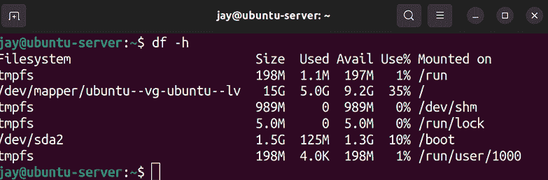
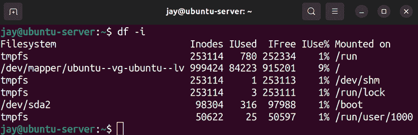
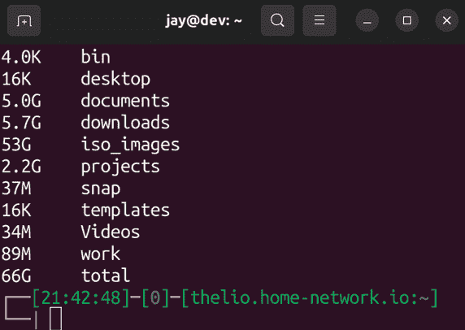
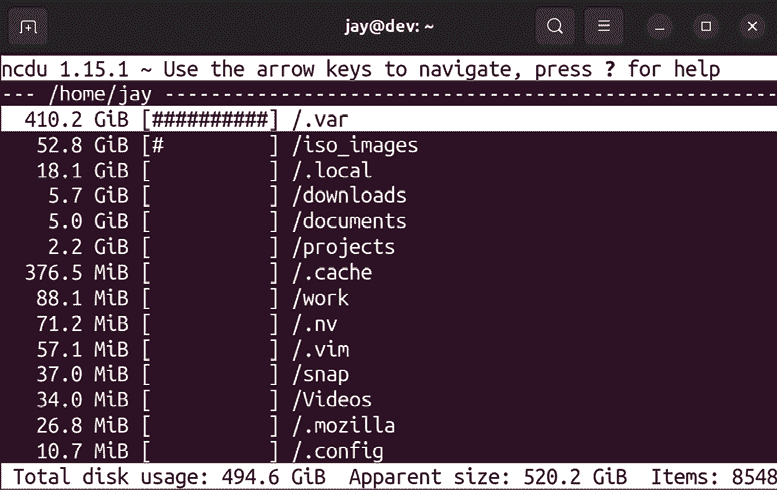
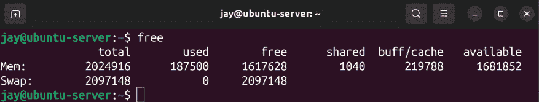
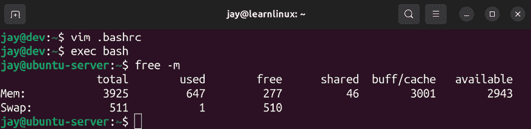
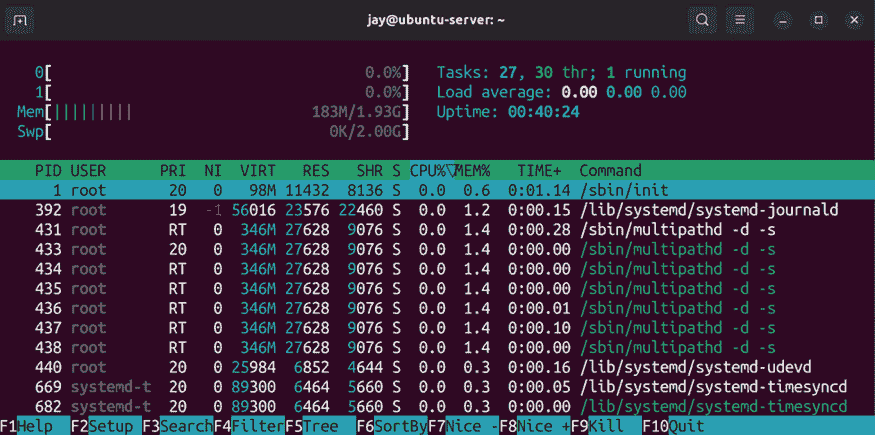
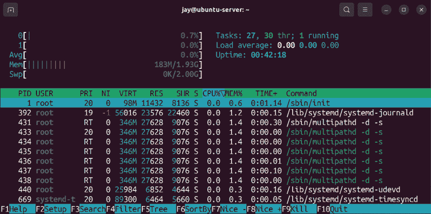
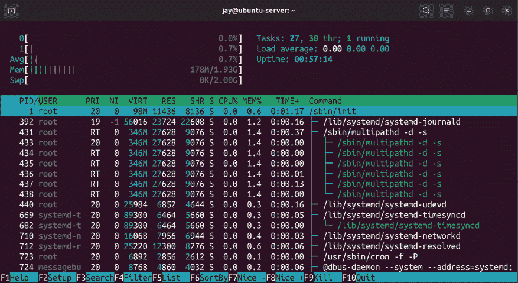

# 监控系统资源

在上一章中，我们学习了如何管理服务器上运行的任务。我们现在知道如何查看后台运行的任务，如何启用或禁用某个单元在启动时自动启动，以及如何安排任务在未来某个时间运行。但是，为了有效管理服务器执行的任务，我们还需要时刻关注系统资源。如果我们内存不足，磁盘已满，或者 CPU 过载，那么本来高效处理任务的服务器可能会突然停滞。在这一章中，我们将探讨这些资源及如何监控它们。

我们关于资源管理的讨论将包括：

+   查看磁盘使用情况

+   监控内存使用情况

+   理解负载平均值

+   使用 `htop` 查看资源使用情况

我们服务器上的一个非常重要的资源是存储，跟踪可用磁盘空间等内容至关重要——即使是你能购买到的最强大服务器，也无法在没有空闲磁盘空间的情况下正常运行。我们将在下一节中探讨一些监控磁盘使用情况的方法。

# 查看磁盘使用情况

时刻关注你的存储空间非常重要，因为没有人愿意在半夜接到电话，说服务器遇到了问题，尤其是那种本可以轻松避免的问题，例如文件系统空间即将满了。在 Linux 系统上管理存储很简单，一旦你掌握了相关工具，这一过程就会变得容易。接下来我将介绍一些在这一节中最有用的工具，特别是我们将看看如何回答“是什么占用了所有磁盘空间？”这个问题，这是处理磁盘使用情况时最常遇到的问题。

首先，让我们来看一下 `df` 命令。

## 使用 df

`df` 命令通常会是你在不知道哪个卷或挂载点即将满时的起点。执行它后，它会给出一个高层次的概述，因此在你想弄清楚是谁或什么占用了所有空间时，它不一定会非常有用。然而，当你只想列出所有挂载的卷，并查看每个卷剩余的空间时，`df` 是非常合适的。默认情况下，它会以字节为单位显示信息。不过，我发现使用 `df` 时加上 `-h` 选项更加方便，这样可以显示更具可读性的输出，读起来也更加轻松。试试看：

```
df -h 
```

这应该会生成类似以下内容的输出：



图 8.1：df -h 命令的输出

输出的结果会根据系统中与磁盘和挂载点相关联的类型有所不同。在截图中，你会看到根文件系统位于`/dev/mapper/ubuntu--vg-ubuntu--lv`。我们知道这一点是因为在“挂载点”这一列下，我们看到挂载点被设置为一个单一的正斜杠（`/`）。正如我们在*第四章*《*导航和基本命令*》中讨论的那样，这个单一的正斜杠表示文件系统的起始位置（也称为根文件系统）。在我的情况下，这是一个 LVM 卷，因此我们看到一个从`/dev/mapper`开始的长设备名称。现在不必担心 LVM，我们稍后会讨论这个话题。不过目前，记住单一的正斜杠指的是文件系统的起点，左侧的设备名称则指的是实际挂载在那里设备的名称。

实际设备名称因服务器不同而异，且也取决于你在安装过程中是否选择使用 LVM。除了从`/dev/mapper`开始的长路径外，你可能会看到设备名称如`/dev/sda1`、`/dev/xvda1`、`/dev/nvme0n1p1`或其他变种。设备名称是根据底层存储设备的硬件类型生成的，例如用于 NVME 硬盘的`/dev/nvme...`命名约定，标准 SATA 硬盘则使用`/dev/sdaN`，依此类推。

实际底层存储硬件的设备类型并不那么重要；真正重要的是你能够识别出哪个设备最有可能变满。在示例截图中，根文件系统使用了`35%`的可用空间。在这种情况下，我们并不担心空间会被用完。

如果你确实发现某个重要的存储卷已满或接近满，那么你就能确定需要关注哪个卷，接下来我们会探索更多方法，帮助你获取有关哪些内容占用了空间的更多信息。

然而，有时即使存储卷看似有足够的可用空间，它仍然可能被视为已满。这是因为在 Linux 系统中，存储的数据和数据的大小并不是唯一需要考虑的因素。我们还需要考虑 inode。

那么，inode 究竟是什么？为什么这种东西会导致磁盘被报告为已满，实际上它并没有满呢？可以将 inode 看作一种*数据库对象*，它包含了你存储的实际项目的元数据。存储在 inode 中的信息包括文件的所有者、权限、最后修改日期和类型（是目录还是文件）。尽管元数据有它的好处，但 inode 的问题在于，每个存储设备上可用的 inode 数量是有限的。如果一个存储设备达到 inode 限制，那么该磁盘仍然被视为已满，无法接受更多数据。

实际上，这种情况的症状是，像`df`这样的命令会显示磁盘有可用空间，但当你尝试将新文件保存到设备时，会看到一个错误，提示你无法保存，因为磁盘已满。如果你不了解 inode 的存在，那么这种情况可能会让人感到困惑。

尽管似乎有 inode 限制会给存储带来不便，实际上，存储卷上的 inode 限制通常非常高，并且很难达到。通常情况下，如果 inode 限制被触及，意味着服务器本身可能存在更大的问题，导致它达到这个限制。例如，可能是服务器存在问题，保存了比应有的更多文件，例如异常数量的日志文件或排队的电子邮件消息文件。

幸运的是，确定特定存储卷是否快用完 inode 非常简单——与其使用`df`命令的`-h`选项，不如改用`-i`选项。`-i`选项将显示 inode 计数，而不是基于大小的存储度量。为了帮助说明这一点，我会展示一些来自我服务器的输出，帮助你了解这是什么样子的：

```
df -i 
```

我系统上该命令的输出如下：



图 8.2：`df -i`命令的输出

在这个例子中，示例服务器上的根文件系统总共有`999424`个 inode，其中`84223`个已被使用，`915201`个是空闲的。在我的情况下，我有很多可用的 inode。不过，我建议你把`df -h`和`df -i`命令记住。不论你遇到的存储空间问题是与实际空间还是 inode 使用相关，使用这两个命令就能知道具体是哪个问题。

假设你有的存储快满了（或者已经满了），你该如何准确定位是哪个东西占用了所有空间呢？有一些额外的工具可以帮助你缩小范围。接下来我们就来探讨这一点。

## 深入了解磁盘使用情况

调查占用你磁盘空间的具体文件的下一步是找出哪些文件特别占用了这些空间。在这个阶段，你可以使用多种工具来进行调查。我要提到的第一个工具是`du`命令，它能够显示一个目录占用了多少空间。使用`du`命令对目录和子目录进行扫描将帮助你缩小问题范围。像`df`一样，我们也可以与`du`命令一起使用`-h`选项，以使输出更容易阅读。默认情况下，`du`会扫描当前 shell 附加的工作目录，并列出该目录中的每一项，显示每项所占用的总空间，并在最后给出总结。

`du`命令只能扫描调用该命令的用户有权限访问的目录。如果你以非 root 用户身份运行该命令，可能无法获取完整的信息。此外，当前工作目录中的文件和子目录越多，执行此命令的时间也会越长。如果你大致知道资源占用的地方在哪里，可以尝试`cd`进入文件系统树中更深的目录，缩小搜索范围，从而减少命令执行的时间。`du -h`的输出通常会比实际需要的更多，可能需要多个屏幕才能查看完。为了简化这一过程，我最喜欢的命令变体是：

```
du -hsc * 
```

基本上，你需要在尽可能接近问题所在的目录中运行`du -hsc *`。正如我们所知道的，`-h`选项会让输出结果更易读（基本上是以兆字节、千兆字节等形式呈现）。`-s`选项会提供一个总结，而`-c`则会显示当前工作目录中所使用的总空间。下面的截图显示了我电脑中的输出结果：



图 8.3：`du -hsc *`命令的示例输出

为了让这个示例更有趣，我从我的个人桌面上截图，但无论使用哪个设备，最终的命令和语法是一样的。如你所见，`du -hsc *`提供的信息是一个简洁的总结。从输出中，我们可以清楚地看到当前工作目录中的每个子目录占用了多少空间。例如，我的`projects`目录当前占用了 2.2GB 的空间，而 ISO 镜像文件占用了 53GB 的空间。

到这一步，我们已经知道当前工作目录顶部的哪些目录占用了最多的空间。但我们仍然需要缩小范围，查找这些目录中究竟是 *哪些* 项目在占用这些空间。为了深入分析，我们可以 `cd` 进入这些大目录中的任何一个，再次运行 `du` 命令。经过几次操作后，我们应该能够缩小到这些目录中最大的文件，并决定如何处理它们。也许我们可以清理不必要的文件，或者添加另一个磁盘。一旦知道了是什么占用了我们的空间，我们就可以决定如何处理。

在阅读到本书的这一部分时，你可能已经认为我有一种奇怪的习惯，总是喜欢把最好的留到最后。你猜对了。我想通过介绍我最喜欢的应用之一来结束这一节，那就是 **NCurses 磁盘使用情况** 工具（简称 `ncdu`）。`ncdu` 命令是那些经常处理磁盘空间问题的管理员学会喜爱和欣赏的工具之一。通过一次执行，这个命令不仅能给你提供占用空间的概览，还能让你在无需反复运行命令和手动浏览目录树的情况下，浏览并深入查看结果。你只需执行一次，然后可以导航结果，深入挖掘直到你需要的程度。

要使用 `ncdu`，你需要安装它，因为它默认不随 Ubuntu 提供：

```
sudo apt install ncdu 
```

安装完成后，只需在你选择的任何起始目录中执行 `ncdu`。完成后，只需按 *q* 键退出。像 `du` 一样，`ncdu` 只能扫描调用用户有权限访问的目录。你可能需要以 `root` 身份运行它，以获得准确的磁盘使用情况。

你可能想考虑在使用 `ncdu` 时添加 `-x` 选项。此选项会将扫描限制在当前文件系统内，这意味着它不会扫描网络挂载点或其他存储设备；它只会关注你开始扫描的设备。这可以避免你浪费时间扫描与问题无关的区域。

执行时，`ncdu` 将从其起始位置开始扫描每个目录。完成后，它会提供一个基于菜单的布局，允许你浏览结果：



图 8.4：`ncdu` 实时展示

再次说明，我从我的桌面截图中获取了这张图，截图的目录是在我的 `home` 目录中。`ncdu` 的作用是展示从当前目录开始的磁盘使用情况，并且它会按使用空间从高到低排列结果。在 `ncdu` 内部移动时，你可以通过键盘上的上下箭头来移动你的选择（长白色高亮显示）。

如果你在目录上按下*Enter*，`ncdu`将切换到显示该目录的摘要，你可以根据需要继续深入查看。实际上，你还可以按*d*删除项目和整个文件夹。因此，`ncdu`不仅允许你找出占用空间的内容，还允许你采取行动！

有时候，磁盘上占用空间的内容很明显，`ncdu`可能并不总是必要的。一般来说，你会通过`df -h`开始调查，查看哪个存储卷空间不足。然后，你进入该目录并执行另一个命令，如`du -hsc *`，以查看哪个目录占用了最多的空间。如果从`du`的输出中无法立即识别问题所在，那么可以考虑使用像`ncdu`这样的工具，进一步深入查找。

尽管监控存储至关重要，我们还需要时刻关注空闲内存。接下来，我们将看看如何监控我们服务器的内存。

# 内存使用情况监控

我经常忘记事情。即便车钥匙几乎总是就在我的口袋里，我也经常忘记它们在哪里。即使已经使用 Linux 超过 20 年，我还是经常忘记在需要时使用`sudo`命令。幸运的是，计算机的记忆比我强大，但如果我们不有效地管理它，我们服务器上的内存就像我忘记把刚洗完的衣服放进干衣机一样，毫无用处。

了解 Linux 如何管理内存实际上是一个相对复杂的话题，因为对于初学者来说，理解内存到底有多少是空闲的，可能会是一个难以克服的障碍。你会很快发现，一旦解释清楚，Linux 如何管理你服务器的内存其实是相当简单的。

## 了解服务器内存

为了监控我们服务器的内存使用情况，我们可以使用`free`命令，这个命令可以让我们查看在任何给定时刻内存的消耗情况。若不带任何选项地执行`free`命令，输出将以千字节为单位显示：



图 8.5：`free`命令的输出结果

我最喜欢的这个命令的变种是`free -m`，它以兆字节为单位显示内存的使用量。你也可以使用`free g`以吉字节为单位显示输出，但在大多数服务器上，输出的精度不足。依我看，添加`-m`选项能让`free`命令的输出更易于阅读：



图 8.6：`free -m`命令的输出结果

由于一切都以兆字节为单位显示，对我来说，阅读起来要容易得多。

刚开始看，可能会觉得这个服务器只有`277` MB 的空闲内存。你会在第一行和第三列的`free`下看到这个数值。实际上，你真正需要关注的数字是`available`列下的数字，这里是`2943` MB。那才是实际可用的内存。因为这个服务器总共有`3925` MB 的 RAM（你会在第一行的`total`下看到），这意味着大部分内存是空闲的，这台服务器其实并没有在高负荷运行。

若要真正理解这些数字，需要一些额外的解释。你完全可以在此时停止阅读这一部分，只要记住`available`列表示的是应用程序可以使用的空闲内存量即可。不过，事情并没有那么简单。

从技术上讲，当你查看我的输出时，服务器实际上只有`277` MB 的空闲内存。`available`列下列出的内存量实际上是被系统用作缓存的，但如果任何应用程序需要它，它将被释放。如果一个应用程序启动并需要较大内存来运行，内核会从这个缓存中提供一些内存。

Linux 与大多数现代系统一样，遵循“未使用的 RAM 就是浪费的 RAM”这一理念。未被任何进程使用的 RAM 会分配给所谓的**文件系统缓存**，用于提高服务器的运行效率。当数据需要写入存储设备时，并不会直接立即写入。相反，这些数据会先写入文件系统缓存（一个预留的 RAM 部分），然后在后台同步到存储设备。这样做使得服务器更高效的原因在于，存储在 RAM 中的数据相较于从硬盘读取，要写入和读取得更快。应用程序和服务可以在后台同步数据到硬盘，而不需要你等待。此外，这个缓存也适用于读取数据，比如当你第一次打开一个文件时，它的内容会被缓存。如果你再次读取该文件，系统会从 RAM 中获取，而不是每次都从存储设备加载。若你刚保存了一个新文件并立即访问它，很可能它仍然在缓存中，会从缓存中提取，而不是直接从硬盘读取。

为了理解*图 8.6*中显示的所有列，我将在下表中列出每列的含义：

| **列** | **含义** |
| --- | --- |
| `total` | 服务器上安装的总内存量。 |
| `used` | 使用的内存（来自任何来源）。计算方法如下：*used = total - free - buffers/cache*。 |
| `free` | 没有被任何东西使用的内存，无论是缓存还是其他。 |
| `shared` | `tmpfs`以及其他共享资源使用的内存。 |
| `buff`/`cache` | 用于缓冲区和缓存的内存量。 |
| `available` | 应用程序可以使用的空闲内存。 |

您可能已经注意到在 *图 8.6* 中，还列出了一个名为 `swap` 的资源的内存使用情况。我们也来看看这个。我们将专门为它保留下一节，以确保我们理解它是什么，以及它对我们有什么作用。

## 管理 `swap`

`swap` 是我们从不想要使用的东西之一，但总是希望确保它是可用的。这有点像汽车保险，没有人会为购买它感到兴奋，但如果发生不好的事情，我们确实希望有它。甚至在管理员之间，关于 `swap` 在今天是否仍然相关还存在一些争论。无论别人怎么说，它绝对是相关的，因为它就像一种安全网。（而且现在磁盘空间更便宜了，所以将一些存储空间专门用于这项任务真的不是什么大问题，所以我们也可以这样做。）

那么它是什么？ `swap` 基本上是一个在服务器内存饱和时充当 RAM 的分区或文件。如果我们正确管理服务器，希望永远不需要它，因为 `swap` 存储在硬盘上，比 RAM 慢几个数量级。但是，如果服务器出现问题，内存使用量飙升，`swap` 可能会防止服务器崩溃。当内存满时，**内存不足杀手**（OOM Killer）也可能自动激活，以终止使用大部分内存的行为不端进程，但我们尽可能不希望依赖它，而是确保有足够的 `swap` 以防内存耗尽。

在 Ubuntu 中，默认实现 `swap` 的方式是通过一个 `swap` 文件。在早期版本的 Ubuntu（具体来说是 16.04 及之前的版本），它是通过一个 `swap` 分区实现的。事实上，如果你有一个已经升级到 Ubuntu 22.04 的现有服务器，并且它在旧版 Ubuntu 上启动过，你可能仍然有一个 `swap` 分区，即使你正在运行最新的发布版。在 16.04 之后进行的新安装的 Ubuntu 将使用 `swap` 文件。

使用 `swap` 文件比使用 `swap` 分区好吗？我会说是的，它更受欢迎 - 尽管在性能方面你不会注意到任何差异。无论在服务器上 `swap` 是以 `swap` 文件还是分区的形式，它都不改变 `swap` 使用硬盘且比 RAM 慢的事实。与 `swap` 分区相比，`swap` 文件的一个好处是，它比 `swap` 分区更容易扩展或收缩。

总之，考虑到 `swap` 文件是未来首选的方法（并且是新的默认设置），我不会再覆盖创建 `swap` 分区的过程，因为没有必要再这样做了。

你的服务器的`swap`文件在`/etc/fstab`文件中声明（我们将在*第九章*，*管理存储卷*中更详细地讨论`/etc/fstab`文件）。在大多数情况下，你在安装过程中已经为你创建了`swap`文件。当然，如果出于某种原因你没有`swap`文件，你可以稍后添加一个。在一些云实例提供商的情况下，默认情况下你可能不会获得`swap`文件。在这种情况下，你需要自己创建一个`swap`文件（我们将在本节稍后讨论这个过程），然后使用`swapon`命令来激活它：

```
sudo swapon -a 
```

当运行`swapon -a`命令时，它会在`/etc/fstab`中找到你的`swap`文件（如果那里列出了它），挂载并激活它供使用。这个命令的反向操作是`swapoff -a`，它会停用你的`swap`文件。除非你计划删除`swap`文件并创建一个更大的文件，否则通常不需要禁用`swap`。如果你发现服务器的`swap`不足，可能需要采取这种操作。

虽然有`swap`通常是一个好主意，但实际上有些应用程序更倾向于服务器完全没有`swap`。没有`swap`并不是一个常见的要求，但 Kubernetes 就是一个可能需要完全禁用`swap`的情况的好例子。事实上，如果你启用了`swap`，Kubernetes 的安装过程可能会报错（或者可能会失败）。对于 Kubernetes 集群来说，集群内的每个单独服务器本身就是一个特殊的情况，每个服务器都专门用于运行容器（这正是 Kubernetes 的功能；更多内容将在*第十八章*，*容器编排*中介绍）。

当你检查空闲内存时（提示：执行`free -m`），无论你是否有`swap`，都会看到`swap`被列出，但当`swap`被停用时，你会看到所有大小总计为零。

那么，如果你希望使用`swap`并且当前没有`swap`文件，应该如何创建一个呢？首先，你需要创建一个实际的文件来用作`swap`。它可以存储在任何地方，但通常`/swapfile`是理想的选择。你可以使用`fallocate`命令来创建这个实际的文件。`fallocate`命令会强制文件为特定大小：

```
sudo fallocate -l 4G /swapfile 
```

在这里，我正在创建一个 4 GB 的`swap`文件，但你可以根据需要设置任何大小，以满足你的需求。接下来，我们需要准备这个文件以便用作`swap`。首先，我们需要修复文件的权限，因为我们需要这个文件比大多数文件更具限制性：

```
sudo chmod 0600 /swapfile 
```

然后，我们可以使用`mkswap`命令将此文件转换为实际的`swap`文件：

```
sudo mkswap /swapfile 
```

现在，我们已经在根文件系统上存储了一个方便的`swap`文件。接下来，我们需要挂载它。像往常一样，推荐将其添加到`/etc/fstab`文件中。以下是一个示例条目：

```
/swapfile   none   swap   sw   0 0 
```

从这一点开始，我们可以通过之前提到的`swapon`命令来激活新的`swap`文件：

```
sudo swapon -a 
```

运行该命令后，`swap`文件应该已激活并正在使用。您可以通过运行`free -m`命令，查看是否列出了`swap`文件，并且其大小大于 0 来验证这一点。尽管我真心希望您不需要使用`swap`，但根据我的经验，这只是时间问题。了解在需要时如何添加并激活`swap`绝对是一个好习惯，不过大多数情况下，您应该没问题，因为在大多数平台上，首次安装 Ubuntu 时，`swap`会自动创建。如果您出于某种原因需要手动创建`swap`，我总是建议在服务器上至少设置 2GB，或者根据您的使用情况适当增加。

您应当密切关注`swap`的使用情况。当内存开始接近满时，服务器会开始使用`swap`文件。即使大部分 RAM 空闲，`swap`也会被部分使用，这很正常。但如果大量`swap`被使用，就应该调查一下（可能某个进程使用了比平常更多的内存）。

实际上，您可以控制服务器何时开始使用`swap`。Linux 服务器使用`swap`的频率被称为其`swappiness`。默认情况下，Linux 服务器的`swappiness`值通常设置为`60`。您可以通过以下命令验证这一点：

```
cat /proc/sys/vm/swappiness 
```

`swappiness`值越高，服务器越有可能使用`swap`。如果将`swappiness`值设置为`100`，服务器会更频繁地使用`swap`；如果将其设置为`0`，则会很少使用`swap`。该值大致与使用的 RAM 百分比相关。

要实时更改此值，您可以执行以下命令：

```
sudo sysctl vm.swappiness=30 
```

执行该命令后，`swappiness`值的更改将立即生效。然而，一旦重启服务器，该值将恢复默认。为了使更改保持生效，请使用您选择的文本编辑器打开以下文件：

```
/etc/sysctl.conf 
```

在该文件中，通常不会默认包含与`swappiness`对应的行，但您可以手动添加。为此，请在文件末尾添加类似以下内容的行并保存：

```
vm.swappiness = 30 
```

更改此值是性能调优领域中的多种技术之一。虽然默认值`60`对大多数情况可能足够，但可能会遇到运行性能密集型应用程序的情况，在这种情况下，您无法承受过度使用`swap`。在这种情况下，您可以尝试不同的`swappiness`值，并在性能测试中使用最适合的值。

在下一部分中，我们将关注另一个重要的指标：负载平均值。负载平均值可以帮助我们了解 CPU 的忙碌程度，从而更好地判断何时服务器过载，可能需要采取措施。

# 理解负载平均值

另一个在监控性能时需要理解的非常重要的话题是**负载平均值**，它是一系列数字，表示服务器在特定时间段内 CPU 使用率的趋势。你可能已经见过这些数字，因为负载平均值会出现在多个地方。例如，如果你运行`htop`工具，屏幕上会显示负载平均值。此外，如果你执行`uptime`命令，你也可以在该命令的输出中看到负载平均值。你还可以通过查看存储负载平均值的文本文件来查看它：

```
cat /proc/loadavg 
```

就个人而言，我习惯使用`uptime`命令来查看负载平均值。`uptime`命令的主要功能是显示服务器运行的时间，并且每次你关机或重启服务器时，时间会重置。但是，除了显示服务器开机的时长，`uptime`命令还会显示当前服务器的负载平均值。

理解负载平均值一开始可能有点困惑，但你很快就会意识到它并不像看起来那么复杂。负载平均值是一组三个数字，每个数字对应一个时间段。从左到右，这些数字分别对应 1 分钟、5 分钟和 15 分钟。一个典型的负载平均值可能是以下这样的：

```
0.36, 0.29, 0.31 
```

在这个例子中，我们在 1 分钟、5 分钟和 15 分钟的时间段内分别有`0.36`、`0.29`和`0.31`的负载平均值。特别地，每个数字表示在给定时间段内，有多少任务在等待 CPU 处理。因此，这些数字非常理想。服务器并不繁忙，因为几乎没有任务在任何时刻等待 CPU（每个数字都小于 1）。这与诸如总体 CPU 使用百分比之类的指标不同，你可能在其他平台的任务管理器中见过，甚至在像`htop`这样的 Linux 工具中也能看到。虽然查看 CPU 使用百分比可能有用，但问题在于，CPU 使用率会不断从高使用率变到低使用率，你可以通过运行`htop`一段时间来亲自观察。当任务进行某种处理时，你可能会看到 CPU 核心使用率飙升到 100％，然后迅速下降到较低的数字。然而，这并不能告诉你太多。而负载平均值则展示了在三个给定时间段内的使用趋势，这在判断服务器的 CPU 是否高效运行或是否因无法处理的工作负载而陷入困境时更加准确。

然而，主要的问题是，你应该在什么时候开始担心，这实际上取决于你服务器上安装了什么样的 CPU。你的服务器将有一个或多个 CPU，每个 CPU 都有一个或多个核心。对于 Linux 系统来说，这些核心无论是物理的还是虚拟的，都是一样的（即 CPU）。在我的案例中，我之前输出数据的机器有一个四核的 CPU。

你服务器上的 CPU 越多，它在任何给定时间能够处理的任务就越多，这也意味着它能够处理更高的负载平均值。

当某个时间段的负载平均值等于系统上的 CPU 数量时，这意味着你的服务器达到了 100% 的容量。它正在处理的任务数与它能够处理的任务数相等。例如，如果你有一个 8 核的 CPU，而负载平均值在某个时间段是 8，那么 CPU 在该时间段内就是 100% 满负荷运行的。如果你的负载平均值持续高于可用核心数，那时你可能就需要关注这个情况。偶尔达到服务器满载是可以接受的，但如果一直处于满载状态，那就需要引起警惕了。

我不太愿意使用陈词滥调的例子来充分说明这个概念，但我忍不住，所以还是用了这个。Linux 服务器上的负载平均值就相当于超市的结账区。超市会有多个收银台开放，顾客可以在这里支付并完成购物。在我所在地区典型商店的经验中，你会看到大约 20 个收银台，但每次只有两个收银员在工作，不过在这个例子中，我们假设每个收银台都有一个收银员在操作。

每个收银员一次只能处理一个顾客。如果等待结账的顾客多于收银员，排队就会开始积压，顾客会感到沮丧。在有四个收银员且此时有四个顾客的情况下，收银员将达到最大承载量，但这并不是什么大问题，因为没有其他顾客在等候。可能会加剧这个问题的是某个顾客使用支票支付和/或使用几打优惠券，这样结账过程就会变得更加耗时（类似于资源密集型进程）。如果有四个收银员，而有六个顾客在等待，那就意味着有两个顾客超出了商店同时能够处理的数量。在这种情况下，商店的结账区域将超出容量。这基本上就是负载平均值的工作原理。每个收银员就是一个 CPU，每个顾客就是一个需要 CPU 时间的进程。

就像收银员一样，每个 CPU 一次只能处理一个任务，有些任务会占用 CPU 更长时间。如果任务的数量恰好和 CPU 数量一样，那就无需担心。但如果排队开始积压，我们可能需要调查是什么导致了这种延迟。为了控制局面，我们可以雇佣一个额外的收银员（增加一个 CPU），或者请一个不满的顾客离开（终止一个进程）。

让我们看一个其他的负载平均值示例：

```
1.87, 1.53, 1.22 
```

在这种情况下，我们不需要担心，因为我们的假设服务器有 4 个 CPU，而且在 1 分钟、5 分钟和 15 分钟的时间段内，没有任何一个 CPU 处于满负荷状态。即使负载始终高于 1，我们仍然有 CPU 资源剩余，所以这并不是什么大问题。如果我们拥有 AMD 的那些非常强大的 Threadripper CPU（可以包含大量的核心），那么这些数字就代表着*极其*低的负载。回到我们的超市比喻，前面例子中的负载平均值相当于有四个收银员在每一分钟内平均为几乎两名顾客提供服务。如果这台服务器只有一个 CPU，我们可能需要搞清楚是什么导致了队伍的积压。

虽然你可能理性地认为低负载平均值是件好事，但实际上，根据具体情况，它可能代表着一个非常大的问题。当我们部署服务器时，我们是为了完成某种工作。

无论这“工作”是托管一个应用程序，还是运行任务处理数据，我们的服务器需要在执行某些工作，否则我们就是在浪费钱。如果服务器的负载平均值下降到异常低的值，这可能意味着一个本应始终运行的服务已失败并退出。例如，如果你的数据库服务器的负载通常在 1.x 范围内，突然降到 0.x，这可能意味着你要么流量确实减少了，要么数据库服务器服务已经停止运行。这就是为什么总是建议为服务器制定基准，以便判断什么是正常的，什么不是。基准通常指的是资源使用情况。如果资源使用量显著高于或低于基准，这无论如何都是潜在的关注点。

总的来说，如果你还没有遇到过，作为 Linux 管理员，你会非常熟悉负载均值。它是你服务器利用情况的时间快照，帮助你理解服务器什么时候运行高效，什么时候出现问题。如果服务器无法应对你分配的工作负载，可能是时候考虑增加核心数（如果可以的话）或将工作负载分配到其他服务器上。在排查资源利用问题、规划升级或设计集群时，整个过程通常是从了解服务器的负载均值开始的，这样你可以为其指定的任务有效地规划基础设施。

现在我们已经讲解了需要监控的重要资源，以确保我们的服务器保持健康，让我们来看看一个有用的工具，它能让资源使用情况更加易于理解。

# 使用 htop 查看资源使用情况

想要查看服务器的整体性能时，没有什么比`htop`更好的工具了。虽然它通常不是默认安装的，但`htop`是我推荐每个人尽早安装的工具，因为它在查看服务器资源利用情况时是不可或缺的。事实上，它有如此的实用性，以至于我在本章的前面就已经多次提到过它，即便我们在本节才开始讨论它。它真的是一个很棒的工具。

如果你还没有安装`htop`，只需使用`apt`安装即可：

```
sudo apt install htop 
```

当你在终端提示符下运行`htop`时，你会看到`htop`应用程序的完整显示。在某些情况下，以`root`身份运行`htop`可能会更有利，因为这样你可以获得额外的选项，比如能够终止进程，尽管这并不是必需的：



图 8.7：运行 htop

在`htop`显示的顶部，你会看到每个核心的进度条（我截图时使用的服务器只有一个核心），以及内存和`swap`的进度条。此外，顶部还会显示你的`Uptime`、`Load average`和当前正在运行的`Tasks`数量。`htop`显示的下半部分会列出服务器上正在运行的进程，字段中会显示每个进程消耗的内存或 CPU，以及正在运行的命令、运行该命令的用户和其**进程 ID**（**PID**）。我们在*第七章*《控制和管理进程》中讨论过 PID。要滚动查看进程列表，你可以按*Page Up*或*Page Down*，或者使用箭头键。此外，`htop`还支持鼠标操作，你可以点击顶部的列标题来按该标准对进程列表进行排序。例如，如果你点击`MEM%`或`CPU%`，进程列表将按内存或 CPU 使用率排序。显示的内容会每 2 秒更新一次。

`htop` 工具也是可以定制的。例如，如果您更喜欢不同的颜色方案，可以按 *F2* 进入 **Setup mode**，然后在左侧导航到 **Colors**，选择六种提供的颜色方案之一。其他选项包括添加额外的计量表、增加或删除列等。对于多核服务器，我特别觉得有用的一个调整是能够添加一个 CPU 平均负载条。通常，`htop` 会显示服务器上每个核心的计量表，但如果您有多个核心，您可能也会对平均值感兴趣。为此，请再次进入 **Setup mode**（按 *F2*），然后在 **Meters** 高亮时，右箭头选择 **CPU average**，接着按 *F5* 将其添加到左侧列。您还可以添加其他计量表，如 **Load average**、**Battery** 等。

根据您的环境，功能键可能在终端程序中无法正常工作，例如 `htop`，因为这些键可能已被映射到其他功能。例如，*F10* 用于退出 `htop`，但如果 *F10* 被映射到终端仿真器中的某个功能，这可能不起作用，使用虚拟机解决方案（如 VirtualBox）也可能会导致某些键无法正常工作。您还可以通过鼠标导航 `htop`，即使是在 SSH 连接中。这也意味着，您可以点击右下角的 **Quit** 来退出应用程序。

这是一个配置了 CPU 平均负载计量表的 `htop` 示例：



图 8.8：添加了 CPU 平均负载计量表的 htop

打开 `htop` 后，您将看到系统中每个用户的进程列表。当您遇到不知道是哪个用户/进程导致极端负载的情况时，这种方式非常理想。不过，一个非常实用的技巧（如果您想查看特定用户）是按下 *u* 键，这将打开 **Show processes of:** 菜单。在此菜单中，您可以使用上下箭头键选择一个特定用户，并按 *Enter* 仅显示该用户的进程。这将大大缩小进程列表。

另一个有用的视图是 **树状视图**，它允许您查看按父子关系组织的进程列表，而不仅仅是一个平坦的列表。在实际操作中，进程通常是由另一个进程生成的。事实上，Linux 中的所有进程都是从至少一个其他进程派生出来的，而这个视图直接显示了这种关系。在您停止一个进程，但它会立即重新生成的情况下，您需要知道该进程的父进程，以便阻止它自我恢复。按 *F5* 将切换到树状视图模式，再次按 *F5* 将禁用树状视图。

启用树状视图后，`htop` 将显示如下：



图 8.9：启用树状视图的 htop

正如我提到的，`htop` 默认每 2 秒更新一次其统计信息。就个人而言，我觉得这个更新频率是可以接受的，但如果你想改变刷新速度，可以在调用 `htop` 时使用 `-d` 选项，然后设置刷新间隔（以十分之一秒为单位）。例如，要使 `htop` 每 7 秒更新一次，可以通过以下命令启动 `htop`：

```
htop -d 70 
```

要使用 `htop` 杀死一个进程，可以用上下箭头键选择你想要结束的进程，然后按 *F9*。会弹出一个新菜单，列出你可以通过 `htop` 发送给该进程的信号。如我们之前讨论过的，`SIGTERM` 将尝试优雅地终止该进程，而 `SIGKILL` 则会强制结束它。一旦选中你想发送的信号，按 *Enter* 发送，或者按 *Esc* 取消操作。

正如你所见，`htop` 非常有用，并且（在大多数情况下）已经取代了以前在许多管理员中流行的老旧 `top` 命令。`top` 命令在 Ubuntu 服务器中默认可用，值得一看，哪怕只是与 `htop` 做个比较。和 `htop` 一样，`top` 命令也会列出你服务器上正在运行的进程及其资源使用情况。虽然没有漂亮的仪表盘，且定制化较少，但 `top` 命令能完成相同的任务。然而，在大多数情况下，`htop` 可能是你未来的最佳选择。

# 总结

在本章中，我们学习了如何监控服务器的资源使用情况。我们首先了解了可以用来查看磁盘使用情况的命令，并学习了如何监控内存使用情况。我们还讨论了 `swap`，包括它是什么，为什么你需要它，以及如何在需要时手动创建 `swap` 文件。接着，我们看了负载平均值，并通过查看 `htop` 来结束本章，这是我最喜欢的一个工具，可以全方位查看服务器的资源使用情况。

在 *第九章*，*管理存储卷* 中，我们将深入探讨存储。在本章中，我们学习了如何查看使用情况，而在下一章中，我们将研究有关存储的更多高级概念，如格式化卷、添加额外的卷，甚至是 LVM。到时见！

# 相关视频

+   Linux 快速入门 – du 命令（LearnLinuxTV）：[`linux.video/du`](https://linux.video/du)

+   Linux 快速入门 – htop（LearnLinuxTV）：[`linux.video/htop`](https://linux.video/htop)

+   Linux 快速入门 – 负载平均值（LearnLinuxTV）：[`linux.video/loadavg`](https://linux.video/loadavg)

+   Linux 快速入门 – 理解内存使用情况（LearnLinuxTV）：[`linux.video/mem`](https://linux.video/mem)

+   精选 Linux 工具 - ncdu（LearnLinuxTV）：[`linux.video/ncdu`](https://linux.video/ncdu)

# 进一步阅读

+   Linux 吃掉了我的 RAM：[`learnlinux.link/ate-ram`](https://learnlinux.link/ate-ram)

# 加入我们的 Discord 社区

加入我们社区的 Discord 空间，与作者和其他读者进行讨论：

[`packt.link/LWaZ0`](https://packt.link/LWaZ0)


