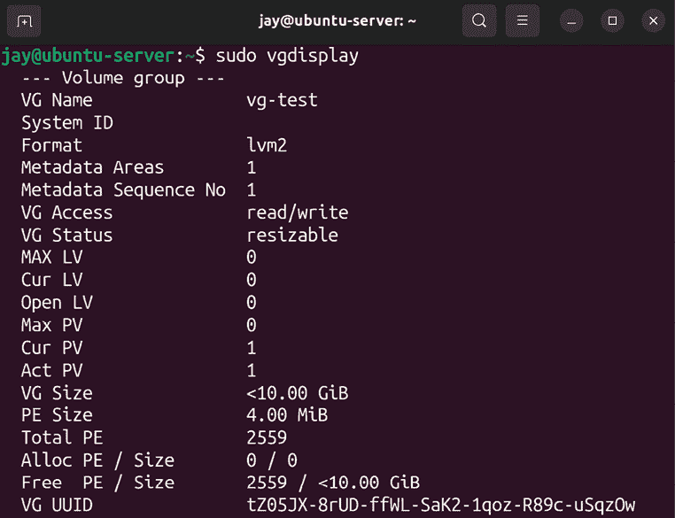

# 管理存储卷

在我们服务器的存储管理中，似乎永远也不够用。虽然硬盘的容量每年都在增长，而且大容量硬盘比以往更便宜，但我们的服务器很快就会消耗掉所有可用空间。作为服务器管理员，我们总是尽力为服务器选择充足的存储空间，但随着业务需求的变化，无论我们如何规划，一个成功的企业始终会需要更多的存储空间。在管理服务器的过程中，你很可能会遇到需要增加额外存储的情况。但存储管理不仅仅是每次磁盘满了就添加新磁盘。提前规划同样重要，像**逻辑卷管理器**（**LVM**）这样的技术，只要尽早使用，就能极大简化你的工作。

LVM 本身就是本章将要讨论的一个概念，它能为你提供更多的灵活性来管理服务器。我还将带你了解其他一些概念，这些概念在你管理服务器存储和卷时无疑会派上用场。具体来说，本讨论将包括：

+   将额外的存储卷添加到文件系统

+   格式化和分区存储设备

+   挂载和卸载存储卷

+   理解`/etc/fstab`文件

+   备份和恢复存储卷

+   使用 LVM

当你的服务器磁盘空间不足时，一个可能的解决方案是添加一个额外的存储卷。因此，本章的首要任务是探讨我们如何实现这一目标。

# 添加额外的存储卷

在某个时刻，你可能会遇到需要为服务器增加额外存储的情况。在物理服务器上，我们可以添加额外的硬盘；而在虚拟或云服务器上，我们可以添加额外的虚拟磁盘。无论是哪种情况，为了充分利用额外的存储，我们需要确定设备名称、格式化它并挂载。

在 LVM 的案例中（我们将在本章后面讨论），我们有机会扩展现有的卷，通常不需要重新启动服务器。但在添加新设备时，仍然有一个整体流程需要遵循。当你向系统添加额外存储时，应该问自己以下问题：

**你需要多少存储空间？** 如果你要添加一个虚拟磁盘，通常可以根据需要设定其大小，只要你在虚拟化平台的存储池中有足够的剩余空间。

**它连接后，设备名称是什么？** 当新磁盘连接到服务器时，系统会检测到并分配一个设备名称。在大多数情况下，会使用 `/dev/sda`、`/dev/sdb` 等命名方式。在其他情况下（如虚拟磁盘），命名可能不同，如 `/dev/vda`、`/dev/xda`，甚至其他名称。命名方案通常以字母结尾，每增加一个磁盘，字母就会递增。

**你希望如何格式化存储设备？** 在撰写本文时，ext4 文件系统是最常见的选择。然而，对于不同的工作负载，你可能需要考虑其他选项（例如 XFS）。如果不确定，使用 ext4 是比较稳妥的选择，但一定要了解其他选项，看看它们是否能带来对你使用案例的好处。ZFS 也是一个可以考虑的选项，尽管与其他选择相比，它相对较新。我们将在下一节中讨论格式化内容，*格式化和分区存储设备*。

对你来说这可能是常识，但文件系统这个词在 Linux 系统中有多重含义，具体取决于其上下文，这可能会让新手感到困惑。像我们这样的 Linux 管理员通常会用文件系统一词来讨论典型 Linux 系统中的文件和目录结构。然而，这个词也被用来描述如何格式化硬盘以供该发行版使用（例如，ext4 文件系统）。在本章中，我们将主要关注后者。

**你希望它挂载在哪里？** 新硬盘需要对系统和可能的用户可访问，因此你需要将其挂载（附加）到文件系统中的某个目录，以便你的用户或应用程序能够使用它。在本章中我们还将讨论的 LVM（逻辑卷管理），你可能希望将它附加到现有的存储组。你可以为新卷创建自己的目录，但我将在本章稍后讨论一些常见的位置。我们将在 *挂载和卸载卷* 部分中介绍挂载和卸载的过程。

让我们考虑一下前两个问题的答案。关于你应该增加多少空间，你需要研究你的应用程序或组织的需求，并找到一个合理的数量。对于物理硬盘，你基本上没有选择，除了决定购买哪种硬盘。对于虚拟硬盘，你可以更加节省，因为你可以添加一个小的硬盘来满足你的需求（以后可以随时增加更多）。

LVM 在虚拟硬盘上的主要优势是能够在不重启服务器的情况下扩展文件系统。例如，你可以从一个 30 GB 的卷开始，然后通过增加额外的 10 GB 虚拟硬盘来按 10 GB 的增量进行扩展。这种方法显然比一次性添加一个 200 GB 的卷要好，尤其是当你不确定这些空间是否都会被用到时。

LVM 也可以在物理服务器上使用，但通常还是需要重启，因为你需要打开机箱并物理连接硬盘。一些服务器支持热插拔，可以让你在不关闭服务器的情况下添加或移除物理硬盘，这是一个很大的优势。

接下来，可以使用`fdisk -l`命令找到设备名称。`fdisk`命令通常用于创建和删除分区，但它也能帮助我们确定新磁盘获得的设备名称。使用`fdisk -l`命令将显示相关信息，但你需要以`root`身份运行，或者使用`sudo`：

```
sudo fdisk -l 
```

执行此命令会产生类似于以下的输出：


图 9.1：`fdisk -l`命令的输出

我总是建议在连接新设备之前和之后都运行`fdisk -l`。这样，哪个设备名称代表新设备就会更加明显。

另一个技巧是使用以下命令，该命令会随着你添加磁盘而自动更新输出：

```
dmesg --follow 
```

只需启动命令，连接磁盘，观察输出。当完成时，按*Ctrl* + *c*键返回命令提示符。

你还可以通过`lsblk`命令找到新磁盘的设备名称。`lsblk`的好处是你不需要`root`权限，且它返回的信息是简化版的：


图 9.2：`lsblk`命令的输出

在一台典型的服务器上，第一个磁盘（基本上就是你安装了 Ubuntu Server 的磁盘）将被命名为`/dev/sda`，而额外的磁盘将被分配下一个可用的名称，例如`/dev/sdb`、`/dev/sdc`，以此类推（具体取决于你使用的硬盘类型）。如今，**非易失性内存快速接口**（**NVMe**）硬盘越来越常见，因此你可能会看到类似`/dev/nvme0n1`的设备名称。你还需要知道分区编号。磁盘的设备名称后面会有数字，表示单独的分区。例如，`/dev/sda`的第一个分区将被命名为`/dev/sda1`，而`/dev/sdc`的第二个分区将被命名为`/dev/sdc2`。这些数字是递增的，通常很容易预测。正如我之前提到的，你的设备命名规则可能会因服务器而异，尤其是当你使用**独立磁盘冗余阵列**（**RAID**）控制器或虚拟化主机（如 VMware 或 XenServer）时。如果你尚未在新磁盘上创建分区，你将不会看到名称末尾的任何分区编号。

现在，你已经添加并命名了一个额外的存储卷，我们可以继续进行设置过程。我们需要决定将其挂载到哪里，以及它的用途是什么。但在我们能够挂载存储设备之前，我们需要先在它上面创建至少一个分区，然后再对其进行格式化。我们将在下一节中处理这两个步骤。

# 格式化和分区存储设备

一旦你安装了物理磁盘或虚拟磁盘，你就能充分利用额外的存储空间。但为了使用磁盘，必须先对其进行格式化。为了确保我们格式化的是正确的磁盘，我们需要找到该设备的名称。正如你从上一节中了解到的，Linux 发行版使用特定的命名规则来命名磁盘。所以你应该已经知道新磁盘的设备名称。正如前面所解释的，你可以使用 `sudo fdisk -l` 命令来查看服务器上连接的存储设备的详细信息：

```
sudo fdisk –l 
```

这将产生类似以下内容的输出：


图 9.3：使用 fdisk -l 查看服务器上的存储设备列表

在我的情况下，设备 `/dev/sdb` 是全新的——我刚刚将其添加到服务器中。由于我在本章中使用的是虚拟机示例，新的磁盘显示为 `QEMU HARDDISK` 型号。目前它没有任何分区；注意我们在它上方看到了一些与不同硬盘和分区相关的行，比如 `/dev/sda3`。而在 `/dev/sdb` 的描述下方没有类似的行。如果我们在该设备上有一个或多个分区，它们将会显示在输出中。

此时，我们已经知道哪个存储设备是新的——毫无疑问，在上一个示例中，它是 `/dev/sdb`。我们始终需要确保不要尝试格式化或重新分区错误的设备，否则可能会丢失数据。在这种情况下，我们可以看到 `/dev/sdb` 没有分区（而且在我添加它之前，这个卷并不存在），所以很明显我们要操作的磁盘是哪一个。现在我们可以在其上创建一个或多个分区，继续准备它以供使用。

## 创建分区

要在该设备上创建实际的分区，我们将使用带 `sudo` 的 `fdisk` 命令，并将设备的名称作为选项。在我的例子中，我将执行以下操作来处理磁盘 `/dev/sdb`：

```
sudo fdisk /dev/sdb 
```

请注意，我在这里没有包括分区编号，因为 `fdisk` 是直接与磁盘交互的（而且我们还没有创建任何分区）。在本节中，我假设你有一个尚未分区的磁盘，或者你愿意清除的磁盘。当正确执行时，`fdisk` 会显示一条介绍信息并给出一个提示符：


图 9.4：fdisk 的主提示符

此时，你可以按下键盘上的 *m* 键来查看可以执行的命令菜单。在这个示例中，我将带你完成第一次设置新磁盘所需的命令。

我相信这不言而喻，但请注意 `fdisk` 可能带来的破坏性后果。如果你在错误的磁盘上运行 `fdisk`，可能会导致无法恢复的数据丢失。管理员通常会将像 `fdisk` 这样的工具熟记到一定程度，以至于它们的使用变成了肌肉记忆。但总是要花时间确保你正在对正确的磁盘运行这些命令。

在继续创建新分区之前，需要对**主引导记录**（**MBR**）和**GUID 分区表**（**GPT**）分区表进行一些讨论。在新硬盘上创建分区表时，你可以选择使用 MBR 或 GPT 分区表。GPT 是较新的标准，而 MBR 已经存在很长时间了，如果你长时间从事服务器工作，可能一直在使用 MBR。

你可能会看到 MBR 被称为 DOS，这是指较旧的分区结构。正如你可能已经知道的，**DOS**是**磁盘操作系统**（**Disk Operating System**）的缩写，但在本章节中我们并不是在指这个操作系统，而是指 IBM 几十年前提出的分区结构。例如，在使用`fdisk`时，它会将 MBR 分区结构称为 DOS。在本章节中，我们会尽可能使用 MBR 来指代较旧的分区样式，以避免混淆。

使用 MBR 分区表时，你需要考虑一些限制。首先，MBR 只允许你创建最多四个主分区。此外，它还将你限制在大约 2 TB 的磁盘容量内。如果你的磁盘容量是 2 TB 或更小，这不会成为问题。然而，大于 2 TB 的硬盘越来越常见。

另一方面，GPT 没有 2 TB 的限制，所以如果你有一个非常大的硬盘，那么 MBR 和 GPT 之间的选择几乎已经为你决定好了。此外，GPT 没有最多四个主分区的限制，因为使用 GPT 分区表的`fdisk`可以创建最多 128 个主分区。毫无疑问，GPT 正迅速成为新的标准！GPT 成为默认分区表只是时间问题，所以除非你有充分的理由，否则我推荐如果有选择的话使用 GPT。

当你第一次进入`fdisk`提示符时，你可以按*o*来创建 MBR 风格的分区布局，或者按*g*来创建更新的 GPT 风格的分区布局。正如我之前提到的，这是一个可能破坏性很大的过程，所以请确保你正在对正确的硬盘使用这个工具！确保按下与你选择的分区风格相对应的键，然后按*Enter*，这样我们就可以继续了。一旦你按下*g*或*o*，你应该会看到一条确认信息，表示你已创建了一个新的分区表。

接下来，在你做出选择并创建了 MBR 或 GPT 分区表之后，我们就可以继续了。然后，在`fdisk`提示符下，输入*n*，告诉`fdisk`你想要创建一个新分区。接着，你会被问到是否想要创建主分区或扩展分区（如果你选择了 MBR）。使用 MBR 时，你会想选择主分区作为第一个分区，然后可以使用扩展分区来创建更多的分区。如果你选择了 GPT，这个提示不会出现，因为它会将你的分区创建为主分区。

接下来出现的提示会要求你输入分区号，默认选择下一个可用的编号。按*Enter*接受默认值。随后，你将被要求输入分区的第一个扇区（按*Enter*接受默认值`2,048`），然后下一个提示会询问你要使用的最后一个扇区。如果你按*Enter*接受默认的最后一个扇区，分区将包含设备上剩余的所有空闲空间。如果你希望创建多个分区，可以在最后一个扇区提示时不接受默认值。你可以通过输入*+*符号后跟要使用的兆字节或吉比字节的数字，并且在数字后加上`M`表示兆字节，或者加上`G`表示吉比字节，来明确新分区的大小。例如，你可以输入`+20G`来创建一个 20 GiB 的分区。注意，`+`符号后面没有空格，`20`和`G`之间也没有空格。

此时，你将返回到`fdisk`提示符。要保存更改并退出`fdisk`，按下*w*然后按*Enter*。现在，如果你以`root`身份运行`fdisk -l`命令，你应该会看到你创建的新分区。以下是我某台服务器上`fdisk`命令的示例输出，给你一个完整过程的概念：


图 9.5：`fdisk`命令的示例运行

如果你犯了错误或者想要重新调整分区布局，你可以再次进入`fdisk`提示符，然后按*g*创建一个新的 GPT 布局，或者按*o*创建一个新的 MBR 布局。然后，重新按照步骤分区你的磁盘。可以多次练习，直到熟练掌握这个过程。

## 格式化分区

在你为新磁盘创建好分区布局并且满意后，你就可以开始格式化它了。现在我已经在新磁盘上创建了一个分区布局，运行`sudo fdisk -l`的输出将有所不同：


图 9.6：创建分区后运行`sudo fdisk -l`的另一个示例

请注意，现在我们添加了分区`/dev/sdb1`，它可以在输出中看到。接下来，我们可以继续格式化它。为此，我们使用`mkfs`命令。此命令需要特定的语法，输入`mkfs`后跟一个句点（`.`），然后输入你希望将目标格式化为的文件系统类型。以下示例将`/dev/sdb1`格式化为 ext4：

```
sudo mkfs.ext4 /dev/sdb1 
```

你的输出将与以下截图中的内容类似：


图 9.7：使用 ext4 文件系统格式化卷

如果你选择了其他文件系统类型而不是 ext4，你可以在使用`mkfs`时替换为所选文件系统类型。以下示例将创建一个 XFS 文件系统：

```
sudo mkfs.xfs /dev/sdb1 
```

一些文件系统，例如 XFS，默认不被支持，可能需要安装额外的软件包才能使用它们。以 XFS 为例，需要安装`xfsprogs`软件包。

现在，我们已经创建了一个或多个分区并格式化了它们，我们准备在服务器上挂载新创建的分区。在接下来的部分中，我将带你逐步了解如何挂载和卸载存储卷。

# 挂载与卸载卷

现在你已经为服务器添加了一个新的存储卷并格式化了它，你可以挂载这个新设备，以便开始使用它。为此，我们使用`mount`命令。这个命令允许你将一个存储设备（甚至是一个网络共享）附加到服务器上的本地目录。在挂载之前，目录必须是空的。`mount`命令，稍后我们将通过一个示例进行实践，基本上只需要你指定一个位置（目录）来挂载设备。但我们该将卷挂载到哪里呢？

通常，在你的 Ubuntu Server 安装中，默认会创建两个目录，用于挂载卷：`/mnt` 和 `/media`。虽然没有硬性规定媒体必须挂载到哪里，但这两个目录是**文件系统层次结构标准**（**FHS**）的一部分，FHS 在《第四章，导航和基本命令》中已经提到过。`/mnt` 和 `/media` 目录的目的在这个规范中已有定义。FHS 定义 `/mnt` 为暂时挂载文件系统的挂载点，而 `/media` 则是可移动媒体的挂载点。

简单来说，这意味着 `/mnt` 的预定用途是存放你通常大部分时间都挂载的存储卷，例如额外的硬盘、虚拟硬盘和网络附加存储。FHS 文档在描述 `/mnt` 时使用了“暂时”的术语，但实际上，这通常是你期望会存在一段时间的挂载位置。至于 `/media`，FHS 基本上是在指示可移动媒体（如闪存驱动器、CD-ROM 媒体、外部硬盘等）应当挂载在这里。

然而，重要的是要指出，FHS 所指示的挂载额外卷的位置只是一个建议。（也许是一个强烈的建议，但毕竟只是建议。）没有人会强迫你遵循它，世界的命运也不取决于你的选择。使用`mount`命令，你可以将额外的存储挂载到任何没有挂载或没有文件的地方。你甚至可以创建一个目录 `/kittens` 并在那里挂载你的磁盘，除了同事们的几声笑声，你不会遭遇任何后果。

通常，组织会自行制定额外磁盘挂载的位置方案。尽管我个人遵循 FHS 标准，但我曾在过去与一家公司合作时，遇到过一个自定义布局的例子。该公司在其服务器上使用了`/store`目录来挂载存储，这是他们在每台服务器上自行创建的目录。你使用什么样的方案由你决定；我唯一的建议是尽可能在不同服务器之间保持一致，至少为了保持理智。

`mount`命令通常需要以`root`身份执行。虽然有办法绕过这一点（你可以允许普通用户挂载卷，但我们暂时不讨论这个问题），通常情况下，只有`root`用户才能或应该挂载卷。正如我所提到的，你需要一个地方来挂载这些卷，因此，为了方便操作，我们可以使用以下命令创建一个名为`/mnt/vol1`的目录：

```
sudo mkdir /mnt/vol1 
```

当你创建了一个目录（就像我这样做的）或决定使用一个现有目录后，你可以使用类似下面的命令来挂载一个卷：

```
sudo mount /dev/sdb1 /mnt/vol1 
```

在这个例子中，我将设备`/dev/sdb1`挂载到目录`/mnt/vol1`。

当然，你需要调整命令，以引用你想要挂载的设备和你想要挂载的位置。提醒一下，如果你不记得服务器上有哪些设备，可以使用`fdisk –l`列出它们。

通常，`mount`命令要求你指定一个`-t`选项，后面跟着指定的类型。在我的情况下，如果我使用了`-t`选项，那么`mount`命令应该是以下内容，因为我的磁盘格式化为`ext4`：

```
sudo mount /dev/sdb1 -t ext4 /mnt/vol1 
```

一个有用的技巧是在挂载设备之前和之后执行`df –h`命令。

虽然这个命令通常用于检查不同挂载点的可用空间，但它会显示挂载的设备列表，因此你可以在挂载设备后对比结果，确认设备是否已挂载。

在这个例子中，我使用了`-t`选项，并指定了我格式化该设备时使用的文件系统类型。在第一个例子中，我没有使用这个选项。这是因为，在大多数情况下，`mount`命令能够自动识别设备使用的文件系统类型并相应调整。因此，大多数情况下，你不需要使用`-t`选项。过去，你几乎总是需要它，但现在操作起来更简单了。我之所以提到这一点，是因为如果你在尝试挂载文件系统时遇到错误，提示无效的文件系统类型，你可能需要指定这个选项。可以查看`mount`命令的手册页，了解更多关于不同选项的信息。

当你使用完一个卷后，可以使用`umount`命令卸载它（单词*unmount*中缺失的*n*是故意的）：

```
sudo umount /mnt/vol1 
```

`umount`命令也需要以`root`身份或通过`sudo`运行，它可以让你将存储设备从文件系统中断开。为了确保此命令成功执行，卷不能正在被使用。如果正在使用，你可能会收到设备或资源忙碌的错误消息。如果你在卸载后执行`df -h`，你应该会看到文件系统不再出现在输出中，意味着它已经不再挂载。

手动挂载设备的缺点是，它们在下次服务器启动时不会自动重新挂载。为了确保挂载点在每次服务器启动时都可用，你需要编辑`/etc/fstab`文件，接下来我会引导你完成这个步骤。

# 理解/etc/fstab 文件

`/etc/fstab`文件是你 Linux 系统中的一个非常关键的文件。你可以编辑此文件，列出你希望在启动时自动挂载的其他卷。然而，这个文件的主要作用也是挂载你的主文件系统，所以如果在编辑时出错，可能会导致服务器无法启动（完全无法启动）。一定要小心。

## 分析/etc/fstab 文件的内容

当你的系统启动时，它会查看`/etc/fstab`文件以确定根文件系统的位置。此外，`swap`区域的位置也会从这个文件中读取，并在启动时挂载。系统还会读取此文件中列出的其他挂载点，一行一个，并进行挂载。基本上，几乎所有你能想到的存储都可以添加到这个文件中并自动挂载。即使是来自 Windows 服务器的网络共享也可以在这里添加。它不会对你评判（除非你打错字）。

作为示例，以下是我某台机器上`/etc/fstab`文件的内容：


图 9.8：查看/etc/fstab 文件的内容

当你安装 Ubuntu Server 时，`/etc/fstab`文件会为你创建，并为安装过程中创建的每个分区添加一行。在我用于获取示例`fstab`内容的服务器上，只有一个根文件系统分区，你还可以看到 swap 文件的位置。

每个分区通常使用**通用唯一标识符**（**UUID**）来标识，而不是你可能更习惯的`/dev/sdaX`命名约定，尤其是当你以前处理过存储设备时。在我的输出中，你可以看到 UUID `dm-uuid-LVM-H8VEs7qDbMgv...`，它指的是我的根文件系统，你还可以看到我有一个位于`/swap.img`的`swap`文件。

UUID 的概念已经存在了一段时间，但并没有任何限制阻止你用实际的分区名称（例如`/dev/sda1`或类似的名称）替换 UUID。如果你这么做，服务器依然会启动，你可能不会注意到什么不同（前提是没有打错字）。

现在，由于设备的名称可能会根据设备的物理位置（例如硬盘插入了哪个**串行高级技术附件**（**SATA**）端口，外部硬盘连接到哪个 USB 端口，等等）或它们的排序（虚拟磁盘的情况）而发生变化，因此 UUID 比常见的设备名称更受青睐。

再加上可移动媒体可以随时插入或移除的事实，你会遇到一种情况：你无法确定每个设备在任何时刻会被分配什么名称。例如，现在你的外部硬盘可能被命名为`/dev/sdb1`，但下次挂载时，如果你连接的其他设备占用了`/dev/sdb1`这个名称，它可能就不再是这个名字。这时 UUID 的概念就非常有用了。设备的 UUID 不会因为你重新排列硬盘顺序而改变（但如果重新格式化卷，它会改变）。如*图 9.8*所示，你可以使用`blkid`命令轻松列出卷的 UUID：

```
blkid 
```

输出将显示附加到你系统上的每个设备的 UUID，你可以在每次向服务器添加新卷时使用此命令列出 UUID。这也是将新卷添加到`/etc/fstab`文件的第一步。虽然我之前说过使用 UUID 不是必须的，但强烈推荐使用，因为它可以避免你以后遇到麻烦。

每行`fstab`条目都被分为几列，每列由空格或制表符分隔。没有规定需要多少个空格来分隔每列；在大多数情况下，空格仅用于对齐每列，使其更易读。但至少需要一个空格。

在示例的`fstab`文件的第一列中，我们有设备标识符，它可以是每个设备的 UUID 或标签，用来区分其他设备。（你可以在使用`mkfs`命令格式化设备时，使用`-L`参数为设备添加标签。）在第二列中，我们有设备挂载位置。对于根文件系统，挂载点是`/`，这是 Linux 文件系统的起点，正如你所知。截图中的第三项（`swap`）的挂载点是`none`，这意味着这个设备不需要挂载点。第三列中，我们有文件系统类型，前两项是`ext4`，第三项是`swap`类型。

在第四列中，我们列出了每个挂载点的选项，并用逗号分隔。在这个例子中，每一行的选项只有一个。对于根文件系统，我们有一个选项`errors=remount-ro`，表示如果发生错误，系统会将文件系统重新挂载为只读模式。此类问题虽然罕见，但在出现故障时，能让系统尽量以只读模式继续运行。`swap`分区只有一个选项`sw`。这里可以使用许多其他选项，因此可以参考手册页获取完整的选项列表。在这一节中，我们会介绍一些常见的选项。

第五列和第六列分别指的是`dump`和`pass`，在我的系统中，每一行的值为`0`和`0`。`dump`分区几乎总是`0`，可以与备份工具一起使用来确定是否需要备份文件系统（`0`表示不备份，`1`表示备份）。在大多数情况下，只需将其保持为`0`，因为现在很少有工具会使用这个选项。`pass`字段指的是`fsck`检查文件系统的顺序。`fsck`工具用于扫描硬盘中的文件系统错误，尤其是在系统故障或计划扫描时。`pass`的可能值是`0`、`1`或`2`。如果是`0`，则文件系统不会用`fsck`检查。如果设置为`1`，则首先检查该分区。`pass`为`2`的分区优先级较低，最后被检查。一般来说，建议将主文件系统设置为`1`，其他分区设置为`2`。云服务器提供商使用`0`作为两个字段的值并不少见，这可能是因为如果磁盘确实要进行例行检查，启动时间会显著增加。而在云环境中，无法等待很长时间来启动服务器。

现在我们已经理解了典型`fstab`条目的所有列，可以开始将另一个卷添加到`fstab`文件中了。

## 添加到/etc/fstab 文件

要将另一个卷添加到`fstab`文件中，我们首先需要知道我们要添加的卷的`UUID`（假设它是硬盘或虚拟磁盘）。同样，我们可以使用`blkid`命令来完成这项操作：

```
blkid /dev/sdb1 
```

注意，我使用了`/dev/sdb1`设备名称作为参数。这是因为我想专门获取我们添加的新设备的 UUID。该命令的输出将返回该设备的 UUID，然后我们可以将其添加到`/etc/fstab`文件中。记下这个 UUID，因为我们稍后会用到它。接下来，我们需要确定将卷挂载到哪里。现在可以创建一个目录，或者使用现有的目录。例如，可以创建目录`/mnt/extra_storage`来用于挂载：

```
sudo mkdir /mnt/extra_storage 
```

到这里，我们应该已经拥有了所有信息，可以向`fstab`文件添加新的条目。为此，我们需要在文本编辑器中打开文件，然后在所有其他条目之后创建新的一行。如果没有偏好的编辑器，可以使用`nano`编辑器：

```
sudo nano /etc/fstab 
```

例如，向 `/etc/fstab` 文件添加 `/dev/sdb` 条目后的内容如下所示：


图 9.9：向 /etc/fstab 文件添加新条目后的内容

在我的示例中，我创建了一行注释，简要说明了额外卷的用途（`额外存储`）。留下注释总是个好主意，这样其他管理员就能了解额外存储的目的。接着，我创建了一行，包含卷的 UUID、卷的挂载点、文件系统类型、`defaults` 选项，以及 `dump`/`pass` 的值 `0` 和 `0`。

`defaults` 选项是我之前未提及的。通过在 `fstab` 中使用 `defaults` 作为挂载选项，你的挂载将会一次性获得几个有用的选项，而无需单独列出它们。`defaults` 包含的选项有以下几项，值得解释：

+   `rw`：设备将被挂载为读写模式

+   `exec`：允许在此卷中的文件作为程序执行

+   `auto`：在启动时自动挂载设备

+   `nouser`：只有 `root` 用户能够挂载文件系统

+   `async`：输出到设备应为异步

根据你的需求，`defaults` 包含的选项可能适合，也可能不适合。你可以单独调用这些选项，以逗号分隔，选择你需要的选项。例如，对于 `rw`，你可能不希望用户能够更改内容。实际上，除非用户有非常强烈的需求来修改文件，否则我强烈建议你使用 `ro`（只读）选项。我就是在经历了一次整个卷完全被清空的事件后学到的这一点（而且没有人承认清空了内容）。这个卷中包含了非常重要的公司数据。从那时起，我要求所有内容都使用 `ro`，并创建了一个单独的 `rw` 挂载点，只有极少数（非常负责任的）人员才能访问。

`exec` 选项也可能不是最理想的。例如，如果你的磁盘卷是用于存储文件和备份的，你可能不希望在该位置运行脚本。通过使用 `exec` 的反向选项（`noexec`），你可以防止脚本运行，从而创建一个用户可以在该卷上存储文件，但无法执行存储在其中的程序的情况。

另一个值得解释的选项是 `auto`。`auto` 选项基本上告诉系统每次启动时自动挂载该卷，或者当你输入以下命令时自动挂载：

```
sudo mount -a 
```

执行 `sudo mount -a` 时，会挂载 `/etc/fstab` 文件中所有设置了 `auto` 选项的条目。如果你为挂载使用了 `defaults` 选项，那么这些条目也会被挂载，因为 `defaults` 隐含了 `auto`。这样，你就可以在不重启服务器的情况下挂载所有应该挂载的文件系统（该命令可以随时安全执行，因为它不会中断任何已经挂载的内容）。

`auto`选项的反义词是`noauto`，可以替代使用。如你所猜测，带有`noauto`选项的`fstab`条目不会自动挂载，也不会在运行`mount -a`时被挂载。相反，带有此选项的条目需要手动挂载。

你可能会疑惑，既然使用`noauto`会使挂载失效，那么在`/etc/fstab`中包含这样的条目有什么意义呢？为了更好地解释这一点，下面是一个使用了`noauto`的`fstab`条目示例：

```
UUID=e51bcc9e-45dd-45c7 /mnt/ext_disk ext4 rw,noauto 0 0 
```

假设我有一个外部磁盘，只有在进行备份时才会挂载。我不希望这个设备在启动时自动挂载（因为我可能并不总是把它连接到服务器），所以我使用了`noauto`选项。但由于我在`/etc/fstab`中确实有这个设备的条目，一旦连接了它，我可以随时通过以下命令轻松挂载：

```
sudo mount /mnt/ext_disk 
```

请注意，我不需要包括设备名称或选项；只需提供挂载的目标路径即可。由于我在`/etc/fstab`文件中为一个设备添加了挂载路径`/mnt/ext_disk`，因此`mount`命令知道我指的是哪个设备。这避免了每次挂载设备时都需要输入设备名称和选项。因此，除了在启动时挂载设备外，`/etc/fstab`文件还成为了一个方便的地方，用来声明可能按需使用但并非总是连接的设备。

在我们继续之前，我想讲解最后一个选项`users`。当在`/etc/fstab`中与挂载一起使用时，它允许普通用户（非`root`用户）挂载和卸载文件系统。这样，使用此选项的挂载就不再需要`root`或`sudo`权限。请谨慎使用此选项，但如果你的设备存储的是非关键数据，且你不介意用户在挂载和卸载时拥有完全控制权限，它会非常有用。

虽然一开始可能会觉得通过文本文件来控制哪些设备挂载到系统上有些奇怪，但我想你会发现，能够查看一个文件以找出所有需要挂载的内容以及挂载位置，是非常方便的。只要管理员将所有按需设备添加到此文件中，它就可以成为一个方便的地方，用于概览服务器上正在使用的文件系统。作为额外的好处，你还可以使用`mount`命令（不加选项）来查看系统列出的所有挂载内容。试试看，然后我们在下一部分再见。

# 备份和恢复卷

由于我们正在处理服务器，存储在存储设备上的数据无疑非常重要。虽然在典型的环境中拥有一些用于测试的服务器是正常的，但我们的服务器通常承担着非常重要的任务。我可以根据亲身经历告诉你，永远不要对存储设备过于信任。事实上，我建议你根本不要信任它们。我认为所有存储设备都是临时的，因为硬盘是会坏的。如果你的重要数据仅仅存储在一个设备上，那是非常不安全的。在这一节中，我将讨论一些与备份相关的非常重要的话题。

首先，考虑一下 RAID 卷。在本章中我们没有讨论它，因为虽然这项技术仍然有其优势，但它已不再像以前那样流行。别误会，我并不是说 RAID 已经过时，它依然有其应用场景，只是它不再像过去那样普及。RAID 允许你将多个磁盘以不同的配置组合在一起，这样可以降低丢失数据的风险。

例如，RAID 1 级别确保两块硬盘始终保持相同的数据。如果其中一块硬盘发生物理故障，那么你实际上并没有丢失任何数据。当你在 RAID 中更换故障磁盘时，系统会使用新磁盘重建阵列，然后你将再次从可扩展性中获益。RAID 5 允许你使用多块硬盘，能够获得更多的存储空间，而 RAID 6 则与 RAID 5 类似，不过它允许两块磁盘在丢失数据之前故障，而不是只有一块。通常，RAID 的不同级别之间的区别就是允许多少块磁盘故障，超过这个数就会导致问题。

然而，RAID 存在一些严重的问题。最糟糕的是，它*并不是*备份解决方案。虽然它没有宣传自己是备份工具，但许多管理员错误地认为在使用 RAID 时他们的数据是安全的。事实上，RAID 提供的保护级别是非常有限的。如果发生雷暴天气，电源浪涌突破了你的浪涌保护器并烧坏了一块硬盘，那么很可能另一块硬盘也会被烧坏。一般来说，导致一块硬盘故障的环境因素很可能会导致其他硬盘故障。更糟的是，如果一个罪犯闯入你的服务器房，抢走了你的服务器并带走了它，那么小偷不光拿走了服务器，还带走了 RAID 中的所有磁盘，所以在各种情况下，RAID 可能并不能救你。RAID 确实有一定的好处，但更多的是一种便利，而非解决方案。

可靠的备份应该存储在服务器以外的地方。备份距离源服务器越远越好。如果你把备份存放在服务器室外的抽屉里，那肯定比一直连接外部硬盘更好（外部硬盘和内部硬盘一样，也可能会受到电力波动的影响）。但如果一个可怕的风暴摧毁了你的整个建筑，那么把备份硬盘存放在同一物理位置就会适得其反。

这可能看起来有些夸张。但实际上，我并不是这样。这些情况确实会发生。成功的备份方案具有韧性，并且能够让你迅速恢复服务器运行。备份你的数据更为重要，因为有些公司如果丢失了重要文件，甚至可能会倒闭，而这些文件可能包括那些能让公司维持运营的设计图纸。作为系统管理员，你需要制定一个备份方案，以应对尽可能多的情境。

一个有效的备份常规应包括多个层次。拥有外部硬盘作为备份是一个有用的方案，但为什么不准备多个呢，以防其中一个硬盘故障？也许你可以将其中一个备份存放在远离本地的地方，并每周交换本地和远程备份硬盘。此外，你还可以使用类似`rsync`的命令定期将服务器上的文件复制到远程服务器。你甚至可以考虑云备份方案，这也是一个很好的补充。

在这一节中，我无法为你的组织提供具体的备份方案，因为你的备份系统的布局将取决于组织的需求，而这些需求在不同公司之间是不同的。但我可以给你一些建议：

+   确保定期测试你的备份。仅仅有备份是不够的——备份必须有效！定期尝试从备份中恢复数据，以测试其有效性。

+   在你的备份方案中至少应有三层备份，其中至少有一层是离线的。这可以是外部硬盘、网络附加存储、云存储、将数据镜像到另一个位置的服务器，或者任何最符合你组织需求的方式。

+   考虑加密。尽管这超出了本章的范围，但如果你的备份落入错误的人手中，受到保护的数据可能会泄漏，并且被不希望看到这些信息的人读取。

+   检查你组织的政策，并确保你的备份方案符合相关要求。并非所有公司都有这样的方案，但如果你的公司有，这非常关键。考虑备份保留期（备份需要保存多长时间）以及备份更新的频率。如果你没有相关政策，可以咨询律师，了解你所在行业是否有法律要求的保留期限。

最重要的是，关键在于确保数据安全。到目前为止，在本书中，我们已经看过如何创建和挂载额外的卷，甚至在前面快速介绍过`rsync`。你已经学习了一些可以作为备份方案一部分的工具，在本书结束之前，你还将学习更多的方法。目前，在继续阅读本书时，请牢记这些要点，并考虑你学到的每一项新技能，看看是否可以将其作为备份方案的一部分应用，当然，如果适用的话。

**LVM**是我最喜欢的技术之一，它为我们的存储提供了额外的灵活性。事实上，我们现在就来看看它。

# 使用 LVM

你的组织需求会随着时间变化。虽然作为服务器管理员，我们总是尽力在配置资源时考虑长期增长，但预算和政策的变化似乎总是会给我们带来障碍。LVM 是我相信你会逐渐感激的技术。事实上，像 LVM 这样的技术正是让 Linux 在可扩展性和云部署方面成为赢家的原因。有了 LVM，你可以在线调整文件系统的大小，而无需重启服务器。

以以下场景为例。假设你在虚拟化的生产服务器上运行一个应用程序——这个服务器如此重要，以至于停机会给你的组织带来严重的经济损失。当服务器最初设置时，也许你为应用程序的存储目录分配了一个 100GB 的分区，认为它永远不会需要更多空间。现在，随着业务的增长，存储空间不仅用得非常多，而且即将用完！你该怎么办？如果服务器最初配置了 LVM，你可以添加一个额外的存储卷，将它添加到 LVM 池中，并扩展你的分区，所有这一切都无需重启服务器！另一方面，如果你没有使用 LVM，你就不得不找到一个服务器的维护窗口，使用传统方式添加更多存储，这意味着服务器会暂时无法访问。

对于物理服务器，你可以安装额外的硬盘并保持备用，尽管服务器不是虚拟化的，但仍然可以通过在线扩展文件系统来获益。此外，如果你的服务器支持热插拔，你仍然可以在不停机的情况下添加额外的存储卷。

正因如此，我必须强调，在虚拟服务器上的存储卷中，尽可能始终使用 LVM。让我再重复一遍：当你设置虚拟服务器时，*一定*要在存储卷上使用 LVM！如果你不这么做，最终当你可用空间开始耗尽，且不得不在周末工作以添加新磁盘时，你会后悔的。

这个过程可能涉及手动将数据从一个磁盘同步到另一个磁盘，然后将用户迁移到新的磁盘。相信我，这可不是一个愉快的经历。你可能现在觉得不需要使用 LVM，但你永远不知道。

## 开始使用 LVM

在通过 Ubuntu 安装程序设置新服务器时，你会在安装过程中看到使用 LVM 的选项。但是，更重要的是你的存储卷使用 LVM，指的是用户和应用程序存储数据的卷。如果你希望根文件系统也能受益于 LVM 的功能，LVM 是 Ubuntu Server 根文件系统的一个不错选择。为了开始使用 LVM，我们需要理解一些概念，特别是**卷组**、**物理卷**和**逻辑卷**。

卷组是赋予所有你希望与该 LVM 实现一起使用的物理卷和逻辑卷的命名空间。基本上，卷组是包含你整个 LVM 设置的最高级别名称。可以将其视为一种容器，能够容纳磁盘。例如，一个名为`vg-accounting`的卷组可能会用于会计部门存储文件的地方。它将包含这些用户使用的物理卷和逻辑卷。需要注意的是，你并不局限于仅使用一个卷组；你可以有多个卷组，每个卷组都有自己的磁盘和卷。

物理卷是一个物理或虚拟硬盘，它是一个卷组的成员。例如，假设的`vg-accounting`卷组可能包含三个 100 GB 的硬盘，每个硬盘都被视为物理卷。请记住，即使这些硬盘是虚拟的，在 LVM 的上下文中，它们仍然被称为物理卷。基本上，任何由卷组拥有的块设备都是物理卷。

最后，逻辑卷在概念上类似于分区。逻辑卷可以占用磁盘的一部分或全部，但与标准分区不同，逻辑卷也可以跨多个磁盘。例如，一个逻辑卷可以包括三个 100 GB 的磁盘，并配置为总共获得 300 GB 的存储空间。挂载后，用户可以像在标准磁盘的单个分区中一样存储文件。当卷空间满时，你可以添加一个额外的磁盘，然后扩展分区以增加其大小。用户会将其视为一个单一的存储区域，尽管它可能由多个磁盘组成。

卷组可以取任何你喜欢的名字，但我总是给它们取以`vg-`开头并以描述其用途的名称结尾的名字。如前所述，你可以有多个卷组。因此，你可以在同一台服务器上有`vg-accounting`、`vg-sales`、`vg-techsupport`（等等）。然后，你将物理卷分配给每个卷组。例如，你可以向服务器添加一个 500 GB 的磁盘，并将其分配给`vg-sales`。从此之后，`vg-sales`卷组拥有该磁盘。你可以以任何适合你的方式划分物理卷。然后，你可以使用这些物理卷创建逻辑卷，这些逻辑卷将供用户使用。

我认为在学习新概念时，最好通过实际示例来操作，所以我会带你走一遍这样的场景。在我的例子中，我通过 VirtualBox 在我的机器上创建了一个本地的 Ubuntu Server 虚拟机，然后在安装了发行版之后，我又添加了四个额外的 20 GB 磁盘。

如果你没有带有多个空闲物理磁盘的服务器，虚拟化是一个非常好的方式来尝试学习 LVM。

要在尚未使用 LVM 的服务器上开始使用 LVM，你首先需要至少有一个额外的（未使用的）卷，并安装所需的包，这些包可能已安装，也可能未安装在你的服务器上。要检查你的服务器上是否已安装所需的`lvm2`包，请执行以下命令：

```
apt search lvm2 |grep installed 
```

如果没有安装（前一个命令的输出不包括`[installed,automatic]`），则可以使用以下命令安装`lvm2`包及其依赖项：

```
sudo apt install lvm2 
```

接下来，我们需要盘点我们可用的磁盘。你可以像我们之前做过的那样使用`fdisk -l`命令列出它们。在我的例子中，我为服务器添加了几个新磁盘，现在我有`/dev/sdb`、`/dev/sdc`、`/dev/sdd`和`/dev/sde`可以使用。根据硬件或虚拟化平台的不同，你的磁盘名称会有所不同，因此确保相应地调整以下所有命令。

首先，我们需要配置每个磁盘以供 LVM 使用，将每个磁盘设置为物理卷。注意，我们不需要格式化存储设备，甚至不需要使用`fdisk`来设置它，在开始配置 LVM 的过程中，格式化实际上是稍后的步骤。`pvcreate`命令是我们用来配置磁盘以供 LVM 使用的第一个命令。因此，我们需要对所有希望用于此目的的驱动器运行`pvcreate`命令。例如，如果我有四个磁盘希望用于 LVM，我会运行以下命令来设置它们：

```
sudo pvcreate /dev/sdb
sudo pvcreate /dev/sdc
sudo pvcreate /dev/sdd
sudo pvcreate /dev/sde 
```

如此类推，根据你计划使用的磁盘数量。

为了确认你是否正确按照步骤操作，可以使用`pvdisplay`命令以`root`身份查看你在服务器上可用的物理卷：


图 9.10：在示例服务器上运行`pvdisplay`命令的输出

截图中只显示了一个卷，因为它需要格式化以适应这页内容。如果你向上滚动，`pvdisplay`命令将显示更多输出。尽管我们有一些物理卷可以使用，但它们并没有被分配到卷组中。事实上，我们甚至还没有创建卷组。现在我们可以使用`vgcreate`命令来创建卷组，在命令中我们将为卷组指定名称，并将第一个磁盘分配给它：

```
sudo vgcreate vg-test /dev/sdb 
```

在这里，我正在创建一个名为`vg-test`的卷组，并将我之前准备的一个物理卷`(/dev/sdb)`分配给它。现在我们的卷组已经创建完成，我们可以使用`vgdisplay`命令并加上`sudo`来查看它的详细信息，包括已分配磁盘的数量（现在应该是`1`）：



图 9.11：在示例服务器上运行 vgdisplay 命令的输出

到这一步，如果你像我一样创建了四个虚拟磁盘，你会发现还有三个磁盘没有被分配到卷组。别担心，我们稍后再处理它们。现在暂时不需要考虑它们，我们有其他概念需要继续操作。

此时我们只需要做的就是创建一个逻辑卷并格式化它。我们的卷组可以包含我们分配给它的整个磁盘或其中的一部分。通过以下命令，我将从我添加到卷组的虚拟磁盘中创建一个 5 GB 的逻辑卷：

```
sudo lvcreate -n myvol1 -L 5g vg-test 
```

这个命令看起来可能很复杂，但其实并不复杂。在这个例子中，我通过`-n`选项为我的逻辑卷命名为`myvol1`。由于我只想分配 5 GB 的空间，所以我使用了`-L`选项，然后用`5g`表示 5 GB。最后，我指定了这个逻辑卷将被分配到的卷组名称。你可以使用`sudo`运行`lvdisplay`命令来查看这个卷的相关信息：


图 9.12：在示例服务器上运行 lvdisplay 命令的输出

到这一步，我们在设置 LVM 方面应该已经完成了所有必要的操作。但在我们能够使用卷之前，仍然需要格式化它，类似于非 LVM 磁盘的处理。

## 格式化逻辑卷

接下来，我们需要格式化我们的逻辑卷，以便它可以使用。然而，像往常一样，我们需要知道设备的名称，以便知道我们要格式化的是哪个。使用 LVM 这一点很容易。`lvdisplay`命令已经给我们提供了这个信息；你可以在输出中看到它（在*图 9.12*中的第三行，位于`LV Path`下）。让我们用`ext4`文件系统来格式化它：

```
sudo mkfs.ext4 /dev/vg-test/myvol1 
```

现在这个设备可以像其他硬盘一样挂载了。我将它挂载到`/mnt/lvm/myvol1`，但你也可以使用任何你喜欢的目录名称：

```
sudo mount /dev/vg-test/myvol1 /mnt/lvm/myvol1 
```

为了检查我们的工作，执行`df -h`命令以确保我们的卷已经挂载并显示正确的大小。我们现在只有一个包含单个磁盘的 LVM 配置，因此这并不是特别有用。我给它分配的 5 GB 可能不会持续太久，但我们仍有一些剩余的空间可以使用，这些空间尚未被利用。通过以下`lvextend`命令，我可以调整我的逻辑卷大小以占用物理卷的剩余空间：

```
sudo lvextend -n /dev/vg-test/myvol1 -l +100%FREE 
```

在这种情况下，`+100%FREE`是指定我们想要将剩余空间的全部用于逻辑卷的参数。如果操作正确，你应该看到类似以下的输出：

```
Logical volume vg-test/myvol1 successfully resized. 
```

现在，我的逻辑卷正在使用我分配给它的整个物理卷。不过要小心，因为如果我有多个物理卷分配给它，那个命令会将这些物理卷上的所有空间都占用，从而使逻辑卷的大小是所有磁盘可用空间的总和。你不一定总是想这样做，但由于我只有一个物理卷，所以我不介意。现在，使用`df -h`命令再次检查你的空闲空间：

```
df -h 
```

不幸的是，它没有显示我们为卷分配的额外空间。`df`命令的输出仍然显示的是卷调整前的大小。这是因为，尽管我们有了更大的逻辑卷，并且它已经分配了所有空间，但我们并没有实际调整驻留在该逻辑卷上的`ext4`文件系统的大小。为了做到这一点，我们将使用`resize2fs`命令：

```
sudo resize2fs /dev/mapper/vg--test-myvol1 
```

前面命令中的双连字符是故意的，所以确保你正确输入了命令。

如果执行正确，你应该看到类似以下的输出：

```
The filesystem on /dev/mapper/vg--test-myvol1 is now 5241856 (4k) blocks long. 
```

现在，当你执行`df -h`时，应该能看到新增的空间已经可用。最酷的部分是，我们在不重启服务器的情况下调整了整个文件系统的大小。在这种情况下，如果我们的用户已经使用了大部分的空闲空间，我们就能为他们提供更多空间而不会打断他们的工作。

然而，你可能还有其他尚未分配给卷组的物理卷。在我的例子中，我创建了四个物理卷，目前只在 LVM 配置中使用了其中一个。我们可以使用`vgextend`命令将额外的物理卷添加到我们的卷组中。在我的例子里，我将对剩下的三个磁盘执行此操作。如果你有额外的物理卷，可以按照我使用的命令来添加，但将我的设备名称替换为你的设备名称：

```
sudo vgextend vg-test /dev/sdc
sudo vgextend vg-test /dev/sdd
sudo vgextend vg-test /dev/sde 
```

你应该看到类似以下的确认信息：

```
Volume group "vg-test" successfully extended 
```

现在当你运行`pvdisplay`时，你应该能看到附加的物理卷，它们之前并未显示在此处。现在我们的 LVM 配置中有了额外的磁盘，提供了更多的选择。

我们可以立即将所有额外的空间分配给我们的逻辑卷，并像之前一样进行扩展。然而，我认为最好是保留一部分空间给我们的用户。这样，如果我们的用户再次用尽所有可用空间，我们就可以有一个紧急的备用空间，在我们找到长期解决方案的过程中，能够应急使用。此外，LVM 快照（我们很快会讨论）要求你在 LVM 设置中有未分配的空间。

以下示例命令将为逻辑卷添加额外的 10GB 空间：

```
sudo lvextend -L+10g /dev/vg-test/myvol1 
```

最后，将空闲空间提供给文件系统：

```
sudo resize2fs /dev/vg-test/myvol1 
```

对于非常大的卷，调整大小可能需要一些时间。如果你没有立即看到新增的空间，你可能会看到它逐渐增加，每隔几秒钟，直到所有新的空间完全分配完毕。

## 使用 LVM 删除卷

最后，你可能会好奇如何删除逻辑卷或卷组。对于这些操作，你可以使用`lvremove`或`vgremove`命令。不言而喻，这些命令是有破坏性的，但在你想删除一个逻辑卷或卷组时，它们是非常有用的。要删除逻辑卷，以下语法就能完成任务：

```
sudo lvremove vg-test/myvol1 
```

基本上，你所做的就是给`lvremove`命令传递你的卷组名称，一个斜杠，然后是你想删除的该组中的逻辑卷名称。要删除整个卷组，下面的命令和语法应该是相当直观的：

```
sudo vgremove vg-test 
```

你只能在逻辑卷未被使用时将其删除，这可能不会是你经常做的事情，但如果你需要废弃 LVM 组件，那么有一些命令可以帮助你做到这一点。

希望到现在为止，你已经被 LVM 的强大功能打动了。它为你的服务器存储提供了其他平台只能梦寐以求的灵活性。LVM 的灵活性是 Linux 在云市场中表现出色的众多原因之一。如果你之前没有使用过 LVM，这些概念可能一开始会让人难以理解。但得益于虚拟化，玩转 LVM 变得很容易。我建议你多练习创建、修改和销毁卷组和逻辑卷，直到你熟悉它。如果这些概念现在还不清楚，随着实践它们会变得更容易理解。

在这一节中，你看到了一些 LVM 如何为你带来好处的方法；它使你能够将服务器的存储提升到一个新的水平，甚至可以按需扩展和增长。然而，LVM 还有更多的技巧，它甚至允许你创建快照。我们接下来会介绍这个有用的功能。

## 理解 LVM 快照

**LVM 快照**允许你在某一时刻捕获一个逻辑卷并将其保留。创建快照后，你可以像挂载其他任何逻辑卷一样挂载它，甚至在出现故障时，将你的卷组还原到快照状态。实际上，如果你想测试一些可能对存储在卷中的文件产生风险的更改，但又希望有保障以防万一出错，你可以随时撤销更改并恢复到原始状态，LVM 快照正好能实现这一点。LVM 快照要求你在卷组中有一些未分配的空间。

然而，LVM 快照绝对*不是*一种可行的备份方式。在大多数情况下，这些快照最适合用作运行测试或在正式系统上部署更改之前，测试实验性软件的临时存储区域。在 Ubuntu 的安装过程中，你有机会创建 LVM 配置。因此，如果你为根文件系统使用了 LVM，你可以使用快照测试安全更新如何影响你的服务器。如果新的更新开始导致问题，你可以随时还原。当你完成测试后，你应该合并或删除快照。

那么，为什么我称 LVM 快照为临时解决方案，而不是备份呢？首先，和我们之前讨论的类似，如果备份存储在与备份目标相同的服务器上，那么备份就不安全。始终重要的是至少将服务器的备份保存到外部位置，最好是异地保存。但更糟糕的是，如果你的快照开始占用卷组中所有可用空间，它可能会损坏并停止工作。因此，这是一个你需要小心使用的功能，作为测试手段，在实验完成后要么还原，要么删除快照。不要让 LVM 快照长期存在。

当你使用 LVM 创建快照时，实际上是创建了一个新的逻辑卷，它是原始逻辑卷的克隆。最初，这个快照不会占用任何空间。但随着你运行服务器并操作卷中的文件，原始的数据块在你更改时会被复制到快照中，以保留原始逻辑卷。如果你不注意使用情况，可能会丢失数据，如果不小心，逻辑卷会填满。

为了通过例子展示，以下命令将创建一个`myvol1`逻辑卷的快照（称为`mysnapshot`）：

```
sudo lvcreate -s -n mysnapshot -L 4g vg-test/myvol1 
```

你应该会看到以下输出：

```
Logical volume "mysnapshot" created. 
```

在这个例子中，我们使用了`lvcreate`命令，使用了`-s`选项（快照）和`-n`选项（允许我们为快照命名），我们指定了`mysnapshot`作为快照名称。我们还使用了`-L`选项来指定快照的最大大小，在这种情况下设置为 4GB。最后，我们给出卷组和逻辑卷名称，用斜杠（`/`）分隔。从这里，我们可以使用`lvs`命令来监控其大小。

由于我们在创建快照时创建了一个新的逻辑卷，因此可以像挂载正常的逻辑卷一样挂载它。如果我们只想提取一个文件而无需恢复整个文件系统，这非常有用。

那么，如何恢复快照呢？快照的一个主要优势是可以“回滚”到快照创建时的状态。本质上，这允许你测试服务器的更改，然后撤销这些更改。要回滚到某个快照，我们可以使用`lvconvert`命令：

```
sudo lvconvert --merge vg-test/mysnapshot 
```

输出将类似于以下内容：

```
Merging of volume mysnapshot started.
myvol1: Merged: 100.0% 
```

然而，需要注意的是，与在线调整逻辑卷大小不同，我们不能在快照正在使用时将其合并。如果这样做，变化将在下次挂载时生效。因此，你可以在合并前卸载逻辑卷，或在合并后卸载并重新挂载。之后，你会发现在下次运行`lvs`命令时，快照会被删除。

由于无法合并（回滚）正在使用的快照，如果快照是根文件系统的快照，必须重启服务器才能完成回滚。

如果你想让快照成为永久性的，即最终确定自快照创建以来所做的所有更改，我们可以使用`lvremove`命令。对于本节中的示例快照，我们可以使用以下命令使快照永久生效：

```
sudo lvremove vg-test/mysnapshot 
```

正如你从命令的名称中可以推断的那样，`lvremove`命令删除快照。删除快照的操作实际上是使其更改生效，而前面提到的`lvconvert`命令则是回滚到快照创建时的状态。

LVM 快照无疑是一个有用的功能，尽管它不应被视为备份解决方案。我最喜欢使用这些快照的场景是在安装所有可用更新之前先拍摄根文件系统的快照。重启后，更新生效，我可以选择删除快照（如果一切正常），或者如果更新导致问题，则恢复到快照。即便如此，LVM 快照是一个在需要时可以使用的额外工具。

# 总结

高效管理服务器存储将确保系统持续平稳运行，因为满载的文件系统肯定会导致服务器崩溃。幸运的是，Linux 服务器提供了一个非常强大的存储管理工具集，其中一些工具是其他平台羡慕的。作为 Linux 服务器管理员，我们从 LVM 等技术和`ncdu`等工具中受益，还有很多其他工具。在本章中，我们探索了这些工具以及如何管理存储。我们涵盖了如何格式化、分区、挂载和卸载卷，以及管理`fstab`文件、LVM、监控磁盘使用情况等内容。

在我们 Ubuntu Server 系列的下一集里，我们将介绍如何连接到网络。我们将配置服务器的主机名，演示如何通过 OpenSSH 连接到其他服务器，并且了解 IP 地址配置。

# 相关视频

+   Linux Crash Course – fstab: [`linux.video/fstab`](https://linux.video/fstab)

+   Linux Essentials Crash Course – 格式化和挂载存储卷: [`linux.video/format-mount`](https://linux.video/format-mount)

+   LVM 深度解析: [`linux.video/lvm`](https://linux.video/lvm)

# 深入阅读

+   Ubuntu LVM 文档: [`learnlinux.link/u-lvm`](https://learnlinux.link/u-lvm)

# 加入我们的社区在 Discord

加入我们社区的 Discord 空间，与作者和其他读者进行讨论：

[`packt.link/LWaZ0`](https://packt.link/LWaZ0)


