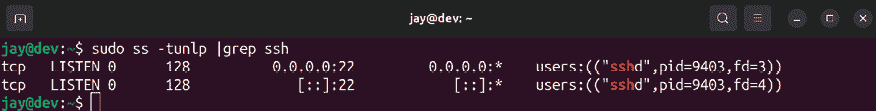

# 第十章：连接到网络

Linux 网络席卷了 IT 行业。许多组织在其数据中心使用 Linux，包括物理服务器和云服务器。Ubuntu Server 是运行关键任务应用程序最受欢迎的选择之一，但如果没有稳定的网络将基础设施的各个组件连接起来，即使是最强大的服务器硬件也将无效。

到目前为止，在本书中我们一直使用单一的 Ubuntu Server 实例。在这里，我们开始对 Linux 网络进行两部分的探讨。本章将讨论与初始网络连接和远程管理相关的主题。我们将在*第十一章*、*设置网络服务*中继续学习更多的网络话题，届时我们将构建和配置额外的组件，使您的服务器能够更有效地进行通信，从而建立一个强大的基础网络，满足您未来多年的需求。

在我们 Ubuntu 探险的这一章节中，我们将讨论：

+   设置主机名

+   管理网络接口

+   分配静态 IP 地址

+   理解 Linux 名称解析

+   开始使用 OpenSSH

+   开始使用 SSH 密钥管理

+   通过配置文件简化 SSH 连接

在我们探索网络的过程中，首先应该为每台 Ubuntu 服务器分配一个唯一的身份；基本上，我们应该给它们一个名字，以便帮助区分它们之间的差异。

# 设置主机名

在安装过程中，您被要求为您的服务器创建一个主机名。具体来说，在初始设置过程中，字段被标记为 `Your server's name`。那时，我们的目标只是简单地设置一个 Ubuntu Server 实例，以便在本书中进行示例演示。现在，您可能考虑更改服务器的主机名。

当我们使用 OpenSSH 远程管理服务器（正如本章后面将要做的那样）时，主机名会显示在命令行上。如果所有服务器的名称都相同，这可能会让人感到非常困惑。更重要的是，服务器的主机名赋予了它一个身份。在实际的 Ubuntu Server 生产部署中，每台服务器应该有其特定的用途，并相应地命名。通常，组织会有自己的命名方案。比如，公司的 web 服务器可能被命名为类似于 `webserver-01`，或者使用完全限定的域名，例如 `webserver-01.example.com`。

在本书中，我不会假设使用任何特定的命名方案，因此，当我们讨论更改主机名时，你可以根据需要调整名称。如果你没有命名方案（但想要创建一个），可以尽情发挥创意。我见过许多不同的命名方式，从以卡通人物命名服务器（谁不想有一台名为`daffy-duck`的服务器？）到希腊神话中的神祇。一些公司选择更为简单的命名方案，使用由连字符分隔的一系列字符，其中包含服务器所在机架的代码，以及服务器的用途。如果你还没有命名方案，可以自己创造一个。不管你最终选择什么，我都不会评价你。

正如我之前提到的，服务器的主机名就是它的身份标识。它向网络中的其他设备标识你的服务器。虽然像`ubuntu`这样的简单主机名对于只有一个主机的情况是可以接受的，但如果在你的网络中每台 Ubuntu 服务器都保留默认的主机名，很快就会变得混乱。为每台服务器命名一个描述性的名称有助于你区分它们。但是，服务器的名称不仅仅是主机名，更多内容将在*第十一章*，*设置网络服务*中讨论，当我们讲解 DNS 时会详细说明。现在，我们将介绍如何查看和配置主机名，等到我们讲到 DNS 时，你可以将主机名正式化并进行 DNS 分配。

那么，如何查看你的主机名呢？一种方法是直接查看你的 shell 提示符；你可能已经注意到，主机名已经包含在提示符中。虽然你可以通过许多方式自定义 shell 提示符，但默认情况下会显示当前的主机名。然而，根据你为服务器命名的方式，它可能会或不会显示完整的名称。通常，默认的提示符（如果你在想的话，它被称为**PS1 提示符**）只显示主机名，直到第一个句点为止。例如，如果你的主机名是`dev.mycompany.org`，那么提示符只会显示`dev`。要查看完整的主机名，只需输入`hostname`命令：


图 10.1：hostname 命令的输出

更改主机名是相当简单的。我们可以使用`hostnamectl`命令作为`root`用户或通过`sudo`来执行。例如，如果我想将主机名从`dev.mynetwork.org`更改为`dev2.mynetwork.org`，我会执行以下命令：

```
sudo hostnamectl set-hostname dev2.mynetwork.org 
```

这很简单，但这个命令究竟做了什么呢？嗯，我很想给你一个复杂的概述，但实际上它只是更改了一个文本文件的内容（具体来说，是`/etc/hostname`文件）。你可以通过在更改前后使用`cat`命令查看这个文件的内容来验证这一点：

```
cat /etc/hostname 
```

你会看到这个文件只包含你的主机名。

一旦你更改了主机名，执行某些命令后，可能会看到类似以下的错误信息：

```
unable to resolve host dev.mynetwork.org 
```

此错误意味着计算机无法再解析您的本地主机名。这是因为`/etc/hostname`文件并不是唯一存放您主机名的文件；它还被引用于`/etc/hosts`。不幸的是，`hostnamectl`命令不会为您更新`/etc/hosts`，因此您需要自己编辑该文件以消除错误。以下是一个示例服务器上`/etc/hosts`文件的示例：


图 10.2：来自`/etc/hosts`文件的示例内容

前两个条目在此示例中指代本地机器本身。本地主机地址，也称为**环回地址**，允许机器直接访问自身。如果您对`127.0.0.1`地址使用`ping`命令，回复将来自执行该命令的机器，而不是网络中的另一台主机。在第一行上，我们有以下内容：

```
127.0.0.1 localhost 
```

如果您要使用任何网络命令尝试与本地服务器通信，例如 ping `127.0.0.1`或`localhost`，则该行上的`/etc/hosts`文件声明此通信是针对底层服务器本身的。

在示例截图的第二行中，我们有以下内容：

```
127.0.1.1 dev.mynetwork.org dev 
```

根据您的配置，例如是否使用物理服务器、虚拟化平台或云服务器提供商，该行可能存在，也可能不存在。如果缺少该行，您可以添加它，但我们稍后会更详细地讨论这个问题。

本质上，该特定行标识出本地服务器还可以通过 IP 地址`127.0.1.1`、完全限定域名`dev.mynetwork.org`以及简化形式`dev`访问。完全限定域名包括服务器名称（在此例中为`dev`）以及组织的域名（例如此示例中的`mynetwork.org`）。这使您可以通过使用名称`dev.mynetwork.org`或简化形式`dev`直接从该服务器 ping 本地服务器。

如果您没有要与服务器一起使用的域名，可以在`/etc/hosts`文件中省略完全限定的域名。因此，在我们的示例中，如果没有域名，该行将如下所示：

```
127.0.1.1 dev 
```

回到我们更改服务器主机名的示例，我提到您可以使用`hostnamectl`命令来执行此操作，但该命令不会为您更新`/etc/hosts`文件，它只会更新`/etc/hostname`文件。最佳做法是同时更新`/etc/hosts`文件以保持一致。您可以完全避免使用`hostnamectl`命令，并手动编辑`/etc/hosts`和`/etc/hostname`文件，这实际上是我更喜欢的方法。如果我必须手动编辑文本文件，无论是否使用`hostnamectl`命令，我认为最好还是使用文本编辑器来处理。

主要的收获是，给你的服务器赋予一个合理且与其在网络中角色相匹配的身份。在典型的组织中，你会有 Web 服务器、文件服务器、数据库服务器等等。一个一致且合乎逻辑的命名方案会使得所有事情变得更加简单。

现在我们已经学会了如何为服务器赋予身份，接下来可以学习如何管理网络接口。

# 管理网络接口

网络对于服务器基础设施至关重要。如果没有网络，服务器无法相互通信，用户也无法访问它们。为了让服务器连接到网络，需要安装网络接口。大多数服务器会安装标准的有线以太网适配器，使你能够插入网络电缆并将其连接到交换机。如果我们的服务器硬件已被 Ubuntu 正确识别，那么这一过程基本上是自动完成的。然而，自动配置并不总是理想的。也许我们希望自定义 IP 地址或与连接相关的设置。

首先，我们需要了解如何查看当前网络卡在服务器中生效的连接参数。这是本节的主要目标。我们可以使用两个基本命令来实现：`ip`（推荐使用）和 `ifconfig`（这是在 Ubuntu 的早期版本中使用的方法，现在不再推荐使用）。

我们可以通过 `ip` 命令查看和管理我们的网络接口信息。例如，我们可以使用 `ip addr show` 来查看当前分配的 IP 地址：

```
ip addr show 
```

这将产生类似于以下截图的输出：


图 10.3：使用 `ip addr show` 命令查看 IP 信息

输入该命令后，你应该会看到与可用的网络接口及其当前状态相关的输出。另外，你可以将命令简化为 `ip a`（无论哪种方式，输出都会相同）。从输出中，我们可以看到一些有用的信息，比如每个设备的 IP 地址（如果有的话），以及它的 MAC 地址。

使用 `ip` 命令，我们还可以管理接口的状态。我们可以将设备关闭（阻止它连接到网络），然后再将其启动：

```
sudo ip link set enp0s3 down 
sudo ip link set enp0s3 up 
```

在这个例子中，我只是切换了接口 `enp0s3` 的状态。首先，我将其关闭，然后再将其重新启动。

启动和关闭接口是好的，但那种命名规则是什么情况呢？对于那些习惯于早期版本使用的命名方案（如 `eth0`、`wlan0` 等）的用户来说，Ubuntu 22.04 使用的命名规则可能会显得有些奇怪。由于 Ubuntu 基于 Debian，因此它采用了从 Debian 9.0 开始引入的新命名规则。

新的命名约定被引入是为了使接口命名更加可预测。虽然你可能认为像`eth0`这样的名称比`enp0s3`更容易记住，但这个变化有助于使名称在启动时保持一致。当你向 Linux 系统添加新的网络接口时，其他接口名称发生变化的可能性始终存在。

例如，如果你在一台服务器上安装了较旧的 Linux 版本，并且该服务器有一个网络卡（`eth0`），然后你添加了第二个网络卡（命名为`eth1`），那么如果在下次启动时接口名称顺序发生了变化，可能会导致你的配置出现问题。假设一个接口连接到了互联网，另一个连接到了交换机（基本上，你拥有一个互联网网关）。如果接口顺序错乱，整个办公室的互联网连接将会中断，因为你编写的防火墙规则应用到了错误的接口上。显然，这并不是一种愉快的体验！

过去，Ubuntu 的早期版本（以及 Debian，甚至 CentOS）选择使用`udev`来使网络接口名称保持不变，以解决这个问题。如今，这已经不再必要，但我还是想在这里提一下，以防你碰到的是一个老版本的服务器。这些老服务器通过存储在以下文件中的配置来实现接口名称的固定：

```
/etc/udev/rules.d/70-persistent-net-rules 
```

这个文件在一些流行的 Linux 发行版的早期版本中存在（包括 Ubuntu），作为解决该问题的一个变通方法。这个文件包含了一些信息，用来识别网络接口的特定属性，因此每次启动时，它都会使用相同的名称。因此，你所熟悉的`eth0`始终会是`eth0`。如果你使用的是较旧版本的 Ubuntu 服务器，应该能够自己查看到这个文件。下面是这个文件在老旧安装中的一些示例输出：

```
SUBSYSTEM=="net", ACTION=="add", DRIVERS=="?*", 
TTR{address}=="01:22:4e:a5:f2:ec", ATTR{dev_id}=="0x0", ATTR{type}=="1", KERNEL=="eth*", NAME="eth0" 
```

如你所见，它是通过卡的 MAC 地址来识别`eth0`的。但是如果我想将这台机器的镜像拍摄并重新部署到另一台服务器上，这就成了一个小问题。这是一个常见的做法——我们管理员通常不会轻易从头开始，除非没有选择。如果另一台服务器与新服务器的需求足够相似，克隆它将是一个可行的选项。然而，当我们将镜像恢复到另一台服务器时，`/etc/udev/rules.d/70-persistent-net-rules`文件也会一起迁移。我们很可能会发现，新的服务器的第一个网络接口会被命名为`eth1`，即使我们只有一个接口。

这是因为文件已经将设备指定为`eth0`（它引用了系统中不存在的设备），所以我们需要自己修正这个文件以重新占用`eth0`。我们可以通过编辑`rules`文件，删除包含系统中不存在的网卡的那一行，然后将剩余行中的设备名称改回`eth0`来完成这个操作。

新的命名方案从`systemd v197`及更高版本开始生效（如果你之前没有了解过，本书早些部分提到过，`systemd`是 Ubuntu 用于管理进程和各种资源的底层框架）。大多数情况下，新的命名规范参考了网络卡在系统总线上的物理位置。

因此，它获得的名称除非你真的将网卡移除并将其放入系统板上的其他插槽，或者在虚拟化管理程序中更改虚拟网络设备的位置，否则无法更改。

简单概述一下网络名称的组成：`en`表示以太网，`wl`表示无线网络。因此，我们知道我之前提到的示例接口（`enp0s3`）代表的是一个有线网卡。`p`表示使用的是哪条总线，`p0`表示系统的第一条 PCI 总线（编号从 0 开始）。接下来是`s3`，它代表的是 PCI 插槽 3。把这些放在一起，`enp0s3`代表的是系统第一条总线上放置在 PCI 插槽 3 的有线网络接口卡。新的命名规范的详细内容甚至可以单独成章，但希望这能给你一个大概的了解。网上有更多关于这个细节的文档，如果你有兴趣了解更深入的信息，可以查看*进一步阅读*部分。这里需要强调的重点是，由于新的命名方案基于网卡的物理位置，因此它不太可能会突然改变。实际上，只要你不物理地更换网卡在机箱内的位置，它是不会改变的。

回到我们如何管理网络接口，另一个值得讨论的命令是`ifconfig`。

`ifconfig` 命令是 `net-tools` 工具套件的一部分，该套件大部分已被弃用。它的替代工具是 `iproute2` 套件，其中包括我们已经讨论过的 `ip` 命令。总结来说，这意味着你应该使用 `iproute2` 套件中的命令，而不是 `ifconfig` 之类的命令。问题是，如今大多数管理员仍然使用 `ifconfig`，而且这种趋势没有减弱的迹象。事实上，`net-tools` 套件已被推荐弃用多年，许多今天出厂的 Linux 发行版仍然默认安装这个套件。那些没有安装它的发行版，提供它作为额外的软件包供你安装。在 Ubuntu Server 22.04 中，`net-tools` 包不再默认安装，但如果你想手动安装，它仍然可用。不过，我不推荐安装它，因为它已被弃用，不再应该使用。

诸如 `ifconfig` 之类的命令之所以在被弃用后仍然存在，通常归结于 *改变是困难的* 这种心态，但仍有相当多的脚本和程序在使用 `ifconfig`，因此在这里讨论它是有价值的。即使你立即停止使用 `ifconfig`，并从今以后改用 `ip`，你仍然会在旅途中遇到这个命令，所以了解一些例子还是很有帮助的。如果你碰到老旧的服务器，了解旧命令也能帮你解决问题。

首先，当单独执行 `ifconfig` 且没有任何选项时，它会打印有关你的网络接口的信息，就像我们之前使用 `ip addr show` 所做的那样。这看起来很简单。

如果你在使用普通用户时无法通过 `ifconfig` 查看接口信息，可以尝试使用完整路径的命令（包括完整路径）：

```
/usr/sbin/ifconfig 
```

`/usr/sbin` 目录可能在你的 `$PATH` 中，也可能不在（这是一个 shell 查找命令的目录集合），所以如果你的系统无法识别 `ifconfig`，使用完整路径命令应该能够输出你想要的结果，如下所示：


图 10.4：使用 `ifconfig` 命令查看接口信息

其次，就像我们之前练习的 `ip` 命令一样，我们也可以通过 `ifconfig` 来禁用或启用一个接口：

```
sudo ifconfig enp0s3 down 
sudo ifconfig enp0s3 up 
```

当然，`ip` 和 `ifconfig` 还有其他选项和变化，所以如果你需要更多信息，可以随时查阅它们的手册页。在本节中，主要需要记住的是如何查看当前的 IP 分配，以及如何启用或禁用一个接口。

尽管我们的网络接口非常有用，但如果没有分配 IP 地址，它们就毫无用处。虽然网络通常会使用 DHCP 来处理这项工作，但在下一节中，我们将看看如何分配静态 IP 地址。

# 分配静态 IP 地址

对于服务器来说，确保 IP 地址固定且不发生变化非常重要。如果 IP 地址发生变化（例如没有保留的动态租约），用户将会遇到中断，服务将会失败，甚至整个网站可能无法访问。当你安装 Ubuntu Server 时，它会从 DHCP 服务器获取一个动态分配的租约，但在你配置好服务器并准备投入生产之前，重要的是要立即设置一个永久的 IP 地址。这个规则的唯一例外是基于 Ubuntu 的 VPS。提供这些服务器的云服务商会有自动系统为你的新 VPS 声明一个 IP 地址，并且已经配置好使其保持不变。但对于你自己管理的虚拟或物理服务器来说，除非你在安装时已经配置了静态 IP 地址，否则它们一开始会是动态地址。

在大多数情况下，你的办公室或组织会有一个 IP 地址方案，其中会列出可用于静态分配的 IP 地址范围。如果你没有这样的方案，重要的是要创建一个，这样当你添加更多服务器时，会减少后续的工作量。我们将在*第十一章*，*设置网络服务*中讨论如何设置 DHCP 服务器和 IP 地址方案，但现在我会给你一些快速提示。你的 DHCP 服务器通常会有一个 IP 地址范围，自动分配给任何请求分配的主机。在为服务器设置静态 IP 时，你需要确保所选择的 IP 地址不在 DHCP 服务器分配的范围内，这样就不会在网络中产生重复的 IP 地址。例如，如果你的 DHCP 服务器分配的 IP 范围是从`10.10.10.100`到`10.10.10.150`，你就应该选择一个*不*包含在该范围内的 IP 地址来给服务器使用。

给网络主机（包括你的服务器）分配固定地址有两种方法。我之前提到过第一种方法，即使用静态 IP 分配。使用这种方法，你可以任意选择一个没有被任何设备使用的 IP 地址，然后配置你的 Ubuntu 服务器使用该地址。在这种情况下，服务器不会向网络的 DHCP 服务器请求 IP 地址，而是直接使用你分配给它的地址。这就是我将在本节中讲解的方法。

将服务器分配固定地址的另一种方法是使用静态租约。这也被称为**DHCP 保留**，但我更倾向于使用前者的术语。通过这种方法，您配置 DHCP 服务器将特定的 IP 地址分配给特定的主机。换句话说，您的服务器将从本地 DHCP 服务器请求 IP 地址，您的 DHCP 服务器被指示每次请求时都给服务器一个特定的地址。这是我喜欢的方法，因为它使得您的 DHCP 服务器成为网络上分配的 IP 地址的唯一真实来源。我会在*第十一章*，*设置网络服务*中详细介绍这一点。

然而，并非总是有选择的余地。作为 Linux 管理员，您可能并不负责 DHCP 服务器。在许多组织中，管理服务器的管理员通常与管理网络的个人不同。

如果您无权设计网络，您将使用由网络管理员提供的 IP 地址，并根据他们给出的参数配置您的 Ubuntu 服务器来使用它。

在过去几年中，我们用来自定义服务器 IP 地址的方法已经从过去的方式改变了。自 Ubuntu 17.10 发布以来，即 2017 年，配置 IP 地址设置现在通过 Netplan 完成。过去，我们会通过 NetworkManager 配置网络，但这只在 Ubuntu 桌面版中默认安装。通过 Netplan，网络接口的配置文件现在以 YAML 格式存储在`/etc/netplan`目录中。本书不涵盖 YAML 格式本身的解释，但其语法非常易于理解，因此您在配置网络接口时无需深入理解这种格式。如果列出`/etc/netplan`目录的内容，您应该至少看到一个文件，通常命名为`00-installer-config.yaml`或`50-cloud-init.yaml`。文件可能以不同的名称保存，因此请检查`/etc/netplan`目录的内容以查看文件在您那里的名称。在我的一台服务器上，我在`/etc/netplan/00-installer-config.yaml`文件中看到以下内容：

```
# This is the network config written by 'subiquity'
network:
  ethernets:
    enp0s3:
      dhcp4: true
  version: 2 
```

我们已经可以从这个默认文件中获取一些明显的信息。首先，开头的注释提到了`subiquity`，这是 Ubuntu 服务器安装程序的官方名称，在您使用从 ISO 文件创建的引导介质安装分发时使用。

更重要的是，我们可以看到这台特定服务器配置为使用 DHCP 来获取 IP 地址，这可以从以下一行中看出：

```
 dhcp4: true 
```

我们还可以看出，这个配置文件与接口`enp0s3`相关。综合来看，这个文件告诉我们接口`enp0s3`已配置为通过 DHCP 自动获取 IP 地址。如果我们想将此配置更改为静态 IP 地址，首先应备份文件：

```
sudo cp /etc/netplan/00-installer-config.yaml /etc/netplan/00-installer-config.yaml.bak 
```

这样，如果我们犯了错误，我们可以通过将备份文件重命名为原文件名来轻松恢复原始文件。这是一个很好的做法，适用于我们编辑的任何文件。能够恢复之前的配置是我们进行任何更改时的最佳实践。我们需要做的第一项更改是删除以下这一行（或者将其改为`false`）：

```
 dhcp4: true 
```

实质上，要设置静态 IP，我们将用特定于我们配置的详细信息替换那一行。这是一个为静态 IP 地址配置的文件示例：

```
# This is the network config written by 'subiquity'
network:
  ethernets:
    enp0s3:
      **addresses:** **[****192.168.100.50****/24****]**
      **gateway4:****192.168.100.1**
      **nameservers:**
        **addresses:** **[****192.168.100.1****,** **192.168.100.2****]**
  version: 2 
```

在这个示例中，我已经将四行加粗，这些行是替代`dhcp4: true`行所添加的。首先，我们设置实际的 IP 地址：

```
 addresses: [192.168.100.50/24] 
```

在这里，我使用了一个示例 IP 地址`192.168.100.50/24`。在你的环境中，你需要确保选择的 IP 地址位于你希望服务器加入的网络范围内。正如我之前提到的，你选择的 IP 地址*不能*在自动分配 IP 地址的 DHCP 范围内。如果你的网络上 DHCP 服务器的示例范围是从`192.168.100.100`到`192.168.100.150`，那么前面的 IP 地址就没有问题。这里选择的`192.168.100.50`在这个范围外，因此我们不需要担心会有其他设备被分配到这个地址。

我们还添加了`/24`来声明 IP 地址是 24 位**子网**的一部分，这是相当标准的，除非你的网络管理员设置了更大的范围。`/24`网络等同于 C 类网络，如果这个说法更熟悉的话。这也解决了子网掩码的问题，我们这里不需要设置，因为`/24`意味着子网掩码为`255.255.255.0`（如果你更熟悉传统的网络分类样式，它会像 IP 地址一样显示子网掩码）。我们将在*第十一章*，*设置网络服务*中讨论子网问题；不过，完整的子网划分和 TCP/IP 协议的介绍更适合放在专门讲解网络概念的书中，因此我们不会进一步展开讨论。

接下来，我们还需要设置网关：

```
 gateway4: 192.168.100.1 
```

在网络配置中，网关指的是你的出站连接所通过的设备，这通常是路由器或防火墙，具体取决于你的网络设置。此值需要与网络中实际的默认网关地址匹配，默认网关地址通常与 IP 地址的最后一部分为`.1`。如果不确定，你可以检查连接到相同网络的另一台设备的 IP 地址，它应该是相同的。

最后一部分允许我们配置服务器用来查找外部域名的 DNS 服务器：

```
 nameservers:
        addresses: [192.168.100.1, 192.168.100.2] 
```

示例配置仅仅是一个示例——所有值必须与适合你网络的设置相匹配。通常，DNS 服务器的 IP 地址与网关地址相同，但并非总是如此。有时，网络管理员会为 DNS 服务器设置自定义 IP 方案。在示例中我还添加了一个次级 DNS 服务器 `192.168.100.2`，但如果不需要，可以删除第二个 IP 地址。

一旦确认文件中的值是合适的，我们需要应用并测试这些更改：

+   如果你正在使用虚拟机，你可能想要从虚拟机控制台进行更改

+   如果你正在更新一台物理机器，你可能需要连接显示器和键盘。

+   尽管我们在本章稍后讨论 OpenSSH，如果你已经知道如何通过 OpenSSH 连接到服务器，你可能不希望在 OpenSSH 中更改网络配置，因为一旦激活这些更改，你的连接将会断开。

慢慢来，仔细检查一切，确保没有输入错误，这样就不会遇到无法连接的服务器问题。

要使这些更改生效，你可以运行以下命令：

```
sudo netplan apply 
```

当你运行之前的命令时，它会告诉你文件中是否有错误，如果没有错误则会应用更改。新的 IP 地址会立即生效。

如果在配置网络时使用像 OpenSSH 这样的远程连接，你可以通过使用 `tmux`（一个流行的终端多路复用器）来解决断开连接和网络无法正确重启的问题。关于 `tmux` 的完整教程超出了本书的范围，但在这个场景中它对我们非常有帮助，因为即使我们与服务器的连接丢失，它也能保持命令在后台运行。要使用它，首先安装该软件包：

```
sudo apt install tmux 
```

然后，只需在你的终端提示符下输入 `tmux` 来激活 `tmux`。

从此时起，`tmux` 就负责你的会话。如果你在 `tmux` 中运行一个命令，它会继续运行，无论你是否已连接到它。要看到这一点，首先进入 `tmux`，然后执行 `top` 命令。当 `top` 正在运行时，从 `tmux` 断开连接。为此，在键盘上按 *Ctrl* + *b*，松开后，再按 *d*。你将退出 `tmux`，但是如果你输入 `tmux a` 命令重新连接会话，你会发现即使断开了连接，`top` 仍然在运行。按照这种逻辑，你可以在执行 `sudo netplan apply` 命令之前启动 `tmux`。

很可能，你仍然会被从 shell 中断开，因为激活网络更改的过程会使网络接口关闭并重新启动，但使用`tmux`时，命令会在后台完成。然后，你可以重新连接到服务器，并运行`tmux a`以重新加入你的`tmux`会话。

`tmux`工具非常强大，当正确使用时，它可以显著提升你在使用 Linux shell 时的工作效率。虽然本书无法详细讲解完整教程，但我强烈建议你深入了解如何使用它，你可以在这里找到更多信息：[`www.packtpub.com/hardware-and-creative/getting-started-tmux`](https://www.packtpub.com/hardware-and-creative/getting-started-tmux)。如果你需要一些指导，可以查看 LearnLinuxTV 上的视频教程，链接将在本章末尾提供。

网络重启后，你应该能够立即重新连接到服务器，并通过执行`ip a`来查看新的 IP 分配是否已生效。如果由于某种原因无法重新连接到服务器，可能是你在编辑 Netplan 配置文件时犯了错误。请仔细检查该文件，确保没有错误。但只要你按照步骤操作，并为你的接口和网络输入了正确的值，就应该能够成功配置静态 IP。

现在，我们已经有了实际的网络——我们已经为服务器命名并配置了网络接口。我们还应了解 Ubuntu 中的名称解析工作原理，这是服务器通过名称查找其他服务器的过程。

# 理解 Linux 名称解析

在*第十一章*，*设置网络服务*中，我们将讨论为本地名称解析设置 DNS 服务器的过程。但在此之前，理解 Linux 如何解析名称是很重要的。你们中的大多数人可能都知道**域名系统**（**DNS**）的概念，它将人类可理解的域名映射到 IP 地址。这使得浏览网络（以及互联网）变得更加轻松。然而，DNS 并不是 Linux 服务器在解析名称时首先使用的工具。

欲了解 Ubuntu Server 在解析名称时检查资源的顺序，欢迎查看`/etc/nsswitch.conf`文件。该文件中有一行以`hosts`开头。以下是我服务器中该行的输出：

```
hosts:          files mdns4_minimal [NOTFOUND=return] dns mymachines 
```

在这种情况下，服务器配置为首先检查本地文件，如果未找到请求的信息，则检查 DNS。这是默认顺序，我认为没有理由在这里进行更改（但你当然可以）。具体来说，服务器将检查的文件是`/etc/hosts`。如果在那里找不到所需内容，它将转向 DNS（基本上，它会检查我们之前通过 Netplan 配置的 DNS 服务器，或者由 DHCP 提供的默认服务器）。

`nsswitch.conf`文件中还有许多其他行，但由于超出了本节的讨论范围，我在这里不再讨论。

我们在讨论主机名时简要提到了`/etc/hosts`文件，它告诉我们的服务器如何解析自身（它有一个主机名映射到本地主机 IP `127.0.0.1`），但你也可以在这里创建其他名称到 IP 的映射。

例如，如果我有一台服务器（`myserver.mydomain.org`）的 IP 地址是`10.10.96.124`，我可以在`/etc/hosts`中添加以下行，使得每次都能将我的机器解析到该 IP，而不需要查询 DNS 服务器：

```
10.10.96.124 myserver.mydomain.org 
```

然而，实际上，这通常不是一个非常方便的配置名称解析的方法。别误会，我并不是说你不能在这个文件中列出你的服务器和它们的 IP 地址，你的服务器肯定能解析这些名称。问题在于，这种方法很难维护。名称映射仅适用于你在其上修改了`/etc/hosts`文件的服务器；其他服务器无法受益，因为它们只会检查自己的`/etc/hosts`文件。你可以在每个服务器的`hosts`文件中添加服务器列表，但那会很麻烦。这也是为什么拥有一个中央 DNS 服务器对任何网络都有好处，尤其是在解析本地资源名称时。

然而，`/etc/hosts`文件偶尔仍在企业中作为快速的临时解决方案使用，最终你可能因某种原因需要使用这种方法。使用这种手动名称解析方法的一个非常常见的原因是在测试替换服务器的情况下。此时，你可以将`/etc/hosts`文件配置为与原始服务器相同的名称，但使用新服务器的 IP 地址。完成测试并确认新服务器正常运行后，你就可以将全网的 DNS 名称替换为指向新 IP 地址。

在旧版 Ubuntu 服务器上，`/etc/resolv.conf`文件包含了系统用于解析名称的 DNS 服务器的 IP 地址。如果你想覆盖服务器的 DNS 服务器，你需要修改这个文件。尽管这个文件在 Ubuntu 22.04 中仍然存在，但它仅用于将查询重定向到`systemd-resolved`，这是一个在后台运行并根据系统通过 DHCP 接收到的设置或你在 Netplan 中配置的设置应用 DNS 配置的 systemd 单元。为了完整起见，这里简要概述一下旧版本中该文件的语法，以防你需要在这种服务器上工作。以下是该文件的示例：

```
nameserver 10.10.96.1 
nameserver 10.10.96.2 
```

在这个例子中，`/etc/resolv.conf`文件输出使用的是`10.10.96.1`和`10.10.96.2`这两台服务器。因此，服务器首先会检查`/etc/hosts`文件，看看是否有与正在查询的资源匹配的记录，如果没有，它将继续检查`/etc/resolv.conf`，以确定下一个要检查的服务器。在这个例子中，服务器将检查`10.10.96.1`。

传统服务器上的`/etc/resolv.conf`文件通常不需要进行实际更改，因为它是由 NetworkManager 自动生成的。NetworkManager 是一个帮助你管理网络接口的服务；然而，在 Ubuntu Server 的多个版本中，它已经不再使用了。尽管你通常不需要手动编辑`/etc/resolv.conf`文件，但在老旧服务器上查看它可能很有用，这样你就可以知道分配了哪些 DNS 服务器，以防你在排查网络问题时需要用到这些信息。

如今，现代的 Ubuntu 服务器使用`systemd-resolved`来处理名称解析。如果你想查看在较新的 Ubuntu Server 安装中分配了哪些 DNS 服务器，你可以简单地查看之前我们在静态 IP 配置时使用的 Netplan 配置文件，但如果使用的是 DHCP，`resolvectl`命令会告诉你当前服务器正在指向的 DNS 服务器。它的输出将类似于以下截图所示：


图 10.5：查看服务器当前的 DNS 分配

在典型的企业 Linux 网络中，你会设置一个本地 DNS 服务器来解析内部资源，然后将请求转发到公共 DNS 服务器，以防你试图访问某个非内部的资源。我们将在*第十一章*，*设置网络服务*中讲解这个内容，但你现在应该了解在 Ubuntu Server 上名称解析的工作原理。

作为 Linux 管理员，我们可能需要管理大量服务器，而且我们管理的服务器往往不在与我们相同的物理位置。OpenSSH 是一个强大的远程管理工具，接下来我们将深入探讨它。

# 开始使用 OpenSSH

**OpenSSH**可能是管理 Linux 服务器时最有用的工具。在所有可用的无数工具中，这是我建议每个人尽早开始练习的工具。从技术角度来看，我可能更适合在*第十一章*，*设置网络服务*中加入一节内容来介绍如何设置 OpenSSH，但这个工具非常实用，我们应该尽早开始使用它。

OpenSSH 允许你在其他 Linux 服务器上打开命令行界面，使你能够像在服务器面前一样执行命令。对于我们这样的 Linux 管理员来说，这非常方便。我们可能需要管理数十台、数百台，甚至上千台服务器。

借助 OpenSSH，我们可以在不离开椅子的情况下管理整个服务器架构。在本节中，我将为你提供关于 OpenSSH 的一些信息，并介绍如何安装它，最后通过一些实际使用的例子来结束这一节。

## 安装 OpenSSH

OpenSSH 由两个组件组成：在后台运行、接受 SSH 连接的服务器守护进程，以及运行在笔记本、工作站或其他服务器上的客户端，它使你能够连接到 SSH 服务器并运行命令。如今，所有操作系统都提供了 OpenSSH 客户端，可以用来连接到服务器，因此这一要求大概率已经满足。对于 Linux，大多数发行版默认提供了 OpenSSH 客户端。你可以通过在命令行提示符下运行`which ssh`来验证这一点。如果客户端已经安装，你的输出应该是`/usr/bin/ssh`。

如果由于某种原因，你没有安装此软件包，并且在运行前一个命令时没有收到任何输出（这种情况比较罕见），你可以使用以下命令来安装 OpenSSH 客户端：

```
sudo apt install openssh-client 
```

根据你在安装过程中做出的选择，Ubuntu 服务器很可能已经安装了 OpenSSH 服务器。如果你不记得在最初安装时是否选择了安装它，你可以在命令行提示符下运行`which sshd`命令，你应该会看到输出`/usr/sbin/sshd`。你也可以执行`systemctl status ssh`，如果服务器组件存在并且正在运行，那么你的服务器已经准备好接受 SSH 连接：


图 10.6：验证 OpenSSH 服务是否在服务器上运行

如果你的服务器没有安装 OpenSSH 服务器组件，你可以使用以下命令来安装它：

```
sudo apt install openssh-server 
```

然而，**强大的力量伴随巨大的责任**。尽管 OpenSSH 非常强大，但任何监听连接的服务都有可能被滥用。外部入侵者发现弱点或漏洞，进而控制你的服务器，情况将变得非常糟糕。因此，像所有在服务器上运行的服务一样，只有在需要时才应该启动它。由于 OpenSSH 极为有用（而且它是远程管理的标准方法），因此几乎很难*不使用*它。

你可以利用许多方法来保护此类服务并帮助加固它。下一节将介绍其中一种方法，我们在本书结束之前，还将再次讨论与 OpenSSH 相关的安全问题。具体来说，在*第二十一章*《保护你的服务器》中，我将带你逐步了解可以采取的各种配置更改，帮助最小化外部不法分子入侵服务器并造成破坏的威胁。

保护 OpenSSH 实际上并不困难，可能只需要几分钟的时间。因此，您可以绕道阅读该章节中关于保护 OpenSSH 的部分，读完后再回来。现在，至少确保服务器上有安全的、随机生成的密码。如果 OpenSSH 可以通过公共互联网访问，而您的用户有弱密码，那么这绝对不是一个好情况。

完成所有这些后，我们就可以开始实际使用 OpenSSH 了。

## 使用 OpenSSH 执行命令

在您已安装 `openssh-server` 软件包到目标机器（您希望远程控制的那台机器）之后，如果它尚未启动，您需要启动它。默认情况下，Ubuntu 的 `openssh-server` 软件包会在安装后自动配置为启动并启用。就像我们之前做的那样，您可以通过以下命令验证所需的服务是否正在运行：

```
systemctl status ssh 
```

如果 OpenSSH 作为守护进程在您的服务器上运行，您应该看到输出信息，告知它处于 `active (running)` 状态。如果不是，您可以使用以下命令启动它：

```
sudo systemctl start ssh 
```

如果 `systemctl status ssh` 命令的输出显示守护进程被禁用（意味着它不会在服务器启动时自动启动），您可以使用以下命令启用它：

```
sudo systemctl enable ssh 
```

当 OpenSSH 服务器已启动并正在运行时，您的服务器现在应该在监听连接。为了验证这一点，可以使用以下命令列出监听的端口，将输出限制为 SSH：

```
sudo ss -tunlp |grep ssh 
```

`ss` 命令允许我们查看正在服务器上运行并监听连接的进程列表。它还会显示进程监听的端口。

我们将在 *第二十一章*，*保护您的服务器* 中更详细地探讨此命令。但现在，这个命令应该会输出类似以下内容：



图 10.7：检查 SSH 所需端口是否在监听

如果由于某种原因，您的服务器没有显示有 SSH 服务器在监听，仔细检查您是否已经启动了守护进程。默认情况下，SSH 服务器会在端口`22`上监听连接。可以通过修改`/etc/ssh/sshd_config`文件中的端口声明来更改这一设置，但这是后续章节的内容。虽然我现在不打算详细讲解如何编辑此文件，但请注意，它是守护进程的默认配置文件。每次 OpenSSH 启动或重启时，它都会读取此文件中的配置值。

要使用 SSH 连接到服务器，只需执行 `ssh` 命令，后面跟上您要连接的服务器的名称或 IP 地址：

```
ssh 192.168.1.120 
```

默认情况下，`ssh` 命令将使用你当前登录的用户名进行连接。如果你想使用不同的用户名，可以在 `ssh` 命令中指定它，通过在 IP 地址或主机名之前加入用户名，并跟随 `@` 符号：

```
ssh fmulder@192.168.1.120 
```

除非你另行指定，`ssh` 命令假定你的目标主机监听的是端口 `22`。如果不是，你可以通过 `-p` 选项后跟端口号来指定不同的端口：

```
ssh -p 2242 fmulder@192.168.1.120 
```

一旦你连接到目标机器，你就可以像直接站在它面前一样运行 shell 命令并管理系统。你将拥有与你登录时相同的权限，如果你在该服务器上有权限，你还可以使用 `sudo` 来执行管理员命令。

基本上，如果你在服务器面前时能够做的任何事情，你都能通过 SSH 来做。当你完成会话时，只需在 shell 提示符下输入 `exit`，或按下键盘上的 *Ctrl* + *d*。

当你退出 OpenSSH 连接时，任何在后台运行的进程都会被终止。请确保在退出连接之前，恢复你可能正在运行的后台进程，并完成相关工作。我们在*第七章*、*控制和监控进程*中讨论过如何在后台运行进程。

如你所见，OpenSSH 是一款神奇的工具，它能够让你从任何允许 SSH 访问的地方远程管理你的服务器。但要确保阅读*第十一章*、*设置网络服务*中的相关部分，关于如何保证它的安全。在接下来的章节中，我们将讨论 SSH 密钥管理，它带来了便利性，同时也能提升安全性。

# 开始使用 SSH 密钥管理

当你通过 SSH 连接到主机时，系统会要求你输入密码，验证通过后便会建立连接。不过，你可以选择通过公钥认证而不是输入密码进行验证。这种方法的核心优点是增加了安全性，因为在连接服务器的过程中，系统密码不会被传输。当你创建 SSH 密钥对时，你会生成两个文件，一个*公钥*和一个*私钥*。这两个文件在数学上是相互关联的，因此，如果你连接到一台已保存你公钥的服务器，服务器会知道是你在连接，因为只有你（并且只有你）拥有与公钥匹配的私钥。这种方法比密码验证更加安全，我强烈建议你使用它。为了最大化通过密钥认证带来的安全性，你实际上可以在服务器上禁用基于密码的认证，这样你的 SSH 密钥就成为唯一的登录方式。通过禁用基于密码的认证并仅使用密钥，你可以大幅提升服务器的安全性。我们将在*第二十一章*、*保护你的服务器*中讲解这一部分。

## 生成公钥和私钥

首先，你需要生成密钥。在你的工作站或笔记本电脑（即你用来连接服务器的设备）上，使用`ssh-keygen`命令，以普通用户账号进行操作。下面的截图展示了这一过程的大致样子：


图 10.8：生成 SSH 密钥对

首先，你会被要求输入保存密钥文件的目录，默认路径是`/home/<user>/.ssh`。接下来，系统会询问是否设置密码短语，这一步是可选的。虽然这会增加通过密钥进行身份验证的步骤，但我建议你设置一个密码短语（与系统密码不同），因为它大大提高了安全性（如果你设置了密码短语，密钥没有密码短语就无法使用）。如果你不想设置密码短语，可以直接按*Enter*键跳过。

该命令的作用是，在你的`home`目录下创建一个名为`.ssh`的目录（如果它还不存在）。在该目录中，它会创建两个文件，`id_rsa`和`id_rsa.pub`。`id_rsa`文件是你的私钥，它永远不应该离开你的计算机、传给其他用户，或者存储在任何外部介质上。如果你的私钥泄露，你的密钥对就不再可信。默认情况下，私钥的拥有者是创建它的用户，且`rw`权限只授予文件所有者。

公钥则不同，它可以离开你的计算机，并且不需要像私钥那样严格保护。它的权限更加宽松，所有人都可以读取，只有所有者可以写入。你可以通过执行`ls -l /home/<user>/.ssh`来查看这一点：


图 10.9：列出.ssh 目录的内容，显示新创建密钥的权限

公钥是实际复制到其他服务器上的密钥，以便通过这样的密钥对进行登录。当你登录到一个包含你公钥的服务器时，服务器会检查公钥与私钥是否在数学上匹配，如果匹配，它会允许你登录。如果在创建密钥时设置了密码短语，系统也会要求你输入它。但在我们实际使用密钥之前，我们需要将公钥复制到目标服务器上。

## 将你的公钥复制到远程服务器

要实际将公钥传输到目标服务器，可以使用`ssh-copy-id`命令，下面是我在例子中使用的命令：

```
ssh-copy-id -i ~/.ssh/id_rsa.pub 192.168.1.150 
```

使用该命令时，将 IP 地址替换为目标服务器的实际 IP 地址，或替换为目标服务器的 *主机名*。你首先会被要求通过密码登录，然后密钥会被复制过去。从此以后，你将通过密钥登录，如果因某种原因密钥关系被破坏，你会被要求输入密码。以下是这个过程的示例，如果我要将我的密钥复制到名为 `myserver.mycompany.org` 的服务器时的步骤：


图 10.10：使用 `ssh-copy-id` 命令将公钥复制到服务器

那么，`ssh-copy-id` 命令到底做了什么呢？你的公钥到底被复制到了哪里？其实，执行此命令后，如果目标服务器的 `home` 目录下没有 `.ssh` 目录，它会自动创建一个。在该目录内，如果没有现成的 `authorized_keys` 文件，它会创建一个。你机器上 `~/.ssh/id_rsa.pub` 文件的内容将被复制到目标服务器的 `~/.ssh/authorized_keys` 文件中。每添加一个新的密钥（例如，你从多台机器连接到该服务器时），密钥会被添加到 `authorized_keys` 文件的末尾，每个密钥占一行。

使用 `ssh-copy-id` 命令仅仅是为了方便；你完全可以将 `id_rsa.pub` 文件的内容复制并手动粘贴到目标服务器的 `authorized_keys` 文件中。那种方法其实也能正常工作。

当你连接到已经设置了密钥关系的服务器时，SSH 会检查该服务器上 `~/.ssh/authorized_keys` 文件的内容，寻找一个与本机私钥（`~/.ssh/id_rsa`）在数学上匹配的密钥。如果这两个密钥匹配，你将被授予访问权限。如果你设置了密码短语，则在打开公钥时，会要求你输入密码短语。

如果你决定在密钥中不设置密码短语，实际上就是在设置无需密码的身份验证，这意味着在身份验证时，你不需要输入任何内容。

## 使用 SSH 代理

当我们之前创建 SSH 密钥时提到过，设置密码短语是可选的，但它是一个好主意。使用密码短语可以提高 OpenSSH 密钥对的安全性。如果一个 OpenSSH 密钥落入错误的人手中，只要他们不知道密码短语，就无法使用它。然而，我们也会失去一些便利，因为每次使用密钥时都需要输入密码短语。没有密码短语的 OpenSSH 密钥允许我们连接到服务器并直接登录，而不需要输入任何东西。使用*SSH 代理*，你实际上可以在第一次使用密码短语时将其缓存，这样每次连接时就不需要再输入密码短语了。这实际上让你在享受密码短语增加的安全性的同时，仍然保持了一定的便利性。最棒的是，如果你的笔记本电脑或台式机能够使用 OpenSSH 客户端连接到远程系统，那么你应该已经在系统中安装了 SSH 代理。例如，如果我们在工作站或笔记本电脑上使用 Linux 或 macOS 的某种版本，`ssh-agent`命令会是可用的。

`ssh-agent`是通过在终端后台启动来使用的。然后，我们可以使用密码短语“解锁”我们的密钥，解锁后的密钥将被存储在内存中，当我们尝试连接到已经将公钥复制到的服务器时，系统会自动使用这个解锁的密钥。要启动它，在你用来启动连接的机器上（也就是你的工作站）输入以下命令：

```
eval $(ssh-agent) 
```

这个命令将启动一个 SSH 代理，它将继续在你的 shell 后台运行。但它现在还没有给我们带来任何好处——所以我们需要将一个 SSH 密钥添加到正在运行的代理中。`ssh-add`命令允许我们将一个 SSH 密钥添加到正在运行的`ssh-agent`中。为此，我们可以将`ssh-add`命令与公钥的路径作为参数一起使用：

```
ssh-add ~/.ssh/id_rsa 
```

到此时，你将被要求输入密码短语。只要你正确输入，它将保持解锁状态，未来的连接无需再次输入密码短语，直到你关闭该 shell 或注销。现在，你已经在后台运行了`ssh-agent`，并且密钥已经解锁，使用带有密码短语的密钥变得更加简单，你将输入更少的内容。

## 更改 OpenSSH 密钥的密码短语

有时候，你可能想要更改与密钥相关的密码短语。如果你想这样做，可以使用`-p`参数与`ssh-keygen`命令配合使用。如果你在最初创建密钥时没有选择添加密码短语，那个参数也可以用来添加。就是这么简单。你输入的命令就像以下这样简单：

```
ssh-keygen -p 
```

一旦你输入该命令，按 *Enter* 键接受默认文件（`id_rsa`），除非你想更改的密钥有不同的名称，届时你可以键入该密钥的路径和名称。接下来，你将被要求输入当前的密码短语（如果没有密码短语，可以留空），然后再输入两次新密码短语。整个过程如下所示：


图 10.11：更改 SSH 密码短语

如果你从未使用过 SSH，这些概念可能需要一些练习。最好的练习方法是设置多个 Ubuntu Server 安装（可能是几个虚拟机），并练习使用 SSH 连接到它们，同时通过 `ssh-copy-id` 命令将你的密钥部署到每台机器上。实际上，一旦掌握了，它会变得相当简单。

# 用配置文件简化 SSH 连接

在我们离开 OpenSSH 话题之前，还有一个便捷的技巧，那就是创建 SSH 的本地配置文件。这个文件必须存储在你的主目录的 `.ssh` 文件夹中，并命名为 `config`。在我的情况下，这个文件的完整路径如下所示：

```
/home/jay/.ssh/config 
```

这个文件默认是不存在的，但如果它被找到，SSH 每次使用客户端时都会解析它，你将能够从中受益。请打开这个文件并在文本编辑器中编辑，例如 `nano`：

```
nano /home/your_username/.ssh/config 
```

这个 `config` 文件允许你为经常连接的服务器输入配置，从而自动简化 `ssh` 命令。以下是该文件中的示例内容，帮助我说明它的作用：

```
host myserver 
    Hostname 192.168.1.23 
    Port 22 
    User jdoe 
Host nagios 
    Hostname nagios.mynetwork.org 
    Port 2222 
    User nagiosuser 
```

在示例内容中，我列出了两个主机，`myserver` 和 `nagios`。对于每个主机，我都标明了如何通过名称或 IP 地址（`Hostname` 行）来访问它，以及连接时使用的 `Port` 和 `User` 账户。如果我通过文件中列出的名称使用 `ssh` 连接到这两个主机中的任何一个，它会使用我在那里存储的值，例如：

```
ssh nagios 
```

这个命令比手动设置所有选项要短得多。考虑到我有一个 SSH 的 `config` 文件，这个命令实际上和我手动识别连接详细信息后输入的命令是一样的，手动输入的命令如下所示：

```
ssh -p 2222 nagiosuser@nagios.mynetwork.org 
```

我相信你能看出，输入第一个命令比第二个命令要简单得多。通过 SSH 的 `config` 文件，我可以让一些细节自动应用。因为我已经在文件中说明了我的 `nagios` 服务器位于 `nagios.mynetwork.org`，它的 SSH 用户是 `nagiosuser`，并且它监听的是 `2222` 端口，所以即使我只输入了 `ssh nagios`，它也会自动使用这些值。此外，你还可以覆盖这个条目。如果你在使用 `ssh` 命令时提供了不同的用户名，它会使用你提供的用户名，而不是 `config` 文件中写的用户名。

在第一个示例中（针对 `myserver` 服务器），我为连接提供了 IP 地址，而不是主机名。在没有目标服务器的 DNS 条目的情况下，这非常有用。通过这个示例，我不必记住 `myserver` 的 IP 地址是 `192.168.1.23`。我只需要执行 `ssh myserver`，系统就会为我处理好这一切。

`config` 文件中的每个服务器名称都是任意的，不必与目标服务器的主机名匹配。我本可以将第一个服务器命名为 `potato`，它仍然会将我路由到 `192.168.1.23`，所以我可以创建任何我想要的命名快捷方式，无论是最方便我记住的名字还是最容易记住的名称。如你所见，在你的主目录中维护一个包含最常用 SSH 连接的 `config` 文件，肯定能帮助你保持井井有条，并且让你更容易连接。

# 总结

在本章中，我们通过多个示例讲解了如何连接到其他网络。我们从配置主机名开始，管理网络接口，分配静态 IP 地址，并了解 Linux 中的名称解析如何工作。本章的相当一部分内容专门讲解了 OpenSSH，这是一个非常有用的工具，允许你远程管理服务器。在 *第二十一章*《保护你的服务器》中，我们将再次探讨 OpenSSH，重点讲解如何增强其安全性。总的来说，我们才刚刚触及到这个工具的表面。关于 SSH 已经写了整本书，但本章中的示例应该足以让你开始高效使用它。关键在于：练习，练习，再练习！

在下一章中，我们将讨论如何管理软件包。我们将通过添加和删除软件包、添加附加软件库等内容进行讲解！

# 相关视频

+   OpenSSH 指南（LearnLinuxTV）：[`linux.video/ssh-guide`](https://linux.video/ssh-guide)

+   tmux 指南（LearnLinuxTV）：[`linux.video/tmux-guide`](https://linux.video/tmux-guide)

+   OpenSSH 客户端配置文件（LearnLinuxTV）：[`linux.video/ssh-config-file`](https://linux.video/ssh-config-file)

+   入门 OpenSSH 密钥管理（LearnLinuxTV）：[`linux.video/ssh-key-mgmt`](https://linux.video/ssh-key-mgmt)

# 进一步阅读

+   Netplan 常见问题解答：[`learnlinux.link/npf`](https://learnlinux.link/npf)

+   Ubuntu SSH 密钥文档：[`learnlinux.link/u-ssh-keys`](https://learnlinux.link/u-ssh-keys)

+   网络接口名称（来自 Debian 的 wiki）：[`learnlinux.link/net-int-nam`](https://learnlinux.link/net-int-nam)

# 加入我们社区的 Discord

加入我们社区的 Discord 空间，与作者和其他读者进行讨论：

[`packt.link/LWaZ0`](https://packt.link/LWaZ0)


