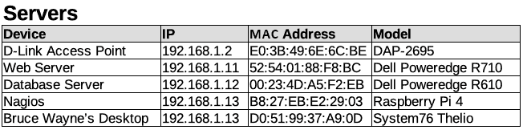
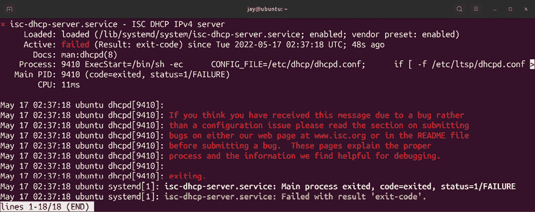
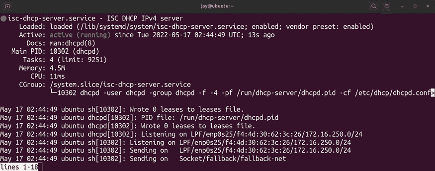

# 11

# 设置网络服务

在*第十章*，*连接到网络*中，我们讨论了与网络相关的一些重要基础知识。我们了解了如何设置主机名、管理网络接口、配置连接等内容。在本章中，我们将再次讨论网络，特别是设置将作为网络基础的资源。本章的主要内容将集中在设置 DHCP 和 DNS 服务器上，这两个组件在任何网络中都是非常重要的。此外，我们还将探讨如何设置一个服务器作为我们网络的互联网网关。

在此过程中，我们将讨论以下主题：

+   规划你的 IP 地址方案

+   使用`isc-dhcp-server`提供 IP 地址

+   使用`bind`设置 DNS

+   设置互联网网关

作为 Linux 管理员，你可能会被要求设计整个组织的网络布局，也可能不会；通常会有一个已经存在的网络需要管理。在下一节中，我们将讨论如何创建这样的布局，即使仅仅是为了理解这种计划包含了什么内容。

# 规划你的 IP 地址方案

设计你网络的整体布局是一个非常重要的过程，它为以后的成功或失败奠定了基础。这个设计必须考虑到组织的需求、高效的通信方式，以及网络服务的隔离，以确保你的服务器只能与它们应该访问的资源通信。作为一名管理 Ubuntu 服务器的 Linux 管理员，并非总是你能够参与网络布局的设计。你很可能“继承”了前任管理员设计的网络，或者你的工作被分隔开，你只负责管理服务器，网络则由其他人负责。

由于本书主要是教你如何管理 Ubuntu 服务器，我们不会涵盖网络管理员需要了解的所有内容，但这两个角色之间有一些重叠。作为 Linux 管理员，你可能会负责设计网络，也可能不会，但至少，你需要了解网络的整体布局，以及你的服务器如何融入其中。

在这一部分中，我们将讨论网络布局中最重要的部分——IP 地址规划。规划 IP 地址方案是一项重要的任务，它为许多其他工作奠定基础。即使这项布局设计不由你来完成，了解现有布局的细节也能帮助你更好地理解你所维护的服务器如何与其他设备进行通信。规划你的 IP 布局需要估算有多少设备将需要连接到网络，并确保能够支持它们。此外，一个好的规划还需要考虑潜在的增长，并允许未来扩展。影响这一点的主要因素是用户基础的规模。也许你正在一个只有少数几个人的小办公室工作，或者你所在的是一个拥有数千个用户和数百台虚拟机的大公司。即使你的组织只是一个小型办公室，我总是建议假设公司未来某天会爆炸式增长，并设计你的网络以具备应对这一增长的潜力。

通常，大多数现成的路由器和网络设备都配备集成的**动态主机配置协议**（**DHCP**）服务器，并默认使用类 C（`/24`）网络。实质上，这意味着如果你完全不做任何配置，你的地址数量将被限制为 254 个。对于一个小型办公室来说，这看起来可能已经足够了。毕竟，如果你的公司连 254 个员工都没有，这个数字看起来可能有些过剩。正如我之前提到的，潜在的增长始终是需要考虑的因素。但即使不考虑这一点，IP 地址的消耗速度比你想象的要快——即使是内部地址也不例外。普通用户可能每人就消耗三个 IP 地址，有时甚至更多。

例如，假设某个用户不仅有一台笔记本电脑（笔记本可能同时有有线和无线接口，每个都占用一个 IP 地址），或许他还拥有一部手机（通常配有 Wi-Fi），以及一部**基于 IP 的语音**（**VoIP**）电话（这又占用一个地址）。如果这个用户成功说服上司让他同时拥有台式电脑和笔记本电脑，那么这个用户将会拥有五个 IP 地址。突然间，254 个地址似乎就不那么多了。

一个非常好的现实世界示例，说明可用 IP 地址数量可能成为问题的情况，是一家位于繁忙城市的小餐馆为顾客提供免费 Wi-Fi。为顾客设计访客网络的人可能会认为，如果每天只有大约一百个顾客，`/24`网络就足够了。虽然这个逻辑看起来是合理的，但考虑到如果餐馆位于繁忙街道旁，开着 Wi-Fi 的手机经过时可能会抢到一个地址，而且如果 DHCP 地址配置为 24 小时过期，那么大部分时间餐馆实际顾客将没有可用的 IP 地址。如果你曾尝试连接餐馆的 Wi-Fi 网络，连接后却无法上网，这可能就是未有效设计网络布局的一个现实痛点。

解决这个问题的明显方法是将网络划分为**子网**。虽然我不会深入讲解如何将网络进行子网划分（这超出了本书的范围），但在这里提到它是因为它确实是你应该考虑的内容。在下一节中，我将解释如何在单一网络上设置自己的 DHCP 服务器。但是，如果你需要扩展地址空间，可以通过更新 DHCP 配置轻松完成。在制定 IP 地址布局时，始终假设最坏的情况并提前规划。虽然扩展 DHCP 服务器可能是一个简单的任务，但规划新的 IP 方案部署是非常耗时的，老实说，也很麻烦。

当我设置一个新网络时，我喜欢将地址空间分成几个类别。首先，我通常会专门为 DHCP 预留一组 IP 地址。这些地址将在客户端连接时分配，通常它们会过期并需要在大约一天后续约。然后，我会为网络设备预留一块 IP 地址，为服务器预留另一块 IP 地址，以此类推。在一个典型的`/24`网络中，我可能会决定采用如下方案（假设这是一个没有计划增长的小型办公室）：

```
Network: 192.168.1.0/24 
Network equipment: 192.168.1.1 - 192.168.1.10 
Servers: 192.168.1.11 - 192.168.1.99 
DHCP: 192.168.1.100 - 192.168.1.240 
Reservations: 192.168.1.241 - 192.168.1.254 
```

由于我提到过计划未来的增长是个好主意，`/24`网络可能会受到限制，无法支持太多的增长。我选择这个方案是为了让本章内容保持简单，便于讲解。但在真实的公司网络中，你可能需要考虑比上述方案提供的更多的 IP 地址。

如何获得更多的 IP 地址？看看网络地址后面的数字，在第一行中是`/24`。这个数字配置了 IP 地址空间的大小，本质上决定了我们有多少可用的 IP 地址。这个数字被称为**CIDR**表示法，代表**无类域间路由**。类似于子网掩码，改变这个数字会导致不同数量的 IP 地址。例如，如果你将网络中的`/24`改为`/22`，你将立即拥有 1,022 个可用地址，而不是 254 个。如果再将它降低到`/20`，数量会增加到 4,094 个。现在，你不必过于担心这些。你可以集中精力记住，数字越大，IP 地址就越少。它可以一直增加到`/32`，这时你只会得到一个 IP 地址。如果你想进一步实验子网划分，我们在*进一步阅读*部分提供了一个子网计算器。

以下是常见的 CIDR 值及其对可用 IP 地址数量的影响：

| **CIDR** | **总可用 IP 地址** |
| --- | --- |
| `/32` | `1` |
| `/24` | `254` |
| `/16` | `65,534` |
| `/8` | `16,777,214` |

当然，没有一个 IP 地址方案适合所有人。我之前提供的方案只是一个假设的例子，所以除非它符合你的需求，否则不应将我的方案复制并应用到你的网络中。在本章剩余部分，我将使用这个方案，因为它作为示例是有效的。为了说明我的示例实施方案，我们从一个 24 位网络开始，`192.168.1.0/24`。地址`192.168.1.0`指的是网络本身，这个 IP 地址不能分配给客户端。该子网中第一个可用的 IP 地址是`192.168.1.1`。这个块中的最后一个 IP 地址（`192.168.1.255`）也不能分配，因为它被称为**广播地址**。发送到广播地址的任何信息实际上会发送到该块中的每个 IP 地址，因此我们不能将其用于任何用途，除非是广播。总结来说，请记住，结尾为`.0`的 IP 地址无法使用，结尾为`.255`的 IP 地址也是如此。

从技术上讲，你*可以*分配以`.0`或`.255`结尾的 IP 地址，具体取决于 CIDR 值。然而，由于这些结尾值通常用于表示网络本身和广播地址，因此一些应用程序和硬件可能不接受这些值。因此，实际上你应该将这些结尾值视为不可分配的。

回到本节之前提到的示例 IP 布局，我为网络设备预留了一组 IP 地址，范围是`192.168.1.1`到`192.168.1.10`。符合这一类别的典型设备包括受管交换机、路由器、无线接入点等。这些设备通常具有集成的 Web 控制台用于远程管理，因此最好为它们分配静态 IP 地址。这样，我就可以使用这些 IP 地址访问这些设备。我喜欢将网络设备设置为第一个分配静态 IP 地址的设备，以便它们在每个 IP 地址的最后一个数字上获得最小的号码。这只是个人偏好。

在示例布局中，我们为服务器定义了 IP 地址`192.168.1.11`到`192.168.1.99`。这看起来像是为服务器分配了不少地址，确实如此。然而，随着虚拟化技术的兴起以及部署服务器变得如此简单，这个地址范围可能会比你预想的更快用完。可以根据需要进行调整。

现在我们有了 DHCP 地址池，它包含了`192.168.1.101`到`192.168.1.240`的地址。这些 IP 地址可以分配给任何连接到我们网络的设备。通常，我喜欢将这些分配设置为一天后过期，以防止某些临时设备占用 IP 地址过长时间，这可能导致设备之间争夺 DHCP 租约。在这种情况下，你需要清除 DHCP 租约来重置所有内容，而我觉得这样做太麻烦了。当我们进入设置 DHCP 服务器的部分时，我会向你展示如何设置过期时间。

最后，我们为 DHCP 预留地址定义了`192.168.1.241`到`192.168.1.254`的地址范围。我通常将预留的 DHCP 地址称为*静态租约*，但这两个术语的含义是相同的。这些地址将由 DHCP 分配，但每个拥有静态租约的设备每次都会获得相同的 IP 地址。你不需要将这些地址单独放入一个池中，因为 DHCP 不会分配相同的地址两次。不过，将它们分开还是一个好主意，至少可以通过查看 IP 地址来辨别它是静态租约，因为它属于某个假设的地址范围。静态租约适用于那些不一定是服务器但仍然需要可预测 IP 地址的设备。

一个例子可能是管理员的桌面 PC。也许他们希望能够通过 VPN 连接到办公室，并且能够轻松地在网络上找到自己的电脑并进行连接。如果 IP 是动态分配的，而不是静态分配的，他们就很难找到自己的设备。

在划分完 IP 地址后，接下来的任务是确保它们得到准确的文档记录。如果你在设计服务时没有专注于文档记录，后期肯定会后悔。你可以考虑设置一个私人 Wiki 服务器，例如。

另一种方法是创建一个电子表格来跟踪静态 IP 分配。如果你没有更好的解决方案，这也是可以接受的；不需要太复杂。在通常的组件中，如设备信息和 IP 地址，我还会在电子表格中包括每个设备的 MAC 地址，这在我们设置 DHCP 服务器的下一节中将非常有用：



图 11.1：一个示例 IP 地址布局电子表格

从我的示例布局中可以看出，使用 24 位网络时可用地址的数量相当有限。然而，这个布局足以作为我们后续章节的示例。此时，只需考虑对你所在组织来说重要的因素，并确保你创建的任何网络都具有可扩展性，能够满足你的需求。

现在我们已经有了 IP 布局（如果之前没有的话），我们可以开始设置 DHCP 服务器，这将是最终分配这些 IP 的服务。

# 设置 DHCP 服务器以提供 IP 地址

你现在购买的大多数网络设备通常会自带 DHCP 服务器，并允许你通过 Web 控制台进行配置。通常，这样完全没问题，能够满足你的需求。然而，根据我的经验，你购买的网络设备可能存在不稳定的情况。有些设备很棒，但有些则不那么令人印象深刻。一个主要的问题是，制造商通常会提前停止对硬件的支持，这会让你的网络暴露于未修补的漏洞之中。因此，始终购买尽可能具有未来适应性的网络硬件是非常重要的。或者，你可以自己设置路由器，配置所需的功能。虽然管理负担会落在你身上，但这能给你提供最大的灵活性。Ubuntu 服务器是很好的 DHCP 服务器，自己搭建服务器其实比看起来要简单。接下来，我们将在本节中详细讨论这一过程。

首先，提供 DHCP 服务的服务器必须具备静态 IP 地址。这意味着你需要使用 Netplan 来配置静态 IP 分配。静态租约在这里不起作用，因为 DHCP 服务器无法为自己分配 IP 地址。

此外，分配给服务器的静态 IP 地址必须与计划提供的地址处于同一网络内。否则，即使我们配置了服务，它也无法启动。

如果你还没有设置静态 IP 地址，*第十章*，*连接网络*，有一节内容会带你完成这个过程。

一旦你分配了静态 IP 地址，下一步就是安装`isc-dhcp-server`软件包：

```
sudo apt install isc-dhcp-server 
```

安装完`isc-dhcp-server`软件包后，使用以下命令检查守护进程的状态：

```
systemctl status isc-dhcp-server 
```

你可能会注意到它失败了：



图 11.2：默认情况下`isc-dhcp-server`失败

如果启动失败，不必担心。Ubuntu 默认会启动大多数通过软件包安装的服务。有时，某些服务需要先配置才能运行。在 `isc-dhcp-server` 的情况下，它需要一个有效的配置才能启动，但我们还没有进行任何配置。我们需要配置 `isc-dhcp-server` 服务使其能正常工作，所以现在先停止该服务。

一旦我们完成了配置的添加，就可以开始了：

```
sudo systemctl stop isc-dhcp-server 
```

配置 IPv6 网络不是我们要讨论的内容，但我们刚安装的 DHCP 服务器软件包也包括了一个 IPv6 对应版本。让我们停止并禁用这个服务，因为我们不会使用它：

```
sudo systemctl stop isc-dhcp-server6
sudo systemctl disable isc-dhcp-server6 
```

现在，你已经安装了 `isc-dhcp-server` 软件包，它会在 `/etc/dhcp/dhcpd.conf` 目录下为你提供一个默认的配置文件。这个文件包含一些默认配置，其中有一些示例设置被注释掉了。你可以查看这个文件，了解一些你可以配置的设置。我们将从头开始创建自己的 `dhcpd.conf` 文件。所以，当你查看完后，将现有文件重命名，以便以后如果需要参考它时可以找到：

```
sudo mv /etc/dhcp/dhcpd.conf /etc/dhcp/dhcpd.conf.orig 
```

现在，我们准备创建自己的 `dhcpd.conf` 文件。用你喜欢的文本编辑器打开 `/etc/dhcp/dhcpd.conf`。由于文件已经不存在（我们已将其移动），我们应该从一个空文件开始。这是一个示例 `dhcpd.conf` 文件，我会逐一解释它的工作原理，帮助你理解它是如何运作的：

```
default-lease-time 43200; 
max-lease-time 86400; 
option subnet-mask 255.255.255.0; 
option broadcast-address 192.168.1.255; 
option domain-name "local.lan"; 
authoritative; 
subnet 192.168.1.0 netmask 255.255.255.0 { 
    range 192.168.1.100 192.168.1.240; 
    option routers 192.168.1.1;   
    option domain-name-servers 192.168.1.1; 
} 
```

一如既往，将我使用的值更改为与你的网络相匹配的值。我会解释每一行，这样你就能理解它如何影响你的 DHCP 服务器配置。

```
default-lease-time 43200; 
```

当设备连接到你的网络并请求一个 IP 地址时，如果设备没有明确要求更长的租期，租期到期时间将设置为 `default-lease-time` 中的秒数。在这里，我将其设置为 `43200` 秒，相当于半天。这基本上意味着设备每隔 `43200` 秒就需要续租其 IP 地址，除非它请求更长的租期。

```
max-lease-time 86400; 
```

虽然前面的设置规定了设备在没有请求特定租期时的默认租期，`max-lease-time` 是设备可以拥有的最大租期。在这种情况下，我将其设置为一天（`86400`秒）。因此，从这个 DHCP 服务器获取 IP 地址的设备不能在没有先续租的情况下，持有其租期超过这个时间。

```
option subnet-mask 255.255.255.0; 
```

使用这个设置，我们通知客户端，它们的子网掩码应该设置为`255.255.255.0`，这是一个默认的 24 位网络。如果你打算对网络进行子网划分，你需要在这里填写不同的值。如果你只需要一个 24 位的网络，`255.255.255.0`是没问题的。

```
option broadcast-address 192.168.1.255; 
```

使用这个设置，我们告诉客户端使用 `192.168.1.255` 作为广播地址，这是子网中的最后一个地址，不能分配给主机。

```
option domain-name "local.lan"; 
```

在这里，我们设置了所有连接到服务器的主机的域名为 `local.lan`。域名将添加到主机名的末尾。例如，如果一个主机名为 `muffin` 的工作站从我们的 DHCP 服务器获取了一个 IP 地址，它将被称为 `muffin.local.lan`。如果你有自己的组织域名，可以将其更改为相应的域名，或者如果没有域名，也可以保持原样。

```
authoritative; 
```

使用 `authoritative` 设置（与 `not authoritative` 相对），我们将 DHCP 服务器声明为网络的权威服务器。除非你打算有多个 DHCP 服务器，否则在你的 `config` 文件中应该包括 `authoritative;` 选项。我们不会使用 `not authoritative;` 选项，因为它超出了本章的范围。

现在，我们进入了 DHCP 配置文件中最重要的部分。以下代码块详细说明了将提供给客户端的具体信息：

```
subnet 192.168.1.0 netmask 255.255.255.0 { 
    range 192.168.1.100 192.168.1.240; 
    option routers 192.168.1.1; 
    option domain-name-servers 192.168.1.1; 
} 
```

这个代码块可能不言自明，但我们基本上是在声明 `192.168.1.0` 网络的地址池。我们声明了一个从 `192.168.1.100` 到 `192.168.1.240` 的 IP 地址范围可以供客户端使用。现在，当我们的 DHCP 服务器为客户端分配地址时，它将从这个池中选择一个地址。对于地址池（`range`），你可以根据需要进行扩展或缩小。例如，你可能需要比我示例范围中允许的 140 个地址更多的地址，因此你可以将其更改为类似 `192.168.1.50` 到 `192.168.1.250` 的范围。可以自由尝试。

我们还提供了默认网关（`option routers`）和 DNS 服务器（`option domain-name-servers`）为 `192.168.1.1`。这是假设你的路由器和本地 DNS 服务器都列在该地址上，所以请确保根据需要进行更改。否则，任何从你的服务器获取 DHCP 租约的设备将无法连接到任何东西。

现在我们已经准备好了配置文件，但 DHCP 服务器可能仍然不会启动，直到我们声明一个接口来监听请求。你可以通过编辑 `/etc/default/isc-dhcp-server` 文件来做到这一点，在文件底部你会看到类似以下的行：

```
INTERFACESv4="" 
```

只需在引号中键入接口的名称：

```
INTERFACESv4="enp0s3" 
```

如果你忘记了，列出服务器上接口详细信息的命令是 `ip addr show`，或者它的简写版本 `ip a`。

现在我们已经配置了 DHCP 服务器，我们应该能够启动它：

```
sudo systemctl start isc-dhcp-server 
```

接下来，运行以下命令检查没有错误：

```
sudo systemctl status isc-dhcp-server 
```

守护进程应该报告它是 `active (running)`，类似于以下截图所示：



图 11.3：成功启动后检查 isc-dhcp-server 进程的状态

假设一切顺利，你的 DHCP 服务器应该正在运行。当 IP 租约分配给客户端时，它会记录在 `/var/lib/dhcp/dhcpd.leases` 文件中。当你的 DHCP 服务器运行时，它还会将信息记录到服务器的系统日志中，该日志位于 `/var/log/syslog`。要查看你的 DHCP 服务器的完整功能，你可以通过以下命令查看日志的实时写入：

```
sudo tail -f /var/log/syslog 
```

我们在书中之前讨论过 `tail` 命令的 `-f` 标志。这个选项是必不可少的，作为服务器管理员，你可能会经常使用它。使用 `-f` 选项时，你可以实时查看日志的写入内容，而不需要手动刷新它。你可以按 *Ctrl + c* 来中断文件查看。

当你的 DHCP 服务器运行时，每当收到 DHCP 请求或租约提供给客户端时，你会看到通知出现在 `syslog` 文件中。一个典型的 DHCP 请求日志类似于以下内容：

```
Oct  5 22:07:36 myserver dhcpd: DHCPDISCOVER from 52:54:00:88:f8:bc via enp0s3 
Oct  5 22:07:36 myserver dhcpd: DHCPOFFER on 192.168.1.103 to 51:52:01:87:f7:bc via enp0s3 
```

活跃和之前的 DHCP 租约会存储在 `/var/lib/dhcp/dhcpd.leases` 文件中，该文件中的一个典型租约条目看起来类似于以下内容：

```
lease 192.168.1.138 { 
  starts 0 2022/10/05 16:37:30; 
  ends 0 2022/10/06 16:42:30; 
  cltt 0 2022/20/06 16:37:30; 
  binding state active; 
  next binding state free; 
  rewind binding state free; 
  hardware ethernet 32:6e:92:01:1f:7f; 
} 
```

当一个新设备连接到你的网络并从新的 DHCP 服务器获取 IP 地址时，你应该会看到租约信息出现在该文件中。这个文件非常有用，因为每当你连接一个新设备时，你不需要直接询问设备本身来找出它的 IP 地址。你只需查看 `/var/lib/dhcp/dhcpd.leases` 文件。如果设备公开了它的主机名，你会在它的租约条目中看到该信息。一个典型的使用场景是将 Raspberry Pi 连接到你的网络。插上电源并启动后，你可以在 `dhcpcd.leases` 文件中看到它的 IP 地址，然后通过 SSH 使用该 IP 地址连接，而无需连接显示器查看它获得了哪个 IP 地址。同样，你也可以查看你插入的新的网络设备的临时 IP 地址，从而能够连接并进行配置。

如果你在设置 `isc-dhcp-server` 守护进程时遇到任何问题，请仔细检查你是否在静态 IP 分配和 `/etc/dhcp/dhcpd.conf` 文件中设置了所有正确匹配的值。例如，你的服务器必须与分配给客户端的 IP 地址处于同一网络中。只要一切匹配，你应该没问题，服务也应该能够正常启动。

接下来，我们来看看网络中的另一个重要服务——DNS。

# 添加 DNS 服务器

我相信你们大多数人都熟悉 **域名系统** (**DNS**) 服务器的作用。最简单的定义是，它是一项负责将 IP 地址与域名或主机名匹配的服务。当你连接到互联网时，浏览时会不断发生域名到 IP 地址的匹配。毕竟，使用域名连接到 [`www.google.com/`](https://www.google.com/) 比记住其 IP 地址要容易得多。

当你连接到互联网时，你的工作站或服务器将连接到外部 DNS 服务器，以便找出你尝试访问的网站的 IP 地址。

在你的组织内部运行本地 DNS 服务器也非常常见。其好处是你可以解析本地主机名，而外部 DNS 服务器则无法知道这些内容。例如，如果你有一个内部网网站，打算让同事们访问，给每个人提供一个本地域名让他们访问要比让大家记住它的 IP 地址更加容易。使用本地 DNS 服务器，你将创建一个被称为 **区域文件** 的文件，该文件包含网络内正在使用的主机和 IP 地址的信息，这样本地设备就可以解析它们。如果本地 DNS 服务器无法处理你的请求（例如请求访问外部网站），服务器会将请求转发到外部 DNS 服务器，然后外部 DNS 服务器将执行该请求。

虽然 DNS 是一个广泛的话题，可能需要一些时间才能掌握，但基本的理解就足以让你在网络中使用自定义的 DNS 服务器。在本节中，我将向你展示如何设置你自己的 DNS 服务器，使你的设备能够解析本地主机名，从而大大提升你的网络效率。

## 使用 BIND 设置外部 DNS

要搭建你自己的 DNS 服务器，我们首先需要在服务器上安装 **伯克利互联网名称守护进程**（**BIND**）包：

```
sudo apt install bind9 
```

现在，我们应该已经在服务器上运行了 `bind9` 服务，尽管它此时还没有实际配置做什么。`bind` 最基本的功能是充当 **缓存名称服务器**，这意味着该服务器本身并不会匹配任何名称。相反，它会缓存来自外部服务器的响应——在某些情况下，这实际上可以提高你网络的性能。我们稍后会为 `bind` 配置实际的主机，但设置一个缓存名称服务器是开始的好方法。

为此，打开 `/etc/bind/named.conf.options` 文件，使用你喜欢的文本编辑器。

在文件中，你应该看到一段类似于以下内容的文本：

```
// forwarders { 
//      0.0.0.0; 
// }; 
```

取消注释这些行。对于这个配置文件来说，*斜杠*是注释符号，所以去掉它们。然后，我们可以添加几个外部 DNS 服务器的 IP 地址。你可以使用 **互联网服务提供商**（**ISP**）的 DNS 服务器 IP 地址，或者你也可以直接使用 Google 的 DNS 服务器（`8.8.8.8` 和 `8.8.4.4`）：

```
forwarders { 
  8.8.8.8; 
  8.8.4.4; 
}; 
```

保存文件后，重启 `bind9` 服务：

```
sudo systemctl restart bind9 
```

为了确保一切正常运行，请检查服务的状态：

```
systemctl status bind9 
```

它应该报告`active (running)`。只要您输入了所有内容，现在应该有一个工作中的 DNS 服务器。当然，我们还没有添加任何 DNS 名称来解析，但我们会做到这一点。现在，您只需要配置网络上的其他设备以使用您的新 DNS 服务器。这样做的最简单方法是重新配置我们在上一节中设置的`isc-dhcp-server`服务。记住指定服务器向客户端分配地址池的部分吗？它还包含一个声明客户端将使用的 DNS 服务器的部分。以下是该部分，关键行用粗体标出：

```
subnet 192.168.1.0 netmask 255.255.255.0 { 
  range 192.168.1.100 192.168.1.240; 
  option routers 192.168.1.1; 
 **option domain-name-servers 192.168.1.1;** 
} 
```

要配置网络上的设备使用您的新 DNS 服务器，您只需更改配置`option domain-name-servers 192.168.1.1;`以指向正在设置的新 DNS 服务器的 IP 地址。当客户端请求 DHCP 租约（或尝试更新现有租约）时，它们将自动配置为使用新的 DNS 服务器。

刚刚设置的缓存名称服务器将会首先为使用它的主机检查他们尝试查找的任何主机名。如果他们查找的网站或主机不在您的本地网络中，他们的请求将被转发到您为`bind`配置的转发地址。

在我的示例中，我使用了 Google 的 DNS 服务器，因此如果您使用我的配置，您的主机将首先检查您的本地服务器，然后在解析外部名称时检查 Google 的服务器。根据您的网络硬件和配置，您甚至可能会看到轻微的性能提升。这是因为您刚刚设置的 DNS 服务器正在缓存针对它的任何查找。例如，如果客户端在 Web 浏览器中查找[`www.packtpub.com`](https://www.packtpub.com)，您的 DNS 服务器将转发该请求，因为该站点在本地不存在，它还会记住结果。下次您的网络内部的客户端查找该站点时，响应将更快，因为您的 DNS 服务器已将其缓存。

要自行查看，请在使用您的新 DNS 服务器的节点（设备）上两次执行以下命令：

```
dig www.packtpub.com 
```

如果您的安装中没有`dig`，可以将其作为`dnsutils`软件包的一部分安装：

```
sudo apt install dnsutils 
```

在响应中，查找末尾附近给出查询时间的行。它看起来类似于以下内容：

```
;; Query time: 98 msec 
```

再次运行时，查询时间应该更低：

```
;; Query time: 1 msec 
```

这是您的缓存名称服务器在起作用！即使我们还没有设置任何区域文件来解析您的内部服务器，您的 DNS 服务器已经为您的网络增添了价值。您刚刚为我们后续的配置奠定了基础。

## 设置内部 DNS 并添加主机

现在，让我们向 DNS 服务器添加一些主机，以便我们可以开始充分利用它。`bind`的配置文件位于`/etc/bind/named.conf`。除了一些已注释的行外，它还包含以下三行配置：

```
include "/etc/bind/named.conf.options"; 
include "/etc/bind/named.conf.local"; 
include "/etc/bind/named.conf.default-zones"; 
```

正如您所见，默认的`bind`配置分为几个配置文件。在这里，它包括另外三个：`named.conf.options`、`named.conf.local`和`named.conf.default-zones`（我们已经编辑过其中的第一个）。为了解析本地名称，我们需要创建一个**区文件**，这本质上是一个包含一些配置、主机列表及其 IP 地址的文本文件。为了做到这一点，我们需要告诉`bind`在哪里找到我们即将创建的区文件。在`/etc/bind/named.conf.local`中，我们需要在文件末尾添加像以下的代码块：

```
zone "local.lan" IN { 
    type master; 
    file "/etc/bind/net.local.lan"; 
}; 
```

注意到区域被命名为`local.lan`，这与我们在 DHCP 服务器配置中为我们的域指定的名称相同。在可能的情况下保持一致是最好的。如果您使用的域名与我在示例中使用的不同，请确保它在这里也匹配。在这个区块中，我们正在创建一个`master`区文件，并告知`bind`它可以在`/etc/bind`目录中找到一个名为`net.local.lan`的文件。这应该是我们需要对`named.conf.local`文件做的唯一更改；我们只会创建一个区文件（在本节中）。保存此文件后，您需要创建`/etc/bind/net.local.lan`文件。因此，请打开文本编辑器中的该文件。因为我们还没有创建它，所以它应该是空的。以下是这个区文件的示例，完全填写了一些样例配置：

```
$TTL 1D 
@ IN SOA local.lan. hostmaster.local.lan. ( 

202208161; serial 

8H ; refresh 
4H ; retry 
4W ; expire 
1D ) ; minimum 
IN A 192.168.1.1 
; 
@ IN NS hermes.local.lan. 
fileserv        IN  A   192.168.1.3 
hermes          IN  A    192.168.1.1 
mailserv        IN  A   192.168.1.5 
mail            IN  CNAME   mailserv. 
web01           IN  A   192.168.1.7 
```

随意编辑此文件以匹配您的配置。您可以编辑文件末尾的主机列表，以匹配您网络中的主机，因为我包含的只是示例。您还应确保该文件与您网络的 IP 方案匹配。接下来，我将逐行介绍每行以帮助您更深入理解此配置文件中每行的责任：

```
$TTL 1D 
```

**生存时间**（**TTL**）确定记录在 DNS 服务器中可以被缓存的时间长度。如果您回忆一下之前我们用`dig`命令练习时，您会看到第二次查询同一域名时，查询时间比第一次运行命令时少。这是因为您的 DNS 服务器缓存了结果，但它不会永远保留它。在某个时刻，查找将会过期。在缓存的结果过期后再次查找同一域名时，您的服务器将会再次从 DNS 服务器获取结果。在我的示例中，我使用了 Google 的 DNS 服务器。这意味着在某个时候，您的服务器将会在记录过期后再次向这些服务器查询。

使用**授权开始**（**SOA**）行，我们确定我们的 DNS 服务器对`local.lan`域具有权威性：

```
@ IN SOA local.lan. hostmaster.local.lan. ( 
```

我们还将`hostmaster@local.lan`设置为该服务器的责任方的电子邮件地址，但我们在这里以不同的格式输入它，以便`bind`使用（`hostmaster.local.lan`）。显然这是一个虚假的地址，但对于内部 DNS 服务器来说，它的有效性并不重要。

在区域文件的所有配置行中，`serial`绝对是最让我们头疼的：

```
202208161; serial 
```

这是因为仅仅在我们对区域文件做任何更改时（更改 IP 地址、添加或删除主机等），更新区域文件是不够的；我们还需要记得至少递增一次序列号。如果我们不这样做，`bind`不会知道我们做了任何更改，因为它会首先查看序列号，然后再检查文件的其他部分。

这样做的问题是你我都是人类，容易忘记事情。我多次忘记更新`serial`，并且当 DNS 服务器拒绝解析最近添加的新主机时，我感到非常沮丧。一旦我记得是因为没有递增序列号，问题就解决了。因此，你必须记住，每当你对任何区域文件进行更改时，都需要递增序列号。

格式并不重要；我使用的是`202208161`，这只是年份、两位数的月份、两位数的日期，再加上一个额外的数字，以防我们在一天内做多次更改（这种情况有时会发生）。只要你每次修改区域文件时递增一次序列号，不管使用什么格式，你都会处于一个不错的状态。不过，我在这里给出的样本格式在业界其实非常常见。

这些值控制着辅助 DNS 服务器多久会被指示检查更新：

```
8H ; refresh 
4H ; retry 
4W ; expire 
1D ) ; minimum 
```

使用示例中的刷新值，我们指示任何辅助 DNS 服务器每八小时检查一次，看看是否更新了区域记录。`retry`字段规定了辅助服务器在发生错误时，应该等待多久再进行检查。该部分的最后两个选项，`expire`和`minimum`分别设置了区域文件的最小和最大寿命。正如我之前提到的，关于 DNS 与`bind`的全面讨论足以成书。现在，我建议你先使用这些值，直到你有理由进行更多的实验。在这里，我们标识了名称服务器本身：

```
IN A 192.168.1.1 
@ IN NS hermes.local.lan. 
```

在我的情况下，服务器叫做`hermes`，位于`192.168.1.1`。

接下来，在我们的文件中，我们会有几个主机条目，以便通过名称在网络上解析我们的资源：

```
fileserv        IN  A   192.168.1.3 
hermes          IN  A    192.168.1.1 
mailserv        IN  A   192.168.1.5 
mail            IN  CNAME   mailserv. 
web01           IN  A   192.168.1.7 
```

在这个例子中，我有三个主机：`fileserv`、`mailserv` 和 `web01`。在这个例子中，这些都是地址记录，意味着每当我们的服务器被请求解析这些名称时，它将返回相应的 IP 地址。如果我们的 DNS 服务器被设置为某台机器的主要 DNS 服务器，询问`fileserv`时，它将返回`192.168.1.3`，而询问`web01`时，它将返回`192.168.1.7`。

`mail`条目是特殊的，因为它不是一个地址记录，而是一个**规范名称**（**CNAME**）记录。在这种情况下，它只是指向`mailserv`。本质上，CNAME 记录的作用就是：它创建一个指向另一个资源的指针。在这种情况下，如果有人尝试访问名为`mail`的服务器，我们会将他们重定向到实际的`mailserv`服务器。请注意，在 CNAME 记录中，我们不是输入一个 IP 地址，而是输入它所链接资源的主机名。

此外，你还应该注意到我将 DNS 服务器本身（`hermes`）也添加到了文件中。你可以在上面的第二行看到它。我发现如果你不这样做，DNS 服务器可能会抱怨并拒绝加载该文件。

现在我们已经有了区域文件，我们应该能够开始使用它。首先，我们需要重新启动`bind9`服务：

```
sudo systemctl restart bind9 
```

命令执行完成后，检查是否有任何错误：

```
systemctl status bind9 
```

你应该看到服务状态为`active (running)`，此外，你还应该看到一行提示你区域文件的序列号已经加载。如果你看到服务未运行和/或区域文件未加载，检查状态时的输出应该会提供一些具体的信息，帮助你找到正确的方向。如果没有，你也可以查看系统日志，查找与`bind`相关的线索：

```
cat /var/log/syslog | grep bind9 
```

我见过的最常见的错误通常是因为文件中没有保持一致。例如，如果你使用的是不同的 IP 方案（如`10.10.10.0/24`），你需要确保没有忘记将我示例中的 IP 地址替换为适当的方案。如果一切顺利，你应该能够将网络中的设备指向使用这个新的 DNS 服务器。确保你不仅测试网络内设备的 ping 通情况，还要测试外部资源，比如网站。如果 DNS 服务器正常工作，它应该能够解析你本地的名称，然后如果它没有在本地找到所需的内容，它将把请求转发到外部 DNS 服务器（我们设置为转发器的两个服务器）。此外，你还需要确保网络防火墙中的`53`端口（UDP）是开放的，因为这是 DNS 使用的端口。这个问题极为罕见，但我确实见过它发生。

为了进一步测试我们的 DNS 服务器，我们可以使用 `dig` 命令，正如我们在实验缓存时所做的那样。尝试对你本地局域网的服务器进行 `dig` 测试，以及对不在你局域网内的 DNS 地址进行测试（将第一个域名更改为你局域网中的实际域名）：

```
dig webserv.local.lan 
dig www.packtpub.com 
```

你应该会看到类似以下的响应：

```
;; Query time: 1 msec 
;; SERVER: 127.0.0.53#53(127.0.0.53) 
;; WHEN: Sat Feb 10 10:00:59 EST 2022 
;; MSG SIZE  rcvd: 83 
```

你在这里要找的是本地资源和外部网站现在都能被解析。你可能会注意到，输出中使用的 DNS 服务器很可能会显示为本地地址，就像我的输出一样，而不是我们刚刚设置的 DNS 服务器的地址。实际上，你可以忽略这个问题。如今，大多数 Linux 发行版使用本地解析器，它实际上会将 DNS 查询结果缓存到你的本地计算机中。你的计算机仍然在使用我们设置的 DNS 服务器，只是你的计算机和 DNS 服务器之间多了一个额外的层级。你可以通过以下命令验证这一点：

```
resolvectl 
```

输出将显示实际响应 DNS 查询的服务器的 IP 地址。

接下来，让我们来看看设置互联网网关的过程。如果你的网络上没有路由器或防火墙作为你互联网连接和内网之间的设备，这将是一个值得考虑的选项。

# 设置互联网网关

既然我们已经在设置网络服务，那不妨继续设置一个路由器作为我们网络的**网关**。在网络中，网关是你用来从一个网络路由到另一个网络的设备。在这种情况下，**互联网网关**将是你本地网络和提供互联网连接的设备（例如有线调制解调器）之间的设备。一个典型网络中的网关通常是一个商业路由器或防火墙，它通常还会提供 DNS、DHCP 和路由服务。

如果你的网络中已经有这样一个设备提供这些服务，那么你无需做任何操作。你可以跳过这一部分。但如果你想自己设置一个路由器，请继续进行。

如果你想继续设置一个路由器，那么首先要做的就是决定网络中哪个设备将承担这个任务。通常，管理员会将 DNS、DHCP 和路由服务集成到同一台服务器上，所以你甚至可以使用之前用于处理 DNS 和 DHCP 示例的相同设备来完成本节的任务。为了使设备作为网关，它应该至少有两个网络接口，一个连接到你的 ISP 设备（例如有线调制解调器），另一个接口连接到你的网络交换机，其他服务器将连接到该交换机。连接到 ISP 设备的接口应该使用 DHCP，因此它将直接从 ISP 获得 IP 地址。如果相关的话，这个接口可能需要一个由 ISP 提供的静态 IP 地址。

根据你拥有的互联网连接类型，Linux 本身可能可以替代你的互联网调制解调器所连接的任何设备。一个很好的例子是你办公室或家庭路由器可能使用的有线调制解调器。在这种情况下，调制解调器提供互联网连接，然后路由器允许你网络上的其他设备访问它。在某些情况下，你的调制解调器和路由器甚至可能是同一个设备。因此，根据你拥有的硬件，这种网络设置方法可能会有效或无效。但如果你有合适的硬件，你将能够轻松使用 Ubuntu Server 管理整个网络堆栈。

为什么你可能想要创建自己的互联网网关？一个潜在的原因是，商业路由器和防火墙设备通常不会提供安全补丁。新的漏洞总是不断被发现，如果你的路由器或防火墙不再得到制造商的支持，它可能会让外部威胁进入你的网络。通过使用 Ubuntu 搭建互联网网关，你将受益于 Canonical 提供的定期更新。只要你使用的 Ubuntu 版本仍然受到支持（例如 Ubuntu 22.04 的 LTS 版本），你将享受到一个更安全的平台。如果没有其他原因，我们可以在其上安装 Ubuntu 的物理服务器通常比商业设备拥有更强大的 CPU，这意味着由于 CPU 瓶颈导致的网络性能下降不太可能发生。

幸运的是，设置互联网网关非常简单。实际上，我们只需要执行一个命令来设置接口之间的路由，这在技术上就是设置互联网网关所需要的全部内容。但在开始之前，同样需要记住的是，如果你设置了互联网网关，你需要特别注意安全。位于你的网络和调制解调器之间的设备将会成为一个持续的攻击目标，就像其他任何网关设备一样。当谈到商业路由器时，它们也会持续受到攻击。

然而，在大多数情况下，它们都会内建某种默认的安全性或防火墙。坦率地说，常见路由设备中内置的安全功能非常差，而且当有人想要破解时，它们中的大多数都很容易被攻破。关键是，这些设备一开始就有某种安全措施（不论好坏），而你自建的互联网网关在你添加安全措施之前根本没有任何安全性。

当你设置一个互联网网关时，你需要特别注意设置防火墙，限制 SSH 访问，使用非常强的密码，保持安全补丁的更新，并安装认证监控工具，如`fail2ban`。我们将在*第二十一章*《保护你的服务器》中深入探讨这些主题。不过，我之所以现在提到这个，是因为如果你设置了互联网网关，你可能想绕道立刻阅读该章节，以确保正确地保护它。

无论如何，我们继续。正如我之前提到的，一个合适的互联网网关会有两个以太网端口。在第一个端口，你将插入你的电缆调制解调器或互联网设备，第二个端口连接到交换机。不过，默认情况下，这些接口之间的路由是禁用的，所以流量不能从一个以太网端口流动到另一个。要解决这个问题，请使用以下命令：

```
echo 1 | sudo tee /proc/sys/net/ipv4/ip_forward 
```

其实就这样。通过这一条命令，你就将服务器变成了路由器。然而，这个更改不会在重启后生效。要使其永久生效，请在编辑器中打开`/etc/sysctl.conf`文件：

```
sudo nano /etc/sysctl.conf 
```

查找以下行：

```
#net.ipv4.ip_forward=1 
```

通过去掉行前的哈希符号来取消注释该行，并保存文件。做了这个更改后，即使重启后，服务器也将允许接口之间的路由。在本章中，我们讨论的所有主题中，这个可能是最简单的。然而，我再次提醒你，如果你的服务器是面向互联网的前端设备，务必确保它的安全，因为计算机安全的学生总喜欢在现实生活中的 Linux 服务器上练习。通过良好的安全措施，你能确保他们不会轻易攻击你，或者至少让他们更加难以突破。

从这里开始，你只需要将网络交换机连接到另一个网络接口，然后你就可以将其他有线以太网设备和无线接入点连接到交换机。现在，Ubuntu Server 已经在管理你的整个网络！

# 总结

在本章中，我们探讨了额外的网络主题。我们从规划网络的 IP 地址方案开始，这样你就可以为不同类型的节点（如服务器和网络设备）创建分组，并为 DHCP 规划地址池。我们还处理了设置 DHCP 和 DNS 服务器的过程，这为我们在配置网络服务时提供了额外的灵活性，例如在为 DHCP 定义自定义 IP 方案时，以及通过名称解析网络中设备的主机名。我们以讨论设置互联网网关作为面向互联网的路由器结束了本章内容。

在下一章，我们将讨论如何通过网络共享和传输文件。这将包括涵盖 NFS 和 Samba 共享，以及使用`scp`、`rsync`和`sshfs`。敬请期待！

# 进一步阅读

+   理解 IP 子网划分的 8 个步骤：[`learnlinux.link/8-ip-sub`](https://learnlinux.link/8-ip-sub)

+   IP 子网计算器：[`learnlinux.link/s-calc`](https://learnlinux.link/s-calc)

# 加入我们的 Discord 社区

加入我们社区的 Discord 空间，与作者及其他读者进行讨论：

[`packt.link/LWaZ0`](https://packt.link/LWaZ0)


