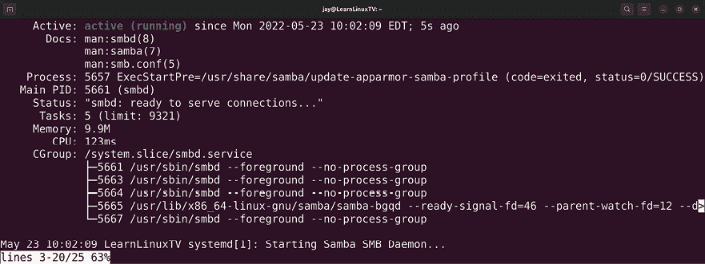

# 12

# 共享和传输文件

在前一章中，我们看到了设置一些网络服务（如 DHCP 和 DNS）涉及的过程。这些是网络的两个重要组成部分，但你可以在你的网络上提供许多不同类型的应用程序和资源，以进一步增强它。文件服务器就是其中的一个例子，它可以为用户提供一个集中存储关键文件的地方，甚至可以增强协作。

或许你之前使用过文件服务器，甚至在不同平台上设置过文件服务器。在 Ubuntu 服务器上，不仅有多种存储文件的方法，还可以通过网络链路将文件从一个节点传输到另一个节点。在本章中，我们将探讨如何使用 Samba 和 NFS 设置中央文件服务器，以及如何使用`scp`和`rsync`等工具在节点之间传输文件。我们还将讨论一些情况，在这些情况下，一种解决方案可能比另一种更适合你。在讨论这些概念时，我们将涵盖以下主题：

+   文件服务器考虑因素

+   通过 Samba 与 Windows 用户共享文件

+   设置 NFS 共享

+   使用`rsync`传输文件

+   使用`scp`传输文件

在我们开始配置服务器以使其能够与其他用户共享文件之前，我们首先应该了解一下我们可以选择的可用选项，以便为我们的用例选择最佳技术。

# 文件服务器考虑因素

在设置文件服务器方面，过程是设置某种守护程序以接受连接并共享特定目录，并确保适当的用户能够访问这些目录。您还将实施权限以确定谁可以访问特定目录，以及他们将拥有的访问类型（读/写、只读等）。在决定如何共享文件时，通常是在两种常见技术之间进行选择，即**Samba**和**NFS**。

总的来说，没有什么可以阻止您在单个服务器上托管 Samba 和 NFS 共享。这两种技术实际上可以在同一设备上共存。然而，这两种流行的解决方案各自更适合特定的用例。在开始设置文件服务器之前，我们应该先了解 Samba 和 NFS 之间的区别，以便能够就我们的环境选择更合适的一个。作为一个经验法则，Samba 非常适合混合环境（其中既有 Windows 客户端也有 Linux 客户端），而 NFS 更适合在 Linux 或 Unix 环境中使用，但实际情况比这复杂得多。

Samba 是许多环境中的一个好方案，因为它允许你与 Windows、Linux 和 macOS 机器共享文件。基本上，只要你赋予权限，几乎所有人都能访问你的共享。之所以能够这样，是因为 Samba 是 **服务器消息块**（**SMB**）协议的重新实现，而该协议主要由 Windows 系统使用。然而，你不需要使用 Windows 平台也能访问 Samba 共享，因为许多平台都支持这一协议。

你可能会想知道，为什么我在这一章会讲解两种不同的解决方案。毕竟，如果 Samba 共享几乎能被所有设备和用户访问，为什么还要考虑其他的呢？尽管 Samba 有许多优点，但也有一些缺点。首先，权限的处理方式差异很大，因此你需要以特定的方式配置共享，以防止那些不应访问机密数据的用户进入。而 NFS 完全支持标准 UNIX 权限，因此你只需配置一次权限。如果权限和机密性对你来说很重要，可能需要更仔细地考虑 NFS。

说 Windows 系统无法访问 NFS 共享并不准确，因为某些版本实际上是可以的。默认情况下，Windows 的任何版本都不直接支持 NFS，但一些版本提供了一个插件，可以让你安装它以启用此支持。如果你安装了 **NFS 服务**，从那时起，你的 Windows 安装将能够访问 NFS 共享。

关于全 Linux 环境或只有 Linux 机器需要访问共享的情况，NFS 是一个不错的选择，因为它与操作系统的集成更加紧密。权限可以更容易地进行控制，并且根据硬件的不同，性能可能更高。具体的环境会帮助你做出决定。也许你会为混合环境选择 Samba，或为全 Linux 环境选择 NFS。也可能你会同时设置 NFS 和 Samba，为每个平台提供共享。我建议你学习并实践这两种方案，因为无论如何，你在职业生涯的某个时刻都将使用到这两种解决方案。

在继续设置 Samba 和 NFS 的部分之前，我建议您首先确定您的文件系统中哪个位置作为文件共享的父目录。这并非必需，但我认为这样更有利于组织。并没有一个固定的地方来存储您的共享文件，但我个人喜欢在 `root` 文件系统下创建一个 `/share` 目录，并在其中创建子目录用于我的网络共享。例如，我可以创建 `/share/documents`、`/share/public` 等用于 Samba 共享的子目录。关于 NFS，我通常在 `/exports` 下创建共享目录。您可以选择如何设置您的目录结构。在阅读本章的其余部分时，请确保根据您的需要更改示例路径。

# 通过 Samba 向 Windows 用户共享文件

在这一部分，我将向您介绍如何设置您自己的 **Samba** 文件服务器。我还将讲解一个示例配置，以帮助您入门，以便您可以添加自己的共享。首先，我们需要确保在我们的服务器上安装了 `samba` 软件包：

```
sudo apt install samba 
```

当您安装 `samba` 软件包时，您的服务器上将安装一个新的守护程序 `smbd`。`smbd` 守护程序将自动启动和启用。同时，您还将获得一个位于 `/etc/samba/smb.conf` 的默认 Samba 配置文件。目前，我建议停止 `samba`，因为我们还没有配置它：

```
sudo systemctl stop smbd 
```

由于我们将从头开始配置 Samba，我们应该从一个空白的配置文件开始。让我们备份原始文件，而不是直接覆盖它。默认文件包含一些有用的注释和示例，所以我们应该保留它以备将来参考：

```
sudo mv /etc/samba/smb.conf /etc/samba/smb.conf.orig 
```

现在，我们可以开始一个全新的配置。虽然这不是必需的，但我喜欢将我的 Samba 配置分成两个文件，`/etc/samba/smb.conf` 和 `/etc/samba/smbshared.conf`。你不一定要这样做，但我认为这样可以使配置更清晰、更易于阅读。首先，这是一个 `/etc/samba/smb.conf` 文件的示例：

```
[global] 
server string = File Server 
workgroup = WORKGROUP 
security = user 
map to guest = Bad User 
name resolve order = host bcast wins 
include = /etc/samba/smbshared.conf 
```

正如您所见，这是一个非常简短的文件。基本上，我们只包括了设置 Samba 文件服务器所需的行。接下来，我将解释每一行及其作用。

```
[global] 
```

使用 `[global]` 部分，我们声明了配置的全局部分，其中包含将影响整个 Samba 的设置。还会有额外的部分用于单独的共享，我们稍后会讨论到。

```
server string = File Server 
```

`server string` 在某种程度上是 `File Server` 的描述字段。如果您以前从 Windows 计算机浏览网络，可能已经看到这个字段。无论您在此处键入什么内容，都将显示在 Windows Explorer 中服务器名称下方。这不是必需的，但是有这个字段还是挺不错的。

```
workgroup = WORKGROUP 
```

在这里，我们设置了 `workgroup`，它与 Windows PC 上的 `workgroup` 完全相同。简而言之，工作组是一个命名空间，用于描述一组计算机。在 Windows 系统中浏览网络共享时，你会看到一组工作组列表，然后在该工作组中看到一台或多台计算机。简而言之，这是用来逻辑地将你的节点进行分组的方法。你可以将它设置为任何你喜欢的名称。如果你已经在组织中有一个工作组，你应该在这里设置它，以匹配其他计算机的工作组名称。如果你没有自定义工作组名称，Windows PC 上的默认工作组名称就是 `WORKGROUP`。

```
security = user 
```

这个设置配置 Samba 使用用户名和密码进行服务器身份验证。在这里，我们将 `security` 模式设置为 `user`，这意味着我们使用本地用户进行身份验证，而不是使用 `ads`（Active Directory）或 `domain`（域控制器）等其他选项，这些选项都不在本书的范围内。

```
map to guest = Bad User 
```

这个选项配置 Samba 将未认证的用户视为访客用户。基本上，未认证的用户仍然可以访问共享，但他们将拥有访客权限，而不是完全权限。如果你不希望这样，你可以从文件中省略这一行。请注意，如果你省略了这一行，你需要确保服务器和客户端计算机两边的用户帐户名称是相同的。理想情况下，我们希望使用基于目录的身份验证，但那超出了本书的范围。

```
name resolve order = host bcast wins 
```

`name resolve order` 设置配置 Samba 如何解析主机名。在这个设置中，我们首先使用广播名称，然后是 `wins`。由于 `wins` 已经基本上被弃用（并被 DNS 取代），我们在这里包含它只是为了兼容遗留网络。

```
include = /etc/samba/smbshared.conf 
```

记得我提到过我通常会将我的 Samba 配置分成两个文件吗？在这一行，我正在调用第二个 `/etc/samba/smbshared.conf` 文件。`smbshared.conf` 文件的内容将在这里插入，就像我们只有一个文件一样。我们还没有创建 `smbshared.conf` 文件。接下来让我们来创建它。这是一个示例 `smbshared.conf` 文件：

```
[Documents] 
path = /share/documents 
force user = myuser 
force group = users 
public = yes 
writable = no 

[Public] 
path = /share/public 
force user = myuser 
force group = users 
create mask = 0664 
force create mode = 0664 
directory mask = 0777 
force directory mode = 0777 
public = yes 
writable = yes 
```

正如你所看到的，我将共享声明分离到它们自己的文件中。我们可以在 `smbshared.conf` 中看到一些有趣的内容。首先，我们有两个段落，`[Documents]` 和 `[Public]`。每个段落都是一个共享名称，它将允许 Windows 用户通过 `//servername/share-name` 访问共享。在这种情况下，这个文件将为我们提供两个共享：`//servername/Documents` 和 `//servername/Public`。`Public` 共享对所有人可写，而 `Documents` 共享则限制为只读。`Documents` 共享具有以下选项：

```
path = /share/documents 
```

这是共享的路径，它必须存在于服务器的文件系统中。在这种情况下，当用户在 Windows 系统上从 `//servername/Documents` 读取文件时，他们实际上是在从托管共享的 Ubuntu 服务器上的 `/share/documents` 读取数据。

```
force user = myuser 
force group = users 
```

这两行基本上是绕过了用户所有权。当用户访问此共享时，他们会被当作 `myuser` 而不是他们实际的用户帐户。通常，你会希望设置 LDAP 或 Active Directory 来管理你的用户帐户，并处理它们与 Ubuntu 服务器的映射，但本书并未详细讨论基于目录的用户访问，因此我提供了 `force` 选项作为一个简单的起点。你在这里设置的用户帐户必须存在于服务器上。

```
public = yes 
writable = no 
```

通过这两行配置，我们设置了连接到此共享后的用户可以做什么。在这种情况下，`public = yes` 意味着共享是公开可用的，尽管 `writable = no` 防止任何人对该共享的内容进行更改。如果你想与他人共享文件，但又想限制访问并阻止任何人修改内容，这是很有用的。

`Public` 共享具有一些在 `Documents` 共享中没有的额外设置：

```
create mask = 0664 
force create mode = 0664 
directory mask = 0777 
force directory mode = 0777 
```

通过这些选项，我正在设置如何处理当新内容添加到共享时，文件和目录的权限。目录将被赋予 `777` 权限，而文件将被赋予 `664` 权限。是的，这些权限非常开放；请注意，共享名为 `Public`，意味着无论如何都应有完全访问权限，它的预期用途是存放那些不涉及机密或限制的数据：

```
public = yes 
writable = yes 
```

就像我在之前的共享中做的那样，我设置了共享为公开可用，但这次我还配置它允许用户进行更改。

为了利用此配置，我们需要启动 Samba 守护进程。在此之前，我们要再次检查我们在 `smbshared.conf` 文件中输入的目录是否存在，所以如果你使用我的示例，你需要创建 `/share/documents` 和 `/share/public`：

```
sudo mkdir /share
sudo mkdir /share/documents
sudo mkdir /share/public 
```

此外，强制用户中提到的用户帐户和强制组中提到的组必须都存在并且对共享目录拥有所有权：

```
sudo chown -R jay:users /share 
```

此时，使用 `testparm` 命令是个好主意，它将测试我们的 Samba 配置文件的语法。它不一定能发现我们可能犯的每一个错误，但它是一个快速检查配置是否正常的好命令。此命令首先会检查语法，然后会将整个配置打印到终端，供你查看。如果你在这里没有看到错误，那么可以继续启动服务：

```
sudo systemctl start smbd 
```

然后，检查状态以确保守护进程正在运行：

```
sudo systemctl status smbd 
```

这将产生类似以下内容的输出：

图 12.1：检查 smbd 守护进程的状态

这应该就是全部了；你现在应该有 `Documents` 和 `Public` 共享在你的文件服务器上，Windows 用户应该能够访问这些共享。实际上，你的 Linux 机器也应该能够访问这些共享。在 Windows 上，**Windows 资源管理器**能够浏览你网络上的文件共享。如果有疑问，尝试同时按下 *Windows* 键和 *r* 键，打开 **运行** 对话框，然后输入共享的 **通用命名约定**（**UNC**）路径（例如 `\\servername\Documents` 或 `\\servername\Public`）。你应该能够看到存储在这两个目录中的任何文件。对于 `Public` 共享，你也应该能够在那里创建新文件。

在 Linux 系统中，如果安装了桌面环境，大多数桌面环境都带有支持浏览网络共享的文件管理器。由于有多种不同的桌面环境可供选择，方法因发行版或配置的不同而有所不同。通常，大多数 Linux 文件管理器都会在文件管理器中有一个网络链接，允许你轻松浏览本地共享。以 Ubuntu 为例，你可能需要通过 `apt` 安装 `smbclient` 和 `cifs-utils`，如果遇到错误，可以尝试安装这些软件包。在以下截图中，一台 Ubuntu 22.04 桌面客户端正在浏览本地 Samba 服务器上的共享：


图 12.2：从 Linux 客户端浏览 Samba 共享

如果你的文件管理器没有显示服务器上可用的共享，你也可以通过在 `/etc/fstab` 文件中为其添加条目来访问 Samba 共享，例如以下内容：

```
//myserver/share/documents /mnt/documents cifs username=myuser,noauto 0 0 
```

然后，假设本地目录存在（示例中的`fstab`行是`/mnt/documents`），你应该能够使用以下命令挂载该共享：

```
sudo mount /mnt/documents 
```

在 `fstab` 条目中，我包含了 `noauto` 选项，这样系统在启动时不会自动挂载 Samba 共享（你需要手动使用 `mount` 命令来挂载）。如果你希望在启动时自动挂载 Samba 共享，可以将 `noauto` 改为 `auto`。但是，如果由于某种原因，托管 Samba 共享的服务器无法访问，你可能会在启动时遇到错误，这就是为什么我更倾向于使用 `noauto` 选项。

如果你希望在不添加 `fstab` 条目的情况下挂载 Samba 共享，以下示例命令应该能够实现；只需更改共享名称和挂载点，以匹配你的本地配置：

```
sudo mount -t cifs //myserver/Documents -o username=myuser /mnt/documents 
```

从这里开始，随意进行实验。你可以根据需要添加额外的共享，并根据自己的需求自定义 Samba 实现。在下一节中，我们将探讨 NFS。

# 设置 NFS 共享

Samba 的替代方案是**NFS**。它是一种非常好的方法，用于从 Linux 或 Unix 服务器向另一台 Linux 或 Unix 服务器共享文件。正如我在本章前面提到的，Windows 系统也可以访问 NFS 共享，但这需要启用一个附加组件。因此，在 Linux 或 Unix 环境中，NFS 是首选，因为它完全支持 Linux 和 Unix 风格的权限。正如我们之前深入了解 Samba 时看到的，我们基本上强制要求所有共享目录都以特定用户身份进行访问，虽然这种做法有些混乱，但它是最简单的 Samba 服务器设置示例，而不需要我们进一步讲解复杂的 Windows Active Directory 部署。Samba 当然可以支持基于用户的访问限制，并且在集中的目录服务器上会有很大的优势，尽管那几乎会成为一本书！NFS 在非混合环境中更具集成性。

之前，我们在文件系统中设置了一个父目录来存放我们的 Samba 共享，NFS 也应该做同样的事情。虽然对于 Samba 来说，拥有一个专门的父目录并不是强制要求（我让你这么做是为了保持整洁，但你并不一定需要这么做），但 NFS 确实希望有一个自己的目录来存放所有共享。虽然 NFS 也不是严格要求这样做，但这样做有额外的好处，我将在本节结束前进行说明。在我的例子中，我将使用`/exports`作为示例，因此你应该确保该目录或你为 NFS 选择的目录已经存在：

```
sudo mkdir /exports 
```

接下来，让我们在服务器上安装所需的 NFS 软件包。以下命令将安装 NFS 及其依赖项：

```
sudo apt install nfs-kernel-server 
```

一旦你安装了`nfs-kernel-server`软件包，`nfs-kernel-server`守护进程将自动启动。它还会创建一个默认的`/etc/exports`文件（这是 NFS 读取共享信息的主要文件），但该文件并不包含任何有用的设置，仅包含一些注释行。让我们备份`/etc/exports`文件，因为我们将创建我们自己的文件：

```
sudo mv /etc/exports /etc/exports.orig 
```

为了设置 NFS，首先让我们创建一些将与其他用户共享的目录。在 NFS 中，每个共享目录被称为**export**。我将使用以下目录作为示例，但你可以导出任何你喜欢的目录：

```
/exports/backup 
/exports/documents 
/exports/public 
```

在`/etc/exports`文件中（我们正在重新创建这个文件），我将插入以下四行：

```
/exports *(ro,fsid=0,no_subtree_check) 
/exports/backup 192.168.1.0/255.255.255.0(rw,no_subtree_check) 
/exports/documents 192.168.1.0/255.255.255.0(ro,no_subtree_check) 
/exports/public 192.168.1.0/255.255.255.0(rw,no_subtree_check) 
```

第一行是我们的**导出根目录**，稍后我会详细介绍。接下来的三行是单独的共享或导出。`/backup`、`/documents`和`/public`目录是从`/exports`父目录共享的。在这种情况下，目录在一行中被调用后，我们还会设置哪些网络能够访问它们（在我们的例子中是`192.168.1.0`/`255.255.255.0`）。这意味着如果你从不同的网络连接，访问将被拒绝。每台连接的机器必须是`192.168.1.0/24`网络的成员才能继续操作（所以确保你修改这个以匹配你的 IP 方案）。最后，我们为每个导出项包含一些选项，例如`rw,no_subtree_check`。

至于这些选项的作用，第一个（`rw`）是相当直观的。在这里，我们可以设置其他节点是否可以对导出中的数据进行更改。在我给出的例子中，`/documents`导出是只读的（`ro`），而其他的则允许读写。

每个示例中的下一个选项是`no_subtree_check`。这个选项已知可以提高可靠性，并且默认情况下通常会隐式启用。然而，如果不包括它，NFS 在重启时可能会发出警告，但不会真正阻止其正常工作。具体来说，这个选项禁用了所谓的**子树检查**，以前这个功能曾出现过一些稳定性问题。通常，当一个目录被导出时，NFS 可能还会扫描父目录，这有时会导致问题，尤其是在处理打开的文件句柄时。

还有一些其他选项可以包含在`export`中，你可以通过查看`export`的手册页面了解更多内容：

```
man exports 
```

在实际使用中，你会经常看到一个选项是`no_root_squash`。通常，系统中的`root`用户会被映射为另一个系统中的`nobody`用户，出于安全原因。在大多数情况下，一个系统对另一个系统拥有`root`权限是一个不好的主意。`no_root_squash`选项禁用这一点，它允许一端的`root`用户在另一端被当作`root`用户处理。就我个人而言，我想不出这种设置有什么用处（甚至不推荐使用），但我在实际中确实经常看到这个选项，所以我觉得有必要提一下。再次提醒，查看`export`的手册页面以获取更多关于你可以传递给导出的附加选项的详细信息。

接下来，在我们完成 NFS 设置之前，还有一个文件需要编辑。`/etc/idmapd.conf`文件用于映射一个节点上的权限到另一个节点。在*第二章*，*管理用户和权限*中，我们讨论了每个用户都有一个分配给他们的 ID（UID）。然而，问题在于，从一个系统到另一个系统，用户的 UID 通常是不同的。例如，用户`jdoe`在服务器 A 上的 UID 可能是`1001`，但在服务器 B 上是`1007`。对于 NFS 来说，这就非常混淆了，因为 UID 用于引用权限。通过`idmapd`映射 ID 可以保持一致，并确保正确地转换每个用户，尽管它必须在每个节点上正确且一致地配置。基本上，只要你在每个服务器和客户端上使用相同的域名，并且在每个节点上正确配置`/etc/idmapd.conf`文件，你就应该没问题。

要配置此项，打开`/etc/idmapd.conf`文件，并用文本编辑器查找类似于以下内容的选项：

```
# Domain = localdomain 
```

首先，删除该行前的`#`符号，以取消注释。然后，将域名更改为与你网络中其他部分使用的域名匹配。只要它在每个节点上相同，你可以保持默认值不变，但如果你记得在*第十一章*，*设置网络服务*中，我们在 DHCP 配置中使用了`local.lan`作为示例域名，所以最好确保在每个地方使用相同的域名——甚至包括 DHCP 提供的域名。基本上，只要尽量保持一致，你整体会更轻松。你还需要在每个将访问文件服务器的节点上编辑`/etc/idmapd.conf`文件，以确保它们也配置得相同。

在我们配置了`/etc/exports`和`/etc/idmapd.conf`文件，并假设你已经在文件系统上创建了导出的目录后，我们应该准备好重启 NFS 以激活我们的配置：

```
sudo systemctl restart nfs-kernel-server 
```

重启 NFS 后，你应该通过`systemctl`检查守护进程的输出，以确保没有错误：

```
systemctl status nfs-kernel-server 
```

只要没有错误，我们的 NFS 服务器应该就可以正常工作了。现在，我们只需要学习如何在另一台系统上挂载这些共享。与 Samba 不同，使用 Linux 文件管理器并浏览网络默认不会显示 NFS 导出；我们需要手动挂载它们。客户端机器，假设它们是基于 Debian 的（例如 Ubuntu），需要安装`nfs-common`软件包才能访问这些导出。

它可能已经安装好了，但如果没有，我们可以像安装其他软件包一样使用`apt`进行安装：

```
sudo apt install nfs-common 
```

客户端安装完成后，我们现在可以使用`mount`命令在客户端挂载 NFS 导出。例如，针对我们的`documents`导出，我们可以使用以下变体的`mount`命令来完成这项工作：

```
sudo mount myserver:/documents /mnt/documents 
```

将`myserver`替换为你的服务器主机名或 IP 地址，将`documents`替换为服务器上实际共享的名称，将`/mnt/documents`替换为你在本地服务器上希望挂载共享的路径。从此以后，你应该能够访问文件服务器上`documents`导出的内容。然而请注意，服务器上的导出目录是`/exports/documents`，但我们在示例`mount`命令中只要求`/documents`，而没有提供完整路径。之所以这样有效，是因为我们指定了`/exports`作为导出根目录。为了避免你来回翻看，这里是`/etc/exports`文件中的第一行，我们在其中指定了导出根目录：

```
/exports *(ro,fsid=0,no_subtree_check) 
```

通过导出根目录，我们基本上设置了 NFS 导出的基准目录。我们将其设置为只读（`ro`），因为我们不希望任何人对`/exports`目录本身进行更改。`/exports`中的其他目录有自己的权限，因此会在每个导出的基础上覆盖`ro`设置，因此没有必要将我们的导出根目录设置为其他任何东西，除了只读。设置了导出根目录后，我们在挂载时无需调用导出的完整路径，只需要目录名。这就是为什么我们可以从`myserver:/documents`挂载 NFS 导出，而不必输入完整路径。虽然这样可以节省一些输入，但它也有用，因为从用户的角度来看，他们不需要了解服务器上的底层文件系统。用户完全不需要记住服务器从`/exports`共享了一个文档目录的事实；他们只关心如何访问他们的数据。另一个好处是，如果我们需要将导出根目录移到其他目录（例如在维护期间），用户不需要修改他们的配置来引用新的位置；他们只需要卸载并重新挂载导出即可。

所以，到这个时候，你的文件服务器将导出三个目录，并且你可以根据需要随时添加其他目录。然而，每当你添加一个新的导出时，它不会被 NFS 自动添加并读取。你可以重启 NFS 来激活新的导出，但在用户可能已经连接到它们的情况下，这样做其实并不是一个好主意，因为这会打断他们的访问。幸运的是，下面的命令可以让 NFS 重新读取`/etc/exports`文件，而不会干扰现有的连接。这样，你可以立即激活新的导出，而不必等待用户完成他们正在进行的工作：

```
sudo exportfs -a 
```

处理完这一部分后，你应该能够从你的 Ubuntu 服务器导出一个目录，然后将该导出挂载到另一台 Linux 机器上。随时练习创建和挂载导出，直到你掌握为止。此外，在查阅 `exports` 的 man 页面后，你还应该熟悉 `/etc/exports` 文件中允许的一些附加选项和设置。

正如你在这一部分中看到的，`/etc/exports` 文件通常是设置基本 NFS 文件服务器所需的全部。然而，你还应该知道，Ubuntu 22.04 中新增了一个配置文件 `/etc/nfs.conf`。这个文件的目的是调整 NFS 服务器的细节配置。虽然本章范围不包括 `/etc/nfs.conf` 文件的讲解，但查看这个文件仍然值得，这样你可以了解有哪些可用的选项。有关更多信息，请参见本章末尾的进一步阅读部分。

当你已经不能再忍受更多的 NFS 实践时，我们将转向几种方法，让你能够在不需要设置中间服务或守护进程的情况下，从一个节点复制文件到另一个节点。

# 使用 rsync 传输文件

在 Linux 和 Unix 世界中，成千上万的工具和实用程序中，**`rsync`** 是最受欢迎的工具之一。这是一个你可以用来轻松将数据从一个地方复制到另一个地方的工具，并且提供了许多选项，可以让你非常精确地控制数据的传输方式。它的许多使用案例包括在保留权限的同时复制文件、在备份替换文件时复制文件，甚至设置增量备份。如果你还不知道如何使用 **`rsync`**，你可能会想要多加练习，因为它将成为你作为 Linux 管理员的职业生涯中不可或缺的工具，而且 Linux 社区普遍假设你已经知道如何使用它。幸运的是，**`rsync`** 并不难学。大多数管理员可以在一个小时或更短的时间内学会基本用法，而无数可用选项会让你即使多年后仍能学到新的技巧。

另一个使`rsync`灵活的方面是，你可以以多种方式操作源目录和目标目录。我之前提到过，`rsync`是一个可以用来将数据从一个地方复制到另一个地方的工具。这么做的好处在于，源和目标目录实际上可以是你想要的任何地方，只要你有适当的访问权限。例如，`rsync`最常见的用途是将数据从一个服务器的目录复制到另一个服务器的目录，跨越网络进行传输。然而，你甚至不需要使用网络；你也可以将数据从同一台服务器的一个目录复制到另一个目录。虽然刚开始看起来这似乎不是一个非常有用的操作，但想一想，目标目录可能是一个挂载点，指向备份磁盘，或者是一个 NFS 共享，实际上存在于另一台服务器上。这也可以反向操作：如果需要，你也可以将数据从网络位置复制到本地目录。

要开始练习`rsync`，我建议你找到一些示例文件进行操作。也许你有一些可以使用的文档、MP3 文件、视频、文本文件，或者基本上任何你手头有的数据。重要的是要先制作这些数据的副本。如果我们犯了错误，可能会覆盖掉一些内容，所以在练习时最好使用数据的副本，或者是你不太在意的数据。如果你没有任何文件可以使用，你可以创建一些文本文件。这个练习的目的是从一个地方复制文件到另一个地方；其实你复制什么或者将它发送到哪里并不重要。我会带你逐步进行一些`rsync`的示例，难度会逐渐增加。前几个示例会向你展示如何备份`home`目录，但后面的示例可能会有潜在的破坏性，因此你可能希望使用示例文件，直到你掌握技巧。

这是我们的第一个示例：

```
sudo rsync -r /home/myuser /backup 
```

通过这个命令，我们使用`rsync`（作为`root`）将`myuser`目录的`home`目录内容复制到备份目录`/backup`（确保目标目录存在）。在示例中，我使用了`-r`选项，意味着`rsync`也会递归地抓取目录。你现在应该能在`/backup`目录中看到`/home/myuser`目录的副本。

然而，我们遇到了一点问题。如果你查看`/backup/myuser`目录的权限，你会看到目标目录中的所有内容现在都归`root`所有。这并不是一个好现象；当你备份一个用户的`home`目录时，你应该保留他们的权限。此外，你还应该尽可能保留所有的元数据，包括时间戳等信息。我们再试试`rsync`的另一种变体。不要担心`/backup`已经包含我们之前备份的`myuser` home 目录。我们再次执行备份，但这次我们将使用`-a`选项：

```
sudo rsync -a /home/myuser /backup 
```

这一次，我们将 `-r` 选项替换为 `-a`（归档模式），它尽可能保留所有元数据（在大多数情况下，它应该能确保一切都是精确的复制）。你现在应该注意到的是，备份中的权限与我们复制的用户 `home` 目录中的权限匹配。文件的时间戳也将一致。这是因为每次运行 `rsync` 时，它都会复制与上次运行时不同的内容。我们第一次备份的文件已经存在，但权限不正确。当我们运行第二个命令时，`rsync` 只需要复制不同的内容，因此它为文件应用了正确的权限。如果自上次运行命令以来源目录中有新文件被添加，那么新文件或更新的文件也会被复制过去。

`archive` 模式（我们在前一个命令中使用的 `-a` 选项）实际上非常流行；你可能在旅途中经常看到它。`-a` 选项实际上是一个包装选项，它同时包括以下所有选项：

```
-rlptgoD 
```

如果你对这些选项的具体作用感到好奇，可以查看 `rsync` 的手册页，获取更详细的信息。总结来说，`-r` 选项表示递归地复制数据（这一点我们已经知道），`-l` 选项复制符号链接，`-p` 保留权限，`-g` 保留组所有权，`-o` 保留所有者，`-D` 保留设备文件。如果把这些选项组合起来，我们就得到了 `-rlptgoD`。因此，`-a` 实际上等同于 `-rlptgoD`。我觉得 `-a` 更容易记住。

`archive` 模式很好用，但如果能看到 `rsync` 在运行时的状态是不是更好呢？添加 `-v` 选项并再次尝试该命令：

```
sudo rsync -av /home/myuser /backup 
```

这一次，`rsync` 会在终端显示它运行时的操作 (`-v` 激活了 **详细模式**) 。这是我最喜欢的 `rsync` 命令变体之一，因为我喜欢复制所有内容并保留所有元数据，同时也能看到 `rsync` 在工作时的状态。

如果我告诉你 `rsync` 默认支持 SSH，你信吗？这是真的！通过使用 `rsync`，你可以轻松地从一个节点将数据复制到另一个节点，甚至通过 SSH。所有选项都适用，因此你不需要做任何不同的操作，只需将 `rsync` 指向另一台服务器，而不是本地服务器上的其他目录：

```
sudo rsync -av /home/myuser admin@192.168.1.5:/backup 
```

在这个例子中，我将 `myuser` 用户的 `home` 目录复制到服务器 `192.168.1.5` 上的 `/backup` 目录。我以 `admin` 用户身份连接到另一台服务器。确保你根据需要更改用户账户和 IP 地址，同时确保你使用的账户有访问 `/backup` 目录的权限。当你运行此命令时，系统应该会提示你输入 SSH 密码，就像你通过普通 SSH 连接到服务器时一样。连接建立后，文件将被复制到目标服务器和目录。

现在，我们将进入一些更酷的示例（其中一些可能具有破坏性），我们可能不想使用实际的`home`目录来做这些，除非是一个测试账户，并且你不在乎其内容。正如我之前提到的，你应该有一些测试文件来进行练习。在练习时，只需将我的目录替换为你的目录。这里有另一个值得尝试的变体：

```
sudo rsync -av --delete /src /target 
```

现在我向你介绍`--delete`选项。这个选项允许你同步两个目录。让我解释一下为什么这个选项很重要。直到现在，我们的每个`rsync`例子都在将文件从 A 点复制到 B 点，但我们没有删除任何文件。例如，假设你已经使用`rsync`将 A 点的内容复制到了 B 点。然后，你从 A 点删除了一些文件。当你再次使用`rsync`将文件从 A 点复制到 B 点时，你在 A 点删除的文件不会在 B 点被删除，它们仍然会存在。这是因为默认情况下，`rsync`只是将数据从一个位置复制到另一个位置，但并不删除任何东西。使用`--delete`选项后，你实际上是在同步这两个位置，因此你告诉`rsync`通过删除目标位置中已不再存在于源位置的文件来使它们一致。

接下来，我们将添加`-b`（备份）选项：

```
sudo rsync -avb --delete /src /target 
```

这个选项特别有用。通常，当`/src`上的文件被更新并复制到`/target`时，`/target`上的文件将被新版本覆盖。但如果你不想替换任何文件呢？`-b`选项会重命名在目标位置被覆盖的文件，因此你仍然可以保留原始文件。如果你添加了`--backup-dir`选项，事情会变得更有趣：

```
sudo rsync -avb --delete --backup-dir=/backup/incremental /src /target 
```

现在，我们像之前一样将文件从`/src`复制到`/target`，但是我们现在将替换的文件发送到`/backup/incremental`目录。这意味着，当一个文件要被替换时，原始文件将被复制到`/backup/incremental`。之所以能这样工作，是因为我们使用了`-b`选项（备份），但我们也使用了`--backup-dir`选项，这意味着被替换的文件不会被重命名；它们将简单地被移动到指定目录中。这使我们能够有效地进行增量备份。

在我们之前的例子基础上，我们可以使用 Bash shell 本身使增量备份工作得更好。考虑这些命令：

```
CURDATE=$(date +%m-%d-%Y) 

sudo rsync -avb --delete --backup-dir=/backup/incremental/$CURDATE /src /target 
```

通过这个例子，我们获取当前日期并将其存储在一个变量中（`CURDATE`）。在命令的`rsync`部分，我们使用该变量作为`--backup-dir`选项的值。这会将替换的文件复制到一个以命令运行时的`date`命名的`backup`目录中。基本上，如果今天的日期是`08-17-2022`，那么执行的命令将与我们运行以下命令的结果相同：

```
sudo rsync -avb --delete --backup-dir=/backup/incremental/08-17-2022 /src /target 
```

希望你能看到 `rsync` 的灵活性，以及它如何不仅用于在目录和/或节点之间复制文件，还能作为备份解决方案（前提是你有一个远程目标来复制文件）。最棒的是，这只是个开始。如果你查阅 `rsync` 的手册页，你会发现还有许多选项可以进一步定制它。多加练习，你应该很快就能掌握它。

# 使用 SCP 传输文件

一个有用的替代方案是 **Secure Copy**（**SCP**）工具，它与 OpenSSH 客户端一起打包提供。它允许你快速地将文件从一个节点复制到另一个节点。虽然 `rsync` 也允许你通过 SSH 将文件复制到其他网络节点，但 SCP 更适合用于一次性任务；`rsync` 更适合更复杂的工作。如果你的目标是将单个文件或少量文件发送到另一台机器，SCP 是一个很好的工具，可以帮助你完成这项任务。如果没有别的，它也是你管理工具箱中的另一个好帮手。要使用 SCP，我们将使用 `scp` 命令。由于你很可能已经安装了 OpenSSH 客户端，因此应该已经可以使用 `scp` 命令了。如果你执行 `which scp`，你应该看到如下输出：

```
/usr/bin/scp 
```

如果你没有看到任何输出，确保已安装 `openssh-client` 包。

使用 SCP 与 `rsync` 非常相似。该命令需要一个源、一个目标和一个文件名。要将一个文件从本地机器传输到另一台机器，生成的命令可能如下所示：

```
scp myfile.txt jdoe@192.168.1.50:/home/jdoe 
```

在这个例子中，我们将 `myfile.txt` 文件（位于当前工作目录中）复制到位于 `192.168.1.50` 的服务器。如果目标服务器被 DNS 识别，我们本可以使用 DNS 名称而不是 IP 地址。此命令将作为用户 `jdoe` 连接到服务器，并将文件放入该用户的 `home` 目录。实际上，我们可以稍微简化一下这个命令：

```
scp myfile.txt jdoe@192.168.1.50: 
```

请注意，我省略了目标路径 `/home/jdoe`。由于如果你没有为 `scp` 命令提供目标路径，默认会将文件放入 `home` 目录，因此我可以省略目标路径。所以，无论我是否明确包含 `home` 目录的路径，`myfile.txt` 文件最终都会出现在 `/home/jdoe`。如果我想将文件复制到其他地方，我就必须指定目标位置。确保在复制文件时至少包含冒号，因为如果不包括它，你将把文件复制到当前工作目录，而不是目标目录。

`scp` 命令也可以反向工作：

```
scp jdoe@192.168.1.50:myfile.txt . 
```

在这个示例中，我们假设`myfile.txt`位于用户`jdoe`的`home`目录中。此命令将把该文件复制到我们本地机器的当前工作目录，因为我将本地路径指定为*一个点*（它对应于我们的当前工作目录）。在反向使用`scp`时并不总是实用的，因为你必须提前知道目标机器上文件的存储位置才能进行传输。

在我们之前的`scp`示例中，我们只复制了一个文件。如果我们想传输或下载整个目录及其内容，我们需要使用`-r`选项，这样可以执行递归复制：

```
scp -r /home/jdoe/downloads/linux_iso jdoe@192.168.1.50:downloads 
```

在这个示例中，我们正在将本地文件夹`/home/jdoe/downloads/linux_iso`复制到远程机器`192.168.1.50`。由于我们使用了`-r`选项，`scp`将传输`linux_iso`文件夹及其所有内容。在远程端，我们再次通过用户`jdoe`连接。请注意，目标路径仅为`downloads`。由于`scp`默认使用用户的`home`目录，这将把`linux_iso`目录从源机器复制到目标机器的`/home/jdoe/downloads`目录下。以下命令将产生完全相同的结果：

```
scp -r /home/jdoe/downloads/linux_iso jdoe@192.168.1.50:/home/jdoe/downloads 
```

`home`目录并不是`scp`命令假设的唯一路径。它还假设 SSH 在远程机器的端口`22`上监听。由于可以将服务器的 SSH 端口更改为其他端口，端口`22`可能并不是实际使用的端口。如果你需要为`scp`指定一个不同的端口，请使用`-P`选项：

```
scp -P 2222 -r /home/jdoe/downloads/linux_iso jdoe@192.168.1.50:downloads 
```

在这个示例中，我们通过端口`2222`连接到远程机器。如果你已经配置了 SSH 监听不同的端口，请相应地更改端口号。

尽管端口`22`始终是 OpenSSH 的默认端口，但一些管理员常常会将其更改为其他端口。虽然更改 SSH 端口在安全性方面并不会带来很大的好处（一个强力端口扫描仍然可以找到你的 SSH 守护进程），但这是一个相对容易的修改，而且将其设置为稍微难以发现一点是有益的。我们将在*第二十一章*中进一步讨论这个问题，*保护你的服务器*。

与 Linux 世界中的大多数命令一样，`scp`命令支持详细模式。如果你想查看`scp`命令在复制多个文件时的进度，可以添加`-v`选项：

```
scp -rv /home/jdoe/downloads/linux_iso jdoe@192.168.1.50:downloads 
```

好了，就是这样。`scp`命令并不是特别复杂或高级，但它非常适合那些你想要一次性从一个节点将文件复制到另一个节点的情况。由于它通过 SSH 复制文件，你可以从中受益于其安全性，并且它也很好地与现有的 SSH 配置集成。这种集成的一个例子是，`scp`会识别你的`~/.ssh/config`文件（如果你有的话），所以你可以进一步简化命令。试着多练习一下，在下一个部分中，我们将介绍 OpenSSH 的另一个技巧。

# 概要

在这一章中，我们探讨了多种访问远程资源的方式。几乎每个网络都有一个用于存储文件的中心位置，我们探索了使用 NFS 和 Samba 完成这一目标的两种方式。NFS 和 Samba 在数据中心中各有其用途，并且是我们可以将服务器上的资源提供给需要访问的用户的非常有用的方式。我们还讨论了`rsync`和`scp`，这两个无需设置永久共享即可传输数据的优秀实用工具。

接下来是 *第十三章*，*管理数据库*。现在我们的 Ubuntu 服务器网络上运行了各种有用的服务，看看如何服务数据库才是正经事。具体来说，我们将研究 MariaDB。到时见！

# 相关视频

+   教程`scp`：[`linux.video/scp`](https://linux.video/scp)

+   使用`rsync`备份 Linux 服务器：[`linux.video/rsync-backup`](https://linux.video/rsync-backup)

+   使用`rsync`传输文件：[`linux.video/rsync-transfer`](https://linux.video/rsync-transfer)

# 进一步阅读

+   Ubuntu `rsync` 文档：[`learnlinux.link/u-rsync`](https://learnlinux.link/u-rsync)

+   Ubuntu Samba 文档：[`learnlinux.link/u-smb`](https://learnlinux.link/u-smb)

+   服务 – NFS（包含 22.04 版本中 NFS 更改的额外信息）：[`learnlinux.link/u-nfs-1`](https://learnlinux.link/u-nfs-1)

+   Ubuntu NFS 文档：[`learnlinux.link/u-nfs-2`](https://learnlinux.link/u-nfs-2)

+   Active Directory 集成：[`learnlinux.link/u-ad`](https://learnlinux.link/u-ad)

# 加入我们的 Discord 社区

加入我们社区的 Discord 空间，与作者和其他读者进行讨论：

[`packt.link/LWaZ0`](https://packt.link/LWaZ0)


