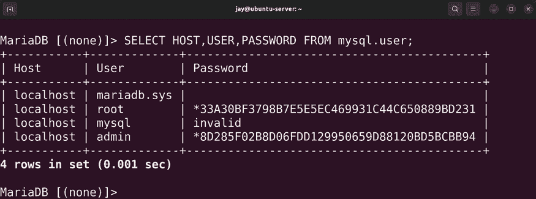

# 13

# 管理数据库

Linux 平台一直是托管数据库的热门选择。考虑到如今大多数流行网站的运行依赖于数据库，这是服务器必须承担的一个非常重要的角色。Ubuntu Server 也是非常受欢迎的选择，其稳定性为托管社区带来了重要的优势。这一次，我们将关注 MariaDB，MySQL 的一个流行分支。目标不是提供 MySQL 语法的完整讲解（因为那将是一本完整的书），而是专注于如何使用 MariaDB 设置和维护数据库服务器，甚至讲解如何在其之间设置主/从关系。如果你已经对数据库架构有了扎实的理解，这一章依然能让你受益，因为我们将特别讨论 Ubuntu 对 MariaDB 的实现，它的配置与其他平台有所不同。

在我们设置自己的 MariaDB 服务器时，我们将涵盖以下主题：

+   设置数据库服务器的准备工作

+   安装 MariaDB

+   理解 MariaDB 配置文件

+   管理 MariaDB 数据库

+   设置从数据库服务器

就像设置任何服务器一样，我们首先需要考虑目标，并根据目标进行规划。因此，在接下来的部分，我们将讨论在准备数据库服务器时需要考虑的一些更高层次的细节。

# 设置数据库服务器的准备工作

在我们开始设置数据库服务器之前，有一些琐事需要处理。随着本章的进行，我们将使用 MariaDB 设置一个基础的数据库服务器。我相信我的许多读者都对 MySQL 比较熟悉。MySQL 是一个经过验证的成熟解决方案，至今仍在许多数据中心中使用，并且在可预见的未来，仍将继续如此。很有可能你经常访问的一些热门网站，在其后台就使用了 MySQL。所以你可能会想，为什么不讲解 MySQL，而是选择 MariaDB 呢？

本书聚焦于 MariaDB 有两个原因。首先，Linux 社区的大多数用户正在转向 MariaDB（稍后会详细讨论），而且它也是 MySQL 的一个直接替代品。这意味着你已经为 MySQL 编写的任何数据库或脚本，很可能也能在 MariaDB 上正常运行，除非遇到某些特殊情况。反过来，你在 MariaDB 上练习的命令，也应该能在 MySQL 服务器上正常使用。这一点非常好，因为许多 MySQL 安装仍然在许多数据中心使用，而你也能支持这些安装。大多数情况下，当现有的基础设施可以迁移到 MariaDB 时，几乎没有理由继续使用 MySQL，而 Linux 社区也正朝着这个方向发展。

为什么会有这种变化？一段时间以前，各种 Linux 发行版开始从 MySQL 切换到 MariaDB。红帽（Red Hat）就是这样一个例子；它在 Red Hat Enterprise Linux 的第 7 版中就切换到了 MariaDB。其他发行版，如 Arch Linux 和 Fedora，也走上了同样的道路。这部分是由于对现在拥有 MySQL 的 Oracle 公司的不信任。当 Oracle 成为 MySQL 所有者时，开源社区对 MySQL 的未来以及其许可证提出了一些严重的问题。我不会对 Oracle、MySQL 的未来或与其未来相关的任何政治问题进行任何推测，因为这与本书无关（而且我不喜欢企业戏剧）。然而，事实是许多发行版正在向 MariaDB 迈进，而这似乎是未来。它是一项伟大的技术，基于多个与当前争议无关的原因，我强烈推荐它比 MySQL 更好。

MariaDB 不仅仅是 MySQL 的一个分支。它本身是一个非常称职的数据库服务器。现有的 MySQL 实现兼容性使其更易于采用。但更重要的是，MariaDB 对 MySQL 进行了一些非常有价值的改变和改进，这些改变只会使您受益。

你所喜爱的 MySQL 中的一切，都可以在 MariaDB 中找到，再加上一些独有的尖端功能。但更好的是，MariaDB 提供了比普通的 MySQL 更为高效和先进的额外集群选项。

所以，希望我已经向您展示了 MariaDB 的价值。最终，您是否真正使用它将取决于您组织的需求。我见过一些组织选择坚持使用 MySQL，即使只是因为他们熟悉它。我可以理解，如果一个解决方案在您的数据中心中已经证明有效，那么如果您的数据库堆栈运行良好，则没有理由改变它。因此，虽然我将讨论如何使用 MariaDB，但本章的示例可能也适用于 MySQL。如果有疑问，本章推荐使用 MariaDB。

关于您的服务器，一个良好的实施计划至关重要（一如既往）。我不会在这个方面花太多时间，因为我知道您可能已经在本书的一两段中提到了冗余的重要性（而且我相信在最后一页之前，我还会再提几次冗余）。此时，您可能只是在设置一个实验环境或测试服务器，以便在生产中运用这些概念之前练习这些技能。但是当您最终将数据库服务器投入生产时，计划长期稳定性至关重要。数据库服务器应定期备份、冗余（我又在说冗余了），并定期打补丁。在本章后面的部分，我将指导您设置一个次要的数据库服务器，它将处理冗余部分。

然而，光这样做还不够，因为定期备份非常重要。有很多工具可以帮助你完成这项任务，比如`mysqldump`，你也可以拍摄虚拟机的快照（前提是你不是使用物理服务器）。这两种解决方案都是有效的，取决于你的环境。作为一个曾经为客户恢复丢失的数据库服务器（客户没有备份或冗余）而浪费了一整天时间的人，我的目标只是希望你避免那种头疼的经历。

至于数据库服务器需要多少资源，这完全取决于你的环境。MariaDB 本身并不会占用大量资源，但和 MySQL 一样，你的使用量依赖于你的工作负载。你可能有几十个客户连接，或者几千个，甚至更多。但我肯定会推荐的一点是，为存储数据库文件的分区使用**逻辑卷管理器**（**LVM**）。从长远来看，这无疑会为你节省很多麻烦。正如我们在*第九章*《*管理存储卷*》中讨论的，LVM 使得扩展文件系统变得非常简单，特别是在虚拟机上。

如果你的数据库服务器运行在虚拟机上，当数据库分区快要满时，你可以向卷组中添加磁盘并扩展它，这样你的客户就永远不会察觉到会出现问题。如果没有 LVM，你需要关闭服务器，添加新的卷，使用`rsync`将数据库服务器文件传输到新位置，然后再启动服务器。根据数据库的大小，这个过程可能会持续几个小时。为了省事，使用 LVM 吧。

说完这些，我们可以开始设置 MariaDB 了。对于学习和测试目的，你可以使用几乎任何你喜欢的服务器：物理服务器、虚拟服务器或**虚拟私人服务器**（**VPS**）。一旦你准备好了，我们就可以开始了！

# 安装 MariaDB

现在我们进入了有趣的部分，安装 MariaDB。为了开始，我们将安装`mariadb-server`软件包：

```
sudo apt install mariadb-server 
```

如果你的组织倾向于继续使用 MySQL，安装的软件包是`mysql-server`：

```
sudo apt install mysql-server 
```

虽然你可能会想尝试同时对比 MySQL 和 MariaDB 的不同之处，但我不推荐在同一台服务器上从 MariaDB 切换到 MySQL（或反之）。我见过一些服务器在安装了其中一个软件包后又切换到另一个软件包时，出现了非常奇怪的配置问题（即便是清除配置之后）。大多数情况下，最好每台服务器只选择一个解决方案并坚持使用。一般来说，如果你需要支持旧的数据库，应该使用 MySQL。对于全新的安装，建议使用 MariaDB。

安装`mariadb-server`软件包后，请检查确保服务已经启动并启用。默认情况下，它应该已经在运行：

```
systemctl status mariadb 
```

接下来，我们需要为我们的 MariaDB 安装增加一些安全设置（尽管我们使用的是 MariaDB，但以下命令的名称并没有更新，仍然包含`mysql`）：

```
sudo mysql_secure_installation 
```

到此为止，我们还没有设置`root`密码，因此当脚本要求输入密码时，直接按*Enter*即可。脚本还会问你一些其他问题。你将被询问是否希望切换到**unix_socket 认证**。这个问题的默认答案是是，但我建议你回答否。这样可以确保使用密码认证，这对于兼容性来说更好。虽然切换到`unix_socket 认证`有安全上的好处，但对于我们的目的来说，密码认证已经足够。如果你决定深入学习数据库管理，未来切换到`unix_socket 认证`可能会更好。

接下来，`mysql_secure_installation`脚本会询问你是否要设置`root`密码。MariaDB 的`root`用户与系统上的`root`用户不同，你肯定应该为它设置一个密码。所以当出现这个问题时，按*y*表示你想要创建一个`root`密码，然后输入该密码两次。

在设置`root`密码后，脚本会询问你是否希望删除匿名用户，并且禁用远程访问数据库服务器。你应该对这两个问题都回答是。后者尤为重要，因为几乎没有任何情况下允许 MySQL/MariaDB 的公共访问是一个好主意。即使你为外部用户托管网站，这些用户只需要访问网站，而不是数据库服务器。网站本身将根据需要与数据库本地交互；外部连接是不必要的。（如果你有一个独立的数据库服务器并且该服务器不能公开访问互联网，那么你应该在这里回答是——只要确保数据库服务器不能被公开访问）。大多数情况下，继续执行，回答脚本询问的所有问题`yes`即可（除非你有充分的理由不这样做）。

执行完`mysql_secure_installation`后，整个过程如下所示，我已经为每个步骤包含了我推荐的回答（“y”表示是，“n”表示否）：

```
Enter current password for root (enter for none): 
Switch to unix_socket authentication [Y/n] n
Set root password? [Y/n] y
Remove anonymous users? [Y/n] y
Disallow root login remotely? [Y/n] y
Remove test database and access to it? [Y/n] y
Reload privilege tables now? [Y/n] y 
```

到目前为止，我们已经拥有了一个完全功能性的数据库服务器。之前的命令让我们能够应用一些基本的安全设置，现在我们的数据库服务器已经可以使用了。为了连接到它并进行管理，我们将使用`mariadb`命令访问 MariaDB 的命令行，在这里我们将输入命令来管理我们的数据库。实际上，有两种方法可以连接到这个命令行。第一种方法是简单地使用带有`sudo`的`mariadb`命令：

```
sudo mariadb 
```

这个特定的命令有效，因为如果你以 `root` 身份使用 `mariadb` 命令（我们在这个例子中使用了 `sudo`），密码会被绕过。实际上，我们甚至没有输入用户名；如果你使用 `sudo` 访问 MariaDB，默认会假定是 `root`。这是连接的最简单方式。然而，如果你使用过其他 Linux 发行版，可能更习惯于另一种身份验证方法：输入用户名和密码。在这种情况下，命令将如下所示（但默认情况下不会起作用）：

```
mariadb -u root -p 
```

当该命令正确执行时，它会要求你输入 `root` 密码，然后允许你进入 shell。

推荐创建一个不同的用户来管理你的 MariaDB 安装，因为在大多数情况下不推荐以 `root` 身份登录。我们将在本章稍后创建其他用户，但现在，`root` 账户是唯一可用的账户。通常的做法是使用 root 账户进行初步设置，然后为后续的管理工作创建一个不同的用户。不过，`root` 账户仍然常用于服务器维护，因此请根据自己的判断使用它。

现在我们已经可以访问 MariaDB shell，我们可以用它做些什么呢？我们在这个 shell 中执行的命令可以让我们进行诸如创建和删除数据库和用户、添加表格等操作。`mariadb` 命令来自 `mariadb-client-10.6` 包，该包在我们安装 `mariadb-server` 时作为依赖项一起安装。单独输入 `mariadb` 命令而不加任何选项，将连接到我们本地机器上的数据库服务器。这个工具还允许我们连接到外部数据库服务器，以便远程管理它们，稍后我们会讨论这个功能。

MariaDB shell 提示符将如下所示：

```
MariaDB [(none)]> 
```

我们稍后会深入讨论 MariaDB 命令和用户管理。现在，你可以退出 shell。要退出，你可以键入 `exit` 并按 *Enter* 键，或者按 *Ctrl* + *d* 键。

现在，我们的 MariaDB 服务器已经准备好。虽然你现在可以继续进入下一部分，但你可能想考虑在另一台机器上按照这些步骤设置另一个 MariaDB 服务器。如果你有空间为另一个虚拟机提供位置，现在做这件事可能是个好主意，因为稍后我们会设置一个备用数据库服务器。

# 理解 MariaDB 配置文件

现在我们已经安装了 MariaDB，让我们快速了解一下它的配置是如何存储的。尽管在本章中我们不会更改太多配置（除了添加与设置次要数据库实例相关的参数），但了解配置文件存放位置是一个好主意，因为将来开发者可能会要求你调整数据库配置。这可能涉及更改存储引擎、缓冲区大小或其他无数设置。关于性能调优的完整指南超出了本书的范围，但了解如何读取 MariaDB 的设置会很有帮助，因为 Ubuntu 的实现方式相当独特。

MariaDB 的配置文件存储在 `/etc/mysql` 目录中。在该目录下，你默认会看到以下文件：

```
debian.cnf 
debian-start 
mariadb.cnf 
my.cnf 
my.cnf.fallback 
```

你还会看到以下目录：

```
conf.d 
mariadb.conf.d 
```

MariaDB 启动时读取的配置文件是 `/etc/mysql/mariadb.cnf` 文件。想要配置守护进程时，你会首先查看这个文件，但我们很快就会讲到。`/etc/mysql/debian-start` 文件实际上是一个脚本，用于在 MariaDB 启动时设置默认值，例如设置一些环境变量。它还定义了一个任务，当 `mariadb` 进程崩溃或退出时执行，并允许检查崩溃的表。

`debian-start` 脚本还加载了 `/etc/mysql/debian.cnf` 文件，该文件为 `mariadb` 守护进程设置了一些客户端设置。以下是该文件中的一些值：

```
[client] 
host     = localhost 
user     = root 
[mysql_upgrade] 
host     = localhost 
user     = root 
```

这些值的默认设置已经足够，通常没有必要更改它们。实际上，这个文件设置了默认的用户、主机和套接字位置。如果你之前在其他平台上使用过 MySQL，你可能已经在 `/etc/my.cnf` 文件中见过许多这样的设置，它通常是 `mariadb` 守护进程的标准文件。在 Ubuntu Server 上使用 MariaDB 时，你会发现文件的默认布局发生了显著变化。

`/etc/mysql/mariadb.cnf` 文件设置了 MariaDB 的全局默认值。然而，在 Ubuntu 的实现中，这个默认文件只是包含了 `/etc/mysql/conf.d` 和 `/etc/mysql/mariadb.conf.d` 目录中的配置文件。在这些目录中，有许多文件以 `.cnf` 扩展名结尾。许多文件包含了通常会出现在单一文件中的默认配置值，但 Ubuntu 将这些设置模块化到单独的文件中。为了本书的目的，当我们需要设置主从服务器关系时，将编辑 `/etc/mysql/conf.d/mysql.cnf` 文件。

其他配置文件与本书的内容无关，它们的当前值已经足够满足我们的需求。在性能调优方面，你可以考虑创建一个新的以`.cnf`结尾的配置文件，文件中包含特定的调优值，这些值可以通过你想运行的软件包的文档或开发者给出的需求来提供。

要获取更多关于这些配置文件是如何被读取的信息，你可以参考`/etc/mysql/mariadb.cnf`文件，文件顶部包含一些有用的内容，详细说明了这些配置文件被读取的顺序及其目的。以下是该文件中这些注释的摘录：

```
# The MariaDB/MySQL tools read configuration files in the following order: 
# 1\. "/etc/mysql/mariadb.cnf" (this file) to set global defaults, 
# 2\. "/etc/mysql/conf.d/*.cnf" to set global options. 
# 3\. "/etc/mysql/mariadb.conf.d/*.cnf" to set MariaDB-only options. 
# 4\. "~/.my.cnf" to set user-specific options. 
```

如我们所见，当 MariaDB 启动时，它首先读取`/etc/mysql/mariadb.cnf`文件，然后是存储在`/etc/mysql/conf.d`目录中的`.cnf`文件，接着是存储在`/etc/mysql/mariadb.conf.d`目录中的`.cnf`文件，最后是任何可能存在于用户`home`目录中的`.my.cnf`文件，其中包含用户特定的设置。

在 Ubuntu 的实现中，当启动时读取`/etc/mysql/mariadb.cnf`文件时，系统将立即扫描`/etc/mysql/conf.d`和`/etc/mysql/mariadb.conf.d`的内容，因为`/etc/mysql/mariadb.cnf`文件包含以下几行：

```
!includedir /etc/mysql/conf.d/ 
!includedir /etc/mysql/mariadb.conf.d/ 
```

如你所见，配置文件检查的顺序是先检查`mariadb.cnf`文件，然后检查`/etc/mysql/conf.d`和`/etc/mysql/mariadb.conf.d`目录。

一开始这可能会有点令人困惑，因为在 Ubuntu Server 中 MariaDB 的默认配置基本上由重定向到其他文件的配置文件组成。但要点是，任何你进行的非 MariaDB 专属的配置更改（基本上是与 MySQL 本身兼容的配置）应放在以`.cnf`结尾的配置文件中，然后存储在`/etc/mysql/conf.d`目录中。

如果你想添加的配置是 MariaDB 独有的功能（但与 MySQL 本身不兼容），则应将配置文件放在`/etc/mysql/mariadb.conf.d`目录中。对于我们的目的，当我们设置主从复制时，我们将编辑`/etc/mysql/conf.d/mysql.cnf`文件，因为我们使用的方法并不特定于 MariaDB。

在本节中，我们讨论了 MariaDB 配置及其与其他平台实现的不同之处。配置文件的呈现方式并不是 Ubuntu 实现 MariaDB 的唯一不同点；还有其他差异。下一节中，我们将查看 Ubuntu 实现与其他 Linux 发行版实现之间的几种额外差异。

# 管理 MariaDB 数据库

现在我们的 MariaDB 服务器已经启动并运行，我们终于可以着手管理它了。在本节中，我将演示如何使用`mariadb`命令连接到数据库服务器，这将使我们能够创建数据库、删除（丢弃）它们，并管理用户和权限。

首先，我们需要为 MariaDB 创建一个管理员用户。`root`账户已经存在，作为默认的管理员账户，但允许其他人使用该账户并不安全。相反，为了管理我们的数据库，创建一个与`root`分开的管理员账户会更有意义。因此，我们将从管理用户开始讨论数据库管理。在 MariaDB 中管理的用户是特定于 MariaDB 的，它们与实际系统上的用户账户是分开的。

要管理和与数据库交互，我们需要进入 MariaDB shell，创建数据库用户时也是如此。现在，由于我们只有`root`账户，我们需要以`root`身份访问当前的 MariaDB 实例，以便设置管理员用户。如果你按照本章前面讨论的内容设置了标准认证，你可以通过标准方式访问提示符：

```
mariadb -u root -p 
```

或者，更简单的方式是：

```
sudo mariadb 
```

一旦进入 MariaDB shell，提示符会变成如下所示：

```
MariaDB [(none)]> 
```

现在，我们可以创建新的管理员用户。我在示例中将其命名为`admin`，但你可以使用任何你喜欢的名字。在我曾经工作的一个公司里，我们在服务器上使用了用户名`velociraptor`作为管理员用户，因为没有什么比迅猛龙更强大（而且它们可以开门）。你可以随意使用一个聪明的名字，但一定要记住它。使用非标准用户名有一个附加的安全优势，就是通过模糊化提高安全性；这个名字不会是入侵者预期的。

这是在 MariaDB 中创建新用户的命令（将命令中的用户名和密码替换为你所希望的凭据）：

```
CREATE USER 'admin'@'localhost' IDENTIFIED BY 'password';
FLUSH PRIVILEGES; 
```

在 MySQL 语法方面，命令不区分大小写（尽管数据参数区分大小写），但通常会将指令大写，以便与数据区分开来。在本章的其余部分，我们将在 Linux shell 中执行一些命令，在 MariaDB shell 中执行其他命令。我会告诉你每个命令需要在哪个 shell 中执行，但如果你感到困惑，只需要记住，只有 MariaDB 命令是大写的。

使用前面的命令，我们创建了`admin`用户，并将其限制为`localhost`。这是很重要的，因为我们不想将`admin`账户暴露给全世界。我们还执行了刷新权限操作，这会导致 MariaDB 重新加载其权限信息。每次添加用户或修改权限时，都应该运行`FLUSH PRIVILEGES`命令。我可能不会每次都提到需要运行此命令，所以你现在可以记住它并养成一个习惯。

如我之前所提到的，前面的命令创建了`admin`用户，但只允许它从`localhost`连接。这意味着管理员必须先登录到服务器本身，才能使用`admin`账户登录 MariaDB。以下命令是一个变体，允许从其他任何位置远程登录：

```
CREATE USER 'admin'@'%' IDENTIFIED BY 'password'; 
```

您能看到`%`符号替代`localhost`吗？这基本上意味着*任何地方*，这表示我们正在创建一个可以从任何来源（甚至外部节点）登录的用户。然而，通过使用第一个命令将用户限制为`localhost`，我们让服务器变得更加安全。您还可以限制访问特定的网络，如果您确实需要远程允许数据库管理员访问服务器的话，这样做是非常必要的：

```
CREATE USER 'admin'@'192.168.1.%' IDENTIFIED BY 'password'; 
```

这样稍微好一些，但仍然不如将登录限制为`localhost`安全。正如您所看到的，`%`字符基本上是一个通配符，因此您可以通过它来限制访问，只允许特定 IP 甚至特定子网的访问。

到目前为止，我们所做的只是创建了一个新用户；我们还没有赋予该用户任何权限。我们可以使用`GRANT`命令创建一组权限（也称为**授权**）。首先，我们让管理员用户在从`localhost`调用时可以完全访问数据库服务器：

```
GRANT ALL PRIVILEGES ON *.* TO 'admin'@'localhost'; 
FLUSH PRIVILEGES; 
```

现在，我们有了一个可以用来管理服务器数据库的管理员账户。我们可以使用这个账户来管理服务器，而不是使用`root`账户。任何已登录的 Linux 用户只要知道密码，就可以访问并管理数据库服务器。要以我们创建的`admin`用户身份进入 MariaDB 命令行，以下命令可以实现：

```
mariadb -u admin -p 
```

输入密码后，您将以`admin`身份登录 MariaDB。

此外，您实际上可以直接将密码提供给`mariadb`命令，而无需系统提示输入密码：

```
mariadb -u admin -p<password> 
```

请注意，`-p`选项和实际密码之间没有空格（尽管通常`-u`选项和用户名之间会有空格）。尽管一次性提供用户名和密码非常方便，但我不建议您使用这种方法。这是因为任何您输入的 Linux 命令都会被保存到历史记录中，因此任何人都可以查看您的命令历史记录，并且能看到明文的密码。我之所以在这里提到它，是因为我发现许多管理员会这么做，尽管他们不应该这么做。至少现在您了解了这种方法以及它为何不正确。

我们创建的`admin`账户仅供需要在服务器上管理数据库的系统管理员使用。该账户的密码不应提供给任何不必要的人员，除非是工作人员或确实需要的管理员。可以向 MariaDB 服务器添加其他用户，每个用户可以拥有不同的访问权限。请记住，我们的`admin`账户可以管理数据库，但不能管理用户。这一点很重要，因为你可能不应该允许除了服务器管理员以外的任何人创建用户。你仍然需要以`root`身份登录来管理用户权限。

为需要能够读取数据但不能修改数据的员工创建 MariaDB 只读用户也许会很有用。在 MariaDB 命令行界面（作为`root`用户）中，我们可以执行以下命令来有效地创建一个只读用户：

```
GRANT SELECT ON *.* TO 'readonlyuser'@'localhost' IDENTIFIED BY 'password'; 
```

通过此命令（并在之后刷新权限），我们做了两件事。首先，我们创建了一个新用户，并且通过一个命令设置了该用户的权限。第二，我们创建了一个只读用户，允许其查看数据库但不能管理它（我们限制了其`SELECT`权限）。这样更加安全。实际上，最好将只读用户限制在特定数据库内。这在开发环境中尤为典型，在这种环境中，应用程序通过网络连接到数据库并需要从中读取信息。我们很快会讨论这种场景。

接下来，让我们创建一个数据库。在 MariaDB 提示符下，执行：

```
CREATE DATABASE mysampledb; 
```

很简单。现在我们的服务器上应该有一个名为`mysampledb`的数据库。要列出服务器上的所有数据库（并确认我们的数据库已正确创建），我们可以执行以下命令：

```
SHOW DATABASES; 
```

这将产生类似以下的输出：


图 13.1：列出 MariaDB 数据库

输出将显示一些为我们创建的系统数据库，但我们的新数据库应该会出现在其中。我们也可以同样容易地列出用户：

```
SELECT HOST, USER, PASSWORD FROM mysql.user; 
```

输入此命令将产生类似以下的输出：



图 13.2：列出 MariaDB 用户

在典型的场景中，当安装一个需要自己数据库的应用程序时，我们会先创建数据库，然后为该数据库创建一个用户。我们通常希望只授予该用户对该数据库的权限，并且只授予其运行所需的最低权限。我们已经创建了`mysampledb`数据库，因此如果我们想为该数据库创建一个只读访问的用户，我们可以通过以下命令实现：

```
GRANT SELECT ON mysampledb.* TO 'appuser'@'localhost' IDENTIFIED BY 'password'; 
```

通过一个命令，我们不仅创建了用户`appuser`，还为其设置了密码，并允许其在`mysampledb`数据库上拥有`SELECT`权限。这相当于只读访问。如果我们的用户需要完全访问权限，我们可以使用以下命令：

```
GRANT ALL ON mysampledb.* TO 'appuser'@'localhost' IDENTIFIED BY 'password'; 
```

为了再次确认我们正确执行了命令，我们可以使用以下命令来显示特定用户的权限：

```
SHOW GRANTS FOR 'appuser'@'localhost'; 
```

现在，我们的`appuser`拥有对`mysampledb`数据库的完全访问权限。当然，只有在绝对必要时，我们才应该为数据库提供完全访问权限。我们还可以提供其他权限，例如`DELETE`（是否允许用户从数据库表中删除行）、`CREATE`（控制用户是否可以向数据库添加行）、`INSERT`（控制用户是否可以向表格添加新行）、`SELECT`（允许用户从数据库中读取信息）、`DROP`（允许用户完全删除数据库）以及`ALL`（授予用户所有权限）。我们可以授予或拒绝其他权限；有关更多详细信息，请查看 MariaDB 文档。为了满足你正在安装的软件，所需授予用户的权限类型将取决于该软件的文档。始终参考你正在尝试安装的应用程序的安装说明，以确定它需要哪些权限才能运行。

如果你想删除用户访问权限，可以使用以下命令来实现（将`myuser`替换为你想删除的用户账户）：

```
DROP USER 'myuser'@'localhost' 
```

现在，让我们回到数据库部分。既然我们已经创建了`mysampledb`数据库，那么我们可以做些什么呢？当然是添加表格和数据行！没有实际数据，数据库是没有意义的，所以我们可以通过一些示例来添加数据，看看它是如何工作的。首先，以具有对`mysampledb`数据库完全权限的用户身份登录 MariaDB Shell。现在，我们可以开始有趣的部分，修改内容。以下是一些你可以参考的示例：

```
USE mysampledb; 
```

`USE`命令允许我们选择要使用的数据库。MariaDB 的提示符会从`MariaDB [(none)]>`变为`MariaDB [mysampledb]>`。这个变化非常有用，因为 MariaDB 的提示符会变化，指示我们当前正在使用哪个数据库。我们基本上是告诉`MariaDB`，对于我们接下来要执行的所有命令，我们希望它们作用于`mysampledb`数据库。

现在，我们可以在数据库中`CREATE`一个表格。你可以随意命名你的表格，因为我们只是在练习。我会将我的表命名为`Employees`：

```
CREATE TABLE Employees (Name char(15), Age int(3), Occupation char(15)); 
```

我们可以通过展示数据库中的列来验证这个命令，以确保它显示的是我们预期的内容：

```
SHOW COLUMNS IN Employees; 
```

使用这个命令，我们创建了一个名为`Employees`的表格，包含三列（`Name`、`Age`和`Occupation`）。要向此表格中添加新数据，我们可以使用以下`INSERT`命令：

```
INSERT INTO Employees VALUES ('Joe Smith', '26', 'Ninja'); 
```

`INSERT`命令示例将一名新员工添加到我们的`Employees`表中。当我们使用`INSERT`时，我们会为每一列插入所有数据。在这个例子中，我们有一名名叫`Joe`的员工，他`26`岁，职业是`忍者`。你可以随意添加更多员工；只需要编写额外的`INSERT`语句，并为每一列提供数据。当你完成时，可以使用以下命令来显示该表中的所有数据：

```
SELECT * FROM Employees; 
```


图 13.3：列出表中的数据库行

要删除一条记录，以下命令将完成所需操作：

```
DELETE FROM Employees WHERE Name = 'Joe Smith'; 
```

基本上，我们使用`DELETE FROM`命令，指定我们希望删除的表名（在这个例子中是`Employees`），然后使用`WHERE`来提供一些搜索条件，以便缩小我们的命令范围。

`DROP`命令允许我们删除表或整个数据库，因此使用时需要小心。我并不建议你删除我们刚刚创建的数据库，因为我们会在后续示例中使用它。但如果你真的想删除`Employees`表，可以使用：

```
DROP TABLE Employees; 
```

或者使用这个命令来删除整个数据库：

```
DROP DATABASE mysampledb; 
```

当然，MariaDB 及其 MySQL 语法远不止我提供的这些示例，但这些应该足够帮助你完成本书中的示例。尽管我非常希望给你提供完整的 MySQL 语法讲解，但这将会使本章的篇幅过长。如果你希望将技能提升到本章示例之外的层次，可以找到许多专门讲解此主题的优秀书籍。

在我结束本节之前，我认为你应该了解如何备份和恢复数据库。为此，我们可以使用`mysqldump`命令，它的语法非常简单，正如你将看到的那样。

首先，退出 MariaDB 命令行并返回标准 Linux 命令行。由于我们在本章之前已经创建了一个`admin`用户，所以我们将使用该用户来进行备份操作：

```
mysqldump -u admin -p --databases mysampledb > mysampledb.sql 
```

在这个示例中，我们使用`mysqldump`来创建`mysampledb`数据库的副本，并将其存储在名为`mysampledb.sql`的文件中。由于 MariaDB 要求我们登录，我们使用`-u`选项和用户名`admin`，以及`-p`选项来进行身份验证，后者会提示我们输入密码。`--databases`选项是必要的，因为默认情况下，`mysqldump`不会包含`database create`语句。然而，`--databases`选项强制执行这一点，这样可以更方便地恢复。假设我们能够正确认证，`mysampledb`数据库的内容将被导出到`mysampledb.sql`文件中。由于这个数据库可能只包含一个表和几行数据，导出过程应该非常快速。较大的生产数据库可能需要几个小时来导出。

恢复备份相当简单。我们可以使用`mariadb`命令，将备份文件作为输入源：

```
sudo mariadb -u admin -p < mysampledb.sql 
```

所以，你看到了。`mysqldump`命令在备份数据库时确实非常方便。在接下来的部分，我们将讨论如何设置次级数据库服务器。

# 设置次级数据库服务器

冗余是一件了不起的事情。如果主服务器因某些原因发生故障，你可以通过准备一个次级数据库服务器来保持应用程序的运行，以防原服务器发生故障。当然，你也可以定期备份数据库服务器并在必要时恢复，但由于数据库总是在变化，保持备份是非常困难的，因此备份很容易很快过时。次级数据库服务器使你能够拥有一个始终保持最新状态的副本。这并不意味着你不再需要备份，但它确实为你在遇到问题时提供了另一种恢复选项。

行业正在逐步避免使用“主（Master）”和“从（Slave）”这样的术语来描述主服务器和从服务器。在本章及之后的部分，我们将使用“主（Primary）”和“次（Secondary）”来描述一个主数据库服务器将数据复制到另一个的关系。因此，尽管 Ubuntu 22.04 内部仍然使用旧的术语，我们在讨论操作时将使用“primary”和“secondary”这些术语。只需记住，命名方式未来可能会改为新的命名方案。

到目前为止，我们已经有一个数据库服务器。为了设置次级数据库实例，你所需要做的就是设置另一台物理服务器或虚拟机，并像我们之前一样安装`mariadb-server`包。如果你已经按照本章早些时候的建议设置了两台数据库服务器，你就可以开始了。如果没有，随时启动另一台虚拟机，并按照*安装 MariaDB*部分的过程进行操作，其中涵盖了 MariaDB 的初始设置。如果你还没有设置另一台服务器，请去设置一台。在你的两台服务器中，一台应被指定为主服务器，另一台为次级服务器，因此请记下每台服务器的 IP 地址。

首先，我们将开始处理主服务器。我们需要编辑你希望作为主服务器的服务器上的`/etc/mysql/conf.d/mysql.cnf`文件。当前，文件中仅包含以下一行：

```
[mysql] 
```

在这行下面，添加一个空行，然后输入以下代码：

```
[mysqld] 
log-bin 
binlog-do-db=mysampledb 
server-id=1 
```

在此配置中，我们首先启用了二进制日志，这是主/从服务器正常运行所必需的。二进制日志记录了所有数据库变更的记录，这使得次级数据库实例能够重现对主服务器所做的更改。这些二进制日志记录了对数据库所做的更改，然后将其传输到次级服务器。

我们需要编辑的另一个配置文件是`/etc/mysql/mariadb.conf.d/50-server.cnf`。在这个文件中，我们有以下一行：

```
bind-address = 127.0.0.1 
```

在此默认设置下，`mysql`守护进程仅监听`localhost`（`127.0.0.1`）的连接，这会有问题，因为我们需要从另一台机器（即从服务器）进行连接。将这一行更改为以下内容：

```
bind-address = 0.0.0.0 
```

接下来，我们需要访问主服务器上的 MariaDB shell 并执行以下命令：

```
GRANT REPLICATION SLAVE ON *.* to 'replicate'@'192.168.1.204' identified by 'password'; 
```

在这里，我们创建一个名为`replicate`的复制用户，并允许其从 IP 地址`192.168.1.204`连接到我们的主服务器。确保将该 IP 地址更改为与你的从服务器相匹配的 IP 地址，但如果你已经配置了域名，也可以使用类似`%.mydomain`的主机名标识符，这等同于允许任何以`.mydomain`结尾的主机名。此外，我们为该用户设置密码为`password`，所以你可以根据自己的密码要求自定义密码（确保记下密码）。

现在，我们应该重启`mariadb`守护进程，以便我们对`mysql.cnf`文件所做的更改生效：

```
sudo systemctl restart mariadb 
```

接下来，我们将设置从服务器。但在此之前，我们需要考虑一个可能会使过程更加简单的因素。在生产环境中，很可能主服务器仍然在写入数据。如果在设置从服务器时不必担心主数据库的变化，设置从服务器的过程会更加简单。以下命令，在 MariaDB shell 中执行时，将锁定数据库并防止额外的更改：

```
FLUSH TABLES WITH READ LOCK; 
```

如果你完全确定不会向主服务器写入任何数据，可以跳过这一步。

接下来，我们应该使用`mysqldump`来确保在开始同步之前，主服务器和从服务器包含相同的数据。如果它们已经同步，开始时的过程会更加顺利，而不是在稍后尝试镜像数据库。使用我们在前一节中使用的`mysqldump`，创建主服务器数据库的转储文件，然后将该转储文件导入到从服务器。传输转储文件最简单的方法是使用`rsync`或`scp`。然后，在从服务器实例上，使用`mariadb`导入该文件。

在主服务器上备份数据库的命令如下：

```
mysqldump -u admin -p --databases mysampledb > mysampledb.sql 
```

将`mysampledb.sql`文件传输到从服务器后，你可以将备份导入到从服务器：

```
mariadb -u root -p < mysampledb.sql 
```

同样在从服务器上，我们需要编辑`/etc/mysql/conf.d/mysql.cnf`，然后将以下代码添加到文件末尾（确保在`[mysql]`后添加一个空行）：

```
[mysqld] 
server-id=2 
```

虽然本书的范围不包括此内容，但你可以设置多个从数据库服务器。如果你这么做，每个服务器都需要一个独特的`server-id`。

在继续之前，请确保你已经重启了从服务器上的`mariadb`服务：

```
sudo systemctl restart mariadb 
```

从从服务器的`root` MariaDB shell 中，输入以下命令。根据需要相应地更改命令中的 IP 地址：

```
CHANGE MASTER TO MASTER_HOST="192.168.1.184", MASTER_USER='replicate', MASTER_PASSWORD='password'; 
```

现在我们已经完成了同步配置，可以解锁主服务器的表。在主服务器上，在 MariaDB shell 中执行以下命令：

```
UNLOCK TABLES; 
```

现在，我们可以检查从服务器的状态，看看它是否在运行。

在从服务器的 MariaDB shell 中，执行以下命令：

```
SHOW SLAVE STATUS \G; 
```

这里我们添加了`\G`，它会将输出格式改为垂直显示，而不是横向显示。

如果一切顺利，我们应该在输出中看到以下行：

```
Slave_IO_State: Waiting for master to send event 
```

如果从服务器没有运行（`Slave_IO_State`为空），请执行以下命令：

```
START SLAVE; 
```

接下来，再次检查从服务器进程的状态以进行验证：

```
SHOW SLAVE STATUS \G; 
```

从现在起，你在主服务器上添加的任何数据都应该会被同步到从服务器。为了测试，在主服务器上的`mysampledb`数据库的`Employees`表中添加一条新记录：

```
USE mysampledb; 
INSERT INTO Employees VALUES ('Optimus Prime', '100', 'Transformer'); 
```

在从服务器上，检查相同的数据库和表，查看新值是否出现。可能需要一两秒：

```
USE mysampledb; 
SELECT * FROM Employees; 
```

如果在运行`SHOW SLAVE STATUS \G`时看到`Slave_IO_State`行中有任何错误，或者数据库没有正确同步，以下是一些你可以尝试的方法。首先，确保主数据库服务器在`0.0.0.0`端口`3306`上监听连接。

为了测试这一点，运行这个`ss`命令的变体，看看`mariadb`进程在哪个端口上监听（它列出为`mysqld`）：

```
ss -tulpn | grep mysqld 
```

输出应类似于以下内容：

```
tcp   LISTEN 0      80                               0.0.0.0:3306       0.0.0.0:*            users:(("mysqld",pid=9768,fd=23)) 
```

如果你看到服务正在`127.0.0.1:3306`上监听，这意味着它只接受来自本地主机的连接。在本节早些时候，我提到过更改`/etc/mysql/mariadb.conf.d/50-server.cnf`文件中的`bind`地址。确保你已经完成了这一操作并重启了`mariadb`。在我的测试中，曾经发生过一个情况，在我做出这个更改后，`mariadb`服务被锁定了，尝试重启进程没有任何反应（我最终不得不重启整个服务器，这通常不是必需的）。一旦服务器重新启动，它就会开始监听来自网络的连接。

如果在从服务器上运行`SHOW SLAVE STATUS \G`时收到关于认证的错误，确保你已经在主服务器上运行了`FLUSH PRIVILEGES`。即使你已经运行过，也请再次执行以确保。同时，仔细检查你是否在使用正确的用户名、IP 地址和密码进行同步。为了方便起见，这里是我们在主服务器上运行的授予复制权限的命令：

```
GRANT REPLICATION SLAVE ON *.* to 'replicate'@'192.168.1.204' identified by 'password'; 
FLUSH PRIVILEGES 
```

这是我们在从服务器上运行的命令：

```
CHANGE MASTER TO MASTER_HOST="192.168.1.184", MASTER_USER='replicate', MASTER_PASSWORD='password'; 
```

最后，确保你的主数据库和从数据库包含相同的数据库和表格。如果从服务器上没有该数据库，主服务器将无法更新从服务器上的数据库。如果需要复习，可以回到我关于`mysqldump`的示例。你只需要使用一次`mysqldump`并将数据库导入到从服务器中，因为一旦你启用了复制，主服务器上的任何更改都应当会同步到从服务器。如果你在使用`mysqldump`命令时遇到困难，你可以手动在从服务器上创建`mysampledb`和`Employees`表格，这就是同步开始所需的所有内容。

同步应该会在一分钟内开始，但你可以在从服务器上执行`STOP SLAVE`，然后执行`START SLAVE`，强制它重新同步，而不需要等待。

到此为止，一切应该都已经完成了。此时，你应该拥有完全可用的主数据库和从数据库服务器。为了进一步练习，尝试添加额外的数据库、表格和用户，并向你的数据库中插入新行。

值得一提的是，我们在这里创建的用户不会同步到从服务器，因此如果你希望这些用户也出现在从服务器上，可以使用我们在本章前面提到的命令在从服务器上创建用户。

# 总结

根据你的技能水平，你要么是第一次学习 SQL 数据库的管理员，要么是一个经验丰富的老手，想了解如何在 Ubuntu 服务器上实现数据库服务器。在本章中，我们深入探讨了 Ubuntu 如何实现这项技术，并完成了自己的数据库服务器的设置。我们还练习了一些 MariaDB 的语法示例，如创建数据库，以及设置用户及其权限。我们还设置了主从服务器以实现数据复制。

数据库管理是一个广泛的主题，我们这里只是触及了表面。能够管理 MySQL 和 MariaDB 数据库无疑是一项非常受欢迎的技能。如果你以前没有使用过这些数据库，本章将为你提供一个良好的基础，帮助你开始研究。

在下一章中，我们将使用我们的数据库服务器作为 Nextcloud 的基础，并在我们设置 Web 服务器的过程中进行配置。完成这些数据库概念的练习后，前往*第十四章*，*提供 Web 内容*，在那里我们将进入 Web 托管的世界。

# 进一步阅读

+   配置 MariaDB 选项文件：[`mariadb.com/kb/en/configuring-mariadb-with-option-files/`](https://mariadb.com/kb/en/configuring-mariadb-with-option-files/)

# 加入我们的 Discord 社区

加入我们社区的 Discord 空间，与作者和其他读者进行讨论：

[`packt.link/LWaZ0`](https://packt.link/LWaZ0)


