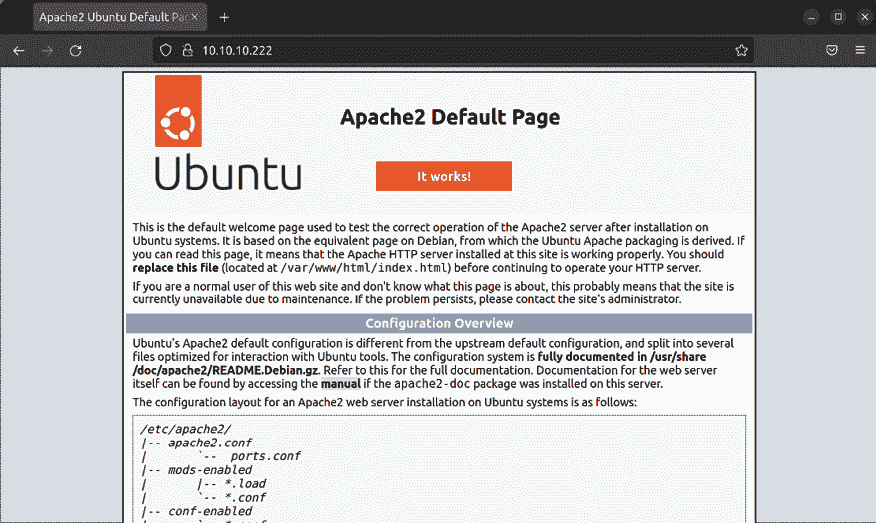
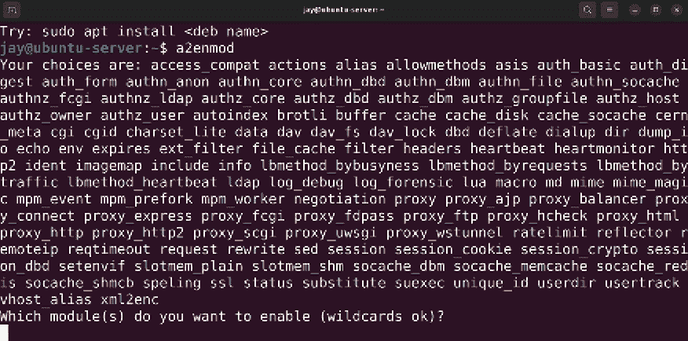
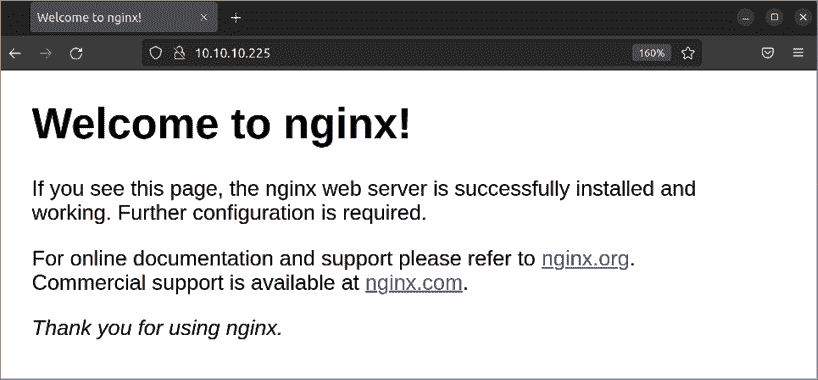
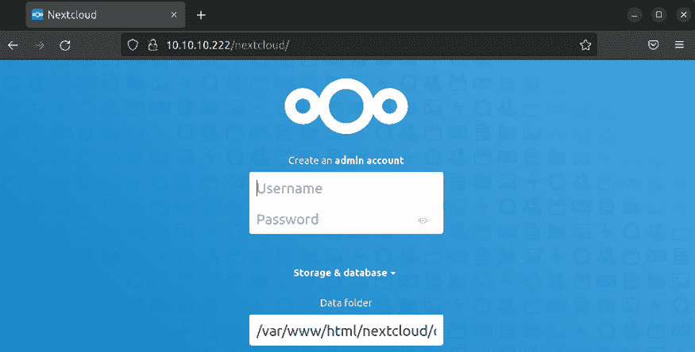
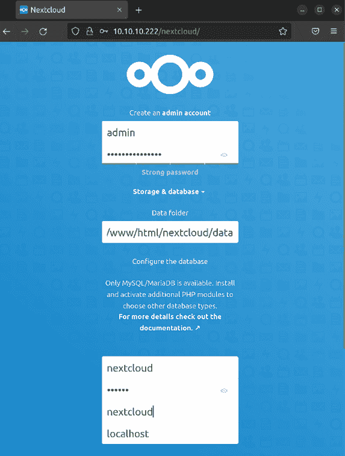
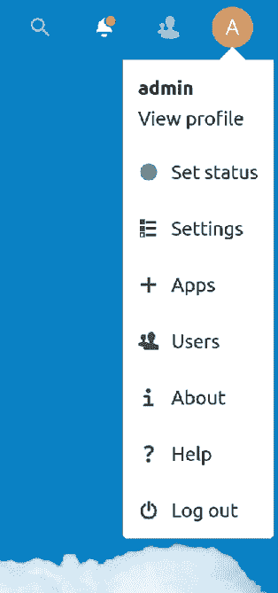
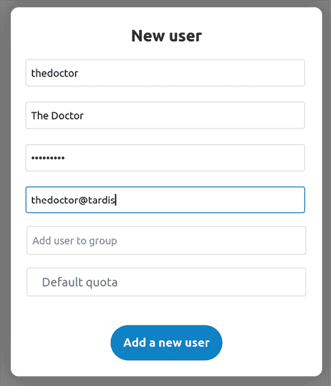

# 第十四章：提供 Web 内容

Ubuntu Server 的灵活性使其成为一个极好的平台，用来托管你组织的 web 存在。在本章中，我们将讨论 Apache 和 NGINX，它们是目前互联网上领先的 web 服务器软件。我们将介绍两者的安装、配置和扩展，并用**传输层安全性（TLS）**来保护它们。此外，我们还将讨论如何安装 Nextcloud，这是一个非常适合搭建私人云环境的解决方案，供你的组织用来协作和共享文件。在处理与在 Ubuntu Server 上托管 web 内容相关的概念时，我们将覆盖以下内容：

+   安装与配置 Apache

+   安装额外的 Apache 模块

+   用 TLS 保护 Apache

+   安装与配置 NGINX

+   设置与配置 Nextcloud

为了让我们入门，我们首先来看一下 Apache 的配置，以及一些基本配置。

# 安装与配置 Apache

了解任何技术的最佳方法就是直接上手。本章开始时我们将安装 Apache。但首先，究竟什么是 Apache？对于那些还不清楚的人，Apache 是一个流行的应用程序，通常运行在 Linux 和 Unix 服务器上，用来向用户提供网页。它在后台运行，响应请求 URL 的用户并提供 HTML 页面。

安装 Apache 非常简单；实际上只需要安装 `apache2` 包：

```
sudo apt install apache2 
```

默认情况下，Ubuntu 会在安装 `apache2` 包后立即启动并启用 `apache2` 守护进程。你可以通过以下命令自行确认：

```
systemctl status apache2 
```

事实上，此时，你已经拥有了一个（在实际操作中）完全功能的 web 服务器。如果你打开一个网页浏览器并输入你刚刚安装了 Apache 的服务器的 IP 地址，你应该会看到 Apache 的示例网页：



图 14.1：Apache 提供的默认示例网页

就这样，你已经正式提供了 web 内容。你所需要做的就是安装 `apache2` 包，你的服务器就转变成了一个 web 服务器。本章结束，接下来可以继续进行。

当然，Apache 不仅仅是安装并展示示例网页那么简单。虽然你可以将示例网页中的内容替换为自己的内容，并顺利完成托管任务，但 Apache 的功能远不止于此。例如，在 `/etc/apache2` 目录中有多个配置文件，它们控制着网站的托管方式，以及 Apache 会查找哪些目录以找到需要托管的网页。Apache 还有插件，我们也会介绍它们。

Apache 提供网页的目录称为**文档根目录**，默认路径为 `/var/www/html`。在该目录内，你会看到一个 `index.xhtml` 文件，这实际上是当你访问一个未修改的 Apache 服务器时看到的默认页面。本质上，这是一个测试页面，旨在向你展示服务器正在工作，并提供一些关于默认配置的信息。

然而，你并不限于在一个服务器上托管单个网站。Apache 支持**虚拟主机**的概念，这允许你从单个服务器上服务多个网站。每个虚拟主机由一个单独的配置文件组成，该文件根据名称或 IP 地址进行区分。

例如，你可以拥有一个 Apache 服务器，使用一个 IP 地址托管两个不同的网站，如 `acmeconsulting.com` 和 `acmesales.com`。这些是假设的网站，但你明白意思。为了设置这个，你需要为 `acmeconsulting.com` 和 `acmesales.com` 创建单独的配置文件，并将它们存储在 Apache 配置目录中。每个配置文件都会包括一个 `<VirtualHost>` 部分，在其中你会放置一个标识符，比如名称或 IP 地址，用于区分不同的网站。当请求到来时，Apache 会根据匹配的标准，将 `acmeconsulting.com` 或 `acmesales.com` 服务到用户的浏览器。每个站点的配置文件通常以 `.conf` 为文件扩展名，并存储在 `/etc/apache2/sites-available` 目录中。我们稍后会更详细地讲解这些内容，所以如果你现在还不明白也不用担心。

设置新站点（虚拟主机）的基本工作流程通常如下：

+   网页开发者创建网站及相关文件

+   这些文件被上传到 Ubuntu 服务器，通常位于 `/var/www` 的子目录中，或是管理员选择的其他目录

+   在将必要的文件添加到文档根目录后，管理员会确保 `www-data` 用户拥有该目录中的所有文件（在 Apache 的情况下）

+   服务器管理员为该站点创建一个配置文件并将其复制到 `/etc/apache2/sites-available` 目录中

+   管理员启用该站点并重新加载 Apache

在 Debian 和 Ubuntu 中，启用虚拟主机的方式与其他平台有所不同。实际上，有两个专门的命令来处理这个目的：`a2ensite`用于启用站点，`a2dissite`用于禁用站点。例如，你在 CentOS 等发行版中是找不到这些命令的。每个站点的配置文件存储在`/etc/apache2/sites-available/`目录中，我们使用`a2ensite`命令来启用每个配置。假设要在 Ubuntu 服务器上托管一个 URL 为[acmeconsulting.com](http://acmeconsulting.com)的站点，我们将创建`/etc/apache2/sites-available/acmeconsulting.com.conf`配置文件，并使用以下命令启用站点：

```
sudo a2ensite acmeconsulting.com.conf 
sudo systemctl reload apache2 
```

我的示例中没有使用绝对路径；只要你将配置文件复制到正确的位置，`a2ensite`和`a2dissite`命令就会知道在哪里找到它。

如果我们出于某些原因想禁用站点，我们可以对该站点的配置文件执行`a2dissite`命令：

```
sudo a2dissite acmeconsulting.com.conf 
sudo systemctl reload apache2 
```

如果你对背后如何运作感到好奇，当运行`a2ensite`命令时，它会针对配置文件创建一个符号链接，并将其存储在`/etc/apache2/sites-enabled`目录中。当你运行`a2dissite`来禁用站点时，这个符号链接会被删除。

默认情况下，Apache 会使用它在`/etc/apache2/sites-enabled`目录中找到的任何配置文件。在启用或禁用站点后，你需要刷新 Apache 的配置，这时就用到了`reload`选项。这个命令不会重启 Apache 本身（所以正在使用你现有站点的用户不会受到干扰），但它确实给了 Apache 一个重新加载配置文件的机会。如果你将`reload`替换为`restart`，Apache 将执行完全重启。你只有在遇到 Apache 问题或启用新插件时才需要执行重启，但在大多数情况下，生产系统上更推荐使用`reload`选项。

Apache 的主配置文件位于`/etc/apache2/apache2.conf`。你可以查看这个文件的内容，文件中的注释很好地概述了 Apache 配置的布局。这个文件中的以下几行特别值得关注：

```
# Include the virtual host configurations: 
IncludeOptional sites-enabled/*.conf 
```

如你所见，这就是 Ubuntu 如何配置 Apache 以在`/etc/apache2/sites-enabled`目录中查找已启用站点的方式。存储在该目录下的任何以`.conf`为扩展名的文件都会被 Apache 读取。如果你愿意，实际上可以移除这些行，这样 Apache 就会像在其他平台上那样运行，`a2ensite`和`a2dissite`命令也将不再有任何用途。然而，最好保留 Ubuntu 实现的框架，因为将配置文件分开是有逻辑意义的，并有助于简化配置。本章将沿用 Ubuntu 的配置管理方式。

如果你只托管一个站点，则不需要额外的虚拟主机。如果你没有更改 Apache 配置，`/var/www/html`中的内容将由默认虚拟主机提供。这就是 Apache 附带的示例网站所在的地方。如果你只需要托管一个站点，你可以删除存储在此目录中的默认`index.xhtml`文件，并将其替换为你网站所需的文件。如果你希望自己进行测试，可以先备份默认的`index.xhtml`文件，然后使用一些标准的 HTML 创建一个新的文件。你应该看到默认页面变更为你刚才添加到文件中的内容。

`000-default.conf`文件是特殊的，因为它基本上是控制默认 Apache 示例网站的配置文件。如果你查看`/etc/apache2/sites-available`和`/etc/apache2/sites-enabled`目录的内容，你会看到`000-default.conf`配置文件存储在`sites-available`中，并在`sites-enabled`中创建了符号链接。这表明，默认情况下，这个站点已包含在 Apache 中，并且它的配置文件在安装 Apache 时即已启用。实际上，如果你只打算在服务器上托管一个网站，那么`000-default.conf`配置文件就是你需要的全部。该文件的内容如下，但我已去除文件中的注释以节省页面空间：

```
<VirtualHost *:80> 
    ServerAdmin webmaster@localhost 
    DocumentRoot /var/www/html 

    ErrorLog ${APACHE_LOG_DIR}/error.log 
    CustomLog ${APACHE_LOG_DIR}/access.log combined 
</VirtualHost> 
```

正如你所看到的，这个默认的虚拟主机告诉 Apache 在端口`80`上监听请求，并在请求到达时从`/var/www/html`提供内容。开头的`<VirtualHost>`声明在端口`80`上监听所有请求（星号是一个*通配符*），因此基本上它处理所有从端口`80`进入服务器的网页流量。`ServerAdmin`子句指定了如果站点出现问题时，错误信息中显示的电子邮件地址。

`DocumentRoot`设置告诉 Apache 查找哪个目录以便找到要提供给该虚拟主机的文件。`/var/www/html`是默认值，但一些管理员选择自定义此设置。该文件还包含了发送日志信息的位置。**访问日志**包含与传入的 HTTP 请求相关的信息，默认情况下存储在`/var/log/access.log`中。**错误日志**存储在`/var/log/error.log`，包含了你在有人访问你的网站时遇到问题时可以使用的信息。`${APACHE_LOG_DIR}`变量默认等同于`/var/log`，并且这个设置存储在`/etc/apache2/envvars`文件中，以防你出于某些原因希望更改此设置（例如，你希望使用自定义的日志目录）。

如果你希望通过创建一个额外的虚拟主机在同一台服务器上托管另一个站点，可以使用与原始文件相同的框架，并进行一些额外的自定义。虚拟主机文件存储在`/etc/apache2/sites-available`目录下，文件名以`.conf`结尾。以下是一个假设网站`acmeconsulting.com`的示例。这样的虚拟主机文件可能会保存为`/etc/apache2/sites-available/acmeconsulting.com.conf`：

```
<VirtualHost **192.168.1.104:80**> 
    ServerAdmin webmaster@localhost 
    **DocumentRoot /var/www/acmeconsulting** 

    ErrorLog ${APACHE_LOG_DIR}/acmeconsulting.com-error.log 
    CustomLog ${APACHE_LOG_DIR}/acmeconsulting.com-access.log combined 
</VirtualHost> 
```

为了节省时间，我通常会复制另一个虚拟主机文件，甚至是默认的那个，然后根据需要进行修改。在这个具体的例子中，我强调了一些重要的不同之处。首先，在这个虚拟主机中，我不是监听所有进入`80`端口的连接；相反，我是专门监听指向`192.168.1.104`的`80`端口的传入流量。这是因为这个服务器有两个网卡，因此有两个 IP 地址。通过虚拟主机，我能够根据请求来自哪个 IP 地址，提供不同的网站。

接下来，我将`DocumentRoot`设置为`/var/www/acmeconsulting`。每个虚拟主机应该有自己的独立`DocumentRoot`，以将每个站点与其他站点分开。在我的服务器上，我通常会禁用或删除示例虚拟主机（即默认`DocumentRoot`为`/var/www/html`的那个）。相反，我使用`/var/www`作为基础目录，每个虚拟主机将其自己的目录作为该基础目录的子目录。

另一个我觉得有用的改变是给每个虚拟主机设置独立的日志文件。通常，Apache 会使用`/var/log/apache2/error.log`和`/var/log/apache2/access.log`来存储所有站点的日志条目。如果你的服务器上只有一个站点，那没问题。但当你托管多个站点时，我发现给每个站点设置独立的日志文件很有用。这样，当你遇到某个站点的问题时，你不需要浏览与该站点无关的日志条目来查找你需要的内容。在我的示例中，我将网站名称插入到日志文件名中，因此这个虚拟主机的错误日志记录在`/var/log/apache2/acmeconsulting.com-error.log`文件中，访问日志则写入`/var/log/apache2/acmeconsulting.com-access.log`。这些日志文件将在你重新加载 Apache 时自动创建。

对于只有一个 IP 地址的服务器，你仍然可以设置多个虚拟主机。你可以通过名称来区分虚拟主机，而不是通过 IP 来区分。这在 Ubuntu 的**虚拟私人服务器**（**VPS**）安装中很常见，在这种情况下，你通常会收到 VPS 提供商分配给你的单个 IP 地址。对于基于名称的虚拟主机，我们会在配置中使用 `ServerName` 选项。请参考以下示例，看看如何操作。在这个示例中，我将基于名称的虚拟主机添加到它们各自的文件中。我将文件命名为 `000-virtual-hosts.conf`，并将其存储在该目录中。其内容如下：

```
<VirtualHost *:80> 
    ServerName acmeconsulting.com 
    DocumentRoot /var/www/acmeconsulting 
</VirtualHost> 

<VirtualHost *:80> 
    ServerName acmesales.com 
    DocumentRoot /var/www/acmesales 
</VirtualHost> 
```

对于每个虚拟主机，我都会声明一个与之匹配的 `ServerName` 和 `DocumentRoot`。在第一个示例中，任何请求 [acmeconsulting.com](http://acmeconsulting.com) 的流量都会被提供一个 `DocumentRoot`，其路径为 `/var/www/acmeconsulting`。第二个示例则查找来自 [acmesales.com](http://acmesales.com) 的流量，并将其引导到 `/var/www/acmesales`。你可以根据需要在此列出尽可能多的虚拟主机，只要你的服务器有足够的资源来处理每个站点的流量，就可以托管任意数量的虚拟主机。

如果你使用带有虚拟主机的域名，那么只有在你设置了网络，使得文件中引用的域名能够解析到你服务器的 IP 地址时，才会生效。根据你的配置方式，有多种方法可以实现这一点。如果你使用 VPS 提供商，如 DigitalOcean 或 Linode，你的服务器已经有了一个 IP 地址，你只需要在 DNS 服务器上编辑**A 记录**，将其指向该 IP 地址。（DNS 记录的各种类型，如 A 记录，已在*第十一章*，*网络服务配置*中讲解。）

如果你正在运行自己的 DNS 服务器，你可以在那儿添加 A 记录。如果你使用的是外部 DNS 提供商，你需要登录到账户的仪表板并在那儿添加 A 记录。为了测试，你可以在本地工作站（而不是服务器）编辑 `/etc/hosts` 文件，将其指向你的新 web 服务器。如果你没有使用 VPS 提供商，你需要在防火墙中转发 `80` 端口，指向你的内部 web 服务器。由于存在许多不同类型的防火墙，这超出了本书的范围，因此无法全面覆盖所有防火墙模型。

在本章继续进行时，我们将为 Apache 执行一些额外的配置。但此时，你应该已经了解了如何在 Ubuntu 服务器中配置 Apache 的基础知识。如果想要额外练习，随时可以创建更多虚拟主机并为其提供不同的页面。

# 安装额外的 Apache 模块

Apache 提供了可以安装的额外模块来扩展其功能。这些模块可以提供额外的特性，比如添加对 Python 或 PHP 的支持。Ubuntu 实现的 Apache 包含两个特定的命令，用于启用和禁用模块，分别是 `a2enmod` 和 `a2dismod`。Apache 模块通常通过 Ubuntu 仓库中的包进行安装。要查看可用于 Apache 的模块列表，可以运行以下命令：

```
apt search libapache2-mod 
```

在结果中，你会看到各种可用的模块包，如 `libapache2-mod-python`（添加对 Python 的支持）和 `libapache2-mod-php8.1`（添加对 PHP 8.1 的支持）等许多模块。安装 Apache 模块与安装其他软件包一样，通过 `apt install` 命令进行。在 PHP 支持的情况下，我们可以通过以下命令安装所需的包：

```
sudo apt install libapache2-mod-php8.1 
```

仅仅安装模块包不足以让模块在 Apache 中可用。必须启用模块，Apache 才能使用它们。如前所述，我们可以使用 `a2enmod` 和 `a2dismod` 命令分别启用或禁用模块。你可以使用以下命令查看 Apache 内置模块的列表：

```
apache2 -l 
```

输出中显示的模块是 Apache 内置的模块，因此你不需要启用它们。如果输出中列出了你网站所需的模块，那么就大功告成了。

要查看所有已安装并准备启用的模块列表，可以单独运行 `a2enmod` 命令，无需指定任何选项：



图 14.2：a2enmod 命令显示可用的 Apache 模块列表

`a2enmod` 命令的输出结束时会询问你是否希望启用任何模块：

```
Which module(s) do you want to enable (wildcards ok)? 
```

如果你愿意，可以输入任何其他想要启用的模块名称，然后按 *Enter*。或者，你可以不输入任何内容直接按 *Enter*，返回到提示符。

如果你为 `a2enmod` 命令指定了模块名作为选项，它将为你启用该模块。要启用 PHP 8.1（稍后我们需要使用），可以运行以下命令：

```
sudo a2enmod php8.1 
```

然而，如果你安装了一个额外模块的包，它很可能在安装过程中就已经为你启用了。在 Debian 和 Ubuntu 中，守护进程和模块在其包安装后通常会自动启用，Apache 也不例外。以我使用的 `libapache2-mod-php8.1` 包为例，安装该包后，模块应该已经为你启用：

```
sudo a2enmod php8.1 
```

如果模块已经启用，当你尝试使用 `a2enmod` 启用它时，会看到类似以下的输出：

```
Module php8.1 already enabled 
```

如果模块尚未启用，我们将看到以下输出：

```
Enabling module php8.1\. 
To activate the new configuration, you need to run: 
systemctl restart apache2 
```

如指示，为了使模块的启用生效，我们需要重启 Apache。请注意，重启 Apache 会导致其托管的任何站点在此过程中不可用。在禁用模块方面，命令语法非常相似。要执行此操作，您将使用`a2dismod`命令以及要禁用的模块的名称：

```
sudo a2dismod php8.1 
```

启用已经先前启用的模块将产生类似以下输出：

```
Module php8.1 disabled. 
```

要激活新配置，您需要运行：

```
systemctl restart apache2 
```

您在 Apache 服务器上安装和启用的模块将取决于您网站的需求。例如，如果您需要支持 Python，您将需要安装`libapache2-mod-python`包。如果您安装了第三方包，如 WordPress 或 Drupal，您需要参考这些包的文档，以获取安装和运行所需模块的列表。一旦您拥有这样的列表，您将知道需要安装哪些包和启用哪些模块。

# 使用 TLS 安全 Apache

现在，确保您的组织网站通过 HTTPS 加密并可用是个好主意。通过安装签名证书来保护和加密 Web 流量，历史上已经实现了 Web 流量的加密，通过利用**安全套接层**（**SSL**）或更近期的**传输层安全**（**TLS**）。这两种方法使用加密技术来保护和加密 Web 流量。这两种方法有所不同，但最终结果是相同的。从现在开始，推荐使用 TLS，因为它提供了额外的安全强度，尽管目前仍然可以看到使用 SSL，因为它还没有完全淘汰。

设置并受益于 TLS 并不是很难，而且将帮助保护您的组织免受潜在的常见漏洞攻击。虽然使用 TLS 不能保护您免受所有野外利用的攻击，但它确实提供了一层您想要受益的保护。不仅如此，您的客户现在几乎都希望您保护他们的通信。在本节中，我们将看看如何在我们的 Apache 安装中使用 TLS。我们将通过启用它、生成证书以及配置 Apache 使用这些证书来工作，既可以使用单站点配置，也可以使用虚拟主机配置。

默认情况下，Ubuntu 的 Apache 配置会在端口`80`上监听流量，但不会在端口`443`（HTTPS）上。您可以通过运行以下命令来检查：

```
sudo ss -tulpn | grep apache 
```

结果将类似于以下内容，并显示 Apache 监听的端口，这默认仅为端口`80`：

```
tcp   LISTEN 0      511                                    *:80               *:*    u
sers:(("apache2",pid=11521,fd=4),("apache2",pid=11520,fd=4),
("apache2",pid=11519,fd=4),("apache2",pid=11518,fd=4),("apache2",pid=11517,fd=4),
("apache2",pid=11513,fd=4)) 
```

如果服务器也监听端口`443`，我们将会在输出中看到以下内容：

```
tcp   LISTEN 0      511                         *:443               *:* 
```

要启用对 HTTPS 流量的支持，我们首先需要启用`ssl`模块：

```
sudo a2enmod ssl 
```

接下来，我们需要重启 Apache：

```
sudo systemctl restart apache2 
```

除了我们之前讨论的示例网站之外，Ubuntu 的默认 Apache 实现还包括另一个站点配置文件 `/etc/apache2/sites-available/default-ssl.conf`。与示例站点不同，默认情况下该文件并未启用。这个配置文件与示例站点配置类似，但它监听端口 `443` 上的连接，并包含与 TLS 相关的附加配置项。以下是该文件的内容，我们已去除注释，以便节省页面空间：

```
<IfModule mod_ssl.c> 
        <VirtualHost _default_:443> 
                ServerAdmin webmaster@localhost 

                DocumentRoot /var/www/html 

                ErrorLog ${APACHE_LOG_DIR}/error.log 
                CustomLog ${APACHE_LOG_DIR}/access.log combined 

                SSLEngine on 

                SSLCertificateFile      /etc/ssl/certs/ssl-cert-                
                snakeoil.pem 
                SSLCertificateKeyFile /etc/ssl/private/ssl-cert-                
                snakeoil.key 

                <FilesMatch ".(cgi|shtml|phtml|php)$"> 
                                SSLOptions +StdEnvVars 
                </FilesMatch> 
                <Directory /usr/lib/cgi-bin> 
                                SSLOptions +StdEnvVars 
                </Directory> 

        </VirtualHost> 
</IfModule> 
```

我们已经在本章前面讨论过 `ServerAdmin`、`DocumentRoot`、`ErrorLog` 和 `CustomLog` 选项，但该文件中还有一些我们尚未看到的附加选项。在第一行中，我们可以看到该虚拟主机监听的是端口 `443`。我们还看到这里列出了 `_default_`，而不是 IP 地址。`_default_` 选项仅适用于未指定的流量，这意味着任何进入端口 `443` 但未在其他虚拟主机中标识的流量。此外，`SSLEngine on` 选项启用了 TLS 流量。紧接着，我们可以看到 TLS 证书文件和密钥文件的相关选项，我们稍后会详细讨论。

我们还看到有一个 `<Directory>` 子句，它允许我们对某个目录应用特定的选项。在这个例子中，`/usr/lib/cgi-bin` 目录应用了 `SSLOptions +StdEnvVars` 设置，该设置启用了默认的环境变量，以供 TLS 使用。通过 `<FilesMatch>` 选项，这个设置也应用于扩展名为 `.cgi`、`.shtml`、`.phtml` 或 `.php` 的文件。`BrowserMatch` 选项允许你为特定浏览器设置选项，尽管这超出了本章的讨论范围。现在，只需要记住，如果你想为特定浏览器应用设置，是可以做到的。

默认情况下，`default-ssl.conf` 文件是未启用的。为了使用其配置选项，我们需要启用它，可以通过 `a2ensite` 命令来完成，就像启用任何其他虚拟主机一样：

```
sudo a2ensite default-ssl.conf 
```

虽然我们刚刚启用了 TLS，但我们的网站还不安全。我们需要安装 TLS 证书来保护我们的 Web 服务器。我们可以通过两种方式来实现这一点：使用自签名证书或由证书颁发机构签名的证书。这两种方式的实现非常相似，我会讨论这两种方法。对于测试目的，自签名证书是可以的。在生产环境中，自签名证书技术上是可以使用的，但大多数浏览器默认不会信任它们，访问时会出现错误提示。因此，在生产环境中最好避免使用自签名证书。使用自签名证书的网站用户需要绕过错误页面才能继续访问网站，看到这个错误提示可能会让他们避开你的网站。你可以将证书安装到每个用户的 Web 浏览器中，但这会很麻烦。在生产环境中，最好使用由证书供应商签名的证书。

另一种在服务器上设置证书的方法是 **Let’s Encrypt**，这是一个流行的（且免费的）加密 Web 流量的服务。你可以参考 [letsencrypt.org/docs](http://letsencrypt.org/docs) 网站上的说明，以及本章末尾提到的示例文章。

在我们进行这个过程时，我会首先指导你如何通过自签名证书设置 TLS，以便你了解整个过程。我们将创建证书并将其安装到 Apache 中。你不一定需要创建一个网站来完成这个过程，因为你可以直接使用 Apache 附带的示例网站来作为概念验证。如果我们完成这个过程后，还会讨论安装由证书颁发机构签名的证书。

为了开始，我们需要一个目录来存放我们的证书。我将在示例中使用 `/etc/apache2/certs`，不过你可以使用任何你喜欢的目录，只要记得在 Apache 配置文件中更新你选择的路径和文件名：

```
sudo mkdir /etc/apache2/certs 
```

对于自签名证书和密钥，我们可以通过以下命令生成这一对文件。可以根据你的网站名称自由更改密钥和证书文件的名称：

```
sudo openssl req -x509 -nodes -days 365 -newkey rsa:2048 -keyout /etc/apache2/certs/mysite.key -out /etc/apache2/certs/mysite.crt 
```

系统会提示你输入一些信息来生成证书。根据提示逐一回答问题。以下是你将被询问的问题清单，以及我为每个问题提供的回答。根据你的服务器、环境、组织名称和位置修改答案：

```
Country Name (2 letter code) [AU]:US 
State or Province Name (full name) [Some-State]:Michigan 
Locality Name (eg, city) []:Detroit 
Organization Name (eg, company) [Internet Widgits Pty Ltd]:My Company 
Organizational Unit Name (eg, section) []:IT 
Common Name (e.g. server FQDN or YOUR name) []:myserver.mydomain.com 
Email Address []:webmaster@mycompany.com 
```

现在，你应该看到在 `/etc/apache2/certs` 目录下创建了两个文件，分别是 `mysite.crt` 和 `mysite.key`，它们代表证书和私钥。文件生成后，接下来要做的是配置 Apache 使用这些文件。在 `/etc/apache2/sites-available/default-ssl.conf` 文件中，查找以下两行：

```
SSLCertificateFile       /etc/ssl/certs/ssl-cert-snakeoil.pem 
SSLCertificateKeyFile  /etc/ssl/private/ssl-cert-snakeoil.key 
```

通过在两行前加上`#`符号，将这两行注释掉：

```
# SSLCertificateFile      /etc/ssl/certs/ssl-cert-snakeoil.pem 
# SSLCertificateKeyFile /etc/ssl/private/ssl-cert-snakeoil.key 
```

接下来，在你刚刚注释掉的两行下方添加以下两行。如果你使用了自己的命名规则，记得替换目标目录和证书文件名：

```
SSLCertificateFile      /etc/apache2/certs/mysite.crt
SSLCertificateKeyFile /etc/apache2/certs/mysite.key 
```

为了让 Apache 应用新的配置，请重新加载`apache2`守护进程：

```
sudo systemctl reload apache2 
```

配置完成后，我们虽然还没完全完成，但已经接近尾声。我们还有少量配置需要添加。但在此之前，让我们先回到安装由证书颁发机构签发的 TLS 证书的话题。安装签名 TLS 证书的过程基本相同，主要的区别在于证书文件的请求和获取方式。一旦你获得了这些证书文件，你需要将它们复制到文件服务器上，并像我们刚才做的那样配置 Apache。为了开始获取签名 TLS 证书的过程，你需要创建一个**证书签名请求**（**CSR**）。CSR 基本上是一个证书请求文件，你需要将其提供给证书颁发机构，启动签发证书的流程。你可以通过以下命令轻松生成 CSR：

```
openssl req -new -newkey rsa:2048 -nodes -keyout server.key -out server.csr 
```

使用生成的 CSR 文件，你可以请求一个签名证书。CSR 文件应该已经在你的当前工作目录中。整个过程在不同的供应商之间有所不同，但大多数情况下，它是相当直接的。你需要将 CSR 文件发送给他们，支付费用，填写他们网站上的一两份表格，证明你是相关网站的所有者，然后供应商会将所需文件发送给你。听起来可能有些复杂，但证书颁发机构通常会引导你完成整个过程，并明确告诉你他们需要你提供的内容。一旦你完成这个过程，证书颁发机构会将证书文件发送给你，你然后将其安装到服务器上。一旦你在`/etc/apache2/sites-available/default-ssl.conf`中配置了`SSLCertificateFile`和`SSLCertificateKeyFile`选项，指向新的证书文件，并重新加载 Apache，你应该就可以顺利进行。

还有一个额外的步骤，我们需要执行才能正确设置。在这一点上，我们的证书文件应该已经正确安装，但我们还需要告知 Apache 何时应用它们。如果你还记得，`apache2`包提供的`default-ssl.conf`文件是用来处理任何没有被虚拟主机明确识别的流量（即`<VirtualHost _default_:443>`选项）。我们需要确保我们的 Web 服务器在请求 TLS 时能够处理我们现有网站的流量。我们可以在该文件中添加`ServerName`选项，以确保我们的网站支持 TLS。

将以下选项添加到`/etc/apache2/sites-available/default-ssl.conf`文件中，紧跟在`<VirtualHost _default_:443>`下方：

```
ServerName mydomain.com:443 
```

现在，当流量通过端口`443`进入服务器，并请求与`ServerName`选项中输入的域名匹配的域时，应该会为客户端创建一个安全的浏览会话。你应该能在地址栏中看到绿色的锁形图标（这取决于你的浏览器），它表示你的会话是安全的。如果你使用的是自签名证书，可能会首先看到一个错误提示，你需要跳过它，而且你可能不会看到绿色锁形图标。这并不意味着加密没有生效；它只是意味着浏览器对证书持怀疑态度，因为它没有由一个已知的证书颁发机构签名。你的会话仍然会是加密的。

如果你计划在 HTTPS 上托管多个网站，可能需要考虑为每个网站使用一个单独的虚拟主机文件。实现这一点的一个简单方法是使用`/etc/apache2/sites-available/default-ssl.conf`文件作为模板，并将`DocumentRoot`更改为托管该站点文件的目录。此外，确保更新`SSLCertificateFile`和`SSLCertificateKeyFile`选项，指向该站点的证书文件，并将`ServerName`设置为与你的站点对应的域名。以下是一个使用 TLS 的假设站点的虚拟主机文件示例。我已将从正常的`default-ssl.conf`文件中更改的行标出：

```
<IfModule mod_ssl.c> 
        <VirtualHost *:443> 
                ServerName acmeconsulting.com:443 

                ServerAdmin webmaster@localhost 

                DocumentRoot /var/www/acmeconsulting 
 **ErrorLog ${APACHE_LOG_DIR}/acmeconsulting.com-error.log** 
 **CustomLog ${APACHE_LOG_DIR}/acmeconsulting.com-access.** 
 **log combined** 

 **SSLEngine on** 
 **SSLCertificateFile      /etc/apache2/certs/acmeconsulting/acme.** 
 **crt** 
 **SSLCertificateKeyFile /etc/apache2/certs/acmeconsulting/acme.** 
 **key** 

                <FilesMatch ".(cgi|shtml|phtml|php)$"> 
                                SSLOptions +StdEnvVars 
                </FilesMatch> 
                <Directory /usr/lib/cgi-bin> 
                                SSLOptions +StdEnvVars 
                </Directory> 

        </VirtualHost> 
</IfModule> 
```

基本上，我所做的就是创建了一个新的虚拟主机配置文件（使用现有的`default-ssl.conf`文件作为模板）。我将这个新文件命名为`acme-consulting.conf`，并将其存储在`/etc/apache2/sites-available`目录中。我将`VirtualHost`行更改为监听端口`443`上的所有流量。添加了`ServerName acmeconsulting.com:443`这一行，使得这个文件负责处理针对`acmeconsulting.com`在端口`443`上的流量。我还将`DocumentRoot`设置为`/var/www/acmeconsulting`。此外，我自定义了错误日志和访问日志，以便更容易找到与这个新站点相关的日志信息，因为它的日志条目会被记录到专门的文件中。

根据我的经验，当设置一个打算托管多个网站的 Web 服务器时，像我在示例中使用的那种模块化方法是最有效的。对于每个站点，我通常会为其提供独立的文档根目录、证书文件和日志文件。即使你只打算在服务器上托管一个站点，采用这种模块化方法仍然是一个好主意，因为你以后可能还会想托管其他站点。

所以，以上就是了。你现在应该理解如何在 Apache 中设置安全的虚拟主机。

# 安装和配置 NGINX

Apache 并不是唯一能够让你在服务器上托管网页内容的技术。NGINX 也具有相同的功能，并且正在迅速获得人气。Apache 仍然是一个很好的选择，即使那是你选择的 web 服务器软件，至少了解一下 NGINX 并学习其基础知识也是个好主意。NGINX 本身也是一个代理服务器，但也能够托管网页内容，这就是它与 Apache 竞争的原因。

在我们继续之前，我想先提一下，你实际上只能在一个 Web 服务器上运行一个 Web 服务器服务。如果你一直跟着操作到现在，你已经有一个功能正常的 Apache Web 服务器。如果你同时安装 NGINX，它可能不会启动，因为它想监听的端口（端口 `80` 和/或 `443`）已经被占用。你可以在同一台服务器上运行两个，但那超出了本书的范围。理想情况下，你应该选择使用其中一个。因此，为了继续这一部分，你要么删除 Apache，要么为测试 NGINX 设置一个单独的 Web 服务器。我推荐后者，因为在本章后面，我们将讨论如何托管 Nextcloud，并且我们将使用 Apache 来实现这一目标。如果你现在删除了 Apache，你将不得不重新安装它，才能继续这一部分。理论上，你只需要在启动 `nginx` 之前停止 `apache2` 进程，但两个资源共享同一台服务器，涉及许多变量，可能会发生冲突。

要开始使用 NGINX，只需安装它：

```
sudo apt install nginx 
```

就像 Apache 一样，如果我们在浏览器中输入服务器的 IP 地址，我们将看到一个示例页面，但这次是 NGINX 的版本，而不是 Apache 自带的版本。与之相比，它确实看起来很单调，但它能够正常工作：

图 14.3：NGINX 示例页面

`nginx` 的默认配置文件存储在 `/etc/nginx` 目录中。你可以浏览这些文件，以大致了解配置文件的呈现方式。与 Apache 类似，这里也有 `sites-enabled` 和 `sites-available` 目录，它们具有相同的功能。

就像 Apache 一样，`sites-available` 目录存储着可以启用的站点的配置文件，而 `sites-enabled` 目录存储着已启用的站点的配置文件。不过，与 Apache 不同的是，我们没有专门的命令来启用这些站点。我们需要手动链接它们。尽管我们还没有查看 NGINX 的配置文件，但假设我们已经创建了以下配置文件：

```
/etc/nginx/sites-available/acmesales.com 
```

要启用该站点，我们需要为它创建一个符号链接，并将该链接存储在 `/etc/nginx/sites-enabled` 目录中：

```
sudo ln -s /etc/nginx/sites-available/acmesales.com /etc/nginx/sites-enabled/acmesales.com 
```

然后，我们可以重新加载 `nginx`：

```
sudo systemctl reload nginx 
```

目前，名为 `default` 的站点配置文件存在于 `/etc/nginx/sites-available` 目录中，并且在 `/etc/nginx/sites-enabled` 中已经存在对它的符号链接。如果我们只想托管一个站点，我们只需要替换 NGINX 提供的默认内容，它位于 `/var/www/html` 目录下（与 Apache 相同），然后用我们站点的内容替换。刷新页面后，我们就可以开始使用了。

如果我们想要从一台服务器提供多个站点，那么 `default` 文件是创建额外虚拟主机的一个很好的起点。我们可以从将它复制到一个新名称开始：

```
sudo cp /etc/nginx/sites-available/default /etc/nginx/sites-available/acmesales.com 
```

显然，`acmesales.com` 是一个示例，所以你可以随意将其命名为你希望的任何名称。

现在，我们可以编辑这个文件并更改它以提供额外的内容。首先，只有一个站点可以被称为 *默认* 站点。在 NGINX 中，默认站点是在没有其他站点匹配请求时进行响应的站点。因此，我们需要从新复制的配置中删除 `default_server` 的两处出现。找到这些行：

```
listen 80 default_server;
listen [::]:80 default_server; 
```

将它们改成这样：

```
listen 80;
listen [::]:80; 
```

接下来，我们需要调整 `server_name` 选项，以指向我们新站点的名称。添加这一行：

```
server_name acmesales.com www.acmesales.com; 
```

现在，我们需要将文档根目录更改为存储新站点文件的目录。找到这一行：

```
root /var/www/html; 
```

然后将其更改为：

```
root /var/www/acmesales.com; 
```

到目前为止，最终的文件应该如下所示：

```
server { 
        listen 80; 
        listen [::]:80; 

        root /var/www/acmesales.com; 

        index index.xhtml index.htm index.nginx-debian.xhtml; 

        server_name acmesales.com www.acmesales.com; 

        location / { 
                try_files $uri $uri/ =404; 
        } 
} 
```

你可能会发现，NGINX 配置文件的配置格式比 Apache 更简单。我也觉得这是事实，而且我注意到我用 NGINX 配置的网站通常比 Apache 配置的网站配置文件行数要少。

到目前为止，假设你在 `/var/www/acmesales.com` 中有必要的内容，并且配置文件正确，当你重新加载 `nginx` 后，新站点应该会响应。但 TLS 呢？我建议我们始终保护我们的网站，无论我们使用哪种解决方案来提供它。使用 NGINX 时，我们可以轻松添加这个功能。证书文件本身无论是使用 Apache 还是 NGINX 都是相同的。如果你还没有创建证书文件，请参考本章中我们创建证书文件的部分。假设你已经有了证书文件，我们只需要对配置做一些额外的修改。

首先，我们将前两行更改为监听 `443` 端口并使用 TLS，而不是标准的 `80` 端口：

```
listen 443 ssl; 
listen [::]:443 ssl; 
```

接下来，我们将在 `location` 部分之前添加以下两行：

```
ssl_certificate /etc/certs/cert.pem; 
ssl_certificate_key /etc/certs/cert.key; 
ssl_session_timeout 5m; 
```

为了使其正常工作，你需要调整路径和 `cert` 文件的名称，确保它们与服务器上设置的名称匹配。到目前为止，整个文件应该如下所示：

```
server { 
        listen 443 ssl; 
        listen [::]:443 ssl; 

        root /var/www/html; 

        index index.xhtml index.htm index.nginx-debian.xhtml; 

        server_name acmesales.com www.acmesales.com; 

        ssl_certificate /etc/certs/cert.pem; 
        ssl_certificate_key /etc/certs/cert.key; 
        ssl_session_timeout 5m; 
        location / { 
                try_files $uri $uri/ =404; 
        } 
} 
```

最后，一个潜在的问题是用户可能会通过端口`80`访问我们的网站，而不是使用 HTTPS。我们可以告诉 NGINX 自动将这些人转发到我们网站的安全版本。为此，我们可以编辑默认配置文件（`/etc/nginx/sites-available/default`），并在两个 `listen` 指令之后添加以下行：

```
return 301 https://$host$request_uri; 
```

现在，任何用户访问我们网站的 HTTP 版本时，他们会自动重定向到安全的 HTTPS 版本。

既然我们已经了解了如何通过 Apache 和 NGINX 提供 Web 内容，让我们来看看如何设置我们自己的 Nextcloud 服务器。

# 设置和配置 Nextcloud

我想我们可以以一个有趣的活动来结束这一章：设置我们自己的 Nextcloud 服务器。Nextcloud 是一个非常有用的 Web 应用程序，对任何组织都很方便。即使您不在公司网络中工作，Nextcloud 对于单个用户也是一个很好的工具。您可以用它在计算机之间同步文件，存储并同步联系人，跟踪您正在处理的任务，从邮件服务器获取电子邮件等。要完成这个活动，您需要一个 Web 服务器。Nextcloud 支持多种不同的 Web 服务器平台，但在本例中，我们将使用 Apache。

您还需要安装 MySQL 或 MariaDB，因为 Nextcloud 需要自己的数据库。我们在*第十三章*《管理数据库》中介绍了 MariaDB 数据库的安装和管理。在本节中，我会给您所有需要设置数据库的命令，但如果有任何命令让您感到困惑，请参考*第十三章*《管理数据库》。

要开始，我们需要下载 Nextcloud。为此，请访问该项目的网站 [`www.nextcloud.com`](https://www.nextcloud.com) 并导航到 **下载** 部分。该网站的布局可能会时常变化，但在写作时，第一个要点击的链接是一个标有 **获取 Nextcloud** 的按钮，它会将您带到下载页面。根据写作时的信息，Nextcloud 的直接下载页面的 URL 当前是 [`nextcloud.com/install`](https://nextcloud.com/install)。

到达后，寻找 **压缩文件** 标题，并展开它。在下面，您应该能看到一个按钮，写着 **为服务器下载**，但现在不要点击它。相反，右键点击它，然后点击 **复制链接地址** 或根据您使用的浏览器选择类似的选项。

这应该将下载链接复制到您的剪贴板。如果 Nextcloud 网站的布局自发布以来有所变化，您实际上只是需要找到 ZIP 文件的 URL 来下载 Nextcloud，然后将其复制到您的计算机剪贴板中。

接下来，打开一个 SSH 会话连接到您的 Web 服务器。确保您当前在家目录下，并执行以下命令：

```
wget <URL of Nextcloud> 
```

要获取 Nextcloud URL，只需在终端中键入 `wget` 后粘贴 URL。你的完整命令将类似于以下内容：

```
wget https://download.nextcloud.com/server/releases/latest.zip 
```

该命令将把 Nextcloud 软件下载到当前工作目录。接下来，我们需要解压该归档文件：

```
unzip latest.zip 
```

如果你收到提示 `unzip` 命令不可用的错误消息，可能需要安装它：

```
sudo apt install unzip 
```

现在，让我们将新解压的 `nextcloud` 目录移动到 `/var/www/html`：

```
sudo mv nextcloud /var/www/html/nextcloud 
```

为了使 Nextcloud 正常运行，Apache 用于提供内容的用户帐户需要对其拥有完全访问权限。我们可以使用以下命令将 `www-data` 用户设置为 `nextcloud` 目录的所有者：

```
sudo chown www-data:www-data -R /var/www/html/nextcloud 
```

现在，你应该已经将 Nextcloud 软件所需的文件安装到了 `/var/www/nextcloud` 目录下。为了使其正常工作，Apache 需要一个配置文件，该文件将 `/var/www/nextcloud` 作为其文档根目录。我们可以在以下位置创建所需的文件：

```
/etc/apache2/sites-available/nextcloud.conf 
```

包含在该文件中的示例内容如下：

```
Alias /nextcloud "/var/www/html/nextcloud/" 

<Directory /var/www/html/nextcloud/> 
   Options +FollowSymlinks 
   AllowOverride All 

    <IfModule mod_dav.c> 
        Dav off 
    </IfModule> 

    SetEnv HOME /var/www/html/nextcloud 
    SetEnv HTTP_HOME /var/www/html/nextcloud 
</Directory> 
```

类似于我们之前讨论的 Apache 配置，这里我们为 Nextcloud 添加了一个配置文件，该文件设置了一个别名，将 `/nextcloud` 指向 `www.mydomain.com/nextcloud`。本质上，它允许通过你的域名访问 Nextcloud，并且在域名后加上 `/nextcloud`。文件的其他部分禁用了 WebDAV（这是一种允许 Web 服务器充当文件服务器的方式，但在我们的情况下不需要），然后启用了环境变量来设置 `HOME` 和 `HTTP_HOME` 为 Nextcloud 的文档根目录，在我们的情况下是 `/var/www/html/nextcloud`。

接下来，我们启用新站点：

```
sudo a2ensite nextcloud.conf 
```

接下来，我们需要对 Apache 进行一些更改。首先，我们需要确保安装了 `libapache2-mod-php8.1` 包，因为 Nextcloud 需要 PHP，但我们还需要一些额外的包。你可以使用以下命令安装 Nextcloud 的先决条件包：

```
sudo apt install libapache2-mod-php8.1 php8.1-curl php8.1-gd php8.1-intl php8.1-mbstring php8.1-mysql php8.1-xml php8.1-zip 
```

接下来，重启 Apache，以便它能够利用新的 PHP 插件：

```
sudo systemctl restart apache2 
```

此时，我们需要一个 MySQL 或 MariaDB 数据库供 Nextcloud 使用。该数据库可以存在于另一台服务器上，或者你也可以在安装了 Nextcloud 的同一台服务器上共享它。如果你还没有设置 MariaDB，*第十三章*《管理数据库》中已有详细说明。此时假设你已经安装并运行了 MariaDB。

使用你的 `root` 用户或具有完全 root 权限的用户登录到 MariaDB 实例。你可以通过以下命令创建 Nextcloud 数据库：

```
CREATE DATABASE nextcloud; 
```

接下来，我们需要为 Nextcloud 向 MariaDB 添加一个新用户，并赋予该用户对 `nextcloud` 数据库的完全访问权限。我们可以通过以下命令来完成这两个操作：

```
GRANT ALL ON nextcloud.* to 'nextcloud'@'localhost' IDENTIFIED BY 'super_secret_password'; 
```

确保将 `super_secret_password` 更改为一个非常强的（最好是随机生成的）密码。务必将此密码保存在安全的地方。

现在我们拥有了配置 Nextcloud 所需的一切。你现在应该能够在网页浏览器中访问你的 Nextcloud 实例。只需输入类似于以下的 URL，将示例 IP 地址替换为你服务器的 IP 地址：

```
http://172.16.250.133/nextcloud 
```

如果你使用的是子域名，并为 Nextcloud 配置了自己的虚拟主机，那么该 URL 将类似于以下内容：

```
http://nextcloud.yourdomain.com/nextcloud 
```

你应该看到一个页面，要求你配置 Nextcloud：



图 14.4：Nextcloud 配置页面

如果你没有看到这个页面，请确保 `/var/www/html/nextcloud` 目录可以通过 Apache 访问。还要确保你为 Nextcloud 配置了一个合适的虚拟主机，并将该目录作为其文档根目录。

这个页面会要求你提供一些信息。首先，你会看到 **用户名** 和 **密码**。这并不是让你输入一个已存在的账户，而是要求你设置一个全新的管理员账户。这不应是你日常使用的账户，而应是一个只在需要添加用户和维护系统时使用的管理员账户。请注意，它不会要求你确认密码，因此你需要确保输入的是你认为自己输入的密码。为了安全起见，最好先在文本编辑器中输入密码，然后将密码复制粘贴到 **密码** 框中，以确保不会将自己锁定。

**数据文件夹** 默认为 `/var/www/html/nextcloud/data`。这个默认设置通常是可以接受的，但如果你已将服务器配置为使用单独的数据分区，可以在这里进行配置。如果你打算在 Nextcloud 服务器上存储大量数据，设置一个独立的分区可能是一个好主意。如果是这样，你可以在这里进行设置，否则保持默认设置。

在接下来的部分中，你将被要求填写我们之前创建的 Nextcloud 数据库的信息。**数据库用户** 和 **数据库密码** 将使用我们在为 Nextcloud 设置 MariaDB 数据库时创建的值。在我的示例中，我使用了 `nextcloud` 作为用户名和 **数据库名**。密码则是我们在设置数据库用户账户并授予权限时所使用的密码。最后，数据库服务器默认是 `localhost`，这在你将数据库设置在与 Nextcloud 服务器同一台机器上时是正确的。如果不是，请在这里输入你的数据库服务器的地址，如果它在其他地方。以下截图展示了填充完整的表单，其中包含了我们迄今为止在本节中使用的示例值：



图 14.5：Nextcloud 配置页面

就这样！如果一切顺利，Nextcloud 会在后台自动设置好，你接着会进入主屏幕。由于你目前只创建了一个`admin`账户，我建议你为自己以及任何希望访问你 Nextcloud 服务器的朋友或同事创建账户。为此，请进入 Nextcloud 页面右上角，在那里你会看到一个类似齿轮的图标。点击该图标后，你将看到一个**用户**选项：



图 14.6：Nextcloud 菜单

在**用户**页面，你可以添加其他用户来访问 Nextcloud。点击**新建用户**按钮。只需在页面顶部填写**用户名**和**密码**字段，然后点击蓝色的勾选图标即可完成操作：



图 14.7：向 Nextcloud 添加新用户

作为管理员用户，你可以启用或禁用用户使用的各种应用。Nextcloud 默认启用了基本的应用套件，如**文件共享**和**照片**插件。你还可以启用更多应用来扩展其功能。在 Nextcloud 主屏幕的右上角，你会看到一个类似齿轮的图标，点击后可以找到**应用**链接，点击进入即可添加更多功能。你可以自由启用其他应用来扩展 Nextcloud 的能力。我个人必备的一些应用包括**笔记**和**任务**。

现在，你已经拥有了自己的 Nextcloud 服务器。我认为 Nextcloud 是一个非常实用的平台。一些 Linux 桌面环境（例如 GNOME）内置了集成功能，允许你将 Nextcloud 账户直接添加到桌面，这样就可以与电脑同步日历和联系人。Linux、Windows 和 macOS 上也有独立的客户端应用可以下载，它们可以从我们下载 Nextcloud 的同一网址获取。

我相信你一定同意，Nextcloud 是一个非常有用的工具。如果想了解如何使用 Nextcloud，请查看手册。事实上，它可以在应用程序内的**文件**应用中找到。

# 总结

在本章内容中，我们探讨了如何使用 Apache 提供网页服务。我们首先安装并配置了 Apache，然后添加了额外的模块。我们还讨论了虚拟主机的概念，它允许我们在单个服务器上提供多个网站，即使我们只有一个网络接口。接着，我们演示了如何使用 TLS 安全化 Apache 服务器。通过 Apache，我们可以使用自签名证书，或者我们也可以从供应商那里购买 TLS 证书。我们讨论了这两种可能性。最后，我们还设置了 NGINX，它是一款功能强大的应用程序，正在变得越来越流行。我们以安装 Nextcloud 的指南结束了这一章，Nextcloud 作为一个应用，我相信你会发现它非常有用。

在我们旅程的下一章，我们将深入了解如何使用 Ansible 自动化服务器配置，这非常有趣。

# 相关视频

+   Nextcloud 设置教程：[`linux.video/nextcloud-setup`](https://linux.video/nextcloud-setup)

# 进一步阅读

+   NGINX 文档：[`nginx.org/en/docs/`](https://nginx.org/en/docs/)

+   来自 Ubuntu 社区 Wiki 的 NGINX 文档：[`help.ubuntu.com/community/Nginx`](https://help.ubuntu.com/community/Nginx)

+   Apache HTTP 服务器文档：[`httpd.apache.org/docs/`](https://httpd.apache.org/docs/)

+   Nextcloud 管理手册：[`docs.nextcloud.com/server/latest/admin_manual/`](https://docs.nextcloud.com/server/latest/admin_manual/)

+   Certbot 使用说明：[`certbot.eff.org/instructions`](https://certbot.eff.org/instructions)

# 加入我们社区的 Discord

加入我们社区的 Discord 空间，与作者和其他读者一起讨论：

[`packt.link/LWaZ0`](https://packt.link/LWaZ0)


