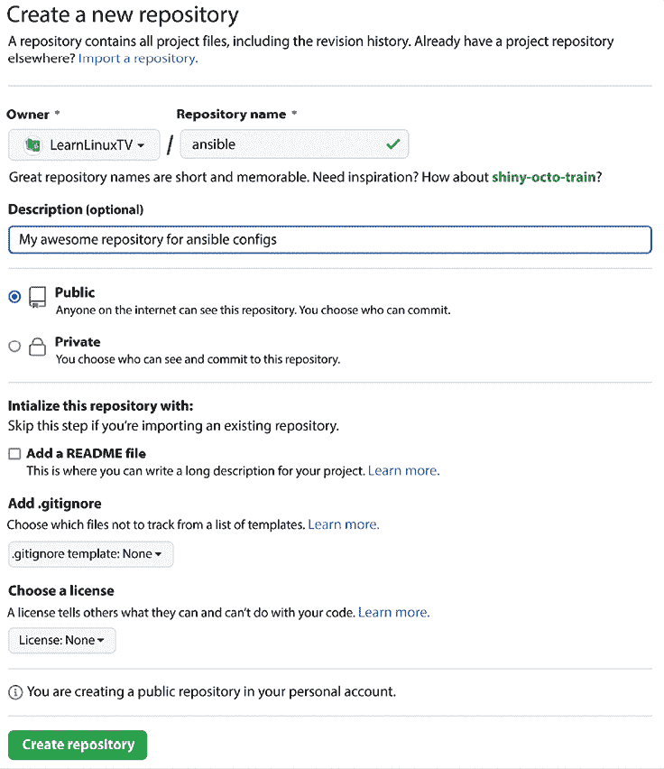
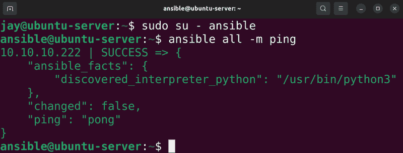
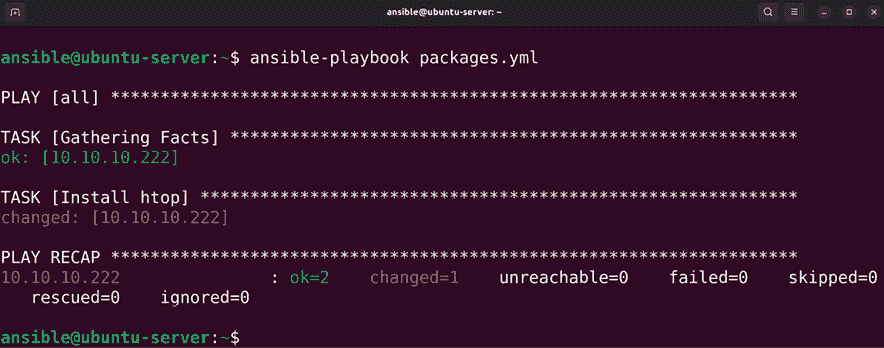
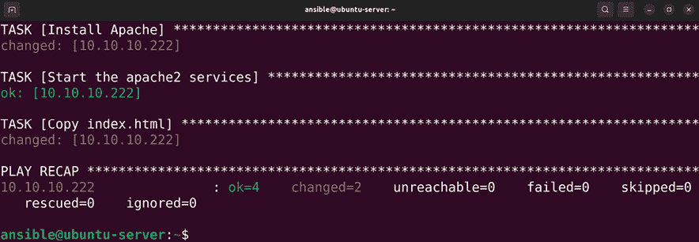
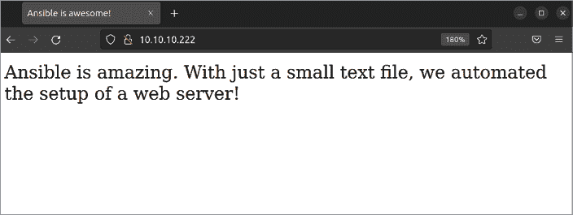

# 第十五章：使用 Ansible 自动化服务器配置

如今，拥有成百上千台服务器组成组织基础设施并不罕见。随着用户基数的增加，我们能够扩展环境以满足客户需求。当我们扩展资源并增加额外服务器时，配置和设置这些服务器所花费的时间会显著增加。设置新服务器所花费的时间可能成为一项重大负担——特别是当我们需要在短时间内创建数百台服务器时。随着工作负载的增加，我们需要有一个解决方案来管理我们的基础设施，并尽可能以最小的工作量快速部署新资源。在本章中，我们将探讨配置管理的概念以及自动化部署。听起来很复杂，但其实并不难——你会惊讶于自动化配置有多么简单。

在本章中，我们将覆盖以下内容：

+   理解配置管理的需求

+   为什么选择 Ansible？

+   创建 Git 仓库

+   开始使用 Ansible

+   让你的服务器按照你的指令行事

+   将一切整合在一起——自动化部署 Web 服务器

+   使用 Ansible 的拉取方式

在介绍中，我已经给出了你可能希望将自动化集成到工作流中的一些示例，并在你的环境中实现有效的解决方案。在接下来的部分，我们将更详细地探讨自动化的需求，然后再开始实际操作。

# 理解配置管理的需求

当我刚开始从事 IT 行业时，那个时候的环境和今天有很大的不同。服务器都是物理服务器，每当你需要一台新服务器时，你需要打电话给供应商并订购一台。

你可能等待了一到两周才等到服务器搭建并发货给你。收到服务器后，你把它安装到机架上，设置操作系统，然后安装所需的应用程序。你会测试这台服务器一段时间，确保软件、硬件和驱动程序的组合是稳定可靠的。过了一段时间，你就可以将新服务器投入生产使用。

如今，系统管理员仍然经常需要购买和安装硬件，就像我在前面提到的那样。然而，随着虚拟机和容器的出现，我们安装的物理硬件通常只是托管虚拟资源的催化剂。过去，我们为每个用例配备一台物理服务器，这意味着我们需要非常大的服务器机房。但在现代，你可能有一台具有数十个核心的服务器，能够运行成百上千个虚拟机。但配置问题依然存在——设置操作系统和应用程序的过程是一个非常耗时的工作。

随着技术环境的变化，对自动化的需求增加。服务器需要快速高效地部署。在典型数据中心中，由于服务器数量庞大，每次需要变更时，逐一连接每台服务器并进行配置变得越来越不现实。例如，当安全漏洞成为新闻时，通常的管理员需要手动在每台服务器上安装补丁。这可能需要几天甚至几周的时间。这显然效率低下。

为了更好地应对这一问题，配置管理的概念变得非常流行。通过配置管理，管理员可以编写某种代码（例如脚本），然后使用工具在每台服务器上执行它。配置管理也被称为**基础设施即代码**（**IaC**），基本上让管理员为各种类型的服务器定义一组指南，并自动配置服务器以满足这些要求。这种自动化节省了大量的工作。

配置管理在配置新服务器时也发挥作用。假设为特定类型的服务器定义一些规则，并使其按照这些规则生效。在配置过程中，您希望它安装的应用程序会被自动安装，配置文件被复制，用户被创建，防火墙规则被设置，所有这些都按照您的规范自动完成。更简单地说，假设您只需要通过一个命令就能设置一个类似于 Web 服务器的环境。无需安装 Apache 或做任何手动工作。您只需要请求一个服务器，您所设置的配置管理解决方案将会处理其余的工作。

**IaC**，基本上是配置管理的一个花哨术语，本质上就是在服务器上自动运行脚本。在本书中，我们已经介绍过自动化。在*第六章*，*提升命令行效率*中，我们编写了一个简单的脚本，可以用来备份服务器。同样的思路也可以用于服务器的配置，只需在服务器上线时让其运行一个脚本。对于现有的服务器，您可以只修改一次并将该变更应用到您管理的每台服务器，甚至是某些子集。

配置管理工具，如 Chef、Puppet 等，在这里发挥作用。这些解决方案中的每一个都具有一种特定类型的脚本语言，旨在从零开始简化资源的配置过程。使用这些工具时，通常会有某种程序（或本地安装的代理）来解释来自中央服务器的指令，并在其客户端上执行这些指令。每个解决方案都相对智能，它将确定需要完成的任务并执行相关步骤。

如果满足某个要求，指令会被跳过。如果缺少必要的资源，它将被适当配置。一个这样的配置管理解决方案是 Ansible，我们将在本章中使用它。

# 为什么选择 Ansible？

在本章中，我将向你展示如何设置 Ansible，接着我们将使用它来自动化一些配置任务。到本章结束时，你将理解一些基本概念，可以开始在你的组织中自动化部署过程。你可能会问，为什么是 Ansible，而不是其他解决方案，比如 Chef 或 Puppet？

一些配置管理解决方案在资源角度上比较沉重。对于其他解决方案，你通常会有一个中央服务器，它将运行一个主程序。这个程序会定期与每个受控服务器通过与安装在每台服务器上的代理进行通信，*检查*它们的状态。然后，代理将从中央服务器接收指令并执行。

这意味着你需要维持一台具有适度 CPU 和内存要求的服务器，并且通信过程中的客户端代理也需要消耗宝贵的 CPU 来执行指令。这种资源利用可能会对主服务器和客户端服务器造成很大负担。

Ansible 与其他解决方案的最大不同在于，它根本不需要代理。通常会有一个服务器，但它不需要运行任何资源密集型的软件。整个配置过程通过 SSH 完成，因此如果你不想维护一个中央服务器，你甚至可以从你的工作站执行指令。通常，管理员会在每台服务器上创建一个用户帐户，然后中央 Ansible 服务器（或工作站）将通过 SSH 执行命令来更新每台机器的配置。由于每台服务器上都没有安装代理，整个过程的 CPU 消耗要少得多。当然，Ansible 给服务器下达的指令肯定会导致 CPU 使用，但肯定比其他解决方案要少得多。

Ansible 通常通过创建一个**清单文件**来设置，这个文件包含了一份资源（服务器）列表（形式为主机名或 IP 地址，Ansible 将被指示连接并配置）。如果你想添加一台新服务器，只需要确保该服务器上存在一个特定的用户帐户，然后将它添加到清单中。如果你想移除它，只需要删除清单文件中与该服务器对应的行。非常简单。

然而，Ansible 的一个神奇之处在于，你完全不必运行中央服务器，如果你不想的话。你可以将 Ansible 配置存储在 Git 仓库中，然后让每台服务器从仓库中下载代码并在本地运行。这意味着，如果你有一个动态环境，服务器时常增减（这在云部署中非常常见），你不必担心维护一个清单文件。只需要指示每台服务器下载代码并自行配置。这就是 Ansible 的**pull 方法**，我将在后面展示给你。

虽然 Chef 和 Puppet 等解决方案各有优点，且使用起来确实很有趣，但我相信你会发现，Ansible 在扩展性方面更优秀，且能让你对这些主机的配置拥有更多的控制权。虽然如何实施 Ansible 完全取决于你，但它给予你的创作自由无与伦比。我已经使用 Ansible 一段时间了，仍在不断发现新的使用方式。这是一项能与您共同成长的技术。

# 创建 Git 仓库

本章中的示例，建议你创建一个 Git 仓库来存储你的 Ansible 代码。这不是强制性的，因为你可以通过其他方式托管代码，但强烈推荐这么做。尤其是在本章末尾讲解 Ansible 的 pull 方法时，创建 Git 仓库显得尤为重要。如果你已经知道如何使用 GitHub，可以跳过这一部分。

虽然本书无法对 Git 进行全面讲解，但基本概念足以帮助你跟上本书的内容。对于 Git，你可以简单地在服务器上安装`git`软件包来托管你的代码，但 GitHub 可能是最简单的入门方式。额外的好处是，GitHub 上有许多优秀的项目，你可以从中受益，浏览这些项目的代码是熟悉不同脚本语言和编程语言语法规则的好方法。对于我们的目的，我们将使用 GitHub 作为存储 Ansible 代码的中央位置。

这可能是显而易见的，但 GitHub 是一个公开资源。你上传到服务的任何代码默认都可以供所有人查看。因此，提交到仓库时需要注意你包含的信息。确保不包含任何个人身份信息、密码、蓝图、API 密钥或任何你不希望公众知道的关于你或你组织的信息。你可以创建一个私有仓库来隐藏机密信息，但即便如此，最好不要上传受保护的信息（无论仓库是否为私有）。

要开始，请在 [`www.github.com`](https://www.github.com) 创建一个帐户（如果尚未拥有）。这是一个免费的过程。确保在这里创建一个相对安全的密码。创建完帐户后，单击 **新建仓库**，然后给它命名（简单地称为 `ansible` 即可）：



图 15.1：在 GitHub 上创建一个 Ansible 仓库

在示例截图中，我创建了一个 **公共** 仓库，这意味着任何人都可以查看代码。如果你喜欢，也可以创建 **私有** 仓库。由于在本书的示例中不会包含仓库中的机密信息，因此我们现在不需要担心这个问题。

创建仓库后，我们需要下载它到本地，使用 **创建仓库**。为此，我们需要安装 `git` 软件包：

```
sudo apt install git 
```

接下来，我们应该设置本地的 Git 客户端，以便我们可以填写我们的姓名和电子邮件地址，否则 Git 很可能会抱怨。为此，我们可以使用以下命令，并将引号中的内容替换为你的信息：

```
git config user.email "you@example.com"
git config user.name "John Doe" 
```

要下载我们的仓库，以下操作将奏效（如果看到关于仓库为空的警告，请忽略）：

```
git clone https://github.com/myusername/ansible.git 
```

现在你已经将 Git 仓库下载到本地。目前，该仓库不包含任何有用的内容。要在仓库中创建文件，只需将工作目录更改为克隆时下载的仓库文件夹内部，并在其中创建任何你想要的文件。默认情况下，Git 不会关心你在仓库内创建的任何文件，直到你添加它们。例如，我们可以使用以下命令创建一个测试文件并提交到仓库：

```
echo "this is a test" > testfile.txt
git add testfile.txt
git commit -m "initial commit" 
```

使用这些命令，我们使用 `echo` 创建了一个包含一些文本的测试文件。然后，我们使用 `git add` 命令告诉 Git 我们希望这个文件成为仓库的一部分。最后，我们通过 `git commit` 完成了我们的更改，同时使用了 `-m` 标志并附上了关于提交的消息。此时，这些更改仅存在于本地。要将更改推送回 GitHub，我们从仓库目录内部使用以下命令：

```
git push origin main 
```

通过按照屏幕提示（GitHub 用户名和密码），我们的更改将被放置在我们的实际仓库内部。

那么，这如何帮助我们进行配置管理呢？通常，管理员用于配置服务器的代码会保存在一个仓库中以确保安全。如果本地的代码丢失了，只需从仓库中重新克隆即可。GitHub 是我们存放代码的安全地方，因为我们可以合理地确信，代码不会丢失，因为该服务非常稳定（不过你仍然可能希望创建一个本地备份以确保安全）。无论你是使用 Ansible、Chef、Puppet 还是其他工具，将代码保存在 Git 仓库中都是常见做法。就 Ansible 而言，这将直接影响本章最后一节，因为我们将使用 `ansible-pull` 命令，它需要一个仓库 URL。

在实践中，当我们创建 Ansible 剧本时，应该将这些更改提交回仓库。我不会特别要求你这么做，但请在接下来的操作中牢记这一点。当你创建一个新的剧本时，将其添加到仓库中，然后提交。如果你对现有文件进行了更改，记得提交这些更改。确保使用 `git push` 命令将更改推送回仓库。例如，如果你在仓库中创建了一个名为 `myplaybook.yml` 的文件，你将执行类似以下的命令：

```
git add myplaybook.yml
git commit -m "insert message about the commit here"
git push origin main 
```

在继续之前，不妨先练习一下。即使你在生产环境中不使用 Ansible，了解 Git 的基础知识也非常宝贵，因为你几乎肯定会在未来的某个时刻需要它。

# 开始使用 Ansible

了解 Ansible 的第一件事是它在不断变化。新版本带有令人兴奋的功能，定期发布，而且完全没有放缓的迹象。这个技术引起了很多的关注，因此它也在不断改进。

我之所以提到这一点，是因为尽管本书中的示例是在 Ubuntu 22.04 上编写并测试的，但 Ansible 的新版本会定期发布，且这些版本不仅包含新功能，还包括语法更改。对于本书的需求，仓库中提供的 Ansible 版本应该完全足够。然而，如果你查看网上的 Ansible 剧本示例，它们可能是为较新版本（甚至较旧版本）编写的。如果你遇到针对特定示例的 Ansible 问题，排查的一个好方法是对比教程所用的 Ansible 版本与已安装的版本。对于 Ubuntu 22.04，提供的 Ansible 版本是 2.10.x。你可以从官方网站安装更高版本的 Ansible，但为了本书的目的，我们将使用默认仓库中的版本。

继续通过 `apt` 安装 `ansible`：

```
sudo apt install ansible 
```

现在你应该已经能够使用`ansible-playbook`命令了，这是我们在探索 Ansible 时将使用的主要命令。Ansible 还提供了其他一些命令，但我们不关心它们。

为了能够跟上本章的其余内容，建议你至少有两台服务器来操作；更多的服务器会更好。如果你有像 VirtualBox 这样的**虚拟机**(**VM**)解决方案，只需创建更多的虚拟机。为了节省时间，可以考虑克隆现有虚拟机几次（只是确保不要通过过度分配资源来超载你的计算机/服务器）。

Ansible 最常见的工作流大致是这样的：你有一台安装了 Ansible 的主服务器或工作站。虽然客户端不需要安装代理，但它们需要安装并配置 OpenSSH，因为 Ansible 通过 SSH 进行通信。为了简化操作，建议每台机器上都有一个专门的 Ansible 用户，并且服务器上的 Ansible 用户应能无密码连接到每台机器。你可以随便为 Ansible 用户起个名字；你可以使用`ansible`，也可以起个更有创意的名字。我们在*第十章*，*连接到网络*中介绍了如何创建 SSH 密钥，如果需要回顾，可以参考该章节。创建用户的内容在*第二章*，*管理用户和权限*中有所讲解。总之，以下是你为了设置 Ansible 环境需要做的几件事：

1.  在中央服务器或工作站上安装 Ansible

1.  在每台你想管理配置的机器上创建一个 Ansible 用户

1.  在中央服务器或本地机器上创建相同的用户

1.  在服务器上设置 Ansible 用户，以便它能够通过 SSH 连接到客户端且无需密码。

1.  配置客户端机器上的`sudo`，使得 Ansible 用户可以在没有密码的情况下执行`sudo`命令

在之前的章节中，我们讲解了如何创建用户和 SSH 密钥，但还没有讲解最后一点。假设你将 Ansible 用户命名为`ansible`，创建以下文件：

```
/etc/sudoers.d/ansible 
```

在该文件中，放入以下内容：

```
ansible ALL=(ALL) NOPASSWD: ALL 
```

接下来，我们需要确保该文件的所有者是`root`：

```
sudo chown root:root /etc/sudoers.d/ansible 
```

最后，我们需要调整文件的权限：

```
sudo chmod 440 /etc/sudoers.d/ansible 
```

现在可以开始测试了。在服务器上切换到`ansible`用户：

```
sudo su - ansible 
```

然后，测试一下，通过 SSH 在远程机器上执行一个命令：

```
ssh 192.168.1.123 sudo ls /etc 
```

这是如何工作的呢？你可能知道也可能不知道，如果你使用 SSH 执行单个命令，其实不一定需要建立一个持久连接。在这个例子中，我们首先切换到`ansible`用户。然后，我们连接到`192.168.1.123`（或者客户端的 IP 地址），并告诉它执行`sudo ls /etc`。用`sudo`执行`ls`命令可能看起来像个傻事，但这非常有用——它让你可以测试`sudo`是否能正常工作，而不会做出任何潜在危险的操作。列出目录的内容是最无害的操作之一。

这看起来可能像是一个繁琐的过程，但请确保你从系统管理员的角度思考——这些设置步骤是可以自动化的。以我为例，我有一个 Bash 脚本，会在每台服务器上运行，设置所需的用户、密钥和专门用于 Ansible 的 `sudo` 权限。每当我想将新服务器添加到 Ansible 时，只需要在该机器上运行一次脚本，从此以后，Ansible 将自动处理剩余部分。  

正常情况下，命令应该执行并打印 `/etc` 目录的内容，而不会提示你输入密码。如果这不起作用，请确保你已经完成了所有推荐的步骤。每台机器上应该有一个 `ansible` 用户，该用户应具备无需密码的 `sudo` 权限，因为我们已经在 `/etc/sudoers.d` 中为该用户创建了一个文件。如果 SSH 部分失败，请检查 `/var/log/auth.log` 日志文件，里面会保存相关错误的线索。一旦你满足了这些要求，就可以开始使用 Ansible 自动化了！  

# 让你的服务器按照你的意愿工作  

作为服务器管理员，我们都是控制狂。没有什么比执行一个命令，看到每一台服务器都服从并执行它更让人兴奋了。既然我们已经设置好 Ansible，接下来正是要做这件事。我假设你现在已经有了一些要配置的机器，它们都已经配置好通过 SSH 与中央服务器进行通信。另外，正如我之前提到的，我强烈推荐你使用类似 Git 的工具来存储你的配置文件，但这部分并不是本节的必要内容。  

## 设置清单文件并配置 Ansible 设置

首先，我们需要一个清单文件，这是一种特殊的文本文件，Ansible 需要从中读取信息以确定连接到哪些服务器。在以前的版本中，安装 `ansible` 包的过程中会为你提供一些默认的配置，位于 `/etc/ansible` 目录下。但在 Ubuntu 22.04 中，至少对于默认仓库中提供的 Ansible 版本，情况发生了变化。对于我们的目的来说，这没关系——反正我们是要创建一个空的配置文件。  

首先，让我们创建一个目录，在“控制器”服务器上用于配置管理（即我们用来控制或“配置”其他节点的服务器）：  

```
sudo mkdir /etc/ansible 
```

之后，我们可以创建一个空的清单文件：  

```
sudo touch /etc/ansible/hosts 
```

事实上，有一种方法可以避免创建清单文件，稍后我们将在本章中讨论这一点。  

我们还应该确保只有 Ansible 用户帐户可以读取该文件。执行以下命令以更改文件的所有权（如果你使用的是不同的用户帐户，请将 `ansible` 替换为你选择的帐户名）：  

```
sudo chown ansible /etc/ansible/hosts 
```

接下来，修改文件的权限，使得只有所有者可以查看或更改该文件：  

```
sudo chmod 600 /etc/ansible/hosts 
```

接下来，让我们编辑`/etc/ansible/hosts`文件并填充它。如果在安装 Ansible 时确实为你创建了默认的`hosts`文件，你可以简单地清空该文件，因为我们无论如何都会创建自己的文件。我们将在这个文件中填入我们希望管理的服务器的 IP 地址。如果原始的主机文件已经存在，欢迎你先备份它。现在，我们只包括了我们希望用 Ansible 控制的节点的 IP 地址，因此该文件最终会看起来像下面这样：

```
192.168.1.145
192.168.1.125
192.168.1.166 
```

就是这样；它只是一个简单的 IP 地址列表。我敢打赌你原本以为会有一些包含各种语法要求的长配置吧？抱歉让你失望了。你需要做的就是将你想要管理的服务器的 IP 地址列表复制到这个文件中。如果你已经为你想配置的机器设置了 DNS 名称，你也可以使用它们：

```
myhost1.mydomain.com
myhost2.mydomain.com
myhost3.mydomain.com 
```

由于 Ansible 既能理解 IP 地址，也能理解 DNS 名称，我们可以使用其中任意一种，或两者结合起来设置我们的库存文件。我们还可以在库存文件中将主机按不同角色进行划分，但这超出了本书的范围。如果你希望进一步深入了解 Ansible 的知识，我推荐学习关于 Ansible 角色的内容（有关更多信息，请参见*相关视频*部分）。

如果你决定不将库存文件存储在`/etc/ansible/hosts`，你必须告诉 Ansible 它的存放位置。Ansible 还有另一个重要的文件，那就是它的配置文件，位于`/etc/ansible/ansible.cfg`。在这个文件中，我们可以微调 Ansible，以便获得最佳性能。虽然我们不会详细讨论这个文件，但要知道，通过微调配置设置，你可以显著提高 Ansible 的性能，并且 Ansible 每次运行时都会读取配置文件中的设置。在我们的案例中，如果我们希望将库存文件存储在`/etc/ansible/hosts`以外的地方，我们需要在这个文件中添加以下两行（很可能，你需要创建这个文件，因为此时它可能还不存在）：

```
[defaults]
inventory = /path/to/hosts
remote_user = jay 
```

在第一个设置中，我们基本上是在告诉 Ansible 去哪里找到它的库存文件。我们还可以在`ansible.cfg`文件中添加更多的配置项来进一步配置它，但目前这些就是我们需要配置的内容。在第二行中，我们设置了一个默认用户，用于 Ansible 的剧本，这个用户必须在你希望使用 Ansible 管理的任何服务器上存在。

与库存文件类似，Ansible 还会检查本地目录中是否存在一个名为 `ansible.cfg` 的文件来获取其配置，因此你也可以将配置文件包含在 Git 仓库中，然后从仓库目录内执行 Ansible 命令。这是可行的，因为 Ansible 会检查当前工作目录中是否存在配置文件，并在找到该文件时使用它。不过，你可能需要小心将配置文件包含在 Git 仓库中。虽然它不像库存文件那样私密，但它可能包含敏感信息。因此，如果文件中包含了任何私密信息（例如加密密钥），你可能需要将文件保存在 `/etc/ansible/ansible.cfg` 目录，并在 Git 仓库之外管理。

现在我们可以测试一下 Ansible 是否已经正常工作。幸运的是，这也很简单。只需要执行以下命令：

```
ansible all -m ping 
```

结果应该类似于以下内容：



图 15.2：测试 Ansible

根据你设置的服务器数量，你应该会看到输出出现一次或多次。你可能认为这个命令只做了一个简单的 ping 测试，但在 Ansible 中，`ping` 的含义与通常不同。它实际上是在尝试与服务器建立连接，以测试其可用性。如果失败了，双重检查一下主机是否可以通过 SSH 访问。这里的成功意味着 Ansible 能够通过 SSH 与主机通信。既然通信已经建立，我们就可以开始构建一些实际的配置了。

## 配置客户端服务器

Ansible 使用一种叫做 **playbook** 的工具来存储配置。Playbook 本质上是一个 YAML 格式的文件，包含 Ansible 可以理解的指令，这些指令会被解释为一组针对主机执行的任务。关于 YAML 的完整指南我们在这里不会深入讨论——你不需要精通这个格式，甚至不需要完全理解它就可以在 Ansible 中使用。随着使用的深入，这些内容会自然掌握。这里需要注意的是，YAML 仅仅是 Ansible 使用的格式，它并非 Ansible 特有的文件格式。Playbook 基本上就是一系列以 YAML 格式书写的指令集合，每个单独的指令称为一个 play。

你可以用一种类似于体育运动的比喻来理解这一点，比如足球。虽然我对足球一无所知，但我知道足球教练有一本包含他们希望球员执行的动作的战术手册，每个球员的动作就是一场比赛。这里的概念也是一样的。

让我们编写第一个剧本。在你的本地 Ansible 目录中创建一个名为 `packages.yml` 的文件。你可以将以下内容填入文件中（确保包含短横线）：

```
---
- hosts: all
  become: true
  tasks:
  - name: Install htop
    ansible.builtin.apt:
      name: htop 
```

我们可以使用以下命令运行这个剧本：

```
ansible-playbook packages.yml 
```

这将产生类似于以下内容的输出：



图 15.3：Ansible 运行示例

就这样，库存文件中的所有主机都会安装`htop`包。你安装哪个包其实并不重要，只要它在软件库中存在；我只是用`htop`作为一个简单的示例。但一旦你运行它，你应该能看到所做更改的概览。Ansible 会告诉你有多少项更新，多少任务失败，多少目标在运行剧本时无法访问。

让我们仔细看看这个示例剧本中的指令做了什么。开头的短横线是 YAML 格式的一部分，所以我们其实不需要深入讨论。空格在 YAML 格式中非常重要，因为你需要保持一致。

在我的示例中，我在每个标题下面插入了两个空格。标题以短横线开始：

```
- hosts: all 
```

在这里，我们声明希望将命令应用于哪些主机。我在这里添加了`all`，这基本上是对库存文件中的每一台主机运行配置。在高级用法中，你实际上可以在 Ansible 中创建`roles`（角色），并将主机分配到不同的角色中，例如 Web 服务器、数据库服务器等等。然后，你可以只将配置应用于特定角色内的主机。我们在本章不打算深入讨论这个内容，但只需知道这是可行的。

下一行是`become`：

```
become: true 
```

这一行基本上是 Ansible 用来描述`sudo`的术语。我们告诉 Ansible 使用`sudo`来执行命令，因为安装包需要`root`权限。接下来的剧本部分如下：

```
tasks: 
```

这一行开始了下一部分，那里是我们放置各个任务的地方。接下来，我们为我们的新任务命名（Ansible 称任务为“play”）：

```
- name: Install htop 
```

使用`name`，我们为该剧本指定一个名称。这不是必需的，但你应该始终包含它。这样做的重要性在于，无论我们在这里输入什么，如果启用了日志记录，它都会出现在日志中，并且会在剧本运行时打印到终端。我们在这里应该写得具有描述性，因为这对于剧本执行失败时，我们需要在成百上千行的日志文件中找到它时，肯定会有所帮助。接下来，我们使用`apt`模块并告诉它安装一个包，这里以`htop`为例：

```
ansible.builtin.apt:
  name: htop 
```

我们使用`ansible.builtin.apt`模块仅仅是因为 Ubuntu 使用`apt`命令来管理包，但也有针对所有流行 Linux 发行版的模块。Ansible 对各个发行版的包管理器的支持实际上非常广泛。所有主要的发行版，如 Red Hat、Fedora、openSUSE、Arch Linux 和 Debian，都得到支持（而这些只是我在实验室中使用过的发行版）。如果你想对运行非 Ubuntu 发行版的服务器执行剧本，只需将`ansible.builtin.apt`调整为其他命令，如`ansible.builtin.dnf`。

由于 Ansible 允许你使用来自 Galaxy 的额外资源，Galaxy 是一个专门为 Ansible 提供额外功能的站点，因此我们使用 `ansible.builtin.apt` 而不仅仅是 `apt`，以明确表示我们使用的是内建模块，而不是来自外部资源的模块。

这个新的命名方案自从本书上一版发布以来才出现。旧版本的 playbooks 应该依然可以正常工作，但由于命名方案自那时起发生了变化，我们将使用新的命名风格继续。

当然，你可以通过简单地在现有 playbook 中添加更多的 play 来增加额外的软件包：

```
---
- hosts: all
  become: true
  tasks:
  - name: Install htop
    ansible.builtin.apt:
      name: htop
  - name: Install git
    ansible.builtin.apt:
      name: git
  - name: Install vim-nox
    ansible.builtin.apt:
      name: vim-nox 
```

然而，这并不是一个非常高效的方法。我将展示如何将多个相似的 play 合并到一个 play 中。当然，你不必这样做，但我相信你会同意，这种方法看起来更简洁：

```
---
- hosts: all
  become: true
  tasks:
  - name: Install packages
    ansible.builtin.apt:
      name:
        - git 
        - htop
        - vim-nox 
```

使用新格式时，我们只包含一个 play 来安装多个软件包。如果你有编程经验，这就像是 *for 循环* 的概念。对于我们列出的每个软件包，它都会执行 `ansible.builtin.apt` 模块。如果我们想添加额外的软件包，只需要在列表中添加新的软件包。非常简单。

我们还可以将文件复制到我们的主机上。考虑下面这个示例 playbook，我将它命名为 `copy_files.yml`：

```
---
- hosts: all
  become: true
  tasks:
  - name: copy SSH motd
    ansible.builtin.copy:
      src: motd
      dest: /etc/motd 
```

然后，你可以通过以下命令运行这个 playbook：

```
ansible-playbook copy_files.yml 
```

在相同目录下，创建一个名为 `motd` 的文件，并将任意文本放入其中。你输入到文件中的内容并不重要，但这个文件特别用作每次用户登录服务器时打印的消息。当你运行 playbook 时，它会将这个文件复制到你配置的服务器目标位置。由于我们创建了一个今天消息（`motd`），所以下次登录服务器时，我们应该看到新消息。

到现在为止，你可能已经意识到 Ansible 是多么有用。没错，我们只是安装了几个软件包并复制了一个文件。我们本来可以轻松地自己完成这些任务，而不需要 Ansible，但这仅仅是个开始。Ansible 让你能够自动化一切，我们必须从某个地方开始。你不仅可以让它安装软件包和复制文件，还可以用它启动服务、应用配置文件模板，等等——它会让你惊讶。事实上，你可以用它自动化设置一个 Web 服务器，一个用户的工作站……随你选择！

# 把它们整合在一起——自动化 Web 服务器部署

说到自动化设置 Web 服务器，为什么不直接做这个呢？这将是另一个简单的例子，但如果我们展示 Ansible 的更多功能，它将对你非常有帮助。我们将设置一个 playbook 来执行以下任务：

1.  安装 Apache

1.  启动 `apache2` 服务

1.  为新站点复制一个 HTML 文件

首先，让我们设置一个 playbook 来简单地安装 Apache。我把它命名为 `apache.yml`，但这个名字是随意的：

```
---
- hosts: all
  become: true
  tasks:
  - name: Install Apache
    ansible.builtin.apt:
      name: apache2 
```

没有什么惊讶的；我们此时已经安装了一个软件包。接下来，让我们添加一个指令来启动 `apache2` 服务：

```
---
- hosts: all
  become: true
  tasks:
  - name: Install Apache
    ansible.builtin.apt:
      name: apache2
  **- name: Start the apache2 services**
    **ansible.builtin.service:**
      **name: apache2**
      **state: started** 
```

到目前为止，语法应该是自解释的。Ansible 有一个 `service` 模块，可以用来启动主机上的服务。在这个例子中，我们启动 `apache2` 服务（虽然在 `apache2` 安装时服务已经自动启动，但这样做至少可以确保它已经启动）。你确实需要提前知道服务的名称，但你无需关注需要在后台使用哪个工具来启动服务。Ansible 已经知道如何在所有流行的发行版上启动服务，并为你处理后台的具体操作。

启动 `apache2` 的剧本可能显得有些多余，因为在 Ubuntu 服务器上安装的大多数软件包都会在安装完成后自动启动相关服务（`apache2` 也不例外）。但是在编写自动化代码时，清晰和明确地表达所期望的最终结果是非常重要的。尽管 `apache2` 在 Ansible 安装完包后会自动启动，但我们还是添加了一个 `service` 剧本，以明确它需要处于运行状态，这样任何查看它的人都会知道期望的结果是什么。此外，我们可以通过在代码的这一部分再加一行来确保 `apache2` 被设置为 `enabled`（注意那一行加粗的部分）：

```
- name: Start the apache2 services
    ansible.builtin.service:
    name: apache2
    state: started
    **enabled: true** 
```

我会留给你决定是否包含那一行额外的内容，但关键是当编写自动化脚本时，要尽可能清晰和直接，以避免对最终结果产生任何混淆。

好的，这很简单。让我们为 Apache 创建一个简单的网页，让它为我们提供服务。网页不需要太花哨，我们只是想看到它是否能正常工作。在与其他 Ansible 文件相同的工作目录中，创建一个名为 `index.xhtml` 的文件，并在其中写入以下内容：

```
<html>
<title>Ansible is awesome!</title>
<body>
    <p>Ansible is amazing. With just a small text file, we automated the setup of a web server!</p>
</body>
</html> 
```

如你所见，这个 HTML 文件相当简单，但对于我们的需求来说，它完全足够了。接下来，让我们在 Apache 的剧本中添加另一条指令：

```
---
- hosts: all
  become: true
  tasks:
  - name: Install Apache
    ansible.builtin.apt:
     name: apache2
  - name: Start the apache2 services
    ansible.builtin.service:
      name: apache2
      state: started

  **- name: Copy index.xhtml**
    **ansible.builtin.copy:**
      **src: index.xhtml**
      **dest: /var/www/html/index.xhtml** 
```

使用 `copy` 模块，我们可以将文件从本地 Ansible 目录复制到服务器。我们只需要提供源文件路径（`src`）和目标路径（`dest`）。

让我们继续执行新的剧本：

```
ansible-playbook apache.yml 
```

这将产生如下所示的输出：



图 15.4：使用 Ansible 安装 Apache 并复制默认站点文件

几分钟内，你应该已经至少配置了一个由 Ansible 管理的 web 服务器。在真实的生产环境中，你只会在特定角色的服务器上运行这些指令，但角色超出了本章的讨论范围。从我们创建的简单剧本中，你应该能够看到这款强大软件的威力：



图 15.5：Ansible 提供的网页示例

在我们对 Ansible 配置管理的探索过程中，我们已经安装了软件包、启动了服务并复制了文件。诚然，这些操作不算多，但它们正是你练习基础操作所需的。Ansible 的文档包含了如何做各种操作的指南，你将能够利用它提供的各种模块来执行不同的任务。

为了更深入地探索 Ansible，我建议你考虑一下那些你日常做的、可以从自动化中获益的事情。像安装安全更新、创建用户账户、设置密码和启用服务自动启动等任务，都是很适合开始使用的自动化操作。

此外，你可能还想考虑为 `ansible` 用户添加一个简单的 **cron 作业**，每小时左右运行一次 playbook。我们在*第七章*《控制和管理进程》中介绍了 cron 作业。添加 cron 作业不会带来额外的资源开销，因为 Ansible 实际上不会做太多工作，除非你添加了新的命令。在更高级的使用中，你可能希望让 Ansible 从代码库中检出代码，并在配置发生变化时应用配置。这样，你只需要将更改提交到 Git 仓库，所有服务器将在下一次计划时间下载并运行该配置。我最喜欢 Ansible 的一点是，它很容易上手，但你会不断发现新的使用方式并从中受益。

# 使用 Ansible 的拉取方法

在上一节中我们设置的 Ansible 配置方法，如果我们有一系列特定的服务器需要管理，效果非常好。要添加新服务器，我们只需要在新主机上创建用户账户并配置 SSH，然后将其添加到清单文件中。如果我们要停用那台服务器，只需要将其从清单文件中删除。这种方法在静态环境下非常有效，静态环境中部署的服务器通常会保持一段时间。然而，在动态环境中，这种方法可能效果不佳。

动态环境在云计算中非常典型。在云计算中，通常会有一个或多个虚拟服务器为你的公司或用户提供服务。这些服务器可能随时上线或下线。在动态环境中，服务器会根据需要上线以处理负载，并且随着负载的减少，服务器也会自动下线。因此，你永远不知道服务器何时上线，而在这种环境下手动配置服务器是低效的。

因此，Ansible 的清单文件可能不适合动态基础设施。虽然确实有方法可以让 Ansible 的清单在这种环境中工作，实际上你可以用一个可执行脚本替换清单文件，这个脚本可以进行 API 调用并根据需要自定义你的基础设施。但是，这超出了本书的范围，而且还有一种更简单的方法。

如我们所见，Ansible 使用清单文件并连接到文件中列出的每一台服务器。然而，Ansible 也有 **拉取模式**，在这种模式下，除了有一个中央服务器连接到其他机器，每台处于拉取模式的服务器实际上会运行 Ansible 来操作它自身。依我看，这是使用 Ansible 的一种很棒的方式，但它似乎没有得到应有的关注。首先，我将解释它的工作原理，然后我们可以通过一个实际的例子来学习。

使用拉取模式时，你需要将 Ansible playbooks 存放在一个 Git 仓库中。这个仓库必须能够从你将管理的服务器访问。例如，如果你将 Git 仓库存放在 GitHub 上，你需要确保服务器能够从外部访问 GitHub。如果你在内部托管自己的 Git 服务器，你需要确保服务器能够通过防火墙或你可能设置的任何安全规则访问它。

拉取模式是通过 `ansible-pull` 命令实现的，该命令与 Ansible 一起捆绑。语法如下所示：

```
ansible-pull -U https://github.com/myusername/ansible.git 
```

当然，你需要将网址替换为你实际的 Git 仓库的 HTTP 或 HTTPS 地址。基本上就是这样。`ansible-pull` 命令仅需要 `-U` 选项（即 URL 的简写）以及指向 Git 仓库的 URL。

为了使这个方法生效，你需要在仓库中有一个特殊命名的 playbook，`local.yml`。如果你没有在 Ansible 中声明特定的 playbook，它将期望在仓库的根目录中找到一个名为 `local.yml` 的 playbook。如果你选择为主 playbook 使用一个不同于 `local.yml` 的名字，那么你需要指定它：

```
ansible-pull -U https://github.com/myusername/ansible.git myplaybook.yml 
```

在这个例子中，`ansible-pull` 命令会将位于指定 URL 的 Git 仓库缓存到本地，并运行仓库中的 `myplaybook.yml` 这个 playbook。你可能会发现 Ansible 会抱怨找不到清单文件，尽管这正是 `ansible-pull` 命令的整个目的。你可以忽略这个错误。这个问题可能会在未来的某个版本中得到修复，但截至本文写作时，如果它没有检测到清单文件，会打印一个警告。

理论部分讲解完毕后，让我们通过一个实际的例子来操作。如果你到目前为止都在跟着学习，我们在上一节中创建了一个自动化部署假设性 Web 服务器的 playbook。我们可以重用那段代码。不过，最佳实践是将文件命名为`local.yml`，因此你可以简单地将我们之前创建的`apache.yml` playbook 重命名为`local.yml`。我们需要对文件做一个小修改，我在这里已将其标出：

```
---
**- hosts: localhost**
  become: true
  tasks:
  - name: Install Apache
    ansible.builtin.apt: name=apache2
  - name: Start the apache2 services
    ansible.builtin.service:
      name: apache2
      state: started
  - name: Copy index.xhtml
    ansible.builtin.copy:
      src: index.xhtml
      dest: /var/www/html/index.xhtml 
```

由于我们是在本地执行 playbook（没有 SSH），我们将 `hosts:` 行修改为指向 `localhost`，以告知 Ansible 我们希望在本地执行命令，而不是远程执行。现在，我们可以将这个 playbook 推送到我们的 Git 仓库，并直接从仓库 URL 执行它。

在执行任何 playbook 时，请仔细注意 `hosts:` 行。如果你使用的是 pull 方法，这一行需要从 `hosts: all` 改为 `hosts: localhost`，原因是我们是直接在本地主机上执行 playbook，而不是通过远程 SSH 连接来执行。如果你没有做这个修改，你会看到类似下面的错误：

```
ERROR! Specified hosts and/or --limit does not match any hosts 
```

在运行 playbook 之前，你需要先切换到你的 Ansible 用户，因为该 playbook 需要以具有 `sudo` 权限的用户身份运行，因为它将执行系统级命令：

```
sudo su - ansible 
```

然后，执行 playbook：

```
ansible-pull -U https://github.com/myusername/ansible.git 
```

如果我们保持文件名为 `apache.yml`，我们只需要指定该文件名即可：

```
ansible-pull -U https://github.com/myusername/ansible.git apache.yml 
```

请记住，由于`ansible-pull`直接在本地主机上执行 playbook，因此该 playbook 必须由具有`sudo`权限的用户来执行。如果`sudo`没有配置为允许该用户无需密码运行，playbook 执行时将会失败，因为它不是交互式的（它不会询问密码）。你也可以在`ansible-pull`命令前加上`sudo`并在执行前输入密码，但如果你设置为通过 cron 自动运行的话，这种方式就行不通了。

如果一切按计划进行，playbook 仓库应该已经缓存到服务器，并且指令会被执行。如果出现错误，Ansible 会相当善于提供逻辑性错误信息。只要用户有权限在服务器上执行特权命令，仓库中包含所需的文件，并且服务器能够访问并下载仓库（没有防火墙阻止），那么 playbook 就会正确运行。

在生产环境中实施拉取方法时，针对不同类型的服务器有几种方法可以实现。一种方法是为每种服务器类型单独创建一个 playbook。例如，你可能会有一个 Apache 的 playbook，以及专门用于数据库服务器、文件服务器、用户工作站等的 playbook。然后，根据你部署的服务器类型，在调用`ansible-pull`命令时指定相应的 playbook。如果你使用的是像云计算这样的服务，你实际上可以为每个服务器提供一个创建时要执行的脚本。你可以指示服务在每次创建新服务器时自动运行`ansible-pull`命令。例如，在 AWS 中，你可以使用一种叫做用户数据的功能，在服务器第一次启动时执行一个脚本。这可以避免你手动配置任何内容。为了使其工作，你需要首先包含一个命令来安装 Ansible 本身，接着第二个命令是`ansible-pull`命令，并附上仓库的 URL。这仅仅是两行代码，就可以完全自动化 Ansible 的安装和 playbook 的应用。提前考虑这些可能性，帮助你理解自动化如何为你带来诸多好处。

虽然正确有效地配置新服务器非常重要，但维护现有服务器同样重要。当你需要安装新软件包或应用安全更新时，最后你想做的事就是手动连接到每一台服务器，逐个更新它们。`ansible-pull`命令也能简化管理；你只需再次运行命令。每次运行`ansible-pull`时，它会下载仓库中的最新代码并运行。如果有任何更改，它们会被应用，已经应用的部分则会被跳过。例如，如果你在 playbook 中包含了安装`apache2`包的任务，Ansible 在第二次运行 playbook 时不会重新安装这个包，因为该需求已经满足，它会跳过这一任务。

`ansible-pull`的一个值得了解的技巧是`-o`选项。这个选项会确保只有在仓库中有实际更改时，仓库内的 playbook 才会被运行。如果你没有提交任何更改，Ansible 将跳过整个过程。如果你将`ansible-pull`命令设置为定期通过 cron 运行，比如每小时运行一次，这个功能非常有用。

如果你没有包含`-o`选项，Ansible 将每小时运行整个 playbook。这将无端消耗宝贵的 CPU 资源。使用`-o`选项时，Ansible 将仅使用必要的 CPU 资源来检查仓库是否有更改。仅当你实际提交了更改到仓库时，playbook 才会被运行。

本章节中对 Ansible 的介绍非常基础，我们仅使用了所需组件的核心部分。通过深入研究 Ansible，您将发现更高级的技术，以及一些更聪明的实施方式。例如自动化防火墙规则、安全补丁和用户密码，还可以让 Ansible 在成功配置服务器时发送电子邮件（甚至在失败时也可以）。基本上，您可以手动执行的任何任务，都可以用 Ansible 自动化。在未来，我建议以自动化的思维方式进行服务器管理。正如我之前多次提到的，如果您需要重复执行某项任务，就自动化它。Ansible 是自动化服务器管理的最佳途径之一。

# 总结

在本章中，我们介绍了使用 Ansible 进行配置管理的内容。Ansible 是一项越来越受欢迎的令人兴奋的技术。它为您提供了像 Chef 或 Puppet 等配置管理工具的全部功能，但没有所有的资源开销。它允许您几乎自动化所有事务。在我们的探索过程中，我们介绍了安装软件包、复制文件和启动服务的过程。在章节的末尾附近，我们通过一个示例介绍了如何使用 Ansible 来配置一个简单的 Web 服务器，甚至探讨了在动态环境中非常有用的拉取方法。这些概念构成了可以扩展到自动化更复杂部署的知识基础。

下一章会很有趣：我们将使用 KVM 搭建我们自己的虚拟化服务器。这是我最喜欢的话题之一，我相信你也会喜欢。到时见！

# 相关视频

+   Git Essentials (LearnLinuxTV): [`linux.video/git-essentials`](https://linux.video/git-essentials)

+   使用 Ansible 入门 (LearnLinuxTV): [`linux.video/learn-ansible`](https://linux.video/learn-ansible)

+   使用 Ansible 配置工作站/笔记本电脑 (LearnLinuxTV): [`linux.video/ansible-workstation`](https://linux.video/ansible-workstation)

+   Ansible Vault (LearnLinuxTV): [`linux.video/ansible-vault`](https://linux.video/ansible-vault)

+   Ansible Pull (LearnLinuxTV): [`linux.video/ansible-pull`](https://linux.video/ansible-pull)

# 进一步阅读

+   Ansible 文档: [`learnlinux.link/ansible-docs`](https://learnlinux.link/ansible-docs)

+   Ansible 角色文档: [`learnlinux.link/reuse-roles`](https://learnlinux.link/reuse-roles)

+   Ansible 配置文件文档文章: [`learnlinux.link/a-config`](https://learnlinux.link/a-config)

+   `ansible-pull`文档: [`learnlinux.link/a-pull`](https://learnlinux.link/a-pull)

+   如何使用 Ansible 管理您的工作站配置: [`learnlinux.link/a-ws`](https://learnlinux.link/a-ws)

+   Git 基础: [`learnlinux.link/git-book`](https://learnlinux.link/git-book)

+   设置 Git (GitHub): [`learnlinux.link/setup-git`](https://learnlinux.link/setup-git)

# 加入我们社区的 Discord

加入我们社区的 Discord 空间，与作者和其他读者进行讨论：

[`packt.link/LWaZ0`](https://packt.link/LWaZ0)


