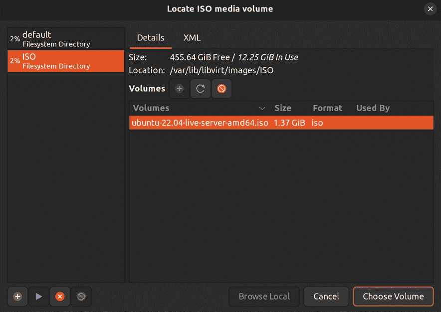
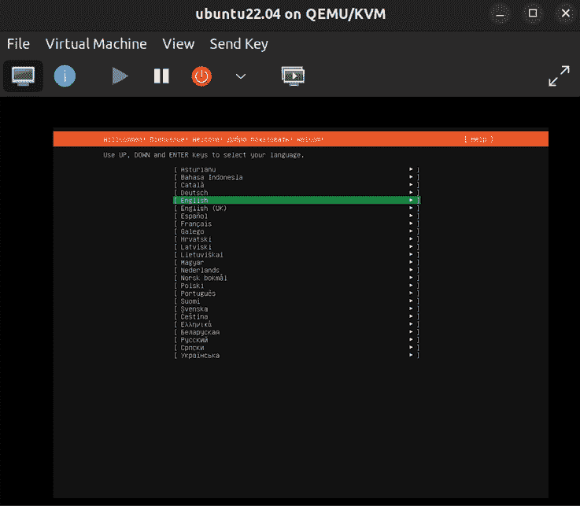

# 16

# 虚拟化

在过去几十年里，信息技术领域发生了许多重要的进展，几项技术的出现真正颠覆了整个技术行业。相信很少有人会争辩，互联网无疑是迄今为止最具革命性的技术，但另一项在 IT 领域产生范式转变的技术是虚拟化。这个概念改变了我们维护数据中心的方式，使我们能够将工作负载划分为多个从单台服务器运行的小型虚拟机。这使我们能够更加充分地利用硬件。由于 Ubuntu 内置了 Linux 内核的最新进展，因此虚拟化支持实际上已经集成在其中。只需安装一些软件包，便能让我们与虚拟化功能进行交互，并在 Ubuntu 服务器上创建虚拟机，无需昂贵的许可协议或支持合同。在本章中，我将引导你设置基于 Ubuntu 的虚拟化解决方案。在这个过程中，我将介绍以下内容：

+   前提条件和考虑事项

+   设置虚拟机服务器

+   创建虚拟机

+   桥接虚拟机网络

+   通过克隆简化虚拟机的创建

+   通过命令行管理虚拟机

为了开始，我们需要一台服务器来完成这项任务，我们首先会讨论一些在设置服务器时需要考虑的事项。

# 前提条件和考虑事项

我相信你们中的许多人已经使用过虚拟化解决方案。事实上，我敢打赌，很多读者在使用本书时，可能已经在像 VirtualBox、Parallels、VMware 等解决方案中运行着**虚拟机**（**VM**）。这些应用程序及类似的软件非常适合在台式机或笔记本电脑上测试 Ubuntu 或其他操作系统。在本节中，我们将设置一台虚拟机服务器，它可以作为一个集中式服务器，用来运行虚拟机。

这比你想象的要容易——Ubuntu 内置了虚拟化功能。它以一对动态组合的形式存在，包括**基于内核的虚拟机**（**KVM**）和**快速模拟器**（**QEMU**），两者共同形成一个虚拟化套件，使 Ubuntu（以及 Linux 一般）能够运行虚拟机，而无需第三方解决方案。KVM 是内置于 Linux 内核中的功能，它在后台执行魔法，处理内核中需要的低级指令，帮助将任务分隔到物理主机和来宾虚拟机之间。QEMU 同样重要，它模拟了通常出现在物理服务器中的硬件组件。KVM 和 QEMU 的结合组成了虚拟化解决方案，可以在 Ubuntu 服务器上启用，将其转变为虚拟机的宿主。

公平地说，你可以在 Ubuntu Server 上设置类似 VirtualBox 的虚拟化方案来完成相同的任务，最终得到一个集中式的虚拟化服务器。这完全是可行的，运行 VirtualBox 的方式没有问题，很多人就是这么做的。但通过使用内建的系统，还是有一些改进的，KVM 提供了一个非常快速的接口，通过它可以与 Linux 内核进行交互，从而以接近本机的速度运行虚拟机，具体速度取决于你的使用场景。QEMU/KVM（以下简称 KVM）几乎是最接近本机的虚拟化方式了。

我敢打赌你已经迫不及待地想开始了，但在我们深入之前，有几件事需要考虑。首先，在这本书中我带你完成的所有活动中，从硬件角度来看，设置我们自己的虚拟化解决方案将是最昂贵的。你计划运行的虚拟机（VM）越多，服务器需要的资源就越多（特别是内存）。幸运的是，现在大多数电脑都至少配备了 8 GB 的内存，16 GB 或更多内存则相当常见。使用大多数现代电脑，你应该能够在不产生太大影响的情况下运行虚拟机。根据你使用的机器类型，CPU 和内存可能会成为瓶颈，尤其是对于老旧硬件来说。

对于本章的目的，建议你拥有一台能够支持 VM 扩展的处理器的 PC 或服务器。现在大多数电脑的 CPU 都提供这个功能，尽管有些可能不支持。为了确认，你可以在打算托管 KVM 虚拟机的机器上运行以下命令，以找出你的 CPU 是否支持虚拟化扩展：

```
egrep -c '(vmx|svm)' /proc/cpuinfo 
```

结果为 `1` 或更高表示你的 CPU 支持虚拟化扩展，结果为 `0` 表示不支持：


图 16.1：检查 CPU 是否支持虚拟化

即使你的 CPU 支持虚拟化扩展，通常情况下，今天大多数消费者 PC 甚至一些服务器都默认禁用了这些扩展。要启用这些扩展，你可能需要进入计算机的 BIOS 设置界面并启用相关选项。根据你的 CPU 和芯片组，这个选项可能会被命名为类似“虚拟化支持”的东西，或者使用更技术化的名称，如 VT-x、AMD-V 或其他术语。不幸的是，我无法为你提供如何启用虚拟化扩展的详细步骤，因为每台机器的操作可能有所不同。如果不确定，请查阅硬件的文档。

最后一个提示：我相信很多人都在使用 VirtualBox，因为它似乎是测试 Linux 发行版的一个非常流行的解决方案（而且确实如此，它非常棒！）。然而，你不能在同一台机器上同时运行 VirtualBox 和 KVM 虚拟机。你当然可以在同一台机器上安装这两种解决方案，但你不能同时启动一个 VirtualBox 虚拟机，再试图启动一个 KVM 虚拟机。你的 CPU 的虚拟化扩展一次只能与一个解决方案一起工作。

另一个需要考虑的问题是服务器可用空间的大小，因为虚拟机可能会占用相当多的空间。KVM 虚拟机镜像的默认目录是`/var/lib/libvirt/images`。如果你的 `/var` 目录属于 `root` 文件系统的一部分，你可能没有很多空间可以使用。有一个技巧是，你可以将一个外部存储卷挂载到这个目录，这样你就可以把虚拟机磁盘镜像存储在另一个卷中。或者你可以创建一个符号链接，将这个目录指向其他位置。我们在*第五章*《管理文件和目录》中讨论过符号链接。选择权在你。如果你的 `root` 文件系统至少有 10 GB 可用空间，那么你应该能够创建至少一个虚拟机，而无需配置存储。我认为假设每个虚拟机至少需要 10 GB 硬盘空间是一个合理的估计。

# 设置虚拟机服务器

在所有讨论完成后，我们开始设置虚拟化服务器的过程。即使 KVM 是内建在 Linux 内核中的，我们仍然需要安装一些软件包，以便正确地与其进行接口。具体来说，我们需要安装一些 `libvirt` 软件包以及 QEMU 本身。`libvirt` 本身为我们提供了管理虚拟化平台的权限，它为我们提供了一组管理虚拟机的有用工具。

这些软件包将需要一些依赖项，因此安装过程可能需要几分钟：

```
sudo apt install bridge-utils libvirt-clients libvirt-daemon-system qemu-system-x86 
```

现在你将在服务器上启动一个额外的服务，`libvirtd`。一旦你完成安装 KVM 的软件包，这个服务就会启动并启用。你可以随时查看它，自己确认一下：

```
systemctl status libvirtd 
```

你应该能看到服务状态的信息，类似于以下内容：


图 16.2：安装 KVM 相关软件包后检查 libvirtd 单元的状态

让我们暂时停止这个服务，因为我们还需要做一些额外的配置：

```
sudo systemctl stop libvirtd 
```

接下来，我们需要确保服务器上有两个必需的组，`kvm` 和 `libvirt`。我们安装的软件包很可能已经在服务器上添加了这两个组，所以可以随时检查一下 `/etc/group` 文件，看看它们是否已经存在。如果没有，你可以使用 `groupadd` 命令来创建它们：

```
sudo groupadd kvm
sudo groupadd libvirt 
```

我们的主要用户账户应该是这两个组的成员。如果你的用户尚未是这两个组的成员，可以将你的用户添加到所需的组中（将用户名 `jay` 替换为你的用户名）：

```
sudo usermod -aG kvm jay
sudo usermod -aG libvirt jay 
```

此时，你最好注销并重新登录一次，以确保你的用户组变更已生效。

为了确保我们能够正确管理虚拟化，我们应当确保 `kvm` 组的用户有权访问 `/var/lib/libvirt/images` 目录，以便他们能够访问存储在该目录中的数据。首先，我们将 `kvm` 组应用到这个文件夹：

```
sudo chown :kvm /var/lib/libvirt/images 
```

然后，我们将设置 `/var/lib/libvirt/images` 的权限，使得 `kvm` 组中的任何人都可以修改其中的内容：

```
sudo chmod g+rw /var/lib/libvirt/images 
```

在安装了初始包并设置了权限后，我们现在可以启动 `libvirtd` 服务：

```
sudo systemctl start libvirtd 
```

接下来，检查服务的状态，以确保没有错误：

```
sudo systemctl status libvirtd 
```

现在我们已经配置好服务器，我们可以设置工作站，使其能够连接到服务器并管理我们已设置的虚拟化实现。我们将安装一个工具，提供一个**图形用户界面**（**GUI**），通过该界面我们可以执行与虚拟机相关的管理任务。我们将使用的工具叫做**虚拟机管理器**，简称 `virt-manager`。这个工具会安装在 Linux 工作站上，因此你需要在运行桌面版 Linux 的笔记本或台式机上安装它。如果你有一台运行 Debian 或 Ubuntu 的电脑，可以使用以下命令来安装所需的包：

```
sudo apt install ssh-askpass virt-manager 
```

如果你使用的是除 Ubuntu、Debian 或基于它们的 Linux 发行版之外的其他 Linux 发行版，你可能需要查阅该发行版的文档，以便安装 `virt-manager`。如果你的工作站根本没有运行 Linux，我们稍后将在本章的 *通过命令行管理虚拟机* 部分讨论一套可以用于管理虚拟机的命令行工具。如果这些方法都不奏效，你可以在运行 Linux 的虚拟机中安装这个工具。

接下来，在你的管理机器上打开 `virt-manager`。它应该位于桌面环境的 **应用程序** 菜单中，通常在 **系统工具** 部分下的 **虚拟机管理器** 中。如果你找不到它，可以直接在终端中运行 `virt-manager`。第一次启动时，你可能会看到以下错误：


图 16.3：第一次启动 virt-manager 时可能出现的错误

如果你看到这个错误，直接忽略它，不必担心。默认情况下，`virt-manager` 会尝试连接到本地计算机上运行的 `libvirtd` 实例。除非你本地也在运行 KVM 虚拟机并且已经设置好了，否则这个尝试会失败。但这对我们没有影响，因为我们将使用 `virt-manager` 来管理服务器上的虚拟机。

一旦你打开了 `virt-manager`，你将看到主窗口，其外观与下图类似：


图 16.4：virt-manager 应用程序

`virt-manager` 工具特别有用，因为它可以帮助我们管理远程和本地的 KVM 服务器。通过这个工具，你可以创建与任何 KVM 服务器的连接，包括一个或多个外部服务器，或者如果你在笔记本电脑或台式机上运行 KVM，则可以连接到 `localhost`。要创建一个新的连接，点击 **文件**，然后选择 **添加连接**。此时会出现一个新界面，在这里我们可以填写希望连接的 KVM 服务器的详细信息：


图 16.5：向 virt-manager 添加新连接

在 **添加连接** 窗口中，输入连接的详细信息。在截图中，你可以看到我首先勾选了 **通过 SSH 连接到远程主机**，这将选择 SSH 作为我的连接方式，`jay` 作为我的 **用户名**，并且我在 **主机名** 字段中输入了我的 KVM 服务器的 IP 地址（`172.16.250.19`）。请根据你的 KVM 服务器填写具体的连接信息。请记住，为了使其正常工作，这里输入的用户名需要能够通过 SSH 访问服务器，并且必须具有访问虚拟化管理程序的权限（也就是之前加入 `kvm` 和 `libvirtd` 组的用户），并且服务器上必须运行 `libvirtd` 服务。如果满足所有这些要求，点击 **连接** 后，你将成功设置与 KVM 服务器的连接。你可能会看到一个弹出对话框，询问是否继续连接（`yes/no`）。如果是，请键入 `yes` 并按 *Enter* 键。

无论哪种情况，你都会被提示输入 KVM 服务器的密码；请输入密码并按 *Enter* 键。现在你应该能够在 `virt-manager` 应用程序中看到一个连接列表。在下面的截图中，你可以看到我添加的连接，它是列表中的第二个连接。第一个连接是 `localhost`，因为我除了在远程服务器上安装 KVM 外，还在本地笔记本上运行 KVM：


图 16.6：添加新连接后的 virt-manager 界面

我们快要测试 KVM 服务器了。但首先，我们需要为 ISO 镜像创建一个存储组，用于在虚拟机上安装操作系统。当我们创建虚拟机时，可以将 ISO 镜像从我们的 ISO 存储组附加到虚拟机上，从而允许它安装操作系统。

要创建这个存储组，如果 `virt-manager` 尚未打开，请先打开它。右键点击服务器连接的条目，然后点击 **详情**。你将看到一个新窗口，显示有关 KVM 服务器的详细信息。点击 **存储** 标签：


图 16.7：设置新存储池时的第一个界面

起初，你只会看到我们之前编辑的默认连接。现在，我们可以添加 ISO 存储池。点击左下角的加号符号来创建新的存储池：


图 16.8：virt-manager 应用程序的存储选项卡

在**名称**字段中，输入`ISO`。你实际上可以随意命名，但考虑到它将存储 ISO 镜像，命名为 ISO 比较合适。在**目标路径**字段中，设置为`/var/lib/libvirt/images/ISO`，除非你的文件系统中有其他目录用于虚拟机存储。点击**完成**以最终确定我们的更改。我们还应该更新该目录的权限，使其归正确的用户所有，并且`kvm`组的成员能够对其进行读写操作：

```
sudo chown root:kvm /var/lib/libvirt/images/ISO
sudo chmod g+rw /var/lib/libvirt/images/ISO 
```

恭喜！你现在已经拥有了一个完全配置的 KVM 服务器，用于创建和管理虚拟机。我们的服务器有地方存储虚拟机以及 ISO 镜像。你也应该能够像我们在本节中做的那样，使用`virt-manager`连接到这个实例。接下来，我将带你完成设置第一个虚拟机的过程。在开始之前，我建议你将一些 ISO 镜像复制到你的 KVM 服务器上。你使用哪个 ISO 镜像并不重要——任何操作系统镜像都可以。如果有疑问，你可以像我们在*第一章*《部署 Ubuntu 服务器》中做的那样，重新下载 Ubuntu Server 22.04，我们在设置初始安装时也用的就是这个镜像。

在选择并下载 ISO 文件后，通过`scp`或`rsync`将其复制到服务器，并将其移入`/var/lib/libvirt/images/ISO`目录。这两个工具在*第十二章*《共享和传输文件》中都有介绍。文件复制完成后，你现在应该拥有所需的所有文件。

# 创建虚拟机

现在，到了测试你新的虚拟机服务器并创建虚拟机的时候了。此时，我假设以下情况成立：

+   你能够通过`virt-manager`连接到你的 KVM 服务器

+   你已经将一个或多个 ISO 镜像复制到服务器

+   你的存储目录至少有 10GB 可用空间

+   KVM 服务器拥有足够的空闲内存，可以分配给你打算创建的虚拟机

现在，打开`virt-manager`，让我们开始吧！

在`virt-manager`中，右键点击你的服务器连接，然后点击**新建**，开始创建新的虚拟机。默认选项会选择**本地安装介质（ISO 镜像或 CDROM）**；保持此选择不变，然后点击**前进**：


图 16.9：设置新虚拟机时的第一个屏幕

在下一屏幕中，点击**浏览**打开另一个窗口，在该窗口中选择你已下载的 ISO 镜像：


图 16.10：创建新虚拟机并设置虚拟机选项

如果你点击你的 ISO 存储池，你应该能看到你已下载的 ISO 镜像列表：



图 16.11：在创建虚拟机时选择 ISO 镜像

如果这里没有显示任何 ISO 镜像，您可能需要点击刷新图标。在我的示例服务器中，我添加了一个 Ubuntu Server 22.04 的安装镜像，您可以在列表中看到它。同样，您可以使用任何您喜欢的操作系统。点击 ISO 镜像名称以将其高亮显示，然后点击**选择卷**来确认选择。接着，点击**前进**以继续到下一个屏幕。

接下来，系统会要求您为虚拟机分配 RAM 和 CPU 资源：


图 16.12：为新虚拟机调整 RAM 和 CPU 数量

对于大多数没有 GUI 的 Linux 发行版，2,048 MB 足够了（除非您的工作负载需要更多）。对于轻量级工作负载，一个 CPU 核心就足够了，但如果您打算运行的应用程序文档推荐更多的资源，可以考虑增加更多。您在这里选择的资源将取决于主机上可用的资源。完成资源分配后，点击**前进**。

接下来，您将为虚拟机的虚拟硬盘分配空闲磁盘空间：


图 16.13：为新虚拟机分配存储资源

设置磁盘镜像大小，根据虚拟机的用途，选择合适的空间。完成后，点击**前进**。

最后，您将为虚拟机命名：


图 16.14：为新虚拟机命名

这不会是虚拟机的主机名；它只是您在`virt-manager`中看到虚拟机时显示的名称。当您点击**完成**时，虚拟机会启动，并自动引导至您在过程初期附加到虚拟机的安装 ISO。然后，该操作系统的安装过程将开始：



图 16.15：在虚拟机中安装 Ubuntu Server

当您点击虚拟机窗口时，它将抢占您的键盘和鼠标，并将其专用于该窗口。按下*Ctrl*和*Alt*键同时释放控制权，并重新获得对键盘和鼠标的完全控制。

很遗憾，我无法为您详细讲解虚拟机操作系统的安装过程，因为可能有数百种操作系统供您选择。如果您正在安装另一个 Ubuntu Server 实例，可以参考*第一章*，*部署 Ubuntu Server*，我们在其中已经讲解了这一过程。这个过程在虚拟机中是一样的。从这里开始，您应该能够创建尽可能多的虚拟机，并为其分配所需的资源。

接下来，我们将探讨一些与虚拟机网络相关的概念。

# 桥接虚拟机网络

除非配置桥接网络，否则你的 KVM 虚拟机将使用它们自己的网络。这意味着你的虚拟机将获得它们自己网络中的 IP 地址，而不是你的网络。默认情况下，每台机器将属于`192.168.122.0/24`网络，IP 地址范围从`192.168.122.2`到`192.168.122.254`。如果你在个人笔记本或台式机上使用 KVM 虚拟机，这种行为可能已经足够。如果你从虚拟机运行所在的相同计算机连接，你将能够通过虚拟机的 IP 地址进行 SSH 连接。如果这满足了你的使用需求，则无需进行进一步的配置。

桥接网络允许虚拟机从网络中的 DHCP 服务器获取 IP 地址，而不是使用内部 IP 地址，这将使你能够从网络中的任何其他计算机与虚拟机进行通信。如果你正在为小型办公室或组织设置一个中央虚拟机服务器来支持基础设施，这种使用方式更为优选，因为你的 DHCP 服务器可以成为你组织中所有 IP 地址的单一真实来源。通过在虚拟机服务器上设置桥接网络，每个虚拟机将被视为任何其他网络设备。你只需要一个有线网络接口，因为无线网卡通常不支持桥接网络。

最后一点非常重要。一些网络卡不支持桥接，如果你的网络卡不支持，你将无法在虚拟机服务器上使用桥接，除非更换网络卡。在继续之前，你可能需要查看你设备厂商的文档，以确保你的网络卡支持桥接。根据我的经验，大多数由 Intel 制造的有线网卡支持桥接，而大多数无线网卡则不支持。确保在更改 Netplan 配置文件之前备份该文件，以便在桥接无法使用时可以恢复到原始版本。

要设置桥接网络，我们需要在服务器上创建一个新的网络接口（即用于托管虚拟机的接口）。使用`sudo`在文本编辑器中打开`/etc/netplan/00-installer-config.yaml`文件。我们在*第十章*《连接到网络》中已经讨论过这个文件，因此在这里我不会过多讲解。基本上，这个文件包含了我们每个网络接口的配置，接下来我们将在这里添加新的桥接接口。

确保备份原始的 Netplan 配置文件，然后用以下内容替换文件内容。如果你的有线接口名称不同，请确保将文件中的`enp0s3`（接口名称）替换为你的实际接口名称。文件中有两个该名称的出现。

如果你正在阅读本书的数字版本，强烈建议你不要复制粘贴以下代码，而是手动输入或从书籍代码包的 GitHub URL 复制。原因是 YAML 格式对空格非常挑剔，如果你混用了空格和制表符，文件可能无法正常工作。当 Netplan 出现错误时，通常很难确切找出它抱怨的是什么，但空格问题往往是罪魁祸首，即使错误输出没有提示你注意到这一点。

在配置此文件时请慢慢来。如果你犯了一个小错误，服务器重启后你很可能无法访问网络：

```
network:
  ethernets:
    enp0s3:
      dhcp4: false
  bridges: 
    br0: 
      interfaces: [enp0s3] 
      dhcp4: true 
      parameters: 
        stp: false 
        forward-delay: 0 
```

在你进行更改后，你可以立即应用新的设置，或者简单地重启服务器。如果你有显示器和键盘连接到服务器，以下命令是激活新配置的最简单方式：

```
sudo netplan apply 
```

如果你通过 SSH 连接到服务器，重启网络配置可能会导致服务器无法访问，因为一旦网络停止，SSH 连接很可能会断开。这将中断连接并防止网络重新启动。如果你知道如何使用`screen`或`tmux`，你可以在其中运行`restart`命令；否则，重启服务器可能会更简单。

网络重启或服务器重启后，检查你是否仍能访问网络资源，例如能否 ping 网站并访问其他网络节点。如果可以，说明一切正常。如果遇到任何问题，确保你正确编辑了 Netplan 配置文件。

现在，当你运行`ip addr show`时，你应该能看到一个额外的网络接口列出。该接口将被命名为`br0`。`br0`接口应该从你的 DHCP 服务器获取 IP 地址，代替原来的`enp0s3`接口（或你系统上相应的名称）。从此以后，你将能够使用`br0`为虚拟机提供网络，而不是内部网络。内部的 KVM 网络仍然可用，但你可以在创建新虚拟机时选择使用`br0`。

如果你已经创建了一个虚拟机，并希望将其切换为使用桥接网络，可以按照以下步骤进行转换：

1.  首先，打开`virt-manager`并双击你的虚拟机。一个新窗口将打开，显示虚拟机的图形控制台。

1.  顶部第二个按钮（呈蓝色圆形）将打开**虚拟硬件详情**标签，你可以在该标签下配置虚拟机的多种设置，例如 CPU 数量、RAM 大小、启动设备顺序等。

1.  在屏幕左侧的选项中，会有一个显示**NIC**并显示虚拟机网络卡 MAC 地址部分的选项。如果你点击它，你可以通过在列表中选择它来配置虚拟机使用你新的桥接网络。

1.  最后，点击**应用**。你可能需要重启虚拟机以使更改生效：


图 16.16：配置虚拟机使用桥接 br0

在创建全新虚拟机时，你还需要执行一个额外步骤，以配置虚拟机使用桥接网络。在流程的最后一步，你需要为虚拟机设置名称（如*图 16.14*所示），你会在窗口底部看到**高级选项**。展开这些选项，你就可以设置网络名称。在该部分的下拉菜单中选择**指定共享设备名称**，并将桥接**名称**设置为`br0`。现在，你可以点击**完成**，像之前一样完成虚拟机的设置，启动时它将使用你的桥接网络。

从此以后，你不仅会拥有一个完全配置好的 KVM 服务器或实例，还将拥有一个可以作为你网络中完全合格成员的解决方案。你的虚拟机将能够从 DHCP 服务器获取 IP 地址，并能直接与其他网络节点通信。如果你的 KVM 服务器非常强大，你甚至可以将其他网络设备整合进虚拟机中以节省空间，这基本上就是虚拟化的目的所在。

在接下来的部分，我们将通过讨论创建模板的过程来简化这一流程，模板可以作为设置新虚拟机时的预配置起始点。

# 简化虚拟机创建过程，通过克隆

现在我们有了一个 KVM 服务器，能够迅速启动一群虚拟机来执行我们的任务，我们可以尝试找到一些巧妙的方法来自动化设置新虚拟机的工作量。每次创建新虚拟机时，我们都需要再次经历操作系统的完整安装过程。虽然这个过程不复杂，但我们完全可以将其简化。

大多数主流虚拟化解决方案都包括创建**虚拟机模板**的功能。通过模板，我们可以一次性创建并完全配置好虚拟机。然后，我们可以将其转换为模板，并将其用作所有未来虚拟机的基础，这些虚拟机将使用相同的操作系统。这将节省大量时间。你可能还记得在第一章中安装 Ubuntu Server 时需要浏览的一些界面。试想一下，之后就不再需要重复这个过程了（或者至少不需要那么频繁地重复）。

不幸的是，尽管 QEMU/KVM 非常强大，但它没有模板功能。这一显著的功能缺失是一个不小的障碍，但幸运的是，我们这些 Linux 管理员非常聪明，完全可以绕过这个问题，创造出一个基本等同于模板的解决方案。

举个例子，看看以下截图：


图 16.17：带有列出模板的虚拟机管理器

在截图中，你可以看到两个虚拟机，`ubuntu22.04`和`ubuntu-server-template`。尽管它的名字会让你认为它是一个模板，但后者根本不是模板，它只是一个虚拟机。它与其他虚拟机没有什么不同，唯一不同的是它没有运行。但它确实是一个巧妙的变通方法（如果我说的没有错的话）。如果我想创建一个新虚拟机，我只需右击它，然后点击**克隆**。

以下窗口将会出现：


图 16.18：克隆虚拟机

当我在这个窗口点击**克隆**时，在给新虚拟机命名后，我就制作了它的副本作为我的新虚拟机。它将使用原始虚拟机作为基础，而我已经配置好了它。由于 Ubuntu Server 已经安装在“模板”上，我就不需要再做这些工作了。

如果你为生产环境创建虚拟机模板，强烈建议你了解**cloud-init**，它可以帮助将 Ubuntu 安装程序进行通用化，包括重新生成其 SSH 主机密钥和机器 ID。cloud-init 超出了本书的范围，但如果你想深入研究虚拟机模板生成的话，它绝对是必不可少的。

想一想你在设置新 Ubuntu Server 实例后手动执行的任务。通过将基本虚拟机作为模板使用，你可以将你经常实施的任何调整或定制直接包含到该虚拟机中，因此每次克隆时，所有这些工作都会自动完成。只要你保持基本虚拟机的更新，你就可以从中生成尽可能多的虚拟机，并且能够在最小的配置步骤下完成。

在本章中，我们使用了很多`virt-manager`来定制虚拟机，虽然它是一个非常好的工具，但我们也应该了解如何在没有它的情况下管理我们的基础设施。在下一节中，我们将看看一些通过命令行管理虚拟机的示例。

# 通过命令行管理虚拟机

在本章中，我向你展示了如何使用`virt-manager`管理虚拟机。如果你有一台运行 Linux 操作系统的带图形界面的辅助计算机，这非常有用。但是，如果没有这样的计算机，并且你希望执行一些简单的任务，比如重启虚拟机或检查哪些虚拟机正在服务器上运行，应该怎么办呢？

在虚拟机服务器本身，你可以访问`virsh`命令集，这将允许你即使没有图形界面也能管理虚拟机。要使用这些命令，只需通过 SSH 连接到存储虚拟机的机器。接下来是一些简单的示例，帮助你入门。第一个示例如下：

```
virsh list 
```

这个命令将返回如下所示的输出：


图 16.19：使用 virsh list 命令显示正在运行的虚拟机

通过一个命令，我们就能列出服务器上运行的虚拟机。在示例截图中，你可以看到我有一台虚拟机在运行。如果你也想查看未运行的虚拟机实例，只需在命令中添加 `--all` 选项。

我们可以通过以下任何命令来管理虚拟机的状态：

+   `virsh start vm-name`

+   `virsh shutdown vm-name`

+   `virsh suspend vm-name`

+   `virsh resume vm-name`

+   `virsh destroy vm-name`

+   `virsh undefine vm-name`

`virsh` 的命令语法非常简单。通过查看之前的命令列表，你应该能准确理解它们的作用。`virsh` 命令允许我们进行如 `start`、`shutdown`、`suspend` 和 `resume` 等操作来管理虚拟机。`virsh destroy` 命令可能会造成破坏性影响，因为我们会在需要突然停止虚拟机时使用它。其效果本质上就像是拔掉物理服务器的电源线；它会立即停止虚拟机实例。只有在处理无法响应的虚拟机时，才应运行该命令。最后，`virsh undefine` 命令会删除虚拟机，但你还需要使用 `rm` 命令删除任何关联的磁盘文件。磁盘文件的默认目录是 `/var/lib/libvirt/images`，因此你可以查看该目录，查找属于你已删除虚拟机的磁盘文件（它们的文件名与虚拟机相同）。

然而，`virsh` 不仅仅能做这些。实际上，我们还可以使用 `virsh` 一套命令来创建虚拟机。如果你不使用 Linux 作为工作站操作系统，或者由于某种原因无法使用 `virt-manager`，学习如何创建虚拟机是一个不错的主意。不过，手动创建虚拟机磁盘镜像和配置超出了本章的范围。主要目标是让你熟悉如何通过 `virsh` 管理虚拟机，这些简单的基础知识将帮助你进一步拓展学习。

# 总结

在本章中，我们回顾了虚拟化，特别是使用 QEMU/KVM。我介绍了 KVM 的安装和配置过程，使我们的虚拟化服务器能够顺利运行。我们还介绍了如何创建桥接网络，以便让虚拟机能被网络中的其他设备访问，并创建了我们的第一台虚拟机。此外，虽然 QEMU/KVM 没有自己的模板解决方案，我们通过自定义的方式解决了这一问题，创建了属于我们自己的方案。

在 *第十七章*，*运行容器* 中，我们将讨论容器化技术，涵盖 Docker 和 LXD。敬请期待！

# 相关视频

+   cloud-init 指南（LearnLinuxTV）：[`linux.video/cloud-init`](https://linux.video/cloud-init)

# 进一步阅读

+   Ubuntu `virsh` 文档：[`learnlinux.link/u-virsh`](https://learnlinux.link/u-virsh)

+   *掌握 KVM 虚拟化*，由 Vedran Dakic 等人编著（Packt 出版）：[`learnlinux.link/kvm-book`](https://learnlinux.link/kvm-book)

# 加入我们的 Discord 社区

加入我们社区的 Discord 空间，与作者及其他读者进行讨论：

[`packt.link/LWaZ0`](https://packt.link/LWaZ0)


