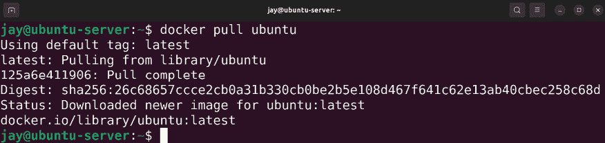
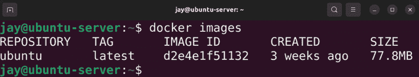
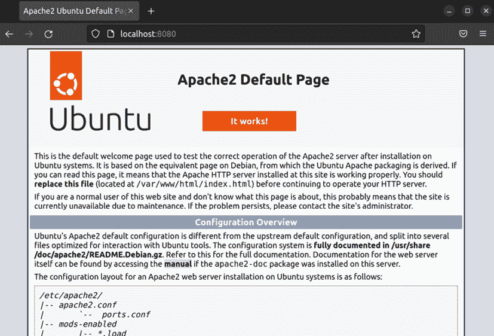
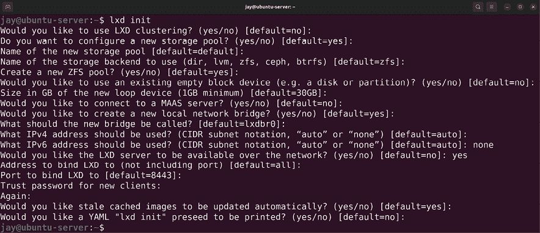

# 17

# 运行容器

信息技术行业总是让我感到惊讶。当虚拟化的概念出现时，它彻底改变了数据中心。虚拟化使我们能够在一台服务器上运行许多小型**虚拟机**（**VMs**），有效地将我们的服务器机架中的设备进行整合。就在我们以为这已经是极限时，容器化的概念掀起了 IT 界的风暴，允许我们构建便捷的、可移植的软件实例，这不仅改善了我们部署应用程序的方式，还改变了我们开发应用程序的方式。在这一章中，我们将探索令人兴奋的容器化世界。这个探索将包括：

+   什么是容器化？

+   理解 Docker 和 LXD 之间的区别

+   安装 Docker

+   管理 Docker 容器

+   使用 Dockerfile 自动创建 Docker 镜像

+   管理 LXD 容器

首先，让我们探索容器化是什么，它与虚拟化有何不同，以及如何实施这项技术的一些注意事项。

# 什么是容器化？

在上一章中，我们介绍了虚拟化。虚拟化允许我们在一台物理硬件上运行多个*虚拟*服务器。我们将 CPU、RAM 和磁盘空间分配给这些虚拟机，它们的运行方式就像是实际的服务器。实际上，从所有实用角度来看，虚拟机就是一台真实的服务器。

然而，虚拟机也有一些弱点。或许最明显的问题是，您分配给虚拟机的某些资源可能会被浪费。例如，假设您为虚拟机分配了 512 MB 的 RAM。如果该应用程序很少使用超过 100 MB 的内存，那么意味着大多数时候，剩余的 412 MB 内存可以用来做其他事情，但它却处于空闲状态。CPU 使用率也可以说是类似的情况。如今，虚拟机解决方案确实有共享未使用资源的方法，但从根本上讲，资源效率是该平台的一个天然弱点。

与虚拟机不同，容器并不是真正的服务器。至少，从硬件角度来说，它们并不像你通常认为的那样。虚拟机通常有一个或多个虚拟化的 CPU，而容器与宿主共享 CPU。虚拟机还有自己的内核，而容器则共享宿主的内核。尽管如此，容器仍然是隔离的。就像虚拟机无法访问宿主的文件系统一样，容器也不能访问（除非你明确设置允许访问）。

那么，什么是容器呢？最好将容器看作是一个文件系统，而不是虚拟机。容器本身包含一个与其所基于的发行版匹配的文件结构。例如，一个基于 Ubuntu Server 的容器，将具有与在虚拟机或物理硬件上安装的真正 Ubuntu Server 相同的文件系统布局。想象一下，将所有 Ubuntu 安装的文件和文件夹复制过来，放入一个单独的隔离目录中，然后执行文件系统的二进制内容作为一个程序，而没有实际运行操作系统。

公平地说，这种描述是对容器在 Ubuntu 服务器上实际运行方式的过度简化，因为该技术利用 Linux 内核的功能来隔离容器的各个组件与系统其他部分。然而，关于这些技术的详细讨论超出了本书的范围。但理解容器内存在这样的隔离性是你需要记住的事情，因为将容器内运行的进程与主机服务器上运行的其他进程分开是一个重要的优势。

**容器化**的另一个优势是便捷性。通过容器，你可以把它传给你开发团队的其他成员，然后当每个人都同意它已经准备好时，就可以将容器推向生产环境。容器本身将在每个工作站上以完全相同的方式运行，无论工作站使用的是哪个操作系统。公平地说，你可以在任何数量的主机上导入和导出虚拟机，但容器让这个过程变得极其简单。事实上，便捷性是该技术设计的核心。

容器化的概念并不一定是新的。当 Docker 出现时，它让 IT 界为之震动，但它并不是第一个提供容器化的解决方案。LXC 和其他技术比它更早出现。然而，它的确是一种聪明的营销策略，凭借一个听起来很酷的品牌，使得容器化成为了主流的流行趋势。不过，我并不是说 Docker 全是炒作，它是一项很棒的技术，具有许多优点。它绝对值得使用，甚至你可能会发现自己更喜欢它而不是虚拟机。

容器化的主要区别在于，每个容器通常只做一件事。例如，一个容器可能承载一个网站，或者包含一个单一的应用程序。虚拟机通常用于完成多项任务，比如一个托管十个网站的 web 服务器。而容器则一般用于完成一项任务，尽管根据不同的实现方式，你可能会看到一些容器打破这一常规。

什么时候应该使用容器？我建议你在运行 Web 应用程序或某种服务，并且能够从节省资源中受益时考虑使用容器。事实上，并非所有应用程序都能在容器中运行得很好，但至少值得考虑。每当你运行一个通常通过 Web 浏览器访问的应用程序时，它可能更适合放在容器中而不是虚拟机中。作为管理员，你很可能会试验不同的工具，并根据你的发现决定最佳工具。

现在我们已经理解了容器的核心概念，让我们来探讨两种容器技术之间的区别。

# 理解 Docker 和 LXD 之间的区别

在本章中，我们将探讨 Docker 和 LXD，并查看在这两者中运行容器的示例。但在我们开始之前，了解一些将每个解决方案与其他解决方案区分开来的因素是个好主意。

**Docker**可能是我读者中大多数人听说过的技术。现在似乎没有哪个 IT 会议不提到它。Docker 无处不在，并且可以在几乎任何平台上运行。关于 Docker 有很多文档资源，你可以利用它们来进行部署。Docker 采用了*分层*的容器化方法。你对容器所做的每个更改都会创建一个新的层，而这些层可以作为其他容器的基础，从而节省磁盘空间。稍后我们会详细介绍。

**LXD**（发音为 Lex-D）源自**LXC**，因此在讨论 LXD 之前，理解 LXC 非常重要。LXC（发音为 Lex-C）是**Linux 容器**的缩写，是另一种容器化实现，类似于 Docker。这项技术像类似的解决方案一样，使用 Linux 内核的**控制组**（**cgroups**）特性，能够将进程隔离开并彼此隔离。这增强了安全性，因为进程不应该能够读取其他进程的数据，除非有充分的理由。

LXC 进一步推动了隔离的概念，通过创建一种完全基于在隔离环境中运行应用程序的虚拟化实现，这种环境与操作系统的环境相匹配。你几乎可以在今天的每个 Linux 发行版上运行 LXC 容器。

LXD 也适用于许多 Linux 发行版，但在 Ubuntu 中被视为一等公民。这是因为 Canonical（Ubuntu 背后的公司）在其开发中发挥了重要作用，并且还提供商业支持。由于使 LXD 本身工作的软件是通过`snap`包分发的，这基本上意味着任何能够安装`snap`包的 Linux 发行版都应该能够安装 LXD。

LXD 在 LXC 的基础上增加了额外的功能，这些功能在 LXC 中是没有的，比如快照、ZFS 支持和迁移。LXD 并没有替代 LXC；它实际上利用 LXC 提供其基础技术。或许，最好的理解方式是把 LXD 看作是在 LXC 之上增加了一个管理层，提供了更多的功能。

LXD/LXC 和 Docker 有什么不同？主要区别在于，尽管它们都是容器解决方案，并且以非常相似的方式解决了相同的目标，LXD 更像一个实际的虚拟机，而 Docker 则更加努力地与其区分开来。相比之下，Docker 容器是事务性的（正如我之前提到的），你通常会有一个在启动容器时运行的 `ENTRYPOINT` 命令。从本质上讲，LXD 有一个你可以从主机操作系统直接访问的文件系统，并且采用了更简单的容器化方法。你可以把 LXC 想象成一种*机器*容器，它非常接近虚拟机，而 Docker 容器则是一个*应用*容器，为运行应用程序提供所需的基础。尽管有这些区别，这些技术可以以相同的方式使用，并支持相同的使用场景。

你应该什么时候使用 Docker，什么时候使用 LXD？实际上，我建议你同时练习这两者，因为它们并不难学。在本章中，我们将介绍这些技术的基础知识。但为了回答这个问题，有一些使用场景可能会使其中一种技术比另一种更合适。Docker 是一个更通用的工具。你可以在 Linux、macOS，甚至 Windows 上运行 Docker 容器。因此，如果你想创建一个可以在任何地方运行的容器，它是一个不错的选择。LXD 通常更适合 Linux 环境，尽管 Docker 在 Linux 上也运行得很好。如今，容器解决方案运行在哪个操作系统上已经不那么重要了，因为大多数人使用容器服务来运行容器，而不是自己管理的实际服务器。未来，如果你深入容器化领域，可能会发现自己完全放弃操作系统，直接在像亚马逊的**弹性容器服务**（**ECS**）这样的服务中运行容器，这是少数几种允许你在不管理底层服务器的情况下运行容器的云服务之一。

Docker 的另一个好处是**Docker Hub**，你可以用它下载别人创建的容器，甚至上传自己的容器供他人使用。这里的好处在于，如果有人已经解决了你要实现的目标，你可以利用他们的成果，而不是从头开始，他们也可以从你的工作中受益。这节省了时间，通常比手动创建解决方案要好。

在将第三方资源投入使用之前，始终确保审计它们的安全性。这包括（但不限于）由第三方开发的容器。你应该了解容器镜像是如何构建的、设置的安全性如何，以及是否有任何内置内容可能会带来安全风险。基本上，一些管理员会心安理得地接受一个未经审计的容器镜像，但这种做法非常有风险。永远不要部署一个未经安全审计的容器镜像。

既然我们不仅理解了核心概念，还了解了这两种容器化标准之间的区别，那么让我们来看看 Docker。

# 安装 Docker

安装 Docker 非常快速且简单，以至于几乎不需要单独列出一个章节。在上一章中，我们为了让 **基于内核的虚拟机**（**KVM**）虚拟化服务器启动并运行，还需要安装多个软件包，并且调整一些配置文件。相比之下，安装 Docker 轻松得多，你只需要安装 `docker.io` 软件包：

```
sudo apt install docker.io 
```

是的，仅此而已。安装 Docker 绝对比设置 KVM 更简单，就像我们在上一章所做的那样。Ubuntu 将 Docker 包含在默认的仓库中，所以只需安装这一软件包及其依赖项。你现在会在你的机器上安装一个名为 `docker` 的新服务。为了能够使用它，服务必须正在运行。你可以使用以下命令来检查它是否已经在运行：

```
systemctl status docker 
```

查看上一条命令的输出，检查 `docker` 服务是否正在运行。你还应该检查服务是否已启用。如果没有，你可以通过以下命令同时启动并启用该服务：

```
systemctl enable --now docker 
```

我们现在也可以使用 `docker` 命令来管理容器了。默认情况下，它确实需要 `root` 权限，因此你需要使用 `sudo` 来执行它。为了简化操作，我建议你在继续之前将用户帐户添加到 `docker` 组中。这样，你就不需要每次执行 `docker` 命令时都使用 `sudo`。以下命令将把你的用户帐户添加到相应的组：

```
sudo usermod -aG docker <yourusername> 
```

登出并重新登录后，你将能够更轻松地管理 Docker。

你可以通过运行 `groups` 命令来验证你的组成员身份，执行该命令时不需要任何选项，命令输出中应该会显示你的用户是 `docker` 组的成员。

好了，就这样。Docker 已经安装完毕，你的用户帐户也已经是 `docker` 组的成员，所以你可以开始使用了。哇，真是太简单了！

既然我们已经安装了 Docker，那么就开始使用它吧。这是一项有趣的技术，在接下来的章节中，我们将探索一些示例。

# 管理 Docker 容器

现在 Docker 已经安装并运行了，让我们来试试它。安装 Docker 后，我们现在可以使用 `docker` 命令，该命令有各种子命令可以执行与容器相关的不同功能。首先，让我们尝试 `docker search`：

```
docker search ubuntu 
```

使用 Docker，容器是从镜像创建的。我们可以使用许多现有的容器镜像，或者我们可以自己构建。`docker search` 命令允许我们搜索已经存在并且已经提供给我们的容器镜像。一旦我们选择了一个镜像，我们可以将其下载到本地并从中创建容器实例。

管理员可以搜索（和下载）现有的容器的能力只是 Docker 提供给我们的众多优秀功能之一。虽然我们肯定可以构建自己的容器镜像（我们将在本章节中这样做），但有时使用现有的容器镜像可能比从头开始创建更合理。

例如，您可以安装一个名为 `nginx` 的 NGINX 容器。这实际上是一个官方的容器镜像，所以应该是可信的。如果您在 Docker Hub 网站上查找该镜像，会看到 **DOCKER OFFICIAL IMAGE** 的字样。如果我们想部署一个运行 NGINX 的容器，通过官方镜像可以节省大量时间，特别是与从头开始创建相比。毕竟，如果不必要，为什么要重新发明轮子呢？

然而，即使容器镜像来自一个可信的源，您仍然应该对其进行审计。以 NGINX 为例，我们可以相当有信心地认为该镜像是安全的，不包含任何不需要的对象，比如恶意软件。但是，当涉及到安全性时，没有 100% 的可信度，所以我们仍然应该进行审计。

那么这是如何工作的呢？`docker search` 命令将搜索 Docker Hub，这是一个在线仓库，用于存储供他人下载和使用的容器。您可以根据其他应用程序或者其他发行版（如 Fedora 或 AlmaLinux）搜索容器。该命令将返回符合您搜索条件的 Docker 镜像列表。

那么我们用这些镜像做什么呢？在 Docker 中，镜像是其最接近虚拟机或硬件镜像的等价物。它是一个快照，包含特定操作系统或 Linux 发行版的文件系统，以及作者包含的一些更改，使其执行特定任务。可以下载该镜像并自定义以满足您的需求。如果您希望贡献上游，可以选择将您的定制镜像上传回 Docker Hub。您下载的每个镜像都将存储在您的计算机上，这样您每次创建新容器时就不必重新下载它。

要拉取 Docker 镜像以供使用，我们可以使用`docker pull`命令，后面跟着我们在`search`命令的输出中看到的某个镜像名称：

```
docker pull ubuntu 
```

使用前面的命令，我们正在从 Docker Hub 拉取最新的 Ubuntu 容器镜像。镜像现在将被存储在本地，并且我们可以从中创建新容器。该过程将类似于以下截图：



图 17.1：下载 Ubuntu 容器镜像

如果你对本地保存的镜像感到好奇，可以执行`docker images`来获取你在服务器上存储的 Docker 容器镜像列表：

```
docker images 
```

输出将类似于这样：



图 17.2：列出已安装的 Docker 镜像

注意输出中的`IMAGE ID`。如果由于某些原因你想删除一个镜像，可以使用`docker rmi`命令来删除，并且需要使用该 ID 作为参数来告诉命令删除哪个镜像。如果我要删除截图中显示的 ID 的镜像，语法会像这样：

```
docker rmi d2e4e1f51132 
```

一旦你将容器镜像下载到服务器上，你可以通过运行`docker run`命令来创建一个新容器，后跟你的镜像名称和要在镜像中运行的应用程序。从 Docker 容器中运行的应用程序被称为`ENTRYPOINT`，这是一个用来描述特定容器配置为运行的应用程序的术语。不过，你并不局限于`ENTRYPOINT`，并非所有容器都有`ENTRYPOINT`。你可以在容器中运行任何通常能够在该发行版中运行的命令。以我们之前下载的 Ubuntu 容器镜像为例，我们可以使用以下命令运行`bash`，以便获取提示符并输入我们希望运行的任何命令：

```
docker run -it ubuntu /bin/bash 
```

一旦你运行了该命令，你就会从容器内与 Shell 提示符进行交互。在这里，你可以运行你通常会在实际 Ubuntu 机器中运行的命令，比如安装新包、修改配置文件等。尽管如此，可以继续在容器中进行操作，然后我们将继续进行更多关于其实际工作的理论讲解。

在继续更多示例之前，我们应该先弄清楚 Docker 中可能让人困惑的一些方面。最有可能让 Docker 新手感到困惑的是容器是如何创建和销毁的。当你对已下载的镜像执行`docker run`命令时，你实际上是在创建一个容器。因此，你通过`docker pull`命令下载的镜像并不是一个实际的容器，而是当你运行它的实例时，它才会成为容器。当容器内执行的命令完成后，容器就会消失。因此，如果你在容器中运行`/bin/bash`并安装了一堆包，那么当你退出容器时，这些包会被清除。

你可以把 Docker 镜像看作是容器的“蓝图”，可以用它来创建运行中的容器。你运行的每个容器都有一个容器 ID，用来区分它与其他容器。如果你想删除一个持久化的容器，例如，你需要使用`docker rm`命令引用这个 ID。这与用来删除容器镜像的`docker rmi`命令非常相似。

要查看容器 ID，首先你需要退出当前运行的容器。有两种方法可以做到这一点。首先，你可以按*Ctrl* + *d*断开连接，或者输入`exit`并按*Enter*键。当你退出容器时，你实际上是在移除它（Docker 容器通常只在运行时存在）。当你运行`docker ps`命令时（这是你每次想查看系统中容器列表时使用的命令），你不会看到它的列出。相反，你可以添加`-a`选项，查看所有容器，包括那些已经停止的。

那么，你可能会想，如何退出一个容器并保持它不消失。要做到这一点，在你连接到容器时，按下*Ctrl* + *p*，然后按下*q*（按这两个字母时不要松开*Ctrl*键）。这样你就会退出容器，而当你运行`docker ps`命令时（即使没有使用`-a`选项），你会看到它仍然在运行。

`docker ps`命令值得关注。它的输出将提供关于你服务器上容器的非常有用的信息，包括之前提到的`CONTAINER ID`。此外，输出还会包含容器的`IMAGE`、容器创建时运行的`COMMAND`、容器的`CREATED`时间和其`STATUS`，以及你可能转发的任何`PORTS`。输出还会显示每个容器的随机生成名称，这些名称通常非常有趣。当我在写这一部分时，我的容器的代码名分别是`tender_cori`、`serene_mcnulty`和`high_goldwasser`。这只是 Docker 的众多奇特之处之一，有些名字甚至非常搞笑。

`docker ps -a`命令的主要输出是`CONTAINER ID`、`COMMAND`和`STATUS`。我们已经讨论过的 ID 可以让你引用特定的容器，以便对其执行命令。`COMMAND`让你知道正在运行的是什么命令。在我们的例子中，当我们启动容器时，执行了`/bin/bash`命令。

如果我们有任何停止的容器，可以使用`docker start`命令恢复容器，给它传递容器 ID 作为参数。你的命令将会类似这样：

```
docker start d2e4e1f51132 
```

输出将仅返回容器的 ID，然后将你带回到你的 Shell 提示符——不是容器的 Shell 提示符，而是服务器的 Shell 提示符。此时你可能会想，如何返回到容器的 Shell 提示符呢？我们可以使用`docker attach`来实现：

```
docker attach d2e4e1f51132 
```

`docker attach`命令很有用，因为它允许你将你的 shell 附加到一个已经在运行的容器。大多数时候，容器会自动启动，而不是像我们之前所做的那样以`/bin/bash`启动。如果出现问题，我们可能想使用类似`docker attach`的命令来浏览运行中的容器，查找错误信息。这非常有用。

说到有用的命令，另一个很棒的命令是`docker info`。这个命令会提供有关 Docker 实现的信息，例如让你知道系统上有多少个容器，通常这应该是你执行`docker run`命令的次数，除非你用`docker rm`清理了之前运行的容器。随便看看它的输出，看看能学到什么。

更深入地了解容器的主题时，理解 Docker 容器是什么以及不是很重要。容器不是在后台运行的服务，至少从本质上来说不是。容器是一个命名空间的集合，比如它的文件系统或用户命名空间。正如本章早些时候讨论的，容器通过利用 Linux 内核中的技术与服务器的其余部分隔离开来。当你在容器中没有运行任何进程时，它就没有理由继续运行，因为它的命名空间是空的。因此，它会停止。如果你希望以类似于服务的方式运行容器（即它在后台持续运行），你需要以**分离模式**运行容器。基本上，这是一种告诉容器运行该进程，并且在你告诉它停止之前不停止运行的方式。下面是一个创建容器并以分离模式运行的例子：

```
docker run -dit ubuntu /bin/bash 
```

运行前一个命令后，Docker 会打印出一个容器 ID，然后返回到你的命令提示符。你可以使用`docker ps`命令查看容器是否正在运行，然后使用`docker attach`命令结合容器 ID 连接到容器并执行命令。

通常，我们使用`-it`选项来创建容器。这是我们之前几个例子中使用的选项。`-i`选项启用交互模式，而`-t`选项为我们提供一个`伪终端`。命令的最后，我们告诉容器运行 Bash shell。`-d`选项让容器在后台运行。

看似没有实际任务执行的后台 Bash shell 可能显得相对没有用。但这些只是一些简单的例子，帮助你熟悉 Docker。一个更常见的用例可能是运行一个特定的应用程序。实际上，你甚至可以通过在容器中安装和配置 Apache 来为一个网站提供服务，包括设置虚拟主机。那么问题就变成了：如何在浏览器中访问容器内 Apache 的实例？答案是**端口重定向**，Docker 也支持这一功能。我们来试试吧。

首先，让我们以分离模式创建一个新的容器。我们还将把容器中的`80`端口重定向到主机的`8080`端口：

```
docker run -dit -p 8080:80 ubuntu /bin/bash 
```

该命令将输出一个容器 ID。这个 ID 会比你习惯看到的要长得多。因为当我们运行`docker ps -a`时，它只显示缩短的容器 ID。你不需要使用整个容器 ID 进行附加；只要它足够长，与你的其他 ID 不同，就可以仅使用其中的一部分：

```
docker attach dfb3e 
```

这里，我已经附加到一个 ID 以`dfb3e`开头的容器。这将把我的 Shell 连接到容器中的 Bash Shell。

让我们安装 Apache。我们之前做过这件事，但你会看到一些不同之处。首先，如果你简单地运行以下命令来安装`apache2`包，就像我们通常做的那样，它可能会因为一两个原因失败：

```
sudo apt install apache2 
```

这里有两个问题，第一个是`sudo`在 Ubuntu 容器中默认没有包含，因此它甚至无法识别命令中的`sudo`部分。当你运行`docker attach`时，你实际上是以`root`用户附加到容器中，因此缺少`sudo`不会成为问题。第二，容器中的仓库索引可能已经过时，甚至根本没有。这意味着容器中的`apt`甚至找不到`apache2`包。为了解决这个问题，我们将首先更新仓库索引：

```
apt update 
```

然后，使用以下命令安装`apache2`：

```
apt install apache2 
```

在安装包时，你可能会被要求设置时区或地理位置。如果是这样，请根据提示输入相应信息。

现在，我们已经在容器中安装了 Apache。我们不需要担心配置默认的示例网页或让它看起来更漂亮。我们只是想验证它是否正常工作。让我们启动服务：

```
/etc/init.d/apache2 start 
```

运行该命令后，Apache 应该已经在容器内运行。

之前的命令绝对不是我们通常启动服务的方式。通常，我们会使用像`systemctl start apache2`这样的命令，但容器内并没有实际的初始化系统，因此运行`systemctl`命令将无法像通常那样工作。始终参考你试图运行的容器可能存在的任何文档，了解如何启动其中可能包含的应用程序。

Apache 应该在容器内运行。现在，按下*Ctrl* + *p*，然后按*q*（在按这两个字母时，保持按住*Ctrl*键）退出容器，但让它继续在后台运行。你应该能够通过在浏览器中导航到`localhost:8080`来访问容器的示例 Apache 网页。你应该看到 Apache 的默认`It works!`页面。

恭喜，你已经在容器内成功运行了一个应用程序：



图 17.3：默认的 Apache 启动页面，运行在容器内

随着你对 Docker 知识的深入，你可能会更想了解`ENTRYPOINT`的概念。`ENTRYPOINT`是启动 Docker 容器中应用程序的首选方式。在我们到目前为止的示例中，我们使用了`/bin/bash`作为`ENTRYPOINT`。虽然这完全有效，但`ENTRYPOINT`通常是一个配置好的 Bash 脚本，用于启动所需的应用程序，并由容器启动。

我们的 Apache 容器在后台愉快地运行，响应主机上`8080`端口的 HTTP 请求。但现在我们该怎么办呢？我们可以从它创建我们自己的镜像，以便以后简化部署。公平地说，我们在容器内仅安装了 Apache，因此它并没有为我们节省太多工作。在实际的生产环境中，可能会有一个容器正在运行，且需要执行许多命令来设置它。使用镜像后，我们可以将所有这些工作都“烘焙”到镜像中，这样每次我们想创建容器时，就不需要再运行任何设置命令。要创建一个容器镜像，我们可以先通过运行`docker ps`命令获取正在运行的容器 ID。一旦获取到容器 ID，我们可以使用`docker commit`命令来创建该容器的新镜像：

```
docker commit <Container ID> ubuntu/apache-server:1.0 
```

该命令将返回我们新镜像的 ID。要查看我们机器上所有可用的 Docker 镜像，我们可以运行`docker images`命令，Docker 将返回一个列表。你应该能看到我们下载的原始 Ubuntu 镜像，以及我们刚刚创建的镜像。我们首先会看到镜像来源的仓库列，在我们的例子中是 Ubuntu。接下来，我们看到标签。我们原始的 Ubuntu 镜像（即我们用`docker pull`下载的那个）标签是`latest`。当我们最初下载它时并没有指定标签，它只是默认使用了`latest`。此外，我们还会看到两个镜像的 ID 以及它们的大小。

要从我们的新镜像创建一个新的容器，我们只需要使用`docker run`，但是需要指定新镜像的标签和名称。请注意，可能已经有一个容器在监听`8080`端口，所以如果该容器没有停止，这个命令可能会失败：

```
docker run -dit -p 8080:80 ubuntu/apache-server:1.0 /bin/bash 
```

说到停止容器，我可能也应该展示一下如何操作。正如你可能猜到的，命令是`docker stop`，后跟容器 ID：

```
docker stop <Container ID> 
```

这将向容器发送`SIGTERM`信号，如果容器在延迟后没有自行停止，将接着发送`SIGKILL`信号。

诚然，Apache 容器的示例相对简单，但它能够有效地展示一个实际有用的工作容器。在继续之前，先想一想在你的组织中可以用 Docker 做哪些事情。它看起来是一个非常简单的概念（确实如此），但它让你能够做一些非常强大的事情。也许你想尝试将你组织的内网页面或某些应用程序容器化。Docker 的概念确实很简单，但只要有足够的想象力，它可以带来长远的影响。

在结束这一部分之前，我将给你一个我在之前的工作中如何实现容器的个人示例。在这个组织里，我与一些嵌入式 Linux 软件工程师合作，他们每个人都有自己喜欢的 Linux 发行版。有些人喜欢 Ubuntu，其他人喜欢 Debian，还有一些甚至使用 Gentoo。单纯来看，这并不一定是个问题——有时尝试其他发行版是很有趣的。但对开发人员来说，平台的改变可能会引入不一致性，这对软件项目来说是不利的。不同的 Linux 发行版中包含的构建工具各不相同，因为它们都提供不同版本的开发包和库。这个特定组织开发的应用程序只能在 Debian 中正确编译，而较新的编译器版本会对应用程序造成问题。我的解决方案是为每个开发人员提供一个基于 Debian 的 Docker 容器，并将他们所需的所有构建工具打包其中。到这个时候，无论他们的工作站上运行的是哪个发行版，都不再重要。容器在他们的操作系统上都相同。无论底层操作系统是什么，每个人都拥有相同的工具。这使每个开发人员能够自由选择自己喜欢的 Linux 发行版（甚至是 macOS），并且不会影响他们的工作能力。我相信，你也可以为实现容器化想出一些聪明的用例。

现在我们已经了解了 Docker 的基础知识，接下来让我们看看如何自动化构建容器的过程。

# 使用 Dockerfile 自动化创建 Docker 镜像

我在本书中之前提到过，任何值得让服务器做超过一次的事情都应该自动化，而构建 Docker 容器也不例外。Dockerfile 是一种通过创建包含一组指令的文本文件来自动化 Docker 镜像构建的简便方法。Docker 可以读取这个文件，执行其中的命令，并构建一个容器。真是神奇。

设置 `Dockerfile` 的最简单方法是创建一个目录，最好给它起一个描述性名称，以便你能知道要创建什么样的镜像（不过你可以随意命名），然后在其中创建一个名为 `Dockerfile` 的文本文件。为了快速示范，把这段文本复制到你的 `Dockerfile` 中，我会解释它是如何工作的：

```
FROM ubuntu
MAINTAINER Jay <jay@somewhere.net>
# Avoid confirmation messages
ARG DEBIAN_FRONTEND=noninteractive
# Update the container's packages
RUN apt update; apt dist-upgrade -y
# Install apache2 and vim
RUN apt install -y apache2 vim-nox
# Start Apache
ENTRYPOINT apache2ctl -D FOREGROUND 
```

让我们逐行了解这个 Dockerfile，帮助我们更好地理解它在做什么：

```
FROM ubuntu 
```

我们需要一个镜像来作为我们新镜像的基础，因此我们使用 Ubuntu 作为起点。

这将导致 Docker 从 Docker Hub 下载 `ubuntu:latest` 镜像，前提是我们还没有在本地下载过它。如果我们本地已经有它，Docker 会直接使用本地缓存的版本。

```
MAINTAINER Jay <myemail@somewhere.net> 
```

在这里，我们设置镜像的维护者。基本上，我们在声明镜像的作者。这是可选项，如果不想包括，也可以省略。

```
# Avoid confirmation messages 
```

以井号符号（`#`）开头的行会被忽略，因此我们可以在 Dockerfile 中添加注释。推荐这样做，以便让其他人清楚地了解你的 Dockerfile 在做什么。

```
ARG DEBIAN_FRONTEND=noninteractive 
```

在这里，我们设置了一个环境变量，在这种情况下，它将环境设置为`noninteractive`。这样做的原因是，在构建 Docker 容器时安装软件包的过程应该是自动的；如果在安装软件包时出现提示并询问你问题，你的输入将无法传递，过程将会挂起。

通过这个环境变量，我们明确表示我们希望处于`noninteractive`模式，以便任何出现的问题都能使用默认答案，而不会提示我们。

```
RUN apt update; apt dist-upgrade -y 
```

通过`RUN`命令，我们告诉 Docker 在创建镜像时执行一个特定的命令。在这种情况下，我们更新镜像的仓库索引并进行完整的软件包更新，以确保生成的镜像尽可能是最新的。`-y`选项用于在安装包时抑制任何确认请求。尽管我们之前设置了`noninteractive`模式，`apt`仍然会尝试交互式确认更改，而`-y`选项会抑制这一点。

```
RUN apt install -y apache2 vim-nox 
```

接下来，我们安装了`apache2`和`vim-nox`。`vim-nox`包不是必须的，但我个人喜欢确保所有服务器和容器都安装了它。我在这里主要是为了展示你可以在一行中安装多个包。

```
ENTRYPOINT apache2ctl -D FOREGROUND 
```

我之前提到过`ENTRYPOINT`的概念，这就是我们在容器启动时明确应该运行哪个应用程序的地方。`apache2ctl`命令是一个用于 Apache 的包装命令，它允许管理员控制运行 Apache 守护进程的细节。对该命令的详细讲解超出了本章的范围，但我们在这里使用它是因为我们希望 Apache 能随着容器自动启动，而`apache2ctl`是实现这一点的方法之一，而不依赖于`systemctl`（容器中没有这个命令）。

很好，现在我们有了 Dockerfile。那么接下来我们该怎么做？当然是将它转化为镜像！为此，我们可以使用`docker build`命令，可以在包含 Dockerfile 的目录中执行。以下是使用`docker build`命令创建一个标签为`packt/apache-server:1.0`的镜像的示例：

```
docker build -t learnlinuxtv/apache-server:1.0 . 
```

一旦你运行该命令，你会看到 Docker 为你创建镜像，执行你要求的每个命令。镜像将按你的要求设置。基本上，我们只是自动化了创建这个我们在本节中作为示例使用的 Apache 容器的整个过程。如果出现任何问题，Docker 会在你的 Shell 中打印错误信息。你可以在 Dockerfile 中修复错误并重新运行，它将从上次停止的地方继续。

完成后，我们可以从新的镜像创建一个容器：

```
docker run -dit -p 8080:80 learnlinuxtv/apache-server:1.0 
```

几乎在运行容器后立即，示例 Apache 网站将可以通过主机上的`localhost:8080`访问。通过使用 Dockerfile，你可以自动化创建 Docker 镜像的过程。这很简单，对吧？使用 Dockerfile，你可以做的事情远不止这些；可以随时浏览 Docker 官方文档，了解更多内容。探索是关键，赶紧试一试，进行一些实验吧。

# 管理 LXD 容器

在解决了 Docker 之后，让我们来看看如何使用 LXD 运行容器。我们直接开始，安装所需的包：

```
sudo snap install lxd 
```

正如你所看到的，安装 LXD 和安装 Docker 一样简单。实际上，使用 LXD 管理容器也非常直观，正如你很快会看到的那样。安装 LXD 后，我们将获得 `lxc` 命令，这是我们用来管理 LXD 容器的命令。不过，在开始之前，我们应该将用户账户添加到 `lxd` 组：

```
sudo usermod -aG lxd <yourusername> 
```

确保你退出并重新登录，以使更改生效。就像 Docker 的 `docker` 组一样，`lxd` 组将允许我们的用户账户管理 LXD 容器。

接下来，我们需要初始化我们的 LXD 安装。我们将通过 `lxd init` 命令来完成：

```
lxd init 
```

该过程将与以下截图类似：



图 17.4：使用 lxd init 命令设置 LXD

`lxd init` 命令会问我们一系列关于如何设置 LXD 的问题。大多数默认设置都可以，存储池的大小我只是使用了默认的 30 GB，但你可以根据需要使用任何大小。在设置过程中，我将 `ipv6` 设置为 `none`，因为我的网络不使用它，并且我决定通过网络启用 `lxd`。

即使我们为大多数问题选择了默认值，这些设置也会给你一个关于 LXD 可用的一些不同选项的大致共识。例如，我们可以看到 LXD 支持存储池的概念，这是它的一个很酷的功能。

在这里，我们正在创建一个默认的存储池，文件系统格式为 `zfs`，这是一种用于实际硬盘的文件系统。在设置过程中，LXD 会设置存储池、网络桥接、IP 地址方案，基本上是我们开始所需的一切。

现在 LXD 已经安装并设置完成，我们可以配置第一个容器了：

```
lxc launch ubuntu:22.04 mycontainer 
```

通过这个简单的命令，LXD 现在将下载此容器的根文件系统，并为我们进行设置。完成后，我们将有一个基于 Ubuntu 22.04 运行并可供使用的 LXD 容器。这与 Docker 不同，Docker 默认只设置一个镜像，需要我们手动运行它。在此过程中，我们为容器命名为 `mycontainer`。到目前为止，过程应该很容易跟随。

你可能会想，既然我们在学习 LXD，为什么还使用了 `lxc` 命令来创建容器呢？正如我之前提到的，LXD 是对 LXC 的改进，因此它使用 `lxc` 命令进行管理。特定于 LXD 层的命令将是 `lxd`，而任何与容器管理相关的操作则由 `lxc` 来完成。

在管理容器时，你将需要执行几种常见操作，例如列出容器、启动容器、停止容器、删除容器等等。`lxc` 命令集非常简单直观。以下是列出一些常用命令的表格，我相信你会同意这些命令的语法非常合逻辑。对于每个例子，你只需将 `<container>` 替换为你创建的容器的名称：

| **目标** | **命令** |
| --- | --- |
| `列出容器` | `lxc list` |
| `启动容器` | `lxc start <container>` |
| `停止容器` | `lxc stop <container>` |
| `删除容器` | `lxc delete <container>` |
| `列出已下载的镜像` | `lxc image list` |
| `删除镜像` | `lxc image delete <image_name>` |

了解完所有基本操作后，我们可以进入容器并进行一些操作。要打开我们刚刚创建的容器的 shell，可以执行以下命令：

```
lxc exec mycontainer bash 
```

在前面的命令中，`exec` 告诉容器我们要执行一个命令，`mycontainer` 是我们要在其上执行命令的容器名称，而具体的命令是 `bash`。执行该命令后，它会立即以 `root` 身份从容器中运行 `bash`。从这里，你可以根据需要配置容器，比如安装软件包、设置服务，或做其他任何使容器符合你需求的操作。事实上，定制容器以便重新部署的过程比 Docker 更加简单。

与 Docker 不同，退出容器时不会丢失更改，而且你无需以特定的方式退出容器来避免丢失更改。在 LXD 中，我们也不需要处理层（layers），这点你可能会觉得有些不同（Docker 容器中的层可以加速部署，但如果之前运行的容器没有被清理，层数就会显得混乱）。

我们用来创建容器的 Ubuntu 镜像包括一个默认的用户帐户 `ubuntu`。这与一些 VPS 提供商类似，后者也默认包含 `ubuntu` 用户帐户（例如 Amazon EC2）。如果你更喜欢以此用户登录，而非 `root`，可以使用以下命令：

```
lxc exec mycontainer -- su --login ubuntu 
```

`ubuntu` 用户有 `sudo` 权限，因此你可以毫不困难地执行特权任务。

要退出容器，你可以按键盘上的*Ctrl* + *d*，或者直接输入`exit`。你可以随意登录到容器中进行一些更改和实验。一旦你设置好了容器，按照你的喜好，你可能希望容器在启动服务器时自动启动。其实，这个操作非常简单：

```
lxc config set mycontainer boot.autostart 1 
```

使用前面的命令，我们将`boot.autostart`设置为`1`，这将开启这个特定的功能。对于熟悉编程的朋友来说，`1`代表“开启”，`0`代表“关闭”，就像布尔变量一样。在设置了这个配置值之后，你新创建的容器将在每次服务器启动时自动启动。

现在，让我们玩得开心一点。你可以随意在容器中安装`apache2`包。与 Docker 类似，我发现你可能需要先运行`apt update`来更新软件包列表，因为我曾见过在一个新容器中安装包失败，仅仅是因为索引信息已经过时。所以，为了安全起见，请先运行此命令：

```
sudo apt update && sudo apt install apache2 
```

现在，你应该已经在容器中安装并运行了 Apache。接下来，我们需要获取容器的 IP 地址。没错，你没看错，LXD 为其容器分配了自己的 IP 地址空间，这非常方便。只需运行`ip addr show`（与在普通服务器中运行的命令相同），它会显示 IP 地址信息。在运行容器的同一台机器上，你可以访问这个 IP 地址来查看默认的 Apache 网页。如果你在没有图形用户界面的服务器上运行容器，可以使用`curl`命令来验证它是否正常工作：

```
curl <container_ip_address> 
```

虽然我们在容器中运行了 Apache，但我们可以看到它现在还不是很有用。网页仅能从托管容器的机器上访问。如果我们希望本地网络中的用户，甚至是外部互联网的用户都能访问我们的网站，这样就没什么帮助了。我们可以设置防火墙规则来路由流量，但还有一种更简单的方法——为外部访问创建一个配置文件。

我之前提到过，尽管 LXD 是一种容器化技术，但它与虚拟机共享一些功能集，基本上可以在非虚拟机环境中提供类似虚拟机的功能。通过 LXD，我们可以创建一个配置文件，允许它从你的 DHCP 服务器获取 IP 地址，并像物理设备一样通过局域网直接路由流量到容器。

在继续之前，你需要在服务器上设置桥接连接。这是通过 Netplan 软件完成的，在前一章节中有提到。如果你列出你的网络接口（`ip addr show`），你应该能看到一个`br0`连接。如果你没有配置这个，参考*第十六章*，*虚拟化*，并查阅其中的*桥接虚拟机网络*部分。创建好这个连接后，你就可以继续了。

一些网络卡不支持桥接，尤其是某些 Wi-Fi 网络卡。如果你的硬件无法创建桥接，以下部分可能对你无效。请查阅你硬件的文档，确保你的网络卡支持桥接。

为了创建我们需要的配置文件，以启用容器的外部访问，我们将使用以下命令：

```
lxc profile create external 
```

我们应该看到类似如下的输出：

```
Profile external created 
```

接下来，我们需要编辑刚刚创建的配置文件。以下命令将打开配置文件，以便你进行编辑：

```
lxc profile edit external 
```

在配置文件中，我们将用以下内容替换其文本：

```
description: External access profile
devices:
  eth0:
  name: eth0
  nictype: bridged
  parent: br0
  type: nic 
```

从此时起，我们可以使用以下命令，通过这个配置文件启动新容器：

```
lxc launch ubuntu:22.04 mynewcontainer -p default -p external 
```

注意我们正在应用两个配置文件，`default` 和 `external`。我们这样做是为了先加载 `default` 中的值，然后加载第二个配置文件，以便它覆盖任何可能存在的冲突参数。

不过我们已经有一个容器了，或许你会好奇如何编辑现有的容器来利用我们的新配置文件。这很简单：

```
lxc profile add mycontainer external 
```

从此时起，假设你的服务器上的主机桥接已经正确配置，容器应该可以通过本地 LAN 访问。你应该能够托管一个资源，比如网站，并让其他人能够访问它。这个资源可以是本地内网站点，甚至是面向互联网的网站。

就 LXD 的入门而言，基本上就是这些。LXD 非常简单易用，其命令结构也非常合乎逻辑且容易理解。只需要几个简单的命令，我们就能创建一个容器，甚至让它对外可访问。Canonical 在线上提供了很多示例和教程，可以帮助你进一步深入了解，但根据目前所学，你应该已经掌握了足够的实用知识，可以在你的组织中部署这个解决方案了。

# 总结

容器是一种托管应用程序的绝佳方式。相比虚拟机，你可以在硬件上启动更多容器，这无疑可以节省资源。虽然并非所有应用都能在容器中运行，但容器是一个非常实用的工具。在本章中，我们探讨了 Docker 和 LXD。虽然 Docker 更适用于跨平台应用，但 LXD 更简单易用，同时非常灵活。我们首先讨论了这两者之间的区别，然后实验了创建容器并管理容器的方法。

在下一章，我们将进一步扩展对容器的了解，探索编排技术，使我们能够更高效地管理多个容器。这将是将所有与容器相关的概念结合在一起的一章。

# 相关视频

+   Docker Essentials 教程系列（LearnLinuxTV）：[`linux.video/docker-essentials`](https://linux.video/docker-essentials)

+   开始使用 LXD（LearnLinuxTV）：[`linux.video/lxd-guide`](https://linux.video/lxd-guide)

# 进一步阅读

+   Docker 文档页面：[`learnlinux.link/d-docs`](https://learnlinux.link/d-docs)

+   LXD 简介：[`learnlinux.link/lxd-intro`](https://learnlinux.link/lxd-intro)

+   LXD 文档：[`learnlinux.link/c-lxd`](https://learnlinux.link/c-lxd)

# 加入我们社区的 Discord

加入我们社区的 Discord 空间，与作者和其他读者进行讨论：

[`packt.link/LWaZ0`](https://packt.link/LWaZ0)


