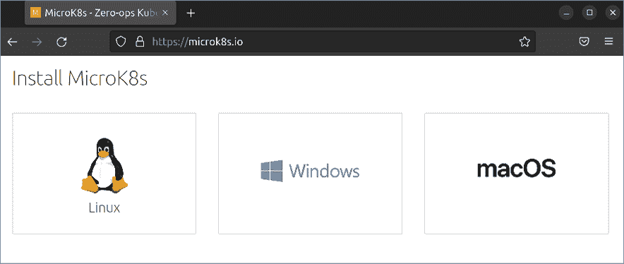

# 容器编排

在上一章中，我们开始学习关于容器化的概念。我们了解了容器是什么，它们与**虚拟机**（**VMs**）的区别，以及如何运行两种不同类型的容器（Docker 和 LXD）。如你所知，容器通常较为轻量（这意味着你可以在同一硬件上运行更多的容器，而不是虚拟机），并且容易通过逻辑性较强的命令语法进行管理，例如使用 `docker run myapp` 启动一个名为 myapp 的容器。根据你的组织规模，你可能只需要运行一个或两个容器来满足需求，或者你计划扩展到数百个容器。虽然维护少量容器相对简单，但随着数量的增加，容器的管理难度也会急剧增加。

在本章中，我们将开始探讨**容器编排**的概念，它可以帮助我们更好地维护我们运行的容器。如果没有这种编排，责任就落在你这个管理员身上，确保你的容器正常运行。虽然仍然需要有人对关键任务容器负责，但编排为我们提供了可以用来更高效管理容器的工具。此外，编排允许我们创建一个易于扩展的集群，从而更好地应对用户或客户的需求。在探讨这一话题时，我们将着重于：

+   容器编排

+   为 Kubernetes 测试准备实验环境

+   使用 MicroK8s

+   设置 Kubernetes 集群

+   通过 Kubernetes 部署容器

激动吗？我知道我很激动——容器化是一个非常有趣的学习和工作内容。在本章中，我们甚至会创建我们自己的集群！但在此之前，让我们先确保理解什么是容器编排。

# 容器编排

在上一章中，我们介绍了如何在服务器上运行容器的基础知识，特别提到了 Docker，它将在本章中发挥非常重要的作用。我们了解了如何拉取 Docker 镜像，以及如何使用镜像创建容器。关于 Docker，还有许多更高级的概念可以学习，但理解基本内容已足够满足本章的范围。既然我们已经知道如何运行容器，那么接下来就逻辑地探讨如何更高效地管理它们。

传统上，作为管理员，你需要确保组织中的关键应用程序和服务始终保持健康和可用。如果某个关键资源因任何原因停止工作，你需要负责将其恢复到健康状态。无论我们是在物理服务器、虚拟机（VM）还是容器中使用应用程序，这一需求都没有变化——生产应用程序必须始终可用，且停机时间要尽量减少或没有停机时间。针对容器来说，编排帮助我们更高效地管理它们。编排不仅让我们可以在一个地方管理容器，还提供了额外的工具，帮助我们更智能地处理负载并从故障中恢复。

举个例子：假设你在一家组织工作，这个组织有一个重要的网站需要始终在线可用，且当前网站是部署在虚拟机中的。作为管理员，你通过将其运行在 Docker 容器中来测试应用，发现它不仅与在虚拟机中的功能相同，而且在容器中运行时需要的服务器内存更少，响应速度也比之前更快。你公司里的人都对这个结果印象深刻，将公司网站迁移到容器内运行的项目也圆满成功。

现在，假设你的组织准备发布公司产品的全新版本。预计在新版本发布后的几周内，网站的访问需求将增加十倍。为了解决这个问题，你可以根据预计的负载，启动任意数量的额外容器，然后设置负载均衡器将流量均匀分配到这些容器之间。当新版本发布的热度平息后，你可以删除新增的容器，恢复到原来的容器数量。我们还没有讨论负载均衡器，但它们对在多个节点之间分配流量非常有用。这个功能已经内置于 Kubernetes 中，因此你无需额外安装任何东西就能利用这一功能。

如果你组织的新产品更新计划在凌晨 1:00 上线，那么你需要确保在那个时间醒来，并执行必要的命令来启动额外的容器和部署负载均衡器。然后你需要观察这些容器一段时间，确保它们稳定运行。也许你已经在测试环境中进行过测试，所以你有足够的信心认为维护过程会顺利进行。在成功启动容器后，你在日历中设置了提醒，在两周后重新登录，撤销这些更改。

虽然这种方法在技术上可以工作并实现成功的部署，但它并不高效。当然，你*可以*在凌晨 1 点登录以启动额外的容器并部署负载均衡器，但这真的是时间的有效利用吗？如果你那时非常困倦，并犯了一个错误，导致在一个重要发布时出现故障怎么办？而当发布窗口结束，负载恢复正常时，你可能根本不会看到原本打算用来提醒自己并降低容器数量的警报。

在这种情况下，你可能会面临一笔昂贵的账单，因为你的服务器将使用额外的能量来运行那些已经不再需要的容器。更糟糕的是，手动管理容器意味着它无法应对负载意外增加的情况。尽管我们有最好的意图，但任何手动运行的过程都可能不顺利；毕竟我们只是人类。

使用容器编排，我们基本上将运行容器的过程委托给一个应用程序，该应用程序会根据需求增加额外的容器，并在需求减少时删除不需要的容器。编排还简化了应用程序的设置过程，通过提供我们可以使用的工具，确保一定数量的容器至少在最小限度内运行，并在负载和需求激增时设定最大容器数。这使得我们能够拥有一个能够自动增长和收缩的基础设施，以匹配用户的需求。此外，容器编排还允许我们在发生故障时自动修复。如果某个容器遇到问题并因某种原因失败，它将被删除并从镜像中重新创建。

如你所见，编排为我们提供了额外的价值，它实际上可以节省时间和精力。公平地说，文中提到的一些功能是容器化本身的一部分，并不一定特定于编排，但后者确实让我们能够更高效地管理这些工具。容器编排适合每个人吗？没有技术能满足 100%的使用场景，但它肯定值得考虑。如果你只运行一个容器，并且没有计划运行另一个，那么像编排这样的技术就显得过于复杂——管理集群所花的时间会比管理容器本身更多。请凭你的判断做出决定。

如果你决定实施容器化，**Kubernetes**（通常缩写为**K8s**）是一个非常流行的容器编排解决方案，也是我们将在本章中探讨的内容。Kubernetes 允许我们为应用程序创建部署，提供我们可以利用的精细控制，以决定应用程序的实际行为。如果容器因任何原因停止工作，它可以自动重新启动容器，确保运行的容器数量满足需求，并将我们的工作负载分布到多个工作节点上，从而避免任何一个服务器因运行过多容器而不堪重负。Kubernetes 非常流行，且不仅限于 Ubuntu Server。然而，像 Kubernetes 这样的技术在 Ubuntu 中的使用是我们可以扩展平台的许多方式之一。

你需要什么才能设置一个 Kubernetes 集群？这在此时可能是一个合乎逻辑的问题。在下一部分，我们将讨论在决定如何设置之前需要考虑的一些事项。

# 为 Kubernetes 测试准备实验环境

在一个组织中，规划整个 Kubernetes 集群的部署可能相当复杂——你可能需要购买硬件，还需要分析现有的环境，了解容器化如何融入其中。你可能希望运行的一些应用程序不适合容器；有些根本不支持在容器中运行。假设你已经查看了你希望在容器中运行的应用程序的文档，并得出结论认为这种技术是被支持的，下一步就是采购硬件（如果你还没有可用的运行场所），然后设置集群。

在本书中，针对我们来说，我们不需要联系服务器供应商并提交采购订单来简单地测试技术。如果你实际参与了容器编排在你组织中的部署，那么这是一个很有趣的项目。但是为了本书的目的，我们将讨论一些建立个人实验室所需的细节，以便设置 Kubernetes 并开始学习该平台。

设置实验室以测试软件时，最好的经验法则是尽量使用现有的资源。为了创建一个 Kubernetes 集群，我们需要一台 Ubuntu 机器作为控制器，另外一台或多台服务器作为工作节点。正如你将在本书后续部分学到的，Kubernetes 的目标是将容器调度到工作节点上的**Pod**中。Kubernetes 中的 Pod 是一组一个或多个容器，每个容器都在一个 Pod 中运行。有了多个工作节点，你可以通过运行更多的 Pod（从而运行更多的容器）并将负载分配到多个工作节点之间，从而获得对应用程序如何提供给最终用户的最大控制。

那么，在什么类型的设备上运行 Kubernetes 进行测试和学习呢？对于这个问题，我们可以选择和 *第一章*、*部署 Ubuntu Server* 中讨论的相同选项——可以使用虚拟机、物理服务器、备用台式机或笔记本电脑，也可以使用树莓派（或这些设备的任意组合）。再次强调，使用你现有的设备即可。对于组织的部署，你可能会选择使用虚拟化服务器作为控制器和工作节点，或者使用物理服务器。说实话，我最喜欢的 Kubernetes 平台之一就是树莓派。我已经运行了一个生产环境中的 Kubernetes 集群，完全由树莓派 4 单元组成，而且取得了完全成功。如果没有其他选择，购买几台树莓派的成本相对较低。你甚至可以选择使用云服务提供商，尽管这样做超出了本章的范围，因为云服务提供商通常有自己的工具来管理集群。

一般而言，推荐拥有一个控制器节点和若干工作节点。一个工作节点就足够了，但在本章中，我将演示如何设置两个工作节点，以便更好地理解平台的扩展性。在你的环境中，你可以使用一个控制器和工作节点，或者根据需要设置任意数量的工作节点。Kubernetes 最棒的地方之一就是你不必固定最初设置的工作节点数量，随着时间推移，你可以向集群中添加更多节点。一个组织可能一开始只会有几个工作节点，但随着需求的增加，可以逐步添加更多节点。

就资源而言，Kubernetes 的要求相对较低。被指定为控制器的节点应至少具有两个 CPU 或一个 CPU，且至少有两个核心。显然，如果你有更多的 CPU，尤其是四核 CPU 来作为控制器，那会更好，但两个核心是最低要求。工作节点每个可以有一个 CPU 核心，但它们的核心越多，能够运行的 Pods 就越多。至于 RAM，我建议每个节点至少 2 GB 内存，但如果每个节点的内存更高，那会更好。

重要的是，集群中节点的 IP 地址不能发生变化。如果集群节点的 IP 地址发生变化，可能会导致节点无法互相找到。在 *第十章*、*连接到网络* 中，我们学习了如何设置静态 IP 地址，这是防止 IP 地址变化的好方法。作为替代方案，如果你愿意，可以在 DHCP 服务器中设置静态租约。无论你使用哪种解决方案，关键是要确保集群节点的 IP 地址不发生变化。

对于某些读者来说，更容易的设置方法是 **MicroK8s**，它甚至允许你在单台机器上设置 Kubernetes。如果你的唯一目标是设置一个简单的测试安装，它是最好的且最简单的入门方法之一。MicroK8s 不推荐用于在组织中运行生产集群，但它绝对是学习的好方式。我确实建议如果可以的话，按照标准的 Kubernetes 程序进行多节点设置，但在下一节中，我们将讲解如何设置 MicroK8s，供那些希望使用这种方法的你参考。

# 使用 MicroK8s

如果你没有多台机器，或者你的笔记本电脑或台式机内存不足以在虚拟化软件（如 VirtualBox）中运行多个节点，MicroK8s 是一个简单的方式来设置 Kubernetes 实例，用于测试平台并通过本章的示例。MicroK8s 实际上是由 Ubuntu 的开发商 Canonical 提供的。这也说明了 Kubernetes 对 Ubuntu 发行版的重要性，作为其创始人，Canonical 致力于为该平台做出贡献。MicroK8s 可用于 Linux、macOS 以及 Windows。因此，无论你在笔记本电脑或台式机上运行的是哪个操作系统，你都应该能够安装并使用它。如果没有其他目的，它至少能为你提供一个优秀的 Kubernetes 测试安装，帮助你学习。

要进行设置，请按照下面与电脑操作系统相匹配的子章节操作。

## 在 Linux 上安装 MicroK8s

对于 Linux，MicroK8s 作为 snap 包分发。我们在*第三章*《管理软件包》中介绍过 snap 包，它是一个很好的跨发行版软件包管理解决方案。如果你在电脑上运行的是较新的 Ubuntu 版本，那么你应该已经支持 snap 包，可以继续安装 MicroK8s。如果你在电脑上运行的是 Ubuntu 之外的 Linux 发行版，那么默认情况下可能没有 `snap` 命令。如果不确定，你可以使用 `which` 命令检查该命令是否可用：

```
which snap 
```

如果你确实能够安装 snap 包，则输出应该类似于以下内容：


图 18.1：检查 snap 命令是否可用

如果你运行 `which snap` 时没有输出，说明你的发行版没有安装对这种包类型的支持。Canonical 将 `snap` 命令提供给了 Ubuntu 之外的发行版，因此，如果你使用的是其他发行版，通常只需要安装所需的软件包。

Canonical 在以下网站上提供了更多信息，展示了如何为多个发行版启用 `snap` 的过程：[`snapcraft.io/docs/installing-snapd`](https://snapcraft.io/docs/installing-snapd)。

例如，该网站的文档提供了以下命令来安装 Fedora 所需的软件包：

```
sudo dnf install snapd 
```

本质上，只要按照与你所使用的 Linux 发行版相关的 `snap` 设置说明操作，整个过程应该足够简单。如果出于某些原因你的发行版不支持，你可以使用本书中已经介绍的相同 Ubuntu 安装版本，该版本已内置 `snap` 支持。

一旦你确认你的电脑已支持 `snap`，或者成功启用该功能，你可以使用以下命令安装 MicroK8s：

```
sudo snap install microk8s --classic 
```

如果成功，你应该会在终端中看到确认消息，表明过程已成功完成：


图 18.2：在 Linux 安装中设置 MicroK8s

现在我们已经在你的 Linux 电脑上安装了 MicroK8s，可以继续本章内容。或者，你也可以查看下一部分，了解 macOS 的安装过程。

## 在 macOS 上安装 MicroK8s

在 macOS 上，安装 MicroK8s 的过程类似。Mac 上的安装将使用 **Homebrew**，这是 macOS 的一个附加工具。Homebrew 并不是 Kubernetes 或 MicroK8s 特有的，它让你能够在 Mac 上安装通常无法获得的额外软件包，MicroK8s 只是其中之一。Homebrew 本质上是一个命令行工具，语法类似于 Ubuntu 的 `apt` 命令。

要安装 Homebrew，请在浏览器中访问 [`brew.sh`](https://brew.sh)，所需的安装命令就在网站上。我可以在此页面直接插入安装 Homebrew 的命令，但安装过程可能会有所变化，因此最好从官方网站获取最新的命令。写这篇文章时，页面如下所示：


图 18.3：Homebrew 网站

在截图中，你会注意到命令以白色文字显示在黑色高亮的背景上。由于命令比这页宽，所以被截断了一些。你应该能在网站上看到完整的命令，可以从那里复制并粘贴到你的 Mac 终端中。

越来越多的应用开发者在其网站上提供直接复制到终端的命令来安装他们的应用程序。这非常方便，可以快速设置应用程序。但在将此类命令粘贴到终端之前，你应始终进行调查和检查（无论你的操作系统是什么）。有可能外部行为者劫持了网站上的命令，诱使你执行某些恶意操作。你可以使用 `wget` 命令下载其命令将要运行的脚本，检查其内容，确保它没有做恶意的事。由于这种软件部署方式越来越常见，我建议养成在运行命令之前检查命令的习惯（尤其是当命令使用了 `sudo` 时）。

一旦您在 Mac 上安装了 Homebrew，您可以使用以下命令继续通过 Homebrew 安装 MicroK8s：

```
brew install ubuntu/microk8s/microk8s 
```

一旦该命令完成，您应该已经在您的 Mac 上安装了 MicroK8s。在下一个小节中，我们将看到 Windows 上相同的过程。

## 在 Windows 上安装 MicroK8s

如果您想在运行 Windows 10 的笔记本电脑或台式电脑上尝试 MicroK8s，可以使用一个专门的安装程序来帮助您安装和运行它。在 MicroK8s 网站上，您应该会看到一个大大的绿色按钮，上面写着 **下载 MicroK8s for Windows**，点击它后，您就可以下载安装程序：



图 18.4：MicroK8s 网站，包含下载 Windows 安装程序的按钮

下载完成后，您可以启动安装程序，它包含多个不同的部分，所有部分都可以选择默认选项。点击 **下一步**，然后点击 **安装** 按钮开始实际安装：


图 18.5：Windows 上的 MicroK8s 安装程序

安装开始后，另一个安装程序也会同时启动，要求您选择一个虚拟化管理程序（hypervisor）：


图 18.6：Windows 上的 MicroK8s 安装程序，选择虚拟化管理程序

在这里，您可以保持默认选项为 Microsoft Hyper-V，然后点击 **下一步**。您可以保持其余选项为默认，并点击 **下一步**，直到出现任何剩余的提示。根据您的计算机配置，可能需要您重新启动才能完成所需组件的安装，然后才能完成安装过程。如果出现重新启动的提示，请按照提示操作，然后再次启动安装程序。

您将看到以下窗口，要求您设置 MicroK8s 的参数，具体包括使用多少虚拟 CPU、提供多少内存、磁盘空间等：


图 18.7：Windows 上的 MicroK8s 安装程序，分配资源

您也可以选择该页面的默认选项并点击 **下一步**。完成该过程后，点击 **完成** 按钮退出安装程序。

## 与 MicroK8s 进行交互

此时，如果您决定使用 MicroK8s，您应该已经在您的计算机上安装了它。如何与它进行交互取决于您的操作系统。在每种情况下，`microk8s` 命令（我们稍后会介绍）用于控制 MicroK8s。不同平台上用于输入 `microk8s` 命令的应用程序是不同的。

在 Windows 上，您可以使用操作系统内置的命令提示符应用程序。安装 MicroK8s 后，`microk8s` 命令可以被识别并使用。当您单独输入 `microk8s` 命令时，它应该会显示基本的使用信息：


图 18.8：在 Windows 命令提示符中执行没有选项的 microk8s 命令

对于 macOS，你可以使用操作系统自带的终端应用程序。不过，在你实际使用 MicroK8s 之前，可能需要完成另一个步骤。如果你输入 `microk8s` 命令并收到错误提示，说明 `multipass 支持需要设置`，你可以运行以下命令来修复它：

```
microk8s install 
```

如果你感兴趣，**Multipass** 是 Canonical 也创建的一项技术，它允许你快速设置一个 Ubuntu 实例进行测试。它并不特定于 MicroK8s 或 Kubernetes，但在我们的案例中，它在后台用于促进 MicroK8s 的运行。Multipass 在本书中没有详细讲解，但如果你认为能从快速设置 Ubuntu 实例以测试应用程序和配置中获益，值得了解一下。它适用于所有主流操作系统。

对于 Linux，如果你已经完成了设置 MicroK8s 的过程，你应该能够立即开始使用它。打开你发行版的终端应用程序，尝试输入 `microk8s` 命令，看是否能被识别。如果可以，你就可以继续进行下一步了。

要检查 MicroK8s 的状态，可以使用以下命令来概览各个组件。在运行之前，请注意命令开头的 `sudo`。默认情况下，如果你的操作系统是 Linux，则需要使用 `sudo`。

如果你使用的是 Windows 11 或 macOS，则不需要 `sudo`。这个差异与底层操作系统如何处理权限有关，不同操作系统的处理方式不同。因此，如果你不是在 PC 上使用 Linux，完全可以省略 `microk8s` 命令中的 `sudo`：

```
sudo microk8s kubectl get all --all-namespaces 
```

暂时不用担心 Kubernetes 中各个组件的细节，我们将在本章的后续部分介绍你需要了解的内容。目前，只要你在运行前面的命令并检查状态时没有出现错误，你就可以继续进行操作。

默认情况下，我们的 MicroK8s 安装仅包括运行所需的插件。我们可以启用其他插件，例如 `storage`，它使我们能够将主机（底层操作系统）上的路径暴露给 Kubernetes；`gpu`，它允许我们在容器中使用 NVIDIA GPU；还有其他插件。目前我们不需要担心这些插件，但至少应该启用 `dns` 插件，它会在我们的集群中设置 DNS。它不是必需的，但如果没有它，在后续进行名称解析时可能会出现问题，因此我们现在最好启用它：

```
sudo microk8s enable dns 
```

你应该看到类似以下的输出：


图 18.9：在 Linux 安装中启用 MicroK8s 的 DNS 插件

在我的测试中，我发现启用插件的命令似乎会暂停一段时间，且没有输出。不要关闭窗口；它应该会继续执行，并最终显示有关安装插件过程的信息。如果发生这种情况，只需稍等片刻。

使用前面的命令，我们已经启用了`dns`插件。正如我提到的，还有其他插件可用，但现在这些就足够了。在这一点上，请记住，你可以通过插件扩展 MicroK8s，如果你愿意，可以在稍后深入探索。插件的列表会在本章末尾的链接中提供。

如前所述，如果你正在使用 Linux 运行 MicroK8s，那么你在之前使用的`microk8s`命令时需要使用`sudo`。如果你希望去掉 Linux 上使用`sudo`的要求，可以通过将你的用户添加到`microk8s`组来实现。你可以通过以下命令完成此操作：

```
sudo usermod -a -G microk8s <yourusername> 
```

在你注销并重新登录后，你应该能够运行`microk8s`命令而无需使用`sudo`。

正如我们在接下来的章节中会发现的，`kubectl`命令通常用于与 Kubernetes 集群交互并管理它。`kubectl`，即**Kube Control**的缩写，是你用来执行许多集群任务的标准工具。我们稍后会进一步探讨它。但具体到 MicroK8s，重要的是要理解它使用的是自己特定版本的`kubectl`。因此，在 MicroK8s 中，你需要运行`microk8s kubectl`而不是单纯的`kubectl`来与集群交互。MicroK8s 有一个单独的`kubectl`实现，这让你可以针对实际的集群（直接使用`kubectl`命令）或专门针对你的 MicroK8s 安装（将`kubectl`命令前缀加上`microk8s`）进行操作，从而避免它们之间的冲突。在本章的实际示例中，我会单独提到`kubectl`，所以你需要记得在相应的命令前加上`microk8s`。

现在我们已经在自己的笔记本电脑或台式机上安装了 MicroK8s，我们可以继续本书中的示例。你可以跳到本章稍后的*通过 Kubernetes 部署容器*部分开始使用 Kubernetes。不过，在下一节中，我们将看看如何手动设置 Kubernetes 集群，而不使用 MicroK8s，这更接近实际生产环境中的操作流程。

# 设置 Kubernetes 集群

在前面的章节中，我们设置了 MicroK8s，它为我们提供了一个在单台机器上运行的 Kubernetes 集群，这对于测试目的非常有用。这可能就是你学习 Kubernetes 并了解它如何工作的全部所需。如果可以的话，我仍然建议你手动设置一个集群，这样你能更深入地了解各个组件如何协同工作。这正是我们在本节中要做的事情。

在我们开始之前，调整一下我们的思维状态是很重要的。在我们到目前为止的所有活动中，手动设置 Kubernetes 集群是最复杂的。Kubernetes 本身由许多组件和设置组成。如果任何一个组件不正确或设置错误，整个过程可能会失败。在这一节中，我们花了大量精力和注意力来确保（尽可能）该过程能够顺利进行，已经将其分解为只需的组件以简化一切。但是，如果在尝试时遇到问题，过程不顺利，不要担心——如果我们遇到问题，修复问题正是学习的最佳方式。所以最重要的是享受过程，保持耐心。

典型的 Kubernetes 集群是什么样子？在实际的数据中心生产安装中，将 Kubernetes 安装在多台服务器上是司空见惯的。通常，其中一台将作为控制节点，然后你可以根据需要添加任意多的工作节点。

随着你的需求扩展，你可以添加更多的服务器来提供更多的工作节点给你的集群。设置一个控制器 Kubernetes 节点，然后单独设置工作节点是一个很好的方式来看到实际关系的运作。而这正是我们将在本节中做的事情。

当我指导你完成这个过程时，我会利用三个虚拟机来做这件事。第一个将是控制器，剩下的两个将是工作节点。在你那边，你决定使用多少个工作节点并不重要。你可以只有一个工作节点，也可以有十几个——你想设置多少个都可以。如果你设置的节点比我多，那么你只需为额外的节点重复本节中的命令即可。关于你那边的节点，可以随意使用物理机或虚拟机的任何组合，只要符合你可用设备的资源。

在我们开始之前，你需要确保每台机器上都已经安装了 Ubuntu Server 并且安装了所有更新。如果你还没有为自己创建用户，现在也是个好时机。接下来的部分将假设你已经在每台机器上安装了 Ubuntu。在你安装完 Ubuntu 后，还是将每个节点的主机名配置好会更方便区分它们。例如，我打算将作为控制器使用的节点命名为 `controller`。对于工作节点，我将分别命名为 `node-01` 和 `node-02`。你可以根据自己的需求命名，但我特别提到这一点是为了确保你给它们起个名字，因为默认情况下它们在命令提示符中显示的主机名都一样，这可能会让人感到困惑。

现在你已经准备好了所有所需的东西，让我们来设置 Kubernetes 吧！

## 初步设置

在本节中，我们将在实际开始构建集群之前完成一些杂项设置任务。这些基本上是集群正常运行的前置条件。

我们首先需要确保每台计划用于集群的服务器都有一个静态租约或静态 IP 地址，并且该地址不会发生变化。你可以随时更改服务器的 IP 地址，但在使用 Kubernetes 时，如果你之后更改了 IP 地址，还需要执行一些额外的步骤。因此，我建议在我们构建集群之前，*先*设置静态租约或静态 IP 地址。这样，你以后就不需要担心这个问题了。这个过程在*第十一章*《设置网络服务》中有介绍，我在这里就不再重复了。请确保在你这一侧设置好静态租约或静态 IP 地址，然后继续我们的设置步骤。

接下来，如果你选择的设备中包括使用 Raspberry Pi 构建的服务器，那么有一些特定于 Pi 的特殊要求。如果你使用一个或多个 Raspberry Pi，请确保完成此步骤（如果你没有使用 Raspberry Pi，请跳过此步骤）。

要设置 Raspberry Pi 特定的启动参数，请在你选择的编辑器中打开以下文件：

```
sudo nano /boot/firmware/cmdline.txt 
```

你在这个文件中将要做的，是添加一些 cgroup 选项来控制 Kubernetes 如何与设备的硬件交互。你需要将以下选项添加到文件中现有行的末尾。不要创建新行，而是将这些选项添加到该文件中第一行（且唯一一行）的末尾：

```
`cgroup_enable=cpuset cgroup_enable=memory cgroup_memory=1 swapaccount=1` 
```

保存并退出文件，这应该是我们针对 Raspberry Pi 所做的唯一特定更改。

为了构建 Kubernetes 集群，我们需要设置一个叫做 **容器运行时** 的东西。容器运行时是 Kubernetes 在集群内运行容器的方式。如果没有运行时，Kubernetes 甚至无法运行一个容器。虽然 Kubernetes 是一个容器编排解决方案，但它并不强制要求你使用哪种容器运行时。推荐的运行时是 **containerd**，所以我们将在我们的集群中使用它。其他容器运行时包括（但不限于）Docker、CRI-O 等。我们在本书中已经使用过 Docker，但对于我们的集群，我们将使用推荐的 containerd 运行时。

至于我们可以运行的容器，实际上没有区别——例如 containerd 可以像我们之前做的那样运行 Docker 容器。因此，尽管我们将选择不同的容器运行时，但最终结果应该不会有任何区别。

在这一部分，我将让你运行的命令应该在你计划与 Kubernetes 一起使用的每个实例上执行，无论你是在操作目标控制器还是节点；这些命令需要在每个实例上运行。后续会有针对控制器和节点的特定命令，但如果我希望你只对其中一个执行，我会提到目标。

我们要做的第一件事是安装`containerd`包：

```
sudo apt install containerd 
```

包安装完毕后，我们将检查它的状态，确保它正在运行：

```
systemctl status containerd 
```

我们应该会看到单元正在运行：


图 18.10：检查 containerd 运行时的状态

不过，我们还没完全完成`containerd`的配置。它需要一些默认配置才能正常工作，但默认情况下并不会自动提供示例配置。让我们从为服务器添加一个目录来存放配置文件开始，创建这个配置文件：

```
sudo mkdir /etc/containerd 
```

接下来，我们将使用以下命令为`containerd`创建配置文件：

```
containerd config default | sudo tee /etc/containerd/config.toml 
```

那个命令不仅会为`containerd`创建默认配置文件，还会将配置内容打印到屏幕上，以便我们查看默认值是什么。然而，尽管大部分默认设置都可以使用，我们还是需要对这个文件做一些调整。打开你喜欢的编辑器，并编辑`/etc/containerd/config.toml`文件。

对这个文件的第一个更改是将 cgroup 驱动程序设置为`systemd`。为此，查找以下行：

```
[plugins."io.containerd.grpc.v1.cri".containerd.runtimes.runc.options] 
```

在几行之后，你会看到以下这一行：

```
SystemdCgroup = false 
```

将该行更改为`true`：

```
SystemdCgroup = true 
```

到目前为止，我们暂时完成了`containerd`的配置。接下来，让我们继续配置一些重要的系统调整。第一个调整就是禁用交换分区。虽然通常不建议在没有交换分区的情况下运行服务器，但设置 Kubernetes 集群是一个例外。事实上，当我们稍后初始化集群时，如果交换分区已启用，过程会中止。所以现在我们就来禁用它。

首先，我们将运行以下命令来禁用交换分区：

```
sudo swapoff -a 
```

做完这些之后，如果我们运行`free -m`，我们应该会看到交换分区的值全为零：


图 18.11：运行 free -m 命令检查交换分区是否已禁用

然而，我们刚刚运行的禁用交换分区的命令并不是永久性的更改。当我们重启服务器时，交换分区会自动重新启用。为了彻底禁用交换分区，我们需要编辑`/etc/fstab`文件，并注释掉启用交换分区的那一行。

下图显示了交换分区的一个示例配置行，但它通过在该行前添加`#`字符被注释掉了：


图 18.12：`/etc/fstab`文件，交换分区行已被注释掉

此时，swap 应该已关闭，考虑到我们已在`/etc/fstab`文件中注释掉了 swap 行，下一次启动服务器时 swap 将不会重新启用。

接下来，我们需要对`/etc/sysctl.conf`文件进行更改以启用桥接。这类似于我们在*第十一章*，*设置网络服务*中配置互联网网关时所做的工作。一旦我们在编辑器中打开`/etc/sysctl.conf`文件，我们需要取消注释以下行：

```
#net.ipv4.ip_forward=1 
```

它现在应该是这样的：

```
net.ipv4.ip forward=1 
```

在取消注释该行后，下一次启动服务器时应该启用桥接。

接下来，我们将创建以下文件，用于确保在服务器启动时加载必需的内核模块：

```
sudo nano /etc/modules-load.d/k8s.conf 
```

在该文件内，我们将添加以下内容：

```
br_netfilter 
```

这实际上就是这个文件的全部内容，所以保存并退出编辑器。`br_netfilter`模块有助于为我们最终的 Kubernetes 集群提供网络支持，并且需要启用才能使集群正常运行。通过创建`/etc/modules-load.d/k8s.conf`文件，我们确保在启动服务器时此内核模块会自动加载。

在我们继续之前，先花点时间确保到目前为止我们已完成所有需要做的事情。此时，在每台你打算与 Kubernetes 一起使用的服务器上（包括控制器和节点），你应该已经完成了以下工作：

+   安装了所有更新

+   设置了主机名

+   在每个节点上设置静态 IP 或租约

+   设置特定于 Raspberry Pi 的启动选项（如果你使用的是 Raspberry Pi）

+   安装了`containerd`

+   创建了`/etc/containerd/config.toml`文件用于`containerd`，并设置了 cgroup 驱动程序

+   禁用了 swap

+   添加了`/etc/modules-load.d/k8s.conf`文件，文件内列出了`br_netfilter`模块

+   编辑了`/etc/sysctl.conf`文件以启用桥接

上述所有内容应该在你计划用于集群的每台服务器上完成。一旦确认已经完成这些任务，我们应该重启每个节点：

```
sudo reboot 
```

一旦节点完成重启，我们就可以继续安装 Kubernetes 了。

## 安装 Kubernetes

现在终于到了开始构建集群的时候，我们将首先安装所需的软件包。为此，我们需要添加适当的仓库，以便能够访问安装 Kubernetes 所需的软件包。要添加仓库，我们将首先添加仓库的密钥，以便我们的服务器将其视为受信资源：

```
sudo curl -fsSLo /usr/share/keyrings/kubernetes-archive-keyring.gpg https://packages.cloud.google.com/apt/doc/apt-key.gpg 
```

要添加实际的仓库，我们将运行以下命令：

```
echo "deb [signed-by=/usr/share/keyrings/kubernetes-archive-keyring.gpg] https://apt.kubernetes.io/ kubernetes-xenial main" | sudo tee /etc/apt/sources.list.d/kubernetes.list 
```

添加仓库后，我们将更新本地索引：

```
sudo apt update 
```

你可能会注意到，仓库的 URL 引用的是`xenial`，而不是 Ubuntu 22.04 的实际代号`jammy`（简写为 Jammy Jellyfish）。在写这篇文章时，还没有专门为 Ubuntu 22.04 提供的 Kubernetes 仓库，但这个过程依然可以顺利进行。可能在你读这篇文章时，已经会有专门为 22.04 提供的仓库了。但目前，我们可以在我们的仓库文件中使用上面提到的这一行。

接下来，我们可以安装 Kubernetes 所需的包：

```
sudo apt install kubeadm kubectl kubelet 
```

我们正在安装三个包，`kubeadm`、`kubectl`和`kubelet`：

+   **kubeadm**：`kubeadm`包为我们提供了可以用来“引导”集群的工具。我们可以使用这个工具初始化一个新的集群，加入一个节点到现有的集群中，或者将集群升级到更新的版本。

+   **kubectl**：这个包为我们提供了 Kubernetes 命令行工具`kubectl`。我们将使用这个工具与我们的集群进行交互和管理。

+   **kubelet**：Kubernetes 的`kubelet`作为一个代理，促进节点之间的通信。它还公开了可以用于启用额外通信和功能的 API 端点。

与之前我们在设置集群时执行的所有命令不同，以下命令将仅在你指定的控制节点上输入和运行（在运行之前，请阅读接下来的段落，了解如何自定义该命令）：

```
sudo kubeadm init --control-plane-endpoint=172.16.250.216 --node-name controller --pod-network-cidr=10.244.0.0/16 
```

之前的`kubeadm init`命令需要在执行之前稍作自定义。有几个地方需要你更改，以确保它们与你的环境匹配。实际上，我已经将你应该自定义的设置加粗了。我现在也将描述这些特定设置的更多细节。

`--control-plane-endpoint=172.16.250.216`：对于这个选项，这里提到的 IP 地址应该与你的服务器分配的 IP 地址相同。我填入的是我测试服务器使用的值，但你应该确保这个值与你实际的 IP 地址匹配。由于这是一个非常具体的设置，这也是我建议你在将节点加入集群之前*先*确定好节点的 IP 地址的原因之一。

`--node-name controller`：在设置我的测试服务器时，我将其主机名简化为`controller`。在你的环境中，你可以将其设置为与你的控制节点主机名匹配。

请注意，我没有加粗命令中的第二个 IP 地址`10.244.0.0/16`。这样做的原因是，你不应更改这个特定的 IP 声明。它实际上是**Pod 网络**的 IP 方案，这是 Kubernetes 的内部网络，外部无法访问。你当然可以将其自定义为自己的网络方案，但那样的话你还需要更改其他设置。由于这是一个专用的内部网络，通常不需要更改它，因此我建议保持原样。

我之前提到的`kubeadm init`命令，在你自定义之后，将初始化集群并为其分配一个 Pod 网络。如果初始化过程成功，你会在终端的最后看到一个`join`命令。如果你看到了它，那么恭喜你！你已经成功搭建了一个 Kubernetes 集群。虽然它现在还不是一个非常可用的集群，因为此时我们还没有添加任何工作节点。但从定义上来说，现在你已经拥有了一个 Kubernetes 集群。在我的控制节点上，我看到以下输出：


图 18.13：Kubernetes 集群成功初始化，显示一个 join 命令

过程完成后显示给你的`join`命令是非常特别的——你可以将这个命令复制并粘贴到工作节点的命令提示符中，以将其加入集群，但现在先不要这么做。此时，请复制这个命令并将其保存在一个安全的地方。你不希望其他人看到它，因为它包含一个特定于你集群的哈希值，允许他人将节点加入到该集群。技术上讲，显示我的`join`命令及哈希值是我在一本会被许多人看到和阅读的书中做的最后一件事，但由于这只是一个没有实际价值的测试集群，我不介意你看到它。

此外，在`join`命令的同一输出中，还有三个额外的命令，我们应该在控制节点上运行。如果你滚动终端窗口，回到`join`命令之前的位置，你应该看到类似以下的输出：


图 18.14：Kubernetes 初始化过程的输出，显示要运行的附加命令

对于这三个命令，你可以直接将它们逐个复制并粘贴回终端。请继续操作。实际上，你所做的事情是为`kubectl`创建一个本地配置目录，放在你的用户主目录下。然后，你会从`/etc/kubernetes`复制`admin.conf`文件，并将其存储在你主目录中新创建的`.kube`文件夹中，文件名改为`config`。最后，你会将`.kube`目录的所有权更改为你的用户账户所有。这将允许你的用户账户通过`kubectl`命令管理 Kubernetes，而无需以`root`身份登录或使用`sudo`。

Kubernetes 本身由多个**Pods**组成，你的容器将在其中运行。我们还没有部署任何容器，我们稍后会进行。但即便我们自己没有部署任何容器，实际上已经有一些容器在运行。你可以亲自验证一下：

```
kubectl get pods --all-namespaces 
```

在我的端，我看到以下内容：


图 18.15：检查我们 Kubernetes 集群中正在运行的 Pods 状态

注意，这些 Pods 的命名空间是`kube-system`。这是一个特殊的命名空间，其中运行与 Kubernetes 集群本身相关的 Pods。我们并没有明确要求这些 Pods 运行，它们是作为集群的一部分运行，并提供必要的功能。另一个重要的列是`STATUS`。在截图中，我们看到大多数 Pod 处于`Running`状态。不过，前两个 Pods 处于`Pending`状态，这意味着它们还没有准备好。这其实是预期中的情况，因为我们还没有部署覆盖网络，而`coredns` Pods 的运行需要这个网络。

覆盖网络是虚拟网络，它是在另一网络之上创建的，用作一个网络。这个概念不仅仅适用于 Kubernetes，但在 Kubernetes 中，覆盖网络管理节点之间的通信。

其他 Pods 也可能显示为`Pending`状态，当它们完成设置后，应该会自动切换为`Running`状态。这个过程所需的时间取决于硬件的速度，但通常只需几分钟。

其他节点将在设置完成后最终变为`Running`状态——但它们也可能会崩溃并重新启动。由于还没有配置覆盖网络，Pods 之间还无法完全通信。因此，如果看到一些错误，不用担心。

让我们部署一个覆盖网络，以便让集群更加稳定：

```
kubectl apply -f https://raw.githubusercontent.com/flannel-io/flannel/master/Documentation/kube-flannel.yml 
```

当我们再次检查状态时，应该能看到一个额外的 Pod 在运行（`kube-flannel-ds`），之前处于`Pending`状态的 Pods 应该现在是`Running`状态：


图 18.16：再次检查 Kubernetes 集群中运行的 Pods 状态

那么，我们到底做了什么呢？**Flannel**是一个可以在 Kubernetes 上运行的网络层。网络是 Kubernetes 正常运行所必需的，因为集群中的 Pods 需要能够相互通信。Kubernetes 中可以实现多种不同的网络模型，而 Flannel 只是其中一个可用的选项。如果你使用的是云服务提供商，如 AWS，通常会为你选择网络模型。由于我们是从零开始构建集群，因此必须选择一个网络模型——Kubernetes 本身并不附带网络模型。

在手动创建的集群中设置网络可能是一个复杂的任务，Flannel 的设置很简单（我们只需要部署它），而且它的默认配置能够满足 Kubernetes 的需求，并让我们快速启动。虽然还有其他网络层的选择，但 Flannel 对于我们当前的需求已经足够好了。

接下来，到了见证奇迹发生的时候，将工作节点加入集群。我们可以使用以下命令检查所有节点的状态：

```
kubectl get nodes 
```

目前，我们输出中只显示了控制器，因为我们还没有添加任何节点：


图 18.17：检查集群中节点的状态

要将一个工作节点添加到我们的集群中，我们可以在指定为工作节点的节点上输入我们之前看到的`join`命令。如果你还记得，在我们首次初始化集群时，终端会显示`join`命令。命令大致如下，我已稍微缩短以适应本页（在开头添加了`sudo`）：

```
sudo kubeadm join 172.16.250.216:6443 --token zu5u3x.p45x0qkjl37ine6i \
    --discovery-token-ca-cert-hash sha256...1360c 
```

你应该将加入命令视为私密信息，不能展示给任何人，也不应将其上传到 Git 仓库或文档服务器。原因是，它可能会被外部人员用来将某些东西加入到你的集群中。就我而言，我截断了哈希值，因此无法复制，但请记住这一点。

对你来说，命令会非常不同。命令中的 IP 地址是控制节点的 IP，显然你这边会有所不同。哈希值也会不同。基本上，只需复制你在初始化集群时在控制节点上获得的`join`命令，并将其粘贴到每个工作节点中。你应该能在输出中看到节点已成功添加到集群的消息：


图 18.18：成功将一个工作节点添加到 Kubernetes 集群中

在你在每个工作节点上运行了加入命令（无论你决定创建多少个工作节点）之后，你可以再次在控制节点上运行`kubectl get nodes`命令，验证新节点是否出现在列表中。我添加了两个节点，所以我在我的端看到以下输出：


图 18.19：`kubectl`的输出显示工作节点已添加到集群中

一旦你计划部署的所有节点都显示`STATUS`为`Ready`，那么你的集群设置就完成了！

如果你在将节点加入集群时遇到任何问题，可以尝试重新生成加入令牌。经过一段时间，原始令牌可能会过期，证书也将失效。要重新生成加入命令，可以从控制节点运行以下命令：

```
kubeadm token create --print-join-command 
```

这将打印一个全新的加入命令，你可以用它来替代原始命令。

此时，我们的集群已存在，并且至少有一个工作节点准备好为我们服务。下一步是实际使用集群并部署一个容器。这正是我们将在下一节中做的。

# 通过 Kubernetes 部署容器

现在是时候看到我们的工作成果了，我们可以成功地使用我们创建的集群。在这一点上，你应该已经设置好了 MicroK8s，或者像我们在上一节中所做的那样手动创建了一个集群。无论哪种情况，结果是相同的：我们有了一个可以用来部署容器的集群。

请记住，如果你使用的是 MicroK8s，根据你设置 MicroK8s 的方式，可能需要在`kubectl`命令前添加`microk8s`。如果你使用 MicroK8s 且没有简化`microk8s kubectl`为`kubectl`，就需要自己加上`microk8s`。

Kubernetes 使用以 YAML 格式创建的文件来接收指令。这听起来熟悉吗？在 *第十五章*，*使用 Ansible 自动化服务器配置* 中，我们使用了 YAML 文件，因为 Ansible playbook 就是以这种格式编写的。YAML 并不局限于 Ansible，它被许多不同的应用和服务使用，Kubernetes 也会识别 YAML 格式，以此作为部署指令的载体。下面是一个示例 YAML 文件，帮助我们入门。这个文件特别用于在集群中启动一个 NGINX 容器：

```
apiVersion: v1
kind: Pod
metadata:
  name: nginx-example
  labels:
    app: nginx
spec:
  containers:
    - name: nginx
      image: linuxserver/nginx
      ports:
        - containerPort: 80
          name: "nginx-http" 
```

在我展示如何运行之前，让我们先浏览一下这个文件，了解其中的内容。

```
apiVersion: v1
kind: Pod 
```

首先，我们确定了我们打算使用的 API 版本，然后设置了我们要部署的 `kind` 类型。在这种情况下，我们部署的是一个 `pod`，即 Kubernetes 中容器运行的环境。一个 Pod 可以运行一个或多个容器，而一个工作节点可以同时运行一个或多个 Pod。

```
metadata:
  name: nginx-example
  labels:
    app: nginx 
```

接下来，我们添加一些元数据。元数据使我们能够设置特定于部署的特殊参数。我们自定义的第一个元数据项是 `name`，在这种情况下，我们将 Pod 命名为 `nginx-example`。我们还可以使用元数据设置标签，标签是一个“名称：值”键值对，它允许我们为 Pod 添加额外的值，以便稍后引用。在此情况下，我们创建了一个名为 `app` 的标签，并将其设置为 `nginx`。这个名称是任意的；如果我们愿意，也可以将其命名为 `potato`。将其设置为 `nginx` 是一个描述性标签，能够让其他人清楚地知道我们打算在此运行什么。

```
spec:
  containers:
    - name: nginx       image: linuxserver/nginx 
```

接下来，`spec` 部分允许我们指定希望在 Pod 中运行的内容以及运行方式。我们希望在 Pod 中运行一个容器，具体来说是一个我们将命名为 `nginx` 的容器，该容器来自名为 `linuxserver` 的镜像仓库，我们通过该仓库请求名为 `nginx` 的容器。

我们从中获取容器镜像的注册表值得额外说明一下。这个特别的注册表位于 [`linuxserver.io`](https://linuxserver.io)，它是一个专门的服务，提供可供我们下载和使用的容器镜像。该网站有一个文档部分，向我们提供关于他们提供的每个容器镜像的信息。为什么要使用 [linuxserver.io](http://linuxserver.io) 注册表？原因是他们的服务提供了各种支持多种架构的容器镜像，包括 x86 和 ARM。后者尤其重要，因为如果你使用的是 Raspberry Pi 单元作为集群节点，它们将无法使用为 x86 创建的容器镜像。如果你尝试运行不支持 ARM 的容器镜像，那么容器将在 Pi 上启动失败。由于 [linuxserver.io](http://linuxserver.io) 提供支持多种架构的容器镜像，无论你决定使用哪种设备来构建集群，它们都应该可以正常工作。无论你是在使用 x86 物理服务器还是虚拟机作为工作节点，我们从该注册表中获取的 `nginx` 容器应该都能正常运行。

```
 ports:
        - containerPort: 80
          name: "nginx-http" 
```

在接下来的几行中，我们正在设置一个 `80` 的容器端口，这是 Web 服务器的标准端口。当 NGINX 运行时，它会监听此端口，而 NGINX 就是我们打算在容器内运行的服务。我们给这个端口声明赋予了一个名称，叫做 `nginx-http`。我们可以在随后的 YAML 文件中引用该名称（如果我们有多个文件），而这样比每个文件中都输入相同端口要更为高效。通过名称引用端口，与脚本或编程语言中的变量类似，并不算特别复杂。

在继续之前，有一点关于如何在 MicroK8s 集群中部署资源与在实际服务器上手动设置的集群中部署资源的差异。接下来的命令假设你已经手动设置了集群。如果你在 Windows 或 macOS 上使用 MicroK8s，你需要将任何你创建的部署文件复制到作为 MicroK8s 安装的一部分创建的 MicroK8s 虚拟机中。如果你试图将文件保存在本地并像接下来的段落中那样进行部署，操作将失败，因为该文件在虚拟机上无法找到。要将部署文件复制到 MicroK8s 虚拟机并使其能够部署，你可以使用以下命令将文件先复制到虚拟机：

```
multipass transfer <filename.yml> microk8s-vm: 
```

在我们进行操作时，请记住，每当我们部署文件时，首先需要确保将其传输过去。另外，手动创建的集群使用 `kubectl` 命令，而 MicroK8s 需要将 `kubectl` 命令前缀加上 `microk8s`，因此此类命令应变为 `microk8s kubectl`，而不仅仅是 `kubectl`。

现在我们可以开始将容器部署到集群中了。假设你将 YAML 文件命名为 `pod.yml`，你可以在控制节点上使用以下命令进行部署：

```
kubectl apply -f pod.yml 
```

如前所述，`kubectl`命令允许我们控制集群。`-f`选项接受文件作为输入，我们指向的是我们创建的 YAML 文件。

一旦你运行了这个命令，你就可以使用以下命令检查部署的状态：

```
kubectl get pods 
```

对我来说，当我运行时，我看到如下内容：


图 18.20：检查容器部署的状态

从我的输出中，我可以看到这个过程是成功的。`STATUS`显示为`Running`。我们没有看到的是 Pod 运行在哪个工作节点上。虽然知道它是`Running`很不错，但我们想知道它在哪儿运行？我们可以通过在命令末尾添加`-o wide`选项来获得更多信息：

```
 kubectl get pods -o wide 
```

输出包含更多信息，信息量大到截图无法完全显示在这页上。不过，重点是，在这个命令版本的额外字段中，有一个`node`字段，它显示了哪个工作节点正在处理这个部署。我们还会看到分配给 Pod 的 IP 地址。

我们可以使用显示的 Pod 的 IP 地址来访问运行在容器内的应用程序。在我的例子中，我的 Pod 被分配了`10.244.1.2`的 IP 地址，因此我可以使用`curl`命令访问默认的 NGINX 网页：

```
curl 10.244.1.2 
```

在终端运行命令后的输出应该是默认 NGINX 网页的 HTML。请注意，`curl`命令可能在你的 Ubuntu 安装中不可用，因此你可能需要先安装所需的软件包：

```
sudo apt install curl 
```

不过我们有一个潜在的问题：如果你希望能够从集群外的机器访问运行在集群内部的应用程序，那是不行的。默认情况下，没有任何机制可以将来自你局域网的流量路由到你的集群。这意味着在我的例子中，我的 Pod 被分配的`10.244.1.2`的 IP 地址是由 Pod 网络提供的，而我网络中的路由器并不理解这个 IP 地址方案，所以试图从局域网的其他机器访问它将会失败。有趣的是，你可以从集群内的任何其他节点访问该应用程序。在我的例子中，NGINX Pod 运行在第一个工作节点上。但是，即使 Pod 没有运行在那儿，我实际上也可以从工作节点#2 运行先前的`curl`命令，而且我会得到完全相同的输出。这是因为 Pod 网络是集群范围的；它不是特定于某一个节点的。

`10.244.1.2`的 IP 地址对于整个集群来说是唯一的，所以如果我运行另一个容器，它不会得到相同的 IP 地址，而且集群中的每个节点都知道如何将流量内部路由到该网络中的 IP。

不允许外部设备访问集群内的应用程序对安全性来说非常重要。毕竟，黑客无法侵入他们连路由都无法到达的容器。但是运行 Kubernetes 集群的主要目的是让应用程序可以在我们的网络上访问，那我们该怎么做呢？对于新手来说，这可能是一个非常混乱的话题，特别是当我们手动设置集群时。如果我们使用像 AWS 或 Google Cloud 这样的云服务，它们会在其 Kubernetes 实现上添加一层额外的功能，便于在集群内外路由流量。由于我们是手动搭建集群的，因此没有类似的机制。

当涉及到构建旨在处理我们局域网与 Kubernetes 集群之间网络连接的服务和网络组件时，这是一个广泛的话题，可能需要几章内容来讲解。但对于我们来说，一个简单的解决方案是创建一个**NodePort 服务**。这里有两个新概念，一个是服务（Service），另一个是 NodePort。对于服务（Service）来说，Pod 并不是我们在集群中唯一可以部署的内容。我们可以部署几种不同的东西，而服务是一种暴露 Kubernetes Pod 的方法，NodePort 则是一种特定类型的服务，它为我们提供了一种特定的方式来访问 Pod。NodePort 的作用是将 Pod 内部运行的端口暴露到每个集群节点上的端口。

这是一个可以部署的文件，用于为我们的 Pod 创建一个 NodePort 服务：

```
apiVersion: v1
kind: Service
metadata:
  name: nginx-example
spec:
  type: NodePort
  ports:
    - name: http
      port: 80
      nodePort: 30080
      targetPort: nginx-http
  selector:
    app: nginx 
```

如你所见，`kind`是`Service`；这次我们正在将服务部署到集群中，以补充我们之前部署的 Pod。服务的`type`是`NodePort`，我们将 Pod 中的端口`80`映射到集群中的端口`30080`。我随意选择了端口`30080`。使用 NodePort 时，我们可以使用端口`30000`到`32767`。此文件中的`selector`设置为`nginx`，这与我们在创建 Pod 时使用的选择器相同。选择器允许我们通过给 Kubernetes 资源分配一个名称来“选择”它们，从而方便我们以后引用它们。

让我们部署我们的服务：

```
kubectl apply -f service-nodeport.yml 
```

假设我们已正确输入了 YAML 文件中的所有内容，可以使用以下命令检索在集群中运行的服务的状态：

```
kubectl get service 
```

如果一切顺利，你应该会看到类似以下的输出：


图 18.21：检查服务部署的状态

在输出中，我们应该看到`service`部署的状态，这是屏幕截图中的第二行。我们还可以看到它的端口映射，显示端口`30080`应该暴露到外部。为了测试它是否正常工作，我们可以在我们局域网中的一台机器上打开 Web 浏览器，它应该能够访问控制器的 IP 地址，并使用端口`30080`：


图 18.22：通过 Web 浏览器访问集群中 NGINX 容器提供的网页

另一个有趣的好处是，我们实际上并不需要使用我们控制节点的 IP 地址，我们也可以使用工作节点的 IP 地址，并查看相同的默认页面。 这样做的原因是，Pod 内部将端口`30080`映射到集群范围内的端口`80`，就像内部 Pod 网络也是集群范围的一样。 访问一个资源与访问任何其他资源是一样的，因为请求将被定向到运行与匹配请求的 Pod 的任何节点。

当涉及到移除 Pod 或服务时，假设您想要将运行在您集群中的某些东西下架，那么删除的语法相对来说非常简单。 例如，要删除我们的`nginx-example` Pod，您可以运行以下命令：

```
kubectl delete pod nginx-example 
```

同样地，要删除我们的服务，我们可以运行以下命令：

```
kubectl delete service nginx-example 
```

此时，您不仅拥有一个工作的集群，还可以部署容器，并设置它们可以从 Pod 网络外部访问。 从这里开始，我建议您稍微练习一下，并尝试运行额外的容器和应用程序，以便稍微玩一下。

# 总结

在本章中，我们将容器化提升到了一个新的水平，并实施了 Kubernetes。 Kubernetes 为我们的容器提供了编排功能，使我们能够更智能地管理我们运行的容器并实现服务。 Kubernetes 本身是一个非常广泛的主题，我们可以探索许多其他功能和优势。 但是，为了在 Kubernetes 上进行设置并运行容器的目标，我们做了我们需要做的事情。 我建议您继续学习 Kubernetes 并扩展您的知识，因为这是一个非常值得深入挖掘的主题。

谈到值得学习的主题，在下一章中，我们将学习如何在云中部署 Ubuntu！ 具体来说，我们将开始使用 Amazon Web Services，这是一个非常流行的云平台。

# 相关视频

+   设置 Kubernetes 集群（LearnLinuxTV）：[`linux.video/setup-k8s`](https://linux.video/setup-k8s)

# 进一步阅读

+   MicroK8s 网站：[`learnlinux.link/mk8s`](https://learnlinux.link/mk8s)

+   MicroK8s 插件：[`learnlinux.link/mk8s-addons`](https://learnlinux.link/mk8s-addons)

# 加入我们的 Discord 社区

加入我们社区的 Discord 空间，与作者和其他读者进行讨论：

[`packt.link/LWaZ0`](https://packt.link/LWaZ0)


