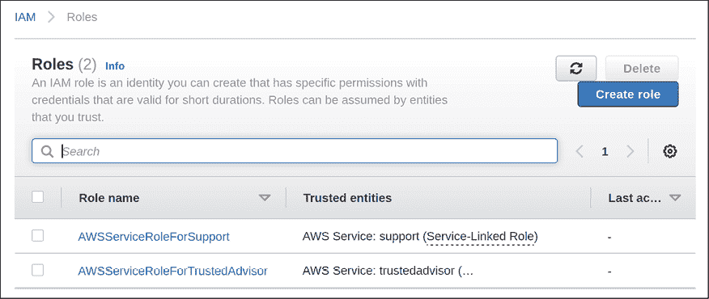
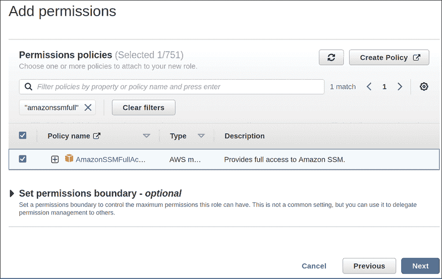

# 第十九章：在云端部署 Ubuntu

到目前为止，在每一章中，我们一直在使用安装在本地虚拟机、物理计算机或服务器上的 Ubuntu 实例，甚至是 Raspberry Pi。我们已经学会了如何在这些设备上部署 Ubuntu，甚至还深入到虚拟机和容器的部署。这些本地设备一直为我们提供了良好的服务，但云计算的概念已经变得非常流行，尤其是自本书上一版以来。在本章中，我们将探索如何在云端运行 Ubuntu。具体来说，我们将部署一个 Ubuntu 实例在**亚马逊云服务**（**AWS**）上，这是一种非常流行的云计算平台。虽然我们不会详细讲解 AWS（它是一个庞大而复杂的平台），但你一定会对在云端部署资源的感觉有所了解，这对你入门已足够。

本次探索将涉及以下主题：

+   理解本地基础设施与云基础设施的区别

+   在考虑将云计算作为潜在解决方案时需要注意的重要事项

+   熟悉一些基础的 AWS 概念

+   创建 AWS 账户

+   选择区域

+   部署 Ubuntu 作为 AWS EC2 实例

+   创建并部署 Ubuntu AMI

+   使用自动扩展实现 Ubuntu EC2 部署的自动扩展

+   降低成本：了解如何节省开支并做出具有成本效益的决策

+   进一步探索云计算：额外的资源来扩展你的知识

由于云计算的思维方式与我们习惯的方式有所不同，我们首先将介绍一些章节，帮助我们理解这种差异，以及在选择将 Ubuntu 实现到云端之前应考虑的一些因素。在下一节中，我们将探讨云计算的概念如何与本地硬件有所不同。

# 理解本地基础设施与云基础设施的区别

正如本章开头所提到的，我们至今一直仅使用本地安装的 Ubuntu。即使我们在数据中心的虚拟机上运行 Ubuntu，它仍然被视为本地安装，即使它不是运行在物理硬件上。简而言之，本地安装是指在我们本地运行的安装，无论其基础服务器类型如何。

在云计算中，第一个区别可能是比较显而易见的：它正好与资源本地化的概念相反。使用云实例的 Ubuntu 时，实际上是在别人的硬件上运行。大多数时候，我们并不知道云实例运行在什么样的服务器上——当我们订阅云服务提供商的服务并支付费用来在该平台上运行服务器时，我们就像使用虚拟机一样访问操作系统，几乎不需要了解底层数据中心的情况。尽管使用云实例会有一些持续的费用，但我们不需要担心监控硬件组件或更换损坏的物理设备。对于云服务来说，这些问题由别人来解决。

你可以选择各种云服务提供商，其中**AWS**、**Google Cloud Platform**（**GCP**）和**Microsoft Azure**是比较流行的选择。这三大平台都非常流行。它们各自有优缺点，甚至在平台上资源管理方面有所不同。在大多数情况下，这里没有绝对对错的选择，重要的是研究每个平台并为你和你的组织做出合适的决定。

除了云服务提供商之外，还有**虚拟私人服务器**（**VPS**）提供商。以前，完整的云服务提供商和 VPS 提供商之间有较大的区别——但随着时间的推移，这两种平台之间的界限越来越模糊。大多数情况下，VPS 提供商是标准云服务提供商的较轻或“简化”版。它们提供相同的核心功能，例如允许你构建虚拟机——但通常不像完整的云服务提供商那样提供那么多功能。如今，VPS 提供商正在定期推出新功能，并在功能方面赶上了云服务提供商。流行的 VPS 提供商包括**DigitalOcean**和**Linode**等。实际上，连亚马逊自己也进入了 VPS 业务，提供一种名为**Amazon Lightsail**的 VPS 替代方案。

对于你的组织，你应该在完全云提供商和 VPS 提供商之间选择哪一个？许多管理员会毫不犹豫地回答这个问题，并推荐使用完全云提供商。我当然能理解他们的观点——为什么要选择一个“轻量级”平台，而可以使用一个具备所有功能的解决方案呢？然而，根据我与许多组织的经验，我不建议在没有首先确认 VPS 提供商是否拥有你所需要的所有功能的情况下选择完全云提供商。原因在于，拥有更多功能的权衡之一就是复杂性增加。复杂性的增加意味着你需要承担更多的责任来管理该平台上的资源。而这种复杂性可能会带来非常大的管理开销。因此，我不建议像 AWS 或 Azure 这样的完全云提供商给 IT 人员有限的小型组织。对于这些组织，VPS 提供商是最合适的选择，因为管理负担较小。对于有一支管理员团队的大型组织来说，处理像 AWS 这样的服务不成问题。

正如我提到的，我们将在本章中讨论 AWS。即使你没有考虑将资源迁移到云上，练习这项技术仍然是值得的。至少，你可以对另一个平台有一些熟悉，这将增加你的技能和市场竞争力。而且我不知道你怎么样，但就我个人而言，我真的很喜欢了解新技术和学习新的东西。

然而，也许我有些超前了。在你将任何资源迁移到云之前，现在最重要的问题是，创建云资源是否符合你的目标。这正是我们将在下一部分探讨的内容。我们还将探讨云计算中的一些思维方式差异。

# 考虑云计算作为潜在解决方案时的重要事项

在选择注册某个提供商之前，首先要确保创建云资源对你或你的组织来说是一个好主意。IT 专业人员常常会对新兴趋势感到兴奋，以至于可能会犯错，尝试使用这样的服务，即使这样做并不合适。最重要的是，作为一名管理员，应该利用最合适的工具来完成你想做的事情，而不是仅仅因为对某项技术感到兴奋就去使用它。云计算无疑是很棒的，但对于某些使用场景来说，它并不合适。这与容器化类似：容器化是一项令人兴奋的技术，但某些应用程序在这个平台上运行并不好。它需要经过反复试验。

云计算有一些显著的好处。就物理服务器而言，硬件最终会出现故障。这不是“是否”会发生的问题，而是“何时”发生的问题。所有硬件*最终都会*故障。即使你拥有的硬件短期内没有发生故障，并且能够持续很长时间，它也会被更强大、更高效的硬件所淘汰。管理物理服务器时，最终需要更换硬件。

这对于云计算也是适用的；这些服务运行的硬件在发生故障或变得过时时（无论哪种情况先发生）都需要被替换。不同之处在于，当这种情况发生时，你（作为管理员）的责任大大减少。你无需再订购新服务器，替换零部件，甚至无需关注硬件。保持硬件运行的责任完全由云服务或 VPS 提供商承担。你在云平台上运行的虚拟机可能运行在一台已经使用了几年时间的物理服务器上，第二天可能会被迁移到一台全新的硬件上。你甚至可能没有意识到它曾经被迁移过。

然而，权衡的关键可能在于成本。我之所以将成本作为一个“潜在”的权衡因素提到，是因为你是否选择购买物理服务器还是支付每月的云服务器费用，最终取决于哪个方案能带来更好的**投资回报率**（**ROI**）。为了更好地理解这一点，可以考虑一个只使用本地硬件的数据中心的组织，完全不使用云资源。假设每 3 年左右，他们必须用更先进的硬件替换一些关键的服务器；而每 5-10 年，替换不太重要的服务器。还需要支付全职管理员的薪资，这些管理员需要具备管理物理硬件的专长，并维护冷却系统，确保有房间可作为数据中心使用。同时，还需要考虑自己运行数据中心的电费。将这些费用加总起来——这些开销平均会给组织带来多大成本？

对于物理基础设施来说，每次需要服务器时，你都需要支付一次性的费用来购买服务器。而云计算则不需要你购买物理服务器硬件，而是每个月支付费用，以便能够使用云基础设施。当你把云资源的月度费用加起来时，这样的开销会对组织造成多大负担？它的成本会比运行物理硬件高还是低？

通常，是否在云中运行服务器能节省成本（或最终变得过于昂贵）取决于你希望在该平台上使用的服务类型。在云中运行更多虚拟机通常是相对便宜的，并且与运行自己的物理基础设施相比，可能会带来成本节省。然而，云中可能会变得过于昂贵的一个例子就是存储。

如果你的组织存储的数据量不大，那么存储成本就不会是个问题。许多公司完全满意让员工使用 Google Drive 之类的共享存储，甚至根本不需要云存储。一些组织，尤其是软件开发公司，*拥有庞大的*存储需求。对于这些公司来说，可能需要存储数十甚至数百 TB 的数据，以及数据进出公司的带宽费用。如果你试图将这么大量的数据迁移到云服务提供商那里，你不再需要管理存储硬件，但云存储的费用将大幅增加，可能比继续使用物理硬件的成本还要贵得多。我个人曾看到过存储成本每月额外增加数万美元。

另一个需要考虑的因素是稳定性。人们常常认为，使用云服务提供商可以实现更稳定的基础设施。这个观点一开始似乎有道理，因为使用云服务提供商意味着你不再需要管理硬件。云资源更稳定这一说法确实有一定的道理，但事情并不那么简单。云服务提供商*确实*会经历停机，而且这种情况发生的频率比你想象的还要高。

云服务提供商通常会宣传较高的正常运行时间，通常用“9”来衡量。例如，截至本书出版准备时，AWS 提供 99.999%的正常运行时间。这听起来很棒，不是吗？在你对云服务提供商的正常运行时间声明感到兴奋之前，了解他们究竟是如何计算这一正常运行时间的也很重要。如果上游提供商（如后端互联网资源）发生故障，服务完全不可用，他们可能不会把这一情况计入停机时间，依然声称保持同样的正常运行时间。云服务提供商的大规模故障并不罕见；例如，2017 年亚马逊的 S3 服务由于一名工程师输入命令错误而发生了重大故障，导致许多互联网上的服务无法提供给用户。因此，虽然云服务提供商的故障发生率通常低于硬件故障的发生率，但仍需记住，停机会时有发生。我们永远不能假设任何服务（无论是我们的还是其他的）是万无一失的。

自动化是云计算中的一个重要考虑因素。如果你的资源遇到问题，最好有一种自动化的方式来重新部署你的关键服务。在物理服务器上，你可以按需求设置服务器并将硬盘镜像保存，以防服务器发生故障。云服务提供商基本上也为你提供相同的服务，允许你创建重要服务器的镜像，以便将来需要时重新部署。

如果你选择了云服务提供商，务必定期备份并保存镜像文件。同时，确保至少将最新的备份保存在本地，远离云服务提供商，因为如果云服务提供商发生故障，你也会失去备份。更简洁地说，我建议你不要对云服务提供商的稳定性过于自信。无论其营销团队如何宣传，始终假设你的基础设施最终会失败，且要做好准备，防止其发生。

我对云服务提供商稳定性的警告，并不是要吓唬你远离使用它们，而是希望你能够像管理物理基础设施一样，保持良好的云使用习惯。简单来说，要在服务器管理中取得成功，你必须假设云服务提供商的故障与本地设备一样容易发生，并且要确保在遇到问题时你已经做好了充分的准备。云服务提供商实际上为你提供了所有必要的工具，以构建一个稳定、可复制、可恢复的基础设施。如果你有效地利用这些工具，应该不必担心任何问题。我们将在接下来的内容中深入探讨这些概念，实际上，你甚至可以让云服务器在问题发生时自动*恢复*，这完全取决于你如何设计你的解决方案。

同时，了解关于数据保存、云中可以存储什么类型的信息或你所在地区可能存在的任何相关政策或法律也非常重要。（GDPR 是法律要求的一个很好的例子。）如果有疑问，可以咨询公司管理层、安全团队和人力资源部门，这将是你在设计云解决方案时，了解与数据相关的政策和法律的一个好起点。

在接下来的章节中，我们将探讨一些特定于 AWS 的概念，这样我们就能为后续章节中构建实际的云解决方案打下更坚实的知识基础。

# 熟悉一些基本的 AWS 概念

如前所述，AWS 是多个竞争的云服务提供商之一。在本章中选择 AWS，是因为与其他任何提供商相比，这个平台要求管理员在管理基础设施时采取完全不同的心态。这种不同的心态即使在 AWS 之外也是健康的，因此它在我们旅程的这个阶段代表了一个合理的进化。

到目前为止，我们一直将服务器的安装看作是宠物，意味着我们希望它们一直存在，确保它们健康，如果出了问题，我们会尽力修复。我们希望尽可能长时间地保持服务器的正常运行。我们希望能够依赖它们，这有助于我们的组织——客户和用户更愿意使用一个稳定、最小化或没有停机时间的网站或服务。

最后一点，最小化停机时间，无论我们以什么样的心态管理基础设施，这一点都不会改变。在这个行业中，停机和服务中断是非常不好的，这一点始终不变。不同之处在于我们如何处理这个问题，以及我们如何去恢复。事实上，我们甚至可以尽最大努力在出现问题时自动恢复。如果客户从未注意到曾经发生过问题，那就更好了。

使用 AWS 时，心态是不同的——我们将服务器视为一次性使用品，而非宠物。这一观点一开始可能让人感到有些意外，但如果我们有效地利用所提供的工具，就可以构建一个可扩展的基础设施。这个概念特别被称为**自动扩展**，是 AWS 的一个非常重要的方面。通过自动扩展，资源会根据需求的增加和减少自动创建和销毁。例如，假设你的网页服务器接收到的访问量比平常多，且其 CPU 已经接近最大负载。此时，自动扩展会自动启动一个新的网页服务器，并通过负载均衡器将客户端按需分配到不同的实例，从而分担负载。你可以设置可以启动的最大实例数量，然后当负载减少时，之前为应对负载而启动的服务器会自动被删除。这意味着你可以设计你的云解决方案，使得在任何时刻都能拥有恰好所需数量的服务器。

自动伸缩之上的另一个层级是**自动修复**。顾名思义，自动修复意味着，如果你的服务器出现问题，它会自动“修复”。在云计算中，这意味着实例将被销毁并从已知的良好镜像或模板中重新创建。这是 AWS（或者几乎所有类似实现）的终极目标：拥有不仅可扩展，而且能够自我恢复的基础设施。例如，也许你有一对处理客户端请求的 Web 服务器。其中一台遇到问题并未通过某种测试，测试表明该服务器不可靠。这样的测试被称为**健康检查**。通过自动修复，未通过健康检查的服务器会被认为是不健康的并被删除。借助自动伸缩，你还可以为你的应用设置最小服务器数量。如果服务器数量低于最低要求，则会创建一台新服务器来替代它。根据你的架构设计，客户可能会注意到应用在少数服务器上运行时的性能下降，但这只是暂时的。当新服务器上线时，一切会恢复正常。

在 AWS 中，自动伸缩和自动修复是非常重要的。我曾见过许多管理员没有利用平台的这些功能，这绝不应该发生。如果没有这些高可用性功能，你的服务器随时可能会停止运行。这可能比你想象的更严重。AWS 的物理服务器遍布全球，和其他物理服务器一样，硬件故障不仅是可能的，而且经常发生。如果你的应用运行在 AWS 数据中心的某台物理主机上，而该主机发生硬件故障，在更换硬件时，可能会导致你的服务器被删除。使用自动伸缩，这就不是问题了。一台新的虚拟服务器将上线，替代被移除的服务器。

但如果没有自动伸缩，这可能会导致你需要手动重建服务器。不过不用担心，我们将在本章中讲解自动伸缩，所以在我们讲解完之前，你一定会理解如何实现它。

高可用性相关的概念不限于 AWS，其他云平台也有类似的功能。不同云服务提供商之间的主要区别在于它们为这些功能所使用的营销术语，但你可以在每个平台上设置类似的基础设施。不过，AWS 确实非常注重这一方面，因此学习这些概念是很重要的。但即使你在公司生产环境中没有使用 AWS，能够轻松从灾难中恢复的概念仍然很重要，且是可以实现的。至少，你应该考虑为重建服务器实现自动化，这样如果发生问题时，你就不必做那么多手动操作。

回到 AWS：该平台内有许多服务可供使用，这些服务提供了各种功能。实际上，平台内有一百多种不同的服务。因此，我们无法在本章中覆盖每一项服务。即使是在专门讲解 AWS 的书籍中，覆盖所有服务也是一件非常困难的事情。但是，不要让服务的数量让你感到不知所措；你只需要学习与实现你在平台上目标相关的服务。例如，如果你的组织不开发多人电子游戏，那么学习 GameLift 服务对你完全没有帮助。在本章中，我们将重点介绍启动并运行一个基本的云端 Web 服务器所需的服务。以下服务和术语将会讨论：

+   **虚拟私有云** (**VPC**)：VPC 是对你整个云网络和资源的高级抽象。你所配置的每一台服务器和相关服务都会被部署在 VPC 中。你可以把 VPC 看作是你整体的网络。在你的组织中，可能有各种路由器、网关、防火墙、虚拟机、打印机或其他网络连接设备。你组织的网络本质上就是 AWS 中的 VPC，是一个完整网络的软硬件版本。

+   **弹性计算云** (**EC2**)：EC2 是 AWS 中运行虚拟机的服务。AWS 中的独立虚拟机被称为 EC2 实例。你可以把这个服务看作是 AWS 版的 VMware ESXi、Microsoft Hyper-V、Proxmox 或你更熟悉的虚拟机平台。EC2 实例就像虚拟机一样，具有分配的内存和 CPU，并运行操作系统。在本章结束之前，我们将在 EC2 实例中运行 Ubuntu。

+   **弹性块存储** (**EBS**)：随着你对 AWS 了解的深入，你会发现即使是最简单的组件，似乎也附加了一个营销术语。EBS 提供块存储，本质上是我们一直在使用的相同类型的存储。所以简而言之，EBS 卷就是硬盘。当你创建一个 EC2 实例时，服务器的操作系统将从 EBS 卷中运行，你可以相应地设置卷的大小。我们将在本章稍后详细讲解。

+   **弹性负载均衡器** (**ELB**)：正如你从名称中可以猜到的，ELB 是 AWS 的负载均衡器，相当于提供类似的功能。这使得你可以让多个 EC2 实例为你的应用提供服务，并且你可以创建一个 ELB 来在这些实例之间路由流量。ELB 实际上是 EC2 的一个特性，而不是独立的服务。

+   **身份与访问管理** (**IAM**)：IAM 是 AWS 中的工具，用于创建和管理用户账户，确定用户权限，甚至创建 API 密钥，以便程序化访问和管理 AWS。基本上，它是你处理与用户权限相关的一站式服务，无论“用户”是人类还是脚本。

+   **Route 53**：虽然我们本书不会涉及 Route 53，但我建议你至少了解它，以防未来需要。如果你决定在生产环境中使用 AWS，Route 53 将简化 DNS 条目的管理过程，并且还能注册新的域名。如果你的组织是一个托管服务提供商，你可能会经常使用这个服务。

+   **简单存储服务** (**S3**)：亚马逊的 S3 服务是我们本章不会涉及的另一项服务，但了解它的存在以及它的用途是个好主意，以防你以后需要用到它。S3 实际上是一个非常流行的服务，提供**对象存储**。

    对象存储是一种新的存储类型，区别于你添加到服务器上的磁盘（虚拟或物理），你需要格式化并挂载它。虽然你仍然可以将 S3 挂载到服务器上，但它没有文件系统（如 ext4 或 STON），也不理解权限。它仅仅是一个名称-对象对，你在其中存储文件，并且每个文件都有一个名称。使用 S3 时，你创建“存储桶”，每个存储桶可以存储文件。每个存储桶的名称必须唯一。如果你想将可下载文件提供给客户或存储备份文件，S3 非常有用。

+   **弹性 Kubernetes 服务** (**EKS**)：在上一章中，我们介绍了 Kubernetes，甚至设置了我们自己的集群。AWS 有自己的 Kubernetes 解决方案，称为**EKS**。虽然本书不会涵盖它，但如果你想继续使用 Kubernetes，并希望将容器运行在托管服务中，而不是管理自己的集群，这个服务是值得考虑的。EKS 结合了 Kubernetes 与 AWS 平台的灵活性，因此它是一个非常有用的服务。

+   **安全组**：默认情况下，来自公共互联网的许多 AWS 资源访问是禁用的；安全组用于确定什么可以访问 AWS 中的资源，你可以根据 IP 地址和端口来允许或拒绝访问。关于 EC2 实例，默认情况下允许出站访问，但每个端口都被阻止入站。你可以创建一个安全组，允许特定的 IP 访问实例，从而提高安全性。稍后我们会看到一个例子。

现在我们已经有了基本的了解，可以开始构建一个运行在 AWS 上的云应用程序了。

# 创建 AWS 账户

正如上一节所提到的，AWS 中的 VPC 代表了你整体网络的高层次抽象。我们创建的所有资源都将运行在 VPC 内部。因此，我们需要首先创建 VPC，才能创建 EC2 实例并部署 Ubuntu。

然而，在我们创建 VPC 之前，我们需要一个 AWS 账户。在本章之前，我通常建议你使用手头可用的硬件来创建 Ubuntu 安装，以便与平台进行配合。这次，我们将使用一个实际的云服务提供商，虽然这会有一定费用。虽然新账户可以在有限时间内免费使用一些组件，但账单的管理由你——读者来负责。我们将在本章稍后部分详细讨论费用。但作为一个初步的指导原则，现在你应该始终选择最便宜的选项。如果有免费的实例类型可用，选择它。当然，如果你打算在组织中部署实际的资源进行生产使用，那么你需要根据使用案例选择合适的实例类型。对于我们而言，我们只是第一次学习这个平台，所以一定要选择最低成本的资源，完成后记得删除所有内容。

最后一条尤为重要——免费套餐并不是无限的，如果你忘记删除某些东西，可能会在某个时候收到账单。我建议你保持一个记录，列出你在 AWS 中创建的所有内容，这样如果不打算继续使用平台时，你就可以有清单来删除这些内容。

你还应该删除任何快照/存储卷，或者你创建的其他任何东西。更好的做法是，如果你不打算在生产中使用 AWS 账户，你可以直接删除账户，以免它继续向你收费。如果有疑问，请务必查阅 AWS 内部关于账单的文档。

## 注册 AWS 账户

现在是时候创建我们自己的 AWS 账户了。在本节（以及本章剩余的各节中），我将带你逐步完成导航 AWS 的每个步骤。需要记住的是，我们将要使用的**AWS 管理控制台**有时会发生频繁变化。事实上，自从本书上一版写成以来，控制台至少已经变动了两次，甚至不算在第三版时，界面就在写作本章之前发生过变化。这里的截图和操作步骤是截至本章编写时准确的，但界面可能会在某个时候再次更新，甚至很可能会更新。如果截图或布局发生了变化，你仍然可以按照这里的说明操作，因为用词通常不会变化，变化的只是布局。既然如此，让我们开始吧。

首先，访问[`aws.amazon.com`](https://aws.amazon.com)，你应该会在右上角看到一个橙色的按钮，上面标有**创建 AWS 账户**。发布后页面的布局可能会有所变化，但你应该能在页面的某个位置看到创建新账户的按钮：


图 19.1：AWS 主页面

当你点击按钮以创建新账户时，系统会弹出一个表单，要求你提供基本信息。你可能被要求填写的一些字段示例如*图 19.2*中所示，尽管实际要求提供的信息可能会有所不同。根据要求填写每个字段，然后点击**继续**：


图 19.2：注册新的 AWS 账户

在点击**继续**后，系统会出现另一个页面，要求你填写更多信息，如全名、公司名称、地址等。这个过程还会要求你提供信用卡信息，所以请逐步完成每个页面并输入所需信息。完成整个过程后，你将看到一个选择框，在其中你可以选择你的支持计划：


图 19.3：在注册 AWS 账户时选择支持计划

如果在过程中系统要求你选择一个支持计划，请选择最适合你使用场景的计划。如果你打算使用 AWS 创建生产实例供你的组织使用，开发者或商业计划可能会为你提供额外的价值。如果你仅仅是为了学习 AWS 并通过本章中的示例进行操作，请选择基础计划。

一旦完成了创建新账户的过程，可能需要一些时间才能使你的新账户准备好。当账户准备好后，你应该会收到一封邮件，告知你可以开始使用。收到这封邮件后，你将能够登录。为此，访问[`aws.amazon.com`](https://aws.amazon.com)，然后点击**登录到控制台**按钮，这会将你带到另一个页面，在该页面你可以输入账户登录信息：


图 19.4：作为 Root 用户登录

在这里，你可以选择以 root 用户或 IAM 用户身份登录。我们还没有创建任何 IAM 用户，所以此时只有 root 用户。root 用户通过使用你在注册过程中提供的相同电子邮件地址登录来访问。请输入该电子邮件地址并点击**下一步**，然后在下一个页面输入你的密码。

如果一切顺利，你应该已经登录并看到**AWS 管理控制台**：


图 19.5：AWS 管理控制台主界面

现在你已访问到管理控制台，你可以开始使用 AWS。在我们开始创建云资源之前，我们应该实施一些基本的安全措施来保护我们的账户。

## 实施基本用户安全

在继续之前，我们需要采用一些非常重要的安全最佳实践，来确保能够安全地进行 AWS 账户身份验证。虽然我们新建的账户很可能是用来跟随本章示例进行测试的账户，但我们应该养成始终保护我们的 AWS 账户的习惯，无论它实际上有多重要。

我们可以从保护根账户开始，因为它是黑客的常见攻击目标。具体来说，我们应该为该账户启用双因素身份验证。这样，外部威胁要访问该账户将变得更加困难，因为他们除了需要您的密码外，还需要获取您的第二个认证因素。由于我们此时已经以根用户身份登录，因此可以立即设置此功能。

在管理控制台中，您会在屏幕顶部看到一个搜索框。如果您已经知道要配置的服务名称，可以开始在搜索框中输入该名称，如果您的查询与可用服务匹配，它会显示在列表中。如果您不知道要使用的服务名称，可以点击控制台左上角的**服务**，以查看所有可用服务的完整列表。

要设置第二因素身份验证，我们将访问 IAM 服务。您可以开始在搜索框中输入`IAM`，它应该会显示为一个可用选项。点击它继续：


图 19.6：在 AWS 管理控制台中使用搜索功能定位 IAM 服务

当 IAM 仪表板出现时，您可能会看到一个安全警告，提醒根用户未启用**多因素身份验证**（**MFA**）。虽然启用此功能是可选的，但我建议您启用它。

MFA 对于确保任何对您组织重要的账户的安全至关重要，尤其是像 AWS 这样的云计算提供商账户。MFA 将增强账户的身份验证安全性，要求在用户能够访问账户之前提供额外的验证因素。根账户是 AWS 中最需要保护的账户，因为它对所有可用服务都有完全访问权限。要启用 MFA，点击标有**添加 MFA**的按钮（如果页面布局发生变化，文案可能会有所不同）：


图 19.7：IAM 仪表板，显示推荐设置 MFA 的警报

接下来，点击**MFA**展开它（如果尚未展开），然后点击**激活 MFA**按钮：


图 19.8：设置 MFA（续）

下一屏将给您一个选择，可以选择使用哪种设备来辅助 MFA。如果您没有物理硬件密钥，如 YubiKey，默认选项（**虚拟 MFA 设备**）是一个不错的选择。如果您没有其他偏好，选择**虚拟 MFA 设备**选项并点击**继续**：


图 19.9：选择要设置的 MFA 设备类型

要设置虚拟 MFA 设备，您需要下载一个第二因素认证应用程序来完成此操作。Google Authenticator 是一个流行的选择，但我推荐使用 Authy。两者都完全可接受，但 Authy 还提供桌面应用程序，并且如果您的主设备由于某种原因无法访问，还可以恢复您的账户。Authy 与 Google Authenticator 兼容，因此通常可以与提供 Google Authenticator 选项的服务一起使用。要继续，请显示二维码，用手机应用扫描它，然后输入应用生成的两个随后的值。

最后，点击**分配 MFA**以完成过程：


图 19.10：设置 MFA 设备

现在我们已经为根账户启用了双因素身份验证，我们应该立即停止使用该账户。这实际上是 AWS 的最佳实践；建议为将在您的 AWS 账户上工作的人创建个人账户，给予他们完成所需任务的权限。我们将在*第二十一章*《保护您的服务器》中讨论**最小权限原则**，但现在开始考虑这一概念也无妨。现在，我们要做的是为自己创建一个管理员账户，用来替代根账户。如果需要，我们可以随时使用新账户创建其他用户。

要创建一个新的管理员账户，我们将再次使用 IAM 控制台。在那里，您会看到左侧有一个**用户**链接，然后可以点击蓝色的**添加用户**按钮开始该过程：


图 19.11：为 AWS 设置新管理员用户

下一屏幕将要求您输入所需的用户名，并设置**访问类型**。对于用户名，您可以根据需要给用户命名。对于**访问类型**，我们将选择**AWS 管理控制台访问**。点击**下一步：权限**继续：


图 19.12：为 AWS 设置新管理员用户

接下来，我们将为我们的用户设置适当的权限。第三个图标，标记为**直接附加现有策略**，是我们在这里做出的第一个选择，然后在下面，我们会在**管理员访问**的复选框旁边打勾，然后点击**下一步：标签**：


图 19.13：为 AWS 设置新管理员用户（续）

我们可以通过将字段留空并点击**下一步：审查**来跳过标签屏幕。

下一屏幕将为我们提供一个概览，如果一切看起来正确，我们可以点击**创建用户**：


图 19.14：为 AWS 设置新管理员用户（续）

最后，我们会看到一条确认信息，显示我们的用户已创建。如果在过程中选择了随机生成密码，你也会看到一个按钮，用于检索该密码：


图 19.15：为 AWS 设置新管理员用户（续）

现在你可以使用新用户和提供的密码登录 AWS 管理控制台。你还需要 **账户 ID**，该 ID 可在此页面的 URL 中找到（它位于 `https://` 后面的数字）。为了方便起见，你可以点击显示的 URL 来自动填充账户 ID。

未来，我建议你使用我们为管理 AWS 账户创建的新用户，因为除非万不得已，否则不应使用 root 账户。此外，我还建议你按照我们之前的步骤为新用户设置 MFA（多因素身份验证）。

# 选择区域

如前所述，AWS 中的 VPC 是你整体网络的高级抽象。你可以拥有多个 VPC，这类似于管理多个物理网络的概念。实际上，我们的账户中已经为我们创建了 VPC，因此无需再创建。在未来，记住，如果你需要多个 VPC，可以选择创建额外的 VPC。在我们的账户中，每个 **区域** 都有一个默认的 VPC，所以选择使用哪个 VPC 取决于哪个区域最适合我们的使用需求。

对于生产环境使用，你需要在 AWS 中创建离客户尽可能近的实例。例如，假设你的组织的客户主要位于美国东部，那么 AWS 中有一个被标记为 **US East** 的区域，在这种情况下它将是一个明显的选择。不过，你不仅仅局限于美国的区域；在全球范围内也有许多区域可供选择，比如德国、中国和加拿大（等其他地区）。简而言之，你应该尽量在离客户最近的地方创建资源。如果你没有特别偏好，可以选择离你最近的区域。

虽然超出了本书的范围，但 AWS 提供了一项名为 **CloudFront** 的服务，它充当 **内容分发网络**（**CDN**），你可以使用它将资源分发到多个边缘位置，从而确保用户从最接近他们地理位置的地方获取内容。对于制作媒体内容的组织来说，这尤其有价值。如果这对你有帮助，建议你深入了解 CloudFront。

此外，各个区域通常会有多个**可用区**，这可以让你更接近你的目标受众。例如，关于美国东部区域，它包含两个可用区，一个位于弗吉尼亚，另一个位于俄亥俄。可用区不仅能让我们更接近客户，还为我们提供了更多的冗余选项。例如，如果一个可用区由于某种原因发生故障，你可以将客户流量引导到另一个可用区。可用区有特定的命名规则，包括区域名称和该区域内的可用区名称。以美国东部为例，那里有两个可用区，分别标记为**us-east-1**（弗吉尼亚）和**us-east-2**（俄亥俄）。不过，并非所有区域都有多个可用区。目前，加拿大只有一个区域和一个可用区：**ca-central-1**。

除了可用区外，还有**本地区**，本地区旨在让你能够将资源设置得比可用区更接近你的客户。如果你的应用程序对网络延迟非常敏感，比如运行一个在线游戏的服务器，本地区是一个很好的选择。我们在本书中不会详细讨论本地区，因为这是 AWS 的一个全新产品，截至本书出版准备时，只有两个本地区。亚马逊计划在未来增加更多的本地区，因此到你阅读本书时，可能会有更多的本地区可用。如果你的组织提供对网络延迟敏感的服务，这是一个你可能需要关注的功能，随着它向更多地区推广。

目前，唯一需要考虑的因素是哪个区域能为你的客户提供尽可能接近的服务。不过，在跟随本书示例操作时，选择离你地理位置最近的区域是个不错的选择。

现在我们已经选择了区域，接下来如何在云端创建一个实际的 Ubuntu 实例呢？这正是我们在下一节要做的事情。

# 部署 Ubuntu 作为 AWS EC2 实例

在大量讨论之后，是时候在云端创建一个实际的 Ubuntu 部署了。这将使我们能够看到 AWS 服务的实际操作，并为我们提供一些 EC2 服务的实际经验。这需要两个独立的步骤：第一个是创建所需的 IAM 角色，第二个是创建我们的实例。我们先确保理解 IAM 角色的要求，然后设置角色并创建我们的新实例。

## 为 Session Manager 设置 IAM 角色

**会话管理器** 是 AWS 中的一项服务，我们可以用它来访问实例的命令提示符。它实际上是 **系统管理器**（Systems Manager）的一部分，而不是独立的服务。如果你想访问会话管理器，你需要搜索系统管理器，你会在其下找到会话管理器作为一项服务。你很快就会看到这一点。

为什么我们要使用会话管理器？就像使用任何其他 Linux 服务器一样，我们仍然可以使用 OpenSSH 连接到我们即将创建的 EC2 实例，就像在本书中处理非 AWS 实例时做的那样。

使用 OpenSSH 是没有问题的；在正确的设置下，它可以是一个非常安全的选择。实际上，我们将在 *第二十一章*，*保护你的服务器* 中探索更好地保护它的方法。对于 AWS，我们可以使用会话管理器作为 OpenSSH 的替代方案，这个值得学习的替代方案提供了额外的安全性，因为其后台安全性不需要我们自己管理。此外，我们还可以通过 AWS 控制台控制对它的访问。

默认情况下，会话管理器是完全无法访问的。它需要在 Ubuntu 服务器中安装特定的包才能工作，并且还需要启用特定的权限。Ubuntu 的所需软件包默认已预安装，因此第一个要求在我们创建实例时会立即自动处理。

对于添加权限的第二个要求，我们需要创建一个 IAM 角色，以便我们即将创建的 EC2 实例能够与会话管理器服务进行通信。我之前提到过会话管理器默认是无法访问的，这就是原因——它缺少所需的权限，直到我们添加它们。为了添加所需的权限，我们将访问 AWS 控制台中的 IAM 服务，这与我们之前创建用户帐户时使用的相同。IAM 本身有许多技巧，不仅仅是允许我们创建用户。它还允许我们创建 **IAM 角色**，这使我们能够为整个对象添加权限。例如，我们可以创建一个具有所需权限的角色，然后将该角色附加到任何 EC2 实例上，以立即使其能够通过会话管理器进行连接。

让我们开始设置会话管理器所需的 IAM 角色。返回到我们已经操作过几次的 AWS 控制台中的 IAM 部分，我们将创建所需的角色。

在窗口左侧的 IAM 菜单中，点击 **角色**，然后点击标有 **创建角色** 的蓝色按钮：



图 19.16：创建一个 IAM 角色以启用会话管理器

在下一个屏幕上，确保选择 **AWS 服务**，然后在下面的菜单中选择 **EC2** 作为服务。点击 **下一步** 继续：


图 19.17：创建一个 IAM 角色以启用会话管理器（续）

接下来，我们可以将策略附加到我们的角色。在出现的搜索框中，我们可以输入一个关键词来缩小列表，然后点击我们希望附加到角色上的策略旁边的复选框。对于所有内置策略的全面概述以及它们的用途超出了我们的范围，但简要来说，AWS 中的每项服务都有预构建的策略，可以附加到角色上，从而访问各种功能。针对我们的需求，我们将把**AmazonSSMFullAccess**策略添加到我们正在创建的角色中。

这样做的目的将在我们创建 EC2 实例时变得更加清晰，所以现在，点击**下一步**继续：



图 19.18：将 AmazonSSMFullAccess 策略附加到我们的角色

接下来出现的屏幕将让我们有机会添加一个或多个标签。我们暂时跳过这一部分，但你可以在这里自由添加任何你想要的标签。标签可以让你为资源附加信息，且不限于 IAM 角色。你可以根据需要添加任何你认为相关的描述性信息。标签仅仅是**键：值**对，所以这里没有特定的命名规则。如果你希望添加标签，可以添加，完成后点击**下一步：审核**。

最终的屏幕会让我们回顾到目前为止选择的设置，并提供一个选项来为角色命名，若需要，也可以添加描述。虽然这不是必须的，但我建议为角色命名，以便日后更容易识别。当你完成后，点击**创建角色**：


图 19.19：为我们的角色添加名称和描述

当涉及到设置 IAM 角色时，我们已经准备好——角色已创建，我们可以继续使用它。接下来，是时候创建我们的 Ubuntu 实例了。

## 在 AWS 中创建 Ubuntu 服务器实例

现在是时候看看我们的工作成果，并创建我们的 Ubuntu 实例了。在 AWS 控制台中，我们首先应该访问 EC2 服务以开始。你可以通过在控制台的搜索框中输入服务名称来轻松找到任何服务；所以如果你开始输入 EC2，应该会在列表中看到**EC2**。点击它后，点击屏幕左侧的**实例**。这样做之后，你会看到一个屏幕，上面有一个标有**启动实例**的按钮：


图 19.20：EC2 服务的主窗口

通常，EC2 控制台中的**实例**部分会显示所有服务器实例的列表，但除非你已经提前阅读过，否则我们目前还没有任何实例，所以这个窗口是空白的。当你点击**启动实例**时，你会在列表中看到各种操作系统。但为了我们的目的，Ubuntu 显示在**快速开始**部分，所以我们选择它：


图 19.21：EC2 的 Ubuntu 选项

在下方，确保选择了**t2.micro**，旁边应该会显示**免费套餐适用**。这就是我们想要使用的实例类型：


图 19.22：选择实例类型

在**选择实例类型**页面上，会有许多实例类型供您选择。我选择了**t2.micro**实例类型，建议您也选择这个类型。它符合免费套餐的条件，这是您在账户创建后的前 12 个月内可以访问的一个特别套餐。对于生产服务器来说，您很可能不会选择这个实例类型，因为它会非常慢——它只有 1 个 CPU 和 1 GiB 的内存。而且它是一个可突发的实例类型，这意味着其速度会根据使用情况波动。它能够在繁忙的工作负载下进行突发处理，但它的能力取决于它在特定时间内获得的 CPU 积分。对于这个章节来说，详细的解释超出了范围，但如果您打算在生产环境中使用 AWS，建议您了解各种可用的实例类型。尽管截图中没有显示，您在此页面上也应该能看到费用。但我们现在仍将利用免费套餐。

在页面下方，您将生成一个新的密钥对，假设您之前还没有。此密钥将用于通过 SSH 连接到实例。要生成新的密钥，点击**创建新密钥对**：


图 19.23：实例创建过程中密钥对设置

接下来出现的页面将允许我们配置密钥，例如设置加密选项。为了我们的目的，我们可以在给密钥命名后保留默认设置，然后点击**创建密钥对**：


图 19.24：自定义我们的 SSH 密钥

上一步将触发浏览器下载您生成的 SSH 密钥。请务必将其保存在安全的地方。您可以使用刚刚下载的密钥通过 OpenSSH 连接到实例，命令类似于以下内容：

```
ssh -i /path/to/key.pem ubuntu@<Instance Public IP> 
```

对我而言，如果我添加我的密钥路径以及实例列出的公共 IP 地址，那么命令将变成这样：

```
ssh -i /home/jay/downloads/jay_ssh.pem ubuntu@54.81.234.225 
```

从这里开始，管理服务器只是与其 Shell 进行交互并输入命令的问题。

不过，算了，我有点急于表达。在您保护好密钥之后，我们可以通过向下滚动继续到下一部分。接下来我们将处理网络设置：


图 19.25：为我们的新 EC2 实例设置选项

此屏幕上的第一个考虑是我们将允许从哪些位置进行 OpenSSH 连接。默认选项 `0.0.0.0/0` 允许从任何地方进行连接（并且甚至有相应标签）。正如我们在*第二十一章*《保护您的服务器》中将要讨论的，公开允许 SSH 连接是一件糟糕的事，因为外部威胁者可能会尝试利用这一点来访问服务器。对于我们现在创建的实例，我们可以主张允许来自任何地方的连接，因为这是一个用于学习的测试实例（并且我们将在本章结束前删除该实例）。然而，养成将 OpenSSH 访问限制为特定 IP 地址的习惯可能是一个更好的选择。为此，您可以从下拉菜单中选择**我的 IP**选项，这将把 OpenSSH 访问限制为您的公共 IP 地址。

如果您选择限制访问，请记住，除非您的公共 IP 是静态的，否则它可能会随时更改。当它更改时，您将无法通过 OpenSSH 访问您的 EC2 实例。您可以通过更新实例的安全组，包含您的新 IP 地址来恢复访问，但这种不便是为增加安全性所付出的微小代价。

在同一部分中，我们可以选择允许 OpenSSH 之外的流量：


图 19.26：在 AWS 上创建 EC2 实例时的网络设置

另外的选项，**HTTPS** 和 **HTTP**，如果您计划在实例上设置网站，至关重要。如果您在 Web 服务器上使用 OpenSSH，通常会限制它的访问，同时允许公共`internet`对端口 `80` 和 `443` 进行完全访问。原因是，OpenSSH 给您提供了管理服务器的权限，因此我们肯定不希望公开该访问权限。对于网站，我们很可能希望公众能够访问它，这就是为什么我们允许这两个选项的原因。只有在您确实计划设置 Web 服务器的情况下，才应该勾选这两个选项。对于我们的需求，我们应该允许这些选项，因为稍后我们将安装 Apache。

接下来，我们将为实例配置**存储**：


图 19.27：创建 EC2 实例时的存储选项

默认情况下，您的 EC2 实例将配置为 8 GiB 的存储空间。如屏幕上高亮显示的消息所示，如果您符合条件，您可以在免费套餐中获得最多 30 GB 的 EBS 存储空间。因此，您可以考虑将此存储空间设置得更高。您还可以向实例添加额外的存储卷，这在您希望在块存储设备之间划分存储时会有所帮助。在本章的使用案例中，我们不需要这么做。

在该部分下方，屏幕的最后一部分允许你配置**高级详细信息**。这里有相当多的额外选项，但我们只会忽略其中除了一个的所有选项。在最底部，有一个大文本框，标有**用户数据**。这是我们唯一会更改的高级详细信息选项：


图 19.28：为我们的 EC2 实例添加用户数据

**用户数据**部分常常被忽视，但它*非常*有用。那么它到底是做什么的呢？如果我自己不太了解的话，我可能会认为这里是添加与用户相关的信息。但事实并非如此。**用户数据**允许你添加一系列命令，甚至是一个完整的脚本，在实例创建时自动执行。

你现在可以想到，在设置服务器时，任何你可能执行的命令或调整的配置。与其在实例上线后手动执行设置命令，不如简化这个过程，在你第一次登录之前就能自动完成大部分工作。

在我的例子中，我已将以下代码添加到**用户数据**字段中：

```
#!/bin/bash
apt update
apt dist-upgrade -y
apt install -y apache2 
```

如果你认为我添加的代码像是一个 Bash 脚本，那么你是对的——这正是它的用途。我在**用户数据**字段中添加了四行 Bash 语句，以便自动执行一些命令。代码应该是相对简单的：我设置它先更新存储库索引，然后执行完整的系统升级。

这很重要；我们始终希望我们的服务器以最新的补丁启动。作为概念验证，我添加了一条安装 Apache 的命令。请注意，我在所有 `apt` 命令中都加入了 `-y` 选项。这会自动对 `apt` 可能提出的任何问题回答“是”，因为我们没有显示器连接到这台服务器，无法自己回答问题。如果没有这个选项，用户数据将无法应用。

无论如何，关键时刻到了——是时候启动我们的实例了，我们可以通过点击页面底部的**启动实例**按钮来完成。如果我们没有在过程中遗漏什么，我们的新 Ubuntu Server 云实例即将启动！

此时，我们应该能在我们账户中的 EC2 实例列表中看到新的实例，并且它将需要一些时间才能准备好使用。当状态显示实例为**运行中**时，意味着它已经准备好可以连接了：


图 19.29：检查我们 EC2 实例的状态

为了设置连接以便我们管理实例，我们需要更改实例的**IAM 角色**。如果您还记得，我们之前创建了一个 IAM 角色，这里我们将把该角色附加到新的实例上。这样可以确保角色中的设置应用到实例，从而使我们能够访问会话管理器，连接到该实例。要更改 IAM 角色，我们需要勾选实例左侧的框，然后点击屏幕顶部的**操作**。在弹出的菜单中，点击**安全**，然后点击**修改 IAM 角色**：


图 19.30：导航到 EC2 实例的 IAM 角色设置

接下来的屏幕是我们将更改 IAM 角色为我们之前创建的角色的地方：


图 19.31：更改实例的 IAM 角色

点击**更新 IAM 角色**后，您将返回当前 EC2 实例的列表。如果点击实例名称旁边的蓝色实例 ID 文本，您将进入一个可以自定义实例其他选项的屏幕：


图 19.32：额外的 EC2 实例设置

在页面上的各种项目中，我们特别关注的是**连接**按钮。如果我们点击它，我们将开始设置远程连接的过程，以便管理实例。在出现的屏幕上，点击**会话管理器**标签：


图 19.33：准备连接到实例的会话

一旦点击**连接**按钮，新的浏览器窗口将会出现，您可以使用它向实例发出命令：


图 19.34：在 Web 浏览器中打开的实例会话

在*图 19.34*中，我输入了以下命令以显示实例中部署的 Ubuntu 版本的详细信息：

```
cat /etc/os-release 
```

`/etc/os-release`文件包含在所有 Ubuntu 安装中，从输出中可以看到，它包含一些关于我们正在运行的 Ubuntu 版本的信息。该命令是直接输入到会话管理器窗口中的，以表明连接实际上已经成功，并且我们现在可以直接在 Web 浏览器中配置实例！

如果您还记得，我们之前添加了**用户数据**，其中包括一个安装 Apache 的命令。如果将 EC2 实例的公共 IP 地址输入到 Web 浏览器中，您应该能看到默认的 Apache 网页：


图 19.35：在 EC2 实例上运行的 Apache 默认网页

恭喜！您已经成功将 Ubuntu Server 部署到云端，现在已经有一个实际运行的 Web 服务器了。就这么简单。使用会话管理器也很简单；您只需要右键点击服务器，点击**连接**，然后继续构建实例。这太棒了！

然而，**不太理想**的是，当服务器出现问题时，你不得不重新开始并从头构建它。在接下来的部分，我们将探讨如何创建一个服务器镜像，利用它来部署定制版的 Ubuntu。

# 创建并部署 Ubuntu AMI

我知道的几乎所有云平台都有类似的功能，可以用来创建实例硬盘的镜像。镜像可以用来创建原始服务器的副本，并且作为一个起点，这样如果服务器需要重建，我们就不必从头开始。在 AWS 中，镜像被称为**Amazon 机器镜像**（**AMIs**）。从本质上讲，AMIs 并没有什么特别的地方；如果你之前使用过磁盘镜像，它们是一样的。至于 AMIs 中包含什么内容，你可以（而且应该）在这方面发挥想象力——任何你在部署新服务器时手动设置或配置的内容，都可以考虑纳入镜像，镜像中包含的自定义项越多，后续节省的时间就越多。

让我们来看一下这个过程，并创建我们刚刚设置好的服务器镜像。我们可以考虑先关闭服务器，尽管这不是必需的。最好在服务器关闭时创建 AMI，而不是在服务器运行时创建。当服务器关闭时，磁盘上不会有任何写操作，所以我们不必担心在关键写入操作中间捕获 AMI 时出现数据损坏。在创建运行中的服务器的 AMI 时遇到问题的可能性非常小，但如果可以的话，我建议你还是先关闭服务器，以确保安全。

在 AWS 的 EC2 控制台中，你可以右键点击实例进入**会话管理器**，然后可以通过命令行界面直接关闭它：

```
sudo poweroff 
```

在 AWS 中，实例关闭可能需要一两分钟的时间。你可以过一会儿刷新页面，状态应该会变为**已停止**：


图 19.36：检查 EC2 实例的状态

一旦实例关闭，你可以右键点击它，开始创建 AMI 的过程。将鼠标悬停在**镜像和模板**上，然后点击**创建镜像**：


图 19.37：在 EC2 实例上运行的 Apache 默认网页

接下来，我们可以为我们的 AMI 输入一些详细信息，给它一个名称和描述。这些信息将帮助你合作的其他人了解该镜像的用途，同时也能帮助你日后记得为什么要创建这个镜像。页面上还有其他选项，但我们可以保持默认设置。现在，名称和描述就足够了。完成后，点击**创建镜像**继续：


图 19.38：创建新的 AMI

相信与不信，这就是全部内容。创建 AMI 的过程非常简单，只需要几个步骤。你现在应该看到一个确认屏幕，告诉你镜像正在创建中：


图 19.39：创建新 AMI 时的确认

如果你点击包含 AMI ID 的下划线文本，你将被引导到 EC2 控制台中的 AMI 部分，那里将显示你创建的镜像：


图 19.40：我们新创建的 AMI，已可使用

在 EC2 控制台的 AMI 部分，你应该看到列表已缩小到仅显示我们刚刚创建的 AMI。我们总共有一个 AMI，除非你为练习创建了多个 AMI。最后，**状态**列应该显示**可用**，表示该 AMI 已准备好使用。如果没有，稍等一会儿，稍后刷新页面。有时需要几分钟的时间。但关于创建 AMI，就是这些！

既然我们已经有了一个 AMI，我们该如何使用它呢？其实这更简单了。只需右键点击 AMI 列表中的 AMI，然后点击**启动**。你将看到我们之前创建实例时所用的相同启动设置，不过这次，我们使用的是自定义的 AMI，而不是提供给我们的那个 AMI。现在，我们拥有了一个内置 Apache 的自定义 Ubuntu AMI，可以用来简化我们的过程。不过请记住，我们的原始实例仍然是停止状态。你可以返回 EC2 实例列表，右键点击该实例，然后选择**启动**，但这不是必需的；我们将很快展示一个有趣的自动化示例。

在下一节中，我们将探讨自动扩展（Auto Scaling）的概念。

# 使用自动扩展进行 Ubuntu EC2 部署的自动扩展

如果我们为组织维护一台或多台服务器，有时很难预测服务器的需求量。以一个热门新闻网站为例，某些文章可能比其他文章更受欢迎，如果某篇文章在网上病毒式传播，那么请求量可能会在短时间内激增几个数量级。过去，跟上客户需求是一个非常繁琐的过程，可能导致需要购买一台配置更强大硬件的全新服务器。而现在，借助云中的实例，我们有了更多的灵活性，可以自动化上线更多服务器的过程。这正是我们将在本节中研究的内容。

在我们开始之前，请记住，我们在 AWS 中实际上并没有一台热门服务器；我们只有一台当前运行 Apache 的简单测试服务器。我们可以模拟某些情况，但**自动扩展（Auto Scaling）**是一个需要一定实践才能完全利用的功能。不过我们肯定会在这里得到一个有效的示例。

但另一个重要的事情是，运行的实例越多，潜在的费用就越高。我们将在下一节中探讨如何降低成本，但作为一个通用的经验法则，删除你不使用的任何东西。在本章的示例中，我们已经设置了自己的 EC2 实例。这很好：我们能够实践一些关于 AWS 的概念并付诸实践。但如果我们留下不需要的实例运行，就可能会收到意外账单。建议你在本章结束时为自己写个提醒，删除测试 AWS 账户中的所有内容，这样就不用担心这个问题了。

接下来，Auto Scaling 的一个要求是，我们必须有一个 AMI 可供使用，用来在线启动额外的服务器。由于我们已经在前一节中完成了 AMI 的创建，所以这个要求已经满足。如果你还没有完成前一节的内容，确保在继续之前完成它。设置 Auto Scaling 的过程涉及一些步骤，我们将在本章中为每个步骤单独设置小节。

## 创建启动模板

在本章的早些时候，我们演示了创建新 EC2 实例的过程。我们选择了启动实例选项，然后在多个屏幕中配置了各种设置。我们选择了 Ubuntu 作为平台，添加了用户数据，并设置了 IAM 角色（以及其他内容）。**启动模板**的作用是让我们能够自动化这些选择。启动模板使我们能够自动化整个启动过程。

在 EC2 控制台的左侧菜单中，会有一个名为**启动模板**的链接。点击它。点击后，你可以点击标有**创建启动模板**的橙色按钮。然后，你会看到一个需要填写的表单，在表单中选择启动模板的所有默认选项。该页面没有截图，因为它非常长，无法容纳在一页上。因此，我将在下面提供相关选项，附上简短的描述以及建议设置该选项的推荐值：

+   **启动模板名称**：这只是一个给启动模板的名称；设置为你认为最合适的名称。请注意，名称中不能包含空格。

+   **模板版本描述**：对于描述，你可以添加一些你认为与启动模板目的相关的细节。

+   **Amazon 机器镜像**（**AMI**）：选择你在前一节中创建的 AMI。如果你点击**我的 AMI**标签，应该能看到它，并确保选择了**由我拥有**。这将大大缩小 AMI 的列表，因为我们只创建了一个 AMI，所以应该很容易找到。

+   **密钥对**（**登录**）：当你之前创建 EC2 实例时，它要求你创建一个 OpenSSH 密钥对。如果你下拉此列表，应该可以找到相同的密钥对。选择那个相同的密钥。

+   **实例类型**：如果你记得，之前我们选择了 t2.micro 作为实例类型。这也是该字段的一个不错选择，因为 t2.micro 符合免费层的条件。

+   **安全组**：之前我们添加安全组时，已经设置允许 OpenSSH 和 Apache。你可以继续选择相同的安全组。

+   **IAM 实例配置文件**：这个选项稍微隐藏一点，但只要你展开页面底部的**高级设置**，就可以看到。虽然这个选项是可选的，但建议选择我们之前创建的 IAM 配置文件，以确保每个由启动模板创建的实例都可以访问 Session Manager。

设置好所有细节后，点击页面底部的**创建启动模板**。现在我们已经创建并配置了启动模板，可以将其作为正在构建的自动伸缩功能的一部分使用。

## 创建自动伸缩组

我们的下一个步骤是创建**自动伸缩组**，这个过程比设置启动模板要简单。自动伸缩组是与整个应用程序相关的一组实例。我们将把启动模板添加到该组，并用它来定制一些要求，比如在线实例的数量。

返回 EC2 仪表盘，你会在左侧菜单的底部找到创建自动伸缩组的选项。进入后，给它命名：


图 19.41：为自动伸缩组命名

在同一页面的下方，我们将选择之前创建的启动模板。请继续操作，然后点击**下一步**：


图 19.42：为我们的新自动伸缩组选择启动模板

在下一个页面上，会出现几个额外的选项部分。第一个部分将让你配置一些网络设置。对于 VPC，可以保持默认设置，选择第一个可用区即可：


图 19.43：创建自动伸缩组（续）

接下来，下一部分会询问我们对实例类型的偏好。在我的选择中，我选择了**手动添加实例类型**，然后选择了**t2.nano**作为实例类型：


图 19.44：创建自动伸缩组（续）

一旦你完成了选择实例类型，当前页面不再需要我们做其他操作，点击**下一步**继续。这将带你进入下一个部分，询问你是否要创建负载均衡器。在此页面的第一部分，选择**附加到新的负载均衡器**：


图 19.45：创建自动伸缩组（续）

**负载均衡器**允许我们在多台服务器之间路由客户端请求，因此最终用户只会看到一个端点，但在负载均衡器后面我们可以有多个服务器来提供客户端连接。这是设置我们自动扩展测试站点的关键步骤，因此我们一定要配置这个选项。

在选择创建新负载均衡器后，我们可以在下一部分配置其他选项。我们大部分选项会保持默认设置，但有些地方需要注意：

+   **负载均衡器类型**：默认情况下，应该选择**应用负载均衡器**。如果不是，请确保在继续之前选择该选项。

+   **负载均衡器名称**：这只是你负载均衡器的名称；设置为你认为最合适的名称。请注意，这个字段对于字符类型的接受有一定限制，所以最好保持名称简单。

+   **可用区和子网**：我们至少需要两个可用区用于负载均衡器，其中一个已经为你选择。通过启用列表中的下一个可用区，可以快速完成这一部分。

屏幕上还有其他选项，但接下来我们要做的是创建**目标组**，这个选项就在可用区选项的下方。在那里，我们将选择创建**目标组**：


图 19.46：创建自动扩展组（续）

**目标组**是一个逻辑分组，其中包含为共同目标服务的 EC2 实例。负载均衡器会将流量发送到目标组，组内的实例将响应请求。如果某个实例不是目标组的成员，它就不会成为我们应用的一部分。一个组织有多个应用程序并不罕见，因此也会有多个目标组。创建目标组后，你可以选择接受默认名称，然后我们就可以完成自动扩展组的配置。点击**下一步**继续，这将带我们进入可以配置**扩展策略**的部分。


图 19.47：创建自动扩展组（续）

这就是魔法发生的地方：我们可以选择在任何时刻运行的实例的最小数量，以及允许应用扩展到的最大实例数量。现在可以将每个字段保持为**1**。

这应该是我们为自动扩展组配置所需的全部内容。你可以点击**跳过到审核**，通过快捷方式直接进入过程的最后屏幕，那里会显示你选择的概览。如果你对显示的设置满意，可以通过点击**创建自动扩展组**来完成该过程。

到此为止，我们的自动扩展组已创建，我们应该一切就绪。最初，我们将看到该组中有**0**个实例，因此当前实例数会显示为**0**。

更新容量完成后，它将自动启动一个新的 EC2 实例，以满足我们始终保持一个实例在线的要求。如果我们检查我们的 EC2 实例列表，现在应该会看到一个新的实例：


图 19.48：作为我们自动扩展配置的一部分，创建了一个新实例

如您在截图中看到的，原始的 EC2 实例状态为**停止**。我们之前停止了它，以便创建该实例的 AMI。在我的案例中，创建 AMI 后我没有再次启动该实例，所以它完全处于停止状态。自动扩展配置继续进行，并创建了一个新实例，因为它的要求是至少有一个实例在运行，而这个要求没有得到满足。

在我们实现最后一个必要组件之前，让我们先花一点时间了解一下我们已经设置好的内容。如果我们增加自动扩展组中所需的实例数，它将立即为我们启动一个新实例。尽管高级用法更适合写成一本专门讲解 AWS 的书，但我们可以设置，当实例的 CPU 达到某个阈值时，自动扩展会触发并启动另一个实例。

目前只有一个实例，我们还没有启用自动扩展，但我们可以轻松启用这一功能。我们自动获得的另一个好处是自动修复，即使只有一个实例，我们也能享受这个好处。如果我们唯一的运行实例出现问题，自动扩展将自动启动一个新的实例来替代它。

在这种情况下，网站将在新实例创建期间停机几分钟，但几分钟的停机时间总比我们自己手动替换服务器要好。如果我们将所需实例数设置为大于 1，当其中一个服务器出现故障时，其他服务器会继续承担负载，同时新的实例上线。这些都是能够充分利用的令人惊叹的好处，并且会立即为我们带来额外的安心。若要自己测试，可以通过右键单击正在运行的 EC2 实例并选择**终止**来删除它。该实例应会被终止，并且几分钟内会出现一个新实例来替代它。

由于我们正在使用负载均衡器，这会改变我们访问在实例上运行的应用程序的方式。在本例中，应用程序是 Apache（我们在构建 AMI 时安装了 Apache，因此每个实例都会自动设置 Apache）。通常，我们可以通过访问实例的公网 IP 地址来访问应用程序。实际上，我们仍然可以这样做 —— 对于负载均衡器设置中的其他实例也是如此。但为了充分利用我们构建的整体解决方案，我们应该通过负载均衡器的**DNS 名称**来访问应用程序。这将确保我们的请求通过负载均衡器路由，而不是直接发送到某个特定的服务器。如果你进入管理控制台的**负载均衡器**部分，你应该能在那里看到 DNS 名称。以后，你在实例上运行的应用程序或服务应该通过该 DNS 名称来提供给用户访问。

恭喜！到目前为止，你已经在 AWS 中创建了一个完整的负载均衡解决方案，该方案能够自动从故障中恢复。可以自由进行更多实验，完成后，考虑删除本章中创建的测试组件，以避免未来的费用。

说到成本，下一节我们将进一步讨论如何管理成本并控制账单。

# 降低成本：理解如何节省开支并做出高效的决策

正如你刚才看到的，我们必须实现许多组件和配置，以在 AWS 中构建负载均衡解决方案。随着我们逐步扩展 AWS 基础设施并实现更多解决方案，我们也应该密切关注账单。虽然我们现在可以使用免费层，但生产环境中的应用通常需要比免费层提供的实例更强大的实例，而免费层本身也不是永久有效的。更重要的是，我们还应该了解如何检查账单趋势，确保不会无意间实现某些昂贵的操作，或者因运行不再需要的服务而浪费资金。

在本节中，我们将探讨一些关于计费的概念。虽然本章的范围无法深入探讨计费的所有细节，但接下来的子章节将为你提供一些基本建议，帮助你避免意外的费用。

## 查看计费信息

在 AWS 中，计费部分是一个独立的服务，类似于 EC2 和 S3 等其他服务。你可以从服务列表中找到**计费**区域。进入后，你将看到**计费与成本管理仪表盘**，它会展示你当前的支出，并允许你查看当前和过去的计费信息：


图 19.49：查看计费与成本管理仪表盘

由于我目前正在使用的账户是在大约一周前创建的，并且我只在免费层中使用实例，所以目前没有费用。但是，如果我确实产生了费用，我会在仪表板主页上看到当前余额。此外，我将收到发送到主要电子邮件账户的每月对账单中的相同信息。

然而，我不建议等账单到达后再检查您的总额。为了有效管理计费，您应该手动检查这个仪表板，这可能使您在月底之前捕捉到错误，从而节省您的金钱。左侧的链接将为您提供额外的计费信息，并提供访问以前账单的方法。

## 添加一个计费警报

在本节中，我将为您提供一些关于如何帮助控制 AWS 账单的高级技巧。

在前面的部分中，我建议您定期检查账单，而不仅仅是在月度发票到达时检查。虽然这是一个好建议（如果我这么说的话），但现实情况是，像我们这样的服务器管理员忙碌，可能不会记得定期检查账单。这就是为什么我们通常设置系统警报来在我们的服务器遇到问题时通知我们。同样，我们实际上可以在我们的 AWS 账户内设置一个警报，以通知我们如果我们的账单过高。事实上，尽管我们一直在使用的 AWS 账户可能只是作为一个测试账户创建的，但特别重要的是我们添加一个计费警报，以便在我们的实验出现误配置导致我们产生不希望的费用时能够得到警告。

在本章结束时的*进一步阅读*部分，我包含了一篇 AWS 文档的链接，详细介绍了如何设置计费警报，我强烈推荐您启用它们。如果您的组织正在使用 AWS 账户运行实际的生产服务器，建议在那里启用计费警报。事实上，确保在您管理的每个 AWS 账户中创建计费警报也非常重要。另一个需要考虑的重要因素是删除不再需要的备份，这也可以降低成本。

## 删除不需要的备份

这可能看起来很简单，但您会惊讶——我曾经为或咨询过的每个 AWS 相关组织都遇到过备份失控导致大额支出的问题。我个人目睹过的浪费金钱的记录是一家公司在其账户中有超过 23,000 个不必要的快照，堆积了超过 5 年的时间。我不记得确切的金额，但这个错误使他们每个月损失成千上万美元多年！

备份本身非常重要，前一个例子如果该组织有法律要求，强制要求保留所有备份一段特定时间（如 5 年），或许能理解。而且备份，你现在应该已经知道，对于组织遇到某些问题并需要恢复过去的数据来说至关重要。但这里的普遍规则是，确保当你添加自动备份功能时，也要实施（并定期测试）自动清理程序。

## 只在需要时运行 EC2 实例

许多组织全天候全年无休地进行业务，而其他组织则只在日间工作时间进行业务。虽然这可能不是一眼就能看出来的原因，但可以考虑一个事实：当 EC2 实例关闭时，你不会为其收费。无论其状态如何，你都会为存储付费，但如果实例未运行，则不会为该实例本身收费。如果你的组织有只在特定时段使用的服务器，可以考虑在该时段之外停止实例，并在需要时重新启动它。

AWS 中有额外的功能，允许你自动安排实例仅在特定时间运行，因此有方法确保你的基础设施在需要时可用。在使用 AWS 时，请确保记住这一点；如果你正在创建一个新服务器，它是否需要 24/7 不间断运行，还是只需要在某些特定时间运行？你会惊讶于这可以节省多少费用。

## 停止或终止不需要的 EC2 实例

与前一部分关于仅在必要时运行实例的建议类似，如果实例完全不需要，考虑将其彻底删除。除非你正在使用非常特定类型的实例，否则不会对不存在的 EC2 实例收费。养成使用完就删除的习惯。如果你认为未来可能需要某个服务器但又不确定，考虑为该服务器创建 AMI 然后将其移除。尽管 AMI 本身会产生费用，但这会比运行实际服务器便宜。

这些建议不仅仅适用于 EC2 实例；AWS 中的其他服务如果不进行清理也会产生费用。确保关注其他按使用量计费的组件和服务，例如 RDS、S3、EBS 卷等。

所以，就这些内容来说——通过一些基本的建议，你应该能控制你的账单。即使你犯了错误，只要你设置了账单提醒，你应该会收到通知并能够迅速纠正问题。我理解如果一些账单建议让你感到有些不知所措，但你会逐渐适应的。AWS 有很多组件会构成账单，但只要你设置了提醒并删除不使用的项目，就不会有问题。

我们在本章中已经讲了很多内容，但接下来该做什么呢？在接下来的章节中，我会提供一些关于如何继续学习并将你的 AWS 技能提升到更高水平的建议。

# 进一步探索云计算：更多资源帮助你提升知识

AWS 是一个庞大的服务平台，我们在本章中只触及了它的表面。我们在之前的章节中创建了一个简单的负载均衡应用，接下来的章节中，我们还会学习如何自动化创建云资源。如果你觉得本章内容有趣，想要更深入地使用 AWS 并提升技能，我想提供一些额外的建议，希望能帮到你。

## 在线培训和实验室

网上有很多资源可以帮助你扩展知识。其中一些资源是免费的，例如 AWS 网站的一部分提供免费的实践培训：[`aws.amazon.com/training/digital/`](https://aws.amazon.com/training/digital/)

虽然你可能已经知道 YouTube 在培训视频方面的价值，但它仍然是一个很好的知识来源。（你甚至可能已经偶然发现了我的 YouTube 频道——Learn Linux TV。）

YouTube 上有很多可以提供培训的视频，但这并不是唯一的视频内容来源；Packt 出版公司也提供视频培训课程，此外，Udemy 也有一些很棒的内容。

总体来说，培训资料是丰富的，但我建议你先从我上面提到的 AWS 提供的免费培训开始，并参考亚马逊在[`aws.training`](https://aws.training)上提供的额外培训内容。

## 认证

虽然需要付出一些努力，但获得一个或多个 AWS 认证将引领你走上一条可以更深入了解该平台的道路。此外，拥有 AWS 认证的人在 IT 行业中需求量很大，因此获得认证是一个不错的选择。我推荐你了解**AWS 认证云从业者**证书，它是一个更适合刚入门的人的初级认证。

在你提升自己的专业知识后，可能会考虑获得**AWS 认证系统运营管理员**证书，它更具挑战性，但能进一步提升你的知识。

## 继续尝试和学习

即使您决定不去获得认证，也要继续在平台上进行实验。亲自操作技术并定期使用它通常是学习和保持技能的最佳方式。尝试创建其他类型的基础设施，构建和重建测试实例，最重要的是，享受过程。对很多人来说，学习某样东西最好的方式就是亲身体验。我还建议您关注任何关于云计算和相关技术的博客。

## AWS 文档

AWS 提供的文档写得非常好且详尽。您可以仅凭 AWS 文档了解所需的所有信息。这些文档页面超出了您对如此大型服务通常期待的质量水平；亚马逊非常重视 AWS 文档。这些文档页面可以在这里找到: [`docs.aws.amazon.com/index.xhtml`](https://docs.aws.amazon.com/index.xhtml)。

用于学习 AWS 的新资源定期发布，所以在学习平台的过程中，保持关注新书籍、培训视频等。我相信，提升技能、探索 AWS 平台的所有功能将非常有趣。

# 总结

这一章是到目前为止全书中最具挑战性的一章，您已经完成了许多任务。在这一章中，您学习了 AWS，搭建了自己的云服务器，设置了自动伸缩，以确保服务器能自动从灾难中恢复，甚至配置了负载均衡器，以便在多个实例之间进行路由。请确保在继续之前，花些时间消化这些知识，我也建议您在进入下一章之前，花些额外的时间深入了解 AWS。

说到下一章，我们将再次与 AWS 合作，但这次我们将专注于学习 Terraform，这是一个很棒的工具，它将使我们能够从零开始自动化构建云资源。这个过程会非常有趣。

# 进一步阅读

+   亚马逊弹性计算云文档: [`learnlinux.link/ec2-docs`](https://learnlinux.link/ec2-docs)

+   您 VPC 的安全组: [`learnlinux.link/vpc-docs`](https://learnlinux.link/vpc-docs)

+   自动伸缩文档: [`learnlinux.link/as-docs`](https://learnlinux.link/as-docs)

+   亚马逊机器映像（AMIs）: [`learnlinux.link/ami-docs`](https://learnlinux.link/ami-docs)

+   亚马逊弹性 Kubernetes 服务文档: [`learnlinux.link/eks-docs`](https://learnlinux.link/eks-docs)

+   AWS 计费警报文档: [`learnlinux.link/cw-docs`](https://learnlinux.link/cw-docs)

# 加入我们在 Discord 上的社区

加入我们社区的 Discord 空间，与作者和其他读者讨论：

[`packt.link/LWaZ0`](https://packt.link/LWaZ0)


