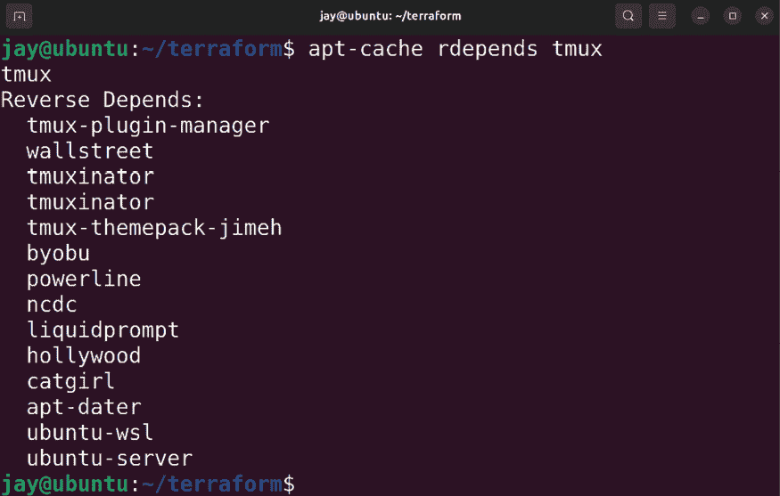
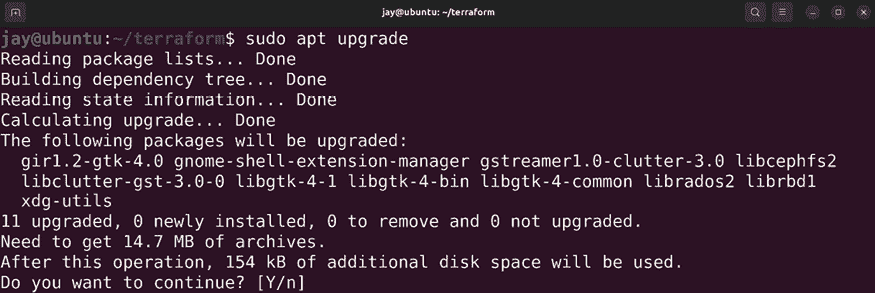

# 21

# 保护你的服务器

每个月似乎都会有关于公司服务器被攻破的新报道。在一些情况下，整个数据库最终会在互联网上公开，这可能包括敏感的用户信息，帮助不法分子窃取身份。Linux 是一个非常安全的平台，但它的安全性取决于管理员的设置。安全补丁会定期发布，但只有在安装后才有价值。OpenSSH 是远程管理必不可少的工具，但它也是威胁者试图攻入服务器的热门目标。备份是必不可少的，但如果不定期测试或它们落入错误的人手中，备份可能毫无用处。在某些情况下，甚至是你的员工也可能造成有意或无意的损害。在本章中，我们将探讨一些保护服务器免受威胁的方法。

在本章中，我们将覆盖：

+   降低攻击面

+   理解并响应**常见漏洞和暴露**（**CVE**）

+   安装安全更新

+   使用 Canonical Livepatch 服务自动安装补丁

+   加固 OpenSSH

+   安装和配置 Fail2ban

+   MariaDB 最佳实践：确保数据库服务器安全

+   设置防火墙

+   使用**Linux 统一密钥设置**（**LUKS**）加密和解密磁盘

+   锁定 sudo

首先，让我们讨论一下如何降低攻击面。

# 降低攻击面

你的 Ubuntu 服务器安装上很可能会运行一个或多个重要的应用程序，其中一些可能对外部互联网开放。例如，Web 服务器非常常见，因为 Web 服务器的主要目标就是提供一个用户可以访问的网站。

任何可以从你组织外部访问的应用程序，都是威胁者可能利用的入侵点。服务器的**攻击面**本质上是所有潜在可利用项目的列表。在安全方面，了解哪些应用程序必须远程访问，哪些应用程序可以被锁定非常重要。每一个你锁定的应用程序都会降低它被外部威胁控制的可能性。锁定这些东西的过程就是我们所说的降低攻击面。

理想情况下，在一个完美的世界里，我们会禁止所有外部连接到我们的所有服务器。威胁行为者无法侵入完全不可从外部访问的服务器。这并不意味着没有任何威胁，因不满的员工总是潜在的风险。但一个完全无法访问的服务器是最安全的。然而，完全禁止所有外部连接通常是不可行的。如果你的公司提供一个流行的公共网站，那么它必须对外开放。然而，如果你在服务器上运行的应用仅供内部用户使用，那么如果可能的话，你应该将其锁定。尽可能地，最好实施一种策略，即除非有业务需要，否则外部连接默认总是被禁止。

我们所说的“禁止”是什么意思？你可以通过多种方式禁止外部访问你服务器上的应用程序。最有效的方法是完全卸载该应用。如果根本没有安装应用程序，它就不可能成为问题。可能不用说，你应该卸载那些不必要的应用，但运行服务器的核心目的是为用户提供资源，因此你总会在服务器上运行一些应用程序（否则根本就没有必要搭建服务器）。除了移除应用程序，你还可以利用防火墙来仅允许特定的连接。实际上，我们将在本章后面讨论如何设置防火墙。

最重要的是，在新服务器部署后，管理员应该始终进行安全检查，确保它的安全性达到最佳状态。没有管理员能够想到所有的安全细节，即使是我们中最优秀的也可能犯错，但我们始终应该尽最大努力确保服务器的安全。确保服务器安全的方式有很多，但首先要做的是降低攻击面。这意味着你应该尽可能关闭漏洞，限制外部人员可能访问的内容。简而言之，如果某个服务不需要外部访问，就把它锁定。如果根本不需要，就直接移除它。

要开始检查你的攻击面，首先要做的是查看哪些端口正在监听网络连接。当攻击者试图侵入你的服务器时，他们几乎肯定会先进行端口扫描。他们会列出哪些端口在监听连接，确定哪些应用程序在这些端口上监听，然后尝试已知的漏洞列表来获得访问权限。要检查哪些端口正在你的服务器上监听，你可以使用`ss`命令进行简单的端口查询：

```
sudo ss -tulpn 
```

`sudo`命令部分是可选的，但如果你包括了`sudo`，你将在输出中看到更多的信息。通常我会在这里包含一张截图，但信息太多，无法适应这一页面。从输出中，你将看到一个监听连接的端口列表。如果端口监听在`0.0.0.0`上，那么它正在监听来自任何网络的连接。

这可能是个坏消息。如果端口监听在`127.0.0.1`上，那么它实际上并未接受外部连接。花点时间用`ss`命令检查你的其中一台服务器，看看哪些服务正在监听外部连接。

了解了你的服务器正在监听哪些端口后，你可以决定如何处理每个端口。有些端口可能是必需的，因为服务器的整体目的是提供服务，而这通常意味着通过网络进行通信。所有这些合法端口应该以某种方式得到保护，这通常意味着在查看相关文档并遵循最佳实践（取决于特定服务）后配置该服务，或者启用防火墙，这将在*设置防火墙*部分中讨论。如果有任何端口不再需要，你应该关闭它们。你可以停止其守护进程并禁用它，或者直接移除相应的包。我通常选择后者，因为如果我改变主意，只需要重新安装该包即可。

OpenSSH 是你几乎总会在服务器上运行的服务。正如你已经非常清楚的，它是一个远程管理的好工具。但尽管它非常有用，它通常会成为任何攻击者试图侵入服务器时的首要目标。

我们不希望删除这个服务，因为这是我们希望利用的功能。我们该怎么办呢？别担心，我将在本章稍后专门讲解如何加固 OpenSSH。我现在提到这一点是为了确保你意识到，降低攻击面绝对需要对 OpenSSH 进行至少基本的安全调整。此外，我还会在本章中介绍 Fail2ban，它可以帮助为 OpenSSH 增加额外的安全层。

正如我之前提到的，我非常支持删除不需要的软件包。你安装的软件包越多，你的攻击面就越大。移除任何不绝对必要的东西是很重要的。即使某个软件包没有列为开放端口，它仍然可能在**漏洞链**中被利用。如果攻击者使用漏洞链，那意味着他们首先攻破一个服务，然后利用另一个（可能不相关）软件包中的漏洞来提升他们的权限并试图获得完全访问权限。因此，我必须强调，你应该删除服务器上不需要的任何软件包。获取所有已安装软件包列表的一个简单方法是使用以下命令：

```
dpkg --get-selections > installed_packages.txt 
```

该命令将生成一个文本文件，文件中包含你在服务器上安装的所有软件包的列表。花点时间查看它。有任何你确定不需要的东西突出显示吗？你很可能不知道每个软件包的用途，可能有数百个或更多。文本文件中包含的许多软件包是分发所必需的，如果你希望服务器在下次重新启动时能够启动，这些软件包是不能移除的。如果你不确定某个软件包是否可以删除，可以在 Google 上做些研究。如果仍然不确定，也许你应该保持这个软件包不变，转而检查其他的软件包。通过在服务器上进行这样的操作，你或许永远也记不住每个软件包和库的具体用途，但你仍然能找到一些可以清理的东西。最终，你会得出一份典型的软件包列表，大部分服务器都不需要这些软件包，你可以确保在每次设置新服务器时删除它们。你甚至可以整理一份不需要的软件包列表，然后创建一个 Ansible playbook 来确保它们不会被安装。

在尝试清理不需要的软件包时，一个有用的技巧是使用以下命令检查是否有其他软件包依赖于你想要移除的软件包：

```
apt-cache rdepends <package-name> 
```

例如，我在一个测试服务器上运行了针对`tmux`软件包的命令，但你可以使用任何你喜欢的软件包名称作为参数来检查是否有其他软件包依赖于它：

```
apt-cache rdepends tmux 
```

我在我的终端上收到的输出如下：



图 21.1：在 Ubuntu 服务器上更新软件包

使用前一个命令的输出，你可以轻松识别是否有其他软件包依赖于你想要删除的软件包。在示例输出中，我们可以看到`tmux`实际上是作为`ubuntu-server`软件包的依赖项被安装的。这意味着`tmux`很可能是默认安装在你的服务器上的，但这可能会根据你是否自己安装了 Ubuntu Server 或是否使用了云镜像而有所不同。云服务提供商并不总是以相同的方式配置 Ubuntu Server 镜像。但至少，你可以识别出依赖关系，并做出是否可以安全删除软件包的更明智决定。

即使输出显示某个软件包没有依赖关系，除非你理解它提供的功能以及删除该软件包可能对系统产生的影响，否则你仍然不应删除它。你可以随时通过 Google 搜索软件包名称来获取更多详细信息，但至少你应该查看开放的端口，并优先关注这些端口，因为开放端口对服务器的安全性影响更大。我们将在本章稍后的*设置防火墙*部分更详细地讨论这个问题。

另一个重要的考虑因素是确保只使用强密码。这点可能不言而喻，因为我相信你已经理解了强密码的重要性。然而，最近我看到一些黑客攻击事件是由于管理员为他们面向外部的数据库或 Web 控制台设置了弱密码，因此你永远无法预料。最重要的规则是，如果必须有一个服务监听外部连接，那么该服务的密码必须是强密码，并且最好是随机生成的。当然，某些守护进程并没有与之关联的密码（例如 Apache；它不需要身份验证就能让某人查看`80`端口上的网页）。然而，如果某个守护进程确实需要身份验证，它的密码应该非常强大。OpenSSH 就是一个例子。如果你必须允许外部访问 OpenSSH，那么该用户账户的密码应该是一个强大且随机生成的密码。否则，它很可能会在几周内被大量自动扫描的机器人接管。实际上，最好完全禁用 OpenSSH 中的密码验证，这一点我们将在本章稍后讲解。禁用密码验证会大大增强 OpenSSH 的安全性。

最后，重要的是对所有用户账户采用**最小权限原则**。你可能已经从书中提到的多个方面感受到我对用户的怀疑。虽然我总是希望对每个人持最好的看法，但有时最大的威胁往往来自内部（如不满的员工、意外删除关键文件等）。因此，尽可能地限制用户账户的权限，只允许他们访问执行工作所需的资源。这可能包括但不限于：

+   将用户添加到最少的组中

+   默认将所有网络共享设置为只读（用户不能删除他们没有权限删除的文件）

+   定期审计所有服务器，检查是否有用户账户长时间未登录

+   为用户账户设置到期时间，并要求用户重新申请以维持账户状态（这可以防止账户长期闲置）

+   允许用户账户访问尽可能少的系统目录（如果可能，最好是没有访问权限）

+   限制`sudo`命令仅对特定命令有效（稍后在本章中会详细讲解）

最重要的是，确保记录下你为提高服务器安全性所做的每一项更改。在你列出一份清单后，可以将其转化为一个安全检查清单，作为加固服务器的基准。然后，你可以设置提醒，定期扫描服务器是否存在未使用的用户账户、不必要的组成员身份或新开放的端口。

现在，你应该已经有了一些降低攻击面的方法。同时，了解与安全漏洞相关的最新趋势和通告也很重要。在接下来的部分中，我们将讨论**常见漏洞与暴露**（**CVE**），它将帮助你更好地理解现实中威胁的性质。

# 理解并应对 CVE

我已经提到了一些可以用来保护服务器免受常见威胁的措施，稍后在本章中我还会提供更多建议。但是，如何知道何时有漏洞需要修补？如何判断何时需要采取行动？我在本章中提到的最佳实践虽然有效，但总有一天，可能会遇到一些超出生成强密码或锁定端口的安全问题。

最重要的是保持关注新闻。订阅一些报告安全漏洞的站点，稍后我还会将这些站点列在本章的*进一步阅读*部分。当安全漏洞被公开时，通常会在这些站点报道，并分配 CVE 编号，安全研究人员会记录他们的发现。

CVE（公共漏洞和暴露）可以在专门的在线目录中找到，这些目录详细列出了安全漏洞及其相关信息。实际上，许多 Linux 发行版（包括 Ubuntu）都维护着自己的 CVE 目录，列出了特定于其平台的漏洞。在这样的页面上，你可以看到你的发行版版本易受哪些 CVE 的影响，哪些已得到响应，以及为了应对这些漏洞需要安装哪些更新。

通常，当发现安全漏洞时，CVE 标识符会立即分配给该漏洞，即使还没有确定解决方法。在我的情况下，每当发现一个漏洞时，我通常会关注这个 CVE 页面，等待该页面更新，并提供解决该漏洞的方法。

通常，修补漏洞需要安装安全更新，这些更新由 Ubuntu 的安全团队创建，用于解决漏洞。在某些情况下，新的更新可能需要重新启动服务器，或者至少需要重新启动某些正在运行的服务，这意味着我可能需要等待一个维护窗口来执行修复。

我推荐查看 Ubuntu CVE 跟踪器，网址为 [`ubuntu.com/security/cves`](https://ubuntu.com/security/cves)。在这个网站上，Canonical（Ubuntu 的开发商）会更新与 Ubuntu 平台相关的 CVE 信息。在那里，你可以找到已知的漏洞列表以及解决这些漏洞所需的步骤。没有一种固定的规则来保护你的服务器，但关注 CVE 是一个很好的起点。在接下来的章节中，我们将讨论安装安全更新，这是最常见的修复方法。

# 安装安全更新

既然我提到过多次更新包，我们来正式讨论一下这个话题。Ubuntu 会非常频繁地发布更新包，有时甚至是每天都会发布。这些更新主要包括最新的安全更新，但也可能包括新功能。由于 Ubuntu 22.04 是 LTS 版本，安全更新比功能更新更为常见。

在你的服务器上安装最新的更新是一项非常重要的实践，但遗憾的是，由于各种原因，并不是所有管理员都能够做到这一点。

安装后，安全更新通常不会对服务器进行太多更改，除非是帮助保持服务器抵御最新威胁的安全性。然而，安全更新有时也可能导致其他功能出现问题，尽管这种情况比较罕见，但我也见过这种情况发生。对于生产服务器而言，保持更新通常是很困难的，因为在负责公司大部分利润的服务器上进行任何更改都可能对公司造成灾难性后果。如果服务器宕机，可能会非常昂贵。但另一方面，如果你的服务器被攻破，而你的公司成为 CNN 黑客新闻的焦点，你肯定会后悔没有及时保持软件包更新！

一个快乐的数据中心的关键是，在安装任何更新之前先进行测试。许多管理员会设立一个系统，使得更新会从一个环境逐步*升级*到下一个环境。例如，有些管理员可能会创建他们生产服务器的虚拟克隆，更新它们，然后观察是否会出现任何故障。如果没有任何问题，那么这些更新就会被允许在生产服务器上安装。

在集群环境中，管理员可能只更新一个生产服务器，看看它受到了怎样的影响，然后安排时间更新其他服务器。在工作站的情况下，我见过一些策略，先选择特定用户进行安全更新，然后再将这些更新推送到其他用户群体中。我并不一定建议你把用户当作实验品，但每个组织都是不同的，找到合适的更新安装平衡非常重要。尽管这些更新代表着变更，但 Ubuntu 开发者之所以愿意进行这些麻烦的工作，还是有原因的。这些更新修复了很多问题，其中一些是安全问题，而这些问题已经在你阅读本文时被恶意利用。

要开始安装安全更新，第一步是更新本地的存储库索引。如前所述，执行的命令是 `sudo apt update`。这会指示你的服务器检查所有已订阅的存储库，看是否有新增的包，或有过时的包被移除。然后，你可以开始实际的更新过程。

有两个命令可以用来更新包。你可以运行 `sudo apt upgrade` 或 `sudo apt dist-upgrade`。

不同之处在于，运行 `apt upgrade` 命令不会移除任何包，且它是最安全的使用方式。然而，这个命令也不会拉取任何新的依赖包。基本上，`apt upgrade` 命令只是更新已经安装在你服务器上的任何包，而不会添加或移除任何内容。由于这个命令不会安装任何新东西，也就意味着你的服务器将不会安装更新的内核。

`apt dist-upgrade` 命令会更新所有可用的软件包。它会确保服务器上的所有软件包都被更新，即使这意味着需要安装一个之前不需要的新的依赖包。如果为了满足依赖关系需要移除某个包，它也会这样做。如果有更新的内核可用，它也会被安装。如果你使用这个命令，执行前请先花点时间查看提议的变更，这样在执行过程中你可以确认这些变更。

一般来说，`dist-upgrade`变体应该代表你的最终目标，但这不一定是你应该开始的地方。更新内核很重要，因为你发行版的内核会像其他包一样接收安全更新。所有的包最终都应该更新，即使这意味着某些包会被移除，因为它们不再需要，或者会安装一些新的包。

当你开始更新过程时，它将看起来像下面这样：



图 21.2：在 Ubuntu 服务器上更新包

在更新过程正式开始之前，你将获得一个它想要执行操作的概述。在我的情况下，它想要升级`11`个包。如果你输入`Y`然后按*Enter*，更新过程将开始。此时，我需要保持终端窗口打开；在更新过程中关闭它是危险的。在包管理任务中途关闭终端窗口可能会导致包损坏或部分安装。

假设这个过程成功完成，我们可以运行`apt dist-upgrade`命令来更新剩余部分——特别是那些由于安装新包或移除现有包而被暂时保留的包。在我的情况下没有这类包，但在这种情况下，你可能会看到一些文本，表示某些升级被保留，这在`apt upgrade`中是正常的。此时，你将运行`sudo apt dist-upgrade`来安装第一个命令未能安装的剩余更新。

关于更新内核，这个过程值得进一步讨论。有些发行版在更新内核时非常冒险。例如，Arch Linux 就是这样，任何时候只有一个内核被安装。因此，当这个内核更新时，你真的需要重启机器，这样它才能正确使用这个内核（有时，当你安装新内核后有待重启时，系统的某些组件可能会遇到问题）。

另一方面，Ubuntu 在处理内核升级方面非常高效。当你在 Ubuntu 中更新内核时，它不会替换你当前正在运行的内核。相反，它会将更新后的内核与现有的内核一起安装。

实际上，这些内核会继续堆叠，新的内核安装时，旧的内核不会被移除。当新的 Ubuntu 内核版本被安装时，GNU GRUB 引导加载程序会自动更新，以便在你下次重启时启动新的内核。

在你重启之前，你可以继续使用当前的内核，直到你需要为止，而且应该不会察觉到任何区别。唯一的区别是，在你重启之前，你没有利用新内核的额外安全补丁，你可以在下次维护窗口期间进行重启。这个更新方法之所以很棒，是因为如果遇到新内核无法启动或出现某些问题的情况，你可以在启动过程中按*Esc*键，这时你将能够浏览你所有已安装的内核列表。通过这个列表，你可以选择使用之前的（已知且可用的）内核，继续像更新内核之前一样使用服务器。这是一个非常有价值的安全保障！

在你更新完服务器上的软件包后，你可能希望重新启动服务，以便利用新的安全更新。对于内核更新，你需要重启整个服务器才能利用新的内核更新，但其他更新则不需要重启。相反，如果你重启相关服务，通常就可以了（如果更新本身没有触发服务的重启）。例如，如果你的 DNS 服务（`bind9`）被更新，你只需要执行以下命令来重启服务：

```
sudo systemctl restart bind9 
```

除了保持软件包更新外，了解如何在发生故障时回滚更新的软件包也同样重要。你可以通过手动重新安装旧版本的软件包来从这种情况中恢复。以前下载的软件包存储在以下目录中：

```
/var/cache/apt/archives 
```

在那里，你应该能够找到作为更新过程一部分下载的实际软件包。如果你需要将更新的软件包恢复到先前安装的版本，可以使用`dpkg`命令手动安装该软件包。一般来说，语法类似于以下内容：

```
sudo dpkg -i /path/to/package.deb 
```

更准确地说，你可以使用如下命令重新安装之前下载的软件包，以较旧的 Linux 内核为例：

```
sudo dpkg -i /var/cache/apt/archives/linux-image-5.15.0-30-generic_5.15.0-30.31_amd64.deb 
```

然而，使用`dpkg`命令时，依赖关系不会自动处理，因此如果缺少目标软件包所需的依赖软件包，软件包仍然会被安装，但会有未解决的依赖关系需要修复。你可以尝试使用`apt`来解决这个问题：

```
sudo apt -f install 
```

`apt -f install`命令将尝试修复已安装的软件包，寻找缺失的软件包（但已安装的软件包需要的），并提供安装缺失依赖的选项。如果无法找到缺失的依赖，它会提供删除依赖缺失的软件包的选项，前提是无法通过其他方式解决问题。

好了，事情就是这样。此时，你应该已经不仅仅能够安装软件包，而且能够保持它们的更新。Ubuntu 中还有一个功能，你可以利用它来享受**实时补丁**的概念，从而自动修补服务器的内核。接下来，我们将在下一节中讨论这个内容。

# 使用 Canonical Livepatch 服务自动安装补丁

在前一节中，我提到过，如果你的更新包括内核更新，你将需要重启服务器才能使新的内核生效。虽然这通常是正确的，但 Canonical 为 Ubuntu 提供了一项**Livepatch**服务，使得更新可以在不重启的情况下进行并应用。这是一个游戏规则的改变，因为它能够在你不做任何事情（甚至不需要重启）的情况下，保持正在运行的内核得到修补。这对安全性是一个巨大的好处，因为它让你在不需要立即安排服务器重启的情况下，享受到最新的安全补丁。

然而，这项服务并不是免费的，默认情况下也不包含在 Ubuntu 中。尽管如此，你可以在不付费的情况下，在三台服务器上安装 Livepatch 服务，所以它仍然是你可能想要考虑的东西。如果你愿意，你甚至可以在 Ubuntu 的桌面版上使用这项服务。由于你可以在三台服务器上免费使用这项服务，我认为没有理由不在你的最关键资源上也受益于此。

尽管你通常不需要重启服务器就能利用 Livepatch 服务的补丁，但根据漏洞的性质，可能会有一些例外情况。过去曾有一些漏洞需要复杂的变更，甚至订阅了这项服务的服务器也需要重启。不过，这种情况是例外，而不是常规。大多数时候，如果你在使用 Livepatch，重启根本不是你需要担心的事情。大多数情况下，你的服务器会将所有补丁应用并直接插入到正在运行的内核中，这是非常棒的。

需要注意的一点是，这并不意味着你不需要通过`apt`安装更新。实时补丁直接插入内核，但它们并不是永久性的。你仍然需要定期通过常规方式安装所有的软件包更新。至少，实时补丁可以让你在重启时不那么着急。如果一个漏洞在星期一被揭露，但你直到星期天才能重启服务器，那也没什么大问题。

由于 Livepatch 服务需要订阅，你需要创建一个账户才能开始使用它。你可以在[`auth.livepatch.canonical.com/`](https://auth.livepatch.canonical.com/)开始这个过程。

这个过程将要求你创建一个 Ubuntu One 账户 ([`login.ubuntu.com/`](https://login.ubuntu.com/))，这是 Canonical 的集中登录系统。你需要输入电子邮件地址，选择密码，然后在过程结束时，你将获得一个用于 Livepatch 服务的令牌，它将是一个随机字符的字符串。

现在你有了一个令牌，你可以选择最重要的三台服务器。在每台服务器上，你可以运行以下命令来开始使用：

```
sudo snap install canonical-livepatch
sudo canonical-livepatch enable <token> 
```

相信与否，这就是全部内容。考虑到 Livepatch 服务的强大，你可能会以为它的设置过程很复杂。最耗时的部分是注册一个新账户，实际上只需要两个命令就能在服务器上设置这个服务。你可以通过以下命令检查 Livepatch 的状态：

```
sudo canonical-livepatch status 
```

根据你所在组织的预算，你可能会决定支付费用来使用此服务，这样你就能在三台以上的服务器上受益。这个选择绝对值得考虑。如果你决定选择这个选项，需要联系 Canonical 了解更多的支持信息。

目前，我们应该换个思路，讨论一些可以改进 OpenSSH 安全性的方法。我在本章中提到过几次，OpenSSH 是外部威胁行为者的常见攻击目标，因此在下一节中，我们将仔细审视这一点。

# 安全加固 OpenSSH

OpenSSH 是一个非常有用的工具，它使我们可以像坐在控制台前一样，从远程位置配置服务器。在云资源的情况下，通常这是访问我们服务器的唯一方式。考虑到 OpenSSH 本身的性质（远程管理），它成为了那些寻求制造麻烦的不法分子非常有吸引力的目标。如果我们只是将 OpenSSH 放任不管，它这个有用的工具可能会变成我们的噩梦。

幸运的是，配置 OpenSSH 本身是非常简单的。然而，大量的配置选项可能会让没有多少经验的人感到困惑。虽然查看 OpenSSH 的文档是一个好主意，但在本节中，我们将先来看看你需要重点关注的一些常见配置选项。

OpenSSH 的配置文件位于 `/etc/ssh/sshd_config`，我们在 *第十章*，*连接到网络* 中提到过。这个文件就是我们本节要重点讨论的文件，因为我要给你的一些配置选项都需要放入这个文件中。

在本节中的每一个调整步骤，确保你首先浏览该文件，查看设置是否已经存在并做出相应的更改。如果文件中没有该设置，请添加它。修改完成后，重启 OpenSSH 守护进程非常重要：

```
sudo systemctl restart ssh 
```

继续并在编辑器中打开此文件，我们将进行一些调整。

一个非常简单的调整是改变 OpenSSH 监听的端口号，默认是端口`22`。由于这是黑客首先尝试的端口，改变它是有道理的，而且这是一个非常容易的修改。不过，我不希望你认为仅仅因为你更改了 OpenSSH 的端口，它就神奇地被隐藏了并且无法被检测到。一个持续的威胁者仍然能够通过对你的服务器进行端口扫描来找到这个端口。然而，既然这个修改如此简单，为什么不做呢？要更改它，只需在`/etc/ssh/sshd_config`文件中查找端口号，并将其从默认的`22`更改：

```
Port 65332 
```

我能想到的唯一缺点是更改 SSH 端口后，你需要记得在使用 SSH 时指定端口号，并且必须将更改通知任何使用该服务器的人。要指定端口，我们使用`ssh`命令中的`-p`选项：

```
ssh -p 65332 myhost 
```

如果你使用的是`scp`，你需要改用大写的`P`：

```
scp -P 65332 myfile myserver:/path/to/dir 
```

尽管更改端口号不会让你的服务器成为万无一失的堡垒，但我们不应低估这么做的价值。在一个假设的例子中，假如攻击者正在扫描互联网上的服务器寻找开放的`22`端口，他们可能会跳过你的服务器，继续扫描下一个。只有那些有决心的攻击者，专门想要入侵你的服务器，才会扫描其他端口来寻找它。这也能保持你的日志文件干净；你只会看到那些进行积极端口扫描的恶意行为，而不是那些随机的机器人寻找开放端口。

如果你的服务器面向互联网，这将导致日志中出现的条目大大减少！OpenSSH 会在授权日志中记录连接尝试，日志位置是`/var/log/auth.log`。你可以随时查看该日志文件，了解典型的日志记录内容。

另一个值得提到的更改是 OpenSSH 监听的协议。大多数今天在仓库中提供的 OpenSSH 版本默认使用协议 2。这就是你想要的。协议 2 比协议 1 安全得多。你绝不应该在生产环境中允许使用协议 1。除非你出于某种原因更改了它，否则你很可能已经在服务器上使用了协议 2 的默认设置。我在这里提到它是以防你仍在使用较老的服务器，它们默认使用旧协议。如今，任何现代版本的 Linux 发行版中的 OpenSSH 都始终使用协议 2。如果你确实有使用协议 1 的旧服务器，你可以通过在`/etc/ssh/sshd_config`文件中找到以下行进行调整：

```
Protocol 1 
```

将 OpenSSH 切换到使用协议 2 只需将该行中的`1`改为`2`，然后重启 OpenSSH 服务器：

```
sudo systemctl restart ssh 
```

接下来，我将为您提供两个调整选项，价格只需一个。有两个设置涉及允许哪些用户和组通过 SSH 登录：`AllowUsers`和`AllowGroups`，分别是。默认情况下，您创建的每个用户都可以通过 SSH 登录到您的服务器。关于`root`，默认情况下实际上是不允许的（稍后详细介绍）。但是您创建的每个用户都被允许进入。但是，只有必须访问的用户才能进入。有两种方法可以实现这一点。

一种选项是使用`AllowUsers`。使用`AllowUsers`选项，您可以明确设置哪些用户可以登录到您的服务器上。有了`AllowUsers`存在（默认情况下在`config`文件中找不到），您的服务器将不允许任何未经特别指定的用户使用 SSH。您可以用空格分隔每个用户：

```
AllowUsers larry moe curly 
```

就个人而言，我发现`AllowGroups`更易于管理。它与`AllowUsers`基本相同，但与组一起使用。如果存在，它将限制 OpenSSH 连接到属于此组的用户。要使用它，您首先需要创建相关的组（您可以按照自己的逻辑命名）：

```
sudo groupadd sshusers 
```

然后，您将使一个或多个用户成为该组的成员：

```
sudo usermod -aG sshusers myuser 
```

一旦您添加了该组并使一个或两个用户成为该组的成员，请添加以下内容到您的`/etc/ssh/sshd_config`文件，用您的示例组替换：

```
AllowGroups admins sshusers gremlins 
```

只使用一个组也是可以的。只需确保在注销前将自己添加到组中；否则，您将被锁定。我建议您只使用`AllowUsers`或`AllowGroups`中的一个。我认为使用`AllowGroups`更容易，因为您将永远不需要再次触及`sshd_config`文件；您只需将用户帐户添加或删除到组中以控制访问。只要您知道，`AllowUsers`将覆盖`AllowGroups`。

另一个重要选项是`PermitRootLogin`，它控制`root`用户帐户是否能够建立 SSH 连接。这应该始终设置为`no`。通常情况下，默认设置为`prohibit-password`，这意味着`root`可以使用密钥认证，但不接受密码。我也不认为有任何理由这样做。在我看来，您应该关闭此功能。使`root`能够通过网络连接登录到您的服务器绝不是一个好主意。这始终是攻击者尝试使用的第一个用户帐户：

```
PermitRootLogin no 
```

在 SSH 的*no-root*规则中有一个例外情况。一些云服务器提供商，例如 Linode，默认情况下可能要求您以`root`身份登录。这并不是很典型，但有些提供商是这样设置的。在这种情况下，我建议创建一个具有`sudo`访问权限的常规用户，然后禁止`root`登录。

我的下一个建议虽然设置起来不容易，但绝对值得。默认情况下，OpenSSH 允许用户通过密码进行身份验证。这是我在所有服务器上第一个禁用的功能。允许用户通过密码建立连接意味着攻击者也能暴力破解你的服务器。如果不允许密码认证，他们就无法这么做。问题是，在禁用 SSH 密码认证之前，你首先需要配置并测试一种备用的身份验证方式，通常是公钥认证。这是我们在*第十章*《连接到网络》中讲解过的内容。基本上，你可以在本地工作站生成一对 SSH 密钥，并将该密钥添加到服务器上的 `authorized_keys` 文件中，这样就可以无需密码登录。再说一遍，如果你还没做过，参考*第十章*《连接到网络》。

如果你禁用 OpenSSH 的密码认证，那么公钥认证将是唯一的登录方式。如果有人尝试连接到你的服务器而没有合适的密钥，服务器将立即拒绝其访问。如果启用了密码认证并且你有密钥关系，那么如果用户的密钥没有安装，服务器将会要求他们输入密码。在我看来，在你设置好公钥加密方式的访问后，应当禁用密码认证（但一定要先进行测试）：

```
PasswordAuthentication no 
```

就这些——这些是我推荐的最有效的 OpenSSH 安全性调整。虽然还有更多的措施可以采取，但这些设置是你最能从中受益的。在接下来的部分，我们将增加一个额外的安全层，那就是 Fail2ban。通过 Fail2ban 保护 OpenSSH，加上我在本节中提到的这些调整，攻击者将很难攻破你的服务器。为了方便你，这里列出了我在本节中提到的所有 OpenSSH 配置选项：

```
Port 65332 
Protocol 2 
AllowUsers larry moe curly 
AllowGroups admins sshusers gremlins 
PermitRootLogin no 
PasswordAuthentication no 
```

随着 OpenSSH 安全性得到了进一步增强，我们现在在服务器安全性方面应该更加有信心了。然而，我们每进行一次安全改进或调整，所带来的保护也只是有限的。保护措施越多，安全性就越强。在接下来的部分，我们将介绍 Fail2ban，它能够大大增强服务器的安全性。

# 安装和配置 Fail2ban

Fail2ban，我爱你！**Fail2ban** 是那种一旦我了解到它有多么有价值，就会觉得怎么之前没有使用它的工具。Fail2ban 能够监视你的日志文件，查找认证失败的记录。你可以设置允许来自任何特定 IP 地址的失败次数，如果失败次数超过了允许的数量，Fail2ban 会屏蔽该 IP 地址。它具有高度的可配置性，能够增强服务器的安全性。

安装和配置 Fail2ban 相对来说是比较简单的。首先，安装其软件包：

```
sudo apt install fail2ban 
```

安装后，`fail2ban`守护进程将启动，并配置为在启动时自动启动。配置`fail2ban`只是创建一个配置文件的过程。但这是 Fail2ban 的一个有趣之处：你不应使用其默认的`config`文件。默认文件是`/etc/fail2ban/jail.conf`。这个文件的问题在于，当你安装安全更新时，如果这些安全更新包括 Fail2ban 本身，它可能会被覆盖。为了解决这个问题，Fail2ban 还会读取`/etc/fail2ban/jail.local`文件（如果存在）。它永远不会替换这个文件，并且`jail.local`文件的存在将优先于`jail.conf`文件。最简单的方式是复制`jail.conf`文件并将其保存为`jail.local`：

```
sudo cp /etc/fail2ban/jail.conf /etc/fail2ban/jail.local 
```

接下来，我将讲解一些你应该配置的非常重要的设置，所以请在文本编辑器中打开你刚才复制的`/etc/fail2ban/jail.local`文件。第一个需要更改的配置项位于第 92 行左右，并且被注释掉了：

```
#ignoreip = 127.0.0.1/8 ::1 
```

首先，取消注释。然后，你应该添加你不希望被 Fail2ban 封锁的其他网络。基本上，这可以帮助你避免在不小心触发 Fail2ban 时被锁定。Fail2ban 是无情的；它会封锁符合其封锁标准的任何服务，而且它不会犹豫。这包括封锁你自己。为了解决这个问题，将公司网络以及任何你不希望被封锁的 IP 地址添加到此处。确保保留`localhost` IP 不变：

```
Ignoreip = 127.0.0.1/8 ::1 192.168.1.0/24 192.168.1.245/24 
```

在这个示例中，我添加了`192.168.1.0/24`网络，以及单个 IP 地址`192.168.1.245/24`。将你的网络添加到这一行中，*确保你不会把自己锁定在外面*。

接下来，第 101 行包含`bantime`选项。这个选项决定了当 Fail2ban 封锁主机时，主机会被封锁多少秒。此选项默认值为`10m`，即 10 分钟：

```
bantime  = 10m 
```

将这个数字更改为你认为合理的任何值，或者保持其默认值，这也是可以的。如果主机被封锁，它将被封锁这个特定的分钟数，然后最终将被允许再次访问。

接下来，我们来看`maxretry`设置：

```
maxretry = 5 
```

这是指定 Fail2ban 采取行动之前需要发生的失败次数。如果它监视的服务达到这里设置的次数，就结束了！该 IP 将被封锁，持续时间为`bantime`选项中设置的分钟数。

如果你认为`5`次失败不合理，你可以更改这个设置。我建议将其设置为`7`，对于那些在你的网络上坚持认为自己输入了正确密码，但一直输入相同（错误）密码的用户。希望他们能在第七次尝试之前意识到自己的错误，避免需要打电话给技术支持。

跳到大约第 272 行左右，我们看到了`Jails`部分。从这里开始，`config`文件将列出几个可以配置的监狱，这基本上是 Fail2ban 需要关注的对象。第一个是`[sshd]`，它配置了 OpenSSH 守护进程的保护。在`[sshd]`下，查找以下选项：

```
port    = ssh 
```

`port`等于`ssh`基本上意味着它默认使用端口`22`。如果你更改了 SSH 端口，请修改此设置以反映新的端口号。这里有两个类似的地方，一个在`[sshd]`下，另一个在`[sshd-ddos]`下：

```
port    = 65332 
```

在我们继续之前，我要强调的是，我们每次修改配置后，都应该测试 Fail2ban 是否正常工作。为此，重启 Fail2ban，然后检查它的状态：

```
sudo systemctl restart fail2ban
sudo systemctl status -l fail2ban 
```

状态应始终为`active (running)`。如果是其他任何状态（比如`failed`），则表示 Fail2ban 不喜欢你的配置中的某些内容。通常，这意味着 Fail2ban 的状态将显示它已经退出。因此，在整个过程中，确保在每次修改后重启 Fail2ban，并确保它没有报错。`status`命令将显示 Fail2ban 日志文件中的内容，方便你查看。

重启 Fail2ban 后，另一个有用的命令是：

```
sudo fail2ban-client status 
```

该命令的输出将显示你已启用的所有监狱。如果你在`config`文件中启用了一个新的监狱，你应该能在该命令的输出中看到它。

那么，如何启用一个监狱呢？默认情况下，所有监狱都被禁用，只有 OpenSSH 的监狱是启用的。要启用一个监狱，请在`/etc/fail2ban/jail.local`文件中的`config`块内加入以下内容：

```
enabled = true 
```

如果你想启用`apache-auth`监狱，找到其部分，并在其段落下方添加`enabled = true`。例如，在你添加`enabled`行后，`apache-auth`将如下所示：

```
[apache-auth] 
enabled = true 
port     = http,https 
logpath  = %(apache_error_log) 
```

在这个示例中，`enabled = true`这一部分在默认文件中并不存在。我添加了它。现在我已经启用了一个新的监狱，我们应该重启`fail2ban`：

```
sudo systemctl restart fail2ban 
```

接下来，检查其状态，确保它在启动时没有出错：

```
sudo systemctl status -l fail2ban 
```

假设一切顺利，我们应该能在以下命令的输出中看到新监狱：

```
sudo fail2ban-client status 
```

在我的测试服务器上，启用`apache-auth`后，输出结果如下：

```
Status
|- Number of jail: 2
  '- Jail list:    apache-auth, sshd 
```

如果你为未安装的服务启用了一个监狱，Fail2ban 可能无法启动。在我的示例中，我在启用`apache2`监狱之前，确实在服务器上安装了`apache2`。如果没有安装，Fail2ban 可能会退出并抱怨找不到 Apache 的日志文件。这也是我建议在启用任何监狱后测试 Fail2ban 的原因。如果 Fail2ban 发现它不喜欢某个配置，或者它所需的某些文件缺失，它可能会停止工作。然后，它就无法为你提供保护了，这可不好。

Fail2ban 的基本操作顺序是浏览监狱的`config`文件，查看哪些监狱可能对你有帮助。如果你的服务器上运行着一个守护进程，那么有可能有一个监狱是专门为它设计的。如果有，启用它并查看 Fail2ban 是否能够正常启动。如果没有问题，那就很好。如果它无法正常重启，检查状态输出，看看它在抱怨什么。

你可能需要做的一件事是将`enabled = true`这一行添加到`[sshd]`和`[sshd-ddos]`中。没错，`[sshd]`的监狱默认已经启用，但由于它在`config`文件中并没有特别标明，所以我对此不太信任。因此，你最好还是添加一个`enabled`行来确保安全。你可能还会从其他一些监狱中受益。如果你使用`SSL`和`Apache`，启用`[apache-modsecurity]`。同时，考虑启用`[apache-shellshock]`，以便在此过程中潜在地保护 Apache 免受 Shellshock 漏洞的影响。如果你正在运行自己的邮件服务器并且有`Roundcube`在运行，启用`[roundcube-auth]`和`[postfix]`。有很多默认的监狱可以供你使用！

像所有的安全应用程序一样，Fail2ban 并不会自动让你的服务器对所有攻击免疫，但它是你可以添加到安全策略中的一个有用的附加层。就 OpenSSH 的监狱而言，Fail2ban 的价值不言而喻，这实际上是你应该启用的最基本内容。快去在你的服务器上试试 Fail2ban 吧——只要确保你也将自己的网络添加到之前提到的`Ignoreip`列表中，以防你不小心输入错误的 SSH 密码太多次而可能把自己锁住。Fail2ban 不分青红皂白；它会封锁任何人。一旦你完成了全面配置，我相信你会同意 Fail2ban 是你服务器的一个值得信赖的盟友。

我之前提到过，每个在你的计算机上监听连接的服务都有可能成为攻击目标。虽然不可能逐一讲解你可能在服务器上运行的每个服务以及如何保护它们，但我们需要考虑保护我们的数据库服务器（如果有的话），因为组织通常会在这里存储重要数据。接下来我们将学习一些方法，可以帮助我们更好地保护 MariaDB。

# MariaDB 最佳实践：安全的数据库服务器

MariaDB 和 MySQL 是非常有用的资源，值得你使用。然而，如果配置不当，它们也可能被用来攻击你。幸运的是，它的安全性并不难把握，但在制定安全设计时，你需要考虑一些有关数据库服务器的要点。

第一点对大多数人来说可能很明显，我之前也提到过，但我还是提一下，以防万一。您的数据库服务器不应该能通过互联网访问。我理解在开发网络时有一些特殊情况，某些应用可能需要通过互联网访问 MySQL 数据库。然而，如果您的数据库服务器可以通过互联网访问，坏人将会尽全力攻击并试图入侵。如果您的 MariaDB 或 MySQL 版本存在任何漏洞，他们很可能会成功入侵。

在大多数组织中，实施数据库服务器的一个好方法是只允许内部服务器访问。这意味着虽然您的 Web 服务器显然可以通过互联网访问，但它的后台数据库应该存在于您内部网络上的另一台服务器，并且仅接受来自 Web 服务器的通信。如果您的数据库服务器是 VPS 或云实例，它应该特别配置为仅接受来自 Web 服务器的通信，因为 VPS 机器默认是可以通过互联网访问的。因此，如果您的 Web 服务器被攻破，您的数据库服务器仍然有可能受到攻击，但如果数据库服务器存在于一个独立且受限的服务器上，被入侵的可能性就会小得多。

一些 VPS 提供商，如 DigitalOcean 和 Linode，提供本地网络功能，您可以利用这一功能来让数据库服务器只能在本地网络中访问，而不是允许它通过互联网访问。如果您的 VPS 提供商提供本地网络功能，您应该毫不犹豫地使用它，并拒绝来自外部网络的流量。

关于限制哪些服务器能够访问数据库服务器，我们可以使用一些方法来实现。首先，我们可以利用`/etc/hosts.allow`和`/etc/hosts.deny`文件。通过`/etc/hosts.deny`文件，我们可以阻止来自某些网络或特定服务的流量。通过`/etc/hosts.allow`文件，我们允许特定流量。之所以这样工作，是因为在`/etc/hosts.allow`中列出的 IP 地址会覆盖`/etc/hosts.deny`中的设置。因此，基本上，如果您在`/etc/hosts.deny`中拒绝所有流量，并在`/etc/hosts.allow`中允许某些资源，实际上就是在说：拒绝所有流量，除非是我在`/etc/hosts.allow`中明确允许的资源。

要进行此更改，首先我们需要编辑`/etc/hosts.allow`文件。默认情况下，此文件除了提供一些有用的注释外，没有其他配置。在文件中，我们可以列出希望始终能够访问服务器的资源。确保在此文件中包含您的 Web 服务器，并确保立即添加您将用于 SSH 连接到机器的 IP 地址；否则，一旦我们编辑`/etc/hosts.deny`文件，您将无法再访问服务器。

下面是一些`hosts.allow`的示例条目，并附有对每个示例规则作用的描述。

第一个示例规则允许 IP 地址为`192.168.1.50`的机器访问服务器：

```
ALL: 192.168.1.50 
```

这个规则允许任何来自`192.168.1.0/24`网络的机器访问服务器：

```
ALL: 192.168.1.0/255.255.255.0 
```

在这个规则中，我们有一个不完整的 IP 地址。这充当了一个通配符，意味着任何以 `192.168.1` 开头的 IP 地址都被允许：

```
ALL: 192.168.1. 
```

这个规则允许一切。你绝对不想这样做：

```
ALL: ALL 
```

我们还可以允许特定的守护进程。这里，我允许来自任何以`192.168.1`开头的 IP 地址的 OpenSSH 流量：

```
ssh: 192.168.1. 
```

在你的端，如果你希望使用这种安全方法，请添加你希望接受通信的数据库服务器上的资源。确保至少添加另一个具有 OpenSSH 访问权限的服务器的 IP 地址，这样你就可以管理该机器。你也可以像之前的示例一样，添加所有内部 IP 地址的规则。设置好之后，我们可以编辑`/etc/hosts.deny`文件。

`/etc/hosts.deny` 文件使用与 `/etc/hosts.allow` 相同的语法。为了完成这个小练习，我们可以通过以下规则阻止任何不在 `/etc/hosts.allow` 文件中的流量：

```
ALL: ALL 
```

`/etc/hosts.allow` 和 `/etc/hosts.deny` 文件并不是完整的安全层，但它们是保护数据库服务器的一个很好的第一步，尤其是当服务器可能包含敏感的用户或财务信息时。它们也并不特定于 MariaDB，但我在这里提到它们是因为数据库通常包含的数据，如果泄露，可能会对你的组织造成严重影响，甚至让某些公司破产。数据库服务器应该仅仅由需要使用它的应用程序访问。

另一个需要考虑的点是用户安全。我们在*第十三章*《管理数据库》中讲解了如何创建数据库用户。在那一章中，我们详细讲解了如何使用 MySQL 命令创建用户并使用`GRANT`进行授权，将这两者结合在一个命令中。这是我使用的示例：

```
GRANT SELECT ON mysampledb.* TO 'appuser'@'localhost' IDENTIFIED BY 'password'; 
```

这里需要注意的是，我们允许名为`appuser`的用户访问`mysampledb`数据库。如果你仔细看这个命令，我们还指定了只有当连接来自`localhost`时才允许访问。如果我们尝试远程访问这个数据库，是不允许的。

这是一个很好的默认设置。但在某些时候，你可能需要从不同的服务器访问数据库。也许你的 Web 服务器和数据库服务器是分开的机器，这是企业中常见的做法。你可以这样做：

```
GRANT SELECT ON mysampledb.* TO 'appuser'@'%' IDENTIFIED BY 'password'; 
```

然而，在我看来，这是一种非常糟糕的做法。MySQL `GRANT` 命令中的 `%` 字符是一个通配符，类似于其他命令中的 `*`。在这里，我们基本上是告诉 MariaDB 或 MySQL 实例接受来自任何网络的这个用户的连接。几乎没有正当理由这样做。我听说一些管理员会用这样的论点来辩解：他们的公司防火墙不允许外部流量，所以允许来自任何机器的 MySQL 流量应该没问题。然而，这个逻辑在你考虑到如果攻击者确实获得了你网络中任何机器的访问权限时，它们就可以立刻攻击你的数据库服务器时就会崩溃。如果某个内部员工对管理层感到愤怒，想要摧毁数据库，他们就能从自己的工作站访问它。如果某个员工的工作站被恶意软件感染，而这些恶意软件专门针对数据库服务器，那么它可能会找到你的数据库服务器，并尝试进行暴力破解。我可以举出很多例子，说明为什么允许任何机器访问你的数据库服务器是一个糟糕的主意。总之，不要这样做！

如果我们想允许某个特定的 IP 地址访问，可以使用以下方法：

```
GRANT SELECT ON mysampledb.* TO 'appuser'@'192.168.1.50' IDENTIFIED BY 'password'; 
```

在之前的示例中，只有 IP 地址为 `192.168.1.50` 的服务器或工作站可以使用 `appuser` 账户访问数据库。这样好多了。当然，你也可以允许整个子网：

```
GRANT SELECT ON mysampledb.* TO 'appuser'@'192.168.1.% IDENTIFIED BY 'password'; 
```

在这里，任何以 `192.168.1` 开头的 IP 地址都被允许。老实说，我并不喜欢允许整个子网访问。但根据你的网络设计，可能有十几个机器需要访问。希望你允许的子网不是用户工作站所在的子网！

最后，另一个需要考虑的因素是数据库服务器软件的安全补丁。我知道我经常提到更新，但正如我之前提到的，这些更新是有原因的。开发者不会仅仅因为无聊而发布企业软件的补丁；这些更新通常修复了真实的问题，而这些问题正被现实中的攻击者利用，就在你阅读本文时。请定期安装更新。我理解，服务器应用程序的更新可能会让一些人感到害怕，因为每次更新都伴随一定风险，可能会影响到业务。但作为管理员，你有责任制定一个安全补丁的推广计划，并确保及时安装这些补丁。当然，这很艰难，通常需要在非工作时间进行。但我最不愿意看到的，就是又看到一家公司的数据库服务器内容被泄露，并被随意发布到网上。一个好的安全设计包括定期的补丁更新。

现在我们的数据库服务器更加安全了，还有一个值得深入探讨的主题，那就是实施防火墙。市面上有几种不同的防火墙解决方案，但 UFW 是一个非常好的选择。它易于设置，且非常有效。在接下来的章节中，我会介绍如何实施它。

# 设置防火墙

防火墙在网络和安全设计中是一个非常重要的组成部分。防火墙非常容易实现，但有时很难做到完美实施。防火墙的问题在于，它们有时会给那些不熟悉最佳管理方式的人带来虚假的安全感。没错，拥有防火墙是好的，但单纯拥有防火墙本身并不足够。

虚假的安全感出现在某些人认为仅仅因为安装并启用了防火墙就能得到保护，但他们往往也会允许从任何网络访问内部端口。考虑一下 Windows XP 引入的防火墙，它在 Windows XP Service Pack 2 中默认启用。是的，这是一个好的开始，但用户每次看到某些东西请求访问时只是点击了**允许**按钮，这实际上违背了拥有防火墙的整个目的。如今，Windows 的实现方式更好，但它曾经带来的虚假安全感依然存在。防火墙不是一个“设置完就忘记”的解决方案！

防火墙通过允许或拒绝来自其他网络的端口访问来工作。大多数优秀的防火墙默认会阻止外部流量。当用户或管理员启用某个服务时，他们会为该服务打开一个端口。然后，该服务被允许访问。这在理论上很好，但问题在于，管理员在打开端口时经常会允许来自任何地方的访问。如果管理员这样做，他们与没有防火墙几乎没有区别。如果您需要通过 OpenSSH 访问服务器，您可能会打开端口`22`（或者任何 OpenSSH 监听的端口）来允许其通过防火墙。但如果您仅仅允许该端口，它也会对其他所有人开放。

当配置正确时，防火墙只允许来自特定地方的端口访问。例如，与其允许整个网络访问端口`22`以使用 OpenSSH，不如只允许来自特定 IP 地址或子网的流量访问端口`22`？现在我们有了思路！在我看来，通常允许所有流量通过某个端口是一个糟糕的主意，尽管某些服务确实需要这样做（例如，向您的 Web 服务器发送的 Web 流量）。如果可以的话，在打开端口时只允许来自特定网络的流量。这就是防火墙使用案例的真正亮点所在。

在 Ubuntu Server 中，**简单防火墙**（**UFW**）是一个非常有用的防火墙配置工具。顾名思义，它使得防火墙管理变得轻松无比。首先，安装`ufw`包：

```
sudo apt install ufw 
```

默认情况下，UFW 是非活动的。这是件好事，因为在我们配置好防火墙之前，我们不希望它被启用。`ufw`包有自己的命令来检查其状态：

```
sudo ufw status 
```

除非您已经配置了防火墙，否则状态会显示为非活动。

安装完`ufw`包后，首先我们要做的是启用 SSH 流量，这样我们在启用防火墙时就不会被锁定：

```
sudo ufw allow from 192.168.1.156 to any port 22 
```

你可能已经从这个示例中看出 UFW 的语法是多么简单。通过这个示例，我们允许`192.168.1.156`的 IP 地址通过 TCP 和 UDP 访问端口`22`。在你的情况下，你需要相应地更改 IP 地址，以及如果你不使用 OpenSSH 默认端口，修改端口号。`any`选项指的是任何协议（TCP 或 UDP）。

你还可以按子网允许流量：

```
sudo ufw allow from 192.168.1.0/24 to any port 22 
```

虽然我不推荐这样做，但你可以允许特定 IP 的所有流量访问你服务器上的任何内容。如果必须使用，请小心：

```
sudo ufw allow from 192.168.1.50 
```

既然我们已经配置了防火墙以允许通过 OpenSSH 访问，你还应该允许任何其他端口或 IP 地址，以便服务器能够高效运行。例如，如果你的服务器是 Web 服务器，你将希望允许`80`和`443`端口的流量。这是少数几个例外之一，你可能希望允许任何网络的流量，前提是你的 Web 服务器在互联网上提供外部页面：

```
sudo ufw allow 80
sudo ufw allow 443 
```

`ufw`命令还有其他多种使用模式；有关更多信息，请参考主页面([`manpages.ubuntu.com/manpages/focal/man8/ufw.8.xhtml`](http://manpages.ubuntu.com/manpages/focal/man8/ufw.8.xhtml))。简而言之，这些示例应该能让你允许特定端口的流量通过，以及通过特定的网络和 IP 地址。一旦完成防火墙配置，我们可以启用它：

```
sudo ufw enable
Firewall is active and enabled on system startup 
```

正如输出所示，我们的防火墙已激活，并将在每次重启服务器时自动启动。

UFW 软件包基本上是`iptables`防火墙的一个易于使用的前端，并且它作为 Ubuntu 的默认防火墙。到目前为止，我们在本节中执行的命令触发了`iptables`命令，管理员可以使用该命令手动设置防火墙。`iptables`的详细操作不在本章范围内，且实际上没有必要，因为 Ubuntu 将 UFW 作为其首选的防火墙管理工具，而这正是你在管理 Ubuntu 服务器上的防火墙时应该使用的工具。

通过精心规划的防火墙实施，你可以更好地保护你的 Ubuntu 服务器免受外部威胁。最好是，你打开的每个端口都应该只能从特定的机器访问，唯一的例外是那些用于为外部网络提供数据或资源的服务器。像所有安全解决方案一样，防火墙不能让你的服务器变得刀枪不入，但它确实增加了一个额外的层次，攻击者必须绕过这个层次才能造成伤害。

如果你的公司存储敏感信息，确保存储在这些数据下方的部分是加密的非常重要。接下来，我们将介绍**Linux 统一密钥设置**（**LUKS**），它将帮助我们加密和解密磁盘。

# 使用 LUKS 加密和解密磁盘

安全的一个重要方面是加密，很多人甚至没有考虑过。如你所知，备份对于业务的连续性至关重要。如果服务器故障或资源停止运行，备份将是你的救命稻草。但如果你的备份介质被盗或者不慎落入他人之手，会发生什么呢？如果你的备份没有加密，任何人都可以查看其内容。有些数据并不敏感，因此并不总是需要加密。但包含个人身份信息、公司机密或者其他一旦泄露会带来任何不良后果的内容都应该加密。在本节中，我将指导你在外部备份驱动器上设置**LUKS**加密。

在继续之前，我想简要提到对于您的发行版来说完整磁盘加密的重要性。尽管本节将介绍如何加密外部磁盘，但也可以对整个 Linux 安装的卷进行加密。对于 Ubuntu 来说，在安装过程中，无论是服务器版还是工作站版，都可以选择全磁盘加密选项。这在涉及到移动设备（如经常被盗的笔记本电脑）时尤为重要。如果计划在笔记本电脑上存储不能泄露的机密数据，应在安装期间选择加密整个 Ubuntu 安装选项。否则，任何知道如何引导 Live OS 光盘并挂载硬盘的人都可以查看您的数据。我曾见过未加密的公司笔记本电脑被盗的情况，这并不是一种美好的体验。

无论如何，我们重新回到加密外部卷的话题。为了加密磁盘，我们需要安装`cryptsetup`软件包：

```
sudo apt install cryptsetup 
```

`cryptsetup`实用程序允许我们加密和解密磁盘。为了继续，您需要一个可以安全格式化的外部磁盘，因为加密磁盘将删除存储在其中的任何数据。这可以是外部硬盘或闪存驱动器。两者可以完全相同地处理。此外，您还可以使用相同的过程来加密连接到虚拟机或服务器的次要内部硬盘。我假设您不关心驱动器上保存的内容，因为设置加密的过程将擦除它。

如果你在使用外部磁盘，请在将其插入计算机或服务器之前，以`root`用户身份使用`fdisk -l`命令或使用`lsblk`命令查看连接到计算机或服务器的硬盘列表。插入外部磁盘或闪存驱动器后，请再次运行命令以确定可移动介质的设备标识。

在我的示例中，我使用了`/dev/sdb`，但您应该使用您设备分配的任何标识。这很重要，因为您不希望擦除您的`root`分区或现有的数据分区！

首先，我们需要使用`cryptsetup`来格式化我们的磁盘：

```
sudo cryptsetup luksFormat /dev/sdb 
```

你将收到以下警告：

```
WARNING!
========
This will overwrite data on /dev/sdb irrevocably.
Are you sure? (Type uppercase yes): 
```

输入`YES`并按*Enter*键继续。接下来，你将被要求输入密码短语。此密码短语将用于解锁驱动器。确保使用一个良好的、随机生成的密码，并将其保存在安全的地方。如果你丢失了它，将无法解锁驱动器。你将被要求确认密码短语。

一旦命令完成，我们就可以格式化我们的加密磁盘。此时，它没有文件系统，因此我们需要创建一个。首先，使用以下命令打开磁盘：

```
sudo cryptsetup luksOpen /dev/sdb backup_drive 
```

`backup_drive`的名称可以是你想要的任何名字；它只是你用来引用磁盘的一个任意名称。此时，磁盘将附加到`/dev/mapper/disk_name`，其中`disk_name`是你在上一个命令中为磁盘指定的名称（在我的例子中是`backup_drive`）。接下来，我们可以对磁盘进行格式化。以下命令将在加密磁盘上创建一个 ext4 文件系统：

```
sudo mkfs.ext4 -L "backup_drive" /dev/mapper/backup_drive 
```

`-L`选项允许我们为驱动器添加标签，因此你可以随意将该标签更改为你喜欢的驱动器名称。

在格式化完成后，我们现在可以挂载磁盘：

```
sudo mount /dev/mapper/backup_drive /media/backup_drive 
```

`mount`命令将挂载位于`/dev/mapper/backup_drive`的加密磁盘，并将其附加到一个挂载点，例如在我的示例中是`/media/backup_drive`。目标挂载目录必须已经存在。磁盘挂载后，你可以像操作任何其他卷一样将数据保存到设备上。完成后，你可以使用以下命令卸载设备：

```
sudo umount /media/backup_drive
sudo cryptsetup luksClose /dev/mapper/backup_drive 
```

首先，我们像平常一样卸载卷。然后，我们告诉`cryptsetup`关闭该卷。要重新挂载它，我们可以执行以下命令：

```
sudo cryptsetup luksOpen /dev/sdb backup_drive
sudo mount /dev/mapper/backup_drive /media/backup_drive 
```

这些命令中的第一个应该会提示你输入密码短语。如果成功，你可以使用第二个命令来挂载该卷。

如果我们希望更改密码短语，可以使用以下命令。为了使此操作生效，磁盘必须未挂载或未打开：

```
sudo cryptsetup luksChangeKey /dev/sdb -S 0 
```

该命令会要求你输入当前的密码短语，然后要求你输入两次新的密码短语。

请记住，在输入新密码短语时，你必须非常小心，以免将自己锁定在驱动器之外。

这基本上就是全部。使用`cryptsetup`工具，你可以为存储最敏感信息设置自己的 LUKS 加密卷。如果磁盘落入不法之手，情况将不会像磁盘未加密时那么糟糕。破解一个 LUKS 加密的卷需要相当大的努力，而这通常是不可行的。

在下一部分中，我们将探讨如何锁定`sudo`。由于`sudo`是一个基本命令，使我们能够以其他用户身份执行任务，我们将确保将其锁定。

# 锁定`sudo`

我们在本书中一直在使用`sudo`命令。实际上，我们在*第二章*，*用户与权限管理*中深入探讨了它。因此，我在这里不会详细讨论`sudo`，但是有些内容值得重复，因为`sudo`对安全性有直接影响。

首先，应该尽可能限制对`sudo`的访问权限。拥有完全`sudo`访问权限的用户是一个威胁，明摆着。只要某个拥有完全`sudo`访问权限的人在执行`rm`命令时犯了一个小错误，就可能导致数据丢失或使整个服务器无法使用。毕竟，拥有完全`sudo`访问权限的用户可以做任何`root`能够做的事（也就是所有事情）。

默认情况下，在安装过程中创建的用户将成为`sudo`组的成员。该组成员对`sudo`命令有完全访问权限。因此，除非绝对必要，否则不应将任何用户加入该组。在*第二章*，*用户与权限管理*中，我谈到了如何使用`visudo`命令控制`sudo`的访问权限；如果需要复习，可以参考该章。简而言之，你可以限制`sudo`的访问权限，只允许特定命令，而不是让用户做任何事情。例如，如果用户需要关闭或重启服务器，你可以通过以下设置只授予他们执行这些任务（而且仅限这些任务）的权限：

```
charlie    ALL=(ALL:ALL) /usr/sbin/reboot,/usr/sbin/shutdown 
```

大多数情况下，如果用户需要访问`sudo`，只需授予他们完成工作所需的特定命令的权限。如果用户需要访问可移动媒体，授予他们对`mount`和`umount`命令的`sudo`访问权限。如果他们需要安装新软件，授予他们对`apt`命令集的访问权限，等等。你给用户的权限越少越好。这一切都回到了我们在本章开头提到的最小权限原则。

尽管本节中的大部分信息对于已经阅读过*第二章*，*用户与权限管理*的人来说并不新鲜，但`sudo`访问权限是很多人在考虑安全时往往忽略的一个方面。拥有完全访问权限的`sudo`命令相当于给某人提供了对整个服务器的完全访问权限。因此，在加强网络安全时，保持这一点非常重要。

# 总结

在本章中，我们探讨了可以增强服务器安全性的方法。单一的章节或书籍永远无法给出所有可能配置的安全设置的完整清单，但我们在本章中的示例是一个很好的起点。过程中，我们讨论了降低攻击面和最小权限原则的概念。我们还研究了 OpenSSH 的安全性，这是许多攻击者试图利用的常见服务。

我们还研究了 Fail2ban，它是一个有用的守护进程，当发生一定次数的身份验证失败时，可以阻止其他节点。我们还讨论了如何使用 UFW 工具配置防火墙。由于数据盗窃也不幸很常见，我们介绍了如何加密备份磁盘。

在下一章，我们将探讨在服务器出现故障时的故障排除方法。

# 进一步阅读

+   Landscape 文档：[`learnlinux.link/ls-docs`](https://learnlinux.link/ls-docs)

+   Fail2ban 手册：[`learnlinux.link/f2b-man`](https://learnlinux.link/f2b-man)

+   `sshd_config` 文件指南：[`learnlinux.link/sshd-config-doc`](https://learnlinux.link/sshd-config-doc)

+   Ubuntu CVE 跟踪器：[`learnlinux.link/u-cve`](https://learnlinux.link/u-cve)

+   密码干草堆（了解你的密码有多安全）：[`learnlinux.link/haystack`](https://learnlinux.link/haystack)

+   SECURITY NOW（一个非常有价值的安全播客）：[`learnlinux.link/sn-podcast`](https://learnlinux.link/sn-podcast)

+   ShieldsUP！（一个查看路由器哪些端口开放的有用工具）：[`learnlinux.link/grc-su`](https://learnlinux.link/grc-su)

# 加入我们的 Discord 社区

加入我们社区的 Discord 空间，与作者和其他读者进行讨论：

[`packt.link/LWaZ0`](https://packt.link/LWaZ0)


