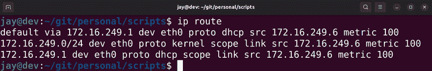
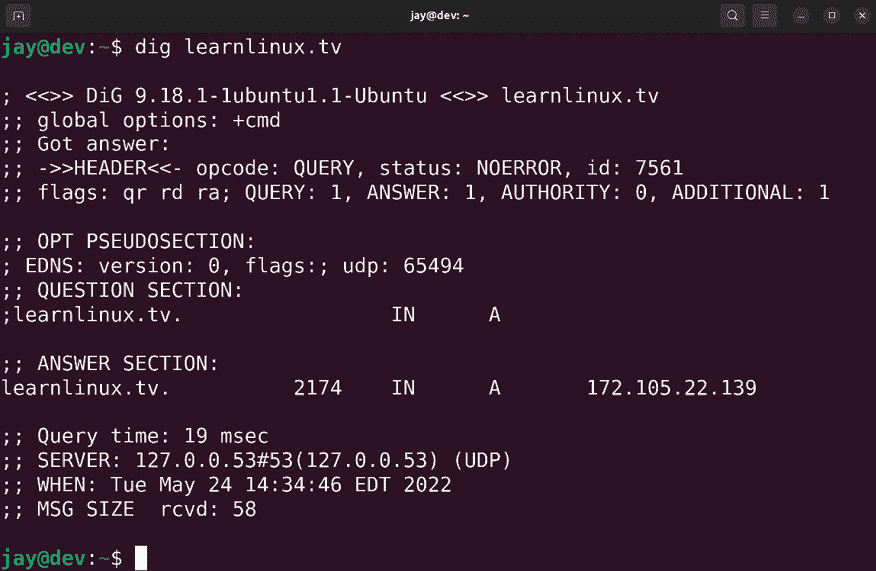

# 22

# 故障排查 Ubuntu 服务器

到目前为止，我们已经涵盖了很多关于 Ubuntu 服务器的话题，并且做了一些非常有趣的项目。我们已经搭建了 Web 服务器，构建了自动化流程，甚至在云端创建了基础设施。随着你所实现的应用程序和服务逐渐老化，你的组织可能会越来越依赖它们。但是，如果你所在的组织依赖的某个服务突然不可用时会发生什么呢？当事情没有按计划进行时，你该怎么办？

尽管我们无法考虑到每一个可能出现的问题，但在遇到问题时，有一些常见的地方可以寻找线索。在本章中，我们将探讨一些常见的起始点和技术，帮助你在排查服务器问题时提供帮助。建立扎实的故障排除技能是一个重要的目标，通过本章探讨的概念，你将能够顺利掌握这一技能。

在本章中，我们将涵盖：

+   评估范围

+   进行根本原因分析

+   查看系统日志

+   跟踪网络问题

+   排查资源问题

+   诊断故障的 RAM

故障排查的第一步是分析问题，并确定问题的严重性。在接下来的部分，我们将探讨如何进行这一步。

# 评估范围

当服务器或网络出现问题时，你的系统会表现出一个或多个症状。也许某个应用程序比正常情况下慢得多，也许用户无法访问网络，或者某台服务器完全故障。任何时候都可能出现各种问题，跟上排查进度可能是一个挑战。

一旦你识别出问题的症状，接下来的目标是确定问题的整体范围。本质上，这意味着尽可能确定问题最可能出在哪个地方，以及有多少个系统和服务受到了影响。有时候，根本原因很明显。例如，如果你的计算机没有从 DHCP 服务器获取 IP 地址，你会立刻知道要开始检查该服务器的日志，查看它是否有能力（或无法）执行指定的任务。在其他情况下，原因可能并不那么明显。也许你有一个偶尔出现问题的应用程序，但它并不是你能够可靠复现的。在这种情况下，可能需要进行一些深入挖掘，才能了解问题的范围有多大。有时，罪魁祸首可能是你最不期待的那个。

网络上的每个组件都会与其他组件协同工作，或者至少应该是这样。一个 Linux 服务器网络，就像任何其他网络一样，是一个由服务（守护进程）组成的集合，这些服务互相补充，并且通常相互依赖。例如，DHCP 为所有主机分配 IP 地址，但它也会分配默认的 DNS 服务器。如果你的 DNS 服务器出现问题，那么 DHCP 服务器本质上会为客户端分配一个无法工作的 DNS 服务器。识别问题空间意味着，在你识别出症状后，还需要努力理解网络中每个组件如何对问题产生影响或如何受问题影响。

关于范围，我们需要确定问题的影响范围，以及有多少用户或系统受到了影响。可能只是一个用户受到影响，或者是整个子网。这将帮助你确定问题的优先级，并决定是否需要立即解决，还是可以等到稍后再处理。通常，优先级排序是解决问题的一半；有时候，用户甚至会认为他们的问题比其他人的更重要。请凭借你的最佳判断来处理。

在识别问题范围时，你需要尽可能回答以下问题：

+   这个问题的症状是什么？

+   这个问题是什么时候首次发生的？

+   网络中是否在那个时候做过任何更改？

+   这个问题之前发生过吗？如果有，上次是如何解决的？

+   哪些服务器或节点受到了这个问题的影响？

+   有多少用户受到影响？

如果问题仅限于一台机器，那么一些很好的排查起点是检查谁登录了服务器，以及最近输入了哪些命令。我经常通过检查登录用户（或最近登录的用户）的 Bash 历史记录来找到罪魁祸首。每个用户帐户的主目录中应该都有一个.bash_history 文件。这个文件包含了最近输入的命令。检查这个文件，看看是否有人最近修改了什么。我数不清有多少次仅凭这一点就直接找到了答案。更妙的是，有时候 Bash 历史记录直接指向了解决方案。如果之前发生过类似的问题并且有人已经修复过，往往他们的努力已经记录在 Bash 历史记录中，你可以通过查看它，知道之前的人是如何解决问题的。

要查看 Bash 历史记录，你可以查看用户主目录中的.bash_history 文件内容，或者直接以该用户身份执行 history 命令。

此外，如果你检查当前登录到服务器的用户，可能能够确定是否有人已经在处理某个问题，或者也许他们所做的事情导致了问题的发生。如果你输入`w`命令，你可以看到谁目前登录到服务器。此外，当你运行此命令时，还会看到登录用户的 IP 地址。因此，如果你不清楚`w`命令列出的用户账户对应谁，你可以在你的 DHCP 服务器中检查 IP 地址，找出这个 IP 地址属于谁，然后直接询问那个人。在理想的世界中，其他管理员在处理某些问题时会发一封部门邮件，确保大家都知情。不幸的是，很多人并没有这样做。通过检查已登录的用户以及他们的 Bash 历史记录，你已经走在了确定问题源头的道路上。

在识别问题范围和范围后，你可以开始缩小问题范围，帮助找到原因。有时，罪魁祸首会显而易见。如果一个网站停止工作，而你注意到最近你的 Web 服务器上的 Apache 配置发生了变化，那么你可以通过调查更改和谁做了这些更改来攻克这个问题。

如果问题是网络问题，例如用户无法访问网站，潜在的问题范围要大得多。你的互联网网关可能出现故障，DNS 或 DHCP 服务器可能宕机，你的互联网服务提供商可能出现问题，或者也许你的财务部门只是忘了支付互联网账单。只要你能够确定一个潜在的目标列表来集中进行故障排除，你就离找到问题不远了。在本章中，我会谈到一些常见的问题以及如何处理这些问题。

了解问题的范围帮助我们理解问题的严重程度以及受影响的系统和用户数量，有时，调查范围本身可能会引导你找到问题的根本原因。如果你还不知道潜在的原因，可以进行根本原因分析，尝试找出问题的源头。这就是我们接下来要探讨的内容。

# 进行根本原因分析

一旦你解决了服务器或网络上的问题，你会立即为自己解决问题的能力感到骄傲。解决了一个问题后，成为技术部门的英雄是一种非常棒的感觉。但你还没有完成。下一步是考虑如何防止这个问题再次发生。查看问题是如何开始的，并采取一些步骤以帮助防止问题再次发生，这一点非常重要。这就是所谓的**根本原因分析**。根本原因分析可能是你向经理提交的报告，或是你在知识库系统中记录的内容，也可能只是你自己记录的备忘录。无论哪种方式，它都是一次重要的学习机会。

一个好的根本原因分析有多个方面。首先，它会展示导致问题发生的事件。然后，它会列出你为解决问题所采取的步骤。如果问题可能会再次发生，你应该包括如何防止未来再次发生类似问题的信息。

根本原因分析的问题在于，很少能做到百分之百准确。有时候，根本原因可能是显而易见的。例如，假设有个叫做`Bob`的用户删除了一个包含公司重要文件的整个目录。如果你登录到服务器并查看日志，你会看到`Bob`不仅在事件发生时登录了服务器，而且他的 Bash 历史记录显示他运行了`rm -rf /work/important-files`命令。此时，案件就解决了。你已经弄清楚了问题发生的原因和责任人，并且可以从最近的备份中恢复文件。但根本原因通常不像这样简单明了。

我亲身遇到过的一个例子是，一对**虚拟机**（**VM**）服务器发生了“围栏”问题。我曾在一家公司工作时，我们基于 Citrix 的虚拟机服务器（它们是一个集群的一部分）同时宕机，导致每个 Linux 虚拟机也随之宕机。当我给它们接上显示器时，看到它们不停地重启。等到服务器稳定下来后，我开始深入调查。我在 Citrix XenServer 的文档中读到，集群的机器数量不能少于三台，因为这会导致像我所经历的那种情况。我们这个集群只有两台服务器，所以我得出结论，服务器的配置不当，如果公司想要建立集群，就需要一台第三台服务器。

问题在于，这个根本原因分析并不是百分之百完美的。服务器出现问题是因为需要第三台服务器吗？文档确实提到过三台服务器是最低配置，但无法确定这就是问题发生的真正原因。然而，不仅在问题发生时我没有监控服务器，而且我也不是设置服务器的那个人；那个人已经离开公司。虽然无法得出绝对结论，但我的根本原因分析是合理的，因为这是最有可能的解释（即我们没有遵循最佳实践）。有人可能会反驳我的根本原因分析，称“但是这些服务器运行了好几年也没问题。”这倒是真的，但在处理技术问题时，没有什么是绝对的。有时候，你根本无法确知。唯一能做的就是确保一切按照厂商设定的指南正确配置。

一个好的根本原因分析在逻辑上应尽可能严密，尽管不一定是万无一失的。将系统事件与症状关联起来通常是一个很好的第一步，但并不一定是完美的。在调查症状、解决问题并记录你所做的修复工作之后，有时根本原因分析会自动显现。其他时候，你需要查看文档，确保出现故障的服务器或守护进程的配置已按照最佳实践进行实施。在最坏的情况下，你可能无法确切知道问题是如何发生的，也不清楚如何防止它发生，但仍然应该进行文档记录，以便日后发现其他细节。没有文档记录，你永远无法从这个情况中获得任何经验。

根本原因分析应包括以下细节：

+   问题的描述

+   哪个应用程序或硬件出现了故障

+   问题首次出现的日期和时间

+   你在调查问题时发现的内容

+   你为解决问题所采取的措施

+   导致问题发生的事件、配置或故障

根本原因分析应该作为一次学习经验。根据问题的性质，它可能作为不应做的事情或需要改进的做法的范例。以我的虚拟机服务器故障为例，故事的教训是遵循 Citrix 的最佳实践，使用三台服务器而非两台来搭建集群。其他时候，最终结果可能是另一个技术员没有遵循正确的指示或犯了错误，这很不幸。如果将来问题再次发生，你将能够回顾并记得上次发生了什么，以及你做了什么来解决问题。这非常有价值，因为我们都是人，时间一长容易忘记重要的细节。在一个组织中，根本原因分析对于向利益相关者展示你不仅能解决问题，还能合理防止问题再次发生，非常重要。

日志文件通常是寻找线索的好地方，因为系统和应用程序事件的相关信息通常会存储在其中。在下一节中，我们将更详细地探讨日志文件。

# 查看系统日志

如果你在寻找根本原因时遇到困难，或者你只是想获取更多有关发生问题的信息，可以考虑查看日志文件。Linux 有强大的日志记录功能，许多你可能正在运行的应用程序会在事件发生时写入日志文件。如果出现问题，你可能会在应用程序的日志中找到相关信息。

查看日志有两种主要方法。从历史上看，在大部分 Ubuntu 使用期间，你只需检查存储在`/var/log`目录中的日志文件即可。该目录中的文件是标准文件和目录，因此你可以使用以往查看文本文件内容的命令来查看`/var/log`目录中的日志文件内容。这种查看日志文件的方法正在逐步被淘汰；然而，大多数应用程序今天仍然将它们的日志文件存储在该目录中。

查看应用程序日志的较新方法是使用`journalctl`命令。此命令是`systemd`的一部分，专门用于查看日志。要使用`journalctl`命令检查正在运行的服务的状态，你需要提供`-u`选项，以及你想检查的服务名称：

```
journalctl -u ssh 
```

通过这个例子，我们尝试查看`ssh`服务的日志信息：


图 22.1：通过`journalctl`命令查看日志信息

`-u`选项是必需的，它告诉`journalctl`命令你想要检查某个服务。因此，在之前的示例中，我们提供了`ssh`作为我们想要查找日志信息的服务名称。服务的单元（或服务）名称与使用`systemctl`命令启动、停止或重启服务时的名称相同。我建议在检查 Linux 系统的日志信息时，首先考虑使用`journalctl`命令。

如果在`-u`选项之外再加上`-f`选项，输出将会继续滚动，随着你检查的特定服务的新日志信息被添加到日志中。如果你想跟踪服务发生的新事件，这非常有用。

然而，并不是所有服务都通过`journalctl`记录日志，因此了解查看日志文件的传统方法也很重要。在`/var/log`目录中，你会看到一些日志文件，可以查看这些文件，不同服务器之间会有所不同，具体取决于安装了哪些应用程序。在很多情况下，已安装的应用程序会在`/var/log`中的某个位置创建自己的日志文件，可能是在日志文件中，或者是在`/var/log`的子目录下的日志文件。例如，一旦你安装了 Apache，它会在`/var/log/apache2`目录中创建日志文件，查看这些日志可能会给你一些线索，帮助你了解问题是否与 web 服务器有关。这些被称为**应用程序日志**，即由应用程序而非发行版创建的日志文件。还有**系统日志**，它们是由发行版创建的日志文件，用于查看系统事件。

查看存储在`/var/log`目录中的日志文件可以通过几种方法完成。一个方法是使用`cat`命令，并指定日志文件的路径和文件名。例如，可以使用以下命令查看 Apache 的访问日志：

```
cat /var/log/apache2/access.log 
```

一些日志文件是受限的，需要`root`权限才能访问。如果在尝试查看日志时遇到权限拒绝错误，可以在本节中的任何命令前加上`sudo`来查看该文件。

`cat`命令的一个问题是它会打印出整个文件，无论文件有多大。它会在你的终端上滚动，如果文件很大，你将无法看到完整内容。此外，如果你的服务器在性能上已经有些吃力，使用`cat`实际上可能会暂时占用服务器，尤其是在日志文件非常大的情况下。这会导致你失去对 shell 的控制，直到文件打印停止。你可以按*Ctrl + c*来停止打印日志文件，但服务器可能忙得无法响应*Ctrl + c*，并且无论如何都会显示整个文件。

另一种方法是使用`tail`命令。默认情况下，`tail`命令显示文件的最后十行：

```
tail /var/log/apache2/access.log 
```

如果你希望查看超过最后十行的内容，可以使用`-n`选项来指定不同的行数。要查看最后`100`行，可以使用以下命令：

```
tail -n 100 /var/log/apache2/access.log 
```

也许`tail`命令最有用的特性之一就是`-f`选项，它允许你跟踪日志文件。基本上，这意味着当日志文件有新的条目被写入时，它会在你面前滚动，就像实时查看日志文件一样。

```
tail -f /var/log/apache2/access.log 
```

一旦开始使用`follow`选项，你会想知道自己以前是怎么没有它的。如果你正遇到一个能重现的问题，你可以观察该应用程序的日志文件，并看到日志条目随着问题的重现而出现。以 DHCP 服务器未能向客户端提供 IP 地址为例，你可以查看`/var/log/syslog`文件的输出（`isc-dhcp-server`守护进程没有自己的日志文件），并看到当客户端尝试重新获取 DHCP 租约时出现的任何错误，从而让你看到问题的发生过程。

另一个有用的查看日志的命令是`less`。`less`命令允许你通过键盘上的 Page Up 和 Page Down 键滚动查看日志文件，这使得它比`cat`命令在查看日志文件时更加实用。你可以按*q*退出文件：

```
less /var/log/apache2/access.log 
```

现在你已经了解了一些查看这些文件的方法，那么应该检查哪些文件呢？不幸的是，并没有统一的规则，因为每个应用程序的日志处理方式不同。一些守护进程有自己的日志文件，存储在`/var/log`目录下。

因此，一个好的检查位置是该目录，查看是否有一个以守护进程名称命名的日志文件。有些守护进程甚至没有自己的日志文件，而是使用`/var/log/syslog`。你可以尝试在查看文件内容时使用`grep`来查找与你正在排查的守护进程相关的消息。关于`isc-dhcp-server`守护进程，以下命令将会把`syslog`缩小到来自该特定守护进程的消息：

```
cat /var/log/syslog | grep dhcp 
```

在排查安全问题时，你肯定会想查看的日志文件是**授权日志**，该日志位于`/var/log/auth.log`。你需要使用`root`账户或`sudo`来查看该文件。授权日志包含有关对服务器进行身份验证尝试的信息，包括来自服务器本身的登录以及通过 OpenSSH 的登录。这样做有几个原因，其中之一是如果服务器上发生了严重问题，你可以查看在那个时间点谁登录了服务器。此外，如果你或你的某个用户在通过 OpenSSH 访问服务器时遇到问题，你可能需要查看授权日志来寻找线索，因为 OpenSSH 失败的更多信息会被记录在其中。通常，`ssh`命令可能会抱怨密钥文件的权限不正确，这会给出公钥认证无法正常工作的问题答案，因为 OpenSSH 对其文件有特定的权限要求。例如，私钥文件（通常是`/home/<user>/.ssh/id_rsa`）不应该被除了其拥有者外的任何人读取或写入。如果是这种情况，你会在`/var/log/auth.log`中看到类似的错误信息。

检查`/var/log/auth.log`的另一个使用场景是安全性，因为大量的登录尝试可能表明有入侵企图。（希望你已经安装了 Fail2ban，我们在上一章讨论过。）异常高的密码尝试失败次数可能意味着有人正在尝试通过暴力破解登录服务器。这肯定是一个需要关注的警告，你应该立即封锁他们的 IP 地址。

**系统日志**，位于`/var/log/syslog`，包含了许多不同内容的日志信息。它本质上是 Ubuntu 日志的瑞士军刀。如果某个守护进程没有自己的日志文件，很可能它的日志会被写入此文件。此外，关于 cron 作业的信息也会写入此处，因此当 cron 作业未能正确执行时，这里是一个可以检查的地方。负责从 DHCP 服务器获取 IP 地址的`dhclient`守护进程同样非常重要。

你将能够从`dhclient`事件中看到系统日志中的 IP 地址更新情况，也可以看到无法获取 IP 地址时的失败消息。此外，`systemd init`守护进程本身也会在这里记录日志，这使得你可以看到与服务器启动以及它尝试运行的应用程序相关的消息。

另一个有用的日志文件是`/var/log/dpkg.log`，它记录了与安装和升级软件包相关的日志条目。如果服务器在你通过网络推送更新后开始出现问题，你可以查看这个日志，查看最近更新了哪些软件包。这个日志不仅会提供已更新或安装的软件包列表，还会提供安装发生时的时间戳。如果某个用户安装了未经授权的应用程序，你可以将该日志与认证日志进行关联，确定当时谁登录了系统，然后查看该用户的 Bash 历史记录以确认。

日志文件通常会在一段时间后通过名为`logrotate`的工具进行轮转。在`/var/log`目录中，你会看到一些带有`.gz`扩展名的日志文件，这意味着原始的日志文件已经被压缩并重命名，并且一个新的日志文件已经在原位置创建。例如，你会在`/var/log`目录中看到系统日志的`syslog`文件，但你也会看到一些带有数字和`.gz`扩展名的文件，如`syslog.2.gz`。这些是压缩后的日志文件。通常，你需要先解压它们，然后通过本节中提到的任意方法查看这些日志。更简单的方法是使用`zcat`命令，它允许你立即查看压缩文件：

```
zcat /var/log/syslog.2.gz 
```

还有`zless`，它的作用与`less`命令类似。

另一个有用的查看日志信息的命令是`dmesg`。与其他日志文件不同，`dmesg`本身就是一个命令，你可以从文件系统中的任何位置执行它。`dmesg`命令允许你查看来自 Linux 内核环形缓冲区的日志条目，这在排查硬件问题时非常有用（例如查看哪些硬盘被内核识别）。在排查硬件问题时，系统日志也很有帮助，但使用`dmesg`命令可能是一个好的检查起点。

如前所述，在 Ubuntu 系统上，有两种类型的日志文件，系统日志和应用程序日志。系统日志，如`auth.log`和`dpkg.log`，记录了重要的系统事件，并且不特定于某个应用程序。应用程序日志在安装其父软件包时一起安装，例如 Apache 或 MariaDB。应用程序日志会将日志条目写入其自己的日志文件。

一些你安装的守护进程不会创建自己的应用程序日志，例如`isc-dhcp-server`。由于没有统一的规则规定应用程序日志存放位置，因此查找日志文件的第一步是查看你想查看日志条目的应用程序是否创建了自己的日志文件。如果没有，可能是使用了系统日志。

在面对一个问题时，同时查看日志文件并尝试重现问题非常重要。使用`follow`模式与`tail`命令（`tail -f`）对于此目的非常有效，因为你可以在尝试重现问题时，观察日志文件生成新的条目。这种技术在几乎任何你处理不正常运行的守护进程时都能很好地发挥作用。这个技术也能帮助你缩小硬件问题的范围。例如，我曾处理过一个 Ubuntu 系统，当我插入闪存驱动器时，什么也没发生。当我在插拔闪存驱动器时查看日志时，我看到系统日志更新并识别了每一次插入和移除。因此，很明显，Linux 内核本身识别到了硬件并准备使用它。这帮助我将问题缩小到桌面环境未能更新以显示插入的闪存驱动器，而我的硬件和 USB 端口完全正常。通过一个命令，我能够确定问题是软件问题，而不是硬件相关的问题。

如你所见，Ubuntu 包含了非常有用的日志文件，这些文件能帮助你排查服务器问题。通常，当你遇到问题时，查看相关的日志条目，然后进行 Google 搜索，往往会得到有用的答案，或者至少会找到一个 bug 报告，告诉你这个问题不仅限于你或你的配置。

希望你的搜索结果能直接带你找到答案，或者至少找到一个解决方法。然后，你可以继续处理问题，直到它被解决。

那么，网络问题呢？追踪网络问题的根本原因可能特别具有挑战性，但实际上并不像看起来那么难。在接下来的部分，我们将介绍几种追踪网络问题的方法。

# 追踪网络问题

今天，TCP/IP 网络对于世界的重要性真是令人惊讶。在现代计算中使用的所有协议中，它无疑是最为广泛的。但当它无法正常工作时，它也是最令人头疼的情况之一。幸运的是，Ubuntu 提供了非常实用的工具，帮助你找出问题所在。

首先，让我们看看连接性。毕竟，如果你无法连接到网络，你的服务器基本上就没用了。在大多数情况下，Ubuntu 几乎能够无误地识别所有网络卡，并且如果它能够连接到一个 DHCP 服务器，它会自动将你的服务器或工作站连接到网络。

在排查问题时，先处理显而易见的东西。以下内容看起来可能是显而易见的，但你会惊讶地发现有多少人会忽略这些显而易见的事情。我假设你已经检查过网络电缆是否在两端插好。关于电缆的另一个方面是，有时候网络电缆本身会出现故障，需要更换。你应该可以使用电缆测试仪来检查电缆是否能传递干净的信号。

路由问题有时可能很难排查，但通过逐个测试每个目的地点，你通常能找到问题所在。路由问题的典型症状可能包括无法访问另一个子网内的设备，或者尽管能够访问内部设备，却无法访问互联网。要调查潜在的路由问题，首先检查你的路由表。你可以使用`ip route`命令来查看，运行此命令将打印出当前的路由表信息：



图 22.2：在 Ubuntu 服务器上查看路由表

在这个例子中，你可以看到所有流量的默认网关是`10.10.10.1`。这是表格中的第一项，告诉我们所有到达目标`0.0.0.0`（即所有流量）的数据都通过`10.10.10.1`发送。只要 ICMP 流量没有被禁用，你应该能够 ping 通这个默认网关，并且应该能够 ping 通子网内的其他节点。

要开始排查路由问题，首先使用打印出的路由表中的信息进行几个 ping 测试。首先，尝试 ping 你的默认网关。如果无法 ping 通，那么问题就在这里。如果可以 ping 通，接下来尝试运行`traceroute`命令。

这个命令默认并不可用，但你只需要安装`traceroute`包，所以下希望你已经在服务器上安装了它。如果已安装，你可以对主机运行`traceroute`，比如外部 URL，来查找连接中断的位置。`traceroute`命令应该显示你与目标之间的每一个跳跃点。每个“跳跃”基本上是一个默认网关。你会依次穿过每个网关，直到最终到达目标。使用`traceroute`命令，你可以看到链条中断的地方。很可能，你会发现问题可能并不出现在你的网络上，而是出现在你的互联网服务提供商那一端。

DNS 问题并不常见，但通过一些技巧，你应该能够解决它们。DNS 故障的症状通常表现为主机无法通过名称访问内部或外部资源。

确定问题出在内部主机还是外部主机（或者两者都有）应该有助于你判断问题是不是出在 DNS 服务器，或者可能是你的互联网服务提供商的 DNS 服务器。

定位 DNS 问题源的第一步是 ping 网络中的已知 IP 地址，最好是默认网关。如果你能 ping 通它，但无法通过名称 ping 通网关，那么你可能遇到了 DNS 问题。你可以通过使用 `nslookup` 命令对域名进行查询来确认潜在的 DNS 问题，例如：

```
nslookup myserver.local 
```

此外，请确保尝试 ping 外部资源，例如网站。这将帮助你缩小问题的范围。

你还需要了解你的主机正在向哪个 DNS 服务器发送查询请求。过去，查找分配给主机的 DNS 服务器就像查看 `/etc/resolv.conf` 文件内容一样简单。然而，现在这个文件通常会指向本地解析器，而不会显示实际的服务器请求目标。要找出分配给主机的真实 DNS 服务器，可以使用以下命令：

```
resolvectl status 
```

它们是你预期的 DNS 服务器吗？如果不是，你可以通过临时删除该文件中的错误名称服务器条目，并将其替换为正确的 IP 地址来解决这个问题。我建议将其作为临时解决方案而非永久解决方案的原因是，接下来你需要调查无效的 IP 地址是如何出现在此文件中的。通常，这些地址是由你的 DHCP 服务器分配的。只要你的 DHCP 服务器发送适当的名称服务器列表，你就不应该遇到这个问题。如果你使用的是静态 IP 地址，那么可能是你的 Netplan 配置文件中存在错误。

在无法解析外部网站时，定位 DNS 问题的一个有用方法是暂时切换本地计算机的 DNS 提供商。通常，你的计算机会使用外部 DNS 提供商，例如来自 ISP 的 DNS。你设置外部 DNS 服务器的过程是我们在*第十一章*，*设置网络服务*中提到的，具体来说是 `bind9` 守护进程配置中的转发器部分。`bind9` 守护进程使用的转发器是它无法基于内部主机列表解析请求时发送流量的地方。

你可以通过将本地工作站的 DNS 名称服务器更改为 Google 的 `8.8.8.8` 和 `8.8.4.4` 来绕过此问题。如果在更改名称服务器后能够访问外部资源，那么你可以合理地认为是转发器导致了问题。

我实际上曾经遇到过这样一种情况：一个网站更改了其 IP 地址，但 ISP 的 DNS 服务器未能及时更新，导致一些客户无法访问他们工作所需的网站。将所有人切换到备用名称服务器（通过调整我们在*第十一章*，*设置网络服务*中提到的 `forwarders` 选项）是他们解决此问题的最简单方法。

在检查服务器解析 DNS 记录的能力时，一些额外的工具需要考虑，例如`dig`和`nslookup`。你应该能够使用这两个命令来测试服务器的 DNS 设置。两个命令都可以使用主机名或域名作为选项。`dig`命令将向你展示有关 DNS 区域文件中负责 IP 地址或域名的地址（`A`）记录的信息。`host`命令应返回你尝试连接的主机的 IP 地址。以下是一些示例输出：



图 22.3：`dig` 和 `host` 命令的输出

硬件支持在网络中也至关重要。如果 Linux 内核不支持你的网络硬件，你很可能会遇到这种情况：当你插入网络电缆时，发行版无法识别或没有任何反应，或者在无线网络的情况下，尽管有一个或多个网络，但却看不到任何附近的网络。与 Windows 平台不同，Linux 在硬件支持方面通常是集成在内核中的。虽然也有例外，但发行版随附的 Linux 内核通常支持与其自身同龄或更早的硬件。

在 Ubuntu 22.04 LTS（该版本于 2022 年 4 月发布）的情况下，它能够支持截至 2022 年初发布的硬件和更早的硬件。未来的 Ubuntu Server 版本将发布硬件支持更新，这将使 Ubuntu Server 22.04 能够支持新发布的硬件和芯片组。通常，Ubuntu 会在支持的发行版生命周期内发布几个版本更新，例如 22.04.1、22.04.2 等等。只要你使用的是最新版本，你就能获得 Ubuntu 在当时提供的最新硬件支持。

在其他情况下，硬件支持可能依赖于外部内核模块。如果缺少硬件驱动程序，当你遇到无法识别的网络硬件时，应该首先尝试使用搜索引擎查找该硬件。通常，搜索词 `<硬件名称> Ubuntu` 就能解决问题。但你该搜索什么呢？要查找你的网络设备的硬件字符串，可以尝试使用 `lspci` 命令：

```
lspci | grep -i net 
```

`lspci` 命令列出了连接到服务器 PCI 总线的硬件。这里，我们使用该命令并结合不区分大小写的 `grep` 搜索 `net` 这个词：

```
lspci |grep -i net 
```

这将返回服务器上可用的网络组件列表。例如，在我的机器上，我得到以下输出：

```
01:00.1 Ethernet controller: Realtek Semiconductor Co., Ltd. RTL8111/8168/8411 PCI Express Gigabit Ethernet Controller (rev 12)
02:00.0 Network controller: Intel Corporation Wireless 8260 (rev 3a) 
```

如你所见，我的机器上有一块有线和无线网卡。如果其中一个无法工作，我可以通过在线搜索硬件字符串和关键字 `Ubuntu` 来查找信息，这应该会给我关于我硬件的相关结果。如果需要安装某个软件包，搜索结果通常会给我一些关于需要安装哪个软件包的线索。

然而，如果没有网络访问，最坏的情况是我可能需要从另一台计算机下载软件包，并通过闪存驱动器将其传输到服务器。这肯定不是一件有趣的事情，但如果最新的 Ubuntu 安装媒体尚未完全支持你的硬件，这种方法是有效的。

另一个潜在的问题点是 DHCP。当它运行正常时，DHCP 是一项神奇的技术。当它停止工作时，则可能令人沮丧。但一般来说，DHCP 问题往往是由于可用的 IP 地址不足、DHCP 守护进程（`isc-dhcp-server`）未运行、配置无效或主机的时钟不同步（所有服务器应该安装 `ntp` 包）。

如果你的服务器无法通过 DHCP 获取 IP 地址，并且你的网络使用的是基于 Linux 的 DHCP 服务器，请检查系统日志（`/var/log/syslog`）中与 `dhcpd` 相关的事件。不幸的是，我从未找到过可以直接显示 DHCP 服务器剩余 IP 地址租约数的命令，但如果你用完了租约，系统日志中很可能会看到与池耗尽相关的日志条目。此外，系统日志还会显示你的节点尝试获取 IP 地址时的尝试记录。你可以使用 `tail -f` 命令实时监控系统日志，以观察与 DHCP 租约相关的任何事件。

在某些情况下，DHCP 租约不可用的问题可能是由于启用了非常长的租约时间。一些管理员会给客户端设置最长一周的租约时间，而这通常是不必要的。对于大多数网络来说，一天的租约时间就足够了，但最终，租约时间的决定权在于你自己。在*第十一章*，*设置网络服务*中，我们已经讨论了如何配置 DHCP 服务器，因此如果你需要回顾如何配置 `isc-dhcp-server` 守护进程，可以参考那一章。

尽管在面对 DHCP 问题时，这可能不是你首先想到的原因，但主机时钟不同步实际上可能会加剧问题。DHCP 请求在客户端和服务器上都会被 `时间戳`，因此，如果其中一方的时钟误差较大，时间戳也会出错，从而导致 DHCP 服务器混淆。令人惊讶的是，我曾经遇到过这种情况相当频繁。我建议尽早在你的网络中标准化 NTP 配置。时钟不同步不仅会影响 DHCP 服务，文件同步工具也需要准确的时间。如果你确保所有客户端都安装了 NTP，并且它是最新且正常运行的，你应该能确保一切顺利。使用配置管理工具（例如 Ansible）确保 NTP 不仅配置正确，还在网络中所有机器上正常运行，将对你大有裨益。

当然，网络方面可能出现许多问题，但这里的信息应该涵盖大多数问题。总的来说，排查网络问题通常围绕着 ping 测试展开。尝试 ping 默认网关、使用`traceroute`跟踪失败的端点，以及排查 DNS 和 DHCP 问题，可以解决大多数问题。当然，硬件故障，如网卡损坏或电缆问题，也会显现出来。

我们的服务器利用存储、CPU、内存以及其他资源为我们提供价值并服务于我们的客户。在接下来的章节中，我们将详细介绍如何检查这些资源。

# 排查资源问题

我不知道其他人怎么样，但似乎我大多数排查服务器问题的时间通常都花在定位资源问题上。这里所说的资源指的是 CPU、内存、磁盘、输入/输出等。一般来说，问题通常出在用户存储了过多的大文件，某个进程异常消耗大量 CPU，或者服务器内存不足。在本节中，我们将讨论一些你在管理 Ubuntu 服务器时可能会遇到的常见问题。

首先，让我们回顾一下与存储相关的话题。在*第九章* *管理存储卷*中，我们已经讨论过一些相关的概念，很多这些概念也适用于故障排除。因此，我不会在这里花太多时间讲解这些概念，但在排查存储问题时，复习这些内容是很有必要的。首先，每当用户抱怨无法在服务器上写入新文件时，以下两个命令是你应该首先运行的。你可能已经非常熟悉这些命令了，但它们值得重复：

```
df -h
df -i 
```

第一个 `df` 命令的变体会以人类可读的格式（`-h` 选项）提供关于驱动器空间使用情况的信息，这些信息会以兆字节和吉字节为单位打印出来。

第二个命令中的`-i`选项会提供关于正在使用和可用 inode 的信息。你需要运行此命令的原因是，在 Linux 系统中，如果没有剩余的 inode，系统会报告存储已满，即使仍然有大量的可用空间。通常，存储介质可用的 inode 数量是非常充裕的，限制也很难达到。然而，如果一个服务不断地创建新的日志文件，或者邮件守护进程失控并生成大量未发送的邮件，你会惊讶于 inode 会这么快耗尽。

当然，一旦你发现存储已满，接下来的逻辑问题是，是什么占用了我所有的空闲空间？`df` 命令会列出存储卷及其大小，至少会告诉你哪个磁盘或分区需要关注。正如我在*第九章*《管理存储卷》中提到的，我最喜欢用的定位存储占用的命令是 `ncdu` 命令。虽然默认没有安装，`ncdu` 是一个非常棒的工具，可以检查存储的主要占用位置。如果单独运行，`ncdu` 会扫描服务器的整个文件系统。相反，我建议加上 `-x` 选项，这样它只会限制扫描特定文件夹。例如，如果服务器的 `/home` 分区已满，你可能希望运行以下命令来查找哪个目录占用了最多的空间：

```
sudo ncdu -x /home 
```

`-x` 选项会导致 `ncdu` 不跨越文件系统。这意味着如果你在扫描的文件夹内挂载了另一个磁盘，它将不会触及这个磁盘。使用 `-x` 选项时，`ncdu` 只关注你指定的目标。

如果你无法使用 `ncdu`，也可以使用 `du` 命令，不过需要更多的操作。例如，`du -h` 命令会显示当前工作目录的使用情况，且以人类可读的数字呈现。它默认不会像 `ncdu` 那样遍历目录树，因此你需要在每个子目录上运行它，直到手动找到占用最多文件的目录。`du` 命令的一个非常有用的变种，昵称为 `ducks`，如下所示。它将显示当前工作目录中最大的前 15 个目录：

```
du -cksh * | sort -hr | head -n 15 
```

另一个可能出现的存储卷问题是与文件系统完整性相关。大多数时候，这些问题似乎只有在出现电力问题时才会出现，比如服务器意外断电。根据服务器和在设置存储卷时所使用的格式（以及其他几个因素），电力问题的处理方式因安装而异。在大多数情况下，文件系统检查（`fsck`）会在下次启动时自动发生。如果没有发生，并且你遇到了一些无法解释的存储问题，建议手动进行文件系统检查。安排文件系统检查其实非常简单：

```
sudo touch /forcefsck 
```

上面的命令会在文件系统的根目录创建一个空文件 `forcefsck`。当服务器重启并看到这个文件时，它会触发对该存储卷的文件系统检查，然后删除该文件。

如果你想检查根存储卷以外的文件系统，可以在其他地方创建 `forcefsck` 文件。例如，如果你的服务器有一个单独的 `/home` 分区，你可以在该位置创建文件来检查该存储卷：

```
sudo touch /home/forcefsck 
```

文件系统检查通常会相对较快地完成，除非有需要修复的问题。根据问题的性质，可能会快速修复，或者可能需要较长时间。我见过一些非常严重的完整性问题，修复需要超过四个小时，但我也见过其他问题只需几秒钟就能修复。有时它会非常快速地完成，在启动过程中会快速滚动，以至于你可能会错过看到它的机会。在大容量的情况下，你可能希望安排`fsck`检查在非工作时间进行，以防扫描时间较长。

关于内存问题，`free -m`命令将为你提供服务器上可用内存和交换空间的概述。它不会告诉你究竟是什么正在使用你的所有内存，但你可以用它来查看是否面临内存耗尽的危险。`free`命令的输出中的**free**列将显示剩余多少内存，并允许你决定何时采取行动：


图 22.4：检查 Ubuntu 服务器上可用内存

在*第八章*中，*监控系统资源*，我们介绍了`htop`命令，它帮助我们回答“什么”正在使用我们的资源的问题。安装了`htop`后，你可以通过按下*F6*然后选择一个新的排序字段（如`PERCENT_CPU`或`PERCENT_MEM`）来按 CPU 或内存使用率对进程列表进行排序。这将让你了解到服务器上哪些内容正在消耗资源，从而让你可以做出相应的决策。你的解决方案可能因进程而异，从增加服务器内存到调整应用程序以降低内存使用上限都有可能。但当`htop`的结果与你观察到的使用情况不符时，你该怎么办呢？例如，如果你的负载平均值很高，但没有进程似乎占用大量 CPU？

在本书中，我还没有讨论过的一个命令是`iotop`。虽然不是默认安装的，但`iotop`实用程序绝对是必备的，因此我建议你安装`iotop`包。`iotop`本身需要以`root`或使用`sudo`来运行：

```
sudo iotop 
```

`iotop`命令将允许你查看数据写入或从磁盘读取的量。**输入/输出**（**IO**）绝对会对系统的负载产生影响，而并非所有的资源监控工具都会显示这种使用情况。如果你看到负载平均值很高，但资源监视器中没有任何内容可以解释这一使用情况，请检查 IO。

`iotop`实用程序是一个很好的方式，因为如果数据在写入磁盘时受到限制，这可能会导致 IO 中的严重开销，从而减慢其他进程的速度。即使没有其他影响，它也能让你知道哪个进程在出现问题，以便你需要终止它：


图 22.5：在 Ubuntu 服务器上运行的 iotop 实用程序

`iotop`窗口会自动刷新，根据高亮的列排序进程。要改变高亮列，你只需要按键盘上的*左箭头*和*右箭头*。你可以按照`IO`、`SWAPIN`、`DISK WRITE`、`DISK READ`等列来排序进程。完成后，按*q*退出应用程序。

本节中介绍的工具在识别瓶颈资源问题时非常有用。在发现问题根源后，你的解决方法将取决于守护进程。可能是配置无效，或者守护进程遇到故障需要重新启动。通常，查看日志可能会帮助你找到守护进程出现问题的原因。在存储空间满了的情况下，几乎没有什么工具能比得上`ncdu`，它几乎总能直接指向问题所在。像`htop`和`iotop`这样的工具也能让你查看关于资源使用的更多信息，而`htop`甚至允许你直接在应用程序内按*F9*键杀死一个表现不正常的进程。

当系统内存（RAM）发生物理故障时，你该怎么办？这种情况比你想象的要更常见。在接下来的章节中，我们将探讨一种方法，来测试我们的 RAM 是否存在故障。

# 诊断有缺陷的 RAM

所有的服务器和计算组件最终都会出现故障，但有一些硬件似乎比其他组件更容易出现问题。风扇、电源和硬盘绝对是管理员更换的常见设备，但有缺陷的内存也是一个我相信你最终会遇到的情况。

尽管内存条发生故障是有可能的，但我把它放在本章的最后一节，因为不幸的是，我无法给出一份明确的症状清单，帮助你判断内存是否是问题的根源。RAM 问题本质上是非常神秘的，每次我遇到这类问题时，总是通过排除其他所有可能的原因后，才最终发现是内存坏了。正因如此，现在我通常会先测试服务器或工作站的内存，因为这非常简单。即使内存问题与某个问题无关，检查它也是值得的，因为它可能以后会成为问题。

大多数 Linux 发行版（包括 Ubuntu）在安装介质中都带有**Memtest86+**。无论你是创建可启动的 CD 还是闪存驱动器，都可以从 Ubuntu Server 的安装介质中选择内存测试选项。当你首次从 Ubuntu Server 介质启动时，你会看到一个位于屏幕底部的图标，表示你可以按一个键来显示菜单（如果不按键，安装程序会自动启动）。接下来，你需要选择语言，然后会显示安装菜单。在菜单中会有一个**测试内存**的选项：


图 22.6：Ubuntu 安装程序的主菜单，显示了一个“测试内存”选项

其他版本的 Ubuntu，如 Ubuntu 桌面版或其任何衍生版，也提供了测试内存的选项。即使你没有服务器版的安装介质，你也可以使用你手头上的任何版本。

当你从安装介质中选择**测试内存**选项时，**Memtest86+**程序会立即开始工作并测试你的内存（按*Esc*键退出测试）。根据你的工作站或服务器安装的内存量，测试可能需要很长时间，可能需要几分钟甚至几个小时才能完成。一般来说，当你的机器存在有缺陷的 RAM 时，你会在相对较短的时间内看到一堆错误，通常是在前 5-10 分钟内。

如果在 15 分钟内没有出现错误，通常说明你的系统状态良好。根据我的经验，每次遇到有缺陷的内存时，我都会在 15 分钟内或更短时间内看到错误（通常是在 5 分钟内）。不过，从理论上讲，你的内存模块可能存在一个小问题，这个问题可能在 15 分钟之后才会出现，所以如果你有时间，最好让测试完成。

主要的问题是：什么时候在机器上运行**Memtest86+**。根据我的经验，内存有问题的症状在不同机器上几乎从来都不相同。通常，你会遇到服务器无法正常启动、应用程序意外关闭、应用程序根本无法启动，或者某个应用程序行为不正常的情况。在我看来，当你遇到一个问题，看起来不那么直接明了时，应该进行内存测试。此外，你可能还想在将服务器投入生产之前，先测试一下内存。这样，你可以确保它在开始时尽可能不含硬件问题。如果你安装了新的内存模块，请务必立即测试 RAM。

如果测试报告了错误，接下来你需要找出哪个内存模块有问题。这可能会比较困难，因为一些服务器可能安装了十几个内存模块。为了缩小范围，如果可能的话，你应该独立测试每个内存模块，直到找出哪个模块是有缺陷的。即使你找到了有问题的模块，也应该继续测试其他模块。原因是，多个内存模块同时出现问题并非不可能，因为导致第一个模块出现故障的情况可能也影响了其他模块。

另外，我想给你提供一个关于内存的建议：当你发现某个内存条有问题时，如果可以的话，最好清空硬盘并重新开始。我理解这并非总是可行的，而且你可能已经花了很多时间来设置服务器。有些服务器可能需要几周才能重建，具体取决于它们的工作负载。但至少要记住，任何经过有缺陷的 RAM 的数据都有可能变得损坏。

这意味着，如果数据在写入磁盘之前曾存放在有缺陷的 RAM 区域，那么静态数据（存储在硬盘上的数据）可能会损坏。当服务器或工作站遇到有缺陷的 RAM 时，你就不能再信任它了。我将如何处理这种情况留给你决定（希望你永远不会遇到这种问题），但在你计划行动方案时，记住这一点。就个人而言，我在硬件出现此类问题后不再信任任何操作系统的安装。

我还建议你在遇到奇怪问题时检查服务器主板上的电容器。虽然这与内存问题不一定相关，但我在此提到它是因为当电容器损坏时，症状与内存故障基本相同。我不是让你去买一个电压表或做任何电工工作，但有时候，打开服务器机箱，拿手电筒照一下电容器，看是否有任何电容器泄漏液体或膨胀，确实是有意义的。我之所以提这个，是因为我曾经花了几个小时排查一台机器（不止一次），测试内存、硬盘并查看系统日志，却没有发现明显的原因，后来再检查硬件时才发现主板上的电容器在泄漏。如果我早早检查电容器，可能会省去不少时间。这其实就是你需要做的：快速扫一眼主板，看看有没有什么不对劲的地方。

# 总结

虽然 Ubuntu 通常是一个非常稳定和安全的平台，但了解如何应对可能出现的问题并做好准备是很重要的。在本章中，我们讨论了当服务器无法正常运行时，可以进行的常见故障排除。我们首先评估了问题的范围，这有助于我们了解有多少用户或服务器受到了影响。然后，我们查看了 Ubuntu 的日志文件，这些日志文件包含了大量信息，帮助我们定位问题并缩小问题范围。我们还讨论了几种可能出现的网络问题，例如 DHCP、DNS 和路由问题。我们当然无法在问题发生之前预测它们，也无法提前为每一种可能发生的问题做好准备。然而，将合理的逻辑和常识应用于问题处理中，将大大帮助我们找出根本原因。

在下一章中，我们将讨论如何防止灾难的发生，并在灾难发生时如何进行恢复。我们下章见！

# 进一步阅读

+   在 Ubuntu 服务器中报告错误：[`learnlinux.link/report-bugs`](https://learnlinux.link/report-bugs)

# 加入我们在 Discord 上的社区

加入我们社区的 Discord 讨论区，与作者及其他读者交流：

[`packt.link/LWaZ0`](https://packt.link/LWaZ0)


