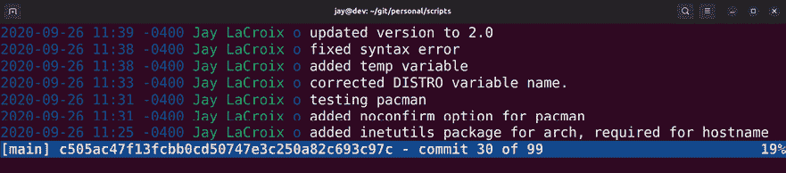

# 第二十三章：防止灾难

在企业网络中，灾难随时可能发生。作为管理员，尽管我们总是尽力设计尽可能稳定和容错的服务器系统，但最重要的是我们如何应对灾难的发生。尽管服务器硬件非常稳定，但服务器的任何组件都有可能随时出现故障。在灾难面前，我们需要一个计划。当磁盘发生故障时，你如何恢复数据？当服务器突然无法启动时，你该怎么办？这些只是我们将探讨的部分问题，我们将介绍几种防止和恢复灾难的方法。在最后一章中，我们将涵盖以下主题：

+   防止灾难

+   使用 Git 进行配置管理

+   实施备份计划

+   使用可启动的恢复介质

我们将通过一些防止灾难的技巧开始本章内容。

# 防止灾难

在本章进行时，我们将探讨如何从灾难中恢复。然而，如果我们能从一开始就防止灾难的发生，那就更好了。虽然我们肯定不能防止所有可能发生的灾难，但有一个良好的计划，并严格按照计划执行，可以大大降低灾难发生的可能性。一个好的灾难恢复计划应该包括一系列实施新服务器和管理现有服务器时需要遵循的准则。

该计划可能包括一些信息，如经过认证的硬件列表（例如在某个环境中已知能高效运行的硬件配置），以及用户的规则和规定、确保物理和软件安全的指南列表、对终端用户的适当培训以及变更控制方法。这些概念在书中早些时候已提到，但从灾难预防的角度来看，值得再次强调。

首先，我们在*第二十一章*《保护你的服务器》中讨论过**最小权限原则**。其思想是给用户尽可能少的权限。这对安全性非常重要，因为你希望确保只有经过专门培训的人员，才能访问并修改他们需要的资源。数据丢失是常有的事。为了充分利用这一原则，你需要创建一组用户组，作为整体安全设计的一部分。列出你公司中的部门和岗位，以及每个岗位需要执行的活动类型。创建与这些活动相对应的系统组。例如，创建一个`accounting-ro`（只读）和`accounting-rw`（读写）组，用来分类你会计部门中的用户，这些用户应该只具有读取或读写数据的权限。如果你只是在管理一个家庭文件服务器，注意不要让默认情况下就有读写权限的开放网络共享。通过让用户尽可能少做，你可以立即防止许多灾难的发生。

在*第二章*，*用户与权限管理*（以及*第二十一章*，*保护你的服务器*）中，我们讨论了 `sudo` 命令的最佳实践。虽然 `sudo` 命令非常有用，但它经常被滥用。默认情况下，任何是 `sudo` 组成员的人都可以使用 `sudo` 执行任何操作。我们讨论了如何限制 `sudo` 访问特定命令，这是始终推荐的做法。只有受信任的管理员才应该拥有完全的 `sudo` 访问权限。其他人应该仅在真正需要时才获得 `sudo` 权限，而且只有在执行他们工作所必需的命令时才应授予此权限。拥有 `sudo` 完全访问权限的用户可以删除整个文件系统，因此这一权限绝不应轻视。

关于网络共享，尽可能默认设置为只读总是最好的选择。这不仅是因为用户可能会不小心删除数据，还因为应用程序也有可能出现故障并删除数据。通过只读共享，文件的修改或删除是不可能的。可以为需要修改权限的人创建额外的读写共享，但如果可能的话，始终默认设置为只读。

尽管我花了很多时间讨论软件方面的安全性，但物理安全同样重要。就本书而言，物理安全并没有太多涉及，因为我们的主题专门是 Ubuntu Server，而你在 Ubuntu 上安装的任何东西都不会增加服务器的物理安全性。值得注意的是，物理安全和操作系统、应用程序、数据文件的安全一样重要。

只需要有人在服务器室里绊倒一根网络电缆，就能干扰整个子网或使生产应用程序下线。服务器室应该上锁，只有受信任的管理员可以访问设备。我相信这不言而喻，也许听起来很显然，但我曾在几家公司工作，它们并没有保护好服务器室。把重要设备放在未经授权人员触手可及的地方，绝不会带来好结果。

在这一节中，我提到了*第二十一章*，*保护你的服务器*，已经好几次了。灾难预防计划的大多数内容都涉及安全性。这包括但不限于确保及时安装安全更新，使用如故障监视器和防火墙等安全应用程序，以及确保 OpenSSH 设置安全。我在这里不会再重复这些概念，因为我们已经讨论过了，但本质上，安全性是灾难预防计划中的一个非常重要部分。毕竟，用户无法破坏他们无法访问的东西，如果你设计了一个注重安全的网络，黑客也更难侵入。

有效的灾难预防包括一系列指南，涵盖用户管理、服务器管理、应用程序安装、安全性和流程文档等内容。完整的灾难预防解说本身将是一本完整的书。我在本节的目标是为您提供一些可以用来开始制定自己计划的想法。灾难预防计划不是一次性创建的，而是随着您对安全性和需要注意的事项的了解而不断创建和完善。

服务器上的配置文件决定了服务和应用程序的行为，而备份可以帮助您恢复它们的状态。在管理文件状态方面，Git 是一个非常强大的工具，我们将在接下来详细讨论它。

# 利用 Git 进行配置管理

服务器上最有价值的资产之一是其配置。这仅次于服务器存储的数据。通常，当我们在服务器上实施新技术时，我们会花费大量时间编辑服务器上的各种配置文件，以使其尽可能地发挥作用。这可能包括从 Apache 虚拟主机文件到 DHCP 服务器配置、DNS 区域文件等任意数量的内容。如果服务器遇到灾难，唯一的补救措施是完全重建它，那么我们最不想做的就是从头开始重新设计所有这些配置。这就是 Git 的用武之地。

在典型的开发环境中，由工程师团队开发的应用程序可以通过 Git 进行管理，每个工程师都可以贡献到托管其软件源代码的存储库中。使 Git 如此有用的其中一点是，您能够立即返回文件的以往版本，因为它保存了存储库内所有文件更改的历史记录。

Git 不仅对软件工程师有用，它也是我们在服务器上跟踪配置文件变化的非常有用的工具。对于我们的用例，我们可以使用它记录对配置文件的更改并将其推送到中央服务器进行备份。当我们进行配置更改时，我们将更改推送回我们的 Git 服务器。如果由于某种原因我们需要在服务器故障后恢复配置，我们只需从 Git 上下载我们的配置文件即可重新配置到新服务器上。这种方法的另一个有用之处是，如果管理员实施了破坏服务的配置文件更改，我们可以简单地回滚到已知的工作正常的提交，并立即恢复服务。您甚至可以将日志文件中的更改与 Git 存储库中大致相同时进行的更改进行关联，这样可以更容易地缩小问题的根本原因。

服务器上的配置管理非常重要，事实上，我强烈建议每个 Linux 管理员都利用版本控制来进行配置管理。虽然一开始可能会觉得有点棘手，但一旦练习过后，实际上是非常容易上手的。完成将 Git 用于跟踪所有服务器配置文件后，你会惊讶于没有它时你是如何生活的。我们在*第十五章*《使用 Ansible 自动化服务器配置》中简要介绍了 Git，我带你通过创建 GitHub 仓库来托管 Ansible 配置。然而，使用 GitHub 并不是使用版本控制的必要条件。虽然它确实非常方便，但并不是必需的。要让服务器作为 Git 服务器工作，唯一需要的组件就是 `git` 包的存在：

```
sudo apt install git 
```

就这样，你现在已经有了一个 Git 服务器。这可能看起来过于简单（确实是），但要将 Git 设置为网络上的中央资源并没有太多要求。由于 Git 默认使用 OpenSSH，你将能够在安装了 `git` 包并且对网络上的客户端可访问的服务器上存储仓库。

如果由于某种原因你没有额外的服务器作为 Git 服务器，你可以在另一个实例上安装 `git` 包，并将该功能添加到现有服务器中。我个人的偏好是让每个服务器专注于一个任务（并且做好这个任务），但有时候组织的预算可能不允许为每个服务配置独立的服务器。

现在，想象一个对你很重要的配置目录，你希望将其纳入版本控制。一个好的例子是 Web 服务器上的 `/etc/apache2` 目录。这个目录将在本节的示例中使用。但你当然不限于此，任何你不想丢失的配置目录都是一个合适的候选。如果你选择使用不同的配置路径，请在我的示例中将路径更改为该路径。

在服务器上，创建一个目录来存放你的仓库。我将在示例中使用 `/git`：

```
sudo mkdir /git 
```

接下来，你需要将该目录的所有权修改为你在 Ubuntu 服务器上使用的管理员用户。通常，这个用户是在安装操作系统时创建的用户。实际上，你可以使用任何用户，只要确保该用户能够使用 OpenSSH 访问你的 Git 服务器。将 `/git` 目录的所有权更改为此用户。我在 Git 服务器上的用户名是 `jay`，所以在我的例子中，我会使用以下命令更改所有权：

```
sudo chown jay:jay /git 
```

接下来，我们将在`/git`目录内创建我们的 Git 仓库。对于 Apache，我将在`/git`目录内为其创建一个裸仓库。裸仓库基本上是一个 Git 仓库的骨架，里面没有任何实际数据，只有一些默认配置使其能够作为一个 Git 文件夹。要创建裸仓库，`cd`进入`/git`目录并执行：

```
git init --bare apache2 
```

你应该会看到以下输出：

```
Initialized empty Git repository in /git/apache2/ 
```

目前我们只需要在服务器上做这些操作，就可以实现 Apache 仓库的目的。在你的客户端（存放你想要放入版本控制的配置文件的服务器）上，我们将通过克隆来复制这个裸仓库。为此，请在你的 Apache 服务器上创建一个`/git`目录（或你备份的任何服务器），就像我们之前做的那样。然后，`cd`进入该目录，并使用以下命令克隆你的仓库：

```
git clone 192.168.1.101:/git/apache2 
```

在该命令中，将 IP 地址替换为你的 Git 服务器的 IP 地址或其主机名，如果你为其创建了 DNS 条目。你应该会看到如下输出，警告我们已经克隆了一个空的仓库：

```
warning: You appear to have cloned an empty repository 
```

这没关系，我们实际上还没有向仓库中添加任何内容。如果你`cd`进入我们刚才克隆的目录并列出其存储内容，你会发现它是一个空目录。如果使用`ls -a`来查看隐藏目录，你会看到里面有一个`.git`目录。在`.git`目录内，我们将有 Git 配置项，这些配置项使得这个仓库能够正常工作。例如，`.git`目录中的配置文件包含有关远程服务器位置的信息。我们不会操作这个目录；我只是想给你一个简要的概述，说明它的用途。

请注意，如果你删除了克隆仓库中的`.git`目录，那么这基本上就会移除版本控制，使该目录变成一个普通目录。

不管怎样，我们继续。我们应该先对当前的`/etc/apache2`目录进行备份，以防在将其转为版本控制时出现错误：

```
sudo cp -rp /etc/apache2 /etc/apache2.bak 
```

然后，我们可以将`/etc/apache2`目录的所有内容移入我们的仓库：

```
sudo mv /etc/apache2/* /git/apache2 
```

`/etc/apache2`目录现在是空的。此时要小心不要重新启动 Apache；它无法看到配置文件，会启动失败。请删除（现在已经空的）`/etc/apache2`目录：

```
sudo rm /etc/apache2 
```

现在，让我们确保 Apache 的文件由`root`用户拥有。但问题是，如果我们像平常一样使用`chown`命令来更改所有权，我们也会将`.git`目录的所有权更改为`root`。我们不希望这样，因为负责推送更改的用户应该是`.git`文件夹的所有者。以下命令将会把文件的所有权更改为`root`，但不会影响像`.git`这样的隐藏目录：

```
sudo find /git/apache2 -name '.?*' -prune -o -exec chown root:root {} + 
```

当你现在列出你的代码库目录的内容时，你应该看到所有的文件都被`root`拥有，除了`.git`目录，它应该被你的管理用户账户所拥有。

接下来，创建一个符号链接到你的 Git 仓库，这样`apache2`守护程序就能找到它：

```
sudo ln -s /git/apache2 /etc/apache2 
```

在这一点上，你应该能看到一个位于`/etc/apache2`的 Apache 符号链接。如果你列出`/etc`的内容并使用`apache2`作为关键词搜索，你应该能看到它作为一个符号链接：

```
ls -l /etc | grep apache2 
```

目录列表看起来应该类似于以下内容：

```
lrwxrwxrwx 1 root root 37 2020-06-25 20:59 apache2 -> /git/apache2 
```

如果重新加载 Apache，不应该有任何变化，它应该能够找到与之前相同的配置文件，因为它在`/etc`目录中的目录映射到`/git/apache2`，其中包括之前相同的文件：

```
sudo systemctl reload apache2 
```

如果你没有看到任何错误，一切应该都设置好了。否则，请确保你正确创建了符号链接。

接下来，我们来看看主要内容。我们已经将 Apache 的文件复制到我们的代码库中，但尚未将这些更改推送回 Git 服务器。为了完成这一步，我们需要将位于我们的`/git/apache2`目录内的文件关联到版本控制中。这么做的原因是，文件只放在`git`仓库文件夹中是不足以让 Git 关心它们的。我们必须告诉 Git 关注这些单独的文件。我们可以通过在该目录内输入以下命令来将 Apache 的每个文件添加到我们的 Git 仓库中：

```
git add . 
```

这基本上告诉 Git 将目录中的所有内容添加到版本控制中。你实际上可以这样做来添加一个单独的文件：

```
git add <filename> 
```

在这种情况下，我们想要添加所有内容，所以我们使用一个句点来代替目录名称，以添加当前整个目录。

如果你在 Git 仓库内运行`git status`命令，你应该会看到输出，指示 Git 有尚未提交的新文件。一个**Git 提交**简单地在本地完成变更。基本上，它打包了你当前的变更以准备复制到服务器。要创建到目前为止添加的所有文件的提交，`cd`进入你的`/git/apache2`目录，并运行以下内容以准备一个新的提交：

```
git commit -a -m "My first commit." 
```

使用这个命令，`-a`选项告诉 Git 你想要包括所有已经变更的内容到你的仓库中。`-m`选项允许你附加一个提交消息，实际上这是必须的。如果你不使用`-m`选项，它会打开你的默认文本编辑器，并允许你从那里添加评论。

最后，我们可以将我们的更改`push`回 Git 服务器：

```
git push origin master 
```

默认情况下，`git`命令套件使用 OpenSSH，因此我们的`git push`命令应该创建一个 SSH 连接返回我们的服务器并将文件推送到那里。你将无法检查 Git 服务器上的 Git 目录的内容，因为它不会包含与原始目录相同的文件结构。不过，每当你拉取一个 Git 仓库时，结果的目录结构将与你离开它时一样。

从此之后，如果你需要将一个仓库恢复到另一台服务器上，你所需要做的就是执行 Git 克隆。要将仓库克隆到当前工作目录中，执行以下命令：

```
git clone 192.168.1.101:/git/apache2 
```

现在，每次你修改配置文件时，你可以执行 `git commit`，然后将更改推送到服务器上，以确保内容的安全：

```
git commit -a -m "Updated config files."git push origin master 
```

现在我们知道了如何创建仓库、将更改推送到服务器并拉取更改。最后，我们还需要了解如何在配置被修改并出现无效文件时恢复更改。首先，我们需要定位一个已知的正常工作提交。我最喜欢的方法是使用 `tig` 命令。为了使其工作，必须安装 `tig` 包，但它是一个非常实用的工具：

```
sudo apt install tig 
```

`tig` 命令（其实是 `git` 的逆向命令）为我们提供了一个半图形化的界面，以便浏览我们的 Git 提交记录。要使用它，只需在 Git 仓库中执行 `tig` 命令。在以下示例截图中，我已经在我的一台服务器上的 Git 仓库中执行了 `tig`：



图 23.1：使用 `tig` 命令查看一个示例脚本仓库的示例

在使用 `tig` 时，你会看到 Git 提交的列表，以及每个提交的日期和注释。要查看其中的一个，按 *上箭头* 和 *下箭头* 来更改选择，然后按 *Enter* 键查看你想查看的提交。你会看到一个新窗口，显示 `commit hash`（这是一个由字母和数字组成的长字符串），以及该提交中哪些文件的行被添加或删除。要恢复某个提交，你首先需要找到你想恢复的提交，并获取其提交哈希值。`tig` 命令非常适合用来查找这些信息。在大多数情况下，你需要恢复的提交是发生变更之前的那个。在我的示例截图中，我在 2020 年 9 月 26 日修复了语法问题。如果我想恢复那个文件，我应该恢复到它下面的那个提交。我可以通过高亮那个条目并按 *Enter* 键来获取提交哈希。它会显示在窗口的顶部。然后，我可以按 *q* 键退出 `tig`，然后恢复到该提交：

```
git checkout <commit hash> 
```

就这样，整个仓库的目录树会立刻恢复到坏提交发生之前的状态。我可以重新启动或重新加载该仓库的守护进程，它就会恢复正常。

此时，你需要测试应用程序，确保问题已经完全修复。在一些时间过去并完成测试后，你可以将更改永久化。首先，我们切换回最新的提交：

```
git checkout main 
```

然后，我们永久地切换回被认为正常工作的提交：

```
git revert --no-commit <commit hash> 
```

然后，我们可以提交我们恢复的 Git 仓库，并将其推送回服务器：

```
git commit -a -m "The previous commit broke the application. Reverting."git push origin master 
```

如你所见，Git 是在管理服务器上的配置文件时非常有用的工具。这对灾难恢复有益，因为如果进行了不好的更改导致守护进程崩溃，你可以轻松地回退更改。如果服务器出现故障，你可以通过再次克隆仓库几乎立即重建配置。当然，Git 远不止我们在本节中所讨论的内容，如果你希望将知识提升到更高的水平，可以考虑阅读一些相关书籍。不过，在管理配置时，使用 Git 你需要了解的只是如何将文件加入版本控制、更新文件以及将它们克隆到新服务器。有些服务可能不适合通过 Git 来管理。例如，通过 Git 管理整个 MariaDB 数据库将是一场噩梦，因为这样的用例开销太大，并且数据库条目可能变化太快，Git 无法跟上。使用你的判断力。如果你有一些配置文件，它们只偶尔会被修改，那么它们将是 Git 的理想管理对象。

备份是一些人往往在为时已晚时才意识到重要性的事情。数据丢失可能对组织造成灾难性影响，因此实施一个可靠的备份计划至关重要。在下一节中，我们将探讨这个计划包括哪些内容。

# 实施备份计划

创建一个可靠的备份计划是你作为服务器管理员所做的最重要的事情之一。即使你仅在家里使用 Ubuntu Server 作为个人文件服务器，备份也是至关重要的。在我的职业生涯中，我见过许多硬盘故障。我经常听到关于哪个硬盘厂商在耐用性方面优于其他厂商的争论，但我见过如此多的硬盘故障，已不再相信任何品牌。所有硬盘最终都会发生故障，这只是时间问题。当它们故障时，通常会非常严重，几乎没有简单的方法从中恢复数据。管理数据的明智方法是，任何硬盘或服务器都可能会失败，但这并不重要，因为你可以从其他来源（如备份或次要服务器）恢复数据。

没有一种最佳的备份解决方案，因为这完全取决于你需要保护的数据类型，以及你可用的软件和硬件资源。例如，如果你管理的是对公司至关重要的数据库，你应该定期进行备份。如果你有另一台服务器可用，可以设置一个复制的次要服务器，以确保你的主数据库不是单点故障。并不是每个人都有备用的服务器，所以有时候你必须利用现有的资源。

这可能意味着你需要做出一些妥协，例如定期创建数据库服务器存储卷的快照，或者定期将重要数据库的备份导出到外部存储设备。

`rsync`工具是服务器管理员手中最有价值的软件之一。它使我们能够做一些非常棒的事情。在某些情况下，它甚至能为我们节省不少钱。例如，在线备份解决方案的优势在于，我们可以使用它们将重要文件的副本存储在异地。然而，根据数据量的不同，这些解决方案可能相当昂贵。使用`rsync`，我们可以以类似的方式备份数据，不仅能将当前文件复制到备份目标，还能进行增量备份。如果我们有另一台服务器可以接收备份，那就更好了。

我曾管理过一家公司，他们不想订阅在线备份解决方案。为了解决这个问题，我们将一台服务器设置为`rsync`的备份点。我们设置`rsync`将备份发送到一台包含大量文件的次级服务器。完成初始备份后，这台次级服务器被送到了我们其他州的一个办公室。从那时起，我们每周只需要运行`rsync`，备份自上次备份以来所有发生变化的文件。通过互联网将文件通过`rsync`发送到另一个站点的速度相当慢，但由于初始备份在服务器送到那里之前已经完成，因此每周备份的仅仅是增量数据。这不仅展示了`rsync`的强大功能以及我们如何配置它来完成与付费解决方案相似的工作，同时也展示了如何充分利用现有资源的经验。

由于我们已经在*第十二章*，*共享与传输文件*中讲解过`rsync`，所以在这里不会再重复太多的内容。但既然我们在讨论备份，还是值得再次提到`--backup-dir`选项。这个选项允许你将通常会被替换的文件复制到另一个位置。作为示例，以下是我在*第十二章*，*共享与传输文件*中提到的`rsync`命令：

```
CURDATE=$(date +%m-%d-%Y)
export $CURDATE
sudo rsync -avb --delete --backup-dir=/backup/incremental/$CURDATE /src /target 
```

这个命令是创建`rsync`备份脚本主题的一部分。第一个命令只是捕获今天的日期，并将其存储在一个名为`$CURDATE`的变量中。在实际的`rsync`命令中，我们会引用这个变量。`-b`选项（`-avb`选项字符串的一部分）告诉`rsync`对任何通常会被替换的文件进行备份。如果`rsync`要用新版本替换目标文件，它将在覆盖之前将原始文件重命名并移动。`--backup-dir`选项告诉`rsync`，当它即将覆盖文件时，要将文件放到其他地方，而不是复制到新名称。在这个选项中，我们提供一个路径，指定通常会被替换的文件应该复制到哪里。在这种情况下，备份目录包含了`$CURDATE`变量，这样每天的备份目录都会不同。例如，如果在 2022 年 8 月 16 日执行备份，使用我提供的命令作为示例，备份目录的路径将如下所示：

```
/backup/incremental/8-16-2022 
```

这本质上允许你保留差异。`/src`中的文件仍然会被复制到`/target`，但你指定的`--backup-dir`目录将包含在当天被替换前的原始文件。

在我的服务器上，我经常使用`rsync`的`--backup-dir`选项。我通常会设置一个外部备份驱动器，并创建以下三个文件夹：

+   `current`

+   `archive`

+   `logs`

`current`目录始终包含我服务器上文件的当前快照。我备份磁盘上的`archive`目录是我指定`--backup-dir`选项的位置。在该目录下，将有以备份日期命名的文件夹。`logs`目录包含来自备份的日志文件。基本上，我会将`rsync`命令的输出重定向到该目录中的日志文件，每个日志文件都以相同的`$CURDATE`变量命名，因此每次备份运行时我也会有一个备份日志。我可以轻松查看任何日志，以了解在那次备份中哪些文件被修改，然后遍历归档文件夹以找到文件的原始副本。我发现这种方法非常有效。当然，备份是通过多个备份磁盘执行的，每周轮换一次，并且总有一个备份是异地存储的。始终保持异地备份是至关重要的，以防发生可能危及本地站点的情况。

`rsync`工具是你可以利用的众多工具之一，用来创建你自己的备份方案。你制定的计划将主要取决于你想要保护的数据类型以及你愿意承受的停机时间。

理想情况下，我们会有一个完整的备用站点，里面的服务器是我们生产服务器的完整复制品，一旦出现问题可以立即投入生产，但这也是非常昂贵的，是否能够实现这样的常规将取决于你的预算。然而，Ubuntu 提供了许多出色的工具，你可以利用它们来制定适合自己的系统。如果没有其他选择，至少可以利用`rsync`的强大功能，将备份存储到外部磁盘和/或外部站点。

在恢复物理服务器时，**USB 恢复介质**是一个非常有价值的工具，例如将可启动的 ISO 镜像写入的闪存驱动器。在下一节中，我们将对此进行详细探讨。

# 使用可启动恢复介质

**实时介质**的概念非常棒，因为我们可以从安装在设备上的操作系统启动到一个完全不同的工作环境，并在不干扰主机系统上已安装软件的情况下执行任务。例如，Ubuntu 的桌面版本提供了一个完整的计算环境，我们可以在其中不仅测试硬件和排除故障，还可以像在安装系统上一样浏览网页。在灾难恢复方面，实时介质成为了救命稻草。

作为管理员，我们会遇到一个接一个的问题。这也为我们的职业安全提供了保障。计算机常常在最不经意的时候发生故障（而且似乎每个假期都会发生）。我们的服务器和台式机可能随时会出现故障，而直播媒体让我们能够通过从已知的正常工作环境进行故障排除，将硬件问题与软件问题区分开来。

在直播媒体方面，Ubuntu 的桌面版本是我最喜欢的之一。虽然它主要面向希望在笔记本或台式机上安装 Ubuntu 的终端用户，但作为管理员，我们可以利用它启动那些通常无法启动的计算机，甚至从故障磁盘中恢复数据。例如，我曾使用 Ubuntu 直播媒体从失败的 Windows 和 Linux 系统中恢复数据，方法是通过直播媒体启动计算机，并利用网络连接将数据从故障计算机转移到网络共享。通常，当计算机或服务器无法启动时，其磁盘上的数据仍然可以访问。假设在安装时磁盘没有被加密，你应该可以通过使用像 Ubuntu 直播媒体这样的直播媒体访问服务器或工作站上的数据。

有时，某些级别的故障需要我们使用不同的工具。虽然 Ubuntu 的直播媒体非常棒，但它并不适用于所有情况。一种情况是磁盘故障。通常，你可以使用 Ubuntu 的直播媒体从故障磁盘中恢复数据，但如果磁盘问题过于严重，Ubuntu 媒体也会难以从中访问数据。像 Clonezilla 这样的工具专门用于处理硬盘，可能是更好的选择。

直播媒体完全可以救场。特别是 Ubuntu 直播镜像，它是一个很好的启动磁盘，可以随时使用，因为它为你提供了一个非常广泛的环境，可以用来进行系统故障排除和数据恢复。

使用 Ubuntu 直播镜像的最佳方面之一是，你根本不需要处理底层操作系统和软件集。你可以通过启动已知正常工作的桌面跳过这两者，然后将任何重要文件从驱动器直接复制到网络共享。Ubuntu 直播媒体的另一个重要功能是内存测试选项。计算机上经常出现奇怪故障时，可以追溯到内存故障。除了让你安装 Ubuntu 之外，直播媒体是一个集多种工具于一体的瑞士军刀，你可以利用这些工具从灾难中恢复系统。即使没有其他功能，你也可以使用直播媒体来判断问题是软件相关还是硬件相关。如果问题只能在已安装的环境中重现，而在直播会话中没有重现，很可能是配置问题导致的。如果系统在直播环境中也出现异常，它可能帮助你识别硬件问题。不管怎样，每个优秀的管理员都应该拥有直播媒体，以便在需要时进行故障排除和数据恢复。

# 概述

在本章中，我们探讨了几种可以防止和恢复灾难的方法。制定一个合理的预防和恢复计划是高效管理服务器的关键。我们需要确保在服务器发生故障时，能够准备好我们最重要数据的备份，同时还应该保留我们最重要配置的备份。理想情况下，我们总是会有一个热备站点，预配置好的服务器可以在主要服务器发生故障时启用，但开源软件的一个好处是我们可以使用众多工具来创建合理的恢复计划。在本章中，我们探讨了如何利用 `rsync` 作为一种有用的工具来创建差异备份，我们还研究了如何设置一个 Git 服务器，用于配置管理，这也是任何合理的预防计划的关键部分。我们还讨论了在诊断问题时，实时介质的重要性。

随着这一章的结束，本书也画上了句号。编写这本书是一次非常愉快的经历。当 Ubuntu 16.04 还在开发时，我激动地写下了第一版，编写第二版并更新它以涵盖 Ubuntu 18.04 是一项有趣的项目，第三版则涵盖了 20.04，而我更高兴的是能够再次更新这本书，针对 22.04 发布了最新版本。我想感谢每一位读者，感谢你们抽出时间阅读本书。此外，我还要感谢我 YouTube 频道的所有观众，*Learn Linux TV* ([`www.learnlinux.tv`](https://www.learnlinux.tv))，因为如果没有我的观众帮助使我的频道变得如此受欢迎，我可能根本没有机会写下这本书。

我还要感谢 Packt 出版社给我机会编写一本关于我最喜欢的技术之一的书。写这本书真的是一种荣幸。当我在 2002 年第一次接触 Linux 时，我从未想过自己会成为一名作者，教授下一代 Linux 管理员行业的技巧。我祝愿你们每个人都好运，并希望这本书对你和你的职业有所帮助。

要获取更多内容，务必访问 [`learnlinux.tv`](https://learnlinux.tv)，这里有更多的内容。我有许多免费的培训视频可供观看。

# 进一步阅读

+   *Pro Git* 由 Scott Chacon 和 Ben Straub 编写：[`learnlinux.link/git-book`](https://learnlinux.link/git-book)

+   *RAID 术语和概念简介*：[`learnlinux.link/raid-concepts`](https://learnlinux.link/raid-concepts)

# 加入我们社区的 Discord 讨论区

加入我们社区的 Discord 空间，与作者和其他读者一起讨论：

[`packt.link/LWaZ0`](https://packt.link/LWaZ0)


