# 1

# Oracle Linux 8 – 获取了吗？搞定了吗？好！

你终于决定升级到最安全、最可靠的免费 Linux 发行版，现在需要学会一些技巧。接下来该做什么？如何开始？是时候回归基础，回答这个问题了：*如何安装* *Oracle Linux？*

在过去，安装 Linux 发行版是一件简单的事；你只需订购一个 CD-ROM，将其放入电脑并从磁盘启动。*简单*……*有效*……对许多系统管理员来说却是个*痛苦*。谁还想订购一个 CD-ROM，或者说，谁还在使用 CD-ROM、DVD 或 Blu-ray 光盘？你甚至需要介质吗？难道不能直接从网络启动来进行安装吗？更复杂的是，当你在云环境中时该怎么办？云不都是帮你做这一切吗？那么 CPU 类型呢，比如 Arm 或 x86？你如何自动化这些过程？

我们还需要考虑到不仅仅是 x86-64 架构，随着 Arm 架构因其优势越来越受欢迎，它也逐渐成为一个重要选择。那么，旧系统怎么办？是否必须从零开始安装 Oracle Linux 8，还是可以直接升级 Oracle Linux 7 系统？说到升级，RHEL 和 CentOS 系统怎么办？它们能迁移到 Oracle Linux 吗？毕竟它们都是基于 Fedora，就像 Oracle Linux 一样。

本章将解答这些问题，并帮助你学习一些自动化安装 Oracle Linux 的技巧，以及如果安装过程中出现问题，如何进行故障排除。

本章将涵盖以下主要内容：

+   Oracle Linux 8 – 哪个 ISO 版本适合？USB 吗？还有人用 DVD 吗？

+   烧录一个可引导的 ISO

+   一举两得 – 在 **Windows 子系统** 上运行 **Linux** (**WSL**)

+   为 IT 的未来做好准备 – 它不仅仅是一个 Raspberry Pi 的小切片

+   从 Oracle Linux 7 升级到 8

+   从 CentOS 迁移到 Oracle Linux

# 技术要求

本书中许多食谱相关的配置文件可在 GitHub 上找到，链接：[`github.com/PacktPublishing/Oracle-Linux-Cookbook`](https://github.com/PacktPublishing/Oracle-Linux-Cookbook)。

# Oracle Linux 8 – 哪个 ISO 版本适合？USB 吗？还有人用 DVD 吗？

在我们开始其他内容之前，先来看看如何安装 Oracle Linux。

## 准备工作

安装 Oracle Linux 时，您必须首先决定如何进行安装。您可以选择多种方式，从启动新计算机并使用可安装映像、克隆来自其他系统的硬盘，甚至通过网络启动。所有这些选项都需要正确的介质。如果您尝试使用源代码**Red Hat 包管理器**（**RPM**）或错误的 CPU 架构进行安装，结果是不可行的。在下载任何内容之前，您需要有互联网连接，并确保有足够的空闲磁盘空间来保存 ISO 文件。通常，建议至少预留 10 GB 的空间来下载 ISO 文件。如果您打算使用 Oracle VM VirtualBox 来运行基于 ISO 的虚拟机，还需要额外的空间。通常，为每个虚拟机分配 100 GB 或更多空间，因为这样可以让文件系统快速扩展，而无需向卷组中添加另一块磁盘。也就是说，50 GB 是 Oracle 云镜像的默认设置，适合许多用户。在云环境中，使用较小磁盘的优势是降低成本，因为较小的磁盘意味着较低的费用。

注意

RPM 也定义为 RPM 包管理器，但这对于许多人来说是递归的，并且可能引起混淆。

## 如何操作...

您还需要了解您用于安装的硬件。将 ISO 刻录到 DVD（或其他光盘格式）可能适用于旧系统，这些系统配有光驱，但现代系统通常通过 USB 启动进行安装。企业级服务器将这一点提升到了一个更高的层次，允许您从网络挂载的 ISO 文件或虚拟控制台启动。您还可以通过**预启动执行环境**（**PXE**）服务器启动大多数系统，从而实现更自动化的基于网络的安装。选择哪种方法取决于您的硬件，然后是您需要多少自动化。

注意

小心自动化陷阱。通常，您花费的时间来自动化安装可能比手动安装还要长。在较小的环境中，虽然自动化很方便，但相比于每年做 3-4 次手动安装，构建和维护自动化系统可能需要花费更多的时间。

注意

虽然磁盘映像通常称为 ISO，但 ISO 文件的实际格式是 ISO 9660 Joliet，这是一种用于光盘介质的格式。**ISO** 实际上是**国际标准化组织**（[`www.iso.org/home.html`](https://www.iso.org/home.html)）的缩写。ISO 组织成立于 1947 年，制定了从质量管理（ISO 9001）到食品安全（ISO 22000）等各方面的标准。

获取介质的最简单方法是从 [`yum.oracle.com/oracle-linux-isos.html`](https://yum.oracle.com/oracle-linux-isos.html) 下载 ISO 文件。

在该网站上，有四种类型的 ISO 文件：

+   **完整 ISO**：这是 Oracle Linux 的完整安装包。ISO 文件包含了安装 Oracle Linux 所需的所有文件，并且是可引导的。你可以通过将文件刻录到 USB 闪存盘或 DVD 上来引导系统。在许多服务器上，你还可以通过远程管理软件虚拟挂载 ISO 来引导系统。系统上有多种远程控制选项，包括通用的 **智能平台管理接口** (**IPMI**)，其具有基本功能，以及开源的 **基板管理控制器** (**BMC**)，该控制器提供了额外的功能。大多数主要硬件供应商还提供特定技术，例如 Oracle 的 **集成灯管理器** (**ILOM**)、Dell 的 **集成远程访问控制器** (**iDRAC**)，以及 HP 的 **集成灯管理** (**ILO**).

+   **启动 ISO**：这个 ISO 使用 Red Hat 兼容内核进行引导，以便进行安装过程。它不包含所有安装所需的文件。虽然文件更小，但你需要通过网络或本地设备来获取其余的安装 RPM 文件。你可以通过 HTTP 访问这些文件，从 [`yum.oracle.com/`](https://yum.oracle.com/) 或本地 HTTP 服务器上获取文件。

注意

**不可破坏企业内核** (**UEK**) for Oracle Linux 有许多优点，例如为根目录启用 BTFS 文件系统，或使用与主流 Linux 内核匹配的更现代的内核，并包括对现代设备的更好支持。

+   **UEK 启动 ISO**：这个 ISO 可引导到更新版的 UEK，但和启动 ISO 一样，它不包含安装所需的所有文件。使用更新版的 UEK 进行安装尤其对那些无法在旧版 **Red Hat 兼容内核** (**RHCK**) 上正确安装的系统有帮助。虽然这个文件更小，但你仍然需要通过网络获取其余的安装 RPM。UEK 是唯一可以在 Arm 架构上进行安装的选项。

+   **源 ISO**：这个 ISO 不是可引导的，但它很有用，因为它包含了所有的源 RPM，可以帮助你审计源代码。

注意

对于这两种启动 ISO 选项，介质必须通过网络提供，支持 FTP 服务器、HTTP/HTTPS 服务器或 NFS 服务器。

此外，有两种 CPU 架构可供选择。请确保为安装选择正确的架构。让我们来看看它们：

+   **x86_64**：这是最常见的架构，广泛用于大多数 Intel 和 AMD 系统。包括 Intel X 系列处理器，以及 i9、i7、i5 和 i3 处理器。对于 AMD 系统，这包括 AMD EPYC 处理器、Ryzen 处理器以及 Athlon 系列处理器。虽然这是最常见的选项，但它在行业中正受到 Arm 架构的挑战。从下载站点查看 x86 的完整选项列表，可以参考以下图示：

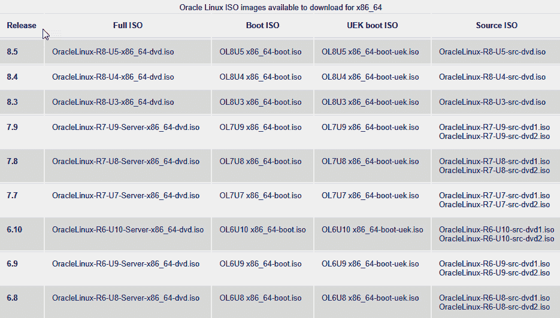

图 1.1 – x86_64 ISO

+   **AArch64**：这是在使用 Oracle Linux 运行 Arm 服务器时所需要的，例如 Raspberry Pi 或 Ampere 的高性能*云原生处理器* CPU。云原生处理器是专门为运行云原生应用程序设计的 CPU，优化了更低的功耗，并具有更可扩展的架构。

    在 Arm 上运行 Oracle Linux 是一个非常有趣的选择，因为诸如 Java、Apache、Python 和 Podman 等应用构建块使用与 x86 架构相同的软件版本运行。所有这些构建块的运行几乎与它们在 x86 架构上的运行方式完全相同，这使得通过 Oracle Linux 切换到 Arm 对应用程序来说非常容易。Arm 的优势在于其运行成本较低，密度更高，提供了非常有吸引力的性价比故事，使得组织能够轻松降低成本同时提高性能。从下载网站下载 Arm ISO 的当前可用选项矩阵可以在下图中找到：

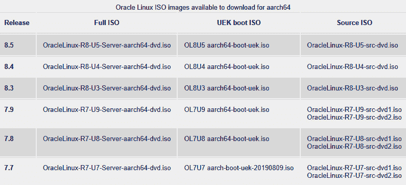

图 1.2 – Arm ISOs

一旦我们理解了平台，我们还需要做出另一个决策，选择使用哪个版本。有时你可能能够下载旧版本，并且你可能需要验证该版本是否会得到支持。在撰写本文时，虽然可以下载 6 版本，但如果你购买了*扩展支持*，则该版本会得到支持，该支持仅持续到 2024 年 6 月。

注意

Oracle 的扩展支持允许你支付费用以获得支持，包括对关键安全问题的修补程序和修复方案以及一些高影响的关键错误的修复。此支持并不涵盖所有 RPM。鉴于此，你可能需要重新考虑下载和使用旧版本的 Linux，并避免延迟操作系统的升级，直到它不再普遍可用。扩展支持的价值在于，它可以为你提供额外的时间来升级那些需要旧版 Oracle Linux 的应用程序。

在选择发布版本之前，请与你的应用团队核实该版本是否受到支持。不同的主要版本号（如 7 与 8 等）之间存在差异，一些软件可能不会在所有主版本号上提供。例如，**Oracle Linux 自动化管理器**（这是基于 AWX 项目的 Ansible 集中控制，几乎与 Red Hat 的 Ansible Tower 相同），需要 Oracle Linux 8 版本。另一个例子是 Oracle Linux 管理器（也叫 Spacewalk），需要 Oracle Linux 7 版本作为服务器。

注意

由于 Oracle Linux 跟踪 Red Hat Enterprise Linux，因此主版本号和次版本号是相同的。Oracle Linux 7.10 与 Red Hat Enterprise Linux 7.10 是一样的。

# 刻录一个可启动的 ISO

一旦你下载了 ISO 文件，可能还需要进行一些额外的准备。如果你使用 USB 设备安装，单纯将文件复制到闪存驱动器上是行不通的，因为 ISO 文件实际上并没有被解压到媒体上。如果 ISO 文件没有正确解压，且媒体没有被设置为可启动，你将无法从该媒体启动并进行安装。将 ISO 文件正确写入媒体的过程会将媒体解压成单独的文件和目录，并使媒体变得可启动。如果没有这样做，媒体上只会有一个 ISO 文件的副本。

有多种工具可以用来完成此任务。随着大多数系统不再使用光盘介质，最常见的方式是从闪存驱动器或虚拟磁盘启动服务器。

## 准备工作

在开始之前，你首先需要下载一个 ISO 镜像。你还需要一个 USB 闪存驱动器，理想情况下其空间大于 16 GB。随着发行版的增大，8 GB 的驱动器已不再足够用于完整的媒体安装 ISO。

## 如何操作…

在你可以从闪存驱动器启动之前，必须先将 ISO 文件写入闪存驱动器。在 Windows 系统中，一种常用的免费工具是**balenaEtcher**，可以从[`www.balena.io/etcher/`](https://www.balena.io/etcher/)下载。按照以下步骤操作：

1.  一旦安装了**Etcher**，你需要运行它（确保右键点击并以管理员身份运行），然后选择镜像文件作为源，选择闪存驱动器作为目标。

1.  在以下截图中，源是用于**x64**的**Oracle Linux 8.7 ISO**，目标是闪存驱动器：

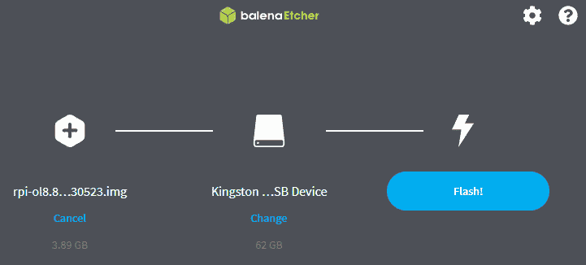

图 1.3 – 使用 Etcher 选择源和目标

1.  Etcher 可以自动处理压缩文件，因此在几分钟内（如以下截图所示），你应该可以得到一只已安装镜像并准备启动的闪存驱动器：

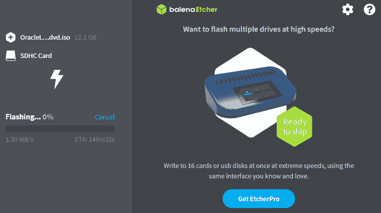

图 1.4 – balenaEtcher 写入 ISO

注意

在使用闪存设备时，要小心低价品牌。通常，非品牌的卡片性能可能比品牌卡要慢得多。另外，在网上购买时，要注意防止购买到假卡。始终从可信的供应商那里购买闪存设备。

## 工作原理…

一旦你将 ISO 文件写入 USB 设备，就可以从该媒体启动服务器。如何从 USB 设备启动取决于系统的品牌和型号。Arm x86 系统在其**基本输入/输出系统**（**BIOS**）中有一个设置，允许你从新写入的媒体启动。Arm 系统通常使用**统一可扩展固件接口**（**UEFI**）固件从 ISO 或 USB 设备启动。

安装 Oracle Linux 到服务器上的最常见方法之一是直接从 ISO 文件启动。企业级服务器，例如 Ampere Arm 系统，可以通过将 ISO 文件挂载为虚拟驱动器来支持从 ISO 文件启动。此外，你还可以使用一种名为 PXE 的网络启动技术来启动，PXE 发音为*pixie*。

# 一石二鸟 – 在 Windows 子系统 Linux（WSL）上运行 Oracle Linux

还有一种方法可以在 Microsoft Windows 桌面上安装 Oracle Linux，使用 WSL。

WSL 使你可以轻松在 Windows 上直接安装 Oracle Linux，无需安装传统的虚拟机（如 VirtualBox）。WSL 包含一个集成的虚拟机，已为 Windows 预先配置，用户看不到虚拟化程序。WSL 还具有一个优点，即允许你直接从 Windows 执行 Linux 命令，包括 Linux 服务，如 Apache、MySQL、SSHD、Nginx 和 PostgreSQL。

## 准备工作

在开始之前，你需要一个可以连接互联网的 Windows 10 或 Windows 11 系统，并且你需要具有本地管理员权限。这不是一个复杂的步骤，非常值得花时间进行操作。

## 如何操作…

安装 WSL 相对简单。你需要执行以下步骤：

1.  以管理员身份启动命令提示符。别忘了右键点击**命令提示符**，以管理员身份运行，如下图所示：

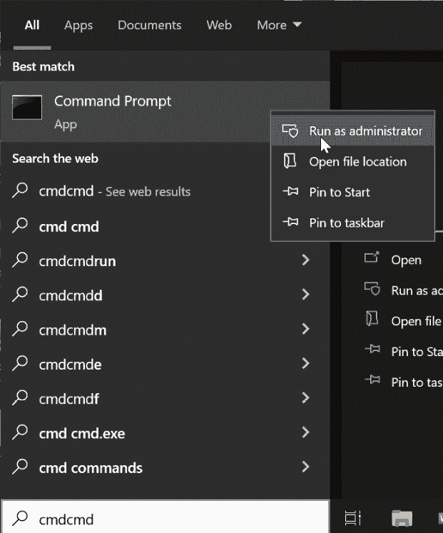

图 1.5 – 以管理员身份运行命令提示符

注意

虽然这些说明是针对 WSL 的，但请注意，它实际上是覆盖**WSL2**。之前有一个早期版本的 WSL，也称为**WSL1**，其工作方式略有不同，且不再使用或部署。通常应该避免使用旧版本的 WSL。操作系统版本也应如此；尽可能使用最新的 8.X 版本。

1.  从命令提示符运行 `wsl.exe –install` 命令。此操作将启动几个任务，包括安装启用 WSL 的 Microsoft VM 平台、安装 WSL 子系统本身以及安装 Ubuntu Linux 发行版。

    安装完成后，如下图所示，Windows 需要重启：

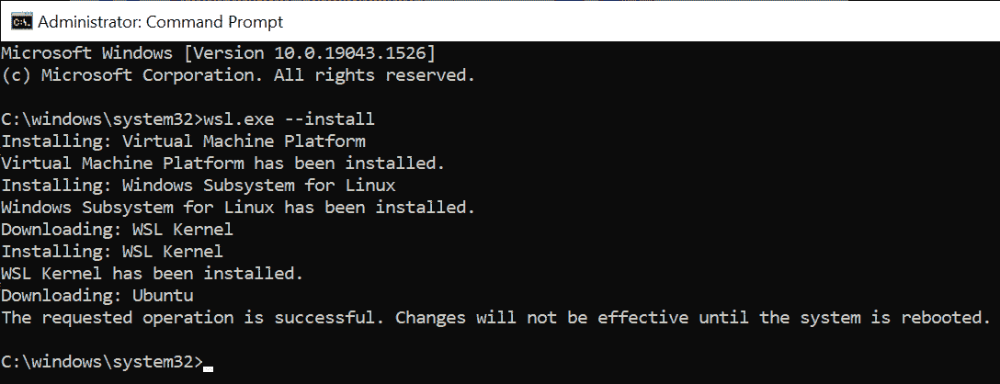

图 1.6 – WSL 安装

1.  在备份好系统之后，我们将安装 Oracle Linux 8.5 作为 WSL 使用的 Linux 操作系统。为此，在搜索栏中启动 `Oracle Linux`：

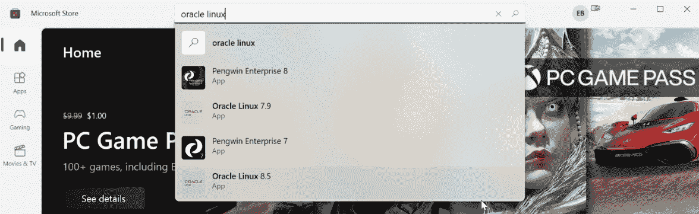

图 1.7 – Microsoft Store 搜索 Oracle Linux 8.5

1.  在搜索结果中，选择**Oracle Linux 8.5**应用程序。这将带你进入一个可以在 WSL 下下载并安装 Oracle Linux 8.5 的页面：

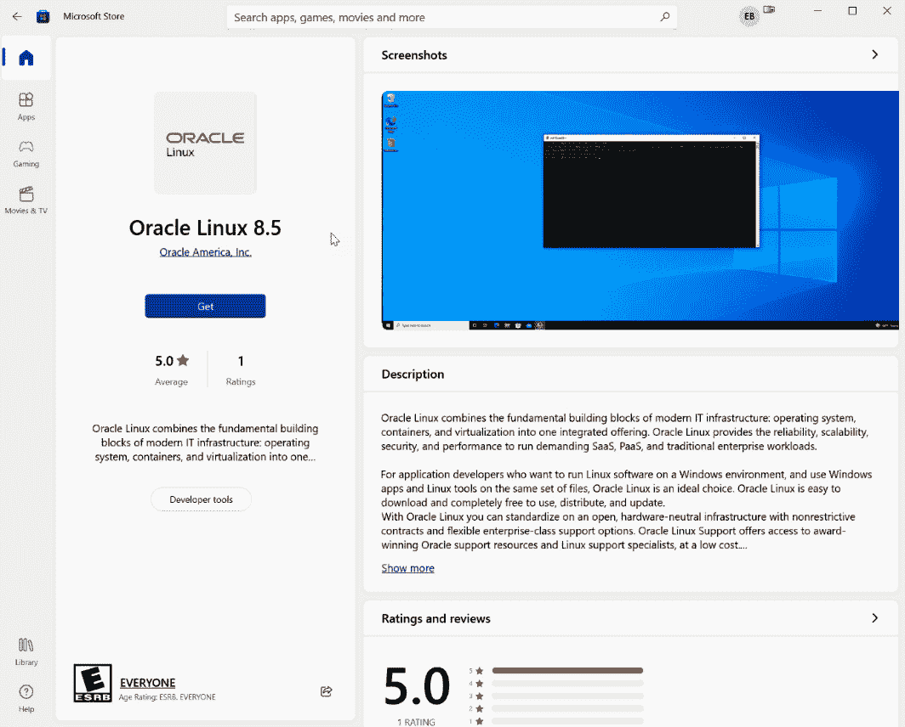

图 1.8 – 在 Microsoft Store 中的 Oracle Linux 8.5

1.  点击 `Oracle Linux`。这不仅会找到子系统，还会给你一个选项，将子系统固定到任务栏或开始菜单中，如下图所示：

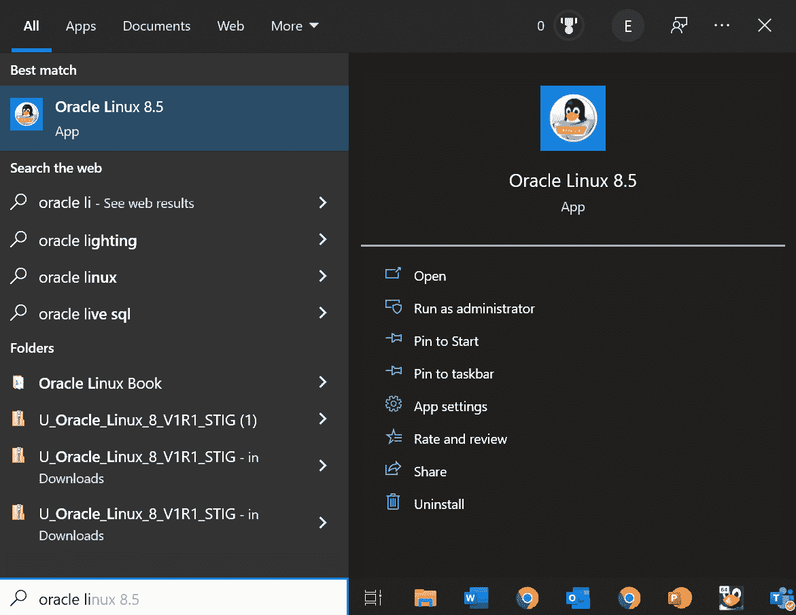

图 1.9 – Oracle Linux 8.5 子系统应用选项

1.  当你运行 WSL 子系统时，它几乎与其他任何 Oracle Linux 8.5 系统一样工作。现在你可以轻松地在 Windows 下运行 Oracle Linux 命令。这包括检查存储容量，使用 `dnf` 安装程序，编辑文件，以及通过 SSH 连接到其他主机：

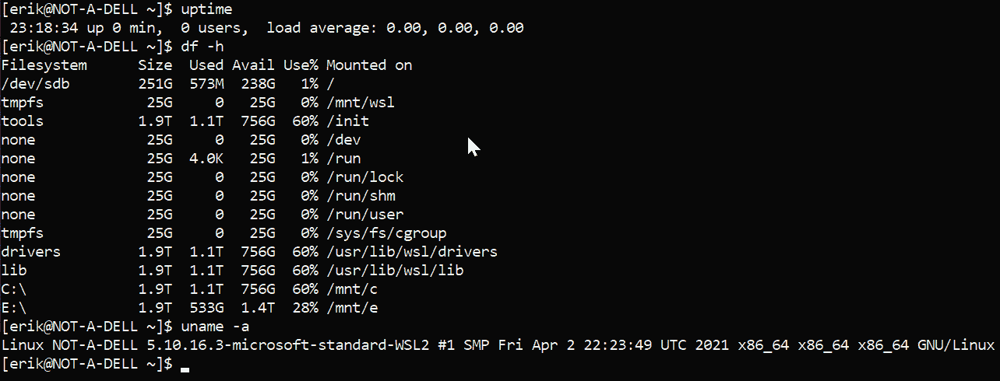

图 1.10 – WLS 操作系统命令

你还可以使用 `dnf` 安装新软件。以下图展示了安装 `nmap` 的示例：

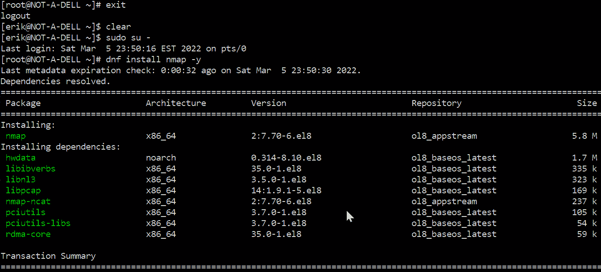

图 1.11 – 使用 dnf 安装 nmap 的 WSL

你还可以通过 WLS 访问 Windows 驱动器。它们将分别以 `/mtn/DRIVE` 位置呈现，其中 `C:` 驱动器是 `/mnt/c`。Windows 系统也可以通过 `\\wsl$\OracleLinux_8_5` 路径访问 Linux 目录：

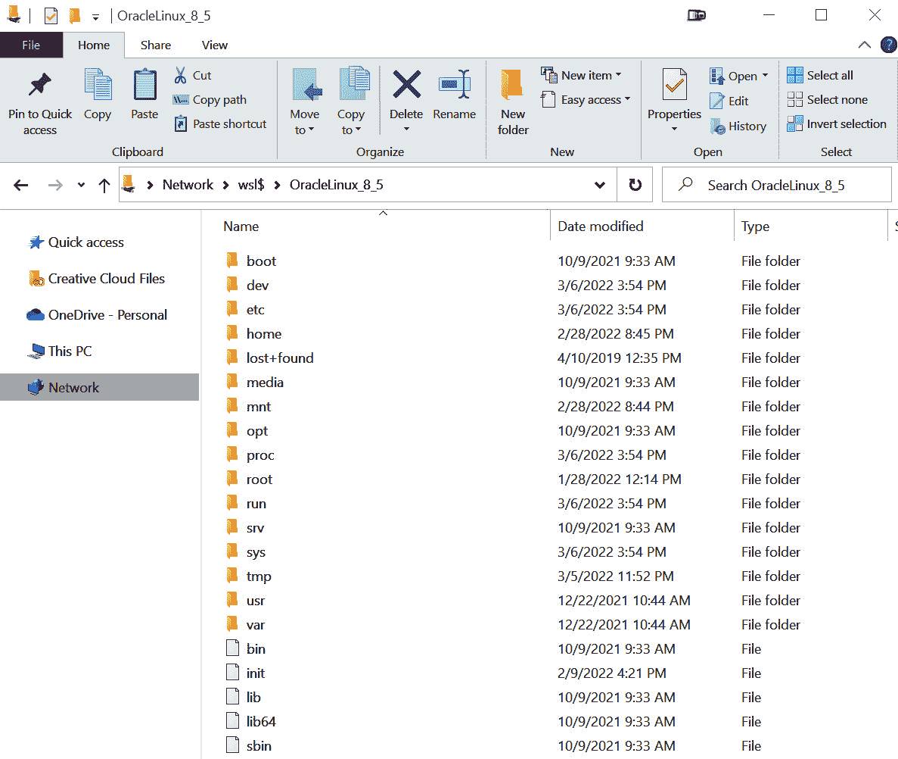

图 1.12 – Windows 文件资源管理器与 WSL

小心

提醒注意，在编辑文件时要小心。Windows 和 Linux 在文本格式上有所不同，如果不小心，很容易损坏文件。建议使用 Windows 存储和访问 Windows 文件，使用 WSL 映像编辑和存储 Linux 文件。

将 Oracle 8.5 作为 Windows 子系统运行是系统管理员和开发人员的一个非常棒的工具。它与 Windows 的集成使得安装变得快速简便，同时还允许在个人系统上透明地访问 Linux 系统。

# 为 IT 的未来做准备——这不仅仅是一片树莓派

首先，让我们聊一聊 **高级 RISC 机器**（更常见的叫法是 Arm CPU）上的 Oracle Linux。这种较新的架构相比于 Intel 和 AMD 使用的较老的 x86_64 架构有许多优点，包括更低的功耗；更低的延迟，提供更好的性能；以及简化的架构，支持更高密度的系统。在 Arm 系统上利用 Oracle Linux 已经成为 Oracle 和 Microsoft 等云规模运营商，以及那些希望降低计算能力和冷却需求的小型组织的热门选择。

在所有 Linux 系统上使用单一的 *企业操作系统* 有几个优点，例如可以在所有服务器上使用相同的工具，并且可以获得相同的商业支持。对于你的服务器库存中的 Arm 用例也很有趣。总体而言，Arm 处理器由于其更高的 *潜在* 核心密度和更低的 *功耗*，提供了更低的成本。在企业领域，**Ampere** 占据主导地位，并提供最多 128 核心的 Arm 处理器，这些处理器可以在一个单一的 **机架单元**（**RU**）空间内工作。

性能也毫不逊色，每个处理器支持最多 128 个 Arm 核心，两个 RU 空间内的 CPU 频率最高可达每核心 3.0 GHz。I/O 也非常强大，提供 128 条高速 PCIe Gen4 通道和 8×72 ECC 保护的 DDR4 3200 内存。配备 64 GB **双列直插内存模块**（**DIMMs**），相当于*4 terabytes*的内存！这些都是企业级系统，具备 Oracle Linux 的所有强大功能、安全性和可靠性。

Arm 不仅适用于数据中心；当你需要一个小型系统时，比如 DNS 服务器或远程访问设备，著名的树莓派非常适合。凭借其小巧的体积，树莓派非常适合藏在配线室里作为备份 DNS 服务器，或者放在 Oracle Exadata 机柜内以启用远程访问。你甚至可以将树莓派用作监控系统或 DMZ 中的 Web 服务器。

无论你使用的是哪种 Arm 平台（Ampere 还是树莓派），运行 Oracle Linux 时，你还可以访问 UEK 及其增强功能，包括 Ansible 等工具。Oracle Linux 包含了所有主要技术，支持价格低廉，而且你总是可以选择免费使用；你甚至可以免费打补丁。就 Arm 平台而言，它也没有限制。你可以使用商业软件，如 MySQL 8.0，以及大量的开源软件。

不仅是树莓派的应用案例非常强大。当你使用更大的基于 Arm 的服务时，你会开启大量边缘计算的应用场景。边缘计算需要将数据从云端带到需要低延迟访问数据的位置。借助 MySQL 8.0 的复制功能，你可以轻松地将数据从云端复制到边缘，保持性能的同时，还能利用如 Ampere 等公司生产的 Arm 系统的高核心数和低功耗要求。Ampere 提供的 80 核 CPU 功耗仅为 210w。高核心数结合 Docker 和 Kata 容器等容器技术，支持分布式微服务架构，通过集中管理的应用程序既能利用云的自动化特性，又能提供传统本地解决方案的性能。这就是 IT 的未来。

## 准备工作

在开始之前，你需要一台带有 Micro SD 卡槽的树莓派。你还需要一张可以用来安装操作系统的 Micro SD 卡。如果你正在使用树莓派计算模块或 Ampere 系统等企业级 Arm 服务器，请跳转到*第二章*并通过 PXE 启动系统。

## 如何操作...

话虽如此，让我们在树莓派上安装 Oracle Linux 吧。虽然我一直在使用 Oracle Linux for Arm 并通过繁琐的方式安装它，但现在已经有了一种更简单的安装方法。Oracle 提供了免费的树莓派镜像，操作系统已经安装好了。

接下来，我们将执行以下步骤：

1.  下载 Oracle 镜像，请访问以下链接：[`www.oracle.com/linux/downloads/linux-arm-downloads.html`](https://www.oracle.com/linux/downloads/linux-arm-downloads.html)。

1.  接下来，您需要将镜像写入 SD 卡。从 Windows 系统执行此操作最简单的方法是使用 **balenaEtcher**，这是一个免费的实用工具，可以轻松地将镜像写入 SD 卡和 USB 驱动器。您可以从 [`www.balena.io/etcher/`](https://www.balena.io/etcher/) 下载。

注意

虽然示例中使用的是 balenaEtcher，但还有许多其他方式可以将文件写入闪存驱动器，例如使用 Raspberry Pi Imager，或者在 Linux 中直接使用`dd`命令将文件写入闪存驱动器。

1.  运行 Etcher（确保右键点击并以管理员身份运行），并将镜像文件选为*源*，将 SD 卡选为*目标*：

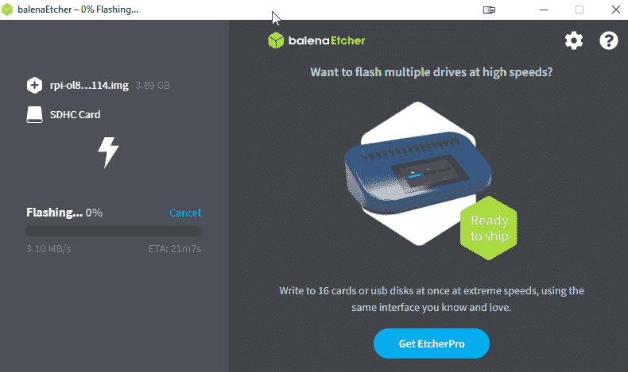

图 1.13 – 烧录 Pi SD 卡

Etcher 可以自动处理压缩文件，所以一两分钟后，您就应该拥有一张已经安装了镜像的 SD 卡。

1.  接下来，将 SD 卡插入您的 Pi 并启动 Pi。正常的 GRUB 启动加载程序将启动，并且应该会出现登录提示符。


图 1.14 – 启动 Pi

是的，就是这么简单！

1.  一旦启动，使用 `root` 用户登录，密码是 `oracle`。系统会要求您更改密码。

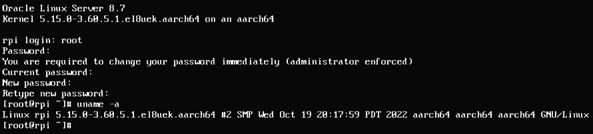

图 1.15 – 首次登录

1.  现在由您决定要安装什么。默认情况下，它可以访问免费的 Oracle 公共 **yum** 服务器，因此 yum 开箱即用。

1.  对于 Oracle Linux 8，您可以访问以下软件仓库：

    +   `/etc/yum/repos.d` 目录下的 `EPEL.repo` 文件，包含以下文本：

        ```
        [ol8_EPEL]
        name=Oracle Linux 8 EPEL ($basearch)
        baseurl=https://yum$ociregion.oracle.com/repo/OracleLinux/OL8/developer/EPEL/$basearch/
        gpgkey=file:///etc/pki/rpm-gpg/RPM-GPG-KEY-oracle
        gpgcheck=1
        enabled=1
        ```

    可以使用 `dnf` 命令通过以下命令添加 EPEL 库：

    ```
    dnf install oracle-epel-release-el8
    ```

花几分钟玩一下 Arm 系统。它们多功能、低成本且非常灵活。您应该能找到很多 Oracle Linux 在 Arm 上的使用场景。

# 从 Oracle Linux 7 升级到 8

系统管理员经常面临的一个挑战是，当部署了较旧版本的操作系统，并且即将达到支持结束的日期时该怎么办。这种情况确实会发生，而且并不轻松。这将使您处于一个需要在新系统上重新安装较新操作系统，然后迁移工作负载的局面。对于许多系统，存在一种更好的方式，称为**Leapp**。

Leapp 允许您将操作系统从 Oracle Linux 7 升级到 Oracle Linux 8。无需在新系统上重新安装一切。**Leapping** 包含两个阶段：

+   一个检查系统以确定软件是否可以升级的预升级阶段

+   一个实际执行升级的第二阶段

听起来不错。但有一些事情是你需要了解的。

## 准备就绪

首先，Leapp 从 7 到 8 的升级并不支持所有用例。*表 1.1*展示了 Oracle 在执行此操作时将提供支持的内容。Leapp 在与复杂应用程序（如根据底层*操作系统版本*有特定安装选项的数据库系统）一起使用时，并不总是表现良好。它也可能会破坏一些操作系统未包含的应用程序：

| **Leapp** **支持** | **Leapp** **不支持** |
| --- | --- |

| 平台（最新发布的更新）：

+   x86_64

+   Arm (AArch64)

操作系统：

+   当前 Oracle Linux 7 版本仅适用

配置：

+   最小安装

+   虚拟化主机

+   带图形界面的服务器

+   基本 Web 服务器

+   基础设施服务器

+   文件和打印服务器

| 安装了以下内容的系统：

+   ISV 应用程序，包括 Oracle 数据库和中间件

ISV 必须提供并验证 Leapp 角色，以协调其应用程序的升级：

+   Oracle Linux Manager 或 Spacewalk for Oracle Linux

+   未使用 ISO 镜像的安装，如 Ceph 和 GlusterFS

+   LUKS 加密磁盘的迁移

+   已注册到 ULN 的系统

+   处于 FIPS 模式或运行 Secure Boot 的系统

+   配置了 Docker 容器的系统

|

表 1.1 – Oracle 提供的 Leapp 支持矩阵

接下来，Leapp 在升级内核时也存在一些限制。以下表格展示了 Oracle 提供的矩阵：

| **平台说明** | **起始内核（Oracle** **Linux 7)** | **结束内核（Oracle** **Linux 8)** | **支持** |
| --- | --- | --- | --- |
| 未使用 Btrfs 文件系统的 x86_64 | RHCK | RHCK | 是 |
| RHCK | UEK | 否 |
| UEK | UEK | 是 |
| UEK | RHCK | 否 |
| 使用 Btrfs 文件系统的 x86_64 | RHCK | RHCK | 否 |
| RHCK | UEK | 是 |
| UEK | UEK | 是 |
| UEK | RHCK | 否 |
| AArch64 | UEK | UEK | 是 |

表 1.2 – Oracle 支持的内核升级

### 在进行 Leapp 操作之前，请务必先查看

在从 7 到 8 进行 Leapp 操作之前，您需要检查以下几点：

+   请确保您有一个可靠的备份。如果情况不顺利，系统快照最为有效。

+   如果 Secure Boot 正在运行，请使用`mokutil --sb-state`禁用它。您可以通过运行`bootctl` `status`命令检查其状态。

+   请确保您有控制台访问权限，以防需要排查问题。

+   禁用任何网络挂载，例如 NFS 挂载、Samba 挂载、GlusterFS 挂载等。请在`/etc/fstab`文件中禁用它们。

+   如果您使用`yum-plugin-versionlock`，请使用`yum versionlock` `clear`命令清除任何锁定。

+   如果您正在运行*任何 KVM 虚拟机*，请停止它们。您可以使用`virsh shutdown $VM_NAME`命令完成此操作。如果不确定是否运行任何虚拟机，您可以通过`virsh list --all`命令列出所有虚拟机。

+   如果您使用 Spacewalk、Oracle Linux Manager、Unbreakable Linux Network 或任何其他集中式 yum 管理器，请将系统从中注销。您必须使用`yum.oracle.com`仓库进行 Leapp 操作。

+   如果您需要通过 HTTP 代理访问`yum.oracle.com`仓库，请确保它已添加到您的`/etc/yum.conf`文件中。

+   验证你是否在`/etc/locale.conf`中使用了`en_US.UTF-8`。你可以通过`localectl set-locale LANG=en_US.UTF-8`命令切换。

+   在你的`/etc/ssh/sshd_config`文件中，验证是否可以以 root 用户登录。配置文件中应该有`PermitRootLogin yes`。

一旦你验证了这个列表，使用`yum update -y`通过`yum.oracle.com`对你的系统进行补丁更新，然后重启。

最后，你可以通过以下命令添加*Leapp*仓库：

```
yum install -y leapp --enablerepo=ol7_leapp,ol7_latest
```

接下来，再次进行一次重启，并可能做第二次备份。重启后，如果你使用代理来访问它们，那么你需要在`/etc/yum.repos.d/leapp-upgrade-repos-ol8.repo`的每个仓库条目中添加代理服务器。你可以使用简单的`sed`命令来完成：`sed -I '/^enabled=0.*/a` `proxy=http://proxy-host:proxy-port' /etc/yum.repos.d/eap-upgrade-repos-ol8.repo`。

恭喜，你现在已经准备好分析系统了！

## 如何操作…

你需要执行以下步骤：

1.  如果你不在 Oracle 云（OCI）上运行，可以通过以下命令运行报告：

    ```
    leapp preupgrade --oraclelinux
    ```

1.  如果你在 OCI 上，运行以下命令：

    ```
    leapp preupgrade --oci
    ```

    这两个命令将执行多个检查，并在发现重大问题时发出警告。但你需要深入分析这些问题：

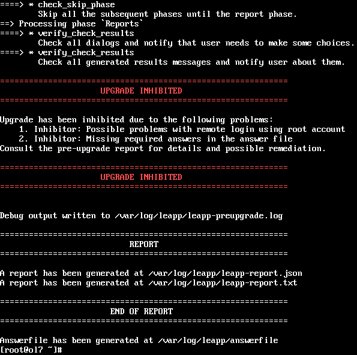

图 1.16 – Leapp 升级前结果

1.  现在，你应该会看到一些有趣的输出。`/var/log/leapp/leapp-report.txt`文件会标识出升级过程中的任何风险。风险按三种等级分类，最高等级为*致命错误*。处理任何风险，重新运行分析工具，并再次检查报告。一旦你对结果满意，就可以继续操作。

1.  下一步是查看`/var/log/leapp/answerfile`文件。该文件包含 Leapp 在系统上执行的具体检查。每个检查都包含关于系统的信息，并提示你确认要执行的操作：

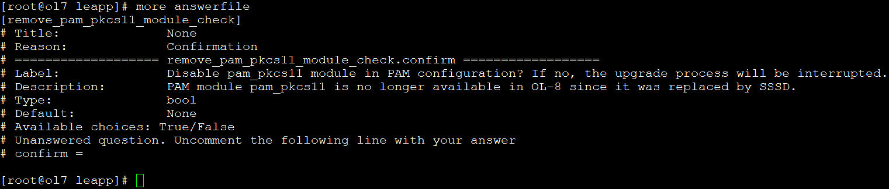

图 1.17 – Leapp 答案文件

在这个例子中，只有一个回答需要确认。要接受文件中的项目，请在该部分添加`confirm = True`。你也可以选择使用`leapp`命令来确认该行项，确保该部分匹配：

```
leapp answer --section remove_pam_pkcs11_module_check.confirm=true
```

### 现在是时候进行 Leapp 并开始第二阶段了

现在我们已经准备好了，是时候向前迈进了！与*Leapp 升级前*一样，OCI 中的 Leapp 操作与其他环境略有不同：

1.  对于非 OCI 环境（如以下截图所示），运行`leapp upgrade --oraclelinux`。对于 OCI 环境，运行`leapp upgrade --oci`：

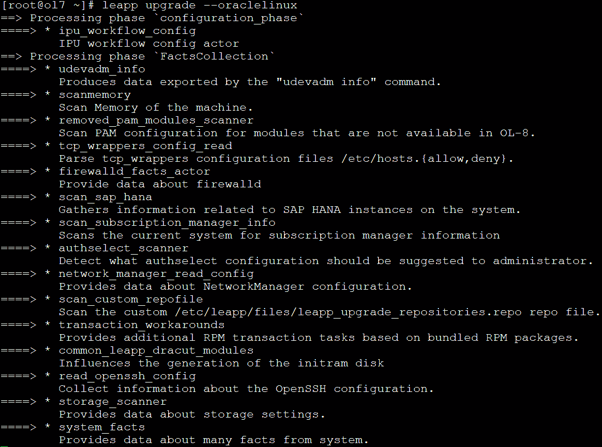

图 1.18 – Leapp 升级开始

1.  Leapp 将需要一些时间。你记得做备份了吗？当 Leapp 运行时，它将下载所有 Oracle Linux 8 软件包，小型系统大约下载 600MB，较大的安装则为 1GB：

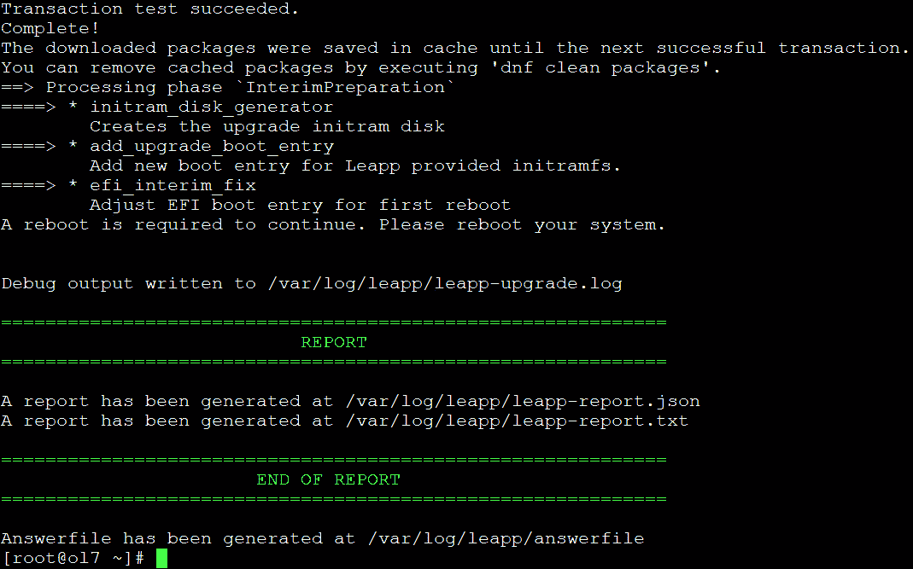

图 1.19 – Leapp 升级完成

当 Leapp 过程完成后（如上图所示），请重启。

## 它是如何工作的……

Leapp 执行就地升级，安装或升级新的 RPM 包，并重新配置启动加载程序为升级后的操作系统版本。此过程会升级 Oracle Linux 支持的应用程序，并将配置和偏好迁移到新版本。

## 还有更多内容……

当你完成重启后，你应该看到`/etc/oracle-release`更新为 Oracle Linux 8。你也可以使用`uname -r`检查内核版本。升级后，你还需要完成其他一些任务：

1.  如果你禁用了**安全启动**，你需要在系统固件中重新启用它。

1.  重新启用防火墙，因为在升级过程中它被禁用了：

    ```
    sytemctl start firewalld
    setenforce enforcing command to do this. You can also check the current state of SELinux with the getenforce command.
    ```

1.  如果你有运行中的 KVM 虚拟机，你需要使用`virsh start $``VMNAME`命令重新启动它们。

1.  你可以删除`/root/tmp_leapp_py3`目录。这是可选的，但可以释放磁盘空间。

1.  你可以将系统重新连接到正常的补丁和管理系统。这些系统应该被重新添加为 Oracle Linux 8 系统。请验证你的管理软件是否反映了新版本；并非所有管理系统都会正确更新主版本。

# 从 CentOS 迁移到 Oracle Linux

第一个问题是*为什么？* 为什么我们要讨论从**CentOS**迁移到 Oracle Linux？

在解释这个问题之前，让我们先聊聊 IBM Red Hat 在 2020 年 12 月 8 日给 Linux 社区带来的惊喜。我们所熟知的 CentOS 已经*死亡*！它已经`> /``dev/null`了。

2020 年 12 月 8 日，CentOS（由 IBM Red Hat 控制）发布了新闻：“*CentOS Linux 8，作为 RHEL 8 的重建版，将于 2021 年底结束。*”2021 年的日期比原计划提前了八年，原定于 2029 年结束 CentOS 8 版本的开发。这意味着，如果你使用 CentOS 8 并希望继续使用稳定且可预测的版本，那么你需要进行更改。

CentOS 团队正在“*将焦点从 CentOS Linux，即 Red Hat Enterprise Linux（RHEL）的重建，转向 CentOS Stream，它紧跟当前 RHEL 发布的前沿。*”记得 Fedora 吗？新技术不断引入和撤回，变化是常态并且是预期的？这基本上就是社区对 CentOS Stream 的看法。这个改变基本上摧毁了**企业系统管理员**在生产环境中使用 CentOS 8 及以后版本的能力，以及开发、测试和**质量保证**（**QA**）环境的使用。

那么，*接下来是什么？* 已经有几个项目分叉或克隆了 CentOS 的模型，复制该工作并提供一个稳定的发行版，跟踪 RHEL，拥有可预测的发布计划和稳定的组织来支持项目。你应该关心的一个问题是，如何选择正确的项目。你无法预知哪些新发行版会成功或失败。这些分叉可能需要多年才能稳定，而用户现在就需要一个解决方案。作为管理员，你不需要一个可能会改变方向的分叉或不成熟的发行版。你需要的是一个稳定的发行版，其目标是保持与 RHEL 的兼容性。Oracle Linux 提供了两者：经验证的稳定性，并通过**开放企业 Linux 协会**（**OpenELA.org**）积极投资保持与 RHEL 的兼容性。

OpenELA 由 Oracle、SUSE 和 CIQ（RockyLinux 背后的公司）共同创建。OpenELA 是一个行业协会，致力于构建一个兼容的代码库，作为 RHEL 的替代品。这使得开源社区能够合力证明 CentOS 的稳定替代品。

## CentOS 如我们所知已经不存在了，你有考虑过 Oracle Linux 吗？

Oracle Linux 追踪 RHEL，今后将 OpenELA 作为其基础代码，因此 Oracle Linux 8.3 基本上与 RHEL 8.3、CentOS 8.3 甚至 RockyLinux 8.3 相同。它被超过 86%的《财富》全球 100 强公司使用，成为企业中最受欢迎的 Linux 选项之一。由于 Oracle 在其业务和 Oracle Cloud 中使用 Oracle Linux，你可以放心，它将得到支持，不管 IBM Red Hat 对用户施加了什么新变化。

我提到过 Oracle Linux 是免费的么？它是免费下载的，免费分发的，免费打补丁的！如果你要分发，我可以免费提供一份副本，不需要律师。如果要打补丁，系统也无需注册或支付任何费用，而且下载也是免费的。获取它不需要支付许可费用！

是的，Oracle 提供了一个付费支持服务，比 RHEL 便宜得多，而且由于免费下载和打补丁的免费模式，你可以在非生产系统中免费使用 Oracle Linux，同时在生产系统上使用付费支持，且两者都使用同一个发行版。它也非常稳定，自 2006 年起就已经推出了。如今他们还支持 Arm 架构（有人需要 Raspberry Pi 吗？），并且有多个公共镜像站点供你下载，如果你不想从[`yum.oracle.com/oracle-linux-isos.html`](http://yum.oracle.com/oracle-linux-isos.html)下载。

如果你为支持付费，你可以获得一些非常酷的功能，但这些功能远远超出了 RHEL 提供的支持范围。包括以下几项技术：

+   **Ksplice**：这项技术允许你在运行时对内核和用户空间库进行补丁更新

+   **DTrace**：这项技术源自 Solaris，能够为你提供内核和应用程序内部的实时视图

+   **企业管理器**：用于管理和监控操作系统、日志等

如果你正在使用 CentOS，迁移到 Oracle Linux 非常简单。最棒的是，迁移后你能保持一切不变，这样所有应用程序都会继续运行。记住，Oracle Linux 跟踪 RHEL，是一个简单的替代品。Oracle 将迁移脚本免费提供给任何人使用，你可以从以下 GitHub URL 获取： [`github.com/oracle/centos2ol`](https://github.com/oracle/centos2ol)。

## 准备工作

在开始之前，你需要一台运行 Scientific Linux 7.x 和 8.x、Rocky 8.x、CentOS 7.x 和 8.x 的系统。如果你的 CentOS 系统是 CentOS Stream，脚本将无法工作。运行 Oracle 脚本之前还有一些其他事项需要考虑，如下所示：

+   确保你有可靠的备份。如果系统出现问题，快照是最好的选择。

+   如果启用了 Secure Boot，请使用 `mokutil --sb-state` 禁用它。你可以通过运行 `bootctl` `status` 命令来检查状态。

+   确保你有控制台访问权限，以防需要排查问题。

+   禁用任何网络挂载，例如 NFS 挂载、Samba 挂载和 GlusterFS 挂载。在 `/etc/fstab` 文件中禁用它们。

+   如果你使用 `yum-plugin-versionlock`，请使用 `yum versionlock` `clear` 命令清除任何锁定。

+   如果你正在运行 *任何 KVM 虚拟机*，请停止它们。你可以使用 `virsh shutdown $VM_NAME=` 来做到这一点。如果你不确定是否正在运行虚拟机，可以通过运行 `virsh list --all` 命令来列出所有虚拟机。

+   如果你使用的是 Spacewalk、Oracle Linux Manager、Unbreakable Linux Network 或其他集中式的 *yum* 管理器，请确保 `yum` 命令能够正常工作。与 Leapp 不同，你可以针对私有仓库运行该脚本。

+   如果你需要一个 HTTP 代理来访问你的 yum 服务器，请确保它已经添加到 `/etc/yum.conf` 文件中。

+   如果你使用任何第三方 *yum 仓库*，请确认它们的包不会与正在运行的内容冲突。在进行切换时，最好禁用这些仓库。

+   检查过时的仓库。如果仓库无法正常工作，禁用它。

+   确保 `/var/cache` 目录中至少有 5 GB 的可用空间。

+   禁用所有自动 *yum* 更新。

## 如何操作…

现在你已经检查并准备好系统进行从 CentOS 的迁移，实际从 CentOS 8.x 的迁移非常简单。你现在需要按照以下步骤进行：

1.  升级的简便方法是使用 `wget` 从 GitHub 下载原始脚本文件：[`raw.githubusercontent.com/oracle/centos2ol/main/centos2ol.sh`](https://raw.githubusercontent.com/oracle/centos2ol/main/centos2ol.sh)。

1.  接下来，你需要执行 `chmod +x` 操作，使脚本具备执行权限，命令如下：

    ```
    chmod +x centos2ol.sh
    ```

1.  还记得 CentOS 8 早早就停止支持了吗？这也意味着 CentOS 8 的 *yum 仓库* 已经不再可用。不过，还是有解决这个小问题的办法。现在，你可以使用位于 [vault.centos.org](http://vault.centos.org) 的一个副本，但每个仓库文件需要更新。这可以通过以下命令完成：

    ```
    ./centos2ol.sh:
    ```

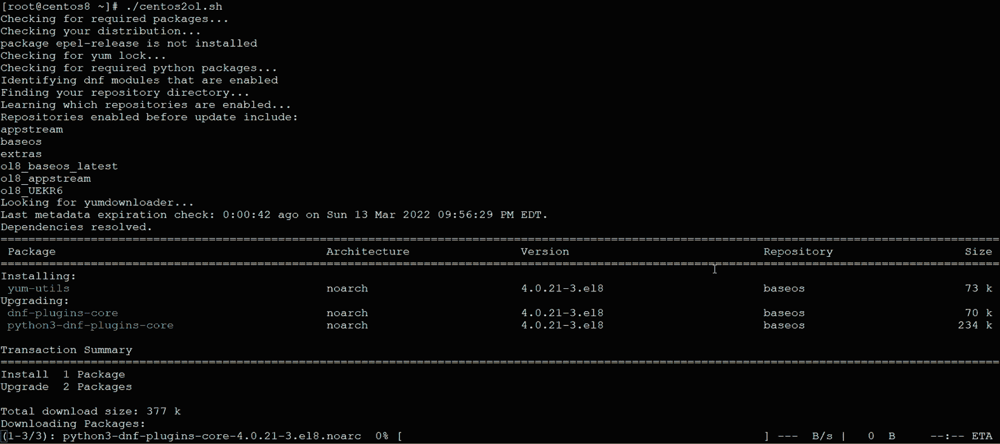

图 1.20 – 从 CentOS 迁移到 Oracle Linux 过程开始

在一个速度为 1GB/s 的快速系统上，这个过程大约会持续 5 分钟。其他系统可能需要长达 45 分钟。当脚本完成时，重启系统。和 Leapp 一样，你可以通过查看`/etc/oracle-release`以及使用`uname -r`检查内核版本来确认升级是否完成：

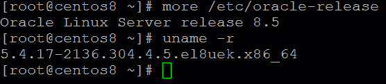

图 1.21 – 从 CentOS 8 迁移完成

一旦重启完成并且服务器启动，`/etc/oracle-release`应该正确显示 Oracle Linux。

## 工作原理……

这个脚本会将你的系统连接到新的补丁仓库，然后基本上执行一个针对 Oracle 仓库的扩展补丁过程。旧的 RPM 包会被 Oracle 的 RPM 包替换。这个脚本还可以将你从旧的 Linux 4.x 内核升级到 UEK，届时你将能享受到更高性能的 Linux 5 内核的优势。
