# 探索 Oracle Linux 中的各种启动选项和内核

本章将教你关于**启动**及其选项、内核等内容。你还将学习到许多令人兴奋的机会、工具和应用，帮助你使生活更加轻松愉快。例如，你将学会如何更改启动内核，移除并重新安装系统上的内核。你甚至将学会如何利用启动过程在不同的 Linux 内核之间切换。

启动不仅仅是加载操作系统，它还通过使用安全启动（Secure Boot）或 TrenchBoot 来帮助保护系统安全。

本章包含以下内容：

+   内核基础 – UEK 和 RHCK

+   玩转 UEFI

+   玩转安全启动

+   TrenchBoot – 提升启动安全性和完整性

+   移除 RHCK

# 内核基础 – UEK 和 RHCK

在我们开始讨论 UEK 和 RHCK 之前，首先来了解什么是 Linux 内核。Linux 内核发布指的是 Linux 操作系统核心组件的更新版本。它的主要功能是作为计算机系统硬件和软件层之间的桥梁。Linux 内核是由全球大量开发者共同开发的，Linus Torvalds 是内核主线的原始创建者和官方维护者。这些内核更新定期发布，提供新功能、改进、错误修复、安全补丁和硬件支持。

Linux 内核发布会分配一个由三个部分组成的版本号：主版本、次版本和补丁级别。例如，一个内核版本表示为 X.Y.Z，其中 X 代表主版本，Y 是次版本，Z 是补丁级别。主版本通常在发生可能影响兼容性的重大更改时增加，而次版本和补丁级别则表示增量更新和错误修复。

Linux 内核发布作为源代码分发，各种基于 Linux 的发行版或操作系统通常会打包并分发他们自己的内核版本，将其纳入各自的发行版中。此外，用户如果希望在自己的系统上直接编译和安装内核，可以访问源代码。下表显示了 Linux 7、8 和 9 版本的 Linux 内核主线发布。

| **操作系统版本** | **RHCK 版本** | **最新的** **UEK 版本** |
| --- | --- | --- |
| Linux 7 | Linux 3.x | UEK 6/Linux 5.4 |
| Linux 8 | Linux 4.x | UEK 7/Linux 5.15 |
| Linux 9 | Linux 5.14 | UEK 7/Linux 5.15 |

表 3.1 – 按版本列出的可用内核选项

# 内核基础 – UEK 和 RHCK

在全新安装的 Oracle Linux 系统中，**Unbreakable Enterprise Kernel**（**UEK**）是默认内核。然而，在某些情况下，你可能希望切换到**Red Hat Compatible** **Kernel**（**RHCK**）。

默认内核在某些场景下可能不是最合适的版本：

+   UEK 发布版本是基于比 **RHCK** 版本更新的内核版本，后者是 Red Hat 服务器的标准。使用 Oracle Linux 时，您可以选择使用 UEK，该版本提供了更新的内核发布。

+   当前的内核版本可能与您的特定硬件不兼容。UEK 系统将在新硬件上引导，而较旧的 RHCK 则不会。一个例子是 UEK 7，它支持 **Microsoft Azure Network Adapter**（**MANA**），而 UEK 6 则不支持。

+   假设系统上安装了 UEK 的 beta 或技术预览版本。在这种情况下，UEK 需要降级，以确保内核只有在管理员有意识并手动选择作为引导内核时才会使用。

+   Oracle Linux 的 UEK 提供了许多优势，如显著的性能改进和新功能。Linux 操作系统是一个模块化系统，其中内核与硬件交互，并在应用程序代表访问资源时控制和调度访问。大多数应用程序运行在称为用户空间的地方，并且只调用一组稳定的系统库来请求内核服务。唯一的例外是直接访问内核的应用程序，最常见的是安全应用程序。

+   安装 UEK 不会更改系统库，例如几乎所有应用程序（包括 Oracle 数据库）使用的接口 glibc。无论您是否使用 UEK 或 RHCK 运行 Oracle Linux，glibc 版本都是相同的。这不仅限于 gloc，对于所有系统库，如 libssl、libcurl 和 libcrypt，情况都是如此。

注意

对于任何基线操作系统发布，可能会有多个 UEK 版本可用。选择 UEK 的版本取决于应用团队，并且必须反映出任何兼容性要求。

这些示例及类似情况需要您在不同的内核类型之间进行切换。在旧版本中，管理默认内核是通过配置 GRUB 引导加载程序完成的。但是，从 Oracle Linux 8 开始，您应该使用 `grubby` 命令来控制和管理引导内核的配置。`grubby` 是 **Grand Unified Bootloader version 2**（**GRUB 2**）引导加载程序的一部分，它来自 GNU 项目。GRUB 是市场上许多 Linux 发行版的默认引导加载程序。加载到内存后，它将控制权转移给操作系统内核。

GRUB 2 是 Oracle Linux 上使用的默认引导加载程序，它可以加载许多不同的操作系统，包括 Microsoft Windows。

## 准备就绪

让我们从更深入地了解引导过程开始。

### 引导过程

您了解 Oracle Linux 引导选项如何帮助您解决系统引导时遇到的问题是很有益的。在使用新硬件或云环境时，这种知识尤其重要。

当 Oracle Linux 系统启动时，它会执行许多任务，这些任务可能会根据硬件使用的固件类型来改变，以处理系统的启动。它可能是系统驱动器上某个分区中的 `.efi` 文件。使用 `.efi` 文件让用户对启动过程有更多控制，包括能够利用新的安全功能。一个新的安全功能示例是安全启动（Secure Boot），该功能将在本章中介绍。

### 基于 UEFI 的启动顺序

以下是基于 UEFI 启动硬件使用的顺序：

1.  系统首先执行 **自检启动**（**POST**），以识别系统的配置和所有可能的启动标识符。

1.  UEFI 会搜索具有特定 **全球唯一标识符**（**GUID**）的 **GUID 分区表**（**GPT**）分区，将其标识为 **EFI 系统分区**（**ESP**），该分区包含诸如启动器等 **可扩展固件接口**（**EFI**）应用程序。如果有多个启动设备，UEFI 启动管理器将根据启动管理器中定义的顺序确定适当的 ESP。使用 **efibootmgr** 工具，如果你不使用默认定义，可以指定一个不同的顺序。

1.  UEFI 启动管理器检查是否启用了安全启动。如果没有启用安全启动，启动管理器将运行 ESP 上的 GRUB 2 启动加载程序。否则，启动管理器将请求启动加载程序的证书，并将其与存储在 UEFI 安全启动密钥数据库中的密钥进行验证。环境配置为执行两阶段启动过程，负责证书验证的 `process.efi` 应用程序的 shim 首先加载，然后才加载 GRUB 2 启动加载程序。如果证书有效，启动加载程序运行，并进一步验证其配置要加载的内核。

    启动加载程序首先将 `vmlinuz` 内核镜像加载到内存中，然后创建一个名为 `tmpfs` 的临时 RAM 文件系统。然后它用于提取 `initramfs` 镜像文件的内容。`vmlinuz` 是可引导的压缩 Linux 内核可执行文件的名称。内核中嵌入的根文件系统，并在启动过程中早期加载，称为 `initramfs`。

1.  驱动程序模块随后从 `initramfs` 文件系统加载。这些模块允许内核访问根文件系统。

1.  然后系统从第一个进程 systemd 启动。所有未来的进程都将从这个进程派生。systemd 进程的进程 ID 始终为 1。

1.  systemd 进程将运行为其定义的任何额外进程。你可以通过定义你的 systemd 单元来指定在启动过程中要处理的其他操作。建议使用这种方法，而不是使用 `/etc/rc.local` 文件的方法。

### 传统 BIOS 启动顺序

传统 BIOS 启动硬件使用以下顺序：

1.  系统首先执行 POST（开机自检），它识别系统的配置、测试内存并识别所有可能的启动设备。

1.  一旦 BIOS 识别了启动设备，它就会读取设备的第一个扇区，即**主引导记录**（**MBR**）。MBR 包含引导加载程序，它是一个负责加载操作系统的小程序。MBR 读取分区表，以确定启动分区。此外，MBR 还包含指向名为 GRUB 2 的引导加载程序的指针。GRUB 接着可以在安装了 GRUB 的同一设备或其他设备上运行引导。这在进行双系统引导（例如同时运行 Linux 和 Windows）时非常有用。

1.  引导加载程序首先将`vmlinuz`内核镜像加载到内存中，然后创建一个名为`tmpfs`的临时基于内存的文件系统。接着，`tmpfs`用于提取`initramfs`镜像文件的内容。`vmlinuz`是可引导的压缩 Linux 内核可执行文件的名称。嵌入在 Linux 内核中并在引导过程中早期加载的根文件系统称为 initramfs。

1.  驱动程序模块随后从 initramfs 文件系统中加载。这些模块是允许内核访问根文件系统所必需的。

1.  内核随后启动 systemd 进程。

1.  systemd 进程运行任何为其定义的其他进程。你可以通过定义 systemd 单元来指定在引导过程中处理的任何额外操作。推荐使用这种方法，而不是使用`/etc/rc.local`文件方法。

## 如何操作…

现在我们已经讨论了基础知识，接下来可以告别那些枯燥的部分，进入实际操作。是时候玩起来并学习了！

我们可以做的第一件事是确定当前加载的内核。以下命令将显示我们 Linux 系统中已安装并配置的所有内核（请以 root 身份运行）：

```
# grubby -–info=ALL
```

这是一个输出示例：

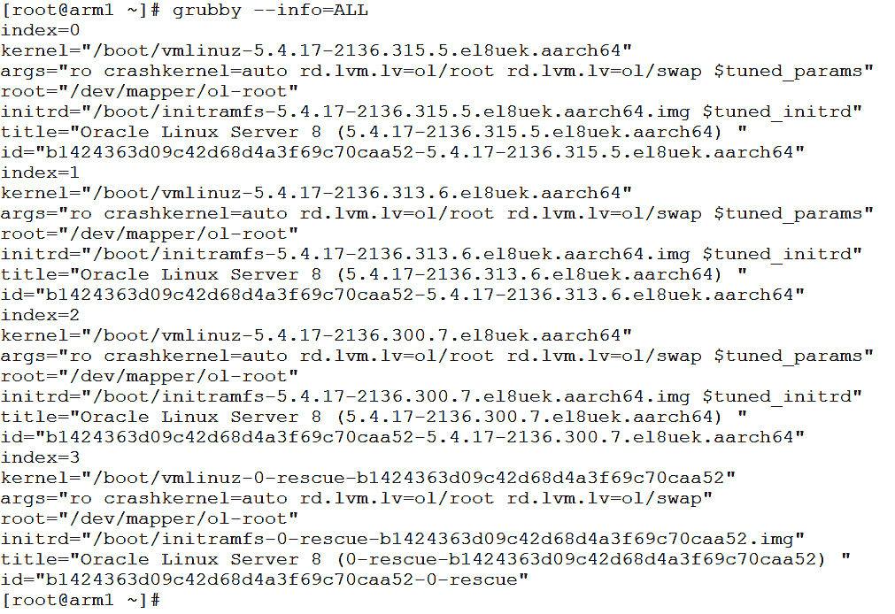

图 3.1 – grubby 输出

注意

该示例使用的是 Arm 系统，因此显示了`aarch64`后缀。x86_64 系统将显示`x86_64`后缀。

我们还可以通过执行以下命令来确定当前使用的默认内核：

```
#grubby -–info=DEFAULT
```

这是一个输出示例：

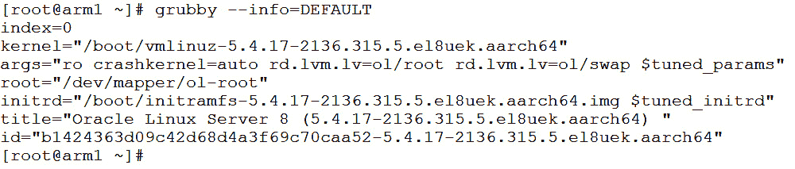

图 3.2 – grubby 默认内核

我们可以通过运行以下命令来配置特定的内核作为默认引导内核：

```
#grubby –-set-default <Kernel>
```

这是使用前述命令更改正在使用的默认内核的示例。我们知道 RHCK 将是一个版本 4 内核，因此我们将使用`4.18.0-425.13.1.el8_7.x86_64`。接下来，我们需要指向`/boot`中的文件，并在名称前加上`vmlinuz-`。

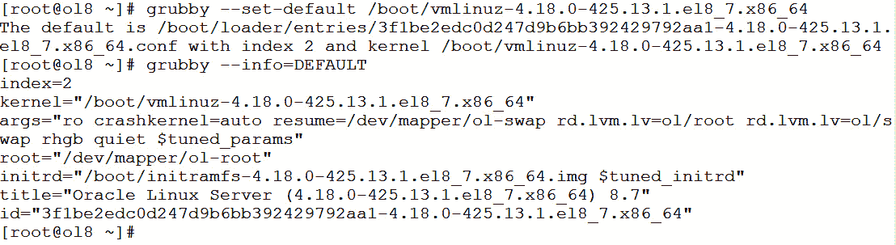

图 3.3 – 使用 grubby 更改默认内核

另一个可能用途是使用`grubby`命令更新内核配置条目，或者添加或删除应默认传递给内核的启动参数；以下是一个示例。但首先，我们将展示系统中特定内核的所有信息：

```
root@ol8 # grubby --info=/boot/vmlinuz-0-rescue-c32316cc4b5241b8adb312707ae46458
```

这将显示指定内核的详细信息，包括内核的修补程序和任何参数：

![图 3.4 – grubby 内核信息图 3.4 – grubby 内核信息使用这些内核详细信息，我们通过以下命令删除内核参数中的`rhgb quiet`配置，并添加一个新的`test`：```grubby --remove-args="rhgb quiet" --args=test --update-kernel /boot/vmlinuz-0-rescue-3f1be2edc0d247d9b6bb392429792aa1```正如您所见，我们使用内核名称来更新该内核上的参数（我们使用`–-remove-args`属性来移除一个参数配置，并使用`--args`属性添加一个新的参数）。现在，我们可以通过运行`grubby –-info=$BOOTENV`命令来检查参数结构是否发生了变化，其中的引导环境如下图所示。请注意，您可以随时使用`man grubby`命令查看`grubby`命令中的所有可用选项：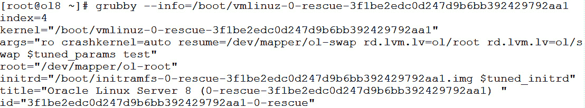

图 3.5 – 在进行更改后的 grubby 信息

## 工作原理…

如前所述，Oracle Linux 提供两种内核版本：UEK，这是 Oracle 的默认 Linux 内核版本，以及 RHCK，与 RHEL 内核兼容。无论使用哪种内核，操作系统的其余部分都是相同的；即具有相同的应用程序、库和文件位置。

本节将教您如何将默认内核（UEK）切换到 RHCK 或反之。让我们开始吧。

首先，我们再次使用`grubby`命令来检查正在使用的默认内核，并再次使用`grubby -–info=DEFAULT`和`grubby –-info=ALL`命令来检查系统中所有可用的内核。两个命令的区别在于`DEFAULT`选项仅显示引导信息。使用`ALL`选项，则显示所有可用的内核：

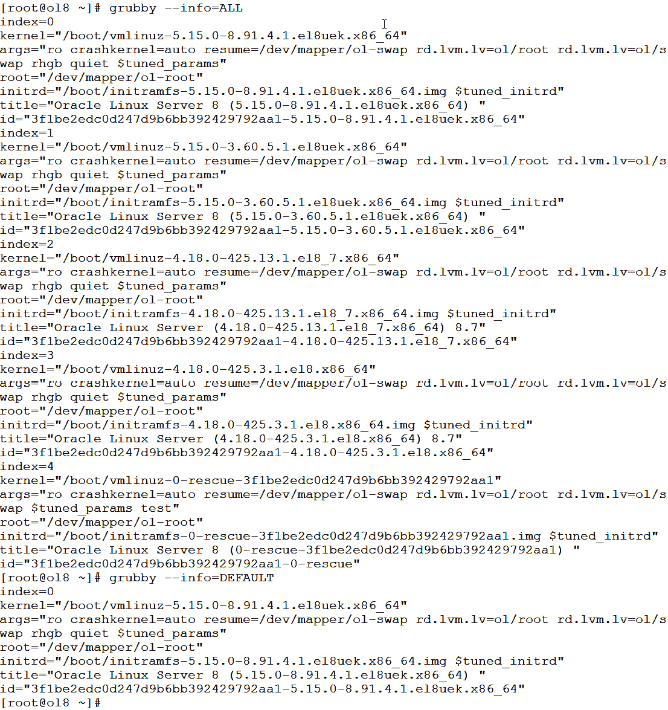

图 3.6 – 切换到 RHCK 前的内核版本

在上述示例中，您可以看到，在这种情况下，正在使用的默认内核是`/boot/vmlinuz-5.15.0-8.91.4.1.el8uek.x86_64`，这是一个 UEK 内核的变种。UEK 系统应该在`el#`后始终有`uek`。您还可以使用`uname -a`命令检查当前内核：

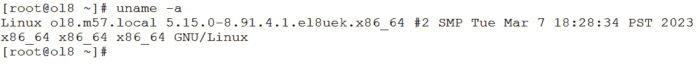

图 3.7 – 在切换到 RHCK 之前的 uname -a

要检查系统上所有可用的内核，我们可以使用先前运行的`grubby –info`命令中的数据，或者使用`rpm -qa` `kernel*core*`命令：

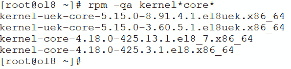

图 3.8 – 使用 rpm 命令检查内核

在检查所有可用内核时，我们可以快速识别出两种版本的 UEK 和两种版本的 RHCK。在这个例子中，我们将使用名为 `4.18.0-425.13.1.el8_7` 的 RHCK 版本，它位于 `/boot/vmlinuz-` `4.18.0-425.13.1.el8_7`。所以现在，我们使用 `grubby --set-default` 命令将所选的 RHCK 设置为默认内核。然后，我们使用 `grubby --info=DEFAULT` 命令检查默认内核：

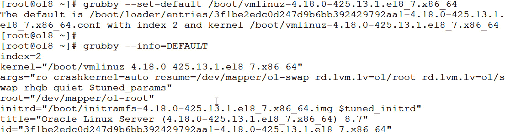

图 3.9 – 切换到 RHCK

就是这样。现在，我们需要做的就是重启系统以反映内核更改。然后，如果你想将其切换回之前的 RHCK 内核版本，只需再次运行`grubby --set-default`命令，但这次指定你想要的 RHCK 版本名称。

# 玩转 UEFI

黑客入侵系统的一种方式是在系统启动之前攻击它。为了防止这种情况，你必须通过启用 UEFI 中的安全性来保护操作系统。换句话说，如果无法信任软件正确执行代码，就不能运行该软件，因为不受信任的软件可能会篡改引导加载程序，甚至更糟，危害固件。为了解决这个问题，启动系统需要一种新的安全方法，这就是 UEFI。UEFI 实现于固件中，已经成为硬件和操作系统之间的接口，取代了之前行业默认的传统 BIOS 固件。UEFI 的一项功能是安全启动（Secure Boot），它确保系统仅使用硬件制造商信任的软件来启动系统。此外，它提供了一个验证机制（通过使用加密校验和和签名验证每个启动软件），以确保在执行之前通过验证启动加载程序来确保启动的代码是受信任的（甚至在加载操作系统之前）。如果该功能可用，UEFI 系统还可以通过兼容性支持模块以传统 BIOS 模式启动。

## 准备工作

要在 UEFI 模式下启动，Oracle Linux 在系统安装过程中需要检测到 UEFI 固件。接下来，GPT 会自动设置，并在 `/boot/efi` 挂载点创建一个 ESP，其中包含用于 UEFI 启动所需的文件。GPT 是一种存储驱动器分区信息的方式，包括分区在物理磁盘上的起始和结束位置等信息。GPT 是一种新的标准，逐步取代了以前广泛使用的 MBR 标准。GPT 不受 MBR 的限制，如分区数量和驱动程序大小，且大小限制取决于操作系统及其文件系统。请注意，GPT 是 UEFI 所要求的分区表类型，由英特尔发起。

### MBR 与 GPT

对于硬盘和固态硬盘等存储设备的分区方案，MBR 和 GPT 是两种不同的选项。为了帮助区分它们，以下是需要记住的主要差异。

+   **分区容量**：

    +   **MBR**：计算机的 MBR 允许最多四个主分区，或者三个主分区和一个扩展分区，后者可以进一步划分为多个逻辑分区。然而，MBR 的最大磁盘容量限制为 2 TB。

    +   **GPT**：默认情况下，GPT 支持最多 128 个分区，并且没有分区数量的限制。此外，它还能支持最大 9.4 ZB 的较大磁盘容量。

+   **兼容性**：

    +   **MBR**：MBR 提供更好的与旧版系统和操作系统的兼容性。它在基于 BIOS 的计算机以及旧版 Windows 和 Linux 系统中得到了广泛支持。

    +   **GPT**：现代系统，特别是那些使用 UEFI 而非 BIOS 的系统，在兼容性方面表现更好。大多数现代操作系统（如 Windows、macOS 和 Linux）都支持这种分区方案。

在决定使用 MBR 还是 GPT 时，需要考虑磁盘大小、所需的分区数量、兼容性需求以及你计划使用的具体系统或操作系统等因素。对于大磁盘和新系统，GPT 通常是更好的选择，而 MBR 仍然适用于需要与旧版引导分区兼容的老旧系统或小磁盘。

## 如何执行…

我们运行 `df -h` 命令来查看系统中的分区。请注意，在此示例中，`/boot/efi` 被挂载在 `/dev/sda1` 分区：

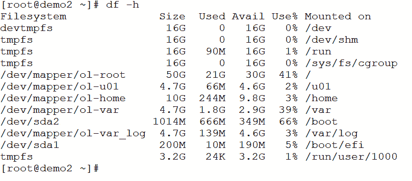

图 3.10 – df -h 命令

如果你运行 `ls -l /boot/efi/EFI/redhat` 命令，目录中包含一个名为 `shimx64.efi` 的第一阶段引导加载程序，一个名为 `grubx64.efi` 的 GRUB 2 引导加载程序，以及一个名为 `grub.cfg` 的 GRUB 2 配置文件。在 BIOS 模式下，`grub.cfg` 文件的位置有所不同，它位于 `/boot/grub2`：

```
[root@demo2 ~]# ls -l /boot/efi/EFI/redhat
total 4112
-rwx------. 1 root root     134 Aug 27 15:51 BOOTX64.CSV
drwx------. 2 root root    4096 Oct 15 19:59 fonts
-rwx------. 1 root root    6545 Feb 14 20:45 grub.cfg
-rwx------. 1 root root    1024 Feb 14 22:31 grubenv
-rwx------. 1 root root    1024 Feb 14 21:15 grubenvRvxfzJ
-rwx------. 1 root root 2288320 Oct 15 19:59 grubx64.efi
-rwx------. 1 root root  905400 Aug 27 15:51 mmx64.efi
-rwx------. 1 root root  984688 Aug 27 15:51 shimx64.efi
[root@localhost falvarez]#
```

`/etc/default/grub` 文件负责包含用户对 `grub.cfg` 文件的设置。请注意，当处于 BIOS 模式时，该文件的位置也是相同的。此外，如果你对该文件进行了更改，`grub.cfg` 文件需要重新生成：

```
[root@demo2 ~]# cat /etc/default/grub
GRUB_TIMEOUT=5
GRUB_DISTRIBUTOR="$(sed 's, release .*$,,g' /etc/system-release)"
GRUB_DEFAULT=saved
GRUB_DISABLE_SUBMENU=true
GRUB_TERMINAL_OUTPUT="console"
GRUB_CMDLINE_LINUX="crashkernel=auto resume=/dev/mapper/ol-swap rd.lvm.lv=ol/root rd.lvm.lv=ol/swap rhgb quiet"
GRUB_DISABLE_RECOVERY="true"
GRUB_ENABLE_BLSCFG=true
```

要重建 `grub.cfg` 文件，请使用 `grub2-mkconfig` 命令并指定输出文件，使用 `-o` 选项，例如 `/boot/efi/EFI/redhat/grub.cfg`：

```
[root@demo2 ~]# grub2-mkconfig -o /boot/efi/EFI/redhat/grub.cfg
Generating grub configuration file ...
Adding boot menu entry for EFI firmware configuration
done
```

用于管理 UEFI 引导过程的工具称为 `efibootmgr`（它提供一个显示引导条目的引导菜单）。它还允许我们通过以下方式操作引导条目：

+   修改引导顺序

+   创建引导条目

+   删除引导条目

+   指定下次引导时使用的引导条目

## 它是如何工作的…

你可以通过运行不带选项的 `efibootmgr` 命令来查看引导条目的摘要。若要查看更多详细信息，可以添加 `-v` 选项：

```
[root@demo2 ~]# efibootmgr -v
BootCurrent: 0004
Timeout: 0 seconds
BootOrder: 0004,0000,0001,0002,0003
Boot0000* UiApp
Boot0001* UEFI VBOX CD-ROM VB2-01700376
Boot0002* UEFI VBOX HARDDISK VB2d5be0c5-80049c5d
Boot0003* EFI Internal Shell
Boot0004* Oracle Linux
[root@demo2 ~]# efibootmgr -v
BootCurrent: 0004
Timeout: 0 seconds
BootOrder: 0004,0000,0001,0002,0003
Boot0000* UiApp FvVol(7cb8bdc9-f8eb-4f34-aaea-3ee4af6516a1)/FvFile(462caa21-7614-4503-836e-8ab6f4662331)
Boot0001* UEFI VBOX CD-ROM VB2-01700376      PciRoot(0x0)/Pci(0x1,0x1)/Ata(1,0,0)N.....YM....R,Y.
Boot0002* UEFI VBOX HARDDISK VB2d5be0c5-80049c5d      PciRoot(0x0)/Pci(0xd,0x0)/Sata(0,65535,0)N.....YM....R,Y.
Boot0003* EFI Internal Shell    FvVol(7cb8bdc9-f8eb-4f34-aaea-3ee4af6516a1)/FvFile(7c04a583-9e3e-4f1c-ad65-e05268d0b4d1)
Boot0004* Oracle Linux    HD(1,GPT,dff50c5d-96ed-406c-9823-212649b405bd,0x800,0x12c000)/File(\EFI\redhat\shimx64.efi)
```

如你在上面的示例中看到的那样，启动`0004`（Oracle Linux）是用来启动当前运行系统的启动项，称为`BootCurrent`。`BootOrder`是启动管理器中使用的启动顺序；因此，启动管理器将启动列表中的第一个活动项。如果启动失败，它将尝试下一个项，依此类推。如果你的系统使用 UEFI，`efibootmgr`是一个方便的命令行工具，能够帮助你管理 EFI 启动项。通过这个工具，你可以轻松查看、创建、修改和删除 EFI 启动管理器中的启动项。

如果你想删除启动项，可以使用`-B`选项。在这种情况下，我们将使用以下命令删除 CDROM 记录（`0001`）选项：

```
efibootmgr -b 0001 -B
```

你还可以使用`-o`选项更改启动顺序。在以下命令中，我们将更改启动顺序，使 UEFI Shell 成为默认启动项：

```
efibootmgr -o 0003,0004,0002,0003
```

请使用`man`命令了解更多关于`efibootmgr`命令的信息。

警告

在更改配置时要非常小心。意外地将启动顺序更改为不可启动的设备，可能会导致你进入系统恢复状态。如果你在没有访问控制台的环境中运行系统，这一点尤其重要。

# 玩转安全启动

**安全启动**是 UEFI 中实现的一个额外的可选功能，旨在帮助防止在启动过程中恶意软件的执行。要启用或禁用安全启动，你需要访问特定的 UEFI 设置程序。不同系统制造商的设置程序各不相同，请查阅系统文档了解如何访问 UEFI 配置。

安全启动步骤与常规 UEFI 启动相同，但有一个重要的例外，那就是它要求加载和执行的组件必须经过签名和身份验证（使用公私钥对进行身份验证）。它包括两个启动**信任根**（**RoT**），以构建传递的信任链：

+   验证 RoT 负责签名验证。验证 RoT 是启动 RoT，这是大多数人在谈论安全启动时所指的内容，它将位于启动闪存驱动器上，作为存储的 RoT 来保护密钥数据库。仅在**驱动程序执行环境**（**DXE**）阶段进行验证，而不是在**安全**（**SEC**）阶段进行验证。

+   测量 RoT 负责测量数据的收集。

安全启动将通过以下过程建立信任链：

1.  首先，会验证由 Oracle 和 Microsoft 签名的第一阶段引导加载程序（shim）；然后，它加载 GRUB 2 加载程序。

1.  GRUB 2 引导加载程序验证由 Oracle 签名的内核签名，并在加载和执行内核之前进行身份验证。

1.  Oracle 签署的内核已通过身份验证并执行。Secure Boot 只加载已签名/已验证的内核模块（例如，所有与内核 RPM 一起包含的内核模块以及与 Oracle Ksplice 一起使用的内核模块都有相应的 Oracle 签名，并且已签名/验证的内核模块运行时得到验证，否则将无法加载）。

现在我们已经讲解了 Secure Boot 的基础知识，接下来让我们学习如何使用它来签署内核模块。首先，在你能够签署模块之前，需要安装几个必需的软件包，包括内核源代码。此外，你还需要为密钥对创建签名证书。私钥用于签署内核模块，公钥会被添加到 Secure Boot 的内核密钥环中，允许系统验证签名。

## 准备工作

第一步是安装 UEK 开发库。可以使用以下命令完成：

```
[root@demo2 ~]# dnf -y  install kernel-uek-devel-`uname -r`
```

注意

虽然你可以直接运行`dnf install kernel-uek-devel`，但在命令中添加`uname`选项可以确保你安装的是当前运行的内核的`devel`软件包。另外，别忘了在打补丁后确保更新你的`devel`软件包。

作为一种好习惯，强烈建议更新系统，以确保你拥有最新的内核和相关软件包：

```
[root@@demo2 ~]# dnf  -y update
```

这个更新可能需要一些时间，具体取决于你上次更新系统的时间。

如果你使用的是 UEK，编译内核模块所需的内核头文件可以通过`kernel-uek-devel`包获得。在使用 UEFI Secure Boot 功能时，Oracle 推荐安装并使用 UEK。在安装 UEK 时，还需要安装`devel`软件包。通过命令中添加`uname -r`，确保安装正确的头文件。如果你不是使用最新版本的内核，这一点尤其重要。如果你使用的是 RHCK，则应使用`kernel-devel`，而不是`kernel-uek-devel`。

现在是时候安装执行模块签名操作所需的工具（`openssl`、`keyutils`、`mokutil` 和 `pesign`）：

```
[root@demo2 ~]# dnf -y  install openssl keyutils mokutil pesign
```

如果你需要从源代码构建模块，你可以选择安装`Development Tools`组，以确保可以创建工具的选项：

```
[root@demo2 ~]# dnf -y  group install "Development Tools"
```

## 如何操作…

1.  创建一个配置文件，供 OpenSSL 在生成证书时使用，以获取默认值。你可以将此文件放在任何位置，但最好将其与其他 OpenSSL 配置文件一起保存在`/etc/ssl/x509.conf`中。该文件应类似于以下内容：

    ```
    [ req ]
    default_bits = 4096
    distinguished_name = req_distinguished_name
    prompt = no
    string_mask = utf8only
    x509_extensions = extensions
    [ req_distinguished_name ]
    O = Module Signing Example
    CN = Module Signing Example Key
    emailAddress = first.last@example.com
    [ extensions ]
    basicConstraints=critical,CA:FALSE
    keyUsage=digitalSignature
    extendedKeyUsage = codeSigning
    subjectKeyIdentifier=hash
    authorityKeyIdentifier=keyid
    ```

    你应编辑`O`、`CN` 和 `emailAddress` 字段，使其更为合适。注意，在配置的`extensions`部分，`keyUsage`字段被设置为`digitalSignature`。此外，`extendedKeyUsage`选项被设置为`codeSigning`，以便与密钥验证工具兼容。

1.  使用此配置文件生成新的密钥对：

    ```
    [root@demo2 ~]# openssl req -x509 -new -nodes -utf8 -sha512 -days 3650 -batch -config /etc/ssl/x509.conf -outform DER -out /etc/ssl/certs/pubkey.der -keyout /etc/ssl/certs/priv.key
    Generating a RSA private key
    ........++++
    .......++++
    writing new private key to '/etc/ssl/certs/priv.key'
    -----
    [root@demo2 ~]#
    ```

    此签名证书有效期为 10 年（3,650 天）。确保密钥得到充分保护。可以通过将密钥从服务器复制并存储在安全位置来实现。将密钥放在 USB 闪存盘上并将其放入办公桌抽屉中是*不*安全的位置。请使用锁定的位置，如保险箱。

1.  导出证书为 PEM 格式：

    ```
    [root@demo2 ~]# openssl x509 -inform DER -in /etc/ssl/certs/pubkey.der -out /etc/ssl/certs/pubkey.pem
    [root@demo2 ~]#
    ```

### 签署模块

`sign-file`工具确保模块已正确签署以适配内核。此工具包含在内核源代码中。以下说明假定您正在为当前运行的内核签署模块。如果您打算为不同的内核签署模块，则必须提供`sign-file`工具所在的正确内核版本源的路径。如果您使用了错误的工具，模块的签名类型可能与预期的签名类型不匹配。

要签署模块，请运行当前内核的`sign-file`工具，并提供私钥和您为签署模块而创建的公钥路径（在此示例中，我使用了一个名为`hello`的公有模块）：

```
[root@demo2 ~]# sudo /usr/src/kernels/$(uname -r)/scripts/sign-file sha512 /etc/ssl/certs/priv.key \
> /etc/ssl/certs/pubkey.der /lib/modules/$(uname -r)/extra/hello.ko
```

请注意，模块应已安装到`/lib/modules/`目录中，并且您需要提供正确的模块路径。

### 更新机器所有者密钥数据库

**机器所有者密钥**（**MOK**）是一项安全功能，旨在保护计算机系统的启动过程，防止未经授权的修改或攻击。它通常用于支持**UEFI**和安全启动的系统，这些系统要求所有启动加载程序和内核模块必须由受信任的实体进行签名。

MOK 数据库存储在系统固件中的非易失性内存位置，包含一个公钥列表，这些公钥允许用于签署启动加载程序和内核模块。MOK 数据库中的每个密钥都与唯一标识符相关联，并用于验证启动加载程序和内核模块的数字签名。如果数字签名有效，启动过程将继续，软件将被加载。如果数字签名无效，或用于签署软件的密钥不在 MOK 数据库中，启动过程将被中止，系统将无法启动。

要注册 MOK 密钥，您必须在每个目标系统上使用 UEFI 系统控制台手动进行。

由于您创建的密钥不包含在 UEFI 安全启动密钥数据库中，因此您必须使用`mokutil`命令将其注册到 Shim 中的 MOK 数据库：

```
mokutil --import /etc/ssl/certs/pubkey.der
```

之前的命令提示您输入一个一次性密码，该密码用于在系统重启后，当 MOK 管理服务注册密钥时使用。

#### 重启系统

1.  UEFI Shim 应在启动时自动启动 Shim UEFI 密钥管理器，如下图所示。如果在 10 秒钟内未按下任何键，您将无法注册您的 MOK 密钥：

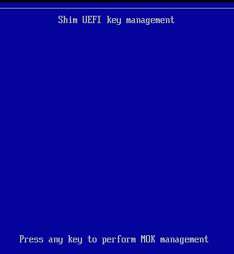

图 3.11 – Shim 工具

按任意键继续。

1.  然后您应该会看到 Shim 主菜单。从菜单中选择**注册 MOK**。

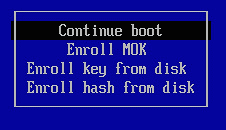

图 3.12 – Shim 主菜单

这样，您可以继续注册密钥或查看密钥。

1.  从菜单中选择**查看密钥 0**（如下图所示）以显示密钥详情。

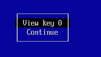

图 3.13 – 查看密钥

1.  这将显示密钥详情。验证显示的值是否与您用于签署模块的密钥匹配，并且该密钥已插入内核映像中：

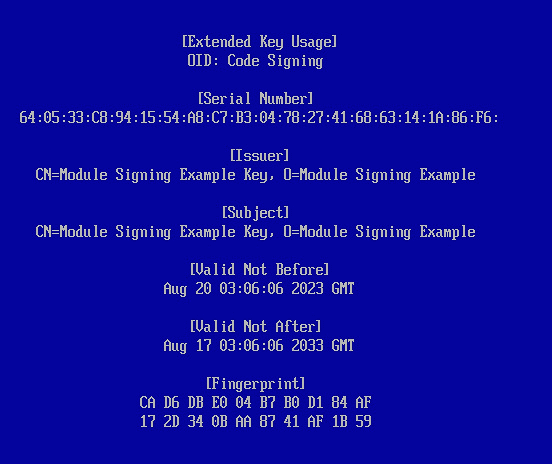

图 3.14 – 密钥详情

然后按任意键返回到**注册** **MOK**菜单。

1.  从菜单中选择**继续**。

1.  显示**注册密钥？**屏幕，现在可以从菜单中选择**是**（如下图所示）。


图 3.15 – 注册密钥

选择**是**以注册密钥。

1.  然后会提示您输入密码。请输入使用`mokutil`命令导入密钥时使用的密码。

    密钥已注册到 UEFI 安全启动密钥数据库中。

1.  您现在将被重定向到主菜单。从菜单中选择**重启**。

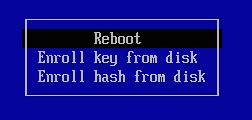

图 3.16 – 完成后重启

## 工作原理……

启动系统后，您可以验证密钥是否已包含在适当的内核密钥环中。验证取决于您正在运行的内核版本。此外，您需要检查的密钥环名称有所不同，因为各个内核版本中的实现有所变化。

如果为签署自定义模块生成的密钥已列在正确的密钥环中，您可以在安全启动模式下加载使用此密钥签署的模块。

对于 Oracle Linux 8 上的 RHCK 和 UEK R6U3 内核或更高版本，`builtin_trusted_keys`密钥环和`platform`密钥环中的密钥都被信任用于模块签名以及`kexec`工具，这意味着您可以按照标准程序签署模块并将其添加到 MOK 数据库中，使密钥出现在`platform`密钥环中，并且会自动被信任。

由于密钥可以加载到`builtin_trusted_keys`密钥环中，因此您应检查两个密钥环中的模块签名密钥。以下是一个示例：

```
[root@demo2 ~]# keyctl show %:.builtin_trusted_keys
Keyring
 718980051 ---lswrv      0     0  keyring: .builtin_trusted_keys
 889527021 ---lswrv      0     0   \_ asymmetric: Oracle CA Server: 23652876a2ec7c7794eb905265a1145e5ad5b873
 643918572 ---lswrv      0     0   \_ asymmetric: Oracle IMA signing CA: a2f28976a05984028f7d1a4904ae14e8e468e551
 668816900 ---lswrv      0     0   \_ asymmetric: Oracle America, Inc.: Ksplice Kernel Module Signing Key: 09010ebef5545fa7c54b626ef518e077b5b1ee4c
  35441076 ---lswrv      0     0   \_ asymmetric: Oracle Linux Kernel Module Signing Key: 2bb352412969a3653f0eb6021763408ebb9bb5ab
[root@demo2 ~]# keyctl show %:.platform
Keyring
 858046056 ---lswrv      0     0  keyring: .platform
 886150219 ---lswrv      0     0   \_ asymmetric: Oracle America, Inc.: 430c85cb8b531c3d7b8c44adfafc2e5d49bb89d4
 698748825 ---lswrv      0     0   \_ asymmetric: Oracle America Inc.: 2e7c1720d1c5df5254cc93d6decaa75e49620cf8
 790695213 ---lswrv      0     0   \_ asymmetric: Oracle America, Inc.: 795c5945e7cb2b6773b7797571413e3695062514
 227851788 ---lswrv      0     0   \_ asymmetric: Oracle America, Inc.: f9aec43f7480c408d681db3d6f19f54d6e396ff4
```

# TrenchBoot – 提高启动安全性和完整性

**TrenchBoot** 是一个 GitHub 跨社区、跨平台框架集成，源自 2014 年 Apertus Solutions 的一个想法，旨在解决使用 tboot 启动 Xen 时的局限性，服务于 OpenXT 项目及其他贡献者，如 Oracle（Intel）、3mdep（AMD）和 Citrix（[`github.com/TrenchBoot`](https://github.com/TrenchBoot)）。其主要目的是通过使用统一的标准方法（适用于 Xen、KVM、Linux、BSD 及可能的专有内核），扩展安全性机制和引导过程的完整性。一个常见的应用场景是 Oracle Cloud 的受保护实例。

### 准备就绪

TrenchBoot 的主要功能之一是安全地启动 Linux。此功能通过引入一个中间阶段来动态启动 AMD 和 Intel 的 Linux 内核。与传统的首次启动场景（如 XMHF、OSLO、OpenText Secure Boot 和 tboot 等开源动态启动工具使用的引导阶段）不同，TrenchBoot 提供了通过关键执行启动内核升级的能力。然后，您可以启动一个完整性内核，它能够动态检查系统并在关机时将平台的完整性建立在一个无盘嵌入式环境中。请注意，新的**中间阶段**包括一个名为**TrenchBoot Loader**的**中间加载程序**，各种引导解决方案可以启动它。TrenchBoot Loader 包含**TrenchBoot 安全引擎**，它实现了完整性处理。请参阅以下图示：

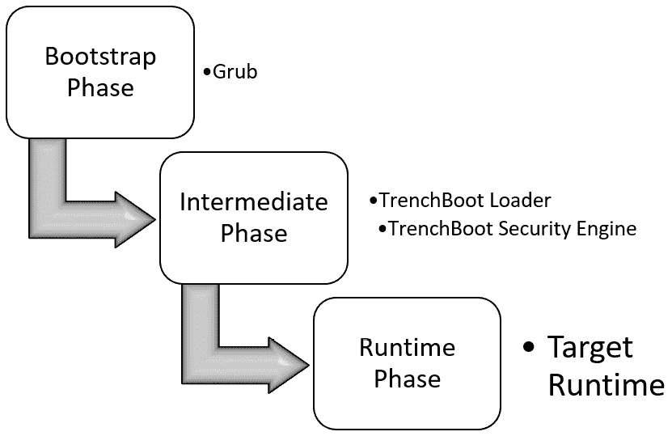

图 3.17 – TrenchBoot 过程概述

Oracle 在 Oracle Linux 内核中添加了更多的 TrenchBoot 支持，以启用 Linux 内核的安全启动协议，适用于多个用例，如笔记本的**双因素认证**（**2FA**）或众包完整性处理；这个选项是最佳选择。

注意

您可以通过阅读 kernel.org 存档来了解 Oracle 的一些努力，链接为：`lore.kernel.org/lkml/20230504145023.835096-1-ross.philipson@oracle.com/`。

## 它是如何工作的…

TrenchBoot 引导程序由一些知名组件构成，如 Linux 和 u-root。让我们深入了解其中的主要组件：

+   启用 TrenchBoot 的内核，集成 TrenchBoot u-root initramfs

+   作为 u-root 扩展的集成 TrenchBoot 安全引擎

+   一个可以通过引导程序启动的新镜像

该构建过程如下图所示：

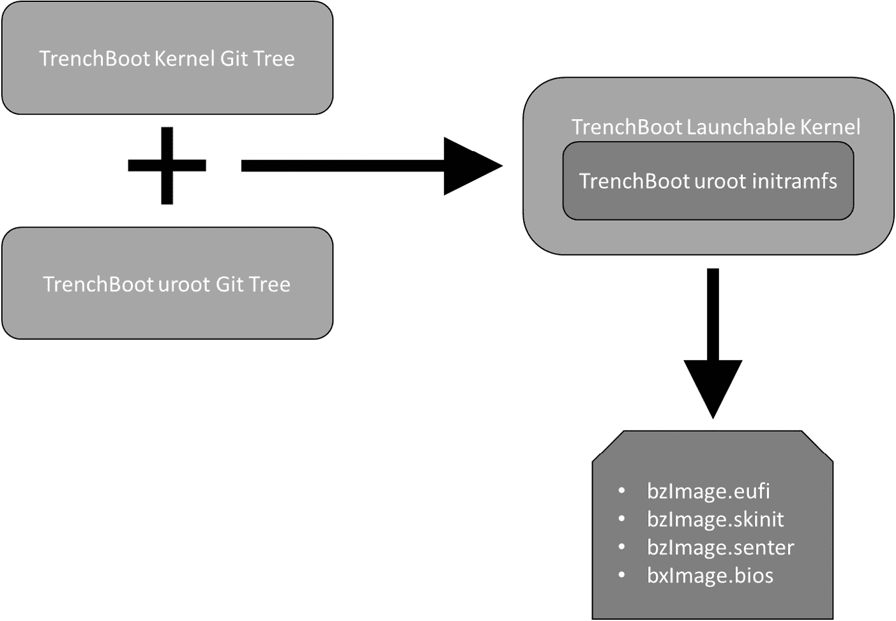

图 3.18 – TrenchBoot 镜像处理过程

使用 TrenchBoot 的主要优势如下：

+   **安全启动**：TrenchBoot 提供一个安全启动过程，确保系统上只执行可信的软件。这可以防止执行可能危及系统的恶意软件。

+   **运行时完整性**：TrenchBoot 通过在运行时验证软件和数据的完整性，确保系统在启动后仍然保持安全。它使用诸如 Intel SGX 和 AMD SEV 等技术来提供基于硬件的隔离和认证。

+   **防御攻击**：TrenchBoot 提供对各种类型攻击的防护，包括固件攻击、恶意软件和内核 rootkit。

+   **平台无关性**：TrenchBoot 是平台无关的，可以在不同的硬件平台上使用，包括 x86、Arm 和 RISC-V。

+   **开源**：TrenchBoot 是一个开源项目，任何人都可以检查其代码并为其开发做出贡献。这使得 TrenchBoot 更加透明和值得信赖。

# 移除 RHCK

在这个教程中，你将学习如何移除 RHCK 及其独特的软件包依赖关系，同时保留所有 UEK 依赖关系。记住，在安装 Oracle Linux 时，安装程序会自动安装 Oracle UEK 作为默认内核，但你可以为了兼容性目的安装 RHCK。

## 准备工作

旧版本的 Oracle Linux 需要一个叫做`kernel-transition`的工具来管理依赖关系。在新版本的 Oracle Linux 中，提供了一个更简便的过程。例如，在 Oracle Linux 8 中，这一要求已经过时。所有软件包都特别构建以避免与系统上运行的 UEK 或 RHCK 相关的任何依赖关系。这使得从系统中移除 UEK 或 RHCK 变得更加容易。

## 如何操作……

让我们来看看如何从系统中移除 RHCK：

1.  首先，让我们使用`grubby`命令检查系统中所有正在运行的内核：

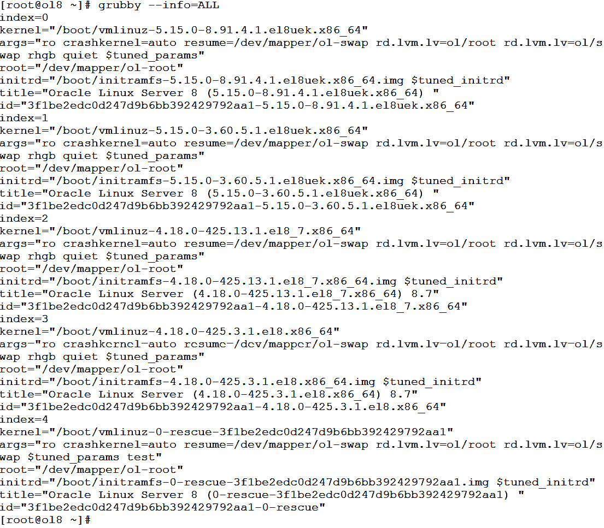

图 3.19 – 检查内核

我们可以在前面的输出中看到，当前使用的默认内核是`/boot/vmlinuz-5.15.0-8.91.4.1.el8uek.x86_64`，这是一个 UEK；同时，我们也可以看到安装了几个 RHCK，`/boot/vmlinuz-4.18.0-425.13.1.el8_7.x86_64`和`/boot/vmlinuz-4.18.0-425.3.1.el8.x86_64`，这些我们可以安全地移除。

1.  现在我们知道我们正在使用 UEK，可以安全地按照 Oracle Linux 手册中推荐的方式使用`dnf remove kernel`命令来移除所需的 RHCK。它会检测未使用的内核并显示其中的依赖关系。

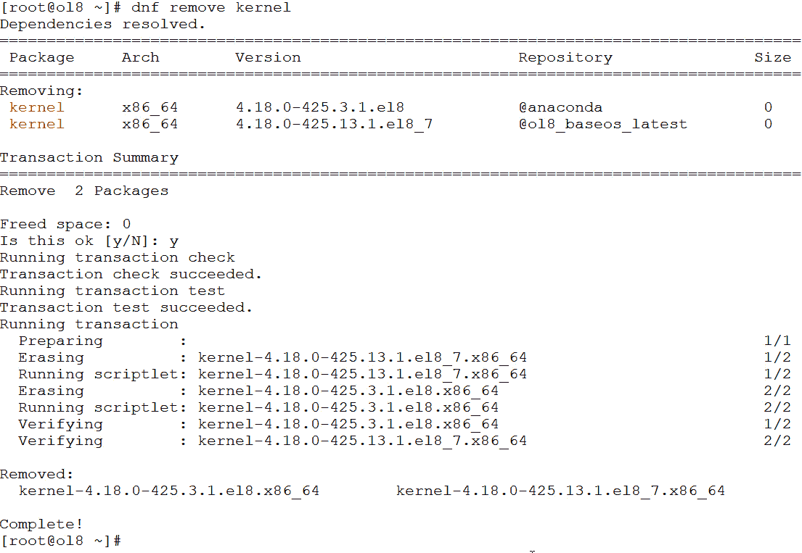

图 3.20 – dnf remove kernel

1.  如你在上面的截图中看到的，系统中已检测到并删除了所有已安装的 RHCK。现在，让我们再次运行`grubby`命令，查看 RHCK 是否真的从系统启动选项中移除。

警告

不要第二次运行`dnf remove kernel`。这样可能会意外地删除启动内核，导致系统无法启动。

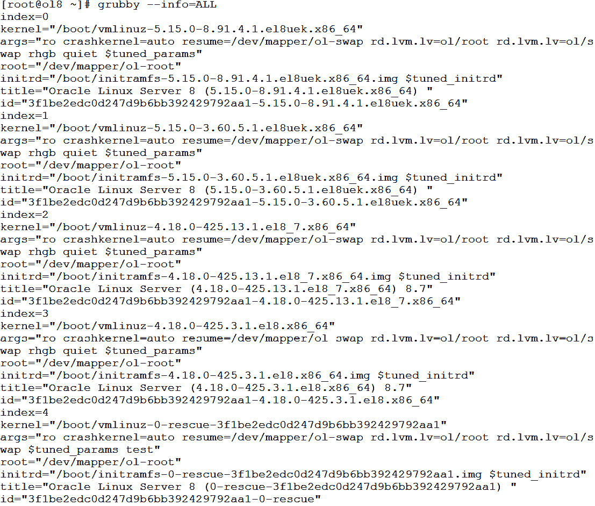

图 3.21 – RHCK 已移除

很遗憾，两个内核仍然存在。RHCK 的 `kernel-<version>` 包仅仅是一个元数据包，不包含任何文件。它的作用是确保所有依赖的内核包都正确安装。换句话说，移除 `"kernel-<version>.el8"` RPM 并不会删除任何内核子包，其中包括更新 `/boot` 相关文件和启动加载器条目的包。

为了解决这个问题，我们需要移除包含 `/boot/` 以及所有内核相关文件/目录的对应 `kernel-core-<version>` 包。

1.  如下图所示，我们将使用 `dnf erase kernel-core` 命令来删除所有相关的 `kernel-core` 包：

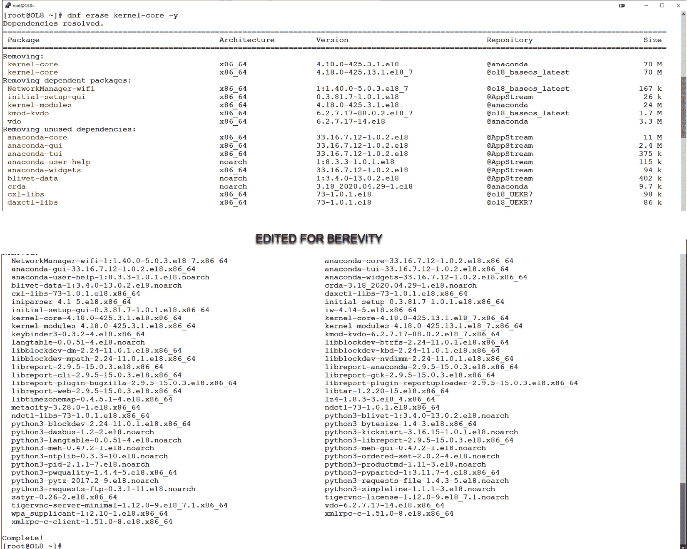

图 3.22 – dnf 删除 kernel-core

现在，让我们重新运行 `grubby` 命令，看看这次是否从系统中移除了 RHCK：

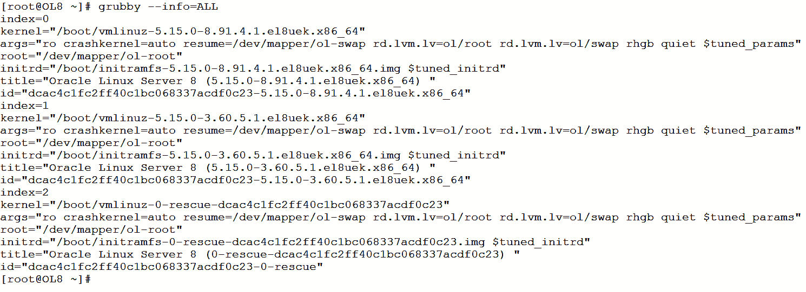

图 3.23 – 移除 RHCK 后的 grubby

如您所见，所有 RHCK 已从我们的系统中移除。

此外，如果您之后决定恢复已删除的 RHCK，您可以通过 `dnf install` `kernel` 命令快速恢复它们：

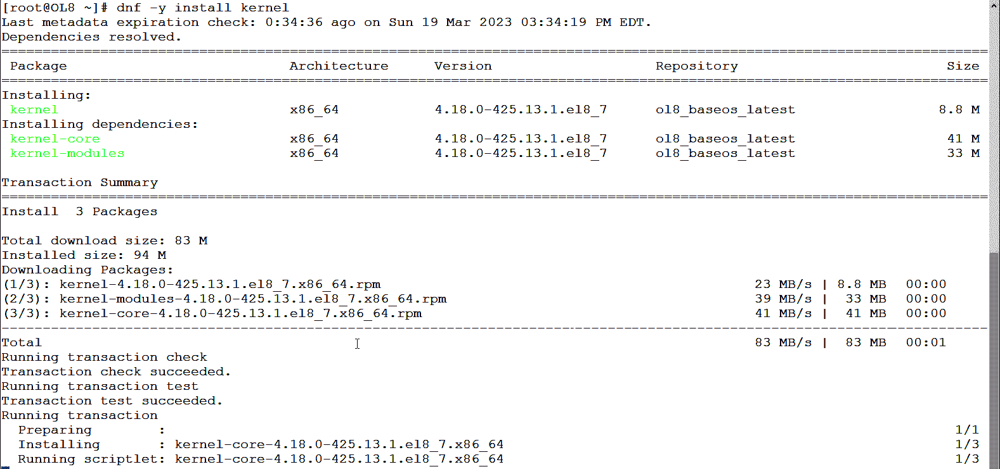

图 3.24 – 重新安装 RHCK

如您所见，在 Oracle Linux 上，切换内核是一项简单的任务，移除操作系统中的内核也是如此。您有机会时，可以比较 RHCK 和 UEK 之间的系统性能；您会惊讶地发现，UEK 在处理 I/O 等任务时要快得多。
