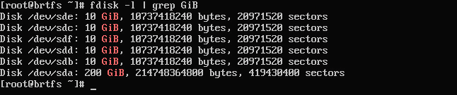

# 创建和管理单实例文件系统

没有数据，系统就没有存在的意义，基于这一点，数据必须存储在某个地方。在本章中，我们将讨论两种最流行的文件系统，它们用于管理本地服务器上的数据：**B 树文件系统**（**Btrfs**，发音为*Butter F S*）和**扩展文件系统**（**XFS**，发音为*X* *F S*）。

这些是单实例文件系统，基本上是只在某一时刻挂载在单个服务器上的文件系统。也有多实例文件系统，可以同时挂载在多个系统上。常见的例子有**Oracle 集群文件系统版本 2**（**OCFS2**）和**全局文件系统 2**（**GFS2**）。所有这些例子都使用共享块存储作为底层存储。

此外，还有**Ceph**，它不是一个首字母缩略词，而是指**头足类动物**。这是因为 Ceph 是一种分布式架构，能够将数据存储在 Ceph 集群的所有节点上。这使得 Ceph 能够提供可扩展的存储，尽管它有一些额外的复杂性。**Gluster**是另一种分布式文件系统的例子。

注意

为什么不使用**ZFS**？因为 Btrfs 和 XFS 是内置在 Oracle Linux 的**不可破坏企业内核**（**UEK**）中的，而 ZFS 在第三方仓库之外无法使用。

我们将涵盖以下食谱，帮助你理解和管理本地文件系统：

+   关于本地文件系统，你需要知道的

+   Btrfs – 创建、调整大小和监控

+   Btrfs – 子卷、快照、配额等

+   使用 mdadm 保护数据 – 一种软件 RAID 解决方案

+   操作逻辑卷管理

+   XFS – 创建、修改等

# 技术要求

对于本篇，你需要一个**Oracle Linux 8**系统。像大多数这些食谱一样，推荐在桌面上使用如**Oracle VirtualBox**等桌面虚拟化产品的虚拟机。一个小型虚拟机，具有两个核心、2 GB 内存和几个空闲的磁盘空间就足够了。你还需要为虚拟机分配一些额外的磁盘，理想情况下至少五个大小相等的磁盘。理想情况下，在开始之前，先将系统补丁更新到最新版本。这个过程只需要几分钟，并且在解决由错误引起的问题时能节省大量时间。

本书中的许多食谱都提供了相关的配置文件，可以在 GitHub 上找到，地址为[`github.com/PacktPublishing/Oracle-Linux-Cookbook`](https://github.com/PacktPublishing/Oracle-Linux-Cookbook)。

# 关于本地文件系统，你需要知道的

本篇将讨论本地文件系统与远程文件系统之间的区别，以及 Btrfs 和 ZFS 之间的核心差异。

**操作系统**（**OS**）的骨干是本地文件系统。它通过分层结构实现了计算机或服务器上文件和目录的高效存储和管理。这种结构使用户和程序可以轻松地在本地存储设备（如硬盘、固态硬盘以及来自本地**存储区域网络**（**SAN**）或云服务提供商的**逻辑单元号**（**LUNs**））上创建、修改和访问文件。这些文件系统专门设计用于文件和文件夹管理的高效性，能够保护文件免受意外删除或损坏。它们配备了文件权限、所有权和访问控制等功能，提供用户最高的安全性和隐私性。与远程文件系统相比，本地文件系统提供了更优的性能，尽管文件除非与远程文件系统技术配对，否则无法在其他系统上访问。Linux 本地文件系统的典型例子包括 Btrfs、XFS、ext4、fat32，甚至 ZFS。

注意

虽然 ZFS 是一个本地文件系统，但它没有包含在内核中，需要通过[`zfsonlinux.org`](https://zfsonlinux.org)提供的软件来添加。

远程文件系统使你能够通过网络访问远程服务器上的文件和目录。这个系统提供了便捷的方式，可以像本地存储一样访问和操作远程机器上的文件，从而消除了物理传输文件的需求。远程文件系统在分布式计算环境中被广泛使用，在这些环境中，多台计算机或服务器需要共享数据和资源。它们在云计算和网站托管环境中也非常有价值，因为数据存储在远程并通过互联网访问。然而，需要注意的是，在通过网络共享文件时，使用远程文件系统可能会影响性能，尤其是在多个服务器之间共享文件时。

远程文件系统的例子包括**网络文件系统**（**NFS**）、**服务器消息块**（**SMB**）和**公共互联网文件系统**（**CIFS**），这些在 Unix、Linux 和 Windows 环境中广泛使用。其他流行的远程文件系统还包括**s3fs**，它允许用户通过基于云的对象存储安全地访问文件。

在管理 MySQL、Postgres 和 Oracle 数据库时，建议使用本地文件系统而非网络文件系统，以确保最佳性能。这个策略也可以有效地应用于操作系统。

## 准备工作

你需要理解这两种文件系统的核心差异。XFS 文件系统比许多管理员意识到的要老得多。它最早起始于 1993 年，作为**硅图形 IRIX**操作系统的文件系统，并于 2001 年移植到 Linux。Btrfs 则要新得多，2007 年由 Oracle（作为开源项目）为 Linux 开发。Btrfs 不仅仅是一个文件系统，它还集成了卷管理器、数据冗余和文件系统功能于一体。

使用 XFS 时，您需要将其与逻辑卷管理器结合使用，以便动态管理卷，还需要使用 `mdadm` 命令来提供容错能力。

使用 Btrfs，您可以选择五种类型的 RAID 卷。选择哪种取决于您的使用案例，因为它是性能、所需磁盘空间和卷的可用容量之间的平衡。详细信息见下表：

| **类型** | **描述** | **性能** | **冗余性** | **容量** |
| --- | --- | --- | --- | --- |
| RAID 0 | 跨磁盘条带化 | 最佳 | 无 | 100% |
| RAID 1 | 镜像两个磁盘 | 良好 | 1 个驱动器故障 | 50% |
| RAID 10 | 先镜像再条带化，最少 4 个磁盘 | 几乎最好 | 1 个驱动器故障 | 50% |
| RAID1C3 | 3 份元数据，最少 3 个磁盘 | 一般 | 2 个驱动器故障 | 66% |
| RAID1C4 | 4 份元数据，最少 4 个磁盘 | 最低 | 3 个驱动器故障 | 75% |

表 4.1 – Btrfs RAID 选项

两种系统的最大文件系统大小限制相同，都是 8 exabytes！但是，Btrfs 还增加了快照、透明压缩、基于校验和的数据完整性和回滚能力等功能。而 XFS 也不逊色，通过 I/O 线程和更高的带宽提供更高的性能，尽管在将 XFS 与 LVM 和 RAID 技术集成后，这些优势可能无法得到充分体现。另一个主要区别是 Btrfs 要求使用 UEK，而 XFS 则在 UEK 和**红帽兼容内核**（**RHCK**）下均能良好工作。

## 如何操作…

Oracle Linux 默认使用 XFS 文件系统，但在安装时，您可以选择使用 Btrfs 作为根文件系统。如果您想使用 XFS 作为启动文件系统，按常规方式安装即可。如果您想使用 Btrfs，则应继续进行。

注意

您的启动文件系统可以与服务器上的数据文件系统不同。您可以轻松地让根文件系统使用 XFS，而数据文件系统使用 Btrfs，或反之亦然。

运行 Btrfs 最简单的方法是在使用 UEK 启动盘进行安装时选择它。这样，您可以选择 Btrfs 作为目标文件系统。安装时，选择 **安装目标**，然后选择自定义存储配置。这时，您将获得手动分区选项，可以通过下拉菜单选择 **Btrfs**，如下面的截图所示：


图 4.1 – Btrfs 选择

在设置自定义配置时，可以为 `/var` 或 `/var/tmp` 添加额外的目录（这是**安全技术实施指南**（**STIG**）的要求）。这些实际上不仅仅是目录，而是主卷的子卷。因此，它们显示的可用空间相同：


图 4.2 – Btrfs 挂载点

这是因为使用 Btrfs 时，它们都使用相同的卷并具有相同的可用磁盘空间。我们可以稍后通过配额来限制这一点。

使用常规的网络和软件源设置完成安装，但需要注意的是，你可能需要将 **安装源** 设置为 URL 或本地网络共享。如果你使用的是 8.7 或更早版本，还需要添加 UEK 仓库。

系统启动后，你将看到它现在正在使用 Btrfs。系统启动后可以检查这一点。

## 它是如何工作的…

你可以通过几种方式检查文件系统，最简单的是检查 `/etc/fstab` 以查看文件系统是如何挂载的。如下图所示：


图 4.3 – Btrfs fstab 示例

你也可以使用带 `T` 选项的 `df` 命令来显示文件系统类型。运行以下命令将显示这些信息：

```
df -T
```

这将显示每个挂载文件的文件系统类型，如下图所示：


图 4.4 – 使用 Btrfs 文件系统的 df -T 输出

# Btrfs – 创建、调整大小和监控

在本步骤中，我们将创建一个新的 RAID 磁盘阵列 Btrfs 卷和文件系统，使用多个磁盘实现容错存储。然后我们将添加新的 LUN，扩展文件系统。最后，我们将修改文件系统以压缩数据！

## 准备工作

首先，我向操作系统添加了五个 10 GB 的硬盘。它们将用于构建一个新的 RAID1C4 卷。可以通过使用 `fdisk -l` 命令并结合 `grep` 查找 `GiB`，使用以下命令来查看这些新设备：

```
fdisk -l | grep GiB
```

输出如图所示：



图 4.5 – fdisk 输出

在这里，我们可以看到这五个 10 GB 的设备分别是 `sdb`、`sdc`、`sbd`、`sbe` 和 `sbf`。我们将在创建 Btrfs 卷时使用这些信息。

## 如何操作…

现在我们已经知道了设备信息，接下来手动创建一个 RAID1C3 卷。我们将使用所有五个设备以 RAID1C3 配置，并将该卷命名为 `data`。

接下来，我们将使用以下命令来创建该卷：

```
mkfs.btrfs -L data -d raid1c3 -m raid1c3 /dev/sd[bcdef]
```

请参考以下图示查看输出：


图 4.6 – mkfs.btrfs 输出

注意

在挂载 Btrfs 卷时，通常使用卷中的第一个设备或 UUID。UUID 是在创建卷时由 `mkfs.btrfs` 报告的。

接下来，我们将它挂载到 `/data` 目录。首先创建 `/data` 目录，然后使用以下命令进行挂载：

```
mkdir /data
mount /dev/sdb /data
```

可选，但强烈推荐的是将其添加到 `fstab` 文件中。此示例中，我们使用的是卷的 UUID，并且由于数据没有子卷，`subvol` 参数已定义但留空：


图 4.7 – 使用 UUID 的 fstab 示例

## 它是如何工作的…

现在我们有了一个已挂载的卷，让我们对其进行一些操作！首先，我们可以使用 `btrfs` 命令来检查几件事情。首先是检查设备的健康状况，这对于查看 RAID 是否有任何失败设备非常有用。使用 `btrfs stats /$DEVICE` 命令来显示状态。不要忘记将 `$DEVICE` 替换为您正在检查的实际 Btrfs 设备：


图 4.8 – 健康设备

当设备开始故障时，您应该在此报告中看到错误。

接下来，我们将向卷中添加几个设备。又添加了四个 10 GB 的磁盘：`sdg`、`sdh`、`sdi` 和 `sdj`。

在添加设备之前，我们可以看到 `/data` 有 50 GB 可用的原始空间。使用以下命令可以看到：

```
btrfs filesystem usage /data
```

命令的输出显示在以下截图中：


图 4.9 – Btrfs 文件系统使用情况

这里我们可以看到统计数据，主要是 50 GB 的免费原始空间，以及其他指标，包括卷中每个设备分配的空间以及哪些设备具有元数据。

接下来，让我们添加四个新设备。这可以通过 `btrfs device add` 命令完成：

```
btrfs device add /dev/sdg /data
```

对于每个要添加到卷中的设备都要执行此操作，或者使用 `/dev/sd[a-z]` 批量添加它们，替换 `a` 和 `z` 为适当的范围。完成后，您可以使用使用选项检查使用情况，如以下示例所示：


图 4.10 – 添加的 Btrfs 设备

现在您将看到设备达到了 90 GB。现在，随着 `/data` 中的空间被消耗，您应该开始看到可用空间减少，以及数据分布在各个磁盘上的情况：


图 4.11 – Btrfs 使用空间

对于最后一个示例，我们将删除一个设备以释放空间，然后重新平衡数据。要删除物理设备，请使用 `btrfs device delete` 命令，并传递设备挂载点：

```
btrfs device delete /dev/sdj /data
```

这将移除设备：


图 4.12 – 设备移除

设备移除后，重新运行使用情况报告。现在您将看到剩余的设备以及哪些数据在哪个设备上：


图 4.13 – 不平衡使用情况

虽然这可能看起来是个小问题，但它有可能引起后续的复杂问题。幸运的是，解决方案很简单 – 系统重新平衡。这可以通过 `btrfs` 命令中的 `balance` 选项完成。以下命令将用于平衡 `/data` 文件系统：

```
btrfs filesystem balance /data
```

然后这个命令会重新平衡数据块，完成后，使用情况将显示数据均衡分布在各个磁盘上：


图 4.14 – 平衡使用情况

注意

为确保数据分布均衡，建议在添加或移除设备时始终对系统进行平衡操作，尽管可能会有轻微的变化。这一做法对于维持最佳性能的文件系统至关重要。`ol8_developer` 仓库中的 `btrfsmaintenance` 包是一个很好的工具，可以自动化所有必要的 Btrfs 维护任务。

# Btrfs – 子卷、快照、配额及更多

Btrfs 比较旧的 XFS 技术能做的更多。这包括子卷、快照和配额。Btrfs 子卷是一种卓越的工具，允许用户在单一 Btrfs 文件系统内创建多个快照或子文件系统。这些子卷作为文件系统层次结构中的独立目录显示，但它们使用相同的存储空间，并且可以独立管理。

子卷的灵活性和多功能性使它们非常适合各种用途，例如创建备份或隔离文件系统的不同部分，以便更轻松地进行管理。快照特别有用，因为它们提供了在特定时间点的文件系统只读副本。通过快照，用户可以将文件或整个子卷恢复到以前的状态，或轻松创建可复制的备份，这些备份可以移动到另一台系统。

子卷还使用户能够更有效地管理磁盘空间。例如，用户可以为特定的应用程序或项目创建一个子卷，并将其磁盘使用量限制在一定范围内，以防止它占用过多的文件系统空间。此外，子卷还可以通过为不同的子卷分配不同的权限，或为不同的用户或组创建独立的子卷来实施访问控制。本教程将介绍如何做到这一点。

## 准备工作

本教程需要一个 Btrfs 文件系统，并将使用上一教程中创建的数据文件系统作为示例。

## 如何操作……

本教程中，我们将进行以下操作：

1.  在 `/data` 中创建子卷并挂载它。

1.  设置子卷的配额。

1.  创建快照。

1.  启用压缩。

创建子卷很简单，只需使用 `btrfs` 命令并指定子卷的完整路径即可：

```
btrfs subvolume create /data/vol1
```

创建完成后，直接将其添加到 `fstab` 中，此时需要在第四列中声明子卷名称。以下截图显示了如何使用子卷 `vol1` 挂载 `/data/vol1`：


图 4.15 – fstab 中的子卷

现在我们已经挂载了子卷，让我们为其添加一个配额，将其限制为 5 GB。为此，首先需要启用该卷的配额。这可以通过以下命令完成：

```
btrfs quota enable /data
```

接下来，我们需要为子卷分配配额组限制。这将限制子卷的大小。可以使用 `limit` 选项来完成此操作，如下所示的命令所示：

```
btrfs qgroup limit 5g /data/vol1
```

使用 `btrfs qgroup show` 命令和 `-reF` 选项，可以查看卷中定义的配额：

```
btrfs qgroup show -reF /data/vol1
```

命令及其输出显示在以下屏幕截图中：


图 4.16 – 设置配额

现在我们已经设置了配额，让我们创建一个备份的快照。我们需要一个存放备份的位置，所以我们先创建一个子卷用来存放备份，使用以下命令：

```
btrfs subvolume create /data/backup
```

Btrfs 快照是非常有用的 Btrfs 文件系统副本，用于捕捉某一特定时间点。通过无缝的写时复制过程，这些快照将对文件系统所做的任何更改与快照本身分离开来。这使得它们非常适合用于不同的用途，例如创建备份、测试软件配置和提供一种轻松的方式来撤销系统更新。此外，备份可以快速创建且占用最小的存储空间，因为快照仅存储文件系统当前状态与快照拍摄时的状态之间的差异。要创建 Btrfs 快照，可以使用 `btrfs subvolume snapshot` 命令，指定要快照的子卷以及快照的名称和位置：

```
btrfs subvolume snapshot /data/vol1 /data/backup/vol1_backup1
```

此命令创建了 `/data/vol1` 子卷的只读快照，并将其作为一个单独的子卷保存在 `/data/backup` 目录下。

如果你已经创建了一个快照，不用担心——你可以通过强大的 Btrfs 回滚功能轻松地将文件系统恢复到当时的精确状态。通过 Btrfs 快照回滚，你只需选择一个快照，就可以将 Btrfs 文件系统恢复到先前的状态。回滚到快照会丢弃自快照创建以来对文件系统所做的所有更改，并将文件系统恢复到快照创建时的精确状态。

要回滚 Btrfs 快照，可以使用 `btrfs subvolume snapshot` 命令并加上 `-r` 选项，指定使用该快照进行回滚：

```
btrfs subvolume snapshot -r /data/backups/vol1_backup1 /data/vol1
```

此命令将 `/data/vol1` 回滚到 `/data/backup/vol1_backlup1` 快照创建时的状态。

需要注意的是，回滚快照会丢弃自快照创建以来对文件系统所做的任何更改。然而，当你想将文件系统完全恢复到先前的状态时，这一功能非常有用。Btrfs 快照提供了一个简单有效的数据管理和保护解决方案，使得备份创建变得轻松，并能够方便地恢复先前的文件系统版本。

注意

可以启用自动快照，使得 `dnf` 事务会创建一个快照。此操作由 `dnf-plugin-snapper` 工具完成。更多信息可以参见：[`docs.oracle.com/en/operating-systems/oracle-linux/8/fsadmin/fsadmin-ManagingtheBtrfsFileSystem.html#snapper-btrfs`](https://docs.oracle.com/en/operating-systems/oracle-linux/8/fsadmin/fsadmin-ManagingtheBtrfsFileSystem.html#snapper-btrfs)。

本节将介绍如何使用 Btrfs 文件系统启用压缩。Btrfs 压缩是一项强大的功能，可以在将数据写入文件系统的同时实时压缩数据。此功能可以显著减少存储空间，特别适合存储大量数据的文件系统，如媒体归档和备份系统。此外，它对于存储空间有限的系统（如移动设备和嵌入式系统）也很有帮助。

Btrfs 压缩在将数据写入文件系统时使用各种压缩算法。这些压缩数据会存储在磁盘上，并在访问时自动解压。这个过程对访问数据的应用程序是透明的，因此它们不需要关注压缩过程，Btrfs 会自动处理。Btrfs 支持三种压缩算法：`zlib`、`lzo`和`zstd`，每种算法都有其优缺点：

+   `zlib`：这是一种广泛使用的通用压缩算法，提供良好的压缩比，但在较高压缩级别下可能相对较慢。它适用于压缩通用数据和文本文件。

+   `lzo`：这是一种轻量级压缩算法，提供良好的压缩比，并且相对较快。它适用于压缩已经压缩过的数据，如媒体文件和归档文件。

+   `zstd`：这是一种较新的压缩算法，它在压缩比和速度之间提供了良好的平衡。它适用于压缩各种类型的数据，包括文本、媒体文件和归档文件。

压缩算法的选择取决于特定的使用场景和性能要求。

要在文件系统上启用压缩，可以使用`btrfs property`命令来设置文件系统的压缩：

```
btrfs property set /data/vol1 compression zstd
```

当启用压缩时，只有写入到文件系统的新增数据会被压缩。不过，你也可以使用`defragment`命令来压缩在启用压缩之前已经存在于文件系统中的数据。要在子卷上执行此操作，还需要使用`-r`选项递归运行命令，并配合`-c`选项来压缩数据：

```
btrfs filesystem defragment -rc /data/vol1
```

## 还有更多内容…

压缩效率会有所不同，取决于所使用的数据和算法。让我们首先使用以下命令检查剩余空间：

```
[root@btrfs vol1]# btrfs filesystem usage /data/vol1 | grep Data | grep Used
Data,RAID1C3: Size:1.00GiB, Used:0.00B (0.00%)
```

现在，让我们创建一个包含随机数据的 2 GB 文件：

```
head -c 2G </dev/urandom > /data/vol1/test1
```

接下来，我们可以使用`df`和`du`命令来比较已消耗的空间和已使用的空间：

```
df -h /data/vol1
du -hd0 /data/vol
```

这些命令的示例输出如下：

```
[root@btrfs vol1]# df -h /data/vol1
Filesystem      Size  Used Avail Use% Mounted on
/dev/sdb         30G  2G   28G   1% /data/vol1
[root@brtfs vol1]# du -hd0 /data/vol1
2.0G    /data/vol1
[root@brtfs vol1]#
```

在这里，我们可以看到 2 GB 的空间已经被使用（通过`du`命令），而且实际上 2 GB 空间已经被消耗（通过`df`命令）。因此，对于这个随机数据文件，我们看到压缩并未带来任何好处。

现在让我们删除`test1`文件：

```
rm /data/vol1/test1
```

为了加速，我们来进行碎片整理和重新平衡。这是现在就释放已删除文件的空间所需要的，而不是等待：

```
[root@btrfs vol1]# btrfs filesystem defragment -rc /data/vol1
[root@brtfs vol1]# btrfs filesystem balance /data
Done, had to relocate 4 out of 4 chunks
[root@btrfs vol1]#
```

现在，使用一个包含大量重复数据的文件，我们将看到更多的压缩效果。要创建一个包含重复数据的 2 GB 文件，请运行以下命令：

```
yes "repeating text" | head -c 2G >test2
```

现在，我们重复之前的 `du` 和 `df` 命令，但将会看到非常不同的结果：

```
[root@brtfs vol1]# df -h /data/vol1
Filesystem      Size  Used Avail Use% Mounted on
/dev/sdb         30G   62M   29G   1% /data/vol1
[root@brtfs vol1]# du -hd0 /data/vol1
2.0G    /data/vol1
[root@brtfs vol1]#
```

这里，我们看到分配了 4 GB，但实际上只使用了 62 MB！这就是压缩带来的巨大好处。

# 使用 mdadm 保护数据 – 一种软件 RAID 解决方案

现代计算系统依赖 RAID 技术以确保数据的完整性、可用性和性能。通过将数据分布在多个磁盘上并采用不同的配置，RAID 提供容错功能，使得即使一个或多个磁盘发生故障，系统仍能继续运行。这种冗余对于防止数据丢失和减少停机时间至关重要。

此外，RAID 配置，如条带化和镜像，可以通过允许从多个磁盘并行访问数据，显著提高读写性能。随着数据量和重要性在当今数字世界中的不断增加，RAID 在保护、优化和维护存储系统的可靠性方面发挥着至关重要的作用。在不使用 Btrfs 的 Oracle Linux 8 系统中，最简单的方式是使用一个名为 **mdadm** 的工具。

## 准备就绪

mdadm 是一个用于管理和配置 Linux 系统中软件 RAID 阵列的软件工具。它代表 **多个设备管理**，通常用于创建、管理、监控和维护 RAID 阵列。这些阵列利用一个名为 **多个设备** (**MD**) 的内核驱动程序。mdadm 允许用户创建各种 RAID 级别，包括 RAID、RAID 0、RAID 1、RAID 5、RAID 6、RAID 0+1 和 RAID 10，通过结合多个物理磁盘：

| **类型** | **描述** | **备注** |
| --- | --- | --- |
| RAID | 跨区 | 没有冗余或性能优势。 |
| RAID-0 | 条带化 | 没有冗余，但相较于 RAID 提供更好的性能。 |
| RAID-1 | 镜像 | 镜像冗余，但在写入工作负载中没有性能优势。读取工作负载可能有所改善。 |
| RAID-5 | 双重奇偶校验条带化 | 提供冗余和良好的性能。可以丢失一个磁盘而不丢失数据。建议至少使用四个磁盘。 |
| RAID-6 | 三重奇偶校验条带化 | 提供冗余和良好的性能。可以丢失两个磁盘而不丢失数据。建议至少使用五个磁盘。 |
| RAID 0+1 | 条带化磁盘的镜像 | 极好的性能，但恢复丢失的磁盘需要很长时间。需要至少四个磁盘。 |
| RAID 10 | 镜像磁盘条带化 | 最昂贵的选项，但通常被认为是最好的冗余、性能和重建时间解决方案。需要至少四个磁盘。 |

表 4.2 – MD RAID 选项

注意

将**JBOD**（**仅为硬盘的盒子**）外壳与 RAID 外壳混淆并不罕见。JBOD 是一种简单的磁盘外壳，没有硬件 RAID。RAID 磁盘外壳有一个硬件控制器，它会将外壳内所有磁盘的 RAID 逻辑卸载到硬件上。在此示例中，没有使用硬件 RAID，只有 JBOD。所有 RAID 逻辑由 Oracle Linux 执行。

mdadm 是管理员用来创建、修改和监控 RAID 阵列的重要工具。它允许用户从现有阵列中添加或移除磁盘，执行数据恢复操作，并配置诸如 RAID 级别和备用磁盘等各种参数。通过其命令行界面，mdadm 提供了灵活性来管理和维护磁盘冗余性和性能。它是一个可靠且强大的解决方案，优化了存储性能，确保了数据冗余，并保持了数据的高可用性。mdadm 通常在安装 Oracle Linux 时安装。

## 如何操作…

创建 MD 设备相当简单。但在创建设备之前，你需要提前规划一些事项：

+   你将使用什么类型的 RAID？如前所述，MD 内核驱动程序支持多种 RAID 算法。你需要在运行命令之前选择一种类型。这与`–`level 选项对应。

+   你将使用多少个驱动器？大多数 RAID 类型使用偶数个磁盘，但你仍然需要知道用于数据的磁盘数量。这与`–`raid-devices 选项对应。

+   你是否会配置一个热备份设备？热备份是一个很好的选择，当系统需要在设备故障时自动重建数据时。远程位置有许多热备份设备并不罕见。在选择热备份时，要平衡所需的空间与替换设备安装所需的时间。这与`–`spare-devices 选项对应。

+   MD 设备的编号是多少？传统上，你从 0 开始，并逐渐增加，但要追踪这些编号，以免不小心使用了错误的设备。这与`/dev/md#`对应。

+   你将使用的驱动器路径是什么？它们通常是`/dev/sd#`、`/dev/nvme#`，甚至是`/dev/vd#`。

在以下示例中，我们将创建一个带有一个热备份的 RAID-5 阵列。所使用的设备是`/dev/sd[bcdef]`，这将是`/dev/md0`设备：

```
mdadm --create /dev/md0 --level=5 --raid-devices=4 --spare-devices=1 /dev/sd[bcdef]
```

你可以通过查看`/proc/mdstat`文件来快速检查状态：


图 4.17 – /proc/mdstat

最后一步，虽然是可选的，但强烈推荐执行。它将当前的配置保存到 mdadm 配置文件中。这有助于内核在启动时组装阵列。使用以下命令可以完成此操作：

```
mdadm --examine --scan >> /etc/mdadm.conf
```

## 它是如何工作的…

现在，让我们看一下 MD 设备的一些细节。首先，如果我们使用`lsblk`命令，我们会看到 `md0` 使用的磁盘现在已被标识为 `md0` 的子设备。这是因为 `md0` 是实际磁盘的子设备：


图 4.18 – lsblk 命令输出

我们还可以通过 `mdadm` 命令的 `-Q` 选项来检查设备。只需将设备作为参数传递，命令会给出一个简短的总结：

```
mdadm -Q /dev/md0
```

输出如下：


图 4.19 – mdadm -Q

可选地，您可以传递 `–-detail` 选项，以获取关于阵列的更多信息：


图 4.20 – mdadm --detail

在这里，我们不仅可以看到阵列的健康状态，还可以看到其创建日期和一些底层指标，如块大小和布局。

一旦卷被创建，您现在可以将其用于文件系统或作为逻辑卷管理器的存储。

# 玩转逻辑卷管理

在谈到文件系统时，一个最大的问题是其在存储方面的局限性。在磁盘上创建一个卷意味着该空间会被锁定，进而也锁定了文件系统的大小。然而，**逻辑卷管理器**（**LVM**）为此问题提供了解决方案。LVM 是计算机存储管理领域中广泛使用的工具，它充当物理存储设备（如硬盘或 SSD）与操作系统之间的抽象层。这样可以灵活而高效地管理存储资源。LVM 尤其对于 Linux 系统来说非常有价值，因为它提供了一个灵活且可扩展的存储管理解决方案。

使用 LVM，管理员可以动态分配和调整存储卷的大小，无需重新分区磁盘或中断系统。这个灵活性在存储需求经常变化或需要高效资源分配的环境中尤为有用。此外，LVM 引入了卷组的概念，卷组作为物理存储设备的逻辑容器。通过在卷组中创建逻辑卷，管理员可以轻松分配和管理存储空间，从而简化了 Linux 系统中的存储资源管理，并使得存储资源的组织和利用变得更加高效。

在 LVM 中，存储有三个核心组件：

+   **物理卷**（**PVs**）：这些是用于存储的块级磁盘设备。它们可以是物理磁盘、虚拟磁盘（例如在 mdadm 配方中创建的 MD 设备）或其他块级设备。

+   **卷组**（**VGs**）：这些是由多个 PV 组合成的单一逻辑设备。它们可以一开始是一个单独的设备，后续可以添加新设备来增加容量。

+   **逻辑卷**（**LVs**）：这些是内嵌在 VG 中的逻辑磁盘。它们用于创建文件系统，并可以根据需要动态调整大小。

LVM 中的 VG 是一个核心组件，充当一个或多个 PV 的逻辑容器。VG 是通过将物理存储设备（如硬盘或 SSD）组合成一个单一的存储池来创建的。

在本食谱中，我们将向你展示如何初始化 PV，创建 VG，然后添加 LV 供文件系统将来使用。我们还将展示一些基本的管理命令。

## 准备就绪

本食谱中的示例将使用在 mdadm 配方中创建的 `/dev/md0` 虚拟磁盘，以及一些额外的 LUN。LVM RPM 通常会在默认安装时自动安装。

## 如何操作…

第一步是确定我们可以使用哪些磁盘。这可以通过 `lvmdiskscan` 命令完成：


图 4.21 – lvmdiskscan

在这里，我们可以看到三个设备，`md0`、`sda1` 和 `sda2`。我们还可以看到 `sda2` 已经初始化为 PV。我们可以使用 `pvs` 命令显示系统上的 PV：


图 4.22 – pvs

在这里，我们可以看到 `/dev/sda2` 设备由 `ol` VG 使用。让我们继续使用 `pvcreat` 来初始化 `/dev/md0`。这是通过以下命令完成的：

```
pvcreate /dev/md0
```

现在设备已经初始化，我们可以创建一个 VG。这可以通过 `vgcreate` 命令完成。该命令使用第一个参数作为 VG 的名称，然后列出设备。在这种情况下，我们只使用 `/dev/md0` 来创建 `DATA` VG：

```
vgcreate DATA /dev/md0
```

## 如何运作…

我们可以使用 `vgs` 命令查看系统上的 VG 列表：


图 4.23 – vgs

在这里，我们可以看到两个 VG：新创建的 `DATA` VG 和已存在的 `ol` VG，其中安装了操作系统。接下来，我们将使用 VG 来创建 LV。这可以通过 `lvcreate` 命令完成。`lvcreate` 命令需要一些参数：`-L` 用来设置卷的大小，`-n` 用于命名，然后在最后指定卷所在的 VG。让我们在 `DATA` VG 中创建一个名为 `xfs1` 的 3 GB 卷：

```
lvcreate -L 2G -n xfs1 DATA
```

我们还可以告诉 `lvcreate` 使用所有可用空间。通过使用小写字母 `l` 和特殊的 `100%FREE` 选项来完成：

```
lvcreate -l 100%FREE -n xfs2 DATA
```

`lvs` 命令将显示服务器上的所有 LV：


图 4.24 – lvs

在这里，我们可以看到 `xfs1` 和 `xfs2` 卷及其大小。此外，我们还可以看到 `ol` 中的所有卷，Linux 就安装在这里。

让我们通过删除 `xfs2` LV 来释放一些空间。这可以通过 `lvremove` 命令完成。在使用 `lvremove` 时，使用 VG/LV 来标识正在删除的 LV。以下命令将删除 `xfs2` LV：

```
lvremove DATA/xfs2
```

你还需要确认删除操作：


图 4.25 – lvremove

最后的技巧是查看特定 LV 的详细信息。这可以通过 `lvdisplay` 命令完成。你可以单独运行该命令，这将显示服务器上所有 LV 的详细信息。你还可以使用该命令报告单个 LV，在本例中是 `xfs1` LV：

```
lvdisplay /dev/DATA/xfs1
```

输出如下：


图 4.26 – lvdisplay

在这里，你可以看到卷的创建日期、UUID 和卷的大小。

一旦创建了逻辑卷（LV），有多种方式可以访问它们，但最常见的方法是使用其映射地址。在 Linux 中，`/dev/mapper` 目录用于访问设备映射器设备，设备映射器是一个内核级框架，允许创建和管理虚拟块设备。通过设备映射器，可以实现软件 RAID、加密和 LVM 等高级存储功能。使用 LVM 时，设备映射器会创建虚拟设备，并将它们作为设备映射器设备显示在 `/dev/mapper` 目录下，这些设备充当抽象层，并提供一个接口来访问和管理底层存储功能。

例如，使用 LVM 设置的逻辑卷会映射到 `/dev/mapper` 目录下的设备映射器设备。每个逻辑卷都有一个对应的设备映射器设备条目，可以像普通块设备一样与逻辑卷进行交互。访问路径为 `/dev/mapper` 后跟 `VG-LV` 名称。因此，`DATA/xfs1` 对应的路径为 `/dev/mapper/DATA-xfs1`。你可以使用 `dmsetup ls` 命令查看所有映射的设备：


图 4.27 – dmsetup ls

# XFS – 创建、修改等

XFS 是一个高度先进且成熟的文件系统，具有多种优点和特性，使其成为广泛应用场景中的理想选择。XFS 旨在处理大容量存储，适用于数据需求较高的环境。它能够支持高达 8 exabytes 大小的文件系统和文件，从而管理大量数据。这种可扩展性使 XFS 特别适合大数据应用、企业存储系统和大规模存储部署。XFS 拥有出色的性能能力，采用了基于分配组的块映射、延迟分配和异步 I/O 等先进技术，优化了磁盘 I/O 操作，提高了整体吞吐量。XFS 在处理大文件和执行大量读写操作时特别高效。

XFS 集成了数据保护功能，以防止数据损坏。它采用了元数据和数据的校验和机制，使得文件系统能够检测并处理潜在的数据完整性问题。此外，XFS 支持**写时复制**（**COW**）快照，能够实现高效的时间点备份和数据恢复选项。XFS 还使用日志机制，在系统崩溃或电力故障时提供快速恢复。日志功能记录对文件系统元数据的修改，确保数据的一致性和完整性。这使得启动时间更快、可靠性更高，并减少了系统启动时进行文件系统检查所需的时间。

注意

Oracle 积极为许多 Linux 技术做出贡献。COW XFS 特性就是 Oracle 为社区做出的一个贡献示例，保持 Linux 的自由和开源。更多信息，请参阅 [`blogs.oracle.com/linux/post/xfs-data-block-sharing-reflink`](https://blogs.oracle.com/linux/post/xfs-data-block-sharing-reflink)。

使用 XFS，管理员可以在文件系统挂载和使用时执行广泛的文件系统操作。这包括在线调整大小，实现对文件系统的无缝扩展或收缩，无需卸载或服务中断。这些在线管理功能使得 XFS 非常适合需要连续可用性和最小停机时间的环境。XFS 还提供了对扩展属性、访问控制列表（**ACLs**）和纳秒级时间戳的广泛支持。这些功能为管理文件元数据提供了灵活性，并支持复杂权限结构和自定义元数据方案的实现。

XFS 是 Linux 内核原生支持的文件系统，使其成为 Linux 发行版中一个良好集成和广泛采用的选择。它是 Oracle Linux 的默认文件系统，并继续由 Oracle 和 Linux 社区进行持续开发和改进。此外，XFS 提供了一套全面的文件系统管理和管理员工具，使其成为一个全面优秀的选择。

## 准备就绪

本示例中将使用先前创建的 `xfs1` 逻辑卷（LV）。XFS 文件系统可以在任何块设备上创建。

## 如何做到…

创建 XFS 文件系统最常见的方式是使用 `mkfs.xfs` 命令，并将数据和日志放置在同一设备上：

```
mkfs.xfs /dev/mapper/DATA-xfs1
```

此外，您可以使用额外的参数来获得更多控制：

| **选项** | **描述** | **示例** |
| --- | --- | --- |
| `-L` | 这将为文件系统添加一个标签。 | `-L Test` |
| `-b` | 这将设置块大小。 | `-b 8192` |
| `-f` | 这是强制选项。 | `-f` |
| `-l` | 这将设置日志的位置和大小，通常用于通过将日志置于快速设备上而将数据置于较慢设备上来调整性能。`Size=20m /dev/$DEVICE` | `-l 20m /dev/mapper/journal1` |

表 4.3 – XFS 选项

接下来，在 `/etc/fstab` 中添加条目信息。确保验证挂载点是否存在，并使用正确的 `/dev/mapper` 路径。更新后的文件如下截图所示：


图 4.28 – /etc/fstab

现在我们可以使用以下 `mount` 命令挂载文件系统：

```
mount /xfs1
```

我们可以清楚地看到文件系统现在已经挂载，如从 `df` 命令的输出所示：


图 4.29 – df -h

## 如何运作…

现在文件系统已挂载，我们可以对其进行一些操作。第一个任务是扩展文件系统，因为 2GB 对于该应用程序来说有些太小了。这个过程分几个步骤进行。首先，我们扩展包含文件系统的逻辑卷（LV），然后我们可以扩展文件系统。我们将其扩展到 10GB。

为了增加磁盘容量，我们将使用`lvextend`命令，并传递`+`选项来添加额外的 8GB：

```
lvextend -L +8G /dev/mapper/DATA-xfs1
```

输出结果如下图所示：


图 4.30 – lvextend

一旦逻辑卷（LV）扩展完成，我们需要扩展实际的文件系统。可以使用`xfs_growfs`命令来完成这个操作，传递映射路径：

```
xfs_growfs /dev/mapper/DATA-xfs1
```

根据文件系统的活动情况，扩展过程可能需要几分钟。`xfs_growfs`命令完成后，输出将显示文件系统的详细信息：


图 4.31 – xfs_growfs

你还可以使用`xfs_info`命令查看这些详细信息，传递文件系统的挂载点或映射路径。

如果在挂载`xfs`文件系统时遇到问题，可以使用`xfs_repair`命令行工具进行修复和恢复。然而，请记住，该命令必须在未挂载的文件系统上运行。`xfs_repair`的主要功能是修复由停电、系统崩溃或硬件问题引起的 XFS 分区中的不一致性和文件系统损坏。你也可以使用`-n`选项检查文件系统而不进行修复。例如，你可以使用以下命令检查`xfs1`文件系统而不进行修复：

```
xfs_repair -n /dev/mapper/DATA-xfs1
```
