# 5

# 使用 DNF 进行软件管理

没有包，一个全新的 Linux 安装几乎和没有轮胎的汽车一样没用！你需要能够为系统添加软件，使它变得有用。这可以通过几种方式来完成。回到旧时光（嘿，我可是个真正的灰胡子 Unix/Linux 人），你曾经需要下载源文件，然后手动构建和安装。有时你可以获得预构建的包，但通常，所需的依赖关系需要花费数小时才能手动追踪下来。然后，在 1997 年，**Red Hat Package Manager**（**RPM**）文件问世了。它们简化了这个过程，因为你所需要做的就是找到安装应用程序所需的所有 RPM 文件，然后就能开始了。

然后，应用程序开始变得更加复杂；以 Apache HTTP 服务器为例——它的所有可选功能从 2-3 个 RPM 包增加到十多个，还有所有的依赖关系。追踪所有的 RPM 包及其依赖关系变得非常繁琐……由于版本不匹配，混乱迅速占据了主导地位。这一切在 2003 年 **Yellowdog Updater, Modified**（**YUM**）发布时戛然而止。现在，你可以为所有 RPM 包设置一个集中位置，轻松安装和修补这些包及所有依赖关系。**Red Hat Enterprise Linux**（**RHEL**）迁移到了 YUM，生活变得美好。

注意

YUM 替代了**Yellowdog Update Program**（**YUP**），后者是 Yellowdog Linux 使用的原始安装工具。Yellowdog Linux 是一款为 PlayStation 3 和 IBM 系统上的 POWER7 CPU 构建的 Linux 发行版，基于 CentOS/RHEL。尽管它在 2012 年停止更新，但它仍通过 YUM 继续存在。

Linux 发行版（如 RHEL 和 Oracle Linux）为特定的发行版在线维护 YUM 服务器，但如果你能够构建自己的 RPM 包并维护自己的 RPM 仓库呢？如果这些自定义 RPM 包可以用来部署内部构建的应用程序，并且进行所需的配置更改，使它们按预期运行呢？本章讲解了 RPM 文件的管理，从 `yum` 命令到 `dnf` 命令的过渡，管理 RPM 包，创建私人 RPM 仓库，并制作新的 RPM 包。

本章包含以下内容：

+   他们对 YUM 做了什么，转向 DNF？

+   使用 DNF 时间机器

+   从 ULN 构建 DNF/YUM 镜像

+   创建新的 RPM 包

# 他们对 YUM 做了什么，转向 DNF？

YUM 很好——它有效，且允许管理员轻松安装和修补软件。你甚至可以用它来回滚一个不良的安装。那么，发生了什么？为什么会发布 DNF？什么是 DNF，学习新工具会有多难？

首先，**DNF** 代表 **Dandified YUM**，是对 YUM 软件的重写。它在 2013 年的 Fedora 18 中发布，旨在解决 YUM 开始面临的许多问题。

YUM 的两个最常见问题是性能和内存使用：

+   **性能差**：YUM 存在性能问题。许多问题是由依赖关系解析引起的，这一过程将所有包及其依赖项组合在一起。这个过程可能需要长达 10 分钟。DNF 切换到 libsolv，大大减少了解决复杂依赖关系的时间。如今，这种情况越来越普遍，有些应用程序需要 30 个以上的 RPM。

+   **高内存使用**：YUM 使用大量内存；这个问题在 RHEL/CentOS 7 中变得尤为明显，较小的服务器在更新时经常会耗尽内存。

## 准备就绪

DNF 的变化不仅体现在性能上，还有一些行为上的关键差异。为了测试这些变化，你需要一个 Oracle Linux 8 系统，并访问至少免费的公共仓库，例如 [`yum.oracle.com`](https://yum.oracle.com)。你还可以考虑在虚拟化环境中运行 Oracle Linux，这样可以利用快照在更改前后保留操作系统的副本。Oracle VM VirtualBox 是实现这一目标的好方法。

## 如何操作…

在大多数情况下，DNF 和 YUM 的工作方式相同：`dnf install` 和 `yum install` 看起来一样，但 DNF 更快。`dnf upgrade` 和 `yum upgrade` 也一样，所以你可能已经了解了基本的用法。

在 YUM 中，`update` 和 `upgrade` 有略微不同的行为，`yum update` 会从系统中删除旧版包。而在 DNF 中，`update` 和 `upgrade` 都会更新已安装的软件，但 `upgrade` 还会删除过时的包。此外，`auto-remove` 选项会删除系统中不再需要的包。

注意

从 Oracle Linux 8 开始，`yum` 命令变成了 `dnf` 命令。

在 DNF 的开发过程中，大多数命令都是一样的，但 DNF 确实有一些特别的功能，比如自动运行更新。

### DNF 自动更新

你可以设置 DNS 使其自动运行。为此，安装 `dnf-automatic` 包，并通过以下命令启用该服务：

```
yum install dnf-automatic
systemctl enable dnf-automatic.timer
systemctl start dnf-automatic.timer
```

接下来，编辑 `/etc/dnf/automatic.conf` 文件。这个文件里有一些技巧。你可以通过将 `apply_updates` 参数设置为 `yes` 来覆盖是否在下载时应用补丁。这样，当任务运行时，补丁就会被强制应用。

别忘了设置 `system_name` 参数，这样电子邮件和通知中就会显示正确的名称。

你还可以设置系统，通过电子邮件报告安装了哪些内容。在 `[email]` 配置段中设置电子邮件。如果使用邮件中继，确保它不需要身份验证，或者如果需要，添加相应的配置。

最后的技巧是，你可以将 `emit_via` 参数从 `stdio` 更改为 `motd`。设置为 `motd` 时，系统的 `motd` 文件会更新，显示已安装的补丁内容。用户登录系统时，会看到已安装的补丁列表和安装时间，示例如下截图：

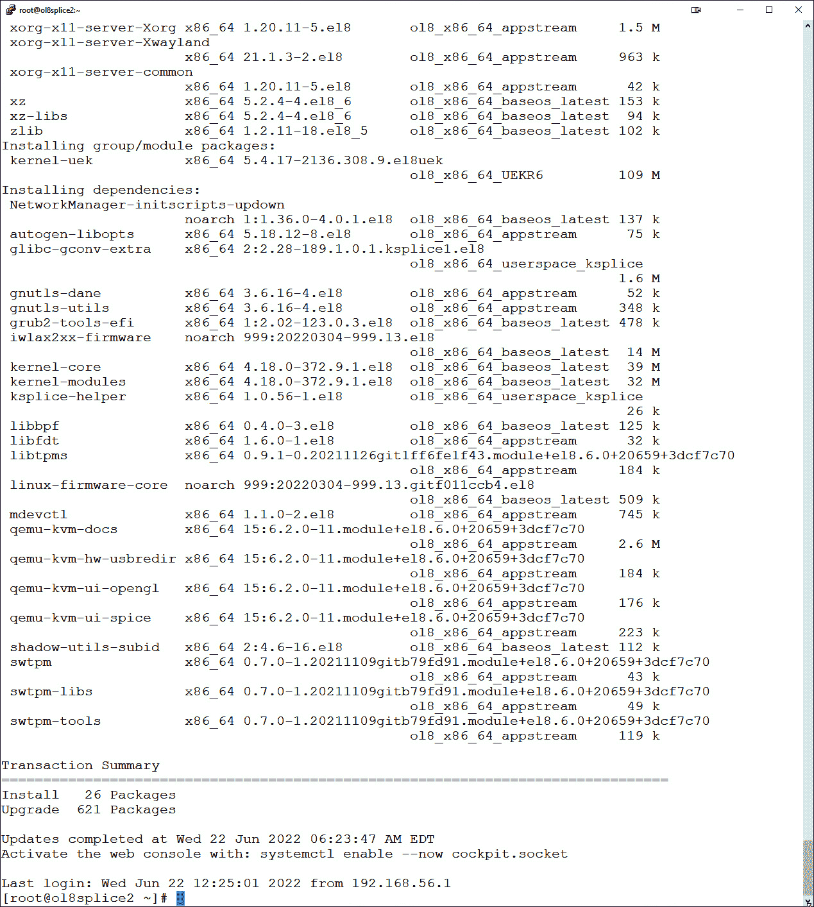

图 5.1 – 登录时的 MOTD

默认情况下，服务会在早上 6 点检查更新。你可以通过编辑`/etc/systemd/system/timers.target.wants/dnf-automatic.timer`文件来修改这个时间：

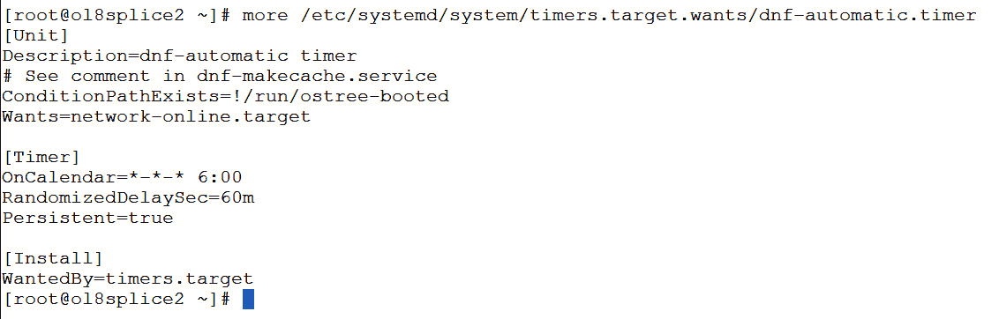

图 5.2 – dnf-automatic.timer 文件

在这个文件中，`[Timer]` 段控制时间以及随机延迟。要更改运行时间，只需将`6:00`替换为你想要的时间，使用 24 小时制格式。例如，如果你希望检查时间为晚上 10 点，那么时间应该是 22:00。

由于使用了标准的`OnCalendar`函数，你有更多的选择。`OnCalendar`是一个非常灵活的方法；以下是一些最常用的示例：

| **OnCalendar 示例** | **描述** |
| --- | --- |
| DOW YYYY-MM-DD HH:MM:SS | 通用的时间格式方法。 |
| *-*-* 2:00 | 每天凌晨 2 点运行。 |
| Weekly | 每周一的午夜。 |
| Sat *-*-* 2:00 | 每周六凌晨 2 点运行。 |
| Sat | 每周六的午夜。 |
| Sun 2022-*-* | 2022 年每个星期日的午夜。 |
| *-*-1,15 22:15 | 每月的 1 号和 15 号晚上 10:15 运行。 |
| *-05-03/2 | 每年五月的第三天运行，然后每隔一个月的第二天运行。每年都按照相同的周期运行。这个日期格式表达式使用了连字符来进行格式化。 |

表 5.1 – OnCalendar 示例日期规则

`RandomizedDelaySec` 也是一个重要的设置。它会给时钟增加一个随机的延迟，这在许多系统运行的企业环境中非常有用。比如，200 台服务器在早上 6 点访问 YUM 仓库时，可能会让服务器压力过大。在`/etc/dnf/automatic.conf`中加入一个随机延迟，比如 600 秒，可以将负载分散到几分钟内。

DNF 是 YUM 的升级版，具有一些增强功能。正如在本章节中所看到的，它确实有一些巧妙的技巧，但它仍然为管理员提供了一种简便的方式，用于在 Oracle Linux 系统上安装和修补软件。

# 使用 DNF 时间机器

DNF 内置了时间机器！这不仅仅是回顾宇宙的方式，它实际上允许你查看安装的历史记录，还能回滚某一项更改，或者回滚所有更改直到某个时间点。

## 准备工作

为此，你需要一台运行 Oracle Linux 8 并能够访问 RPM 仓库的测试系统。

## 如何操作…

当 DNF 安装软件时，它会保留所有执行操作的历史记录，包括软件的升级、已安装的软件和已删除的软件。`dnf history` 命令显示这个历史记录：

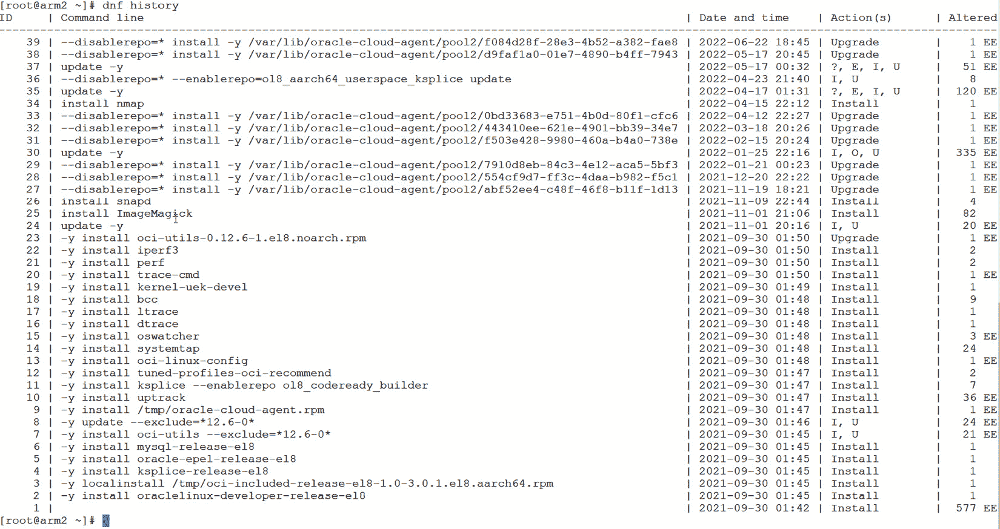

图 5.3 – dnf history 命令

有五列：`ID`、`命令行`、`日期和时间`、`操作`和`修改`：

+   `ID`：这是历史记录的标识符，用于在命令中显示信息、回滚、撤销或存储事务。

+   `命令行`: 这是在执行命令时传递给 DNF 的选项，已添加到事务历史中

+   `日期和时间`: 这是事务执行时的时间戳

+   `Action(s)`: 这是执行的操作；在同一事务中可以执行多个操作：

    +   (`D`) `降级`: 一个软件包被降级

    +   (`E`) `删除`: 一个软件包已被移除

    +   (`I`) `安装`: 一个软件包已安装

    +   (`R`) `重新安装`: 一个软件包已重新安装

    +   (`O`) `废弃`: 一个软件包被标记为废弃

    +   (`U`) `更新`: 一个软件包已更新

+   `变更`: 这是命令执行时所更改的软件包数量，并附带几个例外标志：

    +   `E`/`EE`: 事务已完成，但产生了输出。并非所有输出都是错误！

    +   `P`: 事务已完成，但在 `rpm` 数据库中存在问题。

    +   `s`: 事务已完成，但由于启用了 `--skip-broken` 参数，一些软件包被跳过。

    +   `>`: 事务执行后，`rpm` 数据库在 DNF 外部被更改。

    +   `<`: 事务执行前，`rpm` 数据库在 DNF 外部被更改。

    +   `*`: 事务在完成之前被中止。

    +   `#`: 事务已完成，但返回了非零状态。

当出现错误代码时，可以使用 `dnf history info {ID}` 命令查看详细信息，如 *图 5.4* 所示：

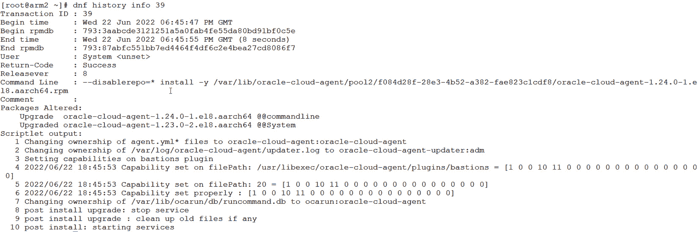

图 5.4 – dnf history info 命令

在此示例中，输出更多的是信息性内容，没有实际错误。这并不罕见。

你还可以使用 `dnf history` 来卸载一个软件包。有两种方法可以做到这一点：`rollback` 或 `undo`。`rollback` 命令尝试从当前点回滚所有 DNF 事务，直到指定的事务 ID。`undo` 命令只是撤销指定 ID 中的事务。

在测试系统上，让我们使用 `dnf history undo` `34` 命令撤销 2022 年 4 月 17 日安装的 Nmap，事务 ID 为 34：

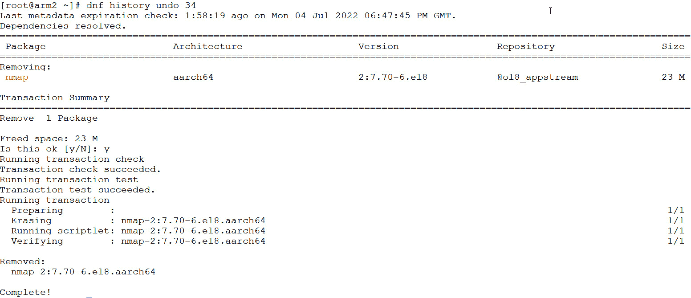

图 5.5 – dnf history undo 命令

这是一个相对简单的撤销操作，Nmap 被卸载。当查看事务后的 DNF 历史时，会看到一个新的 ID `40`，显示 `undo` 命令。

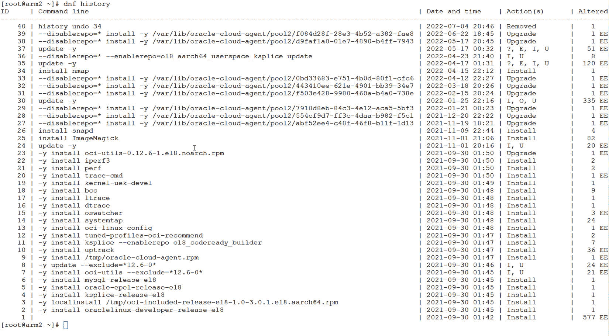

图 5.6 – 撤销后的 DNF 历史

现在，如果目标是回滚所有更改，比如回滚到 ID `37`，那么命令将是 `dnf history rollback 37`。这将使系统回滚到事务 37 完成时的状态。

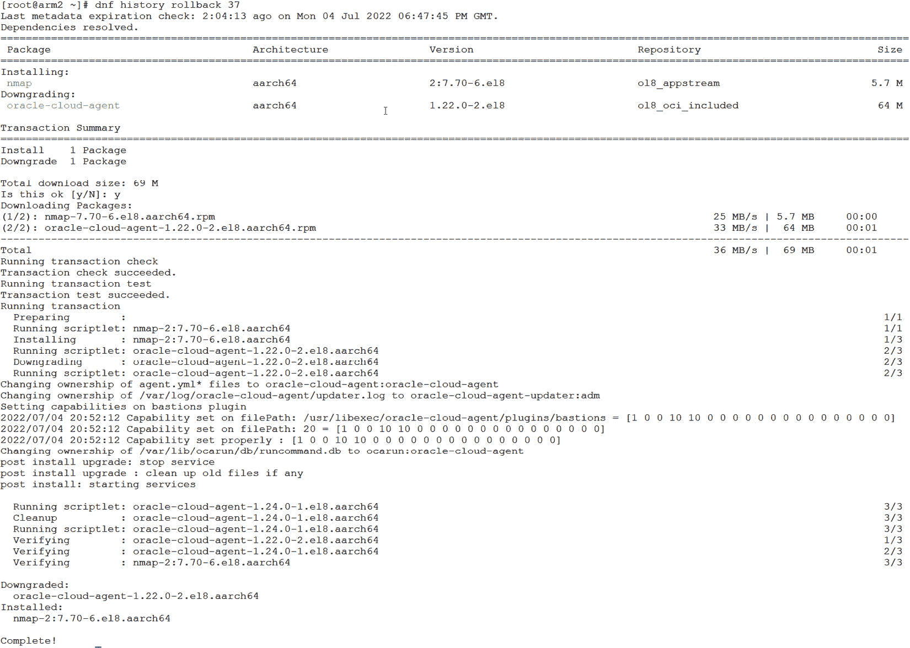

图 5.7 – DNF 回滚

`rollback` 命令会回滚事务，因此 Nmap 实际上会重新安装，而 `oracle-cloud-agent` RPM 会被降级。这将在新的历史摘要中反映为 ID `41`（如下图所示），在 ID 41 中我们可以看到安装和降级操作：

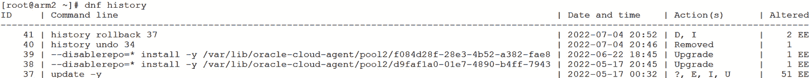

图 5.8 – DNF 回滚后的历史记录

注意

虽然`rollback`和`undo`命令通常可以很好地工作，但保持使用虚拟化程序或云原生工具进行操作系统快照仍然是一个好的做法。你还可以使用 Btrfs 来创建快照。有时候，RPM 包中的`rollback`脚本无法撤销系统的所有更改。通过利用基于存储的快照，你可以减少由于此类问题带来的风险。

DNF 系统维护了所有事务的数据库，`dnf history`命令及其选项使你能够访问该数据库，检查发生了什么，并且能够撤销单个事务或从最新的事务回滚到历史中的某个特定 ID。这是管理员在需要撤销补丁和软件安装时非常有用的工具。

# 从 ULN 构建 DNF/YUM 镜像

对于运行在安全网络中的系统（如银行或政府网络），管理员常常不会启用互联网访问。Oracle 的**不可破坏 Linux 网络**（**ULN**）的本地镜像是一个极好的方式，允许系统访问补丁，而无需通过互联网进行远程访问。

## 准备工作

为此，你需要一台运行 Oracle Linux 8 的 YUM 服务器系统。该本地系统应具备互联网访问能力，以便能够通过直接访问或代理服务器连接到 ULN 服务器。只有同步到 ULN 的系统（通常称为 YUM 服务器）需要此访问权限；所有使用该系统的其他系统不需要访问互联网，它们将通过该系统来访问补丁。

该系统不会占用大量 CPU 或内存——通常 2 个核心和 4 GB 内存就足够了，但该系统会使用大量磁盘空间。你可以通过运行`dnf repolist -v`命令来检查所需的空间。

一个 TB 的空间可能会很快用完，这取决于服务器订阅了多少个仓库。关于空间的好消息是，性能高的存储并不是必需的。如果你在 Oracle 服务器上运行，还需要一个有效的 Oracle 支持合同，该合同已包含在硬件支持合同中。在我的本地仓库中，我将仓库保存在`/var/www`目录下，并将其作为**逻辑卷管理**（**LVM**）下的一个独立文件系统挂载。这样，当需要更多空间时，可以轻松地进行扩展。

此外，应该安装一个 HTTP 服务器，并且你必须确保防火墙端口已打开。如果你需要帮助，请回到*第二章*，*使用与不使用自动化工具进行安装*，该章节中涵盖了如何设置 HTTP 服务器。

## 如何操作…

要构建镜像，请按照以下步骤操作：

1.  第一步是验证`/var/www`中是否有足够的空间。即使是一个小型镜像，也建议从 600 GB 开始。要密切关注磁盘空间，因为未来可能需要更多空间。较大的镜像很容易消耗掉 2 TB 的空间。

1.  接下来，使用 `dnf install uln-yum-mirror -y` 命令安装 `uln-yum-mirror` 包。`uln-yum-mirror` 包包括自动化复制 Oracle ULN 仓库到本地服务器的脚本。确保系统能够访问 `ol8_addons` 仓库：

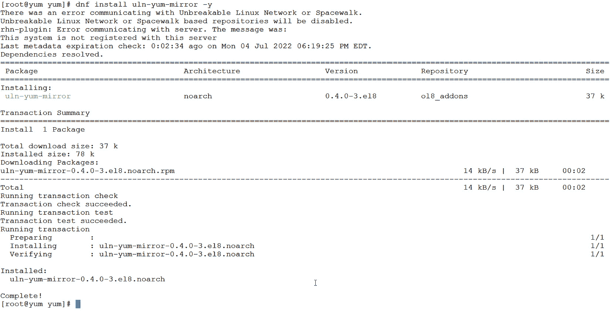

图 5.9 – uln-yum-mirror 安装

1.  这将安装来自 Oracle 的脚本。接下来，让我们使用 `uln_register` 命令将系统注册到 ULN。你需要知道 `uln_register` 命令。从那里，你将看到主界面：

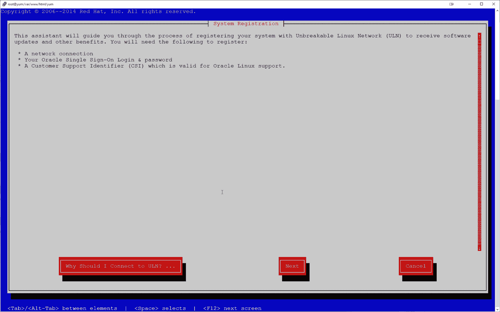

图 5.10 – uln_register 启动界面

1.  点击 **下一步** 继续。在下一个界面中，你将被提示输入 Oracle SSO 凭据。CSI 是支持标识符。请使用与你的 Premier 硬件支持或 Oracle Linux 订阅关联的 CSI。*不要*使用 Oracle 数据库、WebLogic、E-Business Suite 等的 CSI。CSI 应该是针对 Oracle Linux 的。

注意

在生产环境中，你可能会考虑创建一个共享账户，直接使用 ULN 注册所有服务器。这将使得在员工进出时更容易管理服务器。

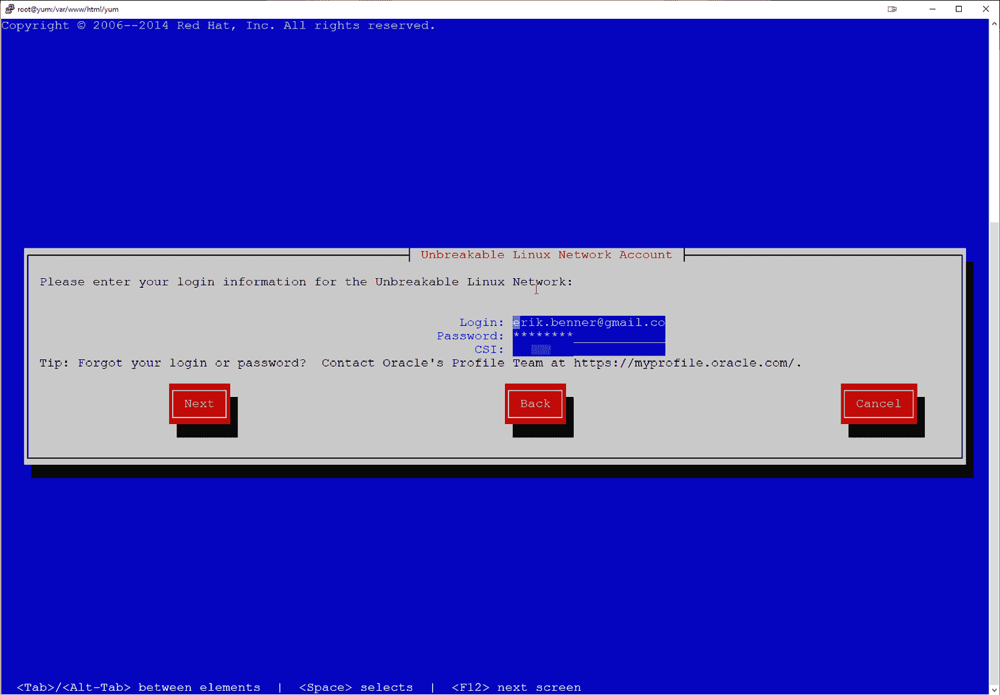

图 5.11 – uln_register 凭据

1.  接下来，你需要为 ULN 确定服务器的身份。通常，你会使用服务器的 **完全合格域名**（**FQDN**），但选择权在你。你也可以选择上传硬件详细信息，但这是可选的。

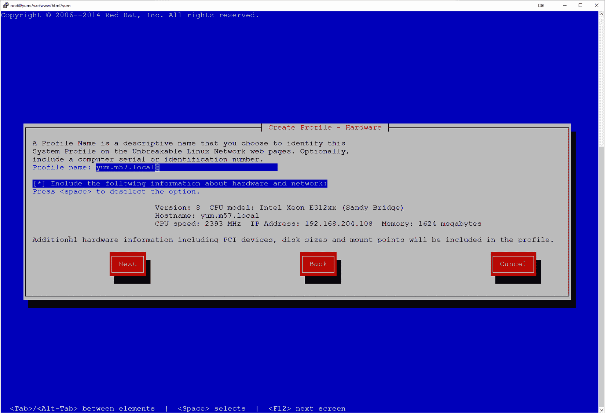

图 5.12 – uln_register 系统名称

1.  接下来，系统将更新 ULN 以同步服务器上安装的软件，这将使你能够通过 ULN 跟踪已安装的 RPM，但*仅限*直接注册到 ULN 的系统。当使用本地仓库时，你可能会考虑使用像 Oracle Linux Manager 这样的工具来跟踪未注册到 ULN 的系统上的软件：

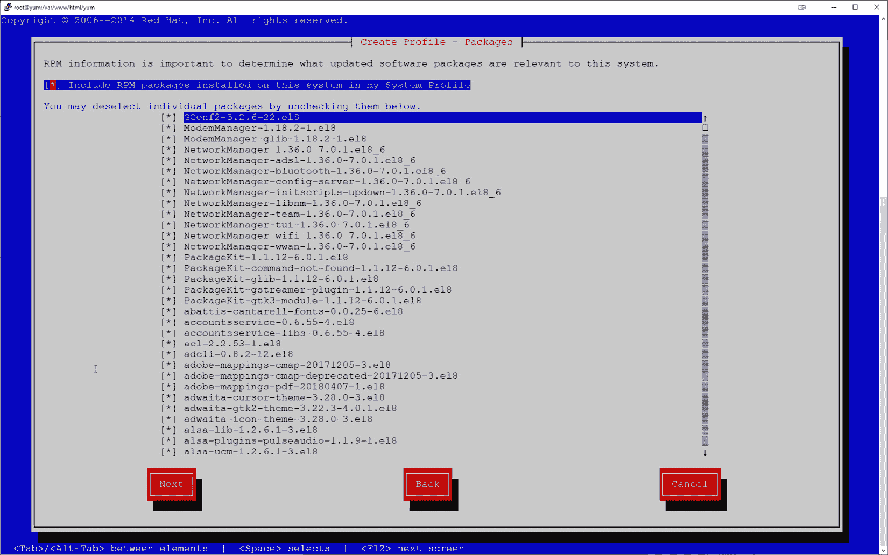

图 5.13 – uln_register 初始包

1.  服务器在 ULN 上的注册几乎完成。最后一步是将信息发送到 ULN 以注册服务器，这将在下一步自动完成：

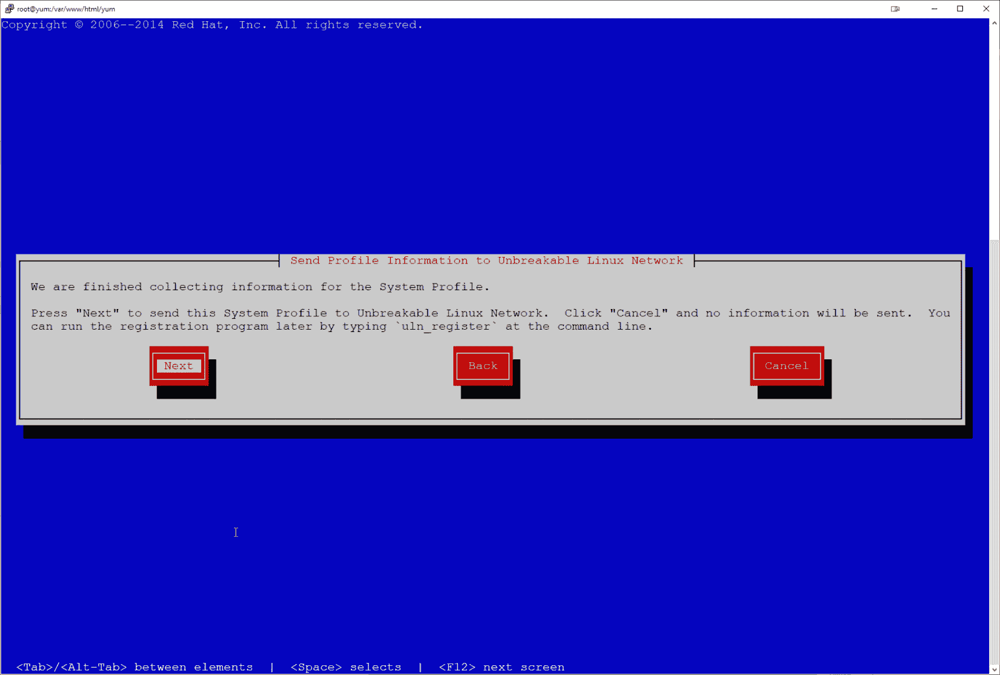

图 5.14 – uln_register 发送

上传可能需要最多一分钟，具体取决于你的网络速度。

上传完成后，系统现在已在 ULN 中注册。下一步是可选的。它将为服务器设置 Ksplice。如果你不想使用 Ksplice，可以跳过此步骤。Ksplice 还要求你拥有 Oracle Linux Premier Support 订阅。这个订阅包含在 Oracle 硬件支持和 Oracle Cloud 虚拟机中。你也可以为第三方系统购买此订阅，通常价格比其他商业 Linux 发行版便宜。

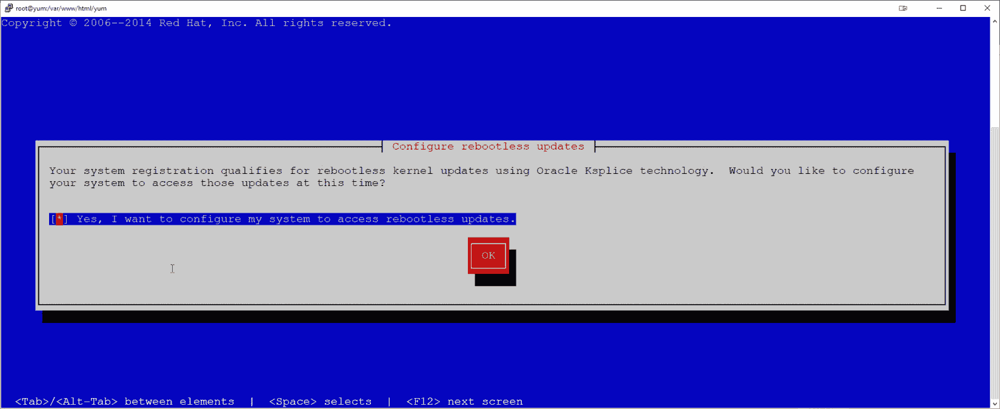

图 5.15 – uln_register ksplice

1.  Ksplice 是一个快速步骤；只需查看设置，如下截图所示，然后点击**确定**：

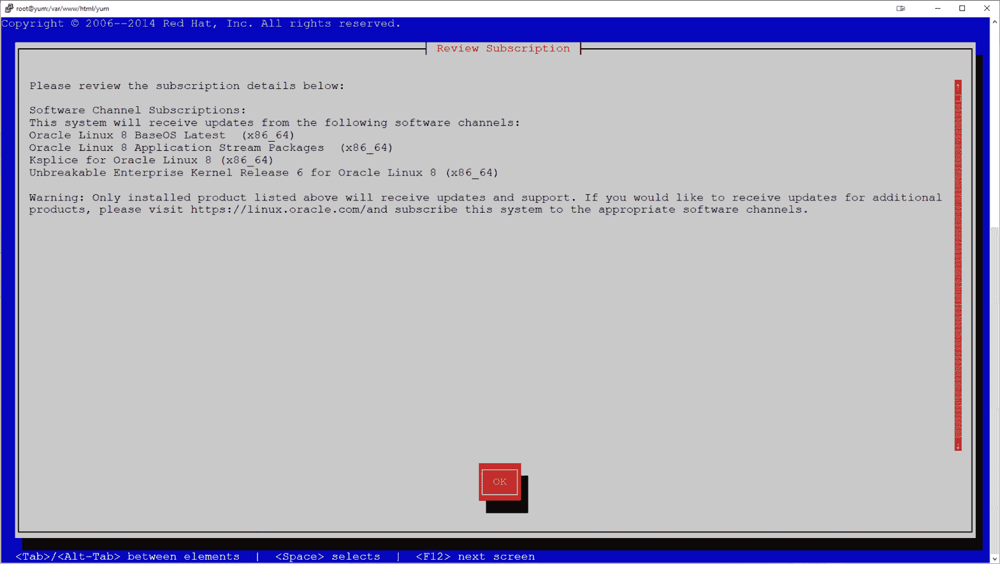

图 5.16 – uln_register 设置

1.  注册现已完成。您应该在继续之前使用`dnf -y update`（工具推荐的命令）来修补服务器：

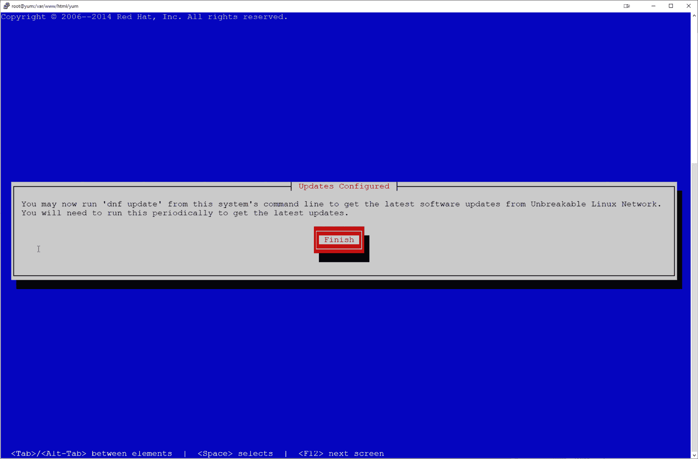

图 5.17 – 完成的 uln_register

1.  接下来，使用`dnf update -y`修补系统并重启系统。需要注意的是，`-y`选项的位置对命令没有影响。系统重启后，您需要登录[`linux.oracle.com/`](https://linux.oracle.com/)。虽然此服务器现在已注册到 ULN，但它还不是本地仓库！我们需要告诉 ULN 这是一个本地仓库，并选择我们需要镜像的仓库。

    为此，访问[`linux.oracle.com`](https://linux.oracle.com)并点击**登录**按钮：

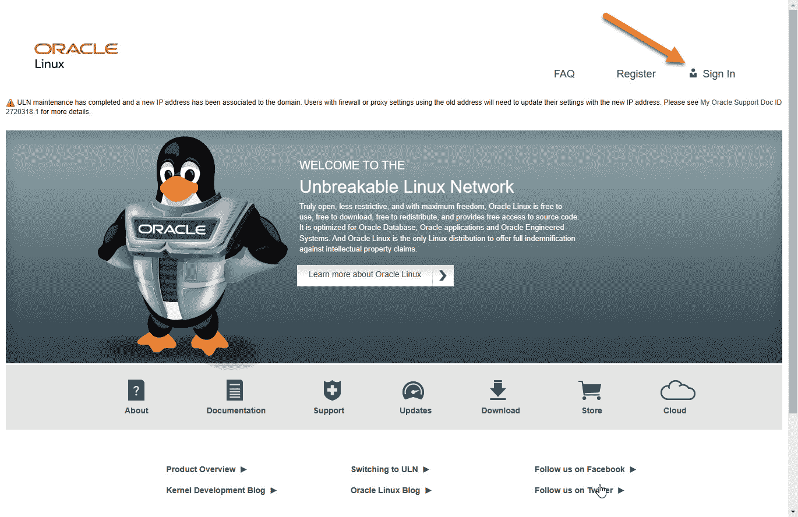

图 5.18 – ULN 主页

在管理服务器时，使用与注册服务器时相同的登录信息。

1.  登录 ULN 后，您将看到所有注册到您账户下的服务器。您还会看到最近更新和添加到系统中的通道：

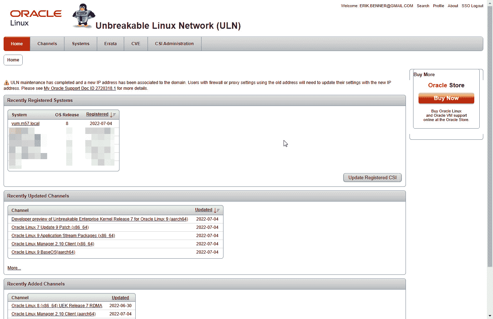

图 5.19 – 管理的服务器

1.  从这里开始，我们需要将服务器提升为 YUM 仓库。这将告诉 ULN 允许该服务器分配任何通道，从而使其能够下载不属于特定服务器所需的 RPM 包。这包括不同 Oracle Linux 主版本的补丁、不同 CPU 架构（如 AArch64）的补丁，以及针对 Exadata 等平台的特殊补丁。为此，点击服务器名称，然后点击**编辑**按钮：

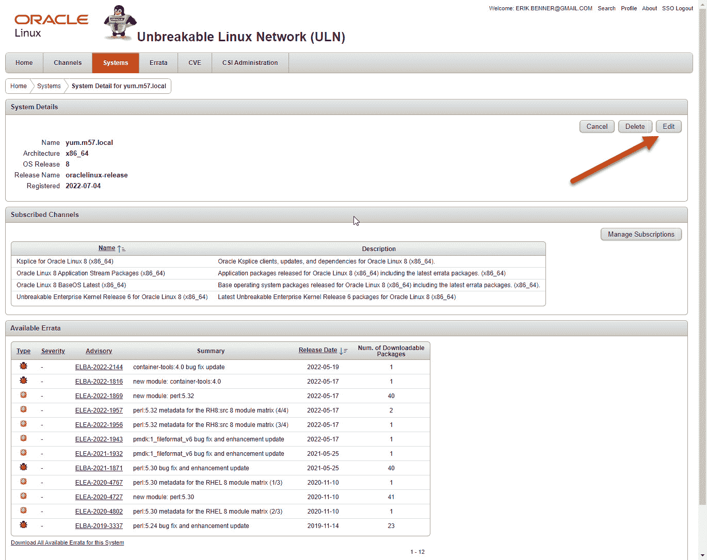

图 5.20 – 编辑服务器

1.  在此页面上，我们将更新服务器属性以使其成为 YUM 服务器。勾选**Yum Server**复选框，然后点击**应用更改**：

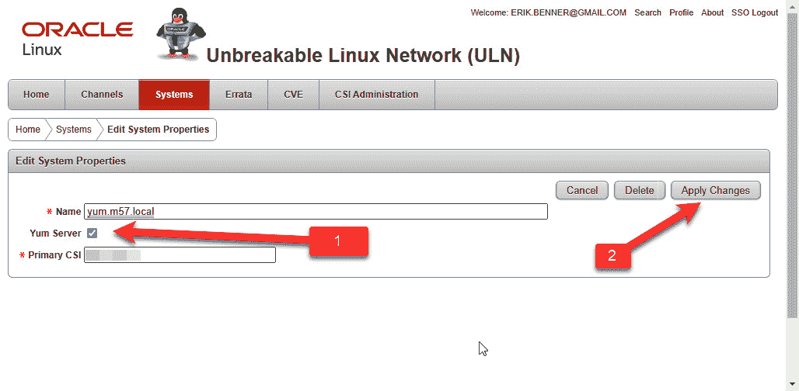

图 5.21 – 将其设为仓库

1.  接下来，我们需要为服务器分配额外的通道。这将允许服务器提供它所订阅的任何通道。要管理包含相关 RPM 包的 RPM 通道，请点击**管理** **订阅**按钮：

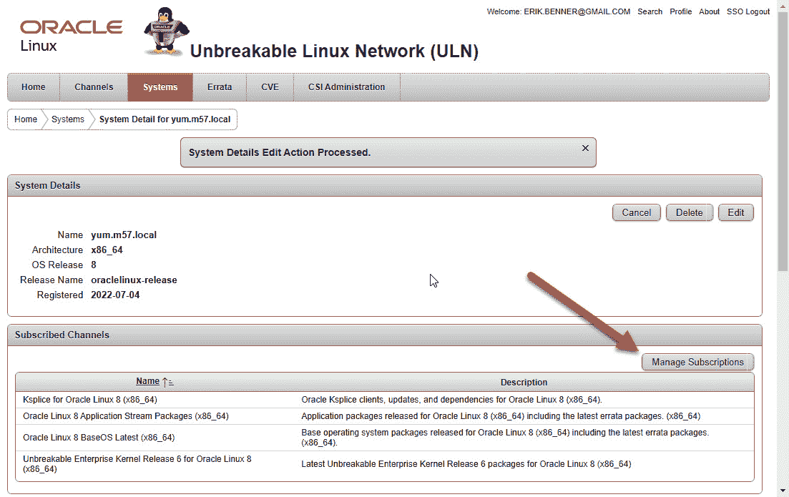

图 5.22 – 管理订阅

1.  接下来，您将看到左侧是所有可用的频道，右侧是分配给服务器的频道。虽然您可以批量选择所有频道，但最好只选择您需要的频道。在此示例中，**Oracle Linux 8 Addons x86_64** 正在被添加。您还可以为不同的主版本号添加频道，例如 Oracle Linux 7。当选择频道时，请确保选择 **<** 或 **>** 符号来订阅或取消订阅本地服务器。如以下图中的第 2 步所示。另外，一旦完成选择，您必须点击 **保存订阅** 选项来更新订阅。如果在未保存订阅的情况下退出，所做的任何更改都将丢失。

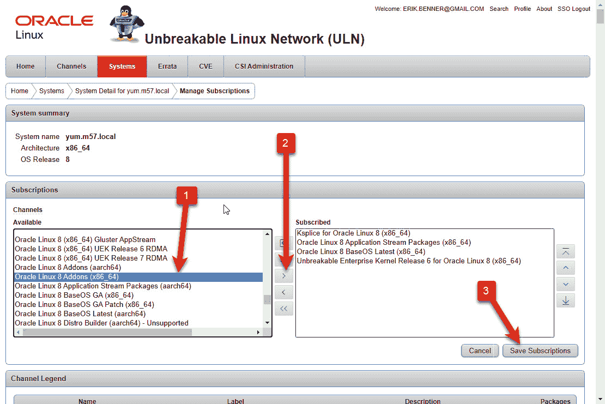

图 5.23 – 添加更多仓库

注意

添加频道时，只添加您需要的频道，以节省空间和带宽。如果不小心，您可能会轻松下载几个 TB 的数据。另外，归档频道可能非常大，并且通常不适用于大多数站点，因为它们包含较旧的版本。如果开始在本地使用这些频道，预计会占用多个 TB 的磁盘空间。

1.  确保您看到 **订阅** **已保存** 消息：

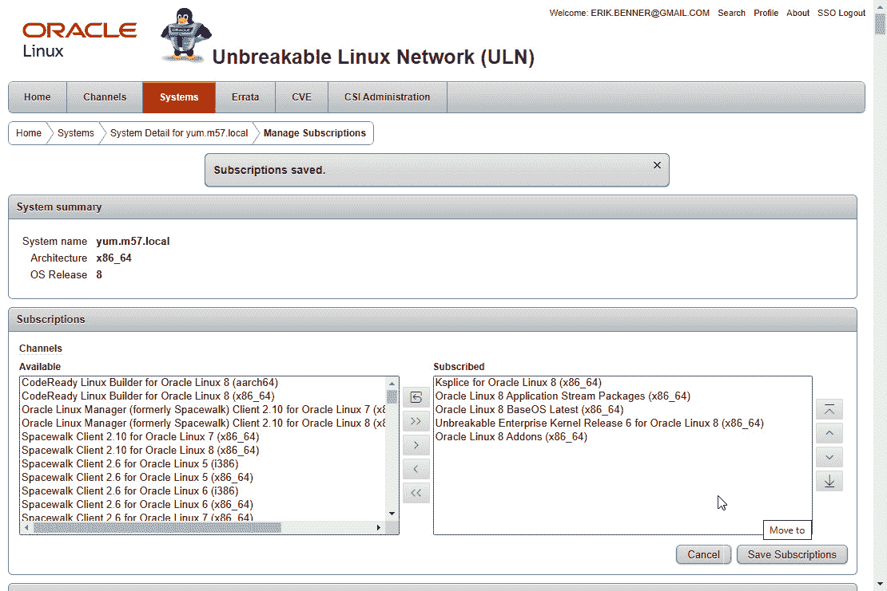

图 5.24 – 保存配置

现在，我们终于完成了本地仓库的设置。接下来，作为 root 用户运行 `uln-yum-mirror` 命令，仓库将开始同步。这个过程可能需要几个小时，具体取决于您的互联网速度和您订阅的频道数量。系统也会每天自动运行，保持本地副本的最新状态。

注意

在进行第一次同步时，请密切关注磁盘空间。第一次时，您可能需要快速增加空间。如果发生这种情况，增加空间并手动重新启动 `uln-yum-mirror` 命令。

当您完成手动运行时，脚本会告诉您每个仓库复制了多少数据：

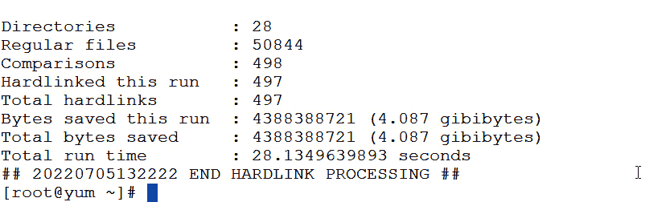

图 5.25 – 完成的镜像

配置完成后，系统将自动将本地仓库与 ULN 同步。随着您添加新的频道，它们将在 `cron` 作业运行时自动下载。

# 创建新的 RPM 包

虽然 Oracle 提供了大量的 RPM 文件，但有时您可能需要创建自定义的 RPM 包，以便轻松部署自己的软件。创建一个 RPM 文件是非常简单的！

## 准备工作

为了做到这一点，您将需要一个运行 Oracle Linux 8 的开发系统，并且可以访问 **企业 Linux 的额外软件包** (**EPEL**) 频道。强烈建议使用专用系统来构建 RPM，而不是在生产系统上构建 RPM。您还需要一个系统来测试安装 RPM。

注意

根据构建的包，您可能需要额外的频道，如 CodeReady 或 Distro Builder。

在此之前，我们需要做一些准备工作——主要是安装 RPM 开发工具。为了做到这一点，我们还需要将 EPEL 仓库添加到系统中。

虽然本书中的大多数配方使用`root`用户进行大部分工作，但本配方仅在安装软件时使用 root。接下来的几步请使用`root`用户执行。

要添加 EPEL 仓库，请运行以下命令：

```
dnf install oracle-epel-release-el8
```

接下来，运行以下命令来启用 EPEL 以及`codeready`和`distro_builder`仓库。将所有这些工具安装到你的构建系统中，将来能更方便地利用更高级的构建工具，如 Mock：

```
dnf config-manager --enable ol8_developer_EPEL
dnf config-manager --enable ol8_codeready_builder
dnf config-manager --enable ol8_distro_builder
```

接下来，我们将安装构建`rpm`文件的基本工具。运行以下命令来安装这些工具：

```
dnf install -y rpm-build yum-utils rpmdevtools
```

如果你从 Git 拉取软件，可能需要安装`git`和`git-lfs`（`gcc`、`make`和`python3-service-identity` RPM 包也很常见。你可以使用以下命令安装所有这些：

```
dnf install -y git git-lfs make gcc python3-service-identity
```

## 如何操作……

现在我们已经安装了所有工具，切换到非 root 用户：

1.  为 RPM 创建一个目录。在这里，我们将有一个软件源文件，以及所有将其制作成 RPM 所需的文件和目录。以我的情况为例，我将所有内容放在`/home/erik/`中。

1.  接下来，我们需要创建 RPM 目录树。可以通过运行`rpmdev-setuptree`命令来完成此操作。运行该命令后，树状结构将在`$HOME`下的`rpmbuild`目录中创建：

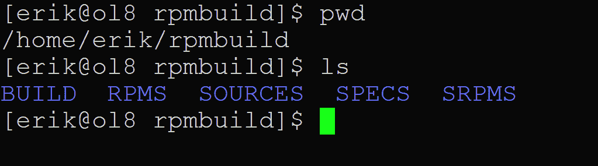

图 5.26 – rpmbuild 目录

还会构建五个目录，每个目录都有特定的用途：

+   `BUILD`：这是编译后的二进制文件保存的地方。

+   `RPMS`：在这里创建 RPM，生成可以使用的`rpm`文件。这里会有针对不同 CPU 架构的子目录。

+   `SOURCES`：这是放置源代码的地方，通常是一个 tar 文件。

+   `SPECS`：这是`.spec`文件所在的目录。

+   `SRPMS`：源 RPM 文件将在这里构建——通常是包含软件源代码的包。

1.  创建一个简单的 Bash 脚本，作为 RPM 发布。它将位于`rpmbuild`目录下的`xyzzy`目录中。同时还创建了一个简单的 Bash 脚本：

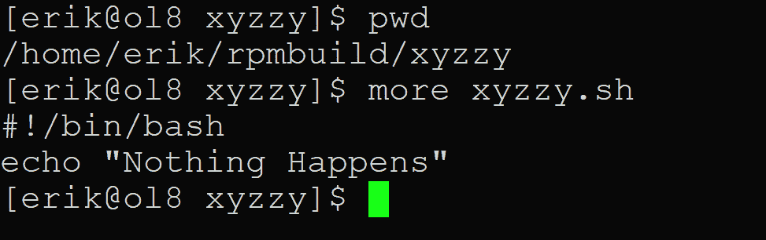

图 5.27 – xyzzy.sh 脚本

1.  接下来，创建一个包含`xyzzy`目录内容的压缩 tar 文件：

    ```
    [erik@ol8 rpmbuild]$ tar -cvf SOURCES/xyzzy-1.0.tar.gz xyzzy
    xyzzy/
    .spec file. The .spec file contains the name of the program, a description of the program, licensing information, project URL, build architecture, and more. The following command will create a default .spec file in the SPECS directory:

    ```

    rpmdev-newspec SPECS/xyzzy.spec

    ```

    The skeleton is very sparse and will need information added.The sample skeleton is seen as follows:
    ```

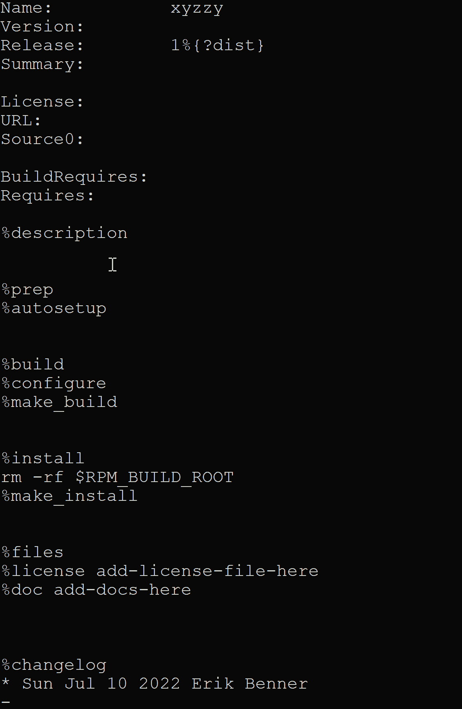

图 5.28 – 基本.spec 文件

为了使其功能正常工作，需要做很多事情。

`Version`和`Summary`部分需要填写，另外还需要填写`License`信息和项目的 URL。此外，将构建架构设置为`noarch`，因为这将同时安装在 ARM 和 X64 系统上。重要的是确保包含**Name、Epoch、Version、Release 和 Architecture**（**NEVRA**）信息。这有助于确保正确的 RPM 安装到系统中。

已设置描述，并且更新了 `%install` 部分以反映脚本安装到正常的二进制目录中。

`%files` 部分显示了 `/usr/bin/xyzzy.sh`，因为所有 `.sh` 文件都被添加到安装程序中。未使用的部分也会被移除。

最终结果如下：

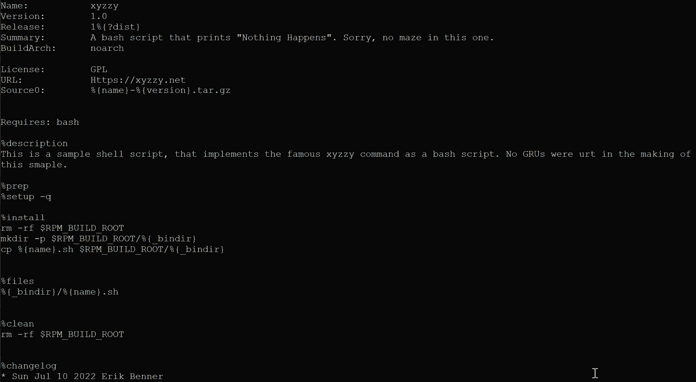

图 5.29 – 完成的 .spec 文件

1.  `rpm` 文件将通过 `rpmbuild` 命令构建，并传入 `.spec` 文件的路径。使用的命令是 `rpmbuild -bb -v SPECS/xyzzy.spec`，其输出如下：

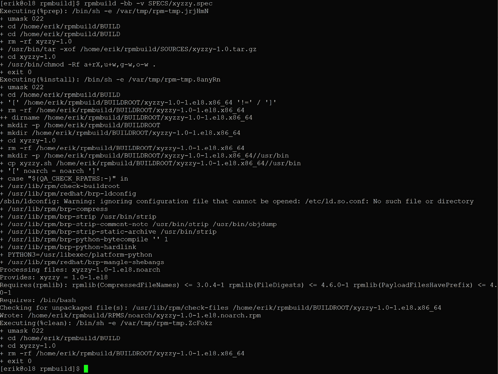

图 5.30 – rpmbuild 的输出

1.  RPM 文件现在位于 `RPMS` 目录下的 `noarch` 目录中：

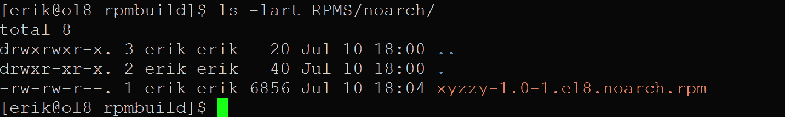

图 5.31 – RPM 文件

该 RPM 文件现在可以复制到其他系统上手动安装，或者添加到 YUM 仓库中。

1.  安装后，您可以使用 `rpm -qi xyzzy-1.0` 命令查看来自 `.spec` 文件的详细信息，例如许可证、描述等：

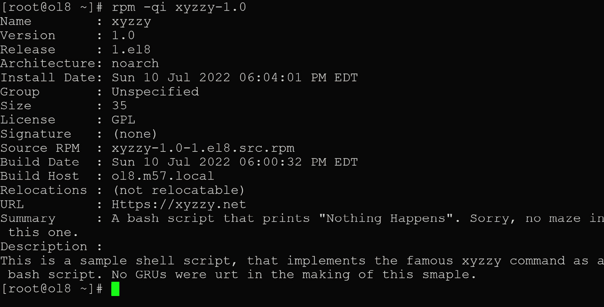

图 5.32 – RPM 文件详细信息

RPM 工具使您能够轻松构建自定义的 RPM 文件进行分发。这是通过 `.spec` 文件驱动的，该文件包含了所有的依赖关系、描述、文件位置，甚至是构建信息，用于创建 RPM 文件。
