# 第六章：消除所有 SPOFs！冗余练习

在架构中确保冗余是至关重要的，以确保平稳的操作。消除**单点故障**（**SPOFs**）是实现这一目标的常见方法。实施**高可用性**（**HA**）技术是消除 SPOFs 的一种方式。HA 技术至关重要，因为它帮助企业保持运营连续性，提升性能，提高可靠性，促进**灾难恢复**（**DR**），建立客户信任，并遵守法规。通过 HA 技术，可以最小化停机时间并确保持续的服务可用性，从而为今天技术驱动的世界中的整体成功和竞争力做出贡献。

注释

那么灾难恢复呢？本章不涵盖数据中心故障的问题。话虽如此，灾难恢复的实施方法与 HA 非常不同。在云中运行时，可以寻找像 Oracle 全栈灾难恢复服务这样的服务，它们为整个技术堆栈自动化灾难恢复过程。

本章中的操作指南将帮助你消除环境中的 SPOFs。我们将首先概述 HA 和可用性，然后介绍如何为你的应用程序增加冗余的几个示例。帮助消除应用程序中的 SPOFs 的四种最常见技术是 HAProxy、Corosync、Pacemaker 和 GlusterFS。它们每个都提供了一套特定的功能来帮助使应用程序高度可用：

+   **HAProxy**：这是一个负载均衡器，允许你在服务器之间平衡 Web 工作负载

+   **Corosync**：这是一个通信系统，支持应用程序内部实现 HA 的通信。

+   **Pacemaker**：Pacemaker 是一个开源资源管理器，用于构建小型和大型集群。

+   **GlusterFS**：这是一种可扩展的网络文件系统，允许多个节点同时读取和写入同一存储中的数据。

以下的操作指南将帮助你实现这些常见的 HA 技术。这包括从负载均衡应用程序和集群应用系统到集群存储和冗余网络的一切内容：

+   获得 99.999% 的可用性及更高

+   网站的负载均衡

+   使用 Keepalived 使 HAProxy 高可用

+   使用 Corosync 和 Pacemaker 实现 HA 集群

+   在多个机器间共享文件系统——集群还是分布式？

+   生成、配置并监控通过 bond 的以太网流量

# 技术要求

对于这些大多数食谱，你需要一对 Oracle Linux 8 系统。与大多数这些食谱一样，建议在桌面上使用桌面虚拟化产品（如 Oracle VirtualBox）创建虚拟机。小型虚拟机就足够了，配有两个核心、2GB 内存和一些可用磁盘空间。你还需要为虚拟机分配一些额外的磁盘，最好至少有五个大小相等的磁盘。在开始之前，先将你的系统更新到最新的软件包。这样做只需要几分钟，但可以节省很多排除因错误导致问题的时间。

本书中的许多食谱相关配置文件可在 GitHub 上找到，链接：[`github.com/PacktPublishing/Oracle-Linux-Cookbook`](https://github.com/PacktPublishing/Oracle-Linux-Cookbook)。

# 获得 99.999%及以上的可用性

本节将讨论灾难恢复（DR）和高可用性（HA）之间的区别，以及如何构建 HA 解决方案。在我们开始之前，先来澄清几个关键术语的定义：

+   **高可用性**，或**HA**：指的是防止单个组件故障的措施。可以将其理解为防止整个系统故障的保护措施。

+   **灾难恢复**，或**DR**：指的是数据中心或云区域的故障。

+   **可用性九个**：当提到*可用性的九个*时，它是通过指定正常运行时间百分比中的九个数字来量化系统的正常运行时间或可靠性。每个*九个*代表正常运行时间百分比中的一个小数位。

下面是最常用的*nines*及其对应的正常运行时间百分比的分解，假设 24x7x365 的运营模式：

| **九个** | **每年停机时间** | **每月停机时间** |
| --- | --- | --- |
| 99 | 3 天 14 小时 56 分钟 18 秒 | 7 小时 14 分钟 41 秒 |
| 99.9 | 8 小时 41 分钟 38 秒 | 43 分钟 28 秒 |
| 99.99 | 52 分钟 10 秒 | 4 分钟 21 秒 |
| 99.999 | 5 分钟 13 秒 | 26 秒 |
| 99.9999 | 31 秒 | 2.6 秒 |

表 6.1 – 九个停机时间

在前面的表格中，正常运行时间百分比中每增加一个九个，意味着更高的可用性和更低的停机容忍度。实现更多的九个通常需要实施冗余系统、故障切换机制和严格的维护实践，以最小化停机时间并确保持续运行。此外，在设置**服务级别协议**（**SLA**）时，还可以定义在工作时间内的正常运行时间，并排除计划的维护。例如，使用每周一到周五、每天 12 小时工作、每年 10 个假期的工作计划时，矩阵会看起来非常不同！

| **九个** | **每年停机时间** | **每月停机时间** |
| --- | --- | --- |
| 99 | 1 天 7 小时 2 分钟 58 秒 | 2 小时 35 分钟 14 秒 |
| 99.9 | 3 小时 6 分钟 18 秒 | 15 分钟 31 秒 |
| 99.99 | 18 分钟 38 秒 | 1 分钟 33 秒 |
| 99.999 | 1 分钟 52 秒 | 9 秒 |
| 99.9999 | 11 秒 | 1 秒 |

表 6.2 – 工作时间停机时间

注

在与业务部门设置 SLA 时，务必清楚理解在 SLA 中包括维护窗口和运营时间的区别。

## 准备工作

在设计 HA 系统时，需要考虑几个方面，以确保系统具有弹性并能够应对故障。以下是一些关键考虑因素：

+   **冗余**：在 HA 系统中实现冗余是必不可少的。这需要复制组件或整个系统，以消除潜在的单点故障（SPOF）。冗余可以在不同的层面实现，如硬件、软件和网络基础设施。为了最小化局部故障的影响，必须将冗余组件分布在不同的物理位置。

+   **故障转移和负载均衡**：HA 系统必须配备故障转移机制，使其在发生故障时能够自动切换到备份系统。实现这一点的一种方式是通过将数据和服务复制到多台服务器，并结合使用负载均衡技术，确保负载的均匀分配。通过负载均衡，流量可以在服务器故障时轻松地重定向到可用的服务器。

+   **可扩展性**：在设计高可用性（HA）系统时，确保系统能够处理增加的工作负载并能够轻松扩展非常重要。这可以通过水平扩展来实现，即添加更多的服务器以分配负载，或者通过垂直扩展来实现，即向现有服务器添加资源。此外，系统应能够根据需求动态调整资源分配，以防止过载。

+   **数据复制和备份**：维护数据的完整性和可用性对 HA 系统至关重要。为了确保在系统故障时仍能访问数据，必须将数据复制到多个存储系统或数据库中。此外，定期备份对于防范潜在的数据丢失或损坏至关重要。

+   **容错性**：用于高可用架构的系统应具备容错能力，这意味着即使特定组件或子系统发生故障，系统仍然能够正常运行。实现这一点需要构建一个能够轻松处理错误、自动恢复并确保服务连续性的系统。

+   **灾难恢复**：对于 HA 系统而言，拥有灾难恢复（DR）计划对于有效应对自然灾害或大规模停机等灾难性事件至关重要。该计划包括生成异地备份、设置备用数据中心以及依赖基于云的服务，确保即使在极端情况下也能保证业务连续性。

+   **文档和测试**：记录系统架构、配置和操作流程对于有效地排查故障和维护 HA 系统至关重要。定期测试，如故障转移测试、负载测试和灾难恢复演练，对于识别潜在问题并确保系统在各种场景中按预期运行起着重要作用。

+   **成本和复杂性**：设计、实施和维护高可用性系统可能既复杂又昂贵。重要的是仔细考虑可用预算，以及有效管理和监控系统所需的专业知识和资源。

通过解决这些考虑因素，您可以设计一个稳健且具有韧性的高可用性系统，确保高可用性、容错性和关键服务的连续性。

## 如何实现…

一般而言，您应选择适合的技术来应对合适的子系统和应用程序。

在旨在实现高可用性（HA）的 Web 应用程序中，第一步是将负载均衡器放置在 Web 服务器前面。这使得应用程序可以扩展，同时为这些系统提供一些容错能力。然而，还应关注数据层，可以通过对数据库进行集群化或根据数据库技术的限制构建一个能够运行数据库的集群来解决这一问题。

如果您使用的是如 Oracle 数据库这样的技术，您可以选择建立一个特定于数据库的集群，称为**Oracle Real Application Clusters**（**Oracle RAC**）。这个集群同时支持可扩展性和可用性。使用 RAC 时，只要一个节点在线，数据库就可以继续提供查询服务。虽然其他数据库可能会利用其独有的集群技术（例如 MySQL Cluster），您也可以选择使用通用的集群技术，如 Pacemaker 进行集群管理，使用 Corosync 进行集群间的通信。这种方法的优点是可以在 Linux 环境下使几乎任何技术实现高可用性。

您可以通过在整个集群上实现文件系统来实现存储的高可用性。Gluster 允许您在多个服务器之间挂载文件系统，同时在服务器之间复制存储。这在文件系统级别提供了可扩展性和可靠性。

最后，网络是常见的故障点，使用网络绑定技术可以实现高可用性以及一定的扩展能力。这通过将至少两个网络端口合并为一个虚拟端口来工作。

注意

最佳的高可用性架构将这些方法混合使用，覆盖整个技术栈。

# 网站负载均衡

如今，大多数应用程序都是基于 Web 的，无论是传统的 Web 界面还是 RESTful API。这一层通常会使用负载均衡器进行高可用性设置。负载均衡器是一个将传入的网络流量或工作负载分配到多个服务器或资源的系统。其主要目标是优化资源利用、提高性能，并确保应用程序或服务的可靠性和可用性。当多个服务器参与提供特定应用程序或服务时，负载均衡器充当客户端和服务器池之间的中介。它接收来自客户端的请求，并根据不同的算法（如轮询、最少连接数或加权分配等）智能地将请求分配到可用服务器上。

负载均衡器负责通过将流量从超负荷或有问题的服务器重定向到其他服务器，确保服务器的最佳健康和性能。这种工作负载的分配有助于防止任何一台服务器被过载，从而提高响应时间和整体系统的容量与可扩展性。

注意

虽然负载均衡器可以帮助分配工作负载，但实际的服务器负载是由其他因素决定的，因此不要期望所有服务器的 CPU、内存、网络等资源的利用率相同。

负载均衡器不仅分配流量，还提供一些高级功能，例如 SSL 终止、会话持久性、缓存和内容路由等。它们广泛应用于 web 应用、云服务以及其他需要高可用性和可扩展性的环境中。

最受欢迎的负载均衡器之一是 HAProxy。

HAProxy 是一个出色的开源负载均衡器选项。HAProxy 代表着 **高可用性代理**，因其卓越的性能以及提高应用程序可用性和可扩展性的能力而广泛应用。该软件工作在 OSI 模型的应用层（第 7 层），能够根据特定的应用层信息（例如 HTTP 头部和 Cookie）做出路由决策。与传统的网络层（第 4 层）负载均衡器相比，HAProxy 允许更先进的负载均衡和流量路由功能。

HAProxy 的一些关键特性和功能包括以下内容：

+   **负载均衡**：使用 HAProxy，传入的流量可以通过多种算法均匀分配到多个服务器上，例如轮询、最少连接数和源 IP 等。

+   **高可用性**：HAProxy 的一大优点是它支持主动-被动故障转移的设置。当活动服务器变得不可用时，备用服务器将接管。此外，它还能够监控服务器的健康状况，并通过添加或移除服务器自动调整负载均衡池。

+   **代理**：HAProxy 的主要功能之一是充当反向代理，它通过接收客户端请求并将其指向正确的后端服务器。此外，它还可以作为正向代理，拦截客户端请求并将其指向外部服务器。

+   **SSL/TLS 终止**：使用 HAProxy，SSL/TLS 加密和解密可以高效地管理，减轻后端服务器的负担。

+   **会话保持**：HAProxy 能够通过将来自客户端的后续请求路由到同一个后端服务器来保持会话亲和力，从而保证基于会话的应用程序的正常运行。

+   **健康检查和监控**：为了保证后端服务器的可用性和最佳性能，HAProxy 会进行定期的健康检查。它能够识别出失败的服务器并及时将其排除在负载均衡池之外。

+   **日志记录和统计**：通过 HAProxy，管理员可以有效地监控和分析流量模式、性能指标和错误状况。其详细的日志记录和统计功能使这一切成为可能。

HAProxy 可以部署在多种操作系统上，且常用于高流量的 Web 环境、云基础设施和容器化部署。它的多功能性和丰富的功能集使其成为管理和优化应用流量以及开源负载均衡器的强大工具。

在这个例子中，我们将把 HAProxy 安装在一台系统上（作为负载均衡器），然后再部署两台相同的 Web 服务器来平衡流量到：

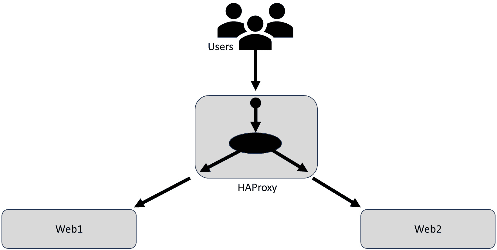

图 6.1 – HAProxy 示例图

## 准备工作

要开始，首先我们需要三台服务器。在本练习中，我们将其命名为`lb1`、`web1`和`web2`。它们是相同的系统，每台有 8GB 内存、4 个 vCPU 和 100GB 硬盘空间。文件系统中，`/`有 50GB，`/home`有 5GB，交换空间为 8GB。剩余的磁盘空间为未分配。你还需要每台主机的 IP 地址。在本示例中，使用了以下 IP 地址：

| **Host** | **IP** |
| --- | --- |
| **Web1** | `192.168.56.200` |
| **Web2** | `192.168.56.201` |
| **Lb1** | `192.168.56.202` |

表 6.3 – HAProxy IP 地址

一旦服务器搭建完成，使用以下命令将其更新到当前的软件版本：

```
dnf update -y
```

一旦软件打上补丁，重启系统。

### Web 服务器

对于两个 Web 服务器，我们将安装 Apache，作为 root 用户，使用以下命令：

```
dnf install httpd -y
```

接下来，我们需要启用端口`80`通过防火墙，使用以下命令：

```
firewall-cmd --permanent --add-service=http; firewall-cmd --reload
```

然后我们需要启动服务器，并设置其开机启动。可以使用以下命令完成：

```
systemctl enable --now httpd
```

现在我们需要为该服务器设置一个基础的主页。

注意

根据你的环境，可能需要编辑 Apache 配置文件`/etc/httpd/conf/httpd.conf`来指定`servername`。在配置文件中，它将是单行条目，如下所示：

**ServerName server.m57.local:80**

这需要放入 `/var/www/html/index.html`。以下是一个示例文件。根据需要调整文本，使每个服务器都是唯一的。这样，你可以看到是哪台服务器被访问：

```
<!DOCTYPE html>
<html>
<body>
<h1> Running on web1</h1>
</body>
</html>
```

接下来，使用浏览器访问系统进行测试：


图 6.2 – 简单网站

接下来，重复在另一个 Web 服务器上的操作。一旦该系统启动，我们将设置负载均衡器。

注意

如果你在服务器上使用 `httpd`（TLS/SSL），别忘了在本地防火墙中启用 `https`。

### 负载均衡器

对于单一负载均衡系统，我们需要安装 HAProxy。这可以通过使用 `dnf` 命令以 root 用户身份完成：

```
dnf install -y haproxy
```

接下来，我们需要用以下命令在防火墙中打开 `80` 端口：

```
firewall-cmd --permanent --add-service=http; firewall-cmd --reload
```

接下来，我们需要编辑配置文件。配置文件位于 `/etc/haproxy/haproxy.cfg`。

配置文件有两个主要部分，`global` 和 `defaults`。配置文件中只能有一个 `global` 部分。这部分用于配置 TLS/SSL 数据、日志配置以及运行 `haproxy` 的用户和组设置。默认情况下，`haproxy` 作为用户 haproxy 和组 haproxy 运行。在大多数使用场景中，`global` 部分不需要更改。以下图示为例：

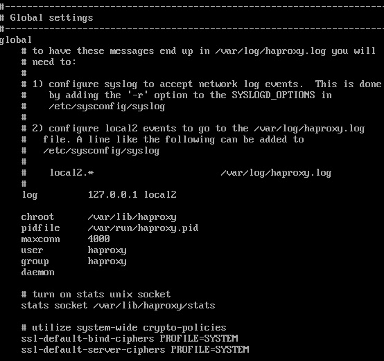

图 6.3 – HAProxy 全局设置

下一个部分叫做 `defaults` 部分，是你将进行大部分编辑的地方。它由三个子部分组成：`frontend`、`backend` 和 `listen`。

`frontend` 部分监听所有定义的 IP 地址和端口。这是用户将连接的部分。一个 HAProxy 服务器可以有多个 `frontend` 部分，但每个部分都需要一个唯一的名称和 IP/端口组合。

`backend` 部分定义了被负载均衡的服务器，定义了负载均衡方法以及流量发送到的服务器和端口。一个 HAProxy 服务器可以有多个 `backend` 部分，但每个部分都需要一个唯一的名称。

`listen` 部分用于定义如何监控负载均衡器，提供端口、URI 和监控 HAProxy 所需的认证信息。通常你只有一个 `listen` 部分。

对于同一个前端，我们将在 `lb1` 系统的 `80` 端口上监听，称为 `www_app`，并将定义这个 IP/端口组合使用 `www_servers` 后端。

#### frontend

HAProxy 配置文件的 `frontend` 部分提供了多种选项来管理传入流量的行为。这些选项可以用来控制前端流量的行为。以下是一些常用的前端选项：

+   `bind`：定义前端监听传入流量的 IP 地址和端口。例如，`bind *:80` 表示在所有 IP 地址的 `80` 端口上监听。

+   `mode`: 指定前端的模式，例如 `http`、`tcp` 或 `ssl`。对于 HTTP 流量，使用 `mode http`。如果要负载均衡一个通用的 TCP 端口，请使用 `mode tcp`。

+   `option`: 启用或禁用前端的特定选项。一些常用选项如下：

    +   `option httplog`: 启用 HTTP 请求/响应日志记录

    +   `option dontlognull`: 防止记录缺失或空白用户代理字符串的请求

    +   `option forwardfor`: 在使用 HTTP 代理模式时，将客户端的 IP 地址添加到 HTTP 请求头中

    +   `option http-server-close`: 强制服务器在处理请求后关闭连接，而不是使用持久连接（keep-alive）

+   `timeout`: 配置前端的各种超时时间：

    +   `timeout client`: 设置客户端建立连接并发送数据的最大时间限制

    +   `timeout server`: 设置服务器响应请求的最大时间限制

    +   `timeout connect`: 设置等待连接后端服务器的最大时间

+   `acl`: 定义匹配特定条件的规则。ACL 与后端配置配合使用，根据不同标准控制流量路由。

+   `use_backend`: 指定用于处理符合特定 ACL 条件的流量的后端。它允许你根据特定条件将流量引导到不同的后端服务器。

+   `default_backend`: 定义当没有 ACL 条件匹配传入流量时使用的默认后端。

+   `redirect`: 在特定条件下执行 URL 重定向。例如，可以使用[`example.com`](https://example.com) 重定向地址将 HTTP 流量重定向到 HTTPS。

+   `http-request` 和 `http-response`: 用于添加自定义 HTTP 请求/响应头，或根据 HTTP 请求/响应数据执行特定操作。

+   `capture`: 捕获请求或响应头的部分内容并将其保存到变量中。

对于示例前端，我们将前端定义为 `www_app`，绑定到负载均衡系统上所有 IP 的 `80` 端口。如下图所示：


图 6.4 – 示例前端

#### backend

使用 HAProxy 时，后端选项在配置后端服务器行为和流量路由方面起着至关重要的作用。这些选项专门在 HAProxy 配置文件的 `backend` 部分中指定。以下是一些常用的后端选项：

+   `mode`: 指定后端的模式，例如 `http`、`tcp` 或 `ssl`。对于 HTTP 流量，请使用 `http` 模式。

+   `balance`: 定义负载均衡算法，用于将流量分配到后端服务器。常见的选项包括：

    +   `balance roundrobin`: 按照轮询方式依次将请求分配给每个服务器

    +   `balance leastconn`: 将流量发送到活动连接数最少的服务器

    +   `balance source`: 基于客户端的 IP 地址哈希，将流量一致地导向特定服务器。

+   `server`: 定义后端服务器及其地址、端口和可选参数。

+   `timeout`: 配置后端的各种超时：

    +   `timeout server`: 设置服务器响应请求的最大允许时间。

    +   `timeout tunnel`: 配置建立隧道的最大时间（用于 TCP 模式）。

+   `http-request` 和 `http-response`: 类似于前端选项，主要用于添加自定义 HTTP 请求/响应头，或根据 HTTP 请求/响应数据执行特定操作。

+   `cookie`: 使用 Cookie 配置会话粘性。它允许根据客户端的特定 Cookie 值选择后端服务器。

+   `check`: 启用后端服务器的健康检查，以确定其可用性。如果服务器未通过健康检查，HAProxy 将停止向其发送流量，直到其恢复。

+   `option`: 启用或禁用后端的特定选项。一些常用的选项包括：

    +   `option httpchk`: 启用 HTTP 健康检查，替代 TCP 健康检查。

    +   `option redispatch`: 允许 HAProxy 在连接到选定服务器失败时重新选择服务器。

+   `errorfile`: 指定用于作为自定义错误页面的文件，以应对后端服务器错误。

在示例后端中，它定义为 `www_servers`，并使用 `roundrobin` 负载均衡 `web1` 和 `web2` 服务器：

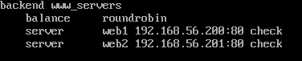

图 6.5 – HAProxy 示例后端

注意

强烈建议始终为您的服务器使用 `check` 选项。如果您没有运行检查，系统仍然会向服务器发送流量！

#### listen

在 HAProxy 中，`listen` 部分用于将前端和后端配置结合在一个块中，是一个便捷的组合方式。`listen` 部分允许您定义特定于监听套接字的选项以及如何处理传入流量。以下是 `listen` 部分常用的选项：

+   `bind`: 定义 HAProxy 用于监听传入流量的 IP 地址和端口。例如，`bind *:80` 在端口 `80` 上监听所有 IP 地址。

+   `stats`: 启用 HAProxy 统计页面，用于监控和管理 HAProxy。

+   `stats enable`: 启用 HAProxy 的统计监控功能。

+   `stats uri`: 指定用于访问统计页面的 URI 路径。例如，`stats uri /haproxy_stats` 将统计页面设置为可通过 `http://your-haproxy-ip/haproxy_stats` 访问。

+   `stats realm`: 设置访问统计页面时使用的 HTTP 基本身份验证的领域（认证领域）。此设置为防止未经授权的访问提供了一层安全保护。

+   `stats auth`: 配置访问统计页面时使用的 HTTP 基本身份验证的用户名和密码。格式为 `stats` `auth username:password`。

+   `stats hide-version`：从统计页面隐藏 HAProxy 版本号，以增强安全性。

+   `stats show-node`：在统计页面上显示服务器节点名称。当使用动态服务器模板时，这非常有用。

+   `stats refresh`：设置统计页面自动刷新的间隔（以毫秒为单位）。例如，`stats refresh 10s` 每 10 秒刷新一次页面。

+   `stats admin`：指定允许访问 HAProxy 统计信息的 IP 地址和端口。它允许通过统计页面远程管理 HAProxy。例如，`localhost` 只允许来自本地计算机的访问。

+   `stats maxconn`：限制允许连接到统计页面的连接数。它有助于防止过载和潜在的拒绝服务攻击。

+   `errorfile`：指定用作前端错误的自定义错误页面的文件。

对于示例中的 `listen` 部分，我们将其定义为指标，允许从 `192.168.56.1` 访问管理员。用户将使用用户名 `admin` 和密码 `passw0rd` 进行登录。如下图所示：


图 6.6 – HAProxy listen 示例

由于状态页面运行在端口 `8080`，请别忘了将端口添加到防火墙中并重新加载防火墙。这可以通过以下命令完成：

```
firewall-cmd --permanent --add-port=8080/tcp; firewall-cmd --reload
```

## 它是如何工作的…

现在我们已经配置了两个 Web 服务器和负载均衡器，我们需要启动负载均衡器。可以使用 `systemctl` 来完成：

+   使用以下命令启动 HAProxy：

    ```
    systemctl start haproxy
    ```

+   使用以下命令检查状态：

    ```
    systemctl status haproxy
    ```

+   如果编辑了配置文件，请不要忘记使用以下命令重新加载 HAProxy：

    ```
    systemctl reload haproxy
    ```

现在，将浏览器指向负载均衡器 IP 地址。你将看到 Web 服务器页面。如下图所示：


图 6.7 – 工作中的 HAProxy

由于规则是`roundrobin`，且我们将超时设置为一分钟，等待一分钟后再重新加载页面。你将看到一个新的服务器。


图 6.8 – 工作中的负载均衡

作为管理员，你还需要检查资源的健康状态。将浏览器指向统计页面的 URL，并输入已配置的用户名和密码。这将显示统计页面。在此示例中，URL 为 [`lb1.m57.local:8080/stats`](http://lb1.m57.local:8080/stats)。你将在下图中看到一个示例：

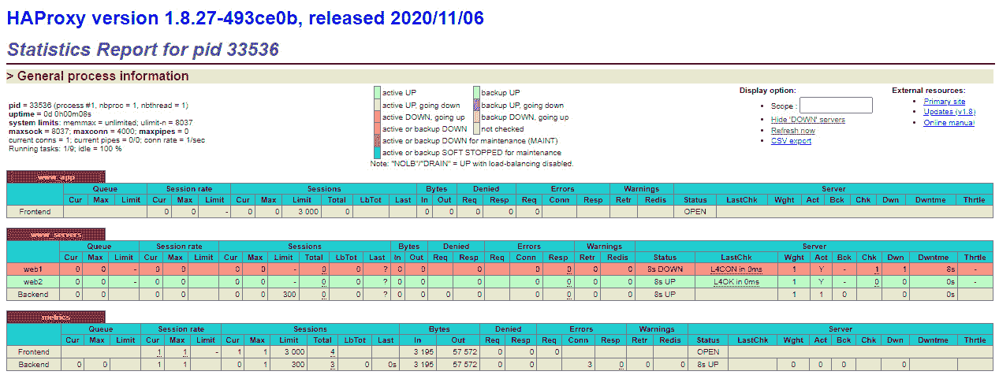

图 6.9 – HAProxy 状态页面

在示例页面中，你将看到 `web1` 离线。你还可以看到每个前端和后端规则处理了多少流量，以及流量分别发送到了哪些服务器。

# 使用 Keepalived 使 HAProxy 高可用

在前面的配置中，我们使用 HAProxy 为我们的 Web 服务器提供了一些冗余。但这个解决方案的挑战在于，现在负载均衡器本身成了故障点。在高可用性架构中，您需要覆盖所有故障点，确保有冗余并避免单点故障（SPOF）。在本配置中，我们将使用 Keepalived 为我们的配置添加高可用性。Keepalived 是一款开源软件，专为基于 Linux 的系统设计。其主要功能是管理网络负载均衡和故障切换，确保 Web 服务的高可用性。Keepalived 通常与 HAProxy 一起使用。该软件主要使用**虚拟路由冗余协议**（**VRRP**）实现容错和负载均衡。Keepalived 使用以下功能来提供冗余：

+   **高可用性**：通过 Keepalived，您可以建立一个备份服务器集群，利用共享的**虚拟 IP**（**VIP**）地址。该配置确保即使主服务器发生故障，备用服务器也会自动接管并处理传入流量，从而实现最小的停机时间。

+   **VRRP**：VRRP 是一种常用协议，能够实现 IP 网络中的路由器自动故障切换。Keepalived 利用 VRRP 保持 VIP 地址的正常运行，可以根据需要将其分配给集群中的任何节点。

+   **健康检查**：Keepalived 的监控系统定期检查活动服务器的健康状况。如果服务器变得无响应，Keepalived 会将其从池中移除，并将流量重定向到健康的服务器。

+   **通知机制**：使用 Keepalived，可以为故障切换事件或超出某些阈值时设置通知。这些通知对于监控集群的整体健康状况非常有用。

在集群中，Keepalived 将一个节点指定为主节点，其他节点作为备份节点。主节点处理传入流量并响应 VIP 地址的 ARP 请求，而备份节点充当待命路由器并监视主节点的状态。节点之间使用 VRRP 协议进行通信，主节点定期发送 VRRP 广告以表明其正常运行。通常，VIP 被用来为终端用户访问提供单一的 IP 地址。下图展示了 Keepalived 管理两个 HAProxy 系统的正常操作。

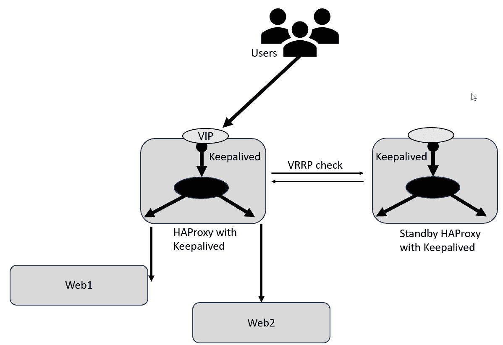

图 6.10 – Keepalived 正常操作

如果备用节点停止接收广告或检测到主节点的问题，某个备用节点将接管成为新的主节点。Keepalived 使用 ICMP（ping）检查或第 4 层检查（例如，检查特定端口是否开放）等机制来检查服务器的健康状况，并将失败的服务器从池中移除。调整 VRRP 优先级以确保健康的备用服务器接管。这可以通过下图看到，用户连接的 VIP 已经迁移到第二个节点，而该节点现在使用 HAProxy 来管理工作负载。

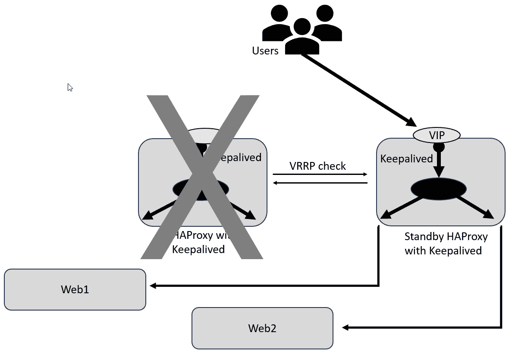

图 6.11 – Keepalived 失败节点

## 准备工作

本教程扩展了前一个教程，添加了第二个负载均衡系统和 VIP。你需要搭建第二个负载均衡器并为 VIP 获取一个额外的 IP 地址。你的 IP 地址应该类似于以下：

| **Host** | **IP** |
| --- | --- |
| **web1** | `192.168.56.200` |
| **web2** | `192.168.56.201` |
| **lb1** | `192.168.56.202` |
| **lb2** | `192.168.56.203` |
| **vip** | `192.168.56.204` |

表 6.4 – Keepalived IP 地址

## 如何操作…

在开始配置 Keepalived 之前，你需要在第二台服务器上配置 HAProxy。你可以轻松安装 HAProxy，打开防火墙端口，并从现有系统中复制配置文件。

你可以通过简单地将浏览器指向第二个负载均衡器，查看应用服务器来进行测试。

接下来，我们将开始配置 Keepalived。

对于每个负载均衡器，你需要以 root 用户身份安装 Keepalived：

```
dnf -y install keepalived
```

接下来，我们需要编辑 Keepalived 配置文件。该文件位于 `/etc/keepalived/keepalived.conf`。需要编辑的主要部分有 `global_defs` 和 `vrrp_instance`。

`global_defs` 是 Keepalived 使用的全局定义。这些设置会被系统中配置的所有 `vrrp_instance` 类型使用。

有几个参数需要更新：

+   `notification_email`：这是一个电子邮件地址列表，当发生事件时会发送邮件。

+   `notification_email_from_user`：这是发送电子邮件的地址

+   `smtp_server`：这是 SMTP 中继服务器

+   `router_id`：这是该 Keepalived 集群的唯一名称

对于示例，此部分看起来如下：

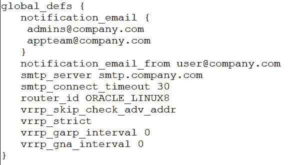

图 6.12 – Keepalived 全局设置

下一节是 `vrrp_instance`。你可以在集群中拥有多个 `vrrp_instance` 类型，每个都支持不同的 VIP。

对于 `vrrp_instance`，你需要为每个实例分配一个唯一的名称。此外，还有几个参数需要更新：

+   `state`：实例的状态，通常主节点为 master，备用节点为 backup。

+   `interface`：集群中用于该主机的以太网接口。

+   `virtual_router_id`：该实例的唯一编号。其他实例不能使用相同的 ID。

+   `authentication`：此部分定义成员如何进行身份验证：

    +   `auth_type`：通常发送为 PASS，以允许节点作为此实例的成员进行身份验证。还有一种第二种支持类型，称为 `auth_pass`：该实例的密码。

+   `virtual_ipaddress`：由此实例管理的 VIP 列表。

在我们的示例中，该部分将如下所示；

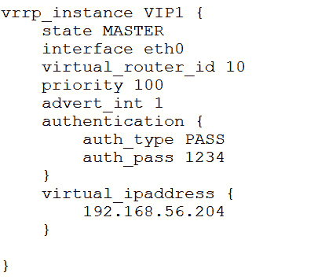

图 6.13 – Keepalived vrrp_instance

配置文件创建完成后，将其复制到第二个负载均衡器。不要忘记将第二个系统的状态更改为 `BACKUP`，并且如果该系统的接口不同，也要进行更新。

接下来，以 root 用户身份在两个节点上启动 Keepalived，使用以下命令：

```
systemctl enable --now keepalived
```

现在，你可以将浏览器指向 VIP！这在以下示例中可以看到。


图 6.14 – Keepalived VIP 使用中

你可以通过查看守护进程的日志条目来检查状态，使用以下命令：

```
journalctl -u keepalived
```

这将显示守护进程的所有活动。你应该能看到 `Sending gratuitous ARP` 消息，这是系统在检查健康状况。你还会看到一些关于状态的消息，比如 `Entering MASTER STATE` 或 `Entering BACKUP STATE`，当系统在 `MASTER` 和 `BACKUP` 之间切换时。

# 使用 Corosync 和 Pacemaker 为所有提供 HA 集群

在之前的配置中，我们通过在两个活跃的应用服务器之间分配流量来实现 HA。然而，这种方法仅对无状态应用有效，其中服务器或浏览器不包含特定的用户或会话数据。对于有状态应用或在复杂服务器上运行的应用，需要采用不同的 HA 方法。解决方案是通过使用 Pacemaker 和 Corosync 的组合，在不同的服务器上启动和停止应用组件。这两个开源软件项目协同工作，为基于 Linux 的系统提供 HA 集群。它们协调和管理集群中的多个节点，确保在硬件或软件故障期间，关键服务仍然可用。

Corosync 作为 HA 集群栈的通信层，允许节点之间进行可靠的通信。它利用成员资格和法定人数系统来监控集群的活动节点，并确保在任何时候只有一个节点作为主节点（或主控节点）运行。消息传递层对于共享有关集群状态、节点状态和资源条件的数据至关重要。Corosync 在集群的功能中发挥着至关重要的作用，提供以下关键功能：

+   **集群通信**：Corosync 使得节点能够可靠高效地交换消息，允许它们协调和同步各自的操作。

+   **成员资格和法定人数**：Corosync 是一个跟踪集群中活跃节点的工具，使用法定人数算法来确保有足够的节点可用来做出决策。这有助于避免脑裂场景，并确保只有一个节点处于活动状态。避免脑裂集群至关重要，因为脑裂会导致数据不一致、损坏和服务中断。脑裂场景发生在集群中的节点失去相互通信时，导致每个节点认为自己是唯一的活跃节点。这可能是由于网络问题、通信故障或配置错误引起的。

注意

当发生脑裂场景时，集群中的多个节点可能开始独立运行服务或使用共享资源，认为自己是唯一的活跃节点。这可能会导致冲突和数据不一致，因为每个节点独立操作而没有协调。如果可能，建议在集群中使用奇数个节点，或者启用法定人数保护。

Pacemaker 是一个集群资源管理器，它利用 Corosync 的消息传递和成员管理功能来管理集群资源和处理资源故障转移。它根据既定的策略和约束，决定集群中哪个节点应该运行特定的服务（资源）。Pacemaker 为集群带来了以下功能：

+   **资源管理**：使用 Pacemaker，管理员可以设置需要强大可用性的资源，如 IP 地址、服务、数据库和应用程序

+   **资源监控**：Pacemaker 持续监控资源和节点的状态，以检测集群中的故障或变化

+   **资源故障转移**：如果节点发生故障或出现资源问题，Pacemaker 将启动故障转移过程，将资源转移到正常运行的节点上，以确保不中断的可用性

+   **资源约束**：管理员可以为资源的放置和故障转移设置约束和规则，定义哪些节点适合或禁止用于特定资源

+   **资源共址和顺序约束**：Pacemaker 允许定义资源之间的关系，指定哪些资源必须在同一节点上一起运行，或按特定顺序运行

+   **集群管理**：Pacemaker 提供多种命令行工具和图形界面（如 Hawk）来管理和配置集群

## 准备工作

对于此配置，您将需要两台虚拟机，每台虚拟机至少有两个虚拟 CPU、8 GB 内存和 50 GB 磁盘空间。您应安装 Oracle Linux 8，并为浮动 VIP 配置一个第三个 IP 地址，以便由集群管理。两个 Web 服务器将更新到最新的软件版本。此示例将使用以下 IP 地址：

| **主机** | **IP 地址** |
| --- | --- |
| **Web1** | `192.168.56.200` |
| **Web2** | `192.168.56.201` |
| **vip** | `192.168.56.204` |

表 6.5 – 高可用集群 IP 地址

在开始配置集群之前，您还需要在每台主机上设置一个`httpd`（Apache 2.4）服务器。这与其他食谱中设置其他主机的方法类似。

首先，在两个服务器上，以 root 身份安装 Apache web 服务器：

```
dnf -y install httpd
```

我们确实需要启用 Apache 的状态页面。这是资源检查的一种方式。为此，将以下行复制到`/etc/httpd/conf.d/status.conf`中：

```
<Location /server-status>
   SetHandler server-status
   Order Deny,Allow
   Deny from all
   Allow from 127.0.0.1
</Location>
```

我们还需要一个简单的网页。为了测试目的，请将以下内容放入两个服务器的`/var/www/html/index.html`中。

注意

在设置像 Web 服务器这样的应用程序时，将您的内容目录（例如`/var/www/html`）放在 Gluster 文件系统上，可以更轻松地管理更新内容。这对于应用程序使用的其他数据（如临时状态数据）也同样有效。

接下来，在两个服务器上，使用以下命令将端口`80`添加到本地防火墙中：

```
firewall-cmd --permanent --add-service=http; firewall-cmd --reload
```

现在，为了测试目的，在两个节点上手动启动服务器。不要启用服务自动启动。稍后在配置 Pacemaker 时将会启用自动启动：

```
systemctl start httpd
```

现在，您应该能在两个服务器上看到一个基本页面，如下图所示：

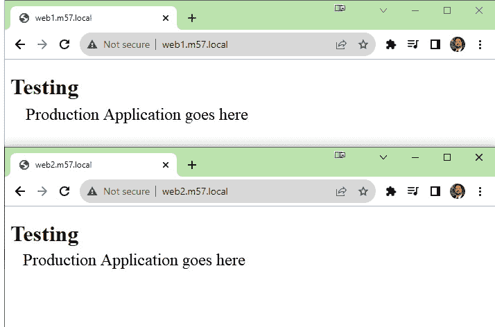

图 6.15 – httpd 服务器测试

您还可以使用`wget`命令测试`server-status`页面：

```
wget localhost4/server-status
```

成功的示例输出如下截图所示。

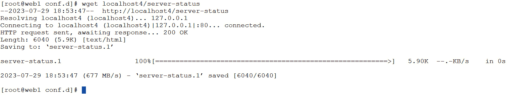

图 6.16 – 服务器状态成功

现在，您已准备好安装和配置 Pacemaker 和 Corosync。

## 如何操作…

既然您已经安装了我们将要集群的 Apache `httpd`服务器，接下来让我们开始安装软件。首先，我们需要启用`addons` repo。可以在两个服务器上以 root 身份通过以下命令来完成：

首先，在两个节点上，以 root 身份使用以下命令启用 repo：

```
dnf config-manager --enable  ol8_addons
```

然后，您将安装软件：

```
dnf install -y pacemaker pcs
```

安装这些软件包完成后，系统会添加一个名为`hacluster`的新用户。请注意，安装完成后该用户将无法进行远程登录。为了在其他节点上执行任务（例如同步配置或启动服务），必须在两个节点上为`hacluster`用户设置相同的密码。我们可以使用`passwd`命令设置密码：

```
passwd hacluster
```

接下来，我们需要启用`pcs`服务并启动它：

```
systemctl enable --now pcsd.service
```

接下来，我们需要为集群端口打开防火墙。可以通过以下命令来完成：

```
firewall-cmd --permanent --add-service=high-availability ; firewall-cmd --reload
```

现在，我们暂时完成了两个节点的配置。接下来的几个命令可以在任一节点上执行，但请注意，仍然需要是 root 用户。

接下来，我们需要将两个节点添加到集群中：

```
pcs host auth web1 web2 -u hacluster
```

注意

如果您的节点在 DNS 或`/etc/hosts`文件中不可解析，您可以选择在主机名后添加`addr=$IPADDR`。但强烈建议确保所有主机都能被解析。如果使用此选项，它将如下所示：

**pcs host auth web1 addr=192.168.56.200 node2 addr=192.168.56.201 -****u hacluster**

接下来，我们将创建集群：

```
pcs cluster setup webapp web1 web2
```

现在，我们可以启动集群：

```
pcs cluster start --all
```

要验证集群是否正常运行，我们可以使用`pcs`命令进行检查：

```
pcs cluster status
```

一个健康的集群应该返回类似以下示例的输出：

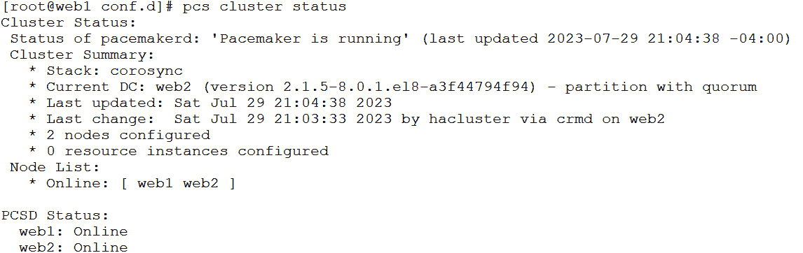

图 6.17 – 集群状态

在仅由两个节点组成的集群中，法定人数的运作方式与多节点集群不同。在这样的集群中，法定人数值设置为`1`，以确保主节点始终被认为是法定成员。如果由于网络故障两个节点都离线，它们会相互竞争以确定谁先成功“围栏”，先成功的节点赢得法定人数。为了增加优选节点赢得法定人数的机会，可以配置围栏代理赋予它优先权。这可以通过以下命令来完成：

```
pcs resource defaults update
```

最后一步是禁用**STONITH**，即**击杀另一节点**。这是一个高级围栏工具，要求根据您的环境进行特定配置。如果您想实验这个技术，请查看官方的 Oracle 文档：[`docs.oracle.com/en/operating-systems/oracle-linux/8/availability/availability-ConfiguringFencingstonith.html#ol-pacemaker-stonith`](https://docs.oracle.com/en/operating-systems/oracle-linux/8/availability/availability-ConfiguringFencingstonith.html#ol-pacemaker-stonith)：

```
pcs property set stonith-enabled=false
```

要设置集群，我们需要创建资源。资源代理名称由两个或三个字段组成，字段之间由冒号分隔。第一个字段是资源类，它表示资源代理遵循的标准，并帮助 Pacemaker 定位脚本。例如，IPaddr2 资源代理遵循**开放集群框架**（**OCF**）标准。第二个字段根据使用的标准而有所不同，OCF 资源使用它来表示 OCF 命名空间。第三个字段表示资源代理的名称。

资源可以使用元属性和实例属性。元属性不依赖于资源类型，而实例属性则特定于每个资源代理。

在集群中，资源操作是指可以对特定资源执行的操作，如启动、停止或监控它。这些操作通过`op`关键字来标识。为了确保资源保持健康，我们将添加一个间隔为 15 秒的监控操作。判断资源是否健康的标准取决于所使用的资源代理。这也是为什么我们在`httpd`服务器上启用了`server-status`页面，因为`httpd`代理使用该页面来帮助确定系统的健康状态。

所以，我们来添加 VIP 地址：

```
pcs resource create AppIP ocf:heartbeat:IPaddr2 ip=192.168.56.204 \
 cidr_netmask=24 op monitor interval=15s
```

接下来，我们将添加`httpd`服务器：

```
pcs resource create AppWebServer ocf:heartbeat:apache \
configfile=/etc/httpd/conf/httpd.conf \
statusurl=http://127.0.0.1/server-status \
 op monitor interval=15s
```

现在我们有了两个资源，我们还需要将它们绑定在一起，作为一个组。对于大多数应用，多个资源需要同时在同一台物理服务器上。这可以是 IP 地址、Tomcat 服务器、`httpd`服务器等。我们将这个组命名为`WebApp`，并将 VIP 和`https`服务器添加到其中。每个资源需要单独添加，因此需要运行两条命令：

```
pcs resource group add WebApp AppIP
pcs resource group add WebApp AppWebServer
```

现在，我们将使用`pcs status`命令检查配置：

```
pcs status
```

输出如下：

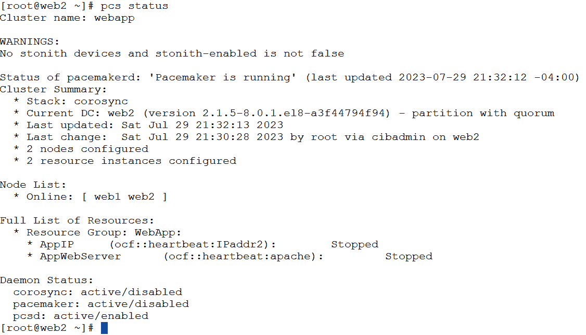

图 6.18 – pcs 状态

现在我们可以看到集群及其资源组`WebApp`，以及两个服务器的 VIP 地址。

## 它是如何工作的……

现在一切配置完成，让我们启动资源并进行管理。我们可以首先启动整个集群。这将使集群中的所有节点上线：

```
pcs cluster start --all
```

我们还可以通过以下命令设置集群在启动时自动启动：

```
systemctl enable --now corosync
systemctl enable --now pacemaker
```

你需要在两个节点上以 root 身份运行这两个命令。

接下来，让我们来看几个有用的命令。

有时，资源会出现故障；可能是配置文件有问题，或者你在集群控制之外启动了某个资源，导致集群混乱。一旦解决了问题，你可能需要刷新资源。这会告诉集群忘记故障并重新启动服务，清除所有错误：

```
pcs resource refresh AppWebServer
```

你还可以使用`config`选项检查资源的详细信息。如果你忘记了资源是如何配置的，这个功能非常有用。以下图所示为例：

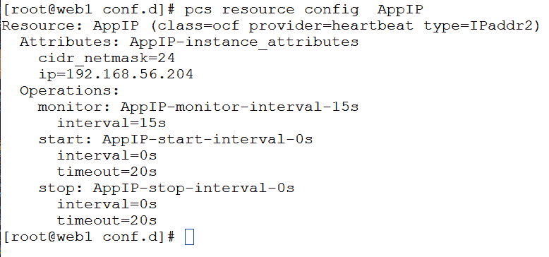

图 6.19 – 资源配置

接下来，让我们将`WebApp`迁移到服务器`web2`：

```
pcs resource move WebApp web2
```

当你运行`move`时，你还可以通过检查约束来监控迁移情况。这比使用`pcs` `status`命令更清晰：

```
pcs constraint
```

输出如下：

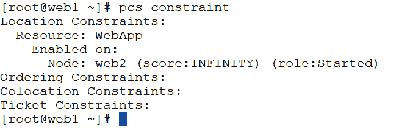

图 6.20 – 集群约束

Pacemaker/Corosync 技术的强大之处在于它的灵活性。你几乎可以用它来集群任何东西，使它成为系统管理员的强大工具。

# 在多台机器之间共享文件系统——集群还是分布式？

当你开始使用负载均衡器和集群软件等技术时，你常常会遇到需要在多台服务器上拥有相同文件的情况。虽然你可以直接复制文件，但如果你能在每台服务器上挂载文件，并在系统间共享文件系统，而不引入 NFS 服务器所带来的单点故障（SPOF）呢？做到这一点最简单的方法之一是使用 Gluster。

**Gluster**，也称为**GlusterFS**，是一个开源分布式文件系统，提供可扩展和灵活的大数据存储解决方案。最初由 Gluster 公司开发，现在由开源社区维护。Gluster 采用分布式架构来创建一个统一的文件系统，可以跨多个服务器和存储设备扩展。这种方法允许你聚合多个服务器的存储容量，并将其作为一个单一、结构良好的文件系统提供给用户和应用程序。它具有广泛的应用场景，如数据存储、备份和内容分发。

Gluster 的关键特性和概念包括以下内容：

+   **可扩展性**：向集群中添加更多存储服务器可以使 Gluster 轻松适应日益增长的数据存储需求，同时实现横向扩展。

+   **冗余**：Gluster 通过将数据复制到多个节点来确保数据的可用性，从而提供冗余和故障容忍。

+   **灵活性**：Gluster 支持多种存储选项，包括本地磁盘、NAS 和云存储。它可以根据特定的使用场景和技术进行定制。

+   **文件系统抽象**：它为用户和应用程序提供了标准的文件系统接口，使得集成到现有系统中相对容易。

+   **数据分布**：数据以一种提高性能和可靠性的方式在集群中分布。数据可以均匀分布，也可以根据特定的标准进行分布。

+   **自动修复**：Gluster 具有自我修复功能，能够自动检测并修复数据不一致或损坏的文件。

Gluster 通常用于需要大规模分布式存储的环境，如网页服务器、云计算、大数据分析和媒体流服务。它提供了一种具有成本效益和灵活性的解决方案，用于管理网络中多个服务器和存储设备上的数据。

## 准备就绪

在本示例中，你将需要两个 Oracle Linux 8 系统，每个系统都能够访问 YUM 仓库。在本次练习中，我们将其称为`gluster1`和`gluster2`。它们是相同的系统，每个系统有 8 GB 的 RAM，4 个 vCPU，和 100 GB 的磁盘空间。文件系统的配置为：`/`分区 50 GB，`/home`分区 5 GB，swap 分区 8 GB。其余的磁盘空间尚未分配。此外，在这个例子中，每个节点将有一个 100 GB 的 LUN 用于存储 Gluster 数据。

警告

强烈建议在集群中至少使用三个节点，以避免发生脑裂（split-brain）现象。虽然可以使用两节点集群，但如果系统出现脑裂，将存在数据损坏的风险。脑裂集群在分布式计算环境中是不希望出现的，因为它们可能导致数据不一致、损坏和操作问题。脑裂发生在集群中的节点失去连接或相互通信时，导致集群分成多个孤立的节点。每个节点都认为自己是活动的或主要的集群，可能会导致冲突和数据不一致。

在每台服务器上，您需要执行以下准备工作：

1.  在 100 GB LUN 上创建 XFS 文件系统。此空间将用于存储 Gluster 数据，称为**砖块**。在 Gluster 的上下文中，*砖块*指的是存储集群中的基本存储单元。一个集群由多个砖块组成，这些砖块本质上是存储服务器或设备上的目录，用于存储数据。每个砖块代表集群总存储容量的一部分。

1.  由于我们将使用 Gluster 来管理存储，因此我们不会在文件系统上使用 LVM。在这些系统中，`/dev/sdb`是 100 GB LUN。以下命令用于创建和挂载文件系统：

    ```
    mkfs.xfs -f -i size=512 -L glusterfs /dev/sdb
    mkdir -p /data/glusterfs/volumes/bricks
    echo 'LABEL=glusterfs /data/glusterfs/volumes/bricks xfs defaults  0 0' |sudo tee -a /etc/fstab
    df command to verify that the filesystem is mounted, as seen in the following example:
    ```

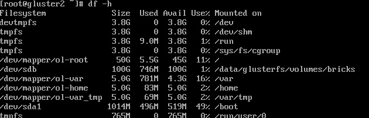

图 6.21 – 砖块已挂载

1.  接下来，我们需要确保所有节点都在`/etc/hosts`文件中。在这个示例中，`gluster1`、`gluster2`和`gluster3`都在文件中，使用了短名称和**完全限定域名**（**FQDN**）。可以在以下代码片段中看到：

    ```
    [root@gluster3 ~]# more /etc/hosts
    127.0.0.1   localhost localhost.localdomain localhost4 localhost4.localdomain4
    ::1         localhost localhost.localdomain localhost6 localhost6.localdomain6
    192.168.200.110 gluster1.m57.local    gluster1
    192.168.200.125 gluster2.m57.local    gluster2
    glusterfs and Gluster server software can be installed and started. This is done with the following commands:

    ```

    dnf -y install oracle-gluster-release-el8

    dnf -y config-manager --enable ol8_gluster_appstream ol8_baseos_latest ol8_appstream

    dnf -y module enable glusterfs

    dnf -y install @glusterfs/server

    systemctl status glusterd 命令。验证该服务是否处于活动状态并正在运行，如下例所示：

    ```

    ```

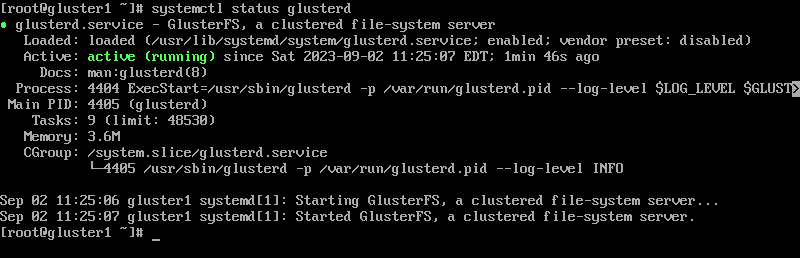

图 6.22 – Gluster 守护进程正在运行

1.  接下来，让我们配置防火墙以允许`glusterfs`端口，使用以下命令：

    ```
    firewall-cmd --permanent --add-service=glusterfs
    firewall-cmd --reload
    ```

1.  此外，为了提高安全性，我们将创建一个自签名密钥，以加密节点之间的通信：

    ```
    openssl genrsa -out /etc/ssl/glusterfs.key 2048
    .pem file, since this is a self-signed certificate, you will need to enter your contact info into the certificate; however, it will work with the defaults!
    ```

注意

在此示例中，我们使用的是自签名证书。在安全的生产环境中，您可能希望考虑使用商业签名的证书。

我们稍后将使用这些文件来加密通信。

## 如何操作…

现在，所有节点的准备工作已完成，我们将创建受信的存储池并加密通信。这将为创建卷做好准备，数据将在这些卷中存储和共享。

Gluster 中的受信存储池是指一组 Gluster 服务器集群，这些服务器被称为存储节点或对等节点，它们之间建立了信任关系，以便在存储集群中协同工作。通过受信存储池配置建立这种信任，通常涉及以下步骤：

+   **身份验证**：可以使用多种方法，如 SSH 密钥、证书或共享密钥，对受信存储池中的节点进行身份验证。这确保只有授权的服务器才能成为存储集群的一部分。

+   **授权**：节点通过身份验证后，它们授权彼此访问和操作 Gluster 存储集群中的特定数据。授权设置决定了哪些节点可以读取和写入集群中特定的卷或砖块。

+   **通信**：受信存储池中的成员通过安全网络进行通信，以复制数据、同步元数据并执行其他与集群相关的操作，确保存储集群的协同工作。

+   **数据完整性**：受信存储池通过在多个节点之间进行分布式复制，确保数据的完整性和冗余。

+   **可扩展性**：可以向受信池中添加更多的存储节点，从而增强存储容量和性能。受信池的特性使得新节点可以轻松加入集群并贡献其资源。

在 Gluster 中，受信存储池是一个关键元素，它为文件系统的容错和分布式特性奠定了基础。它保证集群中的所有节点可以无缝、安全地协同工作。以下步骤将指导您如何在两台主机上创建 GlusterFS。

1.  要创建存储池，我们需要探测集群中的其他节点。在此示例中，我们将从 `gluster1` 到 `gluster2` 使用 `gluster peer probe` `gluster2` 命令进行探测：

    ```
    [root@gluster1 etc]# gluster peer probe gluster2
    gluster pool list command to see what nodes are peered with the node where you ran the command from; in the following example, the command was run on gluster2:

    ```

    [root@gluster2 etc]#  gluster pool list

    UUID                                 主机名        状态

    b13801f3-dcbd-487b-b3f3-2e95afa8b632                         gluster1        已连接

    gluster1 和 localhost 已连接，因为这是在 gluster2 上运行的。如果您从 gluster1 运行相同的命令，您将看到 gluster2 作为远程主机：

    ```
    [root@gluster1 ~]# gluster pool list
    UUID                                 Hostname        State
    bc003cd0-f733-4a25-85fb-40a7c387d667                         gluster2        Connected
    b13801f3-dcbd-487b-b3f3-2e95afa8b632                         localhost       Connected
    ```

    ```

    ```

1.  现在我们已经有了集群，让我们创建一个复制卷。该卷将在集群中重写砖块，提供对存储故障或节点故障的保护。

    以下命令将创建该卷：

    ```
    /mnt mount point:

    ```

    df 命令：

    ```

    ```

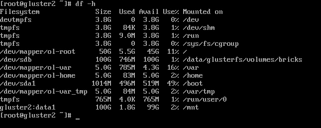

图 6.23 – data1 挂载在 /mnt

1.  如果您想在其他节点上挂载此卷，您需要在每个节点上重复该命令，根据需要更新节点名称。以下示例显示了在 `gluster1` 上的挂载：

    ```
    .pem files previously created and concatenate them into the /etc/ssl/glusterfs.ca file. This file should be placed on all nodes of the cluster.
    ```

1.  现在，我们需要启用加密。可以通过在每个节点上触摸 secure-access 文件来完成此操作，使用以下命令：

    ```
    data1 volume that was just created:

    ```

    gluster volume set data1 client.ssl on

    glusterd:

    ```
    systemctl restart glusterd
    ```

    ```

    ```

现在，Gluster 通信已经为该卷加密。

## 它是如何工作的…

您可以通过 Gluster 做更多的事情。首先，在创建卷时，卷有多个选项，每个选项都提供复制和分布的选项：

+   **分布式**：使用分布式卷时，文件在卷中的砖块上随机分布。此类型的卷在需要扩展存储时非常有用，并且冗余不必要，或已由其他硬件或软件层提供。然而，需要注意的是，磁盘或服务器故障可能会导致显著的数据丢失，因为数据在卷中的砖块上是随机分布的。构建分布式卷的示例命令如下：

    ```
    gluster volume create data1  gluster{1,2}:/data/glusterfs/volumes/bricks/data1
    ```

+   **复制**：文件在复制卷中跨砖块进行复制，以实现高可用性（HA）。构建复制卷的示例命令如下：

    ```
    gluster volume create data1 replica 2 gluster{1,2}:/data/glusterfs/volumes/bricks/data1
    ```

+   **分布式复制**：将文件分布到卷中的复制砖块上，以提高读取性能、高可用性（HA）和可靠性。创建分布式复制卷时，节点的数量应为砖块数量的倍数。构建分布式复制卷的示例命令如下：

    ```
    gluster volume create data1 replica 2 cluster{1,2,3,4}:/data/glusterfs/volumes/bricks/data1
    ```

+   **分散**：此卷类型利用纠删码高效地保护磁盘或服务器故障。它通过将文件的编码数据条带化，分布到卷中的多个砖块上，并添加冗余以确保可靠性。分散卷允许通过最小的空间浪费来自定义可靠性级别。分散卷必须至少有三个砖块。构建分散卷的示例命令如下：

    ```
    gluster volume create data1 disperse 3 redundancy 1 \ cluster{1,2,3}:/data/glusterfs/volumes/bricks/data1
    ```

+   **分布式分散**：将数据分布到分散的砖块上，提供与分布式复制卷相同的好处，但使用的是分散存储。分散卷必须至少有六个砖块。构建分布式分散卷的示例命令如下：

    ```
    gluster volume create data1 disperse 3 redundancy 1 \ cluster{1,2,3,4,5,6}:/data/glusterfs/volumes/bricks/data1
    ```

向任何卷中添加砖块时，您可以在同一 Gluster 节点上放置多个砖块。只需在命令中定义附加砖块即可。在此示例中，通过在每个节点上放置两个砖块来创建一个分布式分散卷：

```
gluster volume create data1 disperse 3 redundancy 1 \ cluster{1,2,3}:/data/glusterfs/volumes/bricks/data1 \ cluster{1,2,3}:/data/glusterfs/volumes/bricks/data2
```

可以使用`gluster stop volume volumename`命令停止卷。停止`data1`卷的示例如下：

```
gluster stop volume data1
```

您还可以向卷中添加砖块来扩展它。这可以在将新节点添加到集群后完成。在以下示例中，首先使用`gluster node probe gluster3`命令将`gluster3`添加到集群中。然后，使用以下命令扩展`data1`卷：

```
gluster volume add-brick data1 gluster3:/data/glusterfs/volumes/bricks/data1
```

注意

在向卷中添加砖块时，请确保添加所需数量的砖块。像分布式复制卷这样的卷类型需要添加多个砖块。

您还可以使用以下命令检查所有卷的状态：

```
gluster volume status
```

以下屏幕截图中可以看到示例：

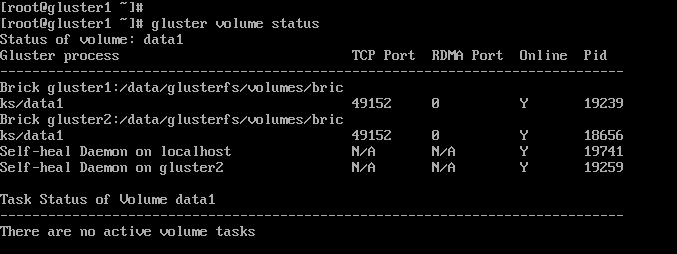

图 6.24 – 卷状态

你可以通过将卷名称添加到命令中来查看单个卷的摘要。还可以通过添加 `detail` 选项来查看更多详细信息。这些可以组合使用，如下图所示：

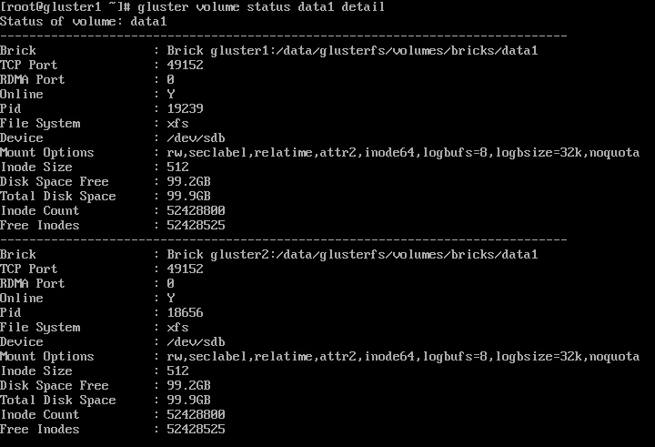

图 6.25 – 卷详细信息

如果你想查看卷的性能信息，可以使用 `top` 选项。此命令将显示用于读/写操作的砖块，以及每个砖块的 I/O 吞吐量。基本命令是 `gluster volume top volume_name option`，其中 `volume_name` 是卷的名称，选项如下所示：

+   `read`：此命令显示每个砖块的最高读调用次数及其计数。

+   `write`：此命令显示每个砖块的最高写调用次数及其计数。

+   `open`：此命令显示哪些砖块有开放的文件描述符。

+   `opendir`：此命令显示每个目录上有哪些砖块有开放调用，以及它们的调用次数。

+   `read-perf`：此命令显示按砖块的读性能吞吐量。使用选项 `bs`（块大小）`1024` 和 `count 1024` 运行。

+   `write-perf`：此命令显示按砖块的写性能吞吐量。使用选项 `bs`（块大小）`1024` 和 `count 1024` 运行。

在下图中可以看到几个示例：

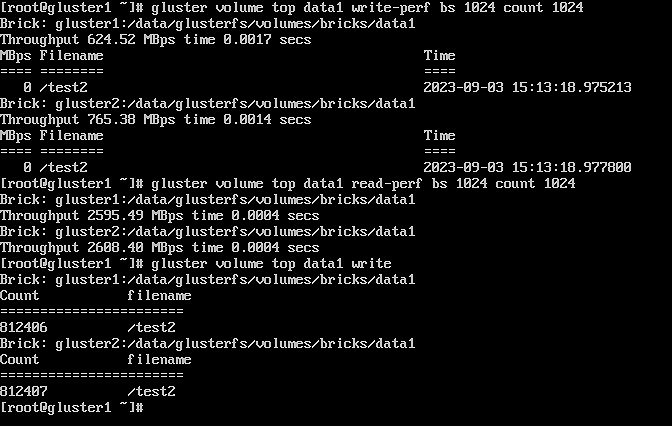

图 6.26 – 卷顶级示例

卷也可以被删除。使用命令 `gluster volume delete volume_name` 删除，其中 `volume_name` 是要删除的卷。需要注意的是，删除卷时，不要忘记使用 `rm` 命令删除存储中的砖块。

# 生成、配置和监控以太网流量通过 Bond

在使用裸机服务器作为专用主机或使用 KVM 虚拟化技术的 Linux 系统托管虚拟机时，网络可能成为一个薄弱环节。幸运的是，通过实现以太网绑定，也称为网络绑定或 **网卡**（**NIC**）绑定，可以解决此问题。它是 Linux 中的一项技术，允许将多个网卡组合成一个逻辑接口。这个逻辑接口被称为绑定接口（bonded interface），它提供了更高的网络带宽、容错性和负载均衡。具体如下：

+   **负载均衡**：绑定将网络流量分配到多个网卡，增加带宽。根据具体要求，可以使用多种算法，如轮询、活动备份和异或（XOR）。

+   **容错性**：在网卡或网络链路故障的情况下，以太网绑定可以自动将流量切换到另一个活动的网卡。这样可以提供冗余和容错性，确保即使一个网卡不可用，网络连接仍然可用。

+   **链路聚合**：绑定可以用于创建 **链路聚合组**（**LAGs**）或网卡团队，这可以增强带宽和在高可用性设置中的冗余性。

在本教程中，我们将配置绑定，然后展示一些常用的工具，这些工具可以让你监控并生成通过绑定接口的以太网流量。

此外，还有一些技术是你需要熟悉的。

### MAC

**媒体访问控制**（**MAC**）地址是分配给网络接口（如以太网卡和 Wi-Fi 适配器）的硬件标识符，用于在本地网络上进行通信。它在制造过程中硬编码到网络硬件中，并用于 OSI 模型的数据链路层（第二层）。MAC 地址的一个重要特性是它们必须是唯一的。每个 MAC 地址应该是全局唯一的，制造商有责任确保没有两个网络接口具有相同的 MAC 地址，尽管在实际操作中，尤其是在虚拟化环境中，这可能是一项挑战。这可能会导致网络问题，因为任何网络上的 MAC 地址重复都会引发问题。此外，许多绑定模式依赖于 MAC 地址来进行流量负载均衡。

### 绑定模式

绑定模式是指通过 Linux 绑定驱动程序将多个物理网络接口聚合成一个绑定接口时，决定如何分配网络流量的各种策略或算法。这些模式控制绑定接口的负载均衡和故障转移行为。选择绑定模式取决于你的特定网络需求和目标。以下是一些常见的 Linux 绑定模式：

+   `balance-rr`：在此模式下，出站网络流量会均匀地分配到可用的网络接口上，采用轮询方式。这是一种简单的负载均衡模式，可以改善出站流量的性能，但不考虑接口的状态，这可能导致不均匀的入站流量分配。有时，这种模式在某些交换系统中可能无法正常工作。

+   `active-backup`：一种常用模式，通常被称为故障转移模式，该模式有一个主接口，其他接口处于待机状态。如果主接口出现故障，下一个可用接口会自动激活以确保连续性。此模式提供冗余性，是在任何环境中最容易使用的模式之一。

+   `balance-xor`：此模式利用简单的 XOR 运算来保持数据传输和接收之间的平衡。该过程根据源和目标的 MAC 地址分配流量，确保相同端点之间的包始终走相同的路径。此模式的主要目的是确保容错性。但有时，这种模式在某些交换系统中可能无法正常工作。

+   `balance-tlb`：在此模式下，外发流量根据各接口的当前负载在所有可用接口之间分配。然而，入站流量不会主动平衡，仅由活动接口接收。当交换机不支持**链路聚合控制协议**（**LACP**）时，此模式特别有用。偶尔，这种模式与某些交换系统配合不良。

+   `balance-alb`：该模式通过考虑每个接口的可用性和负载，积极地平衡进出流量。偶尔，这种模式与某些交换系统配合不良。

### LACP

所有前述模式均可在不更改服务器连接的交换机设置的情况下运行。然而，还有一种更常用的模式，称为 LACP。LACP 是用于将多个网络连接（通常是以太网）聚合成一个高带宽链路的最复杂模式。这个过程通常被称为链路聚合、网卡团队或绑定。LACP 由 IEEE 802.3ad 标准定义，常用于企业和数据中心环境中，以提高网络性能、冗余性和容错能力。

然而，要使用 LACP，交换机必须配置为支持 LACP。作为管理员，必须明确传达配置要求，以确保交换机被配置为兼容模式。两端的配置必须匹配，LACP 才能正常工作。大多数企业级网络交换机和服务器网卡都提供 LACP 支持。LACP 的主要特点和功能包括以下几点：

+   **聚合链路**：LACP 允许将多个物理网络链路聚合成一个逻辑链路，该链路在网络设备上表现为一个单一接口。

+   **带宽增加**：通过 LACP 聚合多个链路可以提升带宽，适用于带宽密集型应用和服务器到交换机的连接。然而，每个 MAC 到 MAC 的连接通常受到聚合链路单一成员速度的限制。如果你有一个主机，主机上有两个 1 Gb/s 端口，可能无法在主机和客户端之间获得超过 1 Gb/s 的通信速度。

+   **负载均衡**：LACP 可以通过各种负载均衡算法将网络流量分配到聚合链路上，防止单一链路上的网络拥塞，同时优化网络利用率。

+   **容错能力**：除了提供更高的带宽，LACP 还提供冗余性和容错能力。如果一个物理链路发生故障，LACP 可以自动将流量重定向到剩余的活动链路，从而最小化停机时间并确保网络可用性。

+   **动态协议**：LACP 是一种动态协议，通过使用 LACP 帧动态协商并建立网络设备之间的链路聚合。

+   **模式**：LACP 支持两种操作模式：

    +   **主动模式**：在此模式下，设备主动发送 LACP 帧以协商并建立链路聚合。

    +   **被动模式**：在被动模式下，设备监听 LACP 帧，但不会主动发送。它依赖于另一端配置为主动模式来启动聚合。

LACP 通常用于对高可用性（HA）和网络性能要求较高的场景，例如服务器到交换机连接、交换机间连接和**存储区域网络**（**SANs**）连接。它允许组织高效利用可用的网络资源并提高网络可靠性。

## 准备工作

对于此操作，你需要三台 Oracle Linux 8 系统，每台系统可以访问 yum 仓库。我们将它们命名为`networking`、`client1`和`client2`。它们大致相同，每台系统有 8GB 内存、4 个 vCPU 和 100GB 的磁盘空间。不同之处在于`networking`应具有两个在同一网络上的网络接口。文件系统中，`/`有 50GB，`/home`有 5GB，交换分区为 8GB，其余磁盘空间未分配。

## 如何操作……

虽然也可以通过图形界面完成这项操作，但此方案将介绍如何通过命令行完成。需要注意的是，在处理服务器的主要网络连接时，最好使用系统控制台。如果通过 SSH 等远程连接进行操作，可能会导致你无法访问服务器。以下是配置冗余连接的步骤。

1.  你需要做的第一件事是创建绑定。在本例中，我们将使用`balance-alb`模式来最好地平衡进出流量：

    ```
    nmcli connection add type bond con-name "Bond 0" ifname bond0 bond.options "mode=balance-alb"
    ```

1.  接下来，我们将配置绑定使用 DHCP。在生产服务器上，通常会使用手动配置的 IP 地址：

    ```
    enp0s3 and enp0s8:
    ```

注意

如果你要将端口添加到已经在使用的绑定中，你应该现在删除该端口。在本例中，`enp0s3`正在使用，所以用以下命令删除了它：

**nmcli connection** **del enp0s3**

```
nmcli connection add type ethernet slave-type bond con-name bond0-if1 ifname enp0s3 master bond0
nmcli connection add type ethernet slave-type bond con-name bond0-if2 ifname enp0s8 master bond0
```

1.  现在，我们将启动连接并检查状态：

    ```
    nmcli connection up "Bond 0"
    nmcli device command should look like the following:
    ```

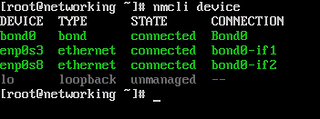

图 6.27 – nmcli 设备输出，带有有效绑定

你可以看到`bond0`是设备，成员为`enp0s3`和`enp0s8`。

1.  当你查看 IP 地址时，你会发现它现在位于`bond0`设备上。可以通过`ifconfig bond0`命令来检查，输出如下：

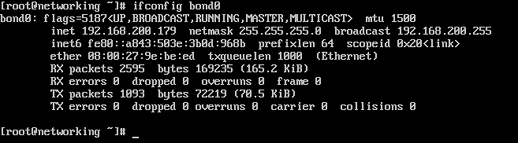

图 6.28 – 来自 ifconfig bond0 的输出

现在你可以继续正常使用系统，但`bond0`是网络设备。

## 它是如何工作的……

现在我们已经有了一个正常工作的绑定，让我们看看进出流量。为此，我们需要安装`iptraf-ng`命令：

```
dnf -y install iptraf-ng
```

这个工具允许你监控服务器上的以太网流量。在本例中，我们将运行`iptraf-ng`命令。这将启动程序，你将看到主屏幕，截图如下所示：

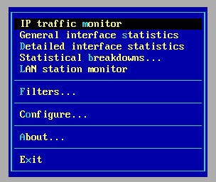

图 6.29 – iptraf 主菜单

在这里，我们将按下*S*键查看**一般接口统计**，这将实时显示每个接口上的流量流动情况：


图 6.30 – 一般接口统计

你可以看到，进出流量在两个物理接口之间是平衡的。这是因为使用了`balance-alb`模式建立了链路聚合。为了生成这些流量，使用了`client2`系统的简单洪泛 ping 命令。具体命令如下：

```
ping -f 192.168.200.179
```

注意

使用`-f`选项时要小心，因为这会让网络充满流量，并且通常在生产网络上不接受这样做，除非事先与网络和安全团队协调。这可能会导致使用网络的系统出现性能问题。

不过，还有一种更好的方式来真正给网络施加压力。那就是使用一个能够生成接口最大支持的包数的工具。

### iperf – 网络压力测试工具

我们将使用一个名为`iperf`的工具，它将生成接口可以支持的最大流量。要安装`iperf`，在所有系统上运行以下命令：

```
dnf –y install iperf3
```

我们还需要为系统打开一个 TCP 端口并重新加载防火墙。每个服务器实例只能处理一个客户端连接。我们将添加多个端口以启用运行多个服务器，每个服务器使用不同的端口。可以使用以下命令完成此操作：

```
firewall-cmd --permanent --add-port=8000-8010/tcp
firewall-cmd --reload
```

`iperf`采用客户端-服务器模式工作。要使用它，我们首先需要在网络系统上启动一个`iperf`服务器。在这个例子中，我们将设置服务器监听`8001`端口并使用 TCP 协议。可以使用以下命令启动服务器：

```
[root@networking ~]# iperf3 -s -p 8001
-----------------------------------------------------------
Server listening on 8001
-----------------------------------------------------------
```

我们将在另一个窗口中重复相同的命令，改为使用`8002`端口：

```
[root@networking ~]# iperf3 -s -p 8002
-----------------------------------------------------------
Server listening on 8002
-----------------------------------------------------------
```

现在，两个服务器都在运行，我们可以从`client1`进行测试。

测试使用以下命令运行：

```
iperf -c 192.168.200.179 -p 8001
```

测试开始后，几秒钟内会产生最大的流量，如以下输出所示：

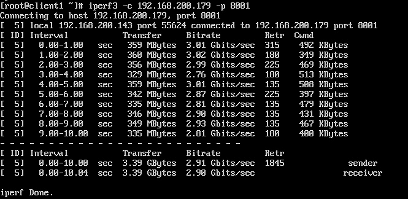

图 6.31 – iperf 客户端输出

在测试运行时，我们可以通过`iptraf`命令监控性能，我们会看到大部分流量都集中在一个接口上。以下截图展示了这一点：


图 6.32 – 单客户端流量

所有这些流量都在`enp0s8`接口上。这是因为负载均衡算法使用了客户端的 MAC 地址，这限制了流量只通过链路聚合中的一个接口。

接下来，可以同时从`client1`和`client2`运行测试。不同之处在于`client2`将使用`8002`端口。结果显示在以下截图中：

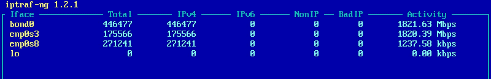

图 6.33 – 使用两个不同客户端的测试

在这里，我们可以看到两个接口都在处理重负载的网络流量。这是因为每个客户端使用了不同的 MAC 地址。如果使用了第三个客户端，我们就会看到它与其中一个接口争夺流量，可能会导致问题。

这是一个重要的因素，特别是在需要来自多个客户端的高网络性能的环境中进行绑定时需要考虑的因素。当使用绑定时，如果遇到随机性能延迟问题，需要监控端口。你可能会面临一些争用。解决这个问题的一种方法是向绑定中添加额外的端口。你还可以升级接口，选择能够支持更多带宽的设备。
