# 7

# Oracle Linux 8 – 补丁安装不一定意味着重启

我这一生都在为补丁安装而重启，为什么现在要改变？

自 1991 年 Linux 发布以来，每当内核进行补丁更新时，您都必须重启系统。那时，即便是主导企业 IT 的 IBM 大型机，在进行补丁更新时也需要重启，因此对所有其他系统而言，补丁更新时重启是正常的。这个过程在接下来的 20 年里似乎运行良好，但变革的种子在 2005 年被播下，当时一位**麻省理工学院**（**MIT**）的学生提出了一个简单的问题。*如果能在不重启系统的情况下打补丁会怎样？* 他的团队在 2009 年找到了答案，发布了 Ksplice，使得在系统运行时也能进行 Linux 内核的补丁更新。

在本章中，我们将介绍为什么您应该开始使用 Ksplice，以及如何利用它来提升系统的安全性。

本章包含以下操作：

+   设置 Ksplice 以实现互联网访问

+   在没有互联网访问的情况下使用 Ksplice

+   安装并启用已知漏洞检测

# 设置 Ksplice 以实现互联网访问

在我们开始操作前，让我们了解一下关于 Ksplice 的讨论。

## 关于 Ksplice 为什么这么热议？

第一个问题是，*为什么这对 IT 重要，更重要的是，对保护服务器上运行的应用程序有何意义？* 在解答这个问题之前，您首先需要了解黑客入侵系统的过程。

基本流程包括三个主要阶段：侦察、获取访问权限和维持访问权限。一旦系统被攻破，该过程会在网络中的其他系统上重复进行：

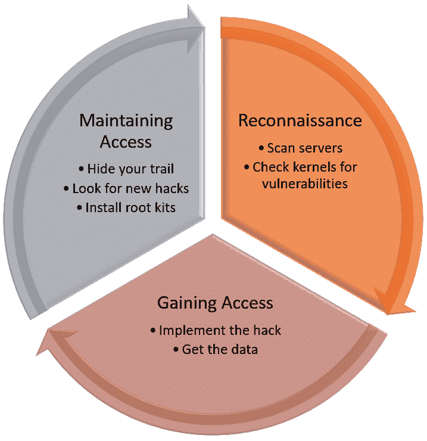

图 7.1 – 安全生命周期

在第一阶段，**侦察**，黑客使用各种方法扫描系统以寻找漏洞。通常，针对服务器的攻击阶段始于黑客获得对具有访问权限的低级支持帐户的控制。一旦获得该权限，查看内核版本并识别内核易受的漏洞就变得轻而易举。Oracle 提供了一个免费的站点 ([`ksplice.oracle.com/inspector`](https://ksplice.oracle.com/inspector))，让您可以轻松检查内核的漏洞。检查结果如 *图 7.2* 所示：

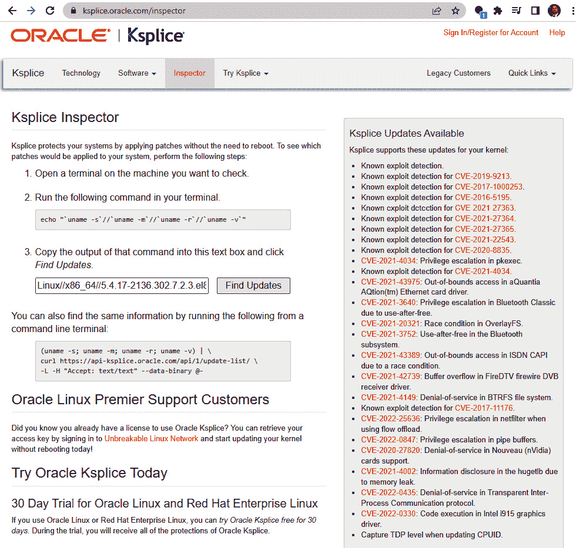

图 7.2 – Ksplice 检查器

注意

MITRE 公司是一家由美国联邦政府资助的非盈利组织，致力于研究改善多个行业安全性的方法，包括航空、医疗保健、国土安全、国防和网络安全。**常见漏洞和暴露**（**CVE**）项目于 1999 年启动，并迅速成为跟踪网络安全漏洞的首选平台。关于 CVE 项目的更多信息可以在 [`cve.org`](https://cve.org) 查阅。

系统不仅会识别内核易受攻击的 CVE，还会链接到 MITRE 网站，提供 CVE 详细信息。在示例报告中，您可以看到内核易受几个 CVE 的影响，其中一些 CVE 允许攻击者获得 root 权限。令人惊讶的是，与其他类似技术不同，Ksplice 还通过其**已知漏洞检测**技术，帮助防御这一阶段的攻击。它能够检测到针对正在运行的内核的攻击，试图通过特权升级获取访问权限。这有效地将使用 Ksplice 的每个系统转变为一个免费的内核入侵检测系统。

在下一个阶段，即获取访问权限时，黑客利用漏洞，获取数据访问权限。这通常发生在初步发现阶段后的几周。黑客会慢慢进行操作，他们这样做是为了保持低调，并且他们知道大多数环境最多每季度才会打一次补丁。此外，许多攻击来自组织内部，这些人作为其正常职责的一部分，通常拥有有限的系统访问权限。Ksplice 打破了这一模式，使系统管理员能够轻松地进行每日打补丁，从而缩短了黑客攻击的机会窗口。

在最后阶段，黑客试图保持访问权限，通常会利用相同的漏洞不断从系统中挖取数据。Ksplice 还可以关闭这一过程，因为它不仅在补丁后关闭漏洞，还能在攻击进行时关闭漏洞。这是 Ksplice 的一项重要功能：能够在漏洞被利用时修补内核并关闭漏洞。这能够在漏洞利用进行中的过程中中断攻击，显著增强系统安全性。

关于补丁工作——最多每季度一次？内核补丁几乎每天都会发布，但系统可能会保持未打补丁的状态长达一个季度或更长时间。这为攻击者提供了一个巨大的入侵窗口。大多数关键任务系统不仅在安排补丁时面临挑战，而且补丁过程本身也非常耗时且需要大量劳动力。让我们来看一下为什么会这样。如下面的图示所示，打补丁需要经过多个步骤：

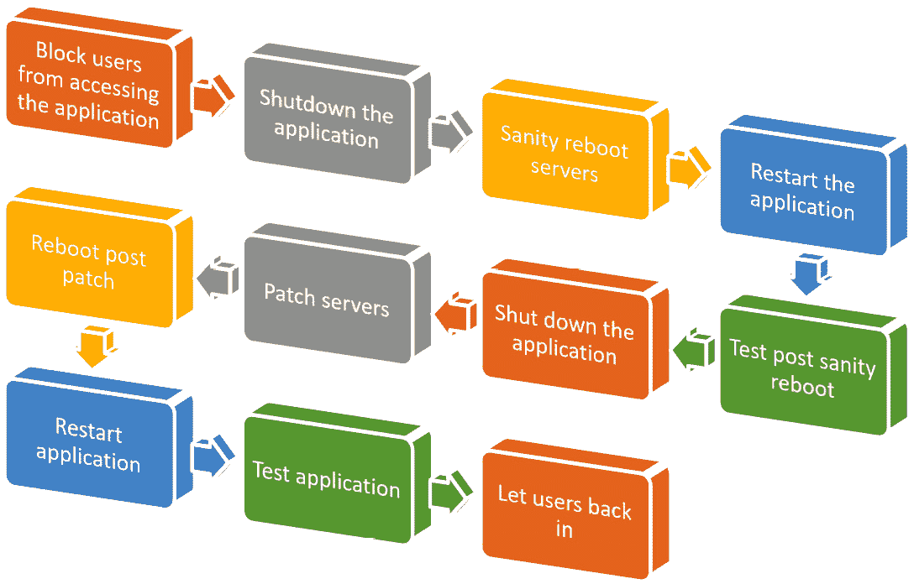

图 7.3 – 传统的补丁过程

以下是对这些步骤的简要描述：

1.  **阻止用户访问应用程序**：禁用负载均衡器或禁用用户登录应用程序，以防止用户意外破坏数据。

1.  **关闭应用程序**：关闭数据库、应用服务器、调度器、负载均衡器等。这是为了准备操作系统的重启。

1.  **对服务器进行正常重启**：对服务器进行重启，且不做其他更改。目的是验证服务器是否能够顺利重启。在此步骤中，通常会对应用服务器进行快照。

1.  **重新启动应用程序**：重新启动应用程序以验证其是否正常工作。这是为了验证重启的合理性。

1.  **测试重启后的合理性**：通常，一些更改会对应用程序和/或其基础设施产生影响，从而导致应用程序出现问题。此步骤验证在应用补丁之前系统是否处于良好状态。

1.  **关闭应用程序**：再次关闭所有内容以准备进行修补。

1.  **修补服务器**：应用操作系统的修补。

1.  **修补后重启**：重启以使修补生效。

1.  **重新启动应用程序**：再次重新启动应用程序。

1.  **测试应用程序**：测试应用程序，确认一切正常。

1.  **允许用户重新进入**：允许用户重新进入应用程序。

注意

不是每个组织都遵循完整的流程，会跳过某些步骤以节省时间。虽然这可以在短期内节省一些时间，但只要有一个坏的修补周期，在修补周期之间对应用程序和/或其基础设施进行更改，就可能导致非常糟糕、漫长的夜晚，甚至更糟，变成漫长的几天。

如你所见，正确地修补需要花费大量时间，而且应用程序越复杂，每个修补周期所需的人力和时间也就越多。大部分的时间和精力都是由于需要重启而造成的。

当你避免重启时，修补过程会显著简化；如下图所示，只有两个步骤！


图 7.4 – Ksplice 修补过程

以下列表提供了这两个步骤的简短描述：

+   **对服务器进行 Ksplice**：使用 Ksplice 应用内核和用户空间的修补。

+   **测试**：测试应用程序

使用 Ksplice 后，你的团队可以节省大量时间，减少加班夜晚，并提高安全性。最棒的是，它易于设置和使用！

### 发现 Ksplice

Ksplice 配置起来很容易。在对你的服务器进行 Ksplice 之前，有一些概念和要点需要你理解：

+   如果你的服务器运行在**Oracle Cloud Infrastructure**（**OCI**）上，并使用 Oracle 的默认平台镜像，所有 Ksplice 的准备工作和访问 Ksplice 仓库的权限都已经完成，以支持在线使用 Ksplice。系统还需要有一条通路（通常是通过 NAT 网关）到 Ksplice 的端点。当使用**虚拟云网络**（**VCN**）向导时，这会自动设置好。

+   如果你在 OCI 上使用自主 Linux，你的系统已经在自动进行 Ksplice 操作。

+   Ksplice 有两个客户端：传统的 Uptrack 客户端和增强版客户端。

+   使用 Ksplice 时无需互联网访问；你可以使用特别构建的 Ksplice `.rpm` 文件来离线模式使用。这需要你在本地 YUM 服务器上镜像 ULN Ksplice 仓库。有关内容已在*第五章*中讲解。

增强版客户端和 Uptrack 客户端都允许您进行内核 Ksplice，但增强版客户端还提供了对用户空间库、KVM 虚拟机监控程序、基于 Arm 的系统的 Ksplice 支持，并且在 x86_64 平台上提供已知漏洞检测。大多数新用户应选择使用增强版客户端。

旧版的 Uptrack 客户端没有增强版客户端提供的优势，但它确实支持修补一些非 Oracle Linux 系统。

Ksplice 提供了两种不同的模式：在线模式和离线模式。在线模式要求每个系统注册到 Oracle ULN，但它提供了 Ksplice Web 界面、Ksplice Uptrack API，用于高级自动化，并且能够修补 Xen 虚拟机监控程序。然而，由于这要求每个系统不仅要在 ULN 上注册，还需要能够访问互联网，因此许多系统管理员选择使用离线模式。

离线模式允许系统在没有互联网访问的情况下使用 Ksplice。这通常用于企业和政府环境，其中所有服务器都没有互联网连接。在这些用例中，最常见的方法是设置一个 ULN 镜像，允许该系统访问互联网，本地的 Oracle Linux 服务器将从该镜像中拉取并使用 Ksplice：

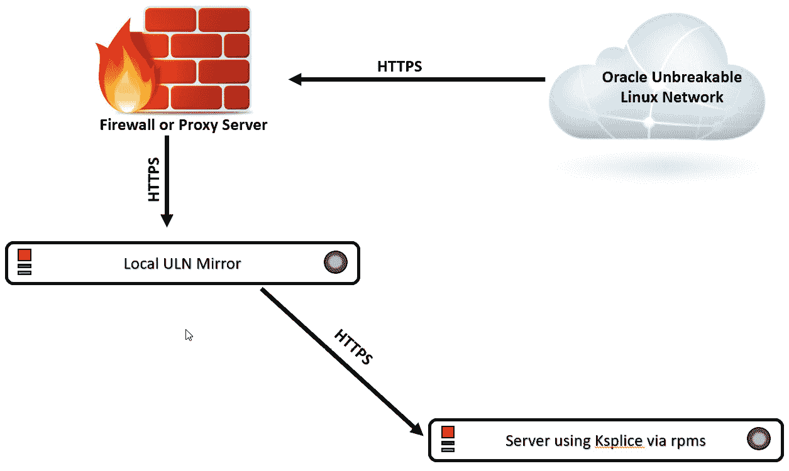

图 7.5 – 使用 RPM 的 Ksplice 离线模式

在离线模式下，只有本地的 ULN 镜像需要能够通过 HTTPS 协议访问 Oracle ULN。这可以通过基础防火墙规则或更高级的代理服务器实现。一旦 ULN 镜像注册并从 ULN 同步，防火墙后面的服务器就可以通过 HTTP/HTTPS 从 ULN 镜像拉取 RPM。离线模式有几个优势：减少了互联网带宽的使用，并且并非每个客户端都需要注册。当然，由于没有 API，离线模式在更复杂的自动化方面有一些限制。

无论使用什么模式，客户端必须能够访问一些特定的 Ksplice 渠道。下表描述了在 Oracle Linux 中可用的 Ksplice 渠道：

| **渠道名称** | **增强版** **客户端** | **渠道标签** | **描述** |
| --- | --- | --- | --- |
| Oracle Linux 7（x86_64）的 Ksplice | 可选 | `ol7_x86_64_ksplice` | 针对 x86_64 系统的 Oracle Linux 7 上的 Ksplice RPM |
| Oracle Linux 7（aarch64）的 Ksplice | 可选 | `ol7_aarch64_ksplice` | 针对 aarch64 系统的 Oracle Linux 7 上的 Ksplice RPM |
| Oracle Linux 8（x86_64）的 Ksplice | 可选 | `ol8_x86_64_ksplice` | 针对 x86_64 系统的 Oracle Linux 8 上的 Ksplice RPM |
| Oracle Linux 8（aarch64）的 Ksplice | 可选 | `ol8_aarch64_ksplice` | 针对 aarch64 系统的 Oracle Linux 8 上的 Ksplice RPM |
| Oracle Linux 7（x86_64）的 Ksplice 感知用户空间包 | 必需 | `ol7_x86_64_userspace_ksplice` | 针对 Oracle Linux 7（x86_64）的 Ksplice 感知用户空间包的最新 RPM |
| Oracle Linux 7（aarch64）Ksplice-aware 用户空间软件包 | 必需 | `ol7_aarch64_userspace_ksplice` | Oracle Linux 7（aarch64）Ksplice-aware 用户空间软件包的最新 RPM |
| Oracle Linux 8（x86_64）Ksplice-aware 用户空间软件包 | 必需 | `ol8_x86_64_userspace_ksplice` | Oracle Linux 8（x86_64）Ksplice-aware 用户空间软件包的最新 RPM |
| Oracle Linux 8（aarch64）Ksplice-aware 用户空间软件包 | 可选 | `ol8_aarch64_userspace_ksplice` | Oracle Linux 8（aarch64）Ksplice-aware 用户空间软件包的最新 RPM |

表 7.1 – Ksplice 频道

注意

如果安装了 `prelink`，请将预链接的二进制文件恢复到其原始状态（`prelink -au`），然后卸载 `prelink`（`dnf remove prelink -y`）。虽然不常用，但 `prelink` 与 Ksplice 不兼容。

现在你已经理解了为什么需要使用 Ksplice 以及它的基本工作原理，接下来我们来看看具体的操作步骤。

使用 Ksplice 最简单的方式是让每个系统直接访问 Oracle Ksplice 服务，这称为在线模式。可以通过互联网代理、直接访问，或者将系统运行在 OCI 中来实现。

## 准备工作

为了执行此操作，你需要一台运行 Oracle Linux 8 且能够访问互联网的测试系统。

## 如何操作……

使用 Ksplice 时，确保操作系统版本和用户空间库相匹配。不要为 Oracle Linux 8 系统使用 Oracle Linux 9 的软件库。系统应如下图所示：

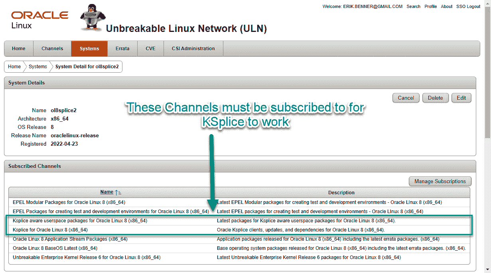

图 7.6 – 所需的频道

如果你使用互联网代理服务器，你需要导出一些环境变量来设置代理服务器：

```
sudo http_proxy=http://proxy_server_URL:http_port
sudo https_proxy=http://proxy_server_URL:https_port
sudo export http_proxy https_proxy
```

将 `proxy_server_URL` 设置为代理服务器，`http_port` 设置为代理服务器使用的端口。

接下来，Ksplice 将通过 `dnf` 安装。需要安装 `ksplice` 和 `uptrack` 包：

```
dnf install -y ksplice uptrack
```

安装完成后，请验证你的系统是否已出现在 ULN 中，并且 `/etc/uptrack/uptrack.conf` 中已填充访问密钥。

访问密钥应位于 `[Auth]` 部分，应该类似于以下内容：

```
[Auth]
accesskey = b3ag33k1746d141edb377f6f643344e23ad9638ae4d896ead4dcdddbb350a058b
```

完成后，执行正常的 `dnf update` 然后重启系统。第一次使用 Ksplice 时需要执行此 `dnf update`，以加载 Ksplice-aware 用户空间库。

一旦服务器重启，Ksplice 现在可以用于修补用户空间库和内核。

要查看内核有哪些更新可用，可以运行 Ksplice 的 `kernel upgrade` 命令，传递 `-n` 参数表示不执行任何操作：

```
ksplice -n kernel upgrade
```

此命令的输出如下图所示：

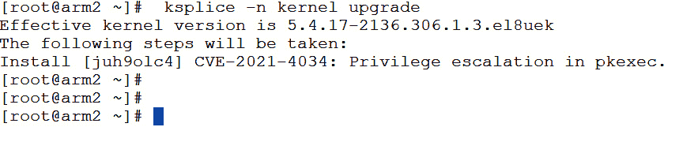

图 7.7 – 可用的 Ksplice 升级

在此系统中，只有一个更新可用，修补 `CVE-2021-4034`。要应用该修补程序，请运行相同的命令，将 `-n` 替换为 `-y`，以表示同意应用内核路径：


图 7.8 – Ksplice 更新内核

在这里，您可以看到 CVE 补丁已经在没有重启的情况下应用！

已经被修补的内核被称为有效内核。当您在 Ksplice 中使用`ksplice kernel uname -r`命令时，它会显示有效内核版本，该版本反映了基于已应用补丁的内核当前的安全状态。这个版本通常与初始启动的内核版本不同，旨在反映内核当前对于潜在安全威胁或重大问题的状况。

现在，您可以通过以下 Ksplice 命令验证您的有效内核：

```
ksplice kernel show
```

请注意，正在运行的内核版本和已安装的内核版本不会匹配！这是因为当 Ksplice 给内核打补丁时，它会将运行内核的 RAM 与新代码拼接。这修补了内核（和选定的用户空间库），但导致`uname`不再与有效内核匹配：

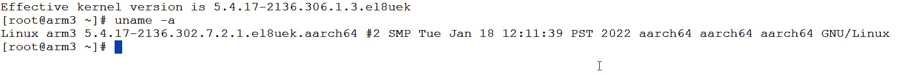

图 7.9 – Ksplice uname

在这里，已安装的内核是`5.4.17-2136.302.7.2.1.el8uek.aarch64`，但已经被 Ksplice 处理的有效内核是一个更新的内核，版本为`5.4.17-2136.306.1.3.el8uek`。这是 Ksplice 的正常行为。

用户空间库也可以以相同的方式进行补丁处理，将内核替换为用户空间。如果没有安装 Ksplice 用户空间库，首次运行该命令时，您会被提示将用户库升级到支持 Ksplice 的版本：

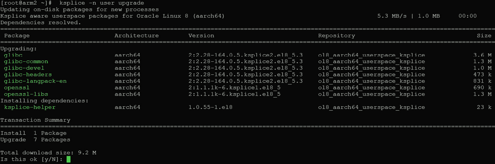

图 7.10 – 首次安装 Ksplice 用户库

注意

您还可以通过`ksplice user show --available`命令检查可用的 Ksplice 用户空间包，但是如果没有安装支持 Ksplice 的包，您将看到以下错误：

`没有活动的用户空间` `Ksplice 目标`

`您是否已经安装了支持 Ksplice 的库` `并重启了系统？`

您还可以检查当前运行的用户空间目标，并可以对其进行补丁处理。可以使用以下命令来完成此操作：

```
ksplice all list-targets
```

以下是示例输出的截图：

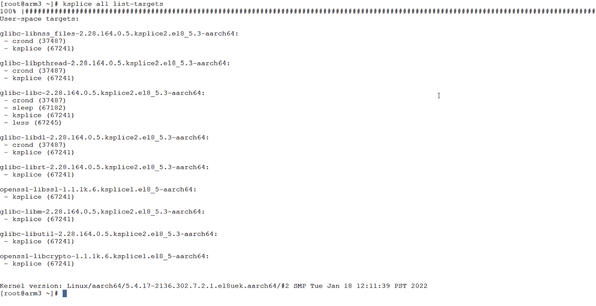

图 7.11 – Ksplice 目标

Ksplice 命令也可以用来回滚补丁。通过使用`ksplice kernel show`命令，您可以查看当前安装的所有补丁：

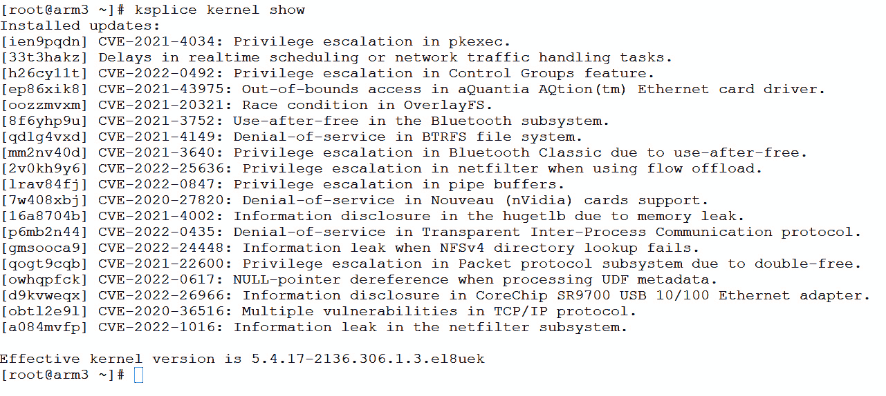

图 7.12 – 已安装的内核补丁

每个 Ksplice 补丁都有一个唯一的**Ksplice 标识符**（**KID**）。KID 还特定于某个内核版本和补丁，因此在比较不同内核的 KID 时，请小心。如果使用自动化工具来利用 KID，请确保将自动化限制在具有相同内核版本和架构的系统上。

这是已安装补丁列表中的第一列。如果你需要卸载特定的补丁，这是可能的。在这个示例中，KID `qd1g4vxd`（CVE-2021-4149：BTRFS 文件系统中的拒绝服务漏洞）将使用 Ksplice `undo` 命令卸载，并传递特定的 KID。你也可以使用 `-v` 参数查看详细信息。卸载后，检查已安装的 KID 列表，验证是否已成功移除该 KID：

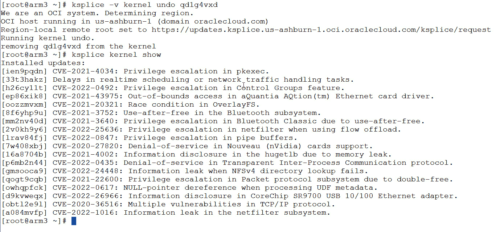

图 7.13 – Ksplice 撤销

可选地，可以使用以下命令从运行中的系统中移除所有已安装的 KID：

```
ksplice kernel remove --all
```

这将从内存中的运行内核中移除所有 KID：

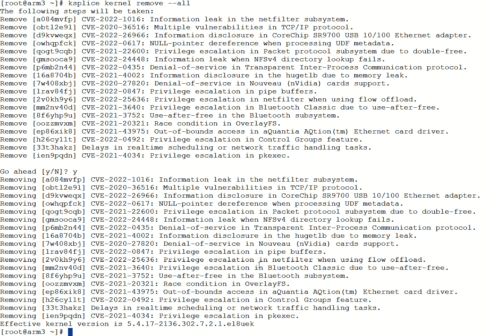

图 7.14 – Ksplice 移除

Ksplice 还允许自动更新。你可以通过简单地触摸一个文件或删除一个文件来启用或禁用自动更新。如果存在 `/etc/uptrack/disable` 文件，则在重启时，Ksplice 将不会自动更新系统。如果该文件不存在，Ksplice 将在重启时检查是否有新的 KID，并应用它们。你也可以通过更新 `uptrack.conf` 文件来修改此行为，本章后面会介绍。

## 它是如何工作的……

当你使用带有互联网连接的 Ksplice 时，Ksplice 客户端会连接到 Oracle ULN Ksplice 系统，下载并应用所需的补丁。

# 在没有互联网连接的情况下使用 Ksplice

并非所有系统都有互联网连接。没关系，因为可以使用 Ksplice 从本地补丁库进行操作。

## 准备工作

为此，你需要一台运行 Oracle Linux 8 的测试系统，并且可以访问网络中的本地 YUM 仓库。

## 如何操作……

安装客户端时，请确保你的服务器正在使用本地镜像的 RPM 仓库。安装 Ksplice 时，你必须选择使用在线客户端或离线客户端。提醒一下，在线客户端需要系统已注册到 ULN，而离线客户端则使用本地 RPM 仓库。

要安装在线客户端，请运行以下命令：

```
dnf install -y ksplice uptrack
```

要安装离线客户端，请运行以下命令：

```
dnf install -y ksplice ksplice-offline uptrack-offline
```

该命令的输出如下图所示：

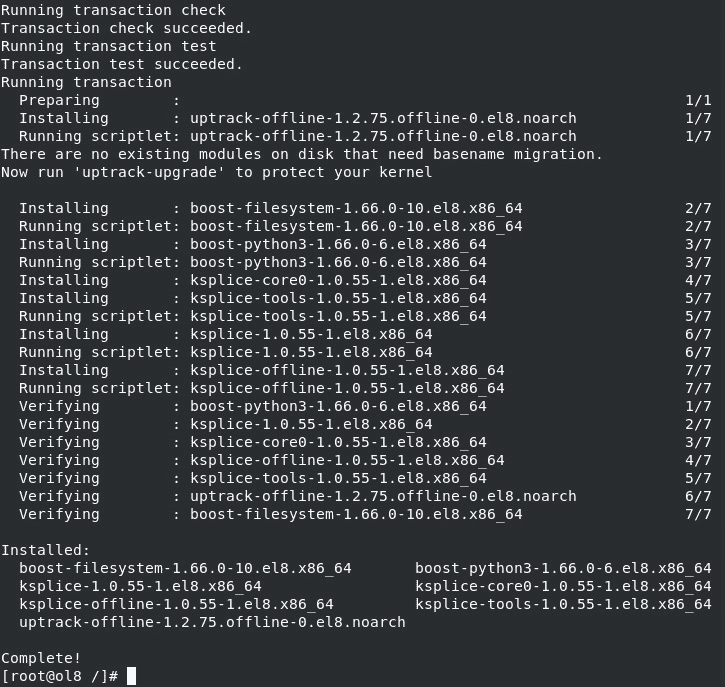

图 7.15 – 离线安装 Ksplice

一旦安装了 Ksplice，你现在可以开始为服务器打补丁。

注意

由于 Uptrack 客户端在 Oracle Linux 8（或 Oracle Linux 7）中不再优于新客户端，因此我们将重点介绍增强版客户端。如果你使用的是较旧的操作系统，可能需要使用旧版的 Uptrack 客户端。

使用离线方式的 Ksplice 非常简单；只需使用 `dnf` 来打补丁：

```
dnf -y update
```

这将同时以常规方式和使用 Ksplice 对内核及用户库进行打补丁。如果你想禁用此行为，可以在 `/etc/uptrack/uptrack.conf` 中将 `skip_apply_after_pkg_install` 设置为 `true`。

在打补丁之前，请确保在 `/etc/yum.repos.d` 中添加了 Ksplice 条目。一个示例 Ksplice 条目可能如下所示：

```
[root@ol8 ~]# more /etc/yum.repos.d/Ksplice.repo
[Ksplice_ol8_local]
name=Ksplice for OL8
baseurl=http://yum.m57.local/yum/OracleLinux/OL8/Ksplice/x86_64/ol8_x86_64_Ksplice/
gpgkey=file:///etc/pki/rpm-gpg/RPM-GPG-KEY
gpgcheck=1
enabled=1
[Ksplice_ol8_userspace]
name=Ksplice OL8 userspace
baseurl=http://yum.m57.local/yum/OracleLinux/OL8/userspace/Ksplice/x86_64/ol8_x86_64_userspace_Ksplice/
gpgkey=file:///etc/pki/rpm-gpg/RPM-GPG-KEY
gpgcheck=1
enabled=1
```

## 它是如何工作的…

Ksplice 是一个工具，它允许 Linux 系统保持最新的安全修复和重要更新，而无需重启系统。这对于需要尽量减少停机时间的服务器和环境特别有益。值得注意的是，尽管 Ksplice 可以处理许多补丁，但某些更复杂的更改可能无法在实时环境中应用，这时将需要传统的基于重启的更新。

# 安装和启用已知漏洞检测

为了确保系统安全（更重要的是，保护系统中的数据），最关键的操作之一就是实现检测功能，以便发现坏人试图闯入。Ksplice 有一个独特的功能，称为 **已知漏洞检测** (**KED**)，它会报告针对内核的已知攻击。通常，只有那些允许黑客获得额外权限的漏洞才会被用于 KED，并且要触发这些漏洞，内核应该已经为该漏洞进行了拼接。

## 准备就绪

为此，你需要一台运行 Oracle Linux 8 且已设置 Ksplice 的测试系统。

## 如何操作…

这是通过 tripwire 代码完成的，当检测到特定事件时会触发。通常，只有那些使攻击者能够获得特权访问的事件才会被监控。此软件包在 x86 和 ARM 系统上都可用。

要启用此功能，首先必须使用以下命令安装该软件包：

```
dnf install -y ksplice-known-exploit-detection
```

无论安装是在 ARM 还是 x64 服务器上，安装过程几乎完全相同，主要的区别在于每个系统上已安装的软件。这让我想起一点：无论是 ARM 还是 x64，管理员的任务都是一样的。

注意

当安装了 KED 后，`postfix` 也会被安装，以启用作为通知系统一部分的邮件发送功能。

在基于 ARM 的系统上安装时的输出结果如下图所示：

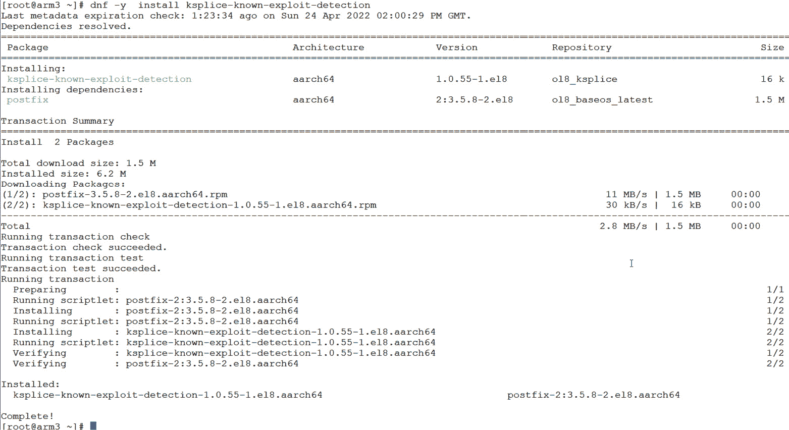

图 7.16 – 在 ARM 上安装 KED

在基于 x86_64 系统上安装时的输出结果如下图所示：

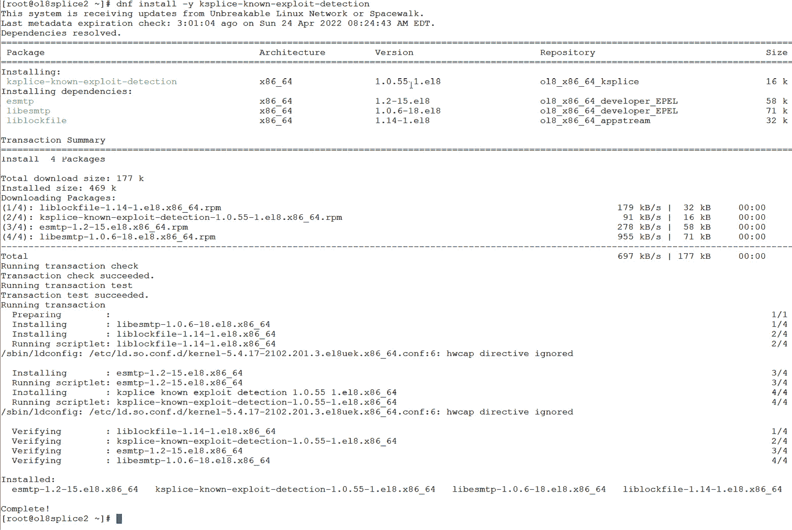

图 7.17 – 在 x64 上安装 KED

安装完 KED 后，需要启用此功能。这可以通过将以下行添加到 `/etc/uptrack/uptrack.conf` 来完成：

```
[Known-Exploit-Detection]
enabled = yes
```

接下来，你需要通过 Ksplice 来启用运行中的内核中的此功能：

```
ksplice --yes  kernel upgrade
```

安装后输出结果如下图所示：

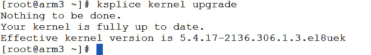

图 7.18 – 在运行中的内核中启用 KED

需要注意的是，如果没有可用的 Ksplice 补丁，你将收到一个通知，表示内核是最新的，如前面的截图所示。但是，如果系统需要补丁，Ksplice 会在此时打补丁，同时启用 KED。

要验证 KED 是否启用，执行 `cat /proc/sys/kernel/known_exploit_detection`，并查找输出是否为 `1`。如果文件缺失或输出为零，说明 KED 没有启用，因此不会监控你的系统：

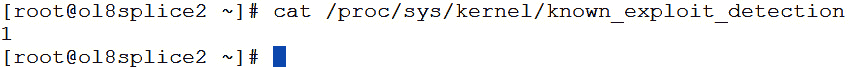

图 7.19 – 检查 KED 是否启用

KED 的通知由 `/etc/log-known-exploit.conf` 配置文件控制。以下截图显示了一个示例配置文件：

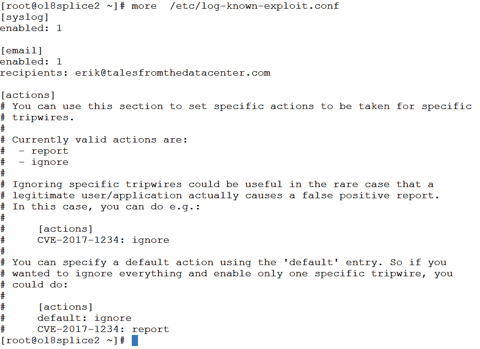

图 7.20 – KED 通知配置

在配置文件中，你可以控制以下操作：

+   `[syslog]`：大多数管理员将事件记录到 syslog，以便使用如 OCI Log Analytics 或 Splunk 等日志分析工具进行捕获和分析。`enabled: 0` 设置将禁用记录到 syslog。

+   `[email]`：此部分允许在触发 tripwire 时发送电子邮件通知。根据需要添加收件人的电子邮件地址。此操作还要求系统能够发送电子邮件，可以通过云服务（如 OCI 邮件投递服务）或自己的 **简单邮件传输协议** (**SMTP**) 中继来完成。

+   `[actions]`：你可以为特定的 CVE 禁用通知。如果系统上出现意外的误报，这会很有帮助。要禁用某个 CVE，只需添加一行包含 CVE 和 `ignore`。`default:` 参数设置所有 CVE 的默认行为。

注意

如果你启用了电子邮件通知，确保在启用来自 KED 的电子邮件之前，已经配置好了你的电子邮件子系统。

你还可以使用 `log-known-exploit` 命令测试系统。这将在内核中记录一条测试消息：

```
/usr/sbin/log-known-exploit -f -d ; tail /var/log/messages
```

测试事件在 `/var/log/messages` 中的显示如下：

```
Apr 22 23:01:02 ol8splice2 /log-known-exploit[4192]: exploit attempt detected; id=CVE-2012-1234 pid=1337 uid=1000 comm=./dummy-exploit lost=0
```

在日志中，你将看到时间、触发的 CVE，以及触发事件的进程和用户的 **进程 ID** (**PID**) 和 **用户 ID** (**UID**)。

## 它的工作原理是…

Ksplice 在内核中安装了特定漏洞的 tripwire 代码，用于检测是否有人试图利用该漏洞。这些触发器会启动通知子系统，让你知道何时发生攻击。
