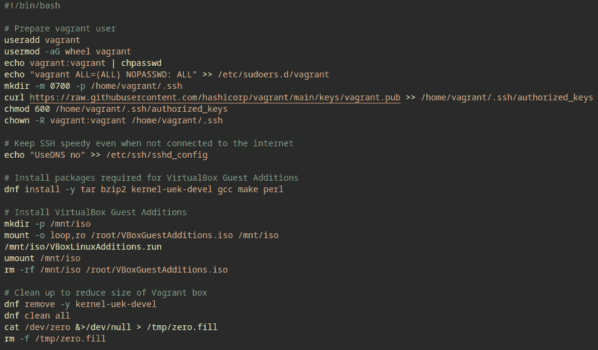

# DevOps 自动化工具——Terraform、Ansible、Packer 等

如果操作系统不能满足开发者需求，那它又有什么用呢？毕竟，易于开发的操作系统往往比那些不适合开发的操作系统拥有更强大的生态系统。你会很高兴地知道，Oracle Linux 非常适合开发者使用，本章将介绍一些常见的开发工具，它们将使你在开展下一个项目时更加轻松。

有无数的开发工具在 Oracle Linux 上运行良好，但本章重点讨论的工具都与自动化相关。我们将讨论如何自动化云基础设施、自动化操作系统构建周期、自动化系统管理员任务以及自动化为开发目的启动虚拟机。

本章我们将介绍以下内容：

+   手动做一次——然后使用 Terraform 反复执行

+   为 Ansible 创建可移植角色

+   使用 Ansible Vault 管理机密

+   用 Vagrant 打造完美的实验环境

+   使用 Packer 修改源镜像

+   收拾好行囊，准备开始，呃，嗯……构建

# 技术要求

本章我们将涵盖很多技术。让我们准备好你的机器，这样你就可以方便地跟随教程进行操作。

## Ansible

对于 Oracle Linux 8，我们可以通过利用**Oracle Linux Automation Manager**库来安装 Ansible，先安装该库，然后我们再安装 Ansible：

```
$ sudo dnf install -y oraclelinux-automation-manager-release-el8
$ sudo dnf install -y ansible
```

## Packer、Vagrant 和 Terraform

Packer 是一个用于自动化创建机器镜像的工具，Vagrant 用于管理虚拟机的生命周期，而 Terraform 是一个基础设施即代码的工具。Packer、Vagrant 和 Terraform 都是 HashiCorp 的产品，但它们在 Oracle Linux 上表现良好。

我们将直接从 HashiCorp 安装 Packer、Vagrant 和 Terraform：

```
$ sudo dnf install -y dnf-plugins-core
$ sudo dnf config-manager --add-repo https://rpm.releases.hashicorp.com/RHEL/hashicorp.repo
$ sudo dnf install -y packer vagrant terraform
```

完成后，我们继续安装**Oracle VM VirtualBox**，因为我们将与**Packer**和**Vagrant**一起使用 VirtualBox：

```
$ sudo dnf install -y oraclelinux-developer-release-el8
$ sudo dnf install -y VirtualBox-7.0
```

最后，除了 Terraform，我们还需要创建一个**Oracle Cloud Infrastructure**（**OCI**）账户。如果你愿意，可以选择使用其他云服务，但如果你希望直接跟随本教程，建议使用 OCI。

重要提示

一定要记住你的云账户名称，因为这是访问你的 OCI 账户时需要的一个重要细节。

## 下载源代码

本章的食谱源代码可以在[`github.com/PacktPublishing/Oracle-Linux-Cookbook/tree/main/ch8`](https://github.com/PacktPublishing/Oracle-Linux-Cookbook/tree/main/ch8)找到。

# 手动做一次——然后使用 Terraform 反复执行

Terraform 是一个 **基础设施即代码** (**IaC**) 工具，它可以让你安全高效地构建、改变和版本化基础设施。本食谱将提供一个关于如何用 **Terraform** 自动化 *繁琐* 任务的技术概览。*繁琐*是什么意思？嗯，就是任何手动完成的任务。我们想要去掉这些手动步骤，尽可能地实现自动化。具体到 Terraform，这意味着我们将自动化云基础设施的部署。得益于 Terraform，我们不再需要通过数百个不同的菜单设置来点击操作。相反，我们将定义 **基础设施即代码**。这使得部署更快速、更一致。此外，由于所有内容都可以通过代码进行编辑，修改基础设施也变得更加容易。

## 开始使用

你将需要以下内容来完成本食谱：

+   Oracle Linux

+   Terraform

如果你需要帮助安装 Terraform，请参考本章开头的 *技术要求* 部分。

## 如何操作…

每当你开始自动化某件事时，最好先深入理解底层需要做什么。你能猜到这是什么意思吗？没错，你必须至少手动完成所有步骤一次，然后再尝试自动化。

### 首先，先手动操作一次…

本食谱的目标是使用 Terraform 在云中部署一个简单的虚拟机。这是一个足够简单的任务，但在我们跳入如何通过代码实现之前，通常最好先手动操作一次。所以，话虽如此，我们先通过 OCI 网页界面部署一台虚拟机：

1.  登录到 Oracle 云基础设施控制台 ([`cloud.oracle.com/`](https://cloud.oracle.com/))。


图 8.1 – OCI 控制台登录页面

1.  点击左上角的汉堡菜单图标：


图 8.2 – OCI 控制台主屏幕

然后点击 **计算** | **实例**：


图 8.3 – OCI 云计算菜单

确认你在想要的 **隔离区** 中，最后点击 **创建实例**：


图 8.4 – OCI 云计算实例

信息

为了简洁，当需要点击多个菜单项时，管道符号（|）表示点击按钮/链接的顺序。

1.  我们将使用默认的 Oracle Linux 镜像，但如果你想更改，可以进入 **镜像和形状**，然后点击 **编辑**。


图 8.5 – OCI 控制台计算镜像和形状

注意

只要你遵循所有**始终免费适用**的资源，就没有费用；然而，在写作时，存在一个错误，错误地显示了每月 $2.00 的启动卷费用。这个错误是因为启动卷使用的是块存储，而 OCI 为你提供最多 200 GB 的块存储是免费的。

在写作时，最新版本是*Oracle Linux 8*（镜像构建：2023.06.30-0）。

1.  在**添加 SSH 密钥**下，选择**为我生成一对密钥**，然后点击**保存私钥**和**保存公钥**。

提示

选择一个容易记住的地方，因为你稍后需要在 SSH 连接到你的虚拟机时使用这个位置。

1.  最后，点击**创建**。

注意

等待图像构建时，随时可以去喝杯咖啡。

现在，让我们使用 SSH 连接到实例：

1.  在**实例信息**标签页中，点击**公共 IP** **地址**旁边的**复制**按钮。

1.  打开一个终端应用程序，使用`ssh`命令连接。我们将使用`-i`（其中`i`代表身份文件）来引用我们在前面的步骤中保存的私钥。对于托管在 OCI 中的官方 Oracle Linux 实例，默认的用户名是`opc`，因此我们将指示`ssh`以`opc`身份连接。最后，输入你在前一步中获得的**公共 IP 地址**。你的命令应该看起来像这样：


图 8.6 – SSH 连接计算实例（失败）

1.  哎呀！你注意到那个大警告以及最后的信息了吗？我们因为权限问题被拒绝访问。让我们通过使用`chmod`命令，只为文件的所有者赋予访问密钥文件的权限来修复它：


图 8.7 – SSH 连接计算实例（成功）

太棒了！我们已经通过 SSH 连接到了机器。

现在我知道这并不难，但想象一下如果你需要做一百次该怎么办？为什么不使用 Terraform 自动化这个过程呢？

### 现在是时候使用 Terraform 反复操作了

这次我们将完成与之前描述的完全相同的操作——也就是，我们将再次在 OCI 中创建一个虚拟机。然而，这一次，我们将使用 Terraform 来定义我们的基础设施即代码（IaC）：

1.  首先，让我们在项目目录的根目录下创建三个新文件（我将这个文件命名为`terraform`），使用你喜欢的代码编辑器，文件名如下：

    1.  `main.tf`

    1.  `variables.tf`

    1.  `terraform.tfvars`

1.  接下来，让我们前往 Terraform 注册表 ([`registry.terraform.io/`](https://registry.terraform.io/)) 查找**Oracle Cloud** **基础设施**（**OCI**）的提供者。

1.  在 Terraform 注册表中，搜索`oci`或`oracle cloud infrastructure`，然后选择**oracle/oci**。

注意

或者，你可以点击**浏览提供者**，然后点击**Oracle Cloud** **Infrastructure** 按钮。

1.  点击`main.tf`文件：


图 8.8 – Terraform OCI 提供者

1.  注意 `provider "oci"` 下的 `# 配置选项` 注释。这告诉我们可能需要提供一些配置选项才能使用该提供者。

    让我们看看如何做到这一点：

    1.  点击 **文档** 标签（它就在 **使用提供者** 旁边），然后找到 **如何配置** **提供者** 的链接。

    1.  你会发现 OCI Terraform 提供者支持四种身份验证方法：

        +   **API 密钥** **身份验证**（默认）

        +   **实例** **主体授权**

        +   **资源** **主体身份验证**

        +   **安全性** **令牌身份验证**

    1.  对于本食谱，我将使用默认的身份验证方法；即 **API 密钥身份验证**。这种方法的限制最少，但根据你的使用情况，你可以选择最适合你需求的方法。

重要提示

提供身份验证信息没有快捷方式；但是，若需要一些帮助的指导，你可以参考与本食谱相关的 GitHub 仓库中的 `oci-provider-conf.md` 文件。如果你需要更多细节，我建议按照前面提到的 **如何配置提供者** 部分中描述的文档进行操作。

1.  如果你决定在 `main.tf` 文件中使用 `provider "oci"`：


图 8.9 – API 密钥身份验证详细信息

为了保持整洁，我们将引用这些值的变量。稍后我将在本食谱中提供更多有关如何定义/声明变量的详细信息。

注意

为了说明我们正在向文件中添加内容，我使用了三组省略号。这是为了表示我们在前面步骤中所做的操作的延续。

这是一个示例：

`...`

`...`

`...`

1.  现在我们已经设置好了提供者，除非我们添加资源，否则它不会做太多工作。在这种情况下，我们想要添加一个 `oci_core_instance`。

    你还记得我们在手动过程中生成 SSH 密钥对时吗？现在，我们需要找出如何使用代码动态地做到这一点。以下指令是如何使用 Terraform 完成这一操作的。我们将创建一个 `tls_private_key` 资源，并将其作为我们的 `ssh_authorized_keys` 引用到 `oci_core_instance` 资源的元数据中。

    我们从 SSH 密钥对开始，它是通过 `tls_private_key` 资源创建的。有关此资源的详细信息，可以在 Terraform 注册表的 `hashicorp/tls` 提供者下找到。继续编辑 `main.tf` 文件，并添加以下内容：


图 8.10 – 使用 Terraform 定义 SSH 密钥对

1.  你需要定义一个有效的可用域。实现这一点的一种方式是使用 Terraform 查询可用域列表，并引用该列表中的一个项，所以让我们将以下代码添加到 `main.tf` 文件中：


图 8.11 – 使用 Terraform 获取可用域列表

1.  最后，我们将添加一个`oci_core_instance`资源。如果你查看 Terraform 注册表中的`oracle/oci`提供程序下的`oci_core_instance`资源，你会看到一个很长的参数列表，这些参数可以用来定义`oci_core_instance`资源；然而，并不是所有的参数都是必需的，因为很多参数前面都有`#Optional`标记。在这个示例中，我们将使用此资源所需的最少参数——大致应该是这样的：


图 8.12 – OCI 核心实例资源详细信息

1.  一旦你完成了`oci_core_instance`资源，你的整个`main.tf`文件应该像这样：


图 8.13 – main.tf 文件的内容

1.  现在，我们需要声明在`main.tf`文件中引用的所有变量。为了保持结构清晰，我们将它们放在`variables.tf`文件中。每个变量至少应包含一个类型；然而，我们还将添加描述以解释变量的用途。

    将以下内容输入到`variables.tf`文件中：


图 8.14 – 在 variables.tf 文件中声明变量

1.  最后，我们需要为变量分配值。为此，你可以使用`terraform.tfvars`文件。它应该像这样：


图 8.15 – terraform.tfvars 文件的内容

注意

请参考以下指南，找到`tenancy_ocid`、`compartment_ocid`、`user_ocid`、`fingerprint`、`subnet_ocid`和`private_key_path`的*ocid*：[`docs.oracle.com/en-us/iaas/Content/API/SDKDocs/terraformproviderconfiguration.htm`](https://docs.oracle.com/en-us/iaas/Content/API/SDKDocs/terraformproviderconfiguration.htm)。

要获取 Oracle Linux 8 的 OCID，请访问以下链接：[`docs.oracle.com/en-us/iaas/images/oracle-linux-8x/`](https://docs.oracle.com/en-us/iaas/images/oracle-linux-8x/) 此链接是区域特定的，也与架构有关，因此你需要找到适用于 x86 的最新 Oracle Linux 8 镜像（换句话说，查找镜像名称中没有`aarch64`文本的版本）。

警告

确保将`terraform.tfvars`文件添加到`.gitignore`列表中，以避免将任何敏感信息提交到版本控制中。

1.  接下来，让我们运行 Terraform，看看我们是否做对了：

    ```
    $ terraform init
    $ terraform plan
    terraform init command initializes the working directory containing your Terraform project files and this should always be the first command that you run after you write a new Terraform configuration. After this, it is a good idea to run terraform plan as this will give you a chance to preview/verify the plan. During this command, Terraform will compare your real infrastructure against your configuration. Finally, running terraform apply will display the plan again, but it will additionally give you the chance to enter yes to perform any actions proposed by the plan.When you see the prompt that asks you to `Enter a value`, go ahead and type `yes`, and then press *Enter*.
    ```

重要提示

如果遇到`401-NotAuthenticated`错误，请确保已将您的公钥添加到 OCI 控制台中。此公钥与*API 密钥* *认证*方法下的`private_key_path`配对。

如果你需要帮助将公钥添加到 OCI 控制台，请访问 [`docs.oracle.com/en-us/iaas/Content/API/Concepts/apisigningkey.htm#three`](https://docs.oracle.com/en-us/iaas/Content/API/Concepts/apisigningkey.htm#three)。

1.  如果一切顺利，你应该能够看到资源被创建的过程。一旦完成，你会看到类似这样的信息：

    ```
    instances folder within your Terraform project.This is easy enough to do, but why not automate a bit more so we don’t need to check the OCI console for the public IP address? All we need to do is add a bit more code to our `main.tf` file and we can really start to take things to the next level.Go ahead and add the following code to your `main.tf` file:
    ```


图 8.16 – 输出连接详情的 Terraform 代码

1.  现在我们已经完成了这部分，保存文件后，再次运行`terraform apply`，看看它的作用：

    ```
    Enter a value prompt, go ahead and type yes, and then press *Enter*.
    ```

1.  Terraform 将按照它的方式执行，最后你会看到输出，其中提供了如何通过 SSH 连接到新创建的实例的说明。它的输出应该看起来像这样：


图 8.17 – “terraform apply” 的输出

我意识到我们刚才讨论的内容似乎有很多信息，但让我们来回顾一下我们所做的工作。我们实现了将实例自动部署到云端。每个参数都可以在我们的`terraform.tfvars`文件中轻松配置。最后，包括生成 SSH 密钥在内的琐碎步骤也被自动化处理，我们甚至在最后打印出一条信息，明确指导如何连接到新部署的实例。我希望你喜欢这个教程，并且开始看到**IaC**的真正价值！

这个教程的源代码可以在以下地址找到：[`github.com/PacktPublishing/Oracle-Linux-Cookbook/tree/main/ch8/terraform`](https://github.com/PacktPublishing/Oracle-Linux-Cookbook/tree/main/ch8/terraform)。

# 为 Ansible 创建可移植角色

在尝试跟随这个教程之前，我建议你具备一些关于 Ansible 的基础知识，以及如何编写 Ansible playbook。如果你从未编写过 Ansible playbook，我建议你参考官方 Ansible 文档中的*创建 playbook*指南。你可以在这里找到该指南：[`docs.ansible.com/ansible/latest/getting_started/get_started_playbook.html`](https://docs.ansible.com/ansible/latest/getting_started/get_started_playbook.html)。

在这个教程中，你将学到使用**Ansible 角色**时，移动内容是多么的简单。当我第一次开始使用 Ansible 时，我只用*任务*来编写 playbook。对我来说，这种方法在当时看起来是合乎逻辑的，并且更像传统的脚本编写方式，因为所有的操作都是按时间顺序执行的。

以这种方式编写 playbook 的问题在于没有明确的依赖关系，并且任务与主机一起定义，都在同一个文件中。如果你想把某些内容移到另一个 playbook，你就得小心地为每个任务抓取正确的依赖项，而且你可能会不必要地重复自己，因为任务本身不可复用。当你的 playbook 变得更复杂和/或增大时，为了可管理性，你最终会希望有一些更便于迁移的东西。

根据 Red Hat 的说法，角色是设计成*自包含的可移植自动化单元*。

将任务组织成角色（roles）可以让您轻松地重复使用这些任务并与他人共享。事实上，如果您访问 Ansible Galaxy（[`galaxy.ansible.com/`](https://galaxy.ansible.com/)），您将会发现大量以*预打包的工作单元*（在 Ansible 中称为角色和集合）的形式存在的内容。因为这些角色是与其他 Ansible playbook 框架解耦的，所以将 Ansible 角色作为组织化的自动化单元进行重用和共享要容易得多。

如果您是程序员，可以把角色看作是函数或方法。很简单吧？让我们开始吧！

## 开始使用

对于这个教程，您需要以下内容：

+   Oracle Linux

+   Ansible

如果您需要帮助安装 Ansible，请参考本章开头的*技术要求*部分。

## 如何操作…

将一系列任务转换成角色并不困难，实际上只是将任务拆分并将其组织成代表角色的类别。这个教程旨在描述这个过程，并希望到最后，您能够很好地理解如何在自己的 playbook 中实现这一点。

### 原始 playbook

让我们首先来看一个不使用角色的 playbook，看看需要做什么。

一个典型的没有使用角色的 playbook 可能是这样的：


图 8.18 – 没有角色的长 playbook

注意

截图在最后消失是因为这是一个长 playbook，整个 playbook 的内容并不重要。

这个 playbook 自动化了几个任务。首先，如果标准用户不存在，它会创建一个，然后通过 container-tools AppStream 模块安装 Podman，接着启动一个 NGINX 容器，最后升级系统中的所有软件包，并检查系统是否需要重启。

如您所见，如果将所有任务直接写入一个 playbook，文件很快就会变得庞大而难以管理。不久之后，您会发现自己在文件中重复写入准备工作任务，并且很可能会在每行的开头添加注释符号，将不必要的任务标记为注释，从而让自动化引擎将它们视为注释而非代码——您甚至可能会在执行 playbook 时切换任务的启用与禁用，以便针对某个特定任务。这可能会让人感到不堪重负，如果不小心，您可能会删除一些代码，尽管有时您可能仍然需要它们。角色提供了一种更好的组织 playbook 的方式。事实上，您可以写尽可能多的角色，并将它们整齐地调用到 playbook 中——这样 playbook 会更易于阅读和维护。

### 创建角色

在 Ansible 中，角色是组织在 `roles` 目录下的。你在 `roles` 下创建一个文件夹，文件夹的名称将成为角色的名称。然后在该文件夹中，至少要创建一个名为 `tasks` 的文件夹，里面应包含一个定义该角色将执行的主要任务的 `main.yml` 文件：

1.  让我们分解一下并通过在 `roles` 目录中创建一个 `users` 文件夹来为用户创建一个角色。

    你的目录结构应该大致如下：

    ```
    ├── playbook.yml
    └── roles
        └── users
            ├── files
            │   └── wallpaper.jpg
            └── tasks
                └── main.yml
    ```

1.  现在，在 `tasks` 目录中创建一个 `main.yml` 文件，将我们的用户相关任务迁移到该文件中。


图 8.19 – 用于配置用户的 Ansible 角色

1.  现在我们有了角色的雏形。我们可以利用其他功能来便于预配置操作。以下是我最常用的两个功能——`files` 和 `meta`：

    +   首先，你会注意到我们引用了一个 `files` 目录。那是属于角色的一个特殊目录，包含与该角色相关的文件。

    +   另一个是 `meta` 目录，它用于声明依赖项。例如，由于 `users` 角色依赖于某些组的存在，最好先使该角色依赖于 `groups` 角色。为此，我们只需为 `groups` 创建一个角色，然后从 `meta` 目录中调用该角色。

1.  `groups` 角色可能如下所示。请注意目录结构以及附带的文件——这些都是构成角色的元素。你的目录结构应如下所示：

    ```
    ├── playbook.yml
    └── roles
        └── groups
            └── tasks
                └── main.yml
    ```

1.  实际的任务应该写在 `main.yml` 文件中，内容如下：


图 8.20 – 用于用户组的 Ansible 角色

1.  现在，在 `users` 角色的 `meta/main.yml` 文件中，我们只需要将 `groups` 角色作为依赖项调用：

    ```
    ---
    dependencies:
      - role: groups
    ```

1.  最后，使用以下命令运行剧本：

    ```
    $ ansible-playbook playbook.yml
    ```

    你已经成功创建了一个 Ansible 角色。

1.  接下来，重复这个过程，直到你将所有内容组织成角色。对我来说，最终我得到了以下的目录结构：

    ```
    ├── playbook.yml
    └── roles
        ├── base_software
        │   └── tasks
        │       └── main.yml
        ├── containers
        │   └── tasks
        │       └── main.yml
        ├── get_hostname
        │   └── tasks
        │       └── main.yml
        ├── groups
        │   └── tasks
        │       └── main.yml
        ├── update_packages
        │   ├── meta
        │   │   └── main.yml
        │   └── tasks
        │       └── main.yml
        ├── uptime
        │   └── tasks
        │       └── main.yml
        └── users
            ├── files
            │   └── wallpaper.jpg
            ├── meta
            │   └── main.yml
            └── tasks
                └── main.yml
    ```

### 更新版的剧本

至于实际的剧本，它现在可以简化为如下内容：


图 8.21 – 利用角色的 Ansible 剧本

注意

请注意，我们没有在剧本中列出 `base_software` 和 `groups` 角色，因为这些是我们在 `meta` 目录中定义的依赖项。

如你所见，我们现在不再引用 `tasks`，而是直接引用 `roles`。这种方式非常整洁有序，也更容易理解剧本的目的。如果你想了解某个特定角色的功能，只需进入 `roles` 目录，找到相应角色的名称，并查看该角色 `tasks` 文件夹中的 `main.yml` 文件。

当你准备好时，像往常一样运行剧本：

```
$ ansible-playbook playbook.yml
```

如果一切顺利，它应该已经完成了我们原本剧本中所做的所有工作；然而，这次我们使用的是 Ansible 角色，因此我们的剧本在未来将更容易维护。

本食谱的源代码可以在[`github.com/PacktPublishing/Oracle-Linux-Cookbook/tree/main/ch8/ansible-roles`](https://github.com/PacktPublishing/Oracle-Linux-Cookbook/tree/main/ch8/ansible-roles)找到。

# 使用 Ansible Vault 管理机密

本食谱旨在提供关于如何利用**Ansible Vault**进行*机密管理*的指导。

在 Ansible 中存储机密有多种方法。刚开始时，你可能倾向于加密整个`hosts`文件。这种方法有效，并且在使用版本控制系统的上下文中保持所有内容安全，而不会泄露你的机密/密码；然而，它不可管理，也无法在版本控制系统中提供任何有用的信息，因为你剩下的只是一串长而毫无意义的加密字符。

## 入门

你需要以下内容来完成这个操作：

+   Oracle Linux

+   Ansible

如果你需要帮助安装 Ansible，请参考本章开头的*技术要求*部分。

## 如何操作…

首先，让我们看看整个文件加密。首先，我们需要在明文中定义我们的 Ansible 主机文件。

### 整个文件加密

通常，Ansible 主机文件看起来像这样：

```
# hosts
[host1]
192.168.2.70
[host1:vars]
ansible_user=admin
ansible_password=B@by-Y0dA
ansible_connection=ssh
ansible_shell_type=powershell
[host2]
192.168.2.71
[host2:vars]
ansible_user=admin
ansible_password=B@by-Y0dA
ansible_connection=ssh
ansible_shell_type=powershell
```

你可以通过在终端/控制台中运行以下命令来加密文件：

```
$ ansible-vault encrypt hosts --ask-vault-pass
New Vault password:
Confirm New Vault password:
Encryption successful
```

我正在使用一个随机生成的字符串作为我的 vault 密码。

加密文件的另一种方式是使用`vault_password`，并将密码粘贴到其中。

注意

最好将`vault_password`文件的权限设置为`0600`（可以通过运行`chmod 0600 ./vault_password`来实现），以保护它不被其他用户访问。

现在，不再使用`--ask-vault-pass`，你可以使用以下命令：

```
$ ansible-vault encrypt hosts --vault-password-file vault_password
Encryption successful
```

很棒！只要确保将`vault_password`文件添加到`.gitignore`列表中，以避免将其提交到版本控制中。

现在，如果你`cat`你的`hosts`文件，你会看到内容已被加密：


图 8.22 – 加密“hosts”文件的内容

这很好，但每当你需要修改`hosts`文件时，你面临两种选择：

+   解密`hosts`文件，进行更改，然后再次加密

+   使用`ansible-vault edit hosts`来利用 ansible-vault 的*vim*模式编辑文件

这些选项并不糟糕，但实际上这可能会变得很繁琐。我建议一种更好的方法，即在 Ansible Vault 中使用`encrypt_string`方法，仅加密敏感数据，并使用变量代替密码/密钥来引用这些加密的字符串。

### 将密码公然隐藏

将密码明文隐藏在明处与我们之前描述的整个文件加密直接相反。我们仍将加密我们的敏感数据，但这一次我们将*仅*加密敏感数据，而将其他所有内容保留在明文未加密状态：

1.  我们将使用`encrypt_string`方法。在本示例中，我们要加密的密码是`B@by-Y0dA`，我们将使用标识此密码的变量命名为`admin_password`。

    ```
    'B@by-Y0dA' looks like once encrypted:
    ```


图 8.23 – 加密密码

1.  接下来，我们需要将其输出到`secrets.yml`文件中（您可以简单地将`>> secrets.yml`追加到之前输入的命令中，以自动将输出复制到文件中）。这是一个示例：

    ```
    secrets.yml file should look something like this:
    ```


图 8.24 – secrets.yml 文件内容

重要提示

每次运行命令时，您可能会注意到加密后的值都不相同，即使使用相同的密码加密相同的值也是如此。每次加密时会改变随机盐；这是有意设计的，目的是确保最终加密输出永远不相同（即使使用相同内容）。

1.  现在您已加密，可以将主机文件中的 `ansible_password` 值替换为引用密码的变量名称（在本例中为 `admin_password`）：

    ```
    # hosts
    [host1]
    192.168.2.70
    [host1:vars]
    ansible_user=admin
    ansible_password={{ admin_password }}
    ansible_connection=ssh
    ansible_shell_type=powershell
    [host2]
    192.168.2.71
    [host2:vars]
    ansible_user=admin
    ansible_password={{ admin_password }}
    ansible_connection=ssh
    ansible_shell_type=powershell
    ```

注意

**变量级加密**的优点在于文件仍然可以轻松阅读和理解，因为在加密变量旁边会有明文混合存在。

此配方的源代码可在 [`github.com/PacktPublishing/Oracle-Linux-Cookbook/tree/main/ch8/ansible-vault`](https://github.com/PacktPublishing/Oracle-Linux-Cookbook/tree/main/ch8/ansible-vault) 找到。

# 用 Vagrant 打造完美的实验环境

最近在工作中，我被要求准备一个 **Oracle Linux Manager** 的演示，并展示软件的几个特性。这本来是一件容易的事情，但在您访问 Oracle Linux Manager 的 Web GUI 之前，有几个入门障碍需要克服。

首先，Oracle Linux Manager 需要 Oracle Linux 7；它尚未在 Oracle Linux 8 上认证。因此，我开始下载 Oracle Linux 7 的 ISO 并在 VirtualBox 中创建虚拟机并安装操作系统。然后我想要 SSH 进入该虚拟机，因此我不得不进入虚拟机的设置菜单，并配置主机到客户机的端口转发。此时，我能够成功 SSH 登录，并按照 Oracle Linux Manager 的安装说明进行操作。设置起来并不是太糟糕，但中途出现了几个阻碍。例如，我需要决定使用哪个数据库。Oracle 仅支持将 Oracle 数据库与 Oracle Linux Manager 配合使用，但为了简洁起见（并且因为这只是 Oracle Linux Manager 的实验演示），我决定使用 **PostgreSQL**。

由于手动步骤繁多，我倾向于把我新创建的虚拟机当做宠物来照顾。人们常说容器像牛群，虚拟机像宠物。也就是说，直到你开始使用像 Vagrant 这样的工具。Vagrant 做得很好，它让你的虚拟机和牛群融合在一起——感谢 Vagrant 让你能够轻松地重建虚拟机，你不再需要像以前那样照顾它们，尤其是当你不使用 Vagrant 时。

本教程将指导你创建一个使用**Vagrant**的实验环境。

## 准备工作

你将需要以下内容来完成本教程：

+   Oracle Linux

+   Oracle VM VirtualBox

+   Vagrant

如果你需要帮助安装 Oracle VM VirtualBox 和 Vagrant，请参阅本章开始的*技术要求*部分。

## 如何操作……

Vagrant 是一个用于管理虚拟机生命周期的工具。在本指南中，我们将创建一个 Vagrant 盒子，它会自动安装并配置 Oracle Linux Manager。Oracle Linux Manager 需要 Oracle Linux 7。在这种情况下，我们可以使用官方的**Oracle Linux 7 Vagrant Box**作为基础：

```
$ vagrant init oraclelinux/7 https://oracle.github.io/vagrant-projects/boxes/oraclelinux/7.json
```

很好，这已经为我们拉取了一个不错的基础文件。让我们看看`Vagrantfile`文件，看看里面有什么：

```
# Vagrantfile
Vagrant.configure("2") do |config|
  config.vm.box = "oraclelinux/7"
  config.vm.box_url = "https://oracle.github.io/vagrant-projects/boxes/oraclelinux/7.json"
end
```

实际上，由`init`命令生成的`Vagrantfile`包含 69 行代码，但其中 65 行是注释，因此我将它们移除，以帮助使这篇指南更容易理解。

正如我们从这个`Vagrantfile`中看到的，启动 Oracle Linux 7 实例只需要这四行命令，当它启动并运行时，你只需输入`vagrant ssh`命令即可访问虚拟机并查看它如何工作。完成后，输入`vagrant destroy`命令以销毁虚拟机。现在，让我们深入研究如何使这更有用；因为我希望能够输入`vagrant up`，不仅启动一个 Oracle Linux 虚拟机，还希望同样的命令启动一个可以工作的 Oracle Linux Manager 副本。

首先，让我们回顾一下 Oracle Linux Manager 的安装和配置说明——这些可以在[`docs.oracle.com/en/operating-systems/oracle-linux-manager/2.10/install/#Oracle-Linux-Manager`](https://docs.oracle.com/en/operating-systems/oracle-linux-manager/2.10/install/#Oracle-Linux-Manager)找到。由于我们不使用 Oracle 数据库，我们将稍微偏离这些说明——这意味着我们将跳过与 Oracle 数据库相关的内容（例如，我们不需要 Oracle Instant Client 和*SQL*Plus*包）。

为了说明我们将要做的事情，我将列出指南中的所有步骤，并将我们要保留的步骤用**粗体**标出。那些没有加粗的步骤将被跳过：

+   `sudo yum install` `oracle-instantclient18.5-basic-18.5.0.0.0-3.x86_64.rpm oracle-instantclient18.5-sqlplus-18.5.0.0.0-3.x86_64.rpm`

+   `echo "/usr/lib/oracle/18.5/client64/lib" | sudo` `tee /etc/ld.so.conf.d/oracle-instantclient18.5.conf`

+   `sudo ldconfig`

+   **sudo yum list installed |** **grep jta**

+   **sudo yum** **remove jta**

+   **echo «exclude=jta*» >> /****etc/yum.conf**

+   **sudo yum-config-manager –****disable ol7_addons**

+   `sudo firewall-cmd --``permanent --add-port=69/udp`

+   `sudo firewall-cmd --``permanent --add-port=80/tcp`

+   `sudo firewall-cmd --``permanent --add-port=443/tcp`

+   `sudo firewall-cmd --``permanent --add-port=5222/tcp`

+   `sudo firewall-cmd --``permanent --add-port=5269/tcp`

+   `sudo systemctl` `reload firewalld`

+   **sudo yum** **install oracle-release-el7**

+   **sudo yum** **install oracle-linux-manager-server-release-el7**

+   **sudo yum-config-manager --****enable ol7_optional_latest**

+   `spacewalk-oracle` **spacecmd spacewalk-utils**

+   `sudo` `spacewalk-setup --external-oracle`

就这些了。以下是我们需要做出的其他更改，以便将 Oracle Linux Manager 与 PostgreSQL 一起使用：

```
sudo yum install spacewalk-setup-postgresql spacewalk-postgresql
```

最后，我们需要提供一个答案文件，因为我们在 Vagrant 中进行的自动化不能进行交互式操作：

```
sudo spacewalk-setup --non-interactive --answer-file=/tmp/answer-file.txt
```

创建一个名为`answer-file.txt`的文件，并将以下内容放入该文件：

```
admin-email = root@localhost
ssl-set-cnames = spacewalk
ssl-set-org = Oracle
ssl-set-org-unit = OLM
ssl-set-city = Raleigh
ssl-set-state = NC
ssl-set-country = US
ssl-password = Password1
ssl-set-email = root@localhost
ssl-config-sslvhost = Y
db-backend = postgresql
db-name = spaceschema
db-user = spaceuser
db-password = Password1
db-host = localhost
db-port = 5432
enable-tftp = Y
```

这总结了大部分安装和配置步骤。接下来，为了使这些操作能够正常工作，以便我们可以通过 Vagrant 自动部署和配置 Oracle Linux Manager，我们需要进行一些非常简单的修改。我们真正需要做的就是将这些步骤粘贴到一个*Bash shell 脚本*文件中，并告诉 Vagrant 使用一个提供者在虚拟机上运行这些命令。同样，由于自动化不能进行交互操作，我们只需要在所有`yum`命令中添加`-y`。

因此，为了清理并为 Vagrant 做好准备，我们的 Bash 脚本将类似于以下内容：

```
#!/bin/bash
yum remove jta -y
echo "exclude=jta*" >> /etc/yum.conf
yum-config-manager --disable ol7_addons
yum install oracle-release-el7 -y
yum install oracle-linux-manager-server-release-el7 -y
yum-config-manager --enable ol7_optional_latest -y
yum install spacewalk-schema-2.10.14-1.el7 spacewalk-setup-postgresql spacewalk-postgresql spacecmd spacewalk-utils -y
spacewalk-setup --non-interactive --answer-file=/tmp/answer-file.txt
```

注意

在编写本食谱的过程中，spacewalk-schema 包做出了更新，导致其不再与 PostgreSQL 兼容。通过将 spacewalk-schema 包固定到`spacewalk-schema-2.10.14-1.el7`，如前面的代码片段所示，可以解决这个问题。

我删除了每个步骤中的`sudo`调用，因为在 Vagrant 的配置阶段，一切都以 root 身份运行。

现在，对于`Vagrantfile`，我们添加几行代码，以便 Vagrant 可以将`answer-file.txt`文件复制到虚拟机上，然后告诉 Vagrant 执行我们刚刚编写的脚本。我们还将创建一个私有网络，允许通过特定的 IP 进行主机仅访问（这将使我们可以通过网页浏览器轻松访问 Oracle Linux Manager）：


图 8.25 – 用于部署 OLM 的 Vagrant 文件

注意

在 Linux/Unix 系统上，VirtualBox 只允许将`192.168.56.0/21`范围内的 IP 地址分配给主机专用适配器。这允许从`192.168.56.1`开始的 IP 地址，直到`192.168.63.254`。

现在，我们可以查看我们的目录应该是什么样子的：

```
└── oracle-linux-manager
    ├── answer-file.txt
    ├── provision.sh
    └── Vagrantfile
```

我们准备好启动了：

```
$ vagrant up
…
…
…
--> default: Running provisioner: shell…
    default: Running: inline script
    default: Access Oracle Linux Manager at https://192.168.56.10
```

你将看到配置脚本安装并配置 Oracle Linux Manager，并且在短短几分钟内，你就能够通过浏览器访问虚拟机所定义的 IP 地址来访问 Oracle Linux Manager。最棒的是，这一切都是**以代码形式定义**的。我们在本教程中创建的一切总共仅有 6 KB 大小！Vagrant 在解决经典的“*它在我的机器上能用*”问题方面做得非常出色。你可以将这 6 KB 的代码部署到任何机器上（Mac、Windows、Linux 等）——所需要的只是 Vagrant 和 Oracle VM VirtualBox。

我们可以将这个自动化过程更进一步，使其更加有用。例如，我们可以自动化为 Oracle Linux Manager 创建第一个用户，自动创建频道、仓库和激活密钥，然后为 OLM 创建客户端并自动连接它们。深入讨论这些细节超出了本教程的范围，但如果你有兴趣了解如何实现，我已经将解决方案发布在 GitHub 上——你可以在这里找到：[`github.com/PacktPublishing/Oracle-Linux-Cookbook/tree/main/ch8/vagrant`](https://github.com/PacktPublishing/Oracle-Linux-Cookbook/tree/main/ch8/vagrant)。

# 使用 Packer 修改源镜像

Packer 是一个用于自动化创建机器镜像的工具。在本教程中，我们将使用 Packer 引用一个**Oracle Linux 8**平台镜像作为源，使用配置器安装某些内容，并将这些更改推送到 OCI 中，创建一个新的 OCID 镜像。

注意

尽管 OCI 提供了一个包含“永久免费”资源的免费层，但这不包括存储镜像的能力。如果你希望跟随本教程，你需要使用一个付费账户。

## 准备工作

本教程需要以下内容：

+   Oracle Linux

+   Packer

如果你需要帮助安装 Packer，请参考本章开头的*技术要求*部分。

## 如何操作…

Packer 常常被忽视，因为它看起来非常简单；然而，不要让这种简单性愚弄了你——Packer 非常强大且有用。在本教程中，我们将使用 Packer 引用某个版本的 Oracle Linux 8 作为基础镜像，使用一个配置器安装某些内容，并将这些更改推送到 OCI 中，创建一个新的 OCID 镜像：

1.  首先，我们将指定一个提供名为`oracle-oci`的构建器的 Packer 插件，该构建器使 Packer 能够为 OCI 创建机器镜像。我们可以在名为`oracle-oci.pkr.hcl`的文件中完成此操作。在文件开头输入以下内容：


图 8.26 – Packer OCI 构建器插件

1.  接下来，我们将使用 `oracle-oci` 构建器指定的配置选项来配置我们的 OCI 认证。有关配置 `oracle-oci` 构建器的详细信息，可以查看 [`developer.hashicorp.com/packer/plugins/builders/oracle/oci`](https://developer.hashicorp.com/packer/plugins/builders/oracle/oci)：

    +   有许多方法可以做到这一点。一种方法是直接在你的 `*.pkr.hcl` 文件中引用用于认证的变量，像这样：


图 8.27 – 在 Packer 中引用变量

+   然后，我们需要在名为 `variables.pkr.hcl` 的文件中声明所有这些变量。在这个文件中，我们声明变量并指定类型，同时提供一个描述来解释变量的目的。将以下内容输入到你的 `variables.pkr.hcl` 文件中：


图 8.28 – 在 Packer 中声明变量

+   最后，我们要为变量分配值。我们将它们放在名为 `variables.auto.pkrvars.hcl` 的文件中。它应该看起来像这样：


图 8.29 – 在 Packer 中分配变量

+   另一种方法是配置你的 OCI CLI，在 `~/.oci/config` 文件中。这看起来像这样：

    ```
    [DEFAULT]
    user=ocid1.user.oc1..<unique_ID>
    fingerprint=<your_fingerprint>
    key_file=~/.oci/oci_api_key.pem
    tenancy=ocid1.tenancy.oc1..<unique_ID>
    region=us-ashburn-1
    [ADMIN_USER]
    user=ocid1.user.oc1..<unique_ID>
    fingerprint=<your_fingerprint>
    key_file=keys/admin_key.pem
    pass_phrase=<your_passphrase>
    ```

注意

关于配置 OCI CLI 的完整详细信息可以在这里找到：[`docs.oracle.com/en-us/iaas/Content/API/Concepts/sdkconfig.htm`](https://docs.oracle.com/en-us/iaas/Content/API/Concepts/sdkconfig.htm)

1.  一旦你配置了认证，你可以开始定义基础镜像。它应该看起来像下面这样：


图 8.30 – 在 Packer 中定义基础镜像

注意

要获取 Oracle Linux 8 的 OCID，请访问以下网址：[`docs.oracle.com/en-us/iaas/images/oracle-linux-8x/`](https://docs.oracle.com/en-us/iaas/images/oracle-linux-8x/)。这不仅与区域相关，还与架构相关，因此你需要查找适用于 x86 的最新 Oracle Linux 8 镜像（换句话说，寻找镜像名称中没有 `aarch64` 的版本）。

1.  一旦你定义了源，你可以开始指导 Packer 在构建过程中该做什么。在这种情况下，我们将调用一个 provisioner，这样我们就可以运行一个 shell 命令来安装 Git：


图 8.31 – Packer 的 provisioners

1.  到此为止，我们已经告诉 Packer 我们要使用什么源，并描述了我们在构建时希望做什么。你的完整文件应该像这样：


图 8.32 – 完整的 Packer 文件用于修改基础镜像

注意

在最终文件中，我将 `example` 替换为 `ol8u8`，以便更清楚地描述我正在处理的内容。这只是良好的自我文档化方式。

1.  接下来，我们将运行 `packer init` 来下载外部插件：

    ```
    $ packer init .
    ```

1.  最后，让我们继续构建 OCID 镜像：

    ```
    sudo dnf install -y git to install Git on the instance.
    ```


图 8.33 – 运行 packer build 后的初始输出

安装 Git 后，它将对实例进行快照，并将其导出为新的 OCID 镜像，为所有未来的实例提供一个新的起点。


图 8.34 – Packer 完成构建过程后的输出

当 Packer 完成时，您可以通过在 OCI 控制台中导航到 **计算** | **自定义镜像** 来查看新发布的镜像。以下是该界面的示例：


图 8.35 – 查看最近发布的自定义镜像

本食谱的源代码可以在 [`github.com/PacktPublishing/Oracle-Linux-Cookbook/tree/main/ch8/packer-cloud`](https://github.com/PacktPublishing/Oracle-Linux-Cookbook/tree/main/ch8/packer-cloud) 找到。

# 打包它，收起它，让我开始，嗯，呃……构建

在本食谱中，我们将使用 Packer 从源媒体（如 ISO 文件）开始，从头创建我们的 Vagrant box。

## 开始

本食谱需要以下内容：

+   Oracle Linux

+   Oracle VM VirtualBox

+   Packer

如果需要帮助安装 Oracle VM VirtualBox 和 Packer，请参阅本章开头的 *技术要求* 部分。

## 如何操作……

更常见的是，您可以在 Vagrant 目录中搜索并找到包含所需操作系统的预制 **Vagrantfiles**。但是如果您需要的内容没有呢？或者也许您不信任 Vagrantfile 的作者和/或您更倾向于自己创建一个。您可以手动完成此操作，或者可以完全通过代码来实现，使用 Packer。在本食谱中，我们将使用 Packer 从 Oracle Linux 8.8 源 ISO 创建一个全新的 Vagrant box。从高层次来看，Packer 将下载我们希望使用的操作系统的 ISO 镜像，然后使用 Oracle VM VirtualBox 启动一个虚拟机并安装它。之后，它会将虚拟机导出为 **开放虚拟化格式**（**OVF**）。最后，它将压缩此文件并将其转换为 Vagrant box 文件。

### Oracle Linux 8 kickstart 文件

1.  为了让这项操作生效，您需要提供一个 kickstart 文件来自动化 ISO 的安装。您可以自己创建一个，或者使用 Oracle Linux Image Tools 中的一个文件，该文件可以在 GitHub 上的官方 Oracle Linux 仓库中找到。在本食谱中，我将使用来自 Oracle Linux Image Tools 的一个文件：

    https://github.com/oracle/oracle-linux/blob/main/oracle-linux-image-tools/distr/ol8-slim/ol8-ks.cfg

1.  现在，为了开始使用这个配置，我们将创建一个名为 `ol8-vagrant` 的新目录。在该目录下，创建一个 Packer 文件，并命名为 `vagrant-ol8.pkr.hcl`，然后创建一个名为 `http` 的文件夹，并将 kickstart 文件放在其中。完成后，您的文件结构应如下所示：

    ```
    └── vagrant-ol8
        ├── http
        │   └── ol8-ks.cfg
        └── vagrant-ol8.pkr.hcl
    ```

1.  在我们的 kickstart 文件中，我们只需要设置 root 用户的密码。因此，在这种情况下，我们将 `rootpw --lock` 这一行修改为 `rootpw --``plaintext vagrant`。

1.  接下来，我们将继续处理 `vagrant-ol8.pkr.hcl` 文件。首先，我们需要指定我们需要的插件。由于我们想从 ISO 镜像创建虚拟机，所以使用 VirtualBox Builder，另外由于我们要将 OVF 文件转换为 Vagrant box 文件，因此使用 Vagrant Builder。可以通过在 Packer 配置文件中添加以下代码来完成这些设置：


图 8.36 – Packer VirtualBox 和 Vagrant 构建插件

信息：

有关 Packer VirtualBox 插件的更多信息，请访问：[`www.packer.io/plugins/builders/virtualbox`](https://www.packer.io/plugins/builders/virtualbox)。

1.  现在我们需要定义一个源。在这种情况下，我们希望使用 Oracle Linux 8.8 的 ISO。请将以下内容添加到 `vagrant-ol8.pkr.hcl` 文件中：


图 8.37 – 用于构建 Vagrant box 的 Packer 文件

重要提示

注意 `modifyvm` 命令，它将 `--nat-localhostreachable1` 设置为 `on`。这是一个新的设置，在 Oracle VM VirtualBox 7 中默认是 `off`。将此值设置为 `on` 可以解决一个网络问题，防止 Packer 将 kickstart 文件发送到虚拟机。换句话说，如果你正在使用 VirtualBox 7 来构建虚拟机，务必包含此设置，但如果你使用的是 VirtualBox 6，则需要移除此行，否则构建将失败。

1.  在前面的代码中，我们将 `guest_os_type` 指定为 `"Oracle_64"`，因为我们是从 Oracle Linux ISO 构建虚拟机的。接下来，我们输入 ISO 的 URL 以及校验和。对于 `ssh_username`，我们使用 `"root"`，对于 `ssh_password`，我们使用 `"vagrant"`，因为这些是 Vagrant 默认的设置，旨在简化操作，特别是如果你计划公开发布你的 box。如果你打算将 box 保留为私人使用，最好使用不同的值，这样可以提高安全性。

信息

有关 Vagrant 用户名和密码的更多信息，请访问：[`www.vagrantup.com/docs/boxes/base#vagrant-user`](https://www.vagrantup.com/docs/boxes/base#vagrant-user)。

1.  我们将 `headless` 设置为 `"true"`，以防止虚拟机启动 VirtualBox GUI。我们将 `ssh_wait_timeout` 的时间增加，以给操作系统足够的时间进行安装并启动。一切都不言自明，直到我们遇到 `http_directory` 设置。

1.  你需要知道的就是，我们将利用`http_directory`选项作为一种便捷的方式，通过 HTTP 服务器提供一个目录。这样做是为了让引导命令能够指向一个 kickstart 文件——我们已经将它放置在`http`目录中。`http://{{ .HTTPIP }}:{{ .HTTPPort }}/ol8-ks.cfg`会告诉操作系统如何找到这个 kickstart 文件。你不需要担心`{{ .HTTPIP }}`和`{{ .HTTPPort }}`的语法，这些只是由 Packer 模板引擎处理的模板变量。

1.  对于`nic_type`，默认值是`82540EM`，它等同于 Intel PRO/1000 MT 桌面版。这是一个安全的选择，非常适合运行旧操作系统，但 Oracle Linux 8 是一个现代操作系统，所以我们将其设置为`virtio`。VirtIO 是一个准虚拟化驱动程序，它能为虚拟机提供更好的网络性能。

1.  现在，我们来看看`boot_command`。基本上，我们需要弄清楚，在启动时，操作系统接收引导命令所需的按键序列。对于 Oracle Linux 8，我们发送*up*和*Tab*键，然后发送指令以告知从哪里找到 kickstart 文件，最后我们告诉它按*Enter*键开始安装操作系统。

1.  对于`vboxmanage`，我发现默认情况下，Packer 尝试以仅 512MB 内存启动我的虚拟机，这导致在操作系统安装时发生错误。为了解决这个问题，我将内存增加到`2048`。为了安全起见，我还为虚拟机分配了两个 CPU。

1.  最后，使用`shutdown_command`，我们只需告诉 Packer 如何在所有配置完成后优雅地关闭系统。如果我们留空此项，Packer 会强制关闭机器。

信息

要查看可用配置选项的完整概述，请参阅[`www.packer.io/plugins/builders/virtualbox/iso`](https://www.packer.io/plugins/builders/virtualbox/iso)。

1.  到目前为止，我们已经完成了自动安装操作系统所需的步骤，但还需要做一些事情来准备虚拟机以适应 Vagrant。具体来说，我们需要添加一个名为`vagrant`的用户，为该用户填充已知的公共密钥，最后我们还需要安装 VirtualBox Guest Additions。

    对于这些任务，我们将使用一个提供程序来执行一个 shell 脚本。这个任务发生在操作系统安装完成后，并且虚拟机仍在运行时。这是我们在关闭系统并将其转换为 Vagrant box 之前需要做的最后一件事。

    接下来，请将以下内容添加到`vagrant-ol8.pkr.hcl`文件中：


图 8.38 – 用于构建 Vagrant 盒子的 Packer 文件（续）

信息

有关后处理程序的更多信息，请参阅：[`www.packer.io/plugins/post-processors/vagrant/vagrant#virtualbox`](https://www.packer.io/plugins/post-processors/vagrant/vagrant#virtualbox)。

1.  从上面的截图可以看到，我们将创建一个名为 `scripts` 的新文件夹，并将 shell 脚本放入其中：

    ```
    └── ol8-vagrant
        ├── http
        │   └── ol8-ks.ks
        ├── scripts
        │   └── vagrant-base-box.sh
        └── vagrant-ol8.pkr.hcl
    ```

1.  现在，在 `vagrant-base-box.sh` 脚本中，我们将添加以下内容：



图 8.39 – vagrant-base-box.sh 脚本的内容

1.  接下来，我们将运行 `packer init` 来下载外部插件：

    ```
    $ packer init .
    ```

1.  现在我们准备好构建 Vagrant box 了。这部分很简单，只需运行以下命令：

    ```
    $ packer build .
    ```

    输入命令后，你将看到如下内容：


图 8.40 – “packer build” 命令的输出

这将需要一些时间，因为实际上这里有很多操作。记住我们之前讨论过的高层次内容：Packer 将下载 ISO 文件，创建虚拟机，安装操作系统，之后它将运行你刚才定义的所有脚本，但一旦这些完成，你将得到一个整洁的 `.box` 文件（这正是我们需要用于 Vagrant 的）。

如果你切换到 VirtualBox，你将最终看到一个由 Packer 创建的新虚拟机。你可以不管它，让 Packer 自行操作，但了解这个细节能让你知道背后的过程发生了什么。


图 8.41 – 使用 Packer 构建并配置虚拟机的截图

构建完成后，你应该会看到类似以下内容的输出：


图 8.42 – 完成构建的 Vagrant box 截图

注意

Oracle Linux ISO 文件有几个 GB，因此这可能需要一些时间。现在或许是休息一下，喝杯咖啡的好时机。😉

1.  现在是时候准备我们的 Vagrant box 以便与 Vagrant 一起使用了。我们将运行 `vagrant init` 来构建 Vagrantfile：

    ```
    $ vagrant init ol8-x64-virtualbox.box
    ```

    输出如下所示：


图 8.43 – 初始化 Vagrant box

有用的提示

你可以运行 `vagrant init` 和 `vagrant init .`，但最好指定 box 的文件名。这样，Vagrant 会自动在 Vagrantfile 中指定正确的 box 值。正因如此，在这个食谱中，我们运行的是 `vagrant init ol8-x64-virtualbox.box`。

1.  最后，是时候通过运行 `vagrant up` 来测试我们的新 Vagrant box 了：

    ```
    $ vagrant up
    ```

    这个命令的输出如下所示：


图 8.44 – “vagrant up” 命令的输出

就这样。几分钟后，你的虚拟机将启动并运行，你可以使用 Vagrant 提供的便捷命令与之交互。

本食谱的源代码可以在[`github.com/PacktPublishing/Oracle-Linux-Cookbook/tree/main/ch8/packer-vagrant`](https://github.com/PacktPublishing/Oracle-Linux-Cookbook/tree/main/ch8/packer-vagrant)找到。

重要提示

如果你还在开发你的 Vagrant 盒子，并且需要在每次构建后进行测试，你会希望确保你正在测试最新构建的盒子。我曾经遇到过一个问题，认为我的更改没有保存，直到我意识到 Vagrant 正在使用之前构建的缓存盒子。你可以使用`vagrant box` `remove ol8-x64-virtualbox.box`命令来删除旧盒子。
