# 保持数据安全 – 保护系统

没有人希望成为头条新闻，尤其是在他们的数据被盗时。保护数据的最佳方式之一是确保操作系统及其服务的安全。安全通常被比作洋葱，因为它有多层防护，很难被剥开，每一层都能提供对恶意行为者的防御。当恶意行为者攻击你的数据时，目的并不仅仅是窃取数据；他们往往也会修改数据。更糟的是，当你迁移到云端时，你不仅要保护系统免受内部威胁（如不良承包商或员工）和外部威胁（如黑客攻击），还要保护你的数据免受云服务提供商的威胁。在安全领域，你永远不知道谁是恶意行为者！

这不仅仅是保护你的系统免受恶意行为者的攻击；许多行业也要求有强大的安全措施。尤其在医疗行业，通常需要实施安全控制，以符合**健康保险流通与责任法案**（**HIPAA**）的要求。处理信用卡的企业必须遵守**支付卡行业数据安全标准**（**PCI-DSS**）的原则，许多政府机构也必须实施安全标准，以符合**联邦风险与授权管理计划**（**FedRAMP**）的要求，确保其云端工作负载的合规性。

注意

安全团队有自己的术语！“恶意行为者”指的是黑客——那些试图修改或窃取数据的人。他们通过攻击系统的攻击面、基本的系统组件和可以被恶意行为者接触到的服务来实现这一目的。

当你保护系统时，必须涵盖不止一个攻击面。这些攻击面可能是静态数据、动态数据、像 HTTP 这样的服务，甚至是 Linux 内核。你还需要使用可以帮助识别系统配置的工具，以最佳方式保护数据。在本章中，目标是为你提供几个方法，帮助你识别风险并保护你的数据。

本章将涵盖以下主要方法：

+   使用 GPG 签名 Git 提交

+   加密所有 Web 流量

+   加密所有静态数据

+   验证是否遵守合规政策

+   端口保护和限制网络访问

+   保持 SELinux 活跃

# 技术要求

对于这个方法，你需要一台 Oracle Linux 8 系统。和大多数方法一样，推荐使用桌面虚拟化产品（如 Oracle VirtualBox）在桌面上运行虚拟机。一个拥有 2 个核心、2GB 内存和几个可用 GB 磁盘空间的小型虚拟机就足够了。理想情况下，在开始之前，你应该将系统更新到最新的可用包。这只需几分钟，并且在排除由于错误导致的问题时能节省大量时间。

本书中的许多食谱相关的配置文件可以在 GitHub 上的[`github.com/PacktPublishing/Oracle-Linux-Cookbook`](https://github.com/PacktPublishing/Oracle-Linux-Cookbook)找到。

# 使用 GPG 签署 Git 提交

本食谱将展示如何使用**GNU 隐私保护**（**GPG**）密钥对来为 Git 提交和 RPM 包进行数字签名。一个 GPG 密钥对由两部分组成：公钥和私钥。

这是通过创建一个 GPG 密钥对并使用它来签署 Git 提交和 RPM 包完成的。

## 准备工作

为了使用 GPG 和 Git，首先需要安装一些软件包。通常，当安装`gnupg2`包时，GPG 会默认安装。

Git 应使用`dnf install git -y`命令安装。

## 如何操作...

第一步是创建一个 GPG 密钥，如果你还没有的话。这个密钥将用于签署你的 Git 提交和 RPM 包。你可以使用`gpg`或`gpg2`命令来操作 GPG 密钥；这两个命令是相同的，因为`gpg`链接到`gpg2`。

GPG 密钥是通过命令行创建的：

```
[erik@ol8 ~]$ gpg2 --gen-key
```

该命令会要求输入一些信息，主要是你的真实姓名和电子邮件地址。输入信息并继续后，它会要求你设置一个密码短语以保护密钥。不要忘记密码短语！如果忘记了，密钥将无法使用，所有用该密钥加密的数据将丢失。你可以选择不使用密码短语，但如果这样做，你会多次被要求验证。密钥创建的输出应该类似于以下截图：

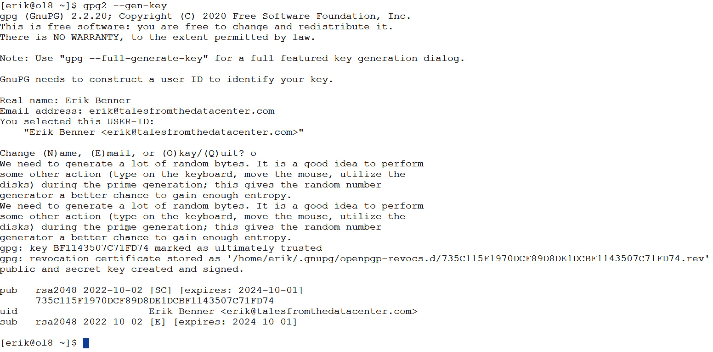

图 9.1 – 创建的 GPG 密钥

可选地，你可以使用`--full-generate-key`选项，它可用于创建存储在硬件设备上的密钥等用途。

一旦密钥被创建，它会被放入你的密钥环中，也就是位于你的主目录中的`.gnupg`目录下的`pubring.kbx`文件。要查看文件中的所有密钥，运行命令`gpg2 --list-keys --keyid-format=long`。

`gpg --list-secret-keys`命令用于列出存储在 GPG 密钥环中的私密密钥（即私钥）。运行该命令会显示类似于以下图示的 GPG 密钥输出：

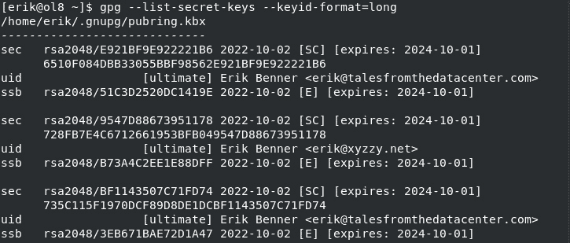

图 9.2 – GPG 密钥

输出会显示每个密钥的多个信息列：

+   `sec`：这一列表示该密钥是一个私密密钥。

+   `rsa2048/4096/...`：这一列显示密钥所使用的算法和密钥长度。例如，`rsa2048`表示密钥使用 RSA 算法，密钥长度为 2048 位。如果使用长格式，它还会在密钥长度后显示密钥指纹。

+   `[创建日期]`：这一列显示密钥创建的日期。

+   `[过期日期]`：如果密钥设置了过期日期，这一列会显示该日期。如果没有设置，则该列为空。

+   `[用户 ID]`：这一列显示与密钥相关的用户 ID，通常是密钥拥有者的名字和电子邮件地址。

+   `[ssb]`：此列表示该密钥有一个对应的子密钥（即用于加密、签名或认证的独立密钥）。

+   `[expires]`：如果子密钥设置了过期日期，它将在此列显示。如果没有设置，则此列将为空。

密钥指纹是密钥的简化数字表示。它允许其他人验证您的公钥在传输过程中没有被篡改。GPG 命令的长密钥 ID 格式是一个 16 个字符的十六进制字符串，用于唯一标识 GPG 中的公钥或私钥。在与 GPG 一起工作时，它通常用于引用特定的密钥。

长密钥 ID 是从密钥的完整 40 字符指纹派生的。指纹是密钥公钥材料的加密哈希值，用于验证密钥的真实性。长密钥 ID 是指纹的最后 16 个字符。

现在你已经有了密钥，我们需要将其导入到 Git 中。在以下示例中，我们将使用密钥`E921BF9E922221B6`。要导入密钥，我们将使用以下命令：

```
git config --global user.signingkey E921BF9E922221B6
```

然后，我们可以使用以下命令设置 Git 默认签署所有提交：

```
git config --global commit.gpgsign true
```

## 它是如何工作的……

Git 可以使用 GPG 密钥签署提交和标签。但要小心使用 Git，因为它并不一致。`git tag` 使用 `-s` 来签署标签，而 `git commit` 使用 `-s` 添加 `-S`，实际上是使用 GPG 签署提交。

要设置一个新的标签，我们将使用 Git 标签命令 `-s $TAG -m $TAG_DESCRIPTION`：

```
$ git tag -s v1.0 -m 'Version 1.0 tag'
You need a passphrase to unlock the secret key for
user: "Erik Benner <erik@talesfromthedatacenter.com>"
2048-bit RSA key, ID 922221B6, created 2024-04-01
```

注意

您还可以全局或针对每个仓库设置`tag.gpgsign`，以确保所有标签自动签署。

接下来，我们可以使用 `git` `show v1.0` 显示标签：

```
$ git show v1.0
tag v1.0
Tagger: Erik Benner <erik@talesformthedatacenter.com >
Date:   Sun April 2 215:24:41 2023 -2300
Version 1.0 tag
-----BEGIN PGP SIGNATURE-----
Version: GnuPG v1
JHGSksdhj847yskKJHSnd874tlKJAHGS32674GJHSAD784ghsjkd7*&^ADDXGFdgj3kjj hde018GDKjskhdh8737ybdhajkjkjhsadfs7892987812mmxnbcbsd8JASJ74845jfhHA SHDepkjahZXkjs83828732ZMKDjh92yaskjagZKDSJHGHHD&=7213kj4ha,,jhsad10al qpdif9839928hdkask
=EFTF
-----END PGP SIGNATURE-----
commit 7fhs49185hflvmsgd742825hhabzb182ufnc8
Author: Erik Benner <erik@talesformthedatcenter.com>
Date:   Sun Apr 2 12:52:11 2023 -2300
    Change version number
```

之后，当我们使用 Git 检查代码时，添加`-S`选项到命令中，以自动使用标签签署提交：

```
git comit -a -S -m "comment goes here"
```

注意

如果全局或在当前 Git 仓库中设置了`commit.gpgsign=true`，则无需此操作。

# 加密所有的网络流量

加密与您的 Web 服务器之间的通信非常重要。即使是一个没有登录功能的简单博客或公司网站，进行加密也有很多优势：

+   **维护用户信任**：使用 HTTPS 加密您的网页有助于建立您网站与用户之间的信任。当用户看到浏览器中的锁形图标，表示连接是安全的时，他们可以更加放心地认为他们的数据是安全传输的。浏览器会显示未加密的网站。Chrome 和 Edge 浏览器会在 URL 旁边显示 *不安全*，或者像 Mozilla 浏览器一样显示红色斜线的锁图标。

+   **SEO 好处**：谷歌曾表示 HTTPS 是其搜索算法中的一个排名因素。这意味着使用 HTTPS 的网站可能在搜索结果中排名高于不使用 HTTPS 的网站。

+   **浏览器警告**：现代 Web 浏览器（如 Chrome 和 Firefox）现在会在用户访问收集敏感信息的非 HTTPS 网站时显示警告信息。这可能会阻止用户使用您的网站，从而对您的业务产生负面影响。

+   **合规性**：如果你的网站需要遵守某些法规或标准，如 PCI DSS 或 HIPAA，则可能需要通过 HTTPS 加密网页，以遵守这些法规。  

注意  

虽然 SSL 是一个常用的术语，但现代系统实际上使用**传输层安全性**（**TLS**）作为加密技术。SSL 作为一种较旧的技术存在一些安全漏洞，这也是 TLS 作为 SSL 的升级版被开发出来的原因。TLS 解决了 SSL 存在的漏洞，使其成为一个更安全的选择。  

总体而言，使用 HTTPS 加密网页对于保护敏感数据、维护用户信任、遵守法规和标准非常重要。它对 SEO 也越来越重要，可以避免浏览器警告，这些警告可能会对你的网站声誉产生负面影响。而且通过像 Let’s Encrypt（[`letsencrypt.org/`](https://letsencrypt.org/)）和 ZeroSSL（[`zerossl.com/`](https://zerossl.com/)）这样的服务来实现这一点既简单又免费。  

Let’s Encrypt 和 ZeroSSL 都提供免费的安全证书，包括用于加密 HTTP 流量的 SSL/TLS 证书。SSL/TLS 证书用于加密 Web 流量，允许 Web 服务器和 Web 浏览器之间进行加密通信。Let’s Encrypt 的创建旨在让网站所有者更容易获得 SSL/TLS 证书并在他们的网站上启用 HTTPS。在 Let’s Encrypt 出现之前，获取 SSL/TLS 证书通常是一个复杂且昂贵的过程，需要手动验证并支付证书颁发机构的费用。Let’s Encrypt 通过自动化验证过程并提供免费的证书，简化了这一过程。  

Let’s Encrypt 证书被所有主流浏览器和操作系统信任。它们的有效期为 90 天，并可以通过自动客户端软件自动续期。Let’s Encrypt 还提供了一个**自动证书管理环境**（**ACME**）协议，允许 Web 服务器自动化获取、续期和吊销证书的过程。  

## 准备工作  

对于本示例，你需要一台运行 Oracle Linux 的 Web 服务器。该服务器需要能够通过互联网访问，以便 Let’s Encrypt 系统能够验证 URL。在这个示例中，我将使用 Oracle Cloud 上的虚拟机，并使用他们的免费服务层。这台虚拟机运行在一颗基于 Arm 架构的 CPU 上，拥有 2 个核心和 12GB 内存。`80`和`443`端口都已开放给这台服务器。无论处理器类型或云平台如何，这个过程都相同。系统运行的是带有最新补丁的 Oracle Linux 8。  

## 如何操作…  

为了实现这一目标，我们需要做一些事情：  

1.  安装带有`mod_ssl`的 Apache 及其所有依赖项。

1.  从 Git 获取`acme.sh`。  

1.  使用 webroot 模式创建证书。Webroot 模式要求站点可以通过 `80` 和 `443` 端口从互联网访问。虽然这种方法易于实现，但还有另一种使用 DNS 的验证方法。有关不同挑战类型的更多信息，请参阅 [`letsencrypt.org/docs/challenge-types/`](https://letsencrypt.org/docs/challenge-types/)。

1.  进行测试。

### 安装 Apache 并配置 mod_ssl 及其所有依赖项

1.  所以我们作为 root 用户开始吧。首先，我们需要安装一些软件包：

    +   `httpd` – Apache Web 服务器

    +   `mod_ssl` – 在 Apache 上启用 SSL

    您可以使用以下命令来执行此操作：

    ```
    80 and 443 to the firewall. This is done as the root with the following commands:

    ```

    firewall-cmd --zone=public --permanent --add-service=http

    firewall-cmd --zone=public --permanent --add-service=https

    ssltest.talesfromthedatacenter.com。这样，我们可以为这个虚拟服务器单独添加 SSL 证书。作为 root 用户，让我们为文件创建一个目录，并将其所有权更改为 apache 用户：

    ```
    mkdir -p /var/www/ssltest
    ssltest.conf in /etc/httpd/conf.d:

    ```

    <VirtualHost *:80>

    # 将此内容放入 /etc/httpd/conf.d/ssltest.conf

    Alias /.well-known/acme-challenge/ /var/www/ssltest/.well-known/acme-challenge/

    <Directory "/var/www/ssltest/.well-known/acme-challenge/">

    Options None

    AllowOverride None

    ForceType text/plain

    RedirectMatch 404 "^(?!/\.well-known/acme-challenge/[\w-]{43}$)"

    </Directory>

    RewriteEngine On

    RewriteCond %{REQUEST_URI} !^/.well-known/acme-challenge [NC]

    RewriteCond %{HTTPS} off

    RewriteRule (.*) https://%{HTTP_HOST}%{REQUEST_URI} [R=301,L]

    </VirtualHost>

    ```

    ```

    ```

    ```

1.  保存文件后，运行 `apachctl configtest`。每次修改配置文件时，最好始终运行此测试。

    ```
    apachectl configtest
    enable option will restart the web server when the system starts. The --now option will start the server now:

    ```

    80。您应该看到默认的 Apache 页面。注意，左上角显示“未加密”标志！站点*未*使用 SSL：

    ```

    ```

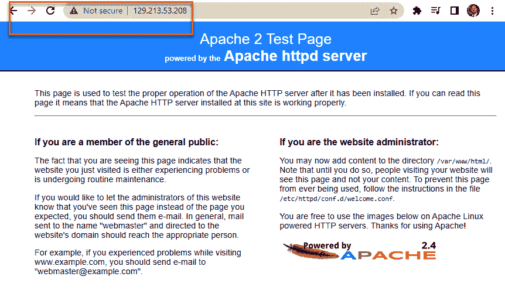

图 9.3 – 没有 SSL 的 Apache 测试页面

### 从 Git 获取 acme.sh

现在，我们需要从 Git 获取 `acme.sh` 脚本：

1.  首先，我们需要使用以下命令安装 Git：

    ```
    acme:

    ```

    mkdir acme

    ```

    ```

1.  现在，我们可以使用以下命令从官方 Git 网站克隆（[`github.com/acmesh-official/acme.sh`](https://github.com/acmesh-official/acme.sh)）：

    ```
    git clone https://github.com/acmesh-official/acme.sh.git
    ```

然后运行安装程序，根据需要更新您的目录和电子邮件地址。

```
/root/acme/acme.sh --install -m my@email.com
```

### 使用 webroot 模式创建证书

1.  接下来，让我们注册一个账户，传递一个电子邮件地址作为变量：

    ```
    /root/acme/acme.sh/acme.sh --register-account -m erik@talesfromthedatacenter.com
    [Sun Apr  2 22:02:01 GMT 2023] No EAB credentials found for ZeroSSL, let's get one
    [Sun Apr  2 22:02:02 GMT 2023] Registering account: https://acme.zerossl.com/v2/DV90
    [Sun Apr  2 22:02:03 GMT 2023] Registered
    ACCOUNT_THUMBPRINT for future use. This is also saved in ./ca/acme.zerossl.com/v2/DV90/ca.conf.
    ```

1.  现在，我们可以运行脚本，传递 URL 和站点的 `apache` 主目录：

    ```
    ./acme.sh --issue  -d ssltest.talesfromthedatacenter.com --log
    ```

    以下图显示了脚本安装新证书时运行的命令。

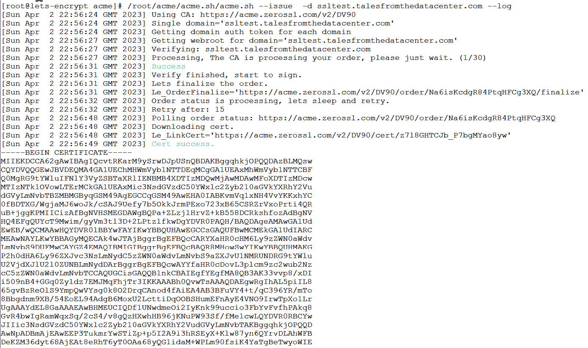

图 9.4 – 待安装证书

脚本将重启 Apache。

### 测试

1.  现在，您可以通过 HTTPS 访问该站点。您会在地址栏的左侧看到一个锁形图标，表示站点已加密安全。下图显示了这一点：

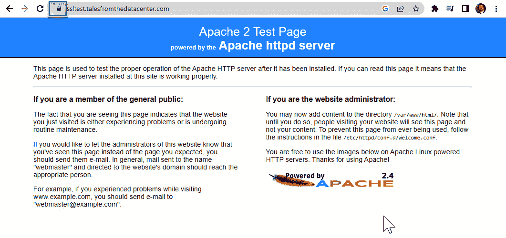

图 9.5 – 安装的 SSL 密钥

## 它的工作原理…

这个过程的工作原理是，`acme.sh` 脚本生成一个临时密钥文件，并将其放置在 `.well-know/acme-challenge` 目录中。系统然后从互联网查询服务器以获取该文件。如果能获取到该文件，则测试通过，新的密钥会被发放。需要注意的是，要监控这一过程，因为第三方安全软件或 SELinux 可能会影响你获取临时密钥文件的能力。

现在证书已经设置完毕，还有一项任务需要做，以使其定期更新。你可以通过添加以下 cron 任务，轻松地让系统每天检查一次新证书。需要注意的是，你需要根据实际安装位置调整脚本路径。在本例中，脚本安装在 `/home/acme/.acme.sh`：

```
0 0 * * * /home/acme/.acme.sh/acme.sh --cron --home /home/acme/.acme.sh > /dev/null
```

注意

当使用自动更新的密钥时，强烈建议定期监控你的网站是否出现 SSL 错误。理想情况下，你应该每小时检查一次 SSL 错误，以防万一出现问题。查看 Web 服务器的 SSL 日志，并使用如 wget 或 curl 等工具进行检查，确保网站正常运行。如果 SSL 密钥无效，wget 和 curl 会因为错误而失败。

# 加密所有静态数据

加密传输中的数据很重要，但你也需要加密静态数据。这一点在云环境中尤为重要，因为你与许多其他用户共享存储空间。尽管云服务提供商可能提供自动加密功能，但需要记住的是，如果他们可以自动解密数据，那么他们也可以访问密钥。为了真正保护数据，你需要使用云服务无法访问的密钥进行加密。这可以通过**Linux 统一密钥设置**（**LUKS**）轻松实现。大型组织还可以使用**Clevis**，它能够从由 Tang 服务器管理的密钥中自动解密数据。Tang 服务器用于存储和管理加密密钥。在云环境中，这使你能够管理启动加密，而无需让云服务提供商访问你的密钥。这个过程被称为**网络绑定磁盘加密**（**NBDE**）。

NBDE 是 Oracle Linux 中的一项安全功能，在启动过程中提供磁盘加密密钥。NBDE 是常规磁盘加密的扩展，它使用网络服务器来存储并提供加密密钥，而不是本地机器。结合 NUKS，这使得可以使用本地密钥（需要手动输入密码短语）和来自 Tang 服务器的自动密钥解密启动驱动器。这提供了简化的安全自动启动，但在紧急情况下，你仍然可以在没有 Tang 服务器的情况下启动。

## 准备工作

与其他教程不同，本教程需要至少两台虚拟机：一台作为 Tang 服务器，另一台作为客户端。两台系统应更新到最新的软件版本。

## 如何操作……

在本教程中，我们将执行以下操作：

+   创建名为 `tang` 的服务器：

    +   安装并配置 Tang 服务器

+   构建另一个名为 `clevis` 的服务器：

    +   安装并配置 Clevis

    +   配置 LUKS 与 Clevis 一起加密数据卷

### 配置 Tang 服务器

Tang 服务器由 Oracle Linux 使用，在启动过程中提供加密密钥。以下是它的基本工作原理：

+   在启动过程中，远程系统会联系 Tang 服务器并请求加密密钥。

+   Tang 服务器生成一个随机加密密钥并将其发送回远程系统。

+   远程系统使用加密密钥解锁其加密磁盘，从而能够启动。

+   Tang 服务器丢弃加密密钥，以使其无法再次使用。

使用 Tang 服务器的一个关键好处是，即使主加密密钥被泄露，它仍然可以为远程系统提供加密密钥。这可以通过限制主加密密钥泄露后的损害来提高系统的安全性。

1.  要安装 Tang 服务器，我们只需要使用 `dnf` 安装软件，打开防火墙端口，并设置服务器运行。这些操作都以 root 用户身份完成。

    通过 `dnf` 安装非常简单；只需运行以下命令：

    ```
    192.168.56.0/24 is my boot subnet. Don’t forget to update the subnet to your subnet when running the following firewall commands:

    ```

    firewall-cmd --zone=trusted --add-source=192.168.56.0/24

    firewall-cmd --zone=trusted --add-service=http

    firewall-cmd --runtime-to-permanent

    ```

    ```

1.  使用以下命令配置服务在启动时自动启动，并立即启动：

    ```
    systemctl enable --now tangd.socket
    ```

    您可以使用以下命令验证服务是否正在运行：

    ```
    systeemctl status tangd command;
    # systemctl status tangd.socket
    ● tangd.socket - Tang Server socket
       Loaded: loaded (/usr/lib/systemd/system/tangd.socket; enabled; vendor preset: disabled)
       Active: active (listening) since Mon 2023-07-17 13:52:58 EDT; 2min 46s ago
       Listen: [::]:80 (Stream)
     Accepted: 0; Connected: 0;
        Tasks: 0 (limit: 48611)
       Memory: 0B
       CGroup: /system.slice/tangd.socket
    /var/db/tang. You can also run the command tang-show-keys. This will show all of the thumbprints of the keys in the system:

    ```

    [root@tang ~]# tang-show-keys

    RxdbjAY7_N19UEYBO6XIUVosv0s

    [root@tang ~]#

    ```

    ```

接下来，让我们使用 LUKS 设置客户端系统，以加密数据磁盘。

### 设置 LUKS

1.  首先，使用以下 `dnf` 命令安装所需的包：

    ```
    /dev/sdb, which is a small 20 GB device. You can see by checking all the block devices with the lsblk command:

    ```

    [root@clevis ~]# lsblk

    NAME           MAJ:MIN RM  SIZE RO TYPE MOUNTPOINT

    sda              8:0    0  100G  0 disk

    ├─sda1           8:1    0    1G  0 part /boot

    └─sda2           8:2    0 72.9G  0 part

    ├─ol-root    252:0    0   50G  0 lvm  /

    ├─ol-swap    252:1    0  7.9G  0 lvm  [SWAP]

    ├─ol-var     252:2    0    5G  0 lvm  /var

    ├─ol-home    252:3    0    5G  0 lvm  /home

    └─ol-var_log 252:4    0    5G  0 lvm  /var/log

    sdb              8:16   0   20G  0 disk

    使用以下命令操作 /dev/sdb：

    ```
    cryptsetup luksFormat --type luks2 --cipher aes-xts-plain64 \
     --key-size 512 --hash sha256 --use-random --force-password /dev/sdb
    ```

    **警告：执行此操作将删除设备上的所有数据**，包括任何分区：

    ```

    ```

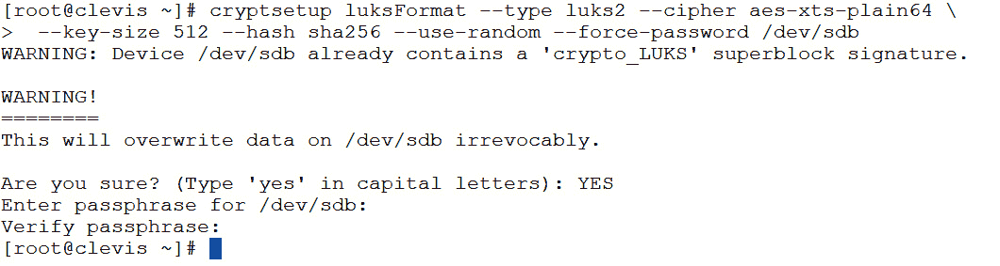

图 9.6 – 加密磁盘

执行命令时，系统还会提示输入密码短语。**请不要丢失此密码**，否则您将无法手动解密磁盘。

1.  接下来，使用之前保存的密码短语手动解锁磁盘，命令如下：

    ```
    /dev/mapper:

    ```

    [root@clevis ~]# ls /dev/mapper/datadisk1

    /dev/mapper/datadisk1 就像任何正常的磁盘一样。在本例中，我们将在 /dev/mapper/datadisk1 上创建一个 xfs 文件系统：

    ```
    /data:

    ```

    blkid 命令。UUID 将用于标识磁盘，以便稍后解密：

    ```
    [root@clevis ~]# blkid -s UUID  /dev/mapper/datadisk1
    fstab entry with the following command:

    ```

    echo "UUID=58c9f051-f243-4c42-af4f-62d2e3e3b90f /data xfs defaults 0 0" | sudo tee -a /etc/fstab

    ```

    ```

    ```

    ```

    ```

    ```

1.  现在我们可以使用以下命令挂载磁盘：

    ```
    mount /data
    ```

1.  接下来，我们需要使用 Clevis 通过以下命令将 Tang 密钥绑定到设备。我们将通过以下命令行传递设备和 Tang 服务器的信息。您需要使用现有的 LUKS 密码将密钥添加到 Tang：

    ```
    [root@clevis ~]# clevis luks bind -d /dev/sdb tang '{"url":"http://tang.m57.local"}'
    Warning: Value 512 is outside of the allowed entropy range, adjusting it.
    The advertisement contains the following signing keys:
    RxdbjAY7_N19UEYBO6XIUVosv0s
    Do you wish to trust these keys? [ynYN] Y
    1: is populated with a key:
    ```

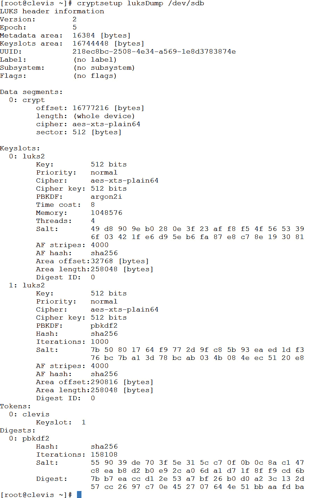

图 9.7 – 使用第二个插槽的 LUKS

1.  接下来，我们需要配置磁盘，以便在启动时自动解密该驱动器。我们首先需要获取加密驱动器的新 UUID：

    ```
    [root@clevis ~]# blkid -s UUID  /dev/sdb
    /dev/sdb: UUID="218ec8bc-2508-4e34-a569-1e8d3783874e"
    ```

1.  接下来，启用 Clevis 服务：

    ```
    /etc/crypttab file. The crypttab file contains a list of all encrypted drives:

    ```

    /etc/fstab 文件用于文件系统，将默认设置更改为 _netdev。这将允许设备在其他非加密文件系统后进行挂载。

    ```

    ```

1.  `/etc/fstab` 应该类似于以下截图，其中加密驱动器的 UUID 作为 `_netdev` 挂载：

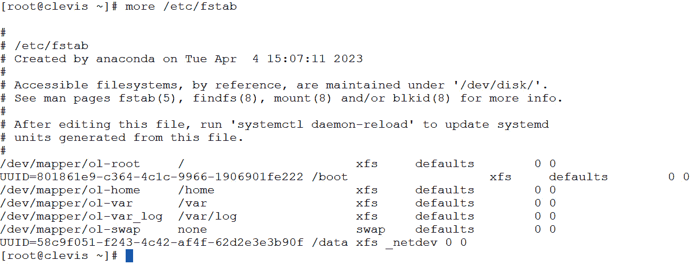

图 9.8 – fstab

## 工作原理…

Clevis 和 Tang 都是软件工具，用于在 Linux 系统的启动过程中自动解锁和解密磁盘。

这里简要概述了它们的工作原理：

1.  在启动过程中，系统会提示用户输入密码短语以解锁和解密磁盘。

1.  使用 Clevis 和 Tang 后，系统提示会被一个自动化过程所取代，通过基于网络的密钥服务器解锁并解密磁盘。

1.  Clevis 和 Tang 协同工作，创建一个加密磁盘与密钥服务器之间的*绑定*。这个绑定基于一个*策略*，该策略指定了解锁磁盘的条件。

1.  当系统启动时，它会联系密钥服务器，并请求加密磁盘的解密密钥。密钥服务器检查策略，以确定是否满足解锁磁盘的条件。

1.  如果符合政策条件，密钥服务器会向系统发送解密密钥，系统随后使用该密钥解锁并解密磁盘。

1.  如果不符合政策条件，密钥服务器会拒绝解密密钥请求，磁盘将保持加锁状态。

### 还有更多…

可选地，您还可以修改系统，以允许管理员在系统启动时手动输入初始密码。为此，请安装 `clevis-dracut`：

```
dnf install -y clevis-dracut
```

然后，重新构建启动文件：

```
dracut -fv
```

当系统启动时，您将有机会手动输入密码：

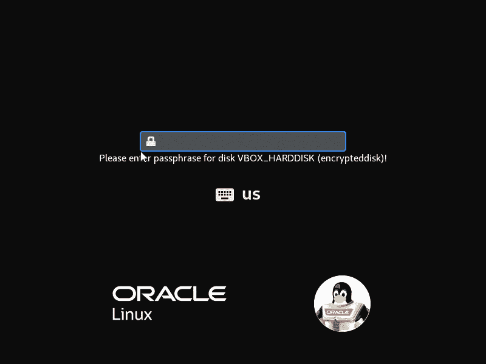

图 9.9 – 手动输入密码短语

现在，您已经有了一个加密的文件系统，并且具备自动解密的方法，同时还提供了应急情况下使用的手动解密方法。

# 验证是否遵守合规性政策

系统安全不仅仅是加密静态数据或传输中的数据。许多配置文件和其他常见的安全设置也应当检查。这可以通过使用**安全内容自动化协议**（**SCAP**）文件自动完成。SCAP 是一个标准化框架，用于自动化维护计算机系统安全的过程。它是一套规范，提供了一种标准化的安全自动化方法，使组织能够在其 IT 基础设施中实施一致且可重复的安全实践。

SCAP 定义了一种用于传递与安全相关的信息的通用语言，使得来自不同厂商的安全工具和产品可以无缝协同工作。它包括一套标准和指南，用于创建和共享安全内容，如漏洞数据、安全检查表和配置基线。SCAP 的一些关键组件包括**常见漏洞和暴露**（**CVE**）数据库，用于识别和追踪已知的安全漏洞，以及**常见配置枚举**（**CCE**）数据库，提供一种标准化方法来识别与安全相关的配置设置。

最简单的方法是使用一个名为 OpenSCAP 的工具，它附带 Oracle Linux。

## 准备就绪

与其他测试一样，我们需要一个 Oracle Linux 系统来进行操作。只需要该系统能够访问`dnf`仓库以安装附加软件包。

## 如何操作…

第一步是安装 OpenSCAP，通常通过安装整个工具套件来完成：

+   `scap-workbench`：图形界面

+   `openscap-scanner`：扫描系统

+   `openscap`：OpenSCAP 核心

+   `openscap-utils`：几个用于扫描系统和容器的命令行工具

+   `scap-security-guide`：常用 SCAP 文件

通过以下命令使用`dnf`来完成此操作：

```
dnf install -y scap-workbench
```

一旦安装了 OpenSCAP，你可以通过两种方式运行该工具：通过图形界面（GUI）或使用命令行。要启动图形界面，运行`scap-workbench`。这将启动一个易于使用的 GUI，允许你运行扫描。

注意

如果你安装了`scap-workbench`且没有安装 X11，`dnf`将会安装它。如果你的服务器上不使用 X11，可以考虑在 WSL Oracle Linux 系统或安装了 X11 的系统上安装`scap-workbench`。你也可以在 Windows 桌面上安装 SCAP Workbench。Windows 版本的下载可以在 Open SCAP 网站找到，[`www.open-scap.org/`](https://www.open-scap.org/)。

## 它是如何工作的……

虽然许多用户使用图形界面（GUI），但你也可以使用命令行。

当图形界面启动时，你需要选择你希望扫描的系统类型。在这里，使用的是 OL8：

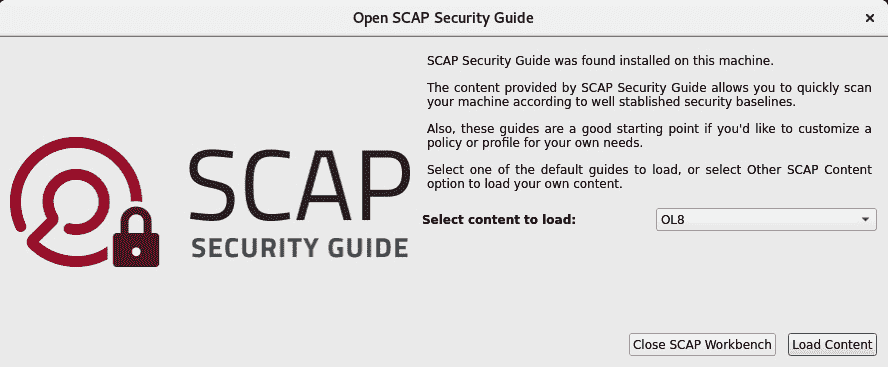

图 9.10 – 工作台启动

接下来，选择你希望用于扫描的配置文件。配置文件是你要进行对比的标准。你必须选择其中一个配置文件才能继续：

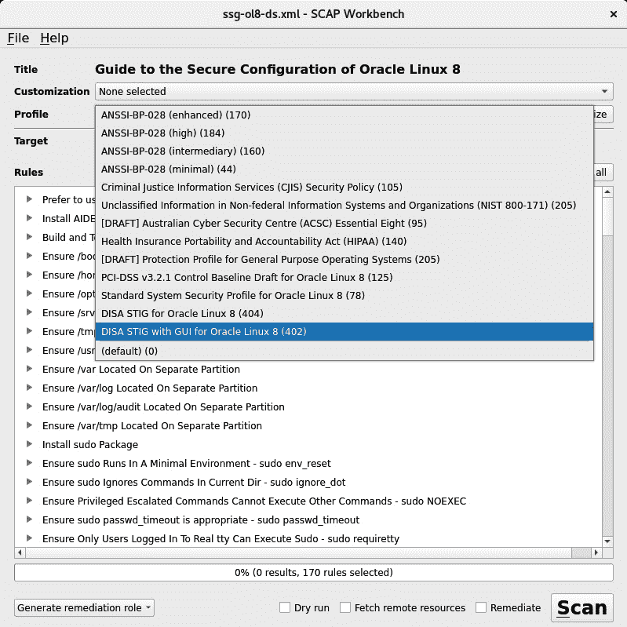

图 9.11 – SCAP 配置文件

所包含的配置文件类别如下：

+   **ANSSI-BP**：ANSSI-BP 是由**法国国家信息系统安全局**（**ANSSI**）制定的一套安全建议，旨在为信息系统的安全提供指导。ANSSI-BP 建议涵盖了广泛的主题，包括网络安全、安全软件开发、访问控制、加密技术、事件响应和安全监控。

+   **CJIS**：**犯罪司法信息服务**（**CJIS**）是美国**联邦调查局**（**FBI**）的一个部门。CJIS 部门负责向执法机构提供对刑事司法信息系统的访问，包括犯罪记录、指纹和其他相关信息的数据库。CJIS 部门成立于 1992 年，向美国超过 18,000 个执法机构提供服务。其使命是为执法官员提供准确及时的信息，帮助他们解决和预防犯罪，同时确保信息的隐私和安全。

+   **NIST-800**：NIST-800 是由美国**国家标准与技术研究院**（**NIST**）制定的一系列信息安全指南和标准。NIST-800 系列包括一套出版物，提供有关信息安全的各个方面的指导，如风险管理、安全控制和事件响应。NIST-800 系列被政府机构、私营部门组织和其他实体广泛使用，以提高其信息系统的安全性。该系列的出版物会定期更新，以反映威胁环境的变化和安全技术的进步。

+   **ACSC**：**澳大利亚网络安全中心**（**ACSC**）是一个政府机构，负责提升澳大利亚政府、企业和社区的网络安全能力和韧性。ACSC 成立于 2014 年，是**澳大利亚信号局**（**ASD**）的一部分。

+   **HIPAA**：**健康保险可携带性和责任法案**（**HIPAA**）是美国的一部联邦法律，旨在保护医疗健康信息。该法律建立了保护个人健康相关信息的隐私和安全的标准。HIPAA 包括针对**电子受保护健康信息**（**ePHI**）的具体要求，ePHI 是指存储或传输的电子健康信息。

+   **PCS-DSS**：**支付卡行业数据安全标准**（**PCI-DSS**）是一套由主要信用卡公司制定的安全标准，确保有权访问信用卡信息的组织保护持卡人数据的机密性和完整性。PCI-DSS 旨在减少数据泄露和信用卡欺诈的风险。

+   **STIG**：**STIG** 代表 **安全技术实施指南**，是一套由美国 **国防信息系统局**（**DISA**）为保障 **国防部**（**DoD**）使用的信息系统和软件安全而制定的指南。STIG 提供了有关如何配置和维护各种技术，以满足 DoD 安全要求并确保系统对抗网络攻击的详细信息。

在选择标准时，你可以使用默认的通用标准（例如，*Oracle Linux 8 的标准系统安全配置文件*，可在 [`static.open-scap.org/ssg-guides/ssg-ol8-guide-standard.html`](https://static.open-scap.org/ssg-guides/ssg-ol8-guide-standard.html) 查找），或者选择与工作负载相符的标准。例如，对于医疗行业，HIPAA 可能是合适的标准。如果你在美国联邦政府生态系统中，STIG 标准在国防部以外的地方也被广泛使用。一旦选择了标准，你将有几个额外选项，如下图所示。你可以选择本地或远程机器，以及修复角色。修复角色允许系统在可能的情况下自动解决问题，但任何管理员在使用时都应该小心。因为许多标准可能会破坏系统功能。在自动修复问题时，尤其是在更严格的标准（如 STIG 和 CJIS）下，务必小心。

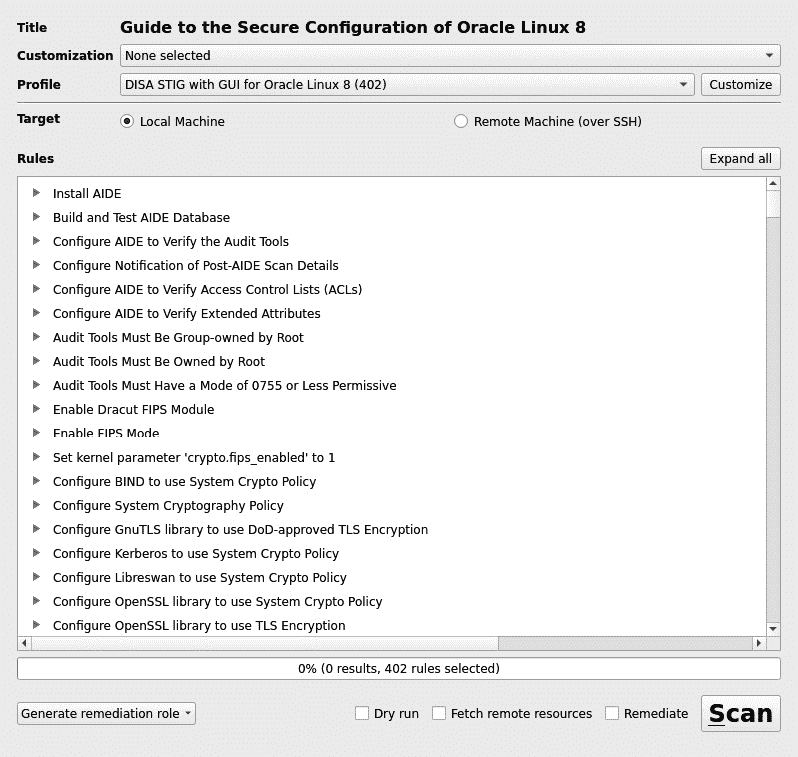

图 9.12 – 扫描设置

一旦做出选择，点击**扫描**。

根据所使用的标准，扫描可以在几秒钟内完成，或者可能需要超过 20 分钟。扫描完成后，你可以使用图形界面（GUI）查看结果：

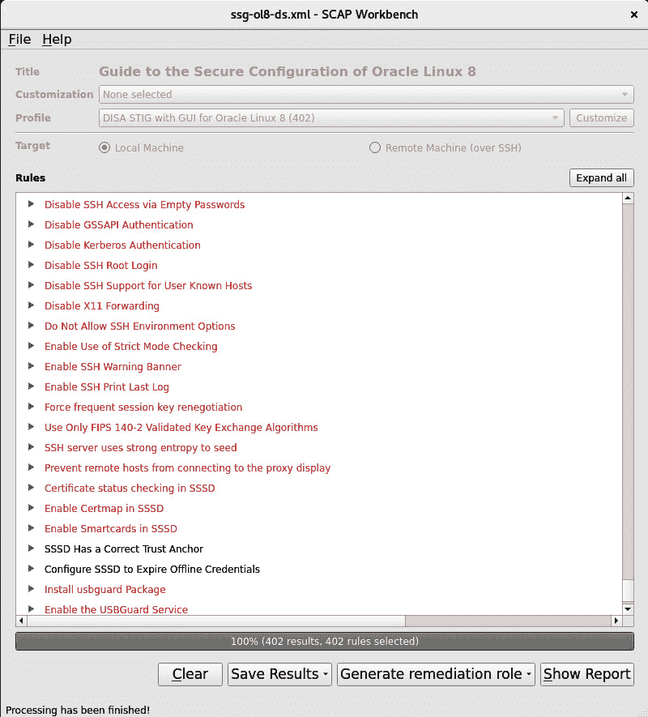

图 9.13 – 扫描结果

并非所有修复都仅涉及更改简单的设置。有些可能需要额外的文件系统或内核设置。要查看某项发现的详细信息，只需展开结果，如下图所示：

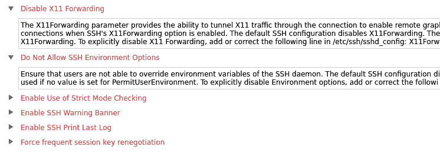

图 9.14 – 结果详情

在总结的底部，你有几个选项：


图 9.15 – 报告选项

这些选项如下：

+   **保存结果**：将结果保存为 HTML 文件、**资产报告文件**（**ARF**）文件或**可扩展配置检查清单描述格式**（**XCDDF**）文件

+   **生成修复角色**：生成 bash、Ansible 或 Puppet 格式的脚本，以自动修复服务器问题

+   **显示报告**：在浏览器中打开 HTML 格式的报告

# 端口保护和限制网络访问

Oracle Linux 系统内置了一个防火墙。这个防火墙叫做 **firewalld**，即 **防火墙守护进程** 的简称。firewalld 是一个动态防火墙管理工具，广泛用于 Linux 系统，提供了一种简单而一致的方式来管理不同发行版上的防火墙规则。它的设计旨在使管理员能够灵活、高效地管理防火墙规则。

## 准备就绪

与其他测试一样，我们需要一个 Oracle Linux 系统进行实验。其他没有特别要求。该系统在大多数安装中默认启用。要检查守护进程的状态，可以使用 `systemctl` 命令，如下所示：

```
systemctl status firewalld
```

输出显示在以下截图中：

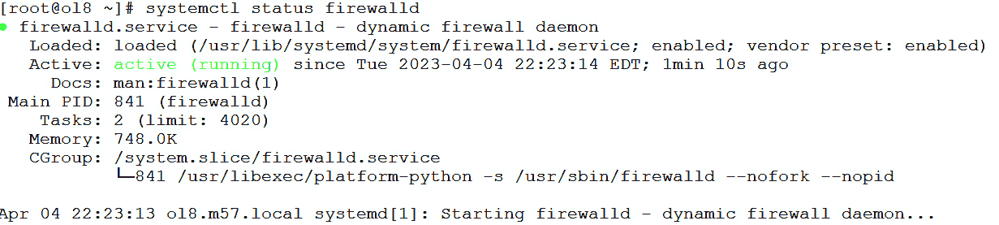

图 9.16 – firewalld 状态

## 如何做…

您可以使用带有 `--list-all` 选项的 `firewall-cmd` 来查看当前配置：

```
[root@ol8 ~]# firewall-cmd --list-all
```

将显示以下信息：

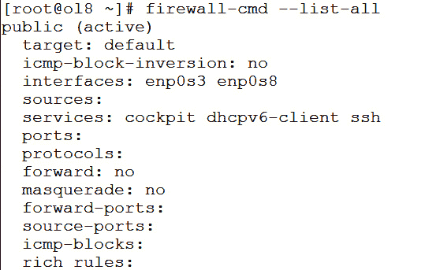

图 9.17 – firewall-cmd --list-all

上述命令的输出显示了由 firewalld 管理的 Linux 系统上活动防火墙规则和配置的综合摘要。输出被组织成多个部分：

+   `public`（活动）：此行显示活动防火墙区域的名称，在此示例中为公共区域。当出现 `Target:default` 时，表示这是默认区域，并且当前处于活动状态。

+   `interfaces: enp0s3 enp0s8`：此行显示分配给活动防火墙区域的网络接口。在此示例中，`enp0s3` 和 `enp0s8` 两个接口都分配给了公共区域。

+   `sources`：此行显示允许访问防火墙区域的 IP 地址或网络范围。如果没有定义源，这一行将为空。

+   `services: cockpit dhcpv6-client ssh`：此行列出了允许访问防火墙区域的服务。在此示例中，允许来自 cockpit、`dhcpv6-client` 和 `ssh` 服务的传入流量。

+   `ports`：此行显示允许访问防火墙区域的 TCP 和 UDP 端口。如果没有定义端口，这一行将为空。

+   `protocols`：此行显示以协议级别管理的协议，如 TCP/UDP/ICMP。

+   `forward`：显示是否启用了区域转发。

+   `masquerade: no`：此行指示防火墙区域是否启用了或禁用了伪装。伪装允许一个网络的包看起来像是来自另一个网络。

+   `forward-ports`：此行显示为防火墙区域定义的任何转发端口。转发端口允许将特定端口上的传入流量重定向到另一个端口或 IP 地址。

+   `source-ports`：此行显示为防火墙区域定义的任何源端口。源端口允许将来自特定端口的传入流量重定向到不同的端口或 IP 地址。

+   `icmp-blocks`：此行显示防火墙阻止的任何**互联网控制消息协议**（**ICMP**）数据包。ICMP 数据包用于网络诊断和故障排除。

+   `rich rules`：此行显示为防火墙区域定义的任何丰富规则。丰富规则允许使用类似于`iptables`语法的语法定义更复杂的规则。

添加新规则很容易做到。可以使用服务名称（在`/etc/services`文件中找到）或端口号来添加规则。最常见的任务是添加一个常见的用户服务，如`http`或`mysql`。这可以通过向命令中添加`--add-service`选项来完成。当服务添加后，除非添加了`--permanent`选项，否则配置不会在重启后保存。一些常见的示例如下：

```
firewall-cmd --permanent --add-service=http
firewall-cmd --permanent --add-service=imap
firewall-cmd --permanent --add-service=pop
firewall-cmd --permanent --add-service=mysql
```

可选地，你可以指定协议和端口来允许该服务。以下是添加 TCP 或 UDP 端口的示例：

```
firewall-cmd --permanent --add-port=1521/TCP
firewall-cmd --permanent --add-port=6900/UDP
```

你还可以使用`--remove-port`或`--remove-service`选项来移除端口或服务：

```
firewall-cmd --permanent --remove-service=pop
firewall-cmd --permanent --remove-port=6900/UDP
```

完成修改后，你需要重新加载防火墙规则。这可以通过`--reload`选项完成：

```
firewall-cmd --reload
```

## 它是如何工作的…

firewalld 基于 netfilter 框架，netfilter 是一组钩子，允许网络数据包由内核进行过滤。这个框架用于在许多 Linux 系统上实现 iptables 防火墙。firewalld 提供了 netfilter 框架的更高级抽象，允许管理员通过服务、端口和协议来定义规则，而不是直接操作 iptables 规则。firewalld 的一个关键优势是能够定义匹配多个属性的防火墙规则。例如，管理员可以定义一个规则，匹配源 IP 地址、目标 IP 地址、协议和端口号。这允许更精细地控制网络流量，并使得定义复杂的防火墙策略变得更加容易。

firewalld 还允许管理员根据网络区域定义防火墙规则。区域是被分配特定信任级别的一组网络接口。例如，管理员可能会为暴露在互联网的网络接口定义一个公共区域，为仅能从可信内部网络访问的网络接口定义一个受信任区域。每个区域可以有自己的一组防火墙规则，允许管理员对不同的网络接口应用不同的策略。

# 保持 SELinux 活跃

**SELinux**，或称为**安全增强型 Linux**，是一个提供 **强制访问控制**（**MAC**）策略的安全模块，运行在 Linux 内核中。它之所以必要，是因为它通过对系统上进程和用户可以执行的操作实施严格的规则，提供了更高等级的安全性。默认情况下，Linux 使用 **自主访问控制**（**DAC**），这意味着任何用户或进程只要拥有适当的权限，就可以访问任何文件或资源。这可能导致安全漏洞，因为任何被攻破的进程或用户都可能访问和修改敏感数据或系统文件。

SELinux 通过强制实施强制访问控制策略，增加了一层额外的安全性，这些策略根据进程或用户的安全上下文限制对文件和资源的访问。这意味着即使一个进程或用户具有适当的权限，他们也只能访问 SELinux 策略明确允许的资源。

本教程将介绍如何创建自定义 SELinux 策略，而不是禁用它，并且如何允许服务执行诸如绑定低端口（<`1024`）之类的操作。

## 准备工作

和其他测试一样，我们将需要一个 Oracle Linux 系统来进行操作。其他没有特别的要求。大多数安装默认启用了该系统。要查看 SELinux 的状态，可以使用命令 `getenforce`。该命令会返回当前的活动状态。状态有三种：

+   `enforcing` – SELinux 处于活动状态，并且阻止不允许的操作

+   `permissive` – SELinux 已启用，但不会阻止任何活动

+   `disabled` – SELinux 已禁用

如果你安装了 `setools`，可以使用 `dnf` 来获得其他命令：

```
dnf install -y setools-console
```

你还可以使用命令 `sestatus` 来获取有关 SELinux 的更多信息：

```
[root@ol8 ~]# sestatus
SELinux status:                         enabled
SELinuxfs mount:                    /sys/fs/selinux
SELinux root directory:             /etc/selinux
Loaded policy name:              targeted
Current mode:                    enforcing
Mode from config file:           enforcing
Policy MLS status:               enabled
Policy deny_unknown status:     allowed
Memory protection checking:     actual (secure)
Max kernel policy version:       31
```

你还可以使用 SELinux 类型来管理资源。SELinux 类型是用于对 Linux 系统中各种资源进行分类的标签，例如进程、文件、目录和网络端口。SELinux 类型是 SELinux 安全策略的重要组成部分，因为它们决定了哪些进程和用户可以访问系统上的特定资源。

有几种类型的 SELinux 类型，包括以下几种：

+   **用户类型**：用户类型用于定义用户的安全上下文。它们还用于将用户的操作限制在系统上特定资源的集合内。

+   **角色类型**：角色类型用于定义角色的安全上下文。它们还用于将用户的操作限制在系统上特定资源的集合内。

+   **域类型**：域类型用于定义进程的安全上下文。系统上的每个进程都会被分配一个唯一的域类型，该类型决定了进程可以访问哪些资源。

+   **类型强制类型**：类型强制类型用于定义文件或目录的安全上下文，并将进程的操作限制在系统上特定资源的集合内。

+   **网络端口类型**：网络端口类型用于定义网络端口的安全上下文。网络端口类型用于限制系统上特定端口或服务的网络访问。

除了这些类型外，SELinux 还有几个特殊类型，例如 `unconfined_t` 类型，用于没有被 SELinux 限制的进程，和 `system_u` 与 `root_t` 类型，分别用于系统资源和进程。

## 如何操作…

可以使用命令 `setenforce` 配合参数 `1` 或 `0` 动态更改 SELinux 的状态。使用 `1` 会将 SELinux 设置为 `enforcing` 模式，而 `0` 会将其设置为 `permissive` 模式。

此外，你可以编辑配置文件 `/etc/selinux/config`，并将 SELinux 字段设置为三种状态之一。这也是禁用 SELinux 的唯一方法。

虽然许多管理员都倾向于禁用 SELinux，但它可以轻松地更新以允许所需的行为。

SELinux 默认情况下还会将日志记录到 `/var/log/audit/audit.log` 文件中。

## 它是如何工作的…

SELinux 有多个安全层次，用于管理文件、端口和内核模块。它们都由 `semanage` 命令管理。

### semanage

`semanage` 是一个命令行工具，用于管理 Linux 系统中的 SELinux 策略。它用于创建、修改或删除 SELinux 策略，还可以管理文件上下文和网络端口。以下是 `semanage` 命令的一些常见用途：

+   `semanage` 可用于创建、修改或删除策略模块。例如，你可以使用以下命令创建一个新的策略模块：

    ```
    kernelmodule.pp to the SELinux policy.
    ```

+   `semanage` 可用于管理文件上下文，包括添加或修改特定文件或目录的上下文。例如，你可以使用以下命令添加一个新的文件上下文：

    ```
    /var/www/html.
    ```

+   `semanage` 可用于管理网络端口和服务，包括添加或修改端口类型和策略。例如，你可以使用以下命令定义一个新的端口类型：

    ```
    www2 for TCP port 8080.
    ```

+   `setsebool`：SELinux 有布尔变量，可以启用或禁用，以控制特定的安全策略。要更改这些变量的值，可以使用 `setsebool` 命令启用或禁用某些 SELinux 策略。一个有用的示例是，当你将 `httpd_can_network_connect` 设置为 true 来允许 Web 服务器时：

    ```
    getsebool: To view the status of SELinux policies, you can use the getsebool command. This command displays Boolean variables that can enable or disable certain policies. To view all values, use the -a option. Alternatively, you can pass a specific value to check, as shown in this example:

    ```

    getsebool httpd_can_network_connect

    httpd_can_network_connect --> off

    ```

    ```

### SELinux fixfiles

SELinux `fixfiles` 是一个命令行工具，用于恢复文件和目录的 SELinux 文件上下文。SELinux 使用文件上下文来确定哪些进程和用户可以访问系统中的特定文件或目录。当文件上下文被更改或损坏时，可能会导致系统功能或安全问题。`fixfiles` 命令用于将文件上下文恢复为默认值。这在遇到文件访问或 SELinux 相关错误时非常有用。以下是一些常见的 `fixfiles` 命令使用方式：

+   **恢复目录的默认文件上下文**：要恢复特定目录的默认文件上下文，可以使用以下命令：

    ```
    fixfiles restore /directory_to_fix
    ```

    这将递归地恢复指定目录内所有文件和目录的默认文件上下文。

+   **恢复整个系统的默认文件上下文**：要恢复整个系统的默认文件上下文，请运行以下命令：

    ```
    fixfiles restore
    ```

    这将恢复系统中所有文件和目录的默认文件上下文。请注意，这可能需要一些时间才能完成，并且可能会导致系统功能的暂时中断。

+   **验证文件上下文**：您可以使用以下命令验证特定文件或目录的文件上下文：

    ```
    fixfiles command to restore the default context.
    ```

注意

如果 SELinux 曾在某段时间内被禁用，那么在其未运行期间，这些上下文将未被设置。可以使用一个快捷方式让 SELinux 重新标记整个文件系统层次结构：`# touch /.autorelabel`

现在重启机器。随着 SELinux 的启动，它将为每种类型和位置的文件和安全上下文设置默认值。

### SELinux 用户

SELinux 用户是用来分类 Linux 系统中不同类型用户的标签。SELinux 用户是 SELinux 安全策略的重要组成部分，因为它们用于将用户的操作限制在系统中一组特定的资源上。

有几种类型的 SELinux 用户：

+   **系统用户**：系统用户是由系统定义的用户，用于运行系统服务或守护进程。这些用户通常会被分配一个独特的 SELinux 用户标签，用于将用户的操作限制在系统中一组特定的资源上。

+   **登录用户**：登录用户是由系统定义的用户，用于登录系统。这些用户通常会被分配一个独特的 SELinux 用户标签，用于将用户的操作限制在系统中一组特定的资源上。

+   **工作人员用户**：工作人员用户是由系统定义的用户，由工作人员用于执行他们的工作。这些用户通常会被分配一个独特的 SELinux 用户标签，用于将用户的操作限制在系统中一组特定的资源上。

+   **用户定义的用户**：用户定义的用户是由系统管理员定义的用户。这些用户通常会被分配一个独特的 SELinux 用户标签，用于将用户的操作限制在系统中一组特定的资源上。

下面是一些常用的 SELinux 用户命令：

+   `semanage user`：此命令用于管理 SELinux 用户及其属性。例如，要创建一个新的 SELinux 用户，可以使用命令 `semanage user -a -R "s0-s0:c0.c1023" -r s0 -L s0:c0.c1023 -P user -n username`。

+   `semanage login`：此命令用于管理 SELinux 登录映射，它将系统用户映射到 SELinux 用户。例如，要创建一个新的登录映射，可以使用命令 `semanage login -a -s user_u -r s0 username`。

+   `semanage staff`：此命令用于管理 SELinux 员工映射，它将员工用户映射到 SELinux 用户。例如，要创建一个新的员工映射，可以使用命令 `semanage staff -a -s user_u -r s0 username`。

+   `semanage sudo`：此命令用于管理 SELinux sudo 映射，它将 sudo 用户映射到 SELinux 用户。例如，要创建一个新的 sudo 映射，可以使用命令 `semanage sudo -a -r s0 -R "s0-s0:c0.c1023" -L s0:c0.c1023 -U username`。

+   `semanage port`：此命令用于管理 SELinux 端口映射，它将端口映射到 SELinux 类型。例如，要创建一个新的端口映射，可以使用命令 `semanage port -a -t http_port_t -p tcp 80`。
