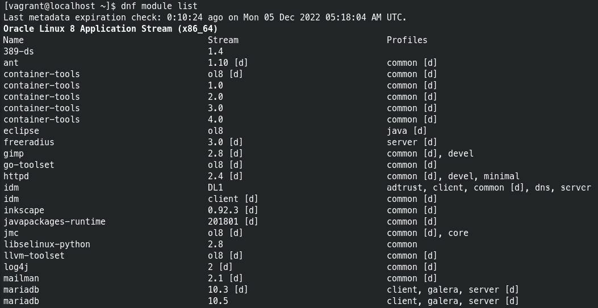
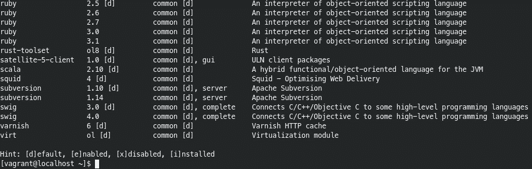
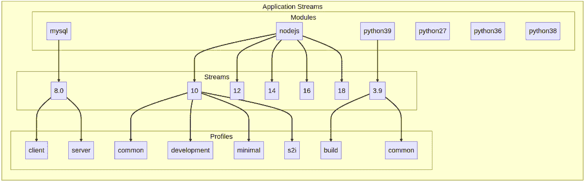
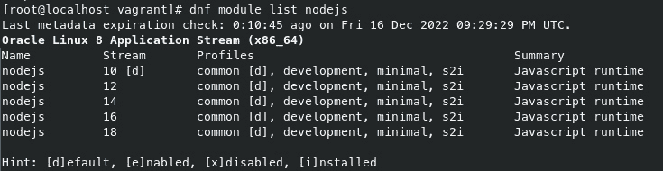
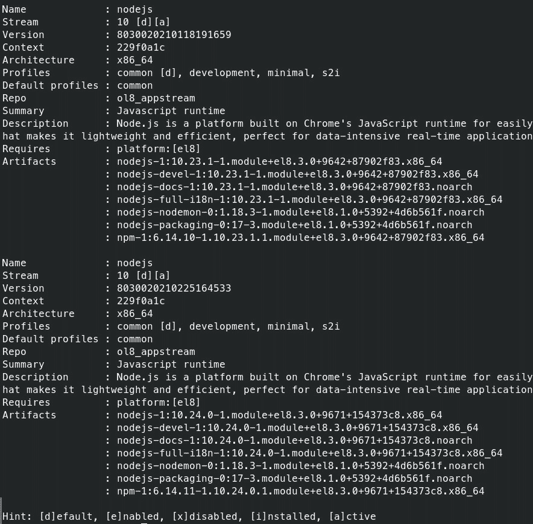
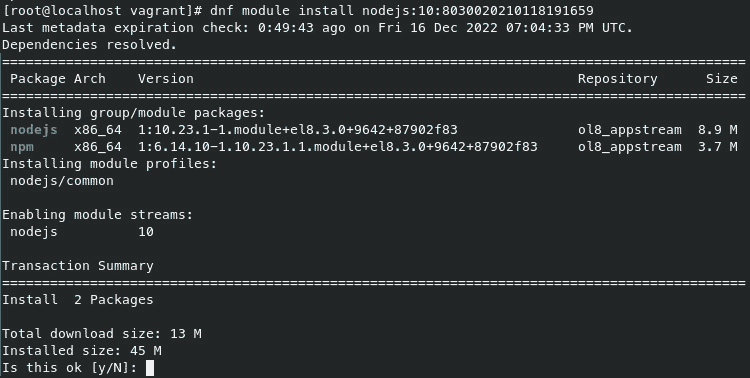
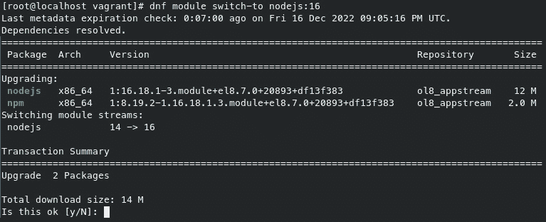
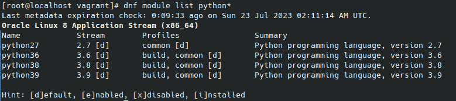
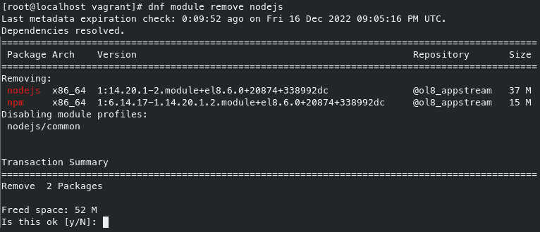
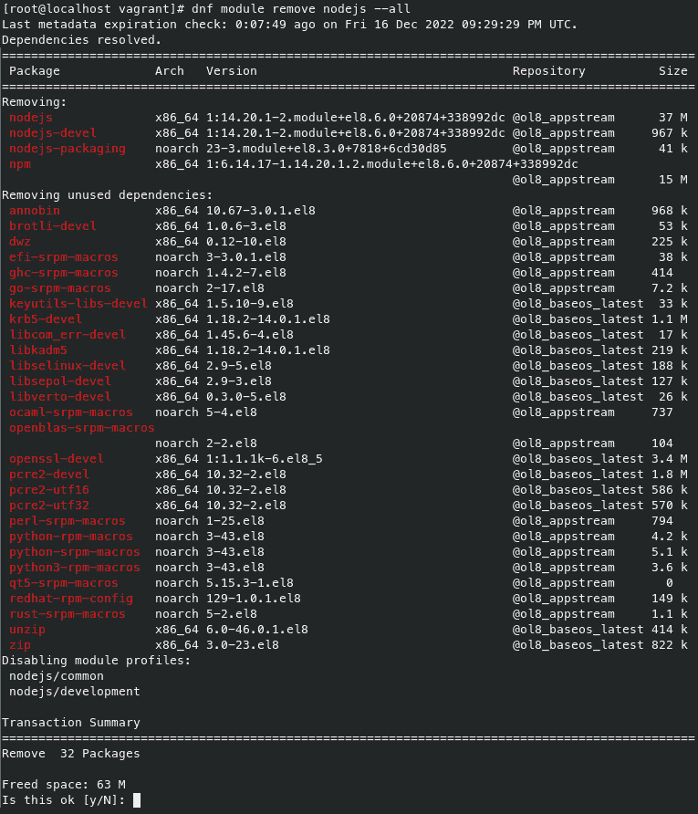

# 重新回顾模块和 AppStreams

在本章中，我们将进一步了解**模块**和**应用流**（**AppStreams**）。我们在*第五章*《使用 DNF 进行软件管理》中讨论了新的仓库组织结构和模块化概念，但现在我们将通过以下教程深入探索 AppStreams 的真正功能：

+   搜索和列出 AppStream 模块

+   通过 AppStream 安装应用程序和开发工具

+   使用 AppStreams 安装不同版本的软件

+   通过 AppStream 移除软件包

# 技术要求

AppStreams 的概念是新的，并且是在 Oracle Linux 8 中引入的。也就是说，只要你使用的是 Oracle Linux 8，你就能拥有在本章中跟随操作所需的所有条件。

# 搜索和列出 AppStream 模块

首先，让我们回顾一下与模块相关的命令列表：

+   `disable`：禁用一个模块及其所有流

+   `enable`：启用一个模块流

+   `info`：打印关于模块的详细信息

+   `install`：安装一个模块配置文件及其包

+   `list`：列出所有模块流、配置文件和状态

+   `provides`：列出模块化包

+   `remove`：移除已安装的模块配置文件及其包

+   `repoquery`：列出属于某个模块的包

+   `reset`：重置模块

+   `switch-to`：将模块切换到某个流并进行*distrosync* RPM 包同步

+   `update`：更新与活动流相关的包

## 如何操作…

AppStreams 非常易于使用。要开始使用，通常最好先检查可用模块的列表。你可以通过在终端/控制台输入一个简单的命令`dnf module list`来完成此操作：



图 10.1 – dnf module list 的输出

输出继续显示一个相当长的模块列表，最后你将看到不同字母含义的键映射：



图 10.2 – 通过提示查看模块键映射

以下是几个我立刻注意到的模块：`container-tools`、`gimp`、`go-tools`、`inkscape`、`mariadb`、`mysql`、`nginx`、`nodejs`、`python`和`php`。这些是模块，但你会发现每个模块都有一个流，而每个流包含一个配置文件。如果我们将其可视化成图表，它可能看起来像这样：



图 10.3 – 可视化 AppStreams

现在，假设我们想要获取某个特定模块的更多信息。以`nodejs`为例。首先，我们需要在请求列表时指定`nodejs`。我们可以通过将模块名称添加到`list`命令后面来做到这一点，如下所示：



图 10.4 – dnf module list nodejs 的输出

在列表的底部，你将看到以下内容：

```
Hint: [d]efault, [e]nabled, [x]disabled, [i]nstalled
```

从中我们可以看到，流 `10` 被标记为 `nodejs` 的默认（`d`）。这到底是什么意思？基本上，如果我们运行 `dnf module install nodejs`，我们将得到流 10 中的最新版本 Node.js（是的，流 `10` 对应的是 Node.js 10）。

注意

在写作时，Node.js 10 系列流的最新版本是**nodejs-1:10.24.0-1.module+el8.3.0+9671+154373c8.x86_64**。

我们可以进一步探索并通过输入以下命令来了解更多有关此特定 AppStream 的信息：

```
# dnf module info nodejs:10
```

该命令的输出将显示 10 系列流中每个可用的 Node.js 版本。虽然有很多，但为了简洁起见，我只粘贴了列表中的最后两个版本：



图 10.5 – dnf module info nodejs:10 的输出

有趣的是，10 系列中的每个流都被标记为`[d][a]`（默认和活动）；这是因为 `Stream` 项是指流本身，而不是流中的任何特定版本。

# 通过 AppStream 安装应用程序和开发工具

从之前的食谱中，我们已经熟悉了如何在 AppStream 中搜索和列出应用程序；现在让我们深入了解通过 AppStream 安装应用程序和开发工具。

## 如何做...

基于上一个食谱，我们研究了`nodejs`，现在让我们继续安装它。安装它的方法有不止一种。你可以启用该模块，然后使用标准的`dnf install [package(s)]`命令来安装软件包：

```
# dnf module enable nodejs
# dnf install nodejs npm
```

你也可以使用标准的 `dnf` 命令而不指定模块，默认模块将在事务中启用：

```
# dnf install nodejs npm
```

或者，更推荐的方式是直接使用新的 `dnf module` 命令集，简单地运行 `dnf module install [module name(s)]`：

```
# dnf module install nodejs
```

输出如下面的截图所示：



图 10.6 – dnf module install nodejs 的输出

你得到的是默认 AppStream 中的最新版本（如果没有启用任何模块），但是如果出于某种原因你希望获取流中的旧版本，你可以通过在命令末尾加上冒号和版本号来选择。例如，如果我不想要最新版本，而是想要它之前的版本，我会输入以下命令：

```
# dnf module install nodejs:10:8030020210118191659
```

输出如下面的截图所示：


图 10.7 – dnf module install nodejs:10:8030020210118191659 的输出

这将指示 DNF 安装与指定版本相关的 Node.js（以及相关组件）发行版。

另一个需要注意的点是，默认情况下，只会安装`common`配置文件。如果我们想安装其他配置文件（例如，`development`配置文件），可以通过在命令末尾加上斜杠和配置文件名称来指定：

```
# dnf module install nodejs:10/development
```

输出如下面的截图所示：


图 10.8 – 执行 `dnf module install nodejs:10/development` 的输出

您甚至可以指定多个配置文件，像这样：

```
# dnf module install nodejs:10/development nodejs:10/s2i
```

输出显示在下面的截图中：


图 10.9 – 执行 `dnf module install nodejs:10/development nodejs:10/s2i` 的输出

或者，如果您希望安装所有配置文件，只需使用星号表示通配符选择：

```
# dnf module install nodejs:10/*
```

输出显示在下面的截图中：


图 10.10 – 执行 `dnf module install nodejs:10/*` 的输出

# 使用 AppStreams 安装不同版本的软件

现在，我们将进一步了解 AppStreams，并且不再从默认模块流安装应用程序，而是指定一个不同的流。

## 如何操作…

有多种方法可以做到这一点：只需指定安装不同的流即可，或者您可以先手动启用不同的版本。我的偏好是在安装时指定版本，因为这样，AppStream 会自动启用该版本：

```
# dnf module install nodejs:16
```

注意

如果您已经安装了某个版本的 AppStream，最好在重置并安装不同版本之前移除旧版本。稍后会讲解这个过程。

输出显示在下面的截图中：


图 10.11 – 执行 `dnf module install nodejs:16` 的输出

您会看到从输出中 `nodejs` 16 的模块流将被启用。现在，如果我们列出 `nodejs` 的模块流，我们将看到以下内容：


图 10.12 – 执行 `dnf module list nodejs` 的输出

如您所见，`10` 仍然是默认版本，但 `16` 已启用（`e`）。AppStreams 维护一个默认流，以允许 `dnf` 正常工作，无需用户了解 AppStreams 的任何信息。此外，如果我们重置模块，它将恢复到原始设置——也就是说，`10` 将成为唯一的默认并启用版本，而版本 `16` 将不再启用。值得注意的是，任何时候只能启用一个流。总结一下，默认流在没有启用其他流时会默认启用。如果启用其他流，它将成为唯一可以安装的流，但很容易重置并切换到另一个。要这样做，只需按照以下步骤操作：

```
# dnf module remove nodejs
# dnf module reset nodejs
```

您将看到关于模块已重置的确认信息：

```
Disabling module profiles:
 nodejs/common
Resetting modules:
 nodejs
```

到此为止，我们可以安装不同的版本了。这次我们选择安装 Node.js 14：

```
# dnf module install nodejs:14
```

您将看到关于包管理器计划执行的操作的确认信息：


图 10.13 – dnf module install nodejs:14 的输出

你可能会注意到你正在降级。正如你可能猜到的那样，如果没有安装任何模块，它会显示 `Installing`；如果安装的版本号大于当前安装的版本，它会显示 `Upgrading`；如果安装的版本号小于当前安装的版本，它会显示 `Downgrading`。不管包管理器显示的是在做什么，最终你将得到你请求的版本——就这么简单。

你应该知道其实还有另一种切换到不同流的方法。你可以通过使用 `switch-to` 来一步完成，而不是先使用 `remove`、`reset` 然后再 `install`：



图 10.14 – dnf module switch-to nodejs:16 的输出

这是推荐的切换流版本的方法，因为它只需一步即可完成切换，而且能清晰地打印出正在进行的操作。它的状态是 `Upgrading`，并且正在从 `14 ->` `16`。

注意

其实还有一种方法可以动态切换模块。如果你在 `/etc/dnf/dnf.conf` 中将 `module_stream_switch` 设置为 `True`，那么你可以在不使用 `switch-to` 语法的情况下安装不同的模块。

下面是一个例子：

**echo “module_stream_switch=True” >> /****etc/dnf/dnf.conf**

### 那 Python 呢？

如果你查看模块列表，可能会注意到 Python 包含多个模块，而不是一个包含多个 AppStream 的单一模块：

```
# dnf module list python*
```

输出可以在以下屏幕截图中看到：



图 10.15 – dnf module list python* 的输出

一开始看起来有点奇怪，但考虑到 Python 是 Oracle Linux 操作系统的一个重要组成部分，每个 Oracle Linux 版本都附带一个平台 Python 版本。每个 Oracle Linux 版本的特定平台 Python 版本可能不同，并且每个版本的相应平台 Python 版本将在该版本的整个生命周期内得到支持。对于 Oracle Linux 7，平台 Python 版本是 2.7，并始终安装；而对于 Oracle Linux 8，平台 Python 版本是 3.6。换句话说，Python 2.7 在 Oracle Linux 7 的整个生命周期内得到支持，而 Python 3.6 在 Oracle Linux 8 的整个生命周期内得到支持。在 Oracle Linux 8 上，平台 Python 专门供系统工具（如 Yum 和 DNF）使用。对于一般用途的 Python，不会在 Oracle Linux 8 上默认安装，因此这时 AppStream 模块就发挥了作用。

你可以通过指定与所需 Python 版本相对应的模块，在 Oracle Linux 8 上安装多个版本的 Python。所有 Python 模块可以同时安装并在同一台机器上使用，你可以通过输入版本号来指定希望使用的安装版本——例如，`python3.6 --version`，`python3.8 --version`，等等。

默认情况下，如果系统上安装了`python3`，它总是别名为 Python 3.6，这是因为 Python 3.6 是 Oracle Linux 8 上的平台 Python 版本。

# 通过 AppStream 移除包

通过 AppStream 移除包非常简单。通常，你只需指示包管理器执行移除操作，而不是安装操作。如果包管理器找到一个匹配的模块，它将继续移除相关的包。

## 如何操作……

参考前一个示例中的内容，我们通过运行`dnf module remove nodejs`命令来移除 Node.js 模块：



图 10.16 – 执行 dnf 模块移除 nodejs 的输出

从这条信息中，你可以看到 NPM 将被卸载，但考虑到 Node.js 模块不仅仅安装了 NPM，你可能会有些困惑。如果你想移除与该模块相关的所有内容，你需要添加`--all`标志，像这样：

```
# dnf module remove nodejs --all
```

这次，你将看到所有相关的包都排队等待移除：



图 10.17 – 执行 dnf 模块移除 nodejs --all 的输出

现在这就对了。输入`y`并按*Enter*，模块将被移除。

## 还有更多内容……

所以，既然我们已经讨论了 AppStreams 的使用，你可能会问自己，“*我们之前不是已经通过软件集合实现了类似的功能吗？*” 答案是肯定的，但软件集合和 AppStreams 之间有一个很大的区别。

软件集合提供了平行可用性和平行可安装性，而 AppStreams 仅提供平行可用性。

根据 Fedora 文档，"*平行可用性意味着可以安装多个流行软件项目的主要版本*。” 以及*“平行可安装性意味着同一用户空间中可以安装多个主要版本的一个软件项目。”*

现在你可能会问，“*等一下，你是说 AppStreams 不如我们之前使用的那种好吗？*” 好吧，答案并不完全是这样。事实上，平行可安装性并没有想象中那么好。虽然表面上看，能够在同一系统上安装多个版本的软件似乎很不错，但实际上，它存在一些复杂问题，需要用户知道自己需要做额外的操作才能真正使用已安装的软件和/或备用版本。例如，如果你想安装多个版本的 Node.js，你首先需要启用你想要的 Node.js 软件集合，然后你还需要知道在哪里查找并激活你想使用的特定版本。换句话说，你不能像正常使用软件那样直接使用备用版本，因为这些包会被安装到非标准位置。

AppStreams 解决了这个问题，因为它不允许并行安装性，而是提供并行可用性的能力。换句话说，你一次只安装一个包，然后像平常一样使用它。如果你想要不同的版本，那么你只需启用不同的流。

作为一个奖励，AppStreams 在设计上用于创建单次使用的容器时特别有用。拥有 AppStreams 意味着每个容器镜像都配置有正确版本的模块，然后在容器内部全局可用。如果需要多个版本，只需运行多个容器。

AppStreams 大大简化了安装不同版本软件的过程，而且最棒的是，即使你对 AppStreams 一无所知，你仍然可以像以往一样使用 DNF 安装基本应用程序。
