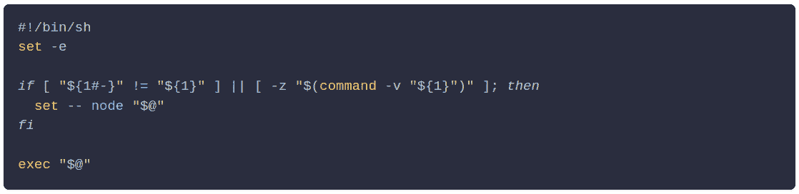
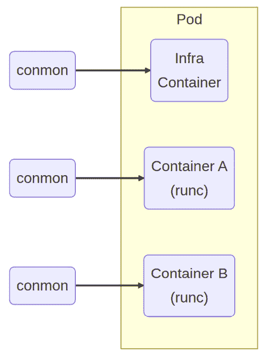
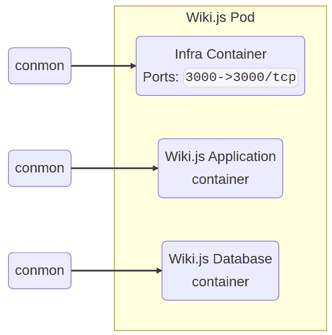
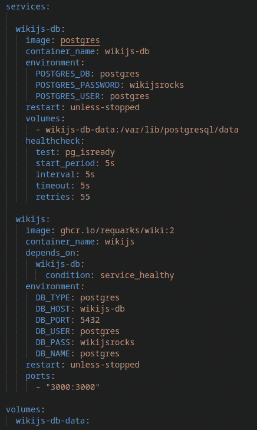
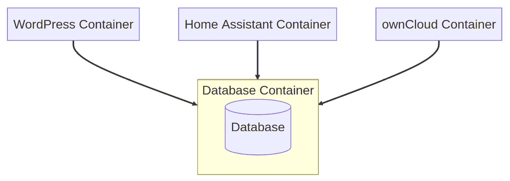
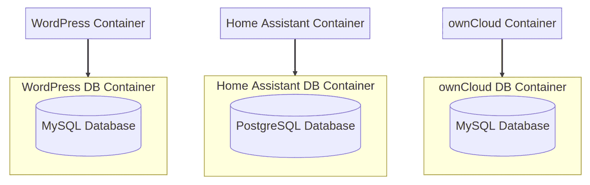
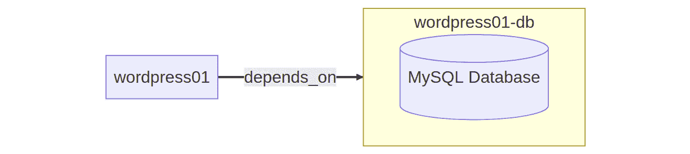
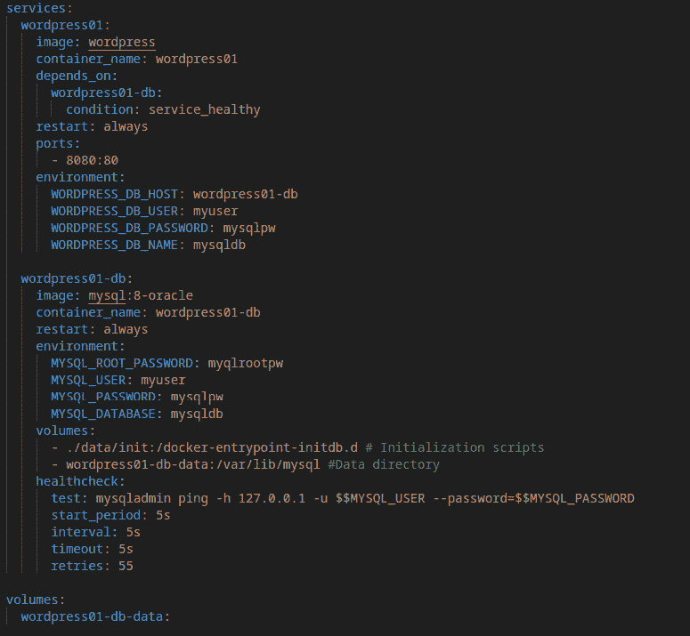
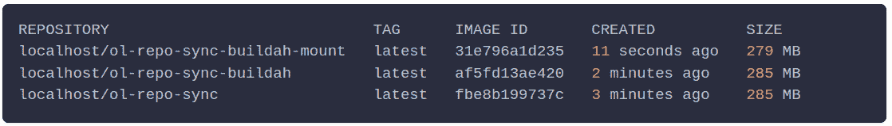

# 第十一章：狮子、老虎和容器——哎呀！Podman 和朋友们

如今，一切都与容器有关。Docker 使容器变得酷并带入主流，而 Podman 作为一个开源的容器运行时，向所有人开放并准备救援。Oracle Linux 7 包括 Oracle Container Runtime for Docker，而 Oracle Linux 8 及以后的版本包括 Podman、Buildah 和 Skopeo。

随着每次新版本的发布，Podman 正在缩小与 Docker 之间的差距。随着 Podman v2.0 的发布，它开始提供一个完全兼容的构建，使得 `docker-compose` 等技术能够与 Podman 互换使用。随着 Podman v4.1.0 的发布，现在可以无缝地将主机机器的 home 目录挂载到 Podman 虚拟机中，使其在容器卷挂载中可用。本章主要面向有一定 Docker 基础的用户，帮助他们理解 Docker 和 Podman 之间的差异，以便成功地将工作负载迁移到这一“即插即用替代品”。如果你不熟悉 Docker 或容器概念，可以查阅 Docker 的入门指南，链接如下：[`docs.docker.com/get-started/`](https://docs.docker.com/get-started/)。

在本章中，我们将涵盖以下食谱：

+   使用 Podman 驱除守护进程（呃，那个……守护进程）

+   给你的容器做根管治疗

+   创建便捷的实用容器

+   使用 Podman 进行 Docker Compose

+   使用 Pod 管理堆栈

+   容器化数据库

+   Buildah 和 Skopeo – Podman 的得力助手

# 技术要求

Podman、Buildah 和 Skopeo 都包含在 `container-tools` 模块中，来自应用流：

```
$ sudo dnf module install container-tools
```

本章中食谱的源代码可以在 [`github.com/PacktPublishing/Oracle-Linux-Cookbook`](https://github.com/PacktPublishing/Oracle-Linux-Cookbook) 找到。

# 使用 Podman 驱除守护进程（呃，那个……守护进程）

Docker 和 Podman 都是旨在简化在主机上运行和管理容器的工具。由于 Podman 是新兴工具，你可能会想知道如何将 Docker 切换到 Podman。虽然技术上可以在同一系统上同时运行 Docker 和 Podman，但实际上几乎没有必要这样做。因为这两个工具提供相同的核心功能，我建议你选择其中一个。

切换到 Podman 的一个主要好处是你将不再使用 Docker 背后潜藏的守护进程。你看，Docker 依赖于一个守护进程，它负责管理容器的所有繁重工作。乍看之下，这似乎没什么问题，但在这种架构下，有些问题是需要注意的。

首先，后台有一个额外的守护进程运行意味着系统会有更多的故障点。如果专门为 Docker 运行的守护进程崩溃，你的所有容器都会丢失。额外的守护进程还会增加攻击面，因为 Docker 守护进程具有 root 访问权限，任何对 Docker 守护进程的攻击都会使系统面临更大风险。

这个方案旨在驱逐那些“恶魔”——呃，嗯——停止使用 Docker 守护进程。最好的部分是，如果你没有使用 Docker，且只安装了 Podman，那么你无需担心任何问题——因为 Podman 默认是无根的，并且它利用 **systemd** 来管理你的容器。**systemd** 是一个经过验证的系统级守护进程，提供了一系列系统组件，包括系统和服务管理器、并行化功能、日志记录，以及用于管理和维护系统配置的工具。

另一方面，如果你之前使用的是 Docker，我们将向你展示如何切换。其实非常简单——你只需移除 Docker 并安装 Podman。

## 准备工作

我使用的是 x86-64 位架构，但 Oracle Linux 和 Podman 也可以在 Arm 上运行。不过，需要注意的是，并不是所有的容器都在 Arm 上编译，反之亦然。话虽如此，使用 x86-64 位 CPU 跟随本指南可能会更容易：

+   Oracle Linux

+   Podman

## 如何操作……

1.  通过运行以下命令来移除 Docker：

    ```
    $ sudo dnf remove -y docker-ce docker-ce-cli containerd.io docker-compose-plugin
    ```

1.  完成后，你将能够通过以下方式安装 Podman：

    ```
    docker group, you may go ahead and delete that group because it is no longer needed:

    ```

    $ sudo groupdel docker

    ```

    ```

现在你已经在没有 Docker 守护进程的情况下运行容器，默认情况下，使用 Podman 时，你是无根用户。

# 给你的容器做个根管治疗

根据 Docker 文档，你会发现“*Docker 守护进程绑定到一个 Unix 套接字，而不是 TCP 端口。默认情况下，这个 Unix 套接字归 root 用户所有，其他用户只能使用 sudo 访问它。Docker 守护进程始终以 root 用户身份运行。*”

文档接着指导你将用户添加到 `docker` 组，以便在不使用 `sudo` 的情况下使用 Docker。听起来很不错，对吧？不过，问题是，`docker` 组赋予的权限相当于 `root` 用户的权限。这可能会带来严重后果。例如，宿主文件系统上的任何位置都可以挂载到容器中——我说的“任何”都是真的！这甚至包括 `/`（根）目录，容器可以在没有任何限制的情况下更改你的宿主文件系统。由于这种架构，存在许多其他安全漏洞，但你应该明白了。

Podman 与其他工具不同之处在于，默认情况下，它是以无 root 权限的方式运行；换句话说，你可以在没有 root 权限的情况下使用 Podman 运行容器。当我第一次听到这一点时，我以为这意味着容器中的用户不是 root，但事实并非如此。Rootless 容器的含义仅仅是启动容器的用户没有 root 权限。关于在没有 root 权限的情况下运行容器，有一些需要了解的事项，本指南将教你如何运行 rootless 容器，同时解释 rootless 和 rootful 之间的区别。

## 准备工作

+   Oracle Linux

+   Podman

## 如何操作…

要运行 rootless 容器，只需以无 root 权限的用户身份使用 Podman。并且，千万不要在任何 Podman 命令前加上 `sudo`，因为如果加了 `sudo`，那么你实际上是在以 root 用户身份运行容器。

Rootless 容器有什么不同？

### 网络模式

Podman 支持三种常见的网络模式：

+   桥接

+   macvlan

+   slirp4netns

首先，**桥接**网络是 rootful Podman 默认使用的网络模式。桥接网络在主机上创建一个网络接口，并将该接口专门分配给容器。另一种网络模式是**macvlan**，它是一个虚拟局域网，基本上将整个网络接口从主机转发到容器。最后，还有**slirp4netns**，它允许你以完全无特权的方式将一个网络命名空间连接到互联网。Rootless Podman 利用**slirp4netns**，因为无特权用户无法在主机上创建网络接口。为了绕过这一限制，**slirp4netns**会在主机和容器之间创建一个隧道，以转发流量。

### 网络端口

当你以非 root 用户身份运行容器时，可能会遇到暴露某些网络端口的问题。例如，用户在运行容器时通常会暴露`80`端口和/或`443`端口；然而，如果你在运行 rootless 容器时尝试这样做，你将看到类似下面的消息：

```
Error response from daemon: rootlessport cannot expose privileged port 80, you can add 'net.ipv4.ip_unprivileged_port_start=80' to /etc/sysctl.conf (currently 1024), or choose a larger port number (>= 1024): listen tcp 0.0.0.0:80: bind: permission denied
```

Rootless Podman 限制只能暴露 `1024` 以上的端口。如果你想暴露更低的端口，首先需要以 root 身份进行配置，以允许无特权用户暴露较低的端口号。

假设你想让 rootless Podman 暴露标准的 HTTP Web 端口（端口 `80`）。在这种情况下，你可以运行以下命令：

```
sudo sysctl net.ipv4.ip_unprivileged_port_start=80
```

如果你希望这些设置保持不变，只需按照之前收到的错误信息的指引操作。也就是说，编辑 `/etc/sysctl.conf` 文件，并添加 `net.ipv4.ip_unprivileged_port_start=80`。

# 创建实用的工具容器

本指南展示了如何使用 Podman 快速启动一个容器，以完成有用的任务。

本教程将引导你通过使用容器创建超级实用工具的过程。容器的基本原则鼓励我们将容器设计为只做一件事——也就是说，提供某种形式的工具功能，其他的都不做。你不应创建一个功能过多的容器。话虽如此，大多数容器镜像已经存在，用于提供有用的工具。在本教程中，我们将查看一些有用的容器示例，并探索如何利用它们。

## 准备工作

我们将需要以下工具：

+   Oracle Linux

+   Podman

## 如何操作……

本教程的主要目的是展示如何使用容器实现功能，而无需在本地机器上安装额外的包。一旦在本地机器上安装了 Podman，你可以访问整个有用的包和工具生态系统，而无需安装更多的包——你只需运行一个包含所需包的容器镜像，或者，你可以创建一个新的容器并在那里安装所需的包。

为什么有人会选择这样做？首先，这可以帮助你最小化在主机上安装的包和依赖项的数量。通过减少包的数量，你可以降低安全方面的攻击面。此外，你的操作系统的仓库可能会限制某些包的访问，或者可能无法访问最新版本。与其通过添加可能不受信任的仓库来安装所需的包，不如直接启动一个包含所有你需要的功能的容器呢？

在我们尝试挖掘容器的真正潜力之前，首先需要讨论一些重要的概念，这些概念将使这个过程变得更加简便。

### 入口点

容器的入口点定义了容器默认运行的命令。你可以通过指定 `inspect` 命令并将其结果传输到 `jq` 来提取入口点。

首先，如果系统中没有该镜像，请拉取镜像：

```
$ podman pull docker.io/pandoc/core
```

现在，让我们检查镜像并运行 `jq` 查询入口点：

```
$ podman image inspect pandoc/core | jq -r '.[].Config.Entrypoint[0]'
```

在我们的计算机上安装 `jq`。在这种情况下，我们可以将 `inspect` 的输出传输到一个包含 `jq` 的容器中：

```
$ podman image inspect pandoc/core | podman run -i --rm stedolan/jq -r '.[].Config.Entrypoint[]'
```

无论哪种情况，这个命令的输出将是 `/usr/local/bin/pandoc`。

这告诉我们，当我们运行 `pandoc/core` 容器时，默认执行的命令将是 `/usr/local/bin/pandoc`。

有时，容器的入口点可能是一个脚本。例如，你可能检查入口点并发现入口点是 `docker-entrypoint.sh`。你可以通过重写入口点并使用 `cat` 查看文件内容，从而揭示更多关于该文件的信息。例如，假设我们要检查 `node` 容器镜像：

```
$ podman image inspect node | jq -r '.[].Config.Entrypoint[]'
```

我们会发现入口点是 `docker-entrypoint.sh`。

现在，让我们覆盖入口点来检查这个文件的内容：

```
$ podman run --rm --entrypoint=/bin/bash node -c 'cat docker-entrypoint.sh'
```

在这种情况下，输出如下：

```
cat: docker-entrypoint.sh: No such file or directory
```

这是因为在`node`镜像的情况下，`docker-entrypoint.sh`文件不在工作目录中；相反，它位于路径中。所以，我们将尝试另一种方法来检查这个文件：

```
$ podman run --rm --entrypoint=/bin/bash node -c 'cat $(which docker-entrypoint.sh)'
```

输出结果如下：



图 11.1 – docker-entrypoint.sh 的输出

现在我们了解了默认入口点，我们可以利用这一点来决定我们将如何使用这个容器。有时我们可能希望按预期使用默认入口点，而其他时候，我们可能从覆盖默认入口点来使用容器内的其他可用包中受益——这完全取决于我们想要做什么。

### 工作目录

你通常需要指定容器内部的工作目录，因为默认情况下，容器被配置为在该目录中执行其工作。要获取容器的工作目录，你可以运行以下命令：

```
$ podman image inspect pandoc/core | jq -r '.[].Config.WorkingDir'
```

再次提醒，如果你能在不安装`jq`的情况下通过运行以下命令来实现，你将获得额外的奖励：

```
$ podman image inspect pandoc/core | podman run -i --rm stedolan/jq -r '.[].Config.WorkingDir'
```

无论哪种情况，执行此命令的输出将是`/data`。

这告诉我们，当我们运行`pandoc/core`容器时，容器内的默认工作目录是`/data`。

### 卷挂载

为了利用一个在本地机器上对文件执行任务的容器，你首先需要将一个卷挂载到容器中。一种简单的方法是通过指定`$(pwd)`来指定当前工作目录。另一种方法是指定`./`。执行此操作的顺序是先声明主机机器的目录，再声明容器的目录。

例如，如果你想将主机机器的当前工作目录挂载到容器的工作目录中，你可以运行`-v $(pwd):/data`。在这个例子中，我们是想让主机机器的当前工作目录在容器内的`/data`路径下可访问。记住，当我们使用`podman inspect`命令时，我们已经找到了容器的工作目录。

### 超级实用的容器工具

现在我们已经讨论了一些重要概念，我将列出我在容器中找到的有用工具的示例，并扩展利用容器执行这些功能的实际性。

#### 使用 pandoc 将 Markdown 文件转换为 docx

在这个例子中，假设我们有一个文档，想要将其转换为另一种类型。我们可以利用许多工具来实现这一点，但有一个工具是 pandoc。与其在本地机器上安装 pandoc，不如直接运行已经预安装了 pandoc 的`pandoc/core`容器。`pandoc`容器的入口点是`/bash/pandoc`。这意味着，在指定容器镜像后，任何内容都会自动附加到容器内的`pandoc`命令。

我们可以在`pandoc/core`命令后加上`--help`来了解如何使用该工具，例如：

```
$ podman run --rm pandoc/core --help
```

从这个（你也可以查看这里维护的手册页：[`linux.die.net/man/1/pandoc`](https://linux.die.net/man/1/pandoc)），我现在对如何使用 pandoc 有了一些了解。在这种情况下，我可以通过将当前工作目录挂载到容器中，并指定我的源文档和输出内容，来在容器中使用`pandoc`命令，例如：

```
$ podman run --rm -v $(pwd)/:/data pandoc/core -s input.md -o output.docx
```

由于容器内的工作目录是`/data`，并且我已经将该目录挂载到我的主机系统上，如果容器在该目录中创建了新文件，我将能够在我的主机系统上找到输出结果。很酷！

#### 使用 FFMPEG 对图像或视频文件进行修改

在这个示例中，我们将以与之前使用 pandoc 容器相同的方式，在容器中使用 FFMPEG。使用 FFMPEG 容器特别方便，因为 FFMPEG 通常依赖许多我不希望安装在本地计算机上的依赖项。此外，官方的 FFMPEG 容器自带最新版本，运行起来也很棒！

就像之前的示例一样，我们可以在`ghcr.io/linuxserver/ffmpeg`命令后加上`--help`来了解如何使用 FFMPEG，例如：

```
$ podman run --rm ghcr.io/linuxserver/ffmpeg --help
```

从输出结果来看（你也可以查看这里维护的手册页：[`linux.die.net/man/1/ffmpeg`](https://linux.die.net/man/1/ffmpeg)），我可以看到许多选项，但为了简洁起见，我将简单展示如何从容器中使用`ffmpeg`来转换容器内的视频，例如：

```
$ podman run --rm -it -v $(pwd):/config \ 
ghcr.io/linuxserver/ffmpeg \
-ss 00:00:30 -t 5 -i /config/input.mkv \
-vcodec libx265 -crf 30 /config/output.mp4
```

这个命令会从视频的 00 小时 00 分钟 30 秒（由`-ss`指定）开始，并录制 5 秒钟（由`-t`指定）。然后，它会转换视频，输出结果可以在`./config/output.mp4`找到。

#### 在容器中使用 Node.js

假设我们需要构建一个 Node.js 应用程序。为此，我们需要使用 Node 和 npm。在*第十章*中，我们讨论了应用流的有用性，以及如何利用应用流安装不同版本的 Node.js。好吧，就像生活中的其他事情一样，*有多种方式可以解决问题*。

为什么不直接在容器中使用 Node.js，而不是在主机系统上安装 Node.js 呢？`node`容器包含了 Node 和 npm。默认情况下，当你运行`node`容器时，你是在执行`node`命令，因为这是默认的入口点（就像我们之前讨论入口点时提到的那样）。

假设我们想使用`npm`命令——我们可以通过覆盖入口点来实现这一点。到此为止，我们知道可以通过利用 bash 并在末尾添加命令来覆盖入口点，但我们还需要知道如何挂载我们的主机系统：

```
$ podman image inspect node | podman run -i --rm stedolan/jq -r '.[].Config.WorkingDir'
```

从中我们可以看到，容器内的默认工作目录是 null。这是否意味着我们不能按照自己的方式使用容器？当然不是，因为我们可以简单地覆盖入口点，自己来操作。在这种情况下，我会将主机系统中的当前工作目录挂载到 `/app` 目录，并将入口点覆盖为 bash，这样我就可以指示容器在运行 `npm` 命令构建我的 Node.js 应用程序之前，先切换到 `/app` 目录。以下是实现方法：

```
$ podman run --rm -v $(pwd):/app --entrypoint bash node -c 'cd /app && npm run build'
```

一旦 NPM 完成构建，你将在主机机器上找到名为 `./build` 的目录，其中包含你的应用程序二进制文件。

但等等，正如我之前提到的，*有很多种方法可以解决同一个问题*。一种更优雅的方法可能是直接告诉 Podman 你希望工作目录在哪里。如果我们这样做，我们甚至不需要将 bash 设置为入口点——相反，我们可以直接跳到 npm。可以使用 `-w`（或 `--workdir`）命令来实现，方法如下：

```
$ podman run --rm -v $(pwd):/app --workdir /app --entrypoint npm node run build
```

在我看来，第二种方法更简洁，但最终结果是一样的。

#### 运行一个轻量级的 NGINX 网络服务器以在本地预览网页

在这个示例中，我们可以继续上一个练习，在那里我们构建了一个 Node.js 应用程序。现在我们已经构建/编译了 Node.js 应用程序，接下来让我们将其托管在 NGINX 容器中。我们可以通过简单地将构建目录挂载到 NGINX 容器内的 `/user/share/nginx/html` 目录来实现这一点。

我是怎么知道要把它托管在这个特定目录里的呢？在这种情况下，我不得不查阅 NGINX 容器的 NGINX 文档。你通常可以在任何托管你要运行的容器的容器注册表中找到这类文档。

托管我们的构建目录的命令如下：

```
$ podman run --rm --name ol8cookbook -p 80:80 -v ${pwd}/build:/usr/share/nginx/html:ro -d nginx
```

使用 Podman 时，rootless 端口的默认设置不能暴露特权端口 `80`。如果你没有更改此设置，你将看到如下信息：

```
Error: rootlessport cannot expose privileged port 80, you can add 'net.ipv4.ip_unprivileged_port_start=80' to /etc/sysctl.conf (currently 1024), or choose a larger port number (>= 1024): listen tcp 0.0.0.0:80: bind: permission denied
```

如果你具有 root 权限，可以通过以下方式覆盖此设置：

```
$ sudo sysctl net.ipv4.ip_unprivileged_port_start=80
```

另外，你可以选择使用 `1024` 或更高的端口号。一旦容器运行起来，你可以通过导航到 `http://localhost`（如果你使用的是端口 `80`）或 `http://localhost:8080`（如果你没有选择端口 `80`，则是你分配的端口）来预览本地网站。

# 使用 Podman 的 Docker Compose

Podman 是一个强大的容器引擎，通常通过 `docker-compose.yml` 文件进行访问。

虽然 Docker Compose 是一个很棒的工具，可以将容器配置为代码，但重要的是要知道 Docker Compose 设计时是为了与 Docker 一起使用的。因此，在使用 Docker Compose 与 Podman 时，有几个需要注意的事项。

## 准备工作

我们需要以下内容：

+   Oracle Linux

+   Podman

+   Docker Compose

## 如何操作…

在本教程中，我们将讨论如何将 Docker Compose 与 Podman 一起使用。

由于 Compose 文件通常涉及多个容器和应用程序之间的通信，我建议使用基于 Netavark 和 Aardvark 的网络堆栈，而不是基于 CNI 的堆栈。Netavark 和 Aardvark 是 Podman 4.0 中的新特性，提供了更低的开销和显著的性能提升。此外，我在使用默认的 CNI 堆栈时遇到了一些问题，而切换到 Netavark 和 Aardvark 后，容器之间能够按预期相互通信：

1.  要切换网络堆栈，只需在 `/usr/share/containers/containers.conf` 文件中指定 `netavark` 作为网络后端。您可以通过运行以下 `sed` 命令快速完成此操作：

    ```
    sudo sed -i 's/network_backend = "cni"/network_backend = "netavark"/g' /usr/share/containers/containers.conf
    sudo podman info | grep networkBackend
    ```

注意

如果您已经在系统上运行容器，您需要运行 `sudo podman system reset` 才能完全切换到基于 Netavark 和 Aardvark 的网络堆栈，但请注意，此命令将删除所有现有的镜像、容器、Pod、网络和卷。

1.  既然这部分已经处理完了，我们来开始安装 Docker Compose：

    ```
    sudo curl -SL https://github.com/docker/compose/releases/download/v2.20.3/docker-compose-linux-x86_64 -o /usr/local/bin/docker-compose
    podman-docker package to ensure Podman is called anytime a reference to Docker is being made:

    ```

    sudo dnf install podman-docker

    ```

    ```

1.  接下来，我们需要启用 Podman 套接字：

    +   要以无 root 用户身份使用 Docker Compose，请使用以下命令：

        ```
        systemctl --user enable --now podman.socket
        export DOCKER_HOST=unix://$XDG_RUNTIME_DIR/podman/podman.sock
        echo 'export DOCKER_HOST=unix://$XDG_RUNTIME_DIR/podman/podman.sock' >> ~/.bash_profile
        ```

    +   要以 root 用户身份使用 Docker Compose，请使用以下命令：

        ```
        sudo systemctl enable --now podman.socket
        sudo export DOCKER_HOST=unix:///run/podman/podman.sock
        sudo echo 'export DOCKER_HOST=unix:///run/podman/podman.sock' >> /root/.bash_profile
        ```

1.  现在 Docker Compose 准备就绪，我们需要一个 Compose 文件来进行测试。让我们首先查看一个 Compose 文件：


图 11.2 – Portainer 的 Compose 文件

在 `docker-compose.yml` 文件中，我们定义了如何希望 Docker（或在本例中为 Podman）运行多容器应用程序。在这个 `docker-compose.yml` 文件中，我们定义了 Podman 要创建的服务和卷，并根据我们的喜好配置了服务的各项参数。

信息

要全面了解整个 Compose 规范，请参见 [`docs.docker.com/compose/compose-file/`](https://docs.docker.com/compose/compose-file/)。

1.  现在，让我们测试一下，看看 Docker Compose 是否可以正常工作。将 Compose 文件的内容保存到名为 `docker-compose.yml` 的文件中。

1.  使用终端，将当前目录切换到保存 `docker-compose.yml` 文件的目录，然后运行以下命令：

    ```
    http://127.0.0.1:9000.
    ```

恭喜，您现在正在使用 Podman 和 Docker Compose。

# 使用 Pod 管理堆栈

通过堆栈管理保持一切有序，并为 Kubernetes 做准备。

Podman 支持 Docker 中不存在的概念。一个重要的概念是 Pod——我想这也是 *Podman* 这个名字的来源... *Podman = Pod 管理器*。在本教程中，您将学习如何通过使用 Pod 管理堆栈来保持一切有序。我们将通过使用 Pod 来实现这一功能。Pod 由一个或多个容器组成。由于 Pod 是您可以在 Kubernetes 中创建和管理的最小可部署单元，因此熟悉 Pod 将帮助您弥合容器和 Kubernetes 之间的差距。

## 准备中

我们需要以下内容：

+   Oracle Linux

+   Podman

+   Docker Compose

## 如何操作...

在我们跳入食谱之前，我们首先应该多讨论一下 pods。如前所述，pods 由一个或多个容器组成。pods 将始终包含一个`infra`容器，默认情况下基于`k8s.gcr.io/pause`镜像。`infra`容器基本上什么也不做，只是睡眠——这确保即使在空闲时，容器仍然运行，并且它持有来自内核的端口绑定、命名空间和 cgroups。一旦 pod 创建，分配给`infra`容器的属性就不能更改。重要的是要记住，任何需要暴露的端口必须在 pod 初次创建时完成。

在 pod 外部存在一个**conmon**（**容器监控**）实例，负责监视容器的主进程。每个容器都有自己独立的 conmon 实例。

下图提供了构成 pod 的架构概述。



图 11.3 – pod 的架构概述

下面是与 pods 相关的 Podman 命令：

```
Manage pods
Description:
  Pods are a group of one or more containers sharing the same network, pid and ipc namespaces.
Usage:
  podman pod [command]
Available Commands:
  clone       Clone an existing pod
  create      Create a new empty pod
  exists      Check if a pod exists in local storage
  inspect     Displays a pod configuration
  kill        Send the specified signal or SIGKILL to containers in pod
  logs        Fetch logs for pod with one or more containers
  pause       Pause one or more pods
  prune       Remove all stopped pods and their containers
  ps          List pods
  restart     Restart one or more pods
  rm          Remove one or more pods
  start       Start one or more pods
  stats       Display a live stream of resource usage statistics for the containers in one or more pods
  stop        Stop one or more pods
  top         Display the running processes of containers in a pod
  unpause     Unpause one or more pods
```

从前面的命令可以看到，你可以使用 Podman CLI 来创建 pod 并在 pod 内运行你的容器。

### 手动创建 pod

假设我们想要在 pod 内部署 Wiki.js。Wiki.js 是一个开源的 Wiki 软件，建立在 Node.js 上，并依赖于数据库后端。换句话说，我们希望 pod 看起来像这样：



图 11.4 – Wiki.js pod 的架构

我们可以按照以下步骤手动构建这个 pod：

1.  第一步是创建一个 pod。在我们这样做时，需要确保配置端口映射，以允许进入端口`3000`。我们将使用`podman` `pod`命令来实现：

    ```
    --pod tag:

    ```

    --pod 标签确保该容器在与数据库相同的 pod 内运行：

    ```
    http://127.0.0.1:3000/.
    ```

    ```

    ```

### 自动创建 pod

Podman 允许你通过命令行界面手动创建 pods，但 Podman 的另一个酷功能是它原生支持 Kubernetes 清单。由于 pods 是你可以在 Kubernetes 中创建和管理的最小可部署单元，这意味着在 Podman 中部署 Kubernetes 清单将默认创建 pods。

编写完整的 Kubernetes 清单超出了本食谱的范围，但我将向你展示如何使用 Podman 自动生成 Kubernetes 清单，并随后使用该清单将容器部署到 pods 中。由于我们在前面的食谱中刚刚学习了如何使用 Compose 文件，所以我们将在这里再次利用它们，然后通过将它们转换为 Kubernetes 清单来增强它们：

1.  首先要做的是从 Compose 文件部署容器。对于本食谱，我们将从 Wiki.js 的 Compose 文件开始。



图 11.5 – Wiki.js 的 Compose 文件

Wiki.js 需要两个容器，一个用于应用程序本身，另一个是 PostgreSQL 数据库。

1.  现在我们有了 Compose 文件，接下来我们使用 Docker Compose 部署容器：

    ```
    wikijs to change to Started.
    ```

1.  一旦容器运行，验证一切是否正常，可以通过浏览器访问 http://127.0.0.1:3000 进行检查。

1.  如果你看到了 Wiki.js 设置界面，说明一切正常。此时，我们将从刚刚启动的两个容器生成一个 Kubernetes 清单（名为 `wikijs.yaml`）：

    ```
    Podman generate kube -s -f wikijs.yaml wikijs wikijs-db
    ```

1.  现在 Kubernetes 清单已生成，让我们关闭刚刚启动的容器：

    ```
    Docker-compose down
    podman play kube to bring up the containers in a pod using the Kubernetes manifest, but before we do that, we need to fix one of the hostnames specified in the environment variables.The reason we need to do that is the name of the pod is appended to the name of every container running within the pod. So instead of our database container being called `wikijs-db`, it will be called `wikijs-pod-wikijs-db`. If you look at the manifest, you’ll see that `wikijs` is configured to hook up to a database container called `wikijs-db`, so we need to update the value of `DB_HOST` and change it to `wikijs-pod-wikijs-db`.You can do this reliably by using the `yq` command. If you don’t have `yq` installed on your computer, no worries, just use a `yq` container:

    ```

    Podman run –rm -v ${PWD}:/workdir docker.io/mikefarah/yq e -i '(select(.kind == "Pod").spec.containers[] | select(.name == "wikijs" ).env[] | select(.name == "DB_HOST")).value = "wikijs-pod-wikijs-db"' wikijs.yaml

    ```

    ```

注意

请参考*创建方便实用的工具容器*一节，了解如何将容器用作工具。

1.  一旦你修正了 `DB_HOST` 值，运行以下命令：

    ```
    podman play kube wikijs.yaml
    ```

1.  验证 Pod 是否正在运行：

    ```
    podman pod ls
    podman ps -ap
    ```

    最后，继续访问 http://127.0.0.1:3000。

# 容器化数据库

本节讨论了使用容器化数据库的最佳实践。

## 准备工作

我们将需要以下资源：

+   Oracle Linux

+   Podman

## 如何执行…

容器使数据库成为日常应用部署中更容易接受的部分。本节讨论的内容不多，但有一些关于容器化数据库的最佳实践，了解这些将非常有帮助。

### 做一件事，只做一件事

正如容器的核心原则是“做一件事，只做一件事”，同样的原则也适用于容器化数据库。这是什么意思呢？首先，你可能会倾向于启动一个容器化数据库，然后在该数据库中创建多个模式和/或多个数据库。假设你有几个需要 MySQL 数据库的应用程序，那么让一个单独的 MySQL 数据库容器包含每个容器化应用程序的不同数据库模式似乎是个好主意……像这样：



图 11.6 – 使用容器化数据库时不应做的事

这种架构的问题在于它没有很好地遵循“做一件事，只做一件事”的原则。相反，我建议为每个应用所需的数据库启动一个独立的容器。为容器命名时，使其与应用程序相辅相成——像这样：



图 11.7 – 更好的使用容器化数据库的方法

例如，假设你有一个需要数据库的 WordPress 容器。在这种情况下，如果你将你的 WordPress 容器命名为 `wordpress01`，那么你应该将 MySQL 容器命名为 `wordpress01-db`。为每个要运行的数据库设置单独的容器会使排查问题变得更容易，而且这种做法还会作为你部署应用程序时更可靠的架构模型。如果你需要停用一个容器化的数据库，那么你只会影响一个应用程序，而不是所有应用程序（如果你选择将多个数据库运行在同一个容器中）。

### 数据存储

持久化数据是你在容器中运行数据库时需要处理的一个问题。在 Podman 中，你有两个主要选项：卷（volumes）和绑定挂载（bind mounts）。使用卷时，Podman 会通过其内部的卷管理系统将数据写入磁盘，从而管理数据库的存储。而使用绑定挂载时，你需要指定主机系统上的位置，并将其挂载到容器中。两种选择都可以，通常来说，卷更容易一些，因为用户的配置要求较少，但缺点是数据可能在主机系统中更难找到。此外，卷有可能会因不小心使用 `podman volume prune` 命令而被删除。因此，对于演示或快速测试，我喜欢使用卷，但对于真正重要的持久化数据，我更倾向于使用绑定挂载。

创建卷非常简单。Podman 提供了几种创建卷的方式。你可以通过 `podman volume create [NAME]` 命令从命令行手动创建卷。你也可以让 Podman 自动为你创建卷，因为它在创建容器时可以自动创建卷。如果你指定名称，Podman 可以创建一个命名卷；例如，运行 `podman run -v my_data:/var/lib/mysql mysql:8-oracle` 将会创建一个名为 `my_data` 的卷。如果你省略了 `-v my_data:/data` 参数，而运行 `podman run -it oraclelinux:8`，Podman 也会创建一个匿名卷。

如果你想使用绑定挂载，只需要指定挂载在主机系统上的位置。例如，如果你希望将数据存储在 `/mnt/hdd/podman/volumes/` 目录中，只需将该目录指定为源位置。我更倾向于将我的卷位置设置为名为 `VOLUME_DIR` 的环境变量，这样我可以通过 `${VOLUME_DIR}` 来引用它。然后，在我指定在容器中创建绑定挂载时，只需使用 `podman run -v ${VOLUME_DIR}/wordpress:/var/lib/mysql mysql:8-oracle`。这将确保我的所有数据都存储在系统上一个可预测的位置，并且每个容器在该路径中都有自己的专用文件夹。

### 初始化脚本

大多数容器化的数据库都提供了一种便捷的方式来执行初始化设置后的脚本，这非常实用。这通常是通过允许用户将包含 `.sql` 和/或 `.sh` 文件的主机目录挂载到容器的 `/docker-entrypoint-initdb.d` 目录来实现的。脚本通常按字母顺序执行，因此可以通过添加带数字前缀的文件名来轻松控制顺序，例如：`01_users.sql`，`02_permissions.sql`，`03_hostname.sh` 等等：

+   MySQL 数据库：

    MySQL 数据库支持在以下挂载点运行 `*.sh` 和 `*.sql` 脚本：

    ```
    *.sh, *.sql, and *.sql.gz scripts in the following mount points:

    ```

    *.sh 和 *.js 脚本位于以下挂载点：

    ```
    *.sh and *.sql scripts in the following mount points:*   `/opt/oracle/scripts/setup`: Post-setup scripts*   `/opt/oracle/scripts/startup`: Post-startup scripts*   `/docker-entrypoint-initdb.d`: Symbolic link representing the aforementioned directories
    ```

    ```

    ```

### 控制启动顺序

使用 Compose 文件，您可以通过使用条件属性来控制容器的启动顺序。一种确保数据库启动并正常运行（并且准备好接受连接）的好方法是配置数据库的健康检查。一旦健康检查成功，数据库容器将变为健康状态。需要数据库的应用程序可以配置为在数据库容器进入健康状态之前不会启动。这可以通过使用 `depends_on` 选项来实现。

如果您想为 PostgreSQL 数据库添加健康检查，您可以使用以下配置：

```
healthcheck:
  test: pg_isready
  start_period: 5s
  interval: 5s
  timeout: 5s
  retries: 55
```

然后，对于应用程序，您只需指定服务名称（在此示例中为 `wikijs-db`）：

```
depends_on:
  wikijs-db:
    condition: service_healthy
```

当这些选项配置正确时，您将不再看到应用程序尝试连接未准备好的数据库时出现的重复连接失败，因为应用程序容器在数据库容器变为健康之前根本不会启动。

### 将一切联系起来

现在我们已经讨论了这些数据库最佳实践，是时候将它们与 Compose 文件结合起来，部署一个 WordPress 网站了。WordPress 需要一个 MySQL 数据库，因此在 Compose 文件中，我们部署了两个服务：`wordpress01`（WordPress 内容管理系统）和 `wordpress01-db`（MySQL 数据库）。



图 11.8 – 应用程序及其数据库的可视化拓扑

在 `wordpress01` 服务中，我们可以轻松地通过数据库服务的名称标签引用数据库主机——这一切都要归功于 Podman `dns` 插件所支持的出色名称解析功能。你还会看到，我们在 `wordpress01-db` 服务上使用了健康检查，确保在 `mysqladmin` 能从数据库服务获取响应之前，`wordpress01-db` 不会被标记为健康状态，同时 `wordpress01` 配置了 `depends_on`，这样它不会在 `wordpress01-db` 处于健康状态之前启动。由于这个示例旨在快速验证概念部署，我选择使用了一个命名卷而非绑定挂载来存储数据，但你也可以看到我们使用了绑定挂载来存储初始化脚本。最后，注意我们使用了一个专用的数据库容器（`wordpress01-db`），它与应用容器（`wordpress01`）互为补充。这个 WordPress 网站的 Compose 文件内容可能如下所示：



图 11.9 – WordPress 的 Compose 文件

请尝试自行部署这个设置。你可以使用 `podman logs -f wordpress01` 查看应用程序的日志，确保它在第一次尝试时成功连接到数据库。接下来，让我们使用 Docker Compose 创建并启动容器。你可以像我们之前在 Docker Compose 配方中描述的那样，通过进入存放 `docker-compose.yml` 文件的目录并运行以下命令来完成：

```
docker-compose up -d
```

# Buildah 和 Skopeo – Podman 的得力伙伴

本章标题提到了 *Podman 和它的朋友们*。直到此时，你可能已经注意到我们并没有太多讨论 Podman 的朋友们。Podman 带来了几个伙伴，帮助你处理所有容器管理需求。这些 Podman 的伙伴分别是 Buildah 和 Skopeo。

Podman 主要专注于运行容器，而 Buildah 专注于构建容器，Skopeo 专注于处理镜像并将其传输到远程容器注册表或从远程注册表传输镜像。

## 准备工作

我们将需要以下内容：

+   Oracle Linux

+   Podman

+   Buildah

+   Skopeo

## 如何实现…

在本配方中，我们将探索 Buildah 和 Skopeo 的基本用法，展示这两款 Podman 的好伙伴如何提升你在处理容器时的体验和工作流。

### 使用 Buildah 构建容器镜像

虽然 Podman 可以用于基本的容器镜像构建，但 Buildah 是一款专注于构建符合 OCI 标准的镜像的工具。Buildah 不仅可以用来从 Containerfile 或 Dockerfile 构建镜像，还能非常简洁地修改现有的容器镜像。

首先，先了解一下如何使用 Buildah 从 Containerfile 构建镜像。使用 Podman 时，我们通过`podman build -t <image_name>.`命令来构建镜像。当我们调用 Podman 执行构建时，它实际上是使用 Buildah 的一部分功能来构建镜像。要直接使用 Buildah，我们只需使用稍微不同的命令。例如，假设我们有一个名为`Containerfile`的文件，其内容如下：

```
FROM oraclelinux:8
RUN dnf install -y rhn-setup yum-utils && dnf clean all
ENTRYPOINT ["/bin/bash"]
```

为了使用 Buildah 构建镜像，你需要输入`buildah bud -t <image_name>`。在这个示例中，我将镜像命名为`ol-repo-sync`。现在开始吧：

```
buildah bud -t ol-repo-sync .
```

在这种情况下，结果与使用 Podman 构建镜像是相同的。Buildah 真正的优势在于它能够对工作容器进行修改，并且还可以从工作容器创建新镜像。

为了简化本教程，我们将复制`Containerfile`中指定的内容，除了不直接使用`Containerfile`，而是通过 Buildah 按需进行操作。因此，我们将对一个现有的 Oracle Linux 8 镜像进行更改，并将其存储为一个新镜像。首先，我们将运行`buildah from`来加载一个工作容器到 Buildah：

```
buildah from oraclelinux:8
```

这将返回以下输出：

```
oraclelinux-working-container
```

这告诉我们新创建的工作容器的名称。现在我们已经有了一个准备好的 Buildah 容器，接下来让我们给它添加一些包。在这个示例中，我们将添加之前`Containerfile`中指定的相同包。请输入以下命令：

```
buildah run oraclelinux-working-container dnf -y install rhn-setup yum-utils
buildah run oraclelinux-working-container dnf clean all
```

你将看到 DNF 包管理器的工作过程，完成后，你将得到一个基于 Oracle Linux 的基础镜像，以及我们通过`buildah`的`run`命令安装的新软件包。

最后，我们需要定义该容器的`entrypoint`。我们可以通过使用`buildah`的`config`命令来实现：

```
buildah config --cmd '' oraclelinux-working-container
buildah config --entrypoint '["/bin/bash"]' oraclelinux-working-container
```

注意

在撰写本文时，Buildah 似乎存在一个 bug，会填充`cmd`值，除非我们显式地先给它一个空值。这可能导致生成镜像的行为异常。根据 Buildah 的文档，设置`entrypoint`而不为`cmd`定义值应该会清除`cmd`中已分配的任何值，但在我测试 Buildah 版本`1.29.1`时并非如此。为了解决这个问题，我发现最好在定义镜像的入口点之前，先显式地将`cmd`设置为空值。

为了从这个工作容器创建新镜像，我们需要做的就是运行`buildah commit`命令。在这个示例中，我们将镜像命名为`ol-repo-sync-buildah`，以便与之前提到的`Containerfile`构建的镜像进行比较：

```
buildah commit --rm oraclelinux-working-container ol-repo-sync-buildah
```

现在，我们已经使用 Buildah 创建了镜像，我们可以分别对`ol-repo-sync`和`ol-repo-sync-buildah`运行`podman inspect`，并看到这两个镜像几乎是一样的。还要注意两个镜像的大小。我们可以通过使用`buildah`的`images`命令来检查：

```
$ buildah images
```

输出将如下所示：



图 11.10 – Buildah 镜像列表示例

这一次，我们可以看到镜像大小稍微小了一些，因为我们利用了主机系统中的 DNF 包管理器，通过 `buildah mount` 命令将软件包安装到容器中。显然，大小的差异不大，但这开始显示出 Buildah 在容器管理中带来的好处。

正如你所看到的，Buildah 使我们能够对容器镜像进行精细化控制，它可以成为一个非常强大的助手，因为它允许我们从主机系统临时挂载文件和软件包到容器中，从而执行操作，而无需实际将这些文件和软件包安装到容器中。最终，你能够实现更精简的容器镜像。此外，Buildah 还提供了通过命令行脚本化构建容器镜像的能力。当与自动化和/或 CI/CD 流水线结合使用时，这非常强大。可能需要一些时间来掌握如何使用 Buildah 构建容器镜像，但如果你坚持下去，结果可能会很有价值。

### 使用 Skopeo 检查远程镜像

你还记得我们讨论过在检查镜像之前需要先拉取镜像吗？这一点在 *创建实用容器* 配方中有讲到。那么，如果我告诉你，我们可以利用 Skopeo 检查那些存在于远程仓库中的镜像，而不需要先将它们拉取到本地机器上呢？这正是我们在这里要做的事情。

在 *创建实用容器* 配方中，你被要求运行以下命令：

```
podman pull docker.io/pandoc/core
podman image inspect pandoc/core | podman run -i --rm stedolan/jq -r '.[].Config.Entrypoint[]'
```

这是因为如果你尝试在没有先将容器拉取到本地机器的情况下运行`podman image inspect`，你将看到以下错误：

`错误：检查对象：pandoc/core: 镜像未知` Skopeo 允许我们直接处理存在于远程仓库中的容器镜像。为了说明这一点，让我们首先删除本地的 `pandoc/core` 容器镜像：

```
podman image rm pandoc/core
```

现在镜像已经从本地机器中删除，让我们使用 Skopeo 直接从其远程仓库检查该镜像：

```
skopeo inspect --config docker://docker.io/pandoc/core:latest | podman run -i --rm stedolan/jq -r '.config.Entrypoint[]'
```

很酷吧？我注意到 JSON 路径有一些小的变化，这影响了我如何构建 `jq` 命令来正确提取我想要的入口点，但总的来说，利用 Skopeo 检查远程镜像提供的信息与通过 Podman 首先拉取镜像后检查得到的信息相同。尤其是在处理较大的镜像和/或需要在自动化 CI/CD 流水线中检查镜像时，我确实看到了使用 Skopeo 的优势。

### 使用 Skopeo 处理远程镜像

Skopeo 还可以用于将容器镜像从一个远程容器仓库转移到另一个仓库，而无需先将其拉取/下载到本地。语法类似于标准的 Linux `cp` 命令。在 `cp` 中，我们使用 `cp <source> <destination>`，而在 Skopeo 中，我们使用 `skopeo copy <source> <destination>`。举个例子，如果我们想要将 `pandoc/core` 镜像从一个注册表复制到另一个注册表，只需运行以下命令：

```
skopeo copy docker://docker.io/pandoc/core:latest docker://example.com/pandoc/core:latest
```

同样，我们还可以通过使用 `containers-storage` 前缀将镜像转移到本地的 Podman 容器存储中，例如：

```
skopeo copy docker://docker.io/pandoc/core:latest containers-storage:pandoc/core:latest
```

此外，如果我们想指定其他位置，可以简单地使用 `dir` 前缀，后跟路径。但在这种情况下，请确保路径已经存在，并省略任何与 Linux 文件系统不兼容的字符，例如：

```
mkdir -p $(pwd)/pandoc/core
skopeo copy docker://docker.io/pandoc/core:latest dir:$(pwd)/pandoc/core
```

最后，Skopeo 还可以用于从远程仓库或本地容器存储中删除镜像。只需运行以下命令：

```
skopeo delete containers-storage:pandoc/core:latest
```
