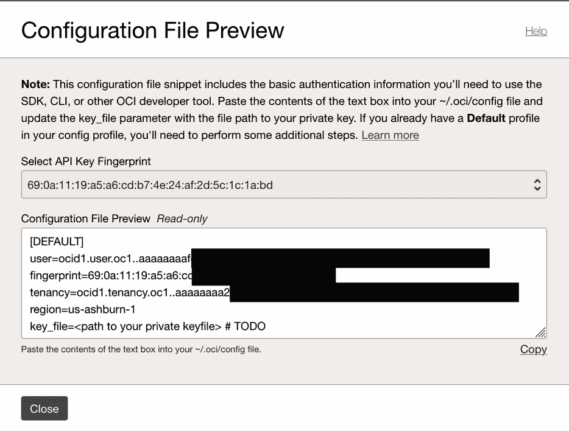

# 第十二章：探索 Ansible 的世界

在本章中，我们将通过几个食谱来扩展你对安装**Oracle Linux 自动化管理器**（**OLAM**）、管理其基础设施、创建剧本、最大化这些剧本的理解，并帮助你了解 OLAM 的功能。每个食谱都会让你看到自动化能实现的完整范围；从补丁管理到部署完全功能的混合云环境，OLAM 能改变你对计算的思维方式，打开你通向一个新世界的门，那里充满了“重复与清洗”的操作。以下是自动化可以简化的一个小子集的接触点。


图 12.1 – 自动化接触点

在本章中，以下食谱将涵盖 OLAM 平台的安装、配置和可用性：

+   安装 OLAM

+   从基础开始快速配置和管理 OLAM

+   OLAM 不是幻想足球，但它们都使用剧本

+   控制补丁混乱

+   超越自动化

+   设置后就忘记它

# 安装 OLAM

自从人类出现以来，我们作为一个物种，一直在努力让事情变得更简单、更快速、更高效。然而，我敢肯定我们大多数人都听过父母说过：“*永远不要走捷径*”，或者“*我小时候得在雪地里单腿走路上学，还是上坡，两边都要走*。”这些轶事从未改变；它们随着我们年纪的增长而演变，我们也试图将智慧传给下一代。好吧，如果我告诉你，你可以一举两得呢？自动化是计算机技术的进化，是可重复任务的自动化。当然，我们不能自动化所有事情，有些任务不值得去自动化，因为它们不是可重复的，或者某些因素变化到自动化会使得流程崩溃的程度。

自动化的字典定义是“*应用技术、程序、机器人或流程以最小的人工输入实现预定的结果*。” 注意*流程*——这是我们改变、执行或改变结果的过程。自动化就是这种过程的改变。我们可以自动化应用程序的安装，比如安装 Microsoft Office 或者杀毒软件；自计算机时代开始，我们就已经在自动化这些过程了。现在，我们将自动化带入了一个新的层级。例如，Red Hat 的自动化版本 Ansible Tower 就是如此。Ansible 和 OLAM 都是基于 AWX 构建的，AWX 是一个强大且现代化的 Web 用户界面和 API，能够让你轻松管理组织的 Ansible 剧本、库存、保险库和凭证。通过 AWX，你可以简化自动化流程，并简化基础设施管理任务，所有这些都能通过一个简单易用的界面进行操作。例如，假设某大学的计算机科学教授每周都需要准备实验室；这个实验室有 50 名学生，每个学生都需要一个独立的虚拟实验室来参与。教授肯定不想每周都坐在那里重建实验环境。通过 Ansible，一个剧本（不是足球战术书，而是一个大纲和功能需求）可以编写，用来执行一系列命令，自动化创建实验环境。通过创建这个剧本，工程师可以更改一些变量，调整虚拟机数量、内存、vCPU 或者其他资源或应用程序的使用。实际上，Ansible 和 Ansible 剧本极大地缩短了创建实验环境的过程，使其变得可重复，从而节省了教授每周重建的时间。

OLAM 是一款自动化套件，作为开源的 Linux 发行版（Oracle Linux）捆绑发布，基于 AWX 和 Ansible Tower。OLAM 是一个可配置的自动化平台，非常类似于 Ansible，具有创建、管理和更改剧本的能力。OLAM 安装时附带了一个 UI，如你将在后续食谱中看到的，还有一个 CLI。UI 和 CLI 都是完全功能的，并且具备 Ansible Tower 的所有细致功能，并且提供免费使用，配合高级支持订阅。OLAM 可以如以下图所示，用来创建剧本，自动化多个领域的流程，从本地虚拟化农场和 HCI 环境，到应用程序部署，再到多个云平台和混合云分发的应用。


图 12.2 – 自动化剧本层级

在本指南中，我们将安装 OLAM。与任何应用程序安装一样，我们需要准备一个基础环境来安装应用程序——当然，这里是 Oracle Linux 8。我们需要准备并配置该操作系统，虽然本书中的前一个指南已经详细介绍了这一部分内容，但我们不会在此重复。然而，建议您安装带 GUI 的操作系统。

## 准备中

我们将在 **Oracle Cloud Infrastructure**（**OCI**）中作为虚拟机安装 OLAM。请参考 *第三章* 和 *第四章* 了解如何浏览和配置 OCI 虚拟机。接下来，我们将简要介绍 VM 创建的步骤：

1.  转到 OCI **实例**，以为 OLAM 创建主机实例：


图 12.3 – 创建 VM 实例

1.  您需要通过点击 **创建实例** 来创建一个实例：


图 12.4 – 实例创建

1.  您可以为实例命名，并选择一个隔离的区域来托管 VM：


图 12.5 – 为实例命名

1.  在命名 VM 后，您可以选择您希望托管 VM 的位置或 **可用性域**（**AD**）。我们使用的 AD 是 OCI 的默认 AD：


图 12.6 – 可用性域

1.  我们为 VM 配置了 8 GB 的 RAM 和 2 个 vCPU，因此我们需要选择正确的主机配置。您可以按照以下屏幕截图编辑并更改形状：


图 12.7 – 镜像大小和形状

1.  点击 **更改形状** 来编辑形状，并在 **形状名称** 下选择您的形状：


图 12.8 – VM 形状选择

1.  **VM.Standard.E3.FLEX** 形状允许您指定您的资源：


图 12.9 – VM 资源配置

1.  我们将选择 8 GB 的 RAM（内存）和 2 个 vCPU。OLAM 的最低要求是 2 个 vCPU 和 4 GB 的 RAM：


图 12.10 – VM 资源选择

1.  配置完 VM 资源后，您需要配置访问密钥（公钥）：


图 12.11 – SSH 密钥选择

1.  您可以创建、上传、粘贴密钥，或者选择不使用密钥。我们将通过选择密钥并复制粘贴密钥来进行粘贴：


图 12.12 – SSH 密钥粘贴

1.  配置完密钥后，滚动到实例页面的底部，并点击 **创建**：


图 12.13 – VM 创建

1.  创建实例后，您可以使用 SSH 以 `opc` 用户和您的密钥访问 VM：

    ```
    % ssh -i sshkey_private_lab opc@193.122.148.147
    The authenticity of host '193.122.148.147 (193.122.148.147)' can't be established.
    ED25519 key fingerprint is SHA256:nF+ilxdx0SpWZZxiFZOJFvektZc8YhBI76j1Qm64w3A.
    This key is not known by any other names
    Are you sure you want to continue connecting (yes/no/[fingerprint])? yes
    Warning: Permanently added '193.122.148.147' (ED25519) to the list of known hosts.
    Activate the web console with: systemctl enable --now cockpit.socket
    [opc@instance-20231213-2350 ~]$
    ```

1.  添加 YUM 仓库非常简单，它使你能够在操作系统和内核级别更新、安装、卸载或修补某些方面，包括应用程序。如本章前面所提到的，你可以通过 DNF 将这些仓库添加到操作系统中，同时也可以在 GUI 界面中或安装后进行添加。无论哪种方式，你必须能够访问外部环境，这意味着我们需要能够连接到 Oracle 仓库或设置本地镜像。我们不会详细说明如何设置本地镜像，但我们会演示如何使用 DNF 添加这些仓库：

    ```
    [opc@olam-test ~]$ sudo DNF -y install oraclelinux-release-el8
    Ksplice for Oracle Linux 8 (x86_64)                                                39 MB/s | 3.2 MB     00:00
    MySQL 8.0 for Oracle Linux 8 (x86_64)                                              38 MB/s | 3.0 MB     00:00
    MySQL 8.0 Tools Community for Oracle Linux 8 (x86_64)                             7.3 MB/s | 491 kB     00:00
    MySQL 8.0 Connectors Community for Oracle Linux 8 (x86_64)                        600 kB/s |  30 kB     00:00
    Oracle Software for OCI users on Oracle Linux 8 (x86_64)                           96 MB/s |  93 MB     00:00
    Oracle Linux 8 BaseOS Latest (x86_64)                                             118 MB/s |  62 MB     00:00
    Oracle Linux 8 Application Stream (x86_64)                                        114 MB/s |  48 MB     00:00
    Oracle Linux 8 Addons (x86_64)                                                     56 MB/s | 6.9 MB     00:00
    Latest Unbreakable Enterprise Kernel Release 7 for Oracle Linux 8 (x86_64)         95 MB/s |  18 MB     00:00
    Package oraclelinux-release-el8-1.0-32.el8.x86_64 is already installed.
    Dependencies resolved.
    Nothing to do.
    Complete!
    ```

    如前面的代码所示，我们正在添加多个仓库；其中大多数仓库是用于操作系统级别的补丁或安装 OLAM 所必需的。

1.  所有前提条件中最重要的一点是应用程序能否看到外部环境；为了做到这一点，我们需要打开一个外部门户——换句话说，就是打开防火墙端口，如下所示：

    ```
    [opc@olam-test ~]$ sudo firewall-cmd --add-port=27199/tcp --permanent
    success
    [opc@olam-test ~]$ sudo firewall-cmd --add-service=http --permanent
    success
    [opc@olam-test ~]$ sudo firewall-cmd --add-service=https --permanent
    success
    [opc@olam-test ~]$ sudo firewall-cmd --reload
    success
    [opc@olam-test ~]$
    ```

1.  在打开这些端口后，我们需要启用我们刚刚使用 DNF 安装的仓库。这个步骤也可以在配置防火墙之前完成：

    ```
    [opc@olam-test ~]$ sudo DNF config-manager --enable ol8_baseos_latest
    [opc@olam-test ~]$
    ```

1.  启用该仓库后，我们需要安装并配置 OLAM 仓库，如下所示：

    ```
    [opc@olam-test ~]$ sudo DNF install oraclelinux-automation-manager-release-el8
    Oracle Linux 8 BaseOS Latest Oracle Linux 8
     Application Stream Oracle
    Linux 8 Addons
    Truncated for size
    Complete!
    ```

1.  就像我们做的基础仓库一样，我们也需要启用 OLAM 仓库：

    ```
    [opc@olam-test ~]$ sudo DNF config-manager --enable ol8_automation2 ol8_addons ol8_UEKR7 ol8_appstream
    ```

1.  启用更新的 OLAM 仓库后，我们需要禁用旧的仓库：

    ```
    [opc@olam-test ~]$ sudo DNF config-manager --disable ol8_automation
    ```

1.  一旦完成这些，我们就完成了从应用程序角度来看安装 OLAM 的前提条件。然而，我们现在需要为 OLAM 准备数据库。为了做到这一点，我们需要安装并配置数据库模块。OLAM 使用 Postgres 数据库，它是基于 SQL 的。以下是安装该模块的命令：

    ```
    [opc@olam-test ~]$ sudo DNF module reset postgresql
    Oracle Linux 8 BaseOS Latest (x86_64)                                       157 kB/s | 3.6 kB     00:00
    Oracle Linux 8 Application Stream (x86_64)                                  233 kB/s | 3.9 kB     00:00
    Oracle Linux 8 Addons (x86_64)                                              153 kB/s | 3.0 kB     00:00
    Oracle Linux Automation Manager 2.0 based on the open source projects Ansib 3.1 MB/s | 644 kB     00:00
    Latest Unbreakable Enterprise Kernel Release 7 for Oracle Linux 8 (x86_64)  147 kB/s | 3.0 kB     00:00
    Dependencies resolved.
    Nothing to do.
    Complete!
    ```

1.  安装模块后，它需要启用：

    ```
    [opc@olam-test ~]$ sudo DNF module enable postgresql:13
    Last metadata expiration check: 0:00:54 ago on Tue 22 Aug 2023 07:12:29 PM GMT.
    Dependencies resolved.
    ============================================================================================================
     Package                  Architecture            Version                     Repository                Size
    ============================================================================================================
    Enabling module streams:
     postgresql                                       13
    Transaction Summary
    ============================================================================================================
    Is this ok [y/N]: y
    Complete!
    ```

1.  现在我们已经安装并启用了 Postgres 模块，接下来可以安装数据库：

    ```
    [opc@olam-test ~]$ sudo DNF install postgresql-server
    Last metadata expiration check: 0:02:35 ago on Tue 22 Aug 2023 07:12:29 PM GMT.
    Dependencies resolved.
    ============================================================================================================
     Package                Arch        Version                                         Repository          Size
    ============================================================================================================
    Installing:
     postgresql-server      x86_64      13.11-1.0.1.module+el8.8.0+21141+00b1aed9      ol8_appstream      5.6 M
    Installing dependencies:
     libpq                  x86_64      13.5-1.el8                                     ol8_appstream      198 k
     postgresql             x86_64      13.11-1.0.1.module+el8.8.0+21141+00b1aed9      ol8_appstream      1.5 M
    Transaction Summary
    ============================================================================================================
    Install  3 Packages
    The output has been truncated…
    Installed:
      libpq-13.5-1.el8.x86_64
      postgresql-13.11-1.0.1.module+el8.8.0+21141+00b1aed9.x86_64
      postgresql-server-13.11-1.0.1.module+el8.8.0+21141+00b1aed9.x86_64
    Complete!
    ```

1.  下一步是初始化数据库。这一步为使用数据库做准备，并允许在已有数据时进行覆盖：

    ```
    [opc@olam-test ~]$ sudo postgresql-setup --initdb
     * Initializing database in '/var/lib/pgsql/data'
     * Initialized, logs are in /var/lib/pgsql/initdb_postgresql.log
    ```

1.  在初始化之后，你需要更改密码模式以符合要求：

    ```
    [opc@olam-test ~]$ sudo sed -i "s/#password_encryption.*/password_encryption = scram-sha-256/" /var/lib/pgsql/data/postgresql.conf
    ```

1.  现在，我们将启用数据库，如下所示：

    ```
    [opc@olam-test ~]$ sudo systemctl enable --now postgresql
    Created symlink /etc/systemd/system/multi-user.target.wants/postgresql.service → /usr/lib/systemd/system/postgresql.service.
    ```

1.  启用数据库后，我们需要确保一切为 OLAM 安装做好准备，因此我们需要查看数据库的状态。以下是显示状态的命令：

    ```
    [opc@olam-test ~]$ sudo systemctl status postgresql
    ● postgresql.service - PostgreSQL database server
       Loaded: loaded (/usr/lib/systemd/system/postgresql.service; enabled; vendor preset: disabled)
       Active: active (running) since Tue 2023-08-22 19:18:44 GMT; 23s ago
      Process: 46810 ExecStartPre=/usr/libexec/postgresql-check-db-dir postgresql (code=exited, status=0/SUCCES>
     Main PID: 46813 (postmaster)
        Tasks: 8 (limit: 22519)
       Memory: 16.9M
       CGroup: /system.slice/postgresql.service
               ├─46813 /usr/bin/postmaster -D /var/lib/pgsql/data
               ├─46814 postgres: logger
               ├─46816 postgres: checkpointer
               ├─46817 postgres: background writer
               ├─46818 postgres: walwriter
               ├─46819 postgres: autovacuum launcher
               ├─46820 postgres: stats collector
               └─46821 postgres: logical replication launcher
    Aug 22 19:18:44 olam-test systemd[1]: Starting PostgreSQL database server...
    Aug 22 19:18:44 olam-test postmaster[46813]: 2023-08-22 19:18:44.097 GMT [46813] LOG:  redirecting log outp>
    Aug 22 19:18:44 olam-test postmaster[46813]: 2023-08-22 19:18:44.097 GMT [46813] HINT:  Future log output w>
    active (running) tells you that the database is active and running, and you’re ready to start the installation of OLAM.
    ```

完成后，我们就准备进入重点内容——安装 OLAM。

## 如何操作…

完成前提条件后，我们可以继续进行安装。请记住，防火墙端口、安装 YUM 仓库和 Postgres 并启用它们是非常重要的。如果没有这些前提条件，你将无法继续，安装会失败：

1.  安装 OLAM 的第一步是创建 AWX 用户。记住，AWX 是 OLAM 的基础，所以这一步非常重要：

    ```
    [opc@olam-test ~]$ sudo su - postgres -c "createuser -S -P awx"
    Enter password for new role: welcome1
    Enter it again: welcome1
    ```

1.  现在，安装完数据库引擎后，我们将安装数据库，如下所示：

    ```
    [opc@olam-test ~]$ sudo su - postgres -c "createdb -O awx awx"
    ```

1.  安装数据库后，我们需要编辑配置文件：

    ```
    [root@olam-test ~]# vi /var/lib/pgsql/data/pg_hba.conf
    ```

1.  您还记得我们在定义密码变量时的步骤吗？在这里，我们在主机身份验证配置文件中标注了这些内容，在以下片段中突出显示。完成后，我们需要确保保存并退出配置：

    ```
    # TYPE  DATABASE        USER            ADDRESS                  METHOD
    # "local" is for Unix domain socket connections only
    local   all             all                                      peer
    # IPv4 local connections:
    host    all             all             127.0.0.1/32             ident
    # IPv6 local connections:
    host    all             all             ::1/128                  ident
    # Allow replication connections from localhost, by a user with the
    # replication privilege.
    local   replication     all                                      peer
    host    replication     all             127.0.0.1/32             ident
    host    replication     all             ::1/128                  ident
    'OCI NAT Address':

    ```

    [root@olam-test ~]# vi /var/lib/pgsql/data/postgresql.conf

    #------------------------------------------------------------------------------

    # 连接和身份验证

    #------------------------------------------------------------------------------

    # - 连接设置 -

    listen_addresses = 'OCI NAT Address' – 在 ifconfig 中的 IP 地址

    #listen_addresses = 'localhost'         # 监听的 IP 地址；

    ```

    ```

1.  编辑完该文件后，请再次确保保存并退出配置。保存文件后，您需要重启 Postgres，确保所有更改已提交：

    ```
    [root@olam-test ~]# systemctl restart postgresql
    ```

1.  在完成所有这些更改后，我总是喜欢更新所有的 YUM 仓库，并确保加载了所有的更新。为了做到这一点，我们需要更新系统。以下是用于更新仓库的 DNF 命令：

    ```
    [root@olam-test ~]# DNF update -y
    Last metadata expiration check: 1:43:57 ago on Tue 22 Aug 2023 10:48:21 PM GMT.
    Dependencies resolved.
    ============================================================================================================================================
     Package                                   Architecture       Version                                      Repository                     Size
    ============================================================================================================================================
    The output has been truncated for length.
    ```

1.  更新完所有 YUM 仓库后，快速查看一下前面的代码，并注意我们在前一节中添加并启用的所有仓库。您需要重启虚拟机，以确保所有更改已生效：

    ```
    [root@olam-test ~]# reboot
    ```

1.  以下是安装 OLAM 的命令和输出：

    ```
    [root@olam-test ~]# DNF -y install ol-automation-manager
    Last metadata expiration check: 1:52:46 ago on Tue 22 Aug 2023 10:48:21 PM GMT.
    Dependencies resolved.
    ============================================================================================================================================
     Package                              Architecture    Version                                               Repository                   Size
    ============================================================================================================================================
    Installing:
     ol-automation-manager                x86_64          2.0.1-3.el8                                          ol8_automation2             41 M
    Installing dependencies:
    The output has been truncated for length
    [root@olam-test ~]# vi /etc/redis.conf
    ```

1.  现在，您需要退出 root 用户，这是非常重要的；您不能以 root 用户身份继续进行 AWX：

    ```
    awx to continue the installation:

    ```

    [opc@olam-test ~]# su -l awx -s /bin/bash

    ```

    ```

1.  由于 OLAM 运行在云原生环境中，我们使用 Podman 来协调调优和创建该架构。以下是使用 Podman 最新版本迁移并在虚拟机中创建该环境的命令：

    ```
    [awx@olam-test ~]$ podman system migrate
    ```

1.  现在，我们将通过运行以下命令，从 Oracle Docker 注册表拉取 OLAM 的最新版本：

    ```
    [awx@olam-test ~]$ podman pull container-registry.oracle.com/oracle_linux_automation_manager/olam-ee:latest
    Trying to pull container-registry.oracle.com/oracle_linux_automation_manager/olam-ee:latest...
    Getting image source signatures
    Copying blob 1ca7c848b9e5 done
    Copying blob a2cd216732a7 done
    Copying blob 13ec27f79a4b done
    Copying blob 0b5aff3da93f done
    Copying config b764e737f4 done
    Writing manifest to image destination
    Storing signatures
    ```

1.  现在，我们要将环境迁移到容器中：

    ```
    [awx@olam-test ~]$ awx-manage migrate
    Operations to perform:
      Apply all migrations: auth, conf, contenttypes, main, oauth2_provider, sessions, sites, social_django, sso, taggit
    Running migrations:
    The output has been truncated for length.
    ```

1.  现在，我们要创建我们的用户：

    ```
    [awx@olam-test ~]$ awx-manage createsuperuser --username admin --email bubba@nobody.com
    Password:
    Password (again)
    ```

1.  在创建好我们的环境和用户后，我们需要配置该环境。这将写入加密密钥，并注释位置、地址、主机名和其他标识符。然而，虚拟机特定的数据是必需的：

    ```
    [awx@olam-test ~]$ openssl req -x509 -nodes -days 365 -newkey rsa:2048 -keyout /etc/tower/tower.key -out /etc/tower/tower.crt
    Generating a RSA private key
    ....................................+++++
    ...............................................................................+++++
    writing new private key to '/etc/tower/tower.key'
    -----
    You are about to be asked to enter information that will be incorporated
    into your certificate request.
    What you are about to enter is what is called a Distinguished Name or a DN.
    There are quite a few fields but you can leave some blank
    For some fields there will be a default value,
    If you enter '.', the field will be left blank.
    -----
    Country Name (2 letter code) [XX]:01
    State or Province Name (full name) []:Florida
    Locality Name (eg, city) [Default City]:Miami
    Organization Name (eg, company) [Default Company Ltd]:
    Organizational Unit Name (eg, section) []:
    Common Name (eg, your name or your server's hostname) []:olam-test
    awx user now and su to root:

    ```

    [awx@olam-test ~]$ exit

    [awx@olam-test ~]$ sudo su - root

    ```

    ```

1.  现在，我们要设置我们的 Web 服务器。这是通过一个典型的、广泛分发的预配置文件来完成的，如下所示：

    ```
    cat << EOF | sudo tee /etc/nginx/nginx.conf > /dev/null
    > user nginx;
    > worker_processes auto;
    > error_log /var/log/nginx/error.log;
    > pid /run/nginx.pid;
    >
    > # Load dynamic modules. See /usr/share/doc/nginx/README.dynamic.
    > include /usr/share/nginx/modules/*.conf;
    >
    > events {
    >     worker_connections 1024;
    > }
    >
    > http {
    >     log_format  main  '$remote_addr - $remote_user [$time_local] "$request" '
    >                       '$status $body_bytes_sent "$http_referer" '
    >                       '"$http_user_agent" "$http_x_forwarded_for"';
    >
    >     access_log  /var/log/nginx/access.log  main;
    >
    >     sendfile            on;
    >     tcp_nopush          on;
    >     tcp_nodelay         on;
    >     keepalive_timeout   65;
    >     types_hash_max_size 2048;
    >
    >     include             /etc/nginx/mime.types;
    >     default_type        application/octet-stream;
    >
    >     # Load modular configuration files from the /etc/nginx/conf.d directory.
    >     # See http://nginx.org/en/docs/ngx_core_module.html#include
    >     # for more information.
    >     include /etc/nginx/conf.d/*.conf;
    > }
    awx user:

    ```

    [root@olam-test ~]# sudo su -l awx -s /bin/bash

    [awx@olam-test ~]$ awx-manage provision_instance --hostname=10.0.0.193 --node_type=hybrid

    成功注册实例 10.0.0.193

    （已更改：True）

    ```

    ```

1.  我们将通过运行以下命令来注册默认环境：

    ```
    [awx@olam-test ~]$ awx-manage register_default_execution_environments
    'OLAM EE (latest)' Default Execution Environment registered.
    'OLAM EE (latest)' Default Execution Environment updated.
    Control Plane Execution Environment registered.
    (changed: True)
    [awx@olam-test ~]$ awx-manage register_queue --queuename=controlplane --hostnames=10.0.0.193
    Creating instance group controlplane
    Added instance 10.0.0.193 to controlplane
    (changed: True)
    controlplane
    user to root, if you’re not already root, again here:

    ```

    [root@olam-test ~]# vi /etc/receptor/receptor.conf

    ---

    - node:

    id: 10.0.0.44

    - log-level: debug

    - tcp-listener:

    端口：27199

    #- work-signing:

    #    privatekey: /etc/receptor/work_private_key.pem

    #    tokenexpiration: 1m

    #- work-verification:

    #    publickey: /etc/receptor/work_public_key.pem

    #- tcp-peer:

    #    address: 100.100.253.53:27199

    #    redial: true

    #- tls-server:

    #    name: mutual-tls

    #    cert: /etc/receptor/certs/awx.crt

    #    key: /etc/receptor/certs/awx.key

    #    requireclientcert: true

    #    clientcas: /etc/receptor/certs/ca.crt

    - control-service:

    service: control

    filename: /var/run/receptor/receptor.sock

    - work-command:

    worktype: local

    command: /var/lib/ol-automation-manager/venv/awx/bin/ansible-runner

    params: worker

    allowruntimeparams: true

    #    verifysignature: true

    ```

    ```

1.  现在，我们将通过运行以下命令来启用 OLAM 服务；这将开始访问 OLAM 的过程：

    ```
    [root@olam-test ~]# systemctl enable --now ol-automation-manager.service
    Created symlink /etc/systemd/system/multi-user.target.wants/ol-automation-manager.service → /usr/lib/systemd/system/ol-automation-manager.service.
    ```

1.  现在，我们希望通过运行以下命令来预加载我们的数据。一旦完成，我们就可以登录到 OLAM 实例，安装将会完成：

    ```
    https://'public_IP'.  You can find this in your OCI console, within your VM configuration. You will be asked to enter your password twice. Once this is done, your OLAM installation is complete and your console is configured.
    ```


图 12.14 – OLAM 密码创建

# 从基础开始快速配置和管理 OLAM

管理 OLAM 可以通过 UI 或 CLI 完成。在这里，我们将通过 UI 操作。可以这样理解——OLAM 是一个平台，你将在其上管理你的项目、库存、playbooks 和自动化，无论是通过 UI 还是 CLI。项目位于最顶层，层级结构从项目开始，向下延伸至 playbooks，最终触发自动化。无论使用 UI 还是 CLI，你都可以对你的关键环境进行精细控制。


图 12.15 – OLAM 层级结构

本指南将带你了解如何在 OLAM 环境中查看、理解和执行基本命令，创建项目，管理组以及添加到库存中。

## 准备就绪

如下图所示，并在之前的步骤中，你需要登录到你的 OLAM 环境：


图 12.16 – OLAM 首次登录

OLAM 层级结构中的第一个也是最高层级是项目。你必须创建一个项目，它将作为该层级中所有 playbooks 和自动化的宿主。你可以有多个项目，分配给不同的资产和库存。接下来让我们看看如何在以下步骤中完成这项操作：

1.  要创建一个项目，你需要进入 **资源** 标签页并导航到 **项目**：


图 12.17 – OLAM 项目选项

1.  一旦进入 **项目**，点击 **添加**。这将打开一个窗口，在这里你可以定义项目。


图 12.18 – 添加项目

1.  一旦打开你的项目配置页面，你需要规划你的项目外观。在这个例子中，我们正在创建一个测试环境，并且已为实验室用途设置了两个独立的测试节点。默认设置用于 playbook 目录和项目路径。


图 12.19 – 项目变量

1.  配置完项目后，你需要保存这些信息，这将带你进入一个显示已完全配置项目的屏幕。


图 12.20 – 项目配置页面

1.  配置好项目后，你需要配置凭证，方式与项目类似，如下所示：


图 12.21 – 凭证选项

1.  下一步是添加你 `opc` 用户和机器的凭证数据。


图 12.22 – 凭证添加

1.  你需要复制或创建一个密钥，用于访问机器。将其粘贴到**SSH 私钥**部分，并输入你的密钥名称和用户。


图 12.23 – 凭证变量和 SSH 私钥

1.  保存凭证后，配置好的凭证将会显示，如下所示：


图 12.24 – 凭证配置页面

1.  接下来，你需要添加一个库存。记住，已经创建了两个测试虚拟机，在这个示例中，它们将作为测试环境使用。选择**库存**，然后按照接下来的步骤在选择后定义库存。


图 12.25 – 库存选项

1.  点击**添加**来创建并定义你的新库存：


图 12.26 – 添加库存

1.  你将使用默认组织定义库存名称：


图 12.27 – 库存变量

1.  配置好的测试库存如下所示：


图 12.28 – 库存配置页面

1.  创建库存后，我们需要向其中添加主机。这将涉及添加可以进行自动化测试的机器。在菜单中选择**主机**，然后从列表中选择主机，如下所示：


图 12.29 – 主机选项

1.  然后，你可以添加新的主机，如下所示：


图 12.30 – 添加主机

1.  以下是创建新主机的配置页面；确保选择你刚创建的库存：


图 12.31 – 主机变量

1.  确保保存你的配置。完成后，主机配置将会显示。


图 12.32 – 主机配置页面

1.  你需要重复此操作，因为这里只有一台主机被创建；为了展示多样性，必须创建两台主机以模拟一个工作环境。


图 12.33 – 主机

OLAM 的设置和基本配置已经完成。在接下来的几项操作中，我们将回顾如何运行战术手册并进一步配置 OLAM。在下一个操作中，我们将通过对创建的两台测试服务器运行命令来测试最终配置。

## 如何执行……

1.  在添加了这两台主机后，你可以对它们执行一组命令进行测试。要运行这些命令，你需要返回到**主机**并点击**运行命令**：


图 12.34 – 在主机上运行简单命令

1.  你将选择要运行的模块，在这种情况下，`uptime` 是作为变量参数。这个命令在一个 shell 环境中运行，就像你在任何 Linux 环境中运行它一样。


图 12.35 – 命令变量

1.  我们需要定义我们希望运行的环境，即**OLAM** **EE（最新版本）**。


图 12.36 – 执行环境

1.  这些是我们之前在两个测试节点上使用的凭据：


图 12.37 – 凭据选择

1.  以下是测试的输出；如你所见，`olam-target-1` 和 `olam-target-2` 的每个环境的正常运行时间都列出在内。


图 12.38 – 命令运行输出

# OLAM 不是幻想足球，但它们都使用战术手册

我们大多数人都知道幻想足球，在其中我们跟随球队，选拔球员，并对赢家和输家进行下注。嗯，在这里我们并没有下注什么，除了我们的环境是否能够正常工作，但我们确实使用了一种叫做**战术手册**的东西。可以把战术手册看作是足球教练用来训练球队的工具；这是相同的概念。我们在预定义一个环境或事件，并且以编程的方式构建它，使其按照我们指定的方式行为，创建或更改我们所定义的环境，甚至回收资源（从已废弃的环境中回收 CPU、RAM 和磁盘空间）。无论我们在 OLAM 的约束下定义什么，我们都可以执行。

为了创建我们的战术手册，我们需要弄清楚谁、什么、哪里、何时，甚至可能是为什么：

+   Who – 我们针对哪些资源组？

+   What – 我们针对什么样的资源？是虚拟机？物理机？

+   Where – 这些资源位于哪里？是在 CSP、虚拟机农场，还是物理服务器上？

+   When – 我们何时执行这个环境？是基于事件的（例如，当日志填满 `/tmp` 时我们清理磁盘空间）？

+   为什么 – 为什么我们要针对这个环境？是数据库服务器磁盘空间满了，网页服务器过度利用，还是某个事件反复发生影响了系统？

一个剧本可以通过多种方式触发，在 AIOps 中，我们关注触发条件；这些可以是 SNMP Trap、基于代理的触发条件（例如前面提到的磁盘已满），或来自平台的定向事件。让我们回到其他四个变量——谁、什么、哪里和何时；*谁*是哪个环境，*什么*是使用了哪些机器，*哪里*是环境的地点，*何时*是这个剧本将运行的时间，是否会在特定时间触发或运行。这些都可以逐步定义。


图 12.39 – 剧本和它们的触发点

## 准备开始

准备构建你自己的剧本和/或使用现有剧本并不像看起来那么庞大。在这份指南中，我们将探讨如何将 Git 仓库添加到 OLAM 实例中。这么做有几个原因：

+   版本控制 – 管理你的代码，谁编辑了它，以及你当前的版本。记住，事物会发生变化，包括基础设施和操作系统版本。你需要追踪剧本中的变化，以便适应这些变化。

+   跟踪你的剧本 – 保存它们，协作，并共享。你可以共享你的模板并重新使用它们。记住，自动化如此有用的一个重要原因是它的重复性，限制了在重复步骤中对人工交互的需求。

+   Git 为你的模板提供了一个管道，并允许你轻松地将你编写的剧本添加到你编写并创建的模板中。

为了将 Git 仓库添加到 OLAM，你需要先创建它并将其添加到你的 OLAM 项目中：

1.  首先，进入**项目**标签页，如图所示。


图 12.40 – 项目菜单

1.  进入我们创建的测试项目，或创建一个新项目 – 在这个例子中，Oracle 已创建，因为我们将把 Oracle 示例剧本添加到 OLAM。


图 12.41 – 添加项目

1.  输入项目的信息，包括你的 Git 数据：


图 12.42 – Oracle Git 仓库的项目配置和变量

1.  然后，保存项目，这将带你进入项目的**详情**页面。


图 12.43 – Oracle Git 项目详情

## 如何操作…

一旦你添加了 Git 账户数据，以及 Oracle Ansible 示例剧本，你可以开始创建一个新模板，使用你的 Oracle Hello World 剧本：

1.  你需要再次进入**模板**：


图 12.44 – 模板选项

1.  点击**添加**以创建一个新模板。


图 12.45 – 添加作业模板

1.  按照我们在之前配方中所做的那样，完成工作表并填写正确的变量。


图 12.46 – 作业模板变量

1.  这次，我们将从我们选择的 Oracle 示例中选择一个 playbook。


图 12.47 – 选择 Oracle Git 示例 playbook

1.  我们要选择 Oracle Hello World playbook：


图 12.48 – Hello World playbook

1.  确保将**特权提升**访问权限分配给模板。


图 12.49 – 作业权限凭证

1.  保存您的模板，这将带您到**详细信息**页面。


图 12.50 – 作业配置详情

1.  你可以启动模板以查看结果。


图 12.51 – 作业启动

1.  请记得，您的结果将显示在**输出**选项卡下。


图 12.52 – 作业输出和结果

# 控制补丁管理混乱

对许多人来说，打补丁是一个脏字，对一些人来说是安慰，对所有人来说都是必要的。关于什么时候打补丁、如何打补丁以及打什么补丁，确实存在理性的恐惧。这里也适用谁、什么、哪里、何时和如何这些词。这些担忧是合理的；我的意思是，谁愿意打补丁呢？它可能很混乱，而且费时。我们可能无法消除这些担忧，但我们可以缩短自动化所需的时间。这就是自动化有助于加快操作速度的一个方面，它减轻了必须为多个环境打补丁的挫败感。

一个常见的自动化问题是：“我们能做些什么来最小化工作量，哪些必须手动完成？”我们能够为任何事情创建 playbook 并自动化一切的想法显然是不现实的。首先，有些事情我们不希望自动化，这取决于你为谁工作，或者你所在组织的政策和**标准操作程序**（**SOPs**）对自动化的态度。我曾与一些防务承包商和机构合作，他们有多个委员会投票决定允许哪些自动化，他们对哪些可以批准，哪些不能批准非常严格。不过，总体来说，自动化在节省时间和精力方面是一个伟大的平衡器。

本配方将简要介绍补丁管理，并帮助你理解自动化如何超越传统，节省时间和精力，通过自动化可重复的步骤。

## 准备就绪

在我们启动任何 Playbook 之前，我们必须确保所有前提条件已经就绪，包括编写 Playbook 本身。在这种情况下，我们将编写一个基础 Playbook，在两台服务器上更新 YUM 仓库，并在更新完成后重启这些服务器。这可以扩展到多个操作系统、内核和/或应用程序修补——无限可能。

## 如何操作…

1.  如前所述，我们需要先检查并为我们的补丁工作创建一个新的 Playbook。为了做到这一点，我们将导航到我们的模板（Playbook）：


图 12.53 – 模板选项

1.  如前所述，我们已经有了之前写的模板。但是，我们将点击**添加**来创建另一个模板。


图 12.54 – 添加模板

1.  选择**添加** **作业模板**。


图 12.55 – 添加作业模板

1.  你需要遵循我们为最初创建的模板所使用的相同流程。然而，这一次，我们将选择一个不同的 Playbook：


图 12.56 – 添加作业变量

1.  我们将命名为`Patching`，并选择更新后的 YUM Playbook。


图 12.57 – Playbook 选择

1.  如下图所示，模板已完全填充。


图 12.58 – 作业变量

1.  确保给你的模板**权限提升**访问权限，即管理员访问权限。


图 12.59 – 权限提升

1.  保存你的模板，这将带你进入模板的**详细信息**界面。


图 12.60 – 作业配置详情与启动

1.  执行你的模板和 Playbook，通过点击**启动**。模板的输出将显示在**输出**标签下，展示任何错误、遗漏和/或成功。记得仔细查看输出，因为即使输出成功，也可能有错误和/或跳过/漏掉的步骤。


图 12.61 – 作业输出与结果

# 超越自动化的思考

在我们创建任何资源之前，我们需要有一个创建这些资源的地方。在本例中，我们使用 OCI 作为我们的孵化器，因此显然，我们需要将 OCI 添加到我们的 OLAM 实例中。为了做到这一点，我们需要创建凭据，以允许 OLAM 访问 OCI。这不仅仅局限于 OCI。OLAM 是你进入混合云解决方案的大门。你可以通过虚拟化平台和 HCI 解决方案，如 VxRail、VMware 和 OpenStack，部署本地解决方案。我们在本食谱中不会涉及混合云解决方案，尽管我们在之前的食谱中讨论过混合云，例如将虚拟机作为模板迁移到 OCI，或上传镜像以在 AWS 中创建 AMI 镜像。这些技术也可以用于混合云场景，处理和移动工作负载的进出到**云服务提供商**（**CSPs**）。正如你所看到的，可能性是存在的，而且是无尽的。

要深入了解**IaC**（**基础设施即代码**），我们需要查看作为服务的基础设施定义。退后一步，重新框定你对基础设施的思考方式，然后将其在脑海中重新构建为移动的数字、字段和景观。这就是 IaC；它是一个不断演变的景观，始终在不断变化其定义，以匹配最终状态。你玩过*俄罗斯方块*吗？IaC 看起来和感觉就像*俄罗斯方块*，不过在这种情况下，我们每次都赢；我们只是将各个部分拼接在一起，创建出一个符合我们需求的环境。我们可以使用许多不同的变量将日常任务转化为 IaC——例如，扩展计算、存储和/或网络。例如，假设我们有虚拟机 A，这是一个用于 Web 服务器的镜像。我们为一所小型大学部署了两个 Web 服务器。该大学在普通招生期间面临挑战，需要无缝扩展。我们可以使用自动扩展或工作负载扩展来实施新的 Web 服务器，补充大学的需求，直到需求过期。这些示例比本食谱中的示例更复杂，但在我们走在这条不断变化的 IT 景观高速公路上时，理解代码的价值是至关重要的。

## 准备工作

Ansible 为平台配置和管理计算实例提供了构建模块。在本食谱中，我们将以不同的方式来看待 Ansible，并学习如何使用它编写剧本来在 OCI 中实例化一个新的虚拟机。我们将学习剧本的基础知识，超越我们之前在几篇食谱中探索过的 Oracle 基本预定义内容，发现通过 Ansible 实现 IaC 的好处，并且我们还将学习如何为 Ansible 创建一个以剧本形式使用的基础。最后，你将学习如何创建剧本，并在 OCI 上配置和管理资源。

首先，我们需要配置我们的环境。这包括将我们的 OLAM 实例连接到 OCI。这将允许我们在 OCI 租户中执行我们的 playbook。

1.  首先，我们需要进入**凭据**。


图 12.62 – 凭据选项

1.  你需要为 OCI 添加一个凭据。


图 12.63 – 添加凭据

1.  你需要从 OCI 租户中收集以下信息——用户**Oracle Cloud Identifier**（**OCID**）、指纹、租户 OCID 和区域。所有这些信息可以在**用户** | **用户设置** | **API 密钥**下找到。

    导航并登录到你的 OCI 控制台，进入用户（右侧的人物图标）：


图 12.64 – 右侧的用户图标

然后，导航到**用户设置**：


图 12.65 – OCI 用户设置选项

所有数据都将在**API 密钥**下：


图 12.66 – OCI API 密钥菜单

1.  确保选择**查看配置** **文件**选项：


图 12.67 – 配置文件

1.  你需要的 OCI 设置数据将在此配置文件中：



图 12.68 – 配置文件详情

1.  输入所有收集到的信息。


图 12.69 – OCI 用户 OCID、指纹和租户 OCID 的凭据变量

1.  别忘了剪切并粘贴用于访问 OCI 帐户的私钥。这是你在系统上用于登录 OCI 的密钥。


图 12.70 – OCI 私钥

1.  保存凭据，这将把你带到**详情**页面，显示你刚刚配置的凭据摘要。


图 12.71 – OCI OLAM 凭据配置详情

## 如何操作…

1.  检查 Ansible 核心的版本：

    ```
    [opc@olam-target-1 ~]$ ansible --version
    ansible [core 2.14.2]
      config file = /etc/ansible/ansible.cfg
      configured module search path = ['/home/opc/.ansible/plugins/modules', '/usr/share/ansible/plugins/modules']
      ansible python module location = /usr/lib/python3.11/site-packages/ansible
      ansible collection location = /home/opc/.ansible/collections:/usr/share/ansible/collections
      executable location = /usr/bin/ansible
      python version = 3.11.2 (main, Jun 14 2023, 13:00:29) [GCC 8.5.0 20210514 (Red Hat 8.5.0-18.0.2)] (/usr/bin/python3.11)
      jinja version = 3.1.2
      libyaml = True
    [opc@olam-target-1 ~]$
    ```

1.  创建库存：

    ```
    [opc@olam-target-1 ~]$ mkdir ~/ol-automation
    [opc@olam-target-1 ol-automation]$ vi inventory
    130.61.100.96
    ~
    ~
    ~
    ~
    ```

1.  查看并确认库存清单：

    ```
    [opc@olam-target-1 ol-automation]$ ansible-inventory -i inventory --list
    {
        "_meta": {
            "hostvars": {}
        },
        "all": {
            "children": [
                "ungrouped"
            ]
        },
        "ungrouped": {
            "hosts": [
                "130.61.100.96"
            ]
        }
    }
    [opc@olam-target-1 ol-automation]$
    ```

1.  向库存中添加一个组：

    ```
    [opc@olam-target-1 ol-automation]$ vi inventory
    [preproduction]
    130.61.100.96
    ~
    ~
    ~
    ~
    ```

1.  再次运行库存清单，如下所示：

    ```
    [opc@olam-target-1 ol-automation]$ ansible-inventory -i inventory --list
    {
        "_meta": {
            "hostvars": {}
        },
        "all": {
            "children": [
                "ungrouped",
                "preproduction"
            ]
        },
        "preproduction": {
            "hosts": [
                "130.61.100.96"
            ]
        }
    ping to verify your inventory:

    ```

    [opc@olam-target-1 ol-automation]$ ansible all -i inventory -m ping

    olam-target-1 | 成功 => {

    "ansible_facts": {

    "discovered_interpreter_python": "/usr/bin/python"

    },

    "changed": false,

    "ping": "pong"

    }

    ```

    ```

1.  创建你的 playbook：

    ```
    [opc@olam-target-1 ansible]$ sudo vi packt.yml
    ---
    - hosts: olam-target-2
      tasks:
        - name: Print message
          debug:
            msg: Hello from Packt Oracle Linux 8 Cookbook
    ~
    ~
    ~
    ~
    ```

1.  运行你的 playbook：

    ```
    [opc@olam-target-1 ansible]$ ansible-playbook -i inventory packt.yml
    PLAY [all] *********************************************************************
    TASK [Gathering Facts] *********************************************************
    [WARNING]: Platform linux on host olam-target-2 is using the discovered Python
    interpreter at /usr/bin/python, but future installation of another Python
    interpreter could change this. See https://docs.ansible.com/ansible/2.14.2/referen
    ce_appendices/interpreter_discovery.html for more information.
    ok: [olam-target-2]
    TASK [Print message] ***********************************************************
    ok: [olam-target-2] => {
        "msg": "Hello from Packt Oracle Linux 8 Cookbook"
    }
    PLAY RECAP *********************************************************************
    olam-target-2: ok=2    changed=0    unreachable=0    failed=0    skipped=0     rescued=0    ignored=0
    ```

# 设置并忘记它

在 Ansible 剧本中，循环提供了灵活性和高效性，能够通过 OLAM 自动化 Oracle Linux 环境或任何 Linux 环境。用户可以在剧本中定义字典，并使用循环语句。字典就像书籍，其中包含所有基础设施或应用程序的列表，可以用来描述自动化中的变量。这使得每个循环项都能执行一组任务，减少了重复编写代码的需要，使剧本更加简洁和易于管理。

例如，如果你想在一组 Oracle Linux 服务器上安装多个软件包，而不使用循环，你需要为每个软件包和服务器写独立的任务。然而，通过在 OLAM 中使用 Ansible 的循环功能，你可以定义软件包列表和服务器列表，并在单个任务中对每个服务器安装软件包。

## 准备就绪

在前面的示例中，我们展示了 OLAM 具有额外的功能和能力，能够通过基于 Web 的 UI 或命令行增强自动化功能。用户可以细化并直观地定义和管理自动化工作流，简化创建和管理复杂自动化任务的过程。此外，这还提供了一个集中的平台来管理和监控 Ansible 剧本的执行。

在以下示例中，我们有两个示例服务器，分别是之前示例中的`target-1`和`target-2`服务器，我们需要更改这两个服务器上特定用户的权限。如果不使用循环，我们需要为每个服务器编写独立的任务，导致代码冗余。然而，通过利用循环，我们可以简化剧本并提高其效率。

在这个例子中，我们首先通过`hosts`指令定义剧本的名称和目标主机。我们还将`become`设置为`true`，表示剧本将以管理员权限运行：

```
```yaml

---

- name: 更改用户权限

hosts: server_group

become: true

vars:

target_users:

- user1

- user2

tasks:

- name: 更改用户权限

file:

path: /home/{{ item }}/documents

owner: {{ item }}

group: {{ item }}

mode: "0755"

with_items: "{{ target_users }}"

```
```

接下来，我们定义一个变量`target_users`，它包含了我们要更改权限的用户列表。在这个例子中，我们的目标用户是`user1`和`user2`。

`tasks`部分包含一个名为`更改用户权限`的任务。该任务使用`file`模块更改指定目录的所有权、组和模式。

`with_items`循环用于遍历`target_users`列表。每次循环会将`item`变量设置为当前列表中的用户。然后，这个变量会用于`file`模块的`path`、`owner`和`group`参数。

通过使用这个循环，剧本将为`target_users`列表中的每个用户执行任务，从而有效地更改用户和文件夹权限：

```
```yaml

- name: 更改用户权限

hosts: all

tasks:

- name: 为用户更改权限

file:

路径：/path/to/directory

owner: "{{ item }}"

状态：目录

loop: "{{ users }}"

```
```

在上面的示例中，`file` 被用来将指定目录的所有权更改为 `users` 列表中的每个用户。`item` 变量表示循环中的当前用户。

通过遵循这些步骤，你可以在 OLAM 中编写并执行 Ansible 循环来更改不同服务器及其描述目录中的用户权限。这将使你能够自动化该过程，确保多个系统间权限的一致性，并且管理多个环境时，能够提高效率。

## 如何操作…

1.  你需要首先编写 playbook；为了简便起见，我使用了示例项目：

    ```
    [opc@olam-test /]$ cd /var/lib/awx/
    [opc@olam-test awx]$ ls
    awxfifo  projects  rsyslog  uwsgi.stats  venv
    [opc@olam-test awx]$ cd projects/
    [opc@olam-test projects]$ cd demo_bundled/
    [opc@olam-test demo_bundled]$ ls
    httpd.yaml  permissions.yaml  yum_update.yaml
    [opc@olam-test demo_bundled]$
    [opc@olam-test demo_bundled]$ sudo vi change_permissions.yaml
    ---
    - name: Change file permissions
      hosts: olam-test-1, olam-test-2
      become: true
      tasks:
        - name: Change permissions for /tmp/changedir
          file:
            path: /tmp/changedir
            owner: root
            group: root
            mode: "0755"
    ```

    [opc@olam-target-2 tmp]$ ls -ltr

    总计 0

    drwxr-xr-x. 2 root root 6 10 月 18 11:53 unified-monitoring-agent

    drwxrwxr-x. 2 opc  opc  6 10 月 26 15:27 changedir

    name: 这是 playbook 的名称。

    ```

2.  `hosts`: This specifies the target servers where the playbook will be executed. You can define the hosts directly in the playbook or use an inventory file.
3.  `become: true`: This allows the playbook to run with elevated privileges, which might be required to change user permissions.
4.  `tasks`: This section contains the list of tasks to be executed.
5.  `name`: This is a description of the task.
6.  `file`: This module is used to change the permissions of a directory.
7.  `path`: This is the path to the directory where you want to change permissions.
8.  `owner`: This parameter specifies the username that the ownership should be changed to. In this example, we used the `item` variable, which represents the current user in the loop.
9.  `state`: `directory`: This ensures that the path is a directory.
10.  OLAM will execute the playbook on the specified servers, changing the user permissions for the specified directory to users `user1` and `user2` in this example.
11.  Make sure to replace `/path/to/directory` with the actual path of the directory you want to change permissions for, and update the list of users as per your requirements.
12.  Ensure that you have proper SSH connectivity and the necessary privileges to change permissions on the target servers. The following code snippet is a simple, canned YAML file depicting file permissions:

    ```

    ```yaml
    ---
    - name: Change file permissions
      hosts: olam-test-1, olam-test-2
      become: true
      tasks:
        - name: Change permissions for /tmp/changedir
          file:
            path: /tmp/changedir
            owner: root
            group: root
            mode: "0755"
    ```

    ```

1.  OLAM 将在指定的服务器上运行 playbook，将 `/tmp/changedir` 的权限更改为 `root:root`，并设置为 `0755` 权限模式。

1.  保存 playbook 文件。

1.  确保你能与目标服务器建立正确的 SSH 连接。

1.  打开 OLAM 基于 Web 的用户界面。

1.  在 OLAM 中创建一个新的 playbook，或打开一个已有的 playbook。

1.  将 `change_permissions.yaml` playbook 文件的内容复制到 OLAM 的 playbook 编辑器中。

1.  在 OLAM 中保存 playbook。

1.  通过从库存中选择目标服务器（`olam-test-1` 和 `olam-test-2`）或手动指定它们的 IP 地址来执行 playbook。

1.  点击 OLAM 中的 **Run** 按钮来执行 playbook。

1.  OLAM 将在指定的服务器上运行 playbook，将 `/tmp/changedir` 的权限更改为 `root:root`，并设置为 `0755` 权限模式。
