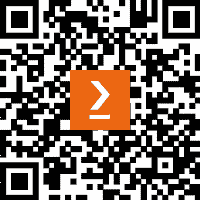

# 前言

PowerShell 是一种免费的、强大且易于学习的编程语言。最初它作为 Windows 的脚本和管理工具编写，现在作为一种开源资源，几乎可以在所有笔记本和台式机上安装。我在过去十年里一直在向同事们教授 PowerShell，并且在空闲时间里，我还在本地学校教孩子们编程，主要是 Python。为什么不通过 PowerShell 来教编程呢？

许多关于 PowerShell 的书籍和课程假设读者能够访问多台机器、Active Directory 域以及各种其他企业环境。它们通常也会低估 PowerShell 中的传统编码元素。本书既不做这些假设，也尝试用类似于我们教授 Python 编程的方式来教授 PowerShell 编程。我受到了密歇根大学 Chuck Severance 博士的杰出工作的启发——如果你想学习 Python，他的 *Python for Everybody* 课程在 [py4e.org](http://py4e.org) 上非常出色。

本书分为三部分。第一部分，我们介绍传统的编码理论；从 PowerShell 作为一种语言的工作原理开始，探讨语言的基本构件，然后讨论如何将这些构件结合在一起形成程序流程。

在第二部分，我们开始将我们学到的原则整合到脚本和模块中，这样我们就可以共享和重用它们。

在本书的最后部分，我们将探讨 PowerShell 在不同环境中的工作原理，最后以一章关于如何访问 PowerShell 所基于的底层框架作结。

我在书中包含了许多有趣且多样的例子和练习。为了最大限度地从中受益，我鼓励你亲自输入代码，而不仅仅是阅读它；打字的实际行为能比单纯浏览它带来更深的参与感。尝试一下问题和活动，在跳到答案之前，好好思考这些问题。如果你需要稍微动脑筋，你会从练习中获得更多的收获。

我非常想听听你的看法，以及你对如何改进本书的任何建议。

# 本书适合谁阅读

本书是为那些想学习编写代码并希望使用 PowerShell 学习的人准备的。这可能是想尝试不同的学校学生、想提升技能的 IT 工程师、爱好者、创客……所有人都适用。如果你是一个有经验的程序员，想将 PowerShell 加入你的技能清单，那么这本书可能不适合你；如果你已经会编写 Java、C++ 或 C#，那么你可能更适合参考 Chris Dent 所著的 *Mastering PowerShell Scripting*，由 Packt 出版。

# 本书涵盖的内容

*第一章*，*PowerShell 介绍 – 它是什么以及如何获取它*，解释了 PowerShell 7 的定义，描述了它的用途以及与 Windows PowerShell 的区别。它描述了如何获取它、如何安装它以及如何运行它，解释了用户模式和管理员模式的区别。它还介绍了如何运行 cmdlet，以及如何在 PowerShell 中获取帮助。

*第二章*，*探索 PowerShell Cmdlet 和语法*，重点介绍了 PowerShell cmdlet 的工作原理、批准的动词、参数、如何通过 PowerShell Gallery 以及互联网其他地方查找新的 cmdlet，最后介绍如何与 PowerShell 进行交互式操作。

*第三章*，*PowerShell 管道 – 如何串联 Cmdlet*，介绍了 PowerShell 管道是 PowerShell 中最重要的概念之一，与 Bash 和命令提示符中的管道工作方式有很大不同。本章将向你展示如何成功地将 cmdlet 串联在管道中以产生有用的结果。它将讨论过滤、输出、管道的工作原理，以及管道为什么有时无法正常工作！

*第四章*，*PowerShell 变量和数据结构*，介绍了变量以及它们可能的不同类型，包括整数、浮动数，以及它们如何都是对象。我们将探索对象的概念及其重要性。我们将查看数据结构作为对象的集合，然后是数组和哈希表，最后介绍 splatting。

*第五章*，*PowerShell 控制流 – 条件语句和循环*，介绍了条件流（`*IF*` 这个，`*THEN*` 那个）和循环，包括 `for`、`each` 和 `while` 循环。通常，你不希望以线性方式处理 cmdlet——你只会在另一个条件成立时才执行某些操作，或者对管道中的所有对象执行某些操作。控制流正是实现这一点的方式。本章还将带领我们从执行交互式 cmdlet 转向在 VS Code 中编写非常简单的脚本。

*第六章*，*PowerShell 和文件 – 读取、写入和操作数据*，教你如何从常见文件类型（如 CSV 和 TXT 文件）中提取数据并进行操作，以及如何将输出发送到文件，从而避免必须从屏幕上读取输出并不断输入的乏味。我们还将讨论如何输出到 HTML，这对于创建格式化报告和在网页托管的仪表板中显示实时数据非常有用。

*第七章*，*PowerShell 与 Web – HTTP、REST 和 JSON*，探索了 PowerShell 与 Web 的关系。文件很好，但许多云端管理需要处理来自互联网的数据；为此，我们需要能够操作最常见的互联网数据类型——JSON。我们还需要操作云服务，因此需要能够使用 REST API 调用。本章将详细讲解这一部分内容。

*第八章*，*编写我们的第一个脚本 – 将简单的 Cmdlet 转化为可重用的代码*，重点讲解了如何将几行代码转化为我们可以保存并反复运行的脚本。我们已经了解了如何在 IDE 中编写几行代码。接下来，如何将这些代码转化为我们希望反复运行的脚本，并使其对其他人有用？

*第九章*，*不要重复自己 – 函数与脚本块*，介绍了 PowerShell 中的函数以及脚本块和 Lambda 表达式。当编写脚本时，我们经常会遇到需要多次运行相同几行代码的情况。将它们转化为脚本中的函数意味着我们只需要编写一次，之后每次需要时只需调用即可。

*第十章*，*错误处理 – 哎呀！出错了！*，涵盖了我们可能遇到的两种主要错误类型——代码执行中遇到的问题和代码本身的问题。在本章的第一部分，我们将定义什么是错误，如何设置 PowerShell 来优雅地处理错误，以及如何理解这些错误。在第二部分，我们将探讨如何识别代码中的问题，并使用 VS Code 进行调试。

*第十一章*，*创建我们的第一个模块*，探讨了如何将函数和脚本转化为可重用的模块，方便分发并能够整合到其他脚本中。现在我们已经有了一个包含一组函数的脚本，下一步是将它转化为其他人也能使用的工具。

*第十二章*，*保护 PowerShell*，深入探讨了如何保护我们的 PowerShell 脚本和模块，并以安全的方式运行它们。PowerShell 是一个非常强大的工具，强大的力量伴随着巨大的责任。本章将涵盖脚本执行策略、代码签名、AppLocker 和其他一些安全功能。

*第十三章*，*在 PowerShell 7 和 Windows 上工作*，探讨了如何在 Windows 上使用 PowerShell 7，我们何时需要使用 PowerShell 5.1，如何使用 WinRM 与远程机器交互，如何通过 CIM 管理机器，以及与 Windows 特性（如存储）的基本交互。PowerShell 起源于 Windows，PowerShell 7 的目标是最终取代 Windows PowerShell，但目前我们还没有完全过渡到那一步。

*第十四章*，*PowerShell 7 for Linux and macOS*，解释了如何在 Linux 上安装 PowerShell，它与在 Windows 上运行 PowerShell 的区别，以及如何在 Linux 上使用 VS Code。它还解释了如何使用 OpenSSH 进行远程操作，如何运行脚本以及一些常见的管理任务。最后，它介绍了如何在 macOS 上安装和运行 PowerShell 及 VS Code。

*第十五章*，*PowerShell 7 与 Raspberry Pi*，探讨了如何在 Raspberry Pi 上开始使用 PowerShell，让我们能够进行家庭自动化、创客项目等。它包括 PowerShell 和 VS Code 的安装，连接 Pi，以及运行脚本。Raspberry Pi 是大家最喜爱的单板计算机，我们可以将 PowerShell 技能转移到我们的 Pi 设备上。

*第十六章*，*与 PowerShell 和.NET 的工作*，深入探讨了.NET，这是 PowerShell 7 构建的平台；它是免费的、开源的，并且与 VS Code 兼容。仅使用 PowerShell 我们无法轻松完成许多任务，但我们可以借助.NET 来实现这些目标。熟悉.NET 是每个高级 PowerShell 程序员的必备技能，本章将帮助你掌握这项技能。

# 如何从本书中获得最大收益

本书假设你有一台客户端计算机，可能是笔记本电脑或 PC，运行的是 Windows、Linux 或 macOS。然而，如果条件紧张，你也可以几乎用 Raspberry Pi 完成所有任务。它还假设你有互联网连接。大部分练习将在 Windows、Linux 和 macOS 上运行；如果有不兼容的地方，会特别标出。阅读第一章，它包含了 Windows 的安装说明，之后根据 Linux/macOS 或 Raspberry Pi 章节中的安装指南操作。

| **本书涵盖的软件/硬件** | **操作系统要求** |
| --- | --- |
| PowerShell 7.x | Windows、macOS 或 Linux |

**如果你使用的是本书的电子版，我建议你自己输入代码。错误是学习的一部分，当我** **意识到** **自己做错了什么时，那种成就感是你不想错过的。**

# 使用的约定

本书中使用了一些文本约定。

`文本中的代码`：表示文本中的代码词汇、数据库表名、文件夹名称、文件名、文件扩展名、路径名、虚拟 URL、用户输入和 Twitter 账号。例如：“应用程序默认安装在`C:\Users\<username>\AppData\Local\Programs\Microsoft VS Code`，并且仅对安装该应用程序的用户可用。”

一块代码如下所示：

```
$x = 5
if ($X -gt 4) {
    Write-Output '$x is bigger than 4'
}
```

当我们希望引起你对代码块中特定部分的注意时，相关的行或项目会以粗体显示：

```
$Array  = 1,2,3,4,5
switch ($Array) {
    1 {Write-Output '$Array contains 1'}
    3 {Write-Output '$Array contains 3'}
    6 {Write-Output '$Array contains 6'}
}
```

任何命令行输入或输出均如下所示：

```
sudo apt update
sudo apt install ./<filename>.deb
```

**粗体**：表示新术语、重要词汇，或您在屏幕上看到的词语。例如，菜单或对话框中的词语会以**粗体**显示。以下是一个例子：“在**选择附加任务**对话框中，选择是否需要桌面图标以及文件和目录上下文菜单选项，这样您就能直接在 VS Code 中打开文件和文件夹。”

提示或重要事项

以这种方式显示。

# 联系我们

我们总是欢迎读者的反馈。

**一般反馈**：如果您对本书的任何部分有疑问，请通过电子邮件联系我们：customercare@packtpub.com，并在邮件主题中提及书名。

**勘误**：尽管我们已尽力确保内容的准确性，但错误难免发生。如果您在本书中发现错误，我们将非常感激您能报告给我们。请访问[www.packtpub.com/support/errata](http://www.packtpub.com/support/errata)并填写表格。

**盗版**：如果您在互联网上发现任何我们作品的非法版本，我们将感激您提供该地址或网站名称。请通过 copyright@packt.com 与我们联系并提供该资料的链接。

**如果您有兴趣成为作者**：如果您在某个领域具有专业知识，并且有意为书籍写作或贡献内容，请访问[authors.packtpub.com](http://authors.packtpub.com)。

# 分享您的想法

阅读完*PowerShell 7 Workshop*后，我们很乐意听取您的想法！请[点击这里直接进入亚马逊评论页面](https://packt.link/r/1801812985)分享您的反馈。

您的评论对我们和技术社区非常重要，它将帮助我们确保提供高质量的内容。

# 下载本书的免费 PDF 版本

感谢您购买本书！

您是否喜欢随时随地阅读，但又无法随身携带印刷书籍？

您的电子书购买是否与您选择的设备不兼容？

不用担心，现在购买每本 Packt 书籍时，您都可以免费获得该书的无 DRM PDF 版本。

在任何地方、任何设备上阅读。搜索、复制并粘贴您最喜爱的技术书籍中的代码，直接将其应用到您的程序中。

福利不仅仅止步于此，您还可以独享折扣、新闻通讯和每日发送到邮箱的精彩免费内容。

按照以下简单步骤获取这些福利：

1.  扫描二维码或访问以下链接



[`packt.link/free-ebook/9781801812986`](https://packt.link/free-ebook/9781801812986)

1.  提交您的购买凭证

1.  就是这样！我们会将您的免费 PDF 和其他福利直接发送到您的邮箱

# 第一部分：PowerShell 基础

在这一部分，我们将学习 PowerShell 的基础知识，包括语言语法如何运作，如何通过管道将一个操作的结果直接传递到另一个操作，PowerShell 如何使用对象、变量和数据结构，如何创建分支和循环代码，最后，我们如何读写存储文件。

本部分包含以下章节：

+   *第一章*，*PowerShell 入门 – 它是什么以及如何获取它*

+   *第二章*，*探索 PowerShell Cmdlet 和语法*

+   *第三章*，*PowerShell 管道 – 如何将 Cmdlet 串联起来*

+   *第四章*，*PowerShell 变量和数据结构*

+   *第五章*，*PowerShell 控制流 – 条件语句与循环*

+   *第六章*，*PowerShell 与文件 – 读取、写入和操作数据*

+   *第七章*，*PowerShell 与 Web – HTTP、REST 和 JSON*
