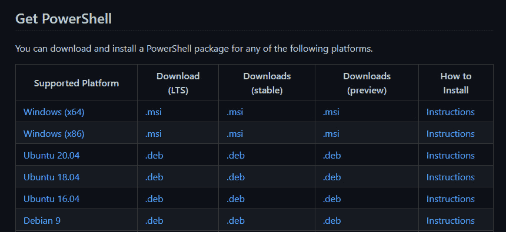

# 第一章：PowerShell 7 介绍 – 它是什么以及如何获取它

简单来说，PowerShell 是一台时光机。不是那种科幻电影里的时光机，你可以回到过去见到自己的祖父，而是一台真正的、实用的时光机。如果你投入少量时间，那么 PowerShell 就像任何简单的机器一样，能够起到倍增作用；它会为你节省大量的时间。用个比喻，它是一把时间锤子，你投入学习 PowerShell 的时间将为你节省数十倍甚至上百倍的时间，一旦你开始将这些知识付诸实践。

本章是 PowerShell 7 的概述介绍。它将为你提供 PowerShell 的背景知识，并帮助你启动和运行。你将学习如何使用 PowerShell 以及一些典型的使用案例。我们将安装 PowerShell，你将选择一种或多种方式进行安装。安装完成后，我们将介绍如何运行命令（称为**cmdlet**），以及如何查找可以运行的 cmdlet。最后，也非常重要的是，我们将介绍如何获取帮助，包括获取 cmdlet 以及 PowerShell 主题和概念的帮助。

本章将涵盖以下主要内容：

+   PowerShell 7 是什么？

+   PowerShell 7 用于什么？

+   获取 PowerShell 7

+   运行 PowerShell 7

+   获取帮助

# 技术要求

为了跟上本章的内容，你需要一个互联网连接和操作系统。如果你使用的是 Linux 或 macOS，安装说明可以在*第十四章**,* *Linux 和 macOS 上的 PowerShell 7* 中找到，因此跳过本章 *如何获取 PowerShell 7* 部分的详细安装说明。

本章假设你将使用运行在标准 64 位 x86 架构上的 Windows 10（版本 1709 或更高版本）。如果你不确定自己的系统是否符合这个要求，不用担心，应该是的。如果你是那种总是担心的人，可以打开 Windows 搜索框，输入 `msinfo32`，然后按 *Enter*。**系统信息**应用程序将打开，在**系统摘要**下，你会看到三行相关信息：

+   **操作系统名称**：希望是某种版本的**微软 Windows 10**；PowerShell 7.3 可在所有当前支持的 Windows 版本上使用。

+   **版本**：你需要一个比 16299 更高的版本号。

+   **系统类型**：可能是**基于 x64 的 PC**。

以下截图显示了在**系统摘要**下的样子：


图 1.1 – 系统信息应用程序（msinfo32）中的典型信息

如果你使用的是 Windows 11，那么恭喜你；你不需要做一些我们将讨论的事情，因为 Windows 11 提供了一些额外的功能。

# PowerShell 7 是什么？

**PowerShell** 是一种脚本语言，是命令行接口的替代工具。PowerShell 是一个自动化工具，至少由三部分组成：

+   一个 shell，类似于 Windows 中的命令提示符或 Linux 或 macOS 中的终端

+   一个脚本语言

+   一个名为 **Desired State** **Configuration** (**DSC**) 的配置管理框架

实际上，当我们谈论 PowerShell 时，通常是指脚本语言。正如我们所看到的，Shell 的使用对用户来说是直观的，尽管我们稍后会讨论 DSC，但根据我的经验，大多数人并没有像应该的那样充分使用它。

PowerShell 的第一个版本源自一个名为**Monad**的项目，这是 Jeffrey Snover 试图在 Windows 上复制 Unix 工具的尝试。他意识到 Unix 工具的一个基本缺点是它们输出的是字节流（通常是文本），因此在你能够对输出结果进行操作之前，很多努力都浪费在搜索、格式化和提取命令输出上。Monad 被写成输出对象，这些对象可以直接输入到另一个命令中。我们将在 *第四章*，《PowerShell 变量和数据结构》中详细讨论这一点。PowerShell 1.0 于 2006 年发布，但依我看，直到 PowerShell 2.0 在 2009 年发布，且微软开始重新设计主要软件（如 Exchange Server 2010）的管理界面以便利用 PowerShell 时，它才真正起步。其他看法也是存在的。

在撰写本文时，PowerShell 主要有两种*版本*：**Windows PowerShell**，它随 Windows 的服务器版和桌面版捆绑在一起，以及**PowerShell 7**，它需要下载并安装。Windows PowerShell 的最新（且 allegedly 最终）版本 v5.1 构建在 .NET Framework 4.5 上，这是与 Windows 一起捆绑的专有软件框架，并支撑了微软的许多产品。PowerShell 7.0 是基于 .NET Core 3.1 构建的，这是一个简化版的、开源实现的 .NET。然而，自从 7.2 版本起，PowerShell 已经基于 .NET 6.0 构建。这个统一版本的 .NET 代替了 .NET Framework 和 .NET Core，并在 2020 年 11 月发布。

由于 Windows PowerShell 5.1 和 PowerShell 7.x 之间的根本差异，它们在 Windows 平台上的工作方式可能会有所不同。我们将在 *第十三章*，《在 PowerShell 7 和 Windows 中工作》中讨论这些差异。

我们将总结一些关键差异，并在以下表格中列出：

| **参数** | **Windows PowerShell** | **PowerShell 7.2** |
| --- | --- | --- |
| **平台** | 仅限 x64, x86 | x64, x86, arm32, arm64 |
| **操作系统** | Windows | Windows、Linux、macOS |
| **.NET 版本** | .NET Framework 4.5 | .NET 6.0 |
| **许可证类型** | 专有 | 开源 |
| **本地命令数量** | 1588（在原生 Windows 10 中） | 1574（在原生 Windows 10 中）290（在 Ubuntu 20.04 中） |

表 1.1 – Windows PowerShell 和 PowerShell 7 之间的一些差异

在这一部分中，我们已经介绍了 PowerShell 是什么，以及它与 Windows PowerShell 的区别。在下一部分中，我们将探讨 PowerShell 7 的存在意义，并看看它有什么特别之处。

# PowerShell 7 用于什么？

PowerShell 是为了快速完成任务。它适用于当你需要一个相对较短的代码片段，并且可以轻松地重用和重新设计来完成其他任务时。它适用于当你不想花几个月时间学习一门语言，再花更多的时间编写成千上万行代码时。这个语言至少可以有四种使用方式：

+   你可以像在 Windows 命令提示符或 Linux 终端中一样，在 shell 中输入单行代码。如果你需要检查一个值、执行一个单一任务（如重启远程计算机）或抓取日志文件时，这非常有用。

+   你可以编写一个脚本，比如在 Linux 中的 Bash 脚本或 Windows 中的批处理文件，用来完成多个子任务，例如从几台机器中收集事件日志和性能信息，并将它们汇总成一个单一的 HTML 报告。

+   如果你编写了很多脚本或需要完成一些更复杂的任务，你可以将 PowerShell 用作一种过程式编程语言，使用多个封装的脚本，每个脚本描述一个单一的功能，并由主脚本调用。

+   你可以将它作为一种面向对象的编程语言，封装一个完整的应用程序，该程序可以重新分发并由任何安装了 PowerShell 的人运行。

本书将重点讲解脚本和过程式编程，因为这是大多数人使用 PowerShell 的方式。这两者非常相似；不同之处在于，在脚本中，你使用的是已经为你编写的 cmdlet，而在过程式编程中，你正在创建自己的 cmdlet，可能是从现有的 cmdlet 中创建，或使用系统编程语言 C# 来创建。

## 脚本语言与系统编程语言

PowerShell 语言是一种脚本语言。它用于快速且轻松地将其他应用程序粘合在一起——有点像编程版的乐高。它依赖于一个底层的解释器：PowerShell 程序。如果没有安装 PowerShell，PowerShell 脚本无法运行。这与其他解释型语言（如 Python）类似，并且与系统编程语言（如 C 或 C++）形成对比，后者被编译成可执行文件。当你编译一个 C++ 程序时，它理论上可以在任何兼容的机器上运行。还有其他差异——以下是一些主要的区别：

+   解释型语言比编译型语言效率低，因为每一行代码都必须在运行之前进行解释。这意味着它们比编译程序要慢。虽然有一些编程技巧可以加速，但在解释型语言中执行任务通常会比在编译型语言中执行要慢。

+   解释语言在开发中比编译语言更有效率。它们可以用更少的代码完成相同的任务。这意味着编写、调试和重用这些代码会更快。它们也更容易学习。

+   解释语言可以在多种架构上运行。正如本书中所示，使用 PowerShell 编写的代码可以在 Windows、Linux 或 macOS 上运行，只需进行最少的调整。而用 C++ 编写的程序只能在 Windows 上运行，或者在具有 Windows 模拟的机器上运行。它需要重新编写和重新编译以在不同平台上运行。

+   解释语言生成协作可重用的程序。使用 PowerShell（或 Python），您可以生成人类可读且可编辑的代码。而使用编译语言，您生成的是无法轻易反编译为源代码以便重用的二进制文件。这意味着其他人可以为自己的目的重用您的代码。像 GitHub 这样的平台可以用来分发您的代码，其他人可以为其做出贡献、改进它、将其重用于其程序，并以一种普遍的社区方式行事。

归根结底是这样的：如果您想编写一个具有壮观图形的超快第一人称射击游戏，那么 PowerShell 可能不适合您。如果您想要自动化一些任务，无论是简单还是复杂，PowerShell 都是一个不错的选择。

# 获取 PowerShell 7

在本节中，我们将探讨将 PowerShell 安装到计算机上的一些方法、安装位置及其原因，以及如何控制安装的各个方面。本章仅涵盖 Windows 上的安装；有关 Linux、macOS 和 ARM 系统的详细安装，请参阅*第十四章*，*Linux 和 macOS 上的 PowerShell 7*，或*第十五章*，*PowerShell 7 和树莓派*，然后返回本章的后两节。

您的计算机上可能同时运行多个 PowerShell 版本 - 我通常一次运行三个版本：Windows PowerShell、PowerShell 7（当前版本）和 PowerShell 7 预览版。这不仅适用于我写书时使用 - 我们需要确保我们编写的脚本可以在不同的环境中运行，并在必要时重新编写它们。当您计划在尚未安装 PowerShell 的远程计算机上运行 PowerShell 时，控制安装也非常有用。Windows PowerShell 包含在 Windows 操作系统中，并安装在 `\Windows\system32` 文件夹中；它的存在位置不可更改。相比之下，PowerShell 7 可以根据需要安装在任何地方。我们将介绍安装的三种最常见方法：

+   使用 Windows 安装程序从 `.msi` 文件安装

+   从 `.``zip` 文件安装

+   使用 winget 安装

我们将简要介绍另外两种方法：从 Microsoft Store 安装和安装为 .NET 全局工具。

如果你想做些实验，并且你有 Windows 10 专业版或企业版，那么可以在 **控制面板** | **程序和功能** | **启用或关闭 Windows 功能** 中启用 **Windows Sandbox** 功能。

这将为你提供一个完全空白、安全的 Windows 环境供你尝试。请小心——当你关闭它时，它就会永久消失。下次启动时，你所有的更改将会丢失：


图 1.2 – 开启 Windows Sandbox

有关运行 Windows Sandbox 的详细要求，请参见此链接：[`docs.microsoft.com/en-us/Windows/security/threat-protection/Windows-sandbox/Windows-sandbox-overview`](https://docs.microsoft.com/en-us/Windows/security/threat-protection/Windows-sandbox/Windows-sandbox-overview)。

让我们开始吧。请确保你已经满足章节开始部分列出的技术要求。

## 从 .msi 文件进行安装

所有官方的 PowerShell 发行版都可以在 PowerShell 的 GitHub 页面找到：[`github.com/PowerShell/PowerShell`](https://github.com/PowerShell/PowerShell)：



图 1.3 – 从 GitHub 页面获取 PowerShell

如你所见，对于大多数操作系统和平台，有三种版本发布类型：**LTS**、**稳定版**和**预览版**。**LTS** 代表 **长期支持**。LTS 版本的发布速度较慢，旨在确保在风险规避的环境中保持稳定，它们通常仅包含关键的安全更新和软件修复，而不会加入新功能。PowerShell 的 LTS 版本基于 .NET 的 LTS 版本。预览版是 PowerShell 的下一个版本，可能会有令人兴奋的新特性，但也可能不稳定，存在一些缺陷。稳定版每月更新一次，可能包含新功能，以及软件修复和安全更新。每个版本在发布下一个版本后，支持六个月。

让我们继续安装最常见的版本——适用于 Windows x64 的稳定版：

1.  在这里浏览 PowerShell 的 GitHub 发布页面：[`github.com/PowerShell/PowerShell`](https://github.com/PowerShell/PowerShell)。

1.  点击下载适用于 Windows x64 的稳定 `.msi` 安装包。

1.  在你的 `Downloads` 文件夹中找到 `.msi` 文件并运行它，这将启动安装向导。

1.  你需要做的第一个选择是安装位置。默认情况下，它会安装到 `C:\Program Files\PowerShell` 下的一个编号文件夹中，其中编号与主版本号相匹配——在我们这个例子中是 `7`。如果你安装的是预览版，那么文件夹名会带有 `-preview` 后缀。这是一个相当不错的位置，但如果你同时运行多个版本的 PowerShell，可能会希望将其安装到其他位置。此次就接受默认设置吧：


图 1.4 – 默认安装位置

1.  现在我们进入了**可选操作**菜单：


图 1.5 – 可选操作

这里有五个选项：

+   使用 `pwsh.exe` 来运行此命令。

+   **注册 Windows 事件日志清单**：您也应该启用此选项。这将创建一个新的 Windows 事件日志，名为**PowerShell Core**，并开始记录 PowerShell 事件。

+   **启用 PowerShell 远程功能**：启用 PowerShell 远程功能将使计算机监听来自 PowerShell 会话的传入连接。显然，这在安全上存在一些漏洞，因此只有在需要时并且您的计算机处于私有网络中时才应启用它。您不需要启用它来连接到其他计算机的远程会话。

+   **在资源管理器中添加“在此打开”上下文菜单**：这将允许您在文件资源管理器中的文件夹中打开 PowerShell 会话——PowerShell 会话将打开，并且路径会设置为您选择的文件夹。

+   **为 PowerShell 文件添加“使用 PowerShell 7 运行”上下文菜单**：这将允许您右键单击文件并使用 PowerShell 7 打开它。由于后面我们将看到的原因，这可能并不总是可取的。

1.  在**可选操作**之后，我们进入了**Microsoft 更新**选项。您可以使用 Microsoft 更新来保持 PowerShell 的最新状态；强烈建议启用此选项，因为它可以自动为您下载安全补丁并根据现有的更新计划应用它们。请注意，如果您在域环境中工作，此设置可能会被组策略覆盖。有两个复选框，第一个用于启用 PowerShell 更新，第二个用于启用系统上的 Microsoft 更新。请注意，取消选中此框只会禁用 Microsoft 更新；如果您的环境使用了如**Windows 软件更新服务**（**WSUS**）或**系统中心配置管理器**（**SCCM**）等配置管理工具，它们仍会继续工作。

1.  最后，我们准备通过点击**安装**按钮来安装。这个过程很短，应该在一两分钟内完成。点击**完成**，我们就完成了安装。

有一种替代方法，不使用 GUI。您可以通过命令行使用 `msiexec.exe` 运行 `.msi` 文件，具体文档见此处：[`docs.microsoft.com/en-gb/powershell/scripting/install/installing-powershell-on-Windows?view=powershell-7.2#install-the-msi-package-from-the-command-line`](https://docs.microsoft.com/en-gb/powershell/scripting/install/installing-powershell-on-Windows?view=powershell-7.2#install-the-msi-package-from-the-command-line)。

如您刚刚所示，要在 Windows 沙盒中静默安装 PowerShell，您可以运行以下命令：

```
msiexec.exe /package c:\Users\WDAGUtilityAccount\Downloads\PowerShell-7.2.1-win-x64.msi /quiet REGISTER_MANIFEST=1 USE_MU=1 ENABLE_MU=1
```

请注意，命令行没有启用或禁用 `.msi` 文件的属性，因此 PowerShell 会自动添加。由于我们使用了 `/quiet` 开关，此命令不会有输出，但如果成功，您将会在开始菜单中看到 PowerShell。

活动 1

如何在使用命令行从 `.msi` 文件安装 PowerShell 时启用文件上下文菜单？（提示：查看前面段落中的链接了解详情。）

## 从 `.zip` 文件安装

另一种流行的安装 PowerShell 的方式是通过 `.zip` 文件。使用这种方法，我们只是将二进制文件和相关文件提取到合适的文件夹中。缺点是，你将失去 `.msi` 安装时的前置条件检查和选项；例如，你不能自动将 PowerShell 添加到 `PATH` 环境变量中或启用 PowerShell 远程功能。优点是，它使得在 DevOps 或基础设施即代码管道中脚本化安装 PowerShell 变得更容易，并且可以在脚本中启用其他功能。

在 Windows 中，没有原生的方式通过脚本从互联网安装文件。你需要已经安装了 PowerShell（在 Windows 机器上，Windows PowerShell 会自动安装），或者安装一个像 **curl** 这样的工具。

这是你用 Windows PowerShell 执行的方式：

```
Invoke-WebRequest https://github.com/PowerShell/PowerShell/releases/download/v7.2.1/PowerShell-7.2.1-win-x64.zip
```

如果你运行前面的 cmdlet，你应该会看到如下输出。注意，这是一个 HTTP 响应，因此 `StatusCode` 结果为 `200` 是好的：


图 1.6 – 使用 Windows PowerShell 下载 PowerShell 7

你可以像这样通过四行代码运行整个过程：

```
New-Item -Path c:\scratch\myPowershell\7.2 -ItemType Directory
Invoke-WebRequest https://github.com/PowerShell/PowerShell/releases/download/v7.2.1/PowerShell-7.2.1-win-x64.zip -OutFile C:\scratch\myPowershell\7.2\PowerShell-7.2.1-win-x64.zip
Expand-Archive C:\scratch\myPowershell\7.2\PowerShell-7.2.1-win-x64.zip -DestinationPath C:\scratch\myPowershell\7.2\
Remove-Item C:\scratch\myPowershell\7.2\PowerShell-7.2.1-win-x64.zip
```

不要太担心前面的命令——我们稍后会逐一讲解。总的来说，第一行创建一个新文件夹，第二行从 GitHub 下载 `.zip` 包到你新建的文件夹中，第三行解压所有文件，准备好运行，第四行则删除下载的包。

你可能会遇到两个错误。首先，你可能会看到一个红色的错误信息：

```
Invoke-WebRequest : The request was aborted: Could not create SSL/TLS secure channel"
```

这是因为，默认情况下，Windows PowerShell 会使用 TLS v1.0，而许多网站不再接受此协议。如果你看到这个错误，运行以下 .NET 代码并再试一次：

```
[Net.ServicePointManager]::SecurityProtocol = "Tls, Tls11, Tls12, Ssl3"
```

另一个你可能会看到的错误信息是：

```
Invoke-WebRequest : The response content cannot be parsed because the Internet Explorer engine is not available, or Internet Explorer's first-launch configuration is not complete. Specify the UseBasicParsing parameter and try again
```

在这种情况下，使用 `–``UseBasicParsing` 参数运行 `Invoke-WebRequest` cmdlet：

```
Invoke-WebRequest https://github.com/PowerShell/PowerShell/releases/download/v7.2.1/PowerShell-7.2.1-win-x64.zip -UseBasicParsing
```

将脚本中的第二行替换为这一行。它与之前的完全相同，但增加了 `–``UseBasicParsing` 参数。

## 使用 winget 安装

`.exe`、`.msi` 和 `.msix` 包 – 你不能用它来安装 `.zip` 版本。当你运行 winget 时，它会搜索、下载并安装你选择的 PowerShell `.msi` 版本。操作如下：

1.  首先，运行 PowerShell 包的搜索。从 Windows PowerShell 命令提示符下，运行以下命令：

    ```
    winget search microsoft.powershell
    ```

这将返回 winget 可用的 PowerShell 版本。

1.  然后，你需要安装一个包。我选择通过运行以下命令来安装预览版：

    ```
    winget install --id microsoft.powershell.preview --source winget
    ```

就是这样。这里有几点需要注意。首先，你正在安装 `.msi` 文件，因此除非你抑制它们，否则会看到多个图形界面消息。你可以使用 `--silent` 开关来抑制这些消息。除非你接受默认选择，否则你还需要一种方法来向调用的 `.msi` 文件传递参数。你可以使用 `--override` 开关，然后传递我们之前查看过的 `.msi` 包的命令行开关。其次，如果你启用了用户访问控制（UAC），你需要允许 PowerShell 安装。如果你使用 `--silent` 开关，那么你不会看到这个提示。如果你想进行静默安装，你需要以管理员权限运行 Windows PowerShell。

如果你以管理员权限从 Windows PowerShell 命令行运行安装命令，整个安装过程如下所示：


图 1.7 – 使用 winget 静默安装 PowerShell

winget 的主要优势是它有自己的社区创建的包管理库；任何人都可以通过编写清单并上传来打包一个应用。该库使用微软的 SmartScreen 技术加以保护，以防恶意代码进入库中。关于 winget 还有很多内容，请参考这里：

[`docs.microsoft.com/zh-cn/Windows/package-manager/winget/.`](https://docs.microsoft.com/en-us/Windows/package-manager/winget/)

总结来说，你通过 winget 所做的事情其实与之前通过运行 `msiexec.exe` 所做的没有什么不同，只是它稍微新一些、更酷，并且拥有一个有用的包管理库，使用起来也稍微容易一些。几年后，我们会想，曾经没有它时我们是怎么做的，尤其是如果它在 Windows 服务器上也可用的话。

## 其他安装方式

我们应该讨论的还有另外两种安装 PowerShell 的方式。两者都不太可能适用于我们。首先，如果你已经安装了 .NET **软件开发工具包**（**SDK**），那么我们可以使用它将 PowerShell 安装为一个全局工具。这个方法实际上只对软件开发人员有用，而且仅为了 PowerShell 安装 SDK 并不太有意义。

另一种在 Windows 上安装 PowerShell 的方式是通过微软商店作为应用安装。此方法的主要缺点是商店应用运行在一个沙盒环境中，这限制了对应用根文件夹的访问。这意味着一些 PowerShell 功能将无法正常工作。

注意

**沙盒** 不一定等同于 **Windows 沙盒**。术语“沙盒”通常指的是一个具有独立资源的安全计算环境，这意味着运行在其中的任何东西都不能干扰沙盒外的内容。Windows 沙盒是沙盒的一种特定实现。

# 运行 PowerShell 7

每个人运行 PowerShell 的第一种方式是通过捆绑的控制台（记住，PowerShell 不仅仅是一种语言，它还是一个 shell 和配置管理框架）。假设你使用之前的 `.msi` 方法进行安装，并将 PowerShell 添加到了 `PATH` 环境变量中。如果你已经这么做了，那么启动 PowerShell 只需要在 Windows 搜索框中输入 `pwsh` 并点击应用程序。或者，你也可以右键点击 *开始* 菜单，在 **运行** 框中输入 `pwsh`。或者，你也可以按住 *Windows* 键并按 *R*，这也会打开 **运行** 框。

如果你没有将 PowerShell 添加到路径中，你将需要输入完整的可执行文件路径 `pwsh`，例如 `C:\program files\PowerShell\7\pwsh`。

如果你关注了前面的截图，或者跟随步骤操作，你首先会注意到控制台窗口的背景是黑色的。这将其与 Windows PowerShell 区分开来：


图 1.8 – 两种不同版本的 PowerShell

如果你在 Linux 或 macOS 上安装了 PowerShell，那么请打开终端并输入 `pwsh` —— 终端会切换到 PowerShell 提示符。

在大多数编程书籍中，传统的第一步是让你的应用程序在屏幕上显示 `"Hello World"` 字样，我们也不例外。请在控制台中输入以下内容并按 *Enter* 键：

```
Write-Host "Hello World"
```

你应该会看到类似这样的内容：


图 1.9 – 你好，自己

如果你完成了，恭喜你！你刚刚运行了第一个 PowerShell 命令，或者叫做 cmdlet。

注意，控制台会自动为它识别或期望的内容着色；cmdlet 是黄色的，字符串是蓝色的。它也非常宽容——如果你忘记了引号，`"Hello World"` 将不会是蓝色的，但 PowerShell 仍然会正确地解析它。

注意

小心使用这一点；虽然 PowerShell 非常智能，但它并不总是按你希望的方式解读输入。最好明确告诉它你正在输入的是什么类型的内容。稍后会详细讲解。

错误最常见的原因是你拼写错了 cmdlet 或者没有关闭引号，如下图所示。你会看到一个有帮助的红色错误信息，告诉你哪里出错了，并建议你如何修复它。我已经开始珍惜这些错误信息了：


图 1.10 – 三种错误方式

在第三次尝试时，我没有关闭引号，因此 PowerShell 期望更多输入。它通过下面一行的 `>>` 告诉我们这一点。它还通过将命令提示符中的 `>` 标记为红色，告诉我们它认为命令行不会按你写的那样运行。

请注意，不像某些环境中那样，这里大小写不重要；`write-host` 和 `Write-Host` 在功能上是相同的。

## 以管理员权限运行 PowerShell

默认情况下，PowerShell 会在启动它的帐户下运行，但它只会拥有标准用户权限。如果你需要访问通常需要管理员权限的本地机器，那么 PowerShell 会无法运行某些 cmdlet，或者会弹出 **用户帐户控制**（**UAC**）提示。为了避免这种情况，你需要以管理员权限启动 PowerShell。这里有很多方法来实现，但以下是两种最常见的方法。

首先，你可以打开搜索栏，输入`pwsh`，然后右键点击 PowerShell 7 图标并选择**以管理员身份运行**：


图 1.11 – 以管理员身份启动 PowerShell

第二种稍微更强大的方法是按下*Windows*键 + *R* 打开 `pwsh`，然后按住 *Ctrl* + *Shift* + *Enter*，这将以管理员身份启动 PowerShell。

PowerShell 会清楚地在窗口标题中显示它是否以管理员权限运行。以下是两个 PowerShell 会话运行相同 cmdlet 的情况。下方的窗口是以管理员权限运行的：


图 1.12 – 有时你需要是管理员

如果你经常需要使用管理员模式，最简单的办法是右键点击正在运行的 PowerShell 图标并选择**固定到任务栏**。然后，你可以在需要时右键点击固定的图标并选择**以管理员身份运行**。

## 自动补全

到现在为止，你可能已经有些厌倦了不断输入大量长且不熟悉的 cmdlet。让我向你展示一个非常棒的 shell 功能：自动补全。试试这个——在你的 shell 中，输入以下内容，不要按 *Enter*：

```
Stop-s
```

现在按下 *Tab* 键。酷吧？不过这还不是我们想要的 cmdlet。再按一次 *Tab* 键。此时你应该看到 `Stop-Service` cmdlet 完整地输入了。现在，添加一个空格，输入 `-`，然后再次按 *Tab* 键。继续按 *Tab* 键，直到你浏览完 `Stop-Service` cmdlet 所有可能的参数。完成后按 *Esc* 键。

这是一个很好的方法，可以避免输入大量字母，但它也是一个检查你所做操作是否有效的好方式。如果自动补全不起作用，那很可能是你想要的 cmdlet、参数或选项在这台机器上不可用。

在下一章，我们将探讨一些启动和使用 PowerShell 的其他方法，但现在，你已经准备好所需的一切了。

# 获取帮助

现在你已经安装了 PowerShell 并可以启动它，你需要用它来做一些事情。你肯定需要一些帮助。幸运的是，PowerShell 内置了三个非常有用的 cmdlet：`Get-Command`、`Get-Help` 和 `Get-Member`。这些 cmdlet 将告诉你一些有用的内容，并提供指导。我们先从 `Get-Command` 开始。

## Get-Command

`Get-Command` 会给你一个 cmdlet 列表。如果你直接输入它，它会列出大约 1,500 个 cmdlet。当你开始安装和编写模块时，这个列表会大大增加。浏览成千上万的 cmdlet 以寻找可能的命令并不是很高效。你需要做的是搜索这个列表。

假设你需要调查正在你客户端上运行的某个特定进程。一个执行此操作的 cmdlet 很可能会在某个地方包含 `process` 这个词。试着在你的 shell 中输入以下内容：

```
Get-Command *process
```

你应该会看到类似这样的内容：


图 1.13 – 搜索相关 cmdlet

该 cmdlet 会将 `*process` 解释为一个字符串，并搜索以 `process` 结尾的 cmdlet。`*` 是一个通配符字符。尝试像这样运行它：

```
Get-Command process
```

你可能会看到一个红色的错误。

这些 cmdlet 中有些看起来有点复杂，但也有一些特别突出——尤其是 `Get-Process`。试着运行它。你应该会看到一长串进程以及关于它们的一些信息。让我们看看一个我知道你正在运行的进程：`pwsh`。输入以下内容：

```
Get-Process pwsh
```

你应该看到有关你 PowerShell 进程的信息：


图 1.14 – 我的 PowerShell 进程

这很不错，但它到底意味着什么呢？让我们来看一下我们的三个有用 cmdlet 之一：`Get-Help`。

## Get-Help

运行 `Get-Help` cmdlet 很简单；输入 `Get-Help` 后跟你希望获得帮助的 cmdlet 名称：

```
Get-Help Get-Process
```

然后你应该会看到类似这样的内容：


图 1.15 – 第一次运行 Get-Help

这看起来不太有帮助。然而，如果你阅读 `REMARKS` 部分，会有一个解释。PowerShell 并没有自带完整的帮助文件；你需要下载并更新它们。要更新帮助文件，运行以下命令：

```
Update-Help
```

运行过程会稍微花一点时间，如果你安装了某些模块，可能并非所有模块的帮助文件都能在线获取，所以你会看到红色的错误信息，但经过一两分钟后，应该就能完成，接着你可以尝试再次获取 `Get-Process` 的帮助。

### Get-Help Get-Process

PowerShell 相当偏向于 *en-US* 文化。这里的文化是指 .NET 和 PowerShell 等相关程序中的一个特定含义；它相当于 `en-US`，因此它可能不会下载所有相关的帮助文件。如果你发现没有获取到所有内容，试着运行以下命令：

```
Update-Help -UICulture en-US
```

然后，重新尝试。这特别影响 Linux 安装。

你应该能看到更多信息，包括一行的简介和详细描述。如果这还不够，那么在`REMARKS`部分，你将会看到一些获取更多 cmdlet 信息的其他方法。试试运行这个命令：

```
Get-Help Get-Process -Detailed
```

你将看到更详细的信息，包括如何使用该 cmdlet 的示例。要查看所有可用的信息，可以使用以下命令：

```
Get-Help Get-Process -Full
```

你将看到帮助文件中的所有内容，包括非常有用的`NOTES`部分，对于这个 cmdlet，它将告诉你如何解释输出中的一些值。

还有一种有用的方法可以使用`Get-Help`来查看 cmdlet 的帮助信息，方法是使用`-online`参数：

```
Get-Help Get-Process -Online
```

这将会在你的默认浏览器中打开该 cmdlet 的网页；它提供的信息与使用`-Full`参数时相同。

### 关于文件

`Get-Help`不仅帮助你了解 cmdlets，还能通过一套特殊的文件叫做`ABOUT TOPICS`提供许多关于 PowerShell 概念的有用信息。在撰写本文时，已经有超过 140 个此类文件。这些文件包含大量关于编程概念、构造以及常见查询的信息，例如 Windows 和非 Windows 环境的日志记录。通过运行以下命令，你可以自行查看：

```
Get-Help about*
```

我们来看一下其中一个文件：

```
Get-Help about_Variables
```

你应该能看到很多关于 PowerShell 中变量使用的有趣信息。

你也可以使用全文搜索来查询`Get-Help`。如果你查找的词不在帮助文件的文件名中，那么将会搜索文件的内容。这个过程稍微慢一些，但通常是值得的。试试输入以下命令：

```
Get-Help *certificate*
```

记住你得到的结果。现在，尝试输入`certificates`，复数形式：

```
Get-Help *certificates*
```

你将会得到一组不同的结果。第一组结果会找到文件名中包含`certificate`的帮助文件。当`Get-Help`产生第二组结果时，它找不到任何包含`certificates`的文件名，因此会执行全文搜索。请注意，如果搜索词出现在文件名中，那么全文搜索将不会执行。

我发现这些文件的唯一缺点是，假设你对 PowerShell 中的其他内容都很了解，只除非是当前讨论的主题。例如，`ABOUT_VARIABLES`在开头几段中提到了`scope`变量。尽管如此，如果你需要快速了解某个事物的工作原理，那么这些文件仍然是一个很好的资源。

## Get-Member

本章我们将要看的一最后一个有用的 cmdlet 是`Get-Member`。在本章之前，我们讨论了 PowerShell 是如何生成对象，而不是像某些 shell 和脚本语言那样生成文本输出的。`Get-Member`允许你查看这些对象的成员、属性以及可用于它们的方法。通过展示而非描述来讲解会更容易理解，所以请继续在你的 shell 中输入以下命令：

```
Get-Process | Get-Member
```

注意

两个 cmdlet 之间的竖线称为管道字符 |。它不是小写字母 L——在我的 en-GB 标准 PC 键盘上，它位于左下角，靠近 *Z* 键；在标准的 en-US 键盘上，它位于 *Enter* 和 *Backspace* 键之间。如果你的键盘没有实心的竖线 (*|*)，那么破折竖线 (*¦*) 也可以使用。

你在这里做的是将 `Get-Process` cmdlet 的输出通过管道传递给下一个 cmdlet 作为输入，在这个例子中是 `Get-Member`。在后续的章节中，我们将进行大量关于管道的工作。`Get-Member` 会告诉你你提供的对象类型，在这种情况下是 `System.Diagnostics.Process` 对象，以及与该对象相关的方法、属性、别名属性和事件，如下所示：


图 1.16 – System.Diagnostics.Process 的一些成员

几页之前，在*图 1.14*中，我们查看了在您的机器上运行的 `pwsh` 进程的属性。这些是列出的属性：`NPM(K)`、`PM(M)`、`WS(M)`、`CPU(s)`、`ID`、`SI` 和 `ProcessName`。如您现在所见，这些是 `Non-Paged Memory (K)`、`Paged Memory (M)`、`Working Set (M)` 和 `Session ID`，它们都是别名，以便能够在屏幕上整齐地显示在表格中。`CPU(s)` 别名的衍生方式稍有不同——它不是在对象上设置的。ID 和进程名称不是别名。M 和 K 分别是 **兆字节** 和 **千字节** 的缩写。这只是该对象上所有属性的一个非常小的子集。如您所见，还有可用于对对象执行操作的方法。

活动 2

看看这些方法。你可能会使用什么方法来强制立即停止一个进程？如果你卡住了，可以查看这里的这些方法：[`docs.microsoft.com/en-us/dotnet/api/system.diagnostics.process`](https://docs.microsoft.com/en-us/dotnet/api/system.diagnostics.process)。

在本书的剩余部分，我们将多次回到 `Get-Member`，因为它是一个非常有用的 cmdlet。

# 总结

在本章中，我们做了很多工作。我们讨论了 PowerShell 是什么以及它适合用于什么，比如快速简便地生成小段自动化代码。我们已经以几种不同的方式下载并安装了它，具体来说，通过从 `.msi` 文件安装和从 `.zip` 文件提取来安装它。

我们尝试了使用内置 shell 启动它的几种不同方法，最后，我们查看了三个有用的 cmdlet：`Get-Command`，用于查找我们可能使用的 cmdlet，`Get-Help`，用于了解如何使用它们，以及 `Get-Member`，用于理解这些 cmdlet 输出的内容。

在下一章，我们将探索 cmdlet 如何工作，探索参数和语法，并查看一个有用的应用程序，用于与 PowerShell 进行交互式操作：Windows Terminal。

# 练习

1.  你会使用哪个 cmdlet 来生成一个随机数？

1.  你如何生成一个 1 到 10 之间的随机数？

1.  你会使用哪个 cmdlet 来列出文件夹的内容？

1.  如何同时获取子文件夹的内容？

1.  你会使用哪个 cmdlet 来创建一个新文件夹？

1.  哪个 cmdlet 可以告诉你计算机已经开机多久？

1.  哪个 cmdlet 可以将输出重定向到文件？

1.  你可以使用 `Get-Credential` cmdlet 做什么？

1.  你如何使用 `ConvertTo-HTML` cmdlet？

# 进一步阅读

+   由 Jeffrey Snover 撰写的 *Monad 宣言* 是一本关于 PowerShell 背景和哲学的好读物：[`www.jsnover.com/Docs/MonadManifesto.pdf`](https://www.jsnover.com/Docs/MonadManifesto.pdf)。

+   John Ousterhout 撰写了一篇具有影响力的文章，讨论了脚本编程与系统编程的区别，以及为什么脚本编程重要且有用：[`web.stanford.edu/~ouster/cgi-bin/papers/scripting.pdf`](https://web.stanford.edu/~ouster/cgi-bin/papers/scripting.pdf)。
