# 第二章：探索 PowerShell Cmdlet 和语法

现在我们已经安装了 PowerShell，是时候开始使用它了。PowerShell 的强大之处在于它提供了大量的 cmdlet。在本章中，我们将学习这些 cmdlet。首先，我们将了解命名约定如何工作，然后学习如何通过参数控制它们的行为。

我们将深入探讨语法，以便完全理解每个 cmdlet 可用的参数以及这些参数需要什么信息才能正常工作。然后我们将学习如何从本地计算机和外部资源获取更多的 cmdlet 进行使用。

最后，我们将讨论如何与 PowerShell 进行交互式操作，并将为 Windows 安装一个令人兴奋的新应用程序，帮助我们实现这一点。到本章结束时，您将能够自信地找到并使用不熟悉的 cmdlet，并能够使用多功能的 Windows Terminal 应用程序。

本章将涵盖以下主要内容：

+   什么是 cmdlet？

+   理解 cmdlet 语法

+   如何查找更多的 cmdlet

+   与 PowerShell 进行交互式操作

# 技术要求

本章假设您已经拥有客户端机器、互联网连接，并且安装了最新的稳定版 PowerShell 7。本章的最后两节—— *Windows Terminal – 另一种终端模拟器* 和 *从 Windows Store 安装 Windows Terminal*——是专为 Windows 用户准备的。使用 Linux 和 macOS 的我们可以放心，因为我们不需要做这些部分，这些操作系统已经包含了多标签终端。

# 什么是 cmdlet？

**Cmdlet**（发音为 *command-lets*）是我们在 PowerShell 中使用的命令。它们可以通过终端应用程序或脚本输入。它们可能是 **基于脚本** 的，由其他 cmdlet 构建，或者可能是用 **C#** 编写的 **二进制** cmdlet。默认安装的 cmdlet 通常是二进制文件。通常，我们自己编写或从互联网上下载的 cmdlet 将是基于脚本的。Cmdlet 从管道中获取 **输入对象**，对其执行操作，并通常返回一个对象以供进一步处理。我们将在 *第三章*中详细描述这一过程，*PowerShell 管道 – 如何将 cmdlet 串联起来*。

## 探索 cmdlet 结构

我们已经使用了一些 cmdlet，您可能已经注意到它们有一个共同的结构：`Get-Help`、`Get-Command`、`Get-Member`。这是一个 **动词-名词** 结构，旨在帮助我们理解每个 cmdlet 的功能。开始的 **动词** 告诉我们，在每种情况下，这些 cmdlet 都是要 *获取* 某些东西：帮助、命令列表或成员列表。这里有一个批准的动词列表：[`docs.microsoft.com/en-us/powershell/scripting/developer/cmdlet/approved-verbs-for-windows-powershell-commands?view=powershell-7.2`](https://docs.microsoft.com/en-us/powershell/scripting/developer/cmdlet/approved-verbs-for-windows-powershell-commands?view=powershell-7.2)。

为什么我们需要一个批准的动词列表？为了清晰起见；PowerShell 的主要目的之一是易于理解。通过限制动词的数量并明确定义每个动词的含义及其使用场景，我们可以立即了解一个 cmdlet 的作用。例如，一个名为 `Delete-Item` 的 cmdlet 可能和 `Remove-Item` 一样直观，但如果是 `Eliminate-Item` 呢？这可能意味着它会做一些不太愉快且具有终结性质的操作。大多数写得好的 cmdlet 都会遵循这个列表；希望我们编写的代码也能符合这一点。

请注意，列表中的并非所有动词在英语中都是实际的动词。`New` 不是一个动词，但为了 cmdlet 的目的，我们将其当作动词使用。

活动 1

我们什么时候使用 `New`，什么时候使用 `Add`？请查看前面的链接了解详细信息。

cmdlet 的第二部分是 `Get-Process`，而不是 `Get-Processes`。第二条规则是它们应该具有描述性；即，它们应该是立即可以理解的。这可能会导致一些较长的 cmdlet 名称，如 `Get-NetAdapterAdvancedProperty`。这虽然有点拗口，但很容易理解。我们在 *第一章* 中已经看过的自动完成功能，*PowerShell 7 简介——它是什么以及如何获取*，使得输入长 cmdlet 更加容易。只需输入名词的第一部分，按 *Tab* 键，再输入下一部分，再按 *Tab* 键，以此类推，直到完整输入 cmdlet。试试 `Get-NetAdapterAdvancedProperty`。我们只需输入 `Get-NetA`，然后按两次 *Tab* 键就能得到正确的 cmdlet。在 Windows 机器上，反复按 *Tab* 键会在合适的 cmdlet 之间循环，或者在 Linux 和 macOS 上呈现选项列表。

关于大小写也有一些标准；**驼峰命名法**是首选，即名词中的每个单词都要大写。这不仅使我们从屏幕上阅读更容易，而且还意味着屏幕阅读器等辅助工具可以正确处理它们。

## 正确使用别名

有一种方法可以避免繁琐的 cmdlet 名称：将 `Get-Alias` 输入命令行。你应该会看到一个相当长的别名列表，列出常用 cmdlet 的别名。例如，你应该能看到 `man` 是 `Get-Help` 的别名。试试它；输入以下代码并查看发生了什么：

```
man Get-Command
```

有两种类型的别名，分别用于不同的目的。让我们在这里仔细看一下它们：

+   `gci` 是 `Get-ChildItem` 的别名。这些别名通常要求你已经知道正确的 cmdlet，并且可能非常简短且不直观。它们是为那些懂 PowerShell 并希望节省时间的人准备的。

+   `man` 是一个 Unix 命令，调用的是 `ls` 和 `dir`，它们都是 `Get-ChildItem` 的别名，并生成看起来像你熟悉的 `ls` Unix 命令或 `dir` Windows 命令的输出。这些是为了像我这样的老年人，以便不用重新学习多年的肌肉记忆。

注意

尽管我们可以在 PowerShell 中输入 `dir` 并获得相关输出，但我们并没有得到来自 `dir` 命令的输出。我们在 `dir` 中可能熟悉的命令选项在 PowerShell 中不起作用。我们实际上是在调用一个具有类似功能的 cmdlet。

我们还可以使用 `Set-Alias` cmdlet 为我们经常使用的 cmdlet 定义自己的别名。我们可以这样做：

```
Set-Alias -Name adapters -Value Get-NetAdapter
```

尝试一下。输入前面的 cmdlet，然后输入 `adapters`。你应该能看到类似这样的输出：

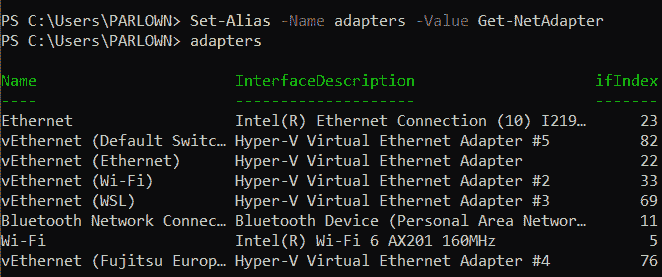

图 2.1 – 设置别名

这样做的缺点是，你设置的别名仅在当前的 PowerShell 会话中有效。当你关闭窗口时，所有自定义的别名都会丢失。你可以将它们保存在 PowerShell 配置文件中，但它们仍然仅在本地有效。我避免使用自定义别名，而是依赖自动补全。将别名用于脚本中也是不好的做法，因为这会影响代码的可读性。

现在我们了解了什么是 cmdlet，让我们看看使用它们时需要遵循的语法。

# 理解 cmdlet 语法

我们已经看到，你可以向 cmdlet 传递信息作为输入，或者修改输出。例如，在上一节中，我们输入了以下内容：

```
Set-Alias -Name adapters -Value Get-NetAdapter
```

这个 cmdlet 的名称是 `Set-Alias`，但后面有两部分信息：`-Name` 和 `-Value`。这两部分被称为 `-`，它告诉 PowerShell 后面的字符直到下一个 *空格* 字符表示的是指令，而不是值。在前面的参数中，我们传递了一个字符串——我们告诉 `Set-Alias`，`-Name` 的值是 `adapters`，而 `-Value` 的值是 `Get-NetAdapter`。现在，当我们在命令提示符下输入 `adapters` 时，PowerShell 会知道用 `Get-NetAdapter` 来替换它。

太好了，但我们如何知道一个 cmdlet 会接受哪些参数呢？好吧，我们将再次回到我们的朋友 `Get-Help`，它出现在 *第一章*，《PowerShell 7 入门——它是什么以及如何获取它》中。打开一个 PowerShell 提示符，输入以下内容：

```
Get-Help Get-Random
```

这将调出`Get-Random`的帮助文件。我们关注的是下面的`SYNTAX`部分：

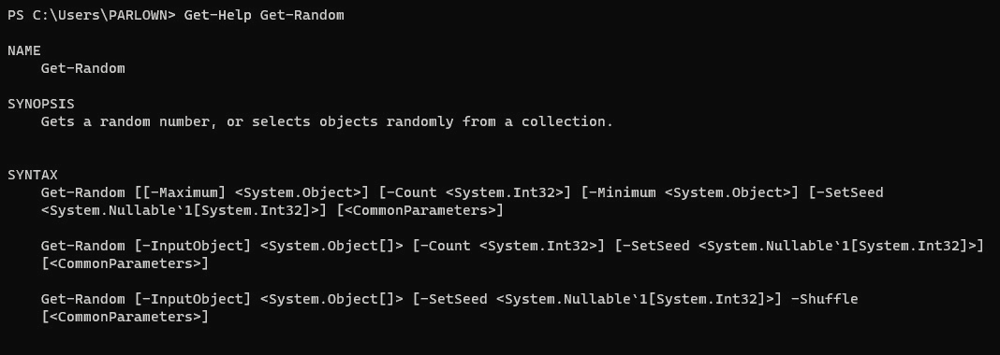

图 2.2 – Get-Random 语法

好的，这很棒，但这到底是什么意思呢？帮助文件告诉我们，`Get-Random`可以有三种不同的操作方式；每种方式都有一组参数。让我们专注于第一个参数集。记住，参数总是以短横线（`-`）开始，因此我们可以看到第一个参数集中有四个参数：`-Maximum`、`-Minimum`、`-Count` 和 `-SetSeed`。正如`DESCRIPTION`部分所说：`你可以使用 Get-Random 的参数来指定最小值和最大值、从集合中返回的对象数量，或者一个种子数字`。希望你已经完成了《第一章》中的*练习*部分，*PowerShell 7 简介–它是什么以及如何获取*，因此你之前应该见过这个。让我们来看第二个参数集。那里有三个参数：`-InputObject`、`-Count`和`-SetSeed`。使用这些参数会让`Get-Random`做不同的事情。它将不再返回一个随机数字，而是返回你在第一个参数中给定的列表中的一个随机对象。让我们试试看。在 PowerShell 提示符下，输入以下内容：

```
Get-Random -InputObject "apples", "pears", "bananas"
```

希望`Get-Random`能够从这个列表中返回一个随机的水果项。逗号字符告诉 PowerShell 列表中还有更多项。

以下截图展示了你可能会犯的一些错误：

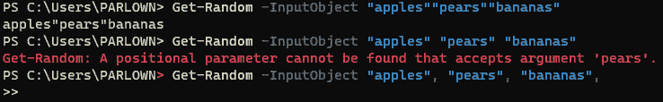

图 2.3 – 错误传递项目列表

在第一个示例中，我只传递了一个包含大量双引号的单一项。

在第二个示例中，我只传递了一个项给`-InputObject`参数，PowerShell 将第二个字符串`pears`解释为另一个参数的输入，结果产生了混淆。

在第三个示例中，PowerShell 正在等待列表中的下一个项，用`>>`符号表示。如果你遇到这种情况而不确定接下来应该输入什么，按*Ctrl* + *C*可以中断操作。

但`SYNTAX`部分告诉我们的不仅仅是参数的名称和集合。它还告诉我们哪些参数是必需的，哪些参数可以接受多个项，哪些参数需要显式指定名称，以及每个参数接受的值类型。请保持专注——接下来可能会有点复杂。让我们再次查看`Get-Random`的帮助文件中的`SYNTAX`部分，见下图。请留意方括号：

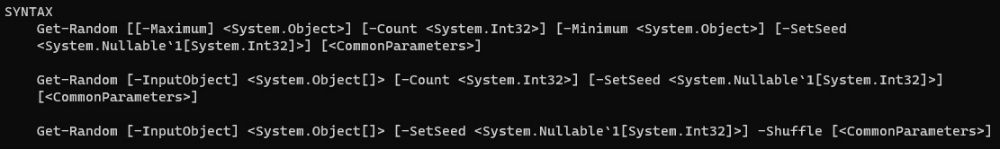

图 2.4 – Get-Random 语法

我们的第一个参数集以`[[-Maximum] <System.Object>]`开始。`-Maximum`是参数名称，而`<System.Object>`是`-Maximum`参数将接受的输入类型。

如果你输入 `Get-Help Get-Random -Full`，你会看到它只接受整数、浮动点数，或可以解释为整数的对象，例如字符串 `two`，如*图 2.5*所示。外部的方括号告诉我们 `-Maximum` 参数是可选的；我们不需要包括它就能得到一个随机数。参数名称周围的内部方括号 `[-Maximum]` 告诉我们，我们不需要包含参数名称来为 cmdlet 传递最大值。在以下截图中，我们可以看到该参数的位置信息是 `0`——这意味着第一个未命名的参数会被解释为属于 `-Maximum` 参数：


图 2.5 – `-Maximum` 和 `-Minimum` 参数的详细信息

我们可以看到，对于 `[-Minimum <System.Object>]` 参数，内部没有方括号；这意味着如果我们想使用 `-Minimum` 参数，它必须始终被命名；我们必须实际输入 `-Minimum`。对于 `-Minimum` 和 `-Maximum` 参数，它们的 `<System.Object>` 周围没有方括号。这意味着如果我们使用这些参数，我们必须向它们传递一个 `System.Object` 类型的参数（具体来说，是一个可以被解释为数字的整数、浮动点数或字符串）。

我们来看第二组参数。它以 `[-InputObject] <System.Object[]>` 开头；这意味着如果我们想使用第二组参数，我们必须提供一些输入。`[-InputObject]` 周围的方括号告诉我们这个参数是可选的，不过，PowerShell 会将它接收到的第一个参数解释为输入。这和第一组参数有什么不同呢？仔细看看 `<System.Object[]>` 参数——它的末尾有一对方括号。这表示它可以包含多个值，用逗号分隔。试试看，输入以下内容：

```
Get-Random 10, 20, 30
```

希望你能得到其中一个值的返回。PowerShell 知道它已经接收到多个值，并且知道不会将这些值集合解释为 `-Maximum` 的参数，因为 `-Maximum` 只能包含一个单一的值。

活动 2

你怎么给 `-InputObject` 参数提供一个单一的数值？

现在我们来看第三组参数。乍一看，它们和第二组参数看起来一样。它们的开头是相同的，但注意结尾有一个参数：`-Shuffle`。它没有方括号，也没有参数。这是一个 `switch` 参数。如果我们使用它，我们就自动使用了第三组参数；这意味着 `-Count` 参数对我们不可用，因为它不在第三组参数中。它不接受任何参数，因为它告诉 PowerShell 以随机顺序返回整个列表。

每个参数集以 `[<CommonParameters>]` 结尾。这是一组可用于任何 PowerShell cmdlet 的参数。你可以阅读 `about_CommonParameters` 帮助文件获取更多信息。它们包括控制 PowerShell 在发生错误时采取的操作的变量，或从 cmdlet 输出更多内容以帮助故障排除。有关更多信息，请参见*第十章*《错误处理 – 哎呀！它出错了！》。

让我们总结一下 cmdlet 的语法。接下来列出了六种类型的参数：

+   `Start-Service` 有一个必填参数：`-DisplayName`。

+   `Get-Random` 的参数 `-InputObject` 就是一个例子。

+   `Get-Random` 的参数 `-Count` 就是一个例子。

+   `-Maximum` 是 `Get-Random` cmdlet 中的一个例子。整个参数被方括号包围，然后有一对第二个方括号仅包围参数名称。

+   `-Shuffle` 是一个强制性的开关参数的好例子。

+   **常见参数**：这些是所有 PowerShell cmdlet 都可以使用的参数，允许你控制输出或错误行为。

参数组织成 `Get-Random` 可以返回一个随机数字、从列表中随机选取一个项目，或者按随机顺序返回整个列表。

现在我们已经理解了什么是 cmdlet 和参数，你可能会想知道它们从哪里来。下载 PowerShell 时会包含很多，但这远远不够。接下来我们将探索如何获取更多的 cmdlet。

# 如何找到更多的 cmdlet

Cmdlet 通常被捆绑成一个名为模块的包。我们将在*第十一章*《创建我们的第一个模块》中详细讲解模块结构，但现在知道模块是一个包含具有共同主题的 cmdlet 集合就足够了，主题可能是与某个特定应用程序互动或执行一组类似的功能。一旦模块被安装和导入，cmdlet 就会在 shell 或脚本中可用。

## 在你的机器上查找模块和 cmdlet

我们已经有了很多可用的模块。试试看；在命令行中输入 `Get-Module`。根据 PowerShell 的安装时间、会话的开启时长和我们正在使用的平台，应该会看到一个相对较短的列表，类似这样：

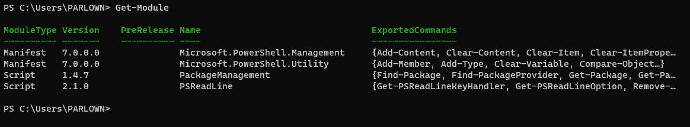

图 2.6 – 已导入模块列表

这是一个当前会话中已导入模块的列表。但这并不是我们现在可以使用的所有模块。尝试像这样再次运行 cmdlet：

```
Get-Module -ListAvailable
```

你应该会看到更多；如果你使用的是 Windows 系统，你将看到更多。

cmdlet 的输出将根据模块所在的目录进行拆分，如下图所示：

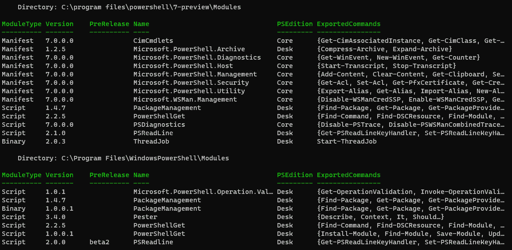

图 2.7 – 模块及其目录

如你所见，在我的机器上，该 cmdlet 找到了来自 PowerShell 7 Preview 和 Windows PowerShell 的模块，以及其他许多模块。PowerShell 使用 `PSModulePath` 环境变量来知道在你的环境中在哪里查找模块。我们可以通过键入以下内容来检查该变量中包含哪些位置：

```
 $env:PSModulePath -split ";"
```

如果你在 Linux 或 macOS 设备上工作，使用冒号是必要的。

每次启动 PowerShell 时，这些位置会被放入该变量中，但它们也可以由应用程序或手动添加。你可以在下面的屏幕截图中看到我的机器上的结果。注意，最后一项是 `Microsoft Message Analyzer`；这是我安装该应用程序时添加的：

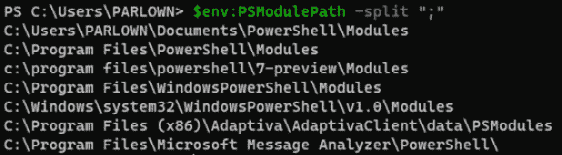

图 2.8 – PSModulePath 变量

虽然我们可以手动添加路径，但对于大多数情况来说，最好确保将模块安装到默认路径。有关 `PSModulePath` 变量的更多信息，请参阅 `about_PSModulePath` 帮助文件。

现在我们知道了在哪里可以找到计算机上的模块，那么如何知道它们包含哪些 cmdlet 呢？请注意在*图 2.7* 中，`ExportedCommands` 表中有属性；这些就是我们导入模块时可用的 cmdlet。可能有一些 cmdlet 没有导出，只能在模块内部使用；我们无法直接键入这些 cmdlet 进行使用。我们可以通过运行 `Get-Command –Module`，后跟模块名称，来查看仅导出的 cmdlet。

让我们尝试一下。在*第一章*《PowerShell 7 简介——它是什么以及如何获取它》中，我们使用了 `Get-Command` cmdlet 来查找 cmdlet。该 cmdlet 会搜索所有可用的模块中的 cmdlet，或者我们可以告诉它只搜索已导入的模块。假设我们对操作模块的 cmdlet 感兴趣。我们可以键入以下内容，以获取包含 `module` 这个词的 cmdlet 列表：

```
Get-Command *module*
```

然而，如果我们键入以下内容，我们将只会得到已经导入到当前会话中的模块的 cmdlet：

```
 Get-Command *module* -ListImported
```

这显示了这两个 cmdlet 在我的机器上的表现：

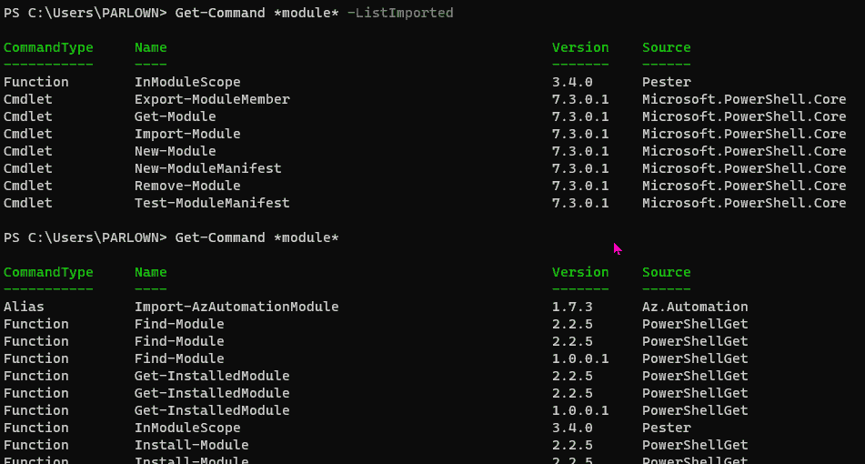

图 2.9 – 已导入和已安装的 cmdlet

如何使用尚未导入的模块中的 cmdlet？有两种方法，如下所示：

+   首先，我们可以使用 `Import-Module` cmdlet 将模块导入会话，然后使用我们需要的 cmdlet。

+   或者，我们也可以直接使用它，并允许 PowerShell 隐式地导入它。

尝试一下。在*图 2.6* 中，有一个当前会话已导入模块的列表。它不包含 `PowerShellGet` 模块。很可能你的当前会话也没有导入该模块，因此让我们现在导入它。键入以下内容：

```
 Get-InstalledModule
```

您会注意到，当 PowerShell 导入 `PowerShellGet` 模块时会有一个小小的暂停，然后如果有已安装的模块，您会看到它们的列表。那很好，但聪明的地方在于：再次输入 `Get-Module` 命令，来获取已导入模块的列表。您应该会看到 `PowerShellGet` 已经在后台被导入，如下所示：

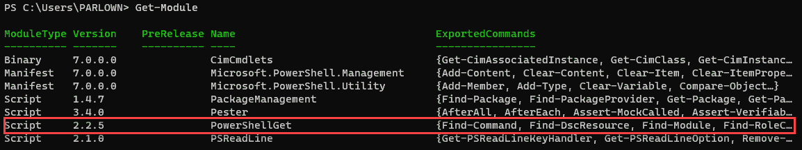

图 2.10 – 仿佛魔法般……模块出现了

这引出了两个问题。第一个问题是：为什么还要导入和安装？为什么不从一开始就将所有 cmdlet 都可用呢？简短的答案是 **空间**。每个导入的模块都需要占用内存空间；如果我们导入了数百个模块和成千上万的 cmdlet，那么每次启动 PowerShell 时，它将变得极其笨重和缓慢，因此我们只在需要时导入我们需要的模块和 cmdlet。

另一个问题是：如果我们可以隐式获取 cmdlet，为什么还需要 `Import-Module` cmdlet 呢？我们需要 `Import-Module` 有两个原因：首先，您可能没有将模块安装到 `PSModulePath` 中的默认路径之一，因此隐式导入将不可用。其次，您可能希望控制模块的导入方式。例如，您可能不想导入与已导入 cmdlet 同名的模块，这时您应该使用带有 `-NoClobber` 参数的 `Import-Module`，而不是隐式导入。

活动 3

我们如何导入 cmdlet，但改变它们的名称，以便我们知道它们来自哪个模块呢？

## 查找新的模块和 cmdlet

到目前为止，我们已经查看了系统上已有的模块，但我们刚刚导入了 `PowerShellGet`，它非常有用，因为它可以帮助我们查找远程存储的模块，默认情况下，`PowerShellGet` 会连接到远程位置。

### PowerShell Gallery

让我们首先来看一下如何找到我们感兴趣的 PowerShell Gallery 中的模块。尝试运行以下命令：

```
Get-Command -Module PowerShellGet
```

这将为我们提供模块中可用的 cmdlet 列表。我们可以看到它们分为两类——用于查找和安装资源（如模块和脚本）的 cmdlet，以及用于管理仓库的 cmdlet。我们来看看一个模块吧。尝试运行以下命令：

```
Find-Module -name *math*
```

我的结果如下所示：

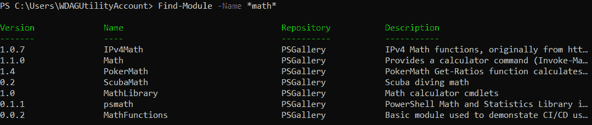

图 2.11 – PowerShell Gallery 中与数学相关的模块

其中一些看起来或多或少有用——我不确定我是否需要 `PokerMath`，但你可能需要。我们怎么知道这些模块中有哪些 cmdlet 呢？我们不能使用 `Get-Command`，因为这些模块不在本地计算机上，但是 `PowerShellGet` 包括了 `Find-Command` cmdlet。如果我们将某个特定模块的名称传递给 `Find-Command`，它会列出该模块中的 cmdlet，像这样：

```
Find-Command -ModuleName psmath
```

如果我们运行它，我们可以看到`psmath`包含整个范围的数学函数，从相当明显的——如`Get-Math.sqrt`——到一些更为深奥的人工智能（**AI**）和统计学函数。要了解如何使用这些函数，我们需要安装模块并查看帮助文件。我们可以通过输入以下内容来执行此操作：

```
Install-Module psmath
```

您可能会看到一个警告，说明仓库是不受信任的，就像下面的屏幕截图一样。这是预期的，因为默认情况下，没有仓库是受信任的。我们需要使用`Set-PSrepository` cmdlet 显式信任它们：

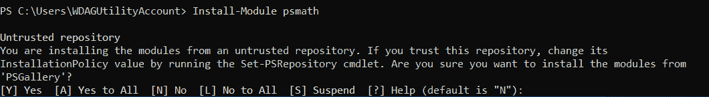

图 2.12 – 你信任这个仓库吗？

输入`Y`以确认。几秒钟后，进度条消失，命令提示符将重新出现。现在模块已安装，但尚未导入。尽管我们使用`PowerShellGet`安装了模块，但它已安装到一个位置，这不是隐式导入它的正确路径。但我们可以使用`Import-Module` cmdlet 显式导入它，就像这样：

```
Import-Module psmath
```

如果我们现在输入以下内容，我们将看到社区提供的模块的一个缺点：

```
Get-Help Get-Math.Sqrt
```

许多作者更喜欢编写他们的软件而不是为其撰写文档，所以帮助内容相当稀少。然而，我们可以看到`Get-Math.Sqrt`接受两个参数：要么是值，要么是输入对象。`-Values`参数是位置参数。有趣的是，它还可以接受值的列表，而不仅仅是单个值。您可以使用输入对象来提供另一个 cmdlet 或变量的输出。尝试这个：

```
Get-Math.Sqrt -InputObject (Get-Random)
```

这将生成一个随机数，然后计算其平方根。

为什么`PowerShellGet`不能将模块安装到正确的位置？这与作用域有关。默认情况下，`PowerShellGet`会仅为当前用户安装模块，如果您使用 Windows，则会安装到您的`Documents`文件夹中的路径，或者在 Linux 上安装到您的主目录。我们可以通过使用`-Scope`参数和`AllUsers`参数来更改此设置，但我们需要以管理员权限运行才能执行此操作。在下面的屏幕截图中，您可以看到在这种情况下出现的错误消息。另一种方法是将位置添加到`PATH`环境变量中：

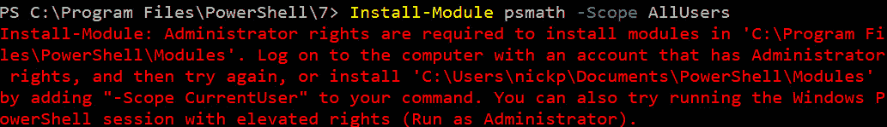

图 2.13 – 我恐怕不能这样做，戴夫

我们也可以在线查看 PowerShell Gallery，网址为[`www.powershellgallery.com/`](https://www.powershellgallery.com/)。在网站上搜索`math`将会得到更多结果，因为它不仅会搜索模块名称，还会搜索任何关联的标签。我们可以通过使用`-Filter`参数和`Find-Module`获取类似的结果。

### PowerShell Gallery 不是唯一的存储库

虽然 PowerShell Gallery 很棒，但也有其他仓库。你可能在工作中有一个内部仓库，或者你可能决定以后为自己建立一个。仓库的优点是版本控制和它所允许的自动化。缺点是维护以及潜在的被利用风险。如果你需要使用除 PowerShell Gallery 外的其他仓库，那么 `PowerShellGet` 包含了一些用于与它们交互的 cmdlet，如 `Get-PSRepository`、`Set-PSRepository` 和 `Register-PSRepository`。

### 其他来源

PowerShell Gallery 的主要替代方案是 GitHub，网址为 [`github.com`](https://github.com)，以及类似的在线源代码管理工具，如 GitLab。这些平台不仅限于 PowerShell，还包含许多其他语言编写的代码。绝大多数代码以某种形式是开源的。GitHub 平台由微软拥有，但并未由微软管理，包含从完全官方的 PowerShell 仓库（包括微软自己的代码），到未经维护的、不完整的脚本片段和恶意软件。除非你绝对信任仓库所有者，否则*一定*在下载之前阅读代码并理解它的作用。

我们可以在 GitHub 上搜索 PowerShell 模块，通过在 GitHub 网站上输入搜索词并添加 `language:PowerShell`，如下图所示：

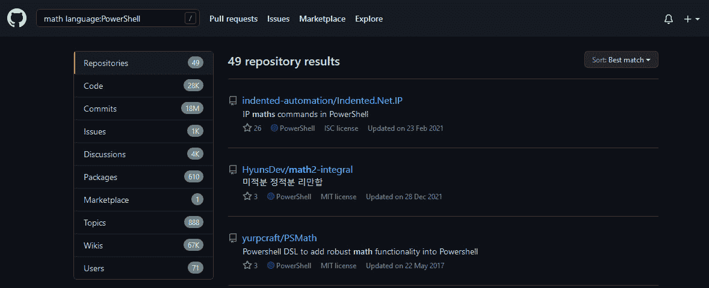

图 2.14 – GitHub 网站上的 49 个仓库，其中一些可能有用

我们也可以在互联网上找到大量 PowerShell 脚本；尽管我们不太可能找到完整的模块，但许多有用的网站在源代码管理平台之外发布了完全可用的脚本。然而，警告依然存在，甚至更加重要。即使你信任作者，也要在使用之前阅读代码，并理解它的作用。永远不要盲目运行某些东西并指望它没问题。PowerShell 功能非常强大，您应该始终安全地运行它。关于这一点，我们将在 *第十二章*，*保护 PowerShell* 中详细讨论。

获取 cmdlet、模块和脚本的最终方式是自己编写。这比你想象的要容易，我们将在本书的第二部分中介绍，从 *第八章*，*编写我们的第一个脚本 – 将简单的 cmdlet 转化为可重用的代码*。

现在我们应该对可以找到 PowerShell 资源的众多地方有了较好的了解，并且理解它们的相对价值。在下一部分，我们将讨论与 PowerShell 互动的最基本方式，Windows 用户可以享受一些乐趣。

# 与 PowerShell 进行交互式工作

在我看来，PowerShell 是一种不太寻常的编程语言，因为其庞大的 cmdlet 数量使得它特别适合互动使用；打开终端，输入一行代码，就能看到一些令人兴奋的结果。在其他解释性语言中很难做到这一点，比如 Python，因为 Python 自带的命令不多，并且将库导入到交互式会话中也很困难。因此，Python 用户很快就会转向编写脚本。我在使用 PowerShell 的 10 年里，发现很多同事实际上并没有真正从交互式 PowerShell 进展到脚本编写，这也没问题。在本章的其余部分，我们将回顾一下我们是如何使用 PowerShell 的，Windows 用户将能安装一个非常有用的工具，叫做 Windows Terminal，它能为他们提供与 Linux 和 macOS 用户默认拥有的相同的多标签终端体验。

每当我们输入一行代码时，我们就调用了一个 cmdlet。每个 cmdlet 都是一个迷你脚本或程序。这类似于 shell 脚本；Windows 中的批处理脚本或 Linux 中的 Bash 脚本，其中我们输入的每一行代码都会调用一个定义好的程序。

PowerShell 中的大部分脚本都是以相同的方式编写的——脚本可以像 cmdlet 一样运行，带有参数来修改行为和操作。这意味着我们也可以互动使用它们，从而将我们的努力与那些技术上不太擅长的同事和朋友分享。然而，在我们开始编写脚本之前，最好先设置一个方便的方式来互动使用 PowerShell。PowerShell 7 提供了改进的 shell，包括高亮显示，使我们更容易看清我们正在输入的内容，以及改进的复制粘贴功能。然而，我更喜欢另一个工具——Windows Terminal。

## Windows Terminal——一个替代终端模拟器

如果你使用的是 Linux 或 macOS，你不需要做这一部分，因为你们已经有了多标签的终端，真是幸运的人。对于 Windows 用户，我们以前需要打开多个应用程序；过去，我可能同时打开了 Windows Console（命令提示符）、Windows PowerShell、PowerShell 7、Azure Cloud Shell、PuTTY、Git Bash 和 Python，作为不同的应用程序运行。然而，自 2020 年以来，有了一个更好的选择——Windows Terminal。它可以在不同的标签页中运行任何命令行程序的多个实例，这就足以让我信服，但它还支持表情符号和字形、分屏功能，以及一个据说很有趣的新字体叫做 Cascadia Code，另外它是开源的。如果你想了解更多细节，可以参考这篇博客：[`devblogs.microsoft.com/commandline/introducing-windows-terminal/`](https://devblogs.microsoft.com/commandline/introducing-windows-terminal/)。

Windows Terminal 托管在 GitHub 上，网址是 [`github.com/Microsoft/Terminal`](https://github.com/Microsoft/Terminal)，你可以从那里下载并安装 `.msixbundle` 文件。你也可以如果之前安装了 Winget，或者使用 Windows 11，则可以通过 Winget 安装它。然而，推荐的方式是通过 Microsoft Store 安装，这样可以让应用自动更新——由于它是开源软件，更新频繁且通常是必要的，因为它包含了 bug 修复和改进。

## 从 Microsoft Store 安装 Windows Terminal

从 Windows Store 安装非常简单。以下是安装步骤：

1.  在 Windows 的搜索框中输入 `store`，然后启动 Microsoft Store 应用。

1.  在 Store 应用的搜索框中输入 `Windows Terminal`。

1.  点击 **获取**，如以下截图所示：

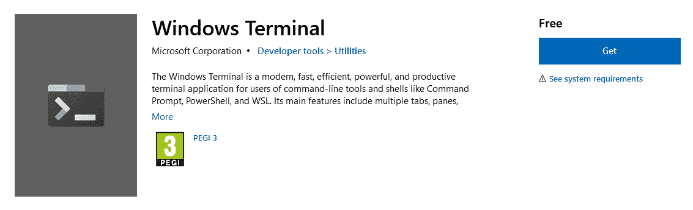

图 2.15 – 获取 Windows Terminal：不适合幼儿

1.  几分钟后，Terminal 会出现在你的 **开始** 菜单中。

就这样。Windows Terminal 现在会自动更新。接下来，我们开始为我们的用途进行配置。因为我们已经安装了 PowerShell 7，所以当你打开它时，Terminal 会默认使用 PowerShell 7；如果没有安装，它将默认使用 Windows PowerShell。根据你在客户端安装的其他应用程序，它可能会自动识别并提供可用的选项。点击工具栏中的 *向下* 图标，查看已提供的应用，并选择一个非默认的应用，如以下截图所示：

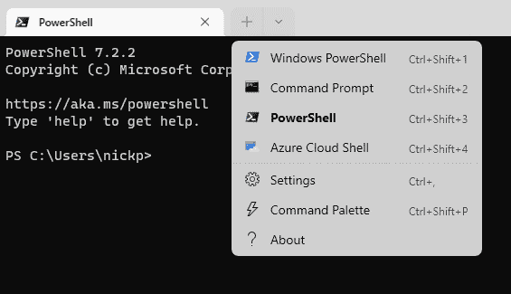

图 2.16 – Windows Terminal 中可用的基本应用

这很好，但它还远远不够涵盖你可能拥有的所有命令行应用程序。让我们看看如何做到这一点。我在我的机器上安装了 Python，因为我常常喜欢换个视角。如果你想跟着一起操作，且没有安装 Python，可以从这里下载：[`www.python.org/downloads`](https://www.python.org/downloads)/。

默认情况下，Python 安装在 `C:\Users\<yourname>\AppData\Local\Programs\Python\<version number>`，如下图所示。你需要记下这个路径，并在**文件资源管理器**中启用查看隐藏文件：

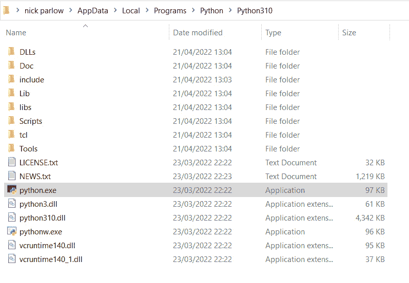

图 2.17 – Python 的位置

要配置 Windows Terminal 以访问 Python，你需要设置一个新的配置文件。以下是操作步骤：

1.  启动 Windows Terminal。

1.  点击工具栏中的 *向下* 按钮，然后选择 **设置**。

1.  在左侧面板中选择 **添加新配置文件**，然后点击 **新建空配置文件**，如以下截图所示：

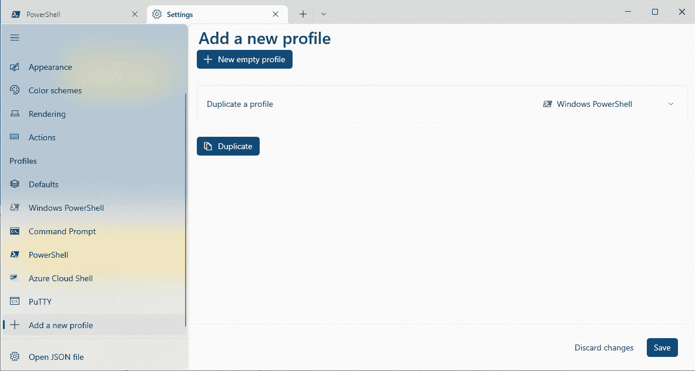

图 2.18 – 创建新配置文件

1.  填入名称——在我的情况下，我使用的是`Python 3.10`，这样我就知道它会启动哪个版本的 Python。

1.  填入 `python.exe` 可执行文件的路径。

1.  选择一个起始目录，如果你喜欢的话。我喜欢把所有的东西都放在一个地方。

1.  我喜欢使用图标。你可以在这里找到 Python 图标：`C:\Users\<用户名>\AppData\Local\Programs\Python\Python310\Lib\test\imghdrdata`。

1.  点击**保存**。

你可以在以下截图中看到这个概览：

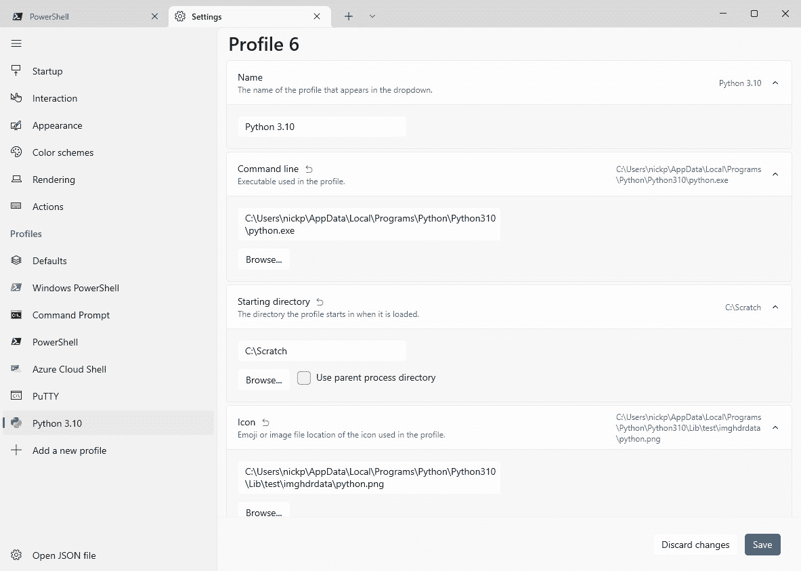

图 2.19 – 创建新配置文件，完成

现在我们完成了。当你点击工具栏中的*下拉*按钮时，你将看到**Python 3.10**作为一个选项。为什么我在这里使用 Python 作为示例？为什么不使用 PowerShell 7 预览版呢？因为 Windows Terminal 非常智能。如果你在安装 Windows Terminal 后安装了 PowerShell 7 预览版，只需重新启动 Windows Terminal，瞧！PowerShell 7 预览版就会成为一个选项。酷吧，嗯？

这里，你可以看到 Python 在 Windows Terminal 中运行的画面：

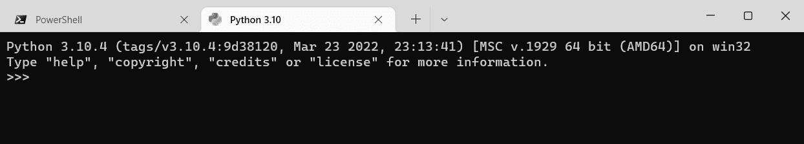

图 2.20 – 在 Windows Terminal 中运行 Python

还有一件事我们必须做。我们已经讨论了能够以管理员身份启动 PowerShell 的重要性；我们也需要为 Windows Terminal 做同样的事情。最简单的方法是将 Terminal 应用程序固定到任务栏。如果你右键点击任务栏上的图标，我们可以右键点击弹出菜单中的**Terminal**图标，并选择**以管理员身份运行**，如下所示：

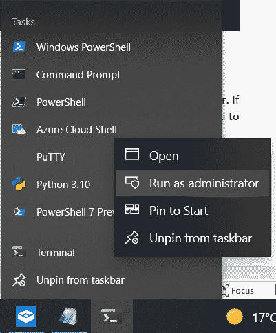

图 2.21 – 以管理员身份运行 Windows Terminal

如果你在 Windows Terminal 中打开一个配置文件的设置，你可以仅为该配置文件设置以管理员身份运行。Windows Terminal 还有很多其他功能可以使用。设置可以通过**用户界面**（**UI**）进行访问，或者你也可以直接编辑一个方便的**JavaScript 对象表示法**（**JSON**）设置文件。

# 总结

在本章中，我们已经相当彻底地探讨了 cmdlet。到现在为止，我们应该已经了解了命名规则、cmdlet 使用的语法、如何找出 cmdlet 所需的参数以及如何填写它们。接着，我们探索了在本地机器和 PowerShell Gallery 上发现新 cmdlet 和模块的方法。最后，我们讨论了如何与 PowerShell 进行交互式工作，并介绍了一个适用于 Windows 用户的全新应用程序——Windows Terminal。

在下一章中，我们将深入研究管道；它是如何工作的，如何将 cmdlet 连接在一起，如何理解发生了什么错误，以及如何解决它。我们还将探讨另一个适用于 PowerShell 的优秀应用程序，而且这次每个人都可以安装，而不仅仅是 Windows 用户。

# 练习

1.  在 PowerShell 中，获取文件内容的正确命令是 `Get-Content` 还是 `Read-Content`？

1.  如果你在 shell 中输入 `"alive alive" | oh`，会发生什么？为什么？

1.  `Get-ChildItem` 命令有多少个参数集？哪个参数决定我们将使用哪个参数集？

1.  如果你看到 `Get-ChildItem c:\foo *.exe` 命令，可以看出 `c:\foo` 是传递给 `-Path` 参数的一个参数。那么 `*.exe` 被传递给哪个参数？

1.  如果不实际尝试，`Get-ChildItem c:\foo -Filter *.exe, *.txt` 命令会运行吗？如果不会，为什么？

1.  如何找到与 **Amazon Web** **Services** (**AWS**) 相关的 cmdlet？

1.  如何找到与 AliCloud 相关的 cmdlet？

1.  如何在 Windows Terminal 中更改文本大小？
