# PowerShell 管道——如何将 cmdlet 串联起来

几乎所有的 **操作系统** (**OSs**) 都有 **管道** 的概念，它允许一个进程的输出被传递到下一个进程的输入中。这个概念归功于 Douglas McIlroy，在 1973 年他在贝尔实验室工作时开发了 Unix 第 3 版。最初的实现设想将每个命令的输出视为一种类似文件的结构，下一条命令可以在此结构上操作。

本章将解释 PowerShell 如何遵循这一愿景并与之有所不同。我们将从探讨管道的概念开始，然后介绍一些操作管道内容的基本方法，再深入分析 PowerShell 中管道的工作原理，以及当管道出现问题时如何进行故障排除。

到本章结束时，我们将理解信息如何从一个 cmdlet 传递到下一个 cmdlet，如何操作这些信息以便只处理我们需要的部分，以及当出现错误信息时，如何找出问题所在。

本章将涵盖以下主题：

+   如何将 cmdlet 组合在一起——管道

+   选择和排序对象

+   过滤对象

+   枚举对象

+   格式化对象

+   管道是如何工作的——参数绑定

+   故障排除管道——管道跟踪

# 如何将 cmdlet 组合在一起——管道

自 1970 年代的 Unix 和 C 编程语言以来，操作系统已将计算机的输入和输出抽象为 `Read-Host` cmdlet。stdout 流是 cmdlet 成功输出的结果。stderr 流包含程序产生的任何错误信息，并被发送到一个单独的流，以避免干扰任何成功的输出。

PowerShell 对这些流进行了扩展，拥有六个输出流，而不是两个。每个流都可以通过显式的 PowerShell cmdlet 捕获，或者在运行 cmdlet 时指定一个常用参数，如下表所示：

| **流 #** | **描述** | **Cmdlet** | **常用参数** |
| --- | --- | --- | --- |
| 1 | 成功 | `Write-Output` | 无——这是默认的输出 |
| 2 | 错误 | `Write-Error` | `-ErrorAction` 和 `-ErrorVariable` |
| 3 | 警告 | `Write-Warning` | `-WarningAction` 和 `-WarningVariable` |
| 4 | 详细信息 | `Write-Verbose` | `-Verbose` |
| 5 | 调试 | `Write-Debug` | `-Debug` |
| 6 | 信息 | `Write-Information` | `-InformationAction` 和 `-InformationVariable` |

表 3.1 – PowerShell 流

流 1 相当于标准输出（stdout），而流 2 相当于标准错误输出（stderr）。PowerShell 管道将流 1 的内容（即成功）从一个 cmdlet 传递到管道中的下一个 cmdlet。当我们看到屏幕上的红色错误信息时，它们并不是输出在流 1 中——它们输出在流 2 中。原因是我们不希望错误信息（或者详细信息或任何除输出对象之外的信息）被传递到下一个 cmdlet 中，导致另一个错误。毕竟，第二个 cmdlet 没有办法解释这些信息。

管道可能由一个或多个 PowerShell cmdlet 组成，使用管道符号 (`|`) 分隔。每个 PowerShell cmdlet 都是管道的一部分，即使它只是一个单独的 cmdlet。在每个管道的末尾都有一对隐式的 cmdlet，`Out-Default | Out-Host`，确保 cmdlet 在流 1 中的输出被格式化并写入屏幕。有些 cmdlet 没有流 1 输出，因此在运行它们后我们不会看到任何屏幕上的输出。例如，在 *第二章*，*探索 PowerShell Cmdlet 和语法* 中，我们运行了以下 cmdlet：

```
Set-Alias -Name processes -Value Get-Process
```

一旦 cmdlet 执行完毕，我们会返回到提示符。如果我们查看 `Set-Alias` 的帮助文件，会看到它默认没有输出，因此在成功运行时我们不会看到屏幕上的任何内容。尽管如此，`Set-Alias` 仍然是一个管道；`Out-Default` 仍然运行，只是没有接收到任何输出。

Cmdlet 从左到右执行，左侧 cmdlet 的输出对象会传递到管道右侧的下一个 cmdlet。为了便于阅读（和输入），管道符号可以用作交互式工作时的换行符。尝试在管道符号后按 *return* 或 *Enter*：

```
Get-process |
Get-member
```

在按下 *return*/*Enter* 键后，你应该看到一个继续提示符（`>>`），如下所示：

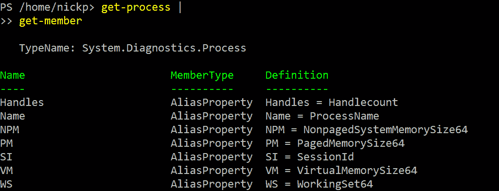

图 3.1 – 使用管道符号作为换行符

我们一直在提到对象——描述我们具体指的是什么将会很有帮助。我们将在下一节中做这件事。

## 什么是对象？

当我们在 Linux 和 Windows 控制台中运行命令时，命令将字节流输出到标准输出（stdout）；这被解释为一个文本文件，保存在内存中。当我们想要操作这个输出的内容时，我们必须使用与查找和操作文本相同的工具；这些工具可能是 Perl、sed、AWK 或其他一些工具。

这意味着我们变得擅长文本操作；我的桌子上大约有七本 Perl 书籍，最早的是上世纪九十年代出版的。PowerShell cmdlet 不产生类似文本的字节流；相反，它们生成对象和对象集合，这些对象是以表格结构保存在内存中的，在我们运行 `Get-Process` 时产生，如下所示：

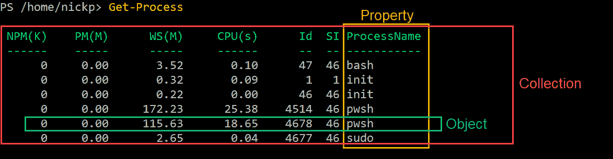

图 3.2 – 获取进程对象集合

表格中的每一行都是一个对象。每一列是表中对象的一个属性。整个表格是对象的集合。从*图 3.1*中，我们知道每个对象都是`System.Diagnostics.Process`类型，并且具有与该对象类型相关联的属性和方法列表。通过管道，我们可以将这个集合发送到另一个 cmdlet 来提取更多信息，或者仅仅调用我们感兴趣的特定属性。如果我们想知道一个默认未显示的属性值，例如一个特定进程在其生命周期中消耗的特权处理器时间，我们可以输入以下命令：

```
(Get-Process -id 4514).PrivilegedProcessorTime
```

那个`4514`是从哪里来的？它是*图 3.2*中某个`pwsh`进程的`Id`属性。从这里，我可以看到我的`pwsh`进程在特权模式下消耗了 11.75 秒。我知道——我们可能不想知道像`pwsh`这样简单的进程的这些信息，但如果我们在调查数据库服务器的存储性能问题时，可能会对其他进程的这些值感兴趣。运行以下代码：

```
Set-Alias -Name processes -Value Get-Process
(get-process -id (processes).id).privilegedprocessortime
```

在这里，我们将获取当前在客户端上运行的所有进程的特权处理时间，使用我们为`Get-Process`设置的别名。

并不是所有 cmdlet 都会生成单一类型的对象。一些 cmdlet 可能会生成多个对象，我们需要小心如何处理这些对象并将它们的输出传递到管道中。例如，考虑`Get-ChildItem` cmdlet。它获取目录或文件夹的内容。一个目录可能包含两种基本类型的项目——即文件和子目录。这两种类型会有不同的属性——例如，我们不能将子目录嵌套在文件中。如果一个管道已经设置为操作文件对象，那么如果也传递了目录对象，它可能会失败。让我们来看看，输入以下命令：

```
(Get-ChildItem -Path c:\scratch\ | Get-Member).TypeName | Select-Object -Unique
```

在这里，我们可以看到我 Windows 机器上的`C:\scratch`目录包含了目录和文件，如下图所示：

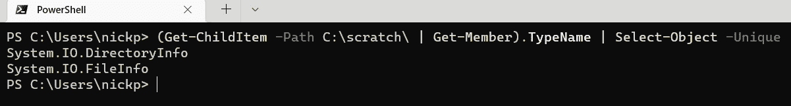

图 3.3 – 检查目录中对象的类型

我们在这里做了什么？看起来有点复杂。好吧，我们将`Get-ChildItem C:\scratch` cmdlet 的输出传递给`Get-Member`。我们只对`TypeName`属性感兴趣，所以我们把管道放在括号中，这样我们就可以轻松访问我们需要的那个属性。一旦得到所有`TypeName`实例的集合，我们就把它传递到第二个管道，传给`Select-Object`，并使用`-unique`参数告诉它只返回唯一的值。聪明吧？

在接下来的几个章节中，我们将探讨操作这些对象的基本方法。让我们从选择和排序对象开始。

# 选择和排序对象

我们运行的许多 cmdlet 会产生大量输出，而且其中很多内容可能并不有趣。因此，能够仅选择我们需要的部分并将其排序成有意义的顺序是非常有用的。为此，有两个 cmdlet：`Select-Object` 和 `Sort-Object`。我们通常会看到它们的别名——`select` 和 `sort`。

## 使用 `Select-Object`

我们在 *什么是对象？* 部分中使用了 `Select-Object` 来选择集合中对象的唯一属性。然而，我们可以用它做更多的事情。通过运行以下命令，查看 `Select-Object` 的帮助文件：

```
Get-Help Select-Object
```

在这里，我们可以看到有四组参数集，它们的工作方式有两种——我们可以使用 cmdlet 操作集合的一个或多个属性，或者我们可以用它来选择集合中的一部分对象。让我们尝试第一种方法，输入以下内容：

```
Get-Process | Select-Object Name, Id
```

在这里，我们将看到一个包含两个属性的对象集合——`Name` 和 `Id`。现在，让我们在 `Get-Member` 中运行它，如下所示：

```
Get-Process | Select-Object Name, Id | Get-Member
```

在这里，我们可以看到我们已将那组 `System.Diagnostics.Process` 对象转变为 `Selected.System.Diagnostics.Process` 对象——这些对象只有两个属性——我们在 `Select-Object` cmdlet 中使用的 `Name` 和 `Id` 属性：

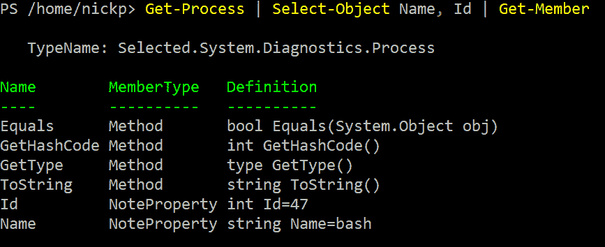

图 3.4 – 新对象的属性

我们现在仍然有相同数量的对象，但它们只包含我们感兴趣的属性。这有两个好处；首先，PowerShell 在处理这些较小的对象时会更快，其次，PowerShell 将需要更少的内存。缺点是，我们不再能访问管道中原始对象的那些*未*选择的属性。

我们可以使用 `Select-Object` 的第二种方式是从集合中选择一部分对象。实现这一点的参数在第一个参数集中；`-first`、`-last` 和 `-skip`。每个参数都需要一个整数作为参数。`-first 5` 会选择管道中的前五个对象，而 `-last 2` 会选择管道中的最后两个对象，如下所示：

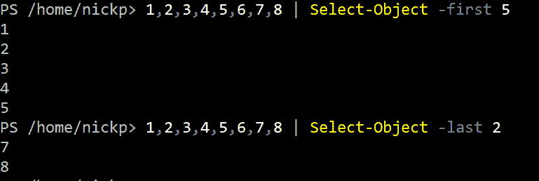

图 3.5 – 选择对象的子集

我们可以使用 `-skip` 参数来跳过开始或结尾的值，如下所示：

```
1,2,3,4,5,6,7,8 | Select-Object -First 2 -skip 1
```

这将返回整数 `2` 和 `3`，它们是跳过第一个后得到的前两个元素。

活动 1

我们如何从这个数组中返回 `2`、`3`、`4`、`7` 和 `8`？

以这种方式运行`Select-Object`的问题在于，除非我们能够控制集合中对象的顺序，否则我们只是在随机抓取对象。这引出了下一个 cmdlet，`Sort-Object`。

## 使用 `Sort-Object` 排序对象

当我们运行`Get-Process`时，进程会按进程名称的字母顺序返回。这是由 PowerShell 源代码决定的。然而，我们可以通过使用`Sort-Object` cmdlet 来更改对象的显示顺序（从而间接地重新排序管道中的对象）。

`Sort-Object`可以根据一个或多个属性对对象集合进行排序。我们不需要指定任何参数来运行它；如果我们没有指定排序的属性，它将根据管道中第一个对象的默认排序属性来对集合进行排序，该属性深藏在 PowerShell 的源代码中，并且很难找到。

这意味着什么？记住，`Get-ChildItem`会生成两种类型的输出。默认情况下，当你运行`Get-ChildItem`时，你会首先得到所有第一类型对象（`System.IO.DirectoryInfo`，即目录）的列表，然后是所有第二类型对象（`System.IO.FileInfo`，即文件）的列表，如以下截图中的第一个示例所示：

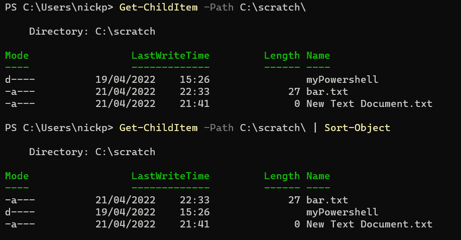

图 3.6 – 运行 Select-Object 没有参数的效果

在第二个示例中，`Get-ChildItem -Path C:\Scratch\ | Sort-Object`，我们得到了一个按字母顺序排列并混合的所有对象列表；它忽略了对象类型。

我们可以添加一个属性名来根据该属性对我们的集合进行排序。例如，我们可以运行`Get-Process`并按工作集大小进行排序，像这样：

```
Get-Process | Sort-Object -Property ws
```

这很好。不过，它们已经按照默认的升序进行了排序，因此我们最感兴趣的进程——那些消耗内存最多的——排在了表格的底部。我们可以通过添加另一个参数`-Descending`来解决这个问题：

```
Get-Process | Sort-Object -Property WS -Descending
```

这会产生一个更有用的输出，如下所示：

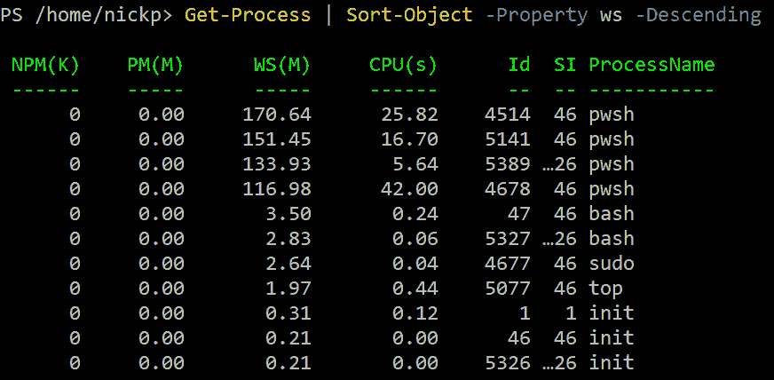

图 3.7 – 使用 Sort-Object 按降序排序

我们甚至可以一次按多个属性进行排序。例如，我们可以尝试以下操作：

```
Get-Process | Sort-Object -Property SI, WS -Descending
```

这将按**会话 ID**（**SI**）排序，然后按**工作集**（**WS**）排序。

让我们来看一下帮助文件。在这里，我们可以看到`Sort-Object`有三个参数集，它们的工作方式大致相同；唯一的区别是`-top`、`-bottom`和`-stable`参数。`-top`和`-bottom`参数比较容易理解，但`-stable`就不那么直观了。当我们运行`Sort-Object`时，如果存在相等值的对象，它会根据其内部逻辑输出对象的顺序，而不一定是它们被接收的顺序。`-stable`参数（以及`-top`和`-bottom`）会在排序的属性相等时，保持`Sort-Object`接收对象的顺序。

我们现在可以看到如何将这两个 cmdlet，`Sort-Object`和`Select-Object`，结合起来生成有意义的信息集合。例如，我们可以键入以下内容：

```
Get-Process | Sort-Object CPU -Descending | Select-Object -First 5
```

这将获取我们当前 CPU 占用最多的五个进程，如下所示：

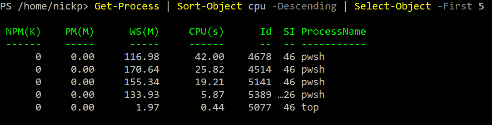

图 3.8 – 结合 Sort-Object 和 Select-Object

那么，如果我们不想要前五名呢？如果我们想要所有使用 *大量* CPU 的进程呢？这就是过滤的作用。

# 过滤对象

我们可以使用 `Where-Object` cmdlet 以更复杂的方式过滤对象。`Where-Object` 也查看管道中对象的属性，但它还可以做出决定，输出哪些对象，丢弃哪些对象。尝试以下操作：

```
Get-Process | Where-Object -Property CPU -gt -Value 1
```

这将返回一个进程列表，其中 CPU 属性的值大于 1。在实际操作中，我们很少看到人们为参数包含 `-Property` 和 `-Value` 名称，因为它们是位置参数。更常见的写法如下：

```
Get-Process | where CPU -gt 1
```

等一下，`-gt` 是什么？`-gt` 参数是一个 **比较运算符**，这是编程中的一个重要概念。

## 理解比较运算符

比较运算符在使用 `Where-Object` cmdlet 时作为开关参数表示，导致帮助文档成为一个冗长且复杂的文档，包含许多参数集，因为每次只能使用一个比较运算符。基本的比较运算符如下表所示：

| **比较** | **运算符** | **区分大小写的运算符** |
| --- | --- | --- |
| 相等 | `-``eq` | `-``ceq` |
| 不等式 | `-``ne` | `-``cne` |
| 大于 | `-``gt` | `-``cgt` |
| 小于 | `-``lt` | `-``clt` |
| 大于或等于 | `-``ge` | `-``cge` |
| 小于或等于 | `-``le` | `-``cle` |
| 通配符相等 | `-``like` | `-``clike` |

表 3.2 – 基本比较运算符

默认情况下，运算符是不区分大小写的，因此 `-eq top` 与 `-eq TOP` 在功能上是相同的。也有一些 NOT 运算符可以获得相反的结果，例如 `-NotLike`。此外，我们还有一些更高级的比较运算符，如下所示：

+   使用 `-match` 根据正则表达式获取值。

+   使用 `-in` 获取属性值在指定数组中的对象。我们将在 *第四章* 中讨论数组，*PowerShell 变量和* *数据结构*。

+   使用 `-contains` 获取对象，其中指定的值可能在包含数组的属性中，而不是单一值。

让我们探索这些操作的一些工作方式。尝试运行以下命令，以获取正在运行的 PowerShell 进程列表：

```
Get-Process | Where-Object ProcessName -eq pwsh
Get-Process | Where-Object ProcessName -like pwsh
Get-Process | Where-Object ProcessName -like *pwsh
Get-Process | Where-Object ProcessName -like *wsh
Get-Process | Where-Object ProcessName -contains pwsh
Get-Process | Where-Object ProcessName -in "pwsh", "bash"
```

最后一条能正常工作，是因为我们给 `Where-Object` 提供了一个包含两个项的数组，`"pwsh"` 和 `"bash"`，并要求它返回任何 `ProcessName` 属性值在该数组中的对象。实际上，数组可能不会像这样是一个字符串列表，而是通过运行另一个 cmdlet 得到的更复杂的东西。

活动 2

为什么 `Get-Process | Where-Object ProcessName -contains *wsh` 没有输出任何结果？

这都很有意思，但如果我们想要查找更复杂的内容，比如对两个属性进行过滤，或者查找某个范围内的值，会发生什么呢？

## 理解 Where-Object 高级语法

到目前为止，我们一直在使用`Where-Object`与所谓的`-FilterScript`参数。这个参数允许我们将一个简短的脚本对象传递给 cmdlet，然后该 cmdlet 在管道中的每个项目上运行。

过滤器脚本有`-and`、`-or`和`-not`。让我们看看之前的一个例子，如何在高级语法中使用。我们在本节早些时候输入了以下内容：

```
Get-Process | Where-Object ProcessName -eq pwsh
```

这让我们得到了所有正在运行的`pwsh`进程的列表，使用的是基本语法。

使用高级语法编写相同命令的形式如下：

```
Get-Process | Where-Object -FilterScript {$PSItem.ProcessName -eq 'pwsh'}
```

过滤器脚本是被花括号包围的部分——也就是`$PSItem.ProcessName -eq 'pwsh'`。让我们来解析一下。`-eq 'pwsh'`对我们来说很熟悉，因为我们之前使用过，但`$PSItem.ProcessName`又是什么呢？这是一个结构，允许我们访问当前正在处理的对象的`ProcessName`属性。`$PSItem`是课本之外的一个`$PSItem`；这个变量通常写作`$_`（*美元符号下划线*）；例如，`$_.ProcessName -eq 'pwsh'`。在基本语法中，我们不需要对`pwsh`加引号，但在高级语法中，我们需要加引号，以便脚本知道我们传递的是一个字符串值，像这样：

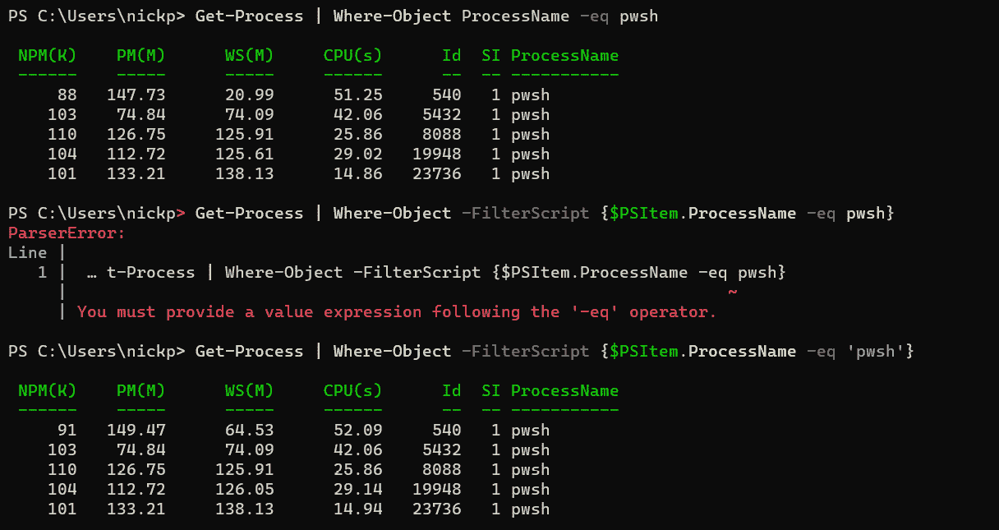

图 3.9 – 使用 Where-Object 过滤的三种方式，其中一种是错误的

没有引号时，cmdlet 会将`pwsh`解释为下一个 cmdlet。如果你仔细查看错误，你会发现它并没有走到那一步，因为`-eq`缺少了一个值。如果在这里使用单引号或双引号并没有太大关系，但最佳实践是使用单引号，除非你需要双引号的一些特殊功能，我们将在*第四章*中讨论，*PowerShell 变量和* *数据结构*。

## 高级语法中的多个过滤器

现在我们理解了语法，可以开始使用它来组合过滤器，以生成更复杂的结果。试试这个：

```
Get-Process | Where-Object -FilterScript {$PSItem.ProcessName -eq 'pwsh' -and $PSItem.CPU -gt 1}
```

这应该给你一个`pwsh`进程的列表，其中`CPU`值大于 1。现在，如果你将`CPU`值改为更高的数字，你应该会看到输出发生变化：

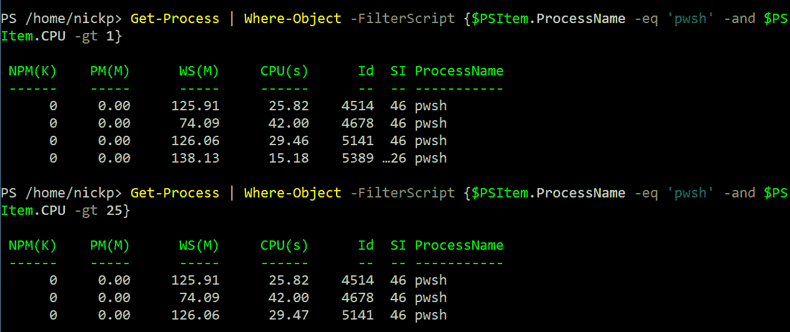

图 3.10 – 使用 Where-Object 高级语法组合过滤器

要注意，脚本块语法是严格的。除非我们小心且准确地输入，否则我们将得不到期望的结果。例如，假设我们输入以下内容：

```
Get-Process | Where-Object -FilterScript {$PSItem.ProcessName -eq 'pwsh' -and CPU -gt 25}
```

在这里，我们会得到一个错误，提示`You must provide a value expression following the '-and' operator`。因为我们能看到这个错误，我们可以通过将`CPU`替换为`$PSItem.CPU`来修正它。然而，假设我们只想要名为`pwsh`或`bash`的进程，并输入如下：

```
Get-Process | Where-Object -FilterScript {$PSItem.ProcessName -eq 'pwsh' -or 'bash'}
```

在这里，我们*不会*得到错误，只会得到错误的结果，如下图所示。正确的语法在下图的第二个示例中展示：

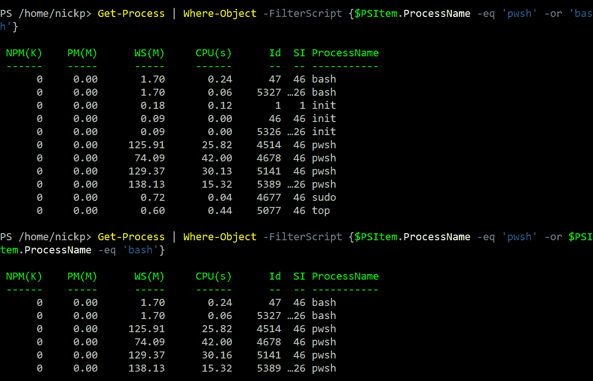

图 3.11 – 小心语法，尤金

我们还可以使用高级语法来访问属性的属性。让我们运行以下命令：

```
Get-Process | Get-Member
```

在这里，我们可以看到`ProcessName`属性是一个字符串，因此它具有字符串对象的属性。这意味着我们可以像这样运行：

```
Get-Process | Where-Object -FilterScript {$_.ProcessName.Length -lt 5}
```

在这里，我们要查找所有机器上`ProcessName`少于`5`个字符的进程。我们还使用了更常见的`$_`来代替`$PSItem`。你必须习惯这个。

## 过滤优化

考虑以下两个 cmdlet：

```
Get-Process | Sort-Object -Property CPU -Descending | Where-Object CPU -gt 1
Get-Process | Where-Object CPU -gt 1 | Sort-Object -Property CPU -Descending
```

它们产生相同的结果（至少在我的机器上是这样）。然而，在我的客户端，第一种方法需要 29 毫秒，而第二种方法只需要 20 毫秒。你可以自己试试，使用`Measure-Command` cmdlet，像这样：

```
Measure-Command {Get-Process | Sort-Object -Property CPU -Descending | Where-Object CPU -gt 1}
Measure-Command {Get-Process | Where-Object CPU -gt 1 | Sort-Object -Property CPU -Descending}
```

有时候，由于它们都是非常短的管道，你可能会得到一个意外的结果，但如果你连续运行它们 10 次，第二个 cmdlet 几乎每次都会在某些方面比第一个更快。这种变化是由于在你的客户端上有其他程序在运行，它们与 PowerShell 争夺资源。

本章前面我们讨论了如何减少 PowerShell 生成结果所需的处理和内存量。过滤优化是实现这一点的好方法。我们应该尽早在管道中进行过滤，以减少 PowerShell 需要处理的对象数量。这里有一个基本规则：**左侧过滤**。

我们不仅仅有`Where-Object` cmdlet 用于过滤。许多 cmdlet 也具有过滤参数，这些参数要么是显式的，参数名为`-Filter`，要么是执行常见过滤任务的参数。例如，`Get-ChildItem` cmdlet 有`-File`和`-Directory`参数，可以将输出限制为这两种对象类型中的一种。尽可能使用 cmdlet 的内建参数来过滤对象，再将它们传递到管道中进行进一步处理。

活动 3

如何找到具有`-Filter`参数的 cmdlet 列表？

现在，我们已经相当了解如何将管道中的对象限制为我们感兴趣的对象。接下来，我们将看看如何对这些对象执行操作。

# 枚举对象

我们经常需要对正在处理的对象执行某些操作。大多数时候，会有相应的 cmdlet 来执行这个操作，但有时也没有。例如，假设我们想输出文件夹中某些项的文件名和路径。没有一个便捷的属性可以仅输出文件名和路径；有像 `pspath` 这样的属性，可以获取我们想要的内容，但会包含一些额外信息，并没有完全符合我们需求的属性。然而，对于 `Get-ChildItem` 返回的对象，有一个方法可以实现这一点：`tostring()`。我们可以通过枚举每个项来执行这个方法，如下所示：

```
Get-ChildItem myfiles | Foreach-Object -MemberName tostring
```

这将产生我想要的完全输出，如下所示：

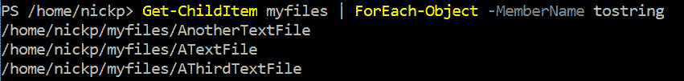

图 3.12 – 基本枚举

这是一个非常简单的示例。就像 `Where-Object` 一样，`Foreach-Object` 有基本语法和高级语法，高级语法与我们在前面部分看到的非常相似。你必须将一个脚本块提供给 `ForEach-Object` 的 `-Process` 参数。要使用高级语法运行最后一个 cmdlet，我们需要输入以下内容：

```
Get-ChildItem myfiles | ForEach-Object -Process {$_.tostring()}
```

如下图所示，输出是相同的。请注意，当使用脚本块时，方法名 `tostring` 后面必须跟着一对括号：

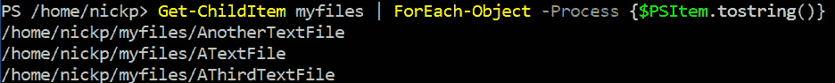

图 3.13 – 高级枚举

如果方法需要参数，那么我们需要将它们放在括号内，并以逗号分隔，如下所示：

```
('Powerhell').Insert(5, 'S')
```

这将通过在原始字符串的第 5 个位置插入 `'S'` 字符串来修正拼写。我们不再像以前那样经常看到交互式枚举，因为通常，cmdlet 会被编写来执行我们可能想要交互式枚举的大多数操作。然而，这在脚本编写中是一个重要的概念，我们将在 *第五章*，“*PowerShell 控制流 – 条件语句与循环*”中看到。不过，这里有一个我们可以使用它的有用技巧 —— 重复执行某个过程指定次数。试试看：

```
1..10 | Foreach-Object {Get-Random}
```

所以，在管道的第一部分，我们使用范围操作符（`..`）创建一个包含从 1 到 10 的 10 个整数的数组。在第二个 cmdlet 中，我们没有使用 `$PSItem` 管道变量 —— 我们只是指示它对管道中的每个项运行一次。正如你所看到的，我们不仅可以在脚本块中放入对象方法；我们也可以将 cmdlet 和脚本放入其中。

## 并行枚举

枚举的一个问题是，当对象数量很多，或者过程很复杂时，它可能需要很长时间。在 PowerShell 7 中，我们获得了并行运行 `ForEach-Object` 进程的能力。尝试运行以下代码，它会输出从 1 到 10 的数字：

```
1..10 | ForEach-Object {
$_
Start-sleep 1}
```

当你在每行后按 *Enter* 时，应该会看到一个继续提示，直到你关闭大括号。慢吧？打印 10 个数字要 10 秒钟。现在，让我们尝试使用并行处理：

```
1..10 | ForEach-Object -Parallel {
$_
Start-Sleep 1}
```

现在，你应该看到数字按每五个一组打印出来。我们可以通过`-ThrottleLimit`参数来改变并行处理的数量。

现在，我们已经探索了一些用于操作管道的有用 cmdlet，并且体验了第一次脚本编写（是的，这就是你刚才做的），接下来我们将看看管道是如何工作的。

# 管道如何工作 – 参数绑定

PowerShell cmdlet 输出与其他通用 shell 的主要区别在于，它的输出不是类似文件的内容，而是一个**对象**，具有类型、属性和方法。那么，一个 cmdlet 生成的对象是如何传递给另一个 cmdlet 的呢？

Cmdlet 只能通过它们的参数接受输入。没有其他方式，因此输出对象必须通过管道传递给下一个 cmdlet 的参数。考虑以下 cmdlet 管道：

```
Get-Process | Sort-Object -Property CPU
```

这里我们只看到了一个参数，`-property`，它被赋予了`CPU`的值。那么，发生了什么呢？`Sort-Object`被赋予了两个参数，但我们看不见其中一个。这就是所谓的**管道** **参数绑定**。

PowerShell 将第一个 cmdlet `Get-Process`的输出传递到第二个 cmdlet，并且必须对其进行处理，因此它会查找第二个 cmdlet 中可以接受 PowerShell 当前持有的对象的参数。这可以通过两种方式发生：`ByValue`和`ByPropertyName`。让我们详细看看这两种方式。

`ByValue`是默认方法，PowerShell 总是首先尝试这个方法，所以我们从这个开始。

## 理解`ByValue`参数绑定

我们可以通过输入以下命令查看`Sort-Object`的帮助文件：

```
Get-Help Sort-Object -Full
```

看一下参数。你会看到，只有一个参数可以接受来自管道的对象：`-InputObject`。帮助文件对它有如下描述：

```
-InputObject <System.Management.Automation.PSObject>
        To sort objects, send them down the pipeline to `Sort-Object`. If you use the InputObject parameter to submit a collection of items, `Sort-Object` receives one object that represents the collection. Because one object cannot be sorted, `Sort-Object` returns the entire collection unchanged.
        Required?                    false
        Position?                    named
        Default value                None
        Accept pipeline input?       True (ByValue)
        Accept wildcard characters?  false
```

这里，我们可以看到它只接受`ByValue`输入，并且只接受`PSObject`类型的输入。`PSObject`是非常宽泛的，它意味着 PowerShell 中的任何对象。所以，我们可以用它来排序一个数字数组，因为它们是`System.Int32`类型的对象，如下图所示。注意，正如帮助文件中所描述的那样，我们不能直接将数组传递给`-InputObject`参数；它必须通过管道。如果我们尝试通过参数显式传递数组，它会将整个数组作为单个对象返回，并且不会排序。我们需要让它通过管道，一次传递一个项：


图 3.14 – 正确与错误使用`-InputObject`参数

让我们再看一个。我们可以从`Get-ChildItem`的帮助文件中看到，它有一个参数`-path`，可以接受`ByValue`管道输入，并且接受字符串对象。这意味着我们可以做类似这样的事情，把`myfiles`字符串放入管道中：

```
'myfiles' | Get-ChildItem
```

在这里，我们将得到一个有意义的输出——`myfiles` 目录中所有项目的列表。如果我们有一个输出路径作为字符串的 cmdlet 管道，我们可以将其传递给 `Get-ChildItem` 来获取内容。使用 `ByValue` 时需要记住的重要一点是，你传递到管道中的对象类型必须与下一个接受管道输入的 cmdlet 的参数所要求的对象类型匹配。

`Get-ChildItem` 很有意思，因为接受管道输入的参数不是 `-InputObject` 参数，而是 `-path`。如果你尝试将一个字符串传递给 `Get-ChildItem`，同时又显式指定了 `-path` 参数，会发生什么？你将会得到一个错误，如下所示：

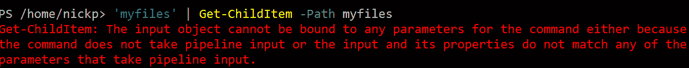

图 3.15 – 管道破坏

前面的错误表示没有参数可以接受管道输入，尽管我们知道有这个参数。这是因为我们在开始处理管道中的对象之前，将一个值绑定到 `Get-ChildItem`，从而有效地将该参数从可用的参数列表中移除。如果我们看到这个错误，通常需要检查是否已经使用过该参数，而不是在沮丧中将笔记本电脑扔向墙壁。

让我们来看一下另一种将管道内容绑定到参数的方法：`ByPropertyName`。

## ByPropertyName 参数绑定

PowerShell 会首先尝试按 `ByValue` 绑定参数。如果 `ByValue` 不可用，它才会尝试使用 `ByPropertyName` 来强行绑定管道对象。如果你的第一个 cmdlet 生成的对象类型不适合下一个 cmdlet 的 `pipeline-accepting` 参数会发生什么？PowerShell 会查看第二个 cmdlet 是否有接受管道输入的参数，并且该参数的属性名与对象匹配——通常是 `-Id` 或 `-Name`。

不出所料，`Stop-Process` 是一个停止进程的 cmdlet。如果我们查看帮助文件，我们会看到三个参数接受管道输入：`-InputObject`，它接受 `ByValue` 对象，以及 `-Id` 和 `-Name`，它们接受 `ByPropertyName`。现在，让我们输入以下内容：

```
Get-Random | Stop-Process
```

在这里，我们会遇到一个错误——与*图 3.15*中显示的错误相同。我们知道 `Stop-Process` 有三个接受管道输入的参数，因此这不是第一个原因。我们也没有显式地将任何内容绑定到参数上，因此错误一定是因为管道中的对象类型不正确。如果我们使用 `Get-Member` 来确定 `Get-Random` 生成的对象类型，然后查阅 `Stop-Process` 的帮助文件，我们会发现 `Get-Random` 生成的是 `System.Int32` 类型的对象，而 `Stop-Process` 需要的是 `System.Diagnostics.Process` 类型的对象。所以，如果管道中没有正确的对象类型，为什么 PowerShell 没有尝试使用 `ByPropertyName` 呢？其实它是尝试过的，但 `Get-Random` 输出的对象的属性名称并没有与 `Stop-Process` 中的 `-Id` 或 `-Name` 参数匹配。让我们来玩点有趣的。输入以下内容：

```
New-Object -TypeName PSObject -Property @{'Id' = (Get-Random)} | Stop-Process -WhatIf
```

我们在这里做什么？我们使用 `New-Object` cmdlet 创建一个通用的 PowerShell 对象（`-TypeName PSObject`），并添加一个属性 `Id`，该属性的值由运行 `Get-Random` cmdlet 生成的随机数填充。如果我们将该 cmdlet 的输出传递给 `Get-Member`，就可以看到这个属性：

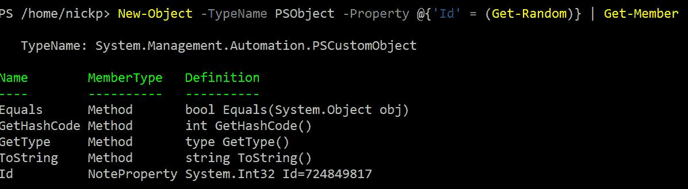

图 3.16 – 创建自定义对象

一旦我们创建了这个新的自定义对象，我们就可以将它传递给 `Stop-Process`。由于对象类型不正确，它不能绑定到 `-InputObject` 参数，但该对象有一个与 `-Id` 参数匹配的属性名称，因此它会绑定到这个参数。最后，因为我们不想玩得太过火，所以我们使用了 `-WhatIf` 参数，以防 `Get-Random` 给我们提供一个有效的进程 ID。`-WhatIf` 是大多数 PowerShell cmdlet 中常见的参数之一，它告诉我们如果运行该 cmdlet 而不实际更改任何内容，会发生什么。

### 括号命令

几次之前，我们已经运行了括号中的 cmdlet，就像我们之前所做的那样。括号是一种覆盖 PowerShell 执行顺序的方式。就像数学中一样，括号是一个指令，表示*优先执行*。当我们在 PowerShell 中使用它们时，括号中的内容必须在该管道段的其他任何内容之前完成处理。这为我们提供了另一种直接将输入传递给参数的方式。

在前面的示例中，我们尝试运行以下内容：

```
Get-Random | Stop-Process
```

这并没有成功。尽管对象类型（`System.Int32`）对于 `-Id` 参数来说是正确的，但 `PropertyName` 值是错误的。使用括号时，我们可以显式地将内容传递给 `-Id` 参数，像这样：

```
Stop-Process -Id (Get-Random)
```

首先，PowerShell 会生成一个随机数，然后将其传递给 `-Id` 参数。我们将在本书中看到更多括号的有用示例。

# 故障排除管道 – 管道追踪

在这一章中，我们已经做了很多工作，现在是时候放松一下，和`Trace-Command`玩得开心了。至少，我觉得这很有趣；其他意见另当别论。然而，这个 cmdlet 确实让我们深入了解 PowerShell 的工作原理，从而能够看到它的实际操作。

运行以下代码：

```
Trace-Command -Name ParameterBinding -Expression {New-Object -TypeName PSObject -Property @{'Id' = (Get-Random)} | Stop-Process -WhatIf} -PSHost
```

在这里，我们运行 `Trace-Command` 并请求它记录 `ParameterBinding` 事件。我们将之前运行的 cmdlet 作为脚本块中的表达式传给它，然后通过 `-PSHost`，我们告诉它将输出显示到屏幕，而不是其默认的调试流，正如我们在本章一开始谈论流时所看到的。

现在，我们屏幕上满是黄色文字，显得很乱；我们需要仔细看看其中的内容。我们感兴趣的问题是：

+   自定义对象绑定到哪里了？

+   自定义对象是如何绑定的？

这是我的输出，整理后的版本，每一行下方有注释：

1.  `DEBUG: 绑定管道对象到` `参数：[Stop-Process]`

在这一行中，我们开始绑定到 `Stop-Process` 的参数。

1.  `DEBUG: 管道对象类型 = [``System.Management.Automation.PSCustomObject]`

这告诉我们管道中的对象类型是什么。

1.  `DEBUG: 参数 [InputObject] 管道输入 ValueFromPipeline` `NO COERCION`

这告诉我们，`-InputObject` 只接受 `ByValue 对象`。

1.  `DEBUG: 绑定参数 [@{Id=1241688337}] 到` `参数 [InputObject]`

`arg [1241688337]` 是生成的随机数。

1.  `DEBUG: 绑定集合参数 InputObject：参数类型 [PSObject]，参数类型 [System.Diagnostics.Process[]]，集合类型 Array，元素类型 [System.Diagnostics.Process]，` `无强制元素类型`

这显示我们对象类型不匹配。

1.  `DEBUG: 绑定参数 [@{Id=1241688337}] 到参数 [``InputObject] 被跳过`

在这里，我们跳过了对 `-InputObject` 的绑定。

1.  `DEBUG: 参数 [Id] 管道输入 ValueFromPipelineByPropertyName` `NO COERCION`

这一行显示 `-Id` 参数接受 `ByPropertyName` 作为输入。

1.  `DEBUG: 绑定参数 [1241688337] 到` `参数 [Id]`

`DEBUG: 绑定集合参数 Id：参数类型 [Int32]，参数类型 [System.Int32[]]，集合类型 Array，元素类型 [System.Int32]，` `无强制元素类型`

这显示我们对象类型匹配。

1.  `DEBUG: 绑定参数 [System.Int32[]] 到参数 [``Id] 成功`

在这里，我们得知我们已经成功绑定到 `–``Id` 参数。

所以，我们得到了问题的答案——管道中的对象绑定到了 `-Id` 参数，`ByPropertyName`。

这只是对 `Trace-Command` 的一个快速介绍。如果你的管道失败了，且你确信对象类型匹配，或者你确保了属性名称匹配，并且没有明确绑定到唯一接受管道输入的参数，那么这个 cmdlet 是你了解发生了什么的最佳希望。

# 总结

在本章中，我们讨论了一些非常有趣且相当技术性的主题。我们首先描述了管道的作用，然后探讨了选择和排序对象的技巧。接着，我们讨论了过滤对象，并谈到了使用过滤功能的重要性，以便让 PowerShell 能够高效地工作。

从这里开始，我们引入了一个之后会很重要的主题：枚举，并探讨了 PowerShell 7 的一项新特性——并行枚举。在本章的最后部分，我们深入了解了管道如何实现其魔力，并研究了两种参数绑定方法：`ByValue` 和 `ByPropertyName`。最后，我们玩了一下一个可以让我们深入了解管道工作原理的 cmdlet：`Trace-Command`。

大多数时候，管道*只需正常工作*。然而，对于那些不工作的情况，本章为我们提供了必要的知识，帮助我们理解管道的工作原理，并且希望能帮助我们修复问题。有时候，cmdlet 作者没有为其 cmdlet 提供接受管道输入的方式。本章向我们展示了如何发现这一点，并给我们提供了一种解决方法。

本章结束了本书关于 PowerShell 工作机制的介绍部分。在下一章，我们将开始编写一些代码，重点讲解变量和数据结构。请继续关注。

# 练习

以下是一些练习，帮助你巩固本章的知识：

1.  我们如何使用 PowerShell 仅显示今天是星期几？

1.  我们需要获取 CPU 使用情况和所有正在运行的进程的路径位置，并且我们不想要过多的无关信息。我们该如何操作？

1.  现在我们有了列表，如何按字母顺序反向排列路径名？

1.  这里有很多内容。我们如何确保它只列出 CPU 使用率大于 5 的进程？

1.  获取我们主驱动器中只读文件的最有效方法是什么？

1.  我们需要获取我们主目录下所有文件的大小。我们只需要文件名和字节大小。

1.  我们有一个包含进程名称列表的文件，名为 `processes.txt`。我们需要使用它来发现本地计算机上进程的信息，因此我们需要找到一个可以从文件中获取内容的 cmdlet。

1.  如果不*实际运行 cmdlet*，在 Windows 主机上如果我们在没有 `-WhatIf` 的情况下运行它会发生什么？

    ```
    'bobscomputer' | Stop-Computer -WhatIf
    ```

如果它不正确，那么正确的 cmdlet 应该是什么？

如果我们在 Linux 主机上运行它，会发生什么？提示：思考一下这个问题。不要尝试它，特别是在没有 `-WhatIf` 的情况下。

# 进一步阅读

随着我年龄的增长，我发现计算机历史变得越来越迷人；在我二十多岁时被认为是前沿的概念和设备，如今已经成为布满灰尘的旧遗物。然而，这些旧遗物在某种程度上帮助解释了我们现在所处的位置。Unix 口述历史项目中有一部分内容讲解了管道的概念：[`dspinellis.github.io/oral-history-of-unix/frs122/unixhist/finalhis.htm`](https://dspinellis.github.io/oral-history-of-unix/frs122/unixhist/finalhis.htm)。
