# 4

# PowerShell 变量和数据结构

是时候真正理解我们谈论变量时的含义了。变量是计算机科学和数学中的常见概念，因此，理解它们是什么以及它们如何在 PowerShell 中使用非常重要。

我们将从探索变量的字面意义和隐喻意义开始。我们将研究如何在 PowerShell 中使用它们，并将 PowerShell 的工作方式与其他语言进行对比。我们将探索基本数据类型的概念，它们是数据的基本构建块，然后再讨论 PowerShell 使用的常见数据结构。最后，我们将通过解包这一重要且有用的技术来简化 cmdlet，来增加一些乐趣。

在本章中，我们将涵盖以下主要主题。

+   理解 PowerShell 变量

+   探索对象类型

+   发现值类型

+   输入解释

+   导航引用类型

+   解包 – 用哈希表来获取乐趣和利润

# 理解 PowerShell 变量

变量就像一个盒子。我们可以把东西放进去。我们可以把这些东西拿出来，再放进去别的东西。这个盒子可能包含一件东西，或者可能包含很多东西。它可以包含同一种类型的多个东西，例如，30 双袜子，或者它可以像我的厨房抽屉一样，包含各种不同的东西，包括线。我们可以以不同的方式组织它包含的东西，或者像我的厨房抽屉一样不组织它们。它可能什么也不包含。

变量实际上是内存区域的标签。它仅仅是一个名称和内存中的地址。当你告诉 PowerShell 使用变量的内容时，你是在告诉它去那个内存区域并使用那里的内容。使用标签给我们带来两个优势；首先，它节省了大量输入，尤其是当变量包含多个对象时。其次，它允许我们赋予变量含义，这样我们和其他读代码的人就能明白变量的目的，并且有一个线索了解它可能包含的内容。这比它现在看起来的要重要和有用得多。


图 4.1 – 这不是一个变量。向马格里特致歉

PowerShell 的设计目的是易于使用，因此变量可以动态创建，这与一些语言（如 Java）不同，在 Java 中我们必须先声明变量，然后才能给它赋值。我的意思是什么？考虑这行代码；不用打出来，只需思考一下：

```
$MyVariable = 'some stuff'
```

我在那里做什么？我正在动态创建一个包含`some stuff`的变量。

如果我要以更像 Java 风格的方式做这件事，我会这样写：

```
New-Variable -Name MyVariable
Set-Variable -Name MyVariable -Value 'some stuff'
```

这将创建一个变量，给它一个名字，然后我们将一个值放入其中。在实际操作中，这种情况非常罕见。大多数人在大多数情况下，都是动态创建变量的。

如果你仔细阅读这些代码行，你会看到第一个示例中包含了`$MyVariable`，而第二个示例中则是`MyVariable`，没有`$`符号。让我们来讨论一下为什么。

## 变量不是它们的内容

我们很少需要操作一个变量。回到盒子比喻，除非我们五岁，否则通常更感兴趣的是盒子里的内容，而不是盒子本身。`MyVariable`是分配给变量的名称，是我们用来引用它的标签。`$MyVariable`则指的是变量的内容。这就是我们感兴趣的东西。让我们来演示一下。

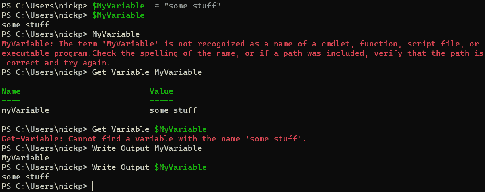

图 4.2 – MyVariable 不是 $MyVariable

在*图 4.2*的第一行，我们动态地创建了一个名为`MyVariable`的变量，并将`some stuff`放入其中：

```
$MyVariable = "some stuff"
```

在第二行，我们通过输入`$MyVariable`来请求 PowerShell 获取`MyVariable`的内容，结果返回了`some` `stuff`。

在第三行，我们只输入了变量的名称`MyVariable`，但是 PowerShell 并没有理解我们想要什么。

在第四行，我们显式地通过`Get-Variable`命令请求`MyVariable`，再次得到了`some stuff`字符串，但我们还得到了其他一些不属于字符串的内容；`Get-Variable`命令返回了一个`PSVariable`对象，而不是变量的内容，即`some stuff`字符串。我们可以使用`Get-Member`来确认它是什么类型的变量。输入以下内容：

```
Get-Variable MyVariable | Get-Member
```

在第五行，PowerShell 很合理地告诉我们并没有一个名为`some stuff`的变量——我们这里传递的是`MyVariable`的内容，而不是变量的名称。

在第六行，看起来我们像是将一个变量传递给`Write-Output`，但实际上并不是。我们传递的是一个值为`MyVariable`的字符串，而不是`MyVariable`的内容。

第七行正确地将`MyVariable`的内容传递给`Write-Output`，通过引用`$MyVariable`。

实际上，如果我们总是以`$`符号开头命名变量，几乎总是会是正确的。这就引出了名字的问题：什么是好的变量名，什么是不好的变量名？

## 变量命名

在命名变量时，有两个因素需要考虑。首先是我们可以使用的名称，其次是我们*应该*使用的名称。

### 我们可以（和不能）使用的变量名

变量名可以包含字母、数字、问号和下划线符号`_`的任意组合。它们不区分大小写。如果我们将变量名放入花括号`{}`中，还可以使用其他字符，但我们并不这么做。真的——这样会让生活变得更复杂，而且几乎没有必要。下面是一些好坏变量名的例子：

| **合法的** **变量名** | **非法的** **变量名** |
| --- | --- |
| `Z54` | `z54!` |
| `ComputerName` | `$``ComputerName` |
| `Computer_Name` | `Computer-Name` |
| `{``Computer Name}` | `Computer Name` |
| `ComputerName?` | `{``Computer Name{}}` |

表 4.1 – 我们可以使用和不能使用的名字

现在我们知道了可以使用什么样的变量名，那么我们应该使用什么样的名字呢？

### 我们应该（和不应该）使用的名字

使用变量的一个目的就是赋予其意义。我们通过使变量名具有意义来实现这一点；一个变量名应该给出一些提示，说明变量的内容或用途是什么。虽然`MyVariable`在我们输入一两行代码时是一个完全合法且合适的名字，但当我们编写脚本时，它并没有提供任何关于它包含的内容或我们希望如何使用它的线索；它只告诉我们它是一个变量，并且它是*我的*。

我的日常工作常常涉及调试别人写的代码。我曾经做过因为脚本中有 20 个或 30 个变量，名字叫`a`、`I`、`x`、`y`、`ii`、`x3`、`agtd`等而做噩梦的事情。我根本不知道它们是什么意思，而且我敢打赌，原作者也不记得了。在命名变量时，我们应该明白，我们的代码将比编写它时被读取的次数要多得多，通常是我们自己读取，有时甚至是在几年后。为了自己着想，给变量起个有意义的名字吧。

我们还应该使用一致的命名规则，例如`ComputerName1`、`ComputerName2`和`ComputerName3`，而不是`ComputerName1`、`computer_name2`和`ComputerNameThree`。PowerShell 最佳实践指南建议广泛使用 Pascal 命名法，其中每个单词的首字母都大写，因为这种方式易于阅读，并且与屏幕阅读器兼容。其他语言，如 Python，建议变量名应全部小写，并且单词之间使用下划线分隔：`computer_name`。无论我们选择哪种方式，保持一致性会使我们的工作更加轻松。

我们也不使用问号。这会显得凌乱，而且可能会导致一些复杂的问题。

最后，我们应该避免尝试使用自动变量或偏好变量的名称。等一下，这是什么？

## 三种常见的 PowerShell 变量类型

到目前为止，我们一直在讨论一种特定类型的 PowerShell 变量——**用户创建的变量**。还有两种其他类型：**自动变量**和**偏好变量**。用户创建的变量只在生成它们的会话或脚本运行时存在；一旦我们关闭 PowerShell 窗口，这些变量就会被销毁。这被称为**作用域**，我们将在*第八章*《编写我们的第一个脚本——将简单的 Cmdlet 转化为可重用代码》中详细介绍。自动变量和偏好变量则会在每个会话或脚本中存在。

### 自动变量

这些是 PowerShell 内部使用的变量。我们已经使用过一个：`$PSItem`，或`$_`，它指的是管道中的当前对象。如果我们愿意的话，可以给它赋值，但 PowerShell 会在当前运行的管道完成时清除它，如*图 4.3*所示：

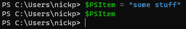

图 4.3 – 不要使用自动变量的名称

在将`$PSItem`设置为`"some stuff"`之后，管道完成，变量被清除，丢失了我们试图存储的信息。幸运的是，大多数自动变量是受保护的，如*图 4.4*所示：

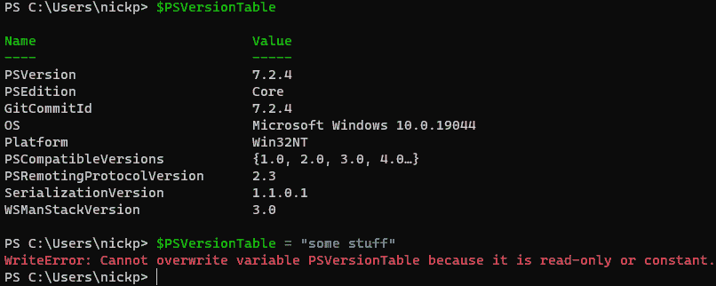

图 4.4 – 你不能覆盖一些自动变量

你可以在帮助主题`about_Automatic_Variables`中查看自动变量的列表，或者可以在网上查看它们：[`docs.microsoft.com/en-us/powershell/module/microsoft.powershell.core/about/about_automatic_variables`](https://docs.microsoft.com/en-us/powershell/module/microsoft.powershell.core/about/about_automatic_variables)。

### 偏好变量

偏好变量存储关于 PowerShell 如何工作的相关信息，使我们能够自定义 PowerShell 的行为。例如，我们可以使用一个偏好变量来确保默认情况下所有我们运行的（支持的）cmdlet 都应用`-WhatIf`参数。让我们看看它是如何在*图 4.5*中工作的：

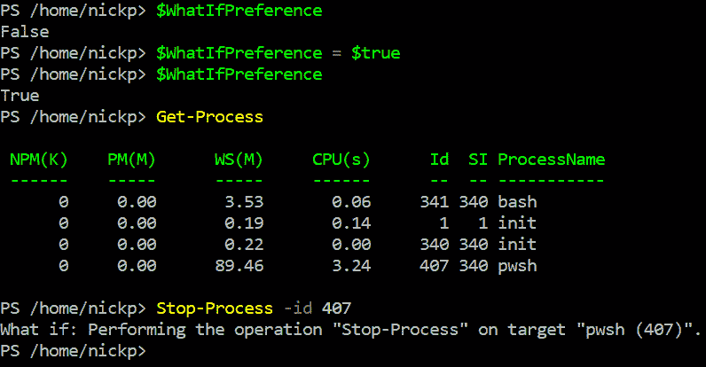

图 4.5 – 使用偏好变量

在第一行中，我们检查了`WhatIfPreference`变量的值；它是`False`，默认值。这是合理的，因为我们刚刚开始了 PowerShell 会话。在第二行中，我们通过设置`$whatIfPreference = $``true`来赋值`True`。

然后我们再次检查其值。果然，现在它是`True`。让我们看看现在的情况如何。我们运行`Get-Process`来获取一个合适进程的`Id`参数；在这个例子中，我将获取`pwsh`进程的 ID，`407`。现在，当我们运行`Stop-Process -Id 407`时，通常会期待`pwsh`会话结束；但它没有，因为默认情况下，现在所有进程都以`-WhatIf`参数设置为`True`运行。

通过这种方式更改偏好变量仅在当前会话或脚本运行时有效。如果你停止并重新启动 PowerShell，它们会恢复为默认值。如果你需要持久化一个偏好，你可以更改你的 PowerShell 配置文件，这是一个 PowerShell 脚本，可以通过查询`PROFILE`变量并键入`$PROFILE`来找到。你将学习如何编辑脚本，在*第八章*，“编写我们的第一个脚本——将简单的 Cmdlet 转换为可重用代码”中。

关于每个偏好变量的完整解释可以在帮助主题`About_Preference_Variables`中找到，或者你可以在线阅读：[`docs.microsoft.com/en-us/powershell/module/microsoft.powershell.core/about/about_preference_variables`](https://docs.microsoft.com/en-us/powershell/module/microsoft.powershell.core/about/about_preference_variables)。

最后，我们可以通过键入`Get-Variable`（不带参数）来查看当前所有变量中的值。

现在我们了解了有关变量（框）的基本情况，我们可以开始看看可以放入其中的内容。让我们来看一下对象类型。

# 探索对象类型

在上一节中，我们讨论了变量的类型。现在，我们要讨论**对象类型**——即放入盒子里的东西。变量中对象的类型告诉计算机如何处理它——它有什么属性，以及我们可以对它做什么。输入以下内容：

```
$MyVariable = "some stuff"
$MyVariable | Get-Member
```

我们应该能看到类似于*图 4.6*中的输出：

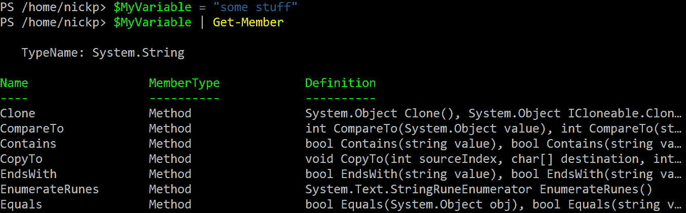

图 4.6 – 它是一个字符串

我们已经把一个字符串放进去，我们知道这一点，因为它被告诉了我们——`TypeName`是`System.String`。此时，`MyVariable`包含一个字符串。我们可以通过赋予其他值来改变其类型。试着输入以下内容，不加引号：

```
$MyVariable = 4.2
```

然后，使用`Get-Member`检查内容。现在我们得到的是一个`System.Double`对象类型，表示一个浮动点数。

我们可以做更好的事情。输入以下内容，并使用`Get-Member`检查变量的内容：

```
$MyVariable = (Get-Process)
$MyVariable | Get-Member
```

现在，我们已经将`Get-Process`的输出保存在我们的变量中，并且内容的类型是`System.Diagnostics.Process`。

变量可以保存任何类型的对象。记住，PowerShell 中的一切都是对象。我们在*第三章*《PowerShell 管道——如何将 Cmdlet 连接起来》中介绍了一些 PowerShell 对象的细节，但从更通用的编程角度回顾它们是个好主意。

## 什么是对象？——redux

想象一辆自行车。它是什么颜色的？有什么样的车把？轮径是多少？我的自行车有猿式车把，15 英寸的轮子，表面有划痕的红色闪光漆。你的自行车可能是一个更实用的物品，配有升降把手、20 英寸的轮子，颜色是可用的黑色。我的儿子汤姆的自行车有追逐把手、22 英寸的轮子，颜色是白色。

那里有三个对象，属于（不存在的）`TypeName Imaginary.Bike`类型。我们可以在*表 4.2*中列出这些对象。所有这些对象都有相同的一组**属性**：名称、车把、轮径（英寸）和颜色属性。在每个实例中，它们的属性值不同。其他属性可能包括篮子、车灯等等。有些属性可能是可选的，但有些不是；自行车总会有两个固定直径的轮子和一个颜色。

| **名称** | **我的自行车** | **你的自行车** | **汤姆的自行车** |
| --- | --- | --- | --- |
| **车把** | 猿式把手 | 升降把手 | 追逐把手 |
| **轮径（英寸）** | 15 | 20 | 22 |
| **颜色** | 红色 | 黑色 | 白色 |

表 4.2 – 我们的自行车

我们可以在 PowerShell 中创建这些自行车，列出每辆车的属性，并且我们可以通过使用`Get-Member`看到它们是`Imaginary.Bike`类型的对象：

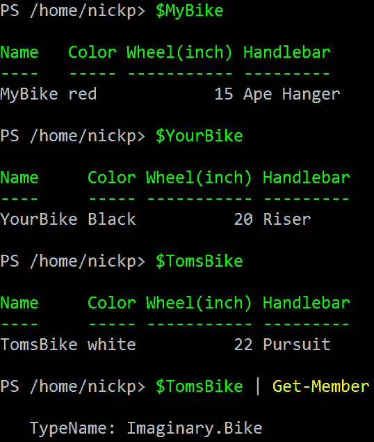

图 4.7 – 三辆假想自行车

我们的自行车也有一组共同的操作方式。我们可以踩踏板来加速它们。我们可以使用刹车来减速它们。这些在*第一章*中的 `Get-Member` 是 PowerShell 7 的简介——它是什么及如何获取它。我们期望同一类型的对象具有相同的方法。

这个对象的概念适用于大多数现代编程语言，并且大多数编程语言以类似的方式处理它们。我们刚刚进行的想象练习在 Python 中和在 PowerShell 中同样适用。以下是 Python 中同样的三辆想象中的自行车：

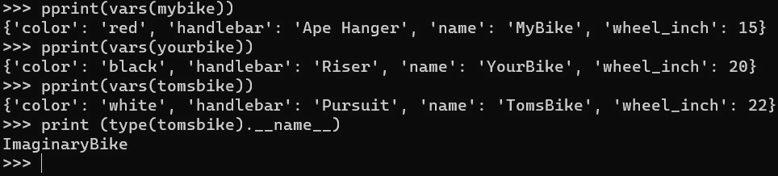

图 4.8 – 另一种语言中的三辆想象中的自行车

在 PowerShell 中的区别在于一切都是对象。考虑到这一点，让我们探索一些我们希望放入变量中的常见对象类型。让我们从值类型开始。

# 发现值类型

在 .NET 中的 `System.Object` 类。总体而言，PowerShell 中的值类型类似于（但并非完全相同于）原始类型。保存值类型对象的内存位置保存实际数据。还有引用类型，我们稍后会看到，它们保存对实际数据的引用；数据保存在其他地方，可能在多个位置。值类型数据是固定大小的，以位为单位。值类型具有单个值。为了说明，让我们看一些值类型。我们将从最简单的值类型，布尔类型，开始。

内存位置——计算机科学 101 提示！

数据存储在内存中的两个不同位置：**栈**和**堆**。栈用于静态分配（不变的事物），而堆则是动态的。堆存储全局信息，其结构就像它的名字一样；这只是一个数据堆，具有树状结构。堆的大小不固定，允许随机访问。对数据的访问可能非常慢，并且随着时间推移，堆会变得分散。

栈是一种有序的固定大小的内存空间。它具有线性结构，最后放入栈的数据位于首位，被移除时也是首先移除的。与堆相比，信息访问要快得多。然而，由于空间有限，我们偶尔会遇到栈溢出，即尝试将更多数据放入栈中而它无法容纳的情况——这相当于计算机科学中的交叉流（《捉鬼敢死队》的参考）。每个运行中应用的线程都有自己的栈，但它们共享应用堆。

当我们创建一个变量时，它被放入栈中。变量引用的数据可能在栈中（对于值类型变量）或者在堆中（对于引用类型变量），但变量本身总是在栈中。

## 布尔值

布尔类型的变量只能保存两个值之一：true 或 false。就是这么简单。它被称为`System.Boolean`或`[bool]`。`[bool]`是一个简写，避免我们输入更长的类名；它是`System.Boolean`类型的别名。布尔值非常容易赋值，我们可以使用自动变量`$True`和`$False`。试试下面的操作：

```
$MyBoolean = $True
$MyBoolean | Get-Member
```

我们可以看到类型是`System.Boolean`。这种类型的变量在脚本中非常有用，正如我们在*第五章*中将看到的，*PowerShell 控制流 – 条件语句和循环*。在那一章中，我们还会看到一个相似但略有不同的值类型——`[switch]`类型——它也只能是 true 或 false，但具有不同的成员集合。

## 整数

整数是没有小数点的整数。常见的三种整数类型为`[int32]`、`[int64]`和`[byte]`。`[int32]`是默认类型，它是一个有符号的 32 位数值，表示它可以存储介于-2,147,483,648 和+2,147,483,647 之间的整数。如果我们创建一个变量来存储这些值范围内的整数，那么 PowerShell 会为其分配`[int32]`类型：

```
$MyNumber = 42
$MyNumber | Get-Member
```

如果我们尝试赋值超出该范围的数字，PowerShell 会将其类型设为`[int64]`，它是 64 位长，可以存储介于-9,223,372,036,854,775,808 和+9,223,372,036,854,775,807 之间的数字。

我们有时会在书籍和网页上看到`[int]`和`[long]`，而不是`[int32]`和`[int64]`——这两个术语可以互换使用。

`[byte]`是一种特殊的整数类型；它没有符号，并且是一个介于 0 和 255 之间的整数，长度为 8 位——即 1 字节。

活动一

为什么不使用单一的整数类型`[int64]`呢？为什么要搞得这么复杂？

## 实数

在数学中，实数是存在的数字——它们可以是整数（42）、小数（3.1）、分数（1/3）或无理数（π、√2）。例如，-1 的平方根这样的虚数并不是实数，尽管它们在很多方面非常有用。在 PowerShell 中，整数使用我们刚刚讨论的整数类型表示，而常见的无理数则通过`[math]`类型表示。我们大多数时候使用实数类型来表示浮点数。

有三种常见的变量类型用于处理实数：[single]（或`[float]`）、[double]（或`[long]`）和`[decimal]`。[single]类型是 32 位，精度为 7 位数字（即小数点右侧的数字）。`[double]`类型是 64 位，精度为 15 位或 16 位数字。默认情况下，当你使用小数时，PowerShell 会创建`[double]`类型的变量：

```
$MyRealNumber = 42.0
$MyRealNumber | Get-Member
```

`[Decimal]`类型是 128 位长，精度可以达到 28 位数字。这在科学和金融计算中使用。

## 字符

`[char]` 类型描述了一个单一字符，是我们当前使用的 UTF-16 字符集中的一个成员。它是一个 16 位的值，对应于当前字符映射中的一个符号。试试以下操作：

```
[char]$MyChar = 24
$MyChar
```

在我的机器上，我看到一个上箭头 `↑`。你可能看到不同的东西。但你不会看到的是 `24`。我们做了一些新的尝试；我们在变量前面加了一个类型加速器。为了理解为什么，我们需要讨论类型。

# 类型说明

现在我们理解了一些基本类型，接下来需要讨论的是类型声明以及语言，特别是 PowerShell，如何操作变量中对象的类型。计算机是如何知道一个对象的类型的呢？编程语言可以分为两类：一种是只支持 **静态类型**，其中变量能容纳的对象类型在变量创建时就已声明，并且不会改变；另一种是支持 **动态类型**，其中变量的内容决定了它的类型。在动态类型语言中，变量的类型是可以改变的。试试以下操作：

```
$MyVariable = 'some stuff'
$MyVariable | Get-Member
$MyVariable = 42
$MyVariable | Get-Member
```

我们可以看到，`$MyVariable` 的对象类型会根据其中的内容变化，这使得 PowerShell 成为一种动态类型语言。事实上，Bruce Payette 在《*PowerShell in Action*》中将 PowerShell 描述为 **类型随意**，因为它会尽力让我们放入变量中的任何东西都能按照我们想要的方式运作。只要变量中的对象具有正确的属性，PowerShell 就不关心它的类型是什么。我们来试试。

## 动态类型与静态类型

如果我们输入 `$x = '4'`，我们得到 `[string]`。如果我们输入 `$x = 4`，没有引号，我们得到 `[int32]`。

现在，让我们看看如果输入以下内容会发生什么：

```
$x = '4' + 4
```

试试看，并将 `$x` 传输给 `Get-Member` 来确认类型。PowerShell 会尽力解释你想要的内容。它选择将第二个 `4` 作为字符串处理，并将两个字符串拼接在一起，结果是 `44`。惊人吧？试试反过来：

```
$x = 4 + '4'
```

现在它将第二个 `'4'` 视为整数，并返回 `8`。在大多数语言中这行不通：

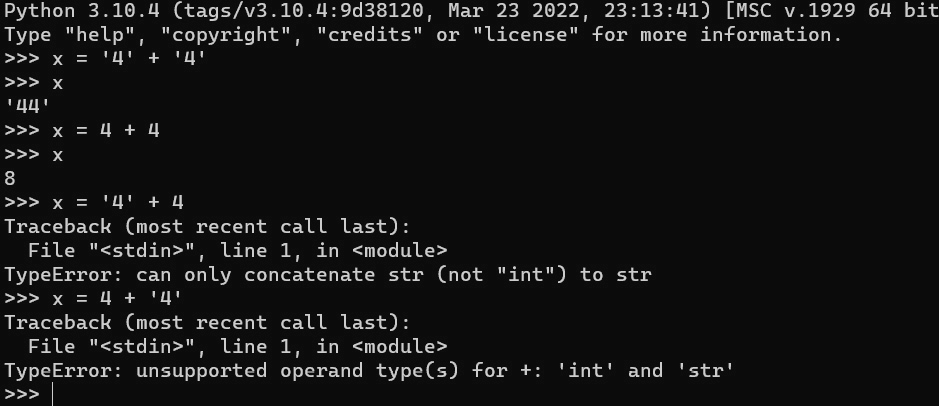

图 4.9 – Python 不是随便的

在 Python 中，我们可以将字符串连接在一起，这叫做 **连接**，我们也可以将整数相加（称为 **加法**），Python 会动态地根据变量内容的不同将其类型定义为字符串或整数。但是，我们不能将字符串和整数混合在一起；Python 会抛出错误。

这通常是一个好事，但有时也可能是双刃剑。因为 PowerShell 会尽力做我们想要的事情，它有时会做出我们不希望的行为。假设我们始终希望内容是字符串类型，但某个数据输入错误或不当操作将整数放了进去。这会影响我们之后对该变量的操作，因为它已经将对象类型更改为整数。在不太宽容的语言中，我们会得到一个明确指出问题所在的错误，但 PowerShell 可能会给我们一些意外的结果，若幸运的话可能需要很长时间来调试，若不幸则可能导致灾难性后果。

## 变量类型转换

幸运的是，我们可以通过在创建变量时使用加速器`[int32]`来让 PowerShell 更像静态类型语言：

```
[int32]$MyNewVariable = '42'
$MyNewVariable | Get-Member
```

即使我们给它的是字符串，它也是一个`[int32]`类型。请注意，如果我们给它一个不容易解释为整数的内容，它将无法正常工作：

```
[int32]$MyNewVariable = 'Forty Two'
```

这会抛出一个错误。重要的是，即使我们只输入以下内容，它也会抛出错误：

```
$MyNewVariable = 'Forty Two'
```

因为当我们在几行前创建`MyNewVariable`时，我们将其定义为`[Int32]`类型，所以现在它只能保存这种类型的内容。这也可能导致一些令人困惑的结果。

当我们尝试将一个浮动点数放入`MyNewVariable`时，可能会期望此命令抛出一个错误：

```
$MyNewVariable = 4.2
```

但是不行。PowerShell 只是选择最接近的整数，并使用它：

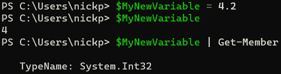

图 4.10 – PowerShell 按照指示操作

不过，我们可以将变量转换为新的类型，如下所示：

```
[single]$MyNewVariable = 4.2
```

现在，我们已经得到了正确的值。类型转换是一项非常有用的技术，稍后我们将会大量使用，特别是在*第七章*，“*PowerShell 和 Web – HTTP、REST 和 JSON*”中。它允许我们将一系列字符串转换成可以与基于 Web 的应用程序交互的 XML 和 JSON 对象。

有几种常见的方法可以使用类型转换来改变变量内容的类型。首先，我们可以通过将内容作为已定义的类型复制来创建一个新变量。让我们创建一个我们知道包含整数的变量：

```
[int32]$MyVariable = 42
```

我们可以将其转换为新变量，并作为字符串使用：

```
$MyString = [string]$MyVariable
$MyString | Get-Member
```

我们也可以反过来操作：

```
[string]$MyOtherString = $MyVariable
```

活动二

`$myString` 和 `$MyOtherString` 有什么区别？

提示：我们接下来可以将哪些类型的对象放入每个变量中？

其次，我们可以在不创建新变量的情况下进行转换；我们可以在代码中使用`[string]$MyVariable`，如果可能，PowerShell 会将其内容视为正确类型的对象。

这就是我们需要了解的简单值类型，以及 PowerShell 如何使用动态和静态类型。接下来，我们需要查看更复杂的复合变量类型——引用类型。

# 导航引用类型

现在我们对类型有了一些了解，也知道了值类型是如何工作的，我们可以讨论另一种主要的对象类型——**引用类型**。在前一节*发现值类型*中，我们将值类型对象与其他语言中的基本数据类型进行了比较。引用类型对象相当于数据结构。引用类型对象只在堆栈中保存指向堆中更多数据的引用；这一点很重要，因为引用类型对象没有固定大小。一般来说，引用类型最多可以包含 2 GB 的数据。为了证明这一点，我通过从古腾堡计划下载文本文件，将莎士比亚的戏剧《哈姆雷特》转化为字符串：

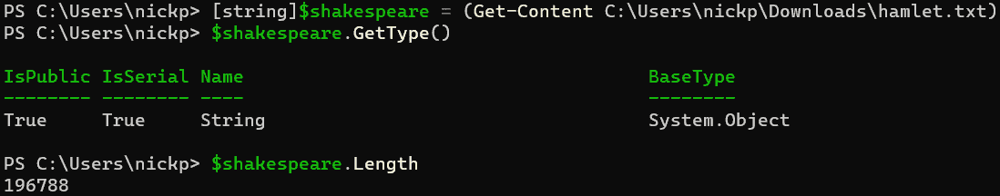

图 4.11 – 字符串化哈姆雷特

如我们所见，整个字符串大约有 197,000 个字符。

我在这里做了两件有趣的事；我使用了字符串类型的 `length` 属性来查看我的字符串有多长（以字符为单位），但我也使用了 `GetType()` 方法来检查对象类型，而不是使用管道将其传递给 `Get-Member`。在我们进一步讨论属性、方法以及可以用字符串做的其他有趣事情之前，我想先从一个简单的引用类型对象——数组开始。

## 数组

数组是一种固定长度的数据结构，包含一组对象。数组中的对象不一定是同一类型，也不一定是排序或有序的。一个数组可以包含零个或多个对象。我们可以通过隐式使用逗号字符 `,` 或显式使用 `[array]` 来告诉 PowerShell 创建一个数组。试试下面的操作：

```
$MyArray = 1,2,3
$MyArray.GetType()
```

你试过了吗？你真的应该试一下。随着我们继续这个部分，我会回到我们在这里创建的数组。如果你到了部分末尾才发现没创建数组，然后又得回去从头开始，那会很糟糕。

要创建一个单元素数组，你可以这样做：

```
$number = ,1
[Array]$MyTinyArray = 1
```

输出可以在以下截图中看到：

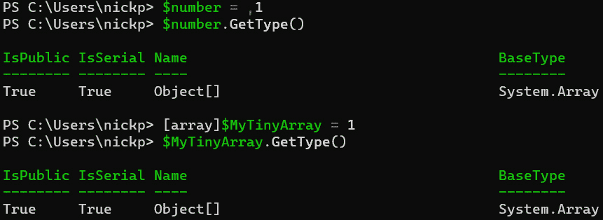

图 4.12 – 两个单元素数组

我们可以看到，我们每次都会创建一个 `Object[]` 类型的 `BaseType`，它是 `System.Array`。

我们还可以使用范围运算符（`..`）来创建数组。尝试以下操作：

```
$NewArray = 1..10
```

我们应该得到一个包含从 1 到 10 所有数字（包括 10）的数组。

最后，我们可以使用数组运算符 `@()`：

```
$AnotherArray = @(1..5; "some stuff")
```

注意，当我们分隔不同类型的对象并使用表达式时，必须使用分号，而不是逗号。当我们开始编写脚本并使用展开技巧时，这一点特别有用，这将在本章最后一节中讲解。

### 数组基础

数组中的每个对象称为元素。我们可以通过调用整个数组（`$NewArray`）来列出元素，和调用其他变量一样：

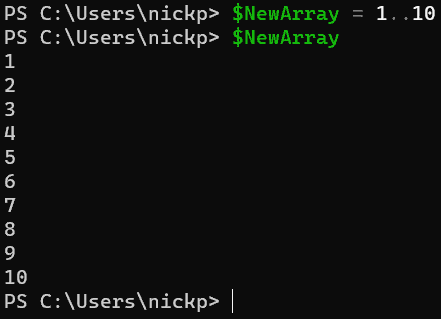

图 4.13 – 列出数组的元素

我们可以选择通过传递索引来调用数组中的单个元素。这将获取第一个元素：

```
$NewArray[0]
```

这将获取倒数第二个元素：

```
$NewArray[-2]
```

我们可以调用多个元素：

```
$NewArray[0,2,5,7]
```

我们还可以调用一系列元素：

```
$NewArray[6..9]
```

我们可以通过直接赋值来改变数组元素的值：

```
$NewArray[5] = 5
```

我们可以通过使用`+=`运算符向数组中添加元素：

```
$NewArray += 11
```

但是从数组中删除一个元素是有点棘手的；相反，创建一个只包含你想要的元素的新数组。

默认情况下，数组可以包含多种类型的对象：

```
$ScruffyArray = 1, 'socks', (Get-Process)
```

我们可以限制数组中对象的类型，使其只能包含某一类型的对象：

```
[Int32[]]$IntArray = 1..5
```

现在尝试以下操作：

```
$IntArray += 'socks'
```

哎呀，我们遇到了错误：

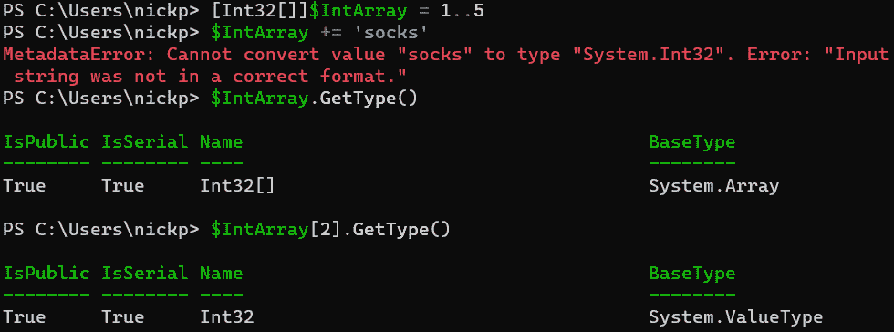

图 4.14 – 你不能把它留在里面

如果我们看一下，可以看到`IntArray`对象的类型是`[int32[]]`，其基础类型是`System.Array`，而元素的类型是`[Int32]`。我们在*第二章*《探索 PowerShell Cmdlet 和语法》中看到了这个语法，当时我们在查看`Get-Help` cmdlet 时使用过它。一个空的方括号表示一个可以包含多个值的参数；换句话说，一个数组：

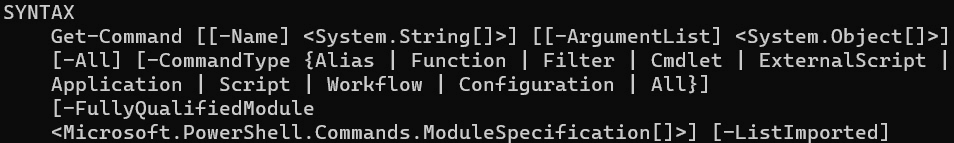

图 4.15 – System.String 接受一个数组

最后，我们可以将数组合并在一起：

```
$BigArray  = $NewArray + $IntArray
```

基本内容已经覆盖。让我们来看一下我们可以使用的数组属性和方法。

### 数组的属性和方法

使用`Get-Member`来查看数组的属性和方法是很困难的。PowerShell 不会将数组传递到管道中；它按顺序传递数组中的每个元素。通过输入以下内容来尝试：

```
$NewArray | Get-Member
```

我们得到的只是`[Int32]`类型的属性和方法。

要查看数组类型的属性和方法，你需要访问帮助主题`about_Arrays`，或者在线查看：[`docs.microsoft.com/en-us/powershell/module/microsoft.powershell.core/about/about_arrays`](https://docs.microsoft.com/en-us/powershell/module/microsoft.powershell.core/about/about_arrays)。

让我们简单看一下其中一些更重要的内容。

#### Count、Length 和 Rank

这些是数组的常见属性。`Count`是`Length`的别名。它们都告诉我们数组中有多少个元素。`$NewArray.Count`和`$NewArray.Length`是相同的。这又回到了老管理员的肌肉记忆问题。你会在 PowerShell 文献中看到这两种说法。

`Rank` 对于处理数据集时很有趣。我们一直在使用的数组是 `$ScruffyArray`，它包含 `Get-Process` 的输出。在 PowerShell 中，你处理的大多数数组可能是单维数组。然而，在数据科学中，我们经常需要使用多维数组；它们比较复杂，我还没看到一个好的 PowerShell 模块来操作它们。如果你真的感兴趣，可以看看 `about_Arrays` 帮助主题。只要知道，如果你需要操作多维数组，这完全是可能的。

#### Clear、ForEach 和 Where

这些是数组的常见方法。当数组的元素支持`Clear`方法时，你可以在数组上使用它来清除所有元素。如果元素不支持该方法，你会得到一个错误。

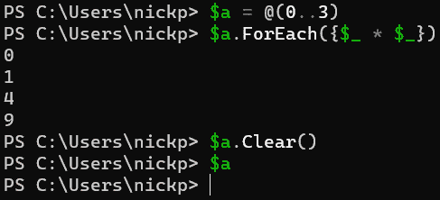

图 4.16 – 有些方法比其他方法更有用

`ForEach`方法允许我们遍历数组中的每个元素，并对其执行操作。输入以下代码可以得到数组中数字的平方：

```
@(0..3).ForEach({$_ * $_})
```

个人而言，我认为这种代码高尔夫（代码简化）故意复杂化，违背了 PowerShell 的最佳实践。如果只处理几行代码，这没问题，但我不会把它放在脚本中。我们将在*第五章*中讨论如何以更易读的方式做这件事，*PowerShell 控制流 – 条件语句* *和循环*。

`Where` 方法类似，虽然在单行表达式中更有用。要获取 `$NewArray` 中大于 5 的元素，我们可以输入以下代码：

```
$NewArray.where({$_ -gt 5})
```

它在功能上与这个相同：

```
$NewArray | Where-Object {$_ -gt 5}
```

可能更不易阅读。我们在*第三章*中已经讨论过 `Where-Object`，*PowerShell 管道 – 如何串联 cmdlet*。记住，PowerShell 会依次将数组中的每个成员输出到管道中。那么，为什么这些方法还存在呢？如果我们正在处理非常大的数组，那么直接在数组上使用方法，而不是通过管道，会更快。以下 cmdlet 在我的笔记本电脑上大约需要 300 毫秒来完成：

```
Measure-Command {@(0..100000).ForEach({$_ * $_})}
```

以下 cmdlet 大约需要 400 毫秒：

```
Measure-Command {@(0..100000) | ForEach-Object{$_ * $_}}
```

所以，这取决于我们想要节省时间的地方。如果最快的代码是我们的目标，那么就对数组使用该方法。如果我们希望代码在回顾时能快速理解，那么使用管道。

### 数组性能

然而，值得节省时间的一个地方是我们对数组的操作。虽然看起来我们可以通过添加元素来改变数组，但实际情况并非如此。数组的大小是固定的。每次添加一个元素时，我们都会创建一个新数组。假设我们看到类似下面的代码：

```
$SlowArray = @()
1..10000 | Foreach-Object { $Slowarray += $_ }
```

我们实际上是在创建和丢弃 10,000 个数组。许多文档会告诉我们，替代方案是使用 .NET 类型而不是数组——例如 `[System.Collections.ArrayList]`，像这样：

```
$ArrayList = [System.Collections.ArrayList]@()
1..10000 | ForEach-Object { $Null = $ArrayList.Add($_) }
```

这里我们有相同的编程风格，我们先创建数组变量，然后向其添加元素，但我们必须调用非 PowerShell 类型，并使用 `Add()` 方法。它有效，但相当复杂，尤其是当我们刚刚开始学习时。

另一种选择是通过巧妙的方式创建数组，并像这样构造它：

```
$AutoArray = (1..10000 | ForEach-Object {$_})
```

这会生成与其他两个方法相同的数组，速度与 `ArrayList` 对象类型相同，但使用全 PowerShell 代码的简单性。我在 `Measure-Command` 中运行了这三个 cmdlet，你可以看到它们的区别：

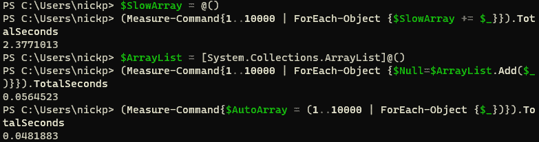

图 4.17 – 三种创建相同数组的方法

我第一次看到这个观察是在 Tobias Weltner 的精彩博客中，[`PowerShell.one`](https://PowerShell.one)。我强烈推荐阅读他的文章。

### 复制数组

现在我们对数组有了一个相当清晰的了解，可以看看值类型和引用类型之间的一个关键区别：复制变量的方式。试试看：

```
$a = 42
$b = $a
$a = 'socks'
```

在不再输入任何内容的情况下——`$b` 中的值是什么？如果你说是 `42`，那你说对了。当然是的。`$a` 的值保存在栈中，所以当我们创建 `$b` 时，我们将 `42` 复制到栈顶，并称之为 `$b`（如果你收到错误信息 `'socks' isn't of type [Int32]`，请关闭 PowerShell 会话并重新启动一个新的会话）。

复制数组并不像那样工作。试试以下操作：

```
$Array1 = 1,2,3
$Array2 = $Array1
$Array1[2] = 5
$Array2
```

啊！发生了什么？`Array2` 包含了更新后的值！这是因为当我们将 `Array1` 复制到 `Array2` 时，我们只是复制了数据在堆中的引用，即进程存储区域。当我们修改元素时，并没有创建新数组；我们只是修改了旧位置的数据。引用保持不变，因此 `Array1` 的所有副本也会引用新数据。

我们如何解决这个问题呢？很简单。至少，算是简单的。试试看，按照以下步骤操作：

```
$Array1 = 1,2,3
$Array2 = $Array1 | ForEach-Object {$_}
```

然后，瞧，我们现在可以对 `Array1` 进行修改，而不影响 `Array2`：

```
$Array1[2] = 5
$Array2
```

我们让 PowerShell 将 `Array1` 中的每个元素放入管道中，并将其传输到 `Array2`，从而创建了一个独立的数据数组。这有点慢且笨拙，但它有效，而且简单。

目前关于数组的内容就讲到这里。接下来，我们会在本书的后续内容中继续深入探讨它们。现在，让我们来看第二种引用类型：字符串。

## 字符串

字符串是一个按顺序排列的`[char]`类型对象集合——它就是文本。正如我们在本节关于引用类型的开始所看到的，字符串是一种引用类型，并且是不可变的——只读的。如果你想改变字符串，你需要创建一个新的字符串并销毁旧的那个。

字符串有两个属性，`Chars` 和 `Length`。`Chars` 返回给定索引处的`[char]`对象：

```
$String = "PowerShell"
$String.Chars(0)
```

`Chars` 是一个带参数的属性——我们必须为其提供一个值，这个值是一个 `[int32]`；否则会抛出错误。不过，我们可以传递一个包含单个 `[int32]` 的变量。`Length` 属性返回字符串对象的字符长度：

```
$String.Length
```

请查看下面的截图，了解这一切是如何显示的：

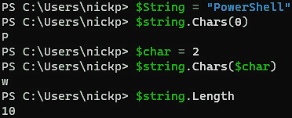

图 4.18 – 字符串的属性

字符串有很多方法。大多数值类型的方法涉及改变对象类型，而字符串有许多方法可以改变格式。看看这个：

```
$String | Get-Member -MemberType Method | Measure-Object
```

我们将看到字符串上有 52 个可用方法。我们不会在这里覆盖所有方法，但我们可以尝试一些常见的方法。记住，每次使用这些方法时，我们都在操作字符串的输出，而不是字符串的内容。

要将字符串转换为全大写：

```
$String.ToUpper()
```

要将字符串转换为全小写：

```
$String.ToLower()
```

要将字符串输出为单个字符的数组：

```
$String.ToCharArray()
```

要替换字符串中的字符：

```
$String.Replace('o','X')
```

完成所有操作后，键入并查看变量的实际内容没有改变：

```
$String
```

`Replace()` 与 `Join()` 和 `Split()` 一起，也是 PowerShell 字符串操作符：

```
$List = 'one,two,three,four'
$List.Split(',')
```

这也可以写成以下形式：

```
$List -Split ','
```

这在下面的截图中显示：

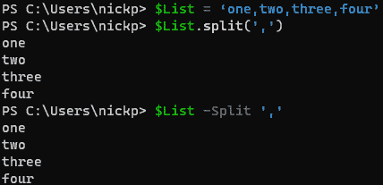

图 4.19 – 两种分割方式

我们经常发现我们有一个日期，但它是以文本格式存在的，最终变成了一个字符串。`ToDateTime` 方法允许我们将该字符串捕获为 `[DateTime]` 类型，但我们需要在方法中提供我们想要的文化信息。我们可以像这样操作：

```
$Culture = Get-Culture
[String]$DateString = '1/5/2024'
$ImportantDate = $DateString.ToDateTime($Culture)
```

我们可以在下面的截图中看到，`$ImportantDate` 是一个 `[DateTime]` 对象：

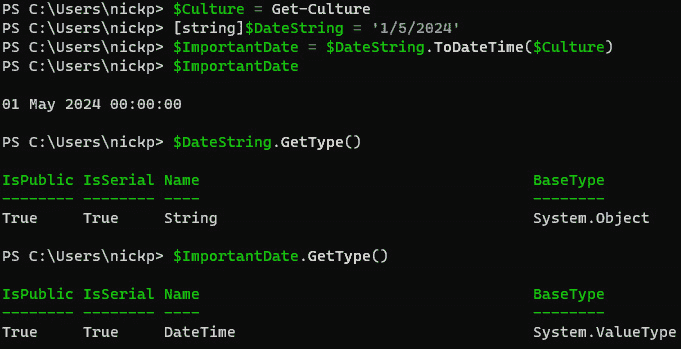

图 4.20 – 将字符串转换为 DateTime 对象

然而，如果有机会，使用 `[DateTime]` 值类型加速器并将变量转换为正确类型的对象会更简单：

```
[DateTime]$Anniversary = '1/5/2024'
```

### 单引号和双引号

在 PowerShell 中，单引号和双引号的行为不同。它们都可以用来定义字符串，但它们的用途不同。试试这个：

```
$MyName = 'Nick'
Write-Output 'My Name is $MyName'
Write-Output "My Name is $MyName"
```

我们可以在下面的截图中看到，输出是非常不同的：

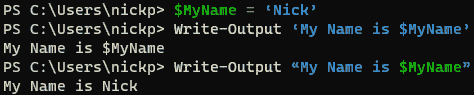

图 4.21 – 单引号和双引号

双引号告诉 PowerShell 在处理之前扩展它找到的变量。我们使用双引号时，Shell 会通过将变量显示为绿色来提醒我们它将要执行的操作。

当打印变量的内容并紧跟另一个字符时，将变量名括在大括号中：

```
"${MyName}: Engineer"
```

要打印变量本身，而不是变量的内容，使用反引号字符 `` ` ``：

```
Write-Output "The value of `$MyName is $MyName"
```

在本书中，我们将会经常处理字符串，但现在我们应该看一下另一个重要的引用类型——哈希表。

## 哈希表

哈希表是 PowerShell 实现的一种数据结构，叫做字典。它们由**键值**对组成。我们使用哈希表来查找给定键的值，或检查哪个键包含给定值；它们基本上是查找表。让我们创建一个哈希表并进行操作：

```
$Hash = @{}
```

我们使用`@{}`来创建一个哈希表。我们不应该将它与`@()`混淆，后者会创建一个数组。现在我们已经有了哈希表，我们应该往里面添加一些内容。我们可以在创建哈希表时这么做，像这样：

```
$MyBike = @{HandleBar = "ApeHanger"; Color = "Red"; Wheel = 15}
```

注意，我们使用分号来分隔键值对，而不是像在数组中那样使用逗号：

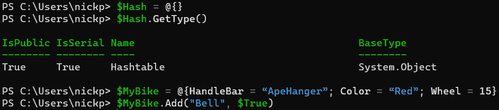

图 4.22 – 创建和填充哈希表

我们可以使用`add`方法向哈希表中添加键值对，如下所示：

```
$MyBike.Add('Bell', $True)
```

`add`方法需要两个参数，用逗号分隔；第一个是键，必须用引号括起来，第二个是值。如果值是字符串，它也必须用引号括起来：

```
$MyBike.Add('Condition','Poor')
```

注意，不像数组，PowerShell 将哈希表视为单个对象：

```
$MyBike | Measure-Object
```

将其与以下内容进行比较：

```
$NewList = @(1,2,3,4)
$NewList | Measure-Object
```

然而，我们可以使用`Count`属性来返回键值对的数量：

```
$MyBike.Count
```

现在我们有了哈希表，我们可以用它做什么呢？显而易见的用途是查找值：

```
$MyBike.condition
```

它返回值`poor`。我们也可以像使用数组索引一样使用键：

```
$MyBike['Wheel']
```

我们也可以使用这种方法来添加键值对：

```
$MyBike['Gears'] = 'Fixed'
```

使用方括号的一个大优点是，它允许我们传递一个键的数组并返回对应的值：

```
$MyBike['HandleBar', 'Condition', 'Gears']
```

或者，我们可以使用一个变量来保存这个数组：

```
$BikeDetails = 'HandleBar', 'Condition', 'Gears'
$MyBike[$BikeDetails]
```

我们可以使用`GetEnumerator()`方法逐个列出哈希表中的所有键值对：

```
$MyBike.GetEnumerator()
```

等等。我们难道不能直接输入`$MyBike`吗？不行。如果我们尝试这样做，整个哈希表会作为一个单独的对象返回。它看起来像是键值对，但不会像一组独立的键值对一样工作。试试下面的操作：

```
$MyBike | ForEach-Object {[Array]$BikeProperties += $_}
$BikeProperties.Count
$MyBike.GetEnumerator() | ForEach-Object {[Array]$NewBikeProperties += $_}
$NewBikeProperties.Count
```

我们可以看到，在第一行中，只有一个对象通过了管道。

我们也可以使用`remove`方法删除键值对：

```
$MyBike.Remove('Gears')
```

我们可以测试某个键是否存在：

```
$MyBike.ContainsKey('HandleBar')
```

然后我们可以测试值是否存在：

```
$MyBike.ContainsValue('poor')
```

### 有序哈希表

默认情况下，哈希表是无序的，这其实并不重要，因为我们只是寻找它们包含的键值对中的值。然而，有时候我们希望哈希表以特定的方式排列。我们可以使用`[ordered]`关键字来实现。注意，这个关键字不放在变量前面，而是放在右侧：

```
$OrderedHash = [ordered]@{a=10;b=20;c=30}
```

你可以在下图中看到它们的区别：

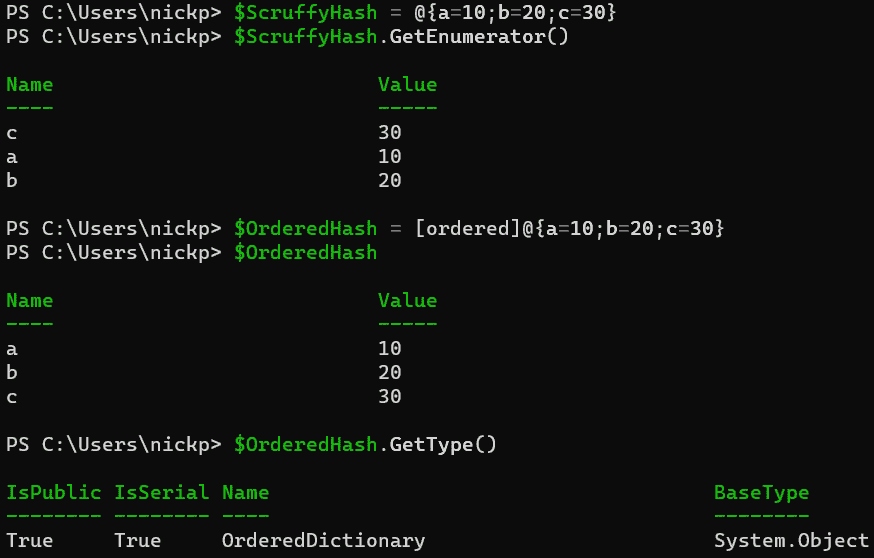

图 4.23 – 有序哈希表

注意，现在它变成了一个不同的类型——`OrderedDictionary`。我们仍然可以通过传递键来获取值，但由于它是有序的，我们现在也可以直接传递键值对的索引：

```
$OrderedHash.c
$OrderedHash[1]
```

最后，您可能注意到我们又回到了自行车的话题。那是因为我们可以对哈希表做一些很酷的事情——我们可以将它们转换为对象：

```
$MyImaginaryBike = [PSCustomObject]$MyBike
```

从以下屏幕截图中可以看到，我们现在有一个名为 `$MyImaginaryBike` 的 `PSCustomObject`，它具有一组与原始哈希表键值对匹配的属性：

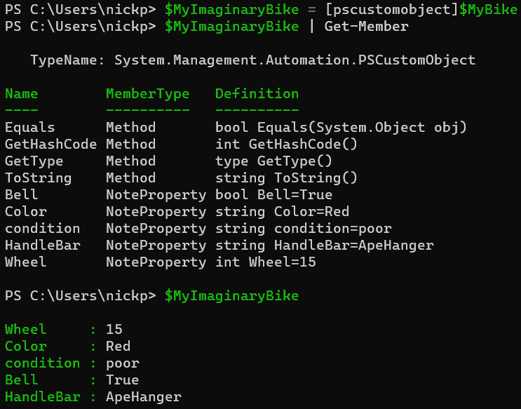

图 4.24 – 将哈希表转换为对象

酷吧？我们将在本书的其余部分中经常使用哈希表，因为它们是非常有用的类型。

还有其他引用类型，涉及其他类型的数据结构，如队列和栈，但我们通常不常使用它们，至少在日常的 PowerShell 中不会使用。在本章结束之前，我们将介绍哈希表的最终用法：splatting。

# Splatting – 哈希表的一个酷用法

一些 PowerShell cmdlet 接受大量参数，逐个在同一行中输入这些参数可能会让人感到困惑。这时，哈希表派上了用场。试试以下方法：

```
$Colors = @{
ForegroundColor = 'red'
BackgroundColor = 'white'
}
Write-Host 'all the pretty colors' @Colors
```

注意我们没有使用 `$Colors`；我们使用的是 `@Colors`。同时，注意它的顺序没有关系：

```
Write-Host @Colors 'OK, just red and white, then'
```

这样也能工作，因为我们在哈希表中明确指定了参数：

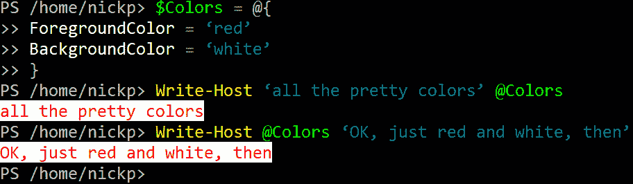

图 4.25 – 基本的 splatting 示例

我们可以使用数组，但这只对位置参数有效；数组中的第一个值将是第一个位置参数，第二个值是第二个，依此类推。因为大多数 cmdlet 不会有超过一两个位置参数，所以这并不像哈希表那样有用。

我们在接下来的章节中将会经常使用 splatting，但对于这一章来说，内容就到这里。现在是总结我们所学的内容的时候了。

# 总结

这一章内容比较长，但我们学到了很多东西。我们首先了解了变量及其在 PowerShell 中的使用方式。接着，我们从计算机科学的角度重新审视了对象，学习了它们的属性和方法。这为我们提供了探索对象类型的基础，我们查看了一些值类型，它们相当于计算机科学中的基本类型。接下来，我们看到值类型如何被分组到数据结构或引用类型中。最后，为了增加一些趣味性，我们了解了 splatting 如何帮助我们节省时间和精力。

在下一章中，我们将研究 PowerShell 中的流程控制，包括 `if` 和 `else` 等条件语句，以及使用 `ForEach` 和 `While` 的循环。我们还会安装更多的软件，因为那才是有趣的部分，对吧？

# 练习

1.  `My Variable` 这个变量有什么问题？

1.  不尝试代码的话，这个 cmdlet 会返回什么 `TypeName`？

    ```
    New-Variable -Name MyVariable -Value "somestuff"
    Get-Variable MyVariable | Get-Member
    ```

1.  我们如何改变 PowerShell 显示错误的视图？

1.  我们可以使用什么自动变量来清空数组或哈希表的内容？

1.  我们如何比较两个整数？

1.  这里的 `MyVariable` 对象类型是什么？

    ```
    $MyVariable = ,1
    ```

1.  我们如何将字符串中的每个字符放入数组中？

1.  这里会出什么问题，为什么？

    ```
    Write-Output 'My Name is $MyName'
    ```

1.  我们如何创建一个类型为 `OrderedDictionary` 的对象？

# 进一步阅读

本章有很多内容要阅读，因为我们只是略微触及了这个主题的表面。我们确实应该阅读与本章内容相关的帮助主题，以及一些官方的 PowerShell 语言文档：

+   `about_Variables`: [`docs.microsoft.com/en-us/powershell/module/microsoft.powershell.core/about/about_variables`](https://docs.microsoft.com/en-us/powershell/module/microsoft.powershell.core/about/about_variables)

+   `about_Automatic_Variables`: [`docs.microsoft.com/en-us/powershell/module/microsoft.powershell.core/about/about_automatic_variables`](https://docs.microsoft.com/en-us/powershell/module/microsoft.powershell.core/about/about_automatic_variables)

+   `about_Preference_Variables`: [`docs.microsoft.com/en-us/powershell/module/microsoft.powershell.core/about/about_preference_variables`](https://docs.microsoft.com/en-us/powershell/module/microsoft.powershell.core/about/about_preference_variables)

+   `about_Objects`: [`docs.microsoft.com/en-us/powershell/module/microsoft.powershell.core/about/about_objects`](https://docs.microsoft.com/en-us/powershell/module/microsoft.powershell.core/about/about_objects)

+   PowerShell 类型: [`docs.microsoft.com/en-us/powershell/scripting/lang-spec/chapter-04`](https://docs.microsoft.com/en-us/powershell/scripting/lang-spec/chapter-04)

+   PowerShell 变量: [`docs.microsoft.com/en-us/powershell/scripting/lang-spec/chapter-05`](https://docs.microsoft.com/en-us/powershell/scripting/lang-spec/chapter-05)

+   `about_Booleans`: [`docs.microsoft.com/en-us/powershell/module/microsoft.powershell.core/about/about_booleans`](https://docs.microsoft.com/en-us/powershell/module/microsoft.powershell.core/about/about_booleans)

+   `about_Arrays`: [`docs.microsoft.com/en-us/powershell/module/microsoft.powershell.core/about/about_arrays`](https://docs.microsoft.com/en-us/powershell/module/microsoft.powershell.core/about/about_arrays)

+   PowerShell 数组: [`docs.microsoft.com/en-us/powershell/scripting/lang-spec/chapter-09`](https://docs.microsoft.com/en-us/powershell/scripting/lang-spec/chapter-09)

+   `about_HashTables`: [`docs.microsoft.com/en-us/powershell/module/microsoft.powershell.core/about/about_hash_tables`](https://docs.microsoft.com/en-us/powershell/module/microsoft.powershell.core/about/about_hash_tables)

+   PowerShell 哈希表: [`docs.microsoft.com/en-us/powershell/scripting/lang-spec/chapter-10`](https://docs.microsoft.com/en-us/powershell/scripting/lang-spec/chapter-10)

+   `about_Splatting`: [`docs.microsoft.com/en-us/powershell/module/microsoft.powershell.core/about/about_splatting`](https://docs.microsoft.com/en-us/powershell/module/microsoft.powershell.core/about/about_splatting)
