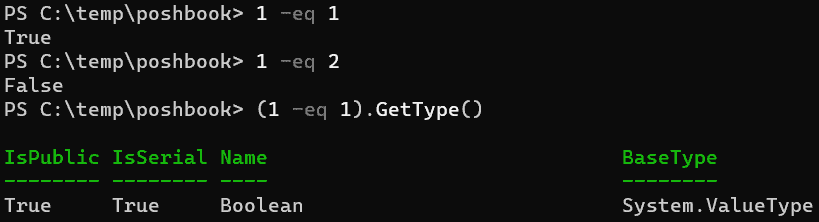
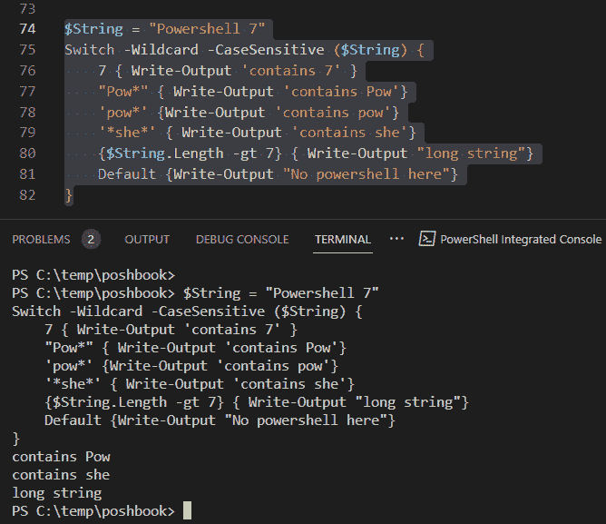

# 第五章：PowerShell 控制流 – 条件语句与循环

到目前为止，我们所做的一切都像阿诺德·汤因比所说的那样，一个接一个。这没问题，但它并没有反映出我们希望在现实世界中发生的情况。大多数时候，我们希望我们的代码根据不同的情况执行不同的操作，有时我们希望它执行某些操作若干次。这就是需要控制流的地方。在本章中，我们将探讨如何让 PowerShell 根据发现的内容在脚本中执行不同的操作——这些称为**条件语句**。接下来，我们将探讨如何让 PowerShell 重复执行某个过程，不管是预定的次数还是不定的次数。由于不定次数可能会是无限的，我们将讨论如何中断和继续循环行为。

高效地完成这些操作需要编写多行代码，因此我们首先将讨论**集成开发环境**（**IDEs**），然后安装推荐用于 PowerShell 7 的编辑器，Visual Studio Code。

在本章中，我们将涵盖以下主要内容：

+   IDE 和 VS Code 简介

+   条件控制 – `if`、`else`、`elseif` 和 `switch`

+   循环 – `foreach`、`do while`、`do until`、`while` 和 `for`

+   中断与继续

+   玩个游戏

# IDE 和 VS Code 简介

控制台非常适合运行一两行代码，或者快速检查某个想法是否可行，但它无法保存我们的代码，也不能编辑它。我们需要一个编辑器。最简单的编辑器就是我们机器上安装的任何文本编辑器，例如 Windows 上的记事本或 Linux 上的 Vi。它们能做的最基本的事情就是让我们写代码、保存代码并返回编辑。但是它们仅能做到这些，还有许多更好的选择可用。

IDE 将高亮显示命令和关键字，并进行一些语法检查，好的 IDE 通常还会内置控制台，让我们通过运行短小的代码片段（有时是一行或者一次运行整个程序）来测试代码。它们通常还具有某种调试功能，允许我们在特定位置停止代码，并检查变量的内容。大多数编程语言都有某种形式的 IDE，例如 Python 有**IDLE**，即**集成开发与学习环境**，但我不知道有多少人会用它来工作，而 Windows PowerShell 有**集成脚本环境**（**ISE**），它非常优秀，但未被移植到 PowerShell 7 中。因此，推荐用于 PowerShell 7 的 IDE 是**Visual Studio Code**（**VS Code**），这是一个由微软开发的基于 JavaScript 的开源环境。

VS Code 是高度可扩展的（意思是——很多人已经为它编写了插件），并且可以支持多种语言。我们需要做的就是下载我们选择的语言模块。还有一些插件可以检查语法，允许我们使用代码片段，连接到代码仓库，如 Git，集成测试，并且做任何我们在更昂贵的 IDE（如 Eclipse）中能做的事。不如不再多说，让我们开始安装吧。

## 安装 VS Code

VS Code 可以安装在 Windows、Linux、macOS 和 Raspberry Pi 上——没错，这里有 Raspbian 安装。其实很简单。访问 VS Code 下载页面：[`code.visualstudio.com/download`](https://code.visualstudio.com/download)，然后点击适合我们正在使用的机器和操作系统的相关安装包；对于 Raspberry Pi，我们选择`.deb` ARM 下载。下载完成后，切换到保存包的文件夹或目录。

### Linux

VS Code 是一个图形化工具，所以我们需要在 Linux 上使用桌面环境。对于 Ubuntu 及其他基于 Debian 的版本，我们只需要运行以下命令：

```
sudo apt update
sudo apt install ./<filename>.deb
```

对于 Raspbian，过程更简单：

```
sudo apt update
sudo apt install code
```

这些命令会完成它。

对于 Red Hat 发行版，事情稍微复杂一些。最简单的方法可能是使用 snapd，在这种情况下，以下命令会有效：

```
sudo snap install code –classic
```

在[`code.visualstudio.com/docs/setup/linux`](https://code.visualstudio.com/docs/setup/linux)上可以找到更详细的 Linux 安装 VS Code 的说明。

### macOS

在 macOS 上安装 VS Code，下载相关的 Mac 安装包`.zip`文件并解压其内容。将`Visual Studio Code.app`拖到`应用程序`文件夹，这样 VS Code 就能在**Launchpad**中使用了。

### Windows

在 Windows 中，我们可以选择用户安装或系统安装。如果选择用户安装，应用程序默认安装在`C:\Users\<username>\AppData\Local\Programs\Microsoft VS Code`，仅对安装它的用户可用。如果使用系统安装程序，则会安装在`C:\Program Files\Microsoft VS Code`，并且需要管理员权限来安装。如果我们安装的是用户安装包，那么自动更新会更容易一些，所以我们就下载那个包吧：

1.  下载完成后，浏览到`下载`位置并双击`.exe`文件。

1.  接受**最终用户许可协议**（**EULA**）并点击**下一步**。

1.  如果需要，可以更改安装位置，然后点击**下一步**。

1.  决定是否需要一个*开始*菜单文件夹，并点击**下一步**。

1.  设置`PATH`环境变量，并将 code 注册为支持的文件类型的编辑器。点击**下一步**：


图 5.1 – 选择 VS Code 安装的附加任务

1.  审查安装选项并点击**安装**。

1.  点击**完成**，然后欣赏你刚刚安装的 VS Code。

#### Windows 用户的快速安装方式

如果我们安装了`PowerShellGet`模块，我们就可以运行以下命令：

```
Install-Script Install-VSCode -Scope CurrentUser ; Install-VSCode.PS1
```

按`Y`表示同意`Yes`，就这样。这个方法非常适合我们已经熟悉 VS Code 的使用，但如果这是我们第一次使用它，我们可以手动操作，以便准确了解每个步骤的发生。

## 配置 VS Code 以支持 PowerShell

现在我们已经安装了 VS Code，需要告诉它识别 PowerShell 语言。在安装时，VS Code 并不支持 PowerShell。我们需要安装一个扩展。打开 VS Code，如果它尚未打开，可以在搜索栏中输入`Code`并从搜索结果中选择该应用程序。在主窗口中，点击窗口最左边的*扩展*图标——它看起来像一堆盒子：


图 5.2 – 查找 VS Code 的 PowerShell 扩展

在扩展搜索栏中输入`powershell`。我们需要的是由 Microsoft 提供的 PowerShell 扩展，它是第一个搜索结果，如下图所示。点击它，然后在主面板中点击蓝色的**安装**按钮：


图 5.3 – 安装 VS Code 的 PowerShell 扩展

开始吧。按*Ctrl* + *N*来打开一个新文件。系统会要求我们选择语言。我们不必这样做，但这样做意味着从一开始就能得到帮助；我们可以不指定语言进行输入，但在将文件保存为 PowerShell 脚本并使用`.ps1`文件扩展名时，语法检查和高亮显示才会启用。点击下拉菜单选择**PowerShell**。我们可以随时通过点击右下角的语言名称来更改语言；如果我们没有选择语言，它会显示**纯文本**。

我们首先看到的应该是 PowerShell 集成终端在屏幕底部启动了。我们可以在其中运行 PowerShell cmdlet，并且当我们从顶部窗口运行代码时，结果会显示在终端中。尝试这样做——在顶部窗口中输入`write-outp`。

你应该会看到 VS Code 提供一个有用的自动补全选项，像这样：


图 5.4 – 在 VS Code 中自动补全

它不仅会为你提供自动补全，还会提示如何使用 cmdlet；如果你将鼠标悬停在建议上，你会看到一个`.ps1`；我使用的是`HelloWorld.ps1`。现在点击窗口右上角的播放图标（箭头）来运行代码。它应该是这样的：


图 5.5 – 在 VS Code 中运行 PowerShell

如果你看到的输出像前面的截图，恭喜你！你已经成功运行了第一个脚本！

切换终端环境的技巧

如果你使用的是 Windows 系统，你可能至少安装了两个不同版本的 PowerShell——PowerShell 7 和 Windows PowerShell。你如何在它们之间切换呢？点击大括号（`PATH`环境变量）。你可以使用`$PSVersionTable`变量来检查你正在运行的版本。

VS Code 功能强大，拥有数百个功能和扩展，这意味着我们可以花费大量时间使用它，但也有几个需要注意的缺点：

+   由于它是开源并且经常更新，互联网上的博客文章和教程（或者说，天哪，PowerShell 编程书籍）可能会迅速过时。我们需要仔细研究如何使用某个功能，或者理解为什么某些东西不起作用，并且要小心任何超过一两年历史的资料来源。

+   由于它是开源且可扩展的，因此学习曲线可能相当陡峭。在本书中，我们会介绍一些常见的使用案例和功能，但我们几乎只触及了使用该软件的表面。官方的 Microsoft 文档是最新的，但不太适合用户使用。我们应该通过可信的文章和有用的网站来补充我们的阅读，比如 Stack Overflow 和 Spiceworks。

+   由于它是开源且可扩展的，任何人都可以为其编写扩展。这意味着有时扩展会非常棒，但有时则不太有用。也可能是两年前一个非常出色的扩展，现在因为作者将其当作一个有趣的项目编写，而现在集中精力做其他事情，导致它已被搁置。

尽管有这些缺点，VS Code 仍然非常有用。当我们遇到让我们烦恼的事情时，我们应该暂停一下，保持耐心，并找到解决办法。更好的做法是，修复它；这正是开源软件的乐趣所在。

现在我们已经安装好了 VS Code 并准备好使用，让我们进入本章的实际主题——PowerShell 控制流程。我们将从条件语句开始。

# 条件控制——if, else, elseif 和 switch

条件控制流程基于一个简单的语句。如果这个条件为真，那么执行某个操作。第一部分是一个布尔表达式。第二部分是基于布尔表达式结果的一个动作。布尔表达式会解析为两种值之一：真或假。我们在*第三章*，*PowerShell 管道——如何将命令结合在一起*，以及*理解 Where-Object 高级语法*章节中讨论了布尔运算符。考虑以下两个语句：

```
1 -eq 1
1 -eq 2
```

第一个解析为布尔类型的真值。第二个解析为假值。如果你不相信，试试看。虽然我们不常检查 1 是否等于 2，但我们经常需要比较变量：



图 5.6 – 只是检查

这涵盖了我们逻辑的第一部分；接下来，我们需要根据测试结果执行某个操作。让我们为一些有趣的操作准备好 VS Code。现在先关闭 VS Code。

转到 PowerShell 提示符（不是 VS Code 中的提示符），并输入以下内容以创建工作目录，移动到该目录，并在其中启动 VS Code：

```
New-Item -Path C:\Temp\Poshbook -ItemType Directory
Set-Location -Path C:\Temp\Poshbook
Code .
```

`Code` 后面的句点很重要。不要漏掉它，否则你会在错误的位置工作。VS Code 启动后，会询问是否信任该文件夹中的文件作者。我们大概会信任，因为我们将成为作者。我们需要创建一个新的文件来进行工作，所以按 *Ctrl* + *N* 创建一个新文件并选择 `Conditionals.ps1`。我们有了空白画布。现在开始工作。

## if 语句

我们将首先查看最简单的条件语句——`if` 语句。我们可以根据表达式是否为真来执行某个操作。请在脚本窗格中输入以下内容：

```
$x = 5
if ($X -gt 4) {
    Write-Output '$x is bigger than 4'
}
```

括号中包含需要被评估的表达式。大括号中包含一个脚本块，当表达式为 true 时，它会运行。现在，选中你的代码行并按 *F8*。代码会运行，你应该能在终端窗口看到输出：


图 5.7 – if 语句

小心使用单引号；请查看 *第四章*，*PowerShell 变量与数据结构*，以了解原因。如果在操作中使用双引号，则会看到输出 `5 is bigger than 4`，因为你扩展了`$``x`变量。

提示

在输入 `if` 后，停顿一下，让 VS Code 赶上进度。它会为你提供 cmdlet 和关键字的选择。点击列表中的 `if`，它会为你构建该语句，如 *图 5.7* 中第 7 行到第 9 行所示。你需要做的只是填入条件和操作。

查看第 3 行和第 8 行的绿色文本。它们是注释。我们使用它们来使代码更易读，并澄清我们的操作。单行注释以 `#` 开头；`#` 后面的内容会被 PowerShell 忽略。多行注释以 `<#` 开头，以 `#>` 结束。这些注释是 VS Code 自动生成的，我们可以保留或删除它们，这对代码的运行没有影响。

我们也可以测试一个语句是否为假。在第 9 行下输入此内容：

```
if (!($x -lt 4)) {
    Write-Output ' $x is bigger than 4'
}
```

我们在这里使用了`!`作为`-not`运算符。我们可以将第 11 行改写为如下：

```
for (-not($x -lt 4)) {
```

但你不会经常看到像那样写出的`-not`运算符——大多数人使用`!`。如果你选中这段代码并按 *F8*，你会再次看到输出 `$x is bigger than` `4`：


图 5.8 – 使用 -not 运算符反转条件

如果 `$x` 小于 4，我们将不会得到任何输出，脚本会继续执行 `if` 语句后的下一行——我们不需要做其他任何事。如果我们希望脚本在某个语句为真时执行一件事，而在语句为假时执行另一件事，会发生什么呢？

### else 语句

我们可以使用 `else` 语句来指定当 `if` 语句的测试条件不为真时的第二个动作。从第 15 行开始输入这个内容——使用自动完成功能来补全 `else` 语句，并注意我们在条件中使用的是 `-lt`，而不是 `-gt`：

```
if ($x -lt 4) {
    Write-Output '$x is smaller than 4'
}
else {
    <# Action when all if and elseif conditions are false #>
    Write-Output '$x is not smaller than 4'
}
```

现在选择第 15 到 22 行并按 *F8*：


图 5.9 – 使用 else 语句

注意第 20 行自动完成 `else` 语句时的备注：`当所有 if 和 elseif 条件为假时的操作`。`else` 语句是当没有条件为真时的兜底方案。但我们如何测试多个条件呢？我们可以一个接一个地写多个 `if` 语句，但每个语句都会执行，不管前一个语句的结果如何。我们也可以把 `if` 语句嵌套在一起，但那样会非常繁琐。

### elseif 语句

我们可以使用 `elseif` 来在单个 `if` 语句内指定多个条件进行测试。在第 24 行输入这个内容。使用自动完成功能来确保正确：

```
if ($x -lt 5) {
    Write-Output '$x is less than 5'
}
elseif ($x -gt 5) {
    Write-Output '$x is bigger than 5'
}
else {
    Write-Output '$x is 5'
}
```

高亮显示你刚刚输入的代码并按 *F8*。你应该看到如下输出：


图 5.10 – 使用 elseif 语句

你可以根据需要添加任意数量的 `elseif` 语句，但一旦某个语句为真，父级的 `if` 语句将会退出。试试这个：

```
if ($x -lt 5) {
    Write-Output '$x is less than 5'
}
elseif ($x -lt 6) {
    Write-Output '$x is less than 6'
}
else {
    Write-Output '$x is 5'
}
```

我们得到的输出是 `$x is less than 6`。`else` 语句没有执行。

### 三元运算符

PowerShell 7 引入了一个新运算符，允许我们在单行中构造简单的 `if`/`else` 语句对。在我们代码的第 15 行，有如下示例：

```
if ($x -lt 4) {
    Write-Output ' $x is smaller than 4'
}
else {
    <# Action when all if and elseif conditions are false #>
    Write-Output '$x is not smaller than 4'
}
```

我们可以像这样用三元运算符重写它：

```
($x -lt 4) ? '$x is smaller than 4' : '$x is not smaller than 4'
```

这样很棒，可以节省很多输入，但也会使代码的可读性降低。问号字符 (`?`) 也可以作为 `Where-Object` cmdlet 的别名，但在这里并没有以这种方式使用。请记住，我们的代码会被阅读的次数远远超过编写的次数。

如果多个语句为真，会发生什么？让我们看看如何处理这种情况。

## switch 语句

我们可以使用多个 `if` 语句来测试多个条件，但这样可能会变得复杂，因此有一个特殊的语句可以用来测试多个为真的条件——`switch`。`switch` 语句会测试每个条件，并为该条件执行相关的脚本块。每个为真的条件都会被执行。让我们看看它是如何工作的。在新的一行中，输入以下内容：

```
$Array  = 1,2,3,4,5
switch ($Array) {
    1 {Write-Output '$Array contains 1'}
    3 {Write-Output '$Array contains 3'}
    6 {Write-Output '$Array contains 6'}
}
```

如果你选择代码并按 *F8*，你应该会看到以下输出：


图 5.11 – 使用 switch 语句

使用 `switch` 语句可以做很多事情。请考虑以下示例：

```
$String = "Powershell 7"
Switch -Wildcard -CaseSensitive ($String) {
    7 { Write-Output 'contains 7' }
    "Pow*" { Write-Output 'contains Pow'}
    'pow*' { Write-Output 'contains pow'}
    '*she*' { Write-Output 'contains she'}
    {$String.Length -gt 7} { Write-Output "long string"}
    Default {Write-Output "No powershell here"}
}
```

在这里，我们正在遍历一个字符串。我们使用了 `-Wildcard` 和 `-CaseSensitive` 参数来检查字符串中匹配的部分，并确保大小写也匹配。我们评估的是字符串的属性，而不仅仅是内容，最后，我们设置了一个默认输出：



图 5.12 – Switch 选项

让我们来看看截图中的代码行：

+   在第 75 行，我们为 `switch` 语句设置了参数——请注意，它们必须在要评估的表达式之前，并且该表达式需要用括号括起来。

+   在第 76 行，我们在检查字符串是否包含整数 `7`。在第 77 行和第 78 行，我们演示了 `-CaseSensitive` 参数的使用。

+   在第 80 行，我们在评估字符串的一个属性，它的长度。请注意，这需要放在一个脚本块中，因此它需要使用大括号，而不是括号。

+   最后，在第 81 行，我们设置了一个默认输出——只有在 `switch` 语句中的其他条件没有匹配时，才会输出这个结果。

活动 1

为什么输出没有产生 `contains 7` 这一行？

我们还可以使用 `-Regex` 参数来与正则表达式进行匹配。这不能与 `-Wildcard` 或 `-Exact` 参数一起使用。`-Exact` 参数与 `-Wildcard` 参数相反，并且是默认值。

# 循环 – foreach、do while、do until、while、for

自动化理论告诉我们，机器在执行重复任务时比人类更擅长；它们可以以完全相同的方式重复执行任务任意次。当我们编写代码时，我们称之为迭代或循环。接下来我们将查看 PowerShell 中四种常见的循环示例。我们将从 `foreach` 循环开始，然后再看看 `do while` 及其对等的 `do until`。接着，我们会讨论更通用的 `while` 语句，并最后讨论 `for` 语句，看看它与 `foreach` 的不同之处。让我们开始吧，首先创建一个新文件，将其设置为 PowerShell 文件，并保存为 `loops.ps1`。

## foreach 循环语句

这是最常见的循环语句。我们之前在 *第三章*《PowerShell 管道——如何将 cmdlet 连接在一起》中提到过 `foreach`，当时我们讨论了 `Foreach-Object` cmdlet。它们的功能相似，但并不完全相同，并且语法差异很大。`foreach` 循环具有以下语法：

```
foreach ( $element in <expression> ) {<scriptblock>}
```

如果 `foreach` 出现在语句的开头，PowerShell 会将其视为 `foreach` 循环语句，而不是 `ForEach-Object` 的别名。我们可以在以下截图中看到这种情况：


图 5.13 – foreach 语句和 foreach 作为 ForEach-Object 的别名

在第 1 行，`foreach`出现在行首或语句前，而在第 2 行，它出现在管道符后面。`PSScriptAnalyzer`，作为 VS Code 中 PowerShell 扩展的一部分，已识别出第 2 行中的`foreach`是`ForEach-Object`的别名，并为它加上了波浪形的黄色下划线，表示这不是好的做法，但第 1 行则没有。如果我们将鼠标悬停在第 2 行的`foreach`上，可以看到它发出了警告，因为我们使用了别名，事实上这是正确的。那张图中还有什么信息呢？

在第 1 行，我们有一个`foreach`语句 —— 它由`foreach`关键字、一个括号中的分组表达式和一个大括号中的脚本块组成。分组表达式的格式是`($element in [expression])`，它生成一个对象集合。一旦集合完成，脚本块会依次作用于每个对象。在这个例子中，我们正在收集当前目录中所有以`.ps1`结尾的对象。然后我们对它们执行操作——获取它们的长度（`$f.length`）并通过复合运算符`+=`将其加到`$l`变量中。无论我们用什么变量来表示集合中的元素，只要它不是自动变量或我们在其他地方使用的变量，都没关系。

在第二行，我们使用`ForEach-Object` cmdlet 来做完全相同的事情。有什么不同呢？

当我们使用`foreach`关键字创建一个循环时，表达式会被运行以生成一个数组，并将其保存在内存中。然后每个元素会一次性进入脚本块。如果你的表达式生成了一个非常大的数组，可能会出现内存问题。

当我们将`ForEach-Object` cmdlet 作为管道的一部分使用时，由`Get-ChildItem *.ps1`生成的数组中的每个元素都会一次性通过整个管道；这意味着它使用的内存要少得多，因为整个数组并不存在于内存中，只有单个元素。缺点是它可能需要更长的时间来处理。

让我们自己尝试一个`foreach`循环。输入以下内容：

```
$l = 0 ; foreach ($f in Get-ChildItem *.ps1) {$l += $f.length} ; $l
```

这与*图 5.13*中的那行代码不完全相同。我们使用了分号（`;`）作为语句分隔符；这使我们能够将多个语句写在一行中，而不是将它们分开写成多行。这虽然输入更容易，但不太容易阅读。我们来逐一分析这个命令；

+   我们的第一个语句是`$l = 0 ;`。这创建了变量`$l`并将其设置为`0`。这意味着每次我们运行整行代码时，`$l`都会被重置为`0`。

+   第二个语句是`Foreach ($i in Get-ChildItem *.ps1) {$l += $i.length} ;`。在这里我们创建了数组并遍历其中的每个元素。

+   我们的最后一个语句只是`$l` —— 它返回`$l`在循环结束时的值。

我们可以通过以下截图看到它的样子：


图 5.14 – foreach 循环和语句分隔符

我们将经常使用`foreach`循环，因为它是最常见的循环类型。接下来我们来看看`do while`和`do until`循环。

## do while 和 do until 循环语句

`do while`和`do until`循环共享相同的语法，先写脚本块：

```
do {<scriptblock>} until/while (<condition> is true)
```

因为条件放在最后，所以它们会至少执行一次脚本块。

尝试一下，输入以下内容：

```
$number = 0
do { $number ++
Write-Output "The number is $number"
} while ($number -ne 5)
```

我们来仔细看看刚刚做的事情：

+   在第一行，我们创建了一个`$number`变量，并将其设置为`0`。

+   在第二行，我们使用`do`关键字开始一个`do while`循环，用大括号`{`打开一个脚本块，并使用`++`递增操作符将`$number`变量增加 1。

+   在第三行，我们执行了另一个操作，将输出写到屏幕上。

+   在最后一行，我们用大括号`}`关闭脚本块，然后使用`while`关键字来提供条件，条件放在括号中。在这种情况下，条件是`$number`不等于`5`。

你的最后一行输出是什么？对我来说，是`The number is 5`。这是因为脚本块在条件评估之前就被运行。试试这个：

```
$number = 0
Do {Write-Host "The number is not Zero"}
While ($number -ne 0)
```

正如我们在下面的截图中看到的，脚本块即使条件为假也已经执行。


图 5.15 – 计算机在骗你

`do until`循环的工作方式与此相同，只是直到条件成立时：

```
$number = 0
do { $number ++
Write-Host "The number is $number"
} until ($number -eq 5)
```

我们来看看这两种循环放在一起的样子：


图 5.16 – do while 和 do until

一般来说，当测试条件预计为正时，我们使用`do until`循环，而当测试条件预计为负时，我们使用`do while`循环。并不是`while`或`until`决定真假，而是与之关联的条件决定。你可以轻松地在`until`中使用“不等于”（负）并在`while`中使用“等于”（正）。不过请记住，当条件不满足时，脚本块会执行第一次。那么我们该怎么处理呢？

## while 循环

`while`循环把`do while`循环反过来，并将条件放在脚本块之前：

```
while (<condition> is true) {<scriptblock>}
```

这意味着如果条件不成立，那么脚本块将永远不会执行。没有`until`语句。

尝试一下，输入如下内容：

```
$number = 0
while ( $number -ne 5) { $number ++
Write-Host "The number is $number"}
```

活动 2

这与我们的`do while`示例产生了相同的输出。为什么？你怎么证明当条件成立时脚本块没有执行？

接下来我们来看最后一种循环：`for`循环。

## for 循环

尽管名为`for`循环，但它更像`while`循环而非`foreach`循环。它是一个计数循环，依赖于条件为真，就像`while`，但它更灵活。语法也更复杂：

```
for (<Iterator> ; <condition> ; <iteration>) { <scriptblock> }
```

迭代器是我们将要迭代的变量，类似于我们之前在研究`while`循环时使用的`$number`变量。条件与`while`循环的条件相同，迭代是在每次循环时对迭代器执行的操作。试试这个：

```
for ($i = 0 ; $i -lt 5 ; $i ++) {Write-Host $i}
```

这并不特别令人兴奋；它看起来只是以一种复杂的方式做了和之前的`while`循环一样的事情。然而，`for`循环让我们能够索引循环中的元素，并根据该索引进行移动。试试这个：

```
$fruits = @('banana', 'apple', 'pear', 'plum')
for ($i = 1 ; $i -lt ($fruits.length) ; $i ++) {
    Write-Host $fruits[$i] "is after"  $fruits[$i-1]
}
```

你应该看到以下截图中的输出：


图 5.17 – 使用 for 循环排列水果

这是我们可以使用`for`循环做的另一件特别的事情。我们可以改变数组的内容。试试这个：

```
$fruits = @('banana', 'apple', 'pear', 'plum')
foreach ($fruit in $fruits) {$fruit = "tasty $fruit"}
Write-Host $fruits
```

好吧，这并没有成功。我们可能希望通过改变`$fruit`来影响原始数组，但并没有实现，因为`foreach`循环操作的是数组元素的副本。不过，我们可以使用`for`循环来实现这一点：

```
$fruits = @('banana', 'apple', 'pear', 'plum')
for ($i = 0 ; $i -lt ($fruits.length) ; $i ++) {
    $fruits[$i] = "tasty $($fruits[$i])"
}
Write-Host $fruits
```

然后我们应该看到如下的输出：


图 5.18 – 使用 for 循环让水果变得美味

在第 50 行，我们做了一些新的事情。我们使用了`$()`，这是子表达式符号，确保 PowerShell 正确解释我们的意图。虽然我们可以在双引号中展开简单的变量，但更复杂的表达式需要更多的操作。如果不将`$fruits[$i]`用一对括号包裹并加上美元符号，PowerShell 将无法正确解包它。

我们快完成对循环的介绍了。我们已经看过了`foreach`循环，它对数组中的每个元素执行操作。我们看过`do while`和`while`，它们在条件为真时重复执行操作。接着我们看了`do until`，它直到条件为真才执行操作。最后，我们看了更复杂的`for`循环，它会重复执行操作预定的次数。接下来我们需要的是控制循环的方式。如果`while`循环中的条件永远不变为假，会发生什么呢？让我们看看使用`break`和`continue`来控制循环。

# 中断和继续

`break`和`continue`语句是相关的，它们允许我们控制循环的行为。我们也可以在`switch`语句中使用它们。重要的是不要在循环或`switch`语句之外使用它们，因为这样会导致不可预测的行为。`break`语句可以用来完全停止循环的迭代，而`continue`语句可以用来停止当前的迭代并跳到下一个迭代。我们先来看`break`语句。

## break 语句

让我们来玩一下可靠的`while`循环。输入以下内容：

```
$number = 0
while ( $number -ne 5) { $number ++
if ($number -eq 3) {
    break
    }
    Write-Host "The number is $number"
}
```

希望你会看到最后打印出的数字是`2`。条件语句`if`会在`$number`为`3`时停止循环。`break`语句只会作用于它嵌套的循环。

## continue 语句

`continue`语句会停止当前循环的迭代，而不是整个循环，然后进入下一次迭代。试试这个：

```
$number = 0
while ( $number -ne 5) { $number ++
if ($number -eq 3) {
    continue
    }
    Write-Host "The number is $number"
}
```

这次，循环会输出数字`1`到`5`，但会省略`3`。它在到达`Write-Host`语句之前就会跳出当前迭代，并开始下一个迭代。你应该能在下图中看到结果：


图 5.19 – 使用 continue

我们也可以在`switch`语句中使用`break`和`continue`，就像这样：

```
$String = "Powershell 7", "python"
switch -Wildcard -CaseSensitive ($String) {
    {$_} {Write-output "processing $_ :"}
    '*7' { Write-Output 'contains 7'}
    "Pow*" { Write-Output 'contains Pow'}
    'pow*' {Write-Output 'contains pow'}
    '*she*' { Write-Output 'contains she'; continue}
    {$String.Length -gt 7} { Write-Output "long string"}
    {$String.Length -lt 7} {Write-Output "No powershell here"}
}
```

这与我们在本章*开关语句*部分早些时候使用的`switch`块类似。不同之处在于，现在我们传递的是一个字符串数组，而不是单个字符串。第 7 行的`continue`语句意味着`long string`和`No powershell here`的输出永远不会被执行；相反，`switch`语句会继续处理数组中的下一个元素`python`。现在将`continue`替换为`break`。我们可以看到整个`switch`语句会停止——`python`永远不会被处理。

目前关于循环的内容就讲到这里。我们将在本书的后续部分频繁使用它们。现在，我们来点轻松的内容吧。

# 让我们来玩个游戏

我们都很熟悉猜数字游戏。让我们运用本章所学来编写一个 PowerShell 游戏。这是许多编程教程中的常见挑战，我们也不例外。在英国，这个游戏有时被称为 Brucie 游戏，因为它与流行的英国电视游戏节目《Bruce Forsyth’s Play Your Cards Right》类似。这里的 Brucie 奖金就是我们可以学到一些东西。

程序会生成一个 1 到 100 之间的随机整数。接着我们需要获取用户输入的另一个整数。我们将猜测值与隐藏的数字进行比较，并判断是否正确。如果正确，我们将结束程序。如果不正确，我们需要判断它是太高还是太低，并输出相应的消息，然后返回继续让用户猜测。我们可以将其表示为一个流程图，这在编写代码时会很有帮助：


图 5.20 – Brucie 游戏的流程图

我们需要做的第一件事是打开一个新文件；我的文件名为`Brucie.ps1`。让我们开始工作吧。

第一个框要求生成一个 1 到 100 之间的随机整数。这很简单：

```
[int]$Hidden = Get-Random -Minimum 1 -Maximum 101
```

现在我们需要告诉玩家该做什么，并获取他们的输入：

```
Write-Host "Let's play the Brucie Game! Guess the hidden number between 1 and 100\. give me a number below"
$guess = [int] (Read-Host)
```

现在我们有了两个变量`$Hidden`和`$guess`，存储了我们的两个数字。我们需要比较它们。最好的方法是使用`if`-`else`语句。如果数字不对，我们做一件事，否则打印`You Win!`：

```
[int]$Hidden = Get-Random -Minimum 1 -Maximum 101
Write-Host "Let's play the Brucie Game! Guess the hidden number between 1 and 100\. give me a number below"
$guess = [int] (Read-Host)
if ($guess -ne $hidden) {
    <# Action to perform if the condition is true #>
} else {Write-Host "You Win"}
```

我们需要执行什么操作？我们需要查看数字是更大还是更小。我们需要再加一个`if`-`else`语句：

```
if ($guess -ne $hidden) {
    <# Action to perform if the condition is true #>
    if ($guess -lt $hidden) {
        Write-Host "Higher!"
    } else { Write-Host "Lower!"}
} else {Write-Host "You Win!"}
```

就是这样，等一下，不对。我们需要给他们多个猜测机会。我们需要一个循环。我们可以在这里使用各种类型的循环，但可能最简单的是`while`循环。在继续往下看我怎么做之前，先思考一下你可能怎么做。

不要偷看，思考一下。

好的，这是我的解决方案：

```
[int]$Hidden = Get-Random -Minimum 1 -Maximum 101
Write-Host "Let's play the Brucie Game! Guess the hidden number between 1 and 100.
give me a number below"
$guess = 0
while ($guess -ne $hidden) {
    $guess = [int] (Read-Host)
    if ($guess -lt $hidden) {
        Write-Host "Higher!"
    } elseif ( $guess -gt $hidden) { Write-Host "Lower!"}
}
Write-Host "You Win"
```

这是完整的实现：


图 5.21 – 布鲁西游戏

在第 4 行，我将`$guess`初始化为`0`，这样循环就有了可以操作的对象。

在第 5 行，我把第一个`if`语句改成了`while`语句。我还用大括号结束了循环，并且将`Write-Host "You Win"`作为程序的最后一条语句。

在第 6 行，我将获取输入的语句放进了循环中。你可以试着把它放在外面。那样很快就会显得乏味，因为我们永远不会改变`$guess`的值，从 0 开始。

我做的唯一其他更改是在第 9 行，我用`elseif`语句替代了`else`，否则即便我们猜对了，循环也会输出`Lower!`。

就这些。确保你保存一份游戏的工作副本，以便我们以后继续使用。我们在本章中覆盖了很多内容，让我们来总结一下。

# 总结

我们从本章开始时先了解了 IDEs，并安装了 PowerShell 7 推荐的环境：VS Code。VS Code 是一个庞大且不断变化的应用程序。我们需要花时间熟悉它，并且随着功能和能力的频繁变化，保持更新。我们已经看到它非常易于使用且功能强大。

然后我们看了控制程序流程的两种主要方式：条件语句和循环语句。我们花了很多时间在`if`、`else`和`elseif`条件语句上，接着又看了相关的`switch`语句。

接下来，我们看了循环。我们从一个遍历数组所有元素的循环——`foreach` 循环开始，探讨了它与 `ForEach-Object` cmdlet 的区别。我们还了解了 `do while` 和 `do until` 循环，它们会在条件为真或为假时重复执行循环，接着我们看了 `while` 循环，它将条件和脚本块的位置互换。在本节中我们最后探讨了一个计数循环——`for`。

最后，我们通过编写一个简单的数字猜谜游戏——布鲁西游戏，来结束这一章。我希望你在做这个练习时有所收获，因为这种练习会让你更加扎实地掌握如何编写 PowerShell 代码。

在下一章中，我们将会看看如何使用 PowerShell 与文件进行交互。我们将要读取内容、写入内容，并进行一些操作。

# 练习

1.  `$x = 4 ; IF ($x -gt 4) {Write-Host '$x is larger than` `4'}` 这段代码会产生什么输出？

1.  写一个语句，当`$x`不大于 4 时，产生输出`$x = 4 ; IF ($x -gt 4) {Write-Host '$x is larger than 4'}`。

1.  写一个语句，当`$x = 4 ; IF ($x -gt 4) {Write-Host '$x is larger than 4'}`时，`$x`正好等于 4 时，产生输出。

1.  写一个语句，当`$x = 4 ; IF ($x -gt 4) {Write-Host '$x is larger than 4'}`时，如果`$x`不大于 4（如问题 2 所示），但是这次使用`ternary`运算符时产生输出。

1.  这里出了什么问题？

    ```
    $processes = Get-process | foreach ($process in $processes) {$process.name}
    ```

1.  重写`$number = 0 ; Do {$number ++ ; Write-Host "Number is $number"} While ($number -eq 5)`使其正常工作，但不使用`do` `until`循环。

1.  使这个语句工作：`For ($i = 0 ; $i -lt 5 ) {``Write-Host $i}`。

1.  我们应该仅在循环和另一个地方使用`break`和`continue`语句。那是什么地方？

1.  你会怎么做才能让 Brucie 游戏限制用户的猜测次数？

# 进一步阅读

这是一个大章节，因此这里有很多进一步阅读的内容：

+   使用 VS Code 开发 PowerShell：[`docs.microsoft.com/en-us/powershell/scripting/dev-cross-plat/vscode/using-vscode`](https://docs.microsoft.com/en-us/powershell/scripting/dev-cross-plat/vscode/using-vscode)

+   关于`if`：[`docs.microsoft.com/en-us/powershell/module/microsoft.powershell.core/about/about_if`](https://docs.microsoft.com/en-us/powershell/module/microsoft.powershell.core/about/about_if)

+   关于`switch`：[`docs.microsoft.com/en-us/powershell/module/microsoft.powershell.core/about/about_switch`](https://docs.microsoft.com/en-us/powershell/module/microsoft.powershell.core/about/about_switch)

+   关于`foreach`：[`docs.microsoft.com/en-us/powershell/module/microsoft.powershell.core/about/about_foreach`](https://docs.microsoft.com/en-us/powershell/module/microsoft.powershell.core/about/about_foreach)

+   关于`do`：[`docs.microsoft.com/en-us/powershell/module/microsoft.powershell.core/about/about_do`](https://docs.microsoft.com/en-us/powershell/module/microsoft.powershell.core/about/about_do)

+   关于`while`：[`docs.microsoft.com/en-us/powershell/module/microsoft.powershell.core/about/about_while`](https://docs.microsoft.com/en-us/powershell/module/microsoft.powershell.core/about/about_while)

+   关于`for`：[`docs.microsoft.com/en-us/powershell/module/microsoft.powershell.core/about/about_for`](https://docs.microsoft.com/en-us/powershell/module/microsoft.powershell.core/about/about_for)

+   关于`break`：[`docs.microsoft.com/en-us/powershell/module/microsoft.powershell.core/about/about_break`](https://docs.microsoft.com/en-us/powershell/module/microsoft.powershell.core/about/about_break)

+   关于`continue`：[`docs.microsoft.com/en-us/powershell/module/microsoft.powershell.core/about/about_continue`](https://docs.microsoft.com/en-us/powershell/module/microsoft.powershell.core/about/about_continue)
