# 第六章：PowerShell 和文件 – 读取、写入和操作数据

到目前为止，我们的 PowerShell 之旅都在屏幕上进行。如果能够将 cmdlet 的输出写入某个文件，以便稍后保存或发送给其他人，那该多好呢？这就是我们在本章要做的。首先，我们将查看如何格式化屏幕上的输出，以便我们可以只专注于感兴趣的内容，或以更有用的方式呈现输出。接下来，我们将探讨如何使用 `Out-File` 将输出写入文本文件。我每天都会做这件事，它是一个非常有用的技巧，但它有很大的局限性，因此我们还将讨论如何创建**逗号分隔值**（**CSV**）文件，以供其他程序（例如 Microsoft Excel）使用，以及如何创建 HTML 文件，以便我们能够以网页的形式展示输出。

一旦我们熟悉了输出，我们将深入了解一个简短的部分，帮助我们理解 PowerShell 如何与文件系统交互，之后再看看我们如何使用 PowerShell 读取和操作常见文件类型中的数据，如文本文件和 CSV 文件。最后，我们将通过一个有趣项目的简短演练来结束本章，并留给你一个挑战。

在本章中，我们将覆盖以下主题：

+   理解格式化

+   写入文本文件

+   使用 `ConvertTo-` 和 `Export-` cmdlet

+   处理文件

+   操作文件

+   让我们来点乐趣吧！

# 理解格式化

让我们来想想我们的老朋友 `Get-Process`。我们知道，当我们运行它时，它会显示我们机器上正在运行的进程列表。对于每个进程，它会显示一些属性。我们通过运行 `Get-Process | Get-Member` 知道，还有许多属性不会显示，除非我们明确请求显示。这几乎是每个 PowerShell cmdlet 的情况；我们看到的输出通常不是管道中对象所有属性的完整输出。这是怎么发生的呢？欢迎来到**默认格式**。

PowerShell 根据管道中对象的 `TypeName` 来决定显示输出的格式。如果 `TypeName` 有关联的 `PSCustomObject`，那么 shell 会判断是否有**默认属性集**，如果有，就会显示这些属性。如果默认属性少于五个，它们将以表格形式显示；如果超过五个，它们将以列表形式显示。最后，如果对象既没有默认格式化视图，也没有默认属性集，那么所有属性将会显示。

我们可以在以下截图中看到 `Get-Process` 的默认格式化视图的一部分：

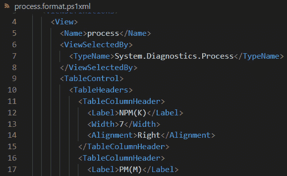

图 6.1 – System.Diagnostics.Process 对象的默认格式化视图的一部分

可以重新定义默认显示的属性，但我从未觉得有必要这么做，因此超出了本书的讨论范围。如果你觉得自己可能需要这么做，可以通过运行以下命令查看`FormatData`命令的帮助文件：

```
Get-Help *FormatData
```

不过，我们并不需要像更新`FormatData`那样进行剧烈的修改来改变输出格式。在本节剩余部分，我们将讨论三种常见的使用`Format`命令更改数据展示方式的方法。首先，让我们来看一下我最喜欢的`Format-List`。

## Format-List

我们使用的大多数命令会以表格形式显示对象名称及几个精选的属性。`Format-List`允许我们以列表形式显示对象的属性和值。请注意，`Format-List`会显示默认属性集中的属性，而不是默认格式视图中的属性（如果有视图的话）。查看以下截图以了解我们所指：

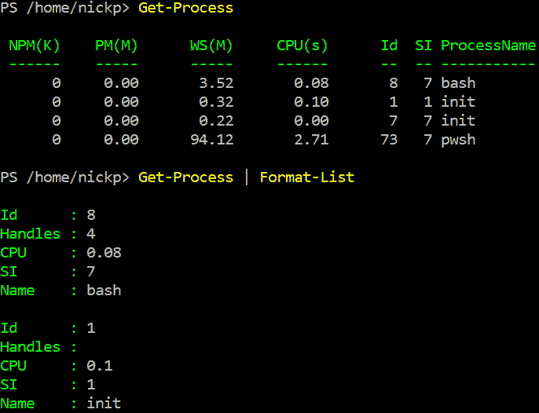

图 6.2 – 默认格式和列表格式

我们可以看到，单独运行`Get-Process`所得到的信息与将其通过管道传递给`Format-List`后得到的信息有很大不同。实际上，`Format-List`看起来并不好，因此我为什么会这么常用它呢？试着获取某个进程的信息，并结合通配符操作符（`*`）使用`Format-List`，如下所示：

```
Get-Process pwsh | Format-List *
```

看！很多信息。我们也可以通过传递以逗号分隔的属性列表给`Format-List`的`-Property`参数来选择只显示特定的属性，如下所示：

```
Get-Process pwsh | Format-List -Property Name, Id, CPU, Responding
```

`Format-List`有一个别名`fl`，所以当我在故障排除服务器时，经常要求别人提供的许多信息都会在末尾加上`|fl *`。

## Format-Table

如果我们想要获取多个对象的数据子集，那么表格格式非常方便。如果我们希望不同于默认格式视图的数据展示，则可以使用`Format-Table`。试试这个：

```
Get-Process | Format-Table -Property Name, Id, CPU, Responding
```

这将以方便的表格格式为每个进程获取一部分属性。

当我们运行`Format-Table`时，往往不会看到我们请求的所有数据；相反，输出会被省略号（`…`）截断。幸运的是，`Format-Table`有两个其他参数可以帮助我们。首先，我们可以使用`-AutoSize`参数去除列间的空白，并将每列设置为其最大条目的宽度。如果仍然无法显示所有内容，我们可以使用`-Wrap`参数将每个条目显示为多行。试试这个，看看效果的不同：

```
Get-Process | Format-Table -Property Name, Id, CPU, Path, Modules
Get-Process | Format-Table -Property Name, Id, CPU, Path, Modules -Wrap
```

这非常方便。接下来我们来看一下最后一个格式化命令`Format-Wide`。

## Format-Wide

`Format-Wide` cmdlet 允许我们以宽列表格式显示数据，这使得在屏幕上阅读更加方便。它类似于标准的 Linux 列表输出（`ls`），但没有使列表命令如此有用的颜色规则。它只会显示每个对象的一个属性，默认显示 `Name` 属性，除非我们使用 `-Property` 参数指定其他属性。它有两个参数可以控制显示方式——`-Column`，指定列数，以及 `-AutoSize`，尽可能不截断数据地显示更多内容。试试看：

```
Get-ChildItem | Format-Wide
Get-ChildItem | Format-Wide -Column 5
Get-ChildItem | Format-Wide -AutoSize
```

就个人而言，我发现自己并没有像应该那样多使用 `Format-Wide` cmdlet。它对于简洁地查看对象列表非常有用，可以避免上下滚动寻找某个项目。

## 格式化陷阱

在 *第三章*，*PowerShell 管道 – 如何将 cmdlet 串联在一起*，我们讨论了一个非常重要的规则：`Format-` cmdlet 会在屏幕上输出可读文本，这是因为它们生成的格式化数据对象由 shell 处理。除了将输出传递给一些专用的 `Out-` cmdlet（例如，`Out-Default | Out-Host`，它隐式地出现在每个 PowerShell 管道的末尾）之外，我们实际上无法在管道的其他地方使用 `Format-` cmdlet 的输出。

然而，我们还有一个非常有用的 `Out-` cmdlet 尚未介绍，我们将在下一节讲解它。

# 写入文本文件

我们在本章开始时承诺会讲解如何将 PowerShell 输出写入文件。现在我们来实现这个目标。我们已经了解到，我们可以将 `Format-` cmdlet 的输出传递给一个 `Out-` cmdlet，而用于将数据写入文件的特定 cmdlet 是 `Out-File`。

`Out-File` 会将任何 cmdlet 的输出写入文本文件。如果我们想的话，可以先使用 `Format-` cmdlet 格式化输出，但也不一定需要这么做；如果不格式化，我们将得到 cmdlet 的默认输出。我们来试试看：

```
Get-Process | Out-File -FilePath C:\temp\poshbook\procsRaw.txt
Get-Process | Format-Table -Property Name, Id, CPU, Path, Modules | Out-File -FilePath C:\temp\poshbook\procsNoWrap.txt
Get-Process | Format-Table -Property Name, Id, CPU, Path, Modules -Wrap | Out-File -FilePath C:\temp\poshbook\procsWrap.txt
```

正如我们所看到的，文本文件的内容与屏幕输出完全相同；我们所做的只是将输出重定向到文件，而不是屏幕。

我们可以与 `Out-File` 一起使用的一些参数如下：

+   `-FilePath` 指定我们要创建的文件的路径和名称。默认情况下，`Out-File` 会覆盖任何具有相同名称的已存在文件，除非该文件是只读的。

+   `-Append` 将输出添加到现有文件中，再次提醒，如果文件不是只读的。

+   `-NoClobber` 将检查文件是否已存在，并防止其被覆盖。如果文件已经存在，我们将看到一个错误信息。

+   `-Force` 将允许我们忽略现有文件的只读属性。

+   `-Encoding` 可以将文件的默认编码从 ASCII 更改为其他多种格式；一种常用的格式是 UTF-8。

`Out-File` 还有几个别名，我们可能经常看到。大于符号（`>`）是 `Out-File -FilePath` 的别名，我们只需要在后面输入路径和文件名。双大于符号（`>>`）是 `Out-File -Append -FilePath` 的别名，同样只需要路径和文件名。我们不能使用其他参数与这些别名一起使用。例如，`Get-Process > C:\temp\processes.txt` 会将 `Get-Process` 的输出保存到 `C:\temp\processes.txt`，如果我们接着运行 `Get-Date >> C:\temp\processes.txt`，它会将 `Get-Date` 的输出追加到同一个文件中。

`Out-File` 只会生成一个文件。它不会将任何对象放入管道，因此必须是管道中的最后一个 cmdlet。

首先要记住的一个重要事情是，写入文件的内容是*完全*与我们在屏幕上看到的一样的。

另一个重要的事情是，我们用 `Out-File` 创建的文件是文本文件。我们可以把它称作 CSV 文件，但它并不是。数据不会被转换，也不会插入逗号。我们来演示一下：

```
Get-Process | Format-Table -Property Name, Id, CPU, Path, Modules -Wrap | Out-File C:\temp\poshbook\procsWrap.csv
```

正如预期的那样，上一行创建的 CSV 文件的内容看起来非常糟糕。如果我尝试在 MS Excel 中打开它，这是我的常用应用程序来处理 CSV 文件，它看起来就是这样：

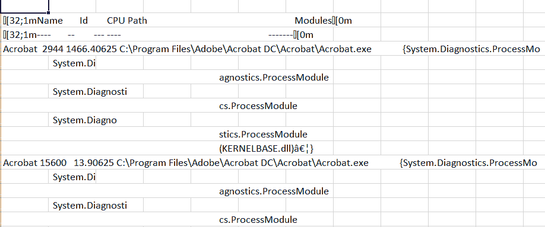

图 6.3 – 这不是一个 CSV 文件

接下来我们将看看如何使用 `ConvertTo-` 和 `Export-` cmdlet 生成不同类型的文件。

# 使用 ConvertTo- 和 Export- cmdlet

如果我们希望我们的 PowerShell 对象以文本以外的格式出现，我们需要以某种方式处理它们。这里有两个 cmdlet 组可以让我们做到这一点。`ConvertTo-` cmdlet 会将我们管道中的对象转换为某种特定类型的数据，比如 CSV 或 HTML 数据。`Export-` cmdlet 则将等效的 `ConvertTo-` cmdlet 与 `Out-File` 功能结合，生成相关类型的文件。在本章中，我们将介绍三种常见的文件类型：CSV、XML 和 HTML。

## CSV

让我们首先看看 `ConvertTo-CSV` cmdlet。通过这个 cmdlet，我们可以将另一个 cmdlet 的输出转换成 CSV 数据流。试试看：

```
Get-Process | ConvertTo-Csv
```

你会看到类似下面的截图：

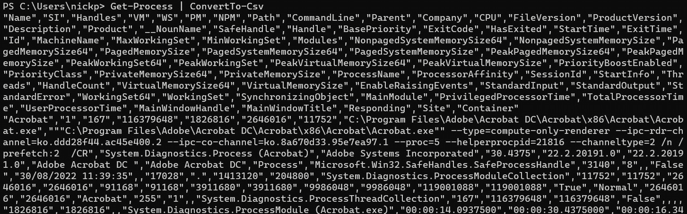

图 6.4 – 丑陋

呜，糟糕吧？不过，我们可以将其通过管道传递给`Out-File`，如下所示：

```
Get-Process w* | ConvertTo-Csv | Out-File C:\temp\poshbook\ProcessesConvertTo.csv
```

它会生成一个真实的 CSV 文件，包含所有以 `w` 开头的进程，可以在支持 CSV 格式的应用程序中打开，比如 MS Excel 或 Google Sheets。不仅如此，它还会忽略默认的格式信息，直接将所有内容输出。

更好的是，有一个 cmdlet 可以在一个操作中完成整个过程——`Export-Csv`：

```
Get-Process | Export-Csv C:\temp\poshbook\ProcessesExport.csv
```

让我们再仔细看看。

### ConvertTo-Csv

这个 cmdlet 有一些我们可能感兴趣的参数：

+   `-NoTypeInformation`：我们在互联网上看到的很多脚本会包含此参数，但现在不再需要它。早于 PowerShell 6.0 时，`ConvertTo-Csv` cmdlet 默认会包含一行介绍，详细说明已转换的对象类型，因此为旧版本 PowerShell 编写的脚本几乎总是会包含此参数来移除该行。自 PowerShell 6.0 起，默认设置是不包括类型信息。包含此参数不会造成问题，但在 PowerShell 7.x 中我们不再需要它。

+   `-IncludeTypeInformation`：如果你*确实*希望在 CSV 流的第一行了解对象类型，可以使用此参数。

+   `-Delimiter`：我们通常希望 CSV 文件使用逗号作为字段分隔符字符，但有时可能需要使用 `` `t ``，或者使用冒号或分号。我们可以使用此参数来指定不同的分隔符字符—例如，在以下情况下：

    ```
    DateTime objects, which in some "DateTime"; "Monday, August 6, 2022 17:55".
    ```

+   `-UseQuotes`：此参数控制 cmdlet 如何应用双引号字符。默认情况下，每个值都会被双引号包围，将其转化为字符串，但有时我们可能希望将值保留为整数或浮动点数。我们可以使用此参数来控制引用行为。

+   `-QuoteFields`：如果我们需要更精细的控制引用行为，可以指定要双引号包围的字段。CSV 文件的第一行是字段名称，可能需要一些试验才能正确设置。

一旦我们将对象转换为 CSV 数据流，可以将其通过管道传递给 `Out-File` 或以其他方式使用；例如，我们可能希望创建多个 CSV 对象，然后聚合和操作它们，最后输出一个单一的文件。

### Export-Csv

`Export-Csv` cmdlet 将 `ConvertTo-Csv` 与 `Out-File` 合并为一个 cmdlet。它具有我们已经讨论过的与这些 cmdlet 相匹配的参数。以下是与 `Out-File` 匹配的参数：

+   `-Path`（代替 `-FilePath`）

+   `-``Force`

+   `-``NoClobber`

+   `-``编码`

+   `-``Append`

这是 `ConvertTo-Csv` 的参数：

+   `-``Delimiter`

+   `-``NoTypeInformation`

+   `-``IncludeTypeInformation`

+   `-``QuoteFields`

+   `-``UseQuotes`

`Export-Csv` 的参数与 `ConvertTo-Csv` 和 `Out-File` 中的对应参数一样，`Export-Csv` 没有别名。

## XML

`ConvertTo-Xml` 和 `Export-Clixml`。

### ConvertTo-Xml

此 cmdlet 只有少量的参数：

+   `-As`：此参数允许我们指定输出格式；无论是单个字符串、字符串数组，还是 `XmlDocument` 对象。

+   `-Depth`：我们可以使用此参数限制文档可以包含的层级和子层级的数量。默认情况下，未指定此参数。

+   `-NoTypeInformation`：这会阻止对象类型信息被写入。

### Export-Clixml

`Export-Clixml` cmdlet 非常简单。它有一个 `ConvertTo-Xml` 参数 `-Depth`，然后是以下 `Out-File` 参数：

+   `-Path (而不是` `-FilePath)`

+   `-``Force`

+   `-``NoClobber`

+   `-``编码`

让我们创建一个可以稍后使用的 XML 文件：

```
Get-Date |Export-Clixml -Path C:\temp\poshbook\date.xml
```

尝试在记事本或 VS Code 中打开它。你应该会看到类似以下内容：

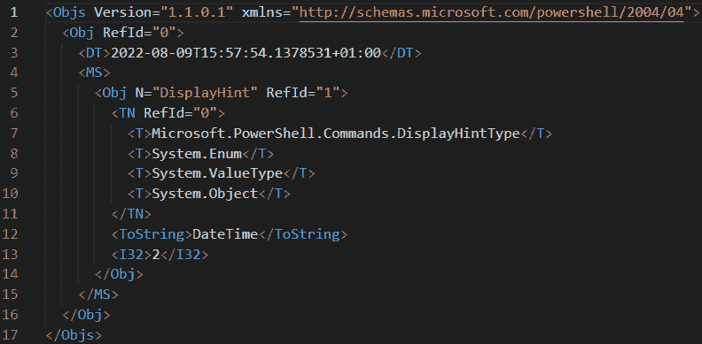

图 6.5 – 作为 XML 表示的日期

关键部分是第 3 行。那才是实际的数据，其余的是格式信息和对象类型的信息。保留这个文件，稍后我们将在本章中使用它。

## HTML

能够将我们的 PowerShell 输出转换为 HTML 非常有用，因为我们可以在网页浏览器中显示它。这是系统管理中编写报告的流行技术。我们可以用它来生成仪表板和其他在线报告。虽然有更好的方法可以创建可以被 Web API 使用的数据，但我们将在下一章中讨论这些方法。创建 HTML 代码的 cmdlet 只有一个；`ConvertTo-Html`。如果我们想将其写入文件，我们需要使用`Out-File`。试试这个：

```
Get-Date | ConvertTo-Html | Out-File -FilePath C:\temp\poshbook\date.html
```

如果你在浏览器中打开`Date.html`，你应该会看到类似这样的内容：


图 6.6 – 作为 HTML 的日期

这并不特别有启发性。让我们仔细看看这个 cmdlet，看看是否能让它更有趣。

### ConvertTo-Html

`ConvertTo-Html` cmdlet 有几个有趣的参数，我们可以用来格式化输出：

+   `-As`：这个参数允许我们将输出格式化为表格或列表。默认情况下，我们得到的是表格。

+   `-Body`：这允许我们在打开的`<body>`标签后添加文本。这是任何网页的主体部分。我们这里不会解释 HTML 的工作原理——如果你想复习 HTML，可以参考[`www.w3schools.com/`](https://www.w3schools.com/)这个优秀且免费的在线资源。

+   `-Head`：这允许我们在`<head>`部分写入文本。

+   `-Title`：这允许我们为页面指定一个标题。与`-Body`和`-Head`不同，它只接受一个字符串。

+   `-PreContent`：这允许我们在创建的表格之前写入文本。

+   `-PostContent`：这允许我们在表格后添加文本。

+   `-Meta`：这允许我们向`<head>`部分添加元标签。

+   `-Fragment`：这会省略`<head>`和`<body>`标签，仅编写 HTML 以生成表格。如果我们将多个片段合并为一个网页，这非常有用。

+   `-CssUri`：这允许我们指定一个 CSS 文件，以提供额外的格式设置，如不同的字体、背景颜色等。我建议你访问[`www.csszengarden.com/`](http://www.csszengarden.com/)来看看我们可以用 CSS 做的一些惊人事情。

让我们来玩一下。打开 VS Code 中新建一个文件，选择 CSS 作为语言，并严格按照以下内容输入：

```
Table {
    color: blue ;
    text-align: center;
    background-color: bisque;
}
Body {
    background-color: cadetblue;
    font-family: 'Trebuchet MS';
    color: yellow;
}
```

将它保存为`style.css`，存放在你的工作目录`C:\temp\poshbook`中。

在同一目录下创建一个新的 PowerShell 文件并试试这个：

```
$params = @{
    As = 'List'
    Title = 'My Date Page'
    Body = 'Here is my Date'
    CssUri = 'Style.css'
}
Get-Date | ConvertTo-Html @params | Out-File C:\temp\poshbook\FancyDate.Html
C:\temp\poshbook\FancyDate.html
```

如果你选择并运行你的代码，你应该会看到以下输出：

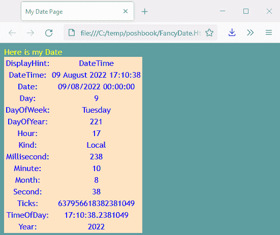

图 6.7 – 一个漂亮的 HTML 日期

这里有一篇关于如何在 PowerShell 中编写 HTML 文档的精彩文章：[`leanpub.com/creatinghtmlreportsinwindowspowershell/read`](https://leanpub.com/creatinghtmlreportsinwindowspowershell/read)。

这是创建文件的一个良好开端。接下来，我们简要介绍一下 `PSProviders`、`PSDrives` 和 `New-Item` cmdlet。

# 处理文件

在我们能处理文件之前，我们需要能够找到它们，并了解 PowerShell 如何处理诸如文件系统之类的层次结构数据结构。

## 关于 PSProviders 和 PSDrives 的简要说明

PowerShell 通过名为 **提供程序** 的软件连接到数据结构。这些提供程序使 PowerShell 能够将数据结构呈现为文件系统（包括文件系统本身）。在 Windows 上，这使得我们可以像操作文件一样搜索和操作注册表和证书存储中的对象。可以说，在 Linux 上它的用途较小。让我们来看一下。运行以下命令：

```
Get-PSProvider
```

你应该能看到提供程序及其关联驱动器的列表。我们可以使用 `Set-Location` cmdlet 连接到关联驱动器：

```
Set-Location Env:
```

请注意，我们必须使用驱动器的名称，而不是提供程序的名称，并且需要在后面加上冒号。

一旦进入数据结构，我们可以使用 `Get-ChildItem` 来搜索对象，如下图所示，这列出了环境变量，就像它们是文件系统对象一样：

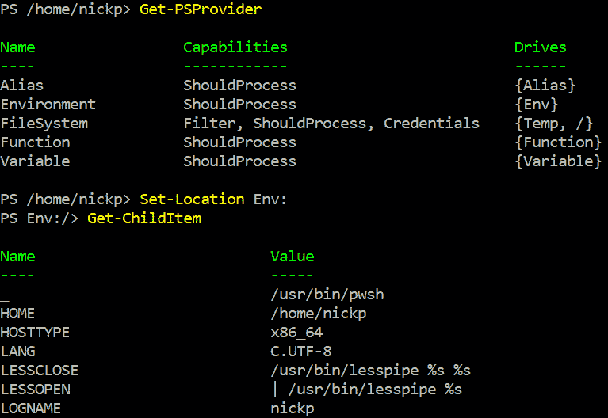

图 6.8 – 环境提供程序

提供程序是动态的；也就是说，它们不需要在连接之前知道存储中的内容，因此它们作为提供访问数据结构的方式非常流行。虽然默认情况下 PowerShell 只包含少数几个提供程序，但你会发现一些模块会添加新的提供程序，特别是在 Windows 上。例如，如果我们安装了 `ActiveDirectory` 模块，那么我们将可以访问一个包含 Active Directory 数据的 `AD:` 驱动器。

请注意，仅仅安装提供程序是不够的。我们还需要有一个驱动器对象才能浏览它。驱动器是我们工作的对象，而提供程序是让我们访问它的软件。大多数模块会创建所需的驱动器并安装提供程序。我们可以非常容易地创建自己的驱动器。在我的 Ubuntu 机器的主目录中，我有一个名为 `MyFiles` 的目录。我可以通过运行以下命令将其创建为驱动器：

```
New-PsDrive -Name MyFiles -Root /home/nickp -PSProvider FileSystem
```

然后，我可以像这样浏览 `MyFiles:` 驱动器：

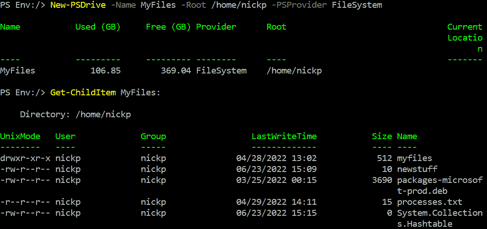

图 6.9 – 创建一个新的驱动器

## 项目 cmdlet

我们使用 `-Item` 和 `-Childitem` cmdlet 在文件系统中移动并查找项。这里不做详细介绍，因为它们是自解释的。阅读相关帮助文件以了解它们简单的语法：

+   `Get-ChildItem` 列出位置中找到的项目：

    ```
    Copy-Item lets us make a copy of an item in a different location:

    ```

    Move-Item 允许我们将项目移动到不同的位置：

    ```
    Rename-Item lets us change the name of an item:

    ```

    `Remove-Item` 允许我们删除一个项目：

    ```
    Get-Item lists the item and its value; it doesn’t get the contents. Most of the time, we want to use Get-ChildItem instead when we’re working in the filesystem, but if we wanted to know the value of an environment variable, then we would use this cmdlet. Try this. Type the following:

    ```

    `Get-Item` 返回了 C:\temp\poshbook 文件夹的属性，而 `Get-ChildItem` 返回了该文件夹及其内容。

    ```

    ```

    ```

    ```

    ```

    ```

+   `Set-Item`：同样，在文件系统中这不是特别有用。然而，如果我们想要更改环境变量或别名的值，则需要使用此 cmdlet。

+   `New-Item`：我们可以用它来创建文件和文件夹，以及创建新的别名和变量：

    ```
    Invoke-Item: Performs the default action on an item. For instance, if it’s an executable file, it will run it. If it is a TXT file, it will open the file in the default text editor:

    ```

    Invoke-Item -Path C:\temp\poshbook\FancyDate.html

    ```

    ```

还有两个 cmdlet 用于在驱动器之间和驱动器内部移动；`Get-Location` 和 `Set-Location`。许多这些 cmdlet 都有与之关联的别名，模拟等效的 bash 和 Windows 命令——例如，`Get-ChildItem` 可以通过 `ls` 或 `dir` 调用。不过请注意，参数仍然是 PowerShell 的，而不是 bash 或 Windows 命令的。例如，`Dir /p` 并不会生成分页目录列表，而是会产生一个错误。

现在我们知道如何找到文件并移动它们了，让我们看看文件里面有什么内容。

# 操作文件

使用 PowerShell 读取文件内容并操作数据是一个常见任务。在这一部分中，我们将介绍三个 cmdlet。首先，我们来了解一下通用的 `Get-Content` cmdlet。

## Get-Content

`Get-Content` cmdlet 可以获取文件中的任何类型数据，并将其存储为字符串或字节的数组（字节流）。默认情况下，文件中的每一行将被解释为单个字符串。只有当文件可以被解释为字符串数组时，我们才能获得有意义的内容；否则，我们必须将其作为字节流获取。这在我们获取可执行文件的内容时非常有用。它有几个参数，下面是一些较为重要的：

+   `-Path` 指定了我们想要的项目。它接受一个字符串数组，这样我们就可以将多个文件连接成一个单一的数组。

+   `-TotalCount` 是从文件中读取的总行数。默认值是 `-1`，表示读取到最后一行，但我们可以只检查文件的前几行，以确保文件内容符合预期，而不需要加载整个文件。

+   `-ReadCount` 是每次通过管道发送的行数。

+   `-AsByteStream` 允许我们将内容作为字节而非字符串获取。

+   `-Credential` 允许我们提供替代凭据以打开文件。

+   `-Delimiter` 允许我们指定用于分隔字符串的字符。默认情况下，它是换行符（`` `n ``），但我们可以使用任何字符。

+   `-Encoding` 可用于指定内容使用与默认格式不同的编码；**没有字节顺序标记的 UTF-8 编码** (**utf8NoBOM**)。

+   `-Raw` 将返回整个内容作为一个单一字符串。

+   `-Tail` 类似于 `-TotalCount`，但它是从文件的末尾向回读取行。不能与 `-TotalCount` 一起使用。

`Get-Content` 的功能类似于 Linux 中的 `cat` 命令，毫不意外的是，`cat` 是它的别名。

`Get-content` 是将数据导入 PowerShell 以便我们操作的最常见方法之一，但它的灵活性较差。例如，如果我们尝试获取一个 CSV 文件，它会将该文件作为文本文件解释，而不是作为一个特殊格式化的文件。让我们看看如何以结构化的方式导入信息。

## Import- cmdlet

与 `Export-` cmdlet 一样，`Import-` cmdlet 同时执行两个操作。它们将 `Get-Content` 与专门的解析器结合，解析器会解释信息并根据原始文件类型正确地格式化它，使我们能够操作看起来像原始对象的内容。让我们先来看看 `Import-Csv`。

### Import-Csv

`Import-Csv` cmdlet 只有几个参数：

+   `-Delimiter`：以防文件使用除逗号以外的其他字符分隔值。

+   `-Path`：用于标识要导入的文件。

+   `-Header`：如果你的 CSV 文件没有列名，可以手动指定列名信息。

+   `-Encoding`：如果文件来自一个没有输出为 `utf8NoBOM` 的系统。

该 cmdlet 期望文件包含字符串对象，并输出带有与原始文件中列标题匹配的注释属性的 `PSCustomObjects`。我们来试试看：

```
Get-Process | Export-Csv processes.csv
$procs = Import-Csv processes.csv
$procs.name
```

这将输出数组中每个对象的名称值。接下来的命令将展示我们没有重建进程对象，而是创建了新的 `PSCustomObjects`：

```
$procs | Get-Member
```

以下命令将检索数组中的第二个元素。由于没有默认视图或默认属性列表，所有属性将会显示：

```
$procs[1]
```

你应该会看到类似这样的内容：

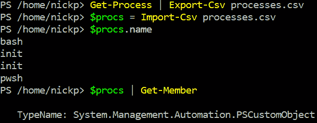

图 6.10 – 导入 CSV 文件

将 CSV 文件导入 PowerShell 非常方便，例如，当你有一份用户列表，并且需要通过循环获取他们的主驱动器大小，或者你想创建一个查找表时。

### Import-Clixml

如果你有一个 PowerShell 生成的 XML 文件，你可以使用 `Import-Clixml` cmdlet 来重建看起来更像原始对象的内容。这个 cmdlet 并没有太多参数。以下是一些最有趣的参数：

+   `-Path` 指定要导入的文件。

+   `-Skip` 允许我们跳过文件中的指定数量的对象。

+   `-First` 只获取文件开头指定数量的对象。Clixml 文件可能非常大，因此如果我们想检查文件中的内容，这个参数非常有用。

+   `-IncludeTotalCount` 告诉我们文件中有多少个对象。有趣的是，它有一个精度属性，告诉我们估算值的可靠性。

让我们玩一下。试试这个：

```
Get-Date | Export-Clixml -Path date.xml
Notepad date.xml
$date = (Import-Clixml -Path date.xml)
$date | Get-Member
$date
```

我们可以看到返回的是一个日期对象。再试一个例子：

```
Get-Process | Export-Clixml processes.xml
$XmlProcs =Import-Clixml processes.xml
```

如果我们调用 `$XmlProcs`，可以看到输出显示与我们期望的 `Get-Process` cmdlet 完全一致：

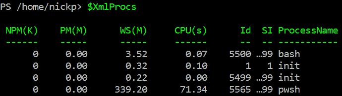

图 6.11 – 使用 Import-Clixml 重新创建对象

然而，它们并不是我们导出的对象。让我们运行以下命令：

```
$XmlProcs | Get-Member
```

我们可以看到它们是`Deserialized.System.Diagnostics.Process`对象。这告诉我们它们已经被转化为数据对象，并从文件中恢复，它们不是实时对象。

这个方法最常见的用途之一是安全地存储凭证。试试看：

```
$cred = Get-Credential
```

我们被要求输入用户名和密码。

我们可以将凭证变量传送到 XML 文件中：

```
$cred | Export-Clixml Credential.xml
```

该文件现在可以存储在某个磁盘上。它是通过`Export-Clixml` cmdlet 加密的。

然后我们可以使用`Import-Clixml`将其导入：

```
$newcred = Import-Clixml Credential.xml
```

我们得到一个凭证对象。你可以在以下截图中看到 XML 文件的样子。密码是加密后的十六进制字符串：

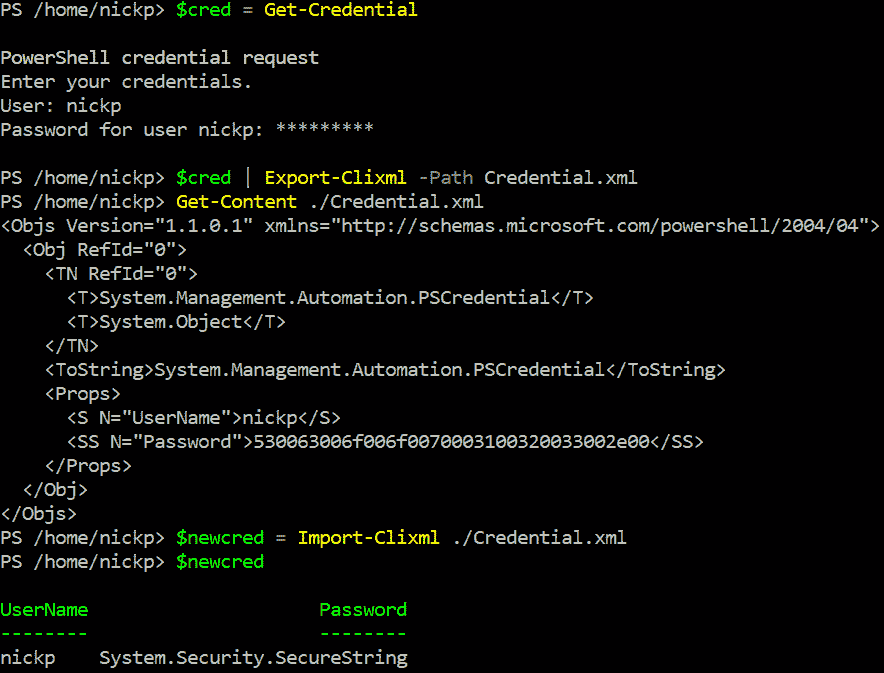

图 6.12 – 存储加密凭证

请注意，加密使用了我们加密文件时所在机器的登录凭证。其他用户无法轻易解密这些文件，而且我们无法在另一台机器上解密这些凭证。

我们不能用`Import-Clixml`导入任何 XML 文件。如果我们尝试导入一个没有正确格式化的文件，会出现如下错误：

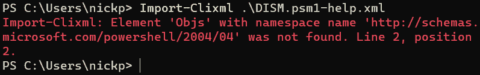

图 6.13 – 我们不能导入任何东西

在这种情况下，XML 文件的架构对`Import-Clixml` cmdlet 是错误的；正如我们从错误信息中看到的，缺少了重要的行。不要尝试运行这段代码——你可能没有 cmdlet 中提到的 DISM 文件。

本章的内容大致就是这些。不过，在总结之前，让我们做些练习，巩固一下本章以及之前章节的学习内容。

# 让我们玩得开心一点 – 测量文本文件中最频繁的单词

我最喜欢的一本编程书是 Cristina Videira Lopes 的《编程风格练习》。它的灵感来源于 Raymond Queneau1947 年的书《风格练习》，在这本书中，作者以 99 种不同的风格讲述同一个故事。Lopes 的书包含了 41 个 Python 程序，用不同的编程风格完成相同的任务。这本书真的是开阔了我的思维，彻底改变了我对编写代码的看法；它和任何一种创造性写作一样，都是一种艺术。虽然这本书本身不便宜，但所有程序都可以在 GitHub 上找到：[`github.com/crista/exercises-in-programming-style`](https://github.com/crista/exercises-in-programming-style)。即使你不了解 Python，我也鼓励你快速浏览一下。

每个程序解决的问题是确定文本文件中单词的频率，并按降序排序；这是一个**词频**问题，通常是计算机科学学生常见的练习。让我们试试看：

1.  首先，在 VS Code 中创建一个新文件夹，然后在该文件夹中创建一个新的 PowerShell 文件，文件名为`wordcountBasic.ps1`。

    我将使用的文件是弗朗茨·卡夫卡经典作品《审判》的英文翻译，但任何大型文本文件都可以。我是从这里下载的：[`www.gutenberg.org/ebooks/7849.txt.utf-8`](https://www.gutenberg.org/ebooks/7849.txt.utf-8)

    继续下载并将其保存到新文件夹中，文件名为`thetrial.txt`。

1.  现在我们有了数据，接下来的任务是将文件内容放入一个变量中。这很容易。我们需要将其作为一个巨大的单个字符串，而不是一个字符串数组：

    ```
    $TheTrial  =  Get-Content -Path .\thetrial.txt -Raw$TheTrial = get-content -path .\thetrial.txt -Raw
    ```

1.  现在，我们可以使用字符串对象中可用的某种方法，将文本拆分成单个单词的数组：

    ```
    $TrialWords = $TheTrial.Split(" ")
    ```

    请注意，双引号内有一个空格。

1.  让我们看看我们有多少个单词：

    ```
    $TrialWords.Length
    ```

    我得到了 79,978 个单词。此代码可能需要一些时间才能运行。

1.  现在...接下来的部分有点棘手。我们需要计算每个单词在文本中出现的次数。这是 Shell 真正展现其强大功能的地方。在 Python 中做下一步需要几行字符串处理代码，但 PowerShell 自带一个内置 cmdlet，`Group-Object`：

    ```
    $GroupedWords = $TrialWords | Group-Object
    ```

1.  那一行的问题在于，它会按字母顺序对对象进行分组，而这不是我们想要的。我们希望按频率分组，因此我们还需要在管道中使用`Sort-Object` cmdlet：

    ```
    $GroupedWords = $TrialWords | Group-Object | Sort-Object Count
    ```

1.  我们也不想看到所有的单词，只想看到最常出现的单词。我们来获取最常出现的 10 个单词。我们可以使用`[-1..-10]`的公式从数组中提取它们。我们使用`[-1..-10]`是因为默认情况下，排序顺序是升序的，而我们希望它是降序的。我们可以运行`$GroupedWords[-1..-10]`。

1.  就这样！这是我整个程序和输出：

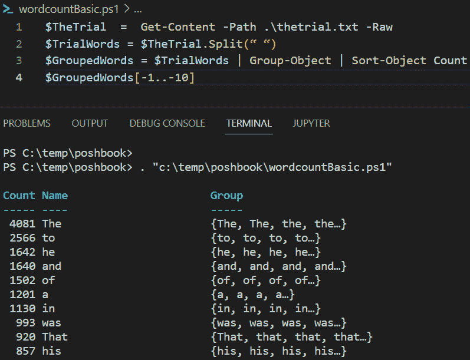

图 6.14 – 任何英文书籍（由男性作者写的）中最常见的十个单词

我们在这里取得了一些成果，尽管这可能不是我们想要的结果。在我看来，这就像是任何一本英文书籍中最常出现的 10 个单词，都是由男性写的。我们能对此做些什么呢？

计算机科学领域的**自然语言处理**涉及**停止词**的概念。这些是语言中常见的词汇，在分析文本时不应被计算在内。网上有许多免费的停止词列表。我们需要做的是构建一个循环，将数组中的每个单词与停止词列表进行比较，并且仅在单词不在列表中时，将其添加到新数组中。

活动

使用循环重写程序，将`$TrialWords`数组中的每个单词与停止词列表中的单词进行比较。使用[`raw.githubusercontent.com/stopwords-iso/stopwords-en/master/stopwords-en.txt`](https://raw.githubusercontent.com/stopwords-iso/stopwords-en/master/stopwords-en.txt)中的停止词文件。

提示 1：

你不会想用 PowerShell 数组来做这个 —— 为什么？最好使用一个数组列表。可以这样构建它：

**$Words = [****System.Collections.ArrayList]@()**

提示 2：

你需要将数组按多个字符进行拆分，而不仅仅是空格，因为有些单词后面紧跟着句号和其他标点符号。对于某些字符，你需要使用转义字符——反引号（`` ` ``）——才能正确解析它们。我发现将前面代码中的第二行替换为这一行是有效的：

**$TestWords = $TheTrial.Split(“ “, “`t”, “`n”, “,”,”`””,”.”, [****System.StringSplitOptions]::RemoveEmptyEntries)**

`RemoveEmptyEntries` 防止空字符串被计算在内。

`'t` 是制表符。

`` `n `` 是换行符。

`` `" `` 允许我们使用双引号作为分隔符。

提示 3：

`That` 和 `that` 是同一个词吗？你需要确保你的单词中所有的字符都使用相同的大小写。

玩得开心！我在最后写了一种做法。

# 总结

这一章内容较长，实际上只是一个介绍。我们会在后续的章节中进一步探讨如何使用 PowerShell 导入数据。虽然我们已经走了很长一段路，但仍有很多内容要学习。

我们从学习如何使用三种常见的格式化 cmdlet 来格式化屏幕输出开始：`Format-List`、`Format-Table` 和 `Format-Wide`。接着我们学习了如何使用 `Out-File` 将格式化的数据输出到文本文件。我们花了一些时间理解这种方法的局限性，然后才探索了两类 cmdlet：`ConvertTo-` 和 `Export-`。

我们深入研究了处理 CSV 文件的 cmdlet：`ConvertTo-Csv` 和 `Export-Csv`，并理解了 `ExportTo-Csv` cmdlet 如何结合 `ConvertTo-Csv` 和 `Out-File` cmdlet。接着我们研究了 `ConvertTo-Xml` 和 `Export-Clixml`，最后，我们看了 `ConvertTo-Html` 并尝试如何利用它通过引用 CSS 文件来生成格式有趣的文档。

接着我们简要讨论了 `PSProviders` 和 `PSdrives`，并理解了它们在 Windows 环境下更为有用，但在 Linux 和 macOS 下仍然相关。

我们研究了 `Get-Content`，这是将数据导入 PowerShell 的最常见方法，并了解到它会生成一个字符串或字节的数组——为了以更结构化的方式导入数据，我们需要使用其他 cmdlet：`Import-`。我们研究了 `Import-Csv` 和 `Import-Clixml`，并看到了它们如何用于从结构化数据构建 PowerShell 对象。

最后，我们进行了一些编程，研究了如何使用 PowerShell 分析文本文件。

在下一章中，我们将学习如何使用 PowerShell 与互联网上的系统进行交互，以及我们将需要的常见文件格式。

# 练习

1.  如何在你的临时目录中生成一个包含三列的文件名广泛列表？

1.  如果我们运行这段代码，会发生什么？

    ```
    "I love PowerShell" string to a new file in the directory you are working in.
    ```

1.  向*问题 3*中的文件添加一个字符串“`Sooo much`”。

1.  写一条语句，将工作目录中的所有项目创建为一个 CSV 文件，但用分号而非逗号分隔。

1.  在你的 PowerShell 会话中定义了多少个函数？

1.  如何使用空格作为字符串分隔符来导入*问题 4*中的文本文件？

1.  如何导入你在*问题 5*中创建的文件，你会得到什么类型的对象？

1.  以下错误告诉我们什么？

    ```
    Import-Clixml: Element 'Objs' with namespace name 'http://schemas.microsoft.com/powershell/2004/04' was not found.
    ```

# 进一步阅读

我们真的应该阅读本章中使用的所有 cmdlet 的帮助文件。我们知道如何找到它们，因此这里不再列出。

+   要了解 HTML 和 CSS，请访问 W3Schools 网站：[`www.w3schools.com/`](https://www.w3schools.com/)

+   要了解更多关于序列化的信息，请查看这里：[`docs.microsoft.com/en-us/dotnet/standard/serialization/introducing-xml-serialization`](https://docs.microsoft.com/en-us/dotnet/standard/serialization/introducing-xml-serialization)
