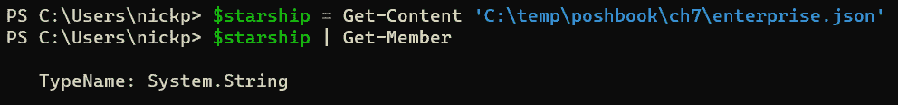
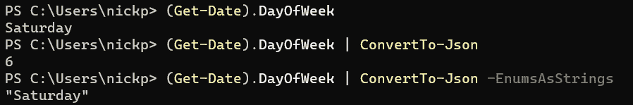

# 第七章：PowerShell 与 Web——HTTP、REST 和 JSON

直到现在，我们一直在一个非常小的空间里工作——我们的客户端机器。虽然这样很方便，但世界并不是这样的。几乎我们使用的每个设备都与其他机器连接，并且通常连接到互联网。设备需要能够与通过网络提供的服务进行交互，以下载数据、与云应用程序互动并玩游戏。在本章中，我们将探讨如何使用 PowerShell 与我们盒子外部的对象进行交互。

我们将首先简要讨论 Web 服务，然后介绍与之交互的基本 PowerShell 工具：`Invoke-WebRequest`。接下来，我们将介绍 `Invoke-RestMethod`，并探讨一些使用 **JavaScript 对象表示法**（**JSON**）与 Web 服务交换信息的方法，以及我们用来将 JSON 数据转换为 PowerShell 对象的工具，反之亦然。最后，我们将进行一个简短的练习。

本章将为我们提供一些在后续章节中所需的基本技术，并建立在我们上一章所做工作的基础上。我们将看到，这些技术同样适用于网页上的数据。

本章我们将涵盖以下主要内容：

+   使用 HTTP

+   理解 API

+   使用 REST

+   使用 JSON

# 使用 HTTP

我们所生活的世界有一个主导哲学，一套概念和实践，基本上定义了过去 30 年的信息技术；即客户端/服务器范式。也有其他选择；如通过傻终端进行的集中式计算（例如大型机计算），使用 Citrix 等应用程序的瘦客户机计算，或者像 BitTorrent 或区块链应用程序中可能看到的点对点计算。蒂姆·伯纳斯-李（Tim Berners-Lee）设想的万维网是一个点对点网络，但它实际上并没有保持那样。客户端/服务器模型是普遍存在的。一般来说，我们桌面或手中使用的设备是客户端，它通过远程服务器接收或处理信息。与傻终端的区别在于，部分处理是在客户端完成的，部分处理则在服务器上进行。

在本章中，我们将探讨如何通过互联网使用万维网的基础协议——**超文本传输协议**（**HTTP**）——在客户端和服务器之间交换信息。这就是我们用来浏览网站的协议。

在 PowerShell 中，处理 HTTP 的基本 cmdlet 是 `Invoke-WebRequest`，让我们看看如何使用 `Invoke-WebRequest` cmdlet 来处理网页上的数据。

`Invoke-WebRequest` cmdlet 是一个功能极其强大的工具，允许我们创建 HTTP 请求并提交到 Web 服务。由于我们可能发出的请求范围非常广泛，这个 cmdlet 相当复杂，有超过三十个参数。让我们从简单的开始，获取一个相关新闻主题的超链接列表。在 Web 浏览器中，访问此地址：[`neuters.de`](https://neuters.de)。这是一个基于文本的网站，聚合了最新的路透社新闻文章。它简单而清晰。

现在，打开 PowerShell 并输入以下内容：

```
$News = Invoke-WebRequest https://neuters.de
```

这将向该地址发送`GET`请求，并将响应存储在`$``News`变量中。

现在让我们通过调用`$News`的内容来看我们得到了什么。输入以下内容：

```
$News
```

你应该能看到类似于以下图形的内容：


图 7.1 – `Invoke-WebRequest`获取 HTTP 响应

这很好，但不太美观。如果我们稍微仔细看一下输出，可以看到其中有一部分叫做`Links`。我们可以使用这个来仅通过调用它来获取页面上的超链接，方法如下：

```
$News.Links
```

不幸的是，它们都是相对链接，但我们应该通过添加根位置将它们转换为绝对链接，这我们可以很容易做到。如果我们将`$News.Links`的输出管道到`Get-Member`，我们可以看到它有一个名为`href`的属性，其中包含链接，如下所示：


图 7.2 – href 属性

我们可以将其与根域名连接。输入以下代码：

```
$News.Links | Foreach {"https://neuters.de" + $_.href}
```

你应该会看到一列绝对链接，如下图所示：


图 7.3 – 从 neuters.de 网站抓取链接

如果你得到了类似的结果，恭喜你，你刚刚用 PowerShell **抓取**了你第一个网站。抓取是自动化从网站获取数据的过程。

`Invoke-WebRequest`只有一个必需的参数；`-Uri`。它是位置参数，因此紧跟在 cmdlet 后的任何字符串将被视为此参数的输入。`–Uri`参数接受源的 URL。

URI 与 URL

我们可能都很熟悉缩写 `http:` 和 `https:`，所以绝对 URL 就是[`neuters.de`](https://neuters.de)，包含了方案（`https:`）和地址（`neuters.de`），并且两者之间由双斜杠（`//`）分隔。

那么 URN 呢？URN 由方案（`urn:`）和一个或多个标识符（例如 `urn:ietf:rfc:1149`）组成，标识了我最喜欢的协议定义。

其中的关键是，`-Uri` 参数仅支持 `http:` 和 `https:` 方案，因此只能接受 URL。然而，根据万维网联盟（W3C），即国际网络标准化机构，URI 是比 URL 更精确、更技术性正确的术语。

让我们更仔细地看一下可以与`Invoke-WebRequest`一起使用的一些参数：

+   `-Method` 将接受任何标准的 HTTP 方法：`GET`、`PUT`、`POST`、`DELETE` 等。如果我们省略此项，则默认方法为 `GET`。如果我们需要使用自定义方法，则可以使用 `-CustomMethod` 参数。我们不能在同一个 cmdlet 中同时使用 `-Method` 和 `-CustomMethod`。此参数允许我们将信息发送到 Web 地址。

+   `-OutFile` 指定一个路径和名称，将输出写入文件。请注意，这只会将响应 HTML 写入文件，而不会写入诸如响应代码之类的内容。此参数会阻止输出被放入管道中。如果我们希望输出既可以进入管道，又可以写入文件，则需要同时使用 `-PassThru` 参数。

+   `-Headers` 可以用于提交特定的头部信息作为 Web 请求的一部分。信息必须以哈希表或字典的形式提供。

+   `-Body` 可以提交特定的主体内容，如查询。我们不能在同一个 cmdlet 中同时使用 `-Body` 和 `-Form`。

+   `-Form`。`-Form` 参数用于向目标地址的 HTML 表单提交信息。我们可以在网上找到许多关于如何使用 `-Form` 参数快速且轻松地通过 Windows PowerShell 登录网站的资料。不幸的是，由于 HTML 解析方式不同，大多数方法无法在 PowerShell 7 中工作。稍后我们将了解原因。

+   `-Proxy` 允许我们指定一个替代的代理服务器，而不是客户端上设置的代理。通常与 `-ProxyUseDefaultCredentials` 参数一起使用，后者将当前用户凭据传递给代理，或者与 `-ProxyCredentials` 参数一起使用，后者允许我们指定替代的凭据。

+   `-NoProxy` 让我们完全绕过客户端代理。我们不能在与 `-Proxy` 的同一 cmdlet 中使用此项。

+   `-SessionVariable` 可用于连接到有状态的 Web 服务；我们可以在第一次运行 `Invoke-WebRequest` 时使用 `-SessionVariable`，然后在每个后续连接中使用相同的值和 `-WebSession` 参数，以确保会话状态的持续性。如果我们需要先登录 Web 服务再使用它，这个功能很有用。请注意，我们将字符串传递给 `-SessionVariable`，但之后将该字符串作为变量传递给 `-WebSession`，如下所示：

    ```
    Invoke-WebRequest -Uri https://reddit.com -SessionVariable sv
    -SkipCertificateCheck will ignore SSL/TLS certificate problems. For obvious reasons, we shouldn’t use this parameter unless we are sure that the site we are connecting to is secure, and any certificate problems we see are not a sign of a problem. Sometimes, a certificate problem is fairly innocuous and may be down to a harried admin who hasn’t renewed their certificate, and sometimes it’s malicious.
    ```

+   `-SkipHttpErrorCheck`：默认情况下，如果 `Invoke-WebRequest` 收到 HTTP 错误代码作为响应，它将把错误以红色报告出来，而不是作为输出。如果我们想捕捉错误响应并处理它，那么可以使用此参数。有关示例，请参见下图：


图 7.4 – 使用 -SkipHttpErrorCheck

在这里的图示中，第一个 cmdlet（红框中的部分）没有使用 `-SkipHttpErrorCheck` 参数，因此 PowerShell 将响应视为错误。在第二个 cmdlet（绿框中的部分）中，我们使用了该参数，可以看到服务器实际发送的 HTTP 响应。

还有另外三十个可以与 `Invoke-WebRequest` 一起使用的参数，但这些是最常用的参数。让我们来看看为什么 `-Form` 参数在 PowerShell 7 中不那么有用。

## 为什么在 PowerShell 7 中看不到 Forms 信息？

如我们所提到的，`-Form` 参数在 PowerShell 7 中的效果不如在 Windows PowerShell 中那样好。如果我们使用 `Get-Member` 查看 `Invoke-WebRequest` 返回的对象，我们在 PowerShell 7 中看不到 `Forms` 属性，而在 Windows PowerShell 中可以看到。值得仔细研究并了解其中的原因。`Invoke-WebRequest` cmdlet 在 PowerShell 7 和 Windows PowerShell 中返回的是不同类型的对象。我们可以在以下图示中看到输出的差异。在上方的蓝色框中，我们看到 Windows PowerShell 返回的对象 `TypeName` 为 `HtmlWebResponseObject`，并且可以看到该类型的属性中包括 `Forms`：


图 7.5 – Windows PowerShell 中的 Invoke-WebRequest

在 PowerShell 7 中，接下来我们看到的是 `BasicHtmlWebResponseObject`，它没有 `Forms` 属性：


图 7.6 – PowerShell 7 中的 Invoke-WebRequest

这是因为 PowerShell 7 默认使用基本解析。

在 Windows PowerShell 中，我们可以使用网页中 `Forms` 属性包含的信息来创建一个变量，该变量的属性与表单字段匹配，然后使用 `-Form` 参数将该变量作为 cmdlet 的一部分提交。由于 `Invoke-WebRequest` 返回的对象没有名为 `Forms` 的属性，许多网上关于如何使用该 cmdlet 的说明在 PowerShell 7 中将无法正常工作。

这并不意味着我们不能使用 `Invoke-WebRequest` 来填写表单。我们只需要提前了解表单字段是什么；单靠 PowerShell 7，我们可能难以弄清楚。我们还需要注意，许多网上的示例是为 Windows PowerShell 版本的 `Invoke-WebRequest` cmdlet 编写的。

## 认证

许多网站使用某种形式的认证，因此认证是 `Invoke-WebRequest` 的一个重要部分。首先要做的是设置使用的认证类型。我们可以使用 `-UseDefaultCredentials` 参数尝试使用当前环境的登录凭据进行认证，但如果我们访问的是外部地址而非我们组织内部的地址，那么我们可能需要提供特定于该站点的信息。`-Authentication` 参数接受以下选项：

+   `None`：这是默认选项。如果没有填写 `-Authentication` 参数，则 `Invoke-WebRequest` 将不会使用任何认证。

+   `Basic`：这将发送一组 Base64 编码的凭证。希望我们连接的是 HTTPS 网址，因为 Base64 编码与加密不同。这不是一种非常安全的发送凭证的方式。我们还需要使用`-Credential`参数来提供用户名和密码。

+   `Bearer`：这要求提供一个承载令牌，并通过`-Token`参数以安全字符串的形式传递。令牌基本上是一个长字符串，用于标识请求的发送者。承载身份验证是一种 HTTP 身份验证方案，是 OAuth 2.0（开放授权标准）的一部分。然而，并非所有承载身份验证都是 OAuth。由于我们传递的是由远程服务器分配的令牌，它应该只在 HTTPS 上使用，以确保加密。

+   `Oauth`：这是一个用于访问委托的开放标准。许多大互联网公司，如亚马逊、谷歌和微软，使用它来提供授权和身份验证。通常，它会使用一个承载令牌，正如之前提到的那样。

让我们看看这是如何工作的。在我的客户端，我安装了 PowerShell Universal，这是 Ironman Software 的好心人提供的一个模块（https://blog.ironmansoftware.com/）。它允许我在客户端运行一个轻量级服务器并创建端点。

不要在你的客户端尝试这样做

它需要相当多的配置，这本书中不会涉及，且需要订阅才能使用身份验证功能。我在这里提及它是为了让我们了解整个过程是如何工作的。

我在`http://localhost:5000/me`创建了一个端点，需要身份验证令牌才能访问。我已在服务器上创建了令牌，并将其存储为一个安全字符串，如下所示：

```
$apptoken = ConvertTo-SecureString -String <mytoken> -AsPlainText
```

令牌并不是真的`<mytoken>`；它是一个更长的随机字符串。现在，我可以通过提供令牌并使用`$apptoken`变量来访问该端点：

```
Invoke-WebRequest -Uri http://localhost:5000/me -Authentication Bearer -Token $apptoken
```

如下图所示，在没有提供身份验证的情况下，我会收到一个`401`错误；我没有权限。当我在第二个命令中提供身份验证时，我得到了页面内容`Hello World`：


图 7.7 – 使用 -Authentication 和 -Token 参数提供身份验证

然而，通常情况下，我们需要通过`-Headers`参数提供身份验证。这比使用`-Authentication`稍微复杂一些。我们需要将令牌作为 Web 请求的一部分提供，但需要指向正确的头部。在我的本地测试端点的情况下，我可以像这样操作：

```
Invoke-WebRequest -Uri http://localhost:5000/me -Headers @{Authorization = "Bearer $admtoken"}
```

请注意，如果我们在头部提供令牌，我们必须*不*使用`ConvertTo-SecureString`命令进行编码。我已经将未编码的令牌保存为`$admtoken`，（而不是`$apptoken`），如下所示：


图 7.8 – 使用 -Headers 参数传递身份验证数据

在第一行，我试图传递存储在`$apptoken`变量中的编码令牌。在第二行，我传递存储在`$``admtoken`变量中的未编码令牌。

根据微软的说法，`SecureString`对象类型提供了一种*安全性措施*，但它并不是真正安全的。详细内容请参阅：[`learn.microsoft.com/en-us/dotnet/api/system.security.securestring`](https://learn.microsoft.com/en-us/dotnet/api/system.security.securestring)。

现在我们已经了解了如何发起基本请求，接下来让我们看看如何更程序化地与网站互动。

# 掌握 API

现代大多数系统通过 API 在客户端和服务器之间进行通信。这是两者之间约定的请求和响应列表。这听起来很复杂，但其实很简单。如果我们将[`random.dog/woof.json`](https://random.dog/woof.json)网址放入浏览器，我们会得到来自狗狗图片数据库的随机狗狗的 URL。我们还会得到文件的大小（以字节为单位）。

我们的浏览器是客户端，它向服务器上的 API 端点(`/woof.json`)发送 HTTP `GET`请求，该端点位于[`random.dog`](https://random.dog)网址。作为对这个请求的响应，服务器发送包含 URL 的消息给我们，如下图中的第一个框架所示。我们可以查看下面第二个框架中的头信息，看到内容类型是**JSON**。然后我们可以在浏览器中显示该 URL，查看一只可爱的狗狗的图片。请注意，我这里使用的是 Firefox，它可以让我们查看头信息和内容。其他浏览器只会显示 JSON 内容。


图 7.9 – 通过 API 获取的狗狗

服务器并没有发送一个网页供浏览器显示；它只是发送包含 URL 的数据，每次我们请求页面时，它都会发送不同的 URL。我们将在本章稍后的“*处理 JSON*”部分详细介绍这些数据，所以现在不用太担心它。

一般常用的 API 类型有四种：

+   **远程过程调用**（**RPC**）API

+   SOAP API

+   REST API

+   WebSocket API

它们分为两类 —— **有状态**，客户端和服务器之间的连接在多个请求中保持不变；和**无状态**，客户端的每个请求都被视为一个独立事件，并不会将任何信息保留到下一个请求中。让我们深入看看。

## RPC API

RPC API 调用服务器上软件中的函数——它们通过特定的代码让服务器执行某个操作，服务器会返回一个可能包含数据的输出。它们可能不通过 HTTP 执行；有一个名为 RPC 的独立协议，通常在局域网内使用。我们在本章中不讨论 RPC API，但它们在互联网上正经历着一些复兴，特别是在区块链应用中。RPC API 在历史上是有状态的，但这种模型的现代实现通常是无状态的。

## SOAP API

**SOAP** API 使用**简单对象访问协议（Simple Object Access Protocol）**通过 XML 交换消息。我们通常在使用运行 Microsoft **Internet Information Server（IIS）**的 Windows 服务器时遇到这些 API，而不是在通常运行 Apache 或 NGINX 软件的 Linux 服务器上。如我们在 *第六章* 中所见，*PowerShell 和文件——读取、写入及数据操作*，XML 语言并不是最容易使用的，而 Windows 作为 Web 服务器的操作系统不如 Linux 常见，因此 SOAP API 并不是最受欢迎的。SOAP 最常见的是无状态的。

## REST API

**REST** 是一种用于客户端-服务器、机器对机器通信的软件架构风格。REST API 符合这种风格。它们灵活且轻量，通常基于 HTTP 协议。REST API 是无状态的，能够以多种形式接收输出，包括 HTML 和 XML。然而，JSON 是最常见的输出形式。REST API 通常是最简单的 API，也无疑是互联网上最常见的 API。

## WebSocket API

WebSocket API 使用 JSON 在客户端和服务器之间传输数据。与 REST API 类似，它们基于 HTTP，但与 REST API 不同的是，WebSocket API 还使用它们自己的协议，即 WebSocket 协议，这是 HTTP 的扩展，允许进行更多种类的操作。它们是有状态的和双向的；服务器可以主动与连接的客户端进行通信。这使得它们非常强大，但也更难使用。

让我们更详细地了解如何使用最常见的 API 类型——REST API。

# 使用 REST

我们将使用的最常见 API 是 REST API。当我们使用**Web 应用程序**时，通常会遇到 REST API。Web 应用程序通常是分层的客户端/服务器应用程序。一个典型的应用程序通常包括三个层级：

+   **展示层** —— 客户端设备上的 Web 浏览器或应用程序

+   **应用层** —— Web 服务器

+   **存储层** —— 通常是运行在 Web 服务器上或独立服务器上的数据库

我们使用 REST API 来在展示层（浏览器）和应用层（Web 服务器）之间进行通信；应用层如何与存储层（数据库）进行通信由应用开发者决定，但通常会使用 Python 或 PHP。

REST API 通常使用 HTTP 实现，这意味着它们使用一组熟悉的 HTTP 命令，如 `GET`、`PUT` 和 `POST`。由于 Web 应用程序的设计方式，REST API 通常与数据库操作相关联；**创建、读取、更新和删除**（**CRUD**）。下表总结了这些命令如何映射到操作。

| **数据库操作** | **REST** **API 请求** | **示例** |
| --- | --- | --- |
| 创建 | `POST` | 创建一个新用户 |
| 读取 | `GET` | 获取一张狗狗的图片 |
| 更新 | `PUT` | 修改一个地址 |
| 删除 | `DELETE` | 删除一个聊天室帖子 |

表 7.1 – REST 与 CRUD 的关系

我们目前看到的网站都使用了 API，并且我们已经通过 `Invoke-WebRequest` 与它们进行过交互。现在让我们看看另一种可以使用的 cmdlet。

## Invoke-RestMethod

`Invoke-RestMethod` cmdlet 可以用于查询一个 REST API 端点，例如 `http://random.dog/woof.json`。`Invoke-RestMethod` 与 `Invoke-WebRequest` 有什么不同呢？让我们使用两者分别查看 `random.dog/woof.json` API 端点，以比较输出：


图 7.10 – 比较 Invoke-WebRequest 和 Invoke-RestMethod

在第一个示例中，红框中的部分，我使用了 `Invoke-WebRequest`。在第二个示例中，绿框中的部分，我使用了 `Invoke-RestMethod`。这两个 cmdlet 都能正确解析响应，但它们执行的操作不同。`Invoke-WebRequest` 显示了来自端点的 HTTP 响应，包括头部和内容。`Invoke-RestMethod` 只关注内容，并将其显示为一个自定义对象，包含与内容中的字典中名称对应的属性。等等，什么？字典从哪里来？记住，`Invoke-RestMethod` 是与 REST API 端点交互的。REST API 提供的输出通常是 JSON，或者不常见的是 XML。JSON 和 XML 输出通常由一组名称-值对组成；也就是字典。如果我们使用 `Invoke-RestMethod` 查询一个没有以 JSON 或 XML 输出的 HTML 页面，那么我们会得到一个单一对象，包含页面的原始 HTML。我们将在本章的下一节中更详细地介绍 JSON，*与 JSON 一起工作*。让我们更仔细地看看访问 API 端点时获得的输出。

如果我们将 `Invoke-RestMethod` 传递给 `Get-Member`，可以看到我们得到了一个 `System.Management.Automation.PSCustomObject` 对象，其中包含两个属性：`fileSizeBytes` 和 `url`：

```
Invoke-RestMethod -Uri https://random.dog/woof.json | Get-Member
```

`Invoke-RestMethod` 的参数与 `Invoke-WebRequest` 相似。我们可以在 *表 7.2* 中总结它们。如我们所见，`Invoke-WebRequest` 有 `-HttpVersion` 参数，该参数在 PowerShell 7.3 中引入，而 `Invoke-RestMethod` 没有；`Invoke-RestMethod` 有一些处理相对链接的参数（`-FollowRelLink` 和 `-MaximumFollowRelLink`）以及 `-StatusCodeVariable`，该参数可以将 HTTP 响应状态码分配给一个单独的变量。当与 `-SkipHttpErrorCheck` 参数结合使用时非常有用：


表 7.2 – 比较 Invoke-WebRequest 和 Invoke-RestMethod 的参数

有些参数之间有一些小的差异，例如，`Invoke-RestMethod -Uri` 参数也可以接受 `file:` 和 `ftp:` 协议，以及 `http:` 和 `https:` 协议。

要真正掌握 `Invoke-RestMethod`，我们需要了解使用它时检索的内容。为了做到这一点，让我们仔细看看最常见的数据格式，JSON。

# 处理 JSON

什么是 JSON？首先，它*不是*一种语言；它是一种数据格式。虽然它的名字中有 JavaScript，但许多现代语言都使用它来生成、解析和交换数据。它还旨在便于人类阅读；我们只需要知道如何读取它。JSON 以类似字典的格式存储数据，使用键值对。第一个术语是键，第二个术语是值。键是字符串，值可以是另一个字符串、布尔值、数字、数组或 JSON 对象。JSON 对象由一个或多个键值对组成，因此因为值可以是另一个对象，JSON 对象可以是嵌套的。让我们输入 cmdlet：

```
PS C:\Users\nickp> (Invoke-WebRequest random.dog/woof.json).content
```

然后，我们将得到类似以下的 JSON 响应。

```
{"fileSizeBytes":176601,"url":"https://random.dog/6b41dccd-90ca-4ce8-a0e2-800e9ab92aa7.jpg"}
```

这由两个键值对组成：

```
"fileSizeBytes":176601
"url":"https://random.dog/6b41dccd-90ca-4ce8-a0e2-800e9ab92aa7.jpg"
```

在第一个键值对中，`fileSizeBytes` 是键，值是 `176601`，显然是文件的大小，单位是字节。第二个键值对的键是 `url`，值是随后的 URL。键和值由冒号 (`:`) 分隔。

两个键值对都被包围在一对大括号 (`{}`) 中。大括号告诉我们这是一个由所包含的键值对组成的单一对象。对象中的键值对由逗号 (`,`) 分隔。对象中的最后一对键值对后没有逗号。如果我们想包含一个数组，则需要将其用方括号括起来。接下来，让我们编写一个描述著名电视角色的 JSON。打开 VS Code，创建一个新文件，并将其保存为适当的文件名，例如 `C:\temp\poshbook\ch7\enterprise.json`。然后，输入以下内容：

```
{
"Name": "Enterprise",
"Designation": "NCC-1701",
"Captain": {
    "FirstName": "James",
    "Initial": "T",
    "LastName": "Kirk"
    },
"BridgeCrew": ["Uhura", "Spock", "Sulu", "Chekhov", "Riley"],
"PhotonTorpedoes": 240000000,
"JediName": null,
"IsAwesome": true
}
```

下图显示了在 VS Code 中的显示效果。这是一个有效的 JSON 文件，展示了有效的 JSON 数据类型和语法。


图 7.11 – 大胆展示 JSON

`Name` 和 `Designation` 包含字符串值，`Captain` 包含另一个 JSON 对象，而 `BridgeCrew` 包含一个字符串数组（但它也可以是其他有效数据类型的数组，甚至是更多 JSON 对象的数组）。显然，它没有 `JediName`，并且它确实非常棒。

如我们所见，VS Code 可以解析 JSON，并通过颜色编码帮助我们确保语法正确。

还有一些其他要记住的事项。首先，元素之间的空白会被忽略；`"Initial": "T"` 和 `"Initial": "T"` 同样有效。不过，建议你保持一致地使用空白字符。其次，没有特定的数字格式。`240000000` 既不是整数，也不是浮动点数，它只是一个数字。最后，JSON 中不允许有注释；这应该鼓励我们编写清晰和描述性的代码。

现在我们对 JSON 有了基本的理解，那么我们如何在 PowerShell 中使用它呢？PowerShell 处理 JSON 的方式不同于处理 XML，因此我们需要将 JSON 数据转换为自定义 PowerShell 对象，并将 PowerShell 对象转换为 JSON。有一对 cmdlet 可以帮我们完成这项工作，`ConvertFrom-Json` 和 `ConvertTo-Json`。让我们先看看 `ConvertFrom-Json`。

## ConvertFrom-Json

`ConvertFrom-Json` 会解析来自某个位置的 JSON 内容，并将其转换为自定义 PSObject。让我们看看它是如何工作的。

打开 PowerShell 控制台并尝试使用以下命令获取内容：

```
$starship = Get-Content 'C:\temp\poshbook\ch7\enterprise.json'
```

从下图中可以看到，我们可以正常导入内容，但如果使用 `Get-Member`，我们可以看到我们将内容作为字符串导入：



图 7.12 – 使用 Get-Content 单独导入 JSON

将 JSON 文件中保存的数据转换为字符串会使得其使用和操作变得困难。现在，让我们尝试使用 `ConvertFrom-Json`：

```
$starship = (Get-Content 'C:\temp\poshbook\ch7\enterprise.json' | ConvertFrom-Json)
```

这一次，我们已经将其导入为一个自定义 PSObject，这样更有用。通过这种方式创建的对象具有与 JSON 中的键值对相对应的属性，我们可以像访问任何其他 PowerShell 对象的属性一样访问它们，如下图所示：


图 7.13 – 使用 ConvertFrom-Json 导入 JSON

让我们更详细地看看 `ConvertFrom-Json` cmdlet。

`ConvertFrom-Json` 是一个简单的 cmdlet，它隐藏了许多复杂的工作。正如我们所看到的，我们可以使用它将 JSON 字符串转换为自定义 PSObject。我们还可以使用它从 JSON 字符串创建有序的哈希表；这是必要的，因为 JSON 允许重复的键名，其中只有字符串的大小写可能不同。由于 PowerShell 对大小写不敏感，因此只有最后一个键值对会被转换；否则，`ConvertFrom-Json` 会抛出一个错误。另一个原因是 JSON 允许键为空字符串；这将导致一个属性名为空字符串的 PSObject，这是不允许的。请参见下图中的这些错误示例：


图 7.14 – 使用 `-AsHashtable` 参数的原因

我们来看一下这些参数：

+   `-AsHashtable` 会将 JSON 字符串转换为有序哈希表，从而保留 JSON 键的顺序。我们在 *第四章*，*PowerShell 变量与数据结构* 中讨论了有序哈希表。尽管它不像 PSObject 那样有用，但有序哈希表比字符串更易于操作，在某些情况下，处理速度也比 PSObject 更快。

+   `-Depth` 允许我们设置要处理的最大嵌套深度；正如我们在本节开始时所看到的，JSON 的键值对可以包含 JSON 对象，而这些 JSON 对象又可以包含进一步的 JSON 对象。`-Depth` 的默认值是 `1024`。

+   `-InputObject` 只接受字符串；可以是字符串本身、包含字符串的变量，或者是生成字符串的表达式，正如我们之前在 `enterprise.json` 示例中所看到的。我们不能直接将文件传递给它；我们需要先使用 `Get-Content` 获取文件内容。显然，它接受管道输入。

+   `-NoEnumerate` 会将一个字符串数组读取为单个字符串，从而产生一个单一的输出对象。请看以下图示的示例：


图 7.15 – 使用 `-NoEnumerate` 参数

在第一个 cmdlet 中，我们得到三个独立的对象。当我们包含 `-NoEnumerate` 参数时，我们得到一个单一对象，`fish` `cat dog`。

现在我们已经了解了如何将 JSON 转换为 PowerShell 容易处理的格式，让我们来看一下如何将 PowerShell 对象转换为 JSON。

## ConvertTo-Json

`ConvertTo-Json` 会将任何 PowerShell 对象转换为 JSON 格式的字符串。它通过将对象的属性转换为键值对来实现这一点，其中属性名是键，并且会丢弃对象的任何方法。我们来看看它是如何工作的。如果你之前没有将 `$starship` 变量创建为 PSObject，请现在创建：

```
$starship = (Get-Content 'C:\temp\poshbook\ch7\enterprise.json' | ConvertFrom-Json)
```

现在，假设我们经历了一场战斗，需要更新我们的光子鱼雷数量。我们可以输入以下命令：

```
$starship.PhotonTorpedoes = 1900000000
```

这将更新 PSObject，然后我们使用`ConvertTo-Json`生成一个 JSON 格式的对象来替换我们导入的原始对象：

```
$starship | ConvertTo-Json | Out-File "C:\temp\poshbook\ch7\klingonattack.json"
```

如果我们在 VS Code 中打开它，我们可以看到它是一个格式正确的 JSON 文件，并且更新了鱼雷的数量：


图 7.16 – 克林贡攻击后

我们可以看到在第 16 行，鱼雷的数量发生了变化。VS Code 仍然认为这是有效的 JSON，且没有任何错误。我们可以看到格式与原始文件有所不同；`BridgeCrew`数组的每个元素都被放在了各自的行上，这是因为`ConvertTo-Json`使用的格式化规则，但除此之外，它与原始的`enterprise.json`文件是一样的。然后我们可以将这个 JSON 字符串传递给 API 来更新服务器上的信息。

与`ConvertFrom-Json`类似，`ConvertTo-Json`是一个看似简单的 cmdlet，它背后隐藏了很多工作，虽然它的参数列表很短。让我们来看一下这些参数：

+   `-AsArray`会无条件地将 PSObject 转换为 JSON 数组。请参考下图中的以下示例。


图 7.17 – -AsArray 参数

+   在第一行，我将两个字符串转换为 JSON。`ConvertTo-Json`会自动将它们当作数组处理，并将其放入方括号中，因为它们是两个独立的对象。在第二行，我仅传入一个字符串到管道中，`ConvertTo-Json`将其视为一个单独的字符串。但如果我想将它格式化为单一成员的数组呢？这时，我使用`-AsArray`参数，就可以得到我的方括号。

+   `-Compress`会从 JSON 输出中移除空白字符和缩进格式。输出将呈现为单行。

+   `-Depth`指定 JSON 输出中可以包含的嵌套对象的级别。我们可以有零到一百级的嵌套，但默认情况下只有两个级别，这可能会让人困惑。如果输出的嵌套层级超过这个限制，我们将收到警告。请参考下图中的 JSON：


图 7.18 – nesting.json

如果我们将其加载到一个变量中，然后再转换回 JSON，接着会看到如下图所示的警告。请注意，第三层嵌套（从`"really?"`开始的那一行）没有被转换成 JSON 对象，而是转换成了一个表示哈希表的字符串：


图 7.19 – 我们需要增加 -Depth

+   `-EnumsAsStrings`会转换`DateTime`对象的`DayOfWeek`属性的所有值。当我们输入`(Get-Date).DayOfWeek`时，它返回一个字符串`Saturday`，但实际值是作为介于 1 到 7 之间的整数存储的。请看下图中的示例：



图 7.20 - 使用 -EnumAsStrings 参数

+   `-EscapeHandling` 控制某些字符的转义方式，如换行符（`` `n ``）。它有三种可能的设置：`Default`，只有控制字符被转义；`EscapeNonAscii`，所有非 ASCII 和控制字符都会被转义；`EscapeHtml`，特殊的 HTML 字符如`<`、`>`、`?`、`&`、`'` 和 `"` 会被转义。

+   `-InputObject` 接受任何类型的 PowerShell 对象，无论是显式传递、通过管道传递，作为表达式，还是作为变量。

这些大多数参数都是格式控制，旨在让我们更容易地与 API 进行交互，因为 API 可能对我们提供的输入有不同的期望。还有一个命令可以帮助我们将数据转换为 API 能够处理的格式；`Test-Json`。

## Test-Json

`Test-Json` cmdlet 将测试一个字符串是否为有效的 JSON 对象。这在编写与 API 交互的脚本时非常有用，可以确保我们的数据可以被正确地处理。尤其当我们考虑到并非所有通过`ConvertTo-Json`生成的内容都是合格的 JSON 时，它就显得特别有用。请参阅下图中的示例：


图 7.21 – 使用 ConvertTo-Json 时出现错误

在第一行，我们创建了一个名为`$date`的变量，并将当前日期放入其中。它是一个`DateTime`类型的对象。毫不奇怪，当我们在第二行尝试使用 cmdlet 时，`Test-Json`不满意。第三行中，我们使用`ConvertTo-Json`将表达式转换为 JSON，然后在第四行再次测试它。糟糕！虽然它已经成功转换，但仍然不是符合规范的 JSON。在第五行，我们可以尝试仅测试第三行的字符串输出，这样我们就能看到问题所在。虽然`ConvertTo-Json`已经从`$date`变量中获取了值，但它并没有正确地将其格式化为字符串。当我们在第六行纠正格式后，我们可以看到`Test-Json`现在满意了。聪明的做法当然是这样的：


图 7.22 – 正确的做法

`Test-Json` 有几个参数允许我们定义自定义的 JSON 模式，如果我们需要为特定系统生成专门或定制的 JSON，但这里不需要详细讨论它们。这个 cmdlet 有一个有趣的怪癖，即几乎所有 cmdlet 都有的`-InputObject`参数在这里叫做`-Json`，但功能上是一样的；它接受一个字符串，既可以显式传递，也可以通过管道传递。

# 让我们来点乐趣 – 谁在国际空间站上？

从小到大，我一直对太空充满了兴趣。我的其中一个最早的记忆是和爸爸妈妈一起坐着看阿波罗月球登陆的画面，那时的电视是老旧的黑白电视。那不是阿波罗 11 号，我还没那么老。作为一个练习，看看我们能否找出当前在国际空间站上的宇航员，并将这些数据展示在一个网页上。为了完成这个任务，我们需要参考上一章的内容；*第六章*，*PowerShell 与文件——读取、写入和操作数据*，以及我们在本章中学到的内容。我们不会手把手讲解——试着自己完成这个任务。有很多种方法可以实现，我把我的解答放在了答案部分。不过这里有一些提示。

活动

我们可以将任务分解为两个部分：

任务 1 – 使用 API 查看当前谁在国际空间站

任务 2 – 在 HTML 文件中展示这些数据

我们所需的数据可以通过一个 API 获取，链接是[`api.open-notify.org/astros.json`](http://api.open-notify.org/astros.json)

你可以使用`Invoke-WebRequest`，但使用`Invoke-RestMethod`可能会更简单

你可能会希望使用`ConvertTo-Html`来生成网页。你可能需要查阅这个 cmdlet 的帮助文件，了解一些格式化选项。

这是我的最终尝试：


图 7.23 – 真是美丽

这将稍微挑战我们，但我们拥有完成这个任务所需的所有知识，并且可以在这个过程中享受乐趣。

# 摘要

在本章中，我们已经走了一段旅程，并开始与我们本地计算机之外的世界进行互动。我们所讨论的技巧将在全书中使用，因此我们将有充足的机会充分熟悉它们。

我们首先查看了如何使用`Invoke-WebRequest` cmdlet 来处理通过 HTTP 传输的 HTML 数据。我们发现这个 cmdlet 非常复杂，有很多选项，我们讲解了常用的参数。我们特别关注了身份验证，因为这是获取和发布数据时必须掌握的关键技巧。我们还发现，通过这个 cmdlet 处理获取的数据非常困难，因为它是基于文本的。

然后我们讨论了从服务器通过网络获取数据的一种更简单的方法——使用 API。我们讨论了常见的 API 类型，尤其是最常见的 REST API。

接着，我们了解了用于处理 REST 的 PowerShell cmdlet——`Invoke-RestMethod`。我们发现这个 cmdlet 与`Invoke-WebRequest`非常相似，但它输出的是结构化的数据，而不是 HTML 页面。

我们接着探讨了这种数据最常见的格式——JSON。我们看了 PowerShell 中三个用于处理 JSON 数据的 cmdlet：`ConvertFrom-Json`、`ConvertTo-Json` 和 `Test-Json`。

最后，我们利用新学的知识，制作了一个 HTML 网页，展示了当前在国际空间站上航天员的名字。

本章标志着本书编码基础部分的结束；我们已经涵盖了数据结构、流程控制、文件操作和连接互联网。在下一章中，我们将开始学习如何将我们杂乱无章的代码转化为脚本和工具，这些脚本和工具可以与他人共享。一定会很有趣。

# 练习

1.  我们如何向以下 URL 发送删除请求：`https://httpbin.org/delete`？

1.  在有状态端点上使用`Invoke-WebRequest`时，我们需要哪些参数？

1.  我们尝试连接一个网站并看到以下错误：

    ```
    Invoke-WebRequest?
    ```

1.  哪种类型的 API 是有状态的？这是什么意思？

1.  我们注册一个 Web 服务并获得认证令牌。我们使用`ConvertTo-SecureString`对令牌进行编码，将其存储在名为`$token`的变量中，然后使用该变量创建一个 Web 请求，如下所示：

    ```
    Invoke-WebRequest -Uri 'https://webservice.com/endpoint' -Headers @{Authorization = "Bearer $token"}
    ```

    我们遇到了认证错误。我们做错了什么，还是令牌有问题？

1.  获取国际空间站（ISS）当前的纬度和经度。你可以使用[`api.open-notify.org/iss-now.json`](http://api.open-notify.org/iss-now.json)。

1.  英国有多少所大学的名字中含有字母‘*x*’？使用[`universities.hipolabs.com/search?country=United+Kingdom`](http://universities.hipolabs.com/search?country=United+Kingdom)的 API 来查找答案。

1.  我们如何使用`Test-Json`来验证我们生成的 JSON 是否符合自定义模式？

# 进一步阅读

+   更多关于 API 的内容：

    [`www.packtpub.com/product/understanding-apis-and-restful-apis-crash-course-video/9781800564121`](https://www.packtpub.com/product/understanding-apis-and-restful-apis-crash-course-video/9781800564121)

    [`www.digitalfluency.guide/apis/introduction-to-apis`](https://www.digitalfluency.guide/apis/introduction-to-apis)

+   更多关于 REST 的内容：

    [`restfulapi.net/`](https://restfulapi.net/)

+   一份不错的 JSON 教程，但包含了一些 JavaScript：

    [`www.w3schools.com/js/js_json_intro.asp`](https://www.w3schools.com/js/js_json_intro.asp)

+   如何使用 JSON 模式：

    [`json-schema.org/understanding-json-schema`](https://json-schema.org/understanding-json-schema)

# 第二部分：脚本编写与工具制作

本部分将引导你将一组 Cmdlet 转换为脚本，介绍函数式编程，展示如何将脚本转化为模块，以及如何使用 GitHub 和 GitLab 与同事和他人共享这些模块。它还包括一个关于 PowerShell 安全性的章节，确保你不会无意中分发不够安全的代码。

本部分包括以下章节：

+   *第八章*，*编写我们的第一个脚本 – 将简单的 Cmdlet 转换为可重用的代码*

+   *第九章*，*不要重复自己 – 函数和脚本块*

+   *第十章*，*错误处理 – 哎呀！出错了！*

+   *第十一章*，*创建我们的第一个模块*

+   *第十二章*，*确保 PowerShell 安全*
