# 第八章：编写我们的第一个脚本 – 将简单的 Cmdlet 转换为可重用代码

从本章开始，我们将学习如何将我们学到的基本概念结合起来，编写可以重用、调整和分发给他人的脚本和工具。在接下来的章节中，我们将讨论如何创建函数和脚本块、错误处理和调试、创建模块使我们能够将代码作为工具分发，最后，我们还会讨论如何保护 PowerShell。但在本章中，我们将从基础开始：将一小部分 cmdlet 转换为脚本。

我们将从讨论脚本的一般概念以及为什么我们可能想要编写脚本开始。之后，我们将简要了解我们可以在哪里在线找到 PowerShell 脚本，然后我们将讨论如何运行脚本。

一旦我们理解了如何使用他人的脚本，我们就会开始编写自己的脚本。首先，我们将学习如何在工作中的 cmdlet 管道中识别变化的值，接着我们会学习如何将这些值转化为参数，这样我们就能在运行脚本时将这些值传递给 cmdlets，而不需要每次都编辑脚本。我们将涵盖如何使参数成为必填项、如何从管道中获取值以及如何创建切换参数，之后我们将学习如何帮助自己和他人使用我们的脚本。

本章的第二部分，我们将讨论如何在脚本中添加注释和注释块，解释我们在每个部分尝试做的事情，并帮助我们和他人编辑和调整脚本。接下来，我们将探讨如何编写帮助信息，使其可以通过 `Get-Help` cmdlet 从脚本外部访问。之后，我们将讨论一个脚本构造，它可以帮助我们理解当脚本产生意外输出时发生了什么——`Write-Verbose` cmdlet。最后，我们将讲解如何为必填参数添加帮助信息，提示用户如何使用该参数。

在本章中，我们将覆盖以下主要内容：

+   脚本编写简介

+   编写脚本

+   识别变化的值

+   使用参数

+   为我们的脚本提供帮助

# 脚本编写简介

脚本是一系列指令，用人类可读的形式编写，供计算机执行。它们通常使用脚本语言编写，例如 PowerShell、Python 或 JavaScript。我们在*第一章*，*PowerShell 7 简介 – 它是什么以及如何获取*中讨论了脚本语言和编程语言之间的区别；需要记住的关键点是，脚本语言是解释型的，因此需要一个程序（如 PowerShell）在客户端运行来执行脚本，而编程语言是编译型的；它们会直接在操作系统中运行。

对我来说，脚本编写是一种艺术形式。这可能是最真实的控制论艺术形式；我们在脚本中编写的内容必须对人类和机器都有意义。在*第六章*，*PowerShell 和文件 – 读取、写入和操作数据*，我们谈到了 Cristina Videira Lopes 的*编程风格练习*，在其中以几十种不同的方式解决了术语频率任务。这同样适用于 PowerShell 中的脚本。没有一种编写脚本的唯一方法，对一个人来说看起来美好的东西对另一个人来说可能非常丑陋；我非常厌恶代码高尔夫，即尽可能少的行数和字符编写脚本，但这是个人偏好 – 其他人却喜欢。简单、干净和功能性代码 – 这些东西是美丽的，编写它们需要创造性和富有创造力的头脑。在本章中，我们将讨论我如何编写脚本的方法。

## 为什么我们想要编写脚本呢？

基本上，因为我们懒惰。脚本允许我们捕捉一系列可能复杂或耗时的步骤，并轻松地重复执行而不需要额外工作。其次，因为我们容易出错和容易分心。任务越复杂越长，我们犯错的可能性就越大。编写脚本意味着任务每次都会以相同的方式完成。如果我们能够做对一次并捕捉该过程，那么我们几乎永远不需要再次做对。我们可以去其他地方犯错误。最后，因为我们根本不想做这件事；如果我们编写一个脚本，我们可以把它交给别人去做。

脚本编写是工具制造的一个例子，我们创建一些东西来使任务更容易完成。一些脚本编写可能是适当的自动化，但一般来说，自动化包括反馈循环的概念，即工具在没有用户干预的情况下响应外部刺激。中央供暖锅炉就是一个工具；它使得加热房屋比在每个房间里生火要容易得多。恒温器是自动化的一种；当温度过低时，它打开锅炉，而当温度过高时，它关闭锅炉。如果我们设置正确，那么我们就不会太热或太冷。

有一些围绕工具制造和自动化的理论值得考虑，因为它可以帮助我们决定是否要编写脚本。让我们快速了解自动化的三个基本原则：

+   **补偿原则**：基于这样一个概念，即机器在某些任务上比人类更擅长，而人类在某些任务上又比机器更擅长。基于这一原则的自动化和工具根据人类和机器的优势和劣势来分配工作。

+   **互补性原理**：不断使用工具完成困难的任务可能会削弱人类操作员的技能；我们会忘记如何做事。然后，当我们真的需要接管时，当事情出错时，我们无法修复问题。我们使用这个原理，要求人类操作员必须保持自动化替代的技能。飞机自动驾驶仪就是一个很好的例子；操作员并不是一直使用它们，或者可能只使用其中的一部分，以便在自动驾驶仪因为天气或机械故障无法着陆时，操作员能保持所需的技能。

+   **剩余原理**：这是我们最常与脚本编写相关联的原理。它的想法是我们自动化所有能自动化的任务，然后手动完成剩下的部分。

当然，这比听起来要复杂一点。有时任务太难以自动化，或者我们做得很少，以至于不值得麻烦。通过编写脚本我们并不会节省时间或精力。一个经验法则是，如果你有一个任务，每天都要做，且每次花费 5 分钟，而写脚本需要 4 小时，那么在 3 年内，这个任务将花费 62 小时。通过花费 4 小时编写脚本，你将在 3 年内为自己节省一周的工作。让我们从了解如何获取别人编写的脚本开始。

## 获取脚本

我们在 *第二章*《探索 PowerShell Cmdlet 和语法》中讨论了获取 PowerShell 模块和 Cmdlet 的不同途径。我们也可以利用这些途径来查找 PowerShell 脚本。让我们回顾一下这些资源：

+   **PowerShell 仓库**：无论是官方的 PowerShell 仓库 [`www.powershellgallery.com/`](https://www.powershellgallery.com/)，还是 Microsoft Learn 仓库 [`learn.microsoft.com/en-us/samples/browse/`](https://learn.microsoft.com/en-us/samples/browse/)，或者内部的仓库，都是寻找脚本的好地方。一般来说，PowerShell Gallery 中的脚本经过了一些基本验证，会提供关于作者、版本和使用许可的信息。

+   **GitHub**：这是另一个很好的 PowerShell 脚本来源，但这些脚本通常没有经过验证，可能不完整或不可用。

+   **其他在线资源**：网上有很多很好的脚本。例如，Practical 365 网站（[`practical365.com`](https://practical365.com)）有一些非常有用的 Microsoft 365 脚本。然而，在线脚本的质量可能会有所不同。

每当我们从不认识或不信任的作者那里获取脚本时，应该小心理解脚本的作用和运行方式，再在我们关注的环境中运行它。当然，即使我们信任作者，仍然值得先在沙箱或虚拟机中测试脚本。

## 运行脚本

在我们运行脚本之前，有两件事需要注意。第一，PowerShell 脚本的扩展名始终是 `.ps1`。具有此扩展名的文件不会被注册为可执行文件，因此在 Windows 资源管理器中双击它们将会在记事本或其他编辑器中打开，而不会运行脚本。具有此扩展名的文件还需要一个相对路径或绝对路径才能从 PowerShell 终端运行，因此无论是 `PS C:\myscripts> .\MySuperScript.ps1`（相对路径）还是 `PS C:\> C:\myscripts\MySuperScript.ps1`（绝对路径），如果没有 `.\`，脚本都无法运行。

其次，PowerShell 对运行脚本有执行策略，但仅限于 Windows 计算机。默认情况下，在 Windows 客户端上，执行策略是 `Restricted`，这意味着脚本无法运行。幸运的是，我们可以通过运行以下 cmdlet 为当前用户更改此设置：

```
Set-ExecutionPolicy -ExecutionPolicy RemoteSigned -Scope CurrentUser
```

这将允许当前用户运行本地计算机上编写的脚本，或从互联网下载并包含代码签名的脚本。我们将在 *第十二章*《*PowerShell 安全*》中详细讨论执行策略和代码签名，但现在请运行此 cmdlet，以便我们继续编写脚本。

如果我们使用的是 Linux 或 Mac 客户端，我们无需执行此操作。由于 Linux 和 macOS 操作系统在安全性实现上的差异，这些计算机的策略实际上是 `Unrestricted`。

这就够了，接下来我们开始进入正题：编写脚本。

# 编写脚本

我们该如何编写脚本呢？几乎每一个我从零开始编写的脚本，都是从列出完成任务所需的步骤和 cmdlet 开始的。一旦我能够仅凭列表中的信息完成任务，且所有 cmdlet 都能正常工作，我就知道我准备好了。让我们从一个有效的命令开始我们的脚本。作为示例，考虑以下 cmdlet：

```
Invoke-RestMethod -Uri 'https://api.weatherapi.com/v1/current.json?q=London&aqi=no' -Method GET -Headers @{"key" = "fp3eofkf3-0ef-2kdwpoepwoe03eper30r"}| ConvertTo-Html | Out-File "c:\temp\poshbook\ch8\WeatherData.html"
```

这个 cmdlet 使用个人密钥从天气 API 服务中获取我的位置的天气数据，并将其写入 HTML 文件以进行显示。显然，我没有在前面的 cmdlet 中放入我的真实个人密钥，因此如果我们运行那段代码，系统会因为 API 密钥错误而失败。让我们考虑如何将这个 cmdlet 转换成一个脚本。接下来，我们需要获取我们自己的个人密钥。

获取天气 API 服务的个人密钥

要完成本章内容，我们需要为天气 API 服务获取个人密钥：

1\. 访问 [`www.weatherapi.com`](https://www.weatherapi.com)，点击 **注册** 按钮。

2\. 输入电子邮件地址（两次）和新密码（两次），接受条款和条件，完成验证码，我们将收到一封验证电子邮件。

3\. 点击验证电子邮件中的链接将打开一个网页，告诉我们已验证成功，并邀请我们登录。

4\. 通过点击登录链接并输入我们刚刚创建的电子邮件地址和密码来完成此操作。下一页的顶部是我们的个人 API 密钥。这就是我们将用来运行此 cmdlet 的密钥。

5\. 复制它并保存在某个安全的文本文件中。你可以随时通过登录服务再次找到它。

现在我们有了密钥，让我们打开 VS Code 并创建一个新文件。命名为`weatherdata.ps1`。输入以下内容，使用我们刚刚从天气 API 生成的密钥，而不是`<our new key here>`：

```
Invoke-RestMethod -Uri 'https://api.weatherapi.com/v1/current.json?q=London&aqi=no' -Method GET -Headers @{"key" = "<our new key here>"}| ConvertTo-Html | Out-File "c:\temp\poshbook\ch8\WeatherData.html"
```

让我们思考如何整理这个 cmdlet，以使其更加可读。这个 cmdlet 做了两件事：它从 API 获取信息，然后将这些信息输出到文件中，所以我们可以将这两部分拆开：

```
$response = Invoke-RestMethod -Uri 'https://api.weatherapi.com/v1/current.json?q=London&aqi=no' -Method GET -Headers @{"key" = "<our new key here>"}
$response | Convertto-Html | Out-File "c:\temp\poshbook\ch8\WeatherData.html"
```

现在，我们将响应存储在一个变量中，然后在第二行输出它。

我们还可以如何使这个代码更具可读性？第一个 cmdlet 非常长。我们可以将头部和 URI 分开，以使其更具可读性，正如以下图所示：

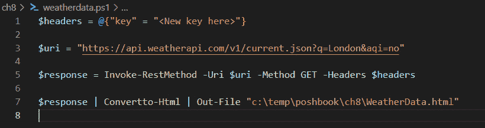

图 8.1 – 可读代码

如果我们保存`weatherdata.ps1`，现在可以从 PowerShell 控制台运行它，只需切换到我们保存它的目录，并在提示符下运行以下命令：

```
.\weatherdata.ps1
```

虽然代码是可读的，但它并不太灵活。它做一件事，如果我们希望它做一些稍微不同的事情（例如，获取不同城市的数据），或者如果我们想与其他人共享它，我们需要做一些更改。让我们看看从哪里开始做这些更改。

# 识别变化的值

让我们思考一下在这段代码中可能需要更改的内容。我们希望它从网络获取天气信息并将其写入 HTML 文档。这意味着我们不太可能想要更改`Invoke-RestMethod`、`Convertto-Html`和`Out-File`这些 cmdlet。想一想在我们继续之前可能会更改的值。

准备好了吗？很好。

这些是我们可能希望在运行脚本时能够更改其值的一些内容：

+   我们可能想要更改城市。

+   我们可能想要更改 HTML 输出的保存位置。

+   我们可能想要更改 API 密钥。

+   我们可能根本不想在脚本中硬编码 API 密钥。

我们可以通过在脚本中将它们设置为参数来传递这些值。下一节将专门讲解如何将脚本参数化。

# 使用参数

参数是脚本变量的值，可以在我们运行脚本时传递，而不是硬编码到脚本中。正如我们在上一节中所看到的，我们以与运行其他 cmdlet 相同的方式运行脚本，并且，像 cmdlet 一样，我们可以向脚本传递参数值。让我们看看如何做到这一点。

我们需要的第一件事是`CmdletBinding`特性。特性是告诉 PowerShell 我们希望它如何处理脚本元素的方式。我们之前在*第四章*中使用过它们，*PowerShell 变量和数据结构*，当时我们学习了如何转换变量。`CmdletBinding`特性告诉 PowerShell 我们希望它将脚本视为 cmdlet。这样做的主要好处之一是我们的脚本可以访问常用的参数，如`-Verbose`，以及位置绑定。让我们添加它。在脚本的顶部创建一行，并添加以下内容：

```
[CmdletBinding()]
```

接下来，我们需要创建一个`Param()`块，用来保存我们希望作为参数使用的变量。在`CmdletBinding`特性下方的行中，输入以下内容：

```
Param()
```

`Param()`块必须位于我们要编写的所有代码之前。我们将在括号内添加参数，所以最好按*Enter*键几次，给括号内部留出一些空间，以便添加它们：

```
[CmdletBinding()]
Param(
)
```

现在，我们准备开始创建参数了。

## 创建有用的参数

最有用的参数是那些会变化的值。让我们从我们获取天气数据的城市开始。城市嵌入在`$uri`变量中，这是一个字符串。我们可以轻松创建一个新变量来仅保存城市名称，并将其传递给`$uri`变量。试试这个：

```
[CmdletBinding()]
Param(
$City = "London"
)
```

并将`$uri`变量更改为如下所示：

```
$uri = "https://api.weatherapi.com/v1/current.json?q=$($City)&aqi=no"
```

记住，我们在这里需要使用双引号（`"`)以便扩展`$City`变量。我们可以通过以下图示来检查我们的代码：

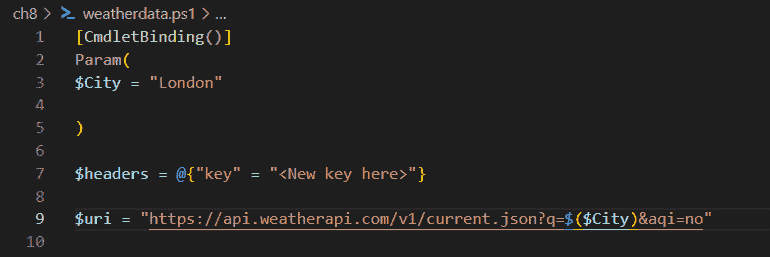

图 8.2 – 添加 CmdletBinding 特性和 param() 块

这将在我们运行时把`$city`的值写入`$uri`的值中。

测试，测试，再测试

这非常重要；如果我们做了两个更改，而脚本停止工作了，我们将不得不找出哪个更改导致脚本中断。每次更改后都要进行测试。在进行下一次更改之前，确保一切仍然有效。

让我们测试一下。从控制台开始，确保我们在保存脚本的目录中，然后输入以下内容：

```
.\WeatherData.ps1 -City Paris
```

现在，检查一下`WeatherData.html`文件。它应该是这样的：

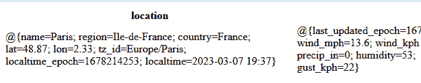

图 8.3 – 欢迎来到美丽的巴黎

如果这对你有效，恭喜你！你已经为第一个脚本实现了参数化。让我们看看我们做了什么。

通过将`$City`变量放入`Param()`块中，我们使其可以从脚本外部访问，以便在运行脚本时将值传递给它。通过给变量赋值，写成`$City = "London"`，我们设置了一个默认值，这样如果我们没有通过参数传递值，脚本仍然能够运行。

我们可以在`Param()`块中放入任意数量的变量，但每个变量必须用逗号（`,`）分隔。让我们再做一个，试试下面的操作。

活动 1

我们怎么传递我们想要保存输出的位置呢？我们又该如何让这件事变得尽可能简单？

提示：如果我们只传递一个文件名，它将把输出保存在与脚本运行位置相同的地方。我们每次都想这样做吗？

让我们看看可以如何使用密钥。密钥是一个长字符串，由随机字符组成，因此直接将其输入参数中并不实际。我们怎样解决这个问题呢？

我们可以将密钥保存到文件中，然后使用`Get-Content`从文件中提取字符串并以此方式使用它。在*第七章*中，*PowerShell 和 Web – HTTP、REST 和 JSON*，我们看到有两种将密钥传递给`Invoke-RestMethod`的方法。我们可以将其传递给`-Key`参数，或者像在此脚本中那样将其包含在`-Headers`参数中。重要的区别在于，在一种情况下密钥必须被编码，而在另一种情况下它必须是纯文本。你能记得是哪种情况吗？回顾上一章找到答案吧。

如果你记得，那就做得好。如果你是从我们当前脚本的工作方式推理出来的，那就更好了。我们已经在头部传递了一个未编码的字符串，因此我们不需要在保存之前对我们的密钥进行编码。

使用你喜欢的文本编辑器打开一个新文本文件，并将其保存为`key.txt`，放在与脚本相同的文件夹中——在我的情况下是`c:\temp\poshbook\ch8`。将你的`WeatherApi`密钥复制粘贴进去并保存。

现在，我们所需要做的就是添加一个指向文件的参数，并添加一行从文件中获取内容的代码。然后，我们可以将其添加到`$headers`变量中。它可能看起来像这样：

```
[CmdletBinding()]
Param(
$City = "London",
$KeyFile = "key.txt"
)
$key = Get-Content $KeyFile
$headers = @{"key" = "$key"}
```

我们已经确定了变化的价值观并创建了我们的参数。

活动 2

根据我们从前面章节中学到的内容，我们怎样重写脚本，使得可以接受`-City`参数的多个值呢？

提示 1：查看接受多个字符串作为参数的 cmdlet 的帮助文件，看看我们如何为`-City`参数编写一个属性。`Get-Random`接受多个对象作为`-InputObject`。

提示 2：我们将希望有一种方法来依次处理每个字符串。记住，传递给参数的多个字符串实际上是一个数组。

提示 3：我们将希望将每个城市发送到不同的输出。

让我们看看如何使用属性来改进它们。

## 指定类型

我们可以通过指定参数类型来限制错误的可能性，就像我们为变量指定类型一样，在变量前面加上属性。在你的脚本中，将`$City = "London"`这一行替换为如下代码：

```
[String]$City = "London"
```

现在，传入`-City`参数的任何内容都会被强制转换为字符串。

## 使参数变为必需

我们可能希望每次运行脚本时都需要显式提供`–City`参数的值。我们可以通过如下方式修改`-City`参数来实现：

```
[CmdletBinding()]
Param(
[Parameter(Mandatory = $true)]
$City = "London"
)
```

我们在`$City`参数之前添加了行`[Parameter(Mandatory = $true)]`。请注意，属性后面没有逗号（`,`）。现在我们这么做了，脚本就会忽略该参数的默认值（`"London"`），并提示输入城市：

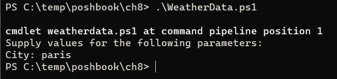

图 8.4 – 强制参数

在图中，我们可以看到因为我们没有为`-City`参数提供值，所以系统会提示我们。我们能通过脚本做的最有用的事情之一，就是让它接受来自管道的参数值。让我们看看如何做到这一点。

## 从管道获取值

我们在*第三章*，*PowerShell 管道 – 如何将 Cmdlet 串联起来*中讲解了参数如何从管道接受值。在本节中，我们将看到让我们的脚本接受管道值是多么简单。记住，参数可以通过两种方式从管道接受值：`ByValue`和`ByName`。对于我们的脚本来说，最好让`-City`参数通过值来接受管道输入，因此我们来这样做：

```
[CmdletBinding()]
Param(
[Parameter(ValueFromPipeline)]
$City = "London",
```

我们所做的仅仅是在`Param()`块中添加了行`[Parameter(ValueFromPipeline)]`。我们可以在下图中看到它带来的区别：

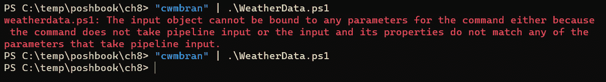

图 8.5 – 从管道接受值

在第一个示例中，我们看到我们创建了一个字符串`"cwmbran"`，并尝试将其通过管道传递给脚本。因为脚本不接受来自管道的值，我们会看到一个红色的错误消息提示我们这一点。如果我们随后更改`-City`参数来接受来自管道的值，那么在第二个示例中我们就能看到脚本顺利完成，没有错误。

让我们看看如果尝试通过管道向脚本传递两个值会发生什么，如下例所示：

```
"Manila","Cardiff" | .\weatherdata.ps1
```

我们只会得到最后一个项的输出。为了让它正确工作，我们需要将要为每个项重复的脚本部分放入`process {}`块中，像这样：

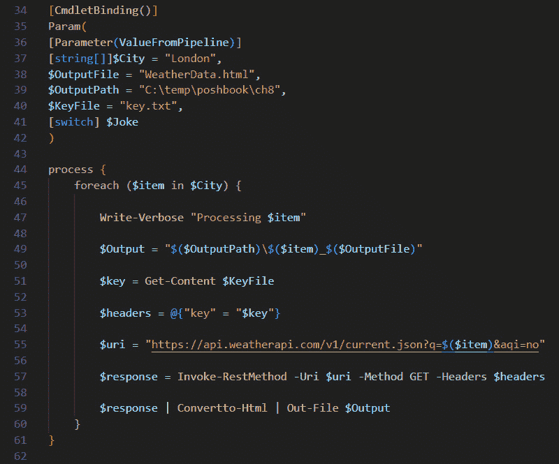

图 8.6 – 正确处理管道输入

我在第`44`行打开了一个`process {}`块，然后在第`61`行关闭它。现在，我可以将多个城市输入到管道中，并为每个城市生成一个 HTML 文件，如下所示：

```
"Bristol", "Brighton" | .\weatherdata.ps1
```

请注意，这并不意味着我们可以完全去掉*活动 2*中的`foreach`循环。如果我们显式地使用`-City`参数传递多个城市，我们仍然需要通过循环逐个处理它们。

还有很多其他操作可以在参数上执行，具体内容请参见这篇文章：[`learn.microsoft.com/en-us/powershell/scripting/lang-spec/chapter-12`](https://learn.microsoft.com/en-us/powershell/scripting/lang-spec/chapter-12)。

它们中的许多可以用于验证参数输入：确保它是正确的类型，或者甚至从接受的值列表中选择输入。

## 开关参数

在继续之前，我们应该讨论一下参数的最后一个特性：开关参数。我们一直在使用的许多 cmdlet 都有作为开关的参数；它们不需要值，只需存在即可改变 cmdlet 的行为。例如，在`Get-Help`中使用`-Full`参数会改变返回的帮助信息量。我们也可以在脚本中做到这一点。试试看——在`param()`块之后，添加以下行：

```
If ($Joke.IsPresent) {
Write-Output "Why did the chicken cross the road?"
}
```

然后，在`param()`块的最后一行，在闭括号之前添加以下行。记住，你还需要在前一个参数后添加逗号：

```
[switch] $Joke
```

以下图示展示了在我的脚本中它的样子，并显示了我们使用新`-Joke`参数时的输出：

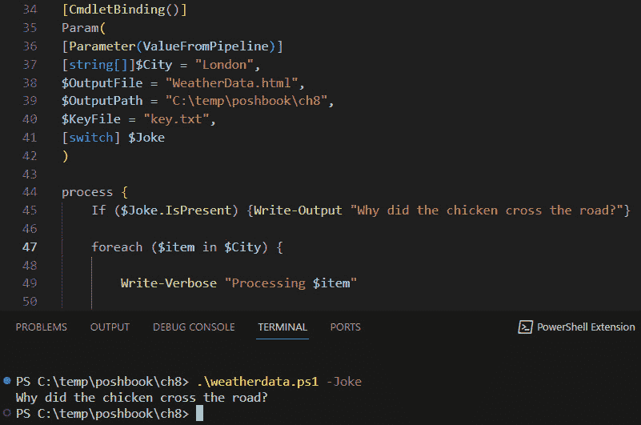

图 8.7 – 只是开个玩笑

在第`40`行，我在参数后添加了一个逗号，这样 PowerShell 就知道接下来会有另一个参数。我在第`41`行添加了新的`-Joke`开关参数，然后在第`44`至`46`行，我添加了一个`If`语句，告诉 PowerShell 如果开关存在应该做什么。最后，在终端底部调用脚本时，我使用了这个开关，脚本告诉我世界上最棒的笑话。很简单，是吧？

请注意，当我们查看互联网上其他人的脚本时，可能会看到一种不同的开关参数构造。我们常见的写法是`If ($Joke -eq $true)`，而不是使用`If ($Joke.IsPresent)`。虽然这样也能工作，但这是更旧的做法，可能会引起混淆。使用参数的`.IsPresent`方法是微软推荐的方式。

在我们继续阅读本书的其余部分时，我们将大量使用参数，但现在，让我们来看看本章的另一个主要话题——为我们的脚本提供帮助。

# 为我们的脚本提供帮助

编写脚本非常有趣，每次编写脚本时我们都会学到新东西。我们会加入新的技巧或快捷方式，完成脚本，投入使用，然后忘记它。下次回顾时，可能是几个月或甚至几年后，到那时我们可能已经忘记了它是如何工作的，或者为什么我们当初以那种方式编写它。解决这个问题的方法是为脚本编写全面的帮助文档，解释脚本如何工作以及如何使用它。对于我们提供给其他人使用的脚本，这一点尤为重要。

在这一节中，我们将介绍提供帮助的四种方式。首先，我们将简要了解如何通过注释代码来帮助自己和他人。接着，我们将研究如何为`Get-Help` cmdlet 创建基于注释的帮助。然后，我们将了解`Write-Verbose` cmdlet，并学习如何使用它来理解脚本的执行情况。最后，我们将看看如何为必填参数提供帮助。

让我们从注释代码开始。

## 注释

我们在*第五章*《PowerShell 控制流 – 条件语句和循环》中简要提到过注释。我们看到，可以通过在行首添加井号(`#`)将一行变成注释，也可以通过用 `<# … #>` 包围一段文本来创建多行注释。然而，我们并没有深入讨论注释的作用。PowerShell 是一种脚本语言——在我看来，它特别友好。大多数时候，熟悉语言的人可以合理地推测出一行代码的功能，但如果有注释，我们就不需要逐行解析来了解代码的意图。当然，我们写的代码并不总是按我们预期的那样执行。记录我们希望代码执行的注释，可以在我们翻阅四五百行代码时大大简化工作。当脚本被其他人修改时，注释尤为重要。来看下面的示例：

```
# concatenate the strings to produce an output filename
$Output = "$($OutputPath)\$($item)_$($OutputFile)"
```

注释行准确告诉我们这些略微难以阅读的代码希望实现的功能。

### 注释块

注释是为了在某种编辑器中阅读。为了使其更易于阅读，我们希望将长注释拆分成多行。我们可以使用反引号字符（`` ` ``）来转义手动换行符，但这并不真正使其更易于阅读，尤其是在某些编辑器和字体中。最好使用块注释语法，`<#...#>`。请看下面的图示：

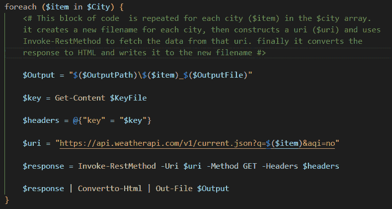

图 8.8 – 注释块

注释块是绿色的，解释了接下来的代码行的意图。让我们看看编写良好注释的一些注意事项：

+   注释应单独放在一行；在同一行添加注释会导致行过长或在编辑器中换行。

+   在你解释的代码行之前添加注释；为读者预告接下来脚本中的内容，而不是已发生的内容。

+   不要对显而易见的内容进行注释；一般来说，注释过多总比过少好，但不要浪费时间去解释那些不需要解释的内容。最好注释一块简单代码的作用，而不是每一行的作用。

让我们来看一下如何使用`Get-Help` cmdlet 为脚本提供帮助。

## 基于注释的帮助

`Get-Help` 命令读取与 PowerShell 主程序一起提供的 XML 帮助文件，以及具有这些文件的模块和函数。然而，它也可以读取正确格式化的嵌入脚本中的注释。这就是所谓的 **基于注释的帮助**。我们可以通过在脚本的开始部分添加特殊的帮助注释关键字来编写基于注释的帮助。

关于编写基于注释的帮助文档，有一些规则需要记住：

+   它必须位于脚本的开始或结束。出于多个原因，包括我们之前讨论的最佳注释实践，我们应该把它放在开始处。

+   基于注释的帮助必须是连续的。我们不能将其分割成不同的注释块。

+   每个帮助部分必须以合法的关键字开始。关键字不区分大小写，但必须以点（`.`）开头。

+   基于注释的帮助后必须有两行空行。

幸运的是，VS Code 使编写基于注释的帮助变得非常简单。我们来看看它是如何工作的。

在脚本中，在脚本的开始处创建一行，输入 `comm`。如下面的图所示，如果我们安装了 PowerShell 扩展，VS Code 会提供 `comment-help` 功能助手。

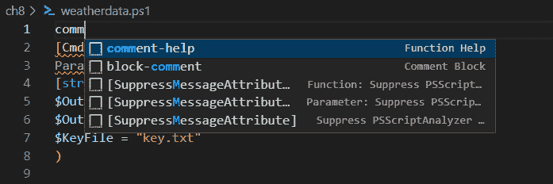

图 8.9 – VS Code 中的注释帮助功能

继续选择它。VS Code 会为我们创建一个基于注释的帮助模板，模板中包含最常用的关键字，格式正确，甚至会在块后面自动添加两个空行。

让我们来看看常见的部分：

+   `.SYNOPSIS`：此部分应为一行，总结脚本的功能。

+   `.DESCRIPTION`：在这里我们写下完整的描述，包括它是如何工作的，应该用来做什么，如何使用等。

+   `.NOTES`：在这里，我们应放置关于不兼容性、运行脚本的前提条件（例如，我们需要将 `weatherapi` 密钥保存到文本文件中）以及任何其他不适合描述部分的有用信息。

+   `.LINK`：这将为 `Get-Help -Online` 提供一个链接。就个人而言，我从不使用它，并且会从帮助部分删除它。

+   `.EXAMPLE`：我们可以在此处放置使用示例，以说明如何使用参数。每个示例应与新行中的 `.EXAMPLE` 关键字分开。

我承认，第一次做这个时，看到我的脚本帮助文档看起来像真正的帮助文档时，我感到非常兴奋。这种感觉永远不会过时：

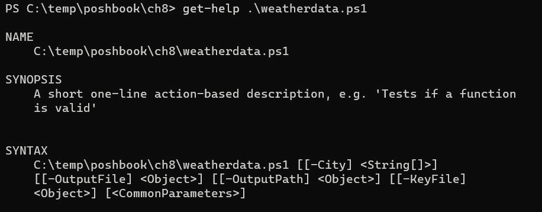

图 8.10 – 检索脚本的基于注释的帮助

这与 `Get-Help` 中的其他内容一样工作。要查看注释，请输入 `Get-Help .\weatherdata.ps1 -Detailed`。要获取所有信息，请使用 `-Full` 参数。

活动 3

为脚本编写简短的基于注释的帮助文档。通过从控制台调用 `Get-Help .\weatherdata.ps1` 来测试它。

这就是基于注释的帮助内容。它非常有用，无论我们是在编辑器中查看，还是使用`Get-Help` cmdlet。我建议我们尽可能多地使用它。现在让我们来看一些其他内容，虽然它不严格属于帮助，但绝对有帮助：`Write-Verbose` cmdlet。

## Write-Verbose

在*第三章*中，我们简要讨论了标准流：存在于大多数编程语言中的输出流，用于分类和引导输出。详细流就是其中之一，用于传达帮助用户理解 cmdlet 正在做什么的消息。它对于排查看似没有任何操作的长时间运行的 cmdlet 特别有用。每个 PowerShell cmdlet 都有一个`-Verbose`开关参数，允许我们看到 cmdlet 正在做什么，以及它是否卡住了，尽管并不是所有 cmdlet 都会产生详细流输出。我们已经在脚本中看到它的作用，因为`Invoke-RestMethod` cmdlet 具有特别有用的详细输出。试试这个：

```
.\weatherdata.ps1 -Verbose
```

你应该看到类似于下图的内容：

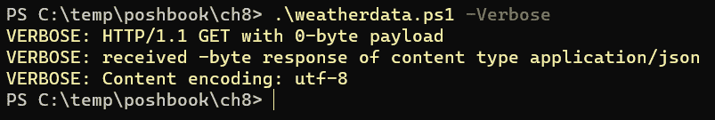

图 8.11 – 脚本内部的详细输出

我们能够访问这些详细输出是因为我们在脚本开始时使用了`CmdletBinding()`特性，它为我们提供了访问高级功能的权限。如果没有它，我们可以调用`-Verbose`参数而不会出错，但不会产生任何输出。

然而，我们可以做得比这更多；我们可以使用`Write-Verbose` cmdlet 编写我们自己的详细输出信息。为什么这有用呢？因为当我们在脚本中循环处理多个项目时，它可以告诉我们循环中的哪个项目出错。假设我们让脚本生成以下三个城市的数据：

```
.\weatherdata.ps1 -City "London", "Paris", "Llareggub"
```

然后，我们会收到一个错误，说明在`Invoke-RestMethod`运行时，未找到匹配的位置，但抛出错误的代码行如下：

```
Invoke-RestMethod -Uri $uri -Method GET -Headers $headers
```

所以它可能是任何一个不存在的城市。

我们可以通过更改`foreach`循环的开始部分来修复此问题：

```
foreach ($item in $City) {
    Write-Verbose "Processing $item"
    $Output = "$($OutputPath)\$($item)_$($OutputFile)"
```

我们在循环开始时添加了行`Write-Verbose "Processing $Item"`，这意味着如果现在使用`-Verbose`参数，脚本会告诉我们正在处理哪个城市，并且我们可以看到哪些城市是虚构的，如下图所示：

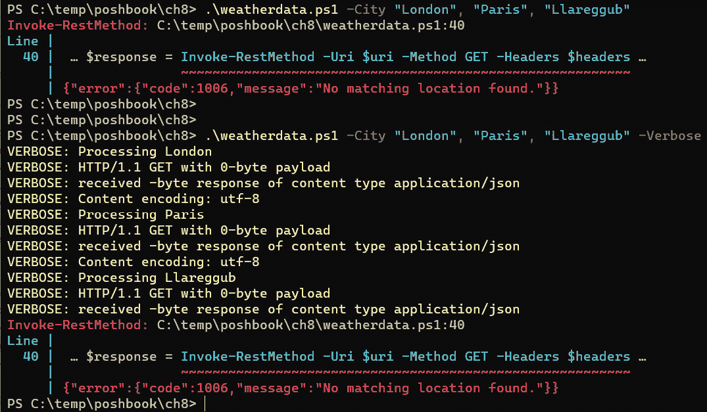

图 8.12 – 使用 Write-Verbose 来照亮黑暗

当我们运行脚本的第一行时，我们只看到错误，但当我们使用`-Verbose`参数运行时，它会告诉我们在遇到错误时正在处理哪个城市。让我们来看一下本章将介绍的最后一种帮助类型：参数帮助信息。

## 参数帮助信息

除了控制脚本中参数的工作方式外，我们还可以写出有用的注释，以指导人们如何在我们的脚本中使用参数。这些注释仅适用于必填参数，并且在没有提供必填参数时可用。让我们试试看。编辑`$City`参数如下：

```
Param(
[Parameter(Mandatory, HelpMessage="Enter one or more city names separated by commas")]
[string[]]$City = "London",
```

现在，当我们在没有为`$City`参数提供值的情况下运行时，会得到一条提示信息，建议我们输入一个反问符号(`!?`)来获取帮助：

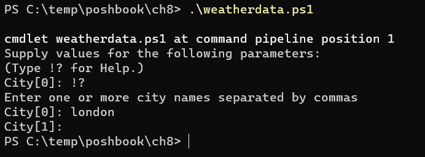

图 8.13 – 访问 HelpMessage 参数

一旦我们输入反问符号，脚本中编写的信息就会显示出来。就这么简单；只要记住，只有在必填参数时才能使用参数帮助消息。

本章内容差不多到此为止。让我们回顾一下我们所学的内容。

# 总结

在本章中，我们已经从学习 PowerShell 语法的基本构件开始，接下来将把它们组合起来。我们学到的技术可能对我们来说不太熟悉，但随着时间和实践的积累，它们将变得熟悉且易于掌握。在接下来的书籍中，我们将有很多机会使用它们。

我们首先讨论了脚本是什么，以及我们为什么要编写脚本。我们简要了解了如何找到其他人的脚本，以及如何在自己的机器上运行它们。

本章我们做了很多实践工作。首先，我们探讨了如何通过拆分长管道并用变量替代 cmdlet 中的硬编码值，特别是可能会变化的值，来使他人更容易理解我们正在做的事情。

我们接着讨论了如何通过使用参数从外部将这些值传递到脚本中，并查看了我们可以通过将参数设置为必填项或从管道中获取值来定义和操作这些参数的不同方法。

然后，我们研究了如何通过提供注释使我们的脚本更易于理解，接着为它们创建了完整的基于注释的帮助，以便我们能够使用`Get-Help` cmdlet。

之后，我们查看了如何使用`Write-Verbose` cmdlet 来提供详细输出。这帮助我们理解当脚本似乎没有按预期工作时，脚本到底在做什么。

最后，我们研究了如何为必填参数提供帮助消息，以便让人们更容易地运行我们的脚本。

在下一章中，我们将探讨如何使用脚本块、lambda 表达式和函数来使我们的代码更简洁、更容易编写。

# 进一步阅读

+   输出流：[`learn.microsoft.com/en-us/powershell/module/microsoft.powershell.core/about/about_output_streams`](https://learn.microsoft.com/en-us/powershell/module/microsoft.powershell.core/about/about_output_streams)

+   一些自动化理论：[`poshidiot.wordpress.com/2018/06/12/how-do-i-know-what-to-automate/`](https://poshidiot.wordpress.com/2018/06/12/how-do-i-know-what-to-automate/)

+   *云系统管理实践*，Limoncelli, T., Hogan, C., 和 Chalup, S.（2017），波士顿：Addison-Wesley，*第十二章*。

+   *系统管理员时间管理*，Sebastopol: Limoncelli, T. (2008)，O'Reilly Media, Inc.，*第十三章*。

+   *为什么 Fitts 列表在功能分配史上持续存在*：de Winter, J. C. F. 和 Dodou, D. (2014), 《认知学、技术与工作杂志》

+   了解更多关于属性和参数的信息：[`learn.microsoft.com/en-us/powershell/scripting/lang-spec/chapter-12`](https://learn.microsoft.com/en-us/powershell/scripting/lang-spec/chapter-12)

# 练习

1.  当我们尝试运行我们写的脚本时，机器上的另一个用户收到一条错误信息，提示`running scripts is disabled on this system`。我们需要做什么才能允许他们运行这个脚本？

1.  我们有一个喜欢*龙与地下城*的年轻亲戚，但他们丢失了 20 面骰。我们为他们写了一个简短的 PowerShell 脚本`Get-Die.ps1`，如下所示：

    ```
    Get-Random -Minimum 1 -Maximum 20
    ```

    这段代码每次运行时都会生成一个介于 1 和 20 之间的随机数。如果他们失去了一颗不同面数的骰子，那么这行代码中最有可能变化的值是什么？

1.  在前一个问题中的`Get-Die.ps1`脚本中，我们该如何为变化的值设置参数？

1.  这个参数应该是什么类型的，我们该如何指定它？

1.  他们喜欢这个脚本，现在他们失去了四面骰。他们发现可以在参数中放入任何自己喜欢的数字。虽然一开始这很酷，但现在他们希望脚本只允许他们掷游戏中使用的骰子。我们该怎么做呢？我们需要知道*龙与地下城*使用的是 4 面、6 面、8 面、10 面、12 面和 20 面骰子，并且我们还需要阅读文本中提供的关于参数的链接。

1.  我们的亲戚解释说，有时他们需要一次掷多个相同类型的骰子，并问是否有办法做到这一点。当然有……我们来为他们写一个吧。

1.  他们注意到有时会忘记输入骰子的数量，然后结果总是 0。我们该如何阻止这种情况发生？

1.  我们不可能一直在场，有时他们不确定该在参数中输入什么。我们该如何让他们更容易使用？

1.  他们真是让我们耐心到了极限。时不时他们需要掷一个叫做 d100 的骰子。这是一个 10 面骰，数字以十为单位递增：0, 10, 20, 30，依此类推，再加上一颗普通的 10 面骰子，两者加在一起给出一个介于 1 和 100 之间的数字。我们答应自己再也不为他们看管了，应该怎么做呢？
