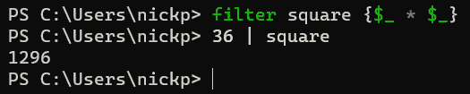

# 不要重复自己 – 函数和脚本块

在这一章，我们将学习软件开发的基本原则之一，并学会如何应用它来节省我们的精力，使代码更易于维护：**不要重复自己**，也称为**DRY**原则。在安迪·亨特和戴夫·托马斯的《务实程序员》中，这一原则被表述为：“*每一条知识都必须在系统中有一个单一、明确、权威的表现形式。*” 一些程序员会将这一原则推向其逻辑极限，确保代码中没有任何重复。我们写的是脚本，所以我们会在方便的情况下应用这一原则。我们将讨论代码中的函数概念。到本章结束时，我们将看到如何在脚本中编写函数来替换重复的代码，并了解这样做如何使我们的脚本更容易适应和修复。我们还将了解与函数相关的另一种表达式：**脚本块**。在此过程中，我们还必然会讨论**范围**的概念。

在这一章，我们将涵盖以下主题：

+   为什么我们关心重复的代码？

+   如何将重复的代码转换为函数

+   范围的概念

+   探索脚本块

+   让我们做点有用的事情

# 为什么我们关心重复的代码？

显而易见的原因是，在 PowerShell 中搞清楚如何做某事之后，却还需要不断重复相同的行，实在是很无聊。例如，在*第四章*《PowerShell 变量与数据结构》中，我们通过引用`TypeName Imaginary.Bike`来讨论对象。`Imaginary.Bike`对象有三个属性：`handlebar`、`wheel`和`color`。假设我们想编写一个简短的脚本来验证假想自行车是否具备所有的属性。它可能看起来像这样：

```
$mybike = @{handlebar = "ApeHanger"; color = "Red"; wheel = 15}
if (!($mybike.handlebar)) {
    write-output "this bike has no handlebars"
}
if (!($mybike.wheel)) {
    write-output "this bike has no wheels"
}
if (!($mybike.color)) {
    write-output "this bike has no handlebars"
}
if (!($mybike.gears)) {
    write-output "this bike has no gears"
}
```

在第一行，我只是定义了我的假想自行车。验证脚本从那之后开始。我加入了一个不存在的属性`gears`，只是为了确保代码能正常工作。我们可以看到脚本中有很多`if`语句，它们几乎做着完全相同的事情：检查一个属性是否存在，如果缺失则输出一条消息。我们对这些重复不太在意，因为我们只检查了四个属性。但如果我们需要检查 40 个或者 400 个属性呢？这就是 DRY 原则发挥作用的地方。我们可以像这样编写一个脚本来完成相同的事情：

```
$properties = @('handlebar', 'wheel', 'color', 'gears')
foreach ($property in $properties) {
    if (!($mybike.($property))) {
        write-output "this bike has no $property"
    }
}
```

从现在开始，我们添加的每个属性只需要在`$properties`数组中添加一个单词，而不需要三行新的代码。很棒，对吧？

然而，我们这里不仅仅是在省去重复输入的麻烦。我们还在省去找出打字错误的努力，这些错误可能会出现在数百行代码中。如果`foreach`循环对一个属性有效，那它对所有属性都有效，除非我们在将属性添加到`$properties`数组时打错了属性名称。如果有什么不工作，我们知道该去哪里查找，任何需要在我们之后排查问题的人也能知道该查找哪里。

DRY 原则不仅仅适用于过度的代码重复，它在软件中可以广泛应用。再次引用《程序员修炼之道》中的话，“*许多人以为 DRY 只指代码：他们认为 DRY 意味着‘不要复制粘贴源代码’…… DRY 是关于知识、意图的重复。它是指在两个不同的地方表达相同的内容，可能用的是完全不同的方式。*”

想象一下，如果我们不仅写了一个脚本，而是写了一堆与虚拟自行车相关的脚本。也许我们经营一家虚拟自行车店，并希望拥有一个库存管理应用程序。我们可能会发现，在这些脚本中，我们需要频繁引用虚拟自行车的属性。最终，可能会出现很多地方都有属性列表。我们不难想象，这些列表可能会有所不同。某些列表可能不完整，某些可能已经过时。如果我们应用 DRY 原则，那么就会有一个属性列表供所有脚本使用，当提到虚拟自行车的属性时，它们就会去这个列表中查找。

总结一下，我们关心重复代码的三个原因：

+   我们不想编写超过必要的代码。

+   我们希望更容易发现错误。

+   我们希望我们的代码有一个单一的真实来源。

我们是否希望在所有情况下、每时每刻都减少代码重复？可能不是。回到第八章中的自动化部分，*编写我们的第一个脚本 - 将简单的 Cmdlet 转换为可重用代码*，有时候将重复最小化所需的努力并不值得。也许我们只会用到某段代码两次；在这种情况下，复制粘贴完全没问题，而不是想办法只写一次。还有两个值得了解的软件开发原则：`if`语句，比起编写第二个示例中的脚本，使用一个不会被用到的抽象（*你不会需要它*）更好。我们应该做出可能最简单的有效方案。这个原则的一个主要启示是，软件开发人员喜欢使用缩写。

现在我们知道了为什么要减少代码重复，让我们来看看在 PowerShell 中实现这一点的主要方式之一：使用函数。

# 如何将重复的代码转化为函数

函数是一个**命名**的代码块，脚本或程序中的一段代码，它被赋予一个标签，可以通过引用该标签来使用。这是一个非常常见的编程范式，几乎所有的命令式编程语言都有出现。有些语言，如 PowerShell 和 Python，将这些代码块称为函数。有些则称它们为子程序、子程序块、方法或过程。这个范式被称为过程式编程，位于大多数人使用 PowerShell 编写脚本与像 C++ 和 Java 这样的全面面向对象编程语言之间。函数式编程是另一种范式，具有声明式风格。

命令式、声明式、过程式和函数式

我在这里抛出了一些新词，因此值得快速解释一下它们的含义。

**命令式**语言是像 Python 和 PowerShell 这样的*配方*语言。脚本或程序中的每一步都会告诉计算机做某事，并且通常会指定如何去做。这通常是人们学习的第一种编程风格；并且它通常是他们学到的唯一一种风格。

`<Heading>`，但它的样式由解释 HTML 的浏览器决定。

**过程式**编程是我们在本章中将要探讨的编程风格：编写过程，这些过程在 PowerShell 中被称为函数，并且从脚本中调用它们。总体编程风格依然是命令式的。

**函数式**编程是一种声明式的编程风格，在这种风格中，我们在对象上创建函数，然后调用这些函数。纯粹的函数式编程通常被描述为声明式编程。PowerShell 中的函数式编程并不是不可能，但它相当高级，因此我们在本书中不打算讲解。如果你真的有兴趣了解一下，可以访问 Chris Kuech 的 GitHub 页面：[`github.com/chriskuech/functional`](https://github.com/chriskuech/functional)，并试用他为 PowerShell 提供的**函数式**模块。

让我们来看一下一个函数。在 PowerShell 控制台中，试试这个：

```
function get-square($a) {$a * $a}
```

现在，输入 `get-square`，然后输入一个数字，像这样：

```
get-square 23
```

就像魔法一样，我们的数字的平方值被返回了。只要控制台保持打开，我们可以随时使用`get-square`。

我们做了什么呢？嗯，我们取了一些代码，`{$a * $a}`，并通过使用 `function` 关键字给它一个标签（或名称）`get-square`。我们还告诉它，期望一个变量`$a`，通过将变量放在名称后面紧跟的括号中。每当我们使用函数名时，代码就在我们传递的对象上运行——在这个例子中是整数 `23`。

我们在控制台中定义并使用函数的情况相对较少。相反，我通常将函数整合到我的脚本中。现在让我们来做这个。打开一个新的 PowerShell 文件，在 VS Code 中继续操作。让我们做一些更有挑战性的事情。我们来创建一个通过近似计算平方根的函数。输入以下内容：

```
function Get-RoughRoot {
    param (
        $number
    )
    $start = 1
    while (($start * $start) -le $number)  {
        $result = $start
        $start += 1
            }
       return $result
}
Get-RoughRoot 785692
```

这段代码的作用只是从`1`开始，不断将数字与自身相乘，直到得到一个大于我们最初传给函数的数字——在这种情况下是`785692`。它非常简单且直接。如果我们运行这段代码，我们会发现`785692`的近似平方根是 886，离实际的平方根 886.392 非常接近，但并不完全准确。这展示了机器的一个优势：快速重复。它已经执行了 887 次`while`循环。

注意我们在第二行开启的`param()`块。它与我们之前使用的`param()`块是一样的。事实上，我们可以将这个函数转变为一个`cmdletbinding()`属性，这样就可以在`Get-RoughRoot`中使用所有常用参数。我们可以像在脚本中使用`param()`块一样在函数中使用`param()`块。

活动 1

如果我们在脚本末尾输入`65378 | Get-RoughRoot`并运行，结果会怎样？为什么会这样，我们该如何使这行代码有效？

一旦我们在脚本中创建了函数，就可以通过引用函数名称并提供参数值来多次调用它。是的，PowerShell 中确实有一种非常简单的方式来得到精确的平方根，而且代码要短得多，但这样做有什么乐趣呢？

## 什么是函数？

创建函数需要以下内容：

+   关键字`function`，位于开始位置。

+   一个描述性且有意义的名称。最好遵循 PowerShell 的命名约定，并使用已批准的动词-名词搭配，尤其是当这个函数需要与他人共享时。

+   一组 PowerShell cmdlet，位于大括号`{}`中。

我们可以在`param()`块中包含一组参数，放在大括号后面，或者将它们包含在方括号中并附加到名称后面。更推荐使用`param()`块，特别是当我们有多个参数时，或者如果我们希望向参数中添加语句——例如，控制它们如何接受管道输入，或者它们接受什么类型的输入。

当我们在脚本中包含函数时，必须记住，计算机是从上到下读取脚本，而不是先读取整个脚本再执行。因此，我们必须在调用函数之前先定义它们。在脚本中通常会把所有函数的定义放在最上面，参数之后。

每个函数由四个语句块组成：`begin`、`process`、`end` 和 `clean`。虽然我们不需要包含这些语句块来使函数正常工作，但如果不包含它们，我们需要了解 PowerShell 如何解析我们的代码。

`begin` 语句块用于设置函数的语句，并且只在函数被调用时执行一次，且在函数对输入进行任何操作之前执行。类似地，`end` 语句块也只会在函数调用时执行一次。`process` 语句块会对传递给函数的管道中的每个对象执行，因此当从管道接受多个对象时，我们需要包含它，因为如果没有指定语句块，PowerShell 会将所有语句分配给 `end` 块。

`clean` 语句块是在 PowerShell 7.3 中引入的。它类似于 `end` 语句块，但无论函数是因错误终止还是用户按下 *Ctrl* + *C* 强制停止，`clean` 块都会始终执行，而 `end` 块则不会。另一个区别是，`end` 块可以将对象输出到管道，而 `clean` 块不能。

让我们看看实际代码中是如何实现的。在以下图中，我们为 `Get-RoughRoot` 函数添加了 `begin`、`end`、`process` 和 `clean` 语句块：


图 9.1 – Begin、process、end 和 clean 语句块

第 `12` 行的 `begin` 语句块包含一个 `Write-Output` cmdlet，用于显示当前在 `-number` 参数中保存的值。从底部的输出可以看到，当 `begin` 块运行时，`-number` 参数中并没有保存任何值。接着第 `15` 行的 `process` 语句块运行，并将当前的 `-number` 值传递到管道中，且会对管道中每个 `-number` 的值进行重复处理。然后，第 `24` 行的 `end` 语句块执行一次，只能看到 `-number` 参数传递的最终值。最后，第 `28` 行的 `clean` 块执行。我们可以看到它没有任何输出，但成功执行。如果你不相信我，可以试试——写一行无法运行的代码，比如 `write-rubbish "here is some rubbish"`。这时 PowerShell 会报错，输出一堆红色的文本。

还有一个需要注意的重要关键字：`return`。`return` 关键字用于结束当前正在执行的语句块的迭代。让我们看看使用它时会发生什么。以下是 `Get-RoughRoot` 函数的代码，在 `process` 块中添加了一个 `if` 语句，如果原始数字小于 10，则返回 `pop` 字符串：

```
function Get-RoughRoot {
    param (
        [Parameter(ValueFromPipeline)]
        $number
    )
    begin {
    write-output "for the begin statement, the number is $number"
    }
    process {
        $start = 1
        while (($start * $start) -le $number)  {
            $result = $start
            $start += 1
                }
        if ($number -lt 10) {
            return "pop"
        }
        write-output "The rough root of $number is $result"
        }
    end {
        write-output "for the end statement, the number is $number"
    }
}
```

现在让我们在管道中传递一个小于 10 的数字，如下所示：

```
785692, 4, 3492858  | Get-RoughRoot
```

我们将在以下图中看到输出：


图 9.2 – 使用 return 关键字

我们可以看到两个大数字的粗略根被返回，但当输入一个小于 10 的数字时，进程块提前终止。

`return` 关键字返回了它所分配的值（`pop`），但这完全是可选的——我们不需要给 `return` 分配一个值。值得注意的是，对于那些熟悉其他语言的人来说，这一点可能会有些困惑。例如，在 Python 中，`return` 语句用于提供函数的结果。在 Python 和 PowerShell 中，`return` 语句的工作方式非常相似，但它们背后的意图不同；PowerShell 会在没有 `return` 关键字的情况下返回函数的输出，而 Python 则不会。对于 Python 和 PowerShell，两者的 `return` 都会在使用的地方停止函数的执行。

### 基本函数和高级函数

我在脚本中编写的大多数函数都是基本函数，但我们可以通过使用 `CmdletBinding` 特性使函数表现得像一个 Cmdlet。这让我们能够访问 Cmdlet 中看到的一系列行为，比如 `-whatif` 和 `-confirm` 参数。它还让我们能够访问像 `WriteCommandDetail` 和 `WriteError` 这样的高级方法。

## 函数参数

如我们所提到的，函数的参数和脚本中的参数工作原理相同，但值得在这里重新回顾一下。

### 参数类型

我们可以在函数（以及脚本中！）使用四种类型的参数：

+   命名参数

+   Switch 参数

+   位置参数

+   动态参数

让我们仔细看看。

#### 命名参数

命名参数是我们一直在使用的参数，我们提供一个变量，作为参数的名称，像这样：

```
Param(
$number
)
```

该参数的名称，无论是在函数还是脚本中，都是 `-number`。我们可以在函数的任何地方使用 `$number` 变量，它将具有在参数中提供的值。正如我们在*第八章*中所看到的，*编写我们的第一个脚本——将简单的 Cmdlet 转换为可重用的代码*，我们可以像这样为参数设置默认值：

```
$number = 100
```

我们还可以通过在变量前用方括号提供类型值来指定参数的类型：`[int]$number`。

#### Switch 参数

Switch 参数不需要值，它们只是开或关。如果我们为函数提供了参数，则表示开；如果没有提供，则表示关。我们将参数的类型指定为 `[switch]`，像这样：`[switch]$heads`。我们可以在函数中使用 `if` 语句来测试开关是否存在，像这样：

```
Function get-flip {
    param([switch]$heads)
    if ($heads.ispresent) {"Heads!"}
    else {"Tails!"}
}
```

我们不需要 `.ispresent` 属性，可以直接输入 `if ($heads)`，但我认为那样不够清晰。我们也可以使用 `if ($heads -eq $true)` 结构，这在旧的网络文章中可能会看到，但那不是微软推荐的方法。

#### 位置参数

这些参数利用了`$Args`自动变量，而不是使用`param()`块。这个参数存在于每个基本函数中，并允许我们创建未命名的参数，像这样：

```
Function get-product {
$product = $Args[0] * $Args[1]
Write-output "The product of $($Args[0]) and $($Args[1]) is $product"
}
```

这意味着我们可以像这样提供参数：

```
Get-product 2 4
```

我们可以在下图中看到结果：


图 9.3 – 使用位置参数

我们可以看到，函数已经正确地赋值了我们提供的参数。`$Args`参数是一个数组。

请注意，如果我们使用`param()`块，则它将覆盖此功能；它将无法正常工作，因为我们需要指定位置参数。默认情况下，参数是位置性的，按照参数的书写顺序排列，因此这将是有效的：

```
Function get-product {
Param($a,$b)
$product = $a * $b
$product
}
Get-product 2 4
```

值`2`将被赋值给`$a`，值`4`将被赋值给`$b`。然而，如果某个参数必须位于特定位置，我们应该使用`position`属性，具体内容将在下一节中讨论。

`$Args`自动变量还可以用于将参数传递到函数中——有关 splatting 的更多信息，请查看*第四章*，*PowerShell 变量与数据结构*。让我们通过下图来看一下它是如何工作的：


图 9.4 – 将 `$Args` 变量传递到函数中

在第一行中，我们创建了一个名为`Get-Fifteen20`的简单函数。它运行`Get-Random`。我们告诉它接受来自命令行的参数，并将这些参数存入一个名为`@Args`的数组中（请注意数组符号`@`）。之后，我们告诉它输出`$Args`自动变量的值。从输出结果来看，首先我们得到一个介于 15 和 20 之间的随机数（`19`），然后我们看到`$Args`变量的内容。它是一个包含四个对象的数组：`-minimum`、`15`、`-maximum`和`20`。这些参数顺序传递给函数中的`Get-Random` cmdlet，形成有效的 PowerShell 语句`Get-Random -minimum 15 -maximum 20`，该语句运行正常。

活动 2

为什么`Get-Fifteen20 15` `20`不起作用？

#### 动态参数

动态参数仅在指定的条件为真时可用。它们不是在`param()`块中定义的，而是在单独的`DynamicParam{}`块中定义——请注意，这里使用的是大括号，而不是方括号。动态参数是一个相对高级的话题，只有在绝对必要时才应使用，因此我们在这里不会花太多时间讨论它们。关于它们如何工作的一个很好的例子可以在`Get-ChildItem`命令中找到。`Get-ChildItem`可以与任何 PSProvider 一起使用——我们在*第六章*中讨论过 PSProvider，*PowerShell 与文件操作——读取、写入和处理数据*。根据我们使用的 PSProvider 不同，`Get-ChildItem`的可用参数也会不同。例如，如果我们使用的是`FileSystem`提供者，我们可以使用诸如`-File`和`-Hidden`等参数。如果我们使用的是`Certificate`提供者，那么这些参数将不可用，取而代之的是`-DnsName`和`-SslServerAuthentication`等参数。

现在我们已经涵盖了参数的类型，让我们来看看我们可以应用于参数的一些属性。

### 参数属性

属性是可选的参数，我们可以用它们来控制参数的行为——例如，是否是必选的，或者是否接受管道输入。要使用属性，我们必须以`Parameter()`属性开始每个参数，它的形式如下：

```
Param(
[Parameter(Argument = Value)]
$ParameterName
)
```

`Parameter()`属性接受多个参数，但我们必须用逗号（`,`）将它们分开。让我们来看一下更常见的几个参数。

#### CmdletBinding

`CmdletBinding`属性使函数表现得像一个 cmdlet。如果我们在函数中使用此属性，我们可以访问常见的参数，如`-whatif`和`-confirm`。这将移除该函数对`$Args`自动变量的访问。

#### 必选

正如我们在*第八章*中看到的，*编写我们的第一个脚本——将简单的 cmdlet 转化为可重用的代码*，我们可以使用`Mandatory`参数来确保为某个参数提供值，使用`HelpMessage`参数来为该必选参数提供帮助信息：

```
Param(
[Parameter(Mandatory, HelpMessage="Type one or more integers, separated by commas." )]
[int[]]
$number
)
```

这意味着必须至少为`-number`参数提供一个整数，并且可以访问帮助信息。

#### Position

`Position`参数允许在不明确指定名称的情况下传递参数，并且可以指定参数必须提供的位置：

```
Param(
[Parameter(Mandatory, Position=0 )]
[int[]]
$number
)
```

上面的代码告诉我们，未指定名称的第一个传递值将应用于`-number`参数。有两点需要注意：第一，命名参数不计入其内，第二，编号是从`0`开始的，因此第二个位置为`Position=1`。请注意，如果我们使用的是`param()`块，我们之前讨论的`$Args`功能将无法使用，我们将无法在函数内将参数传递给 cmdlet。

如果我们不使用`Position`参数，那么所有参数将按照在`param()`块中声明的顺序分配位置，但我们不应依赖这种顺序完全按预期工作。如果我们希望参数是位置参数，那么我们应该明确声明它。

#### ParameterSetName

我们可以使用`ParameterSetName`参数来定义仅在特定参数集存在的参数。如果未提供`ParameterSetName`，则该参数属于所有参数集。我坚持认为一个函数应该做一件事，因此我从未真正需要参数集。然而，有些人喜欢编写多功能的“瑞士军刀”函数，因此参数集对他们来说是有用的。

#### ValueFromPipeline

我们在本章中已经使用过这个属性——它是允许函数参数接受管道中的整个对象的必要条件。

#### ValueFromPipelineByPropertyName

如果我们只希望参数接受一个对象的属性（例如，名称），那么我们可以使用这个参数。如果管道中的对象有一个名称属性（例如，`$object.name`），那么该属性将被用作该参数。对象的属性名必须与参数名匹配；否则，参数不会传递。如果我们将一个字符串通过管道传递给一个接受管道值的`-length`参数，那么该参数将被填充为字符串的长度，而不是实际的字符串。如果参数名为`-stringlength`，那么它将为空，因为字符串没有`stringlength`属性。

#### ValueFromRemainingArguments

我们可以使用这个参数来保存一个不确定数量的参数，作为数组传递给函数。然后，我们可以通过数组中位置的索引访问这些参数。这在高级函数中非常有用，在这些函数中我们无法访问`$Args`自动变量，且我们希望捕获不确定数量的参数。

#### HelpMessage

如我们已经看到的，这个属性可以用来为必填参数提供一个有帮助的提示信息。

#### 别名

我将其包括在这里是为了完整性，但我认为我已经明确表达了关于别名的看法。别名有时可能有用，但它们也会导致混淆，并使代码更难以阅读。不过，确实可以使用`Alias`属性为参数提供别名。

#### SupportsWildcards

如果我们希望参数接受通配符，则可以使用这个参数。请注意，这并不意味着函数支持通配符——我们仍然需要在函数中编写能够处理通配符输入的代码。

#### 参数完成属性

有两个参数完成属性允许用户通过*Tab*键完成参数值。这些属性类似于`ValidateSet`属性。我们在本书中不会详细讨论它们，但知道如果需要，我们可以使用它们。

#### 验证属性

目前有 14 个属性可以用于验证参数及其提供的值。我们可以验证一个值是否为 null，验证一个值是否符合特定模式（如信用卡号或 IP 地址），以及验证一个值是否具有特定的长度或是否在某个范围内。我们在*第八章*中发现了`ValidateSet`属性，*编写我们的第一个脚本—将简单的 Cmdlet 转化为可重用代码*。它的工作方式如下：

```
Param(
[Parameter (Mandatory)]
[ValidateSet("Pontypool", "Newport", "Swansea","Llanelli", "Cardiff")]
[string]$team
)
```

只有当字符串出现在`ValidateSet`列出的数组中时，才会接受该字符串。请注意，验证属性位于`Parameter()`属性之外。

虽然我们可以覆盖更多关于参数的方面，但现在就先到这里吧。让我们来看一个专门类型的函数：过滤器。

## 过滤器

过滤器是一个专门的函数，自动在管道中的所有对象上运行。过滤器类似于一个只包含`process{}`语句块的函数。我们可以这样使用它们：



图 9.5 – 使用过滤器

我们没有使用`function`关键字，而是使用了`filter`。我们把过滤器命名为`square`，并定义它为将管道对象与自身相乘。现在我们可以通过管道将一个值传递给过滤器，并获得输出。请注意，我们不能像使用函数那样使用它；`square 36`是无效的，因为管道中没有任何东西可以供过滤器处理。

然而，在我们真正开始使用函数之前，我们需要讨论一个重要的概念：作用域。

# 范围的概念

PowerShell 使用作用域的概念来保护变量、函数、PSDrives 和别名，避免它们被无意间更改，通过限制它们的访问和修改方式。让我们来演示一下：

1.  创建一个变量并设置其值：

    ```
    $ScopeTest = 10
    ```

1.  创建一个函数：

    ```
    $ScopeTest by calling the variable:

    ```

    $ScopeTest

    ```

    ```

1.  运行我们的函数：

    ```
    $ScopeTest inside the function is 15. Let’s check whether the value has changed permanently:

    ```

    $ScopeTest

    ```

    No, it hasn’t. That’s because the function is operating on its local scope; it can read the value of the variable, and it can change it while it’s running, but it can’t change it permanently because the variable exists outside the function. This is known as the scope of the function.
    ```

PowerShell 有以下几种作用域类型：

+   我们刚才使用的`$scopeTest`变量。任何在全局作用域中定义的内容在当前会话内的任何地方都可以使用。

+   在`Set-ScopeTest`函数中，有一个与全局作用域不同的作用域。当我们在函数内部更改`$SetScope`变量时，它只会在函数的本地作用域中更改，而不会影响全局作用域。本地作用域相对于其他作用域，不是预定义的作用域，因此它可能指向全局作用域、脚本作用域或全局或脚本作用域的子作用域。我们可以创建多个嵌套的本地作用域。当我们运行脚本或函数时，我们就创建了一个新的本地作用域。

+   **脚本**：这是我们运行脚本时创建的作用域。只有脚本中的语句在脚本作用域内运行，这些语句将脚本作用域视为本地作用域。每个正在运行的脚本都有自己的脚本作用域；它们不会共享对象。

## 父作用域和子作用域

作用域有层级关系。包含在另一个作用域中的作用域被称为子作用域，包含作用域的作用域则被称为父作用域。全局作用域始终是根作用域，是所有作用域的父作用域，其他作用域都是全局作用域的子作用域。因此，当我们之前运行 `Set-ScopeTest` 时，我们为该函数创建了一个本地作用域，它是全局作用域的子作用域。该本地作用域可以读取父作用域中的变量，但默认情况下不会更改父作用域中的变量；它只能在本地作用域中更改变量。接下来，让我们在 `Set-ScopeTest` 函数中添加几行代码来说明这一点：


图 9.6 – 示意父作用域和子作用域

我们添加的第一行代码获取了函数从其父作用域继承的 `$ScopeTest` 变量的值（在此情况下为 `10`），并将其输出到屏幕。然后我们像之前一样在函数内更改 `$ScopeTest` 的值，并输出新的值。接着，我们使用 `Get-Variable` 获取全局和本地作用域中 `$ScopeTest` 变量的值。我们可以看到，即使在函数内，`$ScopeTest` 的全局值仍然是 `10`，只有函数内部的本地实例的值被更改。那么，如果我们想要通过函数修改父作用域中变量的值，该怎么办呢？让我们看看如何实现这一点。

## 作用域修饰符

作用域的使用是有原因的——它们可以保护我们避免不小心更改内容——我们应当谨慎地跳出自动作用域，但有时我们确实需要这么做。PowerShell 包含多个作用域修饰符，允许我们更改默认作用域。它们包括以下几种：

+   `Global`：指定全局作用域中的对象。

+   `Local`：指定当前作用域中的对象。

+   `Script`：指定父脚本作用域中的对象，或者如果没有父脚本，则指定全局作用域；我们在脚本中的函数中使用这个修饰符。

+   `Private`：在创建变量时使用该修饰符，可以防止子作用域使用该对象。

+   `<Variable-namespace>` 这些指的是 PSDrive 名称空间，例如 `env:` 和 `variable:`。

还有一些其他的修饰符我们这里不讨论：`workflow:`（已弃用）和 `using:`（用于像 `Invoke-Command` 和 `Start-Job` 这样的 cmdlet）。脚本默认在 `script:` 作用域中运行。即使在脚本中定义，函数也默认在 `local:` 作用域中运行。

我们在 `$` 符号和变量名之间使用作用域修饰符，像这样：

```
$global:ScopeTest = 10
```

这将创建一个名为 `ScopeTest` 的全局作用域变量，并将其值设置为 `10`（记住，变量名没有 `$` 符号——我们使用 `$` 符号来引用变量的内容）。

同样，我们也可以像这样定义函数的作用域：

```
Function Global:Set-ScopeTest {$ScopeTest = 15}
```

注意，将函数的作用域设置为全局作用域并不会改变函数的作用方式，而是改变它的可用范围。因此，一个全局作用域的函数并不会自动作用于全局变量，如我们在这里看到的：


图 9.7 – 全局函数和全局变量

我们可以看到 `$ScopeTest` 的原始值是 `10`。然后我们定义了一个名为 `Set-ScopeTest` 的全局函数，将值设置为 `15`。调用该函数并不会改变 `$ScopeTest` 的全局值。为了做到这一点，我们需要告诉函数作用于全局变量，而不是在函数内运行的本地版本。我们在第二个命令中通过以下代码来做到这一点：`$Global:ScopeTest =` `15`。

在接下来的书中，我们会看到作用域的概念，并且无疑会偶尔为它感到沮丧。记住，它的存在是为了保护我们，提供一套有用的护栏，防止我们遇到滑稽的后果。我们应该在一些思考和考虑之后才跳出默认的作用域。我们通常可以通过将变量作为参数传递，或者明确地从函数内部写出输出并将其存储为变量来避免这样做。

现在我们理解了函数，让我们来看一下它们的亲戚：脚本块（scriptblocks）。

# 探索脚本块

脚本块是大括号（`{}`）内的一组语句，可以作为一个单元使用。我们已经多次使用过它们：在 `Where-Object` cmdlet、`if` 和 `else` 语句、`foreach` 循环中，以及在本章前面，当我们写函数时。在本节中，我们将看看脚本块的一些属性，以及如何在代码中使用它们。

考虑我们刚才做过的所有关于函数的内容。一个函数由 `function` 关键字、名称和一个脚本块组成：一组位于大括号内的语句。我们不需要使用关键字来使用脚本块——关键字提供了一个标签，我们用它来调用脚本块，当我们需要时。

脚本块返回它们包含的所有语句的输出；这可能是一个单一对象或一个对象数组。我们可以使用 `return` 关键字，它的作用和在函数中的作用一样：它会在那一点退出脚本块。

我们可以使用 `param()` 块为脚本块创建参数，它将接受我们在函数中使用的所有参数类型和属性。我们不能做的是像函数一样在大括号外传递参数，因为没有名称值将其附加到。

## 如何运行脚本块

调用脚本块有很多方法——许多 cmdlet 和语句（如 `foreach`）都接受它们。然而，有时我们只想运行脚本块。`Invoke-Command` 是一种实现方式，像这样：

```
$a = 10
Invoke-Command -ScriptBlock {$a * $a}
```

这将返回输出 `100`。让我们看看其他几种可能的实现方式。

与函数不同，脚本块可以存储在变量中，像这样：

```
$square = {$a * $a}
```

现在，我们可以以以下方式使用`$square`变量：

+   我们可以将其作为参数传递给`Invoke-Command`，无论是否带有`-ScriptBlock`参数名：

    ```
    Invoke-Command $square
    ```

+   使用`Get-Member`，我们可以看到`$square`的`TypeName`是`System.Management.Automation.ScriptBlock`。这个类型有一个叫做`invoke()`的方法，我们可以像这样使用它：

    ```
    $square.invoke()
    ```

+   假设我们在脚本块中放了一个参数，像这样：

    ```
    $square = {param($a) $a * $a}
    $square.invoke(20)
    ```

    我们不能做的事是直接调用变量来运行脚本块：


图 9.8 – 如何不运行脚本块

如你所见，如果我们调用这个变量，我们得到的是脚本块的内容，而不是输出。相反，我们使用调用操作符(`&`)来像这样调用：

```
&$square 20
```

我们可以在`&`和`$square`之间留一个空格，写作`& $square`，我们经常会看到这样写。

+   还有一种方法：点源。我们可以使用一个点(`.`)代替调用操作符，像这样：

    ```
    . $square
    ```

当我们这样调用脚本块时，需要非常小心。使用`Invoke-Command`、`invoke()`和调用操作符都会在子作用域中运行脚本块，这正是我们所期望的。点源会在父作用域中运行脚本块，如下图所示：


图 9.9 – 调用操作符和点源

在第一行，我们定义了一个变量`$SbScope`，它的值是`Global scope!`字符串。接着我们定义了一个变量`$ChangeSbScope`，它是一个脚本块，设置`$SbScope`为`Local scope!`并返回它。当我们用调用操作符调用`$ChangeSbScope`时，它会在本地作用域内运行，并保持`$SbScope`的全局值`Global scope!`不变。然而，当我们使用点源(`dot sourcing`)调用`$ChangeSbScope`时，我们会看到它改变了`$SbScope`的全局作用域值。要小心，除非你非常确定必须这样做，否则不要使用点源。

## Lambda

大多数编程语言都有**lambda**的概念——匿名函数，即没有名字的函数。在 PowerShell 中，我们有脚本块，它是一个更广泛的概念，包含了 lambda。所以在 Python 中，我们可能会有如下的 lambda 语句，它将一个值加到它自身：

```
Add = lambda a: a + a
Add(20)
```

然后我们得到输出`40`。在 PowerShell 中，相应的 lambda，使用脚本块，应该如下所示：

```
$add = {param($a) $a + $a}
&$add(20)
```

再次地，我们得到`40`。Python 中的 lambda 仅限于表达式，不能包含语句，而在 PowerShell 中，我们没有这样的限制。

我们什么时候需要使用脚本块而不是函数呢？通常情况下，我们使用脚本块来处理简短且简单的代码块，这些代码块在脚本中可能只会出现几次。我也常常在控制台中使用它们。如果我要写一个其他人也会用的脚本，那么任何超过一两行的代码都会放入函数中，以提高可读性，并确保其他人能清楚地知道我在做什么。

对于脚本块的最终应用场景，是针对那些已经掌握其他编程语言（如 Python）的人。将脚本块用作 lambda 表达式的替代方案，允许他们继续以自己习惯的风格编写代码。

这就是关于函数和脚本块的全部内容。接下来，我们来看看一个实际应用。

# 让我们做点有用的事情

当我为客户编写 PowerShell 脚本时，我喜欢确保脚本能够记录它正在做的事情以及它所做的任何更改到日志文件中，这样我可以快速找到发生了什么情况。然而，每次编写脚本时，我并不会编写这些功能；我只是将一些已保存的 PowerShell 代码片段包含在脚本中，给我一个日志文件功能。现在，让我们考虑一下如何做到这一点。

首先，我们需要考虑将日志文件创建在哪里。我使用`C:\temp`，因为这个目录通常是我们放置不需要永久保存的东西的地方，而且它通常具有较为宽松的权限。对于 Linux 或 macOS，我们可能需要考虑选择不同的目录，例如`/var/log/`。

我们还希望创建一个尽可能易于阅读的文件；我写入的是文本文件，但我使用`.log`后缀，这样我就知道它是什么类型的文本文件。我们创建的文件需要带有日期戳，以便知道哪个文件与脚本运行的哪个实例相关。这意味着我们需要在函数外部创建它，在脚本级别创建；否则，每次调用函数时，我们都会创建一个新文件。

每个文件条目需要有时间戳，这样我们就能知道日志中事件发生的顺序，同时它还需要记录一个可以从函数外部传递的字符串。

看起来我们需要两个参数：`$LogFile`和`$LogString`。让我们开始编写：

1.  在 VS Code 中创建一个新的 PowerShell 文件；我将我的文件命名为`Write-Log.ps1`。

1.  首先，让我们创建`$LogFilename`：

    ```
    -UFormat parameter of Get-Date; it’s to produce an easily readable text string that will work with Windows file-naming rules.
    ```

1.  现在，我们需要一个描述性的名称，例如`Write-Log`：

    ```
    Function Write-Log {
    param() block for our $LogString parameter:

    ```

    Function Write-Log {

    Param(

    $logString

    )

    }

    ```

    ```

1.  现在，让我们来看一下功能部分。我们需要一个变量，用来存储当前日期和时间的字符串。这里有另一种实现方式：

    ```
    $stamp variable and the $LogString variable that we get from the parameter:

    ```

    $LogMessage = "$stamp $Logstring"

    ```

    ```

1.  最后，我们需要将其写入日志文件：

    ```
    Add-Content $Logfile –Value $LogMessage
    ```

1.  就这样。让我们在函数后面加一行代码来检查它是否有效：

    ```
    Write-Log "is this thing on?"
    ```

    然后让我们运行它看看效果。


图 9.10 – 是的，就是这样

这是我的完整代码：

```
$LogFile = "c:\temp\MyLogFile" + $(Get-Date -UFormat "%Y-%m-%d_%H-%M-%S") + ".log"
Function Write-Log {
    Param (
        [string]$LogString
    )
    $stamp = (Get-Date).ToString("yyyy/m/dd HH:mm:ss")
    $LogMessage = "$stamp $Logstring"
    Add-Content $Logfile –Value $LogMessage
}
Write-Log "Is this thing on?"
```

我用于工作的函数还做了许多其他事情，我们将在下一章中讨论其中一些内容——*第十章*，*错误处理——哦不！出错了！*

活动 3

这个函数将文件写入客户端的某个位置。如果我们经常运行使用它的脚本，最终会有很多文件堆积起来。那么，我们如何编写一个函数，在运行脚本时清理旧的日志文件呢？

# 总结

在本章中，我们做了一些有趣的事情。我们考虑了一些软件工程的基本原则，特别是 DRY（不要重复自己），并探讨了如何在 PowerShell 脚本中应用这些原则。我们详细了解了函数是如何构建的以及它们的工作原理。我们简要讨论了基本函数与高级函数之间的区别。

接着我们讨论了函数中可以使用的四种参数类型：命名参数、开关参数、位置参数和动态参数。我们还学习了 `$Args` 自动变量，并了解了如何使用它将参数传递给我们的基本函数中的 cmdlet。

接下来，我们讨论了可以应用于参数的多种属性类型，以控制脚本的行为。我们集中讨论了更常见的属性，并提到了一些补全属性和验证属性的存在。

最后，我们看了一种特殊类型的函数——筛选器（filter），并了解了如何使用它来处理管道对象。

然后我们花了一些时间研究作用域的概念，了解了如何利用它来保护我们的环境，并保持脚本和函数在受限的内存区域内工作。我们学习了父作用域和子作用域以及作用域层次结构的概念。最后，我们看到了如何强制函数和脚本在默认作用域之外工作。

接着我们学习了脚本块，并了解了它们与函数的关系。我们讨论了调用它们的不同方式，包括点源（dot sourcing）——一种需要谨慎使用的方法。然后我们了解了脚本块如何与一个常见的编程概念：匿名函数或 lambda 相关。

我们讨论了不少理论，所以我们在本章结束时，探讨了如何构建一个有用的函数，这个函数可以在多个脚本中使用——写入日志文件。我希望你觉得这很有用；我知道我经常用它。

在下一章，我们将讨论如何处理错误，包括在脚本中的错误以及脚本与外部世界交互时遇到的错误。

# 进一步阅读

+   关于我们在本章开始时提到的软件工程概念：*《务实程序员》*（第 20 版），David Thomas 和 Andrew Hunt，2019 年，Addison Wesley。书中还有很多其他非常有用的内容。

+   在 PowerShell 中有许多 *About* 帮助文件，涵盖了我们在本章中讨论的主题。值得了解并阅读以下文件：

    +   关于函数：[`learn.microsoft.com/en-us/powershell/ module/microsoft.powershell.core/about/about_functions?view=powershell-7.3`](https://learn.microsoft.com/en-us/powershell/module/microsoft.powershell.core/about/about_functions?view=powershell-7.3)

)

    +   关于高级函数：[`learn.microsoft.com/en-us/powershell/module/microsoft.powershell.core/about/about_functions_advanced?view=powershell-7.3`](https://learn.microsoft.com/en-us/powershell/module/microsoft.powershell.core/about/about_functions_advanced?view=powershell-7.3)

    +   关于高级函数方法: [`learn.microsoft.com/en-us/powershell/module/microsoft.powershell.core/about/about_functions_advanced_methods?view=powershell-7.3`](https://learn.microsoft.com/en-us/powershell/module/microsoft.powershell.core/about/about_functions_advanced_methods?view=powershell-7.3)

    +   关于高级函数参数: [`learn.microsoft.com/en-us/powershell/module/microsoft.powershell.core/about/about_functions_advanced_parameters?view=powershell-7.3`](https://learn.microsoft.com/en-us/powershell/module/microsoft.powershell.core/about/about_functions_advanced_parameters?view=powershell-7.3)

    +   关于高级函数参数补全: [`learn.microsoft.com/en-us/powershell/module/microsoft.powershell.core/about/about_functions_argument_completion?view=powershell-7.3`](https://learn.microsoft.com/en-us/powershell/module/microsoft.powershell.core/about/about_functions_argument_completion?view=powershell-7.3)

    +   关于 CmdletBinding: [`learn.microsoft.com/en-us/powershell/module/microsoft.powershell.core/about/about_functions_cmdletbindingattribute?view=powershell-7.3`](https://learn.microsoft.com/en-us/powershell/module/microsoft.powershell.core/about/about_functions_cmdletbindingattribute?view=powershell-7.3)

    +   关于函数输出: [`learn.microsoft.com/en-us/powershell/module/microsoft.powershell.core/about/about_functions_outputtypeattribute?view=powershell-7.3`](https://learn.microsoft.com/en-us/powershell/module/microsoft.powershell.core/about/about_functions_outputtypeattribute?view=powershell-7.3)

    +   关于脚本块: [`learn.microsoft.com/en-us/powershell/module/microsoft.powershell.core/about/about_script_blocks?view=powershell-7.3`](https://learn.microsoft.com/en-us/powershell/module/microsoft.powershell.core/about/about_script_blocks?view=powershell-7.3)

# 练习

1.  AHA 代表什么？

1.  为什么在使用点来源时需要特别小心？

1.  我们创建了一个名为`$ScriptBlock`的变量，并用一个脚本块填充它。假设我们这样调用它：

    ```
    $ScriptBlock
    ```

    我们没有得到预期的输出。为什么呢？

1.  我们可以使用什么参数来检查输入是否为有效的 IP 地址？

1.  我们创建了一个过滤器`get-square`，并尝试这样使用它：

    ```
    Get-square 365
    ```

    为什么没有输出？

1.  我们在这里做了什么？

    ```
    $private:number
    ```

1.  函数和脚本块之间的主要区别是什么？

1.  我们在这里做错了什么？

    ```
    Function get-square($a) {$a*$a}
    15 | get-square
    ```

1.  我们在这一章花了很多时间得到了一个不准确的平方根。我们如何编写一个函数来获得精确的平方根？

    ```
    Function get-root($a) {
    <what goes here?>
    }
    ```
