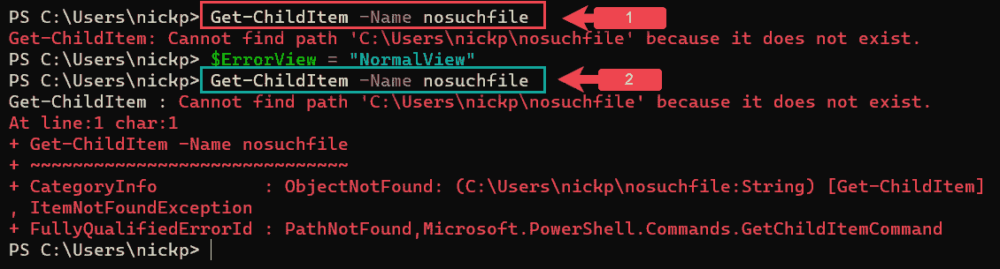
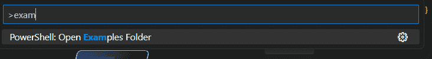

# 10

# 错误处理 – 哎呀！出错了！

在使用 PowerShell 时，我们通常会遇到两种类型的问题：一种是我们的代码遇到的问题，另一种是代码本身存在的问题。第一种类型的问题可能就像在执行 `Get-ChildItem` 时，出现 `FileNotFound` 消息那样简单。第二种类型的问题则可能更难理解，因为它可能涉及到作用域等问题，正如我们在*第九章*《不要重复自己 – 函数和脚本块》中所看到的，或者是一个意外的除零错误。我们将在本章的前半部分处理代码遇到的问题，然后在后半部分讨论可能出现在代码中的问题。

我们将从定义什么是错误开始，接着讨论我们的代码可能会遇到的两种错误：终止错误和非终止错误。我们将探讨 PowerShell 如何处理这两种错误，如何改变这种行为，以及为什么我们可能会这样做。然后我们将讨论如何捕获错误，以便我们能够理解它们并围绕它们编写代码。

在本章的后半部分，我们将探讨如何通过调试过程识别代码中的错误原因，并看看 VS Code 中的一些选项，帮助我们简化这个过程。

本章我们将覆盖的主要内容：

+   什么是错误？

+   理解错误操作

+   捕获错误

+   探索调试

+   使用 VS Code 进行调试

# 什么是错误？

正如我们反复看到的，PowerShell 与大多数语言一样，有其独特的术语和对常见词汇的定义。**错误**也不例外（不过... 有时它是例外，我们稍后会看到。这是一个非常有趣的笑话，我保证你稍后会笑出来。）。在 PowerShell 中，错误广义上是指任何可能在控制台中产生红色文本的情况。让我们看一个例子。在控制台中，输入以下命令：

```
Get-ChildItem -Name nosuchfile
```

我们将看到一条红色消息，显示 `Get-ChildItem: cannot find path because it does` `not exist`。

PowerShell 是一种非常友好和有帮助的语言。它会尽力从错误中恢复，并继续执行它被要求做的事情。在之前的实例中，它被要求做一件事，但未能做到，于是它提供了一条帮助性的错误消息，用通俗易懂的语言描述了为什么它无法完成我们要求的操作。

在这里，后台有很多工作正在进行。我们看到的上一个错误不仅仅是一个文本字符串；它是一个复杂错误对象的一部分，当 PowerShell 找不到文件时，它会生成这个错误对象。还有很多信息可以帮助我们理解发生了什么，并帮助我们解决问题。

我们看到的信息量由一个自动变量 `$ErrorView` 决定。默认情况下，在 PowerShell 7 中，这个变量设置为 `ConciseView`，PowerShell 会显示一个简短的友好消息。当我们在互联网上进行研究时，会发现通过将 `$ErrorView` 变量设置为 `NormalView` 值，PowerShell 可以显示更多的信息，正如我们在以下截图中看到的那样：



图 10.1 – 更改 $ErrorView 变量

在第一个示例中，*框 1*，`$ErrorView` 被设置为默认的 `ConciseView`，我们只看到了一条友好的消息。在第二个示例中，*框 2*，我们已将 `$ErrorView` 的值更改为 `NormalView`，并且获得了更多的额外信息，告诉我们错误发生的位置（`line:1` 和 `char:1`）以及它属于哪种类别的错误（`ObjectNotFound`）。`ConciseView` 是 PowerShell 7 中引入的；Windows PowerShell 仍然使用 `NormalView` 作为默认视图。

在本章的剩余部分，让我们通过输入以下命令，将 `$ErrorView` 变量设置为 `NormalView`：

```
 $ErrorView = "NormalView"
```

然而，`NormalView` 仍然不是完整的故事。要查看生成的完整错误对象，请输入以下内容：

```
Get-Error
```

我们应该能看到类似下面的内容：


图 10.2 – 错误对象

`Get-Error` 是 PowerShell 7 的一个 cmdlet，允许我们访问存储在 `$Error` 变量中的错误；我们在 Windows PowerShell 中找不到这个 cmdlet。每个在会话中遇到的错误都会写入这个变量。它由一组错误对象组成，最多可以达到由 `$MaximumErrorCount` 自动变量设置的最大值。默认情况下，在 PowerShell 7 中，这个值是 256——希望这个数量足够用。我们可以使用 `Get-Error` 并加上 `-Newest` 参数，后跟一个整数，来获取指定数量的错误，从最近的错误开始。我们也可以使用标准语法访问数组的单个成员，如下所示：

```
$Error[0]
```

这将获取最新的错误——在 Windows PowerShell 中，我们必须这样做。

不是每个我们遇到的错误都有一个友好的消息。有时我们只会看到错误代码，如之前截图中的框中所示。这个代码通常是 10 位数字，如截图中所示，从 `-2` 开始，或者可能是十六进制的，在这种情况下它会以 `0x` 开头，后面跟着 8 个字符。这种情况常见于网络错误。

代码相当难懂，但幸运的是，我们有一个工具可以用来解码它，叫做`err.exe`。它可以在微软官网上免费下载；只需搜索`err.exe`即可。下载后，我们无需安装它；只需在 PowerShell 控制台或命令提示符中直接运行即可，如下所示：


图 10.3 – 运行 err.exe

如我们所见，输出信息仅稍微少一些晦涩，并且高度依赖于上下文；在这种情况下，如果我收到代码`0x80010002`，如*图 10.3*所示，在我尝试通过网络打开文件时，我会将其解释为`ERROR_FILE_NOT_FOUND`。

现在我们对错误有了更好的理解，接下来让我们看一下在 PowerShell 中会遇到的两种错误类型：终止性错误和非终止性错误。

## 终止性和非终止性异常与错误

编程语言有一个**异常**的概念：需要特殊处理的异常情况。通常，当一段代码遇到异常时，它会停止正在执行的任务，并切换到执行异常处理器：一个记录错误的函数或子程序。对于大多数语言来说，错误就是异常，异常也意味着错误。

PowerShell 的一个不同之处在于，错误并不总是异常（尽管异常总是错误）。PowerShell 会尝试从错误中恢复；它会尽量继续执行它正在做的事情，而不是直接停止。它识别两种类型的错误：终止性错误和非终止性错误。终止性错误与异常相同。PowerShell 会输出错误信息并停止正在做的事情。非终止性错误意味着 PowerShell 会记录错误并在可能的情况下继续执行（除非我们告诉它停止）。

PowerShell 异常与 .NET 异常

所以，这可能会让人感到困惑，而且有关这方面的信息也常常更令人困惑（至少对我来说是这样）。例如，Don Jones 在《*Learn Windows PowerShell in a Month of Lunches*》中像我在这里解释的一样，认为非终止性错误不是异常。然而，Bruce Payette 在《*Windows PowerShell in Action*》中表示，所有 PowerShell 错误都是异常，包括终止性和非终止性错误。这两位作者（及其书籍）都很出色。我不想说一个是对的，另一个是错的；幸运的是，我不必这么做。仔细阅读《*Windows PowerShell in Action*》的第 532、543 和 546 页，可以得出以下结论。

每次 PowerShell 记录错误时，都有一个底层的 .NET 异常。请记住，PowerShell 是建立在 .NET 之上的，因此要使一个 .NET 异常成为 PowerShell 的异常，它必须停止 PowerShell 的执行并启动异常处理器函数。非终止性错误不会停止 PowerShell，异常处理函数也不会执行，因此它们对于 PowerShell 来说不是异常，尽管对于 .NET 来说它们是异常。明白了吗？

让我们来说明一下。在上一节中，我们查看了尝试获取一个不存在的文件信息时收到的错误，当时我们运行了`Get-ChildItem -Name nosuchfile`。现在我们再试一次，将其作为管道的一部分。在我的`ch10`目录下，我有两个文件：`foo.txt`和`bar.txt`。让我们看看当我运行以下命令时会发生什么：

```
"foo.txt", "nosuchfile", "bar.txt" | Get-ChildItem
```

我们可以在以下屏幕截图中看到结果：


图 10.4 – 非终止性错误

如我们所见，PowerShell 获取了第一个项 `foo.txt` 的详细信息，报告了第二个项 `nosuchfile` 的错误，然后继续获取第三个项 `bar.txt` 的信息。这是一个非终止性错误的例子。

那么，什么是终止性错误呢？这是一种会完全停止 PowerShell 的错误——会阻止脚本或管道继续执行的错误。一个很好的例子是拼写错误的 cmdlet，例如：


图 10.5 – 终止性错误

在这里，我使用了一个不存在的 cmdlet，`Get-ChildItems`（记住——PowerShell 的 cmdlet 总是单数形式，从不使用复数），PowerShell 在第一次尝试运行该 cmdlet 时就停止了。如果这是一个非终止性错误，我会期望看到错误出现三次，每次显示管道中的一个文件名。但实际情况是，我们只看到了一次错误，因为管道已经完全终止。

PowerShell 能够区分终止性错误和非终止性错误，这非常棒；在控制台环境中，它非常有用，但当我们运行脚本时，我们不太可能一直在场看到错误闪现然后消失。编写脚本时，我们希望将非终止性错误转化为终止性错误，并将所有错误转化为异常。这样我们可以设置异常处理程序，进行例如将错误日志记录到文件等操作。在我们学习如何处理终止性错误之前，先来看看如何将所有错误转化为异常。

# 理解错误处理方式

有两种简单的方法可以改变 PowerShell 处理错误的方式：`$ErrorAction` **首选项**变量和 `-ErrorAction` 参数。我们先来看一下变量。

## `$ErrorActionPreference` 变量

`$ErrorActionPreference` 自动变量可用于更改 PowerShell 处理错误的方式。默认情况下，它设置为 `Continue`，意味着显示任何错误并继续执行。以下是该变量的几个更重要的有效设置：

+   `Break`：此选项会在发生错误时使 PowerShell 进入调试模式。关于调试模式的内容将在本章下半部分讲解。

+   `Continue`（默认）：显示错误信息并继续处理。

+   `Inquire`：此选项会显示错误信息并请求是否继续或停止。

+   `SilentlyContinue`：错误信息不会显示，但会被添加到 `$Error` 变量中。PowerShell 继续执行。

+   `Stop`：显示错误信息并停止处理。这会生成一个 `Action` `PreferenceStopException` 异常。

请注意，关于首选项变量（`about_Preference_Variables`）的帮助文档说明该变量仅对非终止错误有效；但事实并非如此。更改该变量会影响终止和非终止错误，尽管在终止错误之后，`Continue` 和 `SilentlyContinue` 不会强制 cmdlet 或脚本继续执行；它仍然是一个终止错误。

`$ErrorActionPreference` 变量的作用域正如我们预期的那样。所以，尽管会话的值可能是 `Continue`，我们可以在脚本中设置不同的值。然而，我们绝对不能在脚本顶部写 `$ErrorActionPreference = 'SilentlyContinue'`，无论它多么诱人，或者我们在互联网上看到多少人这么做。这会抑制脚本中的所有错误，并且当出现问题时非常难以排查，还会让 Don Jones（PowerShell 的大佬）感到难过。相反，如果脚本中有一个我们知道会产生大量非终止错误的 cmdlet —— 例如，使用 `Test-NetConnection` 测试活动机器的函数 —— 我们可以使用 `-ErrorAction` 常见参数。

## `-ErrorAction` 参数

`-ErrorAction` 参数是所有 cmdlet 和高级函数可用的常见参数之一。请注意，这只会改变非终止错误的处理方式。在下图中，我将 `$ErrorActionPreference` 设置为 `Inquire`，通过输入 `$ErrorActionPreference = Inquire`，然后使用 `-ErrorAction` 参数来尝试改变行为：


图 10.6 – `-ErrorAction` 参数

在第一个 cmdlet 中，我们正在生成一个非终止错误，错误动作是 `Silently` **Continue**。如我们所见，没有任何输出；`Continue` 的默认值会以红色显示错误。在第二个 cmdlet 中，我们通过错误地输入 cmdlet 名称生成了一个终止错误，`-ErrorAction` 参数被忽略；我们会看到一个操作提示。

`-ErrorAction` 参数与 `$ErrorPreference` 变量有相同的值。让我们看看 `Ignore` 值。这会像 `SilentlyContinue` 一样抑制错误消息。与 `SilentlyContinue` 不同的是，错误不会写入 `$Error` 变量，而是完全被忽略。

活动 1

如果我们运行以下 cmdlet，会发生什么呢？

**$ErrorActionPreference = “SilentlyContinue”**

**“foo.txt”，“nosuchfile”，“bar.txt” | Get-ChildItem -ErrorAction “Stop”**

现在我们知道如何让所有错误成为终止错误，接下来我们来看一下为什么我们可能会这么做。

# 捕获错误

正如我们所发现的，错误包含了大量有用的信息，我们可以利用这些信息让代码运行得更加顺畅。虽然 `Get-Error` 和 `$Error` 变量对于实时故障排除非常有用，但在编写脚本时，我们需要有另一种方式来处理错误。

## Try/Catch/Finally

处理 PowerShell 中的终止错误的最佳方式是使用`Try`/`Catch`/`Finally`语句。此语句允许我们根据是否发生错误来设置备用的操作流程。语句包括一个强制性的`Try`块，其中包含可能会生成错误的代码，然后是`Catch`块、`Finally`块或两者。`Catch`块会在`Try`块中的代码生成终止错误时执行；这是我们的异常处理器。`Finally`块中的代码无论是否生成错误都会执行；该块用于在`Try`块中的代码执行后可能需要的任何清理工作。我们很少看到`Finally`块的使用——我自己从不使用它。我们可以编写多个`Catch`块来处理不同的错误。

让我们试一个例子。在 VS Code 中创建一个新文件，输入以下内容：

```
function Get-Files {
    PROCESS {
        try {
                $filename = $_
                Get-ChildItem -Path "$_" -ErrorAction "Stop"
        }
        catch {
            write-output "error! file not found: $filename"
        }
    }
}
'foo.txt', 'nosuchfile', 'bar.txt' | Get-Files
```

所以，在这里，我们创建了一个名为`Get-Files`的函数。我们从`PROCESS`块开始，这样就可以从管道中获取输入。我们在第三行打开一个`Try`块，并在其中包含函数的操作代码。接下来，我们创建一个名为`$filename`的变量，并将管道中的当前内容存储到该变量中；我们可能会在`Catch`块中用到它。

活动 2

为什么我们不能直接使用管道变量作为`Catch`块的内容？为什么我们需要将当前的管道变量存储到另一个变量中？

然后，我们编写实际执行处理的 cmdlet：`Get-ChildItem`。我们添加`-ErrorAction "Stop"`以确保所有错误都是终止错误；请记住，`Catch`块仅会在捕获到异常时执行。

接下来，我们编写`Catch`块。我们使用此块来包含在捕获到终止错误时要执行的代码；在这种情况下，我们只想要一个屏幕上的错误消息以及当前字符串（我们将其写入`$filename`）。

最后，在最后一行，我们将三个字符串放入管道并传递给我们的函数。

运行时，所有内容的效果如下：


图 10.7 – 使用 Try/Catch

正如我们在前面的终端中看到的，`foo.txt`和`bar.txt`被处理了，但由于找不到`nosuchfile`，`Catch`块的动作被触发——在这种情况下，将错误字符串和文件名写入屏幕。

编写多个`Catch`块相对容易，但我们需要知道可以预期哪些类型的错误；具体来说，我们需要知道完整的.NET 名称，包括命名空间。从*图 10.4*中可以看到，当我们找不到文件时，.NET 异常名称是`ItemNotFoundException`，但我们还需要知道命名空间；在这种情况下，它是`System.Management.Automation`。如果我们不知道错误的命名空间，那么在互联网上搜索之前，尝试这个命名空间总是值得的。

我们将错误类型放在`Catch`和大括号（`{`）之间的方括号中，如下图所示：


图 10.8 – 多个 catch 块

我们的第一个`Catch`块从*第 7 行*开始，只有当抛出类型为`System.Management.Automation.ItemNotFoundException`的错误时，它才会触发。所有其他错误将触发第二个`Catch`块。试试看；将 cmdlet 更改为`Get-ChildItems`来触发`CommandNotFound`错误。我们应该看到`an unspecified error. boo.`被写入三次。

那么，我们可以用`Try`/`Catch`做什么呢？其实，我们可以将它与上一章中编写的日志功能结合使用，利用`Catch`块将错误消息写入日志文件，而不是直接写到屏幕上。

我们可能会在互联网上看到对`Trap`语句的引用。这个语句可以追溯到 PowerShell v1。它真的很难使用，并且在作用域上有问题，因此建议我们应该使用更新的`Try`/`Catch`语句。和`Finally`块一样，我从不使用`Trap`语句。

这几乎涵盖了我们在运行脚本时可能遇到的错误；只剩下最后一种情况需要考虑。那就是一些不是错误的事情，但会阻止我们的脚本运行。

考虑这段代码：

```
Get-ChildItem -path *.csv
```

如果目录中没有`.csv`文件，会发生什么？PowerShell 不会显示错误；它根本不会显示任何内容。然而，我们可能会将其视为脚本中的错误。让我们看看如何将其转换为终止错误。

## 创建错误

`Throw`语句用于在脚本中创建一个终止错误，使脚本在该点停止并记录异常——例如，写入日志。我们来看一个例子。请在 VS Code 中尝试：

```
try {
    $files = (Get-ChildItem -Path *.csv)
    if (!($files)) {
        Throw "There are no CSV files here!"
    }
    else {
        #do something with the files
    }
}
catch {
    Write-Output $_.tostring()
}
```

这是一个`Try`/`Catch`块的配对。在`Try`块中，我们正在创建一个变量`$files`，它包含`Get-ChildItem -Path *.csv`的结果：当前目录下所有的`.csv`文件。

接下来，我们运行一个`if`语句，条件是`!($files)`——即，如果`$files`是`$null`，则执行`Throw`语句，抛出`There are no CSV files here!`消息。这个消息被包装成一个错误对象，并传递到`Catch`块中。然后我们可以像处理真实错误一样，使用`Write-Output $_.tostring()`来仅显示消息。让我们看看它的效果：


图 10.9 – 抛出我们自己的错误

正如我们在红框中看到的，`Throw`语句产生了一个错误，我们可以像处理其他终止错误一样处理它。如何写一个非终止错误是本章下一节——调试的内容。

关于如何处理错误的内容已经足够了。在下一节中，我们将着眼于调试我们的代码。

# 探索调试

我的代码有漏洞，你的代码也有漏洞。我们并不是糟糕的程序员，所有代码都有漏洞——只是我们还没有找到所有漏洞。根据 Coverity（一家代码质量扫描公司）的数据，经过质量控制的专业编写软件每 1,000 行代码大约有 1 个缺陷（或漏洞）。其中一些漏洞永远无法被发现，因为代码没有在那些特定的、罕见的情况下表现不如预期（在行话中叫做边界情况）。

错误主要分为两种类型：

+   语法错误，我们拼写错了 cmdlet 或参数名称，或者漏掉了闭括号或引号。语法错误基本上是打字错误——只是我们有时打错了，以为自己打的是对的。我们已经看到，使用 VS Code 可以在这方面大大帮助我们，通过颜色标注、语法检查、代码提示和标签自动完成。

+   逻辑错误，我们对 PowerShell 工作原理的理解不足。例如，我们可能遇到的作用域问题就属于这一类。可以说，许多我们已经遇到的错误也可以归到这一类；例如，在尝试使用文件之前检查文件是否存在，可以防止抛出意外的错误，就像我们在讨论`Throw`语句时看到的那样。

在本节中，我们将快速浏览 PowerShell 7 的各个功能，看看它们如何帮助我们发现并理解代码中的漏洞。不过，在进入有趣的部分之前，我们应该提醒自己故障排除的基本规则：

+   `FileNotFound`，在我们亲自确认文件确实位于我们认为的地方之前，不要开始排查网络连接问题。

+   **阅读帮助文件**：我们有没有正确获取参数名称？这个 cmdlet 是否做我们认为它应该做的事情？

+   **理解期望与现实的差异**：我们需要阅读正在故障排除的脚本，准确理解我们期望它做什么以及它实际做了什么。举个例子——我最近与一个客户合作，他在将服务器置于静默状态以便进行维护时遇到了问题。他认为自己使用的脚本可以做到这一点，但我们检查后发现它做的事情稍有不同。脚本本身没有问题；需要调整的是他的期望。

话虽如此，让我们来看一下如何为脚本提供一些仪表化支持。

## 脚本仪表化

脚本仪表化是指嵌入到脚本中的代码片段，旨在向我们提供关于脚本正在做什么以及它做得如何的信息。它可以是我们在加载模块时看到的进度条，表示循环完成了多少次的信息，找到的对象数量，或者仅仅是脚本的某个部分运行了多长时间。在本节中，我们将讨论如何使用一些 `write-*` cmdlet 来为我们提供故障排除信息。在 *第八章* 中，*编写我们的第一个脚本 – 将简单的 Cmdlet 转换为可重用的代码*，我们详细介绍了 `Write-Verbose` cmdlet，而在 *第三章* 中，*PowerShell 管道 – 如何将 Cmdlet 串联起来*，我们讨论了标准流以及与每个流相关的 `Write-*` cmdlet。让我们在这里重新回顾一下它们：

| **流编号** | **描述** | **Cmdlet** | **常用参数** |
| --- | --- | --- | --- |
| 1 | 成功 | `Write-Output` | 无 – 这是默认输出 |
| 2 | 错误 | `Write-Error` | `-ErrorAction` 和 `-ErrorVariable` |
| 3 | 警告 | `Write-Warning` | `-WarningAction` 和 `-WarningPreference` |
| 4 | 冗长 | `Write-Verbose` | `-Verbose` |
| 5 | 调试 | `Write-Debug` | `-Debug` |
| 6 | 信息 | `Write-Information` | `-InformationAction` 和 `-InformationVariable` |

表 10.1 – PowerShell 流

这些流针对不同的群体；`Write-Output`、`Write-Warning`、`Write-Error` 和 `Write-Verbose` 是为脚本的最终用户设计的。`Write-Information` 是为脚本操作员设计的，`Write-Debug` 是为开发人员设计的；也就是我们。

我们之前使用过 `Write-Output` 和 `Write-Verbose`；在这里我们不再重新介绍它们。它们为运行脚本的人提供不同层次的信息。然而，`Write-Error` 是新的。我们可以使用 `Write-Error` cmdlet 来生成一个非终止错误，就像我们使用 `Throw` 来生成终止错误一样。在接下来的 `Write-Error.ps1` 脚本中，我将 `$ErrorActionPreference` 设置为默认值，并用 `Write-Error` cmdlet 替换了我们之前使用的 `Throw` 信息：


图 10.10 – Write-Error cmdlet

在 *第 4 行*，我用 `Write-Error "没有找到 CSV 文件"` 替换了 `Throw` 语句，并在 *第 9 行* 添加了一个 `Write-Output` cmdlet，它位于 *第 1 行* 打开的 `try` 语句内部。

当我们运行它时，可以看到 `Write-Error` cmdlet 会将一条红色信息输出到控制台。我们可以看到它是一个非终止错误，因为 *第 9 行* 的 `Write-Output` cmdlet 也会执行并在控制台中输出 `脚本继续` 字符串。从截图中的控制台窗口可以看到，错误也被写入了 `$Error` 变量。我们通过之前在本章看到的同一个 `$ErrorActionPreference` 变量来控制它的显示。

那么，什么时候使用 `Write-Error`，什么时候使用 `Throw`？`Write-Error` 是当我们想告诉用户某些东西出错了，但让脚本继续执行时使用的；`Throw` 则是在我们希望脚本停止当前操作并处理错误时使用的。

`Write-Warning` 是我几乎从不使用的一个 cmdlet。它将文本写入警告流，输出为黄色文本。就是这样，它只会产生黄色文本。我们可以使用 `$WarningActionPreference` 变量和 `-WarningAction` 参数来强制脚本在写入警告流时停止或悄悄继续，但我觉得这是不必要的冗余；最好使用 `Write-Error` 并将输出写入 `$Error` 变量。其他意见也是存在的。

`Write-Information` 通常用于提供我们脚本已执行的详细信息；当我们与针对信息流的日志聚合器工作时，它非常有用，但我通常不太使用它。

`Write-Debug` 是我们在这里感兴趣的 cmdlet。它写入调试流，并且可以通过确保我们的脚本是高级脚本来访问，使用我们在 *第八章* 中看到的 `CmdletBinding` 属性，*编写我们的第一个脚本——将简单的 cmdlet 转化为可重用的代码*。如果我们使用了这个属性，那么我们就可以访问 `-Debug` 参数。

我们什么时候使用 `Write-Verbose`，什么时候使用 `Write-Debug`？`Write-Verbose` 的输出是为用户提供的，我们使用它来告诉用户脚本正在做什么——例如，当我们有一个循环从目录中处理并加载文件时，可能会显示类似“加载文件”的消息。我们在循环内部使用 `Write-Debug` 来列出我们正在加载的文件。考虑以下简短脚本：


图 10.11 – Write-Verbose 与 Write-Debug

这包含了在 *第 7 行* 外部的 `Write-Verbose` 消息和在 *第 9 行* 循环内的 `Write-Debug` 消息。`Write-Verbose` 消息面向脚本用户，告诉他们脚本正在做某件事，即使他们觉得它没有做什么。`Write-Debug` 消息则面向我们，精确地告诉我们脚本正在做什么，以及它正在处理哪个文件。`Write-Debug` 和 `Write-Host` 操作分别受 `$DebugPreference` 和 `$VerbosePreference` 变量的控制。这些变量默认都设置为 `SilentlyContinue`，并通过各自的 `-Debug` 和 `-Verbose` 开关参数被覆盖，正如我们在前面的控制台输出中看到的那样。

这些都很好，但这只告诉我们如何处理我们预期的错误。那当我们不知道出了什么问题时呢？我们会转向调试 cmdlet。

## 调试 cmdlet

调试非常复杂，随着我们深入研究，我们很快意识到，要彻底理解它，我们需要对计算机科学有相当好的掌握。这并不意味着对常见 cmdlet 的工作知识不非常有用。在这一节中，我们将讨论如何在控制台中使用断点调试脚本。当断点被触发时，脚本将暂停运行，并启动内置的 PowerShell 调试器。设置和操作断点的 cmdlet 都使用 `PSBreakpoint` 作为名词。我们应该关注以下这些 `PSBreakpoint` cmdlet：

+   `Set-PSBreakpoint` 在脚本、变量或命令的特定行启用一个断点

+   `Get-PSBreakpoint` 列出会话中设置的所有断点

+   `Remove-PSBreakpoint` 移除指定的断点

+   `Disable-PSBreakpoint` 停止断点触发，但不移除它

+   `Enable-PSBreakpoint` 启用一个被禁用的断点

让我们使用之前的 `debugVsVerbose.ps1` 脚本。如果你还没有创建，创建一个新的文件，将其保存为 `debugVsVerbose.ps1`，并添加以下内容。你需要将 `$path` 变量更改为你存放文件的路径：

```
[CmdletBinding()]
param (
    $Path = "C:\temp\poshbook\ch10"
)
$files = (Get-ChildItem -Path $path)
Write-Verbose "Getting Files..."
foreach ($file in $files) {
    Write-Debug "Current `$file is $file"
}
```

现在，在控制台中，而**不是**在 VS Code 中，导航到你保存脚本的目录，并输入以下命令：

```
Set-PSBreakpoint -Script .\debugVsVerbose.ps1 -Variable file -Mode read
```

这告诉 PowerShell，当运行 `debugVsVerbose.ps1` 脚本时，在读取 `$file` 变量的值时启动调试器。记住——变量名不包括前面的美元符号（`$`）。

现在，运行脚本以便在读取变量时进入调试模式：

```
.\debugVsVerbose.ps1
```

一旦进入调试模式，我们可以检查变量的值、运行 cmdlet、查看调用堆栈、显示脚本，并做很多其他操作。试试这个；输入以下命令获取 `$file` 的当前值：

```
$file
```

你应该能看到你所在位置的第一个文件名。它应该看起来像这样：


图 10.12 – 使用控制台调试器

我们可以看到，在第一条命令中，我设置了一个断点，当读取 `$file` 时触发。下一条命令是运行脚本。控制台会告诉我们已经在黄色中触发了变量断点，并且指出了脚本中断点的位置。然后，提示符切换到调试模式提示符 `[DBG]`。我输入 `$file`，然后变量的内容被显示出来。

我输入的最后一个命令是 `h`，这是一个调试器命令，不是调试过程的一部分。试试看。

输入 `h` 以查看帮助内容。它将显示我们可以在调试器中使用的命令列表：

| **命令** | **效果** |
| --- | --- |
| `s`, `stepInto` | 单步执行（进入函数、脚本等）。 |
| `v`, `stepOver` | 执行到下一条语句（跳过函数、脚本等）。这将作为单步执行运行一个函数或脚本块。 |
| `o`, `stepOut` | 跳出当前函数、脚本等。 |
| `c`, `continue` | 继续操作。 |
| `q`, `quit` | 停止操作并退出调试器。 |
| `d`, `detach` | 继续操作并分离调试器。 |
| `k`, `Get-PSCallStack` | 显示调用堆栈。 |
|  |  |
| `l`, `list` | 列出当前脚本的源代码。 |
|  | 使用 `list` 从当前行开始，`list <m>` 从第 `<m>` 行开始，`list <m> <n>` 从第 `<m>` 行开始列出 `<n>` 行。 |
| *Enter* | 如果上一个命令是 `stepInto`、`stepOver` 或 `list`，则重复该命令。 |
| `?`, `h` | 显示帮助信息。 |

表 10.2 – PowerShell 调试器命令

有一些命令可以帮助我们在脚本中导航，需要进一步解释，如下所示：

+   `StepOver` 会带我们到下一条语句；如果该语句是一个函数，调试器只会运行该函数，而不会逐行执行。

+   `StepInto` 会让我们跳到断点之后的下一行代码并执行它。它会进入函数并逐行执行，而不是仅仅运行函数。

+   `StepOut` 会在我们处于某个函数时完成该函数，并将我们带到该函数之后的下一条语句。

+   `Continue` 会运行脚本，直到结束或者下一个断点。

+   `Get-PSCallStack` 会显示我们当前在脚本和函数中的位置。例如，如果我们在前面的调试器中按下 *K* 键，它会显示我们当前在 `debugVsVerbose.ps1` 脚本中的 *第 9 行*。如果我们在脚本中的某个函数内，它会显示函数名及我们在其中的位置，后面跟着脚本名和位置。

+   `List` 会显示我们选择的脚本内容，从任意一行开始。

+   最后，`quit` 将退出调试器。

根据我的经验，我们并不常常需要在命令行中进行调试。通常，在像 VS Code 这样的编辑器中调试要容易得多。让我们看看如何操作。

# 使用 VS Code 调试

VS Code 可能是调试 PowerShell 最好的工具。它具有大多数人需要的调试功能，例如远程调试能力，可以连接到其他机器；功能繁多，无法在此一一列举。本节将涵盖基础内容，并展示如何使用 VS Code 执行我们刚刚在命令行中介绍的基本调试流程。

在新的 VS Code 会话中，按 *Ctrl* + *Shift* + *P* 打开命令面板并输入 `exam`；你应该能看到一个指向 PowerShell 扩展示例文件夹的链接，如下所示：



图 10.13 – PowerShell 扩展示例文件夹快捷方式

在左侧面板的文件资源管理器中，双击 `DebugTest.ps1` 文件以打开它。

这是一个相当简短的教程脚本，随 PowerShell VS Code 扩展提供。它由两个函数组成，`Do-Work` 和 `Write-Item`。这两个函数都没有做太多的事情；`Do-Work` 使用两个不同的 cmdlet，`Write-Output` 和 `Write-Host`，写入两行文本，并且调用了 `Write-Item` 函数。`Write-Item` 是一个计数函数，它将计数到 `$Count` 变量的值，每次输出一个字符串，并在每次迭代之间有短暂的延迟。`Do-Work` 在脚本的最后一行，*第 28 行* 被调用。

现在，让我们设置一个断点。可以通过点击 *第 15 行* 并按 *F9*，或者将鼠标悬停在行号左侧并点击。以下截图中看到的暗红色圆点将变成亮红色：


图 10.14 – 设置断点

现在我们已经设置了断点，可以开始调试器。最简单的方式是按 *Ctrl* + *Shift* + *D*，或者从 **视图** 菜单中选择 **运行**：


图 10.15 – VS Code 调试界面

**调试** 视图相当复杂，我们需要运行文件到断点处以查看它的作用。在左上角，按下绿色箭头，位于 **运行和调试** 旁边（图 10.15 中的 *1*）。脚本会运行到 *第 15 行* 的断点并停止。让我们来探索这个界面。首先，我们有运行控制按钮 (*2*)。从左到右分别是 *继续*、*单步跳过*、*单步进入*、*单步跳出*、*重启* 和 *停止*，这些与上一节中的控制台调试器中的控制按钮类似。如果将鼠标悬停在它们上面，可以看到相应的快捷键；例如，我们也可以按 *F5* 来继续执行。这些命令也可以通过顶部工具栏中的 **运行** 菜单找到。我们可以看到在脚本中被高亮显示的断点 (*3*)。

左侧的面板包含一些非常有趣的工具，三个窗口，`Write-Item` 函数，变量有 `$i`、`$str` 和 `$itemCount`。如果我们将鼠标悬停在它们上面，可以看到变量的类型。讽刺的是，`Write-Item`。如果我们点击 `$args` 和 `$MyInvocation` 左侧的箭头，展开 `$PSBoundParameters`，我们可以看到与 `Write-Item` 相关的参数：`[itemCount]`。

`$i` 变量存在于局部作用域中，但不存在于脚本或全局作用域中。

现在我们继续讨论 `<ScriptBlock>`。它运行到 *第 28 行*，并调用 `Do-Work` 函数，该函数运行到 *第 24 行* 并调用 `Write-Item` 函数，该函数运行到 *第 15 行* 的断点。这使我们能够跟踪脚本的执行流程。如果我们点击调用堆栈中的项，可以看到顶部面板中的变量值发生变化，显示它们在相关作用域中的值。例如，如果我们选择 `Do-Work` 而不是 `Write-Item`，我们可以看到 `$PSBoundParameter` 现在包含 `[workCount]`。

最后，我们输入 `$i*2` 并按 *Enter*。我们应该能看到该表达式的结果是 `4`。如果我们现在按下 `6`。

我们才刚刚触及使用 VS Code 调试的表面，但已经足够让我们了解如何利用它来理解为什么我们的代码没有按照预期运行。调试是一个非常复杂的话题，学习它的最佳方式就是亲自实践。不过，VS Code 可以让这一任务变得更加容易。让我们总结一下本章的内容。

# 总结

本章开始时，我们探讨了错误到底是什么，并介绍了一些适用于大多数编程语言的计算机科学知识。我们看到了 PowerShell 与许多语言的不同之处，它有终止错误和非终止错误的概念，并且这也是它作为一种解释型语言、建立在 .NET 上的一个特性。

一旦我们理解了什么是错误，我们就探讨了 PowerShell 使用 `$ErrorActionPreference` 变量和 `-ErrorAction` 参数处理错误的不同方式。

我们看到，如何将错误转化为终止错误，以便我们使用最常见的捕捉错误的方式——`Try`/`Catch`/`Finally` 语句族。我们还学习了如何使用这些语句提供自定义的错误处理流程。

在了解了如何处理错误之后，我们学会了如何使用 `Throw` 语句在遇到不希望发生但不会自然导致错误的情况时生成我们自己的终止错误。

在探讨了如何处理错误后，我们在本章后半部分研究了调试的艺术。我们从使用 `Write-Debug` 进行脚本仪器化的概念开始，了解了如何通过使用 `-Debug` 参数访问调试输出流，来生成关于代码执行情况的洞察。

我们继续研究了如何使用调试 cmdlet 进行交互式调试，使用 `Set-PSBreakPoint` 等命令访问内置的 PowerShell 调试器。在了解了这一点的困难后，我们通过使用 VS Code 这种更强大、更简单的方式来进行交互式调试，结束了本章。

在下一章中，我们将探讨如何分发我们的代码，以便其他人能以灵活的方式使用它，通过将脚本转化为模块。迫不及待了！

# 练习

1.  在运行脚本时，终止性错误和非终止性错误的主要区别是什么？

1.  我们如何访问关于错误的详细信息？

1.  `-ErrorActionPreference` 变量在 PowerShell 中的作用是什么？

1.  `Write-Error` cmdlet 在 PowerShell 中的作用是什么？

1.  为什么我们可能想要使用 `Throw` 语句？

1.  我们如何在脚本中显示调试消息？

1.  我们如何在脚本中编写调试消息，我们是为谁写这些消息的？

1.  PowerShell 中的断点是什么？

1.  `stepOver` 调试命令的作用是什么？

# 进一步阅读

+   如果你对调试感兴趣，最好的学习方法就是通过实践。然而，你可以通过阅读 Matt Telles 和 Yuan Hsieh 的*调试科学*来提前开始学习：

    *调试科学*，*Matt Telles* 和 *Yuan Hsieh*，*2001*，*Coriolis Group*

+   这里有一些关于使用 VS Code 调试 PowerShell 的优秀文档，内容更加详尽：

    +   [`devblogs.microsoft.com/scripting/debugging-powershell-script-in-visual-studio-code-part-1/`](https://devblogs.microsoft.com/scripting/debugging-powershell-script-in-visual-studio-code-part-1/)

    +   [`devblogs.microsoft.com/scripting/debugging-powershell-script-in-visual-studio-code-part-2/`](https://devblogs.microsoft.com/scripting/debugging-powershell-script-in-visual-studio-code-part-2/)

+   这是一个关于 VS Code 调试器的更通用链接：

    [`code.visualstudio.com/Docs/editor/debugging`](https://code.visualstudio.com/Docs/editor/debugging)

+   这篇文章有很多有趣的链接，尽管其中一些现在已经有些过时：

    [`learn.microsoft.com/en-us/powershell/scripting/dev-cross-plat/vscode/using-vscode?view=powershell-7.3`](https://learn.microsoft.com/en-us/powershell/scripting/dev-cross-plat/vscode/using-vscode?view=powershell-7.3)

)
