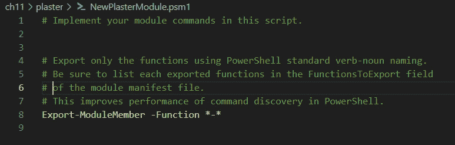

# 创建我们的第一个模块

大多数编程语言都包含库的概念——它是一个包含代码、文档、编程对象（如类）、消息模板以及许多其他内容的对象。这些库通过帮助我们使用他人的代码和重用我们自己的代码，扩展了我们可以用该语言做的事情。在本章中，我们将探讨 PowerShell 模块——一种分发 PowerShell 代码的便捷方式。

我们将从简要回顾如何使用模块以及用于此的 cmdlet 开始。接下来，我们将查看模块的组成部分。我们将学习如何手动编写模块，然后简单介绍一下使用一个名为 **Plaster** 的模块脚手架应用程序。

本章我们将涵盖的主要主题如下：

+   使用模块

+   编写一个简单的模块

+   模块清单

+   使用如 Plaster 这样的脚手架工具

# 使用模块

回到*第二章*，*探索 PowerShell Cmdlet 和语法*，我们花了一些时间探讨了如何使用模块来查找新的 cmdlet。在本章中，我们将编写模块，但首先，让我们回顾一下之前所学的内容，并将其放置在某种上下文中。

模块允许我们重用和分发代码，以便通过将操作模块的 cmdlet 包含在我们的脚本中轻松实现自动化。所以，如果我们需要在脚本中使用 PowerShell 数学模块的 cmdlet，我们可以通过编程方式导入该模块（或仅导入所需的 cmdlet）并使用它。我们可以以可预测且可控的方式进行，而无需用户干预。

模块履行三个基本功能：

+   **配置环境**：它们提供一个可重复的自定义工作环境——例如，Exchange 的 PowerShell 模块，以及特定于 Exchange 的 cmdlet——将 PowerShell 环境配置为以特定方式与 Exchange 协同工作。

+   **代码重用**：它们提供函数库，供我们或他人使用，例如数学模块。

+   **解决方案工程**：因为模块可以嵌套在其他模块中，所以可以将一整组模块分发出去，创建一个应用程序进行再分发——这在 Windows 管理环境中很常见。

我们可以在互联网上找到模块，例如 GitHub，这里有软件发布的模块；也可以在公共仓库（如 PowerShell Gallery）或我们工作场所或学校的内部仓库中找到，或者通过朋友和同事获得。

通过将模块安装到标准位置，我们可以控制在特定机器上的访问权限，或者我们可以将 PowerShell 搜索模块的默认位置列表进行扩展。让我们从查看客户端设备上模块的常见位置开始。

## 模块位置

模块有三个默认位置。这些位置如下表所示：

|  | **Windows** | **Linux** |
| --- | --- | --- |
| **系统** | PowerShell 7 没有此位置，但 Windows PowerShell 使用`C:\WINDOWS\system32\WindowsPowerShell\v1.0\Modules\` | `/opt/Microsoft/PowerShell/7/Modules` |
| **所有用户** |

+   `C:\Program Files\PowerShell\Modules`

+   `C:\Program Files\PowerShell\7\Modules`

| `/usr/local/share/PowerShell/Modules` |
| --- |
| **用户** | `C:\Users\<用户名>\Documents\PowerShell\Modules` | `/home/<用户名>/.local/share/PowerShell/Modules` |

表 11.1 – Windows 和 Linux 中的默认模块位置

系统位置保留给微软模块。用户位置在 Windows 中默认不存在，需要先创建才能使用。`AllUsers`位置在 PowerShell v4 中引入，提供了一个用于需要在系统账户下运行的非微软模块的位置。这也为我们提供了一个为客户端上任何用户安装模块的地方。从 PowerShell Gallery 下载的模块默认放在这里。

正如我们在*第二章*中看到的，*探索 PowerShell Cmdlet 和语法*，我们可以通过操作`$ENV:PSModulePath`变量来添加可能安装模块的位置。位置应在 Windows 中用分号（`;`）分隔，在 Linux 中用冒号（`:`）分隔，如下所示：


图 11.1 – Linux 中的$env:PSModulePath 变量

我们可以通过调用`$env:PSModulePath -Split ":"`变量使此列表更整洁，这将把每个位置输出为单独的一行。显然，在 Windows 客户端上，分隔符应为分号（`;`）。路径在安装应用程序时通常会被添加到此变量中。

## 模块自动加载

在某些情况下，我们可以自动加载模块。位于`$env:PSModulePath`定义的模块路径中，并且文件夹命名正确的模块会被 PowerShell 自动发现。我们可以通过以下方法做到这一点：

+   从模块中运行 cmdlet

+   使用`Get-Command`获取模块中的 cmdlet

+   使用`Get-Help`获取模块中的 cmdlet

模块自动加载在我们交互式地使用 Shell 时非常有用，但在脚本中不应依赖它。推荐的加载模块的方式是在脚本中使用`using`关键字，如下所示：

```
using module <module name>
```

这里有一个示例：

```
Using module ActiveDirectory
```

请注意，关于此内容的一些注意事项已在*嵌套* *模块*部分中讨论。

## 导入模块

自动加载模块非常方便，但它并不是特别可控。例如，它会加载模块中的所有内容，其中一些我们可能不需要，而且我们无法控制加载的模块版本。它还可能占用大量内存。因此，我们可能会选择使用`Import-Module` cmdlet 手动将模块导入会话，这样可以给我们提供几个选项来控制导入的方式和内容：

+   `-Name`：用来指定要导入的模块名称。如果模块不在`$ENV:PSModulePath`指定的模块路径中，我们还可以在此处包含路径。

+   `-Cmdlet`：这个参数允许我们从一个字符串数组中导入一组 cmdlet。类似的参数，如 `-Alias`、`-Function` 和 `-Variable`，也有预期的效果。

+   `-Force`：这个参数强制模块完全重新加载。默认情况下，如果模块已经加载，则 `Import-Module` 不会重新导入它。如果我们在开发模块并需要反复测试它时，这个参数非常有用。

+   `-RequiredVersion`：使用此参数指定要导入的模块版本。

+   `-Prefix`：这个参数会为从模块导入的 cmdlet 中的名词添加前缀，以避免与当前会话中已存在的 cmdlet 混淆。

+   `-NoClobber`：如果 cmdlet 与当前会话中已存在的 cmdlet 同名，这个参数会阻止它们被导入。

还有其他一些参数，但我们在这里不考虑它们。

我们可以使用 `Remove-Module` cmdlet 卸载一个模块。为什么我们可能需要这么做呢？因为当我们第一次导入一个模块时，所有它所依赖的嵌套模块也会被一并导入。然而，如果我们随后使用 `Import-Module -Force` 来重新加载该模块，它只会重新加载指定的模块，而不会重新加载嵌套模块。`Remove-Module` 也会移除嵌套模块。当然，在实际使用中，通常直接启动一个新的会话会更快捷、更清洁。

我们经常会在互联网上看到使用 `Import-Module` cmdlet 使模块内容在脚本中可用的脚本。我自己也这么做，尽管这不是推荐的做法；对我来说，这样看起来更易读。微软推荐我们使用 `using` 关键字来实现这个功能，尽管我也常常忽略这个建议，就像我的医生推荐我少吃盐一样，我也倾向于忽视他的建议。

## PowerShellGet

Microsoft 有一个名为 `PowerShellGet` 的模块，其中包含了大量用于操作仓库和模块的资源。这个模块包含在 PowerShell 7 中。它使我们能够轻松地使用 PowerShell Gallery，这样我们就可以查找、注册和注销其他仓库，从而找到、安装和卸载仓库中的模块和脚本，并且操作这些模块和脚本。我们在*第二章*《探索 PowerShell Cmdlets 和语法》中详细介绍了 `PowerShellGet` 的基本用法。

从 PowerShell 7.4 开始，PowerShellGet v2.2.5 模块将与版本 3 一同发布。版本 3 的模块名为 `Microsoft.Powershell.PSResourceGet`，它将用一个单一的 `Install-PSResource` cmdlet 替代 `Install-Module` 和 `Install-Script` cmdlet，并做出许多其他更改。在 PowerShell 7.4 中，这两个模块将并行发布，允许任何当前使用 `PowerShellGet` 的资源继续工作。然而，不会包含兼容层，因此，除非我们使用将在 PowerShell 7.5 中提供的独立 `CompatPowerShellGet` 模块，否则为 v2.2.5 及更早版本编写的脚本将无法与版本 3 一起使用。

接下来，我们将学习如何创建一个模块，但首先有一个警告。PowerShell 中有一个 cmdlet 叫做`New-Module`。这个命令创建的是一种非常特定类型的模块——`New-Module`。

# 编写一个简单的模块

模块最基本的形式是一个包含函数的脚本文件，文件扩展名为`.psm1`。就这么简单。这是最简单的模块。试试看——将以下内容保存为`.psm1`文件，放在一个与文件同名的文件夹内，位置为你的`\\users\\<username>\\documents\\powershell\\modules`文件夹（或 Linux 中的`home/<user>/.local/share/powershell/Modules`文件夹）：

```
function Get-Square($a) {
  $result = $a * $a
  return $result
    }
```

文件名无关紧要，只要文件和文件夹的名称相同，并且文件夹在模块路径中，以便 PowerShell 能够找到它，就像这样：


图 11.2 – 正确地将模块保存到模块路径中

现在，如果我们启动一个 PowerShell 会话，可以输入以下内容：

```
Import-Module <ModuleName>
```

PowerShell 将加载它。一旦加载完成，我们就可以使用模块内的函数，如下所示：


图 11.3 – 使用我们的第一个模块

如你所见，`Import-Module` cmdlet 没有输出，但模块内的函数是可用的。如果我们运行`Remove-Module`，函数也会消失。或者它真的消失了吗？

活动 1

尝试运行`Remove-Module`来移除我们刚才安装的模块，然后再运行`Get-Square`。会发生什么？为什么会这样？

在我们研究如何创建模块之前，让我们先谈谈 PowerShell 中最早构建库的方法——点来源。

## 提醒一下 – 点来源

在 PowerShell 的第一个版本中，只有一种方法可以在一个脚本中包含另一个脚本中的函数：将`Dot-Source.ps1`放在适当的文件夹中——我使用的是`c:\\temp\\poshbook\\ch11`：

```
Write-Message "dot source test"
```

很明显，如果我们运行这个，肯定无法工作。没有名为`Write-Message`的 cmdlet，而且脚本中也没有定义一个。让我们在另一个脚本中创建一个`Write-Message`函数，并将其保存为`Write-Message.ps1`：

```
$text = "default message"
function Write-Message($text) {
    Write-Output "$text"
}
```

现在，让我们回到`Dot-Source.ps1`，并在开头添加这一行：

```
. C:\temp\poshbook\ch11\Write-Message.ps1
```

更改路径以反映你保存`Write-Message.ps1`的位置。现在，当我们运行`Dot-Source.ps1`时，我们的消息应该会显示出来，如下所示：


图 11.4 – 在脚本中使用点来源

我们也可以通过交互式方式在 PowerShell 会话中做到这一点，只需点来源脚本，如下所示：


图 11.5 – 交互式点来源

那么，如果点源（dot-sourcing）这么简单，为什么我们还需要使用模块呢？原因是点源带来的管理问题。当我们进行点源时，我们将脚本的成员以及变量和函数引入到父作用域中。我们可以在前面的截图中看到这一点；如果我们调用`$text`变量，就会得到`default message`字符串。记住，作用域的概念是为了保护我们免受不明确代码的影响；通过点源代码，我们去除了这种保护。当我们交互式地点源`Write-Message.ps1`时，我们将一个函数带入了全局作用域，而现在我们没有简单的方法将其删除。该脚本中函数外的任何变量也会被引入。如果这些变量命名不当，可能会与现有的重要变量发生冲突，导致“可笑的后果”。

如果我们不确定一个函数的来源，可以使用对象的`File`属性进行检查，像这样：

```
${function:Write-Message}.File
```

这将给我们该函数所在文件的路径。我们还可以使用`Remove-Item` cmdlet 从会话中删除它，如下所示：


图 11.6 – 查找函数来源并删除它们

模块允许我们控制从代码中导出的函数和变量，并将它们作为一个整体进行控制。让我们看看如何将现有的脚本转换为模块。

## 将脚本转换为模块

正如我们在本节开始时看到的，将脚本转换为模块的基本过程是将文件扩展名从`.ps1`更改为`.psm1`。现在，我们来处理之前写的`Write-Message.ps1`脚本，并将其保存为`Write-Message.psm1`。

现在，我们可以打开一个新的会话，并使用以下命令将我们的模块导入到会话中：

```
Import-Module C:\temp\poshbook\ch11\Write-Message.psm1
```

让我们详细查看这个模块：


图 11.7 – `Write-Message`模块的详细信息

在第一行中，我们导入了模块。我们使用了完整路径，因为我们没有将其保存到包含在模块路径中的位置。这是为了防止 PowerShell 自动加载它。现在，让我们运行以下命令：

```
Get-Module Write-Message
```

我们将看到一个脚本模块、它的位置以及导出的命令——也就是`Write-Module`。现在，让我们运行以下命令：

```
Get-Module Write-Message | Format-List
```

我们将看到只有函数被导出，而不是变量。

我们可以使用`Get-Command`检查`Write-Message`函数的详细信息，查看其来源是`Write-Message`模块。

让我们尝试使用这个模块做一些其他事情。打开模块文件并添加以下代码：

```
function setMessage {
    Write-Output "$text"
}
```

再次导入模块，使用`-Force`参数重新加载它。现在，我们的模块中有两个函数。如果我们再次运行`Get-Module`，我们会看到它们都已经显示出来：


图 11.8 – 多重导出

正如你所看到的，`setMessage` cmdlet 现在对我们可用了。如果我们不希望这样会发生什么呢？我们使用的名称不符合 cmdlet 命名约定，通常我们会使用这种命名来表示一个私有函数；它是我们需要在模块内部的其他函数中使用的，但我们不希望它对外部函数可用。我们可以使用`Export-ModuleMember` cmdlet 来控制访问权限。在`Write-Message.psm1`的底部添加以下行：

```
Export-ModuleMember -Function Write-Message
```

然后，使用`-Force`参数再次导入模块。结果如下图所示：


图 11.9 – 控制导出的函数

现在，只有`Write-Message`函数被导出，当我们尝试运行`setMessage`时，这次我们会收到一个错误。我们还可以使用`Export-ModuleMember`来导出模块中的变量和别名，这些默认情况下是不会被导出的，像这样：

```
Export-ModuleMember -variable $MyVariable
```

如果我们没有显式使用`Export-ModuleMember`，模块中的所有函数都会被导出，但除函数外，其他任何内容都不会被导出。

在本章的介绍中，我们提到过模块的一个使用场景：构建应用程序和解决方案。为了实现这一点，我们通常会从一个模块内部调用另一个模块——这就叫做模块嵌套，接下来我们将详细探讨这一点。

## 嵌套模块

在*第九章*《不要重复自己——函数与脚本块》中，我们查看了一些用于将输出写入日志文件的函数。将这些函数写入模块是非常有用的，这样我们在需要时就可以调用它们，而不是每次创建脚本时都要重新编写。这些是我们希望保持私有的函数，而不是为一般用途导出的好例子。我们来做一下这个操作。将之前编写的`Write-Log.ps1`脚本复制到一个名为`Write-Log.psm1`的模块文件中，并放置在合适的位置。我们需要编辑`.psm1`文件，删除以下行：

```
Write-Log "Is this thing on?"
```

这是我的模块文件的样子：


图 11.10 – Write-Log.psm1 模块

如我们所见，我注释了第 11 行，而不是删除它。剩下的两个函数和一个变量是`Write-Log`、`Remove-Log`和`$LogFile`。

现在我们可以在`Write-Message.psm1`模块中添加几行代码，以便调用`Write-Log`模块并运行其中的某个函数。像这样编辑你的`Write-Message`函数：

```
Import-Module "C:\temp\poshbook\ch11\write-log.psm1"
$text = "default message"
function Write-Message($text) {
    Write-Output "$text"
    Write-Log "$text"
}
function setMessage {
    Write-Output "$text"
}
```

我已添加了第一行来导入`Write-Log`模块，第五行用于从中调用`Write-Log`函数。我还删除了`Export-ModuleMember`行。现在，让我们看看当我们导入`Write-Message`模块时会发生什么：


图 11.11 – 嵌套模块

如我们所见，模块如之前一样被导入并按预期工作。我们可以从 `Get-Module` 的输出中看到有四个导出的函数——两个来自 `Write-Message`，两个来自 `Write-Log`——并且我们可以看到 `Write-Log` 模块是嵌套的。然而，当我们尝试通过 `Get-Command` 访问它时，我们看不到任何已加载的函数，且 `Get-Module Write-Log` 不返回任何内容。不过，如果检查创建的日志文件，我们会看到一条消息，表明 `nested module test`，所以它是有效的。

这是因为嵌套模块仅对调用模块可见，因此我们不能直接访问 `Write-Log`。然而，由于我们移除了 `Export-ModuleMember` 这一行，所有函数都会被导出，包括嵌套模块中的函数；它们将作为调用模块的函数出现。如果我们使用 `Get-Module -All`，我们将能够看到 `Write-Log` 模块，并且可以像以前一样找到 `Write-Log` 函数的实际位置——即通过调用 `File` 属性：


图 11.12 – 查找嵌套模块

如我们所见，`Write-Log` 函数定义在 `write-log.psm1` 文件中。

有时，我们可能不希望嵌套模块像这样被隐藏；如果是这样，我们可以使用 `Import-Module` 的 `-Global` 参数，像这样：

```
Import-Module -Global "C:\temp\poshbook\ch11\write-log.psm1"
```

`Write-Log` 模块将与 `Write-Message` 模块处于同一顶级导入状态。

现在，让我们来看一些其他类型的模块，包括二进制模块和清单模块。

## 更多模块

你可能注意到，当我们在模块中创建一个函数时，我们像使用 cmdlet 一样使用它，但它仍然被称为函数。它会像 cmdlet 一样行为，具有参数、帮助、成员等等，但它并不是 cmdlet。考虑以下内容：


图 11.13 – 函数和 cmdlet

如我们所见，`Write-Message` 是 `Function` 类型，而微软的 `Get-Service` 命令是 `Cmdlet` 类型。

要编写自定义 cmdlet，我们需要编写一个二进制模块。请记住，PowerShell 基于 .NET，是一种解释型语言，通常使用编译语言（如 C#）编写，就像 Python 是一种解释型语言但用 C 编写一样。

我们不会在这里讨论如何编写 C# 模块，但我们会讨论它们是如何工作的以及如何使用它们。

二进制模块没有 `.psm1` 扩展名 —— 它是一个从 C# 等代码编译而成的 .NET 程序集，具有 `.dll` 扩展名。我们可以通过在 `@" "@` 结构中的 `Here-String` 声明中编写 C# 代码，然后使用 `Add-Type -OutputAssembly` cmdlet 来编译它：

```
$code = @"
using System.Management.Automation;
namespace SendMessage
{
    [Cmdlet(VerbsCommunications.Send, "Message")]
    public class SendMessageCommand : Cmdlet
    {
        [Parameter(Mandatory = true)]
        public string Name { get; set; }
        protected override void ProcessRecord()
        {
            WriteObject(Name + " loves PowerShell!");
        }
    }
}
"@
Add-Type -TypeDefinition $Code -OutputAssembly  c:\temp\MyBinaryModule.dll
```

除此之外，我们可以像使用脚本模块一样，使用 `Import-Module` 导入它：

```
Import-Module c:\temp\MyBinaryModule.dll
```

如果我们运行 `Get-Module` 来查看虚构的 `MyBinaryModule`，我们会看到 `ModuleType` 是 `Binary`，并且它导出了 cmdlet，而不是导出函数。

二进制模块和脚本模块之间的主要区别在于，一旦它们被加载到会话中，就无法卸载。如果我们需要更改正在编写的二进制模块，则需要先关闭 PowerShell。

我们可能还会看到用 CDXML 编写的 PowerShell 模块，CDXML 是一种用于公共信息模型命令的 XML 包装器。这种方式在 Windows 管理模块中曾经很常见，但现在已经大多被弃用，因为用这种方式编写的模块比脚本模块加载和运行速度慢，因为需要额外的工作将 XML 解析到 PowerShell 中，然后 PowerShell 还需要进一步解析。正如官方文档所言，"*避免使用 CDXML*。"类似地，我们可能会看到有关 PowerShell SnapIns 的引用。这些是 Windows PowerShell 的已弃用形式，在 PowerShell 7 中不再支持，因此我们不需要担心它们。

还有一种模块类型需要我们考虑——清单模块。清单模块是一个包含模块清单的脚本或二进制模块。接下来我们将讨论这个内容。

# 模块清单

到目前为止我们操作的脚本模块是单一文件，要么是独立的，要么是嵌套的。这对于个人使用来说没有问题，但在生产环境中，这样做就不太合适了，因为我们可能需要将函数拆分成多个文件，并且包括版本信息和其他大量的元数据与资源，如 XML 格式文件或二进制文件。为了组织一个更复杂的模块，我们需要一个文档来说明如何加载和实现它；这个文档被称为模块清单，它是一个哈希表，保存为 `.psd1` 扩展名的文件。让我们来看一个例子。如果我们浏览到 `C:\Program Files\PowerShell\7\Modules`（或者在 Linux 上是 `/opt/microsoft/PowerShell/7/Modules`）中的 PowerShellGet 模块，我们将看到以下文件和文件夹：


图 11.14 – PowerShellGet 模块

如我们所见，有四个文件和三个文件夹。这些文件夹包含几个 `.psm1` 和 `.psd1` 文件，用于定义函数和嵌套模块的清单。模块的主要代码在 `PSModule.psm1` 中。`PSGet.Format.ps1xml` 包含用于显示函数输出的格式化信息。`PowerShellGet.psd1` 是模块清单。`PSGet.Resource.psd1` 是模块使用的一组输出字符串；我们在此不做过多考虑。如果我们打开 `PSModule.psm1` 文件，会看到它是用 PowerShell 编写的，而不是 C#，因此它是一个脚本模块。这是一个较大的文件，定义了很多函数。我们来看看 `PowerShellGet.psd1` 文件。

首先要注意的是，它被赋予了与其所在文件夹相同的名称。这是故意的；如果在模块文件夹中存在清单文件，它必须与文件夹的名称相同；否则模块将无法加载。如果没有清单，`.psm1` 文件也采用相同的名称，这允许 PowerShell 容易地找到它并自动加载，但除此之外这并不重要。清单文件则不同。

让我们打开它，看看里面是什么：


图 11.15 – PowerShellGet 清单

在第 1 行，我们可以看到这是一个从 `@{` 开始的哈希表，之后的内容都采用键值对格式。如我们所见，这是一个长文件，包含了大量信息；超过 200 行，尽管其中许多部分是包含 `ReleaseNotes` 键的大段文本。

一个清单由多达 37 个不同的键值对组成，这些键值对可能包含字符串或数组。我们可以向清单中添加额外的代码，包括比较运算符、算术运算符、基本数据类型和 `if` 语句，但我们在这里不涉及这些内容；我从未需要这么做。让我们为自己创建一个新的清单，看看里面有什么。

在合适的目录中创建一个名为 `ManifestModule` 的文件夹。现在，打开 PowerShell 会话并输入以下 cmdlet：

```
New-ModuleManifest
```

在提示符下，提供新清单文件的路径和名称，如下所示：

```
C:\temp\poshbook\ch11\ManifestModule\ManifestModule.psd1
```

就是这样——这将为名为 `ManifestModule` 的模块创建一个新的清单文件。让我们在 VS Code 中打开它：


图 11.16 – 基本模块清单

首先需要注意的是，一些值已经为你生成。`ModuleVersion` 是 `0.0.1`，还有一个自动生成的 `GUID` 用以确保这个模块与同名的其他模块可以区分开，且 `Author`、`CompanyName` 和 `Copyright` 键已被填充。除此之外，其他部分为空，且通常已被注释掉。

清单中的键分为三组，涵盖以下几个方面：

+   **生产数据**：谁编写了它，何时编写，给谁用，及其运行的系统类型。

+   `RootModule` 定义了调用其他所有内容的主模块文件——主 `.psm1` 文件。

+   **模块内容**：这些是模块中包含的所有模块、文件和其他资产的列表。这些键是可选的，但通常应该准确地填充。

我们可以通过调用 `New-ModuleManifest` cmdlet 并将键名作为参数来填充这些键：

```
New-ModuleManifest -Path 'C:\temp\newmodule\newmodule.psd1' -ModuleVersion '1.0.0'
```

另一种方法是直接在文本编辑器或 VS Code 中编辑清单文件。如果我们直接编辑，始终有可能打错某些内容并破坏文件，因此最好像这样测试我们编辑过的清单：

```
Test-ModuleManifest -Path 'C:\temp\newmodule\newmodule.psd1'
```

我们可以在下图中看到结果：


图 11.17 – 测试模块清单文件

如果返回了模块的信息，那么文件已经正确格式化。

正如我们所看到的，模块构建可能会迅速变得复杂。让我们通过查看一个可以让它变得简单得多的工具——Plaster，来结束这一章。

# 使用诸如 Plaster 之类的脚手架工具

如果我们长期在一个模块上工作，或者与他人协作，那么使用一个将所有内容拆分成单独文件和资产的框架是一个非常好的主意。这就是脚手架工具发挥作用的地方。我的选择是 Plaster，这是一个最初由 Microsoft 制作的模块，现在由 PowerShell.Org 维护，PowerShell.Org 是一个最具影响力的 PowerShell 社区之一。

Plaster 使用一个模板文件，该文件由一个清单（类似于模块清单）和一组内容文件及目录组成。模板使用 XML 编写，且高度可定制。清单文件分为三个部分：

+   元数据，包含有关模板的信息，如名称、版本和作者

+   参数，定义了用户可以在模块结构中做出的选择——创建和包含哪些文件和文件夹

+   内容，指定 Plaster 将执行的操作——复制文件、修改文件、检查是否已安装必要的模块。

让我们从 PowerShell Gallery 安装模块。输入以下内容以下载模块：

```
Install-Module Plaster
```

我们可能需要确认 PowerShell gallery 是一个不受信任的仓库。现在，让我们导入模块：

```
Import-Module Plaster
```

就这样——我们已经准备好了。让我们看看我们得到了什么：


图 11.18 – 检查 Plaster 模块

正如我们所看到的，我们已安装了版本 1.1.4 的模块，并且有了四个新的命令可以使用：

+   `Get-PlasterTemplate`：列出我们可以使用的现有模板。我们可以编写或下载 XML 格式的模板文件。这里只包含了两个模板，而我们需要的是 `NewPowerShellScriptModule`。

+   `Invoke-Plaster`：运行 Plaster 脚手架工具。

+   `New-PlasterManifest`：此命令创建一个新的清单文件。

+   `Test-PlasterManifest`：此命令测试清单文件是否正确格式化。

让我们运行它，看看会得到什么：

```
Get-PlasterTemplate
```

然后，复制 `NewPowerShellScriptModule` 的路径。现在，输入以下内容：

```
Invoke-Plaster
```

系统会询问你默认模板的路径以及目标路径；这个路径需要是文件夹，而不是文件。

你还需要提供模块的名称和版本，以及是否希望将 VS Code 设置为默认编辑器。对我而言，它是这样的：


图 11.19 – 调用 Plaster

正如我们所看到的，我的沙箱机器缺少一个必要的模块——Pester。Pester 是一个让单元测试和测试驱动开发变得非常简单的模块，但这超出了本书的范围。

让我们看看目标路径中创建了什么：


图 11.20 – 使用默认 Plaster 模板创建的模块

如我们所见，Plaster 已经创建了两个文件——一个脚本模块文件和一个模块清单文件——一个用于测试脚本的文件夹，以及一个用于 VS Code 设置的文件夹。

`NewPlasterModule.psm1`文件如下所示：



图 11.21 – 一个由 Plaster 生成的基础模块文件

如我们所见，这非常简单，但它包含了一个很棒的技巧——如果文件中的函数按照标准的 cmdlet 命名约定命名，比如`Verb-Noun`，那么它们将被导出。如果不是，比如我们在本章前面写的`setMessage`函数，那么它们将不会被导出。很整洁。

Plaster 的美妙之处在于它的可扩展性；编写模板来创建公共和私有函数及类的文件夹结构非常简单，并且这一切都可以以可重复的方式完成。为了了解 Plaster 的多功能性，可以查看 Kevin Marquette 的博客：[`powershellexplained.com/2017-05-12-Powershell-Plaster-adventures-in/`](https://powershellexplained.com/2017-05-12-Powershell-Plaster-adventures-in/)以及他的 GitHub 页面：[`github.com/KevinMarquette/PlasterTemplates`](https://github.com/KevinMarquette/PlasterTemplates)。不妨尝试一下他的示例模板。

这就是我们将要涉及的关于 Plaster 的内容——还有其他几种脚手架模块可用，如果你不喜欢 Plaster，可以看看其他的模块。这也标志着本章的结束；让我们回顾一下我们所做的。

# 总结

我们从回顾前几章关于模块的内容开始，并将其放入一个更正式的背景中。我们查看了标准的模块位置，并学习了如何通过编辑`$ENV:PSModulePath`变量来添加位置。我们了解了 PowerShell 如何利用这些位置来促进自动加载，以及有时我们可能不希望发生这种情况。接着，我们研究了如何手动导入模块，并通过查看`PowerShellGet`模块结束了我们的复习。

之后，我们开始编写自己的模块。我们从查看最早的代码导入方法——点源（dot-sourcing）开始，并了解了为什么这可能是一个糟糕的主意。接着，我们通过编写脚本并将其转换，创建了我们的第一个模块。然后，我们研究了如何通过嵌套模块来构建应用程序，接着讨论了其他类型的模块，如二进制模块。

然后，我们研究了最常见的复杂模块类型——清单模块。我们了解了清单文件如何控制加载和导出的内容，以及如何编写和测试清单文件。最后，我们看了一个可以使编写模块变得更加简单的工具——Plaster。

在下一章中，我们将讨论 PowerShell 的安全性方面，以及如何最好地保护自己、同事和用户，使用如此强大的工具。

# 练习题

以下是本章的练习题：

1.  如何列出当前 PowerShell 会话中所有已导入的模块？

1.  导入模块时，`-Global` 参数的作用是什么？

1.  如何导入一个不在 `$ENV:PSModulePath` 变量指定路径中的模块？

1.  我们想导入一个包含与我们会话中已存在的 cmdlet 同名的函数的模块。我们可以通过哪两种方式解决这个问题？

1.  默认情况下，模块的所有函数都会被导出。我们可以通过哪两种方式控制导出的函数？

1.  模块清单中 `HelpInfoURI` 键的作用是什么？

1.  扩展名为 `.ps1xml` 的文件可能包含什么内容？

1.  如果我们加载一个扩展名为 `.dll` 的模块，我们会得到什么样的命令？

1.  为什么我们不编写 CDXML 模块？

# 进一步阅读

要了解更多本章涵盖的主题，请查看以下资源：

+   `PowerShellGet` 及其替代品：

    +   [`devblogs.microsoft.com/powershell/powershellget-in-powershell-7-4-updates/`](https://devblogs.microsoft.com/powershell/powershellget-in-powershell-7-4-updates/)

    +   [`learn.microsoft.com/zh-cn/powershell/module/microsoft.powershell.psresourceget/?view=powershellget-3.x`](https://learn.microsoft.com/zh-cn/powershell/module/microsoft.powershell.psresourceget/?view=powershellget-3.x)

    +   [`learn.microsoft.com/zh-cn/powershell/module/powershellget/?view=powershellget-2.x`](https://learn.microsoft.com/zh-cn/powershell/module/powershellget/?view=powershellget-2.x)

+   编写模块清单：[`learn.microsoft.com/zh-cn/powershell/scripting/developer/module/how-to-write-a-powershell-module-manifest`](https://learn.microsoft.com/zh-cn/powershell/scripting/developer/module/how-to-write-a-powershell-module-manifest)

+   Plaster: [`powershellexplained.com/2017-05-12-Powershell-Plaster-adventures-in/#template-folder-and-file-structure`](https://powershellexplained.com/2017-05-12-Powershell-Plaster-adventures-in/#template-folder-and-file-structure)
