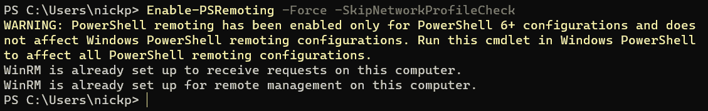
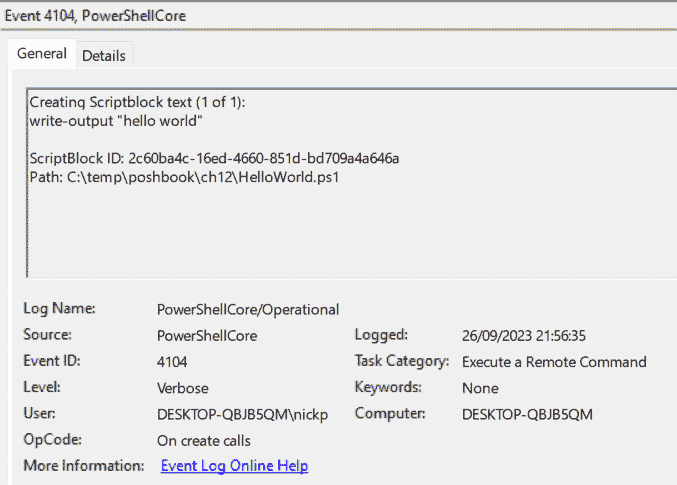

# 加固 PowerShell

正如我们所见，PowerShell 是一个极其强大的工具，引用本·叔叔的话：“*伟大的力量伴随着伟大的责任*。”如果你不知道本·叔叔是谁，可以问问你身边的蜘蛛侠。PowerShell 能够在系统或组织内造成巨大的破坏。这种破坏可以是故意的，由某人故意制造损害，但同样也可能是无意的。

本章将从 PowerShell 的一个强大特性——PowerShell 远程功能开始讲解。接下来我们将介绍 PowerShell 如何防止无意的错误，然后继续讨论 PowerShell 中可以保护我们免受故意攻击的功能。随后，我们将探索 PowerShell 提供的功能，这些功能能够通过日志分析机器上发生的事件，最后总结我们可以采取的措施来提升编写代码的安全性。由于 PowerShell 与 Windows 的历史关系，其中许多功能仅限于 Windows，或者在 Windows 中得到了更充分的开发。当出现这种情况时，会特别提及。

本章将涵盖的主要主题如下：

+   为什么安全性如此重要？

+   防止无意错误对 PowerShell 的影响

+   安全地运行 PowerShell

+   PowerShell 日志记录

+   编写安全代码

# 为什么安全性如此重要？

我们已经看到 PowerShell 是多么强大，但还没有看到它为何如此危险。到目前为止，我们所做的一切都需要在我们使用的客户端进行交互式登录，这意味着在攻击之前，某人需要物理访问设备。然而，PowerShell 有一个概念叫做 **PowerShell 远程功能**，它允许我们登录到远程设备并像在现场一样执行 PowerShell 代码。这就是它成为如此强大管理工具的原因。虽然本书不会详细讨论远程功能，因为它主要是管理员工具，但了解基础概念仍然很重要。让我们仔细看一看。

## PowerShell 远程功能速览

许多较老的 Windows PowerShell cmdlet 都有一个 `-ComputerName` 参数，它允许 PowerShell 查询远程机器的信息。这个参数的问题在于，它依赖于我们运行 PowerShell 会话时所使用的凭据必须具备查询远程机器的权限。如果我们幸运的话，cmdlet 会有一个 `-Credential` 参数，允许我们提供其他凭据。然而，很多时候我们并不幸运；请参见以下截图。


图 12.1 – Get-Process 不走运

如我们所见，`Get-Process` cmdlet 没有`-Credential`参数，因此我们只能希望我们的会话凭据在远程计算机上有效。如果我们在 PowerShell 会话中没有正确的凭据，就无法在远程计算机上运行`Get-Process`。即便我们有正确的凭据，远程防火墙也很可能会阻止该请求。在 PowerShell 7.2 及更高版本中，它也没有`–ComputerName`参数。

为了绕过这个问题，PowerShell 远程连接是在 Windows PowerShell 3.0 中开发的。它使用`5985`（HTTP）和`5986`（HTTPS）端口，这意味着它可以使用 SSL 加密。在使用 Active Directory 的企业配置中，流量也会被加密，使用的是 Kerberos。显然，Linux 机器不包括 WinRM，因此 PowerShell 7.x 版本贴心地包括了通过 SSH 运行远程会话的支持。我们将在本章的*安全运行 PowerShell*部分中更详细地讨论这一点。现在我们来看看 PowerShell 远程连接在 Windows 环境中的工作方式；我们将从启用 PowerShell 远程连接开始。请注意，我在一台 Windows 10 客户端上运行此操作，并创建了一个名为`Admin`的新本地用户，并为其设置了密码和管理员权限。

## 启用 PowerShell 远程连接

默认情况下，PowerShell 远程连接在所有 Windows 服务器上启用。然而，它在 Windows 客户端上是禁用的。让它运行的最简单方法是使用`Enable-PSRemoting` cmdlet。这个 cmdlet 做了我们需要做的一切，从启用端点到创建正确的 Windows 防火墙规则。此命令需要从提升的管理员提示符中运行。看看下面的截图：



图 12.2 – 启用 PowerShell 远程连接

如我们所见，我已使用几个常见参数运行了`Enable-PSRemoting`。`-Force`参数表示我们不会被反复询问是否确定要执行此操作，我们之前也见过这种用法。不过，`-SkipNetworkProfileCheck`是一个比较有趣的参数。许多人没有在独立客户端上配置网络配置文件，默认的网络类型是公共网络。然而，默认情况下，PowerShell 远程连接无法在公共网络上运行。使用`-SkipNetworkProfileCheck`可以跳过网络配置文件检查，但会创建一条防火墙规则，仅允许来自本地子网的远程会话。这个规则可以很容易地进行编辑，但最好还是正确设置网络配置文件，或者避免在公共网络上尝试运行远程会话。

## 创建会话

现在我们已经在客户端上设置了远程连接，让我们创建一个会话。我们可以使用`New-PSSession` cmdlet 来完成。我将把我的`Admin`用户凭据存储在名为`$cred`的变量中，然后像这样运行它：

```
New-PSSession -ComputerName localhost -Authentication Negotiate -Credential $cred
```

我们可以看到这里得到的输出：


图 12.3 – 创建新的远程连接会话

这将创建一个持久会话，可以根据需要连接和断开连接。

## 加入和退出会话

我们可以使用`Enter-PSSession` cmdlet 连接到一个会话，方法如下：

```
Enter-PSSession -Name <session name>
```

我们创建的会话是一个 PowerShell 对象（和 PowerShell 中的其他一切一样），因此我们也可以通过将会话传递给管道来进入：

```
Get-PSSession -Name <session name> | Enter-PSSession
```

这是我机器上的运行效果：


图 12.4 – 进入和退出远程会话

在第一个命令中，我通过名称调用了会话。在第二个命令中，我将会话对象传递给了`Enter-PSSession`。我使用`exit`关键字退出了会话。请注意，一旦进入会话，PowerShell 提示符会更改为反映我连接的客户端的`ComputerName`以及远程工作目录。

这称为一对一远程会话。一旦进入这种会话，就等同于直接连接到远程机器。只有远程机器上的 PowerShell 模块可用。

我们也可以通过不指定现有会话来进入临时会话；相反，我们指定计算机名称和凭证，像这样：

```
Enter-PSSession -ComputerName <name> -Credential <credential>
```

正如我们所看到的，通过这种方式创建的会话在退出时会消失，而不是保持存在：


图 12.5 – 临时远程会话

在前面的截图中的第一个命令里，我创建了一个临时会话，然后通过`exit`退出。正如我们所看到的，当我输入`exit`后，会话不再可用，在最后的命令中我运行了`Get-PSSession` cmdlet。

要移除持久化会话，我们可以将会话名称传递给`Remove-PSSession`，像这样：

```
Remove-PSSession –Name <session name>
```

或者，我们将会话对象通过管道传递：

```
Get-PSSession -Name <session name> | Remove-PSSession
```

如果我们运行前面的`Get-PSSession` cmdlet，但不指定会话名称，那么所有会话都会被移除。

## 一对多会话

我们还可以通过使用`Invoke-Command` cmdlet，在多台机器上同时运行命令和脚本，方法如下：

```
Invoke-Command -ComputerName <name 1>, <name 2> -ScriptBlock {Get-Service}
```

这将把脚本块中的命令或脚本应用于`-ComputerName`参数中指定的计算机名称列表。这个命令使用 PowerShell 远程功能，和之前的`PSSession` cmdlet 一样。

能够在远程机器上运行命令，使得 PowerShell 成为一个极其有用的管理工具，但遗憾的是，这也意味着它存在一定的安全风险。现在，让我们来看看如何防止 PowerShell 造成问题。

# 保护 PowerShell 免受无意错误的影响

我们首先要介绍的一组工具是那些能保护我们避免因为操作失误而造成问题的工具。其中最有用的工具之一是一个内置的执行策略，它可以用来控制脚本的运行方式。

## 执行策略

我们在*第八章*中遇到了执行策略功能，*编写我们的第一个脚本——将简单的 Cmdlet 转换为可重用代码*，并提到我们将在本章中更详细地介绍它。执行策略是一个安全功能，控制我们如何运行脚本，但仅适用于 Windows 环境。Don Jones（那位 Don！）曾描述执行策略的目的是“*…减缓一个没有经验的用户，防止他无意中运行一个不受信任的脚本*”。这句话里有很多无意的成分。执行策略会给有知识的用户带来一些障碍，他们是故意运行脚本的。防止用户运行潜在破坏性脚本的最佳方法是确保他们没有执行脚本中命令的权限。我曾在客户环境中看到，域管理员帐户数量达到数百个，其中许多多年未使用，但仍然启用。这些客户的问题比 PowerShell 的执行策略要大得多。

执行策略有不同的安全级别，并且应用于不同的作用域。级别由脚本的来源决定，以及它是否由受信任的证书颁发机构的代码签名证书签名；我们将在本章的*签名脚本*部分讨论代码签名证书。首先，让我们看看这些级别：

+   `Restricted`：这是 Windows 客户端计算机上的默认策略，禁止运行脚本，包括格式化文件和模块——任何扩展名为 `.ps1xml`、`.psm1` 或 `.ps1` 的文件。可以在终端运行单个命令，但仅此而已。

+   `AllSigned`：此级别允许运行由受信任发布者签名的脚本；这包括在计算机上编写的脚本。如果脚本没有签名，则不能运行。如果它是由不受信任的发布者签名，PowerShell 将提示用户。显然，如果脚本是恶意的并且已签名，它仍然可以运行。

+   `RemoteSigned`：来自本地计算机之外的脚本需要数字签名，但在本地计算机上编写的脚本不需要。显然，有许多隐蔽的方式可以绕过这一点，可能涉及打开记事本并使用复制粘贴。这是 Windows 服务器计算机的默认策略。

+   `Default`：这是设置默认策略的选项。在 Windows 客户端上，默认策略是 `Restricted`。在 Windows 服务器上，默认策略是 `RemoteSigned`。

+   `Undefined`：这将移除当前作用域上设置的任何执行策略。如果我们在所有作用域上使用此策略，那么结果将是默认策略，如前所述。

+   `Unrestricted`：这是非 Windows 计算机上的默认策略。来自任何地方的未签名文件都可以运行；用户在运行未来自本地网络的脚本时，可能会收到警告。

+   `Bypass`：不阻止任何操作，也没有警告。执行策略被忽略。可以通过调用 `pwsh.exe` 程序的 `-ExecutionPolicy` 参数来设置。我们可以在下图中看到这种情况：


图 12.6 – 绕过执行策略

如我们所见，执行策略仅在 `pwsh.exe` 进程级别被绕过，但在其他作用域中保持默认设置。当该 `pwsh` 进程结束时，执行策略绕过将失效。

接下来，让我们考虑可以应用执行策略的作用域。

如我们在*图 12.6*中所见，我们可以在五个作用域中应用执行策略。每个作用域具有不同的优先级。`MachinePolicy` 和 `UserPolicy` 作用域只能在组策略中设置——这是 Windows Active Directory 的一项功能。组策略是一个用于集中控制用户和机器配置的企业应用程序，我们在这里不需要过多关注它。这里有一篇关于组策略的优秀入门文章：[`techcommunity.microsoft.com/t5/ask-the-performance-team/the-basics-of-group-policies/ba-p/372404`](https://techcommunity.microsoft.com/t5/ask-the-performance-team/the-basics-of-group-policies/ba-p/372404)。

作用域有优先级顺序，较低级别的作用域会被较高级别的作用域覆盖。作用域的优先级从高到低依次为：

+   `MachinePolicy`：此作用域通过组策略设置，适用于机器上的所有用户。

+   `UserPolicy`：此作用域通过组策略设置，适用于机器的当前用户。

+   `Process`：此作用域指当前的 PowerShell 会话。没有与之关联的注册表位置；它由 `$env:PSExecutionPolicyPreference` 变量的内容控制。当会话关闭时，变量的内容会被移除。

+   `CurrentUser`：此作用域仅适用于当前用户，并存储在 Windows 注册表中，这是一个包含机器设置的数据库。

+   `LocalMachine`：此作用域适用于机器上的所有用户，也存储在注册表中。

在*图 12.6*中，我们可以看到作用域按优先级顺序列出。由于在 `MachinePolicy` 和 `UserPolicy` 级别的执行策略是 `Undefined`，因此有效的执行策略是 `Bypass`，它定义在 `Process` 级别。

我们可以与执行策略一起使用的两个 cmdlet 是 `Get-ExecutionPolicy` 和 `Set-ExecutionPolicy`，我们在*第八章*，*编写我们的第一个脚本 – 将简单的 Cmdlet 转化为可重用的代码*中见过。接下来，让我们简要地了解 PowerShell 的另外两个旨在帮助防止错误的功能。

## 其他功能

这些功能仅防止有人不小心运行脚本。首先，PowerShell 扩展名（如`.ps1`）默认与记事本关联，而不是作为可执行文件。这意味着如果有人不小心双击一个脚本，它会在记事本中打开，而不是直接运行。这与早期的 Windows 脚本文件（如批处理文件和 Visual Basic 脚本文件）不同，后者如果双击会直接执行。

另一种防止意外执行的保护措施是，PowerShell 不会在当前文件夹中搜索脚本文件，因此必须提供相对路径或绝对路径才能在终端提示符下运行脚本，例如这样：


图 12.7 – 绝对路径和相对路径

在第一行，我使用了绝对路径来调用一个名为`HelloWorld.ps1`的脚本，脚本输出`hello world`。在第二行，我切换到包含该脚本的文件夹，第三行，我尝试通过使用`HelloWorld`来调用它，这对 Windows 识别为可执行的程序（如批处理文件）有效，但对 PowerShell 脚本无效。注意 PowerShell 是如何友好地告诉我哪里出错了的。第四行，我通过在脚本名称前加上`.\`来使用相对路径调用它，成功运行了。

过去，PowerShell 的安全性就是这样了。幸运的是，在最近的版本中，添加了很多新的功能，这些功能更加主动。让我们来探讨一下如何安全地运行 PowerShell。

# 安全地运行 PowerShell

PowerShell 有几个功能可以主动提高我们环境的安全性。我们先来看一下应用程序控制。

## 应用程序控制

应用程序控制解决方案可以防止未经授权的应用程序运行。市面上有第三方应用程序，如 Trellix，但 Windows 10 及更高版本自带了两种内置应用程序——**Windows Defender 应用程序控制**（**WDAC**）和 AppLocker。这些可以用来创建策略，强制执行允许执行的应用程序白名单，并阻止其他任何应用程序运行。由于 AppLocker 不再进行开发，因此推荐使用 WDAC。这些解决方案主要用于企业环境，并允许集中控制。我并不清楚有任何能够与 Linux 或 macOS 上的 PowerShell 一起使用的解决方案。当 PowerShell 在默认的 WDAC 策略下运行时，受信任的模块和脚本将比不受信任的模块和脚本获得更多的访问权限，这得益于一种叫做语言模式的功能。

## 语言模式

语言模式用于控制如何在受应用程序控制策略影响的 PowerShell 环境中运行脚本。值得注意的是，网上有很多文章展示了如何通过变量设置语言模式；这只是用于测试代码在特定模式下的表现，并不安全，正如我们接下来所说的那样。根据微软的说法，唯一能够通过语言模式来强制执行安全策略的方法是通过像 WDAC 这样的应用程序。共有三种语言模式：

+   `FullLanguage`：当未在应用程序控制策略下运行时，这是默认模式。

+   `ConstrainedLanguage`：这会阻止创建和使用某些 .NET 类型，并限制从 PowerShell 访问 C# 代码。它还限制了对诸如 `ScheduledJob` 等功能的访问。许多脚本在受限语言模式下无法运行；它们需要签名，并且发布授权机构需要被添加到白名单中。

+   `NoLanguage`：此模式完全禁用 PowerShell 脚本。只能运行本地命令和 cmdlet。`New-Object` 也被禁用。

我们可以通过调用 `$ExecutionContext.SessionState.LanguageMode` 变量来检查会话的语言模式，如下所示：


图 12.8 – 获取和设置语言模式

在第一行，我调用了变量，可以看到语言模式已设置为 `FullLanguage`。然后，我将变量设置为 `ConstrainedLanguage`；我们可以看到，当我再次调用该变量时，它已被设置为 `ConstrainedLanguage`。不幸的是，当我尝试在第三行将其恢复为 `FullLanguage` 时，失败了，因为我们处于 `ConstrainedLanguage` 模式，访问变量的权限受限。解决此问题的最简单方法是关闭会话并重新打开一个新的会话；语言模式会恢复为 `FullLanguage`。如我们之前所讨论的，设置这个变量并不能使 PowerShell 更加安全。

## 安全服务标准

PowerShell 受微软的 Windows 安全服务标准影响，因此当检测到漏洞时，某些功能会收到安全更新。不幸的是，这些仅在 Windows 上操作的功能，如执行策略和应用程序控制，才会受到影响。

## 软件材料清单

**软件材料清单**（**SBOM**）通过识别软件创建过程中使用的每个资源，帮助为软件提供透明性、完整性和身份验证，并提供可以用于将软件与已知漏洞关联的代码签名和软件身份。许多政府要求使用 SBOM，以响应 2020 年的 SolarWinds 供应链攻击。这适用于 Windows 和 Linux/Mac。

## Windows 防恶意软件扫描接口支持

PowerShell 将脚本块和.NET 调用传递给 Windows **反恶意软件扫描接口**（**AMSI**）API，以便反恶意软件应用程序（如 Windows Defender）可以检查是否存在恶意代码。这是一个仅适用于 Windows 的功能。

## 安全外壳（SSH）远程访问

SSH 协议是一种加密协议，它支持在不安全的网络上提供安全的网络服务。它是跨平台的，能够在 Windows 和 Linux/Mac 系统上运行。它依赖于公钥加密；我们需要生成一对密钥，并将公钥传递给我们想要远程连接的系统。随后当我们打开会话时，我们指定私钥在本机上的路径，SSH 会验证远程机器上的公钥是否与本地私钥配对。私钥在任何时候都不会通过网络传输。虽然设置过程相当复杂，但一旦设置完成，使用 SSH 非常简单。

## 足够的管理权限

`Get-Process`，采用最小权限原则，排除其他一切进程运行，这意味着它们将无法运行`Start-Process`。我们还可以配置端点使用虚拟的特权账户，这样用户就不需要管理员账户来运行命令了。这使我们能够大幅度减少拥有管理员权限账户的用户数量。

正如我们所见，几乎所有这些功能仅适用于 Windows 环境。幸运的是，所有使用 Linux 的人都完全值得信任。让我们来看看可以使用的功能，以便了解 PowerShell 的用途——日志记录。

# PowerShell 日志记录

PowerShell 有多种方式来记录我们使用它的操作。在本节中，我们将介绍其中的三种：肩膀旁的日志记录、深度脚本块日志记录和模块日志记录。

## 肩膀旁的日志记录

PowerShell 可以记录会话的转录，通过使用`Start-Transcript`和`Stop-Transcript`命令。转录功能会记录屏幕上显示的所有内容。这对于记录我们所做的操作和获得的输出，并与他人分享非常有用。

我们可以使用`-Path`参数设置转录文件的保存路径，并使用`-Append`参数向现有转录文件添加内容，后接现有转录文件的名称和路径。`-InvocationHeader`参数记录每个命令运行的时间。当我们想停止记录时，可以使用`Stop-Transcript`命令。

在较早版本的 PowerShell 中，我们需要进行一些操作才能确保转录功能开启，即使如此，它也仅会记录控制台中的交互式会话，但现在情况已经不一样了。我们可以通过使用组策略或编辑位于 `$pshome` 位置的 `powershell.config.json` 文件来在 Windows 系统中启用自动转录功能——在 Windows 中，该位置是 `C:\Program Files\PowerShell\7`。编辑配置文件适用于 Windows 和 Linux/Mac，尽管你可能需要先创建该文件。要启用转录功能，我们需要将以下 JSON 添加到文件中：

```
{
    "Transcription": {
        "EnableTranscripting": true,
        "EnableInvocationHeader": true,
        "OutputDirectory": "c:\\Temp\\MyTranscriptPath"
      }
}
```

要停止转录，只需删除 JSON 条目。

转录文件包含一个有用的头部信息，其中包括会话运行时的账户、会话是否使用了 `RunAs` 凭据（例如管理员）、使用了哪个版本的 PowerShell 以及进程号。让我们来看一下：


图 12.9 – 转录头部

我使用了带有 `-Head` 参数的 `Get-Content` 命令来调用转录文件的前 19 行，并且我们可以看到它包含的信息。当我运行 `Stop-Transcript` 时，转录文件的名称和路径会显示出来。

旁路日志记录是一个非常强大的工具，能够记录 PowerShell 的使用情况，特别是当转录文件被发送到中央共享位置并由 **安全信息与事件管理** (**SIEM**) 应用程序扫描时。然而，它并不能捕获所有内容。让我们看一下下一个技术——深度脚本块日志记录。

## 深度脚本块日志记录

如果我们调用了一个函数或脚本，转录将记录该调用，但它不会告诉我们关于函数或脚本的内容。这时，我们需要启用深度脚本块日志记录，它会记录脚本的内容以及其他相关信息到日志系统中。在 Windows 中，这就是 `PowerShellCore` 日志，位于 `/var/log/journal`。

我们可以通过 Windows 上的组策略启用深度脚本块日志记录，或者如果我们使用的机器不在 Active Directory 域中，则可以通过配置文件启用。

在我的机器上，我已经编辑了 `PowerShell.config.json` 文件，将第 4–16 行内容包含在以下截图中：


图 12.10 – 在 PowerShell 中启用深度脚本块日志记录

记住，这是 JSON 格式，因此正确的语法非常重要。VS Code 会将任何语法错误标出。我们还需要管理员权限才能保存文件。

现在，如果我打开一个新的会话并调用本章开始时使用的 `HelloWorld.ps1` 脚本，我可以期待在事件日志中看到类似的事件：



图 12.11 – 事件日志中的脚本块日志记录事件

记住，`HelloWorld.ps1`脚本只有一行代码——`Write-Output "hello world"`。我们可以在前面的事件中清楚地看到这一行代码。我们还可以看到运行该代码的账户、运行时间以及运行所在的机器。

## 模块日志记录

我们将要查看的最后一种日志记录类型是模块日志记录。这类似于脚本块日志记录，跟踪 PowerShell 中加载和调用的模块。这可能会迅速生成大量信息，因此可以选择仅记录指定的模块。如果我们想记录所有模块，可以在添加到配置文件的 JSON 中使用通配符（`*`）而不是模块名称的数组。同样，如果有组策略可用，我们可以使用它来启用模块日志记录。

还有其他类型的日志记录可用，但它们是相当专业化的，例如用于可能包含敏感信息（如个人详细信息）的事件的保护事件日志记录。我自己没有需要使用这些。

这就是我们要介绍的安全功能。接下来让我们进入本章的最后部分，看看如何编写安全代码。

# 编写安全代码

大多数代码都有安全漏洞；我们的工作是确保我们编写的代码尽可能安全。在本节中，我们将探讨一些编写更安全 PowerShell 代码的方法。我们将看看如何存储脚本可能需要的密码、对脚本进行代码签名和参数验证。

## 安全存储密码

很多时候，我们会编写一个包含需要使用特定凭证执行的命令的脚本。我们在*第六章*，*PowerShell 和文件——读取、写入和操作数据*中看到过如何将凭证存储在 XML 文件中。简单回顾一下，我们可以这样做：

```
$cred = Get-Credential
$cred | Export-Clixml Credential.xml
```

凭证随后存储在一个 XML 对象中。这个对象包含一个加密的标准字符串，它是通过基于账户和加密机器的可逆加密加密的密码。让我们看看它是如何工作的。

我有一个想要作为安全字符串保存的密码：

```
$pwd = "ILovePowershell"
```

要将其转换为安全字符串，我使用`ConvertTo-SecureString` cmdlet：

```
$securepwd = $pwd | ConvertTo-SecureString -AsPlainText -Force
```

现在，密码已经被加密了，如果我们尝试这样做的话，可以看到这一点：

```
$encryptedpwd = $securepwd | ConvertFrom-SecureString
write-host $encryptedpwd
```

在这种情况下，加密是基于登录账户和机器的，只有原始用户（或以原始用户身份登录的人）在原始机器上才能解密该字符串。让我们看看它的表现如何：


图 12.12 – 将密码放入安全字符串

在第 1 行，我创建了一个名为`$pwd`的变量，保存了一个字符串`ILovePowerShell`。在第 2 行，我通过将`$pwd`传递给`ConvertTo-SecureString` cmdlet，并使用`-AsPlainText`参数，再配合`-Force`参数以抑制任何提示，创建了一个新的变量`$securepwd`。在第 3 行，我将`$securepwd`的内容从安全字符串转换回文本，并将其存储在`$encryptedpwd`变量中。最后，在第 4 行，我输出`$encryptedpwd`变量的内容，正如我们所看到的，它现在是一个加密字符串，而不是原始密码。

`$encryptedpwd`可以存储在文件或注册表中，并且可以用来创建一个`PSCredential`对象，传递给 cmdlet，使用`Add-Content` cmdlet：


图 12.13 – 将密码作为安全字符串添加到 PSCredential

在第 1 行，我将`$encryptedpwd`的内容添加到一个文件`encryptedpwd.txt`中。在第 2 行，我将该文件的内容转换为安全字符串并存入一个变量`$securepwd2`中。在第 3 行，我创建了一个新的`PSCredential`对象，包含两个值——用户名字符串和`$securepwd2`变量。最后，在第 4 行，我检查凭据的密码属性，正如我们所看到的，它是`ILovePowerShell`，即我最初使用的字符串，在第 5 行。通过这种方式，我们可以将密码安全地存储在计算机上的文件中，且无法将其复制到另一台计算机并进行解密。当然，有人可以远程连接到 PowerShell 并进行解密，所以这并非万无一失。

那么，安全字符串和加密字符串之间有什么区别呢？加密字符串是一个明文字符串，它已经被加密，正如你在`encryptedpwd.txt`文件中看到的那样。安全字符串是`System.Security.SecureString`类型的对象。它们是两种不同的类型。许多 PowerShell cmdlet 只接受`System.Security.SecureString`类型的密码，因此理解需要哪种类型是非常重要的。

## 签名脚本

在本章前面，我们讨论了执行策略以及它们如何依赖于脚本签名来确定脚本的可信度。数字签名有两个作用——它提供了脚本由可信来源签名的保证，并验证了脚本在签名后是否未被编辑。

要签署一个脚本，我们需要一个来自可信机构的代码签名证书，例如 VeriSign，它会被大多数计算机信任，或者来自 Active Directory 证书授权中心的证书，这会被该目录中的计算机信任，或者我们可以使用自签名证书，这种证书仅在用于签署脚本的计算机上有效。代码签名证书并不便宜，虽然有一些公司可能在探索这种方法，但截至写作时，这些证书还没有普遍可用。

一旦我们拥有了代码签名证书，就可以使用`Set-AuthenticodeSignature` cmdlet 通过证书对脚本进行签名。签名包括脚本的哈希值，因此签名后所做的任何更改都会破坏签名，导致脚本无法被信任。此签名仅在 Windows 环境中有效，类似于执行策略功能的使用方式。

## 参数安全性

在*第八章*，*PowerShell 和文件——读取、写入和操作数据*中，我们看到可以使用加速器强制参数只接受特定类型的输入。我们还可以使用正则表达式来确保输入格式正确，例如日期字符串或 IP 地址。以下代码将测试一个参数，并且只接受 DD/MM/YYYY 格式的日期字符串：

```
function Test-Date {
    param(
        [string]$date
    )
    if ($date -match "^(3[01]|[12][0-9]|0?[1-9])(\/|-)(1[0-2]|0?[1-9])\2([0-9]{2})?[0-9]{2}$")
{
        return $true
    }
    else {
        return $false
    }
}
```

我们可以在以下截图中看到它的效果：


图 12.14 – 验证参数输入

我创建了一个`Test-Date`函数，使用正则表达式来测试输入是否为有效日期。当我传入一个格式正确的有效日期时，函数返回`True`。当我传入一个无效日期`21/13/2023`时，它返回`False`。我们可以利用返回值来阻止脚本继续执行，或者提示用户输入有效值。

上面的例子是微不足道的，但未经验证的参数可能会用于恶意代码注入，即代码被插入到参数中并执行。参数验证有助于防止这种情况。

这就是本章内容的总结。让我们回顾一下我们学到的知识。

# 总结

本章开始时，我们研究了 PowerShell 远程执行功能，发现该功能可能使 PowerShell 成为安全风险。我们了解了如何创建、加入和离开会话，以及如何同时在多个远程计算机上执行表达式。

接着我们探讨了如何保护 PowerShell 免受无意错误的影响，了解到执行策略可以*“…减缓一个未受过培训的用户，他们无意间试图运行一个不受信任的脚本。”* 我们还看到了一些其他早期的安全功能，比如要求脚本执行时使用绝对路径或相对路径。

然后我们讨论了更现代的安全功能，其中许多仅适用于 Windows，例如应用程序控制和语言模式。不幸的是，Linux 和 macOS 的安全功能仍然缺乏。

我们了解了记录 PowerShell 操作的不同方式，包括肩膀日志、脚本块日志和模块日志，并了解了如何开启或关闭这些功能，以及在哪里查看日志。

在最后一部分，我们探讨了三种编写更安全脚本的技术——将密码存储为加密字符串、签署我们的脚本和验证参数。

本章的内容就到这里，这部分我们讨论了脚本编写和工具使用。在书的最后一部分，我们将探讨 PowerShell 在三个不同环境中的应用——Windows、Linux/macOS 和 ARM，并以一章关于如何在 .NET 平台上使用 PowerShell 作为结束。很期待这部分内容。

# 练习

1.  哪个 cmdlet 用于创建一个新的 PowerShell 会话以进行远程管理？

1.  如何在 Linux 上安全地使用 PowerShell 远程操作？

1.  PowerShell 中允许仅运行已签名脚本的执行策略是什么？

1.  `-ExecutionPolicy` `Bypass` 开关的目的是什么？

1.  在 Windows 上，如何分析并阻止已知的恶意脚本和配置？

1.  PowerShell 中限制语言模式的目的是什么？

1.  如何在 Windows 上限制特定用户使用 PowerShell 中的特定 cmdlet？

1.  PowerShell 中的脚本块日志记录是什么？它为何对安全性重要？

1.  安全字符串和加密字符串有什么区别？

# 进一步阅读

+   PowerShell 远程操作：

    [`learn.microsoft.com/en-us/powershell/scripting/learn/ps101/08-powershell-remoting`](https://learn.microsoft.com/en-us/powershell/scripting/learn/ps101/08-powershell-remoting)

+   执行策略：

    [`learn.microsoft.com/en-us/powershell/module/microsoft.powershell.core/about/about_execution_policies`](https://learn.microsoft.com/en-us/powershell/module/microsoft.powershell.core/about/about_execution_policies)

+   应用控制：

    +   [`learn.microsoft.com/en-gb/Windows/security/application-security/application-control/Windows-defender-application-control/wdac`](https://learn.microsoft.com/en-gb/Windows/security/application-security/application-control/Windows-defender-application-control/wdac)

    +   [`learn.microsoft.com/en-us/powershell/scripting/learn/application-control`](https://learn.microsoft.com/en-us/powershell/scripting/learn/application-control)

+   语言模式：

    [`learn.microsoft.com/en-us/powershell/module/microsoft.powershell.core/about/about_language_modes`](https://learn.microsoft.com/en-us/powershell/module/microsoft.powershell.core/about/about_language_modes)

+   安全服务标准：

    [`www.microsoft.com/en-us/msrc/Windows-security-servicing-criteria`](https://www.microsoft.com/en-us/msrc/Windows-security-servicing-criteria)

+   SBOM：

    [`devblogs.microsoft.com/engineering-at-microsoft/generating-software-bills-of-materials-sboms-with-spdx-at-microsoft/`](https://devblogs.microsoft.com/engineering-at-microsoft/generating-software-bills-of-materials-sboms-with-spdx-at-microsoft/)

+   SSH：

    +   [`en.wikipedia.org/wiki/Secure_Shell`](https://en.wikipedia.org/wiki/Secure_Shell)

    +   [`learn.microsoft.com/en-us/powershell/scripting/learn/remoting/ssh-remoting-in-powershell-core`](https://learn.microsoft.com/en-us/powershell/scripting/learn/remoting/ssh-remoting-in-powershell-core)

+   JEA：

    [`learn.microsoft.com/zh-cn/powershell/scripting/learn/remoting/jea/overview`](https://learn.microsoft.com/zh-cn/powershell/scripting/learn/remoting/jea/overview)

+   深入了解 PowerShell 日志记录：

    [`devblogs.microsoft.com/powershell/powershell-the-blue-team/`](https://devblogs.microsoft.com/powershell/powershell-the-blue-team/)

+   Windows 上的日志记录

    [`learn.microsoft.com/zh-cn/powershell/module/microsoft.powershell.core/about/about_logging_Windows`](https://learn.microsoft.com/zh-cn/powershell/module/microsoft.powershell.core/about/about_logging_Windows)

+   Linux 和 macOS 上的日志记录

    [`learn.microsoft.com/zh-cn/powershell/module/microsoft.powershell.core/about/about_logging_non-Windows`](https://learn.microsoft.com/zh-cn/powershell/module/microsoft.powershell.core/about/about_logging_non-Windows)

# 第三部分：使用 PowerShell

现在我们已经了解了如何使用 PowerShell 7，以及如何编写简单的脚本和模块，是时候学习如何在不同平台上使用它了。PowerShell 7 的一个重要特点是它是跨平台的。本节将详细介绍如何在各种平台上使用 PowerShell。本部分包括以下章节：

+   *第十三章*，*在 PowerShell 7 和 Windows 中工作*

+   *第十四章*，*PowerShell 7 在 Linux 和 macOS 上的使用*

+   *第十五章*，*PowerShell 7 和 Raspberry Pi*

+   *第十六章*，*在 PowerShell 和 .NET 中工作*
