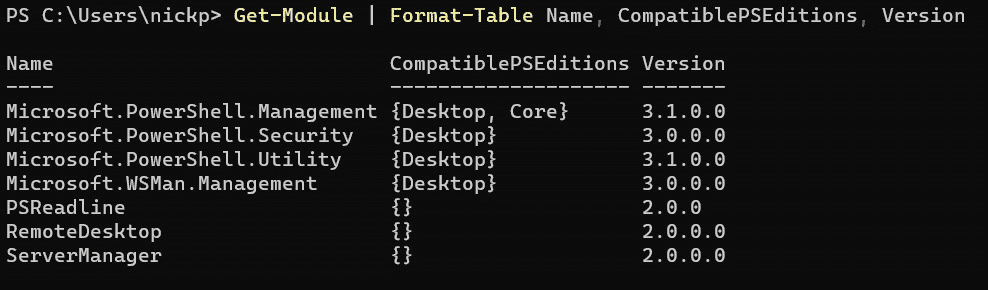
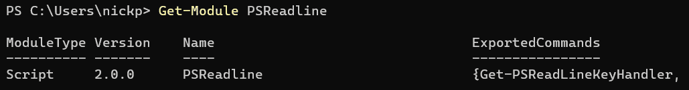

# 13

# 使用 PowerShell 7 和 Windows

欢迎来到本书的最后一部分，在接下来的四个章节中，我们将讨论如何在不同的环境中使用 PowerShell 7。在本章中，我们将重点介绍基于 Windows 系统的特殊性，并探讨现有的各种解决方法，以便我们能够有效地使用 PowerShell 7。我们还将讨论何时必须使用原生的 Windows PowerShell。需要记住的是，PowerShell 7 是一个开源产品，并且会快速变化。本章及随后的示例在写作时是准确的，但在阅读时可能不再适用。另外，PowerShell 7 也存在一些 bug。PowerShell GitHub 页面是一个强大的信息来源，可以提供有关最新变化的信息，同时也有一些功能不按预期工作的情况：[`github.com/PowerShell/PowerShell`](https://github.com/PowerShell/PowerShell)。

正如我们在 *第一章*中介绍的那样，*PowerShell 7 简介——它是什么以及如何获取*，PowerShell 7.2 及之后的版本是基于 .NET 6 平台，这是 .NET Core 的最新版本。然而，Windows PowerShell 和许多 Windows 应用程序是使用 .NET 4.5 框架构建的，后者并非开源，且包含许多专有代码。这导致了一些不兼容的情况，某些在 Windows PowerShell 中有效的内容在 PowerShell 7 中无法工作。我们将在本章中讨论这些问题，然后探讨如何使用**通用信息模型**（**CIM**）和**Windows 管理工具（WMI）**来管理我们的 Windows 机器。

本章将涵盖的主要主题如下：

+   理解 PowerShell 7 和 Windows PowerShell

+   探索兼容性

+   PowerShell 7 不兼容的内容

+   管理带有 CIM 和 WMI 的机器

# 理解 PowerShell 7 和 Windows PowerShell

理解如何在 Windows 上使用 PowerShell 7 的关键，是要知道 PowerShell 7 是建立在一个完全不同的平台上的；PowerShell 7 基于开源的、简化版的 .NET，而 Windows PowerShell 是建立在完整的专有 .NET 框架上的。这意味着 Windows PowerShell 与 Windows 操作系统及其上运行的许多应用程序具有更高程度的原生兼容性，并且可以使用 .NET 框架中 PowerShell 7 无法访问的元素。微软用术语**桌面版**来指代运行在 .NET 框架上的 PowerShell，而用术语**核心版**来指代运行在开源 .NET 上的 PowerShell。

在*第十一章*，*创建我们的第一个模块*中，我们学到了大多数 PowerShell 功能来自使用可扩展的库，称为模块，并了解了模块是如何组合的。要在模块中运行命令，PowerShell 必须首先加载该模块。微软已经做了相当不错的工作，重写了核心 PowerShell 模块以及一些使用较多的模块，如 Active Directory 模块，但并非所有模块都与 PowerShell 7 兼容；有时作者还没有做这方面的工作，但有时不兼容的原因是模块中的关键功能依赖于 .NET Framework 中的一些特性，而这些特性在开源的 .NET Core 中并没有。如果我们尝试加载这些不兼容的模块，它们通常会导致错误，或者根本无法工作。在下一节中，我们将看到如何解决这个问题。然而，有时我们会发现某些事情根本无法工作，这时我们需要使用 Windows PowerShell。我们将在本章的第三节中探讨一些这样的情况。

# 探索兼容性

说一些模块与 PowerShell 7 不兼容倒是很容易，但我们怎么知道哪些模块可以使用，哪些不能使用呢？好消息是，大多数这个过程是自动化的，并且对普通用户来说是透明的；然而我们需要了解这些，以便理解为什么有时会出现问题。为了理解兼容性，我们需要记住我们在*第十一章*，*创建我们的第一个模块*中学到的关于模块和模块清单的知识，以及在上一章*第十二章*，*保护 PowerShell*中涉及的 PowerShell 远程操作部分。

## 哪些模块与 PowerShell 7 兼容？

让我们看看一些模块，了解如何判断它们是否与 PowerShell 7 兼容。在 Windows PowerShell 中运行此命令：

```
Get-Module | Format-Table -Auto -Wrap Name, CompatiblePSEditions, Version
```

我们应该看到类似以下的输出：



图 13.1 – 揭示兼容的版本

我们可以看到，已经加载了七个模块。其中四个模块有兼容性信息；`Microsoft.PowerShell.Management`表示它与桌面版和核心版兼容。`Microsoft.Powershell.Utility`、`Microsoft.PowerShell.Security`和`Microsoft.WSMan.Management`仅与桌面版兼容。我们本可以在 PowerShell 7 中运行该命令，但当然那时它通常只会显示与核心版兼容的模块。

这三个模块没有提供兼容性信息；这可能意味着它们是在 PowerShell Core 发布之前编写的，因此仅与桌面版兼容，或者它们可能是错误类型的模块，无法提供兼容性信息。回想一下，模块有四种类型；脚本模块、清单模块、二进制模块和动态模块。清单模块包含一个扩展名为`.Psd1`的清单文件。我们可以通过运行`Get-Module <modulename>`来检查模块的类型，像这样：



图 13.2 – 检查模块类型

在这种情况下，我们可以看到`PSReadline`是一个脚本模块，因此没有与其关联的清单文件，无法包含兼容性信息。

那么，当我们需要某些功能，但该模块未列出与 PowerShell 7 兼容时，我们该怎么办？我们有三个选择：

+   查找兼容版本

+   无论如何加载它

+   使用兼容性模式

让我们来看一下这些方法。

### 查找兼容版本

如前所示的`Microsoft.PowerShell.Utility`模块在*图 13.1*中非常有用；首先，它提供了`ConvertTo-*` cmdlet。我们知道这些在 PowerShell 7 中可以使用，因为我们在整本书中都在使用它们。请看下面的图示：


图 13.3 – PowerShell 7 中的 Microsoft.PowerShell.Utility

如我们所见，`Microsoft.PowerShell.Utility`模块已经加载到我们的 PowerShell 7 会话中。怎么做到的？检查不同截图中显示的版本号。PowerShell 7 加载的是`Microsoft.PowerShell.Utility 7.0.0.0`，而 Windows PowerShell 加载的是`Microsoft.PowerShell.Utility 3.1.0.0`。PowerShell 7 提供了不同版本的核心 PowerShell 模块，并安装在`C:\program files\powershell\7\Modules`中。一些第三方模块会有与 PowerShell 7 兼容的特定版本，即使我们当前的版本不兼容，值得在库中检查是否存在这种情况。例如，在 PowerShell Gallery 中，我们可以使用搜索词`Tags:"core"`来查找与 PowerShell 7 兼容的模块，如下所示：


图 13.4 – 在 PowerShell gallery 中搜索兼容模块

如你所见，我包含了两个搜索词；第一个是字符串`databases`，第二个是`Tags:"core"`。这找到了一个可以在 PowerShell 7 中运行的数据库操作模块。让我们看看如果没有兼容版本该怎么办。

### 无论如何加载它

如果我们找不到与 PowerShell 7 兼容的模块版本，我们仍然可以尝试加载它。虽然这可能有效，但往往模块会加载成功，但在使用时并不会按预期工作。我将这种方法作为最后的手段，并作为一种警告；网上有些文章推荐这样做。就个人而言，我不会这么做。

话虽如此，如何加载没有兼容版本的模块呢？我们可以像这样使用 `Import-Module` 的 `-SkipEditionCheck` 参数：


图 13.5 – 强制加载模块

在这个示例中，我使用了`-SkipEditionCheck`参数，试图强制 PowerShell 7 在管理员权限下加载 `RemoteDesktop` 模块。正如我们所见，这并没有很好地工作。问题在于，某些模块可以正常工作，而有些模块则不能，但它们不会像`RemoteDesktop`那样产生错误。那么，正确的方法是什么呢？我们使用兼容模式。

### 使用兼容模式

在最新版本的 PowerShell 7 中使用兼容模式很简单。只需导入您想加载的模块，如下所示：

```
Import-Module RemoteDesktop
```

正如我们在下面的图中看到的，发生了一些奇妙的事情：


图 13.6 – 使用兼容模式

在第一个命令中，我所做的就是使用`Import-Module`命令没有任何参数。PowerShell 会检查是否有兼容的模块，如果没有找到，它就会创建一个远程会话，在后台运行 Windows PowerShell。该模块被加载到这个在本地机器上运行的远程会话中。它会警告我们这是它所做的操作。在第二个命令中，我检查了正在运行的远程会话，我们可以看到创建了一个名为`WinPSCompatSession`的会话。我们在*第十二章*《保护 PowerShell》中看到过远程会话。虽然在那一章中，我们明确地创建了会话。`WinPSCompatSession`是隐式远程处理的一个示例。

关于兼容模式，有两件重要的事情需要记住。第一件事是`WinPSCompatSession`运行的是 Windows PowerShell，而不是 PowerShell 7。看看这个：


图 13.7 – 演示在 WinPSCompatSession 中运行的 PowerShell 版本

在第一个命令中，我将`WinPSCompatSession`放入名为`$session`的变量中，以便可以方便地使用它。在第二行，我将`$session`变量传递给`Invoke-Command`，并从该会话中调用`$PSVersionTable`自动变量的`PSVersion`属性。我们从结果中可以看到该会话正在运行 PowerShell 版本 5.1——Windows PowerShell。在第三个命令中，我获取了本地终端会话中的相同信息，在该会话中我正在运行 PowerShell 7.3.8。

第二个重要的事情是这是一个远程会话，因此其行为与直接运行命令不同。最重要的区别在于输出已反序列化，我们可以在 *图 13**.6* 的警告中看到。请记住，命令的输出是一个 PowerShell 对象。要将 PowerShell 对象从远程计算机传递到本地计算机，对象在会话的远程端被转换为 CliXML（PowerShell 用于序列化对象的专门形式的 XML），然后在本地端被转换回 PowerShell 对象。这影响了我们可以对对象执行的操作，因为它现在具有不同的方法和属性。让我们看看这是什么样子的：


图 13.8 – 反序列化对象

在顶部窗格中，我正在使用 Windows PowerShell 运行 `Get-WmiObject win32_bios | gm` 命令来获取 `TypeName` 和 `Get-WmiObject` 命令生成的对象 `System.Management.ManagementObject` 的成员。请注意它没有方法，而 `PSComputerName` 是一个 `AliasProperty`，因此如果我们调用 `PSComputerName`，实际上会获取 `__SERVER` 属性的值。

在底部窗格中，我正在使用 PowerShell 7 在 `WinPSCompatSession` 会话内部运行 `Get-WmiObject` 命令，并获取返回对象的成员。正如我们所看到的，现在这是一个 `Deserialized.System.Management.ManagementObject`，方法和属性已经微妙地改变了。例如，`PSComputerName` 现在是一个 `NoteProperty`，包含一个字符串：`PSComputerName=localhost`。

现在，当我们明确使用 `Invoke-Command` 时，这相当容易记住。我们知道返回的内容在远程会话中运行，并且会是一个反序列化对象。然而，由于这可能在后台透明地发生，所以很容易意外加载一个兼容性模式的模块，然后惊讶地发现我们正在处理的对象的行为并不完全符合我们的预期。一些管理员喜欢通过编辑 `powershell.config.json` 文件来防止 PowerShell 兼容性中的隐式导入，包括 JSON 行：

```
"DisableImplicitWinCompat" : "true"
```

然而，这并不完全禁用兼容性模式，只是让我们更加注意何时使用它。我们仍然可以通过在 `Import-Module` cmdlet 中添加 `-UseWindowsPowerShell` 参数来显式使用兼容性模式，如下所示：


图 13.9 – 明确使用 PowerShell 兼容性

在第一行的命令中，我正常导入了 `ScheduledTasks` 模块，没有使用任何参数。在第二行，我测试是否存在兼容性会话——正如我们所见，并未打开远程会话。在第三行，我移除了该模块，在第四行重新加载它，这次添加了 `-UseWindowsPowershell` 参数。在第五行，我再次测试兼容性会话，结果它存在。

我们还可以通过编辑 `powershell.config.json` 文件中的拒绝列表，完全阻止特定模块在兼容性模式下加载：

```
"WindowsPowerShellCompatibilityModuleDenyList":  [
   "PSScheduledJob","BestPractices","UpdateServices"
]
```

如果我们尝试加载该列表上的模块，那么我们将看到类似以下的错误：


图 13.10 – 不，您不能加载 PSScheduledJob 模块

理解兼容性模式的限制非常重要。主要有四个限制：

+   它仅在本地计算机上有效——无法在已经处于远程会话中的另一台机器上调用兼容性模式

+   它要求在本地机器上安装 Windows PowerShell 5.1——较旧的机器可能仍然只安装了 Windows PowerShell 3.0 或 4.0

+   它返回基于值的反序列化对象——而非可以操作的实时对象

+   在任何一台机器上，同一时间只能运行一个兼容性会话，因此所有使用兼容性的模块将共享一个运行空间

同样重要的是要记住，PowerShell 7 的这一领域有许多人在积极工作，每个新版本的 PowerShell 都比上一个版本更好，每个新版本的 Windows 也与 PowerShell 7 更兼容。互联网上的许多指令和教程会迅速过时，这一章也是如此。

# 什么在 PowerShell 7 中无法使用

然而，Windows 上有些东西与 PowerShell 7 不兼容，而且也不太可能兼容。在本节中，我们将介绍其中的一些，这将为本章最后一节的内容，*使用 CIM* *和 WMI 管理机器*，做好铺垫。

`-ComputerName` 参数已经从 Windows PowerShell 移植到 PowerShell 7；不幸的是，该参数在 Windows 中使用的一些协议和模型与 PowerShell 7 不兼容，因此该参数无法使用。在 PowerShell 7 的最新版本中，如 7.3，该参数终于从无法工作的 cmdlet 中移除。然而，对于从 Windows PowerShell 转向 PowerShell 7 的用户来说，这仍然可能会导致混淆。解决方法是改为使用 `Invoke-Command`。

一些重要的管理模块，如用于管理 **Windows Server 更新服务**（**WSUS**）的 `UpdateServices`，在兼容性模式下无法使用，因为它们依赖于操作通过其方法返回的对象，而这些对象无法在反序列化过程中保留下来。

**Windows 管理工具**（**WMI**）命令不包括在 PowerShell 7 中，因为微软自 PowerShell 3.0 起就开始尝试弃用它们，更倾向于让用户使用更轻量级的 CIM 命令。然而，WMI 依然很受欢迎，许多人仍然使用 WMI 而非 CIM。我们将在下一节讨论这些 CIM 命令及其使用方法，这是一个重要话题。

# 使用 CIM 和 WMI 管理机器

CIM 和 WMI 是用于管理本地和远程机器的相关技术。在本节中，我们将介绍它们的基础知识，并讨论它们的相似性和差异。

## CIM 和 WMI 简介

CIM 和 WMI 基于 **Web-Based Enterprise Management**（**WBEM**）标准，该标准由 **分布式管理工作组**（**DMTF**）于 1996 年提出。WMI 是微软基于 WBEM 的工具集实现，发布于 1998 年，而 CIM 是 DMTF 提出的开放标准，定义了环境中实体的表示和相互关系。该标准于 1999 年发布。在 Windows 环境中，CIM 使用 WMI 的元素，但使用不同的协议集来访问它们；WMI 使用 **分布式公共对象模型**（**DCOM**）协议，这是专有的，而 CIM 使用 **Web 服务管理**（**WS-MAN**）协议通过 HTTP 进行访问，我们在 *第十二章* 中讨论了这个问题，*保护 PowerShell*。

这两种技术都链接到一个公共存储库——WMI 存储库，我们稍后将查看它。这个存储库包含有关我们可能想要管理的对象类型的信息，例如打印机、客户端、网络适配器等，以及这些对象的实例。

PowerShell CIM 命令允许我们通过 WS-MAN 连接到本地和远程机器，连接到我们用于远程会话的 **Windows 远程管理**（**WinRM**）端点。我们可以通过临时连接或通过 CIM 会话进行连接，类似于远程连接。

WMI 仅支持通过 DCOM 进行临时连接。这意味着远程机器上不需要启用 WinRM。

### 为什么 CIM 比 WMI 更好

CIM 稍微更新一些，但关键在于它使用了开放连接协议——WS-MAN。这要求机器和网络中的任何设备都必须提供一对静态网络端口。DCOM 使用 **远程过程调用**（**RPC**）协议，依赖于临时 TCP/IP 端口；由于这个差异，WS-MAN 更容易在网络上运行，而 DCOM 则较为困难。还有许多其他原因说明 WS-MAN 比 DCOM 更好，但根据我的经验，最大的障碍是 DCOM 对临时端口的依赖。

微软自 2012 年 PowerShell 3.0 以来，一直在努力弃用 WMI cmdlet，并说服人们改用 CIM cmdlet，因为 CIM 使用更轻的协议，网络占用更少；RPC 有许多缺点，而我也花了大量时间在职业生涯中识别并修复由于 RPC 导致的问题。然而，仍然有许多人使用 WMI cmdlet，互联网上也有许多流行的脚本使用它们。

WMI cmdlet 在 PowerShell 7 中不可用，但我们会在互联网上看到许多涉及`Invoke-Command`的变通方法，使我们能够通过兼容模式使用它们。

### 使用 CIM 和 WMI 的命令

WMI 仓库庞大且令人困惑，正如我们将看到的那样。因此，尽可能使用专用 cmdlet 而不是 CIM 或 WMI cmdlet 会更好。这看起来像什么？例如，我们可能使用`Get-CimInstance Win32_Printer`查询机器上的打印机，但使用`Get-Printer` cmdlet 会更快速且直观，如下所示：


图 13.11 – 查找打印机

这两个命令都在查找我本地机器上的 HP 打印机。它们都使用 CIM 查询 WMI 仓库。可以说，第二个命令更容易运行和记住，通常也更快。`Get-Printer`支持`-ComputerName`参数用于远程机器，甚至支持使用 CIM 会话。在深入研究几个小时，尝试弄清楚如何使用 CIM cmdlet 做某事之前，先检查一下是否已经有现成的方便的 cmdlet 完成了我们想要的操作。当然，`Get-Printer`是一个 Windows PowerShell cmdlet，因此我们需要在 Windows 客户端上运行，并使用兼容模式。

### 仓库

WMI 仓库是一个层次化的数据库——一种树形结构。在最顶层是命名空间——本质上是容器。命名空间包含类。类表示一种对象类型，例如打印机，并包含该类型对象的实例。类的每个实例具有与其他实例相同的属性和方法——尽管它们可能并不全都被填充或启用。还有一个名为`__NAMESPACE`的类（带有两个下划线`_`），它包含命名空间，因此一个命名空间也可能包含其他命名空间。

根命名空间被称为毫无创意的`root`。我们可以通过以下命令查看其内容：

```
Get-CimClass -Namespace 'Root' | Select-Object -First 10
```

我们可以通过以下方式查看`__NAMESPACE`类的实例：

```
Get-CimInstance -Namespace 'Root' -ClassName __NAMESPACE
```

每台机器上的命名空间和类的内容可能有所不同，因为硬件和软件在安装时会创建它们自己的命名空间和类。然而，大多数人的重要命名空间是`root/CIMV2`，如下图所示。


图 13.12 – 查找 CIMV2 命名空间

在第一个命令中，我列出了`root`命名空间中返回的前 10 个类。我的客户端中`root`命名空间下有 75 个类，因此我只列出了前 10 个——这个数字在你的系统中可能不同。在第二个命令中，我列出了我计算机上`__NAMESPACE`类的实例——同样，这里数量较多，你的数量可能不同。`CIMV2`命名空间已被突出显示。

`CIMV2`命名空间包含 Microsoft Windows 类。我们可以使用`Get-CimClass`列出它们，但我的计算机上该命名空间中有超过 1200 个类；大多数类名以`MSFT_*`或`Win32_*`开头。由于类的数量庞大，我们可以看到在这个存储库中查找内容可能会是一个挑战。微软在线上对`root/CIMV2`命名空间的内容进行了合理的文档记录，但其他命名空间的内容通常文档化得不太好，了解这些内容的作用及如何使用它们可能需要一些额外的努力。

在*图 13.11*中，我们使用了`Get-CimInstance Win32_Printer`命令，而没有指定命名空间——这是因为 PowerShell 将`CIMV2`命名空间设置为默认命名空间，因此我们无需在每个命令中添加`-Namespace 'root/CIMV2'`参数。

## 查询数据

我们使用 CIM 和 WMI 来完成两个主要任务——获取信息和更改内容，通常是同时在大量机器上执行这些任务。让我们从了解如何查找信息开始。我们已经看过两个可以使用的 CIM 命令；`Get-CimClass`和`Get-CimInstance`。

### Get-CimClass

这个命令用于获取指定命名空间中的 CIM 类列表，如果未指定命名空间，则获取默认命名空间中的类。这个命令有几个参数：

+   `-ClassName`：此参数允许我们指定一个类，或者在查找特定类时提供一个部分类名；例如，`Get-CimClass -ClassName *disk*`将获取`CIMV2`中所有名称中包含`disk`的类。

+   `-Namespace`：此参数允许我们指定一个不同于`root/CIMV2`的命名空间。

+   `-ComputerName`：此参数允许我们指定除本地计算机外的其他计算机。我们可以使用 FQDN、NetBIOS 名称或 IP 地址。

+   `-MethodName`：此参数允许我们搜索具有特定方法的类。例如，`Get-CimClass -MethodName 'term*'`将返回`Win32_Process`类，该类具有一个`Terminate`方法。猜猜这个方法的作用是什么，答案显而易见。

+   `-PropertyName`：与`-MethodName`参数类似，允许我们搜索具有特定属性的类。

+   `-QualifierName`：限定符类似于应用于类的标签。没有标准的列表（有点像标签），但它们有时非常有用。例如，我们可以使用`Get-CimClass -QualifierName 'deprecated'`来检索正在淘汰的类列表，这些类可能不应在脚本中使用。

+   `-Amended`：此参数获取修订后的信息——通常是根据机器所在的区域设置变化的信息。可本地化的信息通常以数字形式呈现，并需要查找才能翻译为本地语言——此参数会执行该操作。

+   `-OperationTimeoutSec`：如果我们对远程计算机执行命令，可能会出现机器无响应或未开机的情况。此参数允许我们指定一个超时时间，超出默认的本地机器网络超时（默认是 3 分钟）。如果我们查询 1000 台机器，其中 10%未开机或未连接网络，使用此参数可以在不到 5 小时内完成命令。

+   `-CimSession`：此参数允许我们在已存在的 CIM 会话中运行命令。稍后我们会详细介绍 CIM 会话。

接下来，让我们来看一下`Get-CimInstance`。

### Get-CimInstance

该命令用于获取给定 CIM 类的实例——同样，默认命名空间是 root/CIMV2\。它有许多与`Get-CimClass`相同的参数，但也有一些不同之处。让我们来看一下：

+   `-CimSession`：与`Get-CimClass`相同。

+   `-ClassName`：与`Get-CimClass`相同。

+   `-ComputerName`：与`Get-CimClass`相同。

+   `-Filter`：允许我们指定过滤器字符串，以仅获取某些实例。例如，`Get-CimInstance -Classname Win32_Printer -Filter "Name like 'HP%'"`会查找我机器上的 HP 打印机。请注意，我们必须使用**Windows 查询语言**（**WQL**）或**Cassandra 查询语言**（**CQL**）。

+   `-KeyOnly`：仅返回实例的关键属性，而不是所有属性。

+   `-Namespace`：与`Get-CimClass`相同。

+   `-OperationTimeoutSec`：与`Get-CimClass`相同。

+   `-Property`：与`Get-CimClass`不同，这个参数不会搜索具有指定属性的实例；记住，类的所有实例都有相同的属性和方法。注意，它是`-Property`，而不是`-PropertyName`。我们可以使用此参数来检索指定属性的列表，而不是实例的所有属性。

+   `-Query`：允许我们指定一个用 WQL 或 CQL 编写的查询字符串。例如，`Get-CimInstance -Query "SELECT * from Win32_Printer WHERE name LIKE 'HP%'"`将再次查找我的 HP 打印机。

+   `-QueryDialect`：指定查询所使用的方言。默认是 WQL，因此我们通常只在提供 CQL 编写的查询时使用此参数。

+   `-Shallow`：默认情况下，`Get-CimInstance`返回类的所有实例以及任何子类的实例。此参数可防止返回子类的任何结果。

我们可以看到，这两个命令都具有`-ComputerName`参数，用于远程计算机的操作。每次使用此参数时，我们都会创建并删除一个临时的 CIM 会话。如果我们有一堆命令要在远程机器上运行，那么我们可以像创建持久的 PowerShell 远程会话一样创建一个持久的 CIM 会话。让我们看看如何做到这一点。

### CIM 会话

有四个 cmdlet 用于操作 CIM 会话——`New-CimSession`、`Get-CimSession`、`Remove-CimSession` 和 `New-CimSessionOption`。它们的行为与 PowerShell 远程 cmdlet 非常相似，`Get-CimSession` 和 `Remove-CimSession` 完全按预期执行。请注意，CIM 会话在使用 Kerberos（默认身份验证方案）的 Active Directory 域环境中效果最佳。如果没有这个环境，远程计算机将需要添加到 WinRM 的 TrustedHosts 异常列表中。让我们快速看一下 `New-CimSession` 如何工作。

该 cmdlet 有以下参数：

+   `-Authentication`：我们希望使用的身份验证方案。这将取决于我们所在的环境。在域环境中，Kerberos 是最佳选择。

+   `-CertificateThumbprint`：如果我们在使用基于证书的身份验证方案，则需要提供证书的详细信息。

+   `-ComputerName`：我们希望操作的远程计算机名称。如果未指定，则会创建一个通过 DCOM 连接到本地计算机的 CIM 会话。对于远程计算机，使用的是 WSMan。

+   `-Credential`：同样，根据我们使用的身份验证方案，可能需要提供一个凭据对象。

+   `-Name`：我们可以为会话分配一个友好的名称，以便更容易操作。

+   `-OperationTimeoutSec`：与 `Get-CimClass` 参数相同。

+   `-Port`：如果我们的网络受到限制，可以指定一个特定的 TCP 端口，但不推荐这样做。

+   `-SessionOption`：这允许我们通过使用 `New-CimSessionOption` 创建一个 `SessionOption` 对象来设置会话的高级选项。

+   `-SkipTestConnection`：此参数会停止 cmdlet 在创建会话前测试连接性。

有一些高级选项可以控制代理服务器的使用以及如何处理不同的身份验证方案。所有这些选项都可以通过 `New-CimSessionOption` cmdlet 设置，但我们在此不作深入讨论。

让我们看看以下图示中这些如何运作：


图 13.13 – 使用 CIM 会话

在第一个命令中，我在本地计算机上创建了一个新的 CIM 会话，并为其指定了一个友好的名称 `localsession`。在第二个命令中，我使用友好的名称获取我的会话详情；请注意，尽管它是本地计算机，但这里使用的是 WSMan 而不是 DCOM。这是因为我通过 `-ComputerName` 参数指定了本地计算机，因此 cmdlet 自动使用 WSMan 会话。很酷吧？在最后一个命令中，我删除了该会话。

所以，这就是我们可以用来获取类和实例信息的 cmdlet。在下一节中，我们将看看如何操作实例的属性并使用它们的方法。

## 修改设置

我们也可以使用 CIM cmdlets 操作 WMI 仓库中的对象；我们可以更改它们的属性（有时）或使用它们的方法。让我们从更改属性开始。

### 更改属性

让我们运行以下命令：

```
Get-CimInstance Win32_Printer | Where-Object {$_.Name -like 'HP*'} | gm
```

接下来，我们将看到安装在本地客户端上的 HP 打印机的所有方法和属性。如果我们没有安装 HP 打印机，那么会得到一个错误，但我们可以更改搜索字符串以匹配可能拥有的打印机类型；例如，`'can*'`将找到佳能打印机。注意，属性后面跟着一个看起来像`{get;set;}`的字符串。如果它只是`{get;}`，那么它是只读的。让我们看看修改可写属性的效果：


图 13.14 – 使用 Set-CimInstance 更改属性

在第一个命令中，我创建了一个名为`$printer`的变量，并将我的 HP 打印机放入其中。在第二个命令中，我调用了该变量，只是为了检查里面的内容是否正确。它是正确的。

在第三个命令中，我正在检查`$printer`变量的`Comment`属性的当前值——我们可以看到它是空的。在第四个命令中，我将变量的属性更改为`I` `Love PowerShell`。

第五个命令是关键部分——我正在获取变量的内容，现在使用`Set-CimInstance` cmdlet 将它们写回到 WMI 仓库中的实例。该变量包含一个 WMI 对象，因此我使用了 cmdlet 的`-InputObject`参数。它是否成功了？我们来看一下。


图 13.15 – 我的打印机有意见

当然它成功了。呼~ 如果我们查看打印机对象的属性列表，我们会发现大多数属性是不可写的。例如，有一个`Default`属性，但它是只读的，我们无法使用`Set-CimInstance`设置它。在接下来的章节中，我们将查看一个可能实现这一功能的 cmdlet，`Invoke-CimMethod`。

### 发现方法

我们知道对象有属性和方法，这包括 WMI 仓库中的对象。我们已经查看了属性，了解了如何获取它们以及如何设置它们。现在，我们将看看这些对象可能拥有的方法。在这里，我们将看到为什么有时候与 WMI 仓库打交道会如此麻烦。

我们面临的第一个问题是知道我们需要的类的名称，我们在前面的查询数据部分已经看到了如何做到这一点。一旦知道了类的名称，我们需要了解可用的方法。与`Get-WmiObject` cmdlet 不同，`Get-CimClass` cmdlet 默认不会发现所有方法，因此我们必须使用类似下面的命令：

```
Get-CimClass -Class Win32_Printer | Select-Object -ExpandProperty CimClassMethods
```

这将暴露完整的方法集。一旦我们找到了方法，当然，我们需要知道如何使用它。由于 WMI 不是 PowerShell 的一部分，PowerShell 文档不会帮助我们。大多数情况下，我们可以从微软官网找到所需的信息，链接如下：

[`learn.microsoft.com/en-us/windows/win32/cimwin32prov/cimwin32-wmi-providers`](https://learn.microsoft.com/en-us/windows/win32/cimwin32prov/cimwin32-wmi-providers)

然而，这需要一点搜索，且经常会看到示例是用 Visual Basic 而不是 PowerShell 编写的。我们来看看如何实现它。

在接下来的部分，我们将看到如何启动和停止进程，所以让我们查看 `Win32_Process` 文档，链接如下：

[`learn.microsoft.com/en-us/windows/win32/cimwin32prov/win32-process`](https://learn.microsoft.com/en-us/windows/win32/cimwin32prov/win32-process)

如果我们往下滚动，可以看到一个 *Methods*（方法）部分。最可能的方法是 `Create`。如果点击链接，我们可以看到 `Create` 方法有一个 `CommandLine` 参数。我们来看看它是如何工作的。

### 调用方法

现在我们有了方法和可能的参数，试试看吧。首先，我们需要使用 `Invoke-CimMethod` cmdlet。这个 cmdlet 有以下参数，其中许多参数的用法我们应该已经熟悉：

+   `-ClassName`：与 `Get-CimClass` 相同。

+   `-CimClass`：我们可以使用此参数来指定 WMI 类，而不是使用 `-ClassName` 参数。我们需要通过变量传递一个 WMI 类对象，而不是字符串。

+   `-CimSession`：与 `Get-CimClass` 相同。

+   `-Namespace`：与 `Get-CimClass` 相同。

+   `-ComputerName`：与 `Get-CimClass` 相同。

+   `-MethodName`：这是一个必填参数，接受一个字符串；方法的名称。

+   `-Arguments`：在这里，我们指定传递给方法的参数，作为一个 `iDictionary` 哈希表，像这样：`-Arguments @{ ParameterName = '``value'}`。

+   `-OperationTimeoutSeconds`：与 `Get-CimClass` 相同。

+   `-Query` 和 `-QueryDialect`：与 `Get-CimInstance` 相同。

让我们启动记事本程序；如果我们在 Windows 11 上工作，可能需要关闭任何正在运行的记事本实例。首先，我们将使用 `Invoke-CimMethod` cmdlet。我们需要类名 `Win32_Process`、方法名 `Create()` 和参数。我们将使用 `CommandLine = 'notepad.exe'`，因为 `notepad.exe` 在 `PATH` 环境变量中，所以不需要指定位置：

```
Invoke-CimMethod -ClassName Win32_Process -MethodName Create -Arguments @{CommandLine = 'notepad.exe'}'}
```

它看起来像这样：


图 13.16 – 调用方法

我们可以看到返回值（`0`）表示成功，并且我们得到了新创建的记事本进程的 `ProcessId`。请注意，这个命令可能会在后台创建进程；我们不会突然看到记事本窗口出现，但我们会在任务栏看到它。

活动

1.  如何使用 PowerShell 关闭我们刚刚启动的 `notepad.exe` 进程？

1.  如何使用 PowerShell 设置打印机为默认打印机？提示：我们不能使用 Windows PowerShell 中的 `Set-Printer` cmdlet。

这就是我们在这里要讲解的全部内容。只需记住，属性和方法的文档不完整，而且经常会有一个专门为我们的目的编写的 PowerShell cmdlet，通常作为 PowerShell 7 或 Windows PowerShell 的一部分。让我们总结一下本章内容。

# 总结

本章我们开始了书的最后部分，讲解如何在不同环境中使用 PowerShell。我们从 Windows 环境开始，可以说这是 PowerShell 最有效的环境。然而，我们也看到 PowerShell 7 和 Windows PowerShell 之间有一些重要的区别。

我们看到 PowerShell 7 不一定能使用为 Windows PowerShell 编写的模块，且我们探讨了三种应对方法：为 PowerShell 7 寻找等效模块、无论如何加载模块，或者使用兼容模式。

尽管大多数时候兼容模式是透明使用的，但我们了解了它的工作原理，以及一些我们可能希望限制其使用的情况。不过，它非常有用，我们看到它一直在不断改进。

我们继续探讨了与 PowerShell 7 不兼容的某些功能，以及为什么会这样。通常，这是因为一些旧模块不再值得重写以适配 PowerShell 7。

接下来我们看了在 Windows 机器上使用 PowerShell 7 的最有用方法之一：使用 CIM 来操作 WMI 存储库。我们花了一些时间了解了 WMI 存储库，然后继续讨论如何获取那里的对象属性，以便了解我们本地机器和远程机器上的环境。

最后的部分讲解了如何操作 WMI 存储库中对象的属性，然后介绍了如何调用这些对象的方法来影响更广泛的计算环境。

本章就到这里。在下一章中，我们将讨论如何在 Linux 和 macOS 机器上使用 PowerShell 7。

# 练习

1.  哪些类型的模块包含兼容性信息？

1.  为什么一个模块可能没有兼容性信息？

1.  我们运行了 `Get-PSSession`，可以看到本地主机上运行着一个名为 `WinPSCompatSession` 的远程会话。它正在运行哪个版本的 PowerShell？

1.  我们从在 `WinPSCompatSession` 中运行的命令中获得的是什么类型的对象？

1.  我们的本地管理员禁用了我们机器上的隐式 Windows 兼容性。那么我们如何在兼容模式下仍然导入模块呢？

1.  哪个 CIM 类包含命名空间的实例？

1.  `Get-CimInstance` cmdlet 中的 `-OperationTimeoutSecs` 参数的作用是什么？

1.  我们会使用哪个 cmdlet 来更改 WMI 对象的属性？

1.  我们如何将方法参数传递给 `Invoke-CimMethod`，它们需要什么格式？

# 进一步阅读

+   *.**NET Framework*：

    [`en.wikipedia.org/wiki/.NET_Framework`](https://en.wikipedia.org/wiki/.NET_Framework)

+   *模块兼容性*：

    [`learn.microsoft.com/zh-cn/powershell/gallery/concepts/module-psedition-support`](https://learn.microsoft.com/zh-cn/powershell/gallery/concepts/module-psedition-support)

+   *PowerShell 版本*：

    [`learn.microsoft.com/zh-cn/powershell/module/microsoft.powershell.core/about/about_powershell_editions`](https://learn.microsoft.com/zh-cn/powershell/module/microsoft.powershell.core/about/about_powershell_editions)

+   *PowerShell 7 中的差异*：

    [`learn.microsoft.com/zh-cn/powershell/scripting/whats-new/differences-from-windows-powershell`](https://learn.microsoft.com/zh-cn/powershell/scripting/whats-new/differences-from-windows-powershell)

+   *基于 Web 的企业管理*：

    [`zh.wikipedia.org/wiki/Web-Based_Enterprise_Management`](https://zh.wikipedia.org/wiki/Web-Based_Enterprise_Management)

+   *通用信息模型*：

    [`zh.wikipedia.org/wiki/Common_Information_Model_(computing)`](https://zh.wikipedia.org/wiki/Common_Information_Model_(computing))

+   *WSMan*：

    [`zh.wikipedia.org/wiki/WS-Management`](https://zh.wikipedia.org/wiki/WS-Management)

+   *Windows 管理工具*：

    [`zh.wikipedia.org/wiki/Windows_Management_Instrumentation`](https://zh.wikipedia.org/wiki/Windows_Management_Instrumentation)

+   *分布式组件对象模型*：

    [`zh.wikipedia.org/wiki/Distributed_Component_Object_Model`](https://zh.wikipedia.org/wiki/Distributed_Component_Object_Model)

+   *从 Windows PowerShell 5.1 迁移到 PowerShell 7.x*：

    [`learn.microsoft.com/zh-cn/powershell/scripting/whats-new/migrating-from-windows-powershell-51-to-powershell-7`](https://learn.microsoft.com/zh-cn/powershell/scripting/whats-new/migrating-from-windows-powershell-51-to-powershell-7)

+   *关于 Windows PowerShell 兼容性*：

    [`learn.microsoft.com/zh-cn/powershell/module/microsoft.powershell.core/about/about_windows_powershell_compatibility`](https://learn.microsoft.com/zh-cn/powershell/module/microsoft.powershell.core/about/about_windows_powershell_compatibility)

+   *PowerShell 7 模块兼容性*：

    [`learn.microsoft.com/zh-cn/powershell/scripting/whats-new/module-compatibility`](https://learn.microsoft.com/zh-cn/powershell/scripting/whats-new/module-compatibility)

+   *具有兼容的 PowerShell 版本的模块*：

    [`learn.microsoft.com/zh-cn/powershell/gallery/concepts/module-psedition-support`](https://learn.microsoft.com/zh-cn/powershell/gallery/concepts/module-psedition-support)

+   *关于 PowerShell 版本*：

    [`learn.microsoft.com/zh-cn/powershell/module/microsoft.powershell.core/about/about_powershell_editions`](https://learn.microsoft.com/zh-cn/powershell/module/microsoft.powershell.core/about/about_powershell_editions)

+   *隐式远程管理*：

    [`devblogs.microsoft.com/scripting/remoting-the-implicit-way/`](https://devblogs.microsoft.com/scripting/remoting-the-implicit-way/)

+   *使用 Get-CimInstance 获取 WMI 对象*：

    [`learn.microsoft.com/zh-cn/powershell/scripting/samples/getting-wmi-objects--get-ciminstance-?view=powershell-7.4`](https://learn.microsoft.com/zh-cn/powershell/scripting/samples/getting-wmi-objects--get-ciminstance-?view=powershell-7.4)

+   *使用 PowerShell CIM cmdlet 探索* *WMI 类*：

    [`devblogs.microsoft.com/scripting/using-powershell-cim-cmdlets-to-explore-wmi-classes/`](https://devblogs.microsoft.com/scripting/using-powershell-cim-cmdlets-to-explore-wmi-classes/)
