# 14

# Linux 和 macOS 的 PowerShell 7

通常说，Linux 是最受欢迎的服务器操作系统，虽然这是真的，但这并没有说明几乎每台服务器都有几种不同类型的 Linux。与 Windows 和 macOS 的紧密工程化和维护不同，这些系统的公司致力于确保每个人都在运行同质、安全、并且经常强制更新的代码，而 Linux 世界则更加自由，拥有多种免费、开源且常常维护不足的变种，这些变种可能在服务器上存活多年甚至几十年。在本章中，我们将看看如何在一些常见的 Linux 版本上使用 PowerShell；在我们的例子中，使用 Ubuntu 和 CentOS，它们是免费的 **Red Hat Enterprise Linux** (**RHEL**) 版本。

我们将首先了解如何访问一台 Linux 机器进行练习；如果没有这个，本章内容会非常无聊。一旦我们有了机器，我们将探索三种不同的安装 PowerShell 的方法，使用包管理器和直接下载。

接下来，我们将安装 VS Code，并在 CentOS 7 上设置它，然后看看在 Linux 上运行 PowerShell 和在 Windows 上运行之间的主要区别。

我们将了解在 Linux 上使用 PowerShell 的最常见方法之一：通过 **安全外壳协议** (**SSH**) 进行远程会话。这一点很重要，而且无疑是我看到人们登录 Linux 机器时最常用的方法。

最后，我们将快速了解如何使用免费开源包管理器 Homebrew 在 macOS 上轻松安装 PowerShell 和 VS Code。

本章将涵盖的主要主题如下：

+   安装 PowerShell 7

+   安装 VS Code

+   在 Linux 上运行 PowerShell

+   使用 OpenSSH 远程连接

+   macOS 上的 PowerShell

# 技术要求

除非我们已经有了运行某种 Linux 的客户端，否则我们需要一台 Linux 设备来工作。获取一台设备有两种方法，一种简单，另一种稍微困难一些。我在我的机器上做了这两种方法，获取了本章的截图，提供了一个没有图形界面的 Ubuntu 服务器和一个 CentOS 桌面客户端。

Ubuntu 服务器非常容易安装：

1.  转到 **控制面板** | **程序和功能** | **启用或关闭 Windows 功能**，确保选中 **Windows Subsystem for Linux**（Windows 子系统 Linux）的复选框，像这样：

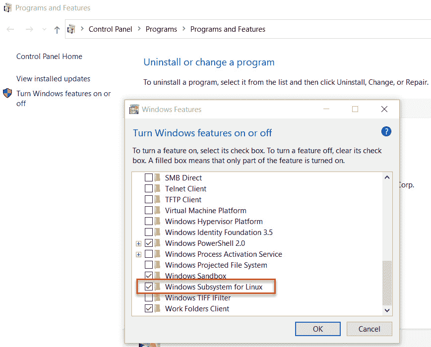

图 14.1 – 启用 Windows 子系统 Linux

**Windows Subsystem for Linux** 在红色框中显示。

1.  一旦启用了 **Windows Subsystem for Linux**（**WSL**），重启计算机，访问 Microsoft Store ([`apps.microsoft.com`](https://apps.microsoft.com))，并选择一个 Linux 应用。我使用的是最新版本的 Ubuntu – 22.04：

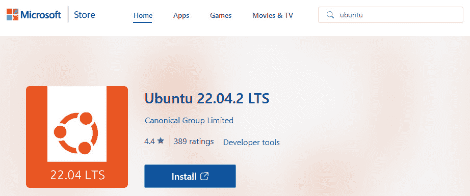

图 14.2 – 在 Microsoft Store 中的 Ubuntu 应用

我在这里做的就是在搜索框中搜索 Ubuntu，并选择了最新的应用程序。

1.  点击 **安装**，会弹出一个 Microsoft Store 窗口；点击 **获取**，下载应用程序后，按钮会变成 **打开**：

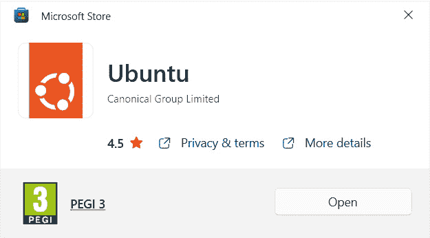

图 14.3 – Microsoft Store 应用

1.  点击`正在安装，这可能需要几分钟...`。几分钟后，我们会被要求创建用户名，然后输入两次密码，完成后就可以了。现在，我们已经在 Windows 上的 WSL 中运行了一个 Ubuntu 服务器：

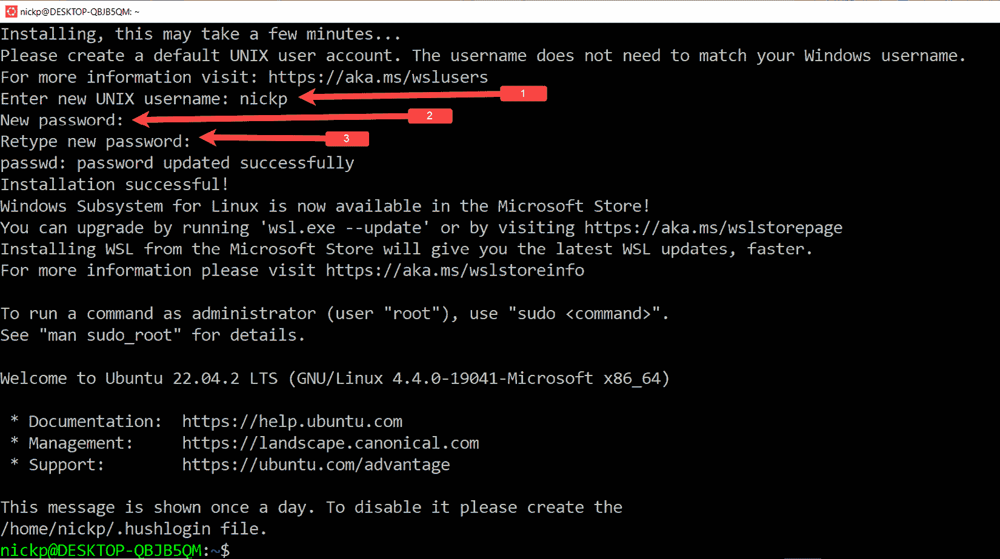

图 14.4 – Ubuntu 在 WSL 上运行

在第一行，我创建了一个新的用户名 `nickp`（富有创意吧），在第二行和第三行，我输入了新的密码。Ubuntu 在输入时隐藏密码，但与 Windows 不同，它不会通过显示点或星号来隐藏，而是完全不显示……什么都不显示。

就这样——我们的 Ubuntu 环境已经准备好安装 PowerShell。

注意

这些说明适用于 Windows 10 Pro 版本 19045。其他平台，如 Windows 11 或 Windows Server，可能有不同的安装 WSL 的说明。另外，这是 WSL，后来的操作系统还有一个版本叫做 WSL2。

我还在 Oracle VirtualBox 中安装了 CentOS；从 Microsoft Store 安装也完全可以，但我需要一台单独的机器，并且希望它有图形用户界面（GUI），我们可以在本章中使用。

安装 VirtualBox 的说明可以在这里找到：

[`www.virtualbox.org/manual/UserManual.html#installation`](https://www.virtualbox.org/manual/UserManual.html#installation)

这非常简单。

一旦 VirtualBox 安装完成，我们需要从这里下载 CentOS 镜像：

[`isoredirect.centos.org/centos/7/isos`](http://isoredirect.centos.org/centos/7/isos)

我们还需要创建一个虚拟机来安装它。这里有很好的说明：[`www.linuxfordevices.com/tutorials/centos/centos-on-virtualbox`](https://www.linuxfordevices.com/tutorials/centos/centos-on-virtualbox)。

我安装了带有 GNOME 桌面图形界面的 CentOS 7，这样我们就可以看看如何在较旧的操作系统上安装 PowerShell；我发现我使用的许多 Linux 系统都已经有些年头了。有些地方我仍在使用 Ubuntu 12.04。精确穿山甲（Precise Pangolin）是一个很棒的操作系统名称，但实际上，我们都应该使用 Jammy Jellyfish——至少为了安全起见。

最后，为了跟进 macOS 部分，我们需要一台 Mac。我是个极度节省的人，所以我借了朋友 Paul 的一台 MacBook，运行的是 OS 13 Ventura，这个版本相当新。谢谢你，Paul。

现在我们已经介绍了我们需要的环境类型以及如何安装它，让我们来看看如何安装 PowerShell。

# 安装 PowerShell 7

有些许反常的是，我发现将 PowerShell 安装在 Linux 上可能比在 Windows 上安装更容易，尽管 PowerShell 是为 Windows 开发的。微软发布了适用于支持版本 Linux 的好脚本；不过请注意，支持的 Linux 版本非常有限：RHEL、Ubuntu、Alpine 和 Debian。

这并不意味着我们不能在其他版本上安装 PowerShell，只是微软不提供任何支持。微软只支持特定的较新版本。而且，由于操作系统更新的速度较快，确保我们的 PowerShell 和 Linux 版本处于支持矩阵中是值得的；否则，我们可能会遇到意想不到的结果，正如我们在尝试在 CentOS 上安装时会看到的。

让我们从 Ubuntu 开始，我在我的 Windows 10 客户端中运行着 Ubuntu 的 WSL。

## 在 Ubuntu 22.04 上安装 PowerShell

在本节中，我们将安装 PowerShell 7.4 版本在 Ubuntu 22.04 上。Ubuntu 在我的 Windows 10 客户端中通过 WSL 运行，但在虚拟机或物理机器上同样适用。这里有详细的替代安装说明：[`learn.microsoft.com/en-us/powershell/scripting/install/install-ubuntu`](https://learn.microsoft.com/en-us/powershell/scripting/install/install-ubuntu)。

让我们试试吧。我们将运行接下来的命令：

1.  在第一行，我们正在从默认的软件库更新本地软件包至最新版本。在 Linux 上安装任何软件之前，这是一个好习惯。我们使用`sudo`命令告诉 Linux 我们希望使用管理员权限或根权限来执行该命令。显然，要做到这一点，我们需要拥有这些权限，并且在运行命令之前，系统会要求我们输入账户密码以确认：

    ```
    sudo apt-get update
    ```

1.  在第二行，我们正在安装一些前置的软件包：

    ```
    sudo apt-get install -y wget apt-transport-https software-properties-common
    ```

1.  在第三行，我们正在获取操作系统的确切版本，然后在第四行使用它：

    ```
    wget to download the correct repository package for our operating system. This is the Linux package repository for Microsoft products, abbreviated PMC (short for packages.microsoft.com):

    ```

    dpkg，Ubuntu 的软件包管理系统：

    ```
    sudo dpkg -i packages-microsoft-prod.deb
    ```

    ```

    ```

1.  在第六行，我们正在删除密钥文件以确保安全：

    ```
    sudo apt-get update again to make sure we’ve got the latest list of packages for the new repository:

    ```

    sudo apt-get update

    ```

    ```

1.  最后，在第八行，我们正在安装 PowerShell：

    ```
    sudo apt-get install -y powershell
    ```

Linux 输出非常详细，我们在输入上述命令时会看到 60 到 70 行输出，但整个过程非常直接，且运行良好。

要启动 PowerShell，我们只需输入`pwsh`，即可进入 PowerShell 提示符，如下图所示：

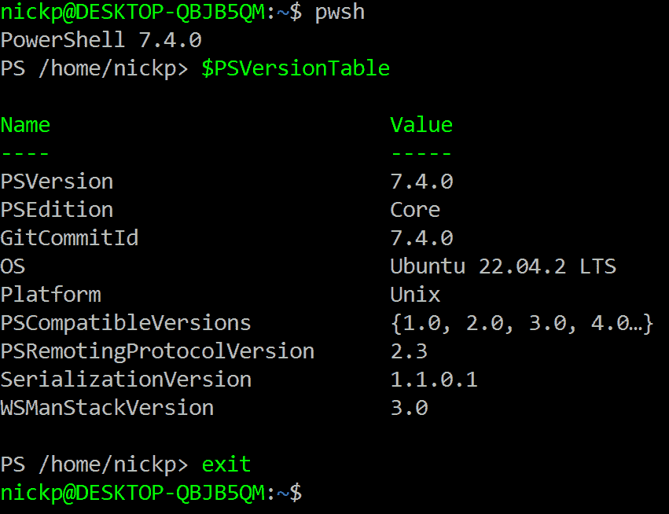

图 14.5 – 在 Ubuntu 上启动 PowerShell

在前面的截图中，我用 `pwsh` 启动了 PowerShell。一旦 PowerShell 启动，我调用了 `$PSVersionTable` 自动变量来获取有关环境的一些信息，包括 PowerShell 的版本、版本号以及运行的操作系统。我通过输入 `exit` 关闭了 PowerShell。如果我想让 PowerShell 在后台运行，我可以输入 `bash`，然后切换到 Bash 提示符。正如我们所看到的，在 Linux 上，我们获得了与 Windows 相同的颜色编码，这有助于跨平台保持一致的体验。

了解 Linux 中也支持制表符补全是很好的。Linux 中最常让我困惑的事情之一就是大小写问题；Windows 上的 PowerShell 已经让我变得懒惰。因此，能够使用制表符来完成路径非常有用。请注意，PowerShell 在 Linux 上对大小写不敏感；`get-process` 和 `Get-Process` 作用一样。

现在让我们来看一下如何在 CentOS 上安装 PowerShell。

## 在 CentOS 8 和 9 上安装 PowerShell

在 CentOS 的最新版本（CentOS 8 或 CentOS 9）上安装 PowerShell 的过程与在 Ubuntu 上安装非常相似，只是使用了 RHEL 8 的 `yum` 包管理器，或使用 RHEL 9 的 `dnf` 包管理器；如果说有区别的话，它甚至更简单。不过需要注意的是，微软官方只在 RHEL 上支持 PowerShell，而不是 CentOS 或 Fedora。我们接下来要运行的是以下命令：

1.  在第一行，我们使用 `curl` 应用程序而不是 `wget` 来获取 PCM：

    ```
    rpm, the package manager:

    ```

    sudo rpm -i packages-microsoft-prod.rpm

    ```

    ```

1.  在第三行，我们再次移除密钥文件：

    ```
    rm packages-microsoft-prod.rpm
    ```

1.  在第四行，我们正在更新软件包列表，现在我们已经注册了新的仓库：

    ```
    -y switch at the end specifies that we are answering yes to all questions. We can start PowerShell using pwsh, again, just like on Ubuntu:

    ```

    sudo dnf install powershell -y

    ```

    ```

故障排除提示

如果这不起作用，很有可能是代理设置的问题。在 CentOS 中，至少有三个不同的地方可能包含代理设置。对于 `yum`，它在 `/etc/yum.conf`。对于 `dnf`，它在 `/etc/dnf/dnf.conf`。

那么，如果我们想在旧版本上使用 PowerShell 怎么办？我们必须安装一个特定的旧版本 PowerShell。

对于 RHEL 7（因此，也包括 CentOS 7），PowerShell 的最后一个可用版本是 7.2\. 7.3 的早期版本可以使用，但后续版本不行，因为它们依赖于与 CentOS 7 不兼容的 Linux 库。如果我们尝试安装 PowerShell 的新版本，我们会看到类似这样的错误信息：

```
GLIBCXX_3.4.21 not found (required by pwsh)
```

这里的答案是安装 PowerShell 7.2\. 让我们看看如何做到这一点。

## 在 CentOS 7 上安装 PowerShell

在 CentOS 上通过直接下载安装非常简单；只需要一行命令：

```
sudo yum install https://github.com/PowerShell/PowerShell/releases/download/v7.2.17/powershell-7.2.17-1.rh.x86_64.rpm
```

我们在这里所做的就是使用`yum`，CentOS 7 上的包管理器，从 URL 获取并安装一个包。这里的技巧是知道你需要下载的包的 URL。所有这些包都由 Microsoft 在 GitHub 上维护，网址是：[`github.com/PowerShell/PowerShell/releases/`](https://github.com/PowerShell/PowerShell/releases/)。

要下载版本，点击软件包名称中的链接（在我们的例子中是`powershell-7.2.17-1.rh.x86_64.rpm`），并复制超链接：[`github.com/PowerShell/PowerShell/releases/download/v7.2.17/powershell-7.2.17-1.rh.x86_64.rpm`](https://github.com/PowerShell/PowerShell/releases/download/v7.2.17/powershell-7.2.17-1.rh.x86_64.rpm)。

一旦我们有了它，就可以像这样将其传递给`sudo yum install`：

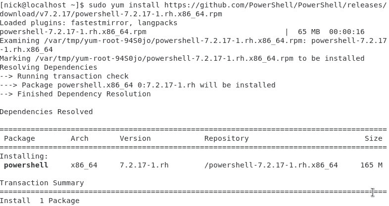

图 14.6 - 在 CentOS 7 上使用直接下载安装 PowerShell

在第一行中，我运行了之前展示过的直接下载命令。其余的屏幕输出是操作系统的聊天信息，告诉我们它正在做什么。在我们最终运行 PowerShell 之前，还有很多行这样的输出。这是安装 PowerShell 的一个非常简单的方法；缺点是我们没有注册 Microsoft 的仓库。

这基本上就是我们在 Linux 上安装 PowerShell 时要涵盖的内容；我们已经涵盖了两个主要 Linux 发行版的代表，Ubuntu 和 CentOS，并且我们已经了解了如何安装不同版本的 PowerShell。现在让我们来看看如何在 Linux 上安装 VS Code。我们将使用我的 CentOS 系统，因为它有图形界面。

# 安装 VS Code

在 Linux 上安装 VS Code 是简单的。在最近的 Ubuntu 机器上，我们可以像这样使用`snapd`，一个 Ubuntu 的包管理系统：

```
sudo snap install --classic code
```

就这样。在 RHEL 和 CentOS 机器上，我们可能需要先启用`snapd`，然后才能使用它来安装 VS Code。

我们将运行接下来的命令：

1.  在第一行中，我们正在安装`snapd`包：

    ```
    snap uses:

    ```

    /snap 到 /var/lib/snapd/snap：

    ```
    sudo ln -s /var/lib/snapd/snap /snap
    ```

    ```

    ```

1.  最后，我们需要注销并重新登录，或者重启计算机，以确保所有内容都已更新。

现在，我们准备像之前一样使用`snap`来安装 VS Code。使用`snap`的最大优势是它会在后台保持 VS Code 的更新。

如果我们无法使用`snap`，也可以手动安装 VS Code。在 CentOS 7 上，我们可以这样做：

```
sudo rpm --import  https://packages.microsoft.com/keys/microsoft.asc
```

这将使用`rpm`，CentOS 7 的包管理器，注册 Microsoft 的 GPG 加密密钥。接下来，键入以下内容：

```
sudo nano /etc/yum.repos.d/vscode.repo
```

这将创建一个名为`vscode.repo`的空文本文件。我们需要向该文件中添加一些行并保存，因此请键入以下内容：

```
[code]
name=Visual Studio Code
baseurl=https://packages.microsoft.com/yumrepos/vscode
enabled=1
gpgcheck=1
gpgkey=https://packages.microsoft.com/keys/microsoft.asc
```

按*Ctrl*和*X*退出，并在提示保存文件时按`y`。

`vscode.repo`文件应该是这样的：

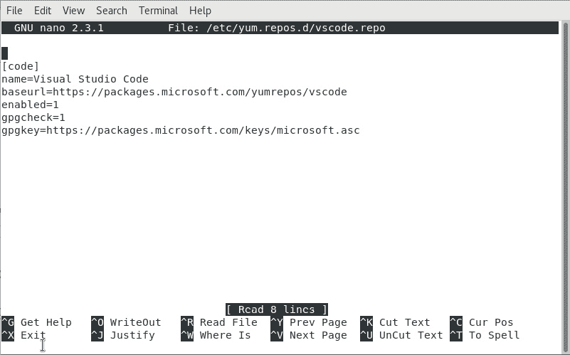

图 14.7 - 使用 nano 查看 vscode.repo 文件

当我们创建文件时，它是空的，我们必须输入代码并保存退出。

最后，安装 VS Code，请输入以下命令：

```
sudo yum install code
```

就这样。我们可以通过在终端提示符下输入`code`来启动 VS Code。VS Code 在 Linux 和 Windows 上的工作方式完全相同。请参阅 *第五章* 的 *配置 VS Code 用于 PowerShell* 部分，*PowerShell 控制流 – 条件语句* *和循环*。

现在我们已经安装好了一切，让我们看看如何在 Linux 上使用 PowerShell。

# 在 Linux 上运行 PowerShell

通常，PowerShell 在 Linux 上的工作方式与 Windows 上完全相同，但显然，两种操作系统之间存在一些差异，我们需要注意并理解 PowerShell 如何处理这些差异。

大小写敏感是显而易见的区别；虽然在 Linux 上 `get-content` 与 `Get-Content` 是等效的，但如果文件名是 `MyFile.txt`，则 `get-content ./myfile.txt` 不会生效；请看下面的截图：

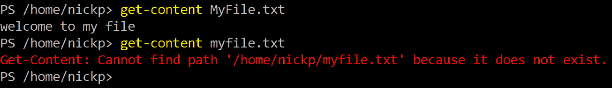

图 14.8 – 大小写的重要性

如你所见，如果路径或文件名的大小写不正确，PowerShell 将无法找到该文件。我找到的最佳解决方法是尽可能使用 Tab 完成，因为 Tab 完成忽略大小写，所以输入 `myfi` 并按下 *Tab* 键会找到名为 `MyFile.txt` 的文件。

文件系统也不同。Linux 不使用字母区分驱动器，而是使用正斜杠 (`/`)，而不是反斜杠 (`\`)。PowerShell 识别两者作为文件路径分隔符，因此 `Get-Content ./MyFile.txt` 和 `Get-Content .\MyFile.txt` 没有功能上的区别：

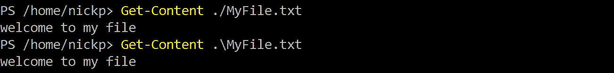

图 14.9 – 多功能路径分隔符

如你所见，无论我们选择哪种文件路径分隔符，都能获取到文件的内容。这使得编写跨平台脚本变得更容易。

我已经表明了我对别名的看法，看来我的愤怒信件写作有了回报，因为 PowerShell 7 在 Linux 上不再包含像 `ls` 这样的常用别名，尽管它们在 Windows 上运行 PowerShell 7 时仍然存在。相反，PowerShell 现在调用 Bash 命令，像这样：

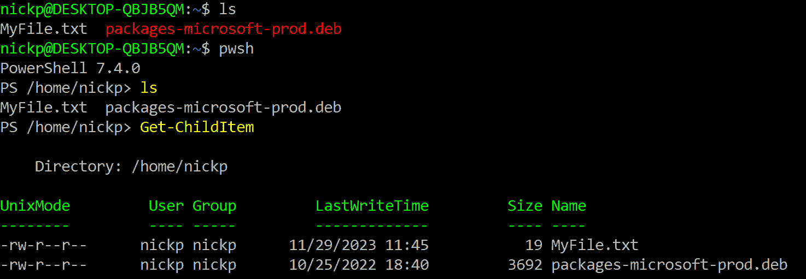

图 14.10 – PowerShell 7 在 Linux 上的别名减少

在前面的截图中，我们可以看到在 Bash 和 PowerShell 中运行 `ls` 的区别。输出是相同的，但我们在 Bash 中运行时没有颜色编码。相比之下，当我们运行 `Get-ChildItem` 时，输出完全不同。与 Windows 上的行为对比，`ls` 在 Windows 上是 `Get-ChildItem` 的别名。其他不再有别名的 Linux 命令包括 `cp`、`mv`、`rm`、`cat`、`man`、`mount` 和 `ps`。

在 Linux 上以管理员身份运行也有所不同。熟悉 Linux 的人通常习惯使用 `sudo` 前缀来以 root 用户身份运行命令。这在 PowerShell 中不起作用。相反，我们必须以 `sudo` 启动 PowerShell，像这样：

```
sudo pwsh
```

这将为我们提供一个具有 root 权限的新 PowerShell 会话。

鉴于在 Linux（以及 macOS 和 ARM）上运行 PowerShell 的一个主要吸引力是我们可以开始编写跨平台脚本，那么如何知道我们的脚本在哪个平台上运行呢？很简单——我们测试自动变量。有三个自动变量，分别是 `$IsWindows`、`$IsLinux` 和 `$IsMacOS`，根据操作系统的不同，这些变量会返回 `true` 或 `false`。我们可以使用这些变量在脚本中编写 `if` 语句，以根据环境改变行为。

活动 —— 编写跨平台脚本

根据我们之前学到的内容，编写一个跨平台脚本，能够在 Windows 和 Linux 上运行，并返回当前 CPU 使用率最高的五个进程。将进程按降序输出到一个文本文件中，文件名应包含运行该脚本的计算机名称。

我们可以在 Windows 中使用 `$env:computername` 获取计算机名称，而在 Linux 中可以通过输入 `hostname` 来获取。

当然，大多数时候，我们不会直接在 Linux 机器上运行命令和脚本；大多数时候，我们会想要远程连接到它。在接下来的部分中，我们将看看远程连接到 Linux 机器的推荐方法。

# 使用 OpenSSH 进行远程连接

在*第十二章*《确保 PowerShell 安全》一节中，我们看到远程连接是一种强大的方式，可以与机器建立连接并进行控制。当我们在该章节中探讨远程连接时，我们研究了在其他 Windows 机器上通过**Windows 远程管理**（**WinRM**）协议进行远程连接。我们还提到过可以使用 SSH 来建立远程会话。由于 Linux 不支持 WinRM 协议，因此我们必须使用 SSH 来远程管理它。

OpenSSH 是一个开源的 SSH 工具集，在 Linux 和其他 Unix 系统上几乎是无处不在的。从 2018 年起，它也可以在 Windows 上使用，使得管理异构环境变得更加容易。设置它可能有些复杂，但一旦配置完成，它会让远程连接变得非常简单。让我们来看看。

## 检查 PowerShell 是否支持 OpenSSH

首先要检查的是，我们的 PowerShell 7 版本是否支持 OpenSSH；如果我们从 GitHub 下载并安装了它，那么应该没问题，但首先让我们使用以下命令进行检查：

```
(Get-Command New-PSSession).ParameterSets.Name
```

如果我们看到名为 `SSHHost` 和 `SSHHostHashParam` 的参数集，那么我们就可以继续了。如果没有，则应从 GitHub 下载最新版本的 PowerShell 7。

## 在 Windows 上安装 OpenSSH

我们只需要在 Windows 上安装 OpenSSH，前提是我们想要远程连接到这台 Windows 机器。如果我们要从这台机器远程连接到其他机器，则可以跳过安装它；PowerShell 已经内置了一个可以使用 PowerShell 远程连接 Linux 机器的 SSH 客户端。

如果我们决定要安装 OpenSSH 服务器，那么首先需要检查我们是否正在运行一个可行版本的 Windows，并且我们是否拥有正确的权限。启动一个提升权限的管理员 PowerShell 会话，然后输入以下内容：

```
(New-Object Security.Principal.WindowsPrincipal([Security.Principal.WindowsIdentity]::GetCurrent())).IsInRole([Security.Principal.WindowsBuiltInRole]::Administrator)
Winver.exe
```

这是我在机器上得到的结果：

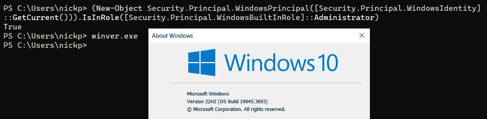

图 14.11 – 检查 Windows 上 OpenSSH 的前提条件

正如我们所见，我的权限测试返回了`True`，说明我确实拥有正确的权限，当我运行`winver.exe`时，弹出窗口显示我正在运行 Windows 10 22H2 版本，比最低要求的 Windows 10 1809 版本还要新。我们已经准备好安装了。在刚才使用的提升权限提示符中，输入以下内容：

```
Get-WindowsCapability -Online | Where-Object {$_.Name -like 'OpenSSH*'} | Add-WindowsCapability -Online
```

这将安装 OpenSSH。我们还需要启动`sshd`服务，并将其设置为自动启动：

```
Start-Service sshd
Set-Service sshd -StartupType Automatic
```

最后，我们需要配置`sshd`以允许 PowerShell 使用它。以管理员身份打开`notepad.exe`（右键点击并选择`C:\ProgramData\ssh\sshd_config`文件，在文件的最后一行之前添加以下行，并保存文件：

```
PasswordAuthentication yes
PubkeyAuthentication yes
Subsystem powershell c:/progra~1/powershell/7/pwsh.exe -sshs -nologo
```

如果我们使用的是 PowerShell 7.4 或更高版本，则`-``nologo`参数不再需要。小心不要将文件保存为`sshd_config.txt`。

警告！

等等！那条`c:/progra~1/powershell/7/pwsh.exe`路径是怎么回事？在 Windows 上使用非微软的开源软件有时会令人沮丧。OpenSSH 就是一个例子。它无法理解带有空格的路径，即使路径被单引号或双引号括起来，因此我们不得不使用一种叫做 8.3 格式的东西，这是一种旧版微软操作系统中使用的短文件名格式。

不幸的是，情况更复杂。一些版本的 OpenSSH 也不喜欢这种格式；当我们将 PowerShell 子系统添加到`sshd_config`文件中时，`sshd`服务拒绝启动。这里的解决办法是将另一个 PowerShell 副本侧载到一个没有空格、且文件夹名不超过八个字符的目录中。为了让它正常工作，我从 PowerShell GitHub 页面下载了 PowerShell 7.4 的 ZIP 文件，通过右键点击下载的文件并选择`c:\scratch\pwsh`来解锁它。然后，我将以下行添加到`sshd_config`中：

`Subsystem powershell` `c:/scratch/pwsh/pwsh.exe -sshs`

现在，`sshd`服务将正常启动。

最后，使用以下命令重新启动服务：

```
Restart-Service sshd
```

就这样。我们的 Windows 机器已经准备好通过 OpenSSH 接收 PowerShell 远程连接。

## 在 Linux 上安装 OpenSSH

现在，我们需要在 Linux 上配置 OpenSSH。我们将使用我的 CentOS 7 机器，它已经安装了 OpenSSH，但如果我们想在 Ubuntu 机器上安装它，首先需要使用以下命令安装：

```
sudo apt install openssh-client
sudo apt install openssh-server
```

一旦安装了 OpenSSH，我们需要编辑`/etc/ssh`下的`sshd_config`文件。为此，我们需要使用`sudo`启动文本编辑器：

```
sudo nano /etc/ssh/sshd_config
```

我们需要添加以下几行：

```
PasswordAuthentication yes
PubkeyAuthentication yes
Subsystem powershell /usr/bin/pwsh -sshs -nologo
```

然后，我们保存文件。接下来，我们需要重新启动`sshd`服务：

```
sudo systemctl restart sshd
```

然后，我们设置它自动启动：

```
sudo systemctl enable sshd
```

这就是我们设置远程连接的方式。请注意，如果最后的命令已经启用，可能会抛出错误。

## 运行远程会话

通过 SSH 使用远程会话和使用 WinRM 一样简单，我们在*第十二章*中看到过，*Securing PowerShell*。我们首先创建一个会话对象：

```
$session = New-PSSession -HostName <name of remote computer> -UserName <username>
```

请注意，我们使用的是`-HostName`参数，而不是`-ComputerName`参数。这告诉 PowerShell 创建一个 SSH 会话，而不是 WinRM 会话。系统会要求我们输入用户的密码，然后创建会话对象。然后我们可以使用包含会话对象的变量来启动远程会话：

```
Enter-PSSession -Session $session
```

我们会看到提示符变化，反映我们正在远程连接的机器，并且直接进入该机器上的 PowerShell 会话。要离开会话，我们只需输入`exit`并返回本地机器。这是实际操作的样子：

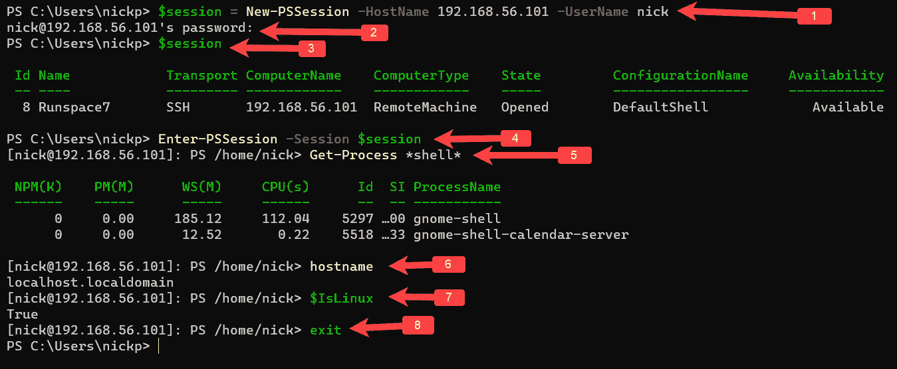

图 14.12 – 通过 SSH 远程连接到 Linux 服务器

上述截图中的编号解释如下：

1.  在*第 1 行*，我创建了一个新的会话对象并将其存储在变量中。我传递了远程机器的 IP 地址，因为我没有设置名称解析。我还传递了一个具有登录权限的远程机器用户的用户名。

1.  在*第 2 行*，系统会要求输入远程用户的密码；一旦密码输入，会创建会话对象。

1.  在*第 3 行*，我调用了`$session`变量，显示了新会话的属性。

1.  在*第 4 行*，我将`$session`变量传递给`Enter-PSSession`，并进入了远程会话。

1.  在*第 5 行*，我们可以看到提示符已经变更为`[nick@192.168.56.101]: PS /home/nick>`，这告诉我们我正在`192.168.56.101`的机器上进行 PowerShell 会话，并且登录用户名是`nick`。工作目录是`/home/nick`。我正在运行`Get-Process` PowerShell cmdlet，查找包含`shell`字符串的进程，返回了两个`gnome`进程。这显然是 Linux——更准确地说，是我的 CentOS 7 图形界面系统。如果我们在 Ubuntu 上运行，可能根本看不到任何进程，前提是没有安装图形界面。

1.  在*第 6 行*，我运行了`hostname` Bash 命令，返回了远程系统的名称：`localhost.localdomain`。

1.  在*第 7 行*，为了避免疑惑，我们可以看到`$IsLinux`自动变量的值是`True`。

1.  最后，在*第 8 行*，我输入`exit`并返回到我本地运行在 Windows 上的 PowerShell 会话。

问题是，我在这里使用了用户名和密码组合，而许多 Linux 机器将被设置为使用基于密钥的身份验证。让我们来看看如何设置它。

## 身份验证

基于密钥的身份验证是一种更安全的 SSH 远程访问方式。它还使得自动化脚本更加简单，因为一旦设置完成，就不需要手动输入密码。让我们看看如何使它正常工作。

PowerShell 7 包括一个名为`Ssh-keygen`的工具，我们可以使用它来创建公钥/私钥对，进而用来认证我们自己到远程机器。我们可以这样使用它：

```
Ssh-keygen -t Ed25519
```

我们正在要求 PowerShell 使用 Ed21559 算法生成一个密钥对，这是相当现代的算法。较旧的系统可能需要我们改用 RSA 算法。系统会要求我们提供保存文件的路径，最好接受默认路径，只需按*Enter*即可。系统还会要求输入密码短语；同样，这个步骤是可选的，我们可以按*Enter*两次以保存没有密码短语的文件。

现在，我们可以将公钥保存到 Linux 机器的`.ssh`目录中，保存路径是我们想要登录的用户目录。PowerShell 还有一个叫做`scp`的工具，我们可以用它来复制文件（注意，可能需要先创建一个.`ssh`目录）：

```
scp c:\Users\<username>\.ssh\id_ed25519.pub <user>@<remote_host>:~/.ssh/authorized_keys
```

我在这里使用`scp`传递两个参数——第一个是我们创建的文件路径，第二个是我们希望将文件复制到的路径。我们会再次被要求提供远程用户的密码，但这是我们最后一次需要这样做。现在，当我们以该用户身份登录时，我们将传递本地机器上私钥的哈希值，这个哈希与远程机器上公钥的哈希值配对，我们就会被识别为远程用户。这就是它在我的机器上的表现：

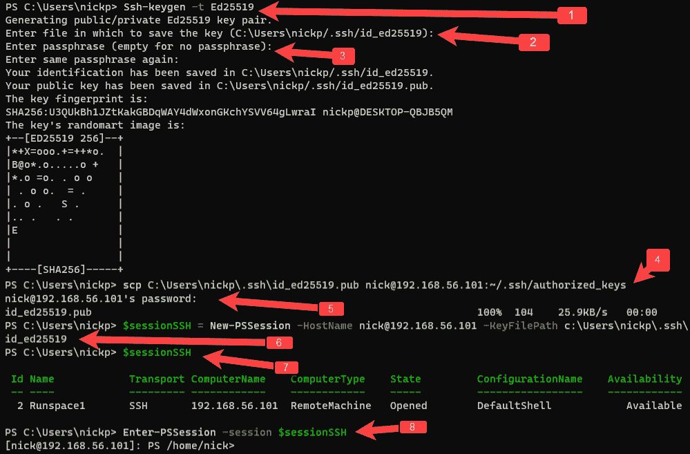

图 14.13 – 设置基于密钥的身份验证

在前面的截图中，我已经运行了设置基于密钥身份验证所需的命令：

1.  在*第 1 行*，我运行`Ssh-keygen`来创建我的密钥对。

1.  在*第 2 行*，我通过按*Enter*接受默认路径。

1.  在*第 3 行*，我通过按*Enter*两次设置了一个空的密码短语。

1.  在*第 4 行*，我使用`scp`将公钥复制到远程机器上用户的`.ssh`目录中。

1.  在*第 5 行*，我提供了密码——希望这是最后一次提供密码。

1.  在*第 6 行*，我将一个新的会话对象存储在名为`$sessionSSH`的变量中。请注意，我没有提供密码，而是提供了`-``KeyFilePath`参数中的私钥路径。

1.  在*第 7 行*，我正在调用变量以检查其属性。

1.  在*第 8 行*，我正在使用`$``sessionSSH`变量进入会话。

1.  在最后一行，我们可以看到提示符已经改变，表明我正在远程会话中工作。

使用 SSH 还有很多要学的内容，但这些已经足够让我们入门。接下来，我们进入本章的最后部分：*macOS 上的 PowerShell*。

# macOS 上的 PowerShell

macOS 与 Linux 非常相似；这两个操作系统都基于 Unix 元素，并且许多 Linux 程序可以在 macOS 上运行，无需修改源代码。我们将关注的差异在于如何安装 PowerShell 和 VS Code。我使用了一个朋友的 MacBook，它运行的是 Ventura（macOS 13）。如果有什么不同的话，在 macOS 上安装比在 Linux 上更简单。

## 在 macOS 上安装 Homebrew

Homebrew 是一个免费的开源包管理器，适用于 Linux 和 macOS，但我们大多在 macOS 上看到它。它非常容易安装和使用，正是我们用来在 macOS 上安装 PowerShell 和 VS Code 的工具。它是通过一行命令安装的。打开终端并输入以下命令：

```
/bin/bash -c "$(curl -fsSL https://raw.githubusercontent.com/Homebrew/install/HEAD/install.sh)"
```

我们将 `curl` 命令传递给 `bash` shell，从一个 URL 下载并运行一个 Bash 脚本。可能会要求我们提供密码。macOS 和 Linux 一样健谈，但几分钟后，我们应该会看到一条消息，显示 `安装成功！`。现在，我们可以安装 PowerShell 了。

## 在 macOS 上安装 PowerShell

一旦安装了 Homebrew，其他一切都很简单。要安装 PowerShell，我们输入以下命令：

```
brew install powershell/tap/powershell
```

就这样。我们可以通过在终端中输入 `pwsh` 启动 PowerShell。这是 Paul 机器上的样子：

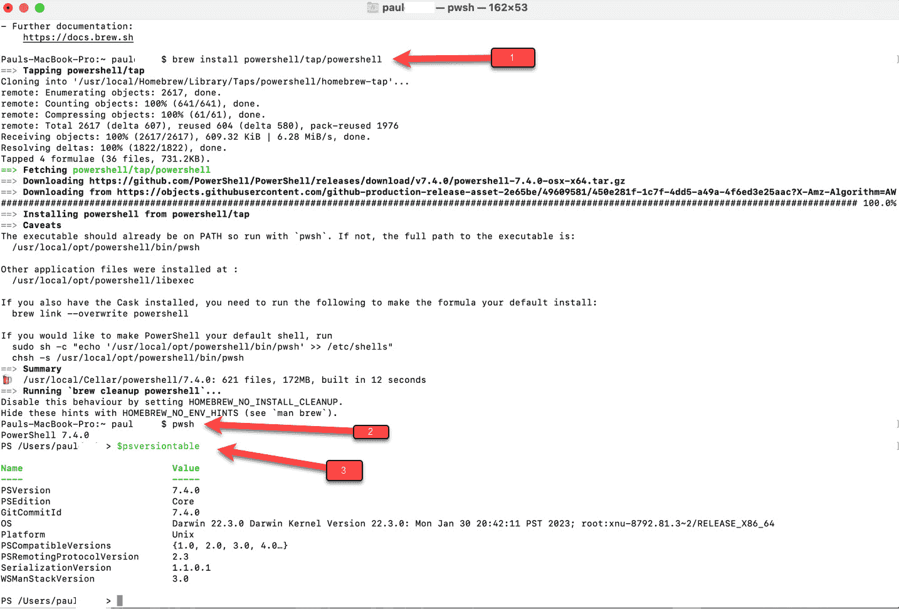

图 14.14 – 在 macOS 上安装 PowerShell

在 *第 1 行* 中，我使用 Homebrew 安装 PowerShell。在 *第 2 行* 中，我使用 `pwsh` 启动 PowerShell，在 *第 3 行* 中，我调用 `$PSVersionTable` 来检查我们安装了什么版本。

我们需要保持 PowerShell 更新。我们可以通过这两行命令来实现：

```
brew update
brew upgrade powershell
```

第一行更新 Homebrew 数据库，第二行根据最新信息升级 PowerShell。

最后，要卸载 PowerShell，我们只需输入以下命令：

```
brew uninstall --cask powershell
```

然而，我不知道为什么我们会想这样做。接下来我们来看如何安装 VS Code。

## 在 macOS 上安装 VS Code

我们可以使用 Homebrew 下载并安装 VS Code，使用以下命令，这会更新 Homebrew 的最新文件：

```
brew update
```

如果 `cask` 仓库尚未存在，这将安装该仓库：

```
brew tap caskroom/cask
```

这会在仓库中搜索 VS Code：

```
brew cask search visual-studio-code
```

这行命令安装它：

```
brew cask install visual-studio-code
```

我们可以使用启动器应用程序启动 VS Code，或者也可以通过以下 `cat` 命令将其添加到 `PATH` 变量中：

```
cat << EOF >> ~/.bash_profile
# Add Visual Studio Code (code)
export PATH="\$PATH:/Applications/Visual Studio Code.app/Contents/Resources/app/bin"
EOF
```

我们也可以通过直接从 [`code.visualstudio.com/`](https://code.visualstudio.com/) 下载并双击下载的文件来安装它。

我们可以通过运行以下命令卸载 VS Code：

```
brew cask uninstall visual-studio-code
```

但我敢打赌我们不想这么做。

本章到此为止。让我们回顾一下所学的内容。

# 总结

在本章中，我们看到安装 PowerShell 和 VS Code 没有标准的方式。我们展示了如何使用包管理器在 Ubuntu 和 RHEL 上安装 PowerShell 7，然后使用直接下载的方法在较旧版本的 Linux（CentOS 7）上进行安装。

之后，我们查看了如何在 Linux 上安装 VS Code，并且在 CentOS 7 上进行了实际操作演示。

我们查看了 PowerShell 在 Linux 上与 Windows 上运行的不同之处，包括文件系统、大小写和别名的使用。

我们花了一些时间讨论了一个重要话题：如何通过 SSH 远程连接到 Linux 机器。Linux 作为桌面操作系统的使用较为罕见，大多数在 Linux 机器上的工作都是通过 SSH 远程会话进行的，无论是使用 PowerShell 还是直接进入 Bash 终端。

最后，我们快速浏览了在 macOS 上安装 PowerShell 和 VS Code 的几种方法。我们看到，通过免费的开源包管理器 Homebrew 安装和卸载这些应用程序非常容易。

在下一章，我们将介绍如何在不同的处理器 ARM 和相关的操作系统 Raspbian 上运行 PowerShell。

# 练习

1.  如果我们需要在 Kali Linux 上安装 PowerShell，应该去哪里寻求支持？

1.  当我们在 Linux 上的 PowerShell 会话中输入 `ls` 时，调用的是哪个命令？

1.  PowerShell 在 Linux 上使用哪个文件路径分隔符？

1.  我们如何轻松判断是否在 macOS 机器上工作？

1.  我们如何在 Linux 中以 root 权限运行 PowerShell 脚本？

1.  我们应该使用哪个 cmdlet 和参数来创建到 Linux 机器的远程会话？

1.  我们应该使用哪个 cmdlet 和参数来避免通过网络发送密码？

1.  `scp` 做什么？

1.  什么是 Ed25519？

# 进一步阅读

+   *在 Linux 上安装 PowerShell*：

    [`learn.microsoft.com/en-us/powershell/scripting/install/installing-powershell-on-linux`](https://learn.microsoft.com/en-us/powershell/scripting/install/installing-powershell-on-linux)

+   *在 Ubuntu 上安装 PowerShell*：

    [`learn.microsoft.com/en-us/powershell/scripting/install/install-ubuntu`](https://learn.microsoft.com/en-us/powershell/scripting/install/install-ubuntu)

+   *在 Red Hat Enterprise* *Linux (RHEL) 上安装 PowerShell*：

    [`learn.microsoft.com/en-us/powershell/scripting/install/install-rhel`](https://learn.microsoft.com/en-us/powershell/scripting/install/install-rhel)

+   *在 macOS 上安装 PowerShell*：

    [`learn.microsoft.com/en-us/powershell/scripting/install/installing-powershell-on-macos`](https://learn.microsoft.com/en-us/powershell/scripting/install/installing-powershell-on-macos)

+   *在 macOS 上运行 Visual Studio Code*：

    [`code.visualstudio.com/docs/setup/mac`](https://code.visualstudio.com/docs/setup/mac)

+   *PowerShell 远程操作* *通过 SSH*：

    [`learn.microsoft.com/en-us/powershell/scripting/learn/remoting/ssh-remoting-in-powershell`](https://learn.microsoft.com/en-us/powershell/scripting/learn/remoting/ssh-remoting-in-powershell)

+   *开始使用 Windows 的 OpenSSH*：

    [`learn.microsoft.com/zh-cn/windows-server/administration/openssh/openssh_install_firstuse?tabs=gui`](https://learn.microsoft.com/zh-cn/windows-server/administration/openssh/openssh_install_firstuse?tabs=gui)

+   *Windows Server 的 OpenSSH 服务器配置* *和 Windows*：

    [`learn.microsoft.com/zh-cn/windows-server/administration/openssh/openssh_server_configuration`](https://learn.microsoft.com/zh-cn/windows-server/administration/openssh/openssh_server_configuration)
