# 15

# PowerShell 7 和 Raspberry Pi

这是我最期待写的章节之一。我家里有一堆 Raspberry Pi（还有 Arduino、micro:bit 和 ESP32 等）。我用它们来教孩子们（和成年人）编程，还用它们运行广告拦截器、媒体中心、野生动物监控摄像头和园艺系统。我有一个 Raspberry Pi，配有按钮，能够随机选择我最喜欢的广播节目并播放（叫做 Shendomizer）。大多数时候，我用 Python 来编程，但 PowerShell 也是一个选择。我们甚至可以在它们上安装简化版的 Windows 10，不过这本书不会讲到这个。相反，我们将讨论如何安装 PowerShell 7 和 **Visual Studio** (**VS**) Code，如何使用 PowerShell 和 VS Code 通过 SSH 远程连接到没有显示器的 Pi，以及 Raspberry Pi 上与 PowerShell 配合使用的默认模块，最后创建一个脚本，完成物理计算的第一步：让 LED 灯闪烁。

本章我们将涵盖的主要内容如下：

+   Raspberry Pi 简介

+   安装 PowerShell 和 VS Code

+   远程连接到 Pi

+   在 Raspberry Pi OS 上运行 PowerShell

+   简单的物理计算

# 技术要求

对于本章内容，我们需要一台 Raspberry Pi、一个电源、屏幕、键盘和鼠标，以及所需的电缆。本章的部分内容是在 Pi 400 上编写的，Pi 400 是一款将 Raspberry Pi 安装在键盘上的方便版本，除了显示器外，其他所需配件都已经包含。其他部分则是使用 Raspberry Pi 3 单板计算机编写的。

请注意，Pi Zero 或 Pi Pico 无法使用。它们使用不同版本的 ARM 芯片，因此架构无法与 .NET 配合使用。

对于简单的自动化，我们需要以下设备：

+   一个面包板

+   一个 LED

+   一个 300-400 欧姆的电阻（但 250-500 欧姆的也可以）

+   两根公对母跳线

# Raspberry Pi 简介

Raspberry Pi 是一款小型、价格实惠且多功能的单板计算机，由英国的 Raspberry Pi 基金会开发。它的主要目标是促进在学校和发展中国家教授基础计算机科学。然而，由于其可获得性、低成本和易用性，使其在爱好者、教育工作者和专业人士中非常流行，用途包括从学习编程到构建复杂的项目。

它被设计成一个空白的起点，让用户理解硬件和软件之间的基本交互。这个计算机本质上是一个小型、自包含的 PC，可以用来完成许多与台式机或笔记本电脑类似的任务，比如浏览网页、文字处理和玩游戏。此外，它的 **通用输入输出** (**GPIO**) 引脚使其能够与外部硬件互动，非常适合用于电子项目和 **物联网** (**IoT**) 应用。

多年来，树莓派已经发布了多个型号，每个型号都对前一代进行了改进。最新的型号是树莓派 4 Model B。该型号配备了 64 位四核 ARM Cortex-A72 CPU，处理速度可达 1.5 GHz。它有 2 GB、4 GB 或 8 GB 的 LPDDR4-3200 SDRAM 可选。为了连接，它支持千兆以太网、蓝牙 5.0 和双频 Wi-Fi（2.4 GHz 和 5.0 GHz）。此外，它还配备了两个 USB 3.0 端口、两个 USB 2.0 端口、两个支持最高 4K 分辨率的 micro HDMI 端口，以及一个用于电源的 USB-C 端口。

树莓派可以运行各种**操作系统**（**OS**），其中树莓派操作系统（以前称为 Raspbian）是最受欢迎的。这个基于 Debian 的操作系统针对树莓派硬件进行了优化，并预装了必要的工具、编程语言和应用程序。用户还可以安装不同版本的 Linux，甚至是 Windows 10 IoT Core 版本。操作系统可以通过将镜像烧录到 MicroSD 卡来安装。

在编程方面，Python 是最常用的语言，因为它简洁且功能强大。然而，树莓派支持众多其他语言，如 JavaScript、PHP、C++、Java，最重要的是，PowerShell 7。它的多功能性使其成为软件开发中的一项有价值的工具，尤其是在物联网和嵌入式系统中。

树莓派的应用范围非常广泛。在教育领域，它被用来教授编程、计算机科学基础，甚至硬件设计。爱好者用它来制作复古游戏主机、媒体中心和智能家居系统。在专业领域，它作为一种经济实惠的工具，用于原型制作、数据收集和自动化。我们也可以用它进行并行计算；例如，英国 GCHQ 运行的 OctaPi 项目就是一个例子。一些机构甚至将它用于超级计算机；洛斯阿拉莫斯国家实验室就用树莓派搭建了一个 750 节点的高性能计算机。

自 2012 年发布以来，树莓派生态系统不断扩展。树莓派有三种独立的系列：Pi 系列、Pi Zero 系列，后者作为轻量级且更便宜的替代品，适用于专门的项目，并可以持续运行（我有几台使用可充电电池运行的 Pi Zero 野生动物相机），以及 Pi Pico 系列，作为流行的 Arduino 单板计算机的替代品。PowerShell 7 仅能在完整版本的 Pi 上运行，不能在 Pi Zero 或 Pico 上运行。这些更小的替代品运行在 ARMv6 架构的芯片上；而 .NET，因此 PowerShell 7，需要 ARMv7 或 ARMv8 架构的芯片，正如树莓派 2、3 和 4 所使用的那样。这部分是因为 ARMv6 功耗较低，但也因为没有人愿意为老旧硬件设计，不是吗？

好的，我们开始在 Pi 上安装 PowerShell 吧？

# 安装 PowerShell 7 和 VS Code

Raspberry Pi OS 是基于 Debian 的 Linux 发行版，和 Ubuntu 一样，所以我们在 *第十四章* 中跟随的 Ubuntu 指令，*PowerShell 7 for Linux 和 macOS*，也适用，但有一种更简单的方法。

## 安装 PowerShell

如果我们访问 *PowerShell 在 Linux 上的社区支持* 页面 [`learn.microsoft.com/en-us/powershell/scripting/install/community-support`](https://learn.microsoft.com/en-us/powershell/scripting/install/community-support)，我们会找到一个非常方便的脚本，它将为我们安装 PowerShell，如下截图所示：

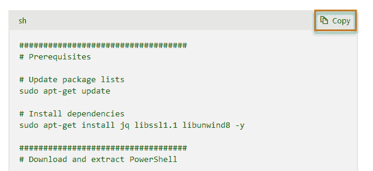

图 15.1 – Raspberry Pi OS 安装脚本

如果我们点击脚本框右上角的 **复制** 按钮，我们可以简单地在 Raspberry Pi 上打开终端窗口，右键粘贴到终端中，如下所示：

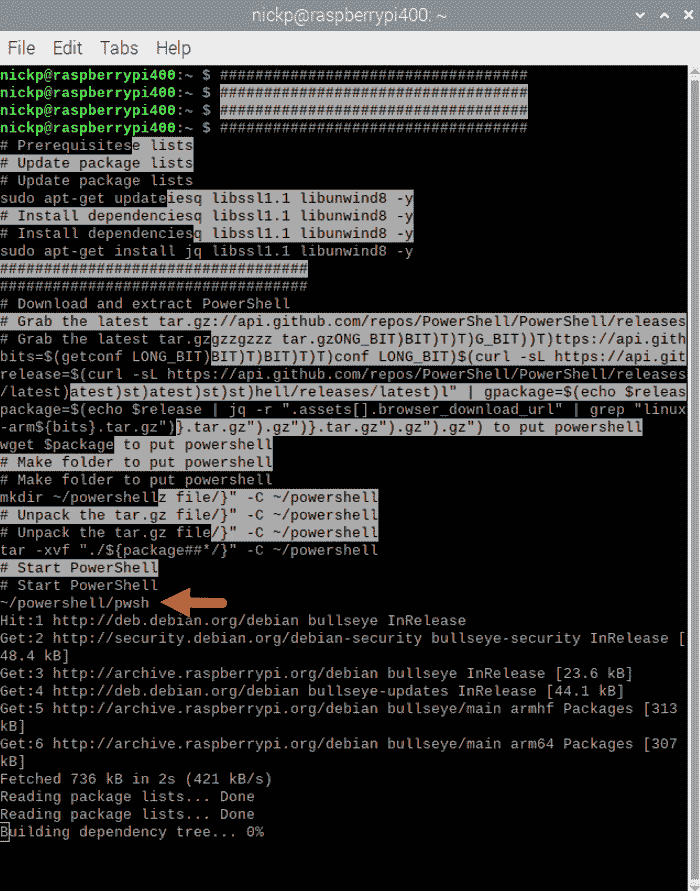

图 15.2 – 通过将脚本粘贴到终端安装 PowerShell

粘贴完脚本后，我们只需按下前面截图中高亮显示的那一行上的 *Enter* 键，脚本就会运行，安装并启动 PowerShell。

当然，这可能容易出错，所以我们可能希望实际创建一个脚本，检查它是否正确，然后执行它。为此，从终端提示符输入以下命令：

```
nano
```

这将打开 nano 文本编辑器。将脚本粘贴到 nano 中，如下所示：

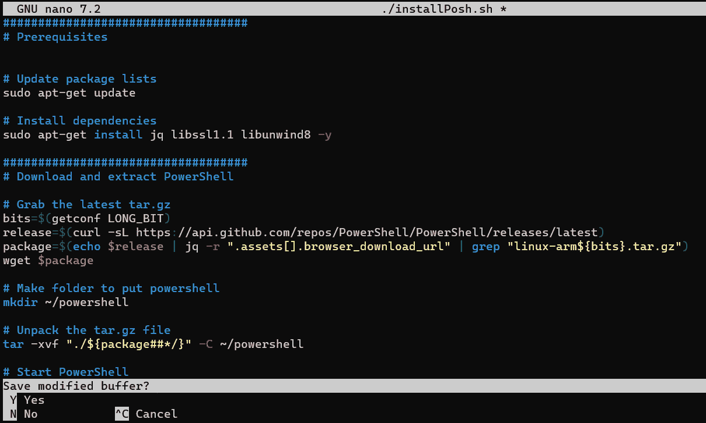

图 15.3 – 在 nano 中创建 PowerShell 安装脚本

检查你是否已正确粘贴脚本，然后按 *Ctrl* + *X* 保存，系统提示时输入 *Y* 以保存文件，并为文件命名——我将我的命名为 `installPosh.sh`。返回到终端提示符后，我们可以通过输入以下命令来运行脚本：

```
sudo bash ./installPosh.sh
```

再次，我们将直接进入 PowerShell。现在，让我们来看看安装 VS Code。

## 安装 VS Code

将 VS Code 安装到我们的 Pi 上更容易。VS Code 已包含在 Raspberry Pi OS 的官方软件库中，所以我们不需要手动下载文件或设置替代软件库——我们只需打开终端并输入以下命令：

```
sudo apt-get update
sudo apt install code
```

完成后，几分钟内，VS Code 将出现在我们的机器上，并伴随许多信息：

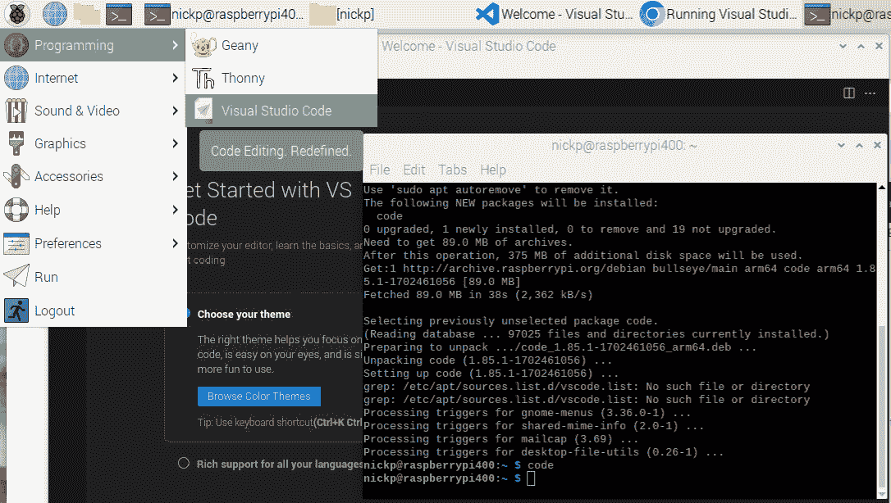

图 15.4 – 在 Raspberry Pi 上安装并启动 VS Code

我们可以在终端中输入 `code`，或者通过点击左上角的树莓图标，进入 **编程** 子菜单，从应用程序菜单中找到它。

现在，让我们来看一下我最常用的 Raspberry Pi 使用方式：远程连接。

# 远程连接到 Pi

虽然在教育环境中，Raspberry Pi 被用作个人电脑是很常见的，但更有可能的是我们想把它作为某种服务器使用，因此我们会希望远程连接，而不是为其配置独立的显示器、鼠标和键盘。这被称为**无头**模式，接下来我们将讨论这个模式。

## 使用无头模式的 Pi

要使用无头模式的 Pi，我们需要设置它，使其能够连接到网络并远程访问。我们将配置一个新的 Pi（或者重新构建旧的 Pi），使其能够访问无线网络，并使用 SSH 进行访问，这在*第十四章*中已经提到过，*Linux 和 macOS 上的 PowerShell 7*。我们可以通过 Raspberry Pi 网站上的 Raspberry Pi Imager 工具来设置这两项功能，网址是 [`www.raspberrypi.com/software/`](https://www.raspberrypi.com/software/)。需要注意的是，许多网上文档建议我们可能需要创建并编辑一个名为 `wpa_supplicant.conf` 的文件。这对老版本的 Raspberry Pi OS 和 Raspbian 是适用的，但最新版本不会使用它。

下载适合我们将要运行操作系统的安装程序版本——在我的情况下是 Windows——并进行安装。

当我们运行它时，如果没有保持图形驱动程序更新，可能会遇到 OpenGL 错误，因此请确保安装了最新的驱动程序。

我们还需要一张准备好进行镜像的 microSD 卡。

当我们打开镜像工具时，会询问我们想安装在哪个设备上，想要什么操作系统，以及使用什么存储设备，如下所示：

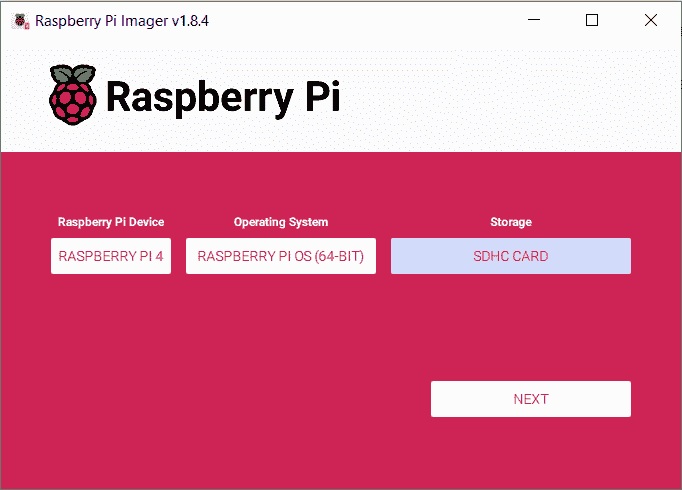

图 15.5 – Raspberry Pi Imager 工具

在我的情况下，我正在安装在 Raspberry Pi 4 上，我想要最新的 64 位操作系统，并且我希望将镜像写入我笔记本电脑上的 SDHC 卡。当我们点击**下一步**时，会询问是否要应用操作系统定制设置。是的，我们要。点击**编辑设置**，我们将看到**操作系统定制**对话框打开在**常规**标签页上，如下所示：

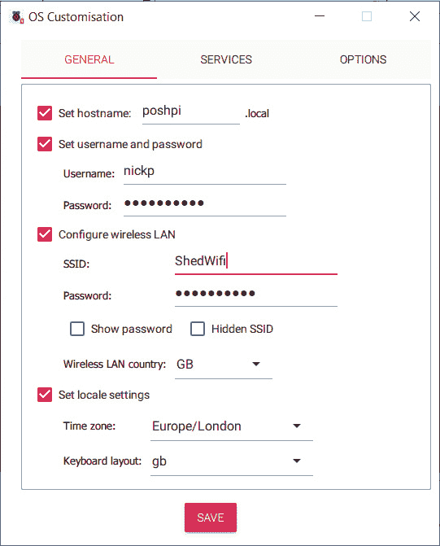

图 15.6 – 定制我们的 Raspberry Pi 操作系统

在前面的截图中，我已设置了我的主机名、希望在 Pi 上使用的用户名和密码，最重要的是，我配置了无线局域网设置，使其能够自动连接到我想要使用的 Wi-Fi 网络 `ShedWifi`，这是我小屋里的 Wi-Fi 网络。现在，我们需要切换到**SERVICES**选项卡以启用 SSH。默认情况下，当我们点击**启用 SSH**时，它会选择**使用密码认证**。我将继续使用此设置，但我们也可以配置为**仅允许公钥认证**。如果我们点击**保存**，会收到警告，提醒我们目标 SDHC 卡上的所有数据将被覆盖，并要求我们确认此操作。一旦确认，几分钟后，我们会收到一个**写入成功**的弹窗，告诉我们可以移除 SDHC 卡。让我们照做——将其插入 Pi 并开机。**SERVICES**选项卡在以下截图中显示：

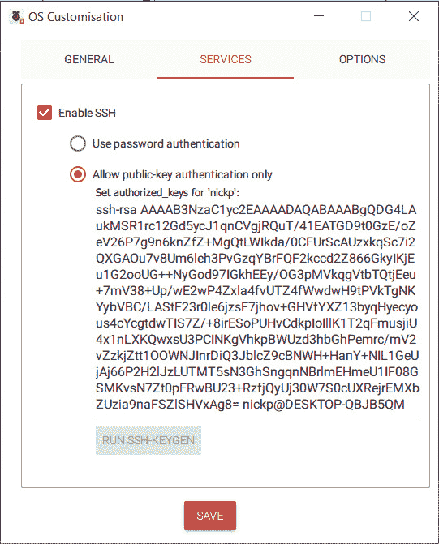

图 15.7 – Raspberry Pi Imager 的 SERVICES 选项卡

一旦 Pi 启动，我们应该能够在网络上看到它，前提是我们的客户端与 Pi 在同一个子网内。为了测试这一点，在客户端的 PowerShell 会话中，输入以下内容：

```
Test-NetConnection <pi hostname> -InformationLevel Detailed
```

我们应该能看到 IPv6 和 IPv4 地址，以及许多其他信息：

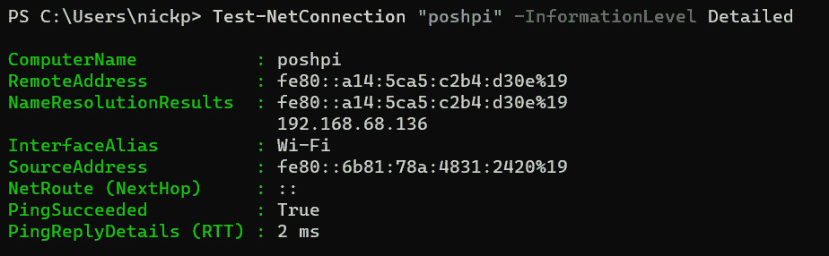

图 15.8 – 确认我的 Pi 是否存在

如我们所见，我的 Pi 已经获得了它的 IP 地址，正如预期的那样，现在我可以连接到它。

让我们试试吧。

## 使用 PowerShell 连接到 Pi

在客户端的 PowerShell 会话中，输入以下内容：

```
ssh <pi hostname>
```

如果客户端和主机上的用户名不同，你可以输入以下内容：

```
Ssh <username>@<hostname>
```

以下截图显示了该过程的样子：

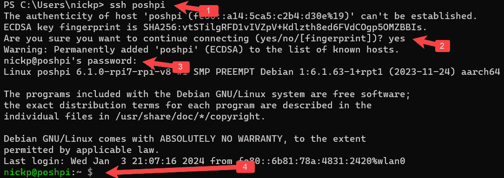

图 15.9 – 使用 SSH 连接到 Pi

在第 1 行，我们使用 `ssh` `poshpi` 命令开始了一个 SSH 会话连接到 Pi。

在第 2 行，我们被提示同意连接，因为无法验证 Pi 的真实性。我们大概可以在这里输入 `yes`；请注意，单独输入 `Y` 是无效的。

在第 3 行，我们被要求输入用户的密码——在我的情况下，这是 `nickp`。

在第 4 行，我们看到来自 Pi 的 bash 提示符——即 `nickp@poshpi.local:~ $`。

现在，我们需要安装 PowerShell。我们可以像之前那样安装——也就是通过将微软脚本的内容复制到命令行，或者在 nano 中创建一个 bash 脚本。安装完成后，我们可以使用以下命令启动 PowerShell：

```
~/powershell/pwsh
```

另外，我们可以创建一个**符号链接**（**symlink**），像这样：

```
sudo ln -s ~/powershell/pwsh /usr/bin/pwsh
```

然后，未来我们只需输入 `pwsh`，就像这样：

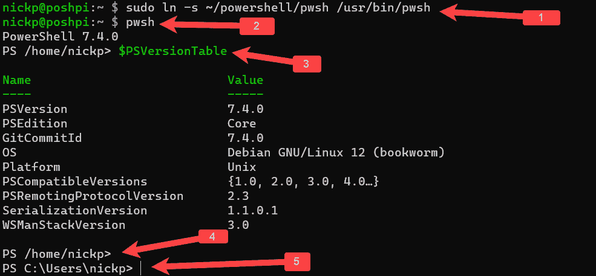

图 15.10 – 设置符号链接以运行 PowerShell

在第 1 行，我们创建了一个符号链接，在第 2 行，我们启动了 PowerShell。

在第 3 行，我们正在通过`PS /home/nickp>`提示符在 Linux 上运行 PowerShell；我们可以调用`$PSVersionTable`变量查看我们运行的 PowerShell 版本。

最后，在第 4 行，我们使用*Ctrl* + *Break*退出 SSH 会话并返回到在 Windows 客户端上运行的 PowerShell 会话——`PS C:\users\nickp>`——在第 5 行。我们还可以使用*Ctrl* + *D*注销会话。

很棒！让我们来看另一种连接到无头 Pi 的方法：使用 VS Code。

## 使用 VS Code 连接到 Pi

这种方法适用于我们希望通过 SSH 连接的任何计算机，包括 Linux。我们将使用一个名为`Remote-SSH`的 VS Code 扩展，在搜索栏中输入，如下所示：

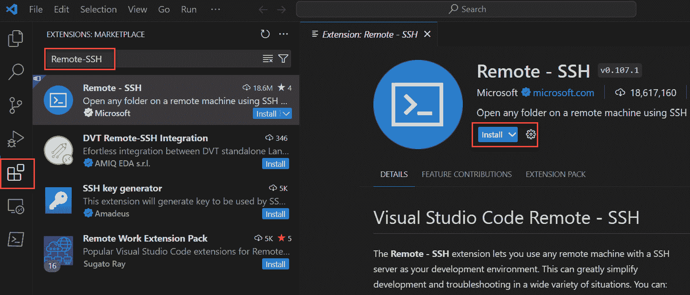

图 15.11 – 安装 Remote – SSH 扩展

找到扩展后，点击它，然后在中间窗格点击**安装**，如前面的截图所示。

完成此操作后，我们将在左侧边栏中看到一个桌面图标。点击该图标可以打开**远程资源管理器**窗口并设置与 Pi 的 SSH 连接。我们将被要求选择远程类型——远程计算机或 WSL 目标。我们选择远程计算机，所以选择它，然后点击**SSH**：

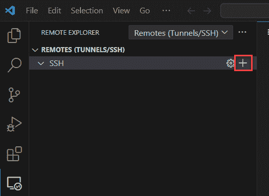

图 15.12 – 选择 SSH

点击`ssh <username>@<hostname>`。在我的情况下，我输入了以下内容并按下*Enter*：

```
ssh nickp@poshpi
```

接下来，我们将被要求选择一个 SSH 配置文件来更新。我正在更新我的个人文件，`C:\Users\nickp\.ssh\config`。然后，我们将看到一个消息框提示我们**主机已添加！** 在**远程资源管理器**区域，点击**远程（隧道/SSH）**旁边的刷新图标，如*图 15.13*中绿色高亮显示的部分；我们应该会看到新主机出现在**SSH**子部分，旁边有两个图标——一个用箭头表示的是打开当前窗口中的主机，另一个用红色高亮显示的是在新窗口中打开。点击*新窗口中连接*图标：

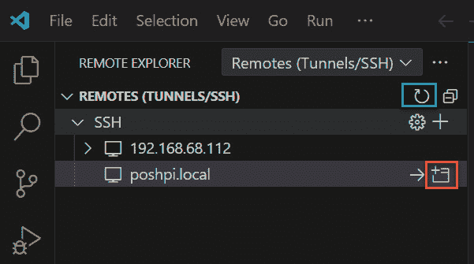

图 15.13 – 打开与 Pi 的连接

接下来，我们将被要求选择远程主机的平台；选择 Linux。我们还需要输入密码。完成后，我们需要等待一两分钟来完成设置，并关闭一两个消息窗口。最后，我们将会看到一个新窗口连接到我们的 Pi；我们知道这一点是因为在左下角会显示一个框，里面写着**SSH: <hostname>**。在这个窗口中做的所有操作都发生在 Pi 上。很酷吧？这意味着，我们不再需要在客户端上编写脚本并将其传输到 Pi，而是可以直接从 VS Code 编写到 Pi。

好了，准备好了。我们可以像本书中展示的那样，在 Pi 上使用 PowerShell，但那并不是我使用 Raspberry Pi 的主要目的。接下来，我们将看看如何在 Pi 上使用 PowerShell。

# 在 Raspberry Pi OS 上运行 PowerShell

Raspberry Pi 的魅力在于它能以多种方式与外部世界连接，从摇杆控制器到相机，再到传感器、马达，甚至……哦，*所有东西*。在这一章中，我们将学习如何使用 GPIO 引脚让 LED 闪烁，但首先，我们需要了解如何与 GPIO 交互。这里有两个选项，都不太完善。更好的选择是安装一个新的操作系统：Windows 10 IoT Core。这本身就需要一到两章的篇幅，而且并未真正解决在 Raspberry Pi OS 上运行 PowerShell 的问题。另一种方法是使用 PowerShell IoT 模块。自 2020 年以来，这个模块没有更新，似乎也不支持较新的 Pi 4B 版本，但它在旧版本上运行相当不错，我们只能希望它未来能得到更新。我打算利用我抽屉里的 Pi 3B。

## 安装 IoT 模块

我们在这里使用硬件，因此需要以 root 权限启动 PowerShell，输入以下命令：

```
sudo pwsh
```

一旦进入 PowerShell，我们可以像往常一样安装模块：

```
Install-Module Microsoft.powershell.iot
```

最后，我们可能需要从 GitHub 克隆仓库，这样我们就可以访问示例了。我们可以通过以下命令实现：

```
git clone https://github.com/PowerShell/PowerShell-IoT.git
```

这将把 GitHub 仓库中的所有代码安装到我们选择文件夹下的新文件夹中：

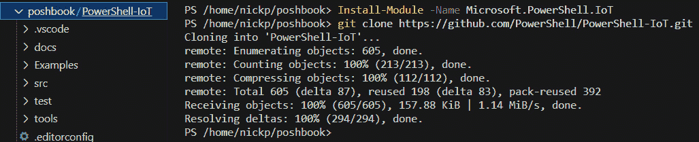

图 15.14 – 安装 PowerShell IoT 模块并克隆 GitHub 仓库

这让我们可以访问 `Examples` 文件夹中的所有示例模块。里面包括一些有趣的工具，我们可以用来配合各种传感器，比如 BME280 环境传感器。

下一步是导入模块并检查它是否正常工作：

```
Import-Module Microsoft.PowerShell.IoT
Get-GpioPin 15
```

如果运气好的话，我们会看到类似以下的内容：

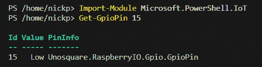

图 15.15 – 导入模块并检查给定 GPIO 引脚的电压

我们是否要探索一下这个模块中的 cmdlet？

## 探索 IoT 模块

在 IoT 模块中，有六个 cmdlet 用于操作 Pi 上的三种 I/O 接口：简单 GPIO、I2C 和 **同步外设接口** (**SPI**)。令人困惑的是，这三个接口都使用 GPIO 引脚。这有时会使我们很难选择哪些引脚用于特定的目的：

+   简单的 GPIO 读取或设置特定 GPIO 引脚的电压，使用一对名为 `Get-GpioPin` 和 `Set-GpioPin` 的 cmdlet。我们很快就会使用到这个。

+   I2C 使用 `Get-I2CRegister` 和 `Set-I2CRegister`，还有一个 `Get-I2CDevice` cmdlet。

+   最后是 SPI。这相当复杂，我们在本书中不打算深入探讨。这里只有一个 cmdlet：`Send-SPIData`。

让我们更仔细地看看我们最常使用的五个 cmdlet。这些 cmdlet 的帮助文件可以在 `/home/<username>/PowerShell-IoT/docs/help/` 文件夹中找到，但我们在这里简单介绍它们的基本用法：

+   `Get-GpioPin`：此 cmdlet 获取指定 GPIO 引脚的电压。它有三个参数：

    +   `-Id`，它接受一个 Int32 值，指定我们要查看的 GPIO 引脚。

    +   `-PullMode`，可以设置为 `Off`、`PullDown` 或 `PullUp`，某些芯片组可能需要此设置，但树莓派不需要。默认值为 `Null`。

    +   一个 `-Raw` 开关，它返回 `High` 或 `Low` 的值。

+   `Set-GpioPin`：此 cmdlet 将指定引脚的电压设置为 `High` 或 `Low`。它有三个参数：

    +   `-Id`，它接受一个 `Int32` 值，指定引脚。

    +   `-Value`，它接受 `High` 或 `Low` 值。

    +   `-PassThru`，默认情况下，该 cmdlet 不返回任何内容。如果我们希望它返回一个 PowerShell 对象，确认已设置该值，那么可以使用此参数。

+   `Get-I2CDevice`：此 cmdlet 创建一个 I2C 设备对象，并为其分配一个友好的名称，之后可以与 `*-I2Cregister` cmdlet 一起使用。它有两个参数：

    +   `-Id`，它接受一个 `Int32` 值，并指定设备的地址

    +   `-FriendlyName`，用于为设备分配一个字符串

+   `Get-I2Cregister`：此 cmdlet 获取特定设备上寄存器中的值。它有四个参数：

    +   `-Device`，它接受一个 I2C 设备对象

    +   `-Register`，它接受一个 `Uint16` 值，指定我们要读取的设备上的寄存器

    +   `-Raw`，它返回寄存器中存储的值，而不是 `I2CdeviceRegisterData` 对象

    +   `-Bytecount`，它接受一个字节值，并指定数据中预期的字节数

+   `Set-I2Cregister`：此 cmdlet 设置设备上的寄存器值。它有四个参数：

    +   `-Device`，它接受一个 I2C 设备对象。

    +   `-Register`，它接受一个 `Uint16` 值，指定我们要设置的设备上的寄存器。

    +   `-Data`，一个字节值，用于写入寄存器。

    +   `-PassThru`，默认情况下，该 cmdlet 不返回任何内容。如果我们希望它返回一个 PowerShell 对象，确认已设置该值，那么可以使用此参数。

就是这样。最好的方法是亲自上手并尝试，看看它们如何工作。

# 简单的物理计算

Raspberry Pi 的物理计算使用的是板子右侧的 GPIO 引脚，如下所示：

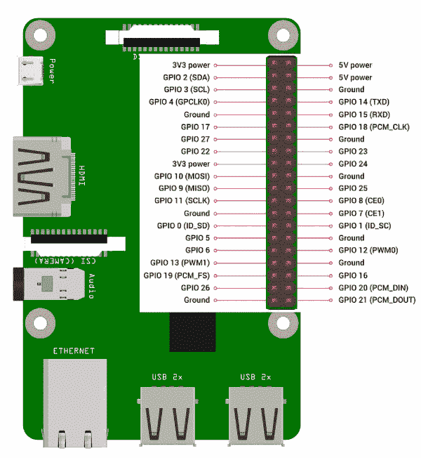

图 15.16 – Raspberry Pi 的 GPIO 引脚

需要记住的重要事项是，接地引脚为负，电压引脚 3V3 和 5V 为正且始终开启。虽然 GPIO 引脚可能有其他特殊用途，但它们是我们可以开关的引脚——它们会输出正电流。

当我们学习一种新的编程语言时，通常会从最简单的程序开始——*Hello World*：

```
Write-Output "Hello World"
```

在 Python 中，我们可以编写如下代码：

```
print("Hello World")
```

物理计算稍微不同——我们编写一个程序让 LED 闪烁。平台似乎无关紧要，这就是我们开始的地方。例如，让 Arduino 闪烁 LED 的程序是用 C 语言写的，类似这样：

```
void setup() {
    pinMode(LED_BUILTIN, OUTPUT);
}
void loop() {
  digitalWrite(LED_BUILTIN, HIGH);
  delay(1000);
  digitalWrite(LED_BUILTIN, LOW);
  delay(1000);
}
```

`v``oid setup()`初始化板载 LED 为输出，并在每次重置 Arduino 时运行一次。`void loop()`命令设置了一个在 Arduino 打开时持续运行的循环（`void`只是告诉 Arduino 不产生输出）。`digitalwrite()`命令将电压设置为`HIGH`（开）或`LOW`（关）。在树莓派上，这在 Python 中看起来也很相似：

```
From RPi.gpio import LED
Red_led = LED(17)
Red_led.blink(on_time=1, off_time=1)
```

让我们在 PowerShell 中试试。首先，我们需要根据以下示意图设置硬件：

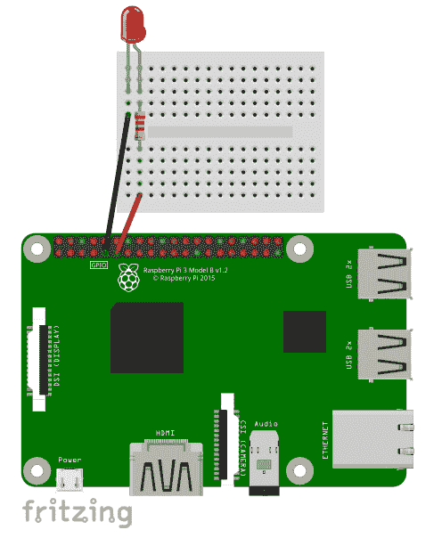

图 15.17 – 如何设置组件

LED 上会有两条腿，其中一条比另一条长。长腿需要连接到电路的正极，短腿需要连接到负极或接地端。树莓派输出的电流对 LED 来说太高，所以我们需要使用大约 300-400 欧姆的电阻来稍微降低电流。如果电阻大于 1K 欧姆，可能会导致 LED 不亮；如果小于 200 欧姆，电流过大可能会烧坏 LED（如果 LED 比较便宜的话）。面包板插孔是按五列连接的，因此电阻会跨越两列。

现在，我们需要编写一些 PowerShell 代码来控制 LED 的开关。让我们使用 VS Code 的 SSH 远程连接到树莓派，打开一个新文档，命名为`blink.ps1`。

让我们首先导入 IoT 模块：

```
Import-Module Microsoft.PowerShell.IoT
```

现在，我们需要一个始终运行的循环：

```
While ($true) {
}
```

在这个循环中，我们需要使用`Set-GpioPin`来控制 LED 的开关。如果你遵循了前面的示意图，你应该使用 17 号引脚。

我们还需要使用`Start-Sleep`来在每个命令之间等待；否则我们可能会把 LED 烧坏：

```
Import-Module Microsoft.PowerShell.IoT
while ($true) {
    Set-GpioPin -Id 17 -Value "High"
    Write-Host "LED on"
    Start-Sleep 1
    Set-GpioPin -Id 17 -Value "Low"
    Write-Host "LED off"
    Start-Sleep 1
}
```

我在这里添加了几行输出代码，以便我能够在不使用 YouTube 链接的情况下合理展示。运行结果在 VS Code 中是这样的：

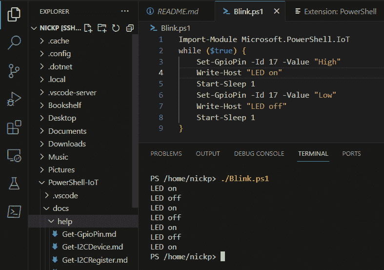

图 15.18 – 闪烁的 LED

正如我们所见，LED 的状态每秒变化一次；直到手动停止脚本，它将继续变化。我们可以看到它与我们为 Arduino 编写的 C 程序和 Python 程序进行比较的方式。

`Examples`文件夹中还有一个 LED 模块示例——非常值得看看，看看他们是如何做的。

这一章差不多就到这里了。让我们总结一下我们学到的内容。

# 总结

我们从快速了解树莓派开始，包括它的功能、设计用途以及人们如何使用它。我们看了不同的系列；主要的 B 系列单板计算机、Zero 迷你版以及 Pico 单芯片板。我们了解到，由于 Zero 和 Pico 系列的芯片架构不匹配，我们只能在 B 系列上安装 PowerShell。

接下来，我们查看了使用 Microsoft 提供的脚本在 Pi 上安装 PowerShell 的不同方法。然后，我们发现安装 VS Code 在 Pi 上是如此简单，因为它已包含在官方的 Raspberry Pi 仓库中。

虽然有一些适合作为桌面 PC 替代品的 Raspberry Pi 型号，但大多数人将使用没有屏幕或鼠标的 Raspberry Pi —— 即在无头模式下。我们了解了如何在无头模式下设置 Raspberry Pi，然后如何通过 PowerShell 使用 SSH 连接到它，接着再看了如何通过 VS Code 直接在 Pi 上方便地工作。

然后，我们讨论了 Pi 最受欢迎的应用案例之一：物理计算。这是我们与物理世界中的传感器和物体进行交互的地方。我们查看了 Microsoft 模块，用于与 Raspberry Pi 上的 GPIO 进行交互，并通过一个脚本来实现 LED 闪烁的功能。

这就是我们将要查看的所有环境内容。在下一章也是最后一章中，我们将探讨如何访问 PowerShell 所依赖的 .NET 系统，并讨论接下来的步骤。

# 问题

1.  为什么我们不能在 Raspberry Pi Zero 或 Pico 上安装 PowerShell？

1.  VS Code 在 Windows 机器上的 SSH 配置存储在哪里？

1.  用于测试 Raspberry Pi 与另一台设备的网络连接的 PowerShell cmdlet 是什么？

1.  如何从 PowerShell 创建到无头 Pi 的 SSH 连接？

1.  我们已经将安装脚本保存为 `Install.sh`。我们该如何运行它？

1.  为什么我们可能要创建指向 `pwsh` 可执行文件的符号链接？

1.  我们如何创建指向 `pwsh` 的符号链接？

1.  如何从 GPIO 引脚获取 `High` 或 `Low` 的值？

1.  Raspberry Pi OS 是什么样的操作系统？

# 进一步阅读

+   OctaPi 集群计算机：[`projects.Raspberrypi.org/en/projects/build-an-octapi`](https://projects.Raspberrypi.org/en/projects/build-an-octapi)

+   Oracle 的 1050 节点 Pi 超级计算机：[`blogs.oracle.com/developers/post/building-the-worlds-largest-Raspberry-pi-cluster`](https://blogs.oracle.com/developers/post/building-the-worlds-largest-Raspberry-pi-cluster)

+   Linux 上 PowerShell 的社区支持：[`learn.microsoft.com/en-us/powershell/scripting/install/community-support`](https://learn.microsoft.com/en-us/powershell/scripting/install/community-support)

+   ARM 处理器上的 PowerShell：[`learn.microsoft.com/en-us/powershell/scripting/install/powershell-on-arm`](https://learn.microsoft.com/en-us/powershell/scripting/install/powershell-on-arm)

+   在 Pi 上的 VS Code：[`code.visualstudio.com/docs/setup/raspberry-pi`](https://code.visualstudio.com/docs/setup/raspberry-pi)

+   VS Code 远程 SSH：[`code.visualstudio.com/docs/remote/ssh-tutorial`](https://code.visualstudio.com/docs/remote/ssh-tutorial)

+   GitHub 上的 PowerShell IoT 模块：[`github.com/PowerShell/PowerShell-IoT`](https://github.com/PowerShell/PowerShell-IoT)

+   Windows for IoT 概述：[`learn.microsoft.com/en-us/windows/iot/product-family/windows-iot`](https://learn.microsoft.com/en-us/windows/iot/product-family/windows-iot)

+   Windows 10 IoT Core 在树莓派上的应用：

    +   [`cdn-learn.adafruit.com/downloads/pdf/getting-started-with-windows-iot-on-raspberry-pi.pdf`](https://cdn-learn.adafruit.com/downloads/pdf/getting-started-with-windows-iot-on-raspberry-pi.pdf)

    +   [`devblogs.microsoft.com/premier-developer/getting-started-with-windows-10-iot-core-raspberry-pi-3b/`](https://devblogs.microsoft.com/premier-developer/getting-started-with-windows-10-iot-core-raspberry-pi-3b/)

+   树莓派配置文档：[`www.raspberrypi.com/documentation/computers/configuration.html`](https://www.raspberrypi.com/documentation/computers/configuration.html)

+   I2C 概述：

    +   [`en.wikipedia.org/wiki/I%C2%B2C`](https://en.wikipedia.org/wiki/I%C2%B2C)

    +   [`learn.sparkfun.com/tutorials/i2c/all`](https://learn.sparkfun.com/tutorials/i2c/all)

+   SPI 概述：[`learn.sparkfun.com/tutorials/serial-peripheral-interface-spi/all`](https://learn.sparkfun.com/tutorials/serial-peripheral-interface-spi/all)
