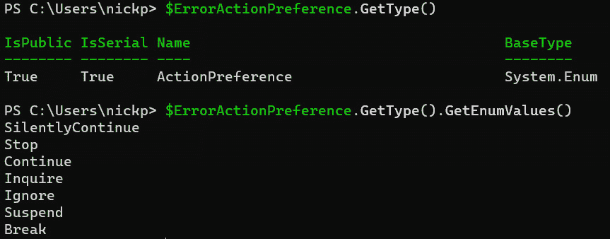

# 使用 PowerShell 和 .NET

现在，我们来到了最后一章。我们将探讨 PowerShell 7 所依赖的产品——.NET，以及如何利用它扩展我们在 PowerShell 中能做的事情。需要注意的是，这一章只能提供一个简短的概览；.NET 是一个庞大的主题，关于它的书籍远远多于关于 PowerShell 的书籍。PowerShell 只是一个基于 .NET 编写的应用程序，它仅触及了我们在 .NET 中可以做的一部分事情。话虽如此，还是让我们来看看它的工作原理，以及我们可以用它做一些什么令人兴奋的事情。

本章将涵盖的主要内容如下：

+   探索 .NET

+   .NET 的组件

+   在 PowerShell 中使用 .NET

+   使用 .NET

# 探索 .NET

**.NET**（**dot-net**）是一个软件框架。它是免费的、开源的，可以用来编写 Web 应用程序、命令行应用程序和运行在 **图形用户界面** (**GUI**) 下的应用程序。它基于专有的 .NET 框架，这个框架是 Windows 操作系统所使用的。它可以与多种编程语言一起使用，包括 C#、F# 和 Visual Basic .NET。让我们来详细了解一下吧？

## 软件框架解释

软件框架是构建应用程序的工具。一些框架是为特定目的和特定语言编写的；AngularJS 是一个用于开发 JavaScript Web 应用程序前端的框架。PhaserJS 是一个游戏开发框架，同样适用于 JavaScript。虽然框架包含了许多类库，但与类库不同，框架需要在其结构内工作。类库为我们的代码提供工具，可以随意使用；而框架则规定了应用程序的基本结构，我们需要在此基础上提供具体的实现。

.NET 实现了 **公共语言基础设施** (**CLI**)，允许不同的高级语言（如 C#）在多个操作系统平台上使用，而无需为每个架构重写代码；这就是 PowerShell 7 如何能够在 Intel 和 ARM 处理器上运行的原因。通过安装正确版本的 .NET，我们的 PowerShell 代码就能在任何地方运行。

一个名为 **CoreFX** 的 .NET 组件包含了 .NET 类库、接口和值类型，组成了 **框架类库**。不过，.NET 提供的不仅仅是类库。 .NET 应用程序在一个名为 **CoreCLR** 的虚拟机中运行，就像 Java 应用程序在 Java 虚拟机中运行一样。

## 公共语言基础设施

CLI 是由微软开发的开放技术标准，主要只存在于 .NET 的不同变种中，尽管也有一个叫做 **Mono** 的开放开发平台也使用它。CLI 定义了五个要素：

+   **公共类型系统（CTS）** – 可由编程语言通过框架访问的类型集合。

+   **元数据**，用于描述程序结构。

+   **公共语言规范（CLS）** – 使用框架的规则。

+   **虚拟执行系统（VES）** – 它加载并执行应用程序。它使用元数据在运行时执行用兼容语言生成的代码，并将其编译成平台无关的 **公共中间语言（CIL）**，然后将其即时编译为平台特定的机器语言。在 .NET 中，VES 是通过 CoreCLR 组件实现的。

+   **标准库**，提供常用功能，如访问网络和文件。

让我们来看一下 CoreCLR 组件。

## 公共语言运行时 – CoreCLR

CoreCLR 提供了一个公共语言运行时，这是一个位于应用程序和操作系统之间的层。它的原理类似于 PowerShell 程序；.NET 应用程序需要在机器上运行 .NET 才能将应用程序代码解释为机器代码。这意味着 PowerShell 需要 .NET 运行，因为 PowerShell 本身是一个 .NET 应用程序。

然而，CoreCLR 不仅仅提供运行时。它还包括额外的服务，如内存管理（为应用程序分配虚拟内存的一部分）、垃圾回收（回收不再需要的未使用内存）和线程管理。这意味着，当我们使用 .NET 编写应用程序时，我们无需担心内存泄漏或内存寻址错误，因为这些都由 CoreCLR 为我们处理。

幸运的是，我们不需要知道 CoreCLR 是如何工作的，就能在 PowerShell 中使用 .NET。我们感兴趣的大部分内容都在库中 – CoreFX。

## 框架类库 – CoreFX

CoreFX 包含了 .NET 使用的类库，其中包括类型、函数和类。例如，所有 PowerShell 数据类型都是可用 .NET 类型的一个子集。我们已经看到这一点；在 *第四章*《PowerShell 变量与数据结构》中，我们看到改变 PowerShell 数组内容是资源密集型的，因为每次改变数组时，我们会创建一个新数组并删除旧数组。我们看到，解决这个问题的方法之一是使用一个在 PowerShell 中原生不可用的 .NET 类型 `ArrayList`，就像这样：

```
$ArrayList = [System.Collections.ArrayList]@()
1..10000 | ForEach-Object { $Null = $ArrayList.Add($_) }
```

我们使用 `[System.Collections.ArrayList]` 完整的 .NET 类型来将数组设置为 `ArrayList`。有时候，使用 .NET 确实是这么简单。

## .NET 历史

.NET Framework 首次发布于 2002 年，旨在创建 Windows 应用程序。它引入了微软的**托管代码**概念，即只与 CLI 交互的代码。托管代码可以更严格地控制资源使用和安全性，并且由于只接触 CLR 而不是底层操作系统，它也不太容易导致系统崩溃（蓝屏），这就是其特点之一。随着时间推移，微软的许多最受欢迎的应用程序，如 Microsoft Exchange Server，都是用托管代码编写的，需要.NET Framework 来运行。.NET Framework 仅能在 Windows 上运行，并包含许多 Windows 特定的功能。

在 2014 年，微软发布了.NET Core，这是一个开源的、跨平台实现 CLI 的项目。它与.NET Framework 共享许多特性，但并非全部，并且它还包含了许多.NET Framework 中没有实现的功能，特别是在不同操作系统上运行的能力。2022 年，微软发布了一个新版本的.NET Core，简称.NET 5；其意图是最终取代.NET Framework。就像 PowerShell 和 Windows PowerShell 一样，实际上，两个版本现在并存。截至撰写本文时，最新的.NET Framework 版本是 2022 年 8 月发布的 4.8.1 版本，而.NET 每年发布一次，大约在 11 月左右；最新版本是 2023 年 11 月发布的.NET 8.0 版本。

那么，我们可以用.NET 做什么呢？让我们来看看。

## .NET 的用途

.NET Framework 是为创建 Windows 应用程序而开发的——尽管我们可以将其用于命令行程序，它包括**Windows Presentation Foundation**（**WPF**）框架、用于 Internet 应用程序的 ASP.NET 以及用于图形应用程序的 Windows Forms。

当前的.NET 版本包括云原生应用程序和 Azure 上的无服务器函数的库、跨平台桌面应用程序和游戏、使用.NET **Multi Application User Interface**（**MAUI**）的移动应用程序、带有 ML.NET 的机器学习应用程序以及带有.NET IoT 的物联网应用程序。

然而，最成熟的库是为 Windows 开发的，它们包括用于 WPF、Windows Forms 和**Universal Windows Platform**（**UWP**）的 Windows 桌面应用程序库以及允许我们将应用程序作为服务运行的 Windows 服务库。

谈到.NET，可以轻易写一整套的书籍，而且许多人已经这么做了。然而，我们更感兴趣的是如何在 PowerShell 中使用.NET。我们将重点关注.NET 库以及如何从 PowerShell 访问其内容，进而访问我们希望使用的 API。让我们首先看一下.NET 库的结构。

# .NET 的组件

在我们开始使用 .NET 库之前，我们需要理解它们的结构。**成员**（属性、方法等）包含在**类型**中，而类型又包含在**命名空间**中。这就是**逻辑类型封装**。还有**物理类型封装**。这些逻辑结构在物理上由**程序集**保存。我们在 PowerShell 中已经看到过这些组件。我们先从程序集开始。

## 程序集

程序集是类型和支持它们所需资源的集合。它们可以是**静态的**，从文件加载，或者**动态的**，仅存在于内存中。PowerShell 在启动时会加载一组默认程序集，然后随着我们导入模块，这个列表会扩展。我们可以通过以下方式查看加载的程序集列表：

```
[System.AppDomain]::CurrentDomain.GetAssemblies()
```

这将输出如下表格：


图 16.1 – 枚举程序集

我们可以查看这些静态程序集的版本和文件存储位置。还有一列，`GAC`，表示 `False`。我们可以通过使用 .NET 包管理器 NuGet 安装通常存储在 GAC 中的程序集来使用它们；只不过我们不能从 GAC 访问它们。我们还可以看到这些程序集是 `.dll` 文件，这在我们讨论二进制模块时提到过，*第十一章*，*创建我们的第一个模块*，我们还看到二进制模块是 .NET 程序集的一种类型。我们可以将加载 .NET 程序集看作类似于加载二进制模块。PowerShell 在启动时加载一组默认程序集，这些程序集定义了我们可以使用的类型。要访问其他类型，我们需要加载更多程序集。

## 类型

我们第一次遇到类型是在 *第四章*，*PowerShell 变量和数据结构* 中。PowerShell 类型是 .NET 中类型的一个子集。在本章之前，我们在创建 `ArrayList` 对象时使用了一个 .NET 类型。类型用方括号括起来。

类型与类

在类型理论中，类型是一个抽象概念，而类是一组创建给定类型对象的指令。一个对象属于某种类型——例如，一个字符串或一辆虚构的自行车。类是类型的实现。对象是类的实例。例如，我们可以有多个不同的虚拟自行车类，它们都属于类型 `Imaginary.Bike`，但它们可能具有不同的特征——例如，猿把手或下拉把手。然后，我们可以为每个类创建多个实例（即对象）——在这种情况下，虚拟自行车。

在实践中，PowerShell 中的类是用户定义的，而类型是由 .NET 提供的——当然，除非情况并非如此。

## 枚举类型

枚举是常量值的列表。虽然我们之前没有讨论过它们，但我们肯定用过它们。在*第十章*，*错误处理 – 哎呀！出错了！*中，我们看到自动变量`$ErrorActionPreference`以及通过更改该变量的值，如何临时控制 PowerShell 处理错误的方式。我们可以通过调用变量的`GetType()`方法来检查`$ErrorActionPreference`变量的类型，并且可以在以下截图中看到它是`System.Enum`类型：



图 16.2 – 如何设置你？让我数一数有哪些方式

我们可以使用`GetEnumValues()`方法列出可能的值，并看到熟悉的可能值列表。`$ErrorActionPreference`只能拥有这些值，且无法更改。

## 类

类是对象的逻辑定义，它定义了对象的属性和方法——就像一份食谱。它是某种类型的实现。回到*第四章*，*PowerShell 变量与数据结构*，我们通过创建类型为`Imaginary.Bike`的三个对象，定义了这些对象及其属性，并将其标记为`Imaginary.Bike`。我们也可以定义一个名为`Imaginary.Bike`的类，并赋予它相同的属性和方法，使用**构造函数**来创建该类的实际实例。当我们希望能够轻松且可重复地创建对象时，我们使用类。

## 命名空间

命名空间类似于文件系统中的文件夹；我们在*第十三章*，*使用 PowerShell 7 和 Windows*中讨论 CIM 类时看到了命名空间的使用。大多数 PowerShell 类型和函数都位于`System.Management.Automation`命名空间中。当我们与文件系统交互时，我们使用`System.IO`命名空间。我们在 PowerShell 中引用命名空间时，不需要写`System`，因为会自动搜索`System`命名空间；`Management.Automation`在功能上与`System.Management.Automation`相同。不幸的是，我们需要为任何不在`System`命名空间中的类型指定命名空间，如下所示：


图 16.3 – 访问命名空间

`Path`类型定义了对象的文件路径，并位于`System.IO`命名空间中。如果我们在第 1 行没有指定命名空间来引用它，就会出现错误。在第 2 行，我们指定了完整的命名空间，但在第 3 行，我们可以看到无需指定`System`部分的命名空间，因为它是隐式的。

我们还可以使用`using`关键字来加载命名空间，如下所示：

```
using namespace System.IO
```

运行此操作后，我们可以像这样调用`Path`类型，而无需指定命名空间：


图 16.4 – `using`关键字的作用

我们在*第十一章*《创建我们的第一个模块》中看到过`using`关键字，我们了解它是脚本中加载模块的推荐方式。正如我们所看到的，我们也可以使用它来加载命名空间和程序集。不幸的是，在控制台中，只有最新的`using`语句会生效，因此如果我们在当前会话中使用它访问另一个命名空间，就会失去对`System.IO`命名空间的访问权限。脚本允许多个`using`语句，通常写在脚本的开头；它们只能被注释符号所前置。我们可以通过使用分号(`;`)分隔`using`语句，在控制台中加载多个命名空间。

## 成员

类型和类有成员；在本书中，我们使用了`Get-Member`命令来检查对象的属性和方法，并且我们已经看到对象是某种特定类型的实例。 .NET 类型有一个我们之前没有见过的成员——构造函数。构造函数提供了实例化给定类对象的方式，并与类同名。当我们对类运行`Get-Member`时，构造函数不会出现，也无法直接调用。构造函数可能有参数，我们可以使用这些参数来填充新对象的数据成员，也可能没有；如果没有参数，则对象会被创建时具有一组空值属性。构造函数可能有重载，可以在构造对象时传递不同的参数集。大多数 .NET 类都有一个自动构造函数`new()`，这是 PowerShell 添加的一个静态方法。

让我们看一个例子。`[string]`类型是不可变的；当我们修改字符串时，我们会销毁旧字符串并创建一个新字符串。如果我们需要字符串频繁变化，这可能会导致性能问题，这与我们在数组中看到的问题类似。在.NET 中有一个定义可变字符串的类，它解决了这个问题；它被称为`StringBuilder`类，该类的对象是`System.Text.StringBuilder`类型。如果我们使用默认的自动构造函数创建一个新的`StringBuilder`对象，我们会得到一个具有三个属性的对象：`Capacity`、`MaxCapacity`和`Length`，这些属性的单位是字符。如果我们不带括号调用`new()`方法，我们就能看到所有可能的重载列表：


图 16.5 – `StringBuilder`类的重载

正如我们所看到的，我们可以向`new()`方法传递不同的参数组合，从而构造具有不同属性的`StringBuilder`对象。让我们试试看。输入以下内容：

```
$string1 = ([System.Text.StringBuilder]::new(32))
$string2 = ([System.Text.StringBuilder]::new('32'))
```

现在，如果我们调用`$string1`和`$string2`，我们会看到`$string1`是空的，且其容量为 32；`$string2`的长度为 2，容量为 16。这是因为我们对`$string1`调用了重载`new(int capacity)`，对`$string2`调用了重载`new(string value)`。

我们可以使用`ToString()`方法查看内容，如下所示：

```
$string1.tostring()
$string2.tostring()
```

`$string1` 是空的，而 `$string2` 包含 `'32'` 字符串。如果我们使用 `GetType()` 方法，我们可以看到两者都是 `StringBuilder` 对象。如果我们将它们传递给 `Get-Member` cmdlet，我们还可以看到 `new()` 方法没有列出，因为它是一个构造函数。

## 版本管理

程序集是一个包含称为程序集清单的元数据的 `.dll` 文件，清单列出了文件的内容以及文件的名称和版本。强名称的概念是在 .NET 中引入的；一个强名称由模块的名称、版本以及用于验证文件作者的加密哈希组成。当 .NET 程序链接到一个强名称程序集时，文件的名称、版本和哈希必须与链接的强名称匹配。如果我们只是简单地用一个较新的版本替换 `.dll` 文件，那么程序将无法加载它。这导致了具有相同版本号的 `.dll` 文件的不同版本，以防止引入破坏性更改。太棒了。

还有许多其他组件，但这些是我们在使用 .NET 和 PowerShell 时最需要注意的内容。现在，让我们来看看 PowerShell 如何利用 .NET。

# 在 PowerShell 中使用 .NET

在本节中，我们将查看 PowerShell 如何访问 .NET 库的详细信息。我们将了解默认的程序集、PowerShell 如何查找类型，以及另一种创建对象的方法。

为什么要在乎？

PowerShell 和 C# 都是 .NET 家族的一部分，因此它们可以很好地协同工作，因为它们基于相同的 .NET 基础。它们共享许多功能，例如类和库。我们可以通过使用 `Add-Type` 在 PowerShell 中调用 C#，这让我们在运行 PowerShell 脚本时编译并运行 C# 代码。这样我们就能利用 PowerShell 的简洁和易用性，但当需要时，C# 也能随时调用，而不必编写整个程序。

## PowerShell 程序集

我们在章节开始时看到，可以通过以下语句列出已加载的程序集：

```
[System.AppDomain]::CurrentDomain.GetAssemblies()
```

`AppDomain` 是一个封装和隔离执行环境的类；它有点像 `PSSession`，但更加安全；每个 `PSSession` 实例共享一组程序集，而每个 `AppDomain` 实例加载自己的程序集。`CurrentDomain` 获取当前执行环境。双冒号（`::`）是 C# 命名空间别名运算符；我们需要使用它来访问别名命名空间的成员，它位于两个标识符之间。让我们像这样再次运行语句：

```
[System.AppDomain]::CurrentDomain.GetAssemblies() | select FullName
```

然后，我们可以看到已加载程序集的强名称列表：


图 16.6 – 默认程序集及其强名称

请注意，每个强名称包含一个短名称、一个版本、一个文化标识符和一个加密密钥，该密钥标识作者。

## 动态程序集加载

自动加载适用于像`pwsh.exe`这样的已编译程序，但它依赖于可执行文件中的所需程序集列表。我们也可以将所需的程序集添加到模块清单中的`RequiredAssemblies`元素。如果在编写脚本时需要加载非默认程序集，我们可以使用前面的`using`关键字、`Add-Type` cmdlet，甚至使用`Import-Module` cmdlet，如果程序集在一个`.dll`文件中。

`Add-Type` cmdlet 有五个参数集；其中三个用于定义新类型，但我们也可以使用它从指定路径导入程序集，或仅从程序集导入我们需要的类型，例如以下内容：

```
Add-Type -AssemblyName PresentationCore,PresentationFramework
```

这将添加所需的程序集，以便从 PowerShell 中调用简单的 Windows GUI 元素。

一旦我们导入（或创建）了新的类型，就可以使用`New-Object` cmdlet 来创建该类型的实例。

## 创建类型的实例

`New-Object` cmdlet 创建一个类型的实例。该类型必须存在于 PowerShell 默认的程序集内，或者我们必须先使用`Add-Type`导入它。`New-Object`很容易使用。我们只需要提供`TypeName`和一个与可用重载匹配的参数列表。例如，`StringBuilder`类型的一个重载允许使用一个字符串来定义新对象的值，另一个整数来定义初始容量。请注意，它接受一个字符串值（`System.Text.String.Builder`），而不是命名空间和命名空间别名限定符（`[System.Text.StringBuilder]::`），所以我们可以这样做：

```
$loveit = (New-Object -TypeName System.Text.StringBuilder -ArgumentList "i love powershell", 128)
```

这将创建一个名为`$loveit`的变量，它包含`"i love PowerShell"`字符串，并且初始容量为 128 个字符：


图 16.7 – 喜欢它

我们可以在前面的截图中看到，初始容量是 128，而如果我们只传递一个字符串值的话，预计它应该是 17，即字符串的长度。请注意，我们需要理解我们希望使用的构造函数的重载所需的参数——在本例中是`"i love powershell"`和`128`。例如，如果我们提供两个字符串，则会出错。

另一种选择是使用`-Property`参数，它接受一个包含属性名称和所需值的哈希表。我们将在下一节中看到如何使用它，但请注意，如果你拼写错误，PowerShell 会将拼写错误的属性添加到对象中，而不是告诉你有错误。

让我们尝试几个例子，以便更好地了解如何在 PowerShell 中使用 .NET。

# 使用 .NET

在本节中，我们将尝试两个示例——一种触发操作的替代方法，比如脚本，以及如何从 PowerShell 中调用 Windows GUI 元素。

## 任务调度程序的替代方案

在这个示例中，我们将创建一个定时器对象，然后使用`Register-Event` cmdlet 在定时的间隔内触发一个操作。

首先，让我们创建一个定时器：

```
$timer = (New-Object -TypeName System.Timers.Timer -Property @{
AutoReset = $true
Interval = 5000
Enabled = $true
}
)
```

现在，我们需要注册事件并定义一个操作：

```
Register-ObjectEvent -InputObject $timer -EventName Elapsed -SourceIdentifier Test -Action {Write-Host "hello"}
```

现在，让我们开始计时，操作如下：

```
$timer.start()
```

然后，我们应该看到`hello`字符串每隔五秒钟出现在屏幕上，直到我们输入以下内容：

```
$timer.stop()
```

这就是它在我机器上的样子：


图 16.8 – hello

我们可以看到每当计时器达到 5000 毫秒时，命令就会被触发。酷吧？

让我们尝试创建一个 GUI 消息框。

## 创建 GUI 对象

这个例子将在 Windows 中创建一个弹出消息框，包含一对“是/否”按钮。按下的按钮值将记录在 PowerShell 会话中：

```
Add-Type -AssemblyName PresentationCore,PresentationFramework
$Button = [System.Windows.MessageBoxButton]::YesNo
$Title = "PowerShell for Everyone"
$Body = "Do you love PowerShell?"
$Icon = [System.Windows.MessageBoxImage]::Warning
[System.Windows.MessageBox]::Show($Body,$Title,$Button,$Icon)
```

我们可以将这个与前面的计时器对象结合使用，显示一个消息框，允许用户取消长时间运行的脚本。这是它在我机器上的样子：


图 16.9 – 当然你会

请注意，默认答案是**是**。我们还可以使用响应来设置参数、添加事件或触发条件语句。

让我们总结一下本章的内容。

# 总结

我们首先了解了什么是.NET——一个软件框架。我们了解到它是基于公共语言基础结构（Common Language Infrastructure）并且类似于 Windows 中的.NET Framework，但并不完全相同。我们看到它包含了自己的运行时 CoreCLR 和一套库 CoreFX。我们了解了.NET 和.NET Framework 之间的关系以及它们如何共存。我们看到.NET 可以用于许多领域，包括机器学习和物联网应用，但它主要用于 Azure 和 Windows。

我们了解了.NET 的各个组件，并理解了它们如何相互关联，并在 PowerShell 中表示。我们看到了构造函数成员，这是用于实例化对象的一种特殊类型的方法，并理解了为什么版本控制经常让人困惑。

然后，我们查看了如何从 PowerShell 访问.NET 库的具体方法，学习了动态加载，并看到了如何使用`New-Object` cmdlet 来创建类的实例。

最后，我们通过两个例子演示了可以使用.NET 做的事情——创建事件计时器和 Windows 消息框。

接下来呢？这取决于你的需求。如果你想了解更多 PowerShell 的内容，有很多很棒的书籍，比如 Packt 出版的 Chris Dent 的《Mastering PowerShell Scripting》，或者 Bruce Payette 等人编写的绝对经典之作《Windows PowerShell in Action》。无论你选择哪本书，你需要做的就是多加练习。任何语言，最好的学习方式就是用它。若你对.NET 感兴趣，PowerShell 是一个不错的起点，但迟早你会想使用编译型语言，比如 C#。虽然在 PowerShell 中编写机器学习应用程序从技术上来说是可行的，但我认为用 C#做会容易得多。

就这样。这本书到此为止。感谢你与我一起坚持读完，希望你读得和我写得一样愉快。我可以向你保证，我在这个过程中学到了很多，希望你也有所收获。希望你像我享受陪伴一样也享受我的陪伴。

# 练习

1.  如何在 PowerShell 中创建 .NET 类的新实例？

1.  PowerShell 中用于将 .NET 程序集添加到会话的命令是什么？

1.  如何在 PowerShell 中调用 .NET 类的静态方法？

1.  在 PowerShell 中，如何访问 .NET 类的静态属性？

1.  如何在 PowerShell 中调用带参数的 .NET 构造函数？

1.  用于从文件加载 .NET 程序集的 PowerShell cmdlet 是什么？

1.  如何在 PowerShell 中确定对象的 .NET 类型？

1.  在 PowerShell 中，如何列出 .NET 对象的所有方法？

1.  在 PowerShell 中，调用 .NET 对象实例方法的语法是什么？

1.  如何在 PowerShell 中访问 .NET 对象的实例属性？

# 进一步阅读

+   什么是 .NET？：[`dotnet.microsoft.com/en-us/learn/dotnet/what-is-dotnet`](https://dotnet.microsoft.com/en-us/learn/dotnet/what-is-dotnet)

+   微软 .NET 文档：[`learn.microsoft.com/en-us/dotnet/core/introduction`](https://learn.microsoft.com/en-us/dotnet/core/introduction)

+   原始的 .NET 文档；出奇的有用：[`learn.microsoft.com/en-us/previous-versions/tn-archive/bb496996(v=technet.10)`](https://learn.microsoft.com/en-us/previous-versions/tn-archive/bb496996(v=technet.10))

+   `System.Management.Automation` 命名空间：[`learn.microsoft.com/en-gb/dotnet/api/system.management.automation`](https://learn.microsoft.com/en-gb/dotnet/api/system.management.automation)

+   类：[`learn.microsoft.com/en-us/powershell/module/microsoft.powershell.core/about/about_classes`](https://learn.microsoft.com/en-us/powershell/module/microsoft.powershell.core/about/about_classes)

+   构造函数：[`learn.microsoft.com/en-us/powershell/module/microsoft.powershell.core/about/about_classes_constructors`](https://learn.microsoft.com/en-us/powershell/module/microsoft.powershell.core/about/about_classes_constructors)

+   `StringBuilder` 类：[`learn.microsoft.com/en-gb/dotnet/api/system.text.stringbuilder`](https://learn.microsoft.com/en-gb/dotnet/api/system.text.stringbuilder)

+   `Add-Type`：[`learn.microsoft.com/en-us/powershell/module/microsoft.powershell.utility/add-type`](https://learn.microsoft.com/en-us/powershell/module/microsoft.powershell.utility/add-type)

+   `New-Object`：[`learn.microsoft.com/en-us/powershell/module/microsoft.powershell.utility/new-object`](https://learn.microsoft.com/en-us/powershell/module/microsoft.powershell.utility/new-object)

+   `Timer` 类：[`learn.microsoft.com/en-us/dotnet/api/system.timers.timer`](https://learn.microsoft.com/en-us/dotnet/api/system.timers.timer)

+   `Register-ObjectEvent`: [`learn.microsoft.com/en-us/powershell/module/microsoft.powershell.utility/register-objectevent`](https://learn.microsoft.com/en-us/powershell/module/microsoft.powershell.utility/register-objectevent)

+   PowerShell 事件系统: [`devblogs.microsoft.com/powershell/powershell-eventing-quickstart/`](https://devblogs.microsoft.com/powershell/powershell-eventing-quickstart/)

+   学习 C#: [`dotnet.microsoft.com/en-us/learn/csharp`](https://dotnet.microsoft.com/en-us/learn/csharp)

# 活动和练习的答案

# 第一章

## 活动

1.  你可以像这样使用 `ADD_FILE_CONTEXT_MENU_RUNPOWERSHELL`：

    ```
    kill(). Charming, right? CloseMainWindow() might work for a graphical process, and Close() will ask politely, but kill() should do it. Note that sometimes it won’t, for instance, if the process you are trying to kill is running with higher privileges than the account you are running PowerShell with.You can use it like this. Here’s my list of `pwsh` processes:
    ```


图 A.1 – 一些 PowerShell 进程

让我们去掉 `4052`：


图 A.2 – 更少的 PowerShell 进程

## 练习

1.  输入 `Get-Random`。

1.  输入 `Get-Random -Minimum 1 -Maximum 11`。

1.  输入 `Get-ChildItem -Path <文件夹路径>`。

1.  输入 `Get-ChildItem -Path <文件夹路径> -Recurse`。

1.  输入 `New-Item -Path <文件夹路径> -Name <项目名称> -ItemType`。

1.  目录。

1.  输入 `Get-Uptime`。

1.  输入 `Out-File`。

1.  存储一个用户名和密码，以便在 shell 或脚本中稍后使用。

1.  这个 cmdlet 会将之前 cmdlet 或管道的输出转换为 HTML，然后可以在 web 浏览器中显示。请注意，你可能还需要使用 `out-file` 保存为文件，否则它只会在 shell 中显示 HTML 代码。

# 第二章

## 活动

1.  `New` 用于创建一个新对象。例如，`New-Item C:\foo\bar.txt` 将在 `C:\foo` 目录下创建一个名为 `bar.txt` 的空文本文件。`Add` 会将内容添加到现有对象中，因此 `Add-Content C:\foo\bar.txt "PowerShell rocks my world"` 会将该字符串添加到之前空的文本文件中。

1.  只需像这样指定 `-InputObject` 参数：`Get-Random -InputObject 20`。

1.  使用 `-Prefix` 参数。这个参数在使用远程会话时特别有用。

## 练习

1.  `Get-Content` 是正确的。这个问题有点狡猾，因为 *PowerShell 命令的批准动词* 网页上指出，`Get` 应该保留用来获取有关对象的信息，而不是其内容。然而，`Get-Content` 是正确的，因为我们是获取文件的内容，并将其作为一个对象保留，以供将来使用，而不是从远程资源（如网页）读取数据。`Read-Host` 是一个读取数据的 cmdlet 示例——在这种情况下，它从 shell 中读取信息。

1.  你应该看到屏幕上打印出 `alive alive` 这两个词。这是因为 `oh` 是 `Out-Host` 的别名，它接收一个对象——在这种情况下是字符串 `alive alive`——并将其打印到默认的主机，通常是屏幕上。

1.  `Get-ChildItem` 有两个参数集。决定使用哪一组的参数是 `-LiteralPath`。

1.  `*.exe` 被传递给 `-filter` 参数。如果查看帮助文件，你会看到 `-filter` 是一个位置参数，位置为 1，因此没有指定参数的第二个值将被理解为过滤器参数。

1.  不行。`-Filter` 参数只能接受一个参数。如果你希望这个 cmdlet 执行，`Get-ChildItem c:\foo\* -include *.exe, *.txt` 会有效。

1.  `Find-module *aws*` 将查找许多由 Amazon 提供的用于与 AWS 工作的官方模块。

1.  截至写作时，PowerShell Gallery 上没有，但 GitHub 上有一些。我不确定它们的官方性，使用时要小心。

1.  按住 *Ctrl* 键并滚动鼠标滚轮是最简单的临时方式。*Ctrl* 和 *+*（加号）或 *Ctrl* 和 *-*（减号）也可以实现。如果要永久更改，请打开**设置**，点击你想要更改的配置文件，进入**外观**子部分。

# 第三章

## 活动

1.  我们可以结合使用 `-first`、`-last` 和 `-skip` 来实现这一点，如下所示：

    ```
    -skip parameter will skip from the start, unless it is combined with -last. However, it is not positional, so if we specify both the -first and -last parameters, -skip will always skip from the start of the array; it doesn’t matter where we put it in the cmdlet:
    ```


图 A.3 – 使用 first、last 和 skip 时的输出

1.  这是因为 `-contains` 不支持通配符。值必须完全匹配，除了它不区分大小写。

1.  `Get-Command -ParameterName filter` 会为我们完成此操作。如果你运行它，你会看到有很多这样的命令。它们大多数都使用我们在本章中看到的相同的 `filter` 块语法。

## 练习

1.  `Get-Command` 让我们可以找到 `Get-Date` cmdlet。接下来，我们需要使用 `Get-Member` 查看 `Get-Date` 返回的对象的属性。最后，我们需要使用 `Select-Object` 只显示 `DayOfWeek` 属性 – **Day** 返回月份中的天数。

1.  `path` 不是我们运行 `Get-Process` 时显示的属性，所以我们需要使用 `Get-Member` 来查找它。

1.  **Get-Process | select-object name, cpu, path | sort-object** **path -descending**

    简单。

1.  `Where-Object` 需要尽早使用。记住，*过滤要从左侧开始*。

1.  最好利用 cmdlet 的过滤属性，而不是将所有内容通过管道传递给 `Where-Object`，因此以下代码是最有效的方式：

    ```
    ForEach-Object here, like this:

    ```

    交互式的 ForEach-Object。

    ```

    ```

1.  `Get-Content` 是你需要的 cmdlet，我们将在*第六章*中详细讲解，*PowerShell 与文件 – 读取、写入和操作数据*。你会记得在本章之前的工作中，`Get-Process`的`-Name`参数只接受`ByProcessName`，而不是对象`ByValue`，因此我们不能使用`Get-Content`来获取名称列表。相反，我们必须使用括号并将其直接传递给`-Name`参数。

1.  这样无法运行；虽然 `-computername` 参数接受一个 `system.string` 对象，但它是通过 `ByPropertyName` 而不是 `ByValue` 方式进行的。正确的运行方式如下：

    ```
    shutdown command and can’t work against remote machines. Hopefully, you followed the instructions not to try it, as it will ignore the bobscomputer string and shut down your local machine if you don’t include the -WhatIf parameter.
    ```

# 第四章

## 活动

1.  这完全是关于内存的。如前所述，栈的空间有限，值类型对象存储在栈中。因此，在尽量节省内存的同时，对编写代码的人透明是有意义的。`[Int64]` 类型的对象在栈上占用的空间是 `[Int32]` 类型对象的两倍。

1.  `MyString` 被告知获取 `MyVariable` 的内容，即整数 `42`，并将其作为字符串处理。随后，我们可以将一个整数放入 `MyString`，因为在创建时我们没有对其进行任何限制。

    反过来，用 `[string]$MyOtherString`，会将 `MyOtherString` 限制为只能包含字符串。

## 练习

1.  里面有一个空格——空格是不允许的。如果我们真的必须在变量名中使用空格，那么必须将其括在大括号中——`{My Variable}`，这比使用不包含空格的变量名可能更麻烦。

1.  `System.Management.Automation.PSVariable`、`PSVariable`，甚至是 `Variable`。

1.  使用首选项变量 `$ErrorView`。默认情况下，它设置为 `ConciseView`，这是一个较短、便于阅读的消息，只包含错误信息。这个功能是在 PowerShell 7.0 中引入的，取代了稍显模糊的格式。我们仍然可以通过将 `$ErrorView` 设置为 `NormalView` 来查看旧格式。有趣的是，PowerShell 文档将 `$ErrorView` 列为首选项变量和自动变量——我怀疑这是错误的；我认为它是一个首选项变量。

1.  `$Null` 会这样做。`$Null` 与 0 不同，它仍然是一个值，只是一个空值。

1.  我们可以使用 `CompareTo()` 方法。这将给我们三个可能的输出：如果整数相同，则为 `0`；如果第一个整数小于第二个，则为 `-1`；如果第一个整数大于第二个，则为 `1`。尝试以下操作：

    ```
    $x = 42
    $y = 23
    $y.CompareTo($x)
    ```

    这种用法将在下一章中派上用场，*第五章*，*PowerShell 控制流 – 条件语句与循环*，我们将在其中探讨条件语句。

1.  它是一个 `System.Array` 对象或数组。

1.  `MyString.ToCharArray()` 将把每个 `char` 输出为数组中的一个元素，并且每个元素占一行。

1.  因为我们只使用了单引号，所以输出将是 `My Name is $MyName`。如果我们希望变量被展开，就必须使用双引号。

1.  这是一个有序哈希表的 `TypeName`，我们可以使用 `[ordered]` 加速器来创建它。记住，这个放在语句的右侧，而不是左侧，像这样：

    ```
    $OrderedHash = [ordered]@{a=10;b=20;c=30}
    ```

# 第五章

## 活动

1.  因为这个 `switch` 是 `7 { Write-Output 'contains 7' }`，它在查找一个整数，而它正在搜索的这一行是一个字符串，因此没有包含任何整数。如果我们把 `switch` 语句中的 `7` 替换为 `'*7'`，使其成为一个字符串，那么它就能正常工作。

1.  这是因为我们在输出之前执行了递增语句。如果交换这两个语句，便能证明当条件不满足时，脚本块并不会执行。

## 练习

1.  没有。该语句只有在`$x`大于 4 时才会产生输出。这里没有`else`语句来提供替代的输出。这是一个真正的条件语句，而不是提供替代流程的条件语句。

1.  `$x = 4 ; IF ($x -gt 4) {Write-Host '$x is larger than 4'}Else {Write-Host '$x is not larger` `than 4'}`

1.  `$x = 4 ; IF ($x -gt 4) {Write-Host '$x is larger than 4'}elseif ($x -lt 4) {Write-Host '$x is smaller than 4'} Else {Write-Host '$x` `is 4'}`

1.  `$x = 4 ; ($x -gt 4) ? (Write-Host '$x is larger than 4') : (Write-Host '$x is not larger` `than 4')`

1.  由于`foreach`位于管道字符之后，这里只有一个语句，并且`foreach`被解释为`ForEach-Object`的别名，因此语法是错误的。我们可以通过将管道字符替换为分号来纠正它。这将其分为两个语句，`foreach`被正确地解释：

    ```
    $processes = Get-process ; foreach ($process in $processes) {$process.name}
    ```

1.  `number = 0 ; Do {$number ++ ; Write-Host "Number is $number"} While (!($number -eq 5))`将能正常工作。我们会看到使用`not`运算符别名（`!`）来反转语句的结构会很常见。

1.  它缺少迭代器。这样写就能正常工作：`for ($i = 0 ; $i -lt 5 ; $i ++) {``Write-Host $i}.`

1.  `switch`语句。将它们用于循环外部或`switch`语句中可能会导致不可预测的结果。

1.  有几种方法可以实现这个；任何有效的方式都是对的，但我的解决方案是用`for`循环替换现有的`while`循环来实现计数器。我还添加了一个额外的`elseif`语句来处理胜利条件，像这样：


图 A.4 – 猜限量布鲁西

网络上有很多写法——我选择了这种方式，主要是使用了我们在本章中介绍的概念。

# 第六章

## 活动

这只是实现的方法之一。如果你有其他有效的做法，恭喜你。那也是正确的方式——至少是其中之一。根据*编程风格练习*，至少有 41 种其他方法：

```
$TheTrial = Get-Content -Path .\thetrial.txt -Raw
$StopWords = Get-Content -Path .\stopwords.txt -Raw
$TrialWords = $TheTrial.Split(" ", "`t", "`n", ",","`"",".", [System. StringSplitOptions]::RemoveEmptyEntries)
$Words = [System.Collections.ArrayList]@()
Foreach ($Word in $TrialWords) {
$LWord = $Word.ToLower()
if (!($StopWords.Contains($LWord))) {
$Words.Add($Word)
}
}
$Grouped = ($Words | Group-Object | Sort-Object Count)
$Grouped[-1 .. -10]
```

这里是运行的结果：


图 A.5 – 《审判》英文版中最常见的十个单词

让我们快速地回顾一下：

+   第 1 行和第 2 行使用`Get-Content`将我们的两个文件导入 PowerShell，以`Raw`格式作为单一字符串。

+   第 3 行添加了一些额外的分隔符并移除了空字符串。我不指望你了解字符串拆分选项，所以我在提示中给了你这个信息。

+   第 5 行创建了一个空的数组列表来存储有趣的单词；如果我们使用 PowerShell 数组，这将非常缓慢。

+   第 7 行开始了一个`Foreach`循环，遍历`$TrialWords`中的每个单词。

+   行 8 创建了一个变量，并且每次循环重复时，都将每个单词转换为小写。

+   行 9 开始一个 `if` 语句，匹配条件“`$Lword` 不在 `$StopWords` 中”。请注意，我们使用的是 `-Contains` 方法，它匹配单个字符串中的子字符串，因此它在 `$StopWords` 字符串中搜索与 `$LWord` 匹配的子字符串。

+   如果条件为真，行 10 会将 `$Word` 添加到 `$Words` 数组列表中。

+   行 13 将 `$Words` 中的单词分组并排序。

+   行 14 返回前 10 个最常见的单词，按降序排列。

## 练习

1.  **Get-Childitem -Path C:\Temp -File | Format-Wide -****Column 3**

1.  **Get-Process | Format-Wide -column 5 | Where-Object id -****gt 100**

    它将不会产生任何输出。记住，**格式正确**。正确的代码应该如下：

    ```
    Get-Process | Where-Object id -gt 100 | Format-Wide -column 5
    ```

1.  **“我爱 PowerShell” | Out-File -****Path Q3.txt**

1.  **“Sooo much” | Out-File -Path** **Q3.txt -Append**

1.  **Get-ChildItem | Export-Csv -Path items.csv -****Delimiter “;”**

1.  **(****Get-ChildItem 函数：).count**

1.  **Get-Content Q3.txt -Delimiter “ “** 或 **(Get-Content** **Q3.txt).Split(“ “)**

1.  `PSCustomObjects`。

1.  **Import-Clixml: 找不到命名空间名称为 ‘http:// schemas.microsoft.com/powershell/2004/04’ 的元素 ‘Objs’。**

    我们尝试导入的 XML 文件格式不正确，无法被 cmdlet 识别，或者它不是 PowerShell 对象。

# 第七章

## 活动

这是我的解决方案：


图 A.6 – 一个解决方案

行 2 从 API 获取 JSON 格式的数据，并将其放入一个变量中。如果我们查看 `$astronauts` 变量，我们可以看到它有两个键值对，`message` 和 `people`。`people` 包含一个 JSON 对象数组，这些对象本身有两个键值对；`name` 和 `craft`。我们可以在下图中看到这一点：


图 A.7 – 获取 JSON 数据

因此，我们知道所需的数据在 `$astronauts.people.name` 键值对中。现在我们只需要以一种愉悦的方式显示它。我们在 *第六章* 中讨论了如何使用 `ConvertTo-Html`，*PowerShell 和文件 - 读取、写入与处理数据*，这是我选择的方式。

在第 5 行，我们设置了一个 `$params` 哈希表，这样就可以展开我们需要的所有参数。我选择包括一个 CSS 样式表来显示一张美丽的图片，但这是不必要的。这是我的 CSS：

```
Table {
color: white;
text-align: left;
background-color: black;
}
Body {
background-image: url("iss.jpg");
background-size: cover;
background-repeat: no-repeat;
background-color: black;
font-family: 'Trebuchet MS';
color: yellow;
}
```

最后，魔法发生在第 12 行。我们通过管道将感兴趣的值传递给 `ConvertTo- Html`，然后使用 `Out-File` 将 HTML 写入文件。之后，我们可以在我们选择的浏览器中打开此文件。

希望这已经向你展示了使用 API 获取、处理和显示数据是多么简单。

## 练习

1.  **Invoke-WebRequest -Uri ‘https://httpbin.org/delete’ -****Method Delete**

1.  我们在第一次请求（通常是登录请求）中使用`-SessionVariable`参数传递一个字符串，然后在后续的请求中，我们使用`-WebSession`参数作为变量传递会话变量。

1.  我们可以使用`-SkipCertificateCheck`参数，但只有在我们确定该站点有效且不具恶意时才应该这么做。

1.  我们犯的错误是在通过请求头提供令牌之前对其进行编码。应该将令牌编码为参数并以明文形式提供给请求头。这意味着通过参数传递稍微更安全，但并不是所有服务都会接受这种方式。

1.  WebSocket API 通常是有状态的。这意味着关于请求者的信息会在多个请求之间持续存在；这使得使用起来更加复杂，因为我们需要持续保存会话信息，而且也容易受到网络条件的影响。

1.  有很多方法可以做到这一点，但最直接的方法可能就是这个：

    ```
    (Invoke-RestMethod 'http://universities. hipolabs.com/search?country=United+kingdom').name | Where-Object {$_ -like '*x*'} | Measure | select -Property 'count'.I get `8`, but this is subject to change.
    ```

1.  我们可以通过`-Schema`参数传递一个描述自定义模式的长字符串，或者我们可以通过`-SchemaFile`传递一个文件位置。你说得对！这一点没有在章节中提到。希望你通过阅读帮助文件找到了答案。

# 第八章

## 活动

1.  做这件事的简单方法是在`Param()`块中创建一个`$Output`变量，然后将其作为参数传递给脚本中的`Out-File` cmdlet，像这样：

    ```
    [CmdletBinding()]
    Param(
    $City = "London",
    $Output = "c:\temp\poshbook\ch8\WeatherData.html"
    )
    $headers = @{"key" = "<Key>"}
    $uri = "https://api.weatherapi.com/v1/current.json?q=$($City)&aqi=no"
    $response = Invoke-RestMethod -Uri $uri -Method GET -Headers $headers
    $response | Convertto-Html | Out-File $Output
    ```

    这样做的问题是，如果我们想更改文件名，每次都需要输入文件名和路径。我们更有可能更频繁地更改文件名，而不是更改路径。让我们像这样将路径和文件名分开：


图 A.8 – 分离文件名和文件路径

现在，我们只需在需要时传递一个不同的文件名，或者在需要时传递一个不同的路径，而不必每次都输入整个内容。

1.  从一个具有可以接收多个字符串的参数的 cmdlet 帮助文件中，我们可以看到该属性包含一对空的方括号，像这样：[string[]]。这一部分相对简单。我们还需要处理传递给`-City`参数的数组中的每个元素。为了做到这一点，我们还需要一个`foreach`循环，将其包裹在脚本的工作部分周围。

    最后，我们需要某种方式将每个城市的数据发送到单独的输出文件。我选择通过传递`foreach`循环中的`$item`变量来实现。以下是我的解决方案。你的方案可能会有所不同，但只要它能工作，那就太好了。


图 A.9 – 处理多个城市

在第`3`行，我已将`[string[]]`属性添加到`-City`参数中，以允许它接收多个字符串。

我在第`9`行打开了一个`foreach`循环，并在第`22`行关闭。中间的行现在将为`$City`参数中包含的每个字符串`$item`重复。我还缩进了中间的行，以便更容易阅读。

我已将第`17`行更改为使用`$item`变量（当前城市），而不是`$City`中的数组，因为那样会导致错误——API 一次只接受一个字符串。

最后，我更改了第`11`行，使其将每个输出发送到一个包含城市名称的文件中。

1.  这是我的示例。你的可能不同，但希望你提前包含了关于需要 API 密钥的警告：

    ```
    <#
    .SYNOPSIS
    Gathers weather data for a number of cities and stores the API output.
    .DESCRIPTION
    This cmdlet will gather the current weather data from a number of cities from
    the API endpoint at https://api.weatherapi.com and outputs the responses to a
    set of named HTML files stored in the specified directory.
    The -City parameter takes an array of strings, either explicitly or via the
    pipeline (ByValue).
    The -OutputFile parameter takes a single string specifying the filename and
    suffix. This filename will be prefixed by the string provided in the -City
    parameter, eg. London_WeatherData.html
    The -OutptPath parameter specifies a location for the output file.
    The -Key parameter specifies a txt file that contains the key from
    weatherapi.com
    .NOTES
    This script requires a personal API key from https://weatherapi. com
    The output path will need to exist before running the script
    .LINK
    No link, sorry.
    .EXAMPLE
    .\weatherdata.ps1 -City london,paris
    This will generate two html files; one for London and one for Paris
    #>
    ```

## 练习

1.  这可能是由于一些设置问题，但让我们假设它是最简单的情况：执行策略对你来说是正确的，但对他们来说不正确。这意味着`CurrentUser`策略在限制他们。

    使用以下方法应该可以，如果脚本是在本地机器上编写的，或者如果我们在另一台机器上使用代码签名证书签名过：

    ```
    Unrestricted.
    ```

1.  `-Maximum` 参数。我没有见过任何*龙与地下城*的骰子是从 1 以外的数字开始的（除了 d100，但稍后我们会在一个问题中讨论它）。

1.  嗯，我们可以有几种方法来做到这一点，但希望你能想出类似这样的解决方案：

    ```
    [CmdletBinding()]
    param(
    $Sides = 20
    )
    get-random -minimum 1 -Maximum $Sides
    ```

    你不需要在其中包含`CmdletBinding()`属性，但我总是会加上。

1.  它应该是一个整数，我们会用`[``int]`属性来指定：

    ```
    [int]$Sides = 20
    ```

1.  所以，如果我们阅读这个链接，我们可以看到我们可以将`ValidateSet`属性分配给一个参数，并传递一个合法值的数组，它看起来是这样的：

    ```
    [CmdletBinding()]
    param(
    [ValidateSet(4,6,8,10,12,20)]
    [int]$Sides = 20
    )
    get-random -minimum 1 -Maximum $Sides
    ```

1.  为了做到这一点，我们需要一个循环，并通过参数指定运行循环的次数，然后将每次循环的输出添加到累积总和中。它可能像这样：

    ```
    [CmdletBinding()]
    param(
    [ValidateSet(4,6,8,10,12,20)]
    [int]$Sides = 20,
    [int]$Dice
    )
    $total = 0
    while ($Dice -gt 0) {
    $result = (Get-Random -Minimum 1 -Maximum $Sides)
    $Dice -= 1
    $total += $result
    write-output "die says $result"
    }
    Write-Output "The total is $total"
    ```

1.  这是因为没有为`$Dice`分配默认值。我们可以为它分配一个默认值，但更好的方法可能是通过添加`[Parameter(Mandatory)]`使其成为一个必需的参数，如下所示：

    ```
    param(
    [ValidateSet(4,6,8,10,12,20)]
    [int]$Sides = 20,
    [Parameter(Mandatory)]
    [int]$Dice
    )
    ```

1.  我们可以使两个参数都成为必需参数，并包括一个`HelpMessage`属性，解释每个参数需要输入什么。

1.  所以，第一件事是将`100`的值添加到`$``sides`参数的`ValidateSet`属性中。

    完成后，我们需要以不同的方式处理`100`的值，所以不能只是将它添加到循环中。我使用了`if`和`else`语句。以下是我的最终脚本：


图 A.10 – 我的 15 级圣武士会击败你的混乱邪恶牧师

记住，有很多方法可以做到这一点；如果你的代码与我的完全不同，但它能正常工作，那也没问题。

# 第九章

## 活动

1.  没有任何效果，因为我们的参数没有写成接受管道输入。正如我们在 *第八章* 中发现的，*编写我们的第一个脚本 – 将简单的 Cmdlet 转化为可重用的代码*，要使参数接受管道输入，我们必须添加一个参数，如下所示：


图 A.11 – 从管道接收值

在第 `9` 行，我们为参数添加了 `ValueFromPipeline` 参数，这样它就可以接受来自管道的值。我们还将函数包含在一个 `process` 块中，在第 `12` 行打开，第 `20` 行关闭；如果没有 `process` 块，函数将仅作用于管道中的最后一个值。

1.  因为 `Get-Random` 只接受一个位置参数，`-Maximum`。如果我们像之前那样运行，那么最大值将被设置为 `15`，而 cmdlet 不知道如何处理 `20` 这个值。同样，`Get-Fifteen20 15 -maximum 20` 也无法正常工作，因为 `-Maximum` 参数已经由命名值 `20` 填充，所以它不知道如何处理 `15` 这个值。然而，`Get-Fifteen20 -minimum 15 20` 是可以工作的。

1.  这总是有很多方法可以做。我的方法如下：

    ```
    function Remove-Log {
    $limit = (Get-Date).AddDays(-7)
    Get-ChildItem -Path "C:\temp" -Include "MyLogFile*" -Recurse -Force |
    Where-Object {$_.CreationTime -lt $limit} |
    Remove-Item -Force
    }
    ```

    我创建了一个名为 `Remove-Log` 的函数， 我可以在脚本中调用它。我创建了一个名为 `$limit` 的变量，它获取运行时日期前七天的日期。然后我使用通配符从 `C:\temp` 目录中获取所有以 `MyLogFile` 开头的项。接着我使用 `Where-Object` 对列表进行过滤，只选择早于 `$limit` 日期的文件。最后，我将其管道传输到 `Remove-Item`，并使用 `-Force` 参数来抑制任何确认。

## 练习

1.  避免草率的抽象化 – 这是一个软件工程原则，鼓励我们仅在知道需要它并且确切知道它需要做什么时才创建抽象，例如函数。

1.  因为点源会导致被调用的内容在本地或父作用域中运行，而不是在适当的子作用域中运行。

1.  因为仅仅调用变量会产生脚本块中的代码；但它不会执行。我们需要使用 `invoke()` 方法、调用操作符或 `Invoke-Command` cmdlet。我们不应该在没有仔细考虑的情况下点源它。

1.  `ValidatePattern` 验证属性应该能解决这个问题，但我们需要使用正则表达式。唉！希望你已经查阅了 *进一步阅读* 部分中提到的帮助文件。

1.  因为过滤器期望管道输入，而我们没有提供任何输入。然而，`365 | get-square` 将是有效的。

1.  我们正在防止 `$number` 变量从另一个作用域中访问。

1.  函数是有名字的，而脚本块是匿名的。

1.  我们正尝试通过管道传递一个值，但没有参数接受管道输入。我们需要将其设置为高级函数并创建一个接受管道输入的参数，或者我们需要使用 `$Args`。

1.  我们将按如下方式编写函数：

    ```
    Function get-root($a) {
    <what goes here?>
    }
    [math]::Sqrt($a)
    ```

    我们可以这样使用它：


图 A.12 – 简单获取根的方式

# 第十章

## 活动

1.  `-ErrorAction` 参数将覆盖 `$ErrorActionPreference` 变量，而 `nosuchfile` 字符串将导致一个终止错误。由于这是一个终止错误，cmdlet 将不会处理 `bar.txt`。

1.  因为如果出现错误，错误对象会被放入管道中，替代导致错误的字符串。

## 练习

1.  终止错误会完全停止脚本执行。非终止错误可能会停止脚本执行当前步骤，但 PowerShell 会继续执行脚本的下一步。

1.  可以使用 `Get-Error` 命令，它会显示最近的错误对象，或者使用 `$Error` 变量。这个变量包含了会话期间创建的所有错误对象，默认最大数量为 256。

1.  `-ErrorActionPreference` 变量允许我们为特定 PowerShell 会话中运行的所有 cmdlet 和脚本设置默认的错误处理偏好。它决定了错误是否应该显示、忽略，或者以特定方式处理。

1.  `Write-Error` cmdlet 允许我们手动生成并在脚本中显示自定义的非终止错误消息。当我们希望明确向用户或调用代码信号错误状态时，它非常有用。

1.  生成一个终止错误，这个错误可以通过 `try`/`catch` 语句对进行处理。

1.  可以通过在 cmdlet 或高级脚本中使用 `-Debug` 参数，或者将 `$DebugPreference` 变量设置为 `Continue` 来启用调试；默认值是 `SilentlyContinue`。

1.  通过在脚本中使用 `Write-Debug` cmdlet。调试消息是为编写代码的人提供的；错误消息是为使用代码的人提供的。因此，调试消息应该包含有关脚本当前状态的详细信息，可能包括变量值和步骤计数。

1.  断点是设置在脚本中的一个标记，用于在特定行或条件下暂停脚本执行。它允许我们检查该点时脚本和变量的状态。网球中的断点与此完全不同。

1.  它执行脚本的当前行并继续到下一行，但会把整个函数当作一行来执行。所以，如果下一行代码是一个函数，或者我们当前在一个函数中，那么整个函数调用会完成，而不是继续执行函数中的下一行。

# 第十一章

## 活动

尝试运行 `Remove-Module` 来移除我们刚刚安装的模块，然后运行 `Get-Square`。会发生什么？为什么会发生这种情况？

`Get-Square` cmdlet 仍然可用。这是因为我们正确地将模块保存在模块路径中；这意味着当我们调用模块中的函数时，PowerShell 会自动加载该模块。我们可以在以下截图中看到它的工作原理：


图 A.13 – 使用 PowerShell 自动加载

在第一行，我列出了加载的模块。然后，我运行 `Get-Square 7`，这将自动加载 `MyFirstModule`。之后，我通过再次运行 `Get-Module` 确认了这一点。我们可以看到，通过在最后一行使用 `-Verbose` 开关运行 `Remove-Module`，它移除了 `Get-Square` cmdlet。

## 练习

1.  **Get-Module**

1.  它将模块导入到全局作用域。请注意，当我们从命令提示符导入模块时，它已经被导入到全局作用域——我们在从另一个模块内部导入模块时会使用这一点；这就是嵌套模块的情况。

1.  我们需要在 `Import-Module` 的 `-Name` 参数中提供模块的完整路径。

1.  如果它们不是我们要使用的函数，可以使用 `-NoClobber` 参数，或者如果是我们要使用的函数，可以使用 `-Prefix` 参数。

1.  可以通过模块文件中的 `Export-ModuleMembers` cmdlet 或使用模块清单来实现。

1.  它提供了一个指向模块在线文档的链接，允许帮助文档得到更新。

1.  在模块的上下文中，它可能是函数或 cmdlet 输出的格式化信息，或者是自定义类型信息。

1.  我们将获取 cmdlet；`.dll` 扩展名表示二进制模块，因此其中的命令将属于 `Cmdlet` 类型。脚本模块包含 `Function` 类型的命令。

1.  因为它们很慢。CDXML 会被解析成 PowerShell 脚本，然后该脚本需要被解释。

# 第十二章

## 练习

1.  `New-PSSession` 创建一个持久会话，但可以使用 `Enter-PSSession` 创建一个临时会话。

1.  通过使用 SSH。

1.  `AllSigned` 执行策略只允许运行由受信发布者签名的脚本。

1.  `-ExecutionPolicy Bypass` 开关用于在运行脚本时暂时绕过执行策略。

1.  PowerShell AMSI。

1.  受限语言模式用于限制访问 PowerShell 中的危险 cmdlet 和脚本功能。

1.  通过使用 JEA。

1.  脚本块日志记录会记录在 PowerShell 中执行的脚本块的内容，从而提供对潜在恶意操作的可视性。它将内容记录在 Windows 的 `PowerShellCore` 操作事件日志中，在 Linux 中则记录在 systemd 日志中。

1.  安全字符串是类型为 `System.Security.SecureString` 的 PowerShell 对象，已加密字符串是已使用密钥加密的字符串对象，因此无法在文件中读取。

# 第十三章

## 活动

1.  我们可以用`Invoke-CimMethod`编写一个相当复杂的 cmdlet，但这不是最好的方法。相反，我们应该使用专门为此目的编写的 cmdlet，`Stop-Process`，并指定`notepad`进程的`ProcessId`：

    ```
    Invoke-CimMethod like this:
    ```


图 A.14 – 使用 CIM 命令设置默认打印机

在第一个命令中，我将打印机对象放入一个变量中，然后使用该变量作为`Invoke-CimMethod`的输入对象，并调用`SetDefaultPrinter`方法。返回值`0`表示成功。

请注意，`SetDefaultPrinter`方法没有出现在`$printer`变量中。不幸的是，我们需要阅读文档来发现这个方法：

+   [`learn.microsoft.com/en-us/windows/win32/cimwin32prov/win32-printer-methods`](https://learn.microsoft.com/en-us/windows/win32/cimwin32prov/win32-printer-methods)

+   [`learn.microsoft.com/en-us/windows/win32/cimwin32prov/setdefaultprinter-method-in-class-win32-printer`](https://learn.microsoft.com/en-us/windows/win32/cimwin32prov/setdefaultprinter-method-in-class-win32-printer)

## 练习

1.  显示模块。

1.  它可能是在 PowerShell Core 发布之前编写的，作者可能没有在清单中包含兼容性信息，或者它可能不是一个清单模块。

1.  Windows PowerShell 5.1。

1.  反序列化的对象。

1.  使用`-` `UseWindowsPowershell`参数。

1.  `__NAMESPACE`

1.  它允许我们在查询远程机器时指定不同的超时时间，因为默认情况下每台机器的超时时间是 3 分钟。

1.  我们可能可以使用`Set-CimInstance`，但由于许多属性是不可写的，我们更可能会使用`Invoke-CimMethod`。

1.  我们将它们作为`Dictionary`哈希表传递给`-` `Arguments`参数。

# 第十四章

## 活动

由于 PowerShell 对于文件路径分隔符非常宽容，唯一需要根据平台不同而不同的代码部分是如何获取机器名称。其他部分非常简单。这是我的解决方案；你的解决方案可能会有很大不同，但仍能完成任务：

```
if ($IsWindows) {
$computername = $env:COMPUTERNAME
}
elseif ($IsLinux) {
$computername = (hostname)
}
Get-Process |
Sort-Object -Property CPU -Descending |
Select-Object -First 5 |
Out-File "$($computername)_processes.txt"
```

因为我们需要使用不同的方法来获取机器名称，所以这两行代码位于`if`语句中。其他部分在 Linux 和 Windows 上工作相同，所以非常简单。这是在我的 CentOS 机器上运行时的样子：


图 A.15 – 在 CentOS 上运行跨平台脚本

如我们所见，它运行得很好。这个脚本可以加入一些错误检查；例如，如果两个自动变量都是`false`，该怎么办？

## 练习

1.  互联网。与大多数 Linux 发行版一样，Kali Linux 不受 Microsoft 支持。

1.  诱导性问题。实际上，我们在 Linux 上调用的是`ls` Bash 命令。当我们在 Windows 上输入它时，实际上是通过`ls`别名调用`Get-ChildItem`。

1.  无论是`\`还是`/`，都可以，幸运的是。这意味着编写跨平台脚本变得更加容易。

1.  通过调用`$IsMacOS`变量。如果返回`true`，那么我们就在 macOS 上运行。

1.  通过使用`sudo pwsh`命令启动 PowerShell。PowerShell 会话中没有提升权限的方式。

1.  使用带有`-``HostName`参数的`New-PSSession`。

1.  使用带有`-``KeyFilePath`参数的`New-PSSession`。

1.  这是一个文件传输程序，包含在 PowerShell 7 的安装包中。

1.  Ed25519 是一种基于公钥/私钥的数字签名加密算法，较新且更安全。

# 第十五章

## 答案

1.  因为 Zero 和 Pico 使用 ARMv6 芯片架构，这与.NET 不兼容，因为.NET 要求 ARMv7 或 ARMv8 架构。

1.  无论是`C:\Users\<用户名>\.sshconfig`还是`C:\ProgramData\ssh\ssh_config`。

1.  **Test-NetConnection**

1.  **ssh <用户名>@<主机名>**

1.  **sudo** **bash ./install.sh**

1.  因为每次都输入`~/powershell/pwsh`很麻烦。

1.  **sudo ln -s ~/****powershell/pwsh /usr/bin/pwsh**

1.  使用带有`-Raw`开关参数的`Get-GpioPin` cmdlet。

1.  Debian Linux，类似于 Ubuntu。

# 第十六章

## 练习

1.  **$object = New-Object -****TypeName Namespace.ClassName**

1.  **Add-Type -****AssemblyName “AssemblyName”**

1.  **[****Namespace.ClassName]::MethodName()**

1.  **[****Namespace.ClassName]::PropertyName**

1.  **$object = New-Object -TypeName Namespace.ClassName -ArgumentList (arg1,** **arg2, ...)**

1.  **Add-Type -****Path “Path\To\Assembly.dll”**

1.  **使用 $object.GetType()**

1.  **$object | Get-Member -****MemberType Method**

1.  **$****object.MethodName()**

1.  **$****object.PropertyName**
