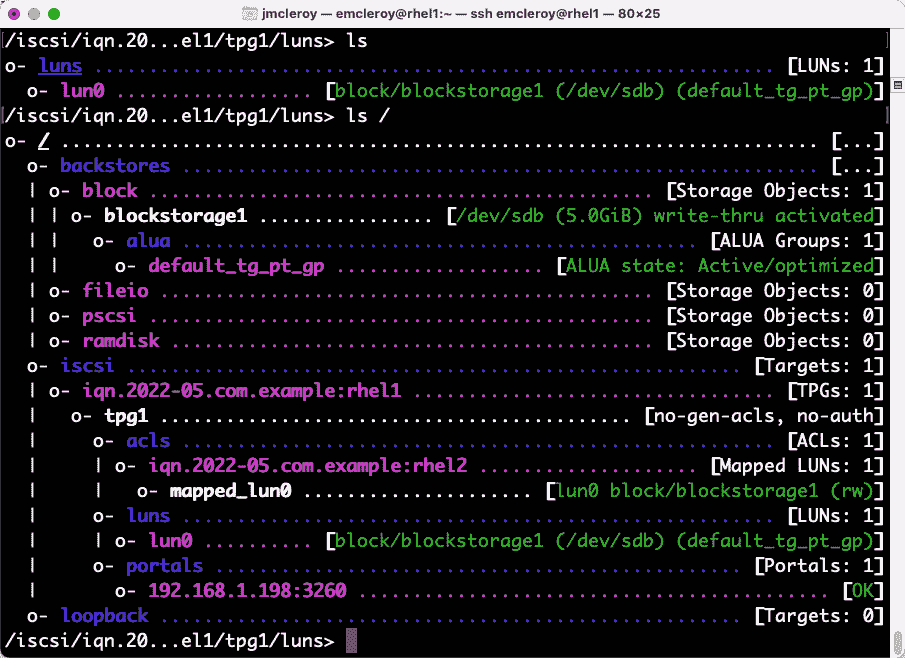

# 1

# 块存储—在 Red Hat 企业版 Linux 上学习如何配置块存储

**Red Hat Enterprise Linux** (**RHEL**) 中的块存储构成了许多核心应用程序的基础。你将在 Linux 的多个领域中使用它，从应用程序开发、备份到 OpenStack 等基础设施的部署，使用 **互联网小型计算机系统接口** (**iSCSI**) 等技术。通过了解何时使用块存储而非其他存储选项，以及如何通过手动步骤配置它并通过 Ansible 实现自动化，你将能够掌握日常使用 Linux 所需的知识，同时确保你理解为满足 *EX358* 考试需求而必备的构建模块。这些课程不仅可以帮助你成功完成 *EX358* 考试，还能让你更好地理解为什么在某些实际场景下我们使用块存储而非其他文件系统。

当你在公司搭建基础设施、在家庭实验室进行学习，或为你一直想创办的初创公司提供服务时，这将非常方便。本章结束时，你将能够通过 Red Hat 的最佳实践手动和通过 Ansible 自动化方式配置块存储，以满足 Red Hat 的要求。这将使你在拥有有效合同的情况下获得 Red Hat 的支持，同时，如果没有 Red Hat 支持，也能通过社区获得帮助，以解决你在使用该技术过程中可能遇到的任何问题。

在本章结束时，你将能够配置 iSCSI 启动器，手动和通过 Ansible 自动化启动它们，并且在完成后安全地拆除不再使用的 iSCSI 块存储版本。这将确保你完全理解块存储在你的生态系统中的整体生命周期和有效性。

在本章中，我们将覆盖以下主要内容：

+   iSCSI 块存储—概述它是什么以及我们为何需要它

+   iSCSI 块存储—手动配置和部署

+   iSCSI 块存储—Ansible 自动化剧本的创建与使用

# 技术要求

在深入讨论这些主题之前，你需要设置一些必要的东西。让我们看看它们是什么。

## 设置 GitHub 访问权限

你需要一个免费的 GitHub 账户，以便访问本书中提供的部分代码。请在 [`github.com/`](https://github.com/) 注册一个免费账户。我们将在本书中使用以下仓库中的代码：[`github.com/PacktPublishing/Red-Hat-Certified-Specialist-in-Services-Management-and-Automation-EX358-`](https://github.com/PacktPublishing/Red-Hat-Certified-Specialist-in-Services-Management-and-Automation-EX358-)。我们将利用该代码库（也称为 repo）中 `ch1` 文件夹中的代码片段进行 iSCSI 自动化实践练习，代码位置如下：[`github.com/PacktPublishing/Red-Hat-Certified-Specialist-in-Services-Management-and-Automation-EX358-Exam-Guide/tree/main/Chapter01`](https://github.com/PacktPublishing/Red-Hat-Certified-Specialist-in-Services-Management-and-Automation-EX358-Exam-Guide/tree/main/Chapter01)。这里的代码将帮助你检查自己的工作，确保在编写 Ansible 剧本时走在正确的轨道上。请记住，这些代码是一个人编写并经过测试的剧本，能够满足考试目标；然而，编写成功剧本的方式有很多种，也能达到这些目标。

## 设置你的实验环境

所有 VirtualBox 和编码演示将会在 macOS 上展示，但也可以在 Windows 和 Linux 操作系统上执行。我们将设置一些 iSCSI 块设备。首先，你需要一台能够运行 VirtualBox 的计算机，并且内存足够支持运行你的计算机和三个虚拟机，每个虚拟机需要 2 GB 内存，一个 10 GB 硬盘和一个 5 GB 硬盘，这意味着每个虚拟机需要 15 GB 的硬盘空间，具体可以参考以下截图：


图 1.1 – VirtualBox 部署布局

这主要是针对存储实践实验室，你可以为练习还原到一个 10 GB 的硬盘。RHEL 8.1 需要至少 9.37 GB 的空间才能运行。使用 Red Hat 开发者账户（[`developers.redhat.com/`](https://developers.redhat.com/)），你可以访问真实的 Red Hat 软件来提升你的技能以及设置所需的软件：


图 1.2 – 注册很简单！

因为考试是基于 RHEL 8.1 设置的，我建议你使用这个版本进行学习，以获得最真实的考试环境。在以下截图中，你应该下载的正确版本是第一个选项：


图 1.3 – 考试和你的正确版本

这在整本书中都适用，包括最后的综合评审和实验。在安装操作系统之前，你可以在 VirtualBox 中从设置中创建一个第二硬盘，如下图所示：


图 1.4 – 为你的虚拟机创建第二个硬盘

你还需要确保为网络的 **附加到** 选项选择 **桥接适配器** 模式。**混杂模式** 选项也是允许的，这样它就可以连接到互联网和其他适配器。需要注意的是，桥接模式通过 Wi-Fi 并不总是稳定，因此如果你是以这种方式搭建实验环境，尽量确保你有有线连接：


图 1.5 – 带有混杂模式选项的桥接适配器

在这里，你可以挂载已下载的 ISO 并开始安装：


图 1.6 – 挂载之前下载的 RHEL DVD ISO

你需要牢记一些最佳实践。我们将安装 **带图形用户界面的服务器** 选项。确保为自己创建一个管理员账户，并保留 root 账户，因为出于安全考虑以及良好的习惯，你希望使用 sudo 而不是直接使用 root 来执行所有操作。以下的用户创建界面允许你设置 root 密码和任何你希望创建的用户：


图 1.7 – 管理员账户是最佳实践；总是优先使用 sudo 而不是 root

接下来，你需要使用 Red Hat 开发者账户的登录信息，并使用账户凭证对虚拟机进行授权。请参考以下截图，了解如何正确应用 Red Hat 订阅许可证：


图 1.8 – 需要 Red Hat 开发者凭证或有效的 Red Hat 账户

你可以创建一台机器，然后将其克隆为你需要的另外两台。确保选择生成新的 MAC 地址并做完整克隆，以确保没有重叠导致网络或存储问题，如下图所示：


图 1.9 – 新的 MAC 生成和虚拟机新名称的完整克隆

接下来，我们将设置主机文件，使用 `example.com` 域名，以便正确地进行不同系统之间的路由。你需要在服务器上使用命令行来获取 IP 地址，然后去每个设备并使用相同的信息设置主机文件：


图 1.10 – rhel1.example.com 系统的主机名和 IP

接下来，使用以下命令收集主机名或将其更改为你想要的名称，并查看此情况下的输出，应该是`rhel1.example.com`：

```
[emcleroy@rhel1 ~]$ sudo hostnamectl set-hostname rhel1.example.com
[emcleroy@rhel1 ~]$ hostname
 rhel1.example.com
```

使用主机名和 IP 地址构建主机文件的清单。完成后，确保关闭系统以永久保存更改。接下来，你将需要使用以下命令在所有三台虚拟机的主机文件中添加这些内容：

```
$ sudo vi /etc/hosts
```

下面是完成的`/etc/hosts`文件示例：


图 1.11 – 完成的`/etc/hosts`文件

请记住，你的`/etc/hosts`文件会根据你的 IP 地址有所不同。现在你应该能够通过主机名和 IP 地址互相 ping 通所有不同的虚拟机：


图 1.12 – 工作网络环境示例

接下来，为了方便使用，我们将为我们的用户账户设置无密码的 sudo，这里我的用户名是`emcleroy`。

我们将从运行以下命令开始：

```
$ sudo visudo
```

接下来，我们将定位到以下截图中高亮显示的代码行，并添加高亮显示的文本。还要注意，如果你允许管理员，可以简单地取消注释`#`，将其放在`%wheel`行前面：


图 1.13 – 高亮显示的文本行，需要添加并将你的用户名替换为我的用户名

你需要为所有三台服务器执行此操作。

最后，我们将在服务器之间添加 SSH 密钥，以便实现快速连接，这样每次从一台服务器登录到另一台服务器时，我们就不必输入密码。从你的`rhel1`虚拟机开始，使用以下命令生成 SSH 密钥：

```
$ ssh-keygen
```

只需保持默认设置，不断按*Enter*，然后一旦密钥生成，你需要执行以下操作：

```
$ ssh-copy-id -i ~/.ssh/id_rsa.pub username@server
```

这将把密钥推送到各个服务器，并允许所有服务器进行双向通信。你需要为所有三台服务器执行这个操作，所以你将做以下操作（包括当前所在的服务器，以确保密钥被推送到所有服务器的已知主机文件中）：

```
$ ssh-copy-id -i ~/.ssh/id_rsa.pub emcleroy@rhel1
$ ssh-copy-id -i ~/.ssh/id_rsa.pub emcleroy@rhel2
$ ssh-copy-id -i ~/.ssh/id_rsa.pub emcleroy@rhel3
```

从这里开始，你可以完全访问运行 RHEL 8.1、并为本次 iSCSI 实践练习配置了额外硬盘的三台虚拟机实验室。唯一的小差异出现在网络实践实验中，我们将讨论如何添加额外的**网络接口控制器**（**NICs**）进行网络团队配置。这将是你需要了解的另一个话题，以便顺利通过*EX358*考试。

恭喜你！你已经成功地设置了实验环境。为自己鼓掌，休息一下。接下来我们将讨论构建 iSCSI 块设备并使用它们的手动步骤。然后，我们将测试你刚刚构建的实验环境，亲身体验这项技术。

# iSCSI 块存储——它是什么，为什么我们需要它

有许多关于块存储，特别是 iSCSI 的知识需要了解。iSCSI 是一种**存储区域网络**（**SAN**）协议，它允许设备或设备的部分被终端设备视为块存储。SAN 是 iSCSI 连接到网络的方式，并使其能够提供网络**逻辑单元号**（**LUNs**）。这使得系统可以像使用物理硬盘一样使用这些块设备，可以从中启动、保存文件，或者像在普通计算机中使用硬盘那样使用它们。考虑到这一点，我们需要考虑一些因素。

首先，你必须确保你的网络可以无阻塞地处理连接，因为拥堵会导致系统变慢，甚至可能落后于你正在进行的操作，进而让用户感到沮丧。了解这一点后，你需要非常谨慎地规划你的 SAN，并妥善地将块存储网络配置到一个通常不加密的网络设置上，该网络应满足最低 10 GB 的速度要求，在许多情况下速度可以更高。这可以确保你在不遇到头疼问题的情况下顺畅使用存储，避免作为系统管理员时遇到的麻烦。如果你将其放置在与局域网（LAN）流量相同的网络上，并且期望流媒体用户（别在工作时做这个！）在观看视频的同时，依然能够通过从 SAN iSCSI 块存储设备托管的机器进行工作。另一个要记住的事情是，你需要确保正确使用`firewalld`语法，并遵循 SELinux 协议，以允许在启动时建立连接，否则你将得到一个巨大的纸重物，几乎什么也不会发生。

当你在使用`targetcli`配置 iSCSI 时，有几个主要事项需要考虑，我将详细介绍`targetcli`，因为它是我们在 RHEL 8.1 环境中使用 iSCSI 的工具集。你需要了解的主要内容包括**启动器**、**目标**、**门户**、**LUN**、**访问控制列表**（**ACL**）和**目标门户组**（**TPG**）。这些项目构成了 iSCSI 存储，并导致了很多误解。在我们深入探讨这些系统及其如何协同工作、通过网络向远程服务器提供块存储之前，让我们先测试一下你的知识。

## 测试你的知识

请回答以下问题：

1.  在 iSCSI 服务器上，iSCSI 存储源是什么？

    1.  目标

    1.  LUN

    1.  **iSCSI 合格** **名称**（**IQN**）

    1.  ACL

1.  用于标识启动器和目标的唯一全球名称是什么？

    1.  目标

    1.  LUN

    1.  IQN

    1.  ACL

1.  通常是软件基础的 iSCSI 客户端被称为：

    1.  TPG

    1.  门户

    1.  IQN

    1.  发起者

1.  以下哪项是使用 IQN 的访问限制？

    1.  目标

    1.  LUN

    1.  IQN

    1.  ACL

1.  设置 RHEL 8.1 iSCSI 块存储时，最常用的软件是什么？

    1.  `firewalld`

    1.  SELinux

    1.  `targetcli`

    1.  `networkd`

1.  要使 iSCSI 通过防火墙工作，需要允许哪个服务或端口？

    1.  `iSCSI-target`

    1.  `3260/UDP`

    1.  `iSCSI`

    1.  `targetcli`

1.  `2020-06.com.mcleroy.www` 包含什么？

    1.  目标

    1.  LUN

    1.  IQN

    1.  ACL

1.  为确保 iSCSI 在启动时自动启动，需要启用哪个系统？

    1.  `firewalld`

    1.  目标

    1.  `targetcli`

    1.  `networkd`

答案：

1.  A. 目标

1.  C. IQN

1.  D. 发起者

1.  D. ACL

1.  C. `targetcli`

1.  A.`iSCSI-target`

1.  C. IQN

1.  B. 目标

# iSCSI 块存储 – 手动配置和部署

我们将首先安装`targetcli`，并使用它设置 iSCSI，将基于块的存储提供给其他系统进行文件使用、引导系统等。这将展示在 RHEL 8.1 中实现的 iSCSI 块存储的广泛用途。然后我们将展示如何报废存储设备并在使用完资源后清理系统。

首先，我们将安装`targetcli`，以便在`rhel1`上使用 iSCSI 系统：

```
$ sudo dnf install targetcli -y
```

接下来，我们将启用系统启动 iSCSI 块存储。当系统启动或出现问题导致目标系统需要重启时，它将重新加载该服务，以确保存储持续运行：

```
$ sudo systemctl enable target
```

然后，我们将通过 `firewalld` 允许 `iscsi-initiator`，以确保其他服务器能够顺利访问块存储。我们还将重新加载防火墙，否则刚刚打开的端口将不会生效：

```
$ sudo firewall-cmd --permanent --add-service=iscsi-target
$ sudo firewall-cmd –reload
```

接下来，我们将使用刚刚安装的新服务——`targetcli`——创建网络块存储，以便与`rhel2.example.com`共享：


图 1.14 – targetcli 首次启动

我们现在将为物理磁盘分区创建后端存储（backstores）。我们将创建类型为`block`的后端存储，以满足当前 iSCSI 系统的需求。这将允许持久文件系统，并且我们可以设置 LUN 的大小和安全性：

```
/> cd /backstores/block
/backstores/block> create blockstorage1 /dev/sdb
Created block storage object blockstorage1 using /dev/sdb.
```

接下来，我们将在 `/iscsi` 目录中创建一个 IQN，以便为块存储设备提供目标和目的地：

```
/backstores/block> cd /iscsi
/iscsi> create iqn.2022-05.com.example:rhel1
Created target iqn.2022-05.com.example:rhel1.
Created TPG 1.
Global pref auto_add_default_portal=true
Created default portal listening on all IPs (0.0.0.0), port 3260.
/iscsi> ls
o- iscsi ..................................... [Targets: 1]
  o- iqn.2022-05.com.example:rhel1 .............. [TPGs: 1]
    o- tpg1 ........................ [no-gen-acls, no-auth]
      o- acls ................................... [ACLs: 0]
      o- luns ................................... [LUNs: 0]
      o- portals ............................. [Portals: 1]
        o- 0.0.0.0:3260 .............................. [OK]
```

如前面的代码片段所示，已经为连接块存储后端存储创建了一个默认门户，并使用`create`命令为 IQN 创建。接下来，我们将为物理支持 iSCSI 块存储的存储需求创建一个 LUN：

```
/iscsi> cd /iscsi/iqn.2022-05.com.example:rhel1/tpg1/luns
/iscsi/iqn.20…sk1/tpg1/luns> create  /backstores/block/blockstorage1
Created LUN 0.
```

我们接下来需要的 iSCSI 组件是 ACL，以便允许流量成功到达我们的存储设备。我们需要暂时退出`targetcli`以查看发起者 IQN 的 Red Hat 名称。它可以在 `/etc/iscsi/initiatorname.iscsi` 中找到：

```
Global pref auto_save_on_exit=true
Configuration saved to /etc/
[emcleroy@rhel1 ~]$ vi /etc/iscsi/initiatorname.iscsi
```

以下是当前在下一张图片中使用的发起者名称示例：


图 1.15 – initiatorname.iscsi

我们将返回到 `targetcli` 并完成系统的准备工作，为使用块存储的系统设置我们选择的 ACL。

```
[emcleroy@rhel1 ~]$ sudo targetcli
targetcli shell version 2.1.53
Copyright 2011-2013 by Datera, Inc and others.
For help on commands, type 'help'.
> cd /iscsi/iqn.2022-05.com.example:rhel1/tpg1/acls
/iscsi/iqn.20...sk1/tpg1/acls> create iqn.2022-05.com.example:rhel2
Created Node ACL for iqn.2022-05.com.example:rhel2
Created mapped LUN 0.
```

接下来，我们将移除默认的门户，并在我们服务器的特定 IP 地址上创建一个新的门户：

```
> cd /iscsi/iqn.2022-05.com.example:rhel1/tpg1/portals
/iscsi/iqn.20.../tpg1/portals> delete 0.0.0.0 3260
Deleted network portal 0.0.0.0:3260
/iscsi/iqn.20.../tpg1/portals> create 192.168.1.198 3260
Using default IP port 3260
Created network portal 192.168.1.198:3260.
```

最后，以下是您完成的块存储目标：



图 1.16 – iSCSI 块存储目标

我们刚刚展示了如何配置 iSCSI 块存储以供使用。现在，我们将展示如何在您的系统中实际使用这些块存储。我们将从 `rhel1.example.com` 连接到 `rhel2.example.com` 并挂载、配置、使用它来移动和存储文件。因为我们可以通过这种方式增加远程服务器的存储容量，而不需要直接为服务器机架增加空间、电力或冷却。

我们首先需要做的是安装 iSCSI 工具，因为在考试中，您可能没有安装 **带有图形界面的服务器**：

```
$ sudo dnf install iscsi-initiator-utils targetcli -y
```

这使我们能够接入之前创建的 iSCSI 块存储。接下来，我们将查找 `rhel1`（`192.168.1.198`）上配置的目标（请注意：在您的实验室中，可能是不同的 IP 地址），并登录到它以确保连接性。从这里，我们需要在 `/etc/iscsi/iscsid.conf` 文件中设置登录信息，以便传递正确的登录信息，从而能够登录到存储设备：

```
$ sudo getent hosts rhel1
```

现在，我们将设置 `InitiatorName` 字段，以便使用以下命令向连接的服务器传递已知条目：

```
[emcleroy@rhel1 ~]$ sudo vi /etc/iscsi/initiatorname.iscsi
InitiatorName=iqn.2022-05.com.example:rhel1
[emcleroy@rhel1 ~]$ sudo systemctl restart iscsid.service
```

请注意，您可以使用手册页面通过 `man iscsiadm` 命令深入了解 `iscsiadm` 命令集。在 `rhel2` 上，我们将使用 `iscsiadm` 命令进行可用块设备的发现。`–m` 标志指定模式，在本例中为 `discovery`。`–t` 标志指定目标类型，在我们这里是 `st`，即 `sendtargets`，它告诉服务器发送 iSCSI 目标列表。`–p` 标志指定使用哪个门户，这是 IP 地址和端口的组合。如果没有提供端口，它将默认为 `3260`：

```
[emcleroy@rhel2 ~]$ sudo iscsiadm -m discovery -t st -p 192.168.1.198:3260
```

请注意，前一个命令的输出将如下所示：

```
 192.168.1.198:3260,1 iqn.2022-05.com.example:rhel1
```

如您所见，我们有一个显示为可用的块设备。

我们将尝试登录到设备，您可以看到我们已经登录，并且设备已连接，如下所示：

```
[emcleroy@rhel2 ~]$ sudo iscsiadm -m node -T iqn.2022-05.com.example:rhel1  -p 192.168.1.198 -l
```

在上述代码中，我们使用 `–m` 标志选择 `node` 模式。我们使用 `–T` 标志指定目标名称。我们再次使用 `–p` 标志指定门户，默认端口为 `3260`。最后，我们使用 `–l` 标志告诉 `iscsiadm` 登录到目标。

接下来，我们将使用`–m`模式标志来检查会话，使用`–P`来打印信息级别为 3：

```
[emcleroy@rhel2 ~]$ sudo iscsiadm -m session -P 3
iSCSI Transport Class version 2.0-870
version 6.2.1.4-1
Target: iqn.2022-05.com.example:rhel1 (non-flash)
     Current Portal: 192.168.1.198:3260,1
     Persistent Portal: 192.168.1.198:3260,1
```

你可以看到我们有`sdb`，这是`rhel2`上的第二个驱动器，现在我们也有`sdc`：


图 1.17 – sdc 驱动器现在已显示

接下来，我们将对驱动器进行分区并用`xfs`格式化。这将使我们能够在启动时挂载系统，并保存持久文件。它可以用于从文件存储到操作系统或数据库的许多用途。首先，我们将把驱动器格式化为`xfs`：

```
[emcleroy@rhel2 ~]$ sudo mkfs.xfs /dev/sdc
meta-data=/dev/sdc               isize=512    agcount=4, agsize=327680 blks
         =                       sectsz=512   attr=2, projid32bit=1
         =                       crc=1        finobt=1, sparse=1, rmapbt=0
         =                       reflink=1
data     =                       bsize=4096   blocks=1310720, imaxpct=25
         =                       sunit=0      swidth=0 blks
naming   =version 2              bsize=4096   ascii-ci=0, ftype=1
log      =internal log           bsize=4096   blocks=2560, version=2
         =                       sectsz=512   sunit=0 blks, lazy-count=1
realtime =none                   extsz=4096   blocks=0, rtextents=0
```

然后，我们将使用以下命令获取 UUID，以便在`fstab`中使用，使其成为持久挂载，并在启动时自动挂载：

```
[emcleroy@rhel2 ~]$ lsblk -f /dev/sdc
NAME FSTYPE LABEL UUID                                 MOUNTPOINT
sdc  xfs          38505868-00de-4269-88d8-3357a22f2101
[emcleroy@rhel2 ~]$ sudo vi /etc/fstab
```

这里，我们可以看到在`fstab`中添加的值的示例，已被高亮显示：


图 1.18 – 添加 iSCSI 块存储设备后的更新 fstab

这是我们将新添加的 iSCSI 驱动器写入`fstab`的行。请注意，对于网络设备，我们传递了`_netdev`选项。接下来，我们将挂载系统以便于移动文件：

```
[emcleroy@rhel2 ~]$ sudo mkdir -p /data
[emcleroy@rhel2 ~]$ sudo mount /data
[emcleroy@rhel2 ~]$ df /data
Filesystem     1K-blocks  Used Available Use% Mounted on
/dev/sdc         5232640 69616   5163024   2% /home/emcleroy/data
[emcleroy@rhel2 ~]$ cd /data
```

挂载后，我们将进入新驱动器，创建一个文件夹和一个测试的`.txt`文件，并确保它能够保存，以下命令将会实现：

```
[emcleroy@rhel2 ~]$ sudo mkdir test
[emcleroy@rhel2 ~]$ cd test/
[emcleroy@rhel2 ~]$ sudo vi test.txt
```

接下来，我们将移除挂载，退出连接，并删除剩余的文件：

```
[emcleroy@rhel2 ~]$ cd
[emcleroy@rhel2 ~]$ sudo umount /data
[emcleroy@rhel2 ~]$ sudo iscsiadm -m node -T iqn.2022-05.com.example:rhel1 -p 192.168.1.198 -u
Logging out of session [sid: 8, target: iqn.2022-05.com.example:rhel1, portal: 192.168.1.198,3260]
Logout of [sid: 8, target: iqn.2022-05.com.example:rhel1, portal: 192.168.1.198,3260] successful.
[emcleroy@rhel2 ~]$ sudo iscsiadm -m node -T iqn.2022-05.com.example:rhel1 -p 192.168.1.198 -o delete
```

这部分关于手动设置 iSCSI 的内容到此为止。接下来是自动化部分。我们将在动手操作和书籍结尾的测验中详细讨论。我希望你和我一样享受这段旅程。

# iSCSI 块存储 – Ansible 自动化剧本创建与使用

我们将通过首先安装和配置使用 Ansible 核心 2.9 来开始 iSCSI 块存储的自动化部分，因为这是 *EX358* 考试中使用的版本。我不会使用**完全限定的集合名称**（**FQCN**），因为在 2.9 环境中它有时会导致错误，这可能会在考试过程中引发问题。我们希望尽一切可能避免这种情况，因此我们将使用经典的模块名称，并会在一定程度上解释它们的差异，以便你能够理解未来版本的 Ansible 中需要使用的内容。

首先，我们从服务器`rhel3`开始安装 Ansible 2.9，因为它将作为我们从`yum` 仓库中获取的工作站服务器。根据个人偏好，你可以将`rhel1`设为课堂服务器，`rhel2`和`rhel3`设为测试服务器，但在我们的案例中，我们已经将`rhel1`设置为 iSCSI 服务器，并使用了`rhel2`。

首先，我们将启用所需的仓库：

```
[emcleroy@rhel3 ~]$ sudo subscription-manager repos --enable ansible-2.9-for-rhel-8-x86_64-rpms
Repository 'ansible-2.9-for-rhel-8-x86_64-rpms' is enabled for this system.
```

接下来，我们将安装 Python 3：

```
[emcleroy@rhel3 ~]$ sudo dnf install python3 -y
```

然后，我们将安装 Ansible 2.9：

```
[emcleroy@rhel3 ~]$ sudo dnf install ansible -y
```

让我们检查并确保安装了正确版本的 Ansible：

```
[emcleroy@rhel3 ~]$ ansible --version
ansible 2.9.27
  config file = /etc/ansible/ansible.cfg
  configured module search path = ['/home/emcleroy/.ansible/plugins/modules', '/usr/share/ansible/plugins/modules']
  ansible python module location = /usr/lib/python3.6/site-packages/ansible
  executable location = /usr/bin/ansible
  python version = 3.6.8 (default, Oct 11 2019, 15:04:54) [GCC 8.3.1 20190507 (Red Hat 8.3.1-4)]
```

接下来，我们将开始使用**Yet Another Markup Language**（**YAML**）Ansible 语言编写 playbook。这是一个简单的基于模块的功能，可以让您快速有效地编写 playbook，以完成您的任务。在编写这些 playbook 时，我建议使用一个好的编辑器。JetBrains 的 PyCharm 是我的首选，也是您看到我在其中编写 playbook 完成结果示例屏幕截图的编辑器。还请注意，完成的 playbook 可以在本书的 GitHub 存储库中找到，如每章节的*技术要求*部分所述。

首先，您将想要创建一个目录，用于运行 playbooks：

```
[emcleroy@rhel3 ~]$ mkdir iscsi_mount
```

一旦进入目录，我们将创建一个包含`rhel1`和`rhel2`服务器的默认组的清单文件：

```
[emcleroy@rhel3 ~]$ cd iscsi_mount
[emcleroy@rhel3 ~]$ vi inventory
[defaults]
rhel1 ansible_host=192.168.1.198
rhel2 ansible_host=192.168.1.133
[iscsi_block]
rhel1 ansible_host=192.168.1.198
[iscsi_user]
rhel2 ansible_host=192.168.1.133
```

正如您所见，我添加了`ansible_host`和 IP 地址。这是为了在没有设置主机文件或名称不可 DNS 路由的情况下。我添加了包含所有主机的默认组，并有两个额外的组，允许我限制我的 playbook 所做的更改。这样，我可以告诉我的 playbook 使用`iscsi_user`组在`rhel2`上挂载存储。

接下来，我们将编写名为`mount_iscsi.yml`的块存储 playbook，并在展示该 playbook 后详细解释：

```
---
- name: Ensure /data is mounted from rhel1 iSCSI target that was created manually onto rhel2
  hosts: iscsi_user
  become: true
  become_method: sudo
  tasks:
    - name: the targetcli package is installed
      yum:
        name: targetcli
        state: present
    - name: the IQN is set for the initiator
      template:
        dest: /etc/iscsi/initiatorname.iscsi
        src: templates/initiatorname.iscsi.j2
        mode: '644'
        owner: root
        group: root
    - name: Create mount directory for /data
      file:
        path: /data
        state: directory
        mode: '0755'
    - name: Restart iscsiadm
      command:
        cmd: systemctl restart iscsid.service
    - name: Mount new drive
      command:
  cmd: iscsiadm -m node –T iqn.2022-05.com.example:rhel1  -p 192.168.1.198 -l
```

此实例的模块名称为`yum`，用于安装`iscsi-initiator-utils`包，该包将安装实用程序。接下来，我们有模块的不同标志，如`dest:`用于您 playbook 的`templates`文件夹中源文件的目标位置。在 playbook 目录中的模板文件夹位置，您将拥有文件`/templates/initiatorname.iscsi.j2`，其中包含传递给 playbook 的初始化程序名称的代码：

```
InitiatorName=iqn.2022-05.com.example:rhel1
```

您可以通过查看类似于 man 页的等效内容来了解您使用的每个模块的更多信息，如下所示：

```
[emcleroy@rhel3 ~]$ ansible-doc yum
```

您还可以使用以下命令列出文件，但请记住有数千个模块，因此请尽可能使用 grep 命令筛选名称：

```
[emcleroy@rhel3 ~]$ ansible-doc –-list
```

以下截图展示了不同模块的正常`ansible-doc`页面的外观：


图 1.19 – yum 模块文档页面示例

我们将使用以下命令来运行`ansible-playbook -i inventory mount_iscsi.yml -u emcleroy -k --ask-become –v`剧本。这将从`rhel3`服务器执行，并对`rhel2`服务器进行更改。这结束了我们自动化挂载 iSCSI 块存储的方法。我们学到了一些关于 Ansible 的知识，从模块到模板的工作方式。在接下来的章节中，我们将更详细地了解 Ansible 及其所有内部工作原理，敬请期待。

# 摘要

这标志着第一章的结束，在这一章中，我们详细介绍了 RHEL 块存储、为测试目的设置实践环境，以及初步体验了 Ansible。在接下来的章节中，我们将深入探讨如何使用 Ansible，提供更多实例和实践练习，帮助你提升系统管理员的能力，并确保你通过*EX358*考试。在下一章，我们将继续深入探讨网络存储，讨论网络文件存储以及如何利用它在组织内部共享信息，从而提高工作效率。请继续与我一同前行，迈向你希望获得的*EX358*认证，这是我希望帮助你实现的目标。
