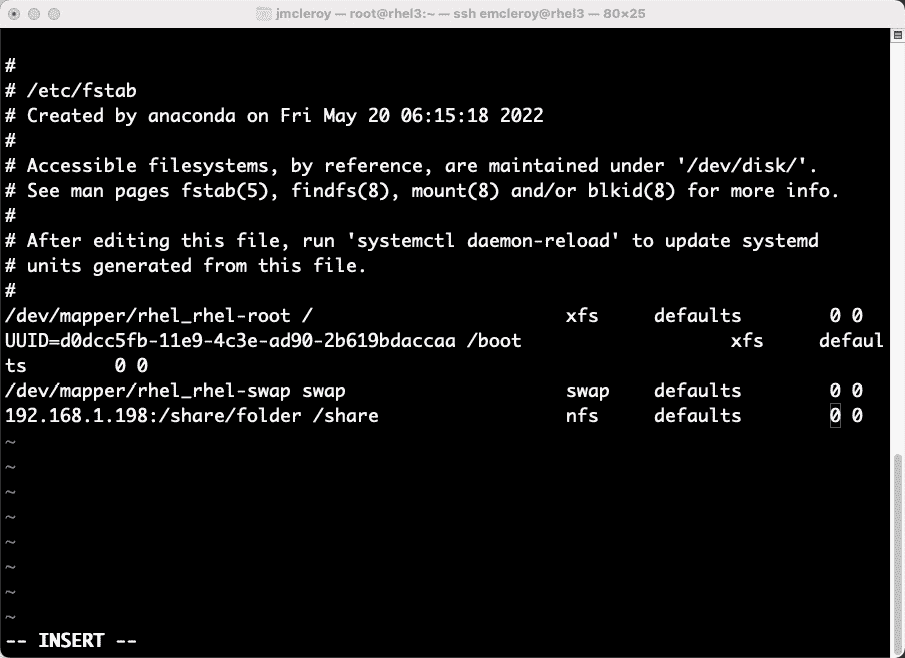

# 网络文件存储 – 拓展你对如何共享数据的理解

在本章中，我们将介绍**网络文件存储**（**NFS**）和通过**服务器消息块**（**SMB**）存储的 Samba。它们是两种基于网络的文件共享选项。一种（NFS）在 Linux 中广泛使用，而另一种（SMB）则是 Windows 的主流，在我们的案例中是 Samba。我们将学习如何设置这两个目标文件夹，并与外界共享它们。我们还将确保这些共享文件夹仅对我们希望共享访问权限的人可用。我们会展示如何确保不发生未授权的访问——尽管我们会尽最大努力；毕竟，人们总是能找到一些巧妙的方法。

在我们手动设置好这些环境后，我们将通过自动化工具 Ansible 来设置它们。这可以极大地方便新服务器的配置，使其能够以自动化的方式访问每个新服务器所需的文件共享。这样可以确保每个新服务器都能获得必要的访问权限，而不必担心是否遗漏了某个文件夹。自动化帮助减少了系统管理员工作的头痛，使用 Ansible 后，操作变得更加简便。让我们一起进入 NFS 的世界，它只会让我们的生活更轻松。

本章将涵盖以下主题：

+   NFS 和 SMB 网络存储 – 它们的工作方式以及何时选择一个而非另一个

+   NFS 手动配置与部署

+   NFS Ansible 自动化剧本创建与使用

+   SMB 存储的手动配置与部署

+   SMB 存储 Ansible 自动化剧本创建与使用

# 技术要求

本节涵盖本章的技术要求。

## 设置 GitHub 访问权限

请参考*第一章*，*块存储 – 学习如何在 Red Hat Enterprise Linux 上配置块存储*，以获取 GitHub 访问权限。你可以在以下链接中找到本章的 Ansible 自动化剧本：[`github.com/PacktPublishing/Red-Hat-Certified-Specialist-in-Services-Management-and-Automation-EX358-Exam-Guide/tree/main/Chapter02`](https://github.com/PacktPublishing/Red-Hat-Certified-Specialist-in-Services-Management-and-Automation-EX358-Exam-Guide/tree/main/Chapter02)。记住，这些是推荐的剧本，并不是唯一能够让剧本起作用的方法。

你可以使用 `raw`、`shell` 或 `cmd` 来改变配置以实现相同的结果，但我们展示的是实现目标的最佳方法。同时请注意，我们没有使用将来版本的 Ansible 所需的**完全限定集合名称**（**FQCN**），因为该功能在考试中并不支持，考试所用的是 Ansible 2.9 版本。

## 设置 NFS 和 SMB 的实验环境

如果尚未完成，请参考*第一章*的实验环境设置，*块存储 – 在 Red Hat Enterprise Linux 上学习如何配置块存储*。你还可以利用这个机会创建你环境的快照，这样你就可以恢复到这些快照并一遍又一遍地进行实际操作练习。可以按以下步骤进行：

在 VirtualBox 中创建快照非常简单：只需点击下方按钮并用鼠标光标选中即可创建快照：


图 2.1 – VirtualBox 打开快照创建的选项按钮

点击顶部的按钮进行拍摄，然后为你的快照命名。这将让你能够确定拍摄快照时机器镜像的状态。可以在下图中看到：


图 2.2 – VirtualBox 快照保存功能

这将总结如何拍摄快照以便恢复到先前的状态，进行反复的实际操作。接下来，让我们进入存储战争。

# NFS 和 SMB 网络存储 – 它们的工作方式以及何时选择其中之一而非另一个

NFS 是在 Linux 系统之间共享文件的一个好方法。它是基于机器的认证方式，因此系统可以让所有用户访问文件。这对于 Linux 系统共享小文件非常有用，因为它提高了速度，并且系统共享获取更高效。另一方面，SMB 是基于用户认证的，更适合与 Windows 计算机进行交互。所以，如果你有一个多厂商环境，设置 SMB 可能是值得的，因为它还支持打印机共享。这既允许文件共享，也允许打印机共享，从而在系统上增加了一些多功能性，弥补了略微的速度损失。

认证方式的差异带来了一些设置上的不同，也可能导致一些麻烦，特别是在确保正确锁定权限时。使用基于用户认证的 SMB 更好一些，因为在 NFS 中，任何拥有访问权限的机器都可以访问共享的文件。所以，实际上，在选择实现这两者中的任何一个时，更多的是取决于你所需要的，比如安全性或多厂商支持。在大多数情况下，实际上会为不同的系统使用需求实现两者。

让我们更深入地了解 NFS 以及它如何通过动手设置帮助 RHEL 8.1 用户和 Linux 系统整体。这将展示如何手动设置 NFS 以及通过自动化来设置。RHEL 8.1 支持 NFSv3 和 NFSv4。NFSv3 可以使用 UDP 和 TCP，而 NFSv4 只使用 TCP。旧版本不再受支持。让我们开始在系统上设置 NFS。

首先，如果还没有安装相关软件包，我们需要安装必需的软件包。这个软件包是 `nfs-utils`，它是客户端和目标机器所需的。它提供了所有访问文件夹和挂载所需的工具。通过在服务器和客户端上都安装它，你可以确保启用所有运行该服务所需的依赖项。

让我们安装如以下图所示的 `nfs-utils`：


图 2.3 – 安装 nfs-utils 包

现在，有一个小陷阱可能会让人感到沮丧——相信我，在写这段内容并遇到问题时，我差点炸了！经过大量故障排除后，当前版本 `2.3.3-51.el8` 存在一个 bug，无法正确共享 exports 以及连接时的适当权限。所以，在安装 NFS 后，我们需要将其降级到 `2.3.3-46.el8`，该版本没有此问题。以下图所示，演示了如何降级：


图 2.4 – 降级 nfs-utils

这样我们就可以顺利进行实践操作了。之前，如果你尝试做这些操作，可能会像我一样对着键盘发愁。

安装正确版本后，我们将启用守护进程：

```
[emcleroy@rhel1 ~]$ sudo systemctl enable --now nfs-server
Created symlink /etc/systemd/system/multi-user.target.wants/nfs-server.service → /usr/lib/systemd/system/nfs-server.service.
```

然后，我们需要打开防火墙以确保连接畅通：

```
[emcleroy@rhel1 ~]$ sudo firewall-cmd --permanent --add-service=nfs
success
[emcleroy@rhel1 ~]$ sudo firewall-cmd --reload
Success
```

接下来，我们将配置 exports，exports 告诉 NFS 服务器哪些内容可以对外共享。设置非常细致，允许进行充分的控制。通过 exports，你可以告诉系统哪些内容可以被哪些机器读取。你可以通过 DNS、IP、IP 范围等方式指定允许访问的机器。

首先，让我们创建一个共享目录作为根目录：

```
[emcleroy@rhel1 ~]$ sudo su -
[root@rhel1 ~]# cd
[root@rhel1 ~]# mkdir -p /share/folder
```

这是我们要共享给外界的文件夹。其他用户将访问该文件夹来读取和写入文件。我们将编辑 `/etc/exports` 文件来共享该文件夹。

这里是一些正确格式化的`exports`文件的示例。我们将详细讨论以下截图中显示的设置，例如（`rw`）：


图 2.5 – /etc/exports 示例文件用于 NFS 共享文件夹

如你所见，你可以通过 DNS 导出 NFS 共享。你也可以通过 IP 和 IP 范围进行导出。如果你不想堆叠多个共享位置，也可以使用空格分隔来指定多个共享位置。你还可以设置访问限制，例如只读或读写。`no_root_squash` 功能允许根用户访问目录，而不是选择 `nobody` 用户。默认情况下，如果根用户创建文件，`nobody` 用户将拥有该文件。这可能会导致访问文件时出现问题，因此建议使用 `no_root_squash`。这会为文件提供完全的 root 访问权限。请注意，以上是一个示例，NFS 会忽略类似的重复项。


图 2.6 – 正确的 NFS /etc/exports 文件

然后，您需要运行`exportfs -r`以更新导出，使它们能够被端点提供服务：

```
[root@rhel1 ~]# exportfs -r
[root@rhel1 ~]#
```

然后，您可以检查您的导出，确保它们通过`exportfs`命令被提供服务：

```
[root@rhel1 ~]# exportfs
/share/folder   rhel2
/share/folder   rhel3
/share/folder   192.168.1.0/24
/share/folder   *example.com
```

接下来，我们将把文件夹挂载到另一台系统上，以便共享文件。

在 RHEL3 上，我们将运行`mount`命令来挂载文件系统。您也可以将其添加到`fstab`中以使其永久生效：

```
[root@rhel3 ~]# mkdir –p /share
[root@rhel3 ~]# mount -t nfs 192.168.1.198:/share/folder /share
```

这里也有一个 NFS 的`fstab`示例：



图 2.7 – fstab 的示例

之后，您应该能够进入文件夹并添加共享文件。其他具有访问权限的系统也能看到这些文件。

这就是对 NFS 的讲解，以及如何手动将其导出到系统中。考试中将会考察这个内容。系统挂载的附加内容是为了帮助您理解，希望未来对您有所帮助。接下来，我们将讨论 NFS 服务器配置过程的自动化。

# NFS Ansible 自动化 playbook 的创建和使用

我们将深入分析 Ansible 自动化 playbook，完全拆解 NFS 导出的过程。我们将展示 playbook 的每个步骤以及每个项的作用。这里所说的*项*是指在 Ansible playbook 中设置的变量和命令：

```
---
- hosts: exports
  become: true
  become_method: sudo
```

这里是 playbook 的开头。主机是 playbook 的目标。这些通常是您希望进行更改的服务器，列在清单文件中。在这种情况下，我们的目标是`exports`组。`become`告诉 Ansible 您希望提升用户权限，而`become_method`则告诉它您希望使用`sudo`来提升权限：

```
  tasks:
  - name: Make sure Directory exists
    file:
      path: /share/folder
      owner: root
      state: directory
```

现在我们将进入任务部分。这些是我们希望 Ansible 执行的操作。我们在这里看到的第一个任务是使用文件模块创建一个目录。`name`字段就像是注释，帮助其他工程师更好地理解代码。从这里我们可以看到设置的其他项，接下来是默认值。如在*第一章*中提到的，*块存储 – 学习如何在 Red Hat Enterprise Linux 上配置块存储*，您可以使用`ansible-doc`文件查看用法和示例：

```
  - name: Install nfs utilities
    package:
      name: nfs-utils
      state: "2.3.3-46.el8"
```

通常，您会使用最新的状态；然而，在我们的情况下，这会导致系统遇到连接失败的 bug。不过在考试中使用最新状态应该没问题。

在此任务中，我们使用 Ansible 的通用包安装程序安装了`nfs-utilities`包。它使用 Ansible 收集的事实。通过使用这些事实，它知道使用`dnf`来安装软件：

```
  - name: the directory is shared
    copy:
      content: "/share/folder *(rw,no_root_squash)\n"
      dest: /etc/exports
```

使用`copy`模块，我们正在替换当前的`exports`文件。如果这是一个多行的 exports 文件，它将需要作为模板、`lineinfile`，或者所有行都需要包含在任务中。在这里，我们使用`service`模块来启用并启动`nfs-server`服务。这样可以确保服务被启动，并且在启动时服务会启用。服务也会加载 exports 文件，因为`nfs-server`是在更新`exports`文件后启动的：

```
  - name: Enable and Start NFS Service
    service:
      name: nfs-server
      state: started
      enabled: yes
```

使用`firewalld`模块，我们将为 NFS 文件服务永久开放。这样可以连接到我们选择共享的资源。完成后，`exports`剧本就完成了，接下来是`clients`剧本：

```
  - name: Open firewall for NFS-Server
    firewalld:
      service: nfs
      immediate: yes
      permanent: yes
      state: enabled
```

在完成创建剧本后，我们将使用`ansible-playbook -i inventory nfs_server.yml -u emcleroy -k --ask-become -v`命令来执行剧本。`-i`标志表示使用的清单名称。`-u`标志表示执行剧本时使用的用户名。`–k`标志表示要求输入用户密码。`--ask-become`标志表示您希望为剧本运行提供`sudo`密码。最后，`–v`显示更多详细信息，以便您可以看到剧本运行时发生的更多日志。

在这里，我们将展示一个快速查看用于支持客户端设置的剧本，该设置是利用已经为我们设置好的共享：

```
---
- hosts: clients
  become: true
  become_method: sudo
  tasks:
  - name: Install nfs utilities
    package:
      name: nfs-utils
      state: present
  - name: Add the NFS share and mount it with fstab
    mount:
      path: /share
      src: 192.168.1.198:/share/folder
      state: mounted
      fstype: nfs
```

这将安装`nfs-utilities`，然后将文件挂载到`/share`文件夹。

要运行剧本，我们将使用以下命令：`ansible-playbook -i inventory nfs_client.yml -u emcleroy -k --ask-become -v`。这标志着我们对 NFS 的初步探索的结束。接下来，我们将转向更多基于网络的文件存储。我们将讨论 SMB，它最常用于 Windows 系统。我们将介绍如何手动和通过自动化设置它。

# SMB 存储手动配置与部署

当涉及到 SMB 时，主要的区别在于它是 Windows 系统与 Linux 系统之间的共享标准。学习 Samba（SMB 的另一个名称）最好的方式就是亲自操作，这正是我们今天要做的。我们将一步步介绍如何安装和配置 SMB。

首先，我们将通过`dnf`安装 SMB：

```
[emcleroy@rhel1 ~]$ sudo dnf install samba -y
```

然后，创建 SMB 的共享：

```
[emcleroy@rhel1 ~]$ sudo mkdir -p /share/smbfolder
```

接下来，我们将启动并启用` smb` 服务：

```
[emcleroy@rhel1 ~]$ sudo systemctl enable --now smb
Created symlink /etc/systemd/system/multi-user.target.wants/smb.service → /usr/lib/systemd/system/smb.service.
```

然后，我们将打开 Samba 的防火墙服务：

```
[emcleroy@rhel1 ~]$ sudo firewall-cmd --permanent --add-service=samba
success
[emcleroy@rhel1 ~]$ sudo firewall-cmd  --reload
success
```

现在 SMB 已安装且防火墙已开放，我们可以继续设置我们创建的文件夹。这将允许我们设置所需的 SELinux 权限。我们将为管理员提供访问权限：

```
[emcleroy@rhel1 ~]$ sudo groupadd admins
[emcleroy@rhel1 ~]$ sudo chgrp admins /share/smbfolder/
```

这将允许我们仅将文件夹的访问权限限制为`admins`组。

在 SELinux 强制模式下，它需要正确的上下文。如这些命令所示，正确的上下文已添加回文件夹：

```
[emcleroy@rhel1 ~]$ sudo semanage fcontext -a -t samba_share_t "/share/smbfolder(/.*)?"
[emcleroy@rhel1 ~]$ sudo restorecon -Rv /share/smbfolder
```

这允许标签在 SELinux 重标记事件期间保持不变。SELinux 上下文超出了本课程的范围，可以通过在线研究或其他 Packt 书籍进一步了解。

接下来，我们将着手配置 `smb.conf` 文件，提供正确的信息以允许访问 `share` 文件夹：

```
[emcleroy@rhel1 ~]$sudo vi /etc/samba/smb.conf
```

从这里，你可以看到以下截图中展示的全局 Samba 配置部分和 Samba 共享配置部分示例：


图 2.8 – 允许访客的 SMB 全局配置

接下来，我们有共享的访客允许设置，如下所示：


图 2.9 – 如“仅限访客”声明所示，允许访客访问

最后，下面是一个需要密码才能访问文件夹的示例：


图 2.10 – 如这里所示，guest only 设置为 no，因此你需要拥有一个用户和密码

这些设置可以控制你的`smb`共享。

接下来，我们将启动服务并创建一些用户。这些用户和密码仅适用于`smb`共享，不会影响登录信息：

```
[emcleroy@rhel1 ~]$ sudo adduser -M sambauser -s /sbin/nologin
[emcleroy@rhel1 ~]$ sudo smbpasswd -a sambauser
New SMB password:
Retype new SMB password:
Added user sambauser.
```

最后，我们将启动 `smb`，以便为我们新创建的 `sambauser` 提供服务：

```
[emcleroy@rhel1 ~]$ sudo systemctl start smb
```

在以下截图中，我们可以看到 `smb` 正在运行：


图 2.11 – SMB 在系统上成功运行

要挂载系统，我们需要在客户端机器上安装 `samba-client`。如以下截图所示，我们正在 `rhel2` 上安装 `samba-client`：


图 2.12 – 在 rhel2 上安装 samba-client

这将允许我们在 `rhel2` 上挂载共享。我们需要安装 `cifs-utils`，然后可以使用以下命令挂载：

```
[root@rhel2 ~]# dnf install cifs-utils
[root@rhel2 ~]# mkdir –p /share/folder
[root@rhel2 ~]# mount -t cifs -o username=sambauser //192.168.1.198/smbshareconfig /share/folder
```

注意

这些代码和过程都可以通过由 Packt 提供的**Code in Action**（**CiA**）视频获取。

接下来，我们将介绍如何为特定域上的客户端设置受限共享。然后，我们将展示如何定义哪些用户/组具有只读或写入访问权限。最后，我们将展示如何使用特定的用户凭证永久挂载。

让我们从如何为特定域上的客户端设置受限共享开始。可以通过将安全性设置为 `domain` 级别而不是 `user` 级别来实现。这可以在以下代码片段中看到：

```
[global]
workgroup = SAMBA
security = domain
```

接下来，为了设置特定的组拥有读写权限，并允许其他用户仅具有只读权限，你需要设置 `smb` 文件，使共享的内容类似于以下内容，当 `security` 设置为 `user` 时：

```
[smbshareconfig]
path = /smb/smbfolder
valid users = systemadmin1, @engineers
write list = @engineers
```

前面的文件设置将允许`systemadmin1`具有只读权限，并允许`engineers`组具有读写权限，其他所有人将无法查看共享。

接下来，我们将了解如何使用 CIFS 凭据和`fstab`设置永久挂载，以便在启动时挂载共享。

我们将从创建一个 CIFS 凭据文件开始，如下所示：

```
[emcleroy@rhel1 ~]$ vi /tmp/creds.txt
```

这将包含以下内容：

```
username=smbuser
password=redhat
```

文件创建后，我们将使用它作为挂载的登录凭据，并将以下内容添加到`fstab`中，以使用这些凭据挂载共享：

```
//rhel1.example.com/smbshareconfig /mnt/shared cifs credentials=/tmp/creds.txt,multiuser 0 0
```

这就结束了 SMB 存储的手动配置部分。接下来，我们将处理自动化设置 SMB 存储所需的模板和其他内容。敬请期待更多关于如何通过自动化让它工作的重要信息。这也将帮助你完成 EX358 考试。

# SMB 存储 Ansible 自动化剧本的创建和使用

在本节中，我们将探讨设置通过 Ansible 自动化配置 SMB 共享所需的内容。这将允许在多个服务器上更快速地设置。这样，你就可以将更多时间集中在真正想要学习的内容上，而不是键盘操作上。我们已经深入探讨了 Ansible 的各个方面，从注释到名称到模块。我们将再次回顾这些内容，讲解如何为 SMB 存储设置这些内容。这也是一种方法，Ansible 还有其他方法可以成功实现。

让我们像创建其他所有剧本一样开始。首先，我们将选择要使用的库存主机和升级点。我在前面章节中向你展示了如何设置库存，因此我们跳过这部分。不过，以下是库存的快照供你参考：


图 2.13 – smb_playbook 库存快照

首先，让我们为剧本创建一个新目录：

```
[emcleroy@rhel3 ~]$ mkdir smb_playbook
[emcleroy@rhel3 ~]$ cd smb_playbook/
[emcleroy@rhel3 smb_playbook]$ vi smb_playbook.yml
---
- hosts: sambashare
  become: true
  become_method: sudo
```

接下来，我们将开始设置所有需要的 samba 任务。首先，彻底地安装它和客户端：

```
  tasks:
    - name: Install Samba and Samba-Client
      package:
        name:
          - samba
          - samba-client
          - cifs-utils
        state: latest
```

这部分代码创建了我们将用于在 SMB 上设置允许功能的组：

```
    - name: Create groups that are allowed
      group:
        name: "admins"
        system: yes
```

这部分代码为 SMB 创建带密码的用户。最终的复习中，我们将使用循环做不同的操作，这将使你能够管理密码和用户列表。由于所有内容都是明文的，这种方法不推荐使用。这个剧本是完成此更改的一种方法示例：

```
    - name: Add SMB user
      user:
        name: "smbuser"
        shell: "/sbin/nologin"
        create_home: no
        system: yes
    - name: Set SMB password for user
      command: smbpasswd -s -a smbuser
      args:
        stdin: "redhat\nredhat"
```

这部分代码将我们用于 SMB 的组添加到用户中：

```
    - name: Add SMB users to the groups that are allowed
      user:
        name: "smbuser"
        group: "admins"
        append: "true"
```

这里我们已经创建了目录并设置了正确的 SELinux 上下文：

```
    - name: Create the directory to share
      file:
        path: "/shared/smbfolder"
        owner: "root"
        group: "admins"
        mode: "2775"
        state: "directory"
        setype: "samba_share_t"
```

在这里，我们已将`share`文件夹的信息添加到`smb.conf`文件中：

```
    - name: Add the directory to the smb.conf file
      blockinfile:
        path: /etc/samba/smb.conf
        block: |
          [sambasharefolder]
                    path = /shared/smbfolder
                    writeable = yes
                    valid users = sambauser, @admins
                    write list = @admins
```

这部分代码启用 SMB 服务并重新启动它：

```
    - name: Start or restart SMB for changes and enable it
      service:
        name: "smb"
        state: "restarted"
        enabled: "true"
```

这部分代码开启了必要的防火墙规则：

```
    - name: Add firewall rules to allow connectivity out
      firewalld:
        service: "samba"
        state: "enabled"
        immediate: "true"
        permanent: "true"
```

然后，你可以使用以下命令在系统上运行 playbook：

```
[emcleroy@rhel3 smb_playbook]$ ansible-playbook -i inventory smb_playbook.yml -u emcleroy -k --ask-become-pass
```

这将要求你输入系统的 `ssh` 密码和 `become` 密码。请确保在 Ansible 控制节点（在我们的例子中是 `rhel3`）上安装了 `sshpass`，以避免密码失败。这些可以通过 Ansible Vault 处理，或者通过其他密码凭证系统处理，这些内容超出了本考试的范围。

接下来，我们将展示客户端侧的 playbook，以便挂载我们创建的新 SMB 共享。我们将按照以下方式创建一个新的 playbook：

```
---
- hosts: sambaclient
  become: true
  become_method: sudo
  tasks:
    - name: Install Samba and Samba-Client
      package:
        name:
          - samba
          - samba-client
          - cifs-utils
        state: latest
    - name: Create a credential txt file
      copy:
        content: "username=smbuser\npassword=redhat\n"
        dest: /tmp/creds.txt
        owner: "root"
        group: "root"
        mode: "0600"
```

这将创建一个包含你凭证的文件。你也可以将该文件加密，并使用变量：

```
    - name: mount directory created
      file:
        path: "/mnt/shared"
        state: directory
        owner: "root"
        group: "root"
    - name: Mount the SMB share.
      shell: "mount -t cifs //192.168.1.198/smbfolder/mnt/shared -o credentials=/tmp/creds.txt"
```

请注意，服务器的 IP 地址可能与您的实验室设置不同。

这将使用你提供的凭证挂载 SMB 共享。我们将在最终复习中探索其他方式来完成所有这些操作，复习视频将放在 Packt 网站上，视频将展示手动和自动化代码的运行。

# 总结

这将是本章和网络文件共享的结束。到目前为止，我们讨论了许多存储类型，从 iSCSI 到 SMB。它们都有一个共同点，那就是网络。接下来我们将介绍这些事物如何在网络方面互联。在下一章中，我们将确保大家了解 RHEL 网络的处理方式，了解它与传统网络（如 Cisco 等）的不同之处，以及它如何帮助你。我们还会回顾考试目标，确保你知道如何将这些服务器连接起来，以便通过我们讨论的存储部分。

# 第二部分：Red Hat Linux 8 – 使用自动化配置和维护网络

在这一部分，你将学习如何手动和自动设置和维护 Linux 网络功能。这将满足通过 Red Hat EX358 考试的目标。

这一部分包含以下章节：

+   *第三章*，*使用自动化的网络服务 – Red Hat Linux 网络简介*

+   *第三章*，*链路聚合创建 – 创建你自己的链路并掌握网络领域*

+   *第五章*，*DNS、DHCP 和 IP 地址分配 – 深入了解 Red Hat Linux 网络*
