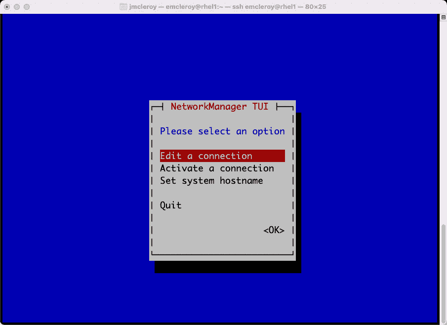
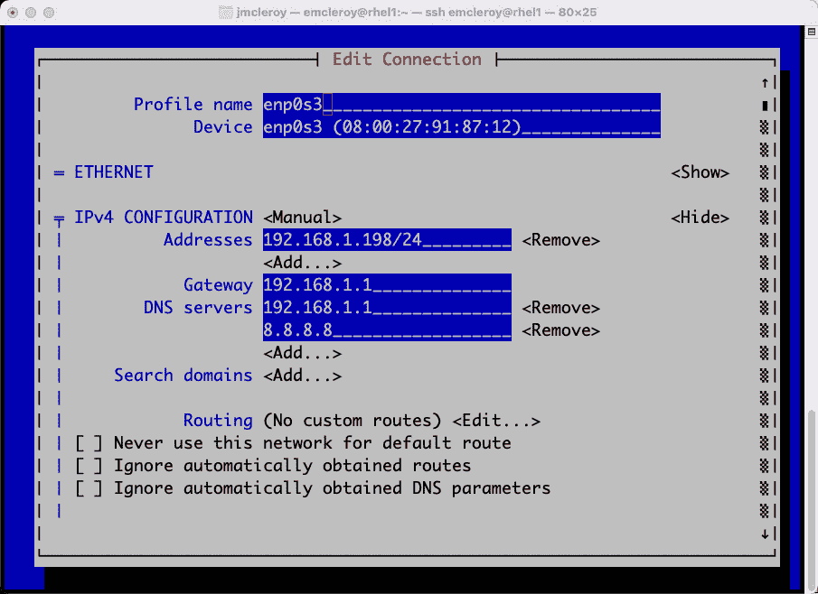

# 第三章：使用自动化进行网络服务 – 简介到 Red Hat Linux 网络

本章将向您介绍激动人心的 Red Hat 企业版 Linux 网络世界。我们将通过使用`nmtui`命令来设置网络接口的细节，这是打开视觉工具的主要选项。通过这些知识，您将开始理解您的服务器如何通过网络接口连接到外部世界。

后续章节将深入探讨其他可以用于自动设置的网络应用程序，例如**域名系统**（**DNS**）和通过**动态主机配置协议**（**DHCP**）获得 IP。在本章中，我们将展示如何设置静态和动态配置，并确保它们在服务器启动时启动。这将确保您在需要时始终有网络连接到世界各地。

在本章中，我们将涵盖以下主要内容：

+   您 Linux 网络旅程的开端

+   了解不同术语的含义及其如何应用于您所要达到的目标

+   创建您的基本网络配置并上线，以便您可以启动应用程序

+   使用 Ansible 自动化网络服务

# 技术要求

如果您希望获得系统的实际操作知识，请务必准备以下内容，以便跟随本章节。

## 设置 GitHub 访问权限

有关如何访问本书 GitHub 存储库的信息，请参阅*第一章*，*块存储 – 学习如何在 Red Hat 企业版 Linux 上提供块存储*。您将在以下链接找到本章的 Ansible 自动化 playbook：[`github.com/PacktPublishing/Red-Hat-Certified-Specialist-in-Services-Management-and-Automation-EX358-Exam-Guide/tree/main/Chapter03`](https://github.com/PacktPublishing/Red-Hat-Certified-Specialist-in-Services-Management-and-Automation-EX358-Exam-Guide/tree/main/Chapter03)。请记住，这些是建议的 playbook，并不是唯一可以编写的方式，以使 playbook 适合您的方式。

你可以始终通过使用`raw`、`shell`或`cmd`来更改它们，以达到相同的结果，但我们正在展示实现目标的最佳方法。另外，请记住，在未来版本的 Ansible 中，我们不会使用需要的 FCQN，因为这不会成为考试的一部分，考试的内容是针对 Ansible 2.9 版本。

## 为网络设置您的实验室环境

如果尚未完成，请参考前几章的实验室环境设置。您也可以利用这个机会创建您环境的快照，以便可以重置环境并反复进行实际操作练习。这在*第二章*，*网络文件存储 – 扩展您分享数据知识的方式*中有详细说明。

# 你的 Linux 网络之旅的开端！

在今天的世界中，没有比网络更重要的事情了。也许你没有意识到，但你无论走到哪里，总是连接着。这可以是你家里的互联网，也可以是你手机上的数据连接，或者是你当地咖啡店的 Wi-Fi。所有这些都运行在相互连接我们世界的网络上。这就是你能够访问 Google.com 或 Amazon.com 搜索或购买东西的原因。没有网络，所有这些都是不可能的，因为你无法到达你的目的地。在接下来的三章中，我们将深入讨论网络，但实际上，本书中所有内容都涉及到网络——从用于存储的 SAN 连接到连接数据库时。

# 了解不同术语的含义及其如何适用于你想要实现的目标！

我们将详细介绍许多不同的术语，首先是缩写，如**ETH**，代表**以太网**。这是将台式计算机连接到交换机或路由器的物理连接。这导致 ETH 用于连接到世界的方式，**Internet Protocol**（**IP**），或者可以将其视为通往世界的家庭地址的一部分。地址的另一部分是你的**media access control**（**MAC**）地址，这是你独特的硬件标识号，是物理 ETH 端口的一部分。将 IP 和 MAC 地址组合在一起，你能够以超过 1000 倍的速度像通过邮政服务发送和接收信息一样进行通信。首先，我们将手动和自动创建基本的互联网连接。

# 创建你的基本网络配置文件

在这里，我们将重点放在使你能够启动应用程序在线的过程上！首先，我们将通过网络脚本直接配置我们的接口。我们希望确定我们想要使用以下命令更改的接口名称：

```
[emcleroy@rhel1 ~]$ ip a
```

这完全展示在以下屏幕截图的命令输出中：


图 3.1 – IP 命令的输出显示接口

在我们的案例中，我们将操作 `enp0s3` 接口。这是主要接口，而其他的都是桥接接口，不是物理的。第一个接口是回环接口，用于本地服务器通信的本地主机连接。

接下来，我们可以进入 `/etc/sysconfig/network-scripts/`，在那里我们只会找到 `ifcfg-enp0s3`。这是 `enp0s3` 连接的接口配置。我们可以使用以下命令查看它：

```
[emcleroy@rhel1 network-scripts]$ vi ifcfg-enp0s3
```

命令的输出如下所示：


图 3.2 – /etc/sysconfig/network-scripts/ifcfg-enp0s3 配置

请注意，在进行任何更改之前，您应该先备份此文件。此外，注意您需要使用`sudo`命令提升权限，才能具有 root 权限来配置此文件：

```
[emcleroy@rhel1 network-scripts]$ sudo su
[root@rhel1 network-scripts]# cp ifcfg-enp0s3 ifcfg-enp0s3.old
```

在复制文件以进行备份后，您现在可以对接口配置进行更改：

```
[root@rhel1 network-scripts]# vi ifcfg-enp0s3
```

一个更改的例子是禁用 IPV6 DHCP，如下图所示：


图 3.3 – 对 ifcfg-enp0s3 配置文件所做的更改

这只是您可以更改的众多内容之一。您可以在测试过程中通过提供的文档了解您可以修改的所有内容。

其次，我们将使用`/etc/sysconfig/network-scripts/ifcfg-enp0s3`。请记住，nmcli 有一个文档齐全的**手册**（**man**）页面，如下图所示：


图 3.4 – nmcli 命令的 man 页

本文档将为您提供控制接口所需的所有信息。让我们尝试更改我们的接口的 enp0s3 DNS，如上图所示。通过使用手册页面，我们可以看到需要使用的命令，正如下面截图所示的示例：


图 3.5 – 从 man 页中提取的必需的 nmcli 命令字符串示例

如您所见，我们可以使用以下命令将更改附加到 DNS：

```
[emcleroy@rhel1 ~]$ sudo nmcli con modify enp0s3 +ipv4.dns 4.4.4.4
```

此更改仅在接口的启动脚本中生效。现在，可以在网络脚本中看到此接口更改，如下图所示：


图 3.6 – nmcli 命令字符串添加 DNS3=4.4.4.4 的结果

如果我们现在想进行接口更改，我们需要先关闭接口，然后再重新启动它。可以通过使用以下命令来完成，但请确保您通过**带外管理**（**OBM**）连接到机器，因为如果这是您与服务器的 SSH 连接，您将失去连接：

```
[emcleroy@rhel1 ~]# sudo nmcli connection down enp0s3
[emcleroy@rhel1 ~]# sudo nmcli connection up enp0s3
```

接下来，我们将通过**网络管理器文本用户界面**（**nmtui**）命令使用图形界面：

```
[emcleroy@rhel1 ~]# nmtui
```

运行`nmtui`命令的结果如下图所示：



图 3.7 – 调用的 nmtui 工具，首次展示的选项

选择**编辑** **连接**：


图 3.8 – 已存在且可以使用 nmtui 更改的接口

对于本练习，选择**以太网** | **enp0s3**。

如您所见，**Profile name** 与接口名称匹配。**Device** 字段通过 MAC 地址形式添加了另一个元素。**Automatic** 配置选项规定使用 DHCP 服务器自动获取 IP 地址。我们将在后续章节中详细讲解这一点：


图 3.9 – 使用 nmtui 显示网络接口和信息

在这里，您可以看到信息，我们的设置是手动配置的，以确保我们不会遇到 IP 地址更改，从而确保以下内容：


图 3.10 – 使用 nmtui 进行更改

这里也是您设置网关或出站网络地址的地方，在我们的案例中是 `192.168.1.1`，以及 DNS 服务器。由于我们的路由器位于 `192.168.1.1`，并且也运行 AT&T 的 DNS，因此对我来说，首选 DNS 地址是它。我接着使用了一个知名的备份 DNS，例如 Google 的 `8.8.8.8`。

在此，您可以设置其他内容，例如搜索域和特定路由。这些是一些更高级的内容，我们现在不需要覆盖。

在此界面中，您还可以设置 IPV6 信息，例如通过 DHCP 服务器自动获取或通过链路本地地址手动设置：


图 3.11 – 正确退出 nmtui 保存更改

所有配置设置都符合我们的目的，如果发现不正确，稍后可以进行更改。只要确保按下 *Num Lock* 键（如有需要），否则将无法接受您的输入。

完成后，选择 **OK** 或 **Cancel**。我们将选择取消，因为这就是我们希望设置的界面配置。

接下来，如果您进行了更改，必须重置连接才能使更改生效。如果您有直接访问权限，可以返回到 nmtui 界面中的 **Activate a connection** 选项。此激活窗口在 nmtui GUI 截图中如下所示：


图 3.12 – 使用 nmtui 激活和停用已创建的网络接口

为此，选择 **Deactivate** 然后选择 **Reactivate**。只有在您有直接访问权限的情况下才能进行此操作；如果没有，您将失去与服务器的连接。如果您知道设置是正确的，或者希望它们正确（如果没有直接访问服务器的 OBM），还有另一种测试方法。就像使用 nmcli 时一样，我们可以重新利用之前学过的命令。必须以 root 用户身份运行此命令，以确保没有密码提示或其他问题阻止界面继续运行：

```
[emcleroy@rhel1 ~]$ sudo su –
[root@rhel1 ~]# nmcli networking off && nmcli networking on
```

请理解，建议始终提供远程现场支持或 OBM，在经历了不幸的遭遇并经过一段非常长的紧张车程后，您会明白这一点。

# 使用 Ansible 自动化网络服务

自动化设置接口的过程可以根据需要简单或复杂。我们的建议是从安装被称为 **Red Hat 企业 Linux** (**RHEL**) 系统角色的 ansible galaxy 系统角色开始，因为我们使用的是 RHEL 而不仅仅是任何 Linux 系统。这可以通过首先使用以下命令检查是否已经安装 ansible-galaxy 来实现：

```
[emcleroy@rhel3 ~]$ ansible-galaxy list
# /usr/share/ansible/roles
# /etc/ansible/roles
```

这确认网络角色丢失。运行以下命令安装角色：

```
[emcleroy@rhel3 ~]$ sudo dnf install rhel-system-roles
```

从此截图中可以看到，通过运行 `$ ansible-galaxy` `list` 命令，角色已成功安装：


图 3.13 – 安装系统角色后的屏幕界面

您可以在以下位置找到关于不同系统角色或示例的说明：`/usr/share/doc/rhel-system-roles-<version>/SUBSYSTEM/`。`network` 的命令如下所示：

```
[emcleroy@rhel3 network]$ cd /usr/share/doc/rhel-system-roles/network/
```

然后，您可以查看 README 或其他众多示例。README 如下所示：


图 3.14 – 您可以使用的 Playbooks 示例，以创建 Playbook 的骨架

现在我们可以为 Playbook 设置带有正确 IP 和 MAC 地址的清单。如果这些信息未知，我们可以设置其他内容。让我们从简单开始，仅仅添加 `rhel1` 的当前 IP，如下所示的步骤：

1.  返回到主目录：

    ```
    [emcleroy@rhel3 network]$ cd
    ```

1.  创建一个 Playbook 文件夹：

    ```
    [emcleroy@rhel3 ~]$ mkdir interface_playbook
    ```

1.  进入 Playbook 文件夹的工作目录：

    ```
    [emcleroy@rhel3 ~]$ cd interface_playbook/
    ```

1.  创建清单文件：

    ```
    [emcleroy@rhel3 interface_playbook]$ vi inventory
    ```

如下截图所示，我们拥有完整的清单，并且为 `rhel1` 创建了一个组：


图 3.15 – 为了精确定位变更，查看 Playbook 库

接下来，让我们根据 `/usr/share/doc/rhel-system-roles/network/` 目录中的一项内容编写一个 Playbook。让我们对 DNS 记录做一个更改。

首先，查看一个使用网络角色的 Playbook，因为这是我们首次接触这个内容，请展开查看 `/usr/share/doc/rhel-system-roles/network/example-eth_simple_auto-playbook.yml`。以下是相关的截图：


图 3.16 – 查看示例以了解如何设置 Playbook

正如您在这里所看到的那样，它略有不同，因为我们正在布置变量，然后角色运行操作手册。 接受该结构并将其应用于您的操作手册。 您可以在以下屏幕截图中看到，我们已更改一些项目，例如主机和名称，以匹配我们的系统：


图 3.17 – 使用 `/usr/share/doc/rhel-system-roles/network/` 中的示例启动操作手册

之后，继续查看 `README.md` 文件，以获取所需的变量。 通过探索 `README.md` 文件，您可以在底部获取示例，如以下持久连接的屏幕截图所示：


图 3.18 – 使用系统角色文档中的 README.md 文件获取更多信息

我们将获取该片段并放入我们的操作手册中，确保根据需要更改信息（如 MAC 和 IP 地址）。 我们将从系统中获取初始副本并对其进行调整，以满足我们的静态连接。 这将允许我们添加 DNS 值。 可以看到如下所示：


图 3.19 – 结合两个示例和服务器信息以创建完整的操作手册

现在，所有的操作手册选项都已设置好，我们应该能够将界面更改合并，并且应该有新的 DNS 记录。 这是运行操作手册之前的记录：



图 3.20 – 验证更改未生效

接下来，我们将运行操作手册：

```
[emcleroy@rhel3 interface_playbook]$ ansible-playbook -i inventory dns_change.yml -u emcleroy -k --ask-become-pass
```

如您在以下屏幕截图中所看到的，它已成功完成且未出现任何问题，并显示了一个橙色的更改，这应该是我们的 DNS 条目：


图 3.21 – 运行操作手册

现在我们可以检查 `rhel1` 的 DNS 记录，并查看它们是否已正确更改。 正如以下屏幕截图所示，更改已成功：


图 3.22 – 验证更改已生效

系统角色可以使用许多更改，不仅限于网络。 这些可以用于考试的其他部分，并提供可能需要的帮助。 因此，请记住我们之前安装的 `/usr/share/doc/rhel-system-roles/`，它作为一个包安装。

# 概要

这标志着我们迈入网络世界的第一步。我希望通过学习如何设置接口和改变你与世界的沟通方式，能在某种程度上帮助你成长。在本章中，你学会了如何手动和自动配置网络接口。这使你能够将你的服务器，进而你的应用程序，通过公共 IP 或私有 IP 连接到外部世界。使用像 nmtui 和 man 页这样的工具，使得配置这些值变得更加用户友好。我希望我们已经涵盖了你特别期待的内容。在下一章，我们将深入探讨如何使用**链路聚合**来工作。这种技术支持许多不同的流量行为，可以帮助你在日常工作中，或者像我在家庭实验室里那样设置故障转移。例如，如果我的主互联网连接断开，我的移动网络连接会自动接管，继续提供服务。接下来，我们将进入网络的更多令人兴奋的领域，学习很多新的东西。直到下章，记得深呼吸，并且要记住，这是一段旅程，需要一步一步走。同时，也不要忘记这些文档是考试的内容之一。不过，不要过于依赖它们，因为时间是关键，而且非常有限。
