# 第四章：链路聚合创建 – 创建你自己的链路并掌握网络领域

网络团队技术对于**高可用性**（**HA**）和提高吞吐量至关重要。HA 是通过正常的团队技术实现的，交换机不需要特殊配置。为了提高吞吐量，你需要在交换机上设置**链路聚合控制协议**（**LACP**）。如果没有多个网络连接路径连接到互联网，你很容易就会遇到宕机问题。拥有多个连接路径，比如通过两个供应商分担电力，能大大增加你不会失去应用程序访问的机会，从而减轻一些担忧，避免应用程序因早期在 *第三章* 中学到的内容，*使用自动化的网络服务 – Red Hat Linux 网络介绍*，而掉线给你带来损失。

通过在高可用（HA）功能中利用网络团队技术，如果一个连接中断，连接性不会丧失。当正确设置时，例如让两个**网络接口卡**（**NICs**）连接到不同的交换机，它可以提供容错能力。在交换机进行升级时，这也是必须的。如果没有冗余，当交换机进行维护时，你的连接就会中断。同样的情况也适用于将应用程序托管在单台服务器上的情况，但现在我们要讨论的是网络。

在本章中，我们将涵盖以下主要主题：

+   了解链路聚合

+   创建不同类型的链路聚合配置文件

+   通过使用 Ansible 自动化简化链路聚合的设置

# 技术要求

本章的技术要求分为以下两部分。

## 设置 GitHub 访问权限

请参考 *第一章*，*块存储 – 学习如何在 Red Hat Enterprise Linux 上配置块存储*，获取 GitHub 指令，你可以在以下链接找到本章的 Ansible 自动化剧本：[`github.com/PacktPublishing/Red-Hat-Certified-Specialist-in-Services-Management-and-Automation-EX358-Exam-Guide/tree/main/Chapter04`](https://github.com/PacktPublishing/Red-Hat-Certified-Specialist-in-Services-Management-and-Automation-EX358-Exam-Guide/tree/main/Chapter04)。请记住，这些是建议的剧本，并不是唯一的编写剧本的方式，你可以根据自己的需求来调整剧本。

你始终可以使用 raw、shell 或 cmd 来实现相同的结果，但我们将在此展示实现目标的最佳方法。同时请记住，我们并未使用将来版本的 Ansible 中需要的 FCQN，因为它在考试中不会被支持，考试是基于 Ansible 2.9 进行的。

## 为网络接口卡（NIC）团队设置实验环境

这至少需要在两个系统上完成，以便你可以测试不同的场景。我选择使用 Rhel1 和 Rhel2，因为 Rhel3 更像是我的工作站和 Ansible 控制站。这将在测试部分和本书的考试技巧部分变得更加明显。你可以在以下截图中找到设置 VirtualBox 接口的说明。

请确保先关闭你的虚拟机，如下所示：

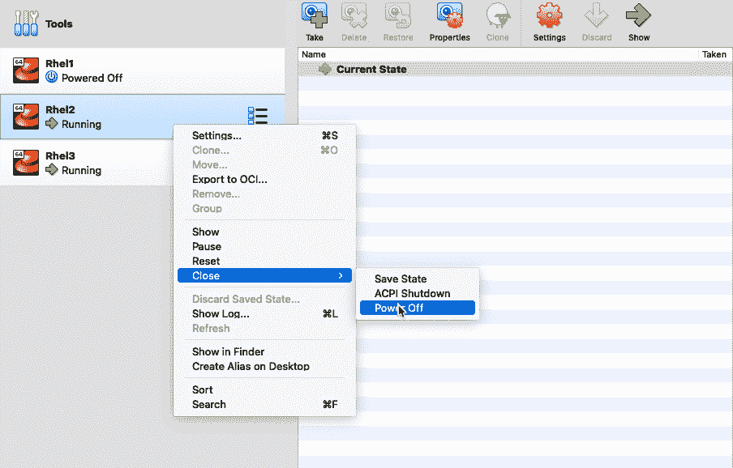

图 4.1 – 关闭你的 VirtualBox 虚拟机

然后，选择**设置**，如下所示：

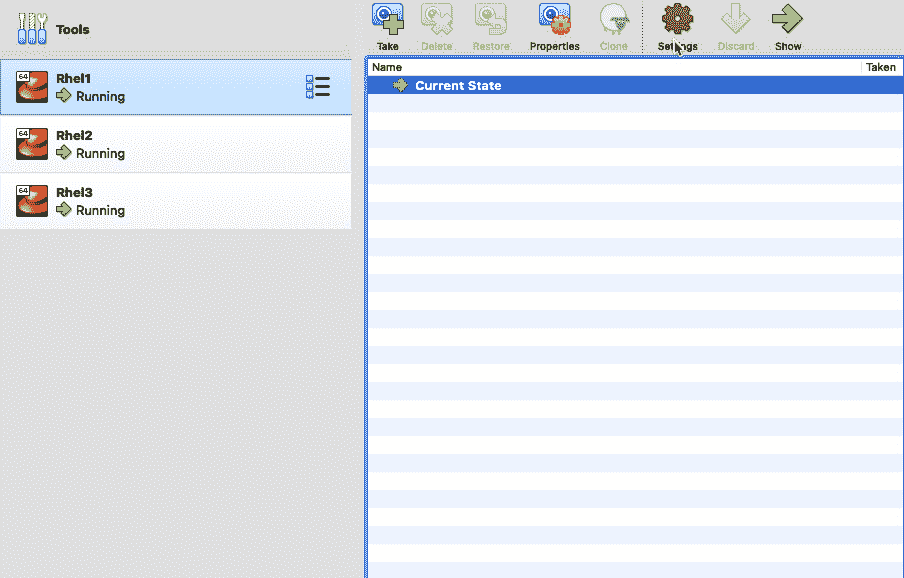

图 4.2 – 修改 VirtualBox 虚拟机的设置

然后，我们将选择**网络**并添加适配器 2，如下所示：

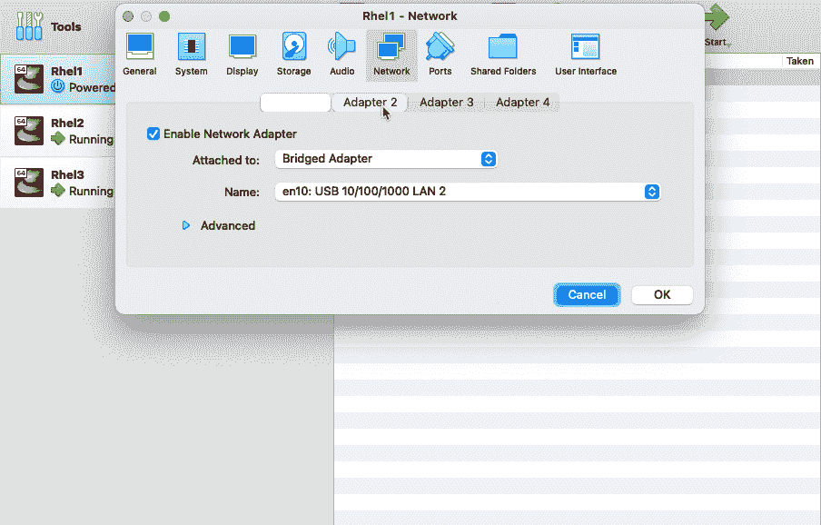

图 4.3 – 添加第二个网络适配器

我们将确保新适配器的设置如下：

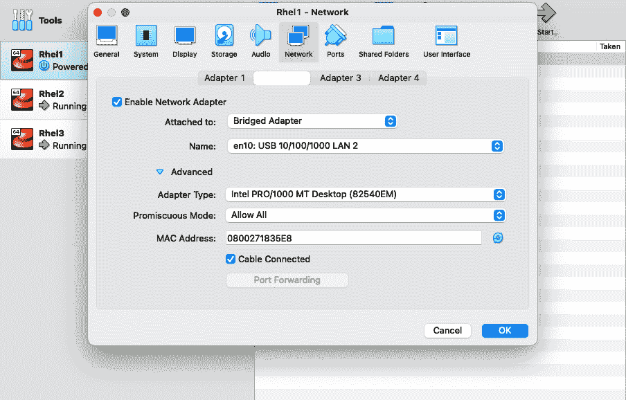

图 4.4 – 第二个网络适配器的设置

最后，我们将添加一个第三个适配器，如下所示：

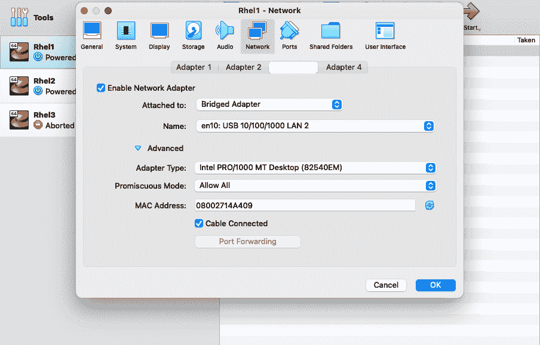

图 4.5 – 添加带有正确配置的第三个和最后一个网络适配器

增加两个适配器的原因是，在不使用虚拟机的正常启动（会打开 GUI）的情况下，保持 SSH 连接。如果使用的是无头虚拟机启动（不打开 GUI），则需要这种配置。

# 了解链路聚合

Teamd 负责网络团队的控制。它使用运行器来实现这一目的。teamd 运行器的列表可以在此处找到：[`access.redhat.com/documentation/en-us/red_hat_enterprise_linux/8/html/configuring_and_managing_networking/configuring-network-teaming_configuring-and-managing-networking`](https://access.redhat.com/documentation/en-us/red_hat_enterprise_linux/8/html/configuring_and_managing_networking/configuring-network-teaming_configuring-and-managing-networking)。然而，我们将重点关注以下几种：

| **运行器类型** | **描述** |
| --- | --- |
| `lacp` | 该运行器使用 802.3ad LACP。 |
| `loadbalance` | 端口使用哈希函数来尝试在端口之间达到负载均衡。 |
| `activebackup` | 一个端口设置为活动，另一个端口作为故障转移的备份。 |
| `roundrobin` | 在这种状态下，端口以轮询方式使用。 |

表 4.1 – 一些链路聚合配置文件类型

对于此任务和创建网络团队，我们将再次使用`nmcli`工具，正如我们在*第三章*中所做的那样，*网络服务自动化 - Red Hat Linux 网络*。

使用网络接口团队有许多理由——如冗余、额外的吞吐量等。根据公司需求和所设置的交换机，你甚至可以深入到多个团队。例如，将两个 LACP 对放入轮询模式，以增加带宽，同时引入容错。许多大公司需要确保他们的应用程序始终可用，以便从中获取收益，通过学习如何构建网络团队，你成功的机会将大大增加。

# 创建不同类型的链路聚合配置

请注意，实验室设置中的接口可能与我的不同——它们是 enp0s8 和 enp0s9。我们需要确保在设置团队时这些接口处于关闭状态。这将取决于你的实验室环境，并且不应选择在启动时连接这两个接口。我们将首先通过以下命令展示接口连接状态以及设备状态：

```
[emcleroy@rhel1 ~]$ nmcli connection show
```

输出结果可以在以下截图中看到：

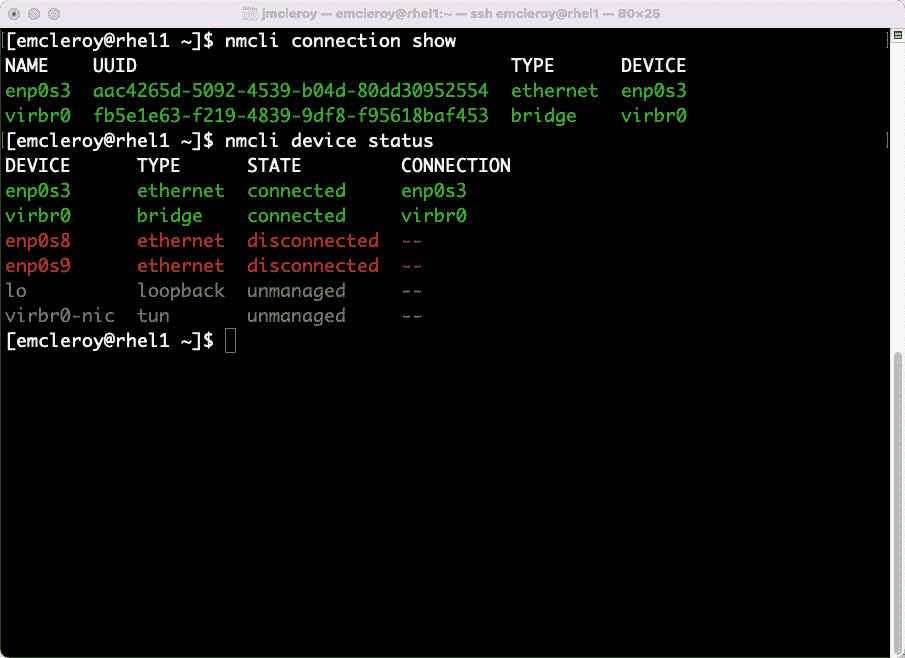

图 4.6 – 网络接口连接，包括虚拟和物理接口

接下来，我们将开始创建名称为`bond1`的团队。我们将使用以下命令：

```
[root@rhel1 emcleroy]# nmcli connection add type team con-name bond1 ifname bond1 team.runner activebackup
```

以下截图展示了这一点：

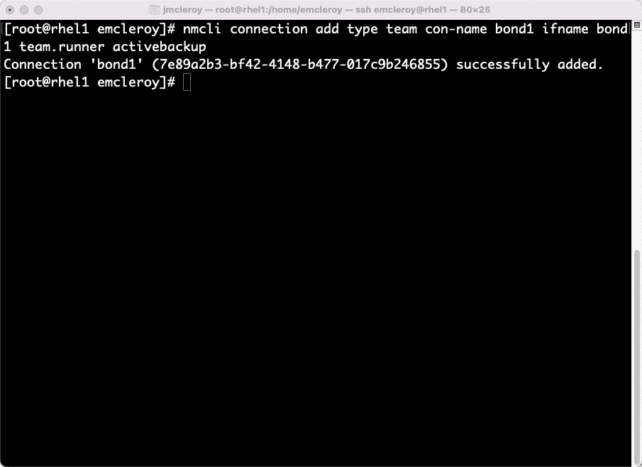

图 4.7 – 创建名称为 bond1 并使用 activebackup 的完整团队命令

让我们进一步解析我们刚才看到的截图。首先，`nmcli`是用于创建团队的工具。`connection add`的代码片段显示我们正在添加一个新连接，`type`显示我们正在创建一个`team`。连接名称（`con-name`）是你为其指定的名称，可以自行选择。接口名称（`ifname`）——在此示例中为`bond1`——是你为接口指定的名称。`team.runner`是你创建的团队类型；在我们的例子中，我们使用的是`activebackup`，这意味着一个接口正在传输流量，另一个则在故障切换时待命。这可能是由于人工干预或接口失去连接所致。

然后需要物理接口来启动团队。我们正在使用附加命令，并在团队创建后对其进行修改。这使我们能够将接口作为从属设备添加到团队中。我们将使用以下命令：

```
[root@rhel1 emcleroy]# nmcli connection add type team-slave con-name bond1-enp0s8 ifname enp0s8 master bond1
[root@rhel1 emcleroy]# nmcli connection add type team-slave con-name bond1-enp0s9 ifname enp0s9 master bond1
```

以下截图展示了这些命令：

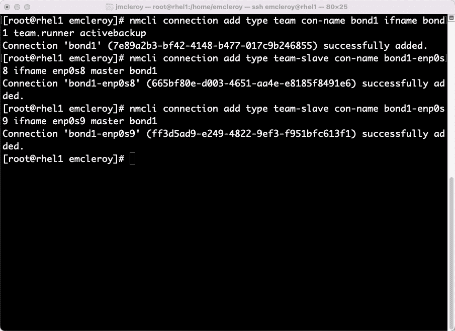

图 4.8 – 将物理接口添加到虚拟团队

如我们在前几章所学，连接到外部世界还需要其他项目。我们将使用以下命令来完成此更改：

```
[root@rhel1 emcleroy]# nmcli connection modify bond1 ipv4.addresses 192.168.1.233/24
[root@rhel1 emcleroy]# nmcli connection modify bond1 ipv4.gateway 192.168.1.1
[root@rhel1 emcleroy]# nmcli connection modify bond1 ipv4.dns 192.168.1.1
[root@rhel1 emcleroy]# nmcli connection modify bond1 ipv4.method manual
```

这在以下截图中有所说明：

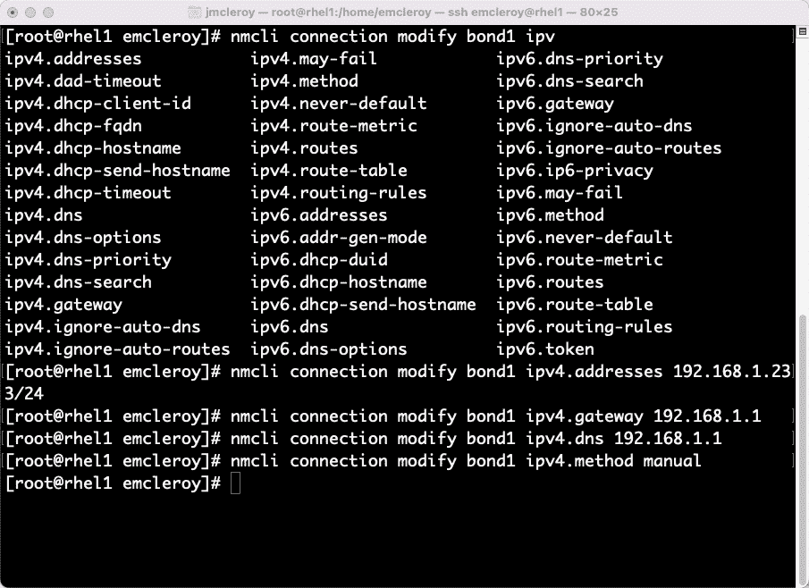

图 4.9 – 向团队添加所需的额外配置

最后，我们希望确保在重启后，接口能够自动恢复，以便你在考试中不丢分。我们将使用这个命令来确保接口在重启后自动恢复：

```
[root@rhel1 emcleroy]# nmcli connection modify bond1 connection.autoconnect yes
```

以下截图展示了这一点：

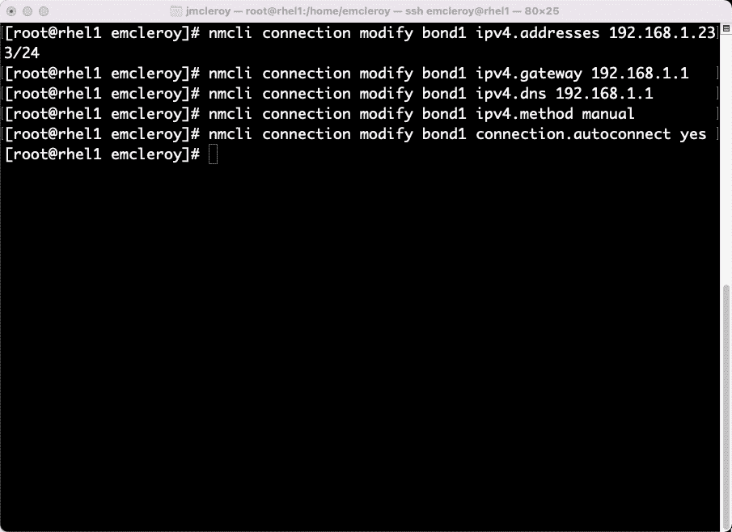

图 4.10 – 确保连接在重启后持续存在

你可以运行以下命令来启动连接，并确保你的团队正常运行：

```
[root@rhel1 emcleroy]# nmcli con up bond1
[root@rhel1 emcleroy]# nmcli device status
```

在以下截图中，我们可以看到设备状态：

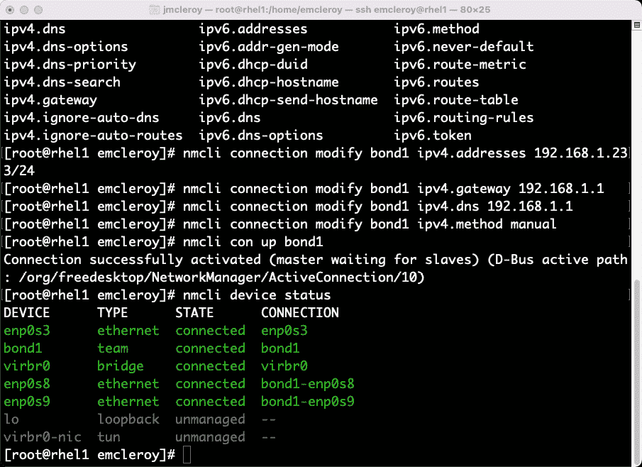

图 4.11 – 显示团队设备状态和团队接口

以下命令展示了你的团队的外观、连接情况以及当前活跃的接口：

```
[root@rhel1 emcleroy]# teamdctl bond1 state
```

该命令的输出如以下截图所示：

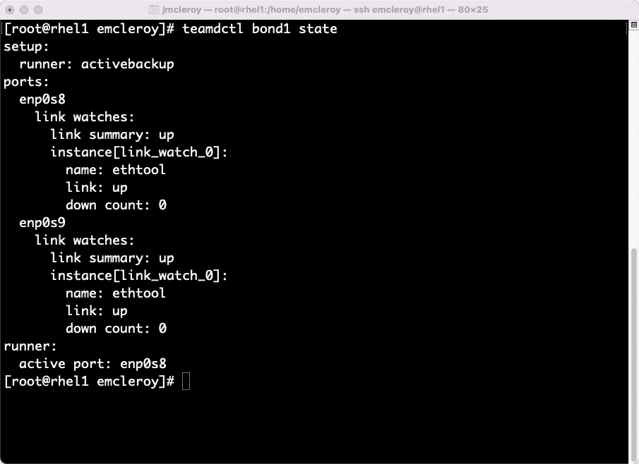

图 4.12 – 团队信息以及当前活跃的端口

请记住，如果你无法访问服务器的图形界面，在大多数情况下，你可以安装一个图形界面，但这将在后续章节中讨论。在考试期间，你可以使用`nm-connection-editor`命令启动配置工具。如下所示：

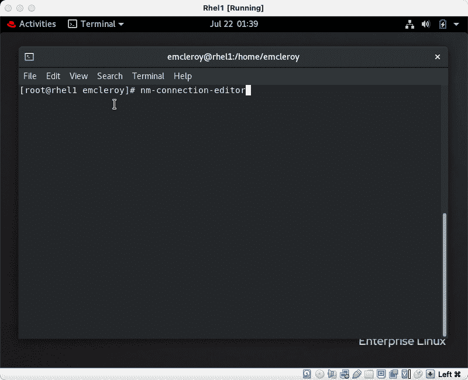

图 4.13 – 启动命令

启动命令后，你将看到一个可以控制的图形界面。这允许你选择一个团队并创建所有所需的项目，而无需记住步骤。首先，选择一个团队，如下所示：

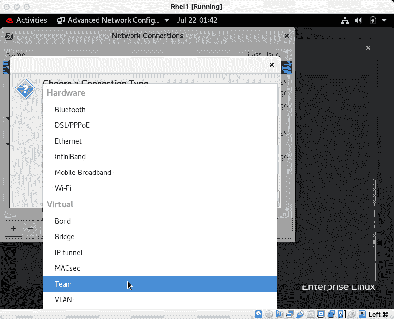

图 4.14 – 从下拉菜单中选择团队

接下来，你将开始为团队设置正常信息。如以下截图所示，你将设置团队名称：

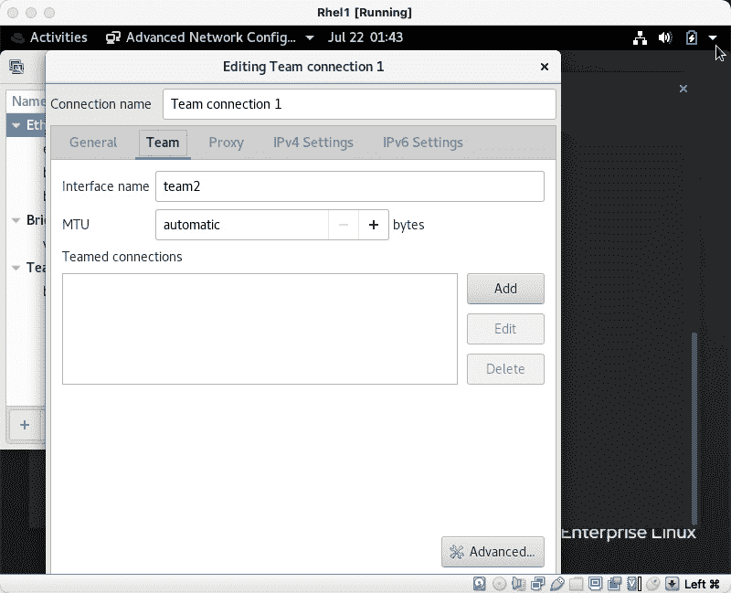

图 4.15 – 命名团队及团队接口

设置团队名称后，你将选择哪些物理接口或虚拟接口将成为新团队的一部分。如下所示：

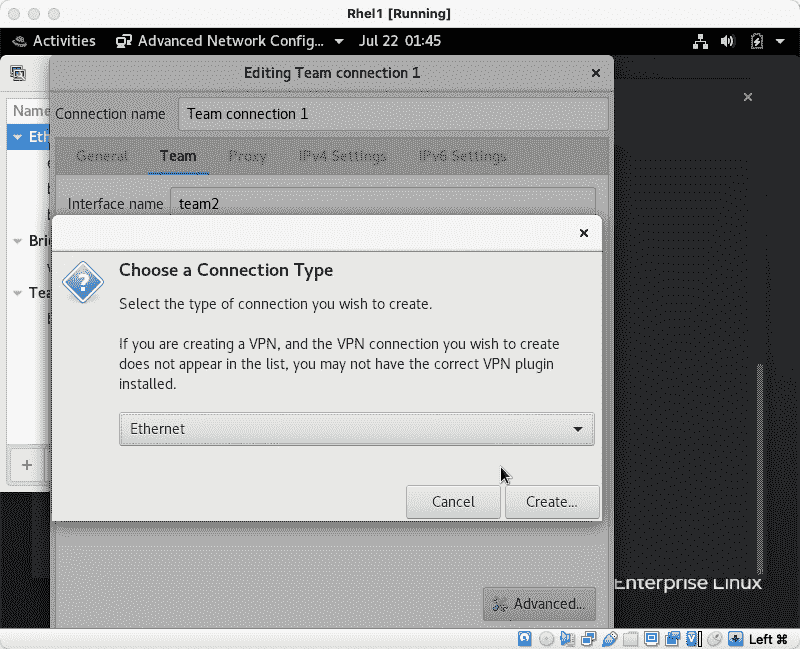

图 4.16 – 选择要加入团队的接口

你甚至可以为添加到团队的接口设置不同的选项。对于我们的目的，我们不做任何更改，只需将其添加。如下所示：

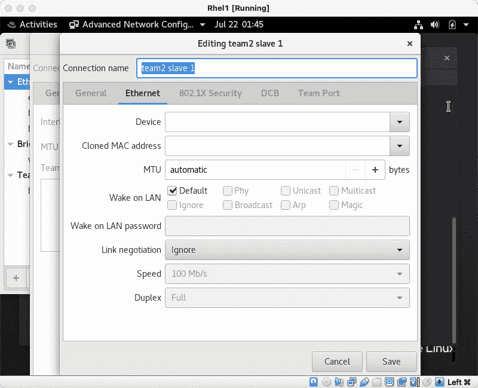

图 4.17 – 在从属接口级别设置接口的配置

你可以看到添加两个接口（或你希望添加到团队中的任意数量的接口）后的结果。如下所示：

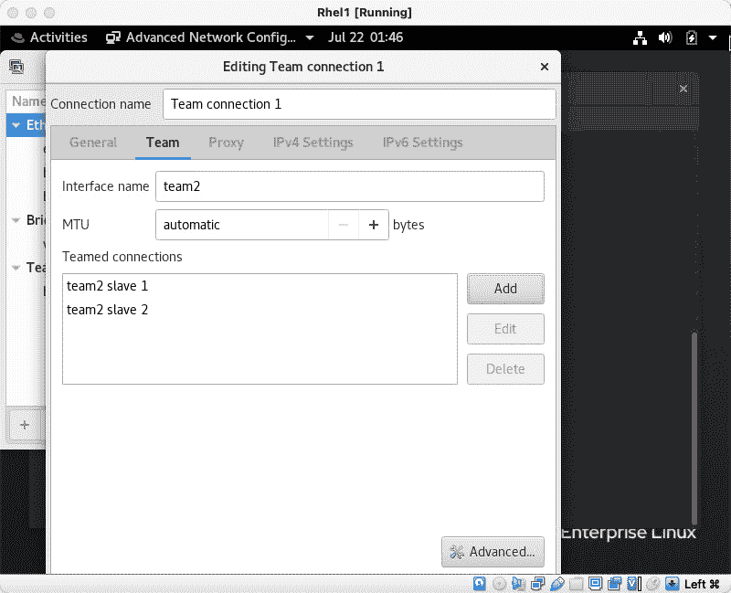

图 4.18 – 两个接口被添加到团队后的状态

最后，我们可以设置接口的 IP、网关、DNS 等。这使得我们能够确保该团队现在能够连接到外部世界。如下截图所示：

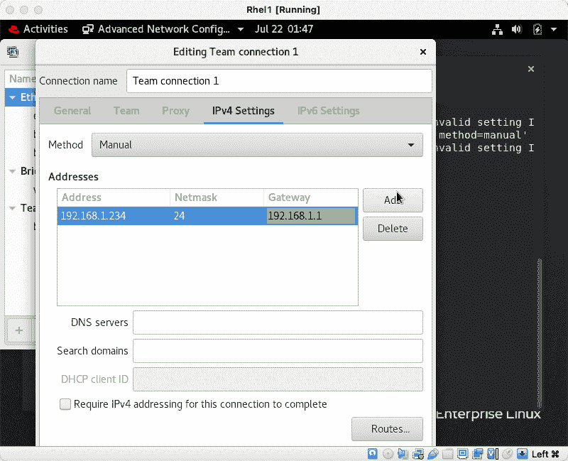

图 4.19 – 设置与外界通信所需的信息

这就结束了手动配置的方式。接下来，我们将通过使用 Ansible 自动化来简化操作。通过自动化，我们可以反复实现相同的结果，同时降低人为错误的可能性。这在不断重复执行此类任务时特别有帮助。

# 使用 Ansible 自动化解除设置链路聚合的烦恼

现在，我们都知道自动化可以帮助我们节省时间和精力。它还可以确保我们的工作一致性，这在做网络工作时尤其重要。我们可以建立多个不同的剧本来设置不同的内容，或者我们可以使用变量。在这种情况下，我们将使用变量，因为它们是最容易修改的。有了变量，你可以轻松地更改不同的设置，同时只需一个剧本。一个例子是，当你需要在使用轮询（round-robin）和负载均衡（load balancing）之间进行选择时，这个变量可以确保一切设置正确。配合其他变量，如 IP 地址和网关，你可以只写一个剧本，剩余的部分则由变量填写。

让我们开始编写一个使用变量的网络团队配置剧本。这些是回答剧本中需要完成工作的系列项。

然后，我们会添加每个 Ansible 剧本开头的常规代码。这包括我们将在剧本中使用的来自清单的主机。它还包括我们如何提升权限，以便进行修改。这是个人偏好，你可以选择开启。下面是剧本开头的初始内容，和前几章中的示例相同：

```
---
- name: Automated Teaming Setup
  hosts: rhel1
  become: true
  become_method: sudo
```

完成初始设置后，我们将添加下一步，启动网络团队功能。这将包括为不同的接口选择一个变量。还将包含用于 IP 地址的变量，连同网关和 DNS 信息。它还将包括一个变量，用来设置我们将要进行的团队类型。这将包括使用一个角色，就像我们在 *第三章* 中所做的那样，*网络服务自动化 – Red Hat Linux 网络介绍*：

```
  vars:
    network_connections:
      - name: bond1
        state: up
        type: team
        interface_name: bond1
  roles:
    - rhel-system-roles.network
```

安装 `rhel-system-roles.y`ml 文件后，你可以通过访问 `/usr/share/doc/rhel-system-roles/network/example-team_simple-playbook.yml` 来查看该角色的手册页面以及它是如何工作的，安装方法是使用 `dnf install rhel-system-roles -y`。这将展示你需要在 playbook 中填写的变量，以确保系统角色正确运行：

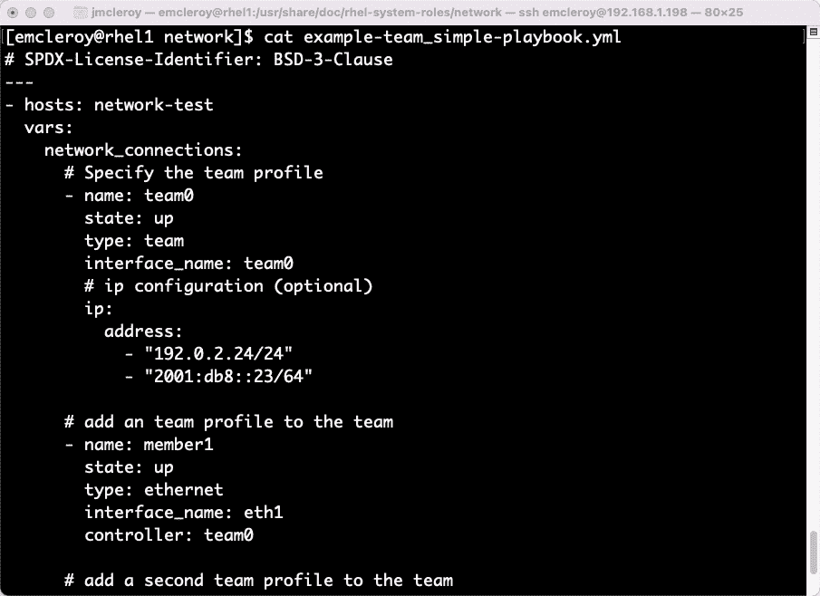

图 4.20 – Rhel 系统角色网络团队示例

从这里，我们可以使用从示例中收集的信息来构建剩余的 playbook。我们将输入额外的变量，这些变量将在 playbook 目录中的变量文件中被调用，而不是直接使用原始值。

这是剩余的 playbook 代码，以确保 playbook 能够成功运行，然后我们将在 playbook 代码后查看变量文件和层级结构，确保 playbook 能正确读取变量。以下是相应的代码片段：

```
  vars:
    network_connections:
      - name: "{{ team_name }}"
        state: up
        type: team
        interface_name: "{{ team_name }}"
        ip:
          address:
            - "{{ ipv4_team_address }}"
            - "{{ ipv6_team_address }}"
      - name: member1
        state: up
        type: ethernet
        interface_name: "{{ int1 }}"
        controller: "{{ team_name }}"
      - name: member2
        state: up
        type: ethernet
        interface_name: "{{ int2 }}"
        controller: "{{ team_name }}"
  roles:
    - rhel-system-roles.network
```

这个 playbook 现在将自动创建网络团队的构建。然后我们将创建变量文件，以回答我们创建的变量，比如 `team_name`：

```
---
team_name: team1
ipv4_team_address: 192.168.1.233/24
ipv6_team_address:  fe80::9029:1a51:454:c2bd/64
int1: enp0s8
int2: enp0s9
```

这使我们能够回答变量，但保持 playbook 的模糊性，使其可以用于多种不同的用途，而不是一次性完成的方式。我们将把这个文件放在与 playbook 同一目录的 `vars` 文件夹中，并命名为 `rhel1_team_vars.yml`。我们还需要将其添加到 playbook 中的 `vars list`，这样 playbook 就知道从哪里获取信息：

```
  vars_files:
    - "{{ playbook_dir }}/vars/rhel1_team_vars.yml"
  vars:
    network_connections:
      - name: "{{ team_name }}"
        state: up
        type: team
        interface_name: "{{ team_name }}"
        ip:
          address:
            - "{{ ipv4_team_address }}"
            - "{{ ipv6_team_address }}"
      - name: member1
        state: up
        type: ethernet
        interface_name: "{{ int1 }}"
        controller: "{{ team_name }}"
      - name: member2
        state: up
        type: ethernet
        interface_name: "{{ int2 }}"
        controller: "{{ team_name }}"
  roles:
    - rhel-system-roles.network
```

现在，我们可以查看 playbook 文件夹的布局，其中包含清单、`vars` 文件和 playbook：

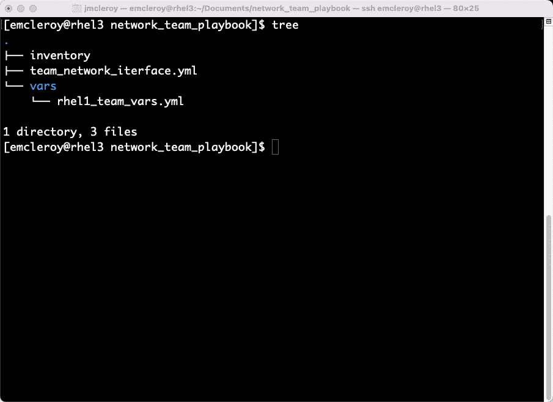

图 4.21 – 这显示了 playbook 目录的层级结构

对于这个 playbook，清单将仅仅是 `rhel1.example.com`，位于 `defaults` 下，但在你的实验室设置中可能会有所不同。设置完成后，我们将查看接口设置，先是设置前，然后是 playbook 执行后的情况。

在这里，你可以看到在我们运行 playbook 之前，并没有配置任何团队：

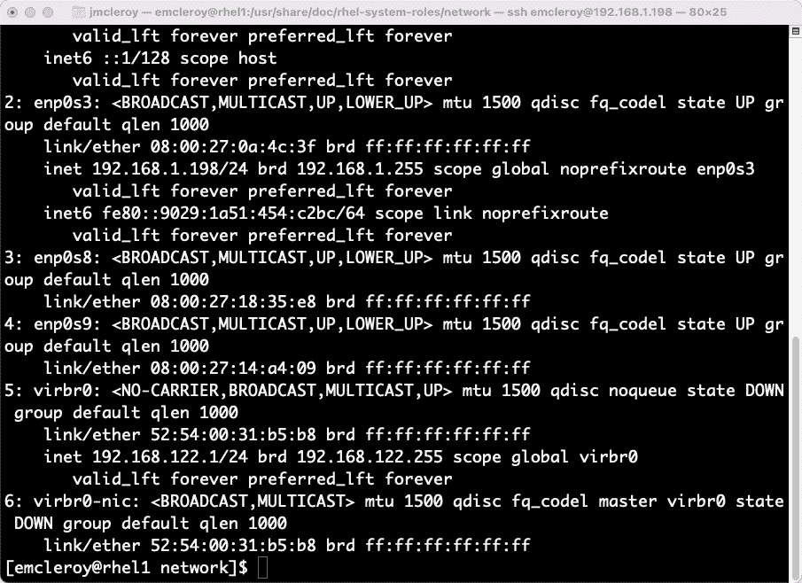

图 4.22 – 当前配置的接口连接

在看过前面的连接后，我们接下来将运行命令`ansible-playbook –i inventory team_network_interface.yml -u emcleroy -k --ask-become –v`来执行 playbook，并查看已创建的团队：

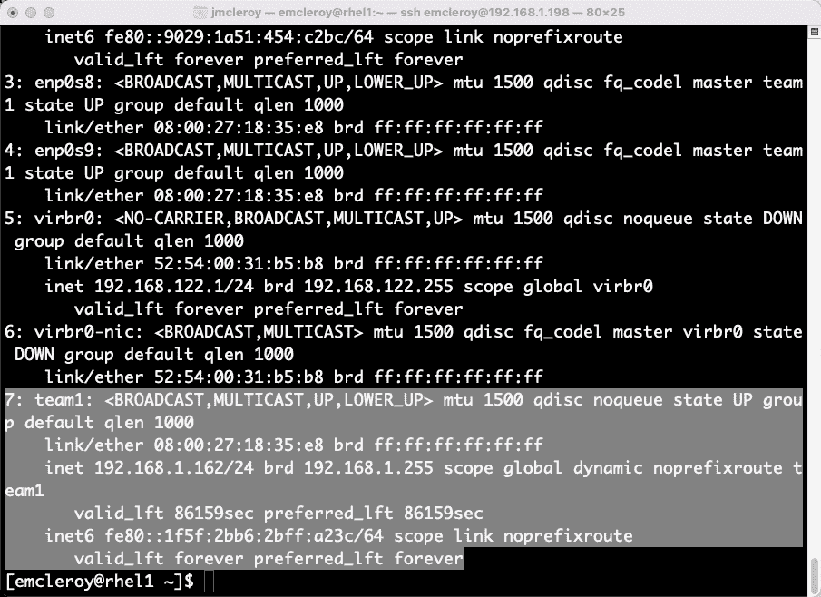

图 4.22 – 在这里，你可以看到团队已被创建

正如你在本节中所学到的，Ansible 自动化可以使网络团队的设置变得轻而易举。除了为其他更重要的项目节省时间外，Ansible 自动化还降低了人为错误的风险。这使得用户可以放心，每台服务器上的配置将保持一致，从而加速故障排除并简化部署过程。

# 总结

在本章中，我们了解了网络团队。我们讨论了它如何用于高可用性（HA）和提高吞吐量的优势。我们致力于确保你理解使用网络团队的价值，以及它在生产环境中的重要性。当你有多个路径时，例如，你可以在不影响正在运行的应用程序的情况下，关闭交换机进行维护。这些只是网络团队的一些优势，实际上还有更多。在下一章中，我们将进一步探索 Rhel 8 的网络领域，讨论 DNS、DHCP 和 IP 的更多细节。我们将学习如何设置它们，并使服务器能够提供如 DNS 和 DHCP 等功能。休息一下，接下来我们将准备好进入更多有趣的网络内容。
