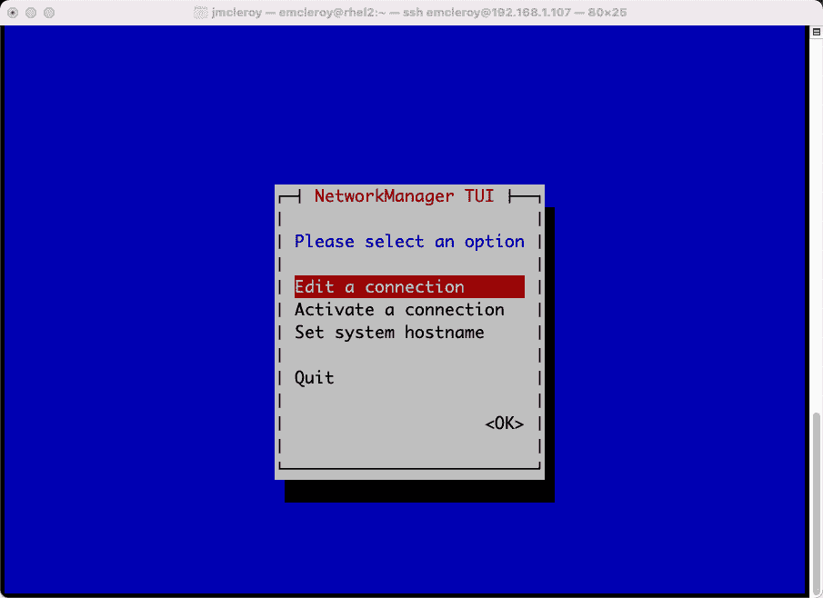

# 5

# DNS、DHCP 和 IP 地址配置 – 深入了解 Red Hat Linux 网络

在本章中，我们将深入探讨网络配置。我们将讨论 `192.168.1.10`，网关地址为 `192.168.1.1`，而在 DHCP 的情况下，IP 信息由 DHCP 服务器提供，系统通过握手机制获取连接子网的 IP、DNS 和网关信息。我们将在本章后面详细讨论静态地址配置和 DHCP 配置。我们还将设置一个 DHCP 服务器，通过手动和 Ansible 自动化提供 IP 配置信息。

接下来，我们将了解如何通过**动态名称系统**（**DNS**）查找互联网上的其他地址，DNS 将**完全限定域名**（**FQDN**）与 IP 地址关联。这将像 [`redhat.com`](http://redhat.com) 这样的地址转换为你的计算机可以通过 Web 浏览器或其他连接方式（如 Telnet 或 SSH）访问的 IP 地址。这一切都通过域名注册商来处理，DNS 将网站与 IP 地址（以及反向映射）关联。我们将手动并通过 Ansible 自动化设置一个 DNS 服务器。

在本章中，我们将覆盖以下主要内容：

+   深入学习 Linux 网络配置，重点是 DNS、DHCP 和静态 IP 地址配置

+   设置静态 IP 地址，以应对 DHCP 不可用时仍需确保服务可达的情况

+   使用基本的开箱即用的 DHCP 配置，在网络上可用时快速联网

+   了解 DNS 是什么以及为什么你需要了解它

本章的技术要求将在以下部分中介绍。

# 设置 GitHub 访问权限

请参考*第一章*，*块存储 – 学习如何在 Red Hat 企业版 Linux 上配置块存储*，以获得 GitHub 的访问权限。你可以在以下链接找到本章的 Ansible 自动化剧本：[`github.com/PacktPublishing/Red-Hat-Certified-Specialist-in-Services-Management-and-Automation-EX358-Exam-Guide/tree/main/Chapter05`](https://github.com/PacktPublishing/Red-Hat-Certified-Specialist-in-Services-Management-and-Automation-EX358-Exam-Guide/tree/main/Chapter05)。记住，这些是建议的剧本，并不是唯一的写法，你可以根据需要调整剧本以适应你的情况。

你可以使用原始的、Shell 或 CMD 脚本来实现相同的结果，但我们展示的是实现目标的最佳方法。还要记住，我们没有使用未来版本 Ansible 所需的 FQCN，因为在考试中不会支持这一点，考试是针对 Ansible 2.9 版本进行的。

# 深入学习 Linux 网络配置，重点是 DNS、DHCP 和静态 IP 地址配置

到目前为止，我们简要地讨论了 Linux 网络及其对您的意义——为您的服务器、应用程序等提供访问权限，并在您和其他网络中获得访问。我们将基于接口的 IP 地址配置的初始设置，进一步扩展我们在本书中学到的内容。我们不仅会向您展示您的设备如何获取 IP、网关和 DNS 配置，还会展示如何将这些服务提供给您的服务器和应用程序。

首先，我们将讨论不同项的每个方面的重要性。您的 IP 地址就像您的家庭地址。您的网关就像通往世界的车道。DNS 就像您的 GPS，因为它显示了如何到达您的在线目的地。无论是通过 DHCP 自动配置，还是通过静态地址手动配置，所有这些内容的配置都是联网并到达目标所需的最低配置。

我们之前讨论过 IP 地址配置，以及如何通过接口配置手动进行静态地址配置。DHCP 也是如此；不过，您的系统会与另一个设备通信，以自动获取所需的上网信息。这些信息包括 DNS，它是您在互联网上寻找不同内容（如电子商务网站、新闻等）的 GPS。我们将在本章接下来的内容中深入探讨这些类别。

# 在没有 DHCP 的情况下，仍需设置静态 IP 地址以确保该服务可访问

这适用于您没有 DHCP 时，或需要始终确保使用相同地址的情况。此设置将提供 IP 地址、网关、DNS 和路由等信息；有时，您需要通过静态配置来启用系统。您会注意到，在以下截图中，系统确实获得了 DHCP 地址，但为了我们的目的，我们假设它获得了一个不正确的地址，而这个地址对于应用程序来说是必需的。我们将使用以下命令显示服务器的当前 IP 地址：

```
[emcleroy@rhel2 ~]$ ip a | grep enp0s3
```

以下截图显示了当前在服务器上配置的 IP 地址信息：


图 5.1 – 当前基于 DHCP 的 IP 地址配置

因此，为了解决这个问题，我们将使用`nmtui`命令将系统设置为静态配置，以获得一个图形用户界面（GUI）风格的界面，如下图所示：



图 5.2 – 使用 nmtui 命令启动的 GUI 界面

在图形用户界面（GUI）中，我们将选择**编辑连接**选项。这将允许我们选择接口并手动设置适当的配置。选择该选项后选择正确的接口，详情请见下图：


图 5.3 – 选择“编辑连接”选项，并高亮显示正确的接口

选择正确的接口后，我们将选择**手动（Manual）**设置，以便打开所需的字段进行操作，如下图所示：


图 5.4 – 选择手动（Manual）以打开以太网设置进行配置

然后，我们将为接口设置正确的配置。在某些情况下，这些信息可能需要从网络团队处获得。原因是你需要知道你的 DNS、网关和子网范围。作为服务器管理员，你可能不了解这些信息，这也是为什么在桌面使用时，DHCP 更受欢迎，因为它会自动填充这些字段。以下截图显示了将此接口启动并连接到网络所需的配置：


图 5.5 – 包含子网范围、网关和 DNS 的 IP 地址，用于所需的连接选项

然后，你需要保存这些信息，退出`nmtui`图形界面，并运行以下命令：

```
[emcleroy@rhel2 ~]$ sudo ifdown enp0s3 && sudo ifup enp0s3
```

从命令的输出中，以下是来自服务器的截图：


图 5.6 – 重新加载接口的命令，以便获取你指定的新设置

如果你没有直接访问服务器的权限，可以通过 SSH 运行以下命令：

```
[emcleroy@rhel2 ~]$ sudo systemctl restart NetworkManager.service
```

在以下截图中，你可以看到命令的输出：


图 5.7 – 重新加载网络管理器的命令，以便获得新的静态设置

# 使用默认的 DHCP 配置，在网络中有可用的情况下快速连接

开箱即用的 DHCP 寻址将为你提供所需的 IP 地址，当物理连接到一个有路由器和 DHCP 服务器运行的网络时，系统会自动获取 IP 并连接到网络。这样你可以快速上线，而无需知道子网、网关或路由信息等连接设置。

## 使用 DHCP 来提供由外部源提供的初始接口连接

当您首次启动计算机并将其连接到网络时，默认情况下，大多数系统都配置为尝试使用 DHCP。此握手方法可以使互联网连接更快速且无需直接干预。例如，在 RHEL 中，当您安装时启动接口，系统会自动将配置设置为 DHCP。这是因为大多数用户都有一个提供服务的 DHCP 服务器。这意味着 DHCP 服务器与 RHEL 计算机之间会进行握手，以提供连接信息。此过程通过 **DHCP Discover** 消息或计算机或客户端服务器请求连接的方式进行。服务器回复 **DHCP Offer** 提供信息。客户端然后通过 **DHCP Request** 请求连接信息。最后，DHCP 服务器通过 **DHCP Acknowledgement** 响应，包含连接信息。以下图示展示了这一过程：


图 5.8 – DHCP 握手

一旦从 DHCP 服务器获取信息，您的计算机将配置一个 IP 地址、网关和 DNS。这使您能够更快地在线，并且无需自己设置这些信息。在某些情况下，这种方式是必要的，因为您既没有所需的信息（例如，网络上哪些 IP 地址是空闲的），也不知道网关或 DNS 地址是什么。通过使用 DHCP，您可以可靠地连接到网络，避免冲突，并访问您的本地网络。

然而，在大多数企业环境中，您不会为应用服务器使用 DHCP 服务器，但在大多数情况下，您会为员工提供连接。大多数应用生产服务器通过静态配置或通过自动化使用下一个可用的应用 IP 设置。这就是为什么能够设置 DHCP 服务器如此重要，因为您希望员工能够轻松连接、登录并立即开始工作。知道有设置 DHCP 服务器的需求后，我们将以此为动力，设置一个 DHCP 服务器，以便为您的公司内部员工或您家中的家庭成员提供连接。

在 DHCP 服务器运行并具备连接能力的情况下，无论是通过物理以太网还是 Wi-Fi，您都可以按照以下步骤为设备设置 DHCP IP 地址。为此，您需要通过控制台或虚拟机管理器直接访问服务器。使用以下命令，您可以检查设备的 IP 地址：

```
[emcleroy@rhel2 ~]$ ip a | grep enp0s3
```

如以下截图所示，您的设备当前没有 IP 地址：


图 5.9 – 当前没有与连接的 enp0s3 接口关联的 IP 地址

我们将再次使用`nmtui`，就像我们处理静态地址时一样，但这次我们将选择**自动**，即使用 DHCP，如下图所示：


图 5.10 – 在 nmtui 界面设置中选择自动选项

选择`nmtui`后：


图 5.11 – 在 nmtui 中激活连接

选择**激活连接**后，你需要选择物理连接的接口，如下图所示：


图 5.12 – 选择你之前设置的正确接口以启用连接

激活后，接口应该会启动并完成之前概述的 DHCP 握手，以获取建立网络连接所需的信息。使用以下命令，你可以查看自动获取的 IP 地址：

```
[emcleroy@rhel2 ~]$ ip a | grep enp0s3
```

自动获取的连接信息如下图所示：


图 5.13 – 网关的 IP 地址和路由

我们刚刚设置了你的服务器或客户端机器，通过 DHCP 获取网络连接。通过自动化系统，你将能够快速在线，而无需担心手动配置任何设置。这对于那些不总是需要相同 IP 地址但只需要网络连接的设备来说是一个很大的优势。接下来，我们将讨论如何创建一个 DHCP 服务器来提供这种功能。

## 手动设置 DHCP 服务器配置以提供 DHCP 服务

在某些情况下，网络上可能没有设置 DHCP 服务器。作为系统管理员，可能需要你来设置一个。这是因为在许多情况下，桌面支持需要 DHCP 服务器，并且需要快速且尽可能少的工作量让工作人员上线。这可能意味着他们通过 Wi-Fi 或**虚拟私人网络**（**VPN**）连接到网络。无论他们是如何连接的，只要他们在授权的连接范围内，我们就需要为他们提供正确的地址信息。这不仅允许他们访问互联网，还能让他们访问公司内部网络中的系统。让我们开始手动设置 DHCP 服务器。

你首先需要做的是使用以下命令安装`dhcp-server`软件包：

```
[emcleroy@rhel1 ~]$ sudo dnf install dhcp-server
```

该输出可以在以下截图中看到的命令中查看：


图 5.14 – 安装所需的 dhcp-server 软件包

从那里，我们需要在正确的配置文件中设置参数，以便`dhcp-server`知道应向客户端机器提供哪些信息。使用以下命令，我们可以打开并编辑`dhcpd.conf`文件：

```
[emcleroy@rhel1 ~]$ sudo vi /etc/dhcp/dhcpd.conf
```

命令显示在以下截图中：


图 5.15 – 编辑 dhcpd.conf 文件以设置所需的网络设置

为了省去一些麻烦，有一个技巧可以利用。这个技巧是查看配置文件的示例并复制粘贴选项。完成后，您需要编辑选项以匹配您的网络要求，从而让服务器向客户端提供正确的信息。使用以下命令，我们可以查看正在运行的 DHCP 服务器的示例：

```
[emcleroy@rhel1 ~]$ cat /usr/share/doc/dhcp-server/dhcpd.conf.example
```

该示例可以在以下截图中找到：


图 5.16 – 配置的 dhcpd.conf 文件示例

在该示例中，您将看到设置内部 DHCP 服务器所需的主要部分，以便为您的客户端提供服务。该部分在以下截图中显示：


图 5.17 – 必要项位于“稍微不同的配置”部分下

通过复制子网部分并将其粘贴到`dhcpd.conf`文件中，您可以轻松地编辑为所需的值，而无需担心是否遗漏了任何项。此配置文件在以下截图中显示：


图 5.18 – 为 dhcp-server 提供 192.168.1.0/24 网络的配置

在`dhcpd.conf`文件中设置了所有正确的设置后，您可以启动并启用`dhcp-server`守护进程，以确保服务器正在运行。我们将使用以下命令来启用并启动`dhcpd`服务：

```
[emcleroy@rhel1 ~]$ sudo systemctl enable dhcpd
[emcleroy@rhel1 ~]$ sudo systemctl start dhcpd
```

命令的执行结果显示在以下截图中：


图 5.19 – 启动并启用服务，以便它在启动时自动启动

启动并启用服务后，最好检查并确保系统已成功启动。我们可以使用以下命令查看服务的状态：

```
[emcleroy@rhel1 ~]$ sudo systemctl status dhcpd
```

`running`的状态在以下截图中显示，用于`dhcp-server`：


图 5.20 – 显示 dhcp-server 运行状态，从而确认它已正确设置

与其他所有服务一样，我们希望连接到外部世界，为此我们需要打开防火墙以允许 DHCP 租约的传入广播请求。我们将使用以下命令打开并重新加载防火墙：

```
[emcleroy@rhel1 ~]$ sudo firewall-cmd --permanent --add-service-dhcp
[emcleroy@rhel1 ~]$ sudo firewall-cmd --reload
```

打开防火墙命令的输出如以下截图所示：


图 5.21 – 为 DHCP 打开防火墙端口并重新加载防火墙以允许连接

之前，我们跳过了双重检查，以确保防火墙规则已实际生效。这一次，我想展示如何检查并查看一个服务是否被允许通过防火墙。我们将使用以下命令查看当前防火墙允许的服务：

```
[emcleroy@rhel1 ~]$ sudo firewall-cmd --list-services
```

在下图中，命令显示 DHCP 服务已列出：


图 5.22 – 使用 `firewall-cmd --list-services` 命令；你可以看到它包括 DHCP

我们已经设置了一个 DHCP 服务器，以提供连接到子网的客户端设备的连接。这使你能够控制设备从静态 DHCP 地址分配到下一个 IP 地址池所接收的 IP 地址。我们简要展示了一些选项，如 `default-lease-time`，它表示机器在发出新请求之前将保持 IP 地址的时间。例如，静态 MAC 地址映射使你提前知道你的设备将从 DHCP 服务器获取哪个 IP 地址。这对于设置 Ansible playbooks 以便运行特定 IP 地址时非常有用。接下来，我们将讨论如何通过 Ansible 自动化设置此服务，以确保它容易重复并降低人为错误的可能性。

## 自动化 DHCP 服务器配置以提供 DHCP 服务

我们将从设置 Ansible 系统的清单开始，在我们的例子中，目标设备是 [rhel1.example.com](https://rhel1.example.com)，用于配置 DHCP 服务器。这将允许我们仅针对我们要运行的设备进行操作；同时，我们将在 playbook 中调用该服务器，以确保仅配置 `rhel1`。为你的 playbook 创建一个目录，或者你也可以将所有 playbook 放在同一个目录中，但它将使用相同的清单，所以请记住这一点。在我们的例子中，我们将在 `Documents` 文件夹中创建一个名为 `dhcp_server_playbook` 的目录，以存放 playbook 和清单文件：

```
[emcleroy@rhel3 Documents]$ mkdir dhcp_server_playbook
[emcleroy@rhel3 Documents]$ cd dhcp_server_playbook/
[emcleroy@rhel3 dhcp_server_playbook]$ ls
[emcleroy@rhel3 dhcp_server_playbook]$ vi inventory
```

清单文件应类似于以下截图：


图 5.23 – 用于创建 DHCP 服务器的 playbook 的 DHCP 服务器清单文件

然后，我们将进入剧本本身，创建任务以安装 DHCP 服务器。首先，我们需要指向我们创建的库存组，以确保不会更新其他主机。我们还将把 `become` 状态设置为 `true`，以提升我们的权限，并将 `become_method` 设置为 `sudo`，这样 Ansible 就知道如何提升权限：

```
---
- name: Install and Configure DHCP Server
  hosts: dhcp_servers
  become: true
  become_method: sudo
```

然后我们需要添加一些任务来开始构建 DHCP 服务器本身。我们将首先使用 `package` 模块安装 `dhcp-server` 包。我们还将设置任务以安装该包的最新版本：

```
  tasks:
    - name: Install dhcp-server package
      package:
        name: dhcp-server
        state: latest
```

在我们安装完服务器后，我们将使用模板模块通过 Jinja 模板设置配置文件。

首先，让我们查看剧本的布局，然后讨论模板。我们将使用 `template` 模块将我们构建的模板复制到系统中以配置 `dhcp-server`。您会注意到我们使用了一个预定义的变量 `playbook_dir`，以便指向文件的正确位置。这个变量是 Ansible 内置的，您无需自己配置：

```
    - name: Set subnet configuration of DHCP-Server
      template:
        src: "{{ playbook_dir }}/templates/dhcpd.conf.j2"
        dest: /etc/dhcp/dhcpd.conf
```

现在，让我们看看 `jinja2` 模板，它展示了我们想要创建的子网的正常 `dhcpd.conf` 布局，如以下截图所示：


图 5.24 – 用于 Ansible 剧本的 dhcpd.conf.j2 文件

完成此步骤后，我们将启动并启用服务。打开 `dhcp` 的防火墙规则并重新加载防火墙：

```
    - name: Enable and start dhcp-server service
      service:
        name: dhcpd
        enabled: true
        state: restarted
    - name: Open firewall rules
      firewalld:
        permanent: true
        immediate: true
        service: dhcp
        state: enabled
```

然后，我们将运行剧本以设置 DHCP 服务器。我们将使用以下命令；如果您已完全设置密钥，则不需要此步骤，但我想向您展示如何使用密码执行此操作：

```
[emcleroy@rhel3 dhcp_server_playbook]$ ansible-playbook -i inventory dhcp_server_playbook.yml -u emcleroy -k --ask-become
```

运行剧本时的输出显示在以下截图中：


图 5.25 – dhcp_server_playbook.yml 成功运行

在此成功运行后，您可以将服务器指向系统以查找 DNS 服务器。由于我的系统当前正在使用 DHCP 服务器，这使得测试变得更加困难，因为我正在桥接连接，但您可以更改配置，使用 VirtualBox 中的非桥接连接，如内部网络，并能够测试 DHCP 以查看其提供的内容。

在本节中，我们学习了如何自动化设置 DHCP 服务器。这使我们能够自动为系统提供 DHCP 服务。在企业环境中运行时，这让客户端计算机连接到新网络变得更加轻松。接下来，我们将讨论 DNS 以及它与网络连接的关系。

# 了解 DNS 以及为什么需要了解它

学习 DNS 很重要，因为它简化了我们如何查找互联网上联网设备的地址。如果没有 DNS 将 FQDN 转换为 IP 地址，我们所有人都必须通过 IP 搜索网站。这将变得非常混乱，因为今天有这么多网站可供使用，记住所有这些网站的 IP 地址会非常繁琐且难以管理。这最终会导致需要一个数据库，每次访问网站时都得查看。因此，DNS 应运而生，提供了这一功能，让你可以记住网站的友好名称，以便访问它们，如 [google.com](https://google.com)。

## 手动设置 DNS 服务器配置以提供 DNS 服务

我们首先需要做的是安装 `bind` 包，以便 DNS 可以运行。这将允许为系统提供 DNS 条目的守护进程。我们将使用 `sudo dnf install bind -y` 命令开始安装，输出结果如下图所示：


图 5.26 – 通过软件包管理器安装 bind

在安装了 `bind` 之后，我们需要查看文档，以清楚了解需要设置的项目。我们可以在截图中看到以下路径的 `named.conf` 文件示例：


图 5.27 – bind 设置的文档位置

安装完 `bind` 之后，我们需要配置 `/etc/named.conf` 文件，以设置所需的参数。该文件的位置在下图中显示，并通过 `sudo vi /etc/named.conf` 命令进行编辑：


图 5.28 – 编辑 /etc/named.conf 文件以配置 DNS 的命令

你会注意到，首先需要设置的是监听端口和接口。DNS 在端口 `53` 上监听，因为这是在网络世界中设置的 DNS 的知名（默认）端口。我们将调整设置，使其在连接到网络的任何接口上的端口 `53` 上监听传入请求。这个配置在下图中显示：


图 5.29 – DNS 端口 53 的接口设置

配置文件的下一部分是我们关注的区域文件位置。区域文件告诉 DNS 应该为某个 FQDN 提供哪些 IP 地址（这些文件是当你搜索网站时，如 [www.google.com](https://www.google.com)，DNS 查找的内容），然后通过 DNS 返回一个 IP 地址到你的计算机，以便它可以到达目标网站。在此案例中，正如下图所示，这些文件的位置是 `/var/named` 目录：


图 5.30 – 区域文件目录位置

当设置权威 DNS 服务器，或者所谓的顶级 DNS 服务器时，在像实验环境或考试等场合中，你可能希望将 `recursion` 设置为 `no`，这样 DNS 就不会从其他 DNS 服务器获取上游信息。然后，为了保存这些信息，比如 DNS 记录，你会将 `recursion` 设置为 `yes`。在本例中，我们将其设置为 `no`，因为我们希望成为顶级服务器，具体设置见以下截图：


图 5.31 – 权威 DNS 服务器的递归设置为否

接下来，我们将设置主转发查找区域的区域文件位置。转发查找区域用于查找给定的 DNS FQDN 的 IP 地址。这使得计算机或服务器能够在互联网上或局域网上查找它想要访问的内容。`example.com` 区域示例如下图所示：


图 5.32 – 提供给 named.conf 文件的 example.com 区域文件位置

接下来，我们将在 `named.conf` 文件中设置反向区域查找文件的位置。这样，如果你在系统中查找 IP 地址时，它将返回该 IP 地址对应的 FQDN。这个 `192.168.1.0` 的 PTR 记录，在我们的例子中，将指向 `example.com`：


图 5.33 – 为 192.168.1.0 区域提供给 named.conf 文件的 PTR 记录位置

现在，我们已经将所需的区域文件位置添加到 `named.conf` 中，接下来需要为 DNS 创建区域文件，以便 DNS 可以查找与 DNS 记录相关的信息。我们可以使用 `/var/named/named.localhost` 中提供的本地主机示例来展示区域文件中所需的内容。该区域文件的示例如下图所示：


图 5.34 – DNS 记录的示例区域文件

如前所述截图所示，我们需要详细了解几个不同的项目。首先是 DNS 服务器管理员的`@`和`.`符号。接下来是文件中列出的几个重要项，它们包括`A`记录（即 IPV4 DNS 记录）、`AAAA`记录（即 IPV6 记录）和`NS`记录（即名称服务器记录，决定了使用的 DNS 服务器设置，所有区域文件都需要这些记录）。序列号非常重要，因为它有助于识别从主机检索到的 DNS 记录是否是最新的。末尾的`.`（点）用于 FQDN（完全限定域名），这些域名可以被访问。在下面的截图中，您将看到我们如何为`example.com`设置一个简单的区域文件：


图 5.35 – 为 example.com 配置的区域文件，设置了 A 记录和 NS 记录

在配置好该区域后，我们将设置 PTR 区域以进行反向 DNS 查询。这是以相同的格式完成的，但 IP 地址的反向 DNS 布局与记录相反，这使得服务器可以通过 IP 地址而非名称被发现。此记录类型和设置将在下图中展示：


图 5.36 – 为 example.com 配置的 PTR 反向 DNS 查询区域文件，针对 192.168.1.0 子网

在我们的配置文件设置好并且区域文件填充完成后，我们接下来需要启用并启动由`bind`软件包提供的 named 服务，以便为指向它的系统提供 DNS 记录。通过下面截图中的命令可以完成此操作：


图 5.37 – 启动并启用 named 服务以提供 DNS

为了确保 DNS 正常运行，我们将使用以下命令：

```
[emcleroy@rhel1 ~]$ sudo systemctl status named
```

现在我们可以查看 named 服务的输出状态，如下截图所示，显示其正在积极运行且没有失败：


图 5.38 – DNS 的 named 服务状态

为了确保外部系统能够访问 DNS 服务，我们需要在防火墙中允许它。我们将使用以下命令来启动、启用并应用防火墙规则：

```
[emcleroy@rhel1 ~]$ sudo systemctl start named
[emcleroy@rhel1 ~]$ sudo systemctl enable named
[emcleroy@rhel1 ~]$ sudo firewall-cmd --permanent --add-service-dns
[emcleroy@rhel1 ~]$ sudo firewall-cmd --reload
```

`firewalld`的设置、启动、启用输出及命令如下截图所示：


图 5.39 – 允许 DNS 并重新加载防火墙以确保连通性

为确保系统提供我们在区域文件中设置的 DNS 记录，我们将在特定的 DNS 服务器上进行`dig`查询，查询我们在区域文件中传播的系统。请记住，每次更新区域文件时，都需要重新加载`named.service`。我们将使用`dig`命令进行 DNS 查询：

```
[emcleroy@rhel1 ~]$ dig rhel2.example.com @192.168.1.198
```

以下截图显示了我们为`rhel2.example.com`创建的 DNS 服务器上的`dig 或查询记录`：


图 5.40 – DNS dig 查询 rhel2.example.com 服务器

在这一节中，我们学习了如何手动设置 DNS 服务器。这对于加深你对 DNS 如何工作以及为何使用它的理解至关重要。我们展示了如何设置正向和反向区域，以便实现连接，并安装所需的服务。接下来，我们将深入探讨如何使用 Ansible 自动化 DNS 服务器的创建。

## 自动化 DNS 服务器配置以提供 DNS 服务

接下来，我们将学习如何通过 Jinja 模板使用 Ansible 自动化设置 DNS 服务器，就像我们之前在 DHCP 设置中做的一样。这些文件可能需要根据您的设置进行修改，但您将理解如何完成 Ansible playbook 的原理。

我们将从使用以下命令创建 playbook 目录开始：

```
[emcleroy@rhel1 ~]$ ls
[emcleroy@rhel1 ~]$ cd Documents/
[emcleroy@rhel1 ~]$ mkdir dns_server
```

这些命令的输出可以在以下截图中看到：


图 5.41 – 创建 playbook 目录

然后，我们将在新目录中创建库存文件。该库存示例可以在以下截图中看到：


图 5.42 – 库存示例

首先，我们将开始编写我们的 playbook，然后继续创建 Jinja2 模板。像往常一样，我们将以如下方式开始我们的 playbook：

```
---
- name: DNS server playbook
  hosts: rhel1.example.com
  become: true
  become_method: sudo
```

接下来，我们将进行安装`bind`的任务，这会安装`named.service`，并启动 DNS 服务器。然后，我们将复制`named.conf`和区域的配置文件。接着，更新防火墙并测试域名解析。请记住，在这个 playbook 中，您需要替换为您系统和 DNS 服务器的 IP 地址。任务如下：

```
  tasks:
    - name: Install dns service
      package:
        name: bind
        state: latest
    - name: Copy dns main config
      template:
        src: "{{ playbook_dir }}/named.conf.j2"
        dest: /etc/named.conf
    - name: Copy dns forward zone configs
      template:
        src: "{{ playbook_dir }}/example.com.zone.j2"
        dest: /var/named/example.com.zone
    - name: Copy dns reverse zone configs
      template:
        src: "{{ playbook_dir }}/1.168.192.zone.j2"
        dest: /var/named/1.168.192.zone
    - name: Start and enable DNS
      service:
        name: named
        state: restarted
        enabled: true
    - name: Enable DNS firewall rule
      command:
        cmd: firewall-cmd --permanent --add-service=dns
    - name: Reload firewall
      command:
        cmd: firewall-cmd --reload
    - name: Install DIG to check configuration
      package:
        name: bind-utils
        state: latest
    - name: Run dig to test configuration
      command:
        cmd: "dig rhel2.example.com @192.168.1.198"
```

完成后，我们将创建`named.conf`和区域文件作为`.j2`模板。

可以在以下截图中看到`named.conf`文件：


图 5.43 – 截断以便阅读的 named.conf 文件

以下截图显示了正向区域文件：


图 5.44 – 正向区域文件 example.com.zone.j2

最后，我们有反向区域文件 PTR 记录，截图如下：


图 5.45 – 反向区域文件 1.168.192.zone.j2

在创建完毕后，我们将再次运行以下命令，展示如果没有设置 SSH 密钥时需要运行的命令。如果你已设置了 SSH 密钥，可以省略 `-k -ask-become`。此外，我们将添加详细模式，以便查看更多标准输出类型的日志，通过添加 `-v`；此命令如下：

```
$ ansible-playbook -i inventory dns_server_playbook.yml --ask-become -u emcleroy -k -v
```

以下截图显示了成功运行的 playbook：


图 5.46 – Playbook 输出

这部分总结了如何使用 Ansible 自动化管理 DNS 服务器。使用 Ansible 自动化可以轻松创建这些服务器，并且当你需要因为任何原因（例如**灾难恢复**（**DR**））复制它们时，你可以快速完成。这使得你能够确保每次复制的配置都正确无误，避免了人工干预时可能出现的错误。

# 总结

在本章中，我们学习了 IP 地址、DHCP 和 DNS。我们了解了如何开始连接互联网，并且这些内容如何适用于你和你的公司。我们成功设置了这些程序，通过你自己的服务器建立自动的 DNS 和 DHCP。这使得你能够控制网络的设置以及如何连接到内联网或互联网。在下一章，我们将学习打印机和电子邮件。设置这些服务对于正常的企业基础设施至关重要，是每个公司中不可或缺的一部分。电子邮件服务器和打印服务器非常重要，它们使得公司能够不间断地进行日常业务。我期待在下一章与大家见面。

# 第三部分：Red Hat Linux 8 – 使用自动化配置和维护应用程序，并进行全面复习和考试技巧

在这一部分，你将学习如何手动和自动设置和维护应用程序，我们还将提供全面的复习和通过 EX358 考试的技巧和窍门。

本部分包含以下章节：

+   *第六章*，*打印机和电子邮件 – 在 Linux 服务器上设置打印机和电子邮件服务*

+   *第七章*，*数据库 – 设置和使用 MariaDB SQL 数据库*

+   *第八章*，*Web 服务器和 Web 流量 – 学习如何创建和控制流量*

+   *第九章*，*全面复习和模拟考试题*

+   *第十章*，*帮助考试的技巧和窍门*
