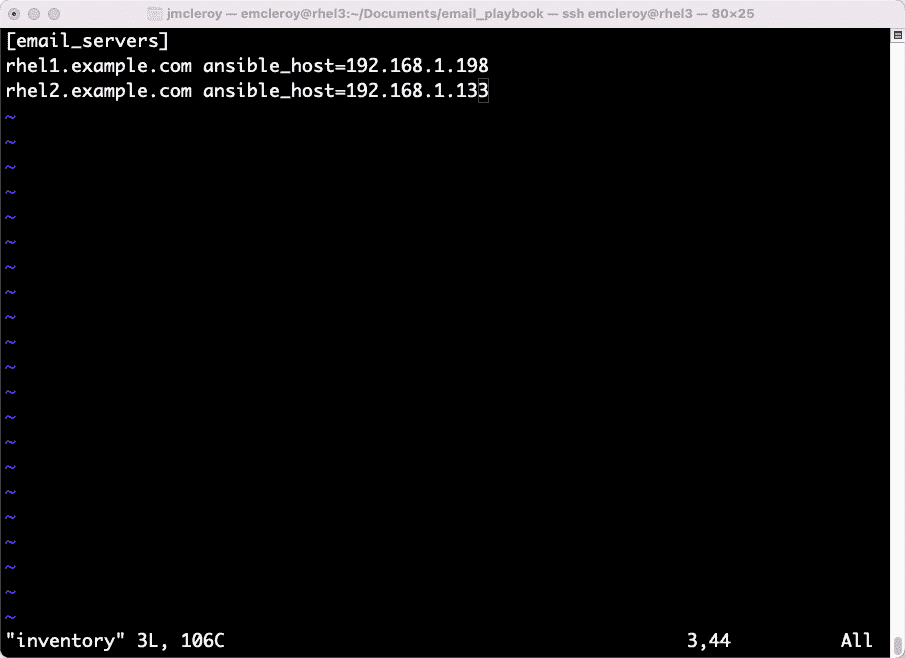
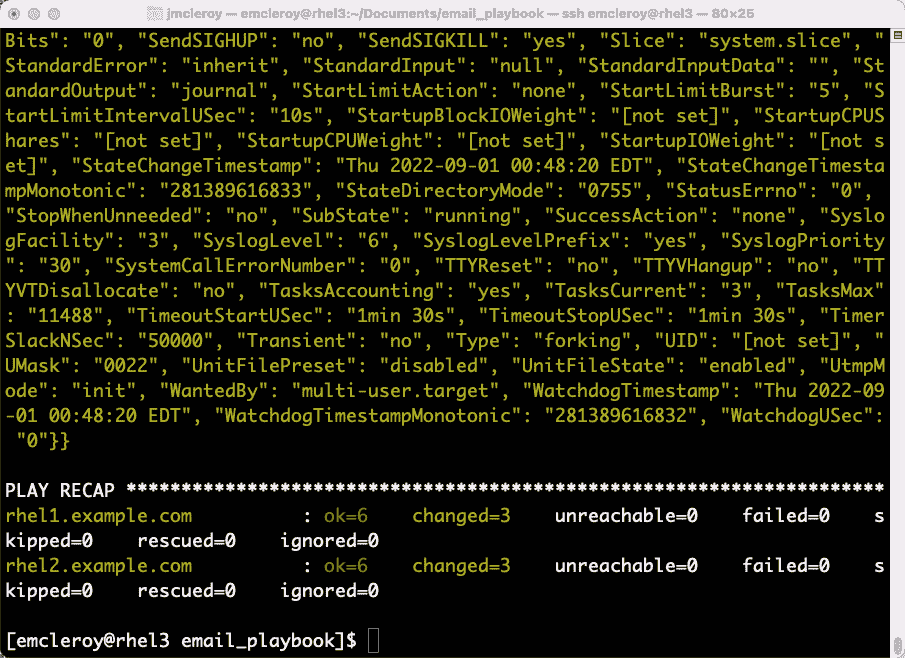

# 第六章：打印机和电子邮件 – 在 Linux 服务器上设置打印机和电子邮件服务

在本章中，我们将设置打印机和电子邮件服务。这些服务对任何公司，无论大小，都是至关重要的。打印文档的能力是许多工作所需的，这可能包括文档和手册。除了打印，我们还将为服务器设置电子邮件服务。这将允许邮件服务器根据我们设置的报告类型或使用电子邮件完成任务的程序（例如，向用户发送警报或提供配置合规性报告）发送报告。通过使用电子邮件服务，我们可以确保在管理系统时没有任何遗漏。

本章将涵盖以下主要内容：

+   了解打印机服务并手动设置它们

+   通过 Ansible 自动化设置打印机服务

+   了解电子邮件服务并手动设置它们

+   通过 Ansible 自动化设置电子邮件服务

# 技术要求

你需要先应用*第一章*中的配置，*块存储 – 了解如何在 Red Hat Enterprise Linux 上配置块存储*，才能进行本章的动手操作部分。相关的示例文件和剧本可以在 GitHub 仓库[`github.com/PacktPublishing/Red-Hat-Certified-Specialist-in-Services-Management-and-Automation-EX358-Exam-Guide/tree/main/Chapter06`](https://github.com/PacktPublishing/Red-Hat-Certified-Specialist-in-Services-Management-and-Automation-EX358-Exam-Guide/tree/main/Chapter06)中找到。

## 设置 GitHub 访问权限

请参考*第一章*中的说明，*块存储 – 了解如何在 Red Hat Enterprise Linux 上配置块存储*，以便访问 GitHub。你可以在[`github.com/PacktPublishing/Red-Hat-Certified-Specialist-in-Services-Management-and-Automation-EX358-/tree/main/ch6`](https://github.com/PacktPublishing/Red-Hat-Certified-Specialist-in-Services-Management-and-Automation-EX358-/tree/main/ch6)找到本章的 Ansible 自动化剧本。请记住，这些只是建议的剧本，它们并不是解决方案唯一的编写方式。

你总是可以使用 raw、shell 或 cmd 来修改它们，以实现相同的结果，但我们旨在展示达成目标的最佳方法。还请记住，我们没有使用将来版本的 Ansible 中要求的 FCQN，因为该功能在考试中不被支持，考试是基于 Ansible 2.9 版本进行的。

# 了解打印机服务并手动设置它们

在许多情况下，系统需要打印能力。这可能是为了输出一些需要在演示中传递的数据，或者是为了打印后续参考的材料。通过打印服务的使用，我们可以设置和配置打印队列，使我们能够做到这一点。我们可以控制打印机何时以及如何打印，以及哪个打印机被设置为默认打印机。掌握了这些知识，你可以在 RHEL 桌面和服务器上设置打印机。在练习的实际操作部分，你需要一个与服务器位于同一网络的网络打印机。

让我们开始吧。首先，我们将安装 `cups` 包，以提供我们需要聚合的依赖项。我们将使用以下截图中的命令来执行此操作：


图 6.1 – 安装 cups 包

通过安装 `cups` 包，我们安装了创建打印队列和直接查询连接到其他服务器或打印服务器的打印机所需的所有包。我们需要启用并启动服务，如以下截图所示：


图 6.2 – 启动和启用 cups 进行打印机设置

接下来，我们将启用防火墙规则以允许 `631/tcp`，这是打印机通常提供服务的端口。我们还启用 mDNS，通过**互联网打印协议**（**IPP**）进行动态发现。所需的命令如下截图所示：


图 6.3 – 添加所需的防火墙规则以发现打印机和打印

设置打印系统的下一步是查找网络打印机。我们将使用 `ippfind` 工具执行此操作，命令如下截图所示：


图 6.4 – 使用 ippfind 工具查找网络打印机

在我们定位到打印机后，我们将选择我们希望目标的打印机并为其创建一个打印队列。这将允许我们将打印任务排队并发送到打印机。这提供了启用和禁用打印机打印功能的能力，同时在打印机离线或禁用时保持打印队列（除非你手动干预或通过 Ansible 自动化）。我们可以通过`lpadmin`命令看到创建的打印队列。（注意`lpadmin`前有一个*L*字母。）我们将使用以下标志：`-p`，`-v`，`-m`，和`-E`。这些的含义如下：`-p queue`名称，`-v device` URL，而`-m everywhere`是 IPP 定义，`-E`用于立即启用打印机队列。请首先确保打印机的 DNS 名称是可路由的，或者将其添加到`/etc/hosts`中以确保可访问性。完整的命令可以在以下截图中看到：


图 6.5 – 配置打印队列

接下来，我们将设置默认打印机，以便当你创建打印任务时，它将发送到正确的打印机。这通常在你有多台打印机时使用，并且需要确保打印到正确的打印机，可能是在大楼中的特定位置，或者因为需要使用某种类型的打印机。设置默认打印机的命令可以在以下截图中看到：


图 6.6 – 设置默认打印机

接下来，我们将创建一个简单的文本文件来进行打印，并测试我们的打印队列是否已正确设置。在我的例子中，文件如下所示：


图 6.7 – 创建一个测试文档进行打印

在我们创建了文本文件进行打印后，我们将实际打印它。这可以通过以下截图中的命令完成：


图 6.8 – 打印测试文档

如果打印机成功打印了你的页面，那么你就可以在`rhel1.example.com`上创建和控制打印任务。

接下来，让我们看看如何禁用和启用打印队列。当你禁用打印机时，它将排队打印任务，而不是将它们发送到打印机。这可以从以下截图中看到：


图 6.9 – 禁用打印机然后尝试打印

然后我们将检查当前的打印队列，并查看它如何因为打印机被禁用而无法前进。之后，我们将取消打印任务，以防在重新启用打印机时它们继续打印。进入主目录并使用以下截图中的命令将显示打印队列并取消打印任务：


图 6.10 – 打印队列显示由于打印机禁用而导致的暂停任务

为确保我们仍然能够打印，接下来我们将重新启用打印队列。这将使任何打印任务都能够发送到我们的默认打印机。这是通过下图所示的命令完成的：


图 6.11 – 清除打印队列后重新启用打印队列

在本节中，我们设置了一个打印队列，使 Linux 设备能够打印到网络打印机。这些信息在你需要创建纸质文档时至关重要。这可能是公司活动的宣传资料或内部会议的文件。能够打印是必需的，而了解如何设置打印队列则使这一能力得以实现。接下来，我们将通过 Ansible 自动化设置打印队列。

# 通过 Ansible 自动化设置打印服务

我们将通过创建一个用于启用 `cups` 打印服务的 playbook 开始本节内容。然后，我们将创建 playbook 来启用和禁用打印队列，并处理任何可能排队等待打印的任务。这将使我们能够通过自动化在多个设备上设置打印机，从而大大缩短完成时间。

首先，我们将从一个 playbook 目录开始，目录内将包含一个清单文件，列出我们希望在其上设置服务的服务器。在我们的例子中，我们将在 `rhel1.example.com` 和 `rhel2.example.com` 上设置打印队列。这将使我们能够展示如何在多个 playbook 中使用 Ansible 自动化。我们将创建一个 `cups_playbook` 目录，并在其中首先创建下图所示的清单文件：


图 6.12 – playbook 的清单文件

接下来，我们将像往常一样开始 playbook，首先创建 playbook 的顶层结构。以下是使用 Ansible 自动化时，所有 playbook 开始时需要的格式。playbook 的开始可以在以下代码中看到：

```
---
- name: Cups printer queue setup
  hosts: cups_servers
  become: true
  become_method: sudo
```

接下来，让我们继续处理任务。这些任务包括安装 `cups`、配置防火墙规则以及设置打印队列。为此，你需要提前知道打印机的 URL，因此你可能需要通过以下代码从服务器上收集该信息：

```
[emcleroy@rhel1 ~]$ ippfind -T 20
ipp://HPE070EA601518.local:631/ipp/print
ipp://EPSON04046D.local:631/ipp/print
ipp://BRW9C305BC2B044.local:631/ipp/print
```

在我的例子中，我将使用在前面代码片段的打印机查找命令输出底部显示的 Brother 打印机。

有了这些信息，我们可以编写出我们之前学到的命令来设置打印队列。你可以在以下代码中看到安装 `cups`、配置防火墙和设置打印队列的任务：

```
  tasks:
    - name: Install cups
      package:
        name: cups
        state: latest
    - name: Start and enable cups service
      service:
        name: cups
        state: started
        enabled: true
    - name: Enable firewall rules
      firewalld:
        service: mdns
        permanent: true
        state: enabled
    - name: Enable firewall rules
      firewalld:
        port: 631/tcp
        permanent: true
        state: enabled
    - name: Reload firewall
      command:
        cmd: firewall-cmd --reload
    - name: Setup print queue
      command:
        cmd: lpadmin -p printer-queue -v ipp://BRW9C305BC2B044.local:631/ipp/print -m everywhere -E
    - name: Set default print queue
      command:
        cmd: lpadmin -d printer-queue
    - name: Test to ensure print queue is setup correctly
      command:
        cmd: lpstat -p printer-queue
```

我们将使用以下命令运行 playbook，并包括`-v`标志以获得详细输出，比如显示打印队列已启用时：

```
[emcleroy@rhel3 cups_playbook]$ ansible-playbook -i inventory cups_playbook.yml -u emcleroy –k –-ask-become -v
```

该 playbook 运行成功后的输出被截断，但你可以在以下截图中看到打印队列被启用的地方：


图 6.13 – cups 创建 playbook 的成功运行

接下来，我们将编写一个 playbook 来禁用打印队列，然后编写另一个 playbook 来启用它。这里你可以看到禁用打印队列的 playbook 代码：

```
---
- name: Cups printer queue setup
  hosts: cups_servers
  become: true
  become_method: sudo
  tasks:
    - name: Disable print queue
      command:
        cmd: cupsdisable printer-queue
```

该 playbook 运行成功后禁用打印队列的输出可以在以下截图中看到：


图 6.14 – cups 禁用 playbook 的成功运行

以下代码中显示的 playbook 启用打印队列：

```
---
- name: Cups printer queue setup
  hosts: cups_servers
  become: true
  become_method: sudo
  tasks:
    - name: Enable print queue
      command:
        cmd: cupsenable printer-queue
```

启用打印队列的输出可以在以下截图中看到：


图 6.15 – cups 启用 playbook 的成功运行

在本节中，我们学习了如何通过 Ansible 自动化设置打印队列。这在企业环境中非常有用，在这种环境中，你可能需要为许多需要打印到同一台打印机的服务器设置打印队列。通过设置 Ansible 自动化 playbook 来完成这项工作，你可以腾出时间来做其他更有意义的工作。

# 了解电子邮件服务并手动设置

电子邮件服务是任何基础设施中不可或缺的一部分。能够将电子邮件报告或警报发送到专用邮件列表是电子邮件如此有用的原因之一。使用`postfix`包，你可以设置完整的邮件中继或空客户端，将邮件转发到其他中继。这使你能够控制邮件在网络中的路由方式。在本节中，我们将看到如何为这些目的设置空客户端。我们将安装`postfix`来控制来自服务器的电子邮件，设置防火墙规则，并最终手动和通过 Ansible 自动化设置空客户端。

我们首先需要做的是安装`postfix`。安装`postfix`的命令可以在以下截图中看到：


图 6.16 – 安装 postfix

然后，我们将查看`postfix`的配置文件。这并不是设置`postfix`的最佳方式，因为`postconf`命令通常用于更改所需的设置。配置文件可以在以下截图中看到，并位于`/etc/postfix/main.cf`：


图 6.17 – Postfix main.cf 截断

使用`postconf`命令，你可以看到相同的配置，但没有注释，如以下截图所示：


图 6.18 – 截断的 postconf 命令输出

接下来，我们将对系统进行必要的更改，以设置`postfix`作为空客户端所需的内容，如下截图所示：


图 6.19 – 使用 postconf 命令更改配置值

这使得你能够根据 Red Hat 在考试中设置的要求，对`postfix`配置进行更改。

让我们来看一个设置空客户端的示例。空客户端只是一个将电子邮件转发到另一个服务器的服务器，自己不接收任何电子邮件。

第一个要更改的设置是`inet_interfaces`，将其设置为`loopback-only`，如以下命令所示：

```
[emcleroy@rhel1 ~]$ sudo postconf -e "inet_interfaces = loopback-only"
[sudo] password for emcleroy:
[emcleroy@rhel1 ~]$ sudo postconf inet_interfaces
inet_interfaces = loopback-only
```

然后，我们将设置`myorigin`参数，使用域名，在我们的例子中是`example.com`，如下代码所示：

```
[emcleroy@rhel1 ~]$ sudo postconf -e "myorigin = example.com"
[emcleroy@rhel1 ~]$ sudo postconf myorigin
myorigin = example.com
```

接下来，我们将`inet_protocols`设置为`ipv4`，纯粹是为了简化，如下代码所示：

```
[emcleroy@rhel1 ~]$ sudo postconf -e "inet_protocols = ipv4"
[emcleroy@rhel1 ~]$ sudo postconf inet_protocols
inet_protocols = ipv4
```

接下来，我们要更改的是`mydestination`参数，因为如果该值被填充，`postfix`会允许投递邮件。为了确保没有任何邮件会在本地投递到此服务器，我们将删除所有设置。我们将把`mydestination`设置为空，如下代码所示：

```
[emcleroy@rhel1 ~]$ sudo postconf -e "mydestination ="
[emcleroy@rhel1 ~]$ sudo postconf mydestination
mydestination =
```

接下来，让我们修改`mynetworks`参数，以便将消息提交到邮件中继供任何网络主机使用。我们将其设置为我们的回环 IP 地址，以便生效，如下代码所示：

```
[emcleroy@rhel1 ~]$ sudo postconf -e "mynetworks = 127.0.0.0/8"
[emcleroy@rhel1 ~]$ sudo postconf mynetworks
mynetworks = 127.0.0.0/8
```

接下来我们要设置的是本地投递的错误消息。这有助于我们确认本地投递已被禁用。通过以下代码实现：

```
[emcleroy@rhel1 ~]$ sudo postconf -e "local_transport = error: no local delivery"
[emcleroy@rhel1 ~]$ sudo postconf local_transport
local_transport = error: no local delivery
```

最后，我们将指向一个能够本地投递电子邮件并发送到公司邮件服务器的活动邮件中继。通过以下代码实现：

```
[emcleroy@rhel1 ~]$ sudo postconf -e "relayhost = [rhel2.example.com]"
[emcleroy@rhel1 ~]$ sudo postconf relayhost
relayhost = [rhel2.example.com]
```

我们现在已经设置好了`postfix`邮件服务。接下来，让我们打开防火墙，启动服务并启用它。以下截图展示了这些命令：


图 6.20 – 启用并启动服务，添加防火墙规则，重新加载防火墙

如果在配置之前启动并启用`postfix`服务，你需要确保重新加载服务，以确保更改已被接受，并检查状态，如下截图所示：


图 6.21 – 检查 postfix 状态

在本节中，我们学习了如何设置空客户端邮件服务器。这对于从服务器发送电子邮件通知、报告或警报非常有用。我们学习了如何使用 `postconf` 命令操作 `postfix`，以及需要更改哪些变量来创建一个空客户端。

# 通过 Ansible 自动化设置邮件服务

我们将使用 Ansible 自动化与一组变量和循环一起设置 `postfix`。这将允许我们创建与手动操作相同的设置，但在这里通过使用循环以迭代方式完成。首先，我们将设置我们的 playbook 目录，然后是我们的清单文件。清单文件如下截图所示：



图 6.22 – 邮件 playbook 的清单

我们将从正常的起始格式开始我们的 playbook，代码如下所示：

```
---
- name: Setup null client email server
  hosts: email_servers
  become: true
  become_method: sudo
```

在我们设置好 playbook 的开头部分后，接下来创建使 playbook 成功配置空客户端所需的任务。我们将使用循环，并对提供给 playbook 的变量进行循环。我们可以在以下代码中看到这个 playbook：

```
  tasks:
    - name: Install postfix
      package:
        name: postfix
        state: latest
    - name: Open firewall rules for postfix
      firewalld:
        service: smtp
        state: enabled
        permanent: true
    - name: Reload firewall
      command:
        cmd: firewall-cmd --reload
    - name: Set configuration settings using a loop
      command:
        cmd: postconf -e "{{ item.name }} = {{ item.value }}"
      loop:
        - { name: 'inet_interfaces', value: 'loopback-only' }
        - { name: 'myorigin', value: 'example.com' }
        - { name: 'inet_protocols', value: 'ipv4' }
        - { name: 'mydestination', value: '' }
        - { name: 'mynetworks', value: '127.0.0.0/8' }
        - { name: 'local_transport', value: 'error: no local delivery' }
        - { name: 'relayhost', value: '[smtp.example.com]' }
    - name: Restart and enable postfix to refresh config
      service:
        name: postfix
        state: restarted
        enabled: true
```

完成后，使用以下命令运行 playbook：

```
[emcleroy@rhel3 email_playbook]$ ansible-playbook -i inventory email_playbook.yml -u emcleroy -k --ask-become -v
```

成功运行 playbook 后的截断输出可以在以下截图中看到：



图 6.23 – 成功的邮件设置 playbook 执行

最后，让我们检查并确认 `mynetworks` 的配置，以确保它仅使用 `127.0.0.0/8`，如以下截图所示：


图 6.24 – 确认在 postfix 配置中更改的设置

在本节中，我们学习了如何使用 Ansible 自动化设置 `postfix` 空客户端。这是一种通过预设值轻松设置邮件服务器的好方法，这些值可以跨多个主机使用。这样，你可以快速设置这些服务器，而无需在每台服务器上单独安装并输入配置命令。

# 小结

在本章中，我们介绍了如何从服务器打印以及如何设置邮件主机以正确地将邮件转发到使用空服务器的中继。这样，你可以将从属系统设置为其他主服务器。通过这些知识，你可以成功地从你的服务器或 Linux 客户端打印，同时发送和接收邮件传输。在下一章中，我们将学习 MariaDB 和可用的 MySQL 命令。数据库是一个强大的工具，可以为 Web 服务器和需要数据库支持的程序创建后台。这将使你能够轻松控制数据点。我们将通过手动操作和 Ansible 自动化来完成此任务，让你在整个职业生涯中设置多个数据库时更加轻松。
