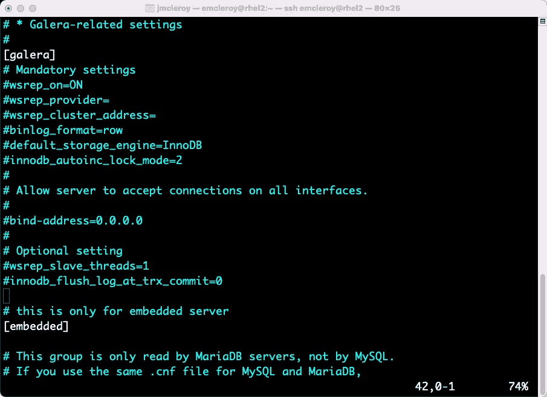

# 第七章：数据库 – 设置和使用 MariaDB SQL 数据库

本章将讨论数据库。在我们的案例中，这将详细介绍 MariaDB 的操作。MariaDB 是一个强大的工具，允许我们存储和访问应用程序以及 Web 服务器使用的数据。有了一个功能完善的数据库支撑你的项目，你将能够通过添加多种可以被这些产品保存和访问的项目，来增强应用程序或 Web 服务器的功能。从购物车到会员信息，所有这些都可以使用 MariaDB 保存。让我们开始了解更多关于数据库和 MariaDB 的内容，特别是针对 Red Hat Enterprise Linux 8.1 的使用。

本章将涉及以下主要内容：

+   开始使用 MariaDB 进行数据收集存储

+   在 RHEL 8 上手动安装和配置 MariaDB

+   使用 Ansible 自动化在 RHEL 8 上安装和配置 MariaDB

# 技术要求

本章的技术要求将在以下子节中介绍。

## 设置 GitHub 访问

请参考 *第一章*《块存储 – 学习如何在 Red Hat Enterprise Linux 上配置块存储》中的说明，以访问 GitHub。你可以在以下链接找到本章的 Ansible 自动化 playbook：[`github.com/PacktPublishing/Red-Hat-Certified-Specialist-in-Services-Management-and-Automation-EX358-Exam-Guide/tree/main/Chapter07`](https://github.com/PacktPublishing/Red-Hat-Certified-Specialist-in-Services-Management-and-Automation-EX358-Exam-Guide/tree/main/Chapter07)。记住，这些是建议的 playbook，并不是你编写它们的唯一方式——你可以根据需要调整 playbook。

你可以始终使用 `raw`、`shell` 或 `cmd` 来实现相同的结果，但我们展示的是完成目标的最佳方式。同时请记住，我们没有使用 FCQN，这是 Ansible 的未来版本所需的，因为该版本将在考试中不被支持，考试内容基于 Ansible 2.9。

# 开始使用 MariaDB 进行数据收集存储

MariaDB 是一个允许对象关系存储的数据库。这使得可以使用 MySQL 命令存储和访问键值对。保存和访问这些信息的能力对于像论坛这样的平台至关重要，在这些平台上，用户名和密码需要关联在一起进行身份验证。例如，我们还在许多场景中使用 MariaDB 进行库存跟踪，适用于大大小小的企业。这些数据库的强大功能是每个公司都依赖的必要条件。

**结构化查询语言** (**SQL**) 是**关系型数据库管理系统** (**RDBMS**) 通常使用的语言，用于控制数据库的配置和访问方式。该系统提供了配置数据库所需的手段，以确保其正常运行，无论是供应用程序还是 Web 服务器使用。你使用关系型数据库的时间越长，你就越能理解它们在商业策略中的重要性。

首先，我们将查看如何手动安装 MariaDB，然后再介绍自动安装和管理这些数据库的方法。

# 手动在 RHEL 8 上安装和配置 MariaDB

首先，我们将开始安装 MariaDB，以便开始使用这个强大的工具包。我们将通过以下截图中的命令查找 MariaDB 包，以获取默认版本和可用的配置文件：


图 7.1 – 服务器包的模块列表，而不是客户端包

如前面的截图所示，我们可以看到 MariaDB 10.3 是默认版本，我们还可以看到服务器配置文件，这是我们要安装的内容。我们将按照以下截图安装 MariaDB 服务器：


图 7.2 – 安装 MariaDB 服务器

然后，我们将启动并启用 MariaDB 服务，如下图所示：


图 7.3 – 启动并启用 MariaDB 服务

然后，我们将打开 MySQL 的端口，如前所述，这是我们与 MariaDB 交互的方式。可以通过以下截图查看打开防火墙规则的过程：


图 7.4 – 打开 MariaDB 的防火墙规则

一旦我们启用了包并启动了 MariaDB 服务，并且防火墙规则已打开，我们就可以开始使用数据库服务器进行数据收集或应用程序备份。

接下来，我们来看一下配置文件中控制网络连接的选项。我们在前几章中已经了解到，控制网络连接对于许多目的来说至关重要。我们将查看 `/etc/my.cnf.d/mariadb-server.cnf` 文件，并特别注意其中的一些项目，首先可以看到该文件的一个示例，见下图：


图 7.5 – 截断的 mariadb-server.cnf 文件

如果你查看与 Galera 相关的设置，你将看到我们需要关注的一些项目，如下图所示：



图 7.6 – mariadb-server.cnf 文件（续）

这里我们可以看到 `bind-address`，我们希望将其移动到 `[mysqld]` 部分。接下来，我们希望添加 `skip-networking=1`，使得仅允许在服务器上进行连接。如果将 `skip-networking` 设置为 `0`，则会监听来自 `localhost` 以外的连接。

对于我们的使用，我们将把绑定地址限制为 IPv4，并通过添加一行代码设置 `skip-networking=1`，以便锁定所有来自服务器外部的连接。这些配置项可以在以下截图中看到：


图 7.7 – 更新后的 mariadb-server.cnf 文件，包含 skip-networking

添加设置后，确保通过以下命令重启 MariaDB 服务：

```
[emcleroy@rhel1 ~]$ sudo systemctl restart mysql
```

接下来，我们将处理数据库中的数据操作。我们将使用 MySQL 工具执行这些操作。首先，我们将通过以下截图所示的命令登录到数据库：


图 7.8 – 第一次登录 mysql 数据库

现在我们将通过运行以下命令来确保 MySQL 数据库的安全：

```
[emcleroy@rhel2 ~]$ sudo mysql_secure_installation
```

该命令移除一些内容，例如测试数据库和匿名用户，并为 root 账户设置密码等。我们可以通过以下截图看到设置的实际操作：


图 7.9 – 安全化 MariaDB 安装

接下来，我们将查看数据库，您会注意到有一些默认的数据库。这些数据库用于处理 MySQL 在 MariaDB 中的运行方式，如下图所示：


图 7.10 – 使用新设置的密码登录并显示数据库

为了使用数据库，我们将使用 `USE` 命令，例如 `USE information_schema;`，以访问和操作该数据库。接下来，我们将使用数据库创建命令，并使用该数据库进行数据操作。我们将创建一个新的人员数据库，并准备好如下面截图所示进行使用：


图 7.11 – 使用人员数据库

之后，我们将检查数据库，看看其中是否有内容。为此，我们将切换到人员数据库。从以下截图中可以看到该数据库当前为空：


图 7.12 – 显示人员数据库中的表为空

在我们创建了数据库之后，我们将使用以下截图中的命令为数据库创建一个表：


图 7.13 – 在人员数据库中创建表

接下来，我们将向姓名和电话号码列中添加信息，以便我们有内容可以进行搜索。我们可以在下图中看到添加到数据库表的命令：


图 7.14 – 在人员数据库的表中创建数据

你也可以使用以下截图中的命令在表中搜索项目：


图 7.15 – 使用已知信息搜索数据库

`SELECT` 命令可以与 `WHERE` 变量一起使用，如以下命令所示，以在数据库中查找特定列：

```
SELECT * FROM users WHERE phone_number = '(901)678-5887';
```

接下来，我们将讨论如何备份数据库。这将允许你恢复最近通过 `mysqldump` 命令备份的信息。更多关于 `mysqldump` 命令的信息可以在手册页中找到，如下图所示：


图 7.16 – mysqldump 手册页

我们将使用以下命令来备份数据库：

```
[emcleroy@rhel2 ~]$ mysqldump -u root -p personnel >/tmp/mariadb.dump
```

该命令执行过程可以在下图中看到：


图 7.17 – 创建人员数据库的备份

接下来，我们将从备份中恢复。我们将使用以下命令选择要恢复的备份文件，并将其恢复到我们的数据库：

```
[emcleroy@rhel2 ~]$ mysql -u root -p personnel < /tmp/mariadb.dump
```

让我们通过删除 `users` 表来测试此操作，如下图所示，然后恢复数据库：


图 7.18 – 删除表并在恢复之前检查它们是否丢失

现在，我们将恢复数据库并显示表已重新创建，如下图所示：


图 7.19 – 恢复数据库并显示表格已恢复

一旦你将这些信息重新加载到数据库中，你可以使用 `show` 命令来收集所需的任何信息。

最后，我们将展示如何控制用户对系统的访问。我们将向数据库中添加具有不同权限的用户。可以使用以下命令来添加这些用户，如下图所示：


图 7.20 – 为数据库创建用户

在之前的截图中，您可以看到我们创建了`danny@localhost`，指定这是一个本地用户，并且使用`identified by`，指的是用户的密码，在我们的案例中是`redhat`。接下来，我们将为`danny`添加权限，以便他可以对人员数据库进行更改。添加权限的命令可以在下面截图中的命令中看到：


图 7.21 – 为新创建的用户设置权限

我们还创建了`jennifer`作为一个用户，并为她提供了修改数据库的权限。这使得`jennifer`能够在人员数据库中插入、删除和选择条目。现在，我们可以使用`jennifer`向数据库中添加条目。

# 使用 Ansible 自动化在 RHEL 8 上安装和配置 MariaDB

我们将从库存文件开始，设置 MariaDB 服务器并配置用户。然后，我们将进入使用循环操作在创建的 MariaDB 系统中添加数据，例如表格和数据库条目。接着，我们将使用 Ansible 自动化展示如何从 MariaDB 数据库中获取信息，以便您可以将数据库中的信息提供给最终用户。请确保运行此剧本的服务器之前未安装过 MariaDB，否则在设置 root 密码时会收到错误信息。

首先，我们将从一个库存文件开始，可以在以下截图中看到：


图 7.22 – Ansible 自动化库存文件

从这里开始，我们将创建`ansible.cfg`文件，放置在我们的目录中，以便跳过`host_key_checking`，因为它会导致连接问题。我们可以在以下截图中看到 Ansible 文件：


图 7.23 – Ansible 自动化 ansible.cfg 文件

在我们有了这些文件后，我们将创建`mariadb_server.yml`的剧本文件并正常启动，代码如下所示：

```
---
- name: MariaDB install and configuration
  hosts: mariadb_servers
  become: true
  become_method: sudo
```

接下来，我们将安装 MariaDB 并设置防火墙规则。安装软件包、启动并启用服务，以及设置防火墙规则的过程可以在以下代码中看到：

```
  tasks:
    - name: Install MariaDB server
      package:
        name: '@mariadb:10.3/server'
        state: present
    - name: Install MariaDB client
      package:
        name: mariadb
        state: latest
    - name: Start and enable MariaDB
      service:
        name: mariadb
        state: started
        enabled: true
    - name: Open firewall rules for MariaDB
      firewalld:
        service: mysql
        permanent: true
        state: enabled
    - name: Reload firewall
      command:
        cmd: firewall-cmd --reload
```

在我们拥有了安装服务器的代码之后，我们将继续对 MariaDB 安装进行安全配置，启用它并开放防火墙规则。我们将从配置 root 密码开始。我们可以看到我们在以下代码中已配置此密码，并使用`no_log: true`标记它，以防止系统在日志文件中输出该信息：

```
    - name: Install PyMySQL
      package:
        name: python3-PyMySQL
        state: present
    - name: Set root password for MariaDB
      mysql_user:
        name: root
        host_all: true
        update_password: always
        password: redhat
      no_log: true
      ignore_errors: true
```

接下来，我们将把一个配置文件复制到 `root`，以便我们可以登录并进行数据库更改，而无需显示用户和密码。我们也可以将这个文件加密，但在我们的案例中，我们只是简单地复制它。该文件可以在以下截图中看到：


图 7.24 – my.cnf 文件提供数据库配置访问权限

以下代码将用于将文件移动到服务器上的需要位置，以便后续与模块一起使用，进行系统的添加和更改：

```
    - name: Copy user and password to home
      copy:
        src: "{{ playbook_dir }}/my.cnf"
        dest: /root/.my.cnf
```

之后，我们将删除匿名用户，以便只有经过认证的用户才能访问数据库。我们可以在以下代码中看到删除匿名用户的过程：

```
    - name: Delete anonymous user
      mysql_user:
        name: ''
        host_all: yes
        state: absent
```

接下来，我们将创建一个名为 `employees` 的数据库。我们将使用循环更新该数据库，以便在数据库中配置多个员工。我们可以在以下代码中看到如何创建数据库和表格，并填充数据：

```
    - name: Add employees database
      mysql_db:
        name: employees
        state: present
        config_file: /root/.my.cnf
```

接下来，我们将创建 `insert.sql` 文件，用于导入所需的数据库项。这可以在以下截图中看到：


图 7.25 – insert.sql 文件将数据导入到员工数据库

创建数据库后，我们将会在数据库中创建一个名为 people 的表格，如以下代码所示，使用 `insert.sql` 文件提供表格和数据的相关信息：

```
    - name: Copy insert.sql file to tmp
      copy:
        src: "{{ playbook_dir }}/insert.sql"
        dest: /tmp/insert.sql
    - name: Import the insert.sql information into the database
      mysql_db:
        name: employees
        state: import
        target: /tmp/insert.sql
        config_file: /root/.my.cnf
```

接下来，我们将为数据库创建一个用户，并为他们提供对新创建数据库的权限。我们可以在以下代码中看到如何创建带有权限的用户：

```
    - name: Add user
      mysql_user:
        name: david
        password: redhat
        update_password: on_create
        state: present
      no_log: true
    - name: Provide user with privileges
      mysql_user:
        name: david
        host: localhost
        priv: 'people.*:INSERT,UPDATE,SELECT'
        state: present
```

现在我们已经设置好了所有内容，接下来我们将运行 playbook。假设你没有设置密钥，我们将使用以下命令再次运行 playbook：

```
[emcleroy@rhel3 mariadb_server]$ ansible-playbook -i inventory mariadb_server.yml -u emcleroy -k --ask-become -v
```

以下截图显示了成功运行的 Ansible Automation playbook：


图 7.26 – playbook 成功运行

在 playbook 成功运行后，你可以看到信息已经添加，如以下截图所示：


图 7.27 – 数据现已填充到系统中

在这一部分中，我们学习了如何自动化安装和配置 MariaDB。有了这些信息，你可以更快速、更自信地成功部署数据库。较低的人为错误门槛使得部署时更加可靠，这个过程可以在几秒钟内完成，而不像手动操作多个数据库那样需要几个小时。这就是使用 Ansible Automation 的一个优势。

# 总结

在这一章中，我们学习了 MariaDB SQL 数据库，以及如何配置和更新它。我们学习了如何自动化数据库，使其能够根据我们需要的信息轻松部署。这使我们能够快速部署数据库，而无需太多人工干预。我们还能够备份数据库并恢复它，这是处理数据库时必须具备的一项重要技能。在下一章中，我们将讨论 Web 服务器，它们在某些情况下使用数据库作为后台。我们将深入讲解如何手动和通过 Ansible 自动化安装和设置这些数据库。期待在下一章与大家一起继续我们的 EX358 考试准备之旅。
